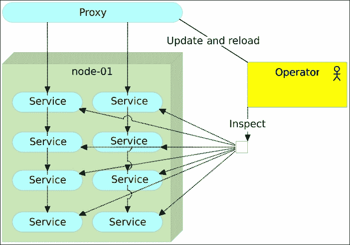

# 第九章：代理服务

我们已经到了需要将我们正在部署的容器连接在一起的阶段。我们需要简化对服务的访问，并统一我们容器部署所在的所有服务器和端口。许多解决方案正在尝试解决这个问题，其中**企业服务总线**（**ESB**）产品是最常见的。然而，这并不是说它们的唯一目标是将请求重定向到目标服务。事实并非如此，这也是我们拒绝将 ESB 作为（我们架构中的一部分）解决方案的原因之一。其方法的显著区别在于，ESB 倾向于做很多（远远超出我们的需求），而我们则试图通过使用非常具体的小型组件或服务来构建系统，这些组件或服务几乎恰好做我们需要的事，不多，也不少。ESB 与微服务相对立，从某种程度上讲，它背离了面向服务架构的初衷。由于我们致力于微服务并寻找更具体的解决方案，因此替代方案就是代理服务。显然，我们应该多花一些时间讨论什么是代理服务，以及哪些产品可能帮助我们实现架构和流程。

*代理服务*是指在执行请求的客户端和提供这些请求的服务之间充当中介的服务。客户端将请求发送到代理服务，代理服务再将该请求转发到目标服务，从而简化并控制架构中服务背后的复杂性。

至少有三种不同类型的代理服务：

+   *网关*或*隧道服务*是一种代理服务，它将请求重定向到目标服务，并将响应返回给发出请求的客户端。

+   *正向代理*用于从不同（主要是互联网）来源检索数据。

+   *反向代理*通常用于控制和保护对私有网络上服务器或服务的访问。除了其主要功能外，反向代理通常还执行负载均衡、解密、缓存和身份验证等任务。

反向代理可能是解决当前问题的最佳方案，因此我们将花更多时间来更好地理解它。

# 反向代理服务

代理服务的主要目的是隐藏其余服务并将请求重定向到最终目的地。响应也是如此。一旦某个服务响应请求，该响应将返回给代理服务，并从代理服务重定向回最初请求的客户端。从目的地服务的角度来看，所有请求都是来自代理的。换句话说，生成请求的客户端不知道代理背后是什么，响应请求的服务也不知道请求来自代理之外。也就是说，客户端和服务只知道代理服务的存在。

我们将集中讨论基于（微）服务架构中的代理服务使用。然而，如果代理服务应用于整个服务器，许多概念也是相同的（只是它会被称为代理服务器）。

代理服务的主要目的之一（除了请求和响应的协调）如下：

+   尽管几乎任何应用服务器都可以提供**加密**（最常见的是**安全套接字层**（**SSL**）），但通常让中间人负责这一过程更为简便。

+   **负载均衡**是指在这种情况下，代理服务在多个相同服务的实例之间平衡负载。在大多数情况下，这些实例会分布在多个服务器上。结合**负载均衡**和**扩展**，特别是在微服务架构的基础上，我们可以快速实现性能提升，避免超时和停机。

+   **压缩**是另一个在单一服务中集中实现的功能候选项。作为代理服务的主要产品在压缩方面非常高效，并且设置相对简单。压缩流量的主要原因是加快加载时间。文件越小，加载速度就越快。

+   **缓存**是代理服务中另一个容易实现的功能，在某些情况下，它的集中化管理是有利的。通过缓存响应，我们可以卸载部分服务需要处理的工作。缓存的核心思想是我们设定规则（例如，缓存与产品列表相关的请求）和缓存超时。之后，代理服务只会第一次向目标服务发送请求，并将响应存储在内部。从那时起，只要请求相同，代理服务就会直接提供响应，而无需将请求转发到目标服务。直到超时发生，流程才会重复。我们还可以采用更复杂的组合方式，但最常见的用法就是我们描述的这种。

+   大多数代理服务作为*单一入口点*服务公开的公共 API。仅此一点就增加了**安全性**。在大多数情况下，只有端口`80`（`HTTP`）和`443`（`HTTPS`）会对外公开，所有其他服务所需的端口应仅对内部使用开放。

+   不同类型的身份验证（例如 OAuth）可以通过代理服务实现。当请求没有用户身份时，代理服务可以设置为返回适当的响应码给调用者。另一方面，当身份信息存在时，代理可以选择继续访问目标，并将身份验证交由目标服务处理，或者由代理自行处理。当然，许多不同的变体可以用来实现身份验证。关键要注意的是，如果使用了代理，它很可能会在这个过程中以某种方式参与其中。

这份清单绝不是详尽无遗的，也不是最终的，但包含了一些最常见的使用案例。许多其他组合也可能存在，包括合法和非法的用途。例如，代理是任何想要保持匿名的黑客不可或缺的工具。

在本书中，我们将主要关注代理服务的基本功能；我们将使用代理服务作为代理。它们将负责所有微服务之间流量的调度，这些微服务将被部署。我们从部署中使用的简单用法开始，逐步推进到更复杂的调度方式，即*蓝绿部署*。

对某些人来说，代理服务可能偏离了微服务的思路，因为它（通常情况下）可以做多件事。然而，从功能角度看，它只有一个单一的目的。它提供了外部世界与我们内部托管的所有服务之间的桥梁。同时，它往往资源占用非常低，只需要几个配置文件即可处理。

在掌握了代理服务的基本概念后，现在是时候了解我们可以使用的一些产品了。

从现在开始，我们将*反向代理*简化为*代理*。

## 代理服务如何帮助我们的项目？

到目前为止，我们已经成功地实现了一种控制方式来部署我们的服务。由于我们尝试实现的部署性质，这些服务应该部署在我们事先无法确定的端口和可能是服务器上。灵活性是可扩展架构、容错能力以及我们将进一步探讨的许多其他概念的关键。然而，这种灵活性是有代价的。我们可能无法提前知道服务将部署在哪些地方，或者它们暴露了哪些端口。即使这些信息在部署之前可以获得，我们也不应该强迫我们的服务用户在发送请求时指定不同的端口和 IP。解决方案是将来自第三方和内部服务的所有通信集中到一个单一的点。负责重定向请求的唯一地方将是一个代理服务。我们将探讨一些可用的工具，并比较它们的优缺点。

和之前一样，我们将从创建虚拟机开始，利用这些虚拟机来实验不同的代理服务。我们将重新创建 `cd` 节点，并用它来为 `proxy` 服务器配置不同的代理服务。

```
vagrant up cd proxy

```

我们将探索的第一个工具是 `nginx`。

## nginx

nginx（引擎 x）是一个 HTTP 和反向代理服务器，一个邮件代理服务器，以及一个通用的 TCP 代理服务器。它最初由 Igor Sysoev 编写。最初，它为许多俄罗斯网站提供服务。从那时起，它成为了世界上一些访问量最大的网站的首选服务器（Netflix、Wordpress 和 FastMail 只是其中的一些例子）。根据 Netcraft 的数据，nginx 在 2015 年 9 月服务或代理了约 23% 的最繁忙网站。这使得它仅次于 Apache。虽然 Netcraft 提供的数据可能值得怀疑，但显然 nginx 非常受欢迎，可能在 Apache 和 IIS 之后位居第三。由于我们到目前为止所做的工作都是基于 Linux，因此 Microsoft IIS 应该被排除在外。这使得 Apache 成为我们选择代理服务的有效候选者。合理的推测是，这两者应该进行比较。

Apache 已经存在多年，并建立了庞大的用户基础。它的巨大受欢迎程度部分得益于 Tomcat，后者运行在 Apache 之上，是目前最受欢迎的应用服务器之一。Tomcat 只是 Apache 灵活性的众多例子之一。通过其模块，Apache 可以扩展以处理几乎任何编程语言。

最受欢迎并不一定意味着是最好的选择。由于设计缺陷，Apache 在重负载下可能会变得极为缓慢。它会生成新的进程，这些进程又会消耗大量的内存。此外，它会为每个请求创建新的线程，导致这些线程竞争 CPU 和内存的访问权限。最后，如果它达到可配置的进程限制，它将拒绝新的连接。Apache 并不是为了作为代理服务而设计的。这个功能实际上是事后才加入的。

nginx 是为了解决 Apache 的一些问题而创建的，尤其是 C10K 问题。当时，C10K 对于 Web 服务器来说是一个挑战，要求能够处理一万个并发连接。nginx 于 2004 年发布，并达成了这一目标。与 Apache 不同，nginx 的架构基于异步、非阻塞、事件驱动架构。不仅如此，它在处理并发请求的数量上超过了 Apache，而且它的资源使用率也低得多。它是在 Apache 之后诞生的，从零开始设计，解决了并发问题。我们得到了一个能够处理更多请求、成本更低的服务器。

nginx 的缺点是它是为提供静态内容而设计的。如果你需要一个能够提供由 Java、PHP 及其他动态语言生成的内容的服务器，Apache 是更好的选择。在我们的情况下，这个缺点几乎不重要，因为我们只需要一个能够进行负载均衡和一些其他功能的代理服务。我们不会通过代理直接提供任何内容（无论是静态的还是动态的），而是将请求重定向到专门的服务。

总的来说，虽然在其他场景中 Apache 可能是一个不错的选择，但对于我们要完成的任务，nginx 显然是更好的选择。如果它的唯一任务是充当代理和负载均衡器，它的性能将远超 Apache。它的内存消耗非常少，并且能够处理大量的并发请求。至少，在我们考虑其他代理竞选者之前，这是我们的结论。

### 配置 nginx

在我们配置 nginx 代理服务之前，先快速浏览一下我们即将运行的 Ansible 文件。nginx.yml playbook 类似于我们之前使用的文件。我们将运行之前已经运行过的角色，并加上 nginx 角色：

```
- hosts: proxy
 remote_user: vagrant
 serial: 1
 sudo: yes
 roles:
 - common
 - docker
 - docker-compose
 - consul
 - registrator
 - consul-
```

`oles/nginx/tasks/main.yml`角色也没有包含什么特别的内容：

```
- name: Directories are present
  file:
    dest: "{{ item }}"
    state: directory
  with_items: directories
  tags: [nginx]
- name: Container is running
  docker:
    image: nginx
    name: nginx
    state: running
    ports: "{{ ports }}"
    volumes: "{{ volumes }}"
  tags: [nginx]
- name: Files are present
  copy:
    src: "{{ item.src }}"
    dest: "{{ item.dest }}"
  with_items: files
  register: result
  tags: [nginx]
- name: Container is reloaded
  shell: docker kill -s HUP nginx
  when: result|changed
  tags: [nginx]
- name: Info is sent to Consul
  uri:
    url: http://localhost:8500/v1/kv/proxy/ip
    method: PUT
    body: "{{ ip }}"
  ignore_errors: yes
  tags: [nginx]
```

我们创建了几个目录，确保 nginx 容器正在运行，传送了一些文件，并且如果它们有变动，则重新加载 nginx。最后，我们将 nginx 的 IP 地址写入 Consul，以备后用。需要注意的唯一重要事项是 nginx 的配置文件`roles` `/nginx/files/services.conf`：

```
log_format upstreamlog
    '$remote_addr - $remote_user [$time_local] '
    '"$request" $status $bytes_sent '
    '"$http_referer" "$http_user_agent" "$gzip_ratio" '
    '$upstream_addr';
server {
  listen 80;
  server_name _;
  access_log /var/log/nginx/access.log upstreamlog;
  include includes/*.conf;
}
include upstreams/*.conf;
```

目前，你可以忽略日志格式，并跳到`server`规格说明。我们指定 nginx 应该`监听`标准 HTTP 端口`80`，并接受发送到任何服务器的请求（`server_name _`）。接下来是`include`语句。通过使用 include，我们可以为每个服务单独添加配置，而不是将所有配置集中在一个地方。这样，我们可以专注于一次配置一个服务，并确保我们部署的服务配置正确。稍后，我们将更深入地探讨这些 includes 中包含的不同类型的配置。

让我们运行 nginx playbook 并开始*玩*它。我们将进入`cd`节点并执行该 playbook，它将配置`proxy`节点：

```
vagrant ssh cd
ansible-playbook /vagrant/ansible/nginx.yml \
 -i /v
agrant/ansible/hosts/proxy

```

### 没有代理的生活

在我们看到 nginx 正在工作之前，回顾一下没有代理服务时我们所面临的困难可能是值得的。我们将通过运行`books-ms`应用程序来开始：

```
wget https://raw.githubusercontent.com/vfarcic\/books-ms/master/docker-compose.yml
export DOCKER_HOST=tcp://proxy:2375
docker-compose up -d app
docker-compose ps
curl http://proxy/api/v1/books

```

上一条命令的输出如下：

```
<html>
<head><title>404 Not Found</title></head>
<body bgcolor="white">
<center><h1>404 Not Found</h1></center>
<hr><center>nginx/1.9.9</center>
</body>
</html>
```

尽管我们使用`docker-compose`运行应用程序，并通过执行`docker-compose ps`确认它在`proxy`节点上运行，但通过`curl`我们发现服务无法在标准 HTTP 端口 80 上访问（通过 nginx 返回了`404 Not Found`消息）。这一结果是可以预期的，因为我们的服务运行在一个随机端口上。即使我们指定了端口（我们已经讨论过这样做是一个坏主意），也不能指望用户记住每个单独部署的服务的不同端口。而且，我们已经通过 Consul 实现了服务发现：

```
curl http://10.100.193.200:8500/v1/catalog/service/books-ms | jq '.'

```

上一条命令的输出如下：

```
[
  {
    "ModifyIndex": 42,
    "CreateIndex": 42,
    "Node": "proxy",
    "Address": "10.100.193.200",
    "ServiceID": "proxy:vagrant_app_1:8080",
    "ServiceName": "books-ms",
    "ServiceTags": [],
    "ServiceAddress": "10.100.193.200",
    "ServicePort": 32768,
    "ServiceEnableTagOverride": false
  }
]
```

我们还可以通过检查容器来获取端口：

```
PORT=$(docker inspect \
 --format='{{(index (index .NetworkSettings.Ports "8080/tcp") 0).HostPort}}' \
 vagrant_app_1)
echo $PORT
curl http://proxy:$PORT/api/v1/books | jq '.'

```

我们检查了容器，应用格式化操作以仅获取服务的端口，并将该信息存储在`PORT`变量中。之后，我们使用该变量向服务发出正确的请求。正如预期的那样，这次结果是正确的。由于没有数据，服务返回了一个空的 JSON 数组（这次没有出现 404 错误）。

尽管这次操作成功了，但对我们的用户来说，这样的方式是不可接受的。我们不能仅仅给他们访问服务器的权限，让他们查询 Consul 或检查容器以获取所需的信息。没有代理，服务是无法访问的。它们虽然在运行，但没人能使用它们：


图 9-1 – 没有代理的服务

现在我们已经感受到没有代理时用户会遇到的痛苦，接下来让我们正确配置 nginx。我们将从手动配置开始，然后逐步过渡到自动化配置。

### 手动配置 nginx

你还记得 nginx 配置中的第一个`includes`语句吗？让我们使用它。我们已经有了`PORT`变量，接下来我们要做的就是确保所有进入 nginx 端口`80`并以`/api/v1/books`地址开头的请求被重定向到正确的端口。我们可以通过运行以下命令来实现：

```
echo "
location /api/v1/books {
 proxy_pass http://10.100.193.200:$PORT/api/v1/books;
}
" | tee books-ms.conf
scp books-ms.conf \
 proxy:/data/nginx/includes/books-ms.conf # pass: vagrant
docker kill -s HUP nginx

```

我们创建了`books-ms.conf`文件，该文件将所有对`/api/v1/books`的请求代理到正确的 IP 和端口。`location`语句会匹配所有以`/api/v1/books`开头的请求，并将其代理到运行在指定 IP 和端口上的相同地址。虽然 IP 并不是必须的，但使用它是一种好习惯，因为在大多数情况下，代理服务会运行在单独的服务器上。接下来，我们使用**安全复制**（**scp**）将该文件传输到`proxy`节点的`/data/nginx/includes/`目录中。配置文件复制完成后，我们只需使用`kill -s HUP`命令重新加载 nginx：

让我们看看我们刚才所做的更改是否正确生效：

```
curl -H 'Content-Type: application/json' -X PUT -d \
 "{\"_id\": 1,
 \"title\": \"My First Book\",
 \"author\": \"John Doe\",
 \"description\": \"Not a very good book\"}" \
 http://proxy/api/v1/books | jq '.'
curl http://proxy/api/v1/books | jq '.'

```

我们成功地进行了一个 `PUT` 请求，将一本书插入数据库，并查询了返回相同书籍的服务。最后，我们可以在不担心端口问题的情况下发起请求。

我们的问题解决了吗？仅部分解决。我们仍然需要找到一种方法，使这些 nginx 配置的更新自动化。毕竟，如果我们将频繁部署微服务，我们不能依赖人工操作员持续监控部署并进行配置更新：



图 9-2 – 使用手动代理的服务

### 自动配置 nginx

我们已经讨论过服务发现工具，之前运行的 nginx 剧本确保 Consul、Registrator 和 Consul Template 在 *代理* 节点上得到了正确配置。这意味着 Registrator 检测到了我们运行的服务容器，并将该信息存储到了 Consul 注册表中。剩下的就是创建一个模板，将其传递给 Consul Template，后者将输出配置文件并重新加载 nginx。

让我们让情况变得更复杂一些，通过运行两个实例来扩展我们的服务。使用 Docker Compose 进行扩展相对简单：

```
docker-compose scale app=2
docker-compose ps

```

后一个命令的输出如下：

```
 Name               Command          State            Ports
-----------------------------------------------------------------------
vagrant_app_1   /run.sh                 Up      0.0.0.0:32768->8080/tcp
vagrant_app_2   /run.sh                 Up      0.0.0.0:32769->8080/tcp
vagrant_db_1    /entrypoint.sh mongod   Up      27017/tcp

```

我们可以观察到，我们的服务有两个实例，分别使用不同的随机端口。对于 nginx 来说，这意味着几件事，其中最重要的一点是我们不能像以前那样进行代理。运行两个实例并将所有请求仅重定向到其中一个实例是没有意义的。我们需要将代理与 *负载* *均衡* 结合起来。

我们不会深入探讨所有可能的负载均衡技术。相反，我们将使用最简单的技术——*轮询*，它是 nginx 默认使用的。轮询意味着代理将均等地分配请求到所有服务之间。如前所述，项目中密切相关的内容应该与代码一起存储在仓库中，nginx 配置文件和模板也不应例外。看一下 `nginx-includes.conf` 配置文件：

```
location /api/v1/books {
 proxy_pass http://books-ms/api/v1/books;
 proxy_next_upstream error timeout invalid_header http_500;
}

```

这次，我们不是指定 IP 和端口，而是使用 `books_ms`。显然，这个域名并不存在。它是我们告诉 nginx 将所有来自该位置的请求代理到上游的一种方式。此外，我们还添加了 `proxy_next_upstream` 指令。如果服务响应返回错误、超时、无效的头部或错误 500，nginx 将转发请求到下一个上游连接。

这时我们可以开始使用主配置文件中的第二个包含语句。然而，由于我们不知道服务将使用的 IP 和端口，上游就是 Consul Template 文件 `nginx-upstreams.ctmpl`：

```
upstream books-ms {
 {{range service "books-ms" "any"}}
 server {{.Address}}:{{.Port}};
 {{end}}
}

```

这意味着我们设置的上游请求 `books-ms` 会在该服务的所有实例之间进行负载均衡，并且数据将从 Consul 中获取。我们运行 Consul Template 后就能看到结果。

首先，下载我们刚刚讨论的两个文件：

```
wget http://raw.githubusercontent.com/vfarcic\
/books-ms/master/nginx-includes.conf
wget http://raw.githubusercontent.com/vfarcic\
/books-ms/master/nginx-upstreams.ctmpl

```

现在，代理配置和上游模板已经放置在`cd`服务器上，我们应该运行 Consul 模板：

```
consul-template \
 -consul proxy:8500 \
 -template "nginx-upstreams.ctmpl:nginx-upstreams.conf" \
 -once
cat nginx-upstreams.conf

```

Consul 模板将下载的模板作为输入，并创建了`books-ms.conf`上游配置。第二个命令的输出应该类似于以下内容：

```
upstream books-ms {
 server 10.100.193.200:32768;
 server 10.100.193.200:32769;
}

```

由于我们运行的是两个相同服务的实例，Consul 模板获取了它们的 IP 和端口，并将其放入我们在`books-ms.ctmpl`模板中指定的格式。

请注意，我们本可以将第三个参数传递给 Consul 模板，它会运行我们指定的任何命令。我们将在本书后续章节中使用它。

现在所有配置文件已经创建完成，我们应该将它们复制到`proxy`节点并重新加载 nginx：

```
scp nginx-includes.conf \
 proxy:/data/nginx/includes/books-ms.conf # Pass: vagrant
scp nginx-upstreams.conf \
 proxy:/data/nginx/upstreams/books-ms.conf # Pass: vagrant
docker kill -s HUP nginx

```

剩下的就是再次确认代理是否正常工作，并且在这两个实例之间正确地负载均衡请求：

```
curl http://proxy/api/v1/books | jq '.'
curl http://proxy/api/v1/books | jq '.'
curl http://proxy/api/v1/books | jq '.'
curl http://proxy/api/v1/books | jq '.'
docker logs nginx

```

在进行了四次请求后，我们输出了 nginx 日志，日志应该如下所示（时间戳已去除以简化显示）。

```
"GET /api/v1/books HTTP/1.1" 200 268 "-" "curl/7.35.0" "-" 10.100.193.200:32768
"GET /api/v1/books HTTP/1.1" 200 268 "-" "curl/7.35.0" "-" 10.100.193.200:32769
"GET /api/v1/books HTTP/1.1" 200 268 "-" "curl/7.35.0" "-" 10.100.193.200:32768
"GET /api/v1/books HTTP/1.1" 200 268 "-" "curl/7.35.0" "-" 10.100.193.200:32769

```

虽然端口在你的情况下可能不同，但显然第一个请求被发送到了端口`32768`，接下来的请求发送到`32769`，然后又回到`32768`，最后又发送到`32769`。这是成功的，nginx 不仅充当了代理，还在我们部署的所有服务实例之间进行了负载均衡：


图 9-3 – 使用 Consul 模板自动配置代理的服务

我们仍然没有测试使用`proxy_next_upstream`指令设置的错误处理。让我们移除一个服务实例，并确认 nginx 是否正确处理故障：

```
docker stop vagrant_app_2
curl http://proxy/api/v1/books | jq '.'
curl http://proxy/api/v1/books | jq '.'
curl http://proxy/api/v1/books | jq '.'
curl http://proxy/api/v1/books | jq '.'

```

我们停止了一个服务实例并进行了几次请求。如果没有*proxy_next_upstream*指令，nginx 会在每第二个请求时失败，因为设置为上游的两个服务之一已经无法工作了。然而，所有四次请求都正确地处理了。我们可以通过查看 nginx 日志来观察它的行为：

```
docker logs nginx

```

输出应该类似于以下内容（时间戳已去除以简化显示）：

```
"GET /api/v1/books HTTP/1.1" 200 268 "-" "curl/7.35.0" "-" 10.100.193.200:32768
[error] 12#12: *98 connect() failed (111: Connection refused) while connecting to upstream, client: 172.17.42.1, server: _, request: "GET /api/v1/books HTTP/1.1", upstream: "http://10.100.193.200:32769/api/v1/books", host: "localhost"
[warn] 12#12: *98 upstream server temporarily disabled while connecting to upstream, client: 172.17.42.1, server: _, request: "GET /api/v1/books HTTP/1.1", upstream: "http://10.100.193.200:32768/api/v1/books", host: "localhost"
"GET /api/v1/books HTTP/1.1" 200 268 "-" "curl/7.35.0" "-" 10.100.193.200:32768, 10.100.193.200:32768
"GET /api/v1/books HTTP/1.1" 200 268 "-" "curl/7.35.0" "-" 10.100.193.200:32768
"GET /api/v1/books HTTP/1.1" 200 268 "-" "curl/7.35.0" "-" 10.100.193.200:32768

```

第一个请求被发送到了由仍在运行的实例提供服务的端口`32768`。正如预期，nginx 将第二个请求发送到了端口`32768`。由于响应是`111`（连接被拒绝），它决定暂时禁用这个上游，并尝试下一个上游。之后，所有的请求都被代理到端口`32768`。

只需在配置文件中添加几行，我们就成功设置了代理，并将其与负载均衡和故障转移策略结合起来。稍后，当我们进入探讨*自愈系统*的章节时，我们将进一步深入，确保代理不仅仅与运行中的服务工作，还会恢复整个系统到健康状态。

当 nginx 与服务发现工具结合使用时，我们有了一个优秀的解决方案。然而，我们不应使用第一个遇到的工具，因此我们会评估更多的选项。让我们停止 nginx 容器，看看*HAProxy*的表现：

```
docker stop nginx

```

## HAProxy

与 nginx 一样，HAProxy 是一个免费的、非常快速和可靠的解决方案，提供高可用性、负载均衡和代理功能。它特别适合高流量网站，并为世界上许多最受欢迎的网站提供服务。

我们稍后会讨论所有代理解决方案的比较时的差异。目前，只需说明 HAProxy 是一个优秀的解决方案，可能是 nginx 最好的替代品。

我们将从实际操作开始，并尝试使用 HAProxy 实现与 nginx 相同的行为。在为 *proxy* 节点配置 HAProxy 之前，让我们快速查看 Ansible 角色 haproxy 中的任务：

```
- name: Directories are present
 file:
 dest: "{{ item }}"
 state: directory
 with_items: directories
 tags: [haproxy]
- name: Files are present
 copy:
 src: "{{ item.src }}"
 dest: "{{ item.dest }}"
 with_items: files
 register: result
 tags: [haproxy]
- name: Container is running
 docker:
 image: million12/haproxy
 name: haproxy
 state: running
 ports: "{{ ports }}"
 volumes: /data/haproxy/config/:/etc/haproxy/
 tags: [haproxy]

```

*haproxy* 角色与我们为 nginx 使用的非常相似。我们创建了一些目录并复制了一些文件（稍后我们会看到它们）。需要注意的主要一点是，与我们没有构建的其他大多数容器不同，我们没有使用官方的 *haproxy* 容器。主要原因是官方镜像没有办法重新加载 HAProxy 配置。每次更新 HAProxy 配置时，我们都需要重启容器，而这会导致停机时间。由于我们的目标之一是实现零停机，因此重启容器并不是一个可选方案。因此，我们不得不寻找替代方案，用户 *million12* 恰好提供了我们所需要的。`million12/haproxy` 容器自带 *inotify*（*inode notify*）。它是一个 Linux 内核子系统，作用是扩展文件系统以检测变化并将其报告给应用程序。在我们的案例中，每当我们更改 HAProxy 配置时，inotify 会重新加载 HAProxy：

让我们继续在代理节点上配置 HAProxy：

```
ansible-playbook /vagrant/ansible/haprox
y.yml \
 -i /vagrant/ansible/hosts/proxy

```

### 手动配置 HAProxy

我们首先检查 HAProxy 是否在运行：

```
export DOCKER_HOST=tcp://proxy:2375
docker ps -a
docker logs haproxy

```

`docker ps` 命令显示 *haproxy* 容器的状态为 `Exited`，日志输出类似于以下内容：

```
[2015-10-16 08:55:40] /usr/local/sbin/haproxy -f /etc/haproxy/haproxy.cfg -D -p /var/run/haproxy.pid
[2015-10-16 08:55:40] Current HAProxy config /etc/haproxy/haproxy.cfg:
====================================================================================================
cat: /etc/haproxy/haproxy.cfg: No such file or directory
====================================================================================================
[ALERT] 288/085540 (9) : Could not open configuration file /etc/haproxy/haproxy.cfg : No such file or directory
[ALERT] 288/085540 (10) : Could not open configuration file /etc/haproxy/haproxy.cfg : No such file or directory

```

HAProxy 报告没有 `haproxy.cfg` 配置文件，进程停止了。实际上，问题出在我们运行的 playbook 上。我们创建的唯一文件是 *haproxy.cfg.orig*（稍后会详细介绍），而没有 `haproxy.cfg` 文件。与 nginx 不同，HAProxy 不能在没有至少一个代理设置的情况下运行。我们很快就会设置第一个代理，但目前我们还没有。由于在没有任何代理的情况下创建配置是浪费时间（HAProxy 无论如何都会失败），而在第一次配置节点时我们也无法提供一个代理，因为到那个时候没有服务在运行，我们因此跳过了 *haproxy.cfg* 的创建。

在继续配置第一个代理之前，让我们先提到另一个可能会使过程复杂化的差异。与 nginx 不同，HAProxy 不允许使用 include。完整的配置需要在一个文件中。这将带来一些问题，因为我们的目标是仅添加或修改我们正在部署的服务的配置，忽略系统的其他部分。不过，我们可以通过将配置的部分内容创建为独立的文件，并在每次部署新容器时将它们连接起来，从而模拟 include。正因如此，我们在配置过程中复制了 `haproxy.cfg.orig` 文件。随时可以查看它。我们不会详细说明，因为它主要包含默认设置，并且 HAProxy 有一份不错的文档供你查阅。需要注意的重要一点是，`haproxy.cfg.orig` 文件包含的是没有设置任何代理的配置。

我们将以与之前类似的方式创建与我们运行的服务相关的 HAProxy 配置：

```
PORT=$(docker inspect \
 --format='{{(index (index .NetworkSettings.Ports "8080/tcp") 0).HostPort}}' \
 vagrant_app_1)
echo $PORTecho "
frontend books-ms-fe
 bind *:80
 option http-server-close
 acl url_books-ms path_beg /api/v1/books
 use_backend books-ms-be if url_books-ms
backend books-ms-be
 server books-ms-1 10.100.193.200:$PORT check
" | tee books-ms.service.cfg

```

我们首先检查了 `vagrant_app_1` 容器，以便将当前端口分配给 `PORT` 变量，并使用它来创建 `books-ms.service.cfg` 文件。

虽然 HAProxy 与 nginx 使用的名称不同，但其逻辑是类似的。*frontend* 定义了如何将请求转发到 *backends*。某种程度上，*frontend* 类似于 nginx 的 *location* 指令，*backend* 则类似于 `upstream`。我们所做的可以转化为以下配置。定义一个名为 `books-ms-fe` 的 frontend，将其绑定到端口 `80`，每当请求的路径以 `/api/v1/books` 开头时，使用名为 `books-ms-be` 的 backend。当前，backend `books-ms-be` 只定义了一个服务器，IP 为 `10.100.193.200`，端口由 Docker 分配。`check` 参数（或多或少）与 nginx 中的含义相同，用于跳过对不健康服务的代理。

现在我们已经有了 `haproxy.cfg.orig` 文件中的通用设置以及针对我们正在部署的服务的特定设置（以 `.service.cfg` 扩展名命名），我们可以将它们连接成一个单一的 `haproxy.cfg` 配置文件，并将其复制到 `proxy` 节点：

```
cat /vagrant/ansible/roles/haproxy/files/haproxy.cfg.orig \
 *.service.cfg | tee haproxy.cfg
scp haproxy.cfg proxy:/data/haproxy/config/haproxy.cfg

```

由于容器没有运行，我们需要启动它（再次），然后可以通过查询服务来检查代理是否正常工作：

```
curl http://proxy/api/v1/books | jq '.'
docker start haproxy
docker logs haproxy
curl http://proxy/api/v1/books | jq '.'

```

第一个请求返回了 `Connection refused` 错误。我们利用这个错误确认没有代理在运行。然后我们启动了 `haproxy` 容器，并通过容器日志看到我们创建的配置文件是有效的，确实被代理服务使用了。最后，我们再次发送请求，这次返回了有效的响应。

到目前为止，一切顺利。我们可以继续并使用 Consult Template 来自动化这一过程。

### 自动配置 HAProxy

我们将尝试执行与之前在 nginx 上所做的相同或非常相似的步骤。这样，你可以更容易地比较这两个工具。

我们将从扩展服务开始：

```
docker-compose scale 
compose ps

```

接下来我们应该从代码仓库中下载`haproxy.ctmpl`模板。在我们操作之前，让我们快速查看一下它的内容：

```
frontend books-ms-fe
 bind *:80
 option http-server-close
 acl url_books-ms path_beg /api/v1/books
 use_backend books-ms-be if url_books-ms
backend books-ms-be
 {{range service "books-ms" "any"}}
 server {{.Node}}_{{.Port}} {{.Address}}:{{.Port}} check
 {{end}}

```

我们创建模板的方式遵循了与 nginx 相同的模式。唯一的不同是，HAProxy 需要每个服务器都有唯一标识，因此我们添加了服务`Node`和`Port`，作为服务器 ID。

让我们下载模板并通过 Consul Template 运行它：

```
wget http://raw.githubusercontent.com/vfarcic\
/books-ms/master/haproxy.ctmpl \
 -O haproxy.ctmpl
sudo consul-template \
 -consul proxy:8500 \
 -template "haproxy.ctmpl:books-ms.service.cfg" \
 -once
cat books-ms.service.cfg

```

我们使用`wget`下载了模板，并运行了`consul-template`命令。

让我们将所有文件连接成 haproxy.cfg，复制到`proxy`节点，并查看`haproxy`日志：

```
cat /vagrant/ansible/roles/haproxy/files/haproxy.cfg.orig \
 *.service.cfg | tee haproxy.cfg
scp haproxy.cfg proxy:/data/haproxy/config/haproxy.cfg
docker logs haproxy
curl http://proxy/api/v1/books | jq '.'

```

剩下的就是仔细检查负载均衡是否在两个实例下正常工作：

```
curl http://proxy/api/v1/books | jq '.'
curl http://proxy/api/v1/books | jq '.'
curl http://proxy/api/v1/books | jq '.'
curl http://proxy/api/v1/books | jq '.'

```

不幸的是，HAProxy 无法将日志输出到 stdout（Docker 容器首选的日志输出方式），因此我们无法确认负载均衡是否正常工作。我们可以将日志输出到 syslog，但这超出了本章的讨论范围。

我们仍然没有测试我们通过`backend`指令设置的错误处理。让我们移除一个服务实例，并确认 HAProxy 是否能正确处理故障：

```
docker stop vagrant_app_1
curl http://proxy/api/v1/books | jq '.'
curl http://proxy/api/v1/books | jq '.'
curl http://proxy/api/v1/books | jq '.'
curl http://proxy/api/v1/books | jq '.'

```

我们停止了一个服务实例，并进行了几次请求，所有请求都正常工作。

由于无法将文件包含到 HAProxy 配置中，我们的工作稍微复杂了一些。无法将日志输出到 stdout 的问题可以通过 syslog 解决，但这会偏离容器最佳实践之一。HAProxy 这种行为是有原因的。日志输出到 stdout 会拖慢它的速度（只有在大量请求时才会明显）。然而，如果可以将此作为我们的选择，甚至作为默认行为，而不是完全不支持，可能会更好。最后，无法使用官方的 HAProxy 容器可能被认为是一个小小的不便。这些问题并不重大。我们解决了缺少 includes 的问题，可以将日志输出到 syslog，并最终使用了来自`million12/haproxy`的容器（我们也可以创建一个自己的容器，基于官方容器进行扩展）。

# 代理工具对比

Apache、nginx 和 HAProxy 绝不是我们可以使用的唯一解决方案。现在有许多项目可供选择，做出决策比以往任何时候都要困难。值得尝试的开源项目之一是`lighttpd`（发音为 lighty）。与 nginx 和 HAProxy 一样，它也设计用于安全性、速度、合规性、灵活性和高性能。它具有小巧的内存占用和高效的 CPU 负载管理。

如果 JavaScript 是你喜欢的语言，[node-http-proxy]可能是一个值得考虑的候选工具。与我们探索的其他产品不同，node-http-proxy 使用 JavaScript 代码来定义代理和负载均衡。

VulcanD 是一个值得关注的项目。它是一个由 etcd 支持的可编程代理和负载均衡器。我们与 Consul Template 和 nginx/HAProxy 的相似过程也被 VulcanD 采用。它可以与 Sidekick 结合，提供类似于 nginx 和 HAProxy 中的`check`参数的功能。

有许多类似的项目可供选择，而且新旧项目都在不断制作中。我们可以预见到会有更多`非传统`项目出现，它们将在许多不同的方式中结合代理、负载均衡和服务发现。

然而，目前为止，我的选择依然是 nginx 或 HAProxy。我们讨论的其他产品都没有什么可添加的优点，反而每个产品至少存在一个缺点。

Apache 是基于进程的，这使得它在面对大量流量时的表现不太理想。与此同时，它的资源使用会迅速飙升。如果你需要一个可以提供动态内容的服务器，Apache 是一个很好的选择，但不应作为代理使用。

Lighttpd 刚推出时很有前景，但遇到了许多障碍（内存泄漏、CPU 使用率过高等），导致部分用户转向其他替代品。它的维护社区远小于 nginx 和 HAProxy 的社区。尽管它曾经有过一段辉煌时光，许多人对它寄予了很高的期望，但如今它已不再是推荐的解决方案。

那么，关于`node-http-proxy`可以说些什么呢？尽管它不如 nginx 和 HAProxy 强大，但它非常接近。主要的障碍在于它的可编程配置，这对于需要频繁变化的代理并不太合适。如果你的编程语言选择是 JavaScript，且代理需要相对静态，node-http-proxy 是一个有效的选择。然而，它仍然没有提供比 nginx 和 HAProxy 更大的优势。

VulcanD 与 Sidekick 配合使用是一个值得关注的项目，但它还没有达到生产环境的准备状态（至少在本文撰写时尚未就绪）。它很可能无法超越主要竞争者。VulcanD 的潜在问题是它捆绑了 etcd。如果你已经在使用 etcd，那就太好了。另一方面，如果你选择了其他类型的注册表（例如 Consul 或 Zookeeper），那么 VulcanD 就无法提供任何帮助。我更倾向于将代理和服务发现分开，并自己将它们连接起来。VulcanD 真正提供的价值在于它结合代理服务和服务发现的新思路，它可能会被视为开辟新型代理服务的大门之一。

那么，剩下的就是 nginx 和 HAProxy 了。如果你多花点时间调查各方意见，你会发现两边都有大量用户支持各自的优点。有些领域中 nginx 优于 HAProxy，而另一些领域中则相反。HAProxy 缺少某些功能，而 nginx 也有缺失。然而，事实是，二者都经过了严酷的实战检验，都是极好的解决方案，都有庞大的用户基础，且都在流量巨大的公司中成功使用。如果你正在寻找一个具有负载均衡功能的代理服务，那么选择它们任何一个都不会错。

我稍微倾向于使用 nginx，因为它有更好的（官方）Docker 容器（例如，它允许通过 HUP 信号重新加载配置）、能够将日志输出到 stdout，并且支持包含配置文件。排除 Docker 容器外，HAProxy 做出了有意识的决定，不支持这些功能，因为它们可能会带来性能问题。然而，我更喜欢在适当的时候能够选择使用这些功能，而在不适合的时候不使用。所有这些其实都只是些无关紧要的偏好，在许多情况下，选择依据是具体的使用场景。不过，有一个关键的 nginx 特性是 HAProxy 不支持的。HAProxy 在重新加载时可能会丢失流量。如果采用微服务架构、持续部署和蓝绿部署过程，配置重新加载是非常常见的。我们每天可能会有几次甚至几百次重新加载。无论重新加载的频率如何，使用 HAProxy 时都可能会出现停机时间。

我们必须做出选择，而它最终选择了 nginx。它将是本书余下部分中我们选择的代理。

话虽如此，让我们销毁本章中使用的虚拟机，并完成部署管道的实现。通过服务发现和代理，我们已经拥有了一切所需的工具：

```
exit
vagrant destroy -f

```
