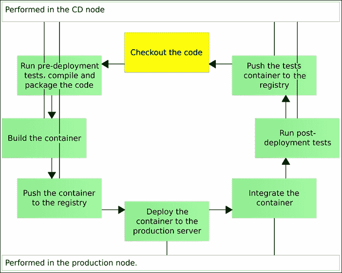
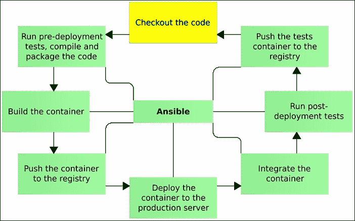
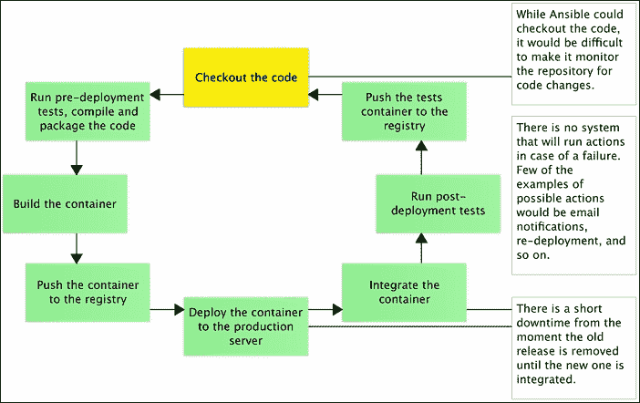

# 第十一章 自动化部署流水线的实现

现在我们已控制手动执行部署流水线的过程，可以开始着手创建一个完全自动化的版本。毕竟，我们的目标并不是雇佣一支操作员队伍，让他们坐在电脑前不停地执行部署命令。在继续之前，让我们再快速回顾一下这个过程。

# 部署流水线步骤

流水线的步骤如下：

1.  检出代码

1.  运行预部署测试，编译并打包代码

1.  构建容器

1.  将容器推送到注册表

1.  将容器部署到生产服务器

1.  集成容器

1.  运行后部署测试

1.  将测试容器推送到注册表！部署流水线步骤

    图 11-1 – 部署流水线

为了尽量减少流水线对我们业务的影响，我们尽最大努力将尽可能多的任务放在生产服务器之外执行。我们只在`prod`节点上执行了两个步骤：部署本身和集成（目前仅与代理服务集成）。其他所有步骤都在`cd`服务器上完成：



图 11-2 – CD 节点与生产节点之间的任务分配

我们已经选择了 Ansible 作为用于服务器配置的工具。我们在多个场合使用它来安装软件包、设置配置等。到目前为止，所有这些使用都旨在提供部署我们容器所需的所有要求。我们将扩展 Ansible playbook 的使用，并将部署流水线添加进去：



图 11-3 – 使用 Ansible 的自动化部署流水线

在所有涉及的步骤中，我们将只把其中一个步骤排除在自动化范围之外。我们不会使用 Ansible 来检出代码。这样做的原因不是 Ansible 无法克隆 Git 仓库，事实上它是可以的。问题在于，Ansible 并不是一个设计用来持续运行并监控代码仓库变化的工具。还有一些我们尚未处理的问题。例如，在过程失败的情况下，我们没有一套应该执行的操作。当前流水线的另一个问题是，每次部署都会有短暂的停机时间。该过程会停止当前运行的版本并启动新版本。在这两个动作之间，有一个（短暂的）时期，我们正在部署的服务不可用。

我们将把这些以及其他可能的改进留到以后再做：



图 11-4 – 部署流水线中缺失的部分

为了更好地理解这个过程，我们将回顾我们之前执行的每个手动步骤，并看看如何通过 Ansible 完成这些步骤。

我们将从创建节点和克隆代码开始：

```
vagrant up cd prod
vagrant ssh cd
git clone https://github.com/vfarcic/books-ms.git

```

## Playbook 和 Role

如果你已经尝试过自动化部署，那么你创建的脚本很可能大部分都与部署本身有关。使用 Ansible（以及一般的 CM 工具），我们可以选择每次从头开始执行整个过程。我们不仅会自动化部署，还会配置整个服务器。我们无法确定服务器的当前状态。例如，服务器可能已经安装了 nginx，也可能没有。也许它曾经运行着 nginx 容器，但由于某种原因，它的进程停止了。即使进程正在运行，某些关键配置也可能已经改变。相同的逻辑可以应用于任何与我们想要部署的服务直接或间接相关的内容。我们采用的方法是，拥有一个 playbook，确保所有内容都配置正确。Ansible 足够智能，能够检查所有这些依赖项的状态，并且仅在出现问题时才会应用更改。

让我们看一下 `se` `rvice.yml` playbook：

```
- hosts: prod
 remote_user: vagrant
 serial: 1
 sudo: yes
 roles:
 - common
 - docker
 - docker-compose
 - consul
 - registrator
 - consul-template
 - nginx
 - service

```

`service` 角色将包含与部署直接相关的任务，而在它之前的所有任务都是我们的服务正常运行所需的依赖项。由于我们已经完成了该 playbook 中除了最后一个角色之外的所有部分，因此我们应该直接跳到 `roles/service/tasks` `/main.yml` 文件中定义的任务列表：

```
- include: pre-deployment.yml
- include: deployment.yml
- include: post-deployment.yml

```

由于这个角色将比我们之前使用的角色稍大，我们决定将它们拆分为逻辑组（*预部署*、*部署* 和 *后部署*），并将它们包含到 `main.yml` 文件中。这样我们就不会一次处理太多任务，并且可以提高角色的可读性。

## 预部署任务

我们应该做的第一件事是构建测试容器。我们已经使用了以下命令（请不要运行它）：

```
docker pull \
 -t 10.100.198.200:5000/books-ms-tests
docker build \
 -t 10.100.198.200:5000/books-ms-tests \
 -f Dockerfile.test \
 .

```

在 Ansible 中复制相同的命令非常简单，使用 `Sh` `ell module`：

```
- name: Tests container is pulled
 shell: docker pull \
 {{ registry_url }}{{ service_name }}-tests
 delegate_to: 127.0.0.1
 ignore_errors: yes
 tags: [service, tests]
- name: Tests container is built
 shell: docker build \
 -t {{ registry_url }}{{ service_name }}-tests \
 -f Dockerfile.test \
 .
 args:
 chdir: "{{ repo_dir }}"
 delegate_to: 127.0.0.1
 tags: [service, tests]

```

我们修改了命令本身，将可能会发生变化的部分作为变量使用。第一个变量是`registry_url`，它应该包含 Docker 注册表的 IP 和端口。默认值在`grou` `p_vars/all`文件中指定。第二个变量更有趣。我们创建这个角色的目的不是为了与服务`books-ms`配合工作，而是为了能够与（几乎）任何服务一起使用，因为所有服务都可以遵循相同的模式。我们可以做这些事情而不牺牲自由，因为关键指令存储在每个服务的代码库中的几个文件里。最重要的文件是`Dockerfile.test`和*Dockerfile*，它们定义了测试和服务容器，Docker Compose 配置定义了容器如何运行，最后是代理配置和模板。所有这些文件都与我们正在创建的过程分开，项目负责人有完全的自由根据需要定制它们。这展示了我想要推广的一个非常重要的方面。确保不仅有正确的流程，而且脚本、配置和代码位置合适是至关重要的。所有对多个项目通用的内容应集中存储（就像位于[`github.com/vfarcic/ms-lifecycle`](https://github.com/vfarcic/ms-lifecycle)仓库中的 Ansible playbooks）。另一方面，可能特定于某个项目的内容应存储在该项目所在的仓库中。如果把所有东西都存储在一个集中的地方，会引入大量等待时间，因为项目团队需要向交付团队请求更改。另一种极端情况同样错误。如果所有东西都存储在项目的仓库中，会产生大量重复。每个项目都需要编写脚本来设置服务器、部署服务等。

接下来我们指定了一个单一的参数`chdir`。它将确保命令从包含`Dockerfile.test`文件的目录运行。在这种情况下，`chdir`的值是变量`repo_dir`，与`registry_url`不同，它没有默认值。我们将在运行 playbook 时在运行时指定它。然后是`delegate_to`指令。由于我们致力于尽量减少对目标服务器的干扰，像这样的任务将会在本地主机（`127.0.0.1`）上运行。最后，我们设置了几个标签，可以用来筛选哪些任务会被执行，哪些不会。

在构建之前拉取测试容器的原因是为了节省时间。执行 playbook 在不同服务器上的表现可能有所不同，如果发生这种情况，如果不首先从注册中心拉取容器，Docker 将会重新构建所有层，即使大部分层很可能和之前一样。请注意，我们引入了`ignore_errors`指令。没有它，如果这是容器的第一次构建且没有可拉取的内容，playbook 会失败。

请记住，在大多数情况下应该避免使用`shell`模块。Ansible 的理念是指定期望的行为，而不是要执行的动作。一旦运行该行为，Ansible 将尝试执行正确的操作。例如，如果我们指定某个软件包应该被安装，Ansible 会检查该软件包是否已经存在，只有在不存在的情况下才会进行安装。我们使用的 shell 模块，在这种情况下，将始终运行，无论系统状态如何。在这个特定情况下，这是可以接受的，因为 Docker 本身会确保只构建发生变化的层。它不会每次都构建整个容器。在设计角色时请牢记这一点。

我们在预部署阶段使用的其余命令如下（请不要运行它们）：

```
docker-compose -f docker-compose-dev.yml \
 run --rm tests
docker pull 10.100.198.200:5000/books-ms
docker build -t 10.100.198.200:5000/books-ms .
docker push 10.100.198.200:5000/books-ms

```

当转换为 Ansible 格式时，结果如下：

```
- name: Pre-deployment tests are run
 shell: docker-compose \
 -f docker-compose-dev.yml \
 run --rm tests
 args:
 chdir: "{{ repo_dir }}"
 delegate_to: 127.0.0.1
 tags: [service, tests]
- name: Container is built
 shell: docker build \
 -t {{ registry_url }}{{ service_name }} \
 .
 args:
 chdir: "{{ repo_dir }}"
 delegate_to: 127.0.0.1
 tags: [service]
- name: Container is pushed
 shell: docker push \
 {{ registry_url }}{{ service_name }}
 delegate_to: 127.0.0.1
 tags: [service]

```

对于这些任务没什么可说的。它们都使用 shell 模块，并且都在本地主机上运行。我们运行的测试容器，除了检查代码质量的显而易见功能外，还会编译服务。该编译结果将用于构建服务容器，之后推送到 Docker 注册表。

最终结果可以在`roles/service/tasks/pre-` `deployment.yml` 文件中看到，我们可以继续进行部署任务。

## 部署任务

我们在手动运行部署流水线时执行的下一组命令，目的是创建所需的目录和文件。它们如下（请不要运行它们）。

```
mkdir -p /data/books-ms
cd /data/books-ms
wget https://raw.githubusercontent.com/vfarcic\
/books-ms/master/docker-compose.yml
wget https://raw.githubusercontent.com/vfarcic\
/books-ms/master/nginx-includes.conf \
 -O /data/nginx/includes/books-ms.conf
wget https://raw.githubusercontent.com/vfarcic\
/books-ms/master/nginx-upstreams.ctmpl \
 -O /data/nginx/upstreams/books-ms.ctmpl

```

我们创建了服务目录，并从代码库中下载了`docker-compose.yml`、`nginx-includes.conf` 和 `nginx-upstreams.ctmpl` 文件。后两个文件将在修改代理时再下载，但我们可以将它们作为一个单独的 Ansible 任务一起处理。使用 Ansible 时，我们会稍微有所不同。由于我们已经检出了代码，因此没有理由重新下载这些文件。我们可以直接将它们复制到目标服务器。复制这组命令的 Ansible 任务如下：

```
- name: Directory is created
 file:
 path: /data/{{ service_name }}
 recurse: yes
 state: directory
 tags: [service]
- name: Files are copied
 copy:
 src: "{{ item.src }}"
 dest: "{{ item.dest }}"
 with_items: files
 tags: [service]

```

我们创建了两个任务。第一个任务使用 Ansible 的`file`模块创建服务目录。由于这个角色应该是通用的并适用于（几乎）任何服务，服务的名称是一个变量，我们将在运行剧本时动态设置它。第二个任务使用`copy`模块将我们在目标服务器上需要的所有文件复制过去。我们使用了`with_items`指令，它会对`*files_ variable`中的每个条目重复此任务。这个变量定义在`roles/service/defaults/main.yml`文件中，内容如下：

```
files: [
 {
 src: "{{ repo_dir }}/docker-compose.yml",
 dest: "/data/{{ service_name }}/docker-compose.yml"
 }, {
 src: "{{ repo_dir }}/nginx-includes.conf",
 dest: "/data/nginx/includes/{{ service_name }}.conf"
 }, {
 src: "{{ repo_dir }}/nginx-upstreams.ctmpl",
 dest: "/data/nginx/upstreams/{{ service_name }}.ctmpl"
 }
]

```

所有这些文件的源都利用了我们在预部署任务中已经使用过的`repo_dir`变量。同样，文件的目标位置则使用了`service_name`变量。

一旦我们确认所有需要的文件都已经放置到目标服务器上，我们就可以继续进行实际的部署，这包括两个步骤（请不要运行它们）。

```
docker-compose pull app
docker-compose up -d app
consul-template \
 -consul localhost:8500 \
 -template "/data/nginx/upstreams/books-ms.ctmpl:\
/data/nginx/upstreams/books-ms.conf:\
docker kill -s HUP nginx" \
 -once

```

首先，我们从 Docker 仓库拉取了最新的镜像，然后将其启动。当运行`docker-compose up`时，它会检查容器镜像或其配置是否与正在运行的容器有所不同。如果确实不同，Docker Compose 会停止正在运行的容器并启动新的容器，同时保留挂载的卷。我们已经讨论过，在某段时间（从停止当前版本到运行新版本之间），我们的服务将不可用。我们稍后会处理这个问题。现在，短暂的停机时间是我们必须接受的。最后，我们运行`consul-template`来更新配置并重新加载 nginx。

正如你可能猜到的，我们将通过 Ansible 的`shell`模块运行这两个命令：

```
- name: Containers are pulled
 shell: docker-compose pull app
 args:
 chdir: /data/{{ service_name }}
 tags: [service]
- name: Containers are running
 shell: docker-compose up -d app
 args:
 chdir: /data/{{ service_name }}
 tags: [service]
- name: Proxy is configured
 shell: consul-template \
 -consul localhost:8500 \
 -template "{{ ct_src }}:{{ ct_dest }}:{{ ct_cmd }}" \
 -once
 tags: [service]

```

我们没有做任何新操作。这与我们在预部署任务中定义的 shell 任务模式相同。唯一值得注意的是，我们使用了变量作为`-template`值。这样做的唯一原因是，由于书籍的每行字符数有限，所有参数无法放下。那些变量定义在`roles/service/defaults/main.yml`文件中，内容如下：

```
ct_src: /data/nginx/upstreams/{{ service_name }}.ctmpl
ct_dest: /data/nginx/upstreams/{{ service_name }}.conf
ct_cmd: docker kill -s HUP nginx

```

最终的结果可以在`roles/service/tas` `ks/deployment.yml`文件中看到。请注意，与预部署任务不同，这一组中的所有任务确实会在目标服务器上运行。从缺少`delegate_to: 127.0.0.1`指令可以看出这一点。

我们已经完成了部署，可以将注意力转向最后一组任务。

## 部署后任务

剩下的就是运行集成测试并将测试容器推送到仓库。提醒一下，命令如下（请不要运行它们）。

```
docker-compose \
 -f docker-compose-dev.yml \
 run --rm \
 -e DOMAIN=http://10.100.198.201 \
 integ
docker push 10.100.198.200:5000/books-ms-tests

```

这些命令的 Ansible 等效命令如下：

```
- name: Post-deployment tests are run
 shell: docker-compose \
 -f docker-compose-dev.yml \
 run --rm \
 -e DOMAIN={{ proxy_url }} \
 Integ
 args:
 chdir: "{{ repo_dir }}"
 delegate_to: 127.0.0.1
 tags: [service, tests]
- name: Tests container is pushed
 shell: docker push \
 {{ registry_url }}{{ service_name }}-tests
 delegate_to: 127.0.0.1
 tags: [service, tests]

```

这里没有什么新内容，所以我们不再详细讨论。完整的部署后任务可以在`roles/service/tasks/p` `ost-deploym` `ent.yml`文件中找到。

# 运行自动化部署管道

让我们看看`service`剧本的实际运行：

```
cd ~/books-ms
ansible-playbook /vagrant/ansible/service.yml \
 -i /vagrant/ansible/hosts/prod \
 --extra-vars "repo_dir=$PWD service_name=books-ms"

```

我们运行了`service.yml`的剧本，清单指向`hosts/prod`文件，并带有一些额外的变量。第一个是`repo_dir`，它的值为当前目录（`$PWD`）。第二个表示我们想要部署的服务名称（`books-ms`）。目前，我们只有这个服务。如果将来有更多服务，它们都可以通过修改此变量的值来使用相同的剧本进行部署。

我们不仅实现了完全自动化的部署，还实现了目标服务器的配置。第一次运行剧本是在一台全新的 Ubuntu 服务器上完成的，因此 Ansible 确保了部署所需的一切都已正确配置。结果虽然不是完美的，但已经是一个不错的起点。

随时可以重复执行剧本并观察与第一次运行相比的差异。你会注意到，大多数 Ansible 任务的状态都会是`ok`，因为没有需要做的事情，且剧本运行得更快。

我们可能错过了哪些东西？有不少。不过，在我们继续并尝试修复它们之前，我们应该建立一个合适的*持续部署*平台，看看它是否能帮助当前的流程。在那之前，先销毁虚拟机，让你的计算机休息一下：

```
exit
vagrant destroy -f

```
