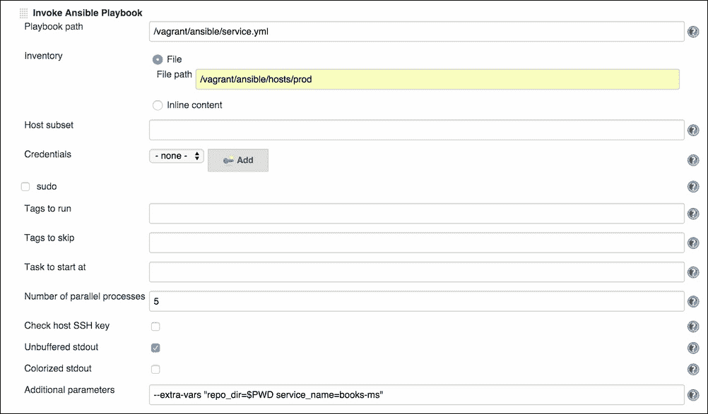
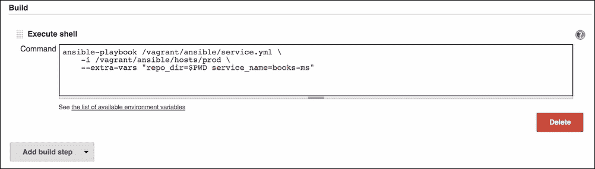
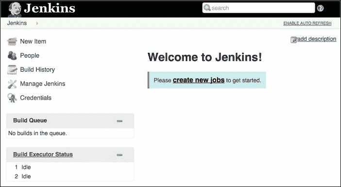
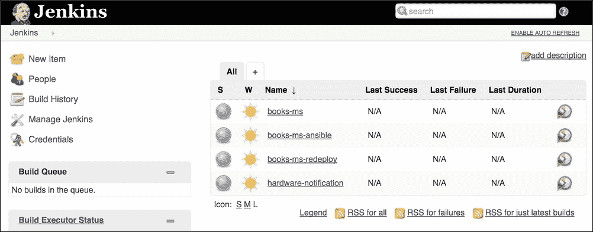
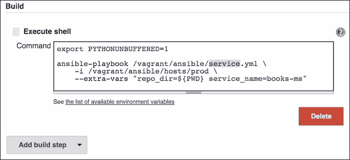
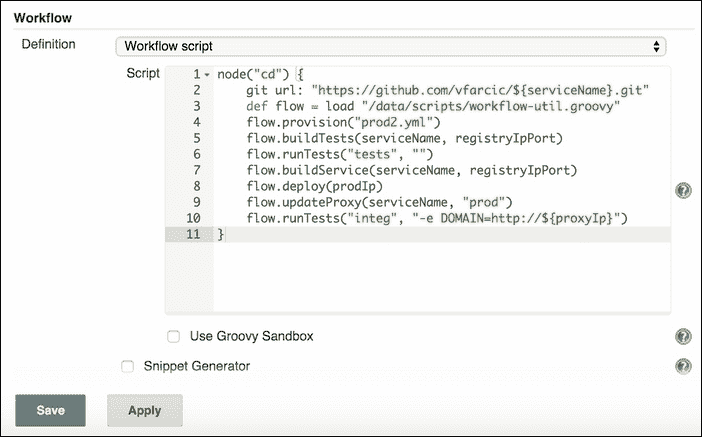
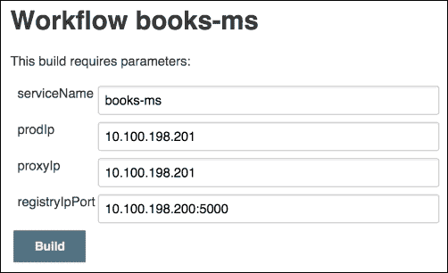
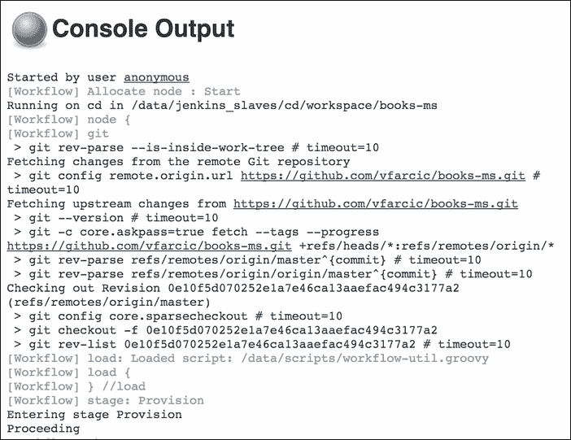
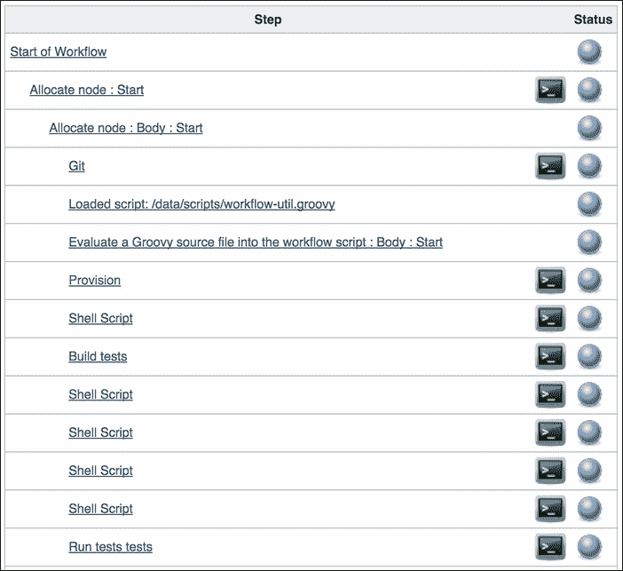

# 第十二章。持续集成、交付和部署工具

我们大多数的流程已经通过 Ansible 自动化。直到现在，我们使用 playbook 来自动化两种任务：服务器的配置和准备以及部署流程。虽然 Ansible 作为一个工具在准备和配置服务器方面表现出色，但在部署（至少在我们的场景中）并不是它的强项。我们主要把它当作 bash 脚本的替代品来使用。我们现在大部分的部署任务都是使用 Ansible 的`shell`模块。我们本可以使用 shell 脚本，结果也差不多。Ansible 设计时是为了使用承诺（promises）来确保系统处于正确的状态。当需要条件判断、try/catch 语句或其他类型的逻辑时，它在部署时表现得并不好。我们使用 Ansible 来部署容器的主要原因是避免将流程拆分为多个命令（用 ansible 进行准备、运行脚本、再准备更多、再运行更多脚本，依此类推）。第二个也是更重要的原因是我们当时没有覆盖 CI/CD 工具，所以使用了现有的工具。这种情况很快就会发生变化。

我们在部署流水线中缺少了什么？我们正在使用 Ansible 来配置和准备服务器，这部分运行得很好。我们仍在寻找一种更好的方式来部署软件（调用 Ansible 的`shell`模块有点繁琐）。我们也缺少一种方式来监控代码仓库，以便在代码发生变化时可以自动执行新的部署。当流程的某一部分失败时，我们没有机制发送通知。我们也缺少对所有构建和部署的可视化表示。这些问题还有很多可以继续列举。所有这些缺失的功能有一个共同点，那就是它们都可以通过 CI/CD 工具轻松解决。因此，我们应该开始寻找我们可以使用的 CI/CD 平台，并采纳其中一种。

# CI/CD 工具比较

划分 CI/CD 工具的一种方式是将它们分为云服务和自托管解决方案两大类。云服务有很多，既有免费的也有付费的。它们中的大多数非常适合处理比我们当前尝试实现的更简单的流程。如果你有一个由少数服务组成的小型应用，并且它们运行在不超过几台服务器上，云解决方案非常优秀。我曾在我的个人项目中使用过许多此类服务。Travis、Shippable、CircleCI 和 Drone.io 只是其中的几个。它们会运行你的脚本、构建你的应用和服务，并将它们打包成容器。它们大多数都没有设计或能力来处理一组服务器，特别是在私有或自托管环境下。并不是说没有适合这种场景的云解决方案，确实有，但它们在大规模使用时通常成本过高。考虑到这一点，我们应该寻找自托管解决方案。

市面上有很多自托管的 CI/CD 工具，种类繁多，从免费的到非常昂贵的都有。像 Jenkins、Bamboo、GoCD、Team City 和 Electric Cloud 等一些常用的自托管 CI/CD 工具，只是众多工具中的一部分。它们各有优缺点。然而，Jenkins 之所以能从中脱颖而出，主要得益于其社区。没有其他工具能像它一样，每天都有如此多的人在贡献代码。它有着出色的支持，通过插件，它可以扩展到几乎可以满足我们所有需求的程度。你几乎不会发现自己需要某些功能，而这些功能没有被一个或多个插件覆盖。即使你发现有一个用例没有被覆盖，编写你自己的插件（并希望能让它公开，供他人使用）也是一件非常容易的事。社区和插件是它的最大优势，这也是它比任何其他工具都更广泛采用的原因。

你很可能已经使用过 Jenkins，或者至少听说过它。企业选择使用其他工具（尤其是 Bamboo 和 Team City）的一个主要原因是它们的企业版。当一个组织变大时，它需要企业级的支持和可靠性。它需要那些企业级产品所提供的额外功能和技术支持。CloudBees 就是最近成立的一家这样的公司。他们提供 Jenkins 企业版，并拥有一流的支持，能够处理几乎所有与持续集成、交付或部署相关的场景。他们还提供免费的 Jenkins 社区版，但同时也提供付费的企业版功能和支持。这也是选择 Jenkins 的另一个理由。没有其他工具（至少是前面提到的那些）同时拥有完全免费的工具，同时还能提供付费支持和附加功能。Team City 虽然可以免费下载，但限制了代理的数量。GoCD 是免费的，但不提供任何支持。Bamboo 与 Team City 类似，免费版也有限制。通过选择 Jenkins，我们选择了一款经过战斗测试、广泛使用的工具，且它得到了一个庞大社区的支持，如果有需要，还可以通过 CloudBees 获得付费支持和功能。

### 注意

在写这本书时，我选择加入了 CloudBees 团队（即 Enterprise Jenkins 背后的公司）。我决定在整本书中推广 Jenkins，并非因为我在 CloudBees 工作，而恰恰相反。我选择加入他们，是因为我相信 Jenkins 是市场上最好的 CI/CD 工具。

## CI/CD 工具的简短历史

Jenkins（在与甲骨文的争执后从 Hudson 分叉出来）已经存在很长时间，并且确立了自己作为创建**持续集成**（**CI**）和**持续交付/部署**（**CD**）管道的领先平台。其背后的理念是我们应该创建执行诸如构建、测试、部署等操作的工作任务。这些任务应当相互连接，以创建一个 CI/CD 管道。它的成功如此巨大，以至于其他产品纷纷效仿，产生了 Bamboo、Team City 等。它们都采用了类似的逻辑，即拥有任务并将它们连接起来。操作、维护、监控和创建任务主要通过它们的用户界面（UI）来完成。然而，其他产品并未能够压倒 Jenkins，主要是由于其强大的社区支持。Jenkins 拥有超过一千个插件，可以说很难想象有哪项任务不被至少一个插件支持。Jenkins 所具备的支持、灵活性和可扩展性使得它能够保持作为最受欢迎且广泛使用的 CI/CD 工具的地位。基于大量使用用户界面的方式可以被认为是第一代 CI/CD 工具（尽管在此之前也有其他工具）。

随着时间的推移，新的产品应运而生，并且随着它们也诞生了新的方法。Travis、CircleCI 等工具将过程迁移到云端，并且依赖于自动发现以及主要基于 YML 的配置，这些配置与需要在管道中移动的代码存储在同一个代码库中。这一理念非常不错，也带来了很大的清新感。与其在集中位置定义你的任务，这些工具会检查你的代码并根据项目的类型采取相应的行动。例如，如果它们发现 `build.gradle` 文件，它们会假设你的项目应该使用 Gradle 进行测试和构建。作为结果，它们会运行 `gradle check` 来测试代码，如果测试通过，接着运行 `gradle assemble` 来生成构件。我们可以认为这些产品是 CI/CD 工具的第二代。

第一代和第二代工具各自存在不同的问题。像 Jenkins 这样的工具具有强大的功能和灵活性，使得我们能够创建量身定制的管道，处理几乎任何复杂度的任务。这种强大带来了代价。当你有几十个任务时，维护起来相对简单。然而，当数量增加到数百个时，管理它们可能变得相当繁琐且耗时。

假设一个普通的流水线有五个作业（构建、预部署测试、部署到暂存环境、后部署测试以及部署到生产环境）。实际上，作业的数量通常会超过五个，但我们就保持乐观估算。如果我们将这些作业乘以假设的二十个流水线，分别属于二十个不同的项目，那么总数就是一百。现在，想象一下我们需要将所有这些作业从，比如说，Maven 改为 Gradle。我们可以选择通过 Jenkins 的 UI 开始修改，或者大胆地直接在 Jenkins XML 文件中应用这些变更，这些文件代表了那些作业。无论哪种方式，这个看似简单的更改都需要相当大的投入。而且，由于其性质，所有内容都集中在一个地方，这使得各团队难以管理属于他们项目的作业。此外，项目特定的配置和代码与应用程序代码的其他部分一起存储在同一个代码库中，而不是在某个中心位置。Jenkins 并不是唯一遇到这个问题的工具，许多其他自托管工具也存在类似的问题。这源于一个时代，当时人们认为重度集中化和任务的横向划分是一种好主意。大约在那个时候，我们认为用户界面应该解决大部分问题。今天，我们知道很多类型的任务，比起通过某个 UI，作为代码定义和维护要容易得多。

我记得 Dreamweaver 流行的那段日子。那是九十年代末和二千年初的事（请记住，那时的 Dreamweaver 和今天的完全不同）。它看起来像是梦想成真（因此才有这个名字？）。我可以用鼠标创建整张网页。拖拽一个小部件，选择几个选项，写个标签，然后重复。我们能够非常快速地创建内容。当时并不那么明显的是，结果就像是一个贷款，需要用利息偿还。Dreamweaver 为我们创建的代码一点也不易于维护。事实上，有时候重新开始比修改用它创建的页面还要容易，尤其是当我们需要做一些它的部件没有包含的事情时。这是一个噩梦。今天，几乎没有人再使用拖放工具编写 HTML 和 JavaScript 了。我们自己编写代码，而不是依赖其他工具为我们编写代码。还有很多类似的例子。例如，Oracle ESB，至少在它的早期，也存在类似的问题。拖放不是一个值得依赖的东西（但对销售来说很有帮助）。这并不意味着图形界面不再被使用。它们依然存在，但仅限于非常特定的用途。一个网页设计师可能会依赖拖放工具，然后再将结果交给编码人员。

我的意思是，不同的方法适用于不同的情境和任务类型。Jenkins 及类似工具通过其用户界面（UI）在监控和状态可视化方面提供了极大的便利。它的不足之处在于作业的创建和维护。这类任务通过代码来完成会更为高效。使用 Jenkins 时，我们拥有强大的功能，但也必须为此付出维护的代价。

第二代 CI/CD 工具（如 Travis、CircleCI 等）将维护问题降到了几乎可以忽略不计的程度。在许多情况下，几乎无需做任何事情，因为它们会自动识别项目类型并执行正确的操作。在其他一些情况下，我们需要编写一个`travis.yml`、`circle.yml`或类似的文件，为工具提供额外的指令。即便是这种情况，该文件通常也只有几行配置，并且与代码一起存放，便于项目团队进行管理。然而，这些工具并没有取代第一代工具，因为它们通常只在小型项目和非常简单的管道上表现良好。真正的持续交付/部署管道远比这些工具所能处理的要复杂。换句话说，我们获得了低维护，但失去了力量，而且在许多情况下，灵活性也受到了影响。

如今，像 Jenkins、Bamboo 和 Team City 这样的老牌工具依然主导着市场，并且是推荐用于大型项目的工具。同时，像 Travis 和 CircleCI 这样的云工具在小型环境中占据主导地位。负责 Jenkins 代码库的团队意识到，必须引入一些重要的改进，结合两代工具的优点，甚至更多。我将这种变化称为 CI/CD 工具的第三代。它们引入了 Jenkins Workflow 和 *Jenkinsfile*。它们一起带来了非常有用且强大的功能。通过 Jenkins Workflow，我们可以使用基于 Groovy 的 DSL 编写完整的流水线。整个过程可以写成一个脚本，利用现有的大部分 Jenkins 功能。结果是代码量大大减少（Workflow 脚本比传统的 Jenkins 作业定义（XML）小得多），作业数量也减少（一个 Workflow 作业可以替代多个传统的 Jenkins 作业）。这使得管理和维护变得更加简单。另一方面，新引入的 Jenkinsfile 使我们能够将 Workflow 脚本定义在仓库中，与代码一起管理。这意味着负责项目的开发人员也可以控制 CI/CD 流水线。这样，责任划分就更加明确了。总体上，Jenkins 管理是集中化的，而每个 CI/CD 流水线则被放置在它所属的位置（与应该在其中移动的代码一起）。此外，如果我们将这些与 *Multibranch Workflow* 作业类型结合使用，还可以根据分支微调流水线。例如，我们可能在 `master` 分支中定义完整的过程，而在每个功能分支中定义较短的流程。每个 Jenkinsfile 中放入的内容由各自维护每个仓库/分支的人决定。使用 *Multibranch Workflow* 作业时，Jenkins 会在每次创建新分支时创建作业，并运行文件中定义的内容。类似地，当分支被删除时，它也会删除相关作业。最后，*Docker Workflow* 也被引入，使 Docker 成为 Jenkins 中的第一公民。

### 注意

Jenkins 拥有悠久的历史，这使得它走向了 Pipeline 插件的诞生。首先是提供连接作业可视化的 Build Pipeline 插件，随后出现了引入 Groovy DSL 概念的 Build Flow 插件，用于定义 Jenkins 作业。后者遇到了许多障碍，促使其作者重新开始并创建了 Workflow 插件，后来将其重命名为 Pipeline 插件。

所有这些改进将 Jenkins 推向了一个全新的高度，确认了其在 CI/CD 平台中的主导地位。

如果需要更多功能，还可以使用 CloudBees Jenkins Platform - Enterprise Edition，它提供了极好的功能，尤其是在我们需要大规模运行 Jenkins 时。

### 注意

工作流作者决定将插件重命名为 Pipeline。然而，目前并非所有源代码都已被重命名，并且同时存在对 pipeline 和 workflow 的引用。为了保持一致性，并避免可能的失败，我选择坚持使用旧名称，并在整本书中使用 Workflow 一词。这个变化只是语义上的，并没有引入任何功能上的变化。

## Jenkins

Jenkins 通过其插件表现出色。它的插件种类繁多，以至于很难找到任何我们想要实现的功能，而这些功能没有被至少一个插件覆盖。想连接到代码仓库？有插件。想向 Slack 发送通知？有插件。想用自己的公式解析日志？有插件。

能够从如此多的插件中进行选择是把双刃剑。人们往往滥用它，安装比实际需要更多的插件。一个例子就是 Ansible 插件。

我们可以将其选择为构建步骤，并填写如 **Playbook 路径**、**库存**、**跳过的标签**、**附加参数** 等字段。屏幕可能会显示如图 12-01 所示的界面：



图 12-01 – 在 Jenkins 作业中使用的 Ansible 插件

Ansible 插件的替代方案是直接使用 **执行 Shell** 构建步骤（Jenkins 核心的一部分），并放入我们想要执行的命令。我们自己编写了自动化脚本，并熟悉应该执行的命令。通过使用相同的命令，字段需要填写或忽略的部分更少，我们知道将要执行的内容，并且可以将这些命令作为参考，如果同样的过程需要在 Jenkins 之外重复执行：



图 12-02 – 将 Ansible playbook 作为 Shell 命令运行

在许多情况下，自动化应该在 Jenkins（或任何其他 CI/CD 工具）之外完成。从那时起，我们要做的就是告诉 Jenkins 运行哪个脚本。这个脚本可以与我们要部署的服务代码一起存储在代码库中（例如 `deploy.sh`），或者像我们这次做的那样，通过一些命名约定进行通用化，并供所有服务使用。无论自动化脚本如何组织，通常在 Jenkins 中使用它们的最好、最简单的方法，就是直接运行与这些脚本相关的命令。这个方法一直适用，直到最近。现在，随着 Jenkinsfile 的加入，我们可以继续按照相同的逻辑创建项目特定的脚本并将其保存在项目库中。它带来的附加好处是，我们可以在 Jenkinsfile 中的 Workflow 脚本内使用 Jenkins 特有的功能。如果你需要在某个特定节点上运行某些操作，有一个模块可以使用。如果你需要使用存储在 Jenkins 中的认证信息，也有相应的模块。功能的清单一长串，但核心要点是，通过 Jenkinsfile 和 Workflow，我们可以继续依赖存放在代码库中的脚本，同时利用 Jenkins 的高级功能。

现在是时候亲自动手设置 Jenkins 了。

### 设置 Jenkins

和往常一样，我们将首先创建虚拟机，用于探索 Jenkins。我们将创建 `cd` 节点，作为承载 Jenkins 服务器以及我们将通过其运行的 Ansible playbook 的平台：

```
vagrant up cd prod

```

一旦两台服务器都启动并运行，我们就可以继续像之前一样配置 `prod` 节点：

```
vagrant ssh cd
ansible-playbook /vagrant/ansible/prod2.yml \
 -i /vagrant/ansible/hosts/prod

```

现在我们已经准备好启动 Jenkins。通过 Docker 设置基础安装非常简单。我们只需要运行一个带有几个参数的容器：

```
sudo mkdir -p /data/jenkins
sudo chmod 0777 /data/jenkins
docker run -d --name jenkins \
 -p 8080:8080 \
 -v /data/jenkins:/var/jenkins_home \
 -v /vagrant/.vagrant/machines:/machines \
 jenkins

```

Docker 检测到本地没有 Jenkins 容器的副本，并开始从 Docker Hub 拉取它。拉取完成后，我们将拥有一个正在运行的实例，它会暴露 8080 端口并共享几个卷。`/var/jenkins_home` 目录包含所有 Jenkins 配置。为了配置管理的方便，我们将它共享出来，稍后会详细讲解。由于容器中的进程作为 `jenkins` 用户运行，而这个用户在我们的系统中不存在，我们为主机上的该目录赋予了完全权限（0777）。从安全角度来看，这不是一个好解决方案，但目前应该足够用了。第二个共享目录是 `/machines`，它映射到主机的 `/vagrant/.vagrant/machines` 目录。这里是 Vagrant 存储所有 SSH 密钥的位置，稍后我们将需要这些密钥来配置 Jenkins 节点，在这些节点上将执行实际的作业。请注意，如果你在生产服务器上运行这个操作，你应该使用 `ssh-copy-id` 生成密钥并共享，而不是使用 Vagrant 生成的密钥。

一旦 Jenkins 容器启动，我们可以打开 `http:/` `/10.100.198.200:8080` 并浏览图形界面：



图 12-03 – 标准安装后的 Jenkins 主页

如果这是你第一次接触 Jenkins，请先从这本书中休息一下，花点时间熟悉它。它的 GUI 非常直观，网上有许多资源可以帮助你对其工作原理有一个基本的了解。我们即将深入探讨 Jenkins 管理的自动化。尽管我们不会在这过程中使用 GUI，但理解它的可视化界面将帮助你更好地理解我们即将执行的任务。花些时间熟悉它，当你感到舒适时，再回来继续学习。

我认识的大多数人都只通过 Jenkins 的 GUI 使用它。有些人可能会使用它的 API 来运行作业或自动化一些基本操作。这样做没问题，一段时间是可以的。你从安装一些插件开始，创建一些作业，并且为能够迅速完成很多工作而感到高兴。随着时间的推移，作业数量增加，维护工作也随之增多。定义并定期运行的作业，或者通过某些事件（例如代码提交）触发的作业，可能有数十个、数百个，甚至数千个。通过 GUI 管理这些作业是困难且费时的。试想一下，比如你想为所有作业添加 Slack 通知。当作业数量较多时，一个一个地修改作业并不是一个好选择。

我们可以通过不同的方式来解决 Jenkins 自动化问题，主要是集中在作业的创建和维护上。一种方法是使用一些 Jenkins 插件，这些插件可以帮助我们。Job DSL 和 Job Generator 插件就是其中的一些。我们将采取不同的方法。所有 Jenkins 设置都存储为 XML 文件，位于`/var/jenkins_home directory`（我们将其暴露为 Docker 卷）。我们可以简单地添加新文件或修改现有文件，当需要更改某些 Jenkins 行为时。由于我们已经熟悉 Ansible，我们可以继续将其作为工具，不仅用于安装 Jenkins，还用于维护 Jenkins。基于这个思路，我们将删除当前的 Jenkins 安装，并通过 Ansible 重新开始：

```
docker rm -f jenkins
sudo rm -rf /data/jenkins

```

我们已删除 Jenkins 容器并删除了我们暴露作为卷的目录。现在，我们可以通过 Ansible 安装并配置它。

### 使用 Ansible 设置 Jenkins

使用 Ansible 设置 Jenkins 很简单，尽管我们将使用的角色包含一些我们以前没有遇到过的复杂情况。由于 playbook 的执行需要几分钟时间，我们先运行它，并在等待它完成时讨论它的定义：

```
ansible-playbook /vagrant/ansible/jenkins-node.yml \
 -i /vagrant/ansible/hosts/prod
ansible-playbook /vagrant/ansible/jenkins.yml \
 -c local

```

首先，我们设置将来会使用的 Jenkins 节点。执行第一个剧本应该不会花费太多时间，因为它只需要确保安装了 JDK（Jenkins 所需，以便能够连接到节点）并创建单一目录`/data/jenkins_slaves`。Jenkins 将使用该目录在这些节点上执行进程时存储文件。`jenkins`角色定义在`jenkins.yml`剧本中，稍微长一些，值得花些时间详细了解。我们来更详细地探讨一下。`jenkins.yml`剧本如下：

```
- hosts: localhost
 remote_user: vagrant
 serial: 1
 sudo: yes
 roles:
 - consul-template
 - jenkins

```

它安装了我们已经熟悉的 Consul Template，因此我们可以直接进入`roles/jenkins`角色。任务定义在`roles/jenkins/tasks/main.yml`文件中，我们将逐一查看这些任务。

第一个任务是创建我们需要的目录。如之前所述，变量定义在`roles/jenkins/defaults/main.yml`文件中：

```
- name: Directories are created
 file:
 path: "{{ item.dir }}"
 mode: 0777
 recurse: yes
 state: directory
 with_items: configs
 tags: [jenkins]

```

创建完目录后，我们可以启动 Jenkins 容器。尽管容器启动几乎不需要时间，但 Jenkins 本身需要一些耐心，直到它完全启动并投入使用。稍后我们将向 Jenkins API 发出一些命令，因此我们必须暂停剧本，暂时等候半分钟，以确保 Jenkins 已经完全启动。这也给我们提供了一个机会来观察`pause`模块的作用（尽管它应该很少使用）。请注意，我们在此注册了变量`container_result`，并在稍后的暂停中确保容器内的 Jenkins 应用完全启动，才能继续执行后续任务。如果 Jenkins 容器的状态发生变化，将执行此暂停操作：

```
- name: Container is running
 docker:
 name: jenkins
 image: jenkins
 ports: 8080:8080
 volumes:
 - /data/jenkins:/var/jenkins_home
 - /vagrant/.vagrant/machines:/machines
 register: container_result
 tags: [jenkins]
- pause: seconds=30
 when: container_result|changed
 tags: [jenkins]

```

接下来，我们应该复制一些配置文件。我们将从`roles/jenkins/files/credentials.xml`开始，然后是几个节点文件（`roles/jenkins/files/cd_config.xml`、`roles/jenkins/files/prod_config.xml`等）以及一些其他不太重要的配置文件。可以随意查看这些文件的内容。目前，重要的是要理解我们需要这些配置：

```
- name: Configurations are present
 copy:
 src: "{{ item.src }}"
 dest: "{{ item.dir }}/{{ item.file }}"
 mode: 0777
 with_items: configs
 register: configs_result
 tags: [jenkins]

```

然后，我们应该确保安装了一些插件。由于我们的代码在 GitHub 上，我们需要安装`Git Plugin`。另一个我们将使用的有用插件是`Log Parser`。由于 Ansible 日志较大，我们将使用此插件将其分解成更易于管理的部分。还会安装其他一些插件，具体使用时会详细讨论。

大多数人往往只会下载他们需要的插件。即使是我们正在使用的官方 Jenkins 容器，也有一种指定要下载哪些插件的方式。然而，这种方法非常危险，因为我们不仅需要定义我们需要的插件，还需要定义它们的依赖项、这些依赖项的依赖项，等等。很容易忘记其中一个或指定错误的依赖项。如果发生这种情况，最好的结果是我们想使用的插件无法工作。在某些情况下，甚至整个 Jenkins 服务器可能会停止运行。我们将采取不同的方法。可以通过向`/pluginManager/installNecessaryPlugins`发送带有 XML 内容的 HTTP 请求来安装插件。Jenkins 在接收到请求后，会下载我们指定的插件及其依赖项。由于我们不希望在插件已安装的情况下再次发送请求，我们将使用 `creates` 指令，指定插件的路径。如果插件已存在，则该任务不会执行。

大多数插件需要重新启动应用程序，因此如果添加了任何插件，我们将重新启动容器。由于安装插件的请求是异步的，我们首先需要等待插件目录创建完成（Jenkins 会将插件解压到与插件同名的目录中）。一旦确认所有插件都已安装，我们将重新启动 Jenkins 并再次等待一段时间，直到其完全恢复正常运行。换句话说，我们向 Jenkins 发送安装插件的请求，如果插件尚未安装，则等待 Jenkins 完成安装，重新启动容器以使新插件生效，并等待一段时间直到重启完成：

```
- name: Plugins are installed
 shell: "curl -X POST \
 -d '<jenkins><install plugin=\"{{ item }}@latest\" /></jenkins>' \
 --header 'Content-Type: text/xml' \
 http://{{ ip }}:8080/pluginManager/installNecessaryPlugins"
 args:
 creates: /data/jenkins/plugins/{{ item }}
 with_items: plugins
 register: plugins_result
 tags: [jenkins]

- wait_for:
 path: /data/jenkins/plugins/{{ item }}
 with_items: plugins
 tags: [jenkins]

- name: Container is restarted
 docker:
 name: jenkins
 image: jenkins
 state: restarted
 when: configs_result|changed or plugins_result|changed
 tags: [jenkins]

- pause: seconds=30
 when: configs_result|changed or plugins_result|changed
 tags: [jenkins]

```

现在我们准备创建作业了。由于所有作业的工作方式（或多或少）相同，我们可以使用一个通用模板来处理所有与服务部署相关的作业。我们需要为每个作业创建一个单独的目录，应用模板，将结果复制到目标服务器，最后，如果有任何作业发生了变化，重新加载 Jenkins。与需要完全重启的插件不同，Jenkins 在重新加载后会立即开始使用新的作业，这个过程非常快速（几乎是即时的）：

```
- name: Job directories are present
 file:
 path: "{{ home }}/jobs/{{ item.name }}"
 state: directory
 mode: 0777
 with_items: jobs
 tags: [jenkins]

- name: Jobs are present
 template:
 src: "{{ item.src }}"
 dest: "{{ home }}/jobs/{{ item.name }}/config.xml"
 mode: 0777
 with_items: jobs
 register: jobs_result
 tags: [jenkins]

- name: Jenkins is reloaded
 uri:
 url: http://{{ ip }}:8080/reload
 method: POST
 status_code: 200,302
 when: jobs_result|changed
 ignore_errors: yes
 tags: [jenkins]

```

未来，如果我们想要添加更多的作业，只需要向 `jobs` 变量中添加更多条目。通过这种系统，我们可以轻松地创建与服务一样多的 Jenkins 作业，几乎无需任何额外的努力。不仅如此，如果作业需要更新，我们只需要更改模板并重新运行 playbook，所有负责构建、测试和部署我们服务的作业都会收到更新。

在 `role` `s/jenkins/defaults/main.yml` 文件中定义的 `jobs` 变量如下所示：

```
jobs: [
 {
 name: "books-ms-ansible",
 service_name: "books-ms",
 src: "service-ansible-config.xml"
 },
...
]

```

`name` 和 `service_name` 的值应该很容易理解，它们分别代表作业的名称和服务的名称。第三个值是我们用来创建作业配置的源模板：

最后，让我们来看看 `roles/jenkins/templates` 下的 `/service-ansible-config.xml` 模板。

```
<?xml version='1.0' encoding='UTF-8'?>
<project>
 <actions/>
 <description></description>
 <logRotator class="hudson.tasks.LogRotator">
 <daysToKeep>-1</daysToKeep>
 <numToKeep>25</numToKeep>
 <artifactDaysToKeep>-1</artifactDaysToKeep>
 <artifactNumToKeep>-1</artifactNumToKeep>
 </logRotator>
 <keepDependencies>false</keepDependencies>
 <properties>
 </properties>
 <scm class="hudson.plugins.git.GitSCM" plugin="git@2.4.1">
 <configVersion>2</configVersion>
 <userRemoteConfigs>
 <hudson.plugins.git.UserRemoteConfig>
 <url>https://github.com/vfarcic/{{ item.service_name }}.git</url>
 </hudson.plugins.git.UserRemoteConfig>
 </userRemoteConfigs>
 <branches>
 <hudson.plugins.git.BranchSpec>
 <name>*/master</name>
 </hudson.plugins.git.BranchSpec>
 </branches>
 <doGenerateSubmoduleConfigurations>false</doGenerateSubmoduleConfigurations>
 <submoduleCfg class="list"/>
 <extensions/>
 </scm>
 <canRoam>true</canRoam>
 <disabled>false</disabled>
 <blockBuildWhenDownstreamBuilding>false</blockBuildWhenDownstreamBuilding>
 <blockBuildWhenUpstreamBuilding>false</blockBuildWhenUpstreamBuilding>
 <triggers/>
 <concurrentBuild>false</concurrentBuild>
 <builders>
 <hudson.tasks.Shell>
 <command>export PYTHONUNBUFFERED=1

ansible-playbook /vagrant/ansible/service.yml \
 -i /vagrant/ansible/hosts/prod \
 --extra-vars &quot;repo_dir=${PWD} service_name={{ item.service_name }}&quot;</command>
 </hudson.tasks.Shell>
 </builders>
 <publishers/>
 <buildWrappers/>
</project>

```

这是一个相对较大的 Jenkins 任务 XML 定义。我通过 GUI 手动创建了它，复制了文件并用变量替换了值。一个关键条目是告诉 Jenkins 代码仓库位置的条目：

```
<url>https://github.com/vfarcic/{{ item.service_name }}.git</url>

```

如你所见，我们再次使用了命名规范。仓库的名称与服务的名称相同，并将被我们之前看到的变量值替换。

第二个条目是执行命令的条目，该命令运行 Ansible playbook，构建、打包、测试并部署服务：

```
 <command>export PYTHONUNBUFFERED=1
ansible-playbook /vagrant/ansible/service.yml \
 -i /vagrant/ansible/hosts/prod \
 --extra-vars &quot;repo_dir=${PWD} service_name={{ item.service_name }}&quot;</command>

```

如你所见，我们正在运行我们在上一章中创建的相同 Ansible playbook。

最后，`jenkins` 角色中的最后一个任务如下：

```
- name: Scripts are present
 copy:
 src: scripts
 dest: /data
 mode: 0766
 tags: [jenkins]

```

它将脚本复制到 `/data` 目录。我们稍后将深入探讨这些脚本。

Ansible 角色 `jenkins` 是一个更复杂用例的好例子。直到这一章之前，我们用 Ansible 完成的大部分配置和设置都相对简单。在大多数情况下，我们会更新 APT 仓库、安装软件包，或许还会复制一些配置文件。在其他情况下，我们可能只会运行一个 Docker 容器。虽然还有很多其他情况，但本质上它们都非常简单，因为其他工具不需要太多的配置。Jenkins 则大不相同。除了运行容器外，我们还需要创建相当多的配置文件，安装若干插件，创建一些任务等等。作为替代方案，我们本可以（也可能应该）创建一个容器，把所有内容都放进去，只留下任务。这会简化设置，同时提供一个更可靠的解决方案。不过，我还是想展示一下更复杂的 Ansible 过程。

我将 Jenkins 自定义镜像的创建留给你作为练习。该镜像应包含所有内容，除了任务。创建一个 Dockerfile，构建并推送镜像到 Docker Hub，然后修改 Ansible 角色 `jenkins`，使其使用新的容器。它应与 SSH 密钥和任务共享卷，以便可以从容器外部更新它们。

### 运行 Jenkins 任务

到目前为止，我们之前运行的 Ansible playbook 应该已经完成执行。不仅 Jenkins 已经启动并运行，`books-ms` 任务也已创建并等待我们使用。

让我们来看一下 Jenkins 的图形用户界面。请打开`http://10.100.198.200:8080`。你将看到主页上显示着几个任务。我们首先要探索的任务是`book-ms-ansible`任务。在其他情况下，我们的代码仓库会触发一个请求给 Jenkins 执行构建。但是，由于我们使用的是公共 GitHub 仓库，并且这个 Jenkins 实例（可能）运行在你的笔记本电脑上，且无法从公共网络访问，我们需要手动执行任务。点击**为 books-ms-ansible 安排构建**按钮（图标是时钟和播放箭头）。你会看到，`books-ms-ansible`任务的第一次构建正在 `cd` 节点上运行，该节点位于屏幕的左侧：



图 12-04 – Jenkins 主屏幕，显示一些任务

点击`books-ms-ansible`任务，然后点击`Build History`中的`#1`链接，最后点击`Console Output`。同样的操作也可以通过打开`http://10.100.198.200:8080/job/books-ms-ansible/lastBuild/console`的 URL 来完成。你将看到该任务最后一次构建的输出。正如你可能注意到的，日志有点大，因此很难找到有关特定任务的信息。幸运的是，我们安装了`Log Parser`插件，它可以帮助我们更轻松地查找日志。但是，首先，我们需要等构建完成。我们会利用这段时间，来探索任务的配置。

请返回到`books-ms-ansible`任务的主屏幕，并点击左侧菜单中的`Configure`链接（或者打开`http://10.100.198.200:8080/job/books-ms-ansible/configure`的链接）。

`books-ms-ansible`是一个非常简单的任务，然而在大多数情况下，如果我们的自动化脚本编写得正确（无论是否使用 Ansible），我们不需要任何更复杂的任务配置。你将看到，这个任务被限制在`cd`节点上，这意味着它只能在名为`cd`的服务器上运行。这样，我们可以控制哪些任务在特定的服务器上运行。Jenkins 的设置过程之一是创建了一个名为`cd`的节点。

*源代码管理*部分包含了 GitHub 仓库的引用。请注意，我们缺少一个触发器，这个触发器会在有新的提交时运行这个任务。可以通过多种方式实现这一点。我们可以将`构建触发器`设置为`Poll SCM`并安排定期运行（比如每 10 秒）。请注意，调度格式使用的是`cron`语法。在这种情况下，Jenkins 将定期检查仓库，如果有任何更改（比如提交），它会运行任务。一种更好的方式是在仓库中直接创建一个`webhook`。该钩子会在每次提交时调用 Jenkins 构建。这样，构建会在提交后几乎立即开始运行。同时，也不会有定期检查仓库所产生的开销。然而，这种方法要求 Jenkins 能够从仓库（在此案例中是 GitHub）访问，而我们目前是在私有网络内运行 Jenkins。我们选择了两者都不使用，因为在你阅读这本书时，`books-ms`仓库很可能不会有提交。如何触发这个任务留给你去探索。我们将通过手动运行构建来模拟相同的过程。不论任务是如何运行的，它首先会做的就是使用*源代码管理*部分提供的信息克隆仓库。

现在我们已经进入了工作的主要部分；**构建**部分。我之前提到过，我们本可以使用**Ansible**插件来帮助我们运行 playbook。然而，我们需要运行的命令非常简单，使用插件只会增加额外的复杂性。在**构建**部分中，我们有一个`Execute shell`步骤，它以与手动运行相同的方式执行`service.yml` playbook。我们使用 Jenkins 仅作为一个工具，用来检测代码仓库的变化并运行我们本来会执行的相同命令。



图 12-05 – Jenkins books-ms-ansible 作业配置界面

最后，我们将`Console output (build log) parsing`设置为`Post-build actions`步骤。它解析（在此案例中）Ansible 日志，使其以更用户友好的方式显示。到此时，构建的执行可能已经完成，我们可以查看解析后的日志。

返回到`books-ms`任务的构建`#1`，然后点击左侧菜单中的`Parsed Console Output`链接，或者打开网址`http://10.100.198.200:8080/job/books-ms-a` `nsible/lastBuild/parsed_console/`。在`Info`部分，你将看到每个 Ansible 任务被单独列出，并可以点击任何一个任务跳转到与该任务相关的输出部分。如果执行过程中出现了问题，它们会出现在`Error`链接下。我们不会详细讲解`Log Parser`插件是如何工作的。我将它加入到这个任务中，主要是为了展示 Jenkins 通过插件提供的强大功能。市面上有超过一千个插件可供使用，且不断有新的插件发布。插件可能是 Jenkins 相较于其他 CI/CD 工具的最大优势。背后有如此庞大的社区支持，你可以放心几乎任何需求都能得到（可能）解决。更棒的是，通过探索现有插件，你会获得新的灵感。

尽管这个任务满足了部署服务所需的所有基本功能（检出代码并运行 Ansible playbook），我们仍然可以为任务添加一些额外的功能。最有趣的事情之一就是在任务失败时添加通知。这可以是电子邮件、Slack 通知或我们习惯的几乎任何类型的通知。我将这一部分留给你作为练习。花点时间查看可以帮助发送通知的插件，选择一个并安装它。**管理插件**界面可以通过点击首页左侧菜单中的`Manage Jenkins`来访问。作为替代，你也可以通过打开网址`http://10.100.198.200:8080/pluginManager/`来访问同一界面。进入后，按照插件说明操作，并将其添加到`books-ms-ansible`任务中。一旦你熟悉了它，尝试通过 Ansible 完成相同操作。将新插件添加到`plugins`变量，并在`service-ansible-config.xml`模板中加入必要的条目。最简单的方法是通过 UI 应用更改，然后检查 Jenkins 对`/data/jenkins/jobs/books-ms-ansible/conf`中`ig.xml`文件所做的更改。

### 设置 Jenkins 工作流任务

有没有更好的方式来构建一个部署`books-ms`服务的作业？目前的做法是由多个步骤组成的一个作业。一部分步骤是检出代码，另一部分是运行 Ansible 脚本。我们指定它应该在`cd`节点上运行，并进行了几个小的附加步骤。目前缺少通知功能（除非你自己实现了），通知应该作为作业的另一个步骤。每个步骤都是一个单独的插件。有些插件是 Jenkins 核心自带的，其他的则是我们自己添加的。随着时间的推移，步骤的数量可能会大幅增加。同时，虽然 Ansible 在配置和部署服务器方面表现出色，但作为构建、测试和部署服务的工具，它确实显得有些繁琐，且缺少一些可以通过简单 bash 脚本轻松完成的功能。

另一方面，bash 脚本缺少一些 Ansible 所具有的特性。例如，Ansible 在远程执行命令方面要好得多。第三种选择是将部署过程移到传统的 Jenkins 作业中。这也不是一个理想的解决方案。我们最终会得到很多作业，它们可能也会运行 bash 脚本。一个作业会在 `cd` 节点上执行预部署任务，另一个负责 `prod` 节点的部署，还有第三个作业会在 `cd` 节点上执行后部署步骤。最少，我们将有三个链式作业。更可能的是会有更多。维护很多作业既费时又复杂。

我们可以利用 Jenkins 的 `Workflow Plugin` 来编写一个脚本，执行所有步骤。我们可以将其作为目前使用 Ansible 部署的替代方案。我们已经讨论过 Ansible 在服务器配置和部署方面表现出色，但部署部分可以进一步优化。Workflow 插件允许我们编写整个作业的脚本。这个特性本身就是一个很好的方式，可以继续依赖自动化。特别是考虑到 Jenkins XML 非常繁琐，且难以编写和阅读。只需看看我们用来定义一个简单部署服务作业的 `service-ansible-config.xml` 文件：Jenkins XML 很晦涩，并且包含大量的模板定义，Ansible 并不设计用于条件语句，也没有合适的替代方案来实现 try/catch 语句，bash 脚本只是额外增加了复杂性。确实，在这一点上，我们的过程变得复杂，我们应该力求在不牺牲目标的情况下，保持尽可能简单。

我们可以试试 `Workflow` 插件，看看它是否能够帮助我们。我们将结合使用 `CloudBees Docker Workflow Plugin`。

我们将首先查看 `books-ms` 作业的配置。我们可以通过 Jenkins UI 导航到作业设置页面，或者直接打开 `http://10.100.1` `98.200:8080/job/books-ms/configure` URL：



图 12-06 – books-ms Jenkins 工作流作业的配置界面

进入`books-ms`配置后，你会注意到整个作业只包含几个参数和工作流脚本。与常规作业不同，工作流允许我们编写（几乎）所有内容。这反过来使得管理 Jenkins 作业变得更加轻松。我们正在使用的`roles/je` `nkins/templates/service-flow.groovy`脚本如下所示：

```
node("cd") {
 git url: "https://github.com/vfarcic/${serviceName}.git"
 def flow = load "/data/scripts/workflow-util.groovy"
 flow.provision("prod2.yml")
 flow.buildTests(serviceName, registryIpPort)
 flow.runTests(serviceName, "tests", "")
 flow.buildService(serviceName, registryIpPort)
 flow.deploy(serviceName, prodIp)
 flow.updateProxy(serviceName, "prod")
 flow.runTests(serviceName, "integ", "-e DOMAIN=http://${proxyIp}")
}

```

脚本以节点定义开始，告诉 Jenkins 所有指令应在`cd`节点上运行。

节点内的第一条指令是从 Git 仓库中检出代码。`git`模块是为 Jenkins 工作流创建的 DSL 示例之一。此指令使用 Jenkins 作业中定义的`serviceName`参数。

接下来，我们使用`load`指令，该指令将包括`workflow-util.groovy`脚本中定义的所有工具函数。这样，我们在创建具有不同目标和流程的作业时，就不需要重复编写代码。我们很快会深入探讨`workflow-util.groovy`脚本。`load`的结果被赋值给`flow`变量。

从这一点开始，脚本的其余部分应该不难理解。我们调用了`provision`函数并传递了`prod2.yml`作为变量。然后我们调用`buildTest`函数，并将`serviceName`和`registryIpPort`作业参数作为变量传递。如此等等。我们调用的函数执行与通过 Ansible 实现的相同操作，并代表了部署流水线。通过将工具函数作为单独文件加载并与工作流脚本本身分开，我们能够适当划分职责。工具脚本为多个工作流脚本提供函数，集中管理有很大好处，这样改进可以只做一次。另一方面，不同的工作流可能不同，因此在这种情况下，它主要包含对工具函数的调用：

让我们仔细看看`workflow-util.groovy`脚本中的函数：

```
def provision(playbook) {
 stage "Provision"
 env.PYTHONUNBUFFERED = 1
 sh "ansible-playbook /vagrant/ansible/${playbook} \
 -i /vagrant/ansible/hosts/prod"
}

```

`provision`函数负责在部署之前为我们的服务器进行预配。它定义了`stage`，帮助我们更好地识别该函数负责的任务集。接着声明了`PYTHONUNBUFFERED`环境变量，告知 Ansible 跳过日志缓存并尽可能快地显示输出。最后，我们使用工作流模块`sh`调用 Ansible 剧本，`sh`模块可以运行任何 Shell 脚本。由于我们可能会根据 Jenkins 作业的类型运行不同的剧本，因此我们将剧本名称作为函数变量传递。

接下来我们将探讨的函数负责构建测试：

```
def buildTests(serviceName, registryIpPort) {
 stage "Build tests"
 def tests = docker.image("${registryIpPort}/${serviceName}-tests")
 try {
 tests.pull()
 } catch(e) {}
 sh "docker build -t \"${registryIpPort}/${serviceName}-tests\" \
 -f Dockerfile.test ."
 tests.push()
}

```

这次，我们使用 `docker` 模块来声明 Docker 镜像，并将结果赋值给 `tests` 变量。接下来，我们拉取镜像，运行一个 Shell 脚本，在发生变化时构建一个新的镜像，最后将结果推送到注册表。请注意，镜像拉取是在 `try/catch` 语句中进行的。当第一次运行工作流时，不会有镜像可以拉取，如果没有 `try/catch` 语句，脚本会失败。

接下来是运行测试和构建服务镜像的功能：

```
def runTests(serviceName, target, extraArgs) {
 stage "Run ${target} tests"
 sh "docker-compose -f docker-compose-dev.yml \
 -p ${serviceName} run --rm ${extraArgs} ${target}"
}

def buildService(serviceName, registryIpPort) {
 stage "Build service"
 def service = docker.image("${registryIpPort}/${serviceName}")
 try {
 service.pull()
 } catch(e) {}
 docker.build "${registryIpPort}/${serviceName}"
 service.push()
}

```

这两个功能使用了与我们已讨论的相同指令，因此我们跳过它们。

部署服务的功能可能需要进一步的解释：

```
def deploy(serviceName, prodIp) {
 stage "Deploy"
 withEnv(["DOCKER_HOST=tcp://${prodIp}:2375"]) {
 try {
 sh "docker-compose pull app"
 } catch(e) {}
 sh "docker-compose -p ${serviceName} up -d app"
 }
}

```

新的指令是 `withEnv`。我们使用它来创建一个作用域有限的环境变量。它只会存在于大括号内声明的指令中。在这种情况下，环境变量 `DOCKER_HOST` 仅用于在远程主机上拉取和运行 `app` 容器。

最后的功能更新了代理服务：

```
def updateProxy(serviceName, proxyNode) {
 stage "Update proxy"
 stash includes: 'nginx-*', name: 'nginx'
 node(proxyNode) {
 unstash 'nginx'
 sh "sudo cp nginx-includes.conf /data/nginx/includes/${serviceName}.conf"
 sh "sudo consul-template \
 -consul localhost:8500 \
 -template \"nginx-upstreams.ctmpl:/data/nginx/upstreams/${serviceName}.conf:docker kill -s HUP nginx\" \
 -once"
 }
}

```

新的指令是 `stash` 和 `unstash`。由于我们在不同的节点（定义为 `proxyNode` 变量）上更新代理服务，我们必须将一些文件从 `cd` 服务器中 stash（暂存），然后在代理节点上 unstash（取出）。换句话说，stash/unstash 组合等同于将文件从一个服务器或目录复制到另一个服务器或目录。

总的来说，使用 Jenkins Workflow 和 Groovy DSL 的方法去除了 Ansible 中定义的部署需求。我们将继续使用 Ansible playbook 进行配置和管理，因为这些是它真正擅长的领域。另一方面，Jenkins Workflow 和 Groovy DSL 在定义部署过程时提供了更多的力量、灵活性和自由度。主要的区别在于，Groovy 是一种脚本语言，因此在此类任务中提供了更好的语法。同时，它与 Jenkins 的集成使我们能够利用一些强大的功能。例如，我们可以定义五个带有 `tests` 标签的节点。如果稍后我们指定某些 Workflow 指令应在 `tests` 节点上运行，Jenkins 将确保使用这五个节点中最少使用的那个（或者根据我们设置的不同逻辑，也可能有其他的选择标准）。

同时，通过使用 Jenkins Workflow，我们避免了传统 Jenkins 作业所需的复杂且难以理解的 XML 定义，并减少了作业的总数。Workflow 提供了许多其他优势，我们稍后会讨论。最终的结果是一个单一脚本，远比我们以前的 Ansible 部署任务要简短，同时也更容易理解和更新。我们在 Jenkins 擅长的任务上取得了成功，同时保持 Ansible 用于服务器配置和管理。最终结果是一个结合了两者优点的方案。

让我们再看一遍 `books-ms` 作业的配置。请在你喜欢的浏览器中打开 `books-ms 配置` 屏幕。你会看到该作业只包含两组配置。它以参数开始，以我们之前讨论的工作流脚本结束。脚本本身可以非常通用，因为差异通过参数声明。我们可以为所有服务复制这个作业，唯一的区别就是 Jenkins 参数。这样，这些作业的管理可以通过在 `roles/jenkin` 文件夹中的 `s/templates/service-workflow-config.xml` 文件中定义的单一 Ansible 模板来处理。

让我们构建一下作业，看看它的表现。请打开 `books-ms 构建` 屏幕。你会看到参数已经预先定义了合理的值。服务的名称是 `books-ms` 参数，生产服务器的 IP 是 `prodIp` 参数，代理服务器的 IP 是 `proxyIp` 参数，最后，Docker 仓库的 IP 和端口被定义为 `registryIpPort` 参数。点击 **构建** 按钮后，部署将会开始：



图 12-07 – books-ms Jenkins 工作流作业的构建屏幕

我们可以通过打开最后一次构建的 `books-ms 控制台` 屏幕来监控作业的执行情况：



图 12-08 – books-ms Jenkins 工作流作业的控制台屏幕

如你所知，我们的部署过程涉及很多步骤，日志可能会非常庞大，导致我们难以快速找到所需内容。幸运的是，Jenkins 工作流作业有一个 `工作流步骤` 功能可以帮助我们。当执行完成后，请在导航至最后一个 `books-ms 构建` 后，点击工作流步骤链接。你将看到每个阶段和步骤都会显示一个链接（图标表示终端屏幕），该链接允许我们仅调查与该步骤相关的日志：



图 12-09 – books-ms Jenkins 工作流作业的工作流步骤屏幕

Jenkins 工作流远不止我们在这里展示的内容。请花一些时间浏览在线教程，以便更熟悉它。作为练习，举个例子，向脚本中添加电子邮件通知。在探索 Jenkins 工作流时，请确保选中位于 `books-ms 配置` 屏幕下方的**代码片段生成器**复选框。这是一个非常有用的方式，可以帮助我们了解每个代码片段的作用以及如何使用它。

尽管 Workflow 相对于通过 playbook 定义的部署提供了很多好处，但通过 Ansible 管理脚本仍然是次优的解决方案。更好的方法是将部署流水线作为脚本放在代码仓库中，与其他服务代码一起管理。这样，维护服务的团队将完全掌控部署过程。除了需要将 Workflow 脚本放入代码仓库外，如果 Jenkins 作业不仅能处理主分支，还能处理所有分支或我们选择值得管理的分支，那将非常有益。幸运的是，`Multibranch` `Workflow` 插件和 `Jenkinsfile` 都能实现这两项改进。

### 配置 Jenkins Multibranch Workflow 和 Jenkinsfile

`Jenkins Multibranch Workflow` 插件新增了一种工作类型，使我们可以将 Workflow 脚本保存在代码仓库中。此类工作会为它在仓库中找到的每个分支创建一个子项目，并期望在每个分支中找到 `Jenkinsfile`。这使得我们可以将 Workflow 脚本保存在仓库中，而不是将其集中在 Jenkins 内部。这样一来，负责项目的开发人员可以完全自由地定义部署流水线。由于每个分支都会创建一个具有不同 Jenkinsfile 的单独 Jenkins 项目，我们可以根据分支的类型微调流程。例如，我们可以决定在主分支中的 Jenkinsfile 中定义完整的流水线，而选择仅在功能分支中定义构建和测试任务。还有更多。Jenkins 不仅会检测所有分支并保持该列表的更新，还会在相应的分支被删除时移除子项目。

让我们试试 Multibranch Workflow 和 Jenkinsfile。首先打开 `books-ms-multibranch job`。你会看到一条消息，说明该项目扫描 SCM 中的分支，并为每个分支生成一个工作，但是你没有配置任何分支。请点击左侧菜单中的 `Branch Indexing`，然后点击 `Run Now` 链接。Jenkins 将根据我们在配置中指定的过滤器对所有匹配的分支进行索引。一旦分支被索引，它将为每个分支创建子项目并启动构建。让我们在构建进行时探索一下该工作的配置。

请打开 `books-ms-multibranch configuration` 屏幕。工作配置中唯一重要的部分是 `Branch Sources`。我们使用它来定义代码仓库。请注意 **Advanced** 按钮。点击后，你会看到仅包含名称中含有 `workflow` 的分支。这个设置配置的原因有两个。第一个是为了演示过滤哪些分支将被包含的选项，另一个是为了避免在内存和处理能力有限的虚拟机中构建过多分支（`cd` 节点只有 1 个 CPU 和 1 GB 的内存）。

到目前为止，分支索引可能已经完成。如果你返回到 books-ms-multibranch 作业屏幕，你会看到两个项目符合过滤条件，`jenkins-workflow` 和 `jenkins-workflow-simple`，并且 Jenkins 已启动了这两个项目的构建。由于 `cd` 节点配置为只允许一个执行器，第二次构建将在第一次构建完成后才会开始。让我们来看看这些分支中的 `Jenkinsfile`。

jenkins-workflow 分支中的 Jenkinsfile 如下：

```
 node("cd") {
 def serviceName = "books-ms"
 def prodIp = "10.100.198.201"
 def proxyIp = "10.100.198.201"
 def registryIpPort = "10.100.198.200:5000"

 git url: "https://github.com/vfarcic/${serviceName}.git"
 def flow = load "/data/scripts/workflow-util.groovy"
 flow.provision("prod2.yml")
 flow.buildTests(serviceName, registryIpPort)
 flow.runTests(serviceName, "tests", "")
 flow.buildService(serviceName, registryIpPort)
 flow.deploy(serviceName, prodIp)
 flow.updateProxy(serviceName, "prod")
 flow.runTests(serviceName, "integ", "-e DOMAIN=http://${proxyIp}")
 }

```

这个脚本几乎与我们之前在处理嵌入在 Jenkins 作业 `books-ms` 中的 Jenkins 工作流时定义的脚本相同。唯一的区别是，这次变量是定义在脚本内部，而不是使用 Jenkins 属性。由于项目团队现在完全负责这个过程，因此无需将这些变量外部化。我们达成了与之前相同的结果，但这次我们将脚本移到了代码仓库中。`jenkins-workflow-simple` 分支中的 `Jenkinsfile` 更加简单：

```
node("cd") {
 def serviceName = "books-ms"
 def registryIpPort = "10.100.198.200:5000"

 git url: "https://github.com/vfarcic/${serviceName}.git"
 def flow = load "/data/scripts/workflow-util.groovy"
 flow.buildTests(serviceName, registryIpPort)
 flow.runTests(serviceName, "tests", "")
}

```

通过检查脚本，我们可以得出结论，创建该分支的开发者希望通过 Jenkins 每次提交代码时都运行测试。他从中删除了部署和部署后测试，因为代码可能还没有准备好部署到生产环境，或者政策规定只有主分支或其他选定的分支的代码才会被部署。一旦他合并代码，将会运行另一个脚本，并将他的更改部署到生产环境，前提是他没有引入任何错误，且流程成功。

引入 `Multibranch Workflow` 和 `Jenkinsfile` 大大改善了我们的部署流水线。我们在 `cd` 节点中有一个工具脚本，供其他人重用常见功能。从那时起，我们允许每个团队将他们的脚本托管在自己仓库中的 `Jenkinsfile` 中。此外，我们给予了他们自由，不仅决定构建、测试和部署服务的合适方式，还能够根据每个分支的需求灵活调整流程。

## 最终思考

这只是对 CI/CD 工具，特别是 Jenkins 的简要介绍。除了需要使用 CI/CD 工具外，Jenkins 将是下一章的一个基石。我们将在 *蓝绿部署* 工具集中使用它。如果你是 Jenkins 新手，我建议你先暂停阅读这本书，花些时间了解 Jenkins，阅读一些教程并尝试不同的插件。投入到 Jenkins 上的时间确实是一个有价值的投资，很快就会得到回报。

Jenkins 工作流的引入与 Docker 和 Multibranch 插件的结合，证明是我们工具库中不可或缺的补充。我们在使用 Jenkins UI 提供的所有功能的同时，依然保持了脚本提供的部署管道灵活性。工作流领域特定语言（DSL）和 Groovy 融合了两者的优点。通过工作流领域特定语言（DSL），我们有了专门为部署目的量身定制的语法和功能。另一方面，Groovy 本身提供了当 DSL 功能不足时我们可能需要的一切。同时，我们几乎可以访问 Jenkins 提供的任何功能。Docker 对工作流的补充提供了几个有用的快捷方式，Multibranch 与 Jenkinsfile 一起使得我们可以将管道（或其一部分）应用于所有分支（或我们选择的分支）。总的来说，我们将高层次与低层次工具结合成了一个强大且易于使用的组合。

我们通过 Ansible 创建 Jenkins 作业的方式远未理想。我们本可以使用像 `Template Project Plugin` 这样的 Jenkins 插件来创建模板。然而，这些插件并没有一个是完美的，都存在一些不足之处。`CloudBees` 的 `Jenkins Enterprise Edition` 确实提供了解决模板化及其他许多问题的工具。然而，到目前为止，我们使用的所有示例都是基于开源软件的，并且我们将继续沿用这种方式贯穿整本书。这并不意味着付费解决方案就不值得投资。它们往往是值得的，应该进行评估。如果你选择使用 Jenkins，并且你的项目或组织的规模足以支持这一投资，我建议你评估一下 `Jenkins Enterprise Edition`。它相较于开源版本带来了许多改进。

考虑到我们拥有的工具以及运行部署步骤的相对统一方式，当前的解决方案可能是我们能做到的最好选择，现在是时候进入下一个主题，探索我们可以从 `蓝绿部署` 中获得的好处。

在我们继续之前，让我们销毁本章中使用的虚拟机（VMs）：

```
exit

vagrant destroy -f

```
