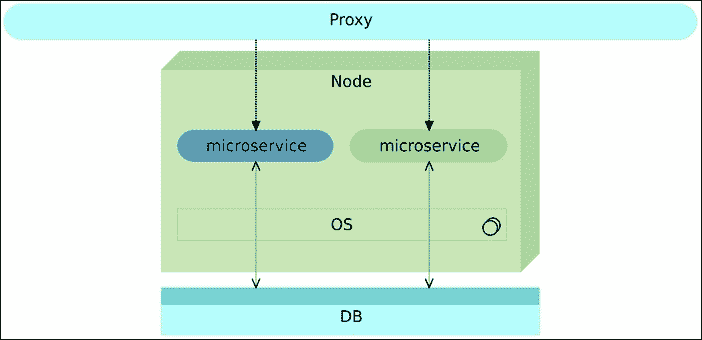

# 第十三章 蓝绿部署

传统上，我们通过替换当前版本来部署新版本。旧版本被停止，新版本取而代之。这个方法的问题在于，从停止旧版本到新版本完全投入运行之间会出现停机时间。不管你多么快速地尝试执行这个过程，总会有一些停机时间。这可能只是几毫秒，也可能持续几分钟，或者在极端情况下，甚至几个小时。采用单体应用程序会引入额外的问题，例如，必须等待相当长的时间才能初始化应用程序。人们试图通过各种方式解决这个问题，其中大多数人使用了某种变种的*蓝绿部署过程*。其背后的理念很简单：在任何时候，都应该有一个版本在运行，这意味着在部署过程中，我们必须并行部署新版本和旧版本。新版本和旧版本分别称为蓝色和绿色版本。


图 13-1 – 在任何时刻，至少有一个服务版本在运行

我们将一个版本作为当前版本运行，启动另一个版本作为新版本，一旦它完全投入运行，就将所有流量从当前版本切换到新版本。这个切换通常通过路由器或代理服务来完成。

通过蓝绿部署过程，我们不仅消除了部署停机时间，还减少了部署可能带来的风险。无论我们在软件到达生产节点之前进行了多么充分的测试，总是有可能出现问题。当问题发生时，我们仍然可以依赖当前版本。直到新版本经过充分测试，并且验证了生产节点的一些特定问题的合理失败可能性之前，都没有必要将流量切换到新版本。这通常意味着在部署之后、切换之前需要进行集成测试。即使这些验证返回了假阴性，并且在流量重定向后发生了故障，我们仍然可以快速切换回旧版本，将系统恢复到之前的状态。我们可以比需要从备份恢复应用程序或重新部署更快地回滚。

如果我们将蓝绿部署过程与不可变部署结合起来（过去通过虚拟机，今天通过容器实现），那么结果将是一个非常强大、安全且可靠的部署流程，可以更频繁地执行。如果架构基于微服务并与容器结合使用，我们就不需要两个节点来执行此过程，可以并行运行两个版本。

这种方法的主要挑战在于数据库。在许多情况下，我们需要以一种支持两个版本的方式升级数据库模式，然后继续进行部署。这种数据库升级可能带来的问题通常与版本之间的时间间隔有关。当版本发布频繁时，数据库模式的变化通常较小，这使得在两个版本之间保持兼容性变得容易。如果版本之间隔了几周或几个月，数据库的变化可能会非常大，以至于向后兼容性可能变得不可能或不值得做。如果我们的目标是持续交付或部署，那么两个版本之间的时间应该很短，或者如果时间较长，代码库的变化量应该相对较小。

# 蓝绿部署过程

蓝绿部署过程应用于打包为容器的微服务时，步骤如下。

当前的版本（例如蓝色）正在服务器上运行。所有流量都通过代理服务路由到该版本。微服务是不可变的，并以容器形式部署。


图 13-2 – 作为容器部署的不可变微服务

当新版本（例如绿色）准备好部署时，我们将其与当前版本并行运行。这样，我们可以在不影响用户的情况下测试新版本，因为所有流量仍然会发送到当前版本。


图 13-3 – 新版本的不可变微服务与旧版本并排部署

一旦我们认为新版本按预期工作，我们会更改代理服务的配置，使流量重定向到该版本。大多数代理服务会允许现有请求继续使用旧的代理配置完成执行，这样就不会中断服务。


图 13-4 – 代理已重新配置以指向新版本

当所有发往旧版本的请求都收到响应后，先前的服务版本可以被移除，或者更好的是，停止运行。如果使用后者选项，万一新版本失败，回滚几乎是瞬间的，因为我们只需将旧版本重新启动即可。



图 13-5 – 旧版本被移除

了解了蓝绿部署过程的基本逻辑后，我们可以尝试进行设置。我们将从手动命令开始，一旦熟悉了过程的实际操作，我们将尝试自动化这一过程。

我们需要确保常规的两个节点（`cd`和`prod`）处于运行状态，因此我们需要创建并配置虚拟机（VM）。

```
vagrant up cd prod

vagrant ssh cd

ansible-playbook /vagrant/ansible/prod2.yml \
-i /vagrant/ansible/hosts/prod

```

# 手动运行蓝绿部署

请注意，我们将在尝试实现之前目标的基础上进行整个蓝绿部署过程。我们不仅要并行运行两个发布版本，还要确保在多个阶段中彻底测试其中的所有内容。这将使过程比假设一切正常的蓝绿部署程序更复杂。大多数实现都没有考虑到在更改代理服务之前需要进行测试。我们可以，也将，做得更好。另一个需要注意的事情是，我们将探索手动步骤，以便你理解整个过程。之后，我们将使用已经熟悉的工具自动化所有操作。我选择这种方式是为了确保你理解持续部署和蓝绿部署结合背后的复杂性。通过真正理解如何手动执行，你将能够做出明智的决定，判断我们将在本书后续章节中探索的工具的好处是否大于它们所缺失的部分。

我们将首先下载上一章中使用的 Docker Compose 和 nginx 配置文件。

```
mkdir books-ms

cd books-ms

wget https://raw.githubusercontent.com/vfarcic\
/books-ms/master/docker-compose.yml

wget https://raw.githubusercontent.com/vfarcic\
/books-ms/master/nginx-includes.conf

wget https://raw.githubusercontent.com/vfarcic\
/books-ms/master/nginx-upstreams-blue.ctmpl

wget https://raw.githubusercontent.com/vfarcic\
/books-ms/master/nginx-upstreams-green.ctmpl

```

在所有配置文件准备好之后，让我们部署第一次发布。我们之前探索的工具将派上用场。我们将使用 Consul 作为服务注册中心，使用 Registrator 来注册和注销容器，使用 nginx 作为代理服务，使用 Consul Template 来生成配置并重新加载 nginx。

## 部署蓝色版本

由于此时我们还没有启动`books-ms`服务，我们将第一次发布命名为`blue`。目前我们唯一需要做的就是确保我们将要运行的容器名称中包含`blue`字样，以避免与下一个发布版本冲突。我们将使用 Docker Compose 来运行容器，让我们快速查看一下我们刚刚下载的`docker-compose.yml`文件中定义的目标（仅展示相关目标）。

```
...
base:
 image: 10.100.198.200:5000/books-ms
 ports:
 - 8080
 environment:
 - SERVICE_NAME=books-ms

app-blue:
 extends:
 service: base
 environment:
 - SERVICE_NAME=books-ms-blue
 links:
 - db:db

app-green:
 extends:
 service: base
 environment:
 - SERVICE_NAME=books-ms-green
 links:
 - db:db
...

```

我们不能直接使用`app`目标，因为我们将部署两个不同的目标（每种颜色一个），以避免它们互相覆盖。此外，我们还希望在 Consul 中区分它们，因此`SERVICE_NAME`环境变量应该是唯一的。为此，我们创建了两个新目标，分别是`app-blue`和`app-green`。这些目标以与之前章节中`app`目标扩展`base`服务相同的方式扩展`base`服务。`app-blue`和`app-green`目标与`base`服务之间的唯一区别是（除了目标名称外）环境变量`SERVICE_NAME`。

定义了这两个目标后，我们可以部署蓝色版本。

```
export DOCKER_HOST=tcp://prod:2375

docker-compose pull app-blue

docker-compose up -d app-blue

```

我们从注册中心拉取了最新版本，并将其作为服务的蓝色版本启动。为了确保安全，我们快速检查一下服务是否正在运行，并且已经在 Consul 中注册。

```
docker-compose ps

curl prod:8500/v1/catalog/service/books-ms-blue \
 | jq '.'

```

两个命令的输出合并如下。

```
 Name              Command     State                     Ports
----------------------------------------------------------------
booksms_app-blue_1   /run.sh      Up      0.0.0.0:32768->8080/tcp
booksms_db_1         /entrypoint.sh mongod   Up         27017/tcp
...
[
 {
 "ModifyIndex": 38,
 "CreateIndex": 38,
 "Node": "prod",
 "Address": "10.100.198.201",
 "ServiceID": "prod:booksms_app-blue_1:8080",
 "ServiceName": "books-ms-blue",
 "ServiceTags": [],
 "ServiceAddress": "10.100.198.201",
 "ServicePort": 32768,
 "ServiceEnableTagOverride": false
 }
]

```

第一个命令显示`app-blue`和`db`容器都在运行。第二个命令显示了在 Consul 中注册的`books-ms-blue`服务的详细信息。现在，我们已经启动了服务的第一个版本，但它还没有与 nginx 集成，因此无法通过端口 80 访问。我们可以通过向该服务发送请求来确认这一点。

```
curl -I prod/api/v1/books

```

输出如下。

```
HTTP/1.1 404 Not Found
Server: nginx/1.9.9
Date: Sun, 03 Jan 2016 20:47:59 GMT
Content-Type: text/html
Content-Length: 168
Connection: keep-alive

```

请求响应是`404 Not Found`错误消息，证明我们还没有配置代理。


图 13-6 – 蓝色容器已部署

## 集成蓝色版本

我们可以以类似之前的方式集成该服务。唯一的区别是我们在 Consul 中注册的服务目标。

让我们首先看看我们之前下载的 nginx Consul 模板`nginx-upstreams-blue.ctmpl`。

```
upstream books-ms {
 {{range service "books-ms-blue" "any"}}
 server {{.Address}}:{{.Port}};
 {{end}}
}

```

服务名称是`books-ms-blue`，我们可以通过运行 Consul Template 来生成最终的 nginx upstream 配置。

```
consul-template \
 -consul prod:8500 \
 -template "nginx-upstreams-blue.ctmpl:nginx-upstreams.conf" \
 -once

```

运行的命令是 Consul Template，它生成了 nginx upstream 配置文件并重新加载了服务。

让我们检查配置文件是否确实已正确创建。

```
cat nginx-upstreams.conf

```

输出如下。

```
upstream books-ms {
 server 10.100.198.201:32769;
}

```

最后，剩下的就是将配置文件复制到`prod`服务器并重新加载`nginx`。系统提示时，请使用`vagrant`作为密码。

```
scp nginx-includes.conf \
 prod:/data/nginx/includes/books-ms.conf

scp nginx-upstreams.conf \
 prod:/data/nginx/upstreams/books-ms.conf

docker kill -s HUP nginx

```

我们将两个配置文件复制到服务器并通过发送`HUP`信号重新加载`nginx`。

让我们检查一下我们的服务是否确实与代理集成。

```
curl -I prod/api/v1/books

```

输出如下。

```
HTTP/1.1 200 OK
Server: nginx/1.9.9
Date: Sun, 03 Jan 2016 20:51:12 GMT
Content-Type: application/json; charset=UTF-8
Content-Length: 2
Connection: keep-alive
Access-Control-Allow-Origin: *

```

这次，响应代码是`200 OK`，表明服务确实回应了请求。


图 13-7 – 蓝色容器与代理服务集成

我们已经完成了最简单的场景——部署了第一个（蓝色）版本。正如你很快将看到的，部署第二个（绿色）版本的过程不会有太大不同。

## 部署绿色版本

第二次（绿色）版本的部署可以通过与第一次（蓝色）版本相同的步骤进行。唯一的区别是这次我们将部署`books-ms-green`而不是`books-ms-blue`目标。

与上一次的部署不同，这次新版本（绿色）将与当前版本（蓝色）并行运行。

```
docker-compose pull app-green

docker-compose up -d app-green

```

新版本已被拉取并运行。我们可以通过运行`docker-compose ps`命令来确认。

```
docker-compose ps

```

结果如下。

```
 Name           Command     State                     Ports
-----------------------------------------------------------------
booksms_app-blue_1     /run.sh    Up      0.0.0.0:32769->8080/tcp
booksms_app-green_1    /run.sh    Up      0.0.0.0:32770->8080/tcp
booksms_db_1           /entrypoint.sh mongod   Up      27017/tcp

```

输出显示两个服务（蓝色和绿色）并行运行。同样，我们可以确认两个版本都已在 Consul 中注册。

```
curl prod:8500/v1/catalog/services \
 | jq '.'

```

输出如下。

```
{
 "dockerui": [],
 "consul": [],
 "books-ms-green": [],
 "books-ms-blue": []
}

```

如之前所示，我们也可以检查新部署的服务的详细信息。

```
curl prod:8500/v1/catalog/service/books-ms-green \
 | jq '.'

```

最后，我们可以确认旧版本仍然可以通过代理访问。

```
curl -I prod/api/v1/books

docker logs nginx

```

最后一个命令的输出应该类似于以下内容（为了简洁，已删除时间戳）。

```
"GET /api/v1/books HTTP/1.1" 200 201 "-" "curl/7.35.0" "-" 10.100.198.201:32769
"GET /api/v1/books HTTP/1.1" 200 201 "-" "curl/7.35.0" "-" 10.100.198.201:32769

```

请记住，部署在您计算机上的服务端口可能与前面示例中的端口不同。

nginx 日志的输出应该显示我们发出的请求被重定向到蓝色版本的端口。我们可以通过检查最后一个请求是否进入了与我们在部署 `green` 版本之前相同的端口来观察这一点。


图 13-8 – 绿色容器与蓝色容器并行部署

此时，我们有两个版本（蓝色和绿色）并行运行，代理服务仍然将所有请求重定向到旧版本（蓝色）。下一步应该是在更改代理配置之前先测试新的版本。我们将在自动化部分之前跳过测试，直接进入绿色版本与 nginx 的集成。

## 集成绿色版本

将第二个（绿色）版本与代理服务集成的过程与我们之前所做的类似。

```
consul-template \
 -consul prod:8500 \
 -template "nginx-upstreams-green.ctmpl:nginx-upstreams.conf" \
 -once

scp nginx-upstreams.conf \
 prod:/data/nginx/upstreams/books-ms.conf

docker kill -s HUP nginx

```

我们可以向代理发送请求，并检查其日志，以查看它是否确实指向新的（绿色）版本。

```
curl -I prod/api/v1/books

docker logs nginx

```

nginx 日志应该类似于以下内容（时间戳已移除以简化显示）。

```
"GET /api/v1/books HTTP/1.1" 200 201 "-" "curl/7.35.0" "-" 10.100.198.201:32769
"GET /api/v1/books HTTP/1.1" 200 201 "-" "curl/7.35.0" "-" 10.100.198.201:32769
"GET /api/v1/books HTTP/1.1" 200 201 "-" "curl/7.35.0" "-" 10.100.198.201:32770

```

很明显，最后一个请求进入了不同的端口（`32770`），与我们之前的请求所用的端口（`32769`）不同。我们将代理从蓝色版本切换到了绿色版本。由于我们等到新的版本完全启动并运行后才更改代理配置，因此整个过程中没有出现停机时间。此外，nginx 足够智能，只有在重新加载后才会将配置更改应用于所有请求，而不是应用于所有请求。换句话说，所有在重新加载前发起的请求继续使用旧版本，而所有在重新加载后发起的请求则会被发送到新版本。我们通过最小的努力，使用 nginx 作为代理和 Consul（配合 Registrator 和 Consul Template）来存储和获取服务信息，实现了零停机时间。


图 13-9 – 绿色容器与代理服务集成

到目前为止，我们所做的操作使得新的版本与旧版本并行部署，并且代理已更改为指向新的版本。现在我们可以安全地移除旧版本了。

## 移除蓝色版本

移除版本很简单，我们之前已经做过很多次。我们只需要确保在运行 `stop` 命令时使用了正确的目标。

```
docker-compose stop app-blue

docker-compose ps

```

第一个命令停止了蓝色版本，第二个命令列出了所有指定为 Docker Compose 目标的进程。列出进程的命令输出如下。

```
Name               Command      State                       Ports
-----------------------------------------------------------------
booksms_app-blue_1    /run.sh                            Exit 137
booksms_app-green_1   /run.sh    Up       0.0.0.0:32770->8080/tcp
booksms_db_1   /entrypoint.sh mongod     Up             27017/tcp

```

请注意，`booksms_app-blue_1` 的状态是 `Exit 137`。只有绿色版本和数据库容器在运行。

我们还可以通过向 Consul 发送请求来确认这一点。

```
curl prod:8500/v1/catalog/services | jq '.'

```

Consul 的响应如下。

```
{
 "dockerui": [],
 "consul": [],
 "books-ms-green": []
}

```

Registrator 检测到蓝色版本被移除，并从 Consul 中删除了它。

我们还需要检查绿色版本是否仍然与代理服务集成。

```
curl -I prod/api/v1/books

```

正如预期的那样，nginx 仍然将所有请求发送到绿色版本，我们的工作完成了（暂时）。总结来说，我们在旧版本并行部署了新版本，修改了代理服务使其指向新版本，等到所有与旧版本关联的请求完成响应后，移除了旧版本。


图 13-10 – 蓝色容器被移除

在我们进行自动化部署之前，剩下的唯一任务是找到一种更好的方法来确定要部署哪个版本（蓝色或绿色）。在手动操作时，我们可以通过简单地列出 Docker 进程或在 Consul 中注册的服务，并观察哪个颜色没有运行，从而轻松找到这个信息。自动化部署将需要稍微不同的方法。我们需要发现应该运行哪个版本。

让我们移除容器并重新开始。

```
docker-compose stop

docker-com
pose rm -f

```

## 确定要部署哪个版本并回滚

确定下一个要部署的颜色的一种方法是将已部署的颜色存储到 Consul 中，并在下次部署时使用该信息。换句话说，我们应该有两个过程：颜色发现和颜色注册。

让我们考虑一下颜色发现的使用场景。有三种可能的组合：

1.  我们正在部署第一个版本，注册表中没有存储颜色信息。

1.  蓝色版本正在运行，并已存储在注册表中。

1.  绿色版本正在运行，并已存储在注册表中。

我们可以将这些组合减少为两种。如果注册了蓝色版本，下一步就是绿色。否则，下一步就是蓝色，涵盖当前颜色为绿色或未注册任何颜色（即服务从未部署过）这两种情况。通过这种策略，我们可以创建以下 bash 脚本（请不要现在运行它）。

```
#!/usr/bin/env bash

SERVICE_NAME=$1
PROD_SERVER=$2

CURR_COLOR=`curl \
 http://$PROD_SERVER:8500/v1/kv/$SERVICE_NAME/color?raw`

if [ "$CURR_COLOR" == "blue" ]; then
 echo "green"
else
 echo "blue"
fi

```

由于我们可以使用相同的脚本来处理多个服务，它接受两个参数：我们即将部署的服务名称和目标（生产）服务器。然后，我们在生产服务器上查询 Consul 并将结果存储到 `CURR_COLOR` 变量中。接着是一个简单的 `if…else` 语句，将 `green` 或 `blue` 字符串输出到 `STDOUT`。有了这样的脚本，我们可以轻松地获取应该用于部署服务的颜色。

让我们创建脚本：

```
echo '#!/usr/bin/env bash

SERVICE_NAME=$1
PROD_SERVER=$2

CURR_COLOR=`curl \
 http://$PROD_SERVER:8500/v1/kv/$SERVICE_NAME/color?raw`

if [ "$CURR_COLOR" == "blue" ]; then
 echo "green"
else
 echo "blue"
fi
' | tee get-color.sh

chmod +x get-color.sh

```

我们创建了 `get-color.sh` 脚本并赋予了它可执行权限。现在我们可以使用它来获取下一个颜色，并重复之前练习过的过程。

```
NEXT_COLOR=`./get-color.sh books-ms prod`

export DOCKER_HOST=tcp://prod:2375

docker-compose pull app-$NEXT_COLOR

docker-compose up -d app-$NEXT_COLOR

```

与我们之前执行的命令唯一的不同之处在于，我们使用了 `NEXT_COLOR` 变量，而不是硬编码的 `blue` 和 `green` 值。因此，我们已经成功启动了第一个版本（蓝色）。


图 13-11 – 当前版本的颜色从 Consul 中获取

让我们借此机会简短讨论一下测试。 一方面，我们希望在更改代理指向新发布版本之前尽可能多地进行测试。另一方面，我们仍然需要在代理更改后进行一次测试，以确保一切（包括代理的更改）按预期运行。我们将这两种类型的测试称为预集成测试和后集成测试。请记住，它们的范围应仅限于那些无法通过预部署测试覆盖的情况。对于（相对较小的）`books-ms`服务来说，如果预集成测试验证服务能够与数据库通信，那么这就足够了。在这种情况下，集成后唯一需要检查的就是 nginx 是否已正确重新配置。

我们从预集成测试开始。我们将使用`curl`模拟测试。由于代理尚未更改为指向新部署的服务，我们需要找出新发布服务的端口。我们可以从 Consul 中找到端口，并创建一个类似于`get-color.sh`的脚本。可以使用以下命令创建脚本。

```
echo '#!/usr/bin/env bash

SERVICE_NAME=$1
PROD_SERVER=$2
COLOR=$3

echo `curl \
 $PROD_SERVER:8500/v1/catalog/service/$SERVICE_NAME-$COLOR \
 | jq ".[0].ServicePort"`
' | tee get-port.sh

chmod +x get-port.sh

```

这次，我们创建了一个名为`get-port.sh`的脚本，包含三个参数：服务名称、生产服务器地址和颜色。通过这三个参数，我们从 Consul 查询信息并将结果发送到 STDOUT。

让我们尝试一下。

```
NEXT_PORT=`./get-port.sh books-ms prod $NEXT_COLOR`

echo $NEXT_PORT

```

输出会因 Docker 随机分配给我们的服务的端口不同而有所不同。通过将端口存储在变量中，我们可以在将服务与代理集成之前进行测试。

```
curl -I prod:$NEXT_PORT/api/v1/books

```

服务返回了状态码`200 OK`，所以我们可以按照之前的方式继续进行集成。当需要时，请使用`vagrant`作为密码。

```
consul-template \
 -consul prod:8500 \
 -template "nginx-upstreams-$NEXT_COLOR.ctmpl:nginx-upstreams.conf" \
 -once

scp nginx-upstreams.conf \
 prod:/data/nginx/upstreams/books-ms.conf

docker kill -s HUP nginx

```

服务集成后，我们可以再次进行测试，但这次不需要使用端口。

```
curl -I prod/api/v1/books

```

最后，我们应该停止其中一个容器。停止哪一个容器取决于测试结果。如果预集成测试失败，我们应该停止新的发布版本。此时，代理不需要做任何操作，因为它仍然将所有请求发送到旧版本。另一方面，如果集成后测试失败，不仅需要停止新的发布版本，还应该将代理服务的更改回滚，以便所有流量返回到旧版本。此时，我们不会逐一列举所有可能需要采取的路径。这些内容会留待我们稍后探索的自动化部分。现在，我们将颜色信息放入 Consul 注册表，并停止旧版本。

```
curl -X PUT -d $NEXT_COLOR \
 prod:8500/v1/kv/books-ms/color

CURR_COLOR=`./get-color.sh books-ms prod`

docker-compose stop app-$CURR_COLOR

```

这一系列命令将新颜色加入注册表，获取下一个应该与旧版本颜色相同的颜色，最后停止旧版本。由于我们重新开始并且这是第一次发布，因此没有旧版本需要停止。然而，下次运行该过程时，旧版本将会被停止。


图 13-12 – 当前版本的颜色被发送到 Consul

通过这种方式，我们结束了蓝绿部署的手动过程。它的实现方式使得这一过程可以轻松自动化。在继续之前，让我们再运行几次这些命令，并观察颜色从蓝色变为绿色，再从绿色变为蓝色，依此类推。所有命令汇总如下。

```
NEXT_COLOR=`./get-color.sh books-ms prod`

docker-compose pull app-$NEXT_COLOR

docker-compose up -d app-$NEXT_COLOR

NEXT_PORT=`./get-port.sh books-ms prod $NEXT_COLOR`

consul-template \
 -consul prod:8500 \
 -template "nginx-upstreams-$NEXT_COLOR.ctmpl:nginx-upstreams.conf" \
 -once

scp nginx-upstreams.conf \
 prod:/data/nginx/upstreams/books-ms.conf

docker kill -s HUP nginx

curl -I prod/api/v1/books

curl -X PUT -d $NEXT_COLOR \
 prod:8500/v1/kv/books-ms/color

CURR_COLOR=`./get-color.sh books-ms prod`

docker-compose stop app-$CURR_COLOR

curl -I prod/api/v1/books

docker-compose ps

```

最后一个命令显示了 Docker 进程。你会看到，在第一次运行之后，绿色版本会在运行状态，而蓝色版本则处于“已退出”状态；接着，在下一次运行后，蓝色版本会处于运行状态，绿色版本则会进入“已退出”状态，依此类推。我们成功地在没有任何停机时间的情况下部署了新版本。唯一的例外是如果集成后测试失败，这种情况发生的可能性非常小，因为唯一的原因可能是代理服务本身由于配置错误导致的故障。由于这个过程将很快完全自动化，这种情况发生的可能性非常小。集成后测试失败的另一个原因是代理服务本身的故障。要消除这种可能性，唯一的办法是拥有多个代理服务实例（此书范围外）。

话虽如此，让我们来看一下 nginx 日志。

```
docker logs nginx

```

你会注意到，我们每次发送的请求都被发送到不同的端口，这意味着一个新的容器确实已经被部署，并在新的端口上运行。

现在，在完成所有命令和实验后，我们已经准备好开始蓝绿部署过程的自动化工作。

我们将销毁虚拟机并重新开始，以确保一切正常运行。

```
exit

vagr
ant destroy -f

```

# 使用 Jenkins 工作流自动化蓝绿部署

我们将从创建虚拟机开始，配置`prod`节点，并启动 Jenkins——我们选择的部署工具。

```
vagrant up cd prod

vagrant ssh cd

ansible-playbook /vagrant/ansible/prod2.yml \
 -i /vagrant/ansible/hosts/prod

ansible-playbook /vagrant/ansible/jenkins-node.yml \
 -i /vagrant/ansible/hosts/prod

ansible-playbook /vagrant/ansible/jenkins.yml \
 -c local

```

由于还需要几分钟时间才能完成设置，我们来讨论一下应该自动化什么以及如何自动化。我们已经熟悉了 Jenkins 工作流。它为我们提供了很好的支持，所以目前没有理由更换工具。我们将使用它来自动化蓝绿部署过程。这个流程将包含很多步骤，因此我们将把它们分解成多个函数，以便更容易理解，同时也能扩展我们的工作流工具脚本。接下来将详细讨论和实现这些函数。


图 13-13 – 蓝绿部署自动化流程

## 蓝绿部署角色

我们将使用 *Multibranch Workflow* Jenkins 作业 `books-ms-blue-green`。它筛选 `vfarcic/books-ms` 仓库的分支，仅包含名称中含有 `blue-green` 的分支。

由于第一次运行可能需要相当长的时间，我们先对分支进行索引，这样 Jenkins 就可以在我们探索脚本的同时运行子项目。

请打开 Jenkins Multibranch Workflow 作业 `books-ms-blue-green`，点击左侧菜单中的 **Branch Indexing** 和 **Run Now** 链接。分支索引完成后，Jenkins 会发现 `blue-green` 分支符合作业中设置的筛选条件，创建一个相同名称的子项目并开始运行。索引状态可以在屏幕左下角的 `master` 节点执行器中查看。


图 13-14 – Jenkins Multibranch Workflow 作业 `books-ms-blue-green` 和蓝绿子项目

我们将让 Jenkins 继续运行构建并探索 `blue-green` 分支中的 `Jenkinsfile`。

```
node("cd") {
 def serviceName = "books-ms"
 def prodIp = "10.100.198.201"
 def proxyIp = "10.100.198.201"
 def proxyNode = "prod"
 def registryIpPort = "10.100.198.200:5000"

 def flow = load "/data/scripts/workflow-util.groovy"

 git url: "https://github.com/vfarcic/${serviceName}.git"
 flow.provision("prod2.yml")
 flow.buildTests(serviceName, registryIpPort)
 flow.runTests(serviceName, "tests", "")
 flow.buildService(serviceName, registryIpPort)

 def currentColor = flow.getCurrentColor(serviceName, prodIp)
 def nextColor = flow.getNextColor(currentColor)

 flow.deployBG(serviceName, prodIp, nextColor)
 flow.runBGPreIntegrationTests(serviceName, prodIp, nextColor)
 flow.updateBGProxy(serviceName, proxyNode, nextColor)
 flow.runBGPostIntegrationTests(serviceName, prodIp, proxyIp, proxyNode, currentColor, nextColor)
}

```

文件以声明一些变量开始，然后加载 `workflow-util.groovy` 脚本。接下来是调用一些函数来配置环境、构建并运行测试，以及构建服务。直到这一点为止，脚本与我们在上一章中探索的脚本相同。

第一个新增的内容是调用实用函数 `getCurrentColor` 和 `getNextColor`，并将它们返回的值赋给 `currentColor` 和 `nextColor` 变量。以下是这些函数的代码。

```
def getCurrentColor(serviceName, prodIp) {
 try {
 return sendHttpRequest("http://${prodIp}:8500/v1/kv/${serviceName}/color?raw")
 } catch(e) {
 return ""
 }
}

def getNextColor(currentColor) {
 if (currentColor == "blue") {
 return "green"
 } else {
 return "blue"
 }
}

```

如你所见，这些函数遵循与我们使用手动命令练习时相同的逻辑，只不过这次是翻译成 Groovy 语言。当前颜色从 Consul 获取，并用于推断我们应该部署的下一个颜色。

现在我们知道当前运行的颜色以及下一个应该部署的颜色，我们可以使用 `deployBG` 部署新版本。该函数如下所示。

```
def deployBG(serviceName, prodIp, color) {
 stage "Deploy"
 withEnv(["DOCKER_HOST=tcp://${prodIp}:2375"]) {
 sh "docker-compose pull app-${color}"
 sh "docker-compose -p ${serviceName} up -d app-${color}"
 }
}

```

我们创建了指向生产节点上 Docker CLI 的 `DOCKER_HOST` 环境变量。该变量的作用范围仅限于花括号内的命令。在这些命令中，我们拉取最新版本并通过 Docker Compose 运行。与我们在上一章中探索的 `Jenkinsfile` 脚本相比，唯一重要的不同之处是通过 `color` 变量动态生成目标。将使用的目标取决于用于调用该函数的 `nextColor` 的实际值。

在脚本的这一部分，一个新版本被部署，但尚未与代理服务集成。我们的服务用户仍然会使用旧版本，从而为我们提供了在公开发布之前测试新部署版本的机会。我们称之为预集成测试。它们通过调用位于 `workflow-util.groovy` 脚本中的实用函数 `runBGPreIntegrationTests` 来运行。

```
def runBGPreIntegrationTests(serviceName, prodIp, color) {
 stage "Run pre-integration tests"
 def address = getAddress(serviceName, prodIp, color)
 try {
 runTests(serviceName, "integ", "-e DOMAIN=http://${address}")
 } catch(e) {
 stopBG(serviceName, prodIp, color);
 error("Pre-integration tests failed")
 }
}

```

该函数首先通过调用`getAddress`函数从 Consul 获取新部署服务的地址。请通过查看`workflow-util.groovy`脚本来了解该函数的详细信息。接下来，我们在`try…catch`块中运行测试。由于新版本仍未与 nginx 集成，因此无法通过端口`80`访问，我们将新版本的`address`作为环境变量`DOMAIN`传递。如果测试执行失败，脚本将跳转到`catch`块，并调用`stopBG`函数来停止新版本的服务。由于我们的服务器运行着[Registrator]，一旦新版本停止，它的数据将从 Consul 中删除。没有其他操作需要执行。代理服务将继续指向旧版本，用户将通过它继续使用经过验证的旧版本服务。请查看`workflow-util.groovy`脚本以了解`stopBG`函数的详细信息。

如果预集成测试通过，我们将调用`updateBGProxy`函数来更新代理服务，从而使新版本可以对用户可用。该函数如下所示。

```
def updateBGProxy(serviceName, proxyNode, color) {
 stage "Update proxy"
 stash includes: 'nginx-*', name: 'nginx'
 node(proxyNode) {
 unstash 'nginx'
 sh "sudo cp nginx-includes.conf /data/nginx/includes/${serviceName}.conf"
 sh "sudo consul-template \
 -consul localhost:8500 \
 -template \"nginx-upstreams-${color}.ctmpl:/data/nginx/upstreams/${serviceName}.conf:docker kill -s HUP nginx\" \
 -once"
 sh "curl -X PUT -d ${color} http://localhost:8500/v1/kv/${serviceName}/color"
 }
}

```

与上一章节中使用的`updateProxy`函数相比，主要的区别在于模板名称的使用，即`nginx-upstreams-${color}.ctmpl`。根据我们传递给函数的值，`nginx-upstreams-blue.ctmpl`或`nginx-upstreams-green.ctmpl`将被使用。作为额外的指令，我们向 Consul 发送请求，以存储与新部署版本相关的颜色信息。该函数的其他部分与`updateProxy`函数相同。

最终，现在新版本已经部署完成，并且代理服务已重新配置，我们正在进行另一轮测试，以确认与代理的集成是否确实正确。我们通过调用位于`workflow-util.groovy`脚本中的`runBGPostIntegrationTests`函数来进行测试。

```
def runBGPostIntegrationTests(serviceName, prodIp, proxyIp, proxyNode, currentColor, nextColor) {
 stage "Run post-integration tests"
 try {
 runTests(serviceName, "integ", "-e DOMAIN=http://${proxyIp}")
 } catch(e) {
 if (currentColor != "") {
 updateBGProxy(serviceName, proxyNode, currentColor)
 }
 stopBG(serviceName, prodIp, nextColor);
 error("Post-integration tests failed")
 }
 stopBG(serviceName, prodIp, currentColor);
}

```

我们首先运行集成测试，这次使用指向代理的公共域名。如果测试失败，我们将通过调用`updateBGProxy`函数来恢复代理服务的更改。通过传递`currentColor`作为变量，`updateBGProxy`将重新配置 nginx 以与旧版本服务配合使用。如果测试失败的第二个指令是通过调用`stopBG`函数并传入`nextColor`来停止新版本。另一方面，如果所有测试都通过，我们将停止旧版本。

如果你是 Groovy 的新手，这个脚本可能会让你感到不知所措。然而，只要稍加练习，你会发现，对于我们的目的来说，Groovy 是非常简单的，并且借助 Jenkins Workflow DSL，许多事情变得更加容易。

值得注意的是，Workflow 插件是有限制的。出于安全原因，某些 Groovy 类和函数的调用需要获得批准。我已经在通过`jenkins.yml` Ansible playbook 定义的供应和配置过程中为你完成了这项操作。如果你想查看最终结果或需要做出新的批准，请打开**正在处理的脚本审批**屏幕，该屏幕位于**管理 Jenkins**中。刚开始时，这些安全限制可能显得过于严苛，但它们背后的理由是至关重要的。由于 Workflow 脚本可以访问 Jenkins 平台的几乎任何部分，让任何内容在其中运行可能会带来严重后果。因此，某些指令默认被允许，而其他的则需要批准。如果由于这个限制，Workflow 脚本失败，你将在**正在处理的脚本审批**屏幕中看到一个新的条目，等待你的批准（或拒绝）。这些批准背后的 XML 文件位于`/data/jenkins/scri` `ptApproval.xml`文件中。

## 运行蓝绿部署

希望到这个时候，子项目已经完成运行。你可以通过打开蓝绿子项目控制台屏幕来监控该进程。一旦子项目的第一次运行完成，我们可以手动确认一切是否正确运行。我们将利用这个机会展示一些我们尚未使用的`ps`参数。第一个是`--filter`，它可以用来（你猜对了）过滤通过`ps`命令返回的容器。第二个是`--format`。由于`ps`命令的标准输出可能非常长，我们将使用它来只获取容器的名称。

```
export DOCKER_HOST=tcp://prod:2375

docker ps -a --filter name=books --format "table {{.Names}}"

```

`ps`命令的输出如下。

```
NAMES
booksms_app-blue_1
booksms_db_1

```

我们可以看到`blue`版本已经与数据库一起部署。我们还可以确认该服务已存储在 Consul 中。

```
curl prod:8500/v1/catalog/services | jq '.'

curl prod:8500/v1/catalog/service/books-ms-blue | jq '.'

```

两个请求对 Consul 的合并输出如下。

```
{
 "dockerui": [],
 "consul": [],
 "books-ms-blue": []
}
...
[
 {
 "ModifyIndex": 461,
 "CreateIndex": 461,
 "Node": "prod",
 "Address": "10.100.198.201",
 "ServiceID": "prod:booksms_app-blue_1:8080",
 "ServiceName": "books-ms-blue",
 "ServiceTags": [],
 "ServiceAddress": "10.100.198.201",
 "ServicePort": 32780,
 "ServiceEnableTagOverride": false
 }
]

```

`books-ms-blue`已经注册为一个服务，除了`dockerui`和`consul`之外。第二个输出显示了服务的所有详细信息。

最后，我们应该验证颜色已经存储在 Consul 中，并且服务本身确实与 nginx 集成。

```
curl prod:8500/v1/kv/books-ms/color?raw

curl -I prod/api/v1/books

```

第一个命令返回了`blue`，通过代理请求到服务的状态是`200 OK`。一切似乎都在正常运行。

请通过打开`books-ms-blue-green`作业并点击位于右侧的**安排蓝绿构建**图标，再运行几次作业。

你可以通过打开蓝绿子项目控制台屏幕来监控该进程。


图 13-15 – Jenkins 蓝绿子项目控制台屏幕

如果你重复手动验证，你会注意到第二次时，`green` 版本会运行，而 `blue` 版本会停止。第三次运行时，颜色会反转，`blue` 版本会运行，而 `green` 版本会停止。正确的颜色会存储在 Consul 中，代理服务会始终将请求重定向到最新的版本，并且在部署过程中不会出现停机时间。

即使我们即将结束本章内容，我们仍未完成蓝绿部署的练习。虽然我们将改变运行程序的方式，但它将是我们接下来在本书中探讨的几个实践的核心部分。我们实现了零停机时间的部署，但在达到零停机时间的系统之前，还有很多工作要做。我们当前的过程虽然在部署期间不会产生停机时间，但这并不意味着整个系统是容错的。

我们已经达到了一个重要的里程碑，但仍然有许多障碍需要克服。其中之一就是集群和扩展。我们现有的解决方案在单台服务器上运行良好。我们可以很容易地将其扩展，以支持更多的服务器，可能是几台，甚至十台。然而，服务器的数量越多，就越需要寻找一种更好的方式来管理集群和扩展。这将是下一章的主题。在那之前，让我们销毁我们一直在使用的环境，以便重新开始。

```
exit

vagrant destroy -f

```
