# 第十四章 集群与服务扩展

|   | *设计系统的组织……受到这些组织沟通结构的制约，必须生产出这些沟通结构的复制品。* |   |
| --- | --- | --- |
|   | --*M. Conway* |

很多人会告诉你他们有一个*可扩展的系统*。毕竟，扩展很简单。买台服务器，安装 WebLogic（或者你使用的其他大型应用服务器），然后部署你的应用程序。接下来，等上几周，直到你发现一切都那么快，你可以点击一个按钮，去喝咖啡，当你回到桌前时，结果就等着你了。你怎么办？你扩展。你再买几台服务器，安装你的大型应用服务器，把你的大型应用程序部署到它们上面。系统的瓶颈在哪里？没人知道。为什么要复制所有的东西？因为你必须这么做。然后，时间继续过去，你不断扩展，直到钱用光，同时，员工也开始崩溃。今天，我们不再这样处理扩展问题。今天我们明白，扩展涉及到许多其他方面。它关乎弹性。它意味着能够根据流量变化和业务增长，快速而轻松地进行扩展和缩减，而且在这个过程中，你不应该破产。它关乎几乎每家公司都需要扩展其业务，而不是把 IT 部门当作负担。它关乎摆脱那些庞然大物。

# 扩展性

让我们暂时退后一步，讨论一下为什么我们要扩展应用程序。主要原因是*高可用性*。为什么我们需要高可用性？我们需要它，因为我们希望我们的业务在任何负载下都能保持可用。负载越大越好（除非你遭遇了 DDoS 攻击）。这意味着我们的业务正在蓬勃发展。有了高可用性，我们的用户会很满意。我们都希望速度快，很多人如果加载太慢，就直接离开网站。我们希望避免宕机，因为每一分钟我们的业务无法运作，都意味着金钱的损失。如果一个在线商店无法使用，你会怎么做？可能去别的商店。也许第一次不会，第二次也不一定，但迟早你会受够了，换到别的商店。我们已经习惯了所有东西都很快、很响应，并且有这么多的替代选项，我们在尝试其他选择时不会再犹豫。如果那个替代选项更好……一个人的损失是另一个人的收获。我们通过扩展解决了所有问题吗？远远不够。还有许多其他因素决定着我们应用程序的可用性。然而，扩展性是其中一个重要部分，而且它正是本章讨论的主题。

什么是扩展性？它是系统的一种特性，表示其在优雅地应对增加的负载时的能力，或者表示其随着需求增加而扩展的潜力。它是接受增加的流量或负载的能力。

事实上，应用程序的设计方式决定了可用的扩展选项。如果应用程序没有设计成可以扩展的，它就无法很好地扩展。这并不是说没有扩展设计的应用程序就无法扩展。一切都可以扩展，但不是所有东西都能扩展得很好。

常见的情况如下：

我们从一个简单的架构开始，有时有负载均衡器，有时没有，设置几个应用服务器和一个数据库。一切都很顺利，复杂度低，我们可以很快地开发新功能。运营成本低，收入高（考虑到我们刚刚起步），每个人都很开心和有动力。

业务在增长，流量也在增加。事情开始出现故障，性能下降。于是添加了防火墙，设置了额外的负载均衡器，扩展了数据库，增加了更多的应用服务器，等等。事情仍然相对简单。我们面临着新的挑战，但障碍可以及时克服。尽管复杂度在增加，但我们仍能相对轻松地应对。换句话说，我们做的事情大致上还是一样，只是规模更大了。业务做得不错，但仍然相对较小。

然后，它发生了。你一直期待的重大事件。也许是某个营销活动打中了要害，也许是竞争对手发生了不利变化，或者最后一个功能真的是个杀手级功能。不管原因是什么，业务获得了大幅提升。在短暂的欣喜之后，你的痛苦增加了十倍。增加更多的数据库似乎还不够，增加应用服务器也似乎无法满足需求。你开始增加缓存等等。你开始有这种感觉：每次增加某个组件时，带来的好处并没有成比例地增长。成本在增加，而你仍然无法满足需求。数据库复制太慢，新的应用服务器已经不再产生那么大的效果了。运营成本增长得比你预期的快。局势开始伤害到业务和团队。你开始意识到，你曾经引以为豪的架构无法应对这种负载的增加。你无法将它拆分。你无法扩展那些最痛苦的部分。你不能从头开始。你能做的就是不断地增加组件，但每次增加带来的好处都在减少。

上述情况非常常见。一开始有效的方法，随着需求的增加，不一定就能继续适用。我们需要平衡**你不需要它**（**YAGNI**）原则和长期愿景。我们不能一开始就构建一个为大型公司优化的系统，因为它成本过高，并且当业务还很小的时候，它并不能带来足够的好处。另一方面，我们不能忽视任何业务的主要目标之一。我们不能从第一天起就不考虑扩展性。设计可扩展的架构并不意味着我们需要从一开始就部署一个百台服务器的集群。它也不意味着我们从一开始就要开发一个庞大复杂的系统。它意味着我们应该从小做起，但在设计时考虑到，当它变得庞大时，扩展会变得容易。虽然微服务并不是实现这一目标的唯一方式，但它们确实是解决这个问题的一种好方法。成本不在于开发，而在于运营。如果运营是自动化的，那么这一成本可以迅速被吸收，并且不需要大规模的投资。如你所见（并且在本书的其余部分你将继续看到），我们有优秀的开源工具可供使用。自动化的最大优点是，投资的维护成本通常低于手动操作时的维护成本。

我们已经讨论了微服务及其在小规模上的自动化部署。现在是时候将这个小规模转变为更大的规模了。在我们进入实际部分之前，让我们先探讨一下可能的不同扩展方式。

我们常常受限于设计，选择应用程序的构建方式严重限制了我们的选择。虽然有许多不同的缩放方式，但最常见的一种叫做*坐标轴缩放*。

## 坐标轴缩放

坐标轴缩放可以通过一个立方体的三维来最好地表示；*x 轴*、*y 轴*和*z 轴*。每个维度描述了一种缩放方式。

+   **X 轴**：水平复制

+   **Y 轴**：功能分解

+   **Z 轴**：数据分区

    图 14-1 – 缩放立方体

让我们逐一了解各个轴。

### X 轴缩放

简而言之，*x 轴缩放*是通过运行多个应用程序或服务实例来实现的。在大多数情况下，顶部有一个负载均衡器，确保流量在所有这些实例之间共享。x 轴缩放的最大优势是简单性。我们所需要做的就是在多个服务器上部署相同的应用程序。因此，这种缩放方式是最常用的。然而，当它应用于单体应用程序时，它也有一系列的缺点。拥有一个庞大的应用程序通常需要大量缓存，这会消耗大量内存。当这样的应用程序被复制时，所有东西都会随之复制，包括缓存。

另一个，通常更重要的问题是资源的使用不当。性能问题几乎从来不会与整个应用程序相关。并非所有模块都受到相同的影响，然而我们却将一切都进行扩展。这意味着，尽管我们本可以通过仅扩展那些需要此类操作的部分应用来获得更好的效果，但我们却扩展了所有部分。尽管如此，X 轴扩展在任何架构中都是重要的。主要区别在于这种扩展的效果。通过使用微服务，我们并不是消除了 X 轴扩展的需求，而是确保由于其架构的原因，这种扩展的效果比传统架构方法更为显著。在微服务中，我们可以精细调节扩展。我们可以为负载较重的服务提供多个实例，而对于使用较少或需求较少资源的服务，只提供少量实例。除此之外，由于微服务较小，我们可能永远不会达到服务的限制。一个小型服务在一个大服务器上，必须接收非常庞大的流量，才会需要扩展。扩展微服务更常与容错而非性能问题相关。我们希望有多个副本在运行，以便如果其中一个副本失败，其他副本能够接管，直到恢复：

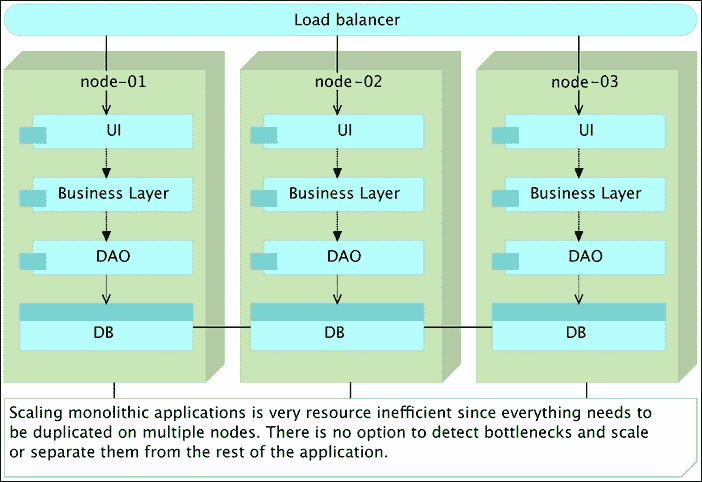

图 14-2 – 在集群内部扩展的单体应用

### Y 轴扩展

Y 轴扩展关注的是将应用程序分解成更小的服务。尽管有不同的方法可以完成这种分解，微服务可能是我们可以采取的最佳方法。当它们与不可变性和自足性结合时，的确没有更好的选择（至少从 Y 轴扩展的角度来看）。与 X 轴扩展不同，Y 轴扩展并不是通过运行多个相同实例的应用来实现，而是通过将多个不同的服务分布在集群中来实现。

### Z 轴扩展

Z 轴扩展很少应用于应用程序或服务。它的主要和最常见的应用是在数据库中。这种扩展的背后思想是将数据分布到多个服务器之间，从而减少每个服务器需要执行的工作量。数据被分割和分布，使得每个服务器只需要处理数据的一个子集。这种分割方式通常被称为分片（sharding），并且有许多数据库是专门为此目的设计的。Z 轴扩展的好处在于 I/O 操作和缓存与内存利用率上的显著提升。

## 集群

服务器集群由一组连接在一起的服务器组成，这些服务器协同工作，并且可以被视为一个单一的系统。它们通常通过高速局域网（LAN）连接。集群与普通服务器组的主要区别在于，集群作为一个单一系统，旨在提供高可用性、负载均衡和并行处理。

如果我们将应用程序或服务部署到单独管理的服务器上，并将它们视为独立单元，那么资源的利用率将会低于最佳水平。我们无法提前知道哪些服务组应该部署到某台服务器上，并最大化资源利用率。更重要的是，资源使用往往会波动。例如，早晨某个服务可能需要大量内存，而下午该服务的内存使用量可能会较低。预定义的服务器无法提供足够的弹性，以最佳方式平衡这种资源使用。即使不需要如此高程度的动态性，预定义的服务器也会在出现故障时造成问题，导致需要手动重新部署受影响的服务到健康节点：


图 14-3 – 部署到预定义服务器的集群与容器

真正的集群是在我们停止考虑单独的服务器，而开始考虑整个集群时实现的；把所有服务器视为一个大的整体。如果我们稍微降到较低的层次，可以更好地解释这一点。当我们部署应用程序时，通常会指定它可能需要多少内存或 CPU。然而，我们并不决定应用程序将使用哪些内存插槽，或它应该利用哪些 CPU。例如，我们不会指定某个应用程序应该使用 CPU 4、5 和 7。这样做既低效又可能危险。我们只决定需要多少 CPU。我们应该在更高的层次上采取相同的做法。我们不应该关心应用程序或服务将部署到哪里，而是关心它需要什么。我们应该能够定义该服务的具体需求，并告诉某个工具将它部署到集群中的任何服务器，只要它满足我们的需求。实现这一目标的最佳方法（如果不是唯一的方法）就是将整个集群视为一个整体。我们可以通过增加或移除服务器来增加或减少集群的容量，但无论我们做什么，集群仍然应该是一个单一的整体。我们定义一个策略，并让我们的服务在集群内的某个地方部署。像**Amazon Web Services**（**AWS**）、微软的 Azure 和**Google Cloud Engine**（**GCP**）等云服务提供商的用户，尽管可能没有意识到，但已经习惯了这种方式。

在本章接下来的部分，我们将探索创建集群的方法，并探讨一些可以帮助我们实现这一目标的工具。我们将在本地模拟集群，这并不意味着这些相同的策略无法应用于公有云、私有云和数据中心。恰恰相反：

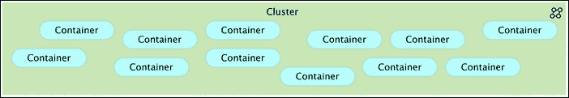

图 14-4 – 根据预定义策略部署到服务器的集群与容器

## Docker 集群工具比较 – Kubernetes 与 Docker Swarm 与 Mesos

Kubernetes 和 Docker Swarm 可能是当前最常用的两个容器部署工具。它们都是作为辅助平台创建的，可用于管理集群中的容器，并将所有服务器视为一个整体。虽然它们的目标在某种程度上相似，但在方法上有显著差异。

### Kubernetes

Kubernetes 基于 Google 多年来使用 Linux 容器的经验。从某种意义上说，它是 Google 长期以来所做工作的复制品，但这一次，它是为 Docker 量身定制的。这个方法在很多方面都很棒，最重要的是他们从一开始就利用了自己的经验。如果你在 Docker 1.0 版本（或更早）左右开始使用 Kubernetes，Kubernetes 的体验非常好。它解决了 Docker 本身的许多问题。我们可以挂载持久化卷，使我们能够在不丢失数据的情况下移动容器，它使用 flannel 在容器之间创建网络，它集成了负载均衡器，使用 etcd 进行服务发现，等等。然而，Kubernetes 是有代价的。与 Docker 相比，它使用了不同的 CLI、不同的 API 和不同的 YAML 定义。换句话说，你不能使用 Docker CLI，也不能使用 Docker Compose 来定义容器。所有的操作都必须从头开始，完全为 Kubernetes 定制。就好像这个工具并不是为 Docker 编写的（某种程度上是事实）。Kubernetes 将集群管理提升到了一个新层次，但代价是可用性和陡峭的学习曲线。

### Docker Swarm

Docker Swarm 采取了不同的方法。它是 Docker 的本地集群管理工具。最棒的部分是它暴露了标准的 Docker API，这意味着你曾经用来与 Docker 交互的任何工具（Docker CLI、Docker Compose、Dokku、Krane 等）都可以与 Docker Swarm 完美兼容。这本身既是优点也是缺点。能够使用你熟悉的工具当然很好，但正因为如此，我们也受限于 Docker API 的限制。如果 Docker API 不支持某个功能，那么 Swarm API 也无法绕过这个问题，需要一些巧妙的技巧来实现。

### Apache Mesos

接下来可以用来管理集群的工具是 Apache Mesos。它是集群管理的老兵。Mesos 将 CPU、内存、存储和其他资源从机器（物理或虚拟）中抽象出来，使得容错和弹性分布式系统能够轻松构建并高效运行。

Mesos 使用与 Linux 内核相同的原理，只是抽象的层次不同。Mesos 内核运行在每台机器上，为应用程序提供资源管理和调度的 API，覆盖整个数据中心和云环境。与 Kubernetes 和 Docker Swarm 不同，Mesos 不限于容器。它几乎可以与任何类型的部署工作，包括 Docker 容器。

Mesos 使用 Zookeeper 进行服务发现。它使用 Linux 容器来隔离进程。例如，如果我们在不使用 Docker 的情况下部署 Hadoop，Mesos 会将其作为一个本地 Linux 容器运行，提供类似于将其打包为 Docker 容器的功能。

Mesos 提供了一些 Swarm 当前没有的功能，主要是更强大的调度器。除了调度器之外，使 Mesos 吸引人的地方在于，我们可以将其用于 Docker 和非 Docker 部署。许多组织可能不想使用 Docker，或者他们可能决定同时使用 Docker 和非 Docker 部署的组合。在这种情况下，如果我们不想处理两套集群工具——一种用于容器，另一种用于其他部署——Mesos 真的是一个很好的选择。

然而，Mesos 有些过时，并且对我们想要实现的目标来说过于庞大。更重要的是，Docker 容器是其事后添加的。该平台最初并没有为 Docker 设计，但后来才添加了对 Docker 的支持。与 Docker 一起使用 Mesos 感觉很别扭，并且从一开始就显而易见，这两者并不是为了共同使用而设计的。考虑到 Swarm 和 Kubernetes 的存在，Mesos 对那些决定拥抱 Docker 的人来说已经毫无优势。Mesos 正在落后。它相较于另外两种工具的主要优势是广泛的采用。许多人在 Docker 出现之前就开始使用它，并可能选择继续使用它。对于那些可以重新开始的人，选择应该在 Kubernetes 和 Docker Swarm 之间做出。

我们将更详细地探讨 Kubernetes 和 Docker Swarm，抛开 Mesos。探索将基于它们的设置和它们为在集群中运行容器提供的功能。

## 设置它

设置 Docker Swarm 既简单又直接，且具有灵活性。我们需要做的就是安装其中一个服务发现工具，并在所有节点上运行 `swarm` 容器。由于该分发本身已打包在 Docker 容器中，因此无论操作系统如何，它的工作方式都相同。我们运行 `swarm` 容器，暴露端口，并告知其服务发现地址。做到这一点几乎不可能更简单了。我们甚至可以在没有任何服务发现工具的情况下开始使用它，看看是否喜欢，并在使用变得更加严肃时，添加 etcd、Consul 或其他支持的工具。

Kubernetes 的设置要复杂得多且不透明。安装说明因操作系统和提供商而异。每个操作系统或托管提供商都有自己的安装说明，每个说明都有不同的维护团队，面临不同的问题。例如，如果你选择使用 Vagrant 来尝试，那么你就只能使用 Fedora。这并不意味着你不能在 Vagrant 上运行它，并且选择使用 Ubuntu 或 CoreOS 也是可以的。你可以，但需要开始在官方 Kubernetes 入门页面以外寻找说明。无论你的需求是什么，社区很可能已经有了解决方案，但你仍然需要花费一些时间去寻找，并希望它能够在第一次尝试时就成功。更大的问题是，安装依赖于一个 bash 脚本。如果我们不生活在一个配置管理成为必须的时代，这本身并不是一个大问题。如果我们不想运行脚本，而是希望 Kubernetes 成为我们 Puppet、Chef 或 Ansible 配置的一部分，那也可以克服。你可以找到用于运行 Kubernetes 的 Ansible 剧本，或者编写自己的剧本。虽然这些问题并不算大问题，但与 Swarm 相比，它们还是有点痛苦。对于 Docker，我们本应不需要安装说明（除了几个 `docker run` 参数）。我们本应只运行容器。Swarm 实现了这个承诺，而 Kubernetes 并没有。

虽然有些人可能不在乎使用哪个发现工具，但我喜欢 Swarm 的简单性以及“包含电池但可拆卸”的逻辑。一切开箱即用，但我们仍然可以选择替换其中的某个组件。与 Swarm 不同，Kubernetes 是一个有明确观点的工具。你需要接受它为你做出的选择。如果你想使用 Kubernetes，你必须使用 etcd。我并不是说 etcd 很差（恰恰相反），但如果你比如说更喜欢使用 Consul，那么你就会陷入一个非常复杂的局面，你需要为 Kubernetes 使用一个工具，而为其他服务发现需求使用另一个工具。我还不喜欢 Kubernetes 的另一点是它需要在设置之前就知道一些事情。你需要告诉它所有节点的地址、每个节点的角色、集群中有多少个从节点等等。而使用 Swarm，我们只需要启动一个节点并让它加入网络。无需提前设置任何信息，因为集群的相关信息会通过 `gossip` 协议进行传播。

设置可能不是这些工具之间最显著的区别。无论选择哪个工具，迟早一切都会顺利运行，你会忘记在过程中遇到的任何问题。你可能会说，我们不应仅因为某个工具更容易设置而选择它。这个说法有道理。我们继续讨论如何定义应该使用这些工具运行的容器之间的区别。

## 运行容器

你如何定义在 Swarm 中运行 Docker 容器所需的所有参数？你不需要！其实，你需要，但这与你在 Swarm 之前定义它们的方式没有任何不同。如果你习惯通过 Docker CLI 运行容器，你可以继续使用它，几乎是相同的命令。如果你更喜欢使用 Docker Compose 来运行容器，你可以继续在 Swarm 集群中使用它来运行容器。不管你以前是如何运行容器的，你很可能可以继续用相同的方式在 Swarm 上运行，只不过是在更大规模上。

Kubernetes 要求你学习它的 CLI 和配置。你不能使用你之前创建的 `docker-compose.yml` 定义。你必须创建 Kubernetes 的等效配置。你不能使用你之前学过的 Docker CLI 命令。你必须学习 Kubernetes CLI，并且很可能需要确保整个组织也都学会它。

无论你选择哪个工具来进行集群部署，很可能你已经熟悉 Docker。你可能已经习惯了使用 Docker Compose 来定义你将运行的容器的参数。如果你玩了几个小时，你已经在将 Docker Compose 当作 Docker CLI 的替代品使用了。你用它来运行容器、查看日志、扩展容器，等等。另一方面，你可能是一个硬核的 Docker 用户，不喜欢 Docker Compose，宁愿通过 Docker CLI 来运行一切，或者你可能有自己的 bash 脚本来为你运行容器。无论你选择什么，它都应该能与 Docker Swarm 一起使用。

如果你采用 Kubernetes，做好准备，你将会有多个不同的定义来描述相同的事物。你需要 Docker Compose 来在 Kubernetes 之外运行你的容器。开发人员仍然需要在他们的笔记本电脑上运行容器，你的暂存环境可能是一个大集群，也可能不是，等等。

换句话说，一旦你采用了 Docker，Docker Compose 或 Docker CLI 是不可避免的。你必须以某种方式使用它们。一旦你开始使用 Kubernetes，你会发现所有的 Docker Compose 定义（或你可能在使用的其他工具）需要转换为 Kubernetes 描述事物的方式，之后你将不得不同时维护两者。在 Kubernetes 中，一切都需要被重复定义，导致更高的维护成本。而且这不仅仅是关于重复的配置。你在集群外运行的命令将与在集群内运行的命令不同。你学会并喜爱的所有 Docker 命令，将不得不在集群内找到它们的 Kubernetes 对应命令。

Kubernetes 背后的团队并不是想通过强迫你按“他们的方式”做事来让你的生活变得痛苦。这么大的差异的原因在于 Swarm 和 Kubernetes 采用了不同的方法来解决相同的问题。Swarm 团队决定将其 API 与 Docker 的 API 相匹配。结果，我们几乎实现了完全兼容。几乎所有 Docker 可以做的事情，Swarm 也能做，只不过是规模更大。没有什么新东西要做，也没有配置需要重复，也没有什么新东西要学习。无论你是直接使用 Docker CLI 还是通过 Swarm，API （或多或少）都是相同的。这种做法的负面一面是，如果你希望 Swarm 执行某些 Docker API 没有的操作，那么你就会失望。让我们简化一下。如果你正在寻找一个用于在集群中部署容器的工具，并且希望使用 Docker API，那么 Swarm 就是解决方案。另一方面，如果你需要一个能够克服 Docker 限制的工具，那么你应该选择 Kubernetes。它是功能（Kubernetes）与简易性（Swarm）之间的较量。或者，至少直到最近，它一直是这样。但，我现在有些超前了。

唯一未解答的问题是这些限制是什么。两个主要的限制是网络、持久化卷和在一个或多个容器或整个节点停止工作时的自动故障转移。

在 Docker Swarm 1.0 发布之前，我们不能将运行在不同服务器上的容器进行链接。我们现在依然无法将它们链接起来，但现在我们有了 `multi-host networking` 来帮助我们连接在不同服务器上运行的容器。这是一个非常强大的功能。Kubernetes 使用 `flannel` 来实现网络连接，现在自 Docker 1.9 版本起，该功能已作为 Docker CLI 的一部分提供。

另一个问题是持久化卷。Docker 在 1.9 版本中引入了持久化卷。直到最近，如果你持久化一个卷，那么该容器就会绑定到存储该卷的服务器上。它无法在没有一些复杂操作的情况下被迁移，比如从一台服务器复制卷目录到另一台服务器。这个操作本身就是一个非常慢的过程，违背了像 Swarm 这类工具的目标。此外，即使你有时间将卷从一台服务器复制到另一台，你也不知道该复制到哪里，因为集群工具往往将整个数据中心视为一个单一的实体。你的容器会被部署到最适合它们的位置（容器运行数量最少，CPU 或内存可用最多，等等）。现在，Docker 本身就原生支持持久化卷。

最后，自动故障转移可能是 Kubernetes 相比 Swarm 唯一的特性优势。然而，Kubernetes 提供的故障转移解决方案并不完整。如果一个容器崩溃，Kubernetes 会检测到并在健康的节点上重新启动它。问题在于，容器或整个节点通常不会无缘无故地失败。所需的工作远远超过简单的重新部署。需要有人被通知，故障前的信息需要进行评估，等等。如果仅仅需要重新部署，Kubernetes 是一个不错的解决方案。如果需要更多的功能，由于 Swarm 提供的“自带但可移除”的哲学，它允许你构建自己的解决方案。在故障转移方面，问题在于是选择一个开箱即用且难以扩展的解决方案（Kubernetes），还是选择一个为了容易扩展而构建的解决方案（Swarm）。

网络和持久卷的问题曾是 Kubernetes 支持的特性之一，也是许多人选择它而不是 Swarm 的原因。然而，这一优势在 Docker 1.9 版本发布后消失了。自动故障转移仍然是 Kubernetes 相较于 Swarm 的一个优势，尤其是在考虑开箱即用的解决方案时。对于 Swarm，我们需要自己开发故障转移策略。

## 选择

在做出 Docker Swarm 和 Kubernetes 之间的选择时，可以从以下几个方面进行思考。你是否希望依赖 Docker 来解决与集群相关的问题？如果是的话，选择 Swarm。如果 Docker 不支持某些功能，那么 Swarm 也不太可能支持这些功能，因为它依赖于 Docker API。另一方面，如果你希望使用一个能够绕过 Docker 限制的工具，Kubernetes 可能更适合你。Kubernetes 不是围绕 Docker 构建的，而是基于 Google 在容器方面的经验。它有明确的理念，并且尝试以自己的方式做事。

真正的问题是 Kubernetes 的做事方式，与我们使用 Docker 的方式完全不同，是否被它提供的优势所掩盖。或者，我们应该把赌注押在 Docker 本身上，并希望它能解决这些问题？在你回答这些问题之前，看一看 Docker 的 1.9 版本。我们得到了持久卷和软件网络。我们还得到了 `unless-stopped` 重启策略，可以管理我们不想要的故障。现在，Kubernetes 和 Swarm 之间的差距已经变少了。事实上，如今 Kubernetes 比 Swarm 拥有的优势已经很少了。Kubernetes 提供的自动故障转移既是一种福音，又是一种诅咒。另一方面，Swarm 使用 Docker API，这意味着您可以保留所有命令和 Docker Compose 配置。就我个人而言，我把赌注押在 Docker 引擎的改进和运行在其上的 Docker Swarm 上。这两者之间的差异很小。两者都已经准备好投入生产，但 Swarm 更容易设置，更易于使用，并且在移动到集群之前，我们可以保留所有之前构建的内容；在集群和非集群配置之间没有重复。

我的建议是选择 Docker Swarm。Kubernetes 太过于主观，设置困难，与 Docker CLI/API 有很大不同，并且除了自动故障转移之外，在 Docker 1.9 版本发布之后，它没有真正的优势。这并不意味着 Kubernetes 没有不受 Swarm 支持的功能。在两个方向上都存在功能差异。然而，在我看来，这些差异并不是重大的，而且随着每个 Docker 版本的发布，这种差距正在变小。实际上，对于许多用例来说，根本就没有差距，而 Docker Swarm 更容易设置、学习和使用。

让我们来试试 Docker Swarm，并看看它的表现如何。

# Docker Swarm 演练

要设置 Docker Swarm，我们需要其中一种服务发现工具。Consul 在这方面表现良好，我们将继续使用它。它是一个很棒的工具，并且与 Swarm 配合良好。我们将设置三个服务器。一个将充当主节点，另外两个将作为集群节点：

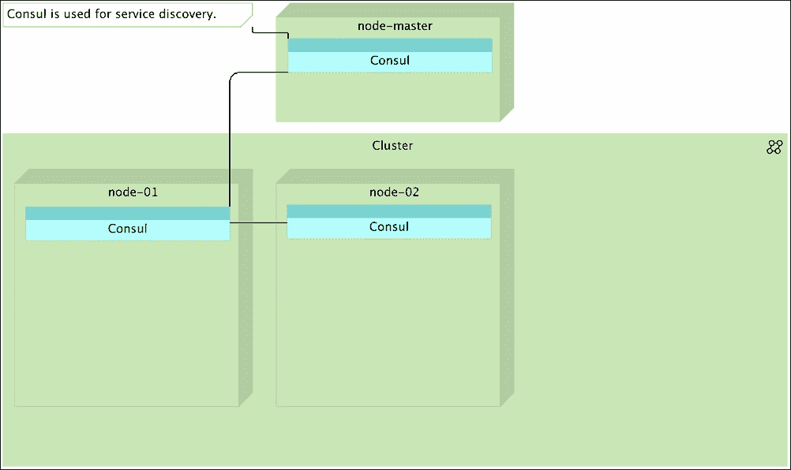

图 14-5 – 使用 Consul 的 Docker Swarm 集群进行服务发现

Swarm 将使用 Consul 实例来注册和检索有关节点和其上部署的服务的信息。每当我们启动一个新节点或停止一个现有节点时，该信息会传播到所有 Consul 实例并传递到 Docker Swarm，后者会知道在哪里部署我们的容器。主节点将运行 Swarm 主程序。我们将使用其 API 来指示 Swarm 部署什么内容以及其要求是什么（如 CPU 数量、内存大小等）。节点服务器将部署 Swarm 节点。每当 Swarm 主节点收到部署容器的指令时，它会评估当前集群的状态，并将指令发送到某个节点执行部署：

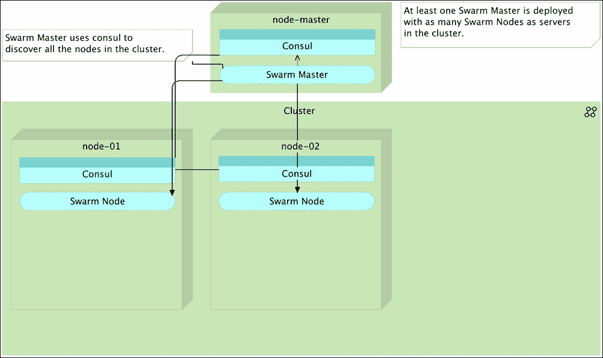

图 14-6 – Docker Swarm 集群，包含一个主节点和两个节点

我们将从*分布*策略开始，该策略会将容器部署到运行容器数量最少的节点上。由于开始时所有节点都是空的，当给出部署第一个容器的指令时，Swarm 主节点会将容器部署到其中一个节点，因为此时两个节点都是空的：

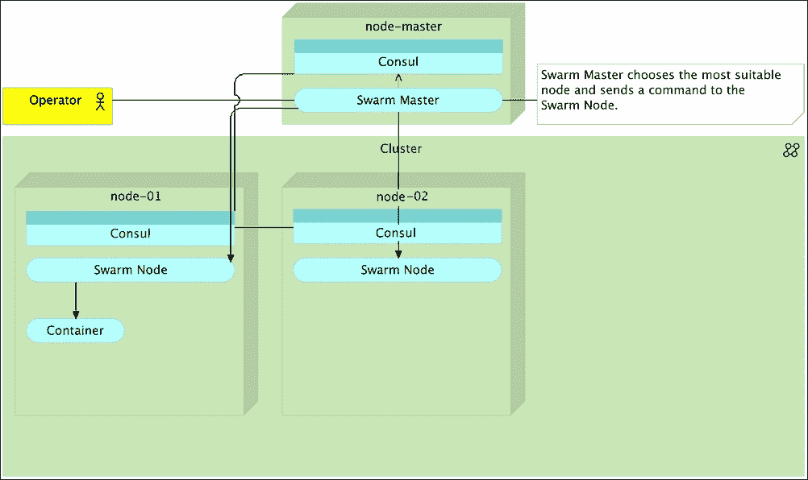

图 14-7 – Docker Swarm 集群，已部署第一个容器

当收到第二个容器部署指令时，Swarm 主节点会决定将其传播到另一个 Swarm 节点，因为第一个节点已经有一个容器在运行：

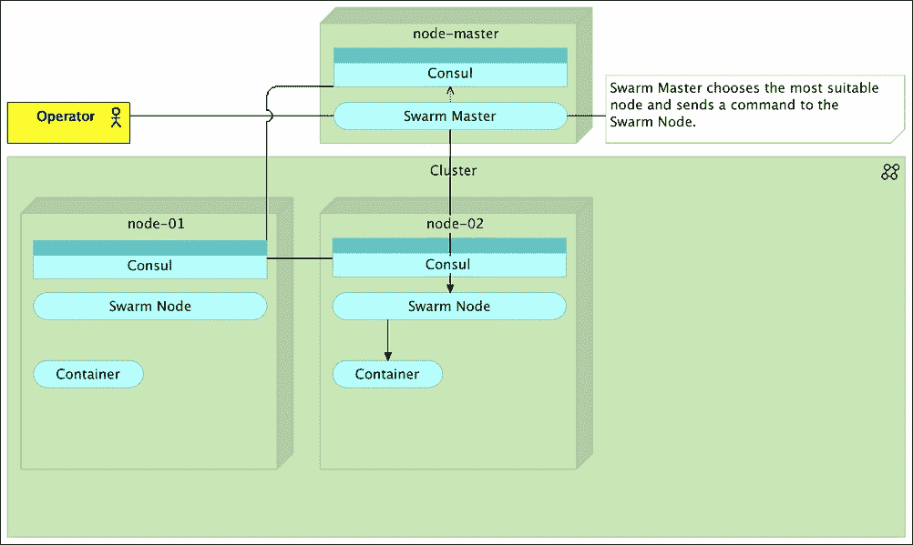

图 14-8 – Docker Swarm 集群，已部署第二个容器

如果我们继续部署容器，过一段时间后我们的微型集群将会变得饱和，在服务器崩溃之前必须采取一些措施：

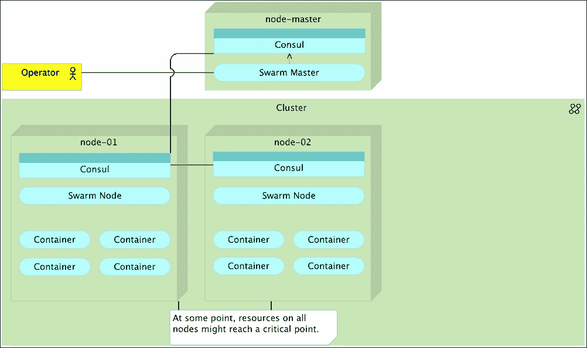

图 14-9 – Docker Swarm 集群，所有节点已满

我们需要做的唯一事情来增加集群容量，就是启动一台新的服务器并部署 Consul 和 Swarm 节点。只要这样的节点被启动，它的信息就会在所有 Consul 实例之间传播，并传递到 Swarm 主节点。从那一刻起，Swarm 会将这个节点包含在内，作为所有新部署的一部分。由于这台服务器启动时没有容器，并且我们使用的是简单的*分布*策略，所有新部署的容器都会部署到这个节点，直到它运行的容器数量与其他节点相同：

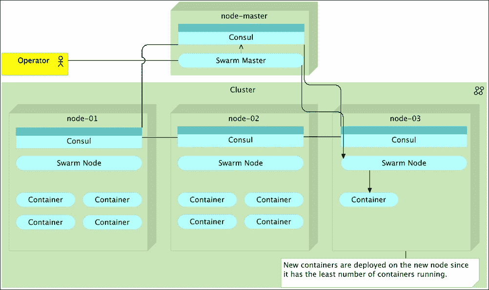

图 14-10 – Docker Swarm 集群，容器部署到新节点

在某个节点因故障停止响应的情况下，可以观察到相反的情况。Consul 集群会检测到其某个成员未响应，并将该信息传播到整个集群，从而到达 Swarm 主节点。从那一刻起，所有新部署的容器都会被发送到健康节点之一：

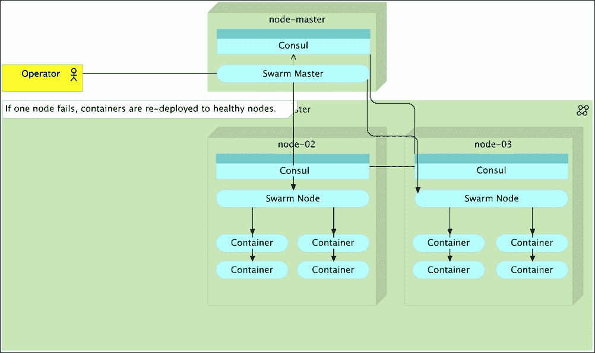

图 14-11 – Docker Swarm 集群，某个节点失败，容器分布到健康的节点上

让我们深入讨论刚才提到的简单示例。稍后，我们将探索其他策略以及在设置某些约束时 Swarm 的行为方式；例如 CPU、内存等。

# 设置 Docker Swarm

要看到 Docker Swarm 的工作过程，我们将模拟一个 Ubuntu 集群。我们将启动用于编排的 `cd` 节点，一个将充当 Swarm 主节点的节点以及两个将形成集群的节点。到目前为止，我们始终使用 Ubuntu 14.04 LTS（长期支持），因为它被认为是稳定且长期受支持的。下一个长期支持版本将是 15.04 LTS（在书写本书时尚未发布）。由于我们稍后将要探索的一些功能需要相对较新的内核，`swarm` 节点将运行 Ubuntu 15.04\. 如果您打开 Vagrantfile，您会注意到 Swarm 主节点和节点有以下行：

```
d.vm.box = "ubuntu/vivid64"

```

`Vivid64` 是 Ubuntu 15.04 的代号。

让我们启动节点：

```
vagrant up cd swarm-master swarm-node-1 swarm-node-2

```

所有四个节点都已启动并运行，我们可以继续创建 Swarm 集群。与以往一样，我们将使用 Ansible 进行配置：

```
vagrant ssh cd
ansible-playbook /vagrant/ansible/swarm.yml \
 -i /vagrant/ansible/hosts/prod

```

让我们明智地利用时间，探索 `swarm.yml` playbook，同时 Ansible 正在为我们的服务器进行配置。`swarm.yml` 文件的内容如下：

```
- hosts: swarm
 remote_user: vagrant
 serial: 1
 sudo: yes
 vars:
 - debian_version: vivid
 - docker_cfg_dest: /lib/systemd/system/docker.service
 - is_systemd: true
 roles:
 - common
 - docker
 - consul
 - swarm
 - registrator

```

我们从设置 *docker* 开始。由于这次我们使用的是不同版本的 Ubuntu，因此我们必须将这些差异作为变量进行指定，以便使用正确的存储库 (`debian_version`)，以及重新加载服务配置 (`is_systemd`)。我们还设置了 `docker_cfg_dest` 变量，以便将配置文件发送到正确的位置。

我们在 `hosts/prod` 文件中设置了几个额外的变量：

```
[swarm]
10.100.192.200 swarm_master=true consul_extra="-server -bootstrap-expect 1" docker_cfg=docker-swarm-master.service
10.100.192.20[1:2] swarm_master_ip=10.100.192.200 consul_server_ip=10.100.192.200 docker_cfg=docker-swarm-node.service

```

我们稍后将探索 `swarm_master` 和 `swarm_master_ip`。现在，请记住它们在 `prod` 文件中定义，以便根据服务器类型（主节点或节点）应用（或省略）它们。根据我们是配置主节点还是节点，Docker 配置文件分别为 `docker-swarm-master.service` 或 `docker-swarm-node.service`。

让我们来看看 `roles/docker/templates/docker-swarm-master.service` 中主节点 Docker 配置的 `ExecStart` 部分（其余部分与 Docker 软件包提供的标准配置相同）：

```
ExecStart=/usr/bin/docker daemon -H fd:// \
 --insecure-registry 10.100.198.200:5000 \
 --registry-mirror=http://10.100.198.200:5001 \
 --cluster-store=consul://{{ ip }}:8500/swarm \
 --cluster-advertise={{ ip }}:2375 {{ docker_extra }}

```

我们告诉 Docker 在我们的私有注册表运行的 IP/端口上允许不安全注册。我们还指定 Swarm 集群信息应存储在同一节点上运行的 Consul 中，并且应该广播到端口 `2375`：

在 `roles/docker/templates/docker-swarm-node.service` 中定义的节点配置有几个额外的参数：

```
ExecStart=/usr/bin/docker daemon -H fd:// \
 -H tcp://0.0.0.0:2375 \
 -H unix:///var/run/docker.sock \
 --insecure-registry 10.100.198.200:5000 \
 --registry-mirror=http://10.100.198.200:5001 \
 --cluster-store=consul://{{ ip }}:8500/swarm \
 --cluster-advertise={{ ip }}:2375 {{ docker_extra }}

```

除了与主节点相同的参数外，我们还告诉 Docker 允许通过端口 `2375` (`-H tcp://0.0.0.0:2375`) 和通过套接字 (`-H unix:///var/run/docker.sock`) 进行通信：

`master`和`node`配置都遵循官方 Docker Swarm 文档中推荐的标准设置，特别是与 Consul 一起使用时。

`swarm.yml` playbook 中使用的其余角色有`consul`、`swarm`和`registrator`。由于我们已经使用并看到过 Consul 和 Registrator 角色，接下来我们只探索`roles/swarm/tasks/main.yml`文件中定义的`swarm`角色相关任务：

```
- name: Swarm node is running
  docker:
    name: swarm-node
    image: swarm
    command: join --advertise={{ ip }}:2375 consul://{{ ip }}:8500/swarm
    env:
      SERVICE_NAME: swarm-node
  when: not swarm_master is defined
  tags: [swarm]

- name: Swarm master is running
  docker:
    name: swarm-master
    image: swarm
    ports: 2375:2375
    command: manage consul://{{ ip }}:8500/swarm
    env:
      SERVICE_NAME: swarm-master
  when: swarm_master is defined
  tags: [swarm]
```

如你所见，运行 Swarm 相当简单。我们需要做的就是运行`swarm`容器，并根据它是主节点还是普通节点，指定不同的命令。如果服务器作为 Swarm 节点运行，使用的命令是`join --advertise={{ ip }}:2375 consul://{{ ip }}:8500/swarm`，翻译成通俗的语言就是：它应该加入集群，在端口`2375`上发布自己的存在，并使用在同一服务器上运行的 Consul 进行服务发现。在 Swarm 主节点上使用的命令则更短；`manage consul://{{ ip }}:8500/swarm`。我们只需要指定这个 Swarm 容器应该用来管理集群，并且与 Swarm 节点一样，使用 Consul 进行服务发现。

希望我们之前运行的 playbook 已经完成执行。如果没有，去喝杯咖啡，等它执行完再继续阅读。接下来我们将检查我们的 Swarm 集群是否按预期工作。

由于我们仍然在`cd`节点内，我们应该告诉 Docker CLI 使用不同的主机。

```
export DOCKER_HOST=tcp://10.100.192.200:2375

```

在`cd`上运行 Docker 客户端，并使用`swarm-master`节点作为主机，我们可以远程控制 Swarm 集群。首先，我们可以查看集群的相关信息：

```
docker info

```

输出如下：

```
Containers: 4
Images: 4
Role: primary
Strategy: spread
Filters: health, port, dependency, affinity, constraint
Nodes: 2
 swarm-node-1: 10.100.192.201:2375
 └ Status: Healthy
 └ Containers: 3
 └ Reserved CPUs: 0 / 1
 └ Reserved Memory: 0 B / 1.535 GiB
 └ Labels: executiondriver=native-0.2, kernelversion=3.19.0-42-generic, operatingsystem=Ubuntu 15.04, storagedriver=devicemapper
 swarm-node-2: 10.100.192.202:2375
 └ Status: Healthy
 └ Containers: 3
 └ Reserved CPUs: 0 / 1
 └ Reserved Memory: 0 B / 1.535 GiB
 └ Labels: executiondriver=native-0.2, kernelversion=3.19.0-42-generic, operatingsystem=Ubuntu 15.04, storagedriver=devicemapper
CPUs: 2
Total Memory: 3.07 GiB
Name: b358fe59b011

```

这不是很棒吗？只需一个命令，我们就能查看整个集群的概览。虽然目前我们只有两台服务器（`swarm-node-1`和`swarm-node-2`），但如果有一百台、一千台甚至更多的节点，`docker info`会提供所有节点的信息。在这种情况下，我们可以看到四个容器正在运行，并且有四个镜像。这是正确的，因为每个节点都在运行 Swarm 和 Registrator 容器。接下来，我们可以看到`Role`、`Strategy`和`Filters`。然后是构成集群的各个节点，后面是每个节点的信息。我们可以看到每个节点正在运行多少个容器（当前是两个），为容器预留了多少 CPU 和内存，以及与每个节点关联的标签。最后，我们还可以看到整个集群的 CPU 和内存总数。`docker info`展示的所有信息不仅是数据，也是 Swarm 集群的功能。现在请注意，所有这些信息都可以用来检查。稍后我们会探索如何利用这些信息来为我们带来更多好处。

Docker Swarm 的最大优点在于它与 Docker 使用相同的 API，因此我们在本书中已经使用过的所有命令都可以继续使用。唯一的区别是，使用 Swarm 时，我们操作的是整个集群，而不是单一服务器。例如，我们可以列出整个 Swarm 集群中的所有镜像和进程：

```
docker images

docker ps -a

```

通过运行 `docker images` 和 `docker ps -a`，我们可以观察到集群中拉取了两个镜像，并且有四个容器在运行（每台服务器上各有两个容器）。唯一的视觉差异是，运行的容器名称前面会加上它们运行的服务器的名称。例如，名为 `registrator` 的容器显示为 `swarm-node-1/registrator` 和 `swarm-node-2/registrator`。这两个命令的组合输出如下：

```
REPOSITORY               TAG                 IMAGE ID            CREATED             VIRTUAL SIZE
swarm                    latest              a9975e2cc0a3        4 weeks ago         17.15 MB
gliderlabs/registrator   latest              d44d11afc6cc        4 months ago        20.93 MB
...
CONTAINER ID        IMAGE                    COMMAND                  CREATED             STATUS              PORTS                           NAMES
a2c7d156c99d        gliderlabs/registrator   "/bin/registrator -ip"   2 hours ago         Up 2 hours                                          swarm-node-2/registrator
e9b034aa3fc0        swarm                    "/swarm join --advert"   2 hours ago         Up 2 hours          2375/tcp                        swarm-node-2/swarm-node
a685cdb09814        gliderlabs/registrator   "/bin/registrator -ip"   2 hours ago         Up 2 hours                                          swarm-node-1/registrator
5991e9bd2a40        swarm                    "/swarm join --advert"   2 hours ago         Up 2 hours          2375/tcp                        swarm-node-1/swarm-node

```

现在我们知道，在远程服务器（`swarm-master`）上运行 Docker 命令时，它的工作方式与本地一样，并且可以用来控制整个集群（`swarm-node-1` 和 `swarm-node-2`）。让我们尝试部署我们的 `books-ms` 服务。

## 使用 Docker Swarm 部署

我们将从重复之前的部署过程开始，但这次我们将向 Swarm 主节点发送命令：

```
git clone https://github.com/vfarcic/books-ms.git

cd ~/books-ms

```

我们克隆了 `books-ms` 仓库，现在可以通过 Docker Compose 运行该服务：

```
docker-compose up -d app

```

由于 `app` 目标与 `db` 目标相连，Docker Compose 一并启动了它们。目前为止，效果与我们在没有 Docker Swarm 的情况下运行相同命令的情况没有什么不同。让我们来看一下创建的进程：

```
docker ps --filter name=books --format "table {{.Names}}"

```

输出结果如下：

```
NAMES
swarm-node-2/booksms_app_1
swarm-node-2/booksms_app_1/booksms_db_1,swarm-node-2/booksms_app_1/db,swarm-node-2/booksms_app_1/db_1,swarm-node-2/booksms_db_1

```

如我们所见，这两个容器都在 `swarm-node-2` 上运行。在你的情况下，它可能是 `swarm-node-1`。我们并没有决定在哪里部署容器，Swarm 为我们做了这个决定。因为我们使用的是默认策略，它会在没有指定额外约束的情况下，将容器部署到正在运行容器数量最少的服务器上。由于 `swarm-node-1` 和 `swarm-node-2` 都是空闲状态（或都已满），Swarm 很容易做出选择，并可以将容器部署到其中任何一台服务器上。在这个例子中，它选择了 `swarm-node-2`。

我们刚才执行的部署存在一个问题，即两个目标（`app` 和 `db`）是相互链接的。在这种情况下，Docker 别无选择，只能将这两个容器放在同一台服务器上。这从某种意义上说违背了我们想要实现的目标。我们希望将容器部署到集群中，并且正如你很快会发现的那样，能够轻松地扩展它们。如果这两个容器必须运行在同一台服务器上，那么我们就限制了 Swarm 正确分布它们的能力。在这个例子中，这两个容器最好运行在不同的服务器上。如果在部署这些容器之前，两个服务器上运行的容器数量相等，那么将 `app` 运行在一个服务器上，将 `db` 运行在另一个服务器上会更有意义。这样我们就能更好地分配资源使用。现在，`swarm-node-2` 必须承担所有工作，而 `swarm-node-1` 是空闲的。我们首先应该做的是去除链接。

让我们停止正在运行的容器并重新开始：

```
docker-compose stop

docker-compose rm -f

```

这又是 Swarm 提供的另一个优势示例。我们将 `stop` 和 `rm` 命令发送给 Swarm 主节点，它为我们定位了容器。从现在起，所有行为将是相同的，意味着通过 Swarm 主节点，我们将把整个集群当作一个单一的单位来处理，而不关心每台服务器的具体情况。

## 在没有链接的情况下使用 Docker Swarm 部署

为了正确地将容器部署到 Docker Swarm 集群中，我们将使用一个不同的文件来定义 Docker Compose；`docker-compose-no-links.yml`。目标如下：

```
app:
 image: 10.100.198.200:5000/books-ms
 ports:
 - 8080

db:
 image: mongo

```

在 `docker-compose.yml` 和 `docker-compose-swarm.yml` 中定义的 `app` 和 `db` 目标之间唯一显著的区别是，后者没有使用链接。正如你很快会看到的，这将允许我们在集群内自由地分配容器。

让我们看看如果我们在没有链接的情况下启动 *db* 和 *app* 容器会发生什么。

```
docker-compose -f docker-compose-no-links.yml up -d db app

docker ps --filter name=books --format "table {{.Names}}"

```

`docker ps` 命令的输出如下：

```
NAMES
swarm-node-1/booksms_db_1
swarm-node-2/booksms_app_1

```

正如你所看到的，这次，Swarm 决定将每个容器放置在不同的服务器上。它启动了第一个容器，并且由于从那时起一台服务器上的容器数量多于另一台，它选择在另一个节点上启动第二个容器。

通过移除容器之间的链接，我们解决了一个问题，但引入了另一个问题。现在我们的容器可以更有效地分布，但它们无法相互通信。我们可以通过使用 `proxy` 服务（如 nginx、HAProxy 等）来解决这个问题。然而，我们的 `db` 目标没有对外暴露任何端口。一个好的做法是仅暴露那些对外公开的服务端口。因此，`app` 目标暴露了端口 `8080`，而 `db` 目标没有暴露任何端口。`db` 目标仅供内部使用，并且仅供 `app` 使用。从 Docker 1.9 版本开始，链接可以被视为已废弃，因为出现了一个名为 *networking* 的新特性：

让我们删除容器并尝试启用网络功能启动它们：

```
docker-compose -f docker-compose-no-links.yml sto
p

docker-compose -f docker-compose-no-links.yml rm -f

```

## 使用 Docker Swarm 和 Docker 网络部署

在我写这章时，Docker 推出了新的 1.9 版本。这无疑是自 1.0 版本以来最重要的版本。它给我们带来了两个期待已久的功能：多主机网络和持久化存储卷。网络功能使得链接功能不再被推荐使用，这是我们连接跨多个主机的容器所需要的功能。现在不再需要代理服务来进行容器内部的连接。这并不是说代理不重要，而是我们应该将代理用作面向外部服务的公共接口，而使用网络来连接构成逻辑组的容器。新的 Docker 网络和代理服务有不同的优点，应该用于不同的场景。代理服务提供负载均衡，并且可以控制对我们服务的访问。Docker 网络是一种方便的方式，用于连接在同一网络上、构成单一服务的不同容器。Docker 网络的典型应用场景是一个需要连接数据库的服务。我们可以通过网络将它们连接起来。此外，服务本身可能需要扩展并运行多个实例。一个带负载均衡器的代理服务应该满足这一需求。最后，其他服务可能需要访问该服务。由于我们希望利用负载均衡，因此这种访问也应该通过代理进行：

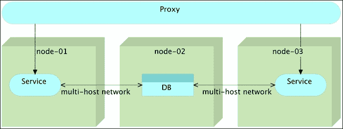

图 14-12 – 多主机网络与代理和负载均衡服务的结合

图 14-12 展示了一个常见的应用场景。我们有一个扩展的服务，在`nodes-01`和`nodes-03`上运行了两个实例。所有对这些服务的通信都通过一个代理服务进行，代理服务负责负载均衡和安全性。任何想要访问我们服务的服务（无论是外部的还是内部的）都需要通过代理。内部服务使用数据库。服务实例和数据库之间的通信是内部的，并通过多主机网络进行。这种设置使我们能够在集群内轻松扩展，同时保持容器之间的所有内部通信仅限于构成单一服务的容器之间。换句话说，构成单一服务的容器之间的所有通信都通过网络进行，而服务之间的通信则通过代理进行。

创建多主机网络有不同的方法。我们可以手动设置网络：

```
docker network create my-network

docker network ls

```

`network ls`命令的输出如下：

```
NETWORK ID          NAME                  DRIVER
5fc39aac18bf        swarm-node-2/host     host
aa2c17ae2039        swarm-node-2/bridge   bridge
267230c8d144        my-network            overlay
bfc2a0b1694b        swarm-node-2/none     null
b0b1aa45c937        swarm-node-1/none     null
613fc0ba5811        swarm-node-1/host     host
74786f8b833f        swarm-node-1/bridge   bridge

```

你可以看到其中一个网络是我们之前创建的`my-network`。它跨越了整个 Swarm 集群，我们可以使用`--net`参数来使用它：

```
docker run -d --name books-ms-db \
 --net my-network \
 mongo

docker run -d --name books-ms \
 --net my-network \
 -e DB_HOST=books-ms-db \
 -p 8080 \
 10.100.198.200:5000/books-ms

```

我们启动了两个组成单一服务的容器；`books-ms`是与`books-ms-db`通信的 API，后者充当数据库。由于两个容器都具有`--net my-network`参数，它们都属于`my-network`网络。因此，Docker 更新了 hosts 文件，为每个容器提供了一个别名，可用于内部通信。

让我们进入`books-ms`容器并查看主机文件：

```
docker exec -it books-ms bash

cat /etc/hosts

exit

```

`exec`命令的输出如下所示：

```
10.0.0.2    3166318f0f9c
127.0.0.1   localhost
::1 localhost ip6-localhost ip6-loopback
fe00::0 ip6-localnet
ff00::0 ip6-mcastprefix
ff02::1 ip6-allnodes
ff02::2 ip6-allrouters
10.0.0.2    books-ms-db
10.0.0.2    books-ms-db.my-network

```

`hosts`文件的有趣部分是最后两个条目。Docker 检测到`books-ms-db`容器使用与`books-ms`容器相同的网络，并通过添加`books-ms-db`和`books-ms-db.my-network`别名来更新`hosts`文件。如果使用某种约定，编写代码以使服务使用类似的别名与位于单独容器中的资源通信是微不足道的（在这种情况下是与数据库通信）。

我们还向`book-ms`传递了一个名为`DB_HOST`的环境变量。这表明我们的服务将使用哪个主机来连接数据库。我们可以通过输出容器的环境变量来查看这一点：

```
docker exec -it books-ms env

```

命令的输出如下所示：

```
PATH=/usr/local/sbin:/usr/local/bin:/usr/sbin:/usr/bin:/sbin:/bin
HOSTNAME=eb3443a66355
DB_HOST=books-ms-db
DB_DBNAME=books
DB_COLLECTION=books
HOME=/root

```

如您所见，其中一个环境变量是值为`books-ms-db`的`DB_HOST`。

现在我们有由 Docker 网络创建的主机别名`books-ms-db`指向的 IP。我们还有一个环境变量`DB_HOST`，其值为`books-ms-db`。服务的代码使用该变量连接到数据库。

正如预期的那样，我们可以在 Docker Compose 规范中指定`network`。在尝试之前，让我们删除这两个容器和网络。

```
docker rm -f books-ms books-ms-db

docker network rm my-network

```

这次，我们将通过 Docker Compose 运行容器。我们将在`docker-compose-swarm.yml`中使用`net`参数，并以与之前相同的方式执行操作。另一种方法是使用新的 Docker Compose 参数`--x-networking`，它会为我们创建网络，但目前处于试验阶段并不完全可靠。在继续之前，让我们快速查看`docker-compose-swarm.yml`文件中的相关目标：

```
app:
 image: 10.100.198.200:5000/books-ms
 ports:
 - 8080
 net: books-ms
 environment:
 - SERVICE_NAME=books-ms
 - DB_HOST=books-ms-db

db:
 container_name: books-ms-db
 image: mongo
 net: books-ms
 environment:
 - SERVICE_NAME=books-ms-db

```

唯一重要的区别是添加了`net`参数。其他方面与我们目前探索的许多其他目标基本相同。

让我们通过 Docker Compose 创建网络并运行我们的容器：

```
docker network create books-ms

docker-compose -f docker-compose-swarm.yml \
 up -d db app

```

我们刚刚运行的命令的输出如下所示：

```
Creating booksms_app_1
Creating books-ms-db

```

在创建`app`和`db`服务之前，我们创建了一个名为`books-ms`的新网络。网络的名称与`docker-compose-swarm.yml`文件中指定的*net*参数的值相同。

通过运行`docker network ls`命令，我们可以确认网络已创建：

```
docker network ls

```

输出如下：

```
NETWORK ID          NAME                           DRIVER
6e5f816d4800        swarm-node-1/host              host
aa1ccdaefd70        swarm-node-2/docker_gwbridge   bridge
cd8b1c3d9be5        swarm-node-2/none              null
ebcc040e5c0c        swarm-node-1/bridge            bridge
6768bad8b390        swarm-node-1/docker_gwbridge   bridge
8ebdbd3de5a6        swarm-node-1/none              null
58a585d09bbc        books-ms                       overlay
de4925ea50d1        swarm-node-2/bridge            bridge
2b003ff6e5da        swarm-node-2/host              host

```

如您所见，`overlay`网络`books-ms`已创建。

我们还可以再次检查容器内的`hosts`文件是否已更新：

```
docker exec -it booksms_app_1 bash

cat /etc/hosts

exit

```

命令的输出如下所示：

```
10.0.0.2    3166318f0f9c
127.0.0.1   localhost
::1 localhost ip6-localhost ip6-loopback
fe00::0 ip6-localnet
ff00::0 ip6-mcastprefix
ff02::1 ip6-allnodes
ff02::2 ip6-allrouters
10.0.0.3    books-ms-db
10.0.0.3    books-ms-db.my-network

```

最后，让我们看看 Swarm 是如何分配我们的容器的：

```
docker ps --filter name=books --format "table {{.Names}}"

```

输出如下：

```
NAMES
swarm-node-2/books-ms-db
swarm-node-1/booksms_app_1

```

Swarm 将 `app` 容器部署到 `swarm-node-1`，将 `db` 容器部署到 `swarm-node-2`。

最后，让我们测试一下 `book-ms` 服务是否正常工作。我们不知道 Swarm 将容器部署到了哪里，也不知道暴露了哪个端口。由于我们（还）没有代理服务，我们将从 Consul 获取服务的 IP 和端口，发送 PUT 请求将数据存储到不同容器中的数据库中，最后发送 GET 请求检查是否能检索到记录。由于我们没有代理服务来确保请求被重定向到正确的服务器和端口，我们必须从 Consul 获取 IP 和端口：

```
ADDRESS=`curl \
    10.100.192.200:8500/v1/catalog/service/books-ms \
    | jq -r '.[0].ServiceAddress + ":" + (.[0].ServicePort | tostring)'`

curl -H 'Content-Type: application/json' -X PUT -d \
  '{"_id": 2,
  "title": "My Second Book",
  "author": "John Doe",
  "description": "A bit better book"}' \
  $ADDRESS/api/v1/books | jq '.'

curl $ADDRESS/api/v1/books | jq '.'
The output of the last command is as follows.
[
  {
    "author": "John Doe",
    "title": "My Second Book",
    "_id": 2
  }
]
```

如果服务无法与位于不同节点的数据库通信，我们将无法进行数据的插入和读取。部署到不同服务器上的容器之间的网络连接正常！我们所需要做的就是在 Docker Compose 中使用额外的参数（*net*），并确保服务代码使用主机文件中的信息。

Docker 网络的另一个优点是，如果某个容器停止工作，我们可以重新部署它（可能部署到另一个服务器），并且假设服务能够处理临时的连接中断，我们可以像什么都没发生一样继续使用它。

## 使用 Docker Swarm 扩展服务

正如你已经看到的，使用 Docker Compose 进行扩展非常简单。虽然到目前为止我们运行的例子都局限于单台服务器，但使用 Docker Swarm 我们可以将扩展范围扩展到整个集群。现在我们有一个 `books-ms` 实例在运行，我们可以将其扩展到三个实例：

```
docker-compose -f docker-compose-swarm.yml \
 scale app=3

docker ps --filter name=books \
 --format "table {{.Names}}"

```

`ps` 命令的输出如下：

```
NAMES
swarm-node-2/booksms_app_3
swarm-node-1/booksms_app_2
swarm-node-2/books-ms-db
swarm-node-1/booksms_app_1

```

我们可以看到 Swarm 继续均匀地分配容器。每个节点当前运行两个容器。由于我们请求 Docker Swarm 将 `books-ms` 容器扩展到三个，所以现在其中两个容器独立运行，第三个容器与数据库一起部署。以后，当我们开始自动化部署到 Docker Swarm 集群时，我们还会确保所有服务实例正确设置到代理中。

为了以后参考，我们可能想将实例数量存储在 Consul 中。以后，当我们想增加或减少实例数量时，这会非常有用：

```
curl -X PUT -d 3 \
 10.100.192.200:8500/v1/kv/books-ms/instances
Services can be as easily descaled. For example, the traffic might drop, later during the day, and we might want to free resources for other services.
docker-compose -f docker-compose-swarm.yml \
 scale app=1

curl -X PUT -d 1 \
 10.100.192.200:8500/v1/kv/books-ms/instances

docker ps --filter name=books \
 --format "table {{.Names}}"

```

由于我们指示 Swarm 将实例数量缩放（减少）到一个，而当时有三个实例在运行，Swarm 删除了第二和第三个实例，最终系统只剩下一个实例。这可以从 `docker ps` 命令的输出中看到，输出如下：

```
NAMES
swarm-node-2/books-ms-db
swarm-node-1/booksms_app_1

```

我们进行了缩容并回到了最初的状态，每个目标运行一个实例。

接下来我们将探讨更多的 Swarm 选项。在继续之前，让我们停止并删除当前运行的容器，然后重新开始：

```
docker-compose stop

docker-compose rm -f

```

## 根据保留的 CPU 和内存调度容器

到目前为止，Swarm 一直在将部署调度到运行容器最少的服务器上。这是没有指定其他约束条件时应用的默认策略。通常情况下，不现实地期望所有容器都能平等访问资源。我们可以通过向 Swarm 提供容器期望的提示来进一步优化部署。例如，我们可以指定某个容器需要多少个 CPU。让我们试试看。

```
docker info

```

命令输出的相关部分如下：

```
...
Nodes: 2
 swarm-node-1: 10.100.192.201:2375
 └ Containers: 2
 └ Reserved CPUs: 0 / 1
 └ Reserved Memory: 0 B / 1.535 GiB
...
 swarm-node-2: 10.100.192.202:2375
 └ Containers: 2
 └ Reserved CPUs: 0 / 1
 └ Reserved Memory: 0 B / 1.535 GiB
...

```

尽管我们每个节点已经运行了两个容器（`Registrator` 和 `Swarm`），但没有预留 CPU，也没有预留内存。当我们运行这些容器时，并未指定需要预留 CPU 或内存。

让我们尝试运行 Mongo DB，并为进程预留一个 CPU。请记住，这只是一个提示，并不会阻止已经部署在这些服务器上的其他容器使用该 CPU。

```
docker run -d --cpu-shares 1 --name db1 mongo

docker info

```

由于每个节点只有一个 CPU 被分配，我们无法分配更多。`docker info` 命令的相关部分输出如下：

```
...
Nodes: 2
 swarm-node-1: 10.100.192.201:2375
 └ Status: Healthy
 └ Containers: 3
 └ Reserved CPUs: 1 / 1
 └ Reserved Memory: 0 B / 1.535 GiB
...
 swarm-node-2: 10.100.192.202:2375
 └ Status: Healthy
 └ Containers: 2
 └ Reserved CPUs: 0 / 1
 └ Reserved Memory: 0 B / 1.535 GiB
...

```

这次，`swarm-node-1` 保留了一个（共一个）CPU。由于该节点没有更多的 CPU 可用，如果我们重复该过程并启动另一个 Mongo DB，且设置相同的约束，Swarm 将别无选择，只能将其部署到第二个节点。让我们试试看：

```
docker run -d --cpu-shares 1 --name db2 mongo

docker info

```

`ps` 命令输出的相关部分如下：

```
...
Nodes: 2
 swarm-node-1: 10.100.192.201:2375
 └ Status: Healthy
 └ Containers: 3
 └ Reserved CPUs: 1 / 1
 └ Reserved Memory: 0 B / 1.535 GiB
...
 swarm-node-2: 10.100.192.202:2375
 └ Status: Healthy
 └ Containers: 3
 └ Reserved CPUs: 1 / 1
 └ Reserved Memory: 0 B / 1.535 GiB
...

```

这次，两个节点都预留了所有的 CPU。

我们可以查看进程，并确认两个数据库确实正在运行：

```
docker ps --filter name=db --format "table {{.Names}}"

```

输出如下：

```
NAMES
swarm-node-2/db2
swarm-node-1/db1

```

确实，两个容器都在运行，每个节点一个。

让我们看看，如果我们尝试启动一个需要一个 CPU 的容器，会发生什么：

```
docker run -d --cpu-shares 1 --name db3 mongo

```

这次，Swarm 返回了以下错误消息：

```
Error response from daemon: no resources available to schedule container

```

我们请求部署一个需要一个 CPU 的容器，Swarm 回复说没有可用的节点能满足这个要求。在我们继续探索其他约束之前，请记住，*CPU Shares* 在 Swarm 中的工作方式与在单个服务器上运行的 Docker 中不同。有关此类情况的更多信息，请参阅 [`docs.docker.com/engine/reference/run/#cpu-share-constraint`](https://docs.docker.com/engine/reference/run/#cpu-share-constraint) 页面。

让我们移除容器并重新开始：

```
docker rm -f db1 db2

```

我们也可以将内存作为一种约束。例如，我们可以指示 Swarm 部署一个保留一个 CPU 和一 GB 内存的容器：

```
docker run -d --cpu-shares 1 -m 1g --name db1 mongo

docker info

```

`docker info` 命令的输出如下（仅限相关部分）：

```
...
Nodes: 2
 swarm-node-1: 10.100.192.201:2375
 └ Status: Healthy
 └ Containers: 3
 └ Reserved CPUs: 1 / 1
 └ Reserved Memory: 1 GiB / 1.535 GiB
...
 swarm-node-2: 10.100.192.202:2375
 └ Status: Healthy
 └ Containers: 2
 └ Reserved CPUs: 0 / 1
 └ Reserved Memory: 0 B / 1.535 GiB
...

```

这次不仅保留了一个 CPU，而且几乎所有的内存也被保留。尽管我们使用 CPU 约束时未能演示出太多内容，因为我们的节点每个只有一个，但在内存方面我们有更大的操作余地。例如，我们可以启动三个 Mongo DB 实例，每个实例预留 100 MB 内存：

```
docker run -d -m 100m --name db2 mongo

docker run -d -m 100m --name db3 mongo

docker run -d -m 100m --name db4 mongo

docker info

```

`docker info`命令的输出如下（只列出相关部分）：

```
...
Nodes: 2
 swarm-node-1: 10.100.192.201:2375
 └ Status: Healthy
 └ Containers: 3
 └ Reserved CPUs: 1 / 1
 └ Reserved Memory: 1 GiB / 1.535 GiB
...
 swarm-node-2: 10.100.192.202:2375
 └ Status: Healthy
 └ Containers: 5
 └ Reserved CPUs: 0 / 1
 └ Reserved Memory: 300 MiB / 1.535 GiB
...

```

很明显，所有这三个容器都被部署到`swarm-node-2`。Swarm 意识到第二个节点在`swarm-node-1`上的可用内存较少，决定将新容器部署到`swarm-node-2`。由于使用了相同的限制，这一决策被重复了两次。因此，`swarm-node-2`现在运行着这三个容器，并预留了 300MB 的内存。我们可以通过检查运行中的进程来确认这一点：

```
docker ps --filter name=db --format "table {{.Names}}"

```

输出如下：

```
NAMES
swarm-node-2/db4
swarm-node-2/db3
swarm-node-2/db2
swarm-node-1/db1

```

我们可以通过多种方式向 Swarm 提供容器部署提示，但我们不会探索所有方法。我邀请你查看 Docker 文档中的策略([`docs.docker.com/swarm/scheduler/strategy/`](https://docs.docker.com/swarm/scheduler/strategy/))和过滤器([`docs.docker.com/swarm/scheduler/filter/`](https://docs.docker.com/swarm/scheduler/filter/))。

此刻，我们已经掌握了足够的知识，可以尝试将部署自动化到 Docker Swarm 集群。

在继续之前，我们先删除到目前为止运行的容器：

```
docker rm -f db1 db2 db3 db4

```

# 使用 Docker Swarm 和 Ansible 自动化部署

我们已经熟悉 Jenkins 工作流，应该相对容易将这些知识扩展到 Docker Swarm 的部署上。

首先，最重要的是。我们需要为`cd`节点配置 Jenkins：

```
ansible-playbook /vagrant/ansible/jenkins-node-swarm.yml \
 -i /vagrant/ansible/hosts/prod

ansible-playbook /vagrant/ansible/jenkins.yml \
 -c local

```

这两个剧本部署了一个熟悉的 Jenkins 实例，包含两个节点。这次，我们运行的从节点是`cd`和`swarm-master`。在其他任务中，剧本基于`Multibranch Workflow`创建了`books-ms-swarm`任务。与之前使用的其他多分支任务的唯一区别在于`Include branches`过滤器，这次设置为`swarm`：

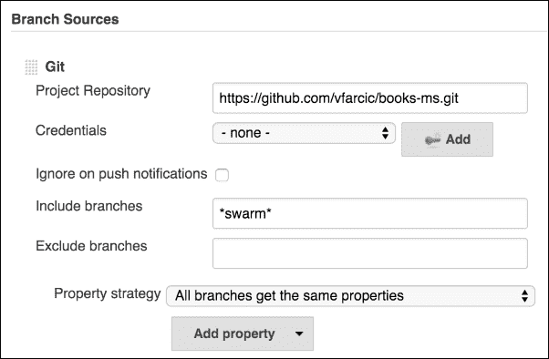

图 14-13 – books-ms-swarm Jenkins 任务的配置屏幕

让我们索引分支并让任务运行，同时我们可以查看位于`books-ms swarm`分支中的 Jenkinsfile。

请打开`books-ms-swarm`任务并点击**Branch Indexing**，然后点击**Run Now**。由于只有一个分支符合指定的过滤器，Jenkins 将创建一个名为`swarm`的子项目并开始构建。如果你对构建进度感兴趣，可以通过打开构建控制台来监视进展。

## 检查 Swarm 部署剧本

Jenkinsfile 中定义的 Jenkins 工作流内容如下：

```
node("cd") {
 def serviceName = "books-ms"
 def prodIp = "10.100.192.200" // Modified
 def proxyIp = "10.100.192.200" // Modified
 def proxyNode = "swarm-master"
 def registryIpPort = "10.100.198.200:5000"
 def swarmPlaybook = "swarm.yml" // Modified
 def proxyPlaybook = "swarm-proxy.yml" // Added
 def instances = 1 // Added

 def flow = load "/data/scripts/workflow-util.groovy"

 git url: "https://github.com/vfarcic/${serviceName}.git"
 flow.provision(swarmPlaybook) // Modified
 flow.provision(proxyPlaybook) // Added
 flow.buildTests(serviceName, registryIpPort)
 flow.runTests(serviceName, "tests", "")
 flow.buildService(serviceName, registryIpPort)

 def currentColor = flow.getCurrentColor(serviceName, prodIp)
 def nextColor = flow.getNextColor(currentColor)

 flow.deploySwarm(serviceName, prodIp, nextColor, instances) // Modified
 flow.runBGPreIntegrationTests(serviceName, prodIp, nextColor)
 flow.updateBGProxy(serviceName, proxyNode, nextColor)
 flow.runBGPostIntegrationTests(serviceName, prodIp, proxyIp, proxyNode, currentColor, nextColor)
}

```

我在修改和新增的行上添加了注释（与上一章中的 Jenkinsfile 进行对比），这样我们可以探索与蓝绿分支中定义的 Jenkinsfile 的差异。

变量`prodIp`和`proxyIp`已经修改为指向`swarm-master`节点。这一次，我们使用了两个 Ansible playbook 来配置集群。`swarmPlaybook`变量保存配置整个`Swarm`集群的 playbook 名称，而`proxyPlaybook`变量引用的是负责在`swarm-master`节点上设置`nginx`代理的 playbook。在现实情况下，Swarm 主节点和代理服务应当分开，但在这里，我选择不使用额外的虚拟机，以节省你笔记本上的一些资源。最后，`instances`变量（默认值为`1`）被添加到了脚本中。我们将很快探讨它的使用。

唯一真正显著的区别是使用了`deploySwarm`函数来替代`deployBG`。这是在`workflow-util.groovy`脚本中定义的另一个工具函数。其内容如下：

```
def deploySwarm(serviceName, swarmIp, color, instances) {
 stage "Deploy"
 withEnv(["DOCKER_HOST=tcp://${swarmIp}:2375"]) {
 sh "docker-compose pull app-${color}"
 try {
 sh "docker network create ${serviceName}"
 } catch (e) {}
 sh "docker-compose -f docker-compose-swarm.yml \
 -p ${serviceName} up -d db"
 sh "docker-compose -f docker-compose-swarm.yml \
 -p ${serviceName} rm -f app-${color}"
 sh "docker-compose -f docker-compose-swarm.yml \
 -p ${serviceName} scale app-${color}=${instances}"
 }
 putInstances(serviceName, swarmIp, instances)
}

```

如同之前，我们首先从注册表中拉取最新的容器。新增的内容是创建一个 Docker 网络。由于网络只能创建一次，所有后续尝试都会导致错误，因此`sh`命令被封装在`try/catch`块中，这样可以防止脚本失败。

创建网络后，接着是部署`db`和`app`目标。与始终作为单个实例部署的数据库不同，`app`目标可能需要扩展。因此，第一个目标通过`up`命令部署，而第二个通过 Docker Compose 提供的`scale`命令进行部署。`scale`命令利用`instances`变量来确定应部署多少个副本。我们可以通过简单地改变 Jenkinsfile 中的`instances`变量来增加或减少副本数。一旦此更改提交到仓库，Jenkins 会运行新的构建并部署我们指定数量的实例。

最后，我们通过调用辅助函数`putInstances`将实例数传递给 Consul，该函数执行了一个简单的 Shell 命令。尽管我们现在不会使用这些信息，但它将在下一章构建自愈系统时派上用场。

就这样。我们只需对 Jenkinsfile 做几个小修改，就能将`blue-green`部署从单一服务器扩展到整个 Swarm 集群。Docker Swarm 和 Jenkins Workflow 证明非常易于使用，甚至更容易维护，而且依然非常强大。

到这个时候，`swarm` 子项目的构建可能已经完成。我们可以从构建控制台屏幕验证这一点，或者直接通过打开 `books-ms-swarm` 作业，确认最后一次构建的状态由 `blue` 球表示。如果你想知道为什么成功状态是用蓝色而不是绿色表示的，请阅读 *为什么 Jenkins 显示蓝球？* 文章，链接在此：[`jenkins.io/blog/2012/03/13/why-does-jenkins-have-blue-balls/`](https://jenkins.io/blog/2012/03/13/why-does-jenkins-have-blue-balls/)：

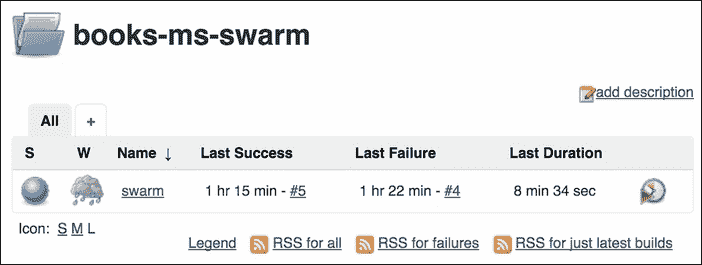

图 14-14 – books-ms-swarm Jenkins 作业屏幕

现在我们了解了 *Jenkinsfile* 脚本的背后含义，并且构建已完成，我们可以手动验证一切是否正常工作。

### 运行 Swarm Jenkins 工作流

Swarm 子项目的第一次运行是在 Jenkins 自动启动的，一旦完成分支索引。剩下的工作就是再次检查整个过程是否确实正确执行。

这是第一次部署，因此蓝色版本应该在集群的某个地方运行。让我们来看看 Swarm 决定将我们的容器部署在哪里：

```
export DOCKER_HOST=tcp://10.100.192.200:2375

docker ps --filter name=books --format "table {{.Names}}"

```

ps 命令的输出如下：

```
NAMES
swarm-node-2/booksms_app-blue_1
swarm-node-1/books-ms-db

```

在这种情况下，Swarm 将 `books-ms` 容器部署到了 `swarm-node-2`，将 Mongo DB 部署到了 `swarm-node-1`。我们还可以验证服务是否已正确存储在 Consul 中：

```
curl swarm-master:8500/v1/catalog/service/books-ms-blue \
 | jq '.'

curl swarm-master:8500/v1/kv/books-ms/color?raw

curl swarm-master:8500/v1/kv/books-ms/instances?raw

```

所有三个命令的输出如下：

```
[
  {
    "ServicePort": 32768,
    "ServiceAddress": "10.100.192.202",
    "ServiceTags": null,
    "ServiceName": "books-ms-blue",
    "ServiceID": "swarm-node-2:booksms_app-blue_1:8080",
    "Address": "10.100.192.202",
    "Node": "swarm-node-2"
  }
]
...
blue
...
1
```

根据 Consul，版本已部署到 `swarm-node-2` (`10.100.192.202`)，并且端口为 `32768`。我们当前正在运行的是 `blue` 版本，且仅有一个实例在运行。

最后，我们可以通过向服务发送几个请求来再次确认服务确实在工作：

```
curl -H 'Content-Type: application/json' -X PUT -d \
 '{"_id": 1,
 "title": "My First Book",
 "author": "John Doe",
 "description": "Not a very good book"}' \
 swarm-master/api/v1/books | jq '.'

curl swarm-master/api/v1/books | jq '.'

```

第一个请求是 PUT，向服务发送信号，表示我们想要存储这本书。第二个请求则是检索所有书籍的列表。

自动化过程在第一次运行时似乎工作正常。我们将再次执行构建并部署绿色版本。

### Swarm 部署剧本的第二次运行

让我们部署下一个版本。

请打开 swarm 子项目并点击 "立即构建" 链接。构建将开始，我们可以从控制台屏幕进行监控。几分钟后，构建将完成执行，我们将能够检查结果：

```
docker ps -a --filter name=books --format "table {{.Names}}\t{{.Status}}"

```

ps 命令的输出如下：

```
NAMES                              STATUS
swarm-node-2/booksms_app-green_1   Up 7 minutes
swarm-node-2/booksms_app-blue_1    Exited (137) 15 seconds ago
swarm-node-1/books-ms-db           Up 10 hours

```

由于我们运行的是 `green` 版本，`blue` 版本处于 `Exited` 状态。我们可以通过 Consul 查看当前运行版本的信息：

```
curl swarm-master:8500/v1/catalog/service/books-ms-green \
 | jq '.'

```

Consul 请求的响应如下：

```
[
  {
    "ModifyIndex": 3314,
    "CreateIndex": 3314,
    "Node": "swarm-node-2",
    "Address": "10.100.192.202",
    "ServiceID": "swarm-node-2:booksms_app-green_1:8080",
    "ServiceName": "books-ms-green",
    "ServiceTags": [],
    "ServiceAddress": "10.100.192.202",
    "ServicePort": 32770,
    "ServiceEnableTagOverride": false
  }
]
```

现在我们可以测试服务本身：

```
curl swarm-master/api/v1/books | jq '.'

```

由于我们已经启动了 Consul UI，请在您喜欢的浏览器中打开 `http://10.100.192.200:8500/ui` 地址，以获取我们已部署服务的可视化展示。

作为一个练习，fork `books-ms` 仓库并修改作业以使用你自己的仓库。打开 `swarm` 分支中的 *Jenkinsfile*，将其修改为部署三个实例的服务，并推送更改。再次运行构建，完成后确认三个实例已部署到集群中。

### 清理

这就是我们对 Docker Swarm 的介绍。我们将在接下来的章节中更多地使用它。在进入下一个主题之前，让我们销毁虚拟机。需要时我们会重新创建它们：

```
exit

vagrant destroy -f

```

我们开发的解决方案仍然存在不少问题。系统不具备容错能力，且难以监控。下一章将通过创建自愈系统来解决第一个问题。
