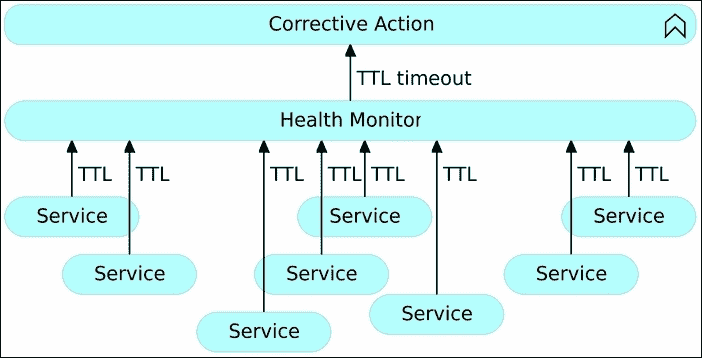
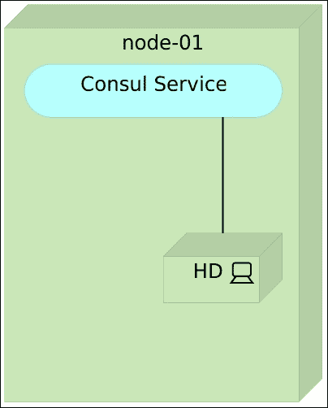

# 第十五章 自我修复系统

|   | *修复需要勇气，我们都有勇气，即使我们需要挖掘一些才能找到它。* |   |
| --- | --- | --- |
|   | --*Tori Amos* |

让我们面对现实吧。我们正在创建的系统并不完美。迟早，我们的某个应用会失败，我们的某个服务无法承受增加的负载，我们的某个提交会引入致命的 bug，某个硬件会损坏，或者某些完全意想不到的事情会发生。

我们如何应对意外情况？大多数人都在尝试开发一个防弹系统。我们试图创造前所未有的东西。我们追求终极完美，希望结果是一个没有任何 bug、运行在永不故障的硬件上的、能够处理任何负载的系统。这里有一个提示。没有完美这个东西。没有人是完美的，也没有什么是没有缺陷的。这并不意味着我们不应该追求完美。在时间和资源允许的情况下，我们应该追求完美。然而，我们也应该接受不可避免的事实，并设计我们的系统，不是为了完美，而是为了能够从故障中恢复，能够预测未来可能发生的情况。我们应该为最好的结果做好准备，但也要为最坏的情况做好准备。

在软件工程之外，有许多坚韧系统的例子，而没有哪个比生命本身更好。我们可以以我们自己，人类，作为例子。我们是一个经过漫长实验的结果，这些实验基于小而渐进的进化改善，经过了数百万年。我们可以从人体中学到很多，并将这些知识应用于我们的软件和硬件。我们（人类）拥有的一个迷人能力就是自我修复的能力。

人体具有惊人的自我修复能力。人体最基本的单位是细胞。在我们的一生中，体内的细胞不断工作，帮助我们恢复到平衡状态。每个细胞都是一个动态的、活跃的单元，不断监控和调整自身的过程，努力根据其最初的 DNA 代码恢复自我，并维持体内的平衡。细胞不仅具备自我修复的能力，还能生成新的细胞，替代那些被永久损坏或摧毁的细胞。即使大量细胞被摧毁，周围的细胞也会复制生成新细胞，从而迅速替代已被摧毁的细胞。这种能力并不能使我们免于死亡，但它确实让我们具有了很强的韧性。我们不断受到病毒的攻击，我们会生病，但在大多数情况下，我们最终会胜利。然而，把我们当作个体来看待就意味着我们忽视了更大的图景。即使我们自身的生命终结，生命本身不仅会生存下来，还会繁荣发展，持续生长，不断适应。

我们可以把计算机系统看作由各种类型的细胞组成的人体。这些细胞可以是硬件或软件。当它们是软件单元时，越小的单元越容易自愈、从故障中恢复、复制，甚至在需要时销毁。我们称这些小单元为微服务，它们的行为实际上类似于人体中的一些行为。我们正在构建的基于微服务的系统可以设计成具有自愈能力。并不是说我们即将探讨的自愈仅适用于微服务，它并非如此。然而，就像我们探讨的其他大多数技术一样，自愈可以应用于几乎任何类型的架构，但与微服务结合时能获得最佳效果。就像由个体组成的整体生态系统一样，每个计算机系统都是更大系统的一部分。它与其他系统进行通信、合作，并适应其他系统，形成一个更大的整体。

# 自愈的层级与类型

在软件系统中，"自愈"一词描述的是任何能够发现自身工作不正常，并且在没有任何人工干预的情况下，做出必要的调整以恢复到正常或设计状态的应用程序、服务或系统。自愈的关键在于使系统能够通过持续检查和优化自身状态，自动适应变化的条件，从而做出决策。其目标是使系统具备容错性和响应性，能够应对需求的变化并从故障中恢复。

自愈系统可以根据我们所监控和处理的资源的大小和类型分为三个层级，这些层级如下：

+   应用层级

+   系统层级

+   硬件层级

我们将分别探讨这三种类型。

## 应用层的自愈

应用层自愈是指应用程序或服务能够在内部自我修复的能力。传统上，我们习惯通过异常捕获问题，并在大多数情况下将其记录以便后续检查。当发生此类异常时，我们往往会忽略它并继续前进（在记录日志之后），仿佛什么都没有发生，期待未来一切顺利。在其他情况下，如果发生某种类型的异常，我们往往会停止应用程序。例如，连接数据库时。如果应用程序启动时未能建立连接，我们通常会停止整个过程。如果我们稍微有经验一点，可能会尝试重复连接数据库。希望这些尝试是有限的，否则我们很容易陷入一个永无止境的循环，除非数据库连接失败是暂时性的，并且数据库很快恢复在线。随着时间的推移，我们找到了更好的方法来处理应用程序内部的问题。其中之一就是 Akka。它使用的监督者机制和它所推广的设计模式，让我们能够创建具有自愈能力的内部应用程序和服务。Akka 并不是唯一的，还有许多其他库和框架让我们能够创建具备容错能力的应用程序，从潜在的灾难性情况下恢复。由于我们尽量保持编程语言的独立性，我将把如何实现内部自愈留给你，亲爱的读者，去探索。请记住，这里的自愈是指内部过程的自我修复，并不包括例如从失败的进程中恢复。而且，如果我们采用微服务架构，我们可能会很快遇到使用不同语言、不同框架编写的服务等等。每个服务的开发人员真正决定了它如何设计，使其能够自我修复并从故障中恢复。

让我们进入第二个层次。

## 系统层级的自愈

与依赖于编程语言和我们内部应用的设计模式的应用级自愈不同，系统级自愈可以广泛应用于所有服务和应用，无论其内部结构如何。这是我们可以在整个系统级别设计的自愈类型。虽然在系统级别上可能会发生许多情况，但最常监控的两个方面是进程失败和响应时间。如果进程失败，我们需要重新部署服务或重启进程。另一方面，如果响应时间不合适，我们需要进行扩展或缩减，具体取决于我们是否已达到响应时间的上限或下限。从进程失败中恢复通常是不够的。尽管这样的操作可能会将系统恢复到所需状态，但通常仍然需要人工干预。我们需要调查故障原因，修正服务的设计或修复 Bug。也就是说，自愈往往伴随故障原因的调查。系统会自动恢复，而我们（人类）则尝试从这些失败中学习，并改进整个系统。因此，某种类型的通知也是必需的。在故障和流量增加的两种情况下，系统都需要自我监控并采取措施。

系统如何监控自己？它如何检查组件的状态？有许多方法，但最常用的两种是 TTL 和 Ping。

### 生存时间

**生存时间**（**TTL**）检查期望服务或应用程序定期确认其正常运行。接收 TTL 信号的系统会跟踪给定 TTL 的最后已知报告状态。如果该状态在预定时间内没有更新，监控系统会认为服务失败，并需要恢复到其设计状态。例如，一个健康的服务可以发送一个 HTTP 请求，宣布它仍然活着。如果服务运行的进程失败，它将无法发送该请求，TTL 会过期，且会执行相应的应急措施。

TTL 的主要问题是耦合性。应用程序和服务需要与监控系统绑定。实现 TTL 会成为一种微服务反模式，因为我们试图以尽可能自主的方式设计它们。此外，微服务应该具有明确的功能和单一的目的。在它们内部实现 TTL 请求会增加额外的功能，且会使开发过程更加复杂：



图 15-01 – 系统级自愈与生存时间（TTL）

### Ping 操作

Ping 的想法是从外部检查应用程序或服务的状态。监控系统应定期 ping 每个服务，如果未收到响应，或响应的内容不合适，则执行自愈措施。Ping 可以有多种形式。如果服务暴露了 HTTP API，通常只需要一个简单的请求，其中期望的响应应该是 2XX 范围内的 HTTP 状态。在其他情况下，当没有暴露 HTTP API 时，ping 可以通过脚本或任何其他能够验证服务状态的方法来完成。

Ping 检查与 TTL 相反，当可能时，它是检查系统各个部分状态的首选方式。它消除了重复、耦合和实现 TTL 时可能出现的复杂性。


图 15-02 – 使用 ping 的系统级自愈

## 硬件级自愈

说实话，硬件自愈并不存在。我们无法拥有一个能够自动修复失败的内存、修复损坏的硬盘、修复故障的 CPU 等的过程。硬件级自愈真正的含义是将服务从一个不健康的节点重新部署到一个健康的节点。与系统级别一样，我们需要定期检查不同硬件组件的状态，并根据情况采取相应的行动。实际上，大多数因硬件级故障引起的自愈将在系统级别发生。如果硬件工作不正常，那么服务很可能会失败，从而通过系统级的自愈来修复。硬件级自愈更多是与我们稍后将讨论的预防性检查相关：


图 15-03 – 硬件级自愈

除了根据检查级别进行划分外，我们还可以根据采取行动的时机进行划分。我们可以对故障做出反应，或者我们可以尝试预防故障。

## 反应性自愈

大多数实施某种自愈系统的组织集中在反应性自愈上。在检测到故障后，系统会做出反应并将自身恢复到设计状态。服务进程崩溃，ping 返回 404（未找到）代码，采取纠正措施后，服务恢复正常。这无论服务是因为进程失败还是整个节点停止工作而导致失败（假设我们有一个可以重新部署到健康节点的系统），都有效。这是最重要的自愈类型，同时也是最容易实现的。只要我们做好所有检查，并且在故障发生时能执行应采取的行动，并且每个服务至少有两个实例分布在不同的物理节点上，我们就应该（几乎）永远不会有停机时间。我之所以说几乎永远不，因为例如整个数据中心可能会失去电力，从而导致所有节点停止工作。一切都在于评估风险与防范这些风险的成本之间的平衡。

有时候，拥有两个位于不同地点的数据中心是值得的，而在其他情况下则不然。我们的目标是争取零停机时间，同时也要接受一些情况下，防止的努力并不值得。

无论我们是在争取零停机时间，还是几乎零停机时间，反应式自愈应该是除了最小规模环境之外的所有环境必须具备的，尤其是因为它不需要大量投资。你可以投资备用硬件，或者投资独立的数据中心。这些决策与自愈没有直接关系，而是与特定用例可接受的风险水平有关。反应式自愈的投资主要是知识和实施时间。虽然时间本身就是一种投资，但我们可以明智地利用它，创造一个通用的解决方案，适用于（几乎）所有情况，从而减少我们在实施该系统时需要投入的时间。

## 预防性修复

预防性修复的理念是预测我们未来可能遇到的问题，并采取措施避免这些问题的发生。我们如何预测未来呢？更准确地说，我们使用什么数据来预测未来？

一种相对容易，但不太可靠的预测未来的方法，是基于（近）实时数据来做假设。例如，如果我们用来检查服务健康状况的某个 HTTP 请求响应时间超过了 500 毫秒，我们可能会考虑扩展该服务。我们甚至可以做相反的事情。沿用同样的例子，如果响应时间少于 100 毫秒，我们可能想要缩减该服务，并将资源重新分配给另一个可能更需要的服务。考虑当前状态来预测未来的问题是其变动性。如果请求和响应之间的时间较长，这可能确实是扩展的信号，但也可能是流量的暂时性增加，下一次检查（流量高峰过后）会推测需要缩减。如果应用了微服务架构，这可能是一个小问题，因为它们小且易于移动，容易扩展和缩减。选择这种策略时，单体应用往往会更加棘手。

如果考虑到历史数据，预防性修复变得更加可靠，但同时也更加复杂，实施起来也更加困难。信息（响应时间、CPU、内存等）需要存储在某个地方，且通常需要使用复杂的算法来评估趋势并得出结论。例如，我们可能会观察到，在过去的一小时内，内存使用量稳步上升，达到了一个临界点，假设是 90%。这将清楚地表明，导致这一增长的服务需要进行扩展。系统还可以考虑更长时间段的数据，并推测每周一会突然出现流量激增，提前扩展服务以避免响应延迟。例如，如果一个服务部署后内存使用量持续增加，而当发布新版本时突然下降，这可能意味着存在内存泄漏问题。在这种情况下，系统可能需要在达到某个阈值时重启应用程序，并希望开发人员修复该问题（因此需要通知功能）。

让我们改变焦点，讨论一下架构。

# 自愈架构

无论内部流程和工具如何，每个自愈系统都会有一些共同的元素。

一开始，首先是集群。单个服务器无法做到容错。如果其硬件发生故障，我们无法修复它，也没有现成的替代品。因此，系统必须从集群开始。集群可以由两台或两百台服务器组成。规模不是关键，关键在于在发生故障时能够从一台硬件迁移到另一台硬件。记住，我们始终需要评估收益与成本的关系。如果财务上可行，我们会至少拥有两个物理和地理上分离的数据中心。这样，如果一个数据中心发生停电，另一个数据中心将能够完全运作。然而，在很多情况下，这不是一个经济可行的选择：


图 15-04 – 自愈系统架构：一切从集群开始

一旦我们让集群启动并运行，我们就可以开始部署我们的服务。然而，在没有某种调度器的情况下管理集群中的服务，充其量也只是繁琐。这需要时间，且常常导致资源使用非常不平衡：


图 15-05 – 自愈系统架构：服务被部署到集群中，但资源使用非常不平衡

在大多数情况下，人们把集群看作一组独立的服务器，这是错误的。如今我们手头有一些工具，可以帮助我们更好地进行编排。通过 Docker Swarm、Kubernetes 或 Apache Mesos，我们可以解决集群中的编排问题。集群编排不仅有助于简化服务的部署，而且在发生故障（无论是软件故障还是硬件故障）时，还可以快速重新部署到健康节点。记住，我们需要在代理后面至少运行每个服务的两个实例。在这种情况下，如果某个实例发生故障，其他实例可以接管它的负载，从而避免系统在重新部署故障实例时发生停机：


图 15-06 – 自愈系统架构：需要某种部署编排器来在集群中分发服务

任何自愈系统的基础都是监控已部署服务或应用程序的状态，以及底层硬件的状态。监控它们的唯一方法是掌握关于它们存在的信息。这些信息可以有多种不同形式，从手动维护的配置文件、传统的数据库，到像 `Consul`、`etcd` 或 `Zookeeper` 这样高可用的分布式服务注册表。在某些情况下，服务注册表由我们自行选择，而在另一些情况下，它是集群编排器的一部分。例如，Docker Swarm 具有灵活性，允许它与多个注册表一起工作，而 Kubernetes 则与 `etcd` 紧密集成：


图 15-07 – 自愈系统架构：监控系统状态的主要要求是将系统信息存储在服务注册表中

无论我们选择哪个工具作为服务注册表，接下来的障碍就是将信息放入所选的服务注册表中。原则很简单：需要有某种方式来监控硬件和服务，并在新增或移除某个服务时更新注册表。市面上有很多工具能够实现这一点。我们已经熟悉`Registrator`，它很好地完成了这一角色。与服务注册表类似，一些集群编排器已经自带了注册和注销服务的方式。无论选择哪种工具，主要的要求是能够监控集群并实时将信息发送到服务注册表：


图 15-08 – 自愈系统架构：如果没有机制来监控系统并存储新信息，服务注册表就没有意义

现在，我们已经有了运行中的集群服务，并且我们在服务注册表中有了系统信息，我们可以使用一些健康监控工具来检测异常。这样的工具不仅需要知道期望的状态是什么，还需要随时了解当前的实际状态。Consul Watches 可以履行这一角色，而 Kubernetes 和 Mesos 自带了针对这类任务的工具。在更传统的环境中，Nagios 或 Icinga（仅举几例）也能胜任这一角色：


图 15-09 – 自愈系统架构：所有相关信息都存储在服务注册表中，一些健康监控工具可以利用这些信息来验证是否保持了期望的状态

下一个关键部分是一个能够执行修正操作的工具。当健康监控器检测到异常时，它将发送一个消息来执行修正措施。最低要求是，该修正操作应向集群调度器发送信号，进而重新部署失败的服务。即使故障是由硬件问题引起的，集群调度器也会（临时）通过将服务重新部署到健康的节点上来修复这个问题。在大多数情况下，修正措施并不像那么简单。可能会有一个机制来通知相关方、记录发生的事件、回滚到旧版本的服务等。我们已经采用了 Jenkins，它非常适合作为接收来自健康监控器消息并触发修正措施的工具：


图 15-10 – 自愈系统架构：最低要求是，修正操作应向集群调度器发送信号，重新部署失败的服务

目前的流程仅处理反应式自愈。系统会持续监控，并在发现故障时采取纠正性措施，从而将系统恢复到期望的状态。我们能否更进一步，尝试实现预防性自愈？我们能否预测未来并相应采取行动？在许多情况下，我们可以做到，有些则不行。我们无法知道硬盘明天会故障，无法预测今天中午会发生停机。但是，在某些情况下，我们可以看到流量正在增加，很快就会达到需要扩展某些服务的临界点。我们可以预测即将启动的营销活动会增加负载。我们可以从错误中吸取教训，并教会系统在特定情况下如何反应。这样一套流程的核心要素与我们用于反应式自愈的流程类似。我们需要一个存储数据的地方，并且需要一个收集这些数据的过程。与处理相对较小数据量并且从分布式中受益的服务注册不同，预防性自愈需要更大的存储空间和能够进行一些分析操作的能力：


图 15-11 – 自愈系统架构：预防性自愈需要分析历史数据

类似于 registrator 服务，我们还需要一些数据收集器来发送历史数据。那些数据可能会非常庞大，包括但不限于 CPU、硬盘、网络流量、系统和服务日志等等。与主要监听由集群编排器生成事件的 registrator 不同，数据收集器应持续收集数据，消化输入内容，并生成输出，作为历史数据进行存储：


图 15-12 – 自愈系统架构：预防性自愈需要持续收集大量数据

我们已经使用了一些实现反应式自愈所需的工具。Docker Swarm 可以作为集群编排器，Registrator 和 Consul 用于服务发现，而 Jenkins 则用于执行包括纠正性操作在内的其他任务。唯一没有使用的工具是 Consul 的两个子集：检查和监控。预防性自愈将需要探索一些新的流程和工具，因此我们将稍后再处理：


图 15-13 – 自愈系统架构：工具组合之一

让我们看看是否能够设置一个示例反应式自愈系统。

# 使用 Docker、Consul 监控和 Jenkins 进行自愈

好消息是，我们已经使用了所有需要的工具来构建一个响应式自我修复系统。我们有 Swarm，它会确保容器部署到健康的节点（或者至少是正常运行的节点）。我们有 Jenkins，它可以用来执行修复过程，并且可能会发送通知。最后，我们可以使用 Consul，不仅可以存储服务信息，还可以执行健康检查并向 Jenkins 发送请求。直到现在，我们唯一还没有使用的工具是 Consul 的 watch 功能，它可以编程执行健康检查。

关于 Consul 如何进行健康检查，有一点需要注意，那就是它与传统的 Nagios 以及其他类似工具的工作方式不同。Consul 通过使用 gossip 避免了“雷鸣般的集群”问题，并且仅在状态发生变化时发出警报。

一如既往，我们将从创建我们将在本章其余部分使用的虚拟机（VM）开始。我们将创建一个`cd`节点和三个`swarm`服务器（一个主节点和两个节点）。

## 设置环境

以下命令将创建我们在本章中将使用的四个虚拟机。我们将创建`cd`节点，并使用它通过 Ansible 为其他节点进行配置。这个虚拟机还将托管 Jenkins，它将是自我修复过程中的一个重要部分。其他三个虚拟机将组成 Swarm 集群。

```
vagrant up cd swarm-master swarm-node-1 swarm-node-2

```

所有虚拟机正常运行后，我们可以继续设置 Swarm 集群。我们将以与之前相同的方式配置集群，然后讨论我们需要进行哪些更改来实现自我修复。

```
vagrant ssh cd
ansible-playbook /vagrant/ansible/swarm.yml \
 -i /vagrant/ansible/hosts/prod

```

最后，时机已到，我们将使用 Jenkins 配置`cd`服务器。

```
ansible-playbook /vagrant/ansible/jenkins-node-swarm.yml \
 -i /vagrant/ansible/hosts/prod
ansible-playbook /vagrant/ansible/jenkins.yml \
 --extra-vars "main_job_src=service-healing-config.xml" \
 -c local

```

我们已经达到整个集群都可以正常运行的阶段，Jenkins 服务器很快也将启动。我们设置了一个 Swarm 主节点（`swarm-master`），两个 Swarm 节点（`swarm-node-1`和`swarm-node-2`），以及一个搭载 Ansible 的服务器，并且即将启动 Jenkins（`cd`）。在 Jenkins 配置运行时，您可以继续阅读。我们暂时不会立即需要它。

### 设置 Consul 健康检查和监控硬件的 watch 功能

我们可以向 Consul 发送指令，定期检查服务或整个节点。它不提供预定义的检查，而是运行脚本、执行 HTTP 请求，或等待我们定义的 TTL 信号。虽然没有预定义检查看似是一个缺点，但它给了我们设计流程的自由。如果我们使用脚本来执行检查，Consul 将期望它们以特定的代码退出。如果我们以`代码 0`退出检查脚本，Consul 将认为一切正常。退出`代码 1`表示警告，而退出`代码 2`表示错误。

我们将从创建几个执行硬件检查的脚本开始。获取硬盘使用情况的信息，例如，使用`df`命令是相对简单的。

```
df -h

```

我们使用了`-h`参数来输出`人类可读`的信息，输出如下所示。

```
Filesystem      Size  Used Avail Use% Mounted on
udev            997M   12K  997M   1% /dev
tmpfs           201M  440K  200M   1% /run
/dev/sda1        40G  4.6G   34G  13% /
none            4.0K     0  4.0K   0% /sys/fs/cgroup
none            5.0M     0  5.0M   0% /run/lock
none           1001M     0 1001M   0% /run/shm
none            100M     0  100M   0% /run/user
none            465G  118G  347G  26% /vagrant
none            465G  118G  347G  26% /tmp/vagrant-cache

```

请注意，在你的情况下，输出可能会稍有不同。

我们真正需要的是根目录的数据（输出中的第三行）。我们可以过滤 `df` 命令的输出，使其只显示最后一列值为 `/` 的那一行。过滤后，我们应该提取已使用磁盘空间的百分比（第 5 列）。在提取数据的同时，我们也可以获取磁盘大小（第 2 列）和已使用空间量（第 3 列）。我们提取的数据应该存储为可以稍后使用的变量。我们可以使用以下命令来完成这一切：

```
set -- $(df -h | awk '$NF=="/"{print $2" "$3" "$5}')
total=$1
used=$2
used_percent=${3::-1}

```

由于表示已使用空间百分比的值包含 `%` 符号，我们在将值赋给 `used_percent` 变量之前去除了最后一个字符。

我们可以通过简单的 `printf` 命令来再次检查我们创建的变量是否包含正确的值：

```
printf "Disk Usage: %s/%s (%s%%)\n" $used $total $used_percent

```

最后一条命令的输出如下：

```
Disk Usage: 4.6G/40G (13%)

```

剩下的唯一任务是，当达到阈值时，以 1（警告）或 2（错误）退出。我们将错误阈值定义为 95%，警告阈值为 80%。唯一缺少的就是一个简单的 `if`/`elif`/`else` 语句：

```
if [ $used_percent -gt 95 ]; then
  echo "Should exit with 2"
elif [ $used_percent -gt 80 ]; then
  echo "Should exit with 1"
else
  echo "Should exit with 0"
fi
```

出于测试目的，我们加入了 echo。我们将要创建的脚本应该返回 `2`、`1` 或 `0` 作为退出代码。

让我们进入 `swarm-master` 节点，创建脚本并进行测试：

```
exit
vagrant ssh swarm-master

```

我们将从创建一个目录开始，Consul 脚本将存放在该目录中：

```
sudo mkdir -p /data/consul/scripts

```

现在我们可以创建包含我们练习过的命令的脚本：

```
echo '#!/usr/bin/env bash
set -- $(df -h | awk '"'"'$NF=="/"{print $2" "$3" "$5}'"'"')
total=$1
used=$2
used_percent=${3::-1}
printf "Disk Usage: %s/%s (%s%%)\n" $used $total $used_percent
if [ $used_percent -gt 95 ]; then
  exit 2
elif [ $used_percent -gt 80 ]; then
  exit 1
else
  exit 0
fi
```

```
' | sudo tee /data/consul/scripts/disk.sh
sudo chmod +x /data/consul/scripts/disk.sh

```

让我们试试看。由于有相当多的空闲磁盘空间，脚本应该会输出磁盘使用情况并返回零：

```
/data/consul/scripts/disk.sh

```

命令输出的结果类似于以下内容。

```
Disk Usage: 3.3G/39G (9%)

```

我们可以通过 `$?` 来轻松显示上一条命令的退出代码：

```
echo $?

```

echo 返回了零，脚本似乎正常工作。你可以通过将阈值设置为低于当前磁盘使用率来测试其余的退出代码。我将这个简单的练习留给你完成。

### 注意

**Consul 检查阈值练习**

修改 `disk.sh` 脚本，使得警告和错误阈值低于当前的硬盘使用率。通过运行脚本并输出退出代码来测试更改。完成练习后，将脚本恢复到原始值。

现在我们有了检查磁盘使用情况的脚本，我们应该让 Consul 知道它的存在。Consul 使用 JSON 格式来指定检查。利用我们刚刚创建的脚本的定义如下：

```
{
  "checks": [
    {
      "id": "disk",
      "name": "Disk utilization",
      "notes": "Critical 95% util, warning 80% util",
      "script": "/data/consul/scripts/disk.sh",
      "interval": "10s"
    }
  ]
}
```

该 JSON 文件会告诉 Consul，有一个 ID 为 `disk`、名称为 `Disk utilization`、注释为 `Critical 95% util` 和 `warning 80% util` 的检查。`name` 和 `notes` 只是用于可视化显示（正如你将很快看到的）。接下来，我们指定脚本的路径为 `/data/consul/scripts/disk.sh`。最后，我们告诉 Consul 每 `10` 秒运行一次脚本：

让我们创建 JSON 文件：

```
echo '{
  "checks": [
    {
      "id": "disk",
      "name": "Disk utilization",
      "notes": "Critical 95% util, warning 80% util",
      "script": "/data/consul/scripts/disk.sh",
      "interval": "10s"
    }
  ]
}
```

```
sudo tee /data/consul/config/consul_check.json

```

当我们启动 Consul（通过 Ansible 剧本）时，我们指定了配置文件位于`/data/consul/config/`目录下。我们仍然需要重新加载它，以便它能够识别我们刚刚创建的文件。重新加载 Consul 的最简单方法是向其发送`HUP`信号：

```
sudo killall -HUP consul

```

我们已经成功地在 Consul 中创建了硬盘检查。它将每十秒运行一次脚本，并根据退出代码判断它所运行的节点（此例中为`swarm-master`）的健康状态：



图 15-14 – Consul 中的硬盘检查

我们可以通过在浏览器中打开`http://10.100.192.200:8500/ui/`来查看 Consul UI。打开 UI 后，请点击**节点**按钮，然后选择`swarm-master`节点。在其他信息中，你将看到两个检查项。其中一个是`Serf 健康状态`，这是 Consul 基于 TTL 的内部检查。如果某个 Consul 节点宕机，这个信息会被传播到整个集群。另一个检查项叫做`磁盘利用率`，这是我们刚刚创建的检查项，且希望其状态为`通过`：


图 15-15 – Consul UI 中的硬盘检查

现在我们知道在 Consul 中添加检查是多么简单，我们应该定义当检查失败时应执行的操作。我们可以通过 Consul 的 watch 功能来实现这一点。与检查一样，Consul 并没有提供一个现成的最终解决方案，而是提供了一种机制，让我们能够创建符合我们需求的解决方案。

Consul 支持七种不同类型的 watch：

+   **键**：查看特定的 KV 对

+   **键前缀**：查看 KV 存储中的前缀

+   **服务**：查看可用服务列表

+   **节点**：查看节点列表

+   **服务实例**：查看服务实例

+   **检查**：查看健康检查的值

+   **事件**：查看自定义用户事件

每种类型在特定情况下都有其用处，结合起来，它们为构建自愈、容错系统提供了一个非常全面的框架。我们将重点关注`检查`类型，因为它将允许我们使用之前创建的硬盘检查。请参考 watch 的文档以获取更多信息。

我们将首先创建一个由 Consul Watcher 运行的脚本。`manage_watches.sh`脚本如下（请不要运行它）：

```
#!/usr/bin/env bash

RED="\033[0;31m"
NC="\033[0;0m"

read -r JSON
echo "Consul watch request:"
echo "$JSON"

STATUS_ARRAY=($(echo "$JSON" | jq -r ".[].Status"))
CHECK_ID_ARRAY=($(echo "$JSON" | jq -r ".[].CheckID"))
LENGTH=${#STATUS_ARRAY[*]}

for (( i=0; i<=$(( $LENGTH -1 )); i++ ))
do
 CHECK_ID=${CHECK_ID_ARRAY[$i]}
 STATUS=${STATUS_ARRAY[$i]}
 echo -e "${RED}Triggering Jenkins job http://10.100.198.200:8080/job/hardware-notification/build${NC}"
 curl -X POST http://10.100.198.200:8080/job/hardware-notification/build \
 --data-urlencode json="{\"parameter\": [{\"name\":\"checkId\", \"value\":\"$CHECK_ID\"}, {\"name\":\"status\", \"value\":\"$STATUS\"}]}"
done

```

我们首先定义了`RED`和`NC`变量，这些变量将帮助我们将输出的关键部分标记为红色。然后，我们读取 Consul 输入并将其存储到`JSON`变量中。接下来，创建了`STATUS_ARRAY`和`CHECK_ID_ARRAY`数组，这些数组将存储每个 JSON 元素的`Status`和`CheckID`值。最后，这些数组使我们能够遍历每一项，并向 Jenkins 发送 POST 请求以构建`hardware-notification`作业（稍后我们会查看）。该请求使用 Jenkins 友好的格式传递`CHECK_ID`和`STATUS`变量。有关更多信息，请查阅 Jenkins 远程访问 API。

让我们创建脚本：

```
echo '#!/usr/bin/env bash

RED="\033[0;31m"
NC="\033[0;0m"

read -r JSON
echo "Consul watch request:"
echo "$JSON"

STATUS_ARRAY=($(echo "$JSON" | jq -r ".[].Status"))
CHECK_ID_ARRAY=($(echo "$JSON" | jq -r ".[].CheckID"))
LENGTH=${#STATUS_ARRAY[*]}

for (( i=0; i<=$(( $LENGTH -1 )); i++ ))
do
 CHECK_ID=${CHECK_ID_ARRAY[$i]}
 STATUS=${STATUS_ARRAY[$i]}
 echo -e "${RED}Triggering Jenkins job http://10.100.198.200:8080/job/hardware-notification/build${NC}"
 curl -X POST http://10.100.198.200:8080/job/hardware-notification/build \
 --data-urlencode json="{\"parameter\": [{\"name\":\"checkId\", \"value\":\"$CHECK_ID\"}, {\"name\":\"status\", \"value\":\"$STATUS\"}]}"
done

```

```
' | sudo tee /data/consul/scripts/manage_watches.sh

sudo chmod +x /data/consul/scripts/manage_watches.sh

```

现在我们已经有了每当检查状态为`warning`或`critical`时将执行的脚本，我们将通知 Consul 它的存在。Consul watch 的定义如下：

```
{
 "watches": [
 {
 "type": "checks",
 "state": "warning",
 "handler": "/data/consul/scripts/manage_watches.sh >>/data/consul/logs/watches.log"
 }, {
 "type": "checks",
 "state": "critical",
 "handler": "/data/consul/scripts/manage_watches.sh >>/data/consul/logs/watches.log"
 }
 ]
}

```

这个定义应该是自解释的。我们定义了两个 watch，它们都是`checks`类型的。第一个将在出现`warning`时运行，第二个则在检查处于`critical`状态时运行。为了简化操作，在这两个实例中，我们指定了相同的处理程序`manage_watches.sh`。在实际环境中，您应该区分这两种状态并执行不同的操作。

让我们创建 watch 文件：

```
echo '{
  "watches": [
    {
      "type": "checks",
      "state": "warning",
      "handler": "/data/consul/scripts/manage_watches.sh >>/data/consul/logs/watches.log"
    }, {
      "type": "checks",
      "state": "critical",
      "handler": "/data/consul/scripts/manage_watches.sh >>/data/consul/logs/watches.log"
    }
  ]
}'
```

```
sudo tee /data/consul/config/watches.json

```

在我们继续并重新加载 Consul 之前，应该简要讨论一下 Jenkins 作业`hardware-notification`。当我们为 Jenkins 配置时，它已经创建了该作业。可以通过打开`http://10.100.198.200:8080/job/hardware-notification/configure`来查看其配置。它包含两个参数，`checkId`和`status`。我们使用这两个参数作为避免为每个硬件检查创建单独作业的方式。每当 Consul 观察器发送 POST 请求以构建该作业时，它将这些值传递给这两个变量。在构建阶段，我们仅运行一个`echo`命令，将这两个变量的值输出到标准输出（`STDOUT`）。在实际情况中，这个作业会执行某些操作。例如，如果磁盘空间不足，它可能会删除未使用的日志和临时文件。另一个例子是，如果我们使用 Amazon AWS 等云服务，它可能会创建额外的节点。在其他一些情况下，可能无法进行自动化反应。无论如何，除了像这样的具体操作外，这个作业还应该发送某种形式的通知（如电子邮件、即时消息等），以便操作员得知潜在问题。由于这些情况在本地难以重现，该作业的初始定义并未执行此类操作。如何扩展这个作业以满足您的需求，就交给您了。

### 注意

**hardware-notification Jenkins 作业练习**

修改 `hardware-notification` Jenkins 作业，使得当 `checkId` 值为 `disk` 时，删除日志。在服务器上创建模拟日志（可以使用 `touch` 命令创建文件），并手动运行作业。一旦作业构建完成，确认日志确实被删除。


图 15-16 – Jenkins 作业硬件通知的设置屏幕

我们现在面临的问题是，`swarm-master` 节点上的硬盘几乎是空的，这阻止了我们测试刚刚设置的系统。我们必须更改 `disk.sh` 中定义的阈值。让我们将 80% 的警告阈值修改为 `2%`。当前硬盘使用量肯定超过了这个值：

```
sudo sed -i "s/80/2/" /data/consul/scripts/disk.sh

```

最后，让我们重新加载 Consul，看看会发生什么：

```
sudo killall -HUP consul

```

我们应该检查的第一件事是监视日志：

```
cat /data/consul/logs/watches.log

```

输出的相关部分如下：

```
Consul watch request:
[{"Node":"swarm-master","CheckID":"disk","Name":"Disk utilization","Status":"warning","Notes":"Critical 95% util, warning 80% util","Output":"Disk Usage: 3.3G/39G (9%)\n","ServiceID":"","ServiceName":""}]
Triggering Jenkins job http://10.100.198.200:8080/job/hardware-notification/build

```

请注意，Consul 的检查可能需要几秒钟才能运行。如果你没有从日志中收到类似的输出，请重新运行 `cat` 命令。

我们可以看到 Consul 发送到脚本的 JSON，并且 Jenkins 作业 `hardware-notification` 的构建请求已经发送。我们还可以通过在浏览器中打开 `http://10.100.198.200:8080/job/hardware-notification/lastBuild/console` URL 来查看该作业的 Jenkins 控制台输出：


图 15-17 – Jenkins 作业硬件通知的控制台输出

由于此时我们只使用了一个 Consul 检查来监控硬盘利用率，因此我们应该再实现一个。合适的候选项是内存。即使在某些硬件检查失败时我们不做任何纠正操作，将这些信息保存在 Consul 中本身就已经非常有用。

现在我们理解了这个过程，我们可以做得更好，使用 Ansible 来设置一切。此外，不同的检查不仅应在 `swarm-master` 节点设置，还应在集群的其余节点中设置，我们不希望手动执行这项工作，除非是为了学习目的。

在继续之前，让我们退出 `swarm-master` 节点：

```
exit

```

# 自动设置 Consul 健康检查和监控硬件的 Watch

此时，我们只在 `swarm-master` 节点配置了一个硬件监视器。现在我们已经熟悉了 Consul 的监视工作原理，可以使用 Ansible 将硬件监控部署到 Swarm 集群的所有节点。

我们将首先运行 Ansible 剧本，然后探索设置检查时使用的角色：

```
vagrant ssh cd

ansible-playbook /vagrant/ansible/swarm-healing.yml \
 -i /vagrant/ansible/hosts/prod

```

`swarm-healing.yml` 剧本如下：

```
- hosts: swarm
 remote_user: vagrant
 serial: 1
 sudo: yes
 vars:
 - debian_version: vivid
 - docker_cfg_dest: /lib/systemd/system/docker.service
 - is_systemd: true
 roles:
 - common
 - docker
 - consul-healing
 - swarm
 - registrator

```

与`swarm.yml`剧本相比，唯一的不同之处是使用了`consul-healing`角色。这两个角色（`consul`和`consul-healing`）非常相似。主要的区别在于后者将更多文件复制到目标服务器（`roles/consul-healing/files/consul_check.json`、`roles/consul-healing/files/disk.sh`和`roles/consul-healing/files/mem.sh`）。我们已经手动创建了所有这些文件，除了`mem.sh`，它用于检查内存，逻辑与`disk.sh`脚本类似。`roles/consul-healing/templates/manage_watches.sh`和`roles/consul-healing/templates/watches.json`文件被定义为模板，这样就可以通过 Ansible 变量自定义一些内容。总的来说，我们主要是通过 Ansible 复制手动步骤，以便整个集群的配置和部署可以自动完成。

请打开`http://10.100.192.200:8500/ui/#/dc1/nodes`网址，然后点击任何一个节点。你会注意到，每个节点都有`磁盘使用情况`和`内存使用情况`监视器，在出现故障时，它们会启动 Jenkins 任务`hardware-notification/`的构建。

在监控硬件资源并在达到阈值时执行预定义的操作是有趣且有用的，但通常会面临采取纠正措施的限制。例如，如果整个节点宕机，通常我们能做的唯一事情就是发送通知给某人，之后该人会手动调查问题。真正的好处是通过监控服务来实现的。

### 设置 Consul 健康检查和监视以监控服务

在我们深入了解服务检查和监视之前，让我们先启动`books-ms`容器的部署。这样，我们可以更有效地利用时间，一边讨论这个话题，一边让 Jenkins 为服务启动而努力工作。

我们将从索引 Jenkins 任务`books-ms`中定义的分支开始。请在浏览器中打开它，点击左侧菜单中的**Branch Indexing**链接，然后点击**Run Now**。索引完成后，Jenkins 会检测到`swarm`分支符合过滤条件，创建子项目并执行第一次构建。构建完成后，我们将把`books-ms`服务部署到集群中，并可以尝试更多自愈技术。你可以从控制台屏幕监控构建进度。

自愈的第一步是识别出出现了问题。在系统层面上，我们可以观察正在部署的服务，如果其中某个服务没有响应，可以采取纠正措施。我们可以继续像之前使用内存和磁盘验证一样，使用 Consul 检查。主要的区别是，这次我们将使用`http`检查，而不是`script`检查。Consul 会定期向我们的服务发送请求，并将失败信息发送到我们已设置的监视器。

在继续之前，我们应该讨论一下应该检查什么。我们是否应该检查每个服务容器？是否应该检查辅助容器如数据库？我们是否需要关注容器本身？这些检查项可能在特定场景下有用。在我们的情况下，我们将采取更通用的方法，监控整个服务。如果我们不单独监控每个容器，我们是否会失去控制？这个问题的答案取决于我们试图达成的目标。我们关心的是什么？我们关心所有容器是否都在运行，还是我们更关心服务是否按预期工作并且性能良好？如果必须选择，我认为后者更重要。如果我们的服务扩展到五个实例，即使其中两个停止工作，它仍然表现良好，那么可能没有必要采取任何措施。只有当整个服务停止工作，或者当它的表现不符合预期时，才应该采取纠正措施。

与硬件检查受益于统一性并应集中管理不同，系统检查可能会因服务不同而有所不同。为了避免维护服务的团队和负责整体 CD 流程的团队之间的依赖关系，我们将把检查定义保存在服务代码库中。这样，服务团队就可以完全自由地定义他们认为适合其开发服务的检查项。由于部分检查项是变量，我们将通过 Consul 模板格式来定义它们。同时，我们会使用命名约定，并始终使用相同的文件名。`consul_check.ctmpl`描述了`books-ms`服务的检查项，其内容如下：

```
{
 "service": {
 "name": "books-ms",
 "tags": ["service"],
 "port": 80,
 "address": "{{key "proxy/ip"}}",
 "checks": [{
 "id": "api",
 "name": "HTTP on port 80",
 "http": "http://{{key "proxy/ip"}}/api/v1/books",
 "interval": "10s",
 "timeout": "1s"
 }]
 }
}

```

我们不仅定义了检查项，还定义了名为`books-ms`的服务，标签`service`，运行的端口以及地址。请注意，由于这是整个服务的定义，因此端口是`80`。在我们的案例中，无论我们部署多少个容器，或它们运行在哪些端口上，服务都可以通过代理访问。地址是通过 Consul 获取的，使用`proxy/ip`键。这个服务的行为应该是相同的，无论当前部署的是哪种颜色版本。

一旦服务定义完成，我们就进行检查（在此案例中只有一个检查）。每个检查都有一个 ID 和一个名称，仅供信息参考。关键条目是`http`，它定义了 Consul 用来检测该服务的地址。最后，我们指定了检测每十秒执行一次，超时时间为一秒。我们如何使用这个模板呢？为了回答这个问题，我们应该查看位于`books-ms`代码库的`master`分支中的 Jenkinsfile：

```
node("cd") {
    def serviceName = "books-ms"
    def prodIp = "10.100.192.200"
    def proxyIp = "10.100.192.200"
    def swarmNode = "swarm-master"
    def proxyNode = "swarm-master"
    def registryIpPort = "10.100.198.200:5000"
    def swarmPlaybook = "swarm-healing.yml"
    def proxyPlaybook = "swarm-proxy.yml"
    def instances = 1

    def flow = load "/data/scripts/workflow-util.groovy"

    git url: "https://github.com/vfarcic/${serviceName}.git"
    flow.provision(swarmPlaybook)
    flow.provision(proxyPlaybook)
    flow.buildTests(serviceName, registryIpPort)
    flow.runTests(serviceName, "tests", "")
    flow.buildService(serviceName, registryIpPort)

    def currentColor = flow.getCurrentColor(serviceName, prodIp)
    def nextColor = flow.getNextColor(currentColor)

    flow.deploySwarm(serviceName, prodIp, nextColor, instances)
    flow.runBGPreIntegrationTests(serviceName, prodIp, nextColor)
    flow.updateBGProxy(serviceName, proxyNode, nextColor)
    flow.runBGPostIntegrationTests(serviceName, prodIp, proxyIp, proxyNode, currentColor, nextColor)
    flow.updateChecks(serviceName, swarmNode)
}
```

与前几章使用的 Jenkinsfile 相比，唯一显著的区别是最后一行，它调用了`roles/jenkins/files/scripts/workflow-util.groovy`实用脚本中的`updateChecks`函数。该函数如下：

```
def updateChecks(serviceName, swarmNode) {
 stage "Update checks"
 stash includes: 'consul_check.ctmpl', name: 'consul-check'
 node(swarmNode) {
 unstash 'consul-check'
 sh "sudo consul-template -consul localhost:8500 \
 -template 'consul_check.ctmpl:/data/consul/config/${serviceName}.json:killall -HUP consul' \
 -once"
 }
}

```

简而言之，这个函数将文件`consul_check.ctmpl`复制到`swarm-master`节点，并运行 Consul 模板。结果是创建另一个 Consul 配置文件，用于执行服务检查：

在定义了检查后，我们应该仔细查看`roles/consul-healing/templates/manage_watches.sh`脚本。相关部分如下：

```
    if [[ "$CHECK_ID" == "mem" || "$CHECK_ID" == "disk" ]]; then
        echo -e "${RED}Triggering Jenkins job http://{{ jenkins_ip }}:8080/job/hardware-notification/build${NC}"
        curl -X POST http://{{ jenkins_ip }}:8080/job/hardware-notification/build \
            --data-urlencode json="{\"parameter\": [{\"name\":\"checkId\", \"value\":\"$CHECK_ID\"}, {\"name\":\"status\", \"value\":\"$STATUS\"}]}"
    else
        echo -e "${RED}Triggering Jenkins job http://{{ jenkins_ip }}:8080/job/service-redeploy/buildWithParameters?serviceName=${SERVICE_ID}${NC}"
        curl -X POST http://{{ jenkins_ip }}:8080/job/service-redeploy/buildWithParameters?serviceName=${SERVICE_ID}
    fi
```

由于我们旨在执行两种类型的检查（硬件和服务），我们不得不引入`if`/`else`语句。当发现硬件故障时（`mem`或`disk`），会向 Jenkins 作业`hardware-notification`发送构建请求。这部分与我们之前创建的定义相同。另一方面，我们假设任何其他类型的检查都与服务相关，且会向`service-redeploy`作业发送请求。在我们的案例中，当`books-ms`服务失败时，Consul 将发送请求，触发`service-redeploy`作业，并将`books-ms`作为`serviceName`参数传递。我们在 Jenkins 中创建这个作业的方式与创建其他作业相同。主要的区别是使用了`roles/jenkins/templates/service-redeploy.groovy`脚本。其内容如下：

```
node("cd") {
    def prodIp = "10.100.192.200"
    def swarmIp = "10.100.192.200"
    def proxyNode = "swarm-master"
    def swarmPlaybook = "swarm-healing.yml"
    def proxyPlaybook = "swarm-proxy.yml"

    def flow = load "/data/scripts/workflow-util.groovy"
    def currentColor = flow.getCurrentColor(serviceName, prodIp)
    def instances = flow.getInstances(serviceName, swarmIp)

    deleteDir()
    git url: "https://github.com/vfarcic/${serviceName}.git"
    try {
        flow.provision(swarmPlaybook)
        flow.provision(proxyPlaybook)
    } catch (e) {}

    flow.deploySwarm(serviceName, prodIp, currentColor, instances)
    flow.updateBGProxy(serviceName, proxyNode, currentColor)
}
```

你可能注意到，这个脚本比我们之前使用的`Jenkinsfile`短得多。我们完全可以使用相同的脚本重新部署，就像我们用于部署的那个脚本，最终的结果将是（几乎）一样的。然而，目标是不同的。一个关键要求是速度。如果我们的服务失败了，我们希望能够尽快重新部署，并且尽可能考虑到多种不同的场景。一个重要的区别是，在重新部署过程中我们不会运行测试。所有测试在部署过程中已经通过，否则服务根本不会运行，也就没有失败的情况。此外，同一组测试针对同一个版本运行时总会产生相同的结果，否则说明我们的测试是不稳定且不可靠的，表明测试过程中存在严重的错误。你还会注意到，构建和推送到注册表的步骤缺失了。我们不想构建和部署一个新版本，这正是部署的任务所在。我们希望尽快将最新版本恢复到生产环境中。我们的需求是恢复系统到服务失败之前的状态。现在我们已经覆盖了重新部署脚本中故意省略的内容，让我们来逐步解析它。

第一个变化是在获取应该运行的实例数量的方式上。直到现在，位于服务仓库中的 Jenkinsfile 一直在决定部署多少实例。我们在 Jenkinsfile 中有一条语句 `def instances = 1`。然而，由于这个重新部署作业应该适用于所有服务，我们不得不创建一个名为 `getInstances` 的新函数，它将从 Consul 中检索存储的数字。这表示“期望的”实例数量，并与 Jenkinsfile 中指定的值相对应。如果没有这个功能，我们可能会部署一个固定数量的容器，并可能破坏别人预设的意图。也许开发人员决定运行两个实例，或者在发现负载过大后将其扩展到五个实例。因此，我们必须确定要部署多少个实例，并将这一信息加以利用。`getInstances` 函数定义在 `roles/jenkins/files/scripts/workflow-util.groovy` 脚本中，具体内容如下：

```
def getInstances(serviceName, swarmIp) {
    return sendHttpRequest("http://${swarmIp}:8500/v1/kv/${serviceName}/instances?raw")
}
```

该函数向 Consul 发送一个简单的请求，并返回指定服务的实例数量。

接下来，我们在从 GitHub 克隆代码之前，会删除工作区目录中的作业。这一步骤是必要的，因为 Git 仓库在不同的服务之间是不同的，不能将一个 Git 仓库克隆到另一个仓库之上。我们并不需要所有的代码，只需要一些配置文件，特别是 Docker Compose 和 Consul 的配置文件。不过，如果我们克隆整个仓库会更方便。如果仓库很大，你可以考虑只获取需要的文件。

```
 deleteDir()
 git url: "https://github.com/vfarcic/${serviceName}.git"

```

现在，所有我们需要的文件（以及许多我们不需要的文件）都已在工作区中，我们可以开始重新部署。在继续之前，让我们讨论一下最初导致失败的原因。我们可以识别出三个主要的原因。一个节点停止工作，一个基础设施服务（如 Swarm、Consul 等）出现故障，或者是我们自己的服务出现了问题。我们将跳过第一个可能性，留到后面再考虑。如果是某个基础设施服务停止工作，我们可以通过运行 Ansible playbooks 来修复。而另一方面，如果集群运作正常，我们只需要重新部署包含我们服务的容器。

让我们来探讨一下使用 Ansible 进行资源配置。执行 Ansible playbooks 的脚本部分如下：

```
    try {
        flow.provision(swarmPlaybook)
        flow.provision(proxyPlaybook)
    } catch (e) {}
```

与之前的 Jenkins 工作流脚本相比，主要的区别在于这一次，配置过程被放在了 `try`/`catch` 块中。原因是可能会出现节点故障。如果此次重新部署的罪魁祸首是某个故障节点，配置过程将会失败。如果脚本的其他部分继续执行，这本身不是问题。因此，我们将这部分脚本放在 `try`/`catch` 块下，以确保无论配置结果如何，脚本都会继续执行。毕竟，如果某个节点出现故障，Swarm 会将服务重新部署到其他地方（稍后会更详细地解释）。我们继续下一个用例：

```
 flow.deploySwarm(serviceName, prodIp, currentColor, instances)
 flow.updateBGProxy(serviceName, proxyNode, currentColor)

```

这两行与 Jenkinsfile 中的部署脚本相同。唯一的、微妙的区别是实例的数量没有硬编码，而是如我们之前所见，动态发现的。

就这些了。通过我们探讨的脚本，我们已经涵盖了三种场景中的两种。如果我们的基础设施或服务之一出现故障，系统会恢复。让我们试试看。

我们将停止一个基础设施服务，看看系统是否会恢复到原始状态。`nginx` 可能是最合适的候选者。它是我们服务基础设施的一部分，缺少它，任何服务都无法正常工作。

没有 nginx，我们的服务无法通过 `80` 端口访问。Consul 并不会知道 `nginx` 失败了。相反，Consul 检查器会检测到 `books-ms` 服务不可用，并启动 Jenkins 作业 `service-redeploy` 的新构建。结果，配置和重新部署过程将会执行。Ansible 配置的一部分负责确保包括 nginx 在内的服务正在运行：

让我们进入 `swarm-master` 节点并停止 `nginx` 容器。

```
exit

vagrant ssh swarm-master

docker stop nginx

exit

vagrant ssh cd

```

当 nginx 进程停止时，`books-ms` 服务无法访问（至少无法通过 `80` 端口访问）。我们可以通过向它发送 HTTP 请求来确认这一点。请记住，Consul 会通过 Jenkins 发起重新部署，因此在服务恢复之前请尽快测试：

```
curl swarm-master/api/v1/books

```

正如预期的那样，`curl` 返回了 `Connection refused` 错误：

```
curl: (7) Failed to connect to swarm-master port 80: Connection refused

```

我们还可以查看 Consul 用户界面。`books-ms` 服务的检查项应该处于临界状态。你可以点击 `swarm-master` 链接，查看该节点上所有服务的详细信息以及它们的状态。顺便提一下，`books-ms` 服务被注册为运行在 `swarm-master` 服务器上，因为该服务器上运行着代理服务。还有 `books-ms-blue` 或 `books-ms-green` 服务，它们包含特定于已部署容器的数据：


图 15-18 – Consul 状态界面，出现一个处于临界状态的检查项

最后，我们可以查看一下服务重新部署的控制台界面。重新部署过程应该已经开始，或者更可能的是，现在已经完成了。

一旦 `service-redeploy` 作业的构建完成，一切应恢复到原始状态，我们就可以使用我们的服务：

```
curl -I swarm-master/api/v1/books

```

响应的输出如下：

```
HTTP/1.1 200 OK
Server: nginx/1.9.9
Date: Tue, 19 Jan 2016 21:53:00 GMT
Content-Type: application/json; charset=UTF-8
Content-Length: 2
Connection: keep-alive
Access-Control-Allow-Origin: *

```

代理服务确实已经重新部署，且一切按预期正常工作。

如果我们不是停止其中一个基础设施服务，而是完全移除 `book-ms` 实例，会发生什么呢？让我们移除服务容器，看看会发生什么：

```
export DOCKER_HOST=tcp://swarm-master:2375

docker rm -f $(docker ps --filter name=booksms --format "{{.ID}}")

```

请继续打开 `service-redeploy` Jenkins 控制台屏幕。可能需要几秒钟，直到 Consul 启动新的构建。一旦开始，我们所需要做的就是再等一会儿，直到构建完成。一旦看到 **Finished: Success** 消息，我们可以再次检查服务是否真的可用：


图 15-19 – `service-redeploy` 构建的输出

```
docker ps --filter name=books --format "table {{.Names}}"

curl -I swarm-master/api/v1/books

```

两个命令的合并输出如下：

```
NAMES
swarm-node-2/booksms_app-blue_1
swarm-node-1/books-ms-db

...

HTTP/1.1 200 OK
Server: nginx/1.9.9
Date: Tue, 19 Jan 2016 22:05:50 GMT
Content-Type: application/json; charset=UTF-8
Content-Length: 2
Connection: keep-alive
Access-Control-Allow-Origin: *

```

我们的服务确实在运行，并且通过代理可以访问。系统自我修复了。我们几乎可以停止任何一个 Swarm 节点上的进程，经过几秒钟的延迟，系统会恢复到之前的状态。唯一没尝试过的操作是停止整个节点。这种操作需要对我们的脚本进行一些额外的修改。我们稍后会探讨这些修改。请注意，这只是一个演示设置，并不意味着系统现在已经可以投入生产环境。另一方面，它也并不远了。通过一些调整，你可以考虑将它应用到你的系统中。你可能需要添加一些通知（如电子邮件、Slack 等），并根据你的需求调整这个过程。重要的部分是流程。一旦我们明白了我们想要什么，以及如何达到这个目标，其余的通常只是时间问题：

我们当前的流程如下：

+   Consul 执行周期性的 HTTP 请求，运行自定义脚本或等待服务的 **生存时间** (**TTL**) 消息。

+   如果 Consul 的请求未返回状态码 `200`，脚本返回非零退出码，或未接收到 TTL 消息，Consul 会向 Jenkins 发送请求。

+   在收到 Consul 的请求后，Jenkins 启动重新部署过程，发送通知消息等：


图 15-20 – 检查和修复 Consul 持续监控服务

我们探讨了一些反应式修复的例子。尽管这些例子并不完全全面，但希望它们为你提供了一个可以深入探索并根据自己的需求调整的路径。现在，我们将注意力转向我们可以采取的预防措施。我们将研究计划的扩展和缩减。这是预防性修复的一个很好的候选方法，因为它可能是最容易实现的。

# 通过计划的扩展和缩减进行预防性修复

预防性修复本身就是一个庞大的话题，并且在除最简单的场景外，通常需要使用历史数据来分析系统并预测未来。由于此刻我们既没有数据，也没有生成数据的工具，我们将从一个非常简单的例子开始，这个例子不需要任何这些工具。

我们将探索的场景如下：我们正在开发一个在线书店。市场部门决定，从新年前夜开始，所有读者都能以折扣价购买书籍。该活动将持续一天，我们预计它会引起极大的关注。从技术角度看，这意味着在 24 小时内，从 1 月 1 日午夜开始，我们的系统将承受巨大的负载。我们该怎么办呢？我们已经有了能够扩展系统（或将最受影响部分扩展）的流程和工具。我们需要做的是在活动开始之前，提前扩展选定的服务，并且一旦活动结束，将其恢复到原始状态。问题是，没有人愿意在新年前夜待在办公室。我们可以通过 Jenkins 轻松解决这个问题。我们可以创建一个计划任务，首先进行服务的扩展，随后再进行缩减。问题解决了，但另一个问题随之而来。我们应该扩展到多少个实例呢？我们可以预先定义一个数字，但这样做风险较大，可能会出错。例如，我们可能决定将实例扩展到三个（目前我们只有一个）。然而，在今天和活动开始之间，可能由于某些其他原因，实例的数量会增加到五个。在这种情况下，我们不仅没有增加系统的容量，反而会适得其反。我们的计划任务会将服务从五个实例缩减到三个实例。解决方案可能是使用相对值。我们应该设置系统扩展到三个实例，而是设置为实例数量增加两个。如果当前只有一个实例运行，那么该过程会启动两个新的实例，将总体数量增加到三个。另一方面，如果有人已经将服务扩展到五个实例，最终结果将是集群内运行七个容器。活动结束后，类似的逻辑也可以应用。我们可以创建第二个计划任务，将正在运行的实例数量减少两个。从三个减少到一个，从五个减少到三个。无论此时有多少实例在运行，我们都会将该数字减少两个。

这个预防性修复过程类似于疫苗接种的使用。疫苗的主要作用不是治疗现有的感染，而是培养免疫力，防止其传播。以同样的方式，我们将安排扩容（后续会有缩容），以防止增加的负载以意外的方式影响我们的系统。与其修复感染的系统，我们选择预防系统陷入困境。

让我们看看这个过程的实际操作。

### 注意

请打开 Jenkins 的`books-ms-scale`配置界面。该作业配置非常简单，只有一个名为`scale`的参数，默认值为`2`。在启动构建时可以调整该参数。`Build Triggers`设置为`build periodically`，值为`45 23 31 12`。如果你已经使用过 cron 调度，这应该看起来很熟悉。格式是`MINUTE HOUR DOM MONTH DOW`。第一个数字代表分钟，第二个是小时，第三个是日期，接着是月份和星期几。星号表示可以为任何值。所以，我们使用的值是 12 月 31 日的 23 点 45 分。换句话说，就是在跨年夜前的 15 分钟。这给我们足够的时间在活动开始前增加实例数量。有关调度格式的更多信息，请点击位于`Schedule*`字段右侧的问号图标。

作业配置的第三部分是以下的工作流脚本：

```
node("cd") {
    def serviceName = "books-ms"
    def swarmIp = "10.100.192.200"

    def flow = load "/data/scripts/workflow-util.groovy"
    def instances = flow.getInstances(serviceName, swarmIp).toInteger() + scale.toInteger()
    flow.putInstances(serviceName, swarmIp, instances)
    build job: "service-redeploy", parameters: [[$class: "StringParameterValue", name: "serviceName", value: serviceName]]
}
```

由于没有真正的理由去重复代码，我们使用了来自`roles/jenkins/files/scripts/workflow-util.groovy`脚本的辅助函数。

我们首先定义要运行的实例数量。通过将`scale`参数的值（默认为 2）添加到我们的服务当前使用的实例数量来实现这一点。我们通过调用在本书中已经使用过的`getInstances`函数来获取当前的实例数量。这个新的值通过`putInstances`函数传送到 Consul 中。最后，我们运行`service-redeploy`作业的构建，执行我们需要的重新部署操作。总结来说，由于`service-redeploy`作业从 Consul 读取实例数量，在调用`service-redeploy`构建之前，我们在脚本中做的唯一事情就是改变 Consul 中的`scale`值。从那时起，`service-redeploy`作业将会做需要的工作来扩容容器。通过调用`service-redeploy`作业，我们避免了复制已经在其他地方使用的代码：


图 15-21 – 配置 books-ms-scale 作业，表示计划的扩容

现在我们有两条路径可以选择。一种是等待直到新年前夜并确认任务是否正常工作。我将冒昧假设你没有那么多耐心，并选择另一种方式。我们将手动运行任务。在此之前，让我们快速查看一下 Swarm 集群中的当前情况：

```
export DOCKER_HOST=tcp://swarm-master:2375

docker ps --filter name=books --format "table {{.Names}}"

curl swarm-master:8500/v1/kv/books-ms/instances?raw

```

命令的组合输出如下：

```
NAMES
swarm-node-1/booksms_app-blue_1
swarm-node-2/books-ms-db
...
1

```

我们可以看到，只有一个`books-ms`服务实例正在运行（`booksms_app-blue_1`），并且 Consul 将`1`作为`books-ms/instances`键存储。

现在让我们运行`books-ms-scale` Jenkins 任务。如果一切按预期工作，它应该会将`books-ms`实例的数量增加两个，总数为三个。请打开`books-ms-scale`构建屏幕并点击**构建**按钮。你可以通过打开`books-ms-scale`控制台屏幕来监控进度。你会看到，在将新的实例数量存储到 Consul 之后，它会调用`service-redeploy`任务的构建。几秒钟后，构建将完成，我们可以验证结果：

```
docker ps --filter name=books --format "table {{.Names}}"

curl swarm-master:8500/v1/kv/books-ms/instances?raw

```

命令的组合输出如下：

```
NAMES
swarm-node-2/booksms_app-blue_3
swarm-node-1/booksms_app-blue_2
swarm-node-1/booksms_app-blue_1
swarm-node-2/books-ms-db
...
3

```

如我们所见，这一次，服务的三个实例正在运行。我们可以通过访问`key/value books-ms/instances screen`在 Consul UI 中观察到相同的结果：


图 15-22 – Consul UI 键值 books-ms/instances 屏幕

我们的系统现在已经准备好在这 24 小时内承受增加的负载。如你所见，我们非常慷慨地安排它在到期前 15 分钟运行。构建的执行时间仅仅只有几秒钟。我们甚至可以通过跳过`service-redeploy`任务的配置部分来加速这一过程。我把这个留给你作为练习。

### 注意

**为 service-redeploy 任务添加条件**

修改`service-redeploy` Jenkins 任务，使得配置变得可选。你需要添加一个接受布尔值的新参数，并在工作流脚本中添加一个 if/else 语句。确保该参数的默认值设置为 true，以便除非另有说明，否则始终执行配置。一旦完成，切换到`books-ms-scale`任务的配置，并修改它，以便调用`service-redeploy`任务时传递跳过配置的信号。

24 小时过去后，活动结束，会发生什么？Jenkins 任务`books-ms-descale`将被执行。它与`books-ms-scale`任务相同，但有两个显著的不同点。`scale`参数被设置为`-2`，并计划在 1 月 2 日午夜后十五分钟运行（`15 0 2 1 *`）。我们给系统留出了十五分钟的冷却时间。工作流脚本保持不变。

让我们通过打开`books-ms-descale`构建页面并点击**构建**按钮来运行它。它将把实例数量减少两个，并运行`service-redeploy`作业的构建。完成后，我们可以再看看我们的集群：

```
docker ps --filter name=books --format "table {{.Names}}"

curl swarm-master:8500/v1/kv/books-ms/instances?raw

```

以下是命令的合并输出：

```
NAMES
swarm-node-1/booksms_app-blue_1
swarm-node-2/books-ms-db
...
1

```

我们回到了最初的地方。活动结束了，服务的实例数量从三个减少到一个。Consul 中的值也被恢复。系统成功地承受了大量试图利用我们新年折扣的访客，业务方对我们能够满足他们的需求感到满意，生活继续像以前一样。

我们本可以创建不同的公式来实现我们的目标。它可以像简单地乘以现有实例的数量那样简单。这将为我们提供一个更现实的场景。我们可以将它们乘以二，而不是增加两个新的容器。如果之前运行了三个，之后将运行六个。正如你所想，这些公式往往可以更复杂。更重要的是，它们需要更多的考虑。如果我们不是运行一个服务，而是运行五十个不同的服务，我们就不会对它们都应用同样的公式。有些服务需要大规模扩展，有些不需要，而其他的根本不需要扩展。最好的做法是使用某种压力测试，告诉我们系统中哪些部分需要扩展，以及扩展的程度。可以运行这些测试的工具有很多，JMeter 和 Gatling（我最喜欢的）只是其中一部分。

我在本章开始时提到过，预防性修复是基于历史数据的。这是一个非常简单、但却非常高效的示范方式。在这种情况下，历史数据就在我们的脑海中。我们知道营销活动会增加服务的负载，并采取措施避免潜在问题。真正的、更加复杂的预防性修复方式需要的不仅仅是我们的记忆。它需要一个能够存储和分析数据的系统。我们将在下一章讨论这种系统的需求。

## 使用 Docker 重启策略进行反应性修复

对 Docker 更熟悉的人可能会问，为什么我没有提到 Docker 重启策略。乍一看，它们似乎是恢复失败容器的一个非常有效的方法。它们确实是定义何时重启容器的最简单方式。我们可以在`docker run`上使用`--restart`标志（或等效的 Docker Compose 定义），容器将在退出时重启。以下表格总结了当前支持的重启策略：

| 策略 | 结果 |
| --- | --- |
| `no` | 容器退出时不要自动重启。这是默认设置。 |
| `on-failure[:max-retries]` | 仅当容器以非零退出状态退出时才重启。可选地，限制 Docker 守护进程尝试的重启重试次数。 |
| `always` | 无论退出状态如何，始终重启容器。当指定为 always 时，Docker 守护进程将尝试无限期重启容器。容器也将在守护进程启动时始终启动，无论容器当前的状态如何。 |
| `unless-stopped` | 无论退出状态如何，始终重启容器，但如果容器之前已被置为停止状态，则不会在守护进程启动时启动它。 |

重启策略的使用示例如下（请不要运行它）。

```
docker run --restart=on-failure:3 mongo

```

在这种情况下，mongo 将最多重启三次。重启仅会在 mongo 容器内运行的进程以非零状态退出时发生。如果我们停止该容器，则不会应用重启策略。

重启策略的问题在于有太多未被考虑到的特殊情况。容器内运行的进程可能会因与容器失败无关的问题而失败。例如，容器内的一个服务可能正在通过代理连接到数据库。如果连接无法建立，它可能被设计为停止。如果由于某种原因，代理节点无法工作，不管我们重启容器多少次，结果都会是一样的。虽然重启是可以尝试的，但迟早会有人需要被通知问题的存在。也许需要运行配置脚本来恢复系统到期望的状态，也许需要向集群添加更多节点，甚至可能整个数据中心都无法正常运行。不论原因如何，有比重启策略所允许的更多的解决路径。因此，我们确实需要一个更强大的系统来应对所有这些情况，而我们已经在创造它的路上。我们已建立的流程比简单的重启策略更强大，且已经涵盖了与 Docker 重启策略相同的问题。实际上，现在我们已经覆盖了更多的路径。我们使用 Docker Swarm 进行容器编排，确保我们的服务部署到集群中最合适的节点上。我们使用 Ansible，每次部署时持续为集群进行配置，从而确保整个基础设施处于正确的状态。我们结合使用 Consul、Registrator 和 Consul Template 进行服务发现，确保所有服务的注册表始终保持最新。最后，Consul 健康检查持续监控集群状态，如果发生故障，会向 Jenkins 发送请求，启动相应的纠正措施。

我们正在利用 Docker 的口号 *电池包含但可拆卸*，通过扩展系统以适应我们的需求，从中受益。

## 将本地部署与云节点结合

我不会开始讨论使用本地服务器还是云托管的问题。两者都有各自的优缺点。选择使用哪种方式取决于个别需求。此外，这种讨论更适合放在集群和扩展章节中。然而，云托管有一个明显的使用案例，至少能很好地满足本章某些场景的需求。

当我们需要临时增加集群容量时，云托管展现出优势。一个很好的例子是我们虚构的跨年活动场景。我们需要在一天内提升容量。如果您已经将所有服务器托管在云端，那么这个场景将需要创建几个新节点，并在负载减小到原来大小后销毁这些节点。另一方面，如果您使用的是本地托管，那将是仅为这些额外节点而选择云托管的机会。购买一整套仅在短期内使用的新服务器是非常昂贵的，尤其是考虑到成本不仅仅包括硬件价格，还包括维护费用。如果在这种情况下我们使用云节点，账单只会按实际使用的时间支付（前提是之后将其销毁）。由于我们拥有所有的自动配置和部署脚本，设置这些节点几乎不费吹灰之力。

### 注意

就个人而言，我更喜欢本地部署与云托管相结合的方式。我的本地服务器满足最小容量的需求，而云托管节点则在需要临时增加容量时创建（并销毁）。请注意，这种组合仅是我的个人偏好，可能不适用于您的使用场景。

重要的是，您从本书中学到的所有内容都同样适用于两种情况（本地部署或云端）。唯一显著的区别是，您不应该在生产服务器上使用 Vagrant。我们仅仅使用它来快速在您的笔记本电脑上创建虚拟机。如果您在寻找一种类似 Vagrant 的方式来创建生产虚拟机，我建议您探索另一个 HashiCorp 产品，叫做 **Packer**。

# 自我修复总结（截至目前）

到目前为止，我们构建的系统在某些情况下接近 Kubernetes 和 Mesos 开箱即用的功能，而在其他情况下则超出了它们的功能。我们正在构建的系统的真正优势在于能够根据你的需求进行微调。并不是说 Kubernetes 和 Mesos 不应该使用。你至少应该对它们有所了解。不要轻信任何人的话（甚至包括我）。试用它们并得出你自己的结论。使用场景和项目一样多，每个都不同。在某些情况下，我们构建的系统会为你提供一个很好的基础，而在其他情况下，例如，Kubernetes 或 Mesos 可能更合适。我无法在一本书中详细列出所有可能的组合，那样会让书的内容变得不可管理。

相反，我选择探索如何构建高度可扩展的系统。到目前为止，我们使用的几乎任何组件都可以扩展，或者用其他组件替代。我认为这种方法能为你提供更多的可能性来根据自己的需求调整示例，同时不仅了解某些东西是如何工作的，还能理解我们为什么选择它。

我们已经远离了这本书的最初简单起点，且还没有结束。自我修复系统的探索将继续。然而，首先我们需要将注意力转向在集群内部收集数据的不同方式。

随着自我修复主题的第一部分接近尾声，让我们销毁我们的虚拟机，重新开始新的一章。

你知道接下来会发生什么。我们将摧毁我们所做的一切，开始下一章的内容：

```
exit

vagrant halt

```
