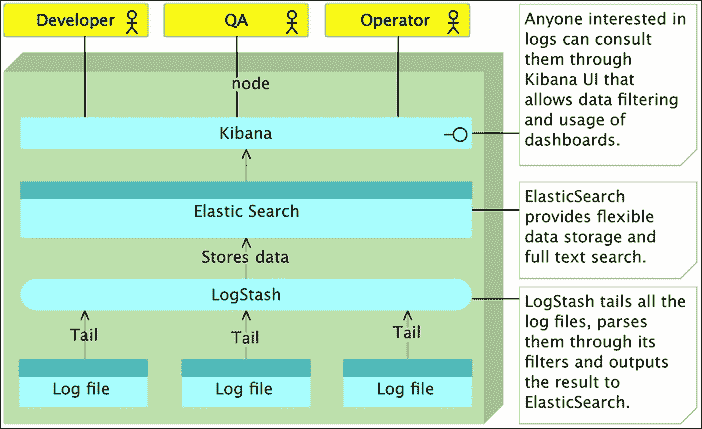
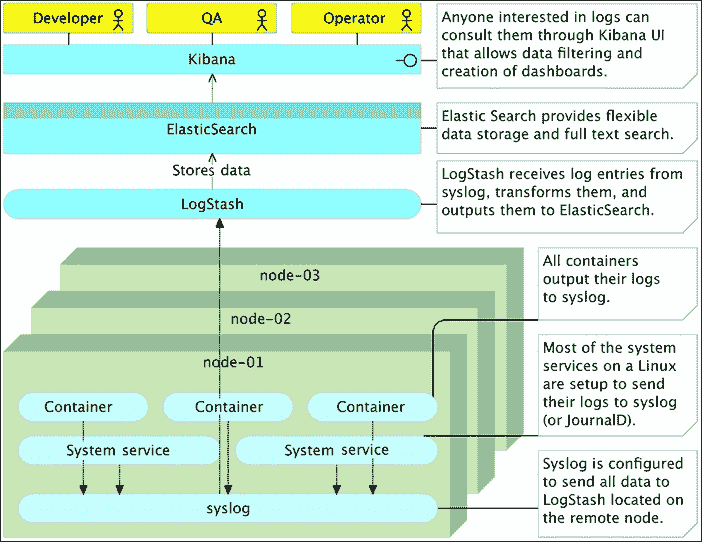

# 第十六章：集中式日志记录与监控

|   | *我的生活充满了混乱，这已经变成了一种常态。你会习惯它。你只需要放松，冷静下来，深呼吸，试着找到让事情运作的办法，而不是抱怨它们的错误。* |   |
| --- | --- | --- |
|   | --*汤姆·韦林* |

我们对 DevOps 实践和工具的探索引导我们走向了集群和扩展。因此，我们开发了一个系统，使我们能够以简单而高效的方式将服务部署到集群中。结果是，运行在由多个服务器组成的集群上的容器数量不断增加。监控单个服务器很容易，但监控一个服务器上的多个服务就会带来一些困难。监控多个服务器上的多个服务需要全新的思维方式和一整套新的工具。当你开始采用微服务、容器和集群时，部署的容器数量将开始迅速增加。集群中形成的服务器数量也同样如此。我们不能再像以前那样登录到一个节点查看日志，因为需要查看的日志太多了。更重要的是，这些日志分布在许多服务器之间。昨天我们可能在一台服务器上部署了两个服务实例，今天我们可能会将八个实例部署到六台服务器上。监控也同样如此。旧有的工具，比如 Nagios，并没有设计用来处理运行中的服务器和服务的不断变化。我们已经使用了 Consul，它提供了一种不同的，甚至可以说是新的方法来管理接近实时的监控和在阈值达到时的反应。然而，这还不够。实时信息对于检测某些东西出现故障很有价值，但它并不能告诉我们为什么故障发生了。我们可以知道某个服务没有响应，但我们无法知道原因。

我们需要关于我们系统的历史信息。这些信息可以以日志、硬件利用率、健康检查以及其他许多形式存在。存储历史数据的需求并不新鲜，已经使用了很长时间。然而，信息流动的方向随着时间发生了变化。过去，大多数解决方案基于集中式数据收集器，而今天，由于服务和服务器的高度动态特性，我们倾向于采用分散式的数据收集器。

对于集群日志记录和监控，我们需要的是一组合并的去中心化数据收集器，这些收集器将信息发送到一个集中式解析服务和数据存储。市面上有许多专门为满足这一需求而设计的产品，从本地解决方案到云端解决方案应有尽有。FluentD、Loggly、GrayLog、Splunk 和 DataDog 只是我们可以使用的一些解决方案。我选择通过 ELK 堆栈（ElasticSearch、LogStash 和 Kibana）来向你展示这些概念。这个堆栈的优势在于它是免费的，文档齐全，效率高，而且广泛使用。ElasticSearch 已经成为实时搜索和分析的最佳数据库之一。它是分布式的、可扩展的、高可用的，并提供了复杂的 API。LogStash 使我们能够集中数据处理。它可以轻松扩展以支持自定义数据格式，并提供了许多插件，几乎可以满足任何需求。最后，Kibana 是一个分析和可视化平台，具有直观的界面，位于 ElasticSearch 之上。我们将使用 ELK 堆栈并不意味着它比其他解决方案更好，这完全取决于特定的使用场景和需求。我将带你了解如何使用 ELK 堆栈进行集中式日志记录和监控。一旦这些原则被理解，你应该可以毫不费力地将其应用到其他堆栈中，如果你选择这样做的话。

我们改变了事物的顺序，选择了工具后才讨论集中式日志记录的需求。让我们来纠正这一点。

# 集中式日志记录的需求

在大多数情况下，日志消息被写入文件。这并不是说文件是存储日志的唯一方式，也不是最有效的方式。然而，由于大多数团队在某种形式下都使用基于文件的日志，因此暂时我假设你的情况也是如此。

如果我们幸运的话，每个服务或应用程序会有一个日志文件。然而，更常见的是，我们的服务会将信息输出到多个文件中。大多数时候，我们并不太关心日志中写了什么。当一切顺利时，我们没有必要浪费宝贵的时间浏览日志。日志不是我们用来打发时间的小说，也不是我们花时间去阅读的技术书籍。日志是用来在某些地方出现问题时提供有价值的信息的。

这个情况看似简单。我们将信息写入日志，平时大多数时候我们并不关注这些日志，而当出现问题时，我们查阅日志并迅速找出问题的原因。至少，这也是许多人所期望的。现实远比这复杂。除了最简单的系统外，调试过程通常更加复杂。应用程序和服务几乎总是相互关联的，往往并不容易知道是哪个造成了问题。虽然问题可能表现为某个应用程序的问题，但调查往往表明原因出在另一个地方。例如，一个服务可能没有成功实例化。花费一段时间浏览其日志后，我们可能会发现原因出在数据库上。服务无法连接到数据库，导致启动失败。我们看到了症状，但没有找到原因。我们需要切换到数据库的日志中去找出真相。通过这个简单的例子，我们已经到了仅查看一个日志是不够的阶段。

在集群上运行的分布式服务使得情况变得更加复杂。哪个服务实例出现了故障？它运行在哪台服务器上？有哪些上游服务发起了请求？故障所在节点的内存和硬盘使用情况如何？正如你可能猜到的，查找、收集和筛选出成功发现原因所需的信息往往非常复杂。系统越大，问题越难解决。即使是单体应用，情况也可能很容易失控。如果采用（微）服务架构，这些问题会被成倍增加。集中式日志对所有除最简单、最小的系统外都是必须的。相反，当事情出错时，我们中的许多人开始在不同的服务器之间奔波，从一个文件跳到另一个文件。就像无头的苍蝇一样，四处乱跑，毫无方向。我们往往接受日志所带来的混乱，并将其视为职业的一部分。

在集中式日志中，我们需要关注什么？其实有很多方面，但最重要的包括以下几点：

+   一种解析数据并将其近实时发送到中央数据库的方法。

+   数据库处理近实时数据查询和分析的能力。

+   通过过滤后的表格、仪表板等方式，数据的可视化呈现。

我们已经选择了能够满足所有这些需求（甚至更多）工具。ELK 堆栈（LogStash、ElasticSearch 和 Kibana）可以做到这一点。与我们探索的其他所有工具一样，这个堆栈可以轻松扩展，以满足我们将面临的具体需求。

现在我们对要完成的目标有了模糊的概念，并且有了实现这些目标的工具，让我们来探索几种可以使用的日志策略。我们将从最常见的场景开始，逐渐过渡到更复杂、更高效的日志策略定义方法。

不再多说，我们来创建将用于实验集中式日志记录以及后续监控的环境。我们将创建三个节点。你应该已经对`cd`和`prod`虚拟机很熟悉了。第一个主要用于配置，而第二个将作为生产服务器。我们将引入一个新的虚拟机，名为`logging`。它将模拟生产服务器，旨在运行所有日志记录和监控工具。理想情况下，替代单一的生产服务器（`prod`），我们可以将示例运行在 Swarm 集群上。这将使我们能够在更接近生产的环境中看到优势。然而，由于前几章已经把单台笔记本电脑能承载的极限拉得很远，我不想冒险，所以选择了单台虚拟机。话虽如此，所有示例同样适用于一台、十台、百台或千台服务器。你应该没有问题将它们扩展到整个集群：

```
vagrant up cd prod logging
vagrant 
ssh cd

```

# 将日志条目发送到 ElasticSearch

我们将从使用 ELK 栈（ElasticSearch、LogStash 和 Kibana）来配置`logging`服务器开始。我们将继续使用 Ansible 进行配置，因为它已经转变为我们最喜欢的配置管理工具。

让我们运行 elk.yml 剧本，并在执行过程中进行探索：

```
ansible-playbook /vagrant/ansible/elk.yml \
 -i /vagrant/ansible/hosts/prod \
 --extra-vars "logstash_config=file.conf"

```

剧本的定义如下：

```
- hosts: logging
 remote_user: vagrant
 serial: 1
 roles:
 - common
 - docker
 - elasticsearch
 - logstash
 - kibana

```

我们之前已经使用了`common`和`docker`角色很多次，因此我们会跳过它们，直接进入在`roles/elasticsearch/tasks` `/main.yml`文件中定义的`elasticsearch`任务：

```
- name: Container is running
 docker:
 name: elasticsearch
 image: elasticsearch
 state: running
 ports:
 - 9200:9200
 volumes:
 /data/elasticsearch:/usr/share/elasticsearch/data
 tags: [elasticsearch]

```

多亏了 Docker，我们只需要运行官方的`elasticsearch`镜像。它通过端口`9200`暴露其 API，并定义了一个我们将用来在主机上持久化数据的卷。

接下来是`logstash`角色。在`roles/logstash/tasks/main.yml`文件中定义的任务如下：

```
- name: Directory is present
 file:
 path: "{{ item.path }}"
 recurse: yes
 state: directory
 mode: "{{ item.mode }}"
 with_items: directories
 tags: [logstash]

- name: File is copied
 copy:
 src: "{{ item.src }}"
 dest: "{{ item.dest }}"
 with_items: files
 tags: [logstash]

- name: Container is running
 docker:
 name: logstash
 image: logstash
 state: running
 expose:
 - 5044
 - 25826
 - 25826/udp
 - 25827
 - 25827/udp
 ports:
 - 5044:5044
 - 5044:5044/udp
 - 25826:25826
 - 25826:25826/udp
 - 25827:25827
 - 25827:25827/udp
 volumes:
 - /data/logstash/conf:/conf
 - /data/logstash/logs:/logs
 links:
 - elasticsearch:db
 command: logstash -f /conf/{{ logstash_config }}
 tags: [logstash]

```

虽然比`elasticsearch`任务稍多一些，这些任务仍然相对简单。任务会创建一个目录，复制一些配置文件，这些文件将在本章中使用，并运行官方的 logstash 镜像。由于我们将实验许多不同的场景，需要暴露并定义不同的端口。这个角色暴露了两个卷。第一个卷将保存配置文件，而第二个卷则作为一个目录来存放日志。最后，任务会创建与`elasticsearch`容器的链接，并指定`command`应使用定义为变量的配置文件启动`logstash`。我们用来运行剧本的命令包含了设置为`file.conf`的`logstash_config`变量。我们快速看一下它：

```
input {
 file {
 path => "/logs/**/*"
 }
}

output {
 stdout {
 codec => rubydebug
 }
 elasticsearch {
 hosts => db
 }
}

```

LogStash 的配置由三大部分组成：`input`、`output`和`filters`。我们暂时跳过`filter`，集中讨论其他两个部分。

`input` 部分定义了一个或多个日志来源。在此案例中，我们定义了输入应该通过文件插件处理，`path` 设置为 `/logs/**/*`。一个星号表示任何文件或目录，而两个连续的星号表示任何目录或子目录中的文件。`/logs/**/*` 这个值可以描述为 `/logs/` 目录中的任何文件或其任何子目录中的文件。请记住，尽管我们只指定了一个输入，但可能会有多个输入，并且通常是这样。有关所有支持的输入插件的更多信息，请参阅官方的输入插件页面。

`output` 部分定义了通过输入收集的日志条目的目的地。在此案例中，我们设置了两个输出。第一个是使用 `stdout` 输出插件，它会通过 `rubydebug` 编解码器将所有内容打印到标准输出。请注意，我们仅将 `stdout` 用于演示目的，以便快速查看结果。在生产环境中，出于性能考虑，您应该删除它。第二个输出更有趣，它使用 ElasticSearch 输出插件将所有日志条目发送到数据库。请注意，`hosts` 变量设置为 `db`。由于我们已将 `logstash` 和 `elasticsearch` 容器连接在一起，Docker 在 `/etc/hosts` 文件中创建了 `db` 条目。有关所有支持的输出插件的更多信息，请参阅 [`www.elastic.co/guide/en/logstash/current/output-plugins.html`](https://www.elastic.co/guide/en/logstash/current/output-plugins.html) 页面。

这个配置文件可能是我们可以开始使用的最简单的文件。在我们看到它的实际效果之前，让我们来看看堆栈中的最后一个元素。Kibana 将提供一个用户界面，供我们与 ElasticSearch 交互。kibana 角色的任务在 `roles/kibana/tasks/main.yml` 文件中定义。它包含了备份恢复任务，我们现在可以跳过这些任务，专注于运行容器的部分：

```
- name: Container is running
 docker:
 image: kibana
 name: kibana
 links:
 - elasticsearch:elasticsearch
 ports:
 - 5601:5601
 tags: [kibana]

```

就像 ELK 堆栈中的其他组件一样，Kibana 也有官方的 Docker 镜像。我们只需要将容器链接到 `elasticsearch`，并暴露我们将用于访问 UI 的 `6501` 端口。我们很快就能看到 Kibana 的实际效果。

在我们模拟一些日志条目之前，我们需要进入运行 ELK 堆栈的 `logging` 节点：

```
exit

vagrant ssh logging

```

由于 `/data/logstash/logs` 卷与容器共享，并且 LogStash 正在监视其中的任何文件，我们可以创建一个仅包含一个条目的日志：

```
echo "my first log entry" \
 >/data/logstash/logs/my.log

```

让我们看看 LogStash 的输出，看看发生了什么：

```
docker logs logstash

```

请注意，处理第一个日志条目可能需要几秒钟，如果 `docker logs` 命令没有返回任何内容，请重新执行它。所有新条目对同一文件的处理速度会快得多：

输出如下：

```
{
       "message" => "my first log entry",
      "@version" => "1",
    "@timestamp" => "2016-02-01T18:01:04.044Z",
          "host" => "logging",
          "path" => "/logs/my.log"
}
```

如您所见，LogStash 处理了我们的 `my first log entry` 并添加了一些额外的信息。我们得到了时间戳、主机名以及日志文件的路径：

让我们再添加几个条目：

```
echo "my second log entry" \
 >>/data/logstash/logs/my.log

echo "my third log entry" \
 >>/data/logstash/logs/my.log

docker logs logstash

```

`docker logs`命令的输出如下：

```
{
       "message" => "my first log entry",
      "@version" => "1",
    "@timestamp" => "2016-02-01T18:01:04.044Z",
          "host" => "logging",
          "path" => "/logs/my.log"
}
{
       "message" => "my second log entry",
      "@version" => "1",
    "@timestamp" => "2016-02-01T18:02:06.141Z",
          "host" => "logging",
          "path" => "/logs/my.log"
}
{
       "message" => "my third log entry",
      "@version" => "1",
    "@timestamp" => "2016-02-01T18:02:06.150Z",
          "host" => "logging",
          "path" => "/logs/my.log"
}
```

如预期的那样，所有三条日志条目都已被 LogStash 处理，现在是通过 Kibana 可视化它们的时候了。请从浏览器打开`http://10.100.198.202:5601/`。由于这是第一次运行 Kibana，它会要求我们配置一个索引模式。幸运的是，它已经找到了索引格式（`logstash-*`）以及哪个字段包含时间戳（`@timestamp`）。请点击**Create**按钮，然后点击顶部菜单中的**Discover**：


图 16-01 – 带有若干日志条目的 Kibana Discover 屏幕

默认情况下，**Discover**屏幕会显示过去十五分钟内在 ElasticSearch 中生成的所有条目。稍后当我们生成更多日志时，我们将探索此屏幕提供的功能。目前，请点击其中一个日志条目最左侧列的箭头。你将看到所有 LogStash 生成并发送到 ElasticSearch 的字段。目前，由于我们没有使用任何过滤器，这些字段仅限于表示整个日志条目的*消息*，以及 LogStash 生成的一些通用字段。

我们使用的示例是简单的，甚至不像一个日志条目。让我们增加日志的复杂性。我们将使用我准备的一些条目。示例日志位于`/tmp/apache.log`文件中，包含了一些遵循 Apache 格式的日志条目。其内容如下：

```
127.0.0.1 - - [11/Dec/2015:00:01:45 -0800] "GET /2016/01/11/the-devops-2-0-toolkit/ HTTP/1.1" 200 3891 "http://technologyconversations.com" "Mozilla/5.0 (Macintosh; Intel Mac OS X 10.9; rv:25.0) Gecko/20100101 Firefox/25.0"
127.0.0.1 - - [11/Dec/2015:00:01:57 -0800] "GET /2016/01/18/clustering-and-scaling-services/ HTTP/1.1" 200 3891 "http://technologyconversations.com" "Mozilla/5.0 (Macintosh; Intel Mac OS X 10.9; rv:25.0) Gecko/20100101 Firefox/25.0"
127.0.0.1 - - [11/Dec/2015:00:01:59 -0800] "GET /2016/01/26/self-healing-systems/ HTTP/1.1" 200 3891 "http://technologyconversations.com" "Mozilla/5.0 (Macintosh; Intel Mac OS X 10.9; rv:25.0) Gecko/20100101 Firefox/25.0"

```

由于 LogStash 期望在`/data/logstash/logs/`目录中找到日志文件，让我们复制示例：

```
cat /tmp/apache.log \
 >>/data/logstash/logs/apache.log

```

让我们看看 LogStash 生成的输出：

```
docker logs logstash

```

LogStash 可能需要几秒钟才能检测到有新文件需要监控。如果`docker logs`输出没有显示任何新内容，请重复执行该命令。输出应该类似于以下内容：

```
{
       "message" => "127.0.0.1 - - [11/Dec/2015:00:01:45 -0800] \"GET /2016/01/11/the-devops-2-0-toolkit/ HTTP/1.1\" 200 3891 \"http://technologyconversations.com\" \"Mozilla/5.0 (Macintosh; Intel Mac OS X 10.9; rv:25.0) Gecko/20100101 Firefox/25.0\"",
      "@version" => "1",
    "@timestamp" => "2016-02-01T19:06:21.940Z",
          "host" => "logging",
          "path" => "/logs/apache.log"
}
{
       "message" => "127.0.0.1 - - [11/Dec/2015:00:01:57 -0800] \"GET /2016/01/18/clustering-and-scaling-services/ HTTP/1.1\" 200 3891 \"http://technologyconversations.com\" \"Mozilla/5.0 (Macintosh; Intel Mac OS X 10.9; rv:25.0) Gecko/20100101 Firefox/25.0\"",
      "@version" => "1",
    "@timestamp" => "2016-02-01T19:06:21.949Z",
          "host" => "logging",
          "path" => "/logs/apache.log"
}
{
       "message" => "127.0.0.1 - - [11/Dec/2015:00:01:59 -0800] \"GET /2016/01/26/self-healing-systems/ HTTP/1.1\" 200 3891 \"http://technologyconversations.com\" \"Mozilla/5.0 (Macintosh; Intel Mac OS X 10.9; rv:25.0) Gecko/20100101 Firefox/25.0\"",
      "@version" => "1",
    "@timestamp" => "2016-02-01T19:06:21.949Z",
          "host" => "logging",
          "path" => "/logs/apache.log"
}
```

相同的数据可以从运行在`http://10.100.198.202:5601/`上的 Kibana 中观察到。

我们刚刚开始，但已经取得了巨大的进展。当服务器出现故障时，我们不需要知道是哪项服务失败，也不需要知道它的日志在哪里。我们可以从一个地方获取该服务器的所有日志条目。无论是开发人员、测试人员、操作员还是其他任何角色，都可以打开运行在该节点上的 Kibana，检查所有服务和应用程序的日志。

之前的 Apache 日志示例比我们使用的第一个更接近生产环境。然而，条目仍然作为一条大消息存储。虽然 ElasticSearch 几乎可以搜索任何格式的几乎任何内容，但我们应该稍微帮助它，并尝试将这条日志拆分成多个字段。

## 解析日志条目

我们之前提到过，LogStash 的配置由三个主要部分组成：`input`、`output`和`filters`。之前的示例只使用了`input`和`output`，现在是时候介绍第三部分了。我已经准备好了一个示例配置文件，可以在`roles/logstash/files/file-with-filters.conf`文件中找到。它的内容如下：

```
input {
  file {
    path => "/logs/**/*"
  }
}

filter {
  grok {
    match => { "message" => "%{COMBINEDAPACHELOG}" }
  }
  date {
    match => [ "timestamp" , "dd/MMM/yyyy:HH:mm:ss Z" ]
  }
}

output {
  stdout {
    codec => rubydebug
  }
  elasticsearch {
    hosts => db
  }
}
```

`input`和`output`部分与之前相同。不同之处在于添加了`filter`。和其他两个部分一样，我们可以使用一个或多个插件。在这个例子中，我们指定了使用 grok 过滤器插件。如果没有其他理由，至少官方插件描述应该促使你尝试使用它。

Grok 目前是 LogStash 中解析**混乱的非结构化日志数据**为结构化并可查询数据的最佳方式。

Grok 基于正则表达式，LogStash 本身已经包含了很多模式。这些模式可以在[`github.com/logstash-plugins/logstash-patterns-core/blob/master/patterns/grok-patterns`](https://github.com/logstash-plugins/logstash-patterns-core/blob/master/patterns/grok-patterns)库中找到。在我们的例子中，由于我们使用的日志匹配的是 Apache 格式，这个格式已经包含在内，所以我们只需要告诉 LogStash 使用`COMBINEDAPACHELOG`模式解析`message`。稍后我们会看到如何组合不同的模式，但目前`COMBINEDAPACHELOG`应该足够用了。

我们将使用的第二个过滤器是通过日期插件定义的。它将把日志条目的时间戳转换为 LogStash 格式。

请更详细地探索过滤器插件。你很可能会找到一个或多个适合你需求的插件。

我们将`file.conf`替换为`file-with-filters.conf`文件，重启 LogStash，然后看看它的表现如何：

```
sudo cp /data/logstash/conf/file-with-filters.conf \
 /data/logstash/conf/file.conf

docker restart logstash

```

使用新的 LogStash 配置，我们可以再添加一些 Apache 日志条目：

```
cat /tmp/apache2.log \
 >>/data/logstash/logs/apache.log

docker logs logstash

```

最后一条日志的`docker logs`输出如下：

```
{
        "message" => "127.0.0.1 - - [12/Dec/2015:00:01:59 -0800] \"GET /api/v1/books/_id/5 HTTP/1.1\" 200 3891 \"http://cadenza/xampp/navi.php\" \"Mozilla/5.0 (Macintosh; Intel Mac OS X 10.9; rv:25.0) Gecko/20100101 Firefox/25.0\"",
       "@version" => "1",
     "@timestamp" => "2015-12-12T08:01:59.000Z",
           "host" => "logging",
           "path" => "/logs/apache.log",
       "clientip" => "127.0.0.1",
          "ident" => "-",
           "auth" => "-",
      "timestamp" => "12/Dec/2015:00:01:59 -0800",
           "verb" => "GET",
        "request" => "/api/v1/books/_id/5",
    "httpversion" => "1.1",
       "response" => "200",
          "bytes" => "3891",
       "referrer" => "\"http://cadenza/xampp/navi.php\"",
          "agent" => "\"Mozilla/5.0 (Macintosh; Intel Mac OS X 10.9; rv:25.0) Gecko/20100101 Firefox/25.0\""
}
```

如你所见，消息仍然完整显示。此外，这次我们得到了不少额外的字段。`clientip`、`verb`、`referrer`、`agent`以及其他数据都得到了正确的分离。这将使我们能够更高效地过滤日志。

让我们打开 Kibana，地址是`http://10.100.198.202:5601/`。你会注意到的一个问题是，Kibana 显示没有找到结果，尽管我们刚刚解析了三条日志。原因在于第二个过滤器将日志时间戳转换为 LogStash 格式。由于默认情况下，Kibana 显示的是最近 15 分钟的日志，而日志条目是在 2015 年 12 月生成的，它们确实超过了 15 分钟的时间范围。点击屏幕右上角的**Last 15 minutes**按钮，选择**Absolute**并设置时间范围为 2015 年 12 月 1 日到 2015 年 12 月 31 日。这样我们就能看到 2015 年 12 月期间的所有日志。

点击**Go**按钮，观察到我们刚刚通过 LogStash 发送到 ElasticSearch 的三个日志条目已显示在屏幕上。你会注意到右侧菜单中出现了许多新字段。我们稍后会在探索 Kibana 过滤器时使用这些字段。目前需要注意的是，这一次我们在发送日志条目到 ElasticSearch 之前对其进行了解析。

通过使用 LogStash 过滤器，我们改善了存储在 ElasticSearch 中的数据。该解决方案依赖于将整个 ELK 堆栈安装在日志所在的同一台服务器上，并且我们可以通过单一接口（Kibana）查看所有我们决定跟踪的日志。问题在于，该解决方案仅限于单一服务器。例如，如果我们有十台服务器，我们将需要安装十个 ELK 堆栈。这将引入相当大的资源开销。ElasticSearch 很占用内存，而 LogStash 会消耗更多的 CPU，这是我们不愿意让步的。与此同时，虽然我们目前所做的改进有所帮助，但仍远未理想。我们仍然需要知道哪个服务器产生了问题，并且可能需要在不同的 Kibana 之间切换，尤其是在尝试交叉参考不同的服务和应用时：



图 16-02 – 在单台服务器上运行的 ELK 堆栈

在我向你介绍去中心化日志和集中式日志解析的概念之前，让我们先移除 LogStash 实例，并回到 `cd` 节点：

```
docker rm -f lo
gstash

exit

vagrant ssh cd

```

## 将日志条目发送到中央 LogStash 实例

到目前为止我们所做的对解决问题有帮助，但仍然无法解决将所有日志集中到一个地方的问题。目前，我们只有单台服务器的所有日志在一个位置。我们该如何改变这一点？

一种简单的解决方案是将 LogStash 安装在每台服务器上，并配置它将日志条目发送到远程 ElasticSearch。至少，这就是我与之合作的大多数公司解决问题的方式。我们是否也应该这样做？答案是否定的；我们不应该。问题出在 LogStash 本身。虽然它是一个用于收集、解析和输出日志的优秀解决方案，但它消耗的资源过多。在每台服务器上都安装 LogStash 会导致资源的巨大浪费。相反，我们将使用 Filebeat。

Filebeat 是一个轻量级的日志文件传输工具，代表了 LogStash Forwarder 的下一代产品。与 LogStash 一样，它会跟踪日志文件。不同之处在于，它被优化为只负责跟踪和发送日志，不进行任何解析。另一个不同之处是它是用 Go 语言编写的。这两点使得它比 LogStash 更加高效，占用更少的资源，具有如此小的资源占用，我们可以安全地在所有服务器上运行，而不会显著增加内存和 CPU 的消耗。

在我们看到 Filebeat 的实际效果之前，我们需要更改 LogStash 配置中的 `input` 部分。新的配置位于 `roles/logstash/files/beats.conf` 文件中，内容如下：

```
input {
  beats {
    port => 5044
  }
}

output {
  stdout {
    codec => rubydebug
  }
  elasticsearch {
    hosts => db
  }
}
```

如您所见，唯一的区别在于输入部分。它使用了设置为监听端口 `5044` 的 beats 插件。通过此配置，我们可以运行一个 LogStash 实例，并让所有其他服务器将它们的日志发送到这个端口。

让我们使用以下设置部署 LogStash：

```
ansible-playbook /vagrant/ansible/elk.yml \
 -i /vagrant/ansible/hosts/prod \
 --extra-vars "logstash_config=beats.conf"

```

LogStash 现在在 `logging` 服务器上运行，并且正在监听端口 `5044` 上的 beats 数据包。在我们继续部署 Filebeat 到，比如说，`prod` 节点之前，让我们快速看一下 `prod3.yml` playbook：

```
- hosts: prod
 remote_user: vagrant
 serial: 1
 roles:
 - common
 - docker
 - docker-compose
 - consul
 - registrator
 - consul-template
 - nginx
 - file

```

新增项是 `roles/filebe` `at` 角色。其任务在 `roles/filebeat/tasks/main.yml` 文件中定义，内容如下：

```
- name: Download the package
 get_url:
 url: https://download.elastic.co/beats/filebeat/filebeat_1.0.1_amd64.deb
 dest: /tmp/filebeat.deb
 tags: [filebeat]

- name: Install the package
 apt:
 deb: /tmp/filebeat.deb
 tags: [filebeat]

- name: Configuration is present
 template:
 src: filebeat.yml
 dest: /etc/filebeat/filebeat.yml
 tags: [filebeat]

- name: Service is started
 service:
 name: filebeat
 state: started
 tags: [filebeat]

```

这些任务将下载软件包、安装它、复制配置文件，并最终运行服务。唯一值得关注的是 `r` `oles/filebeat/templates/filebeat.yml` 配置文件：

```
filebeat:
 prospectors:
 -
 paths:
 - "/var/log/**/*.log"

output:
 logstash:
 hosts: ["{{ elk_ip }}:5044"]

```

*filebeat* 部分指定了一个前景程序列表，用于定位和处理日志文件。每个前景程序项以破折号（`-`）开始，并指定特定于前景程序的配置选项，包括用于爬取日志文件的路径列表。在我们的情况下，只有一个路径被设置为 `/var/log/**/*.log`。当启动时，Filebeat 将查找位于 `/var/log/*` 目录下或其任何子目录中的所有以 `.log` 结尾的文件。由于这个位置正是大多数 Ubuntu 日志所在的位置，因此我们将处理大量的日志条目。

*output* 部分用于将日志条目发送到各种目标。在我们的例子中，我们指定了 LogStash 作为唯一的输出。由于当前的 LogStash 配置没有任何过滤功能，我们本可以将 ElasticSearch 设置为输出，结果是相同的，但开销较小。然而，由于未来很可能会添加一些过滤器，因此输出被设置为 LogStash。

请注意，过滤器既是福音也是诅咒。它们让我们可以将日志条目拆分成更易于管理的字段。另一方面，如果日志格式差异过大，您可能会花费大量时间编写解析器。是否使用过滤器，或者依赖 ElasticSearch 的过滤功能而不使用专门字段，完全取决于您。我个人的做法是两者兼顾。如果日志包含重要的信息（正如接下来某些例子所示），过滤日志是必须的。如果日志条目只是一些没有分析价值的普通信息，我则完全跳过过滤。通过一些练习，您会建立起自己的规则。

有关配置选项的更多信息，请参考 [`www.elastic.co/guide/en/beats/filebeat/current/filebeat-configuration-details.html`](https://www.elastic.co/guide/en/beats/filebeat/current/filebeat-configuration-details.html) 页面。

让我们运行 playbook，看看 Filebeat 的实际运行情况。

```
ansible-playbook /vagrant/ansible/prod3.yml \
 -i /vagrant/ansible/hosts/prod

```

现在 Filebeat 已经在 `prod` 节点上运行，我们可以查看在 `logging` 服务器上运行的 LogStash 生成的日志。

```
docker -H tcp://logging:2375 \
 logs logstash

```

`docker logs` 命令的最后几行如下：

```
...
{
       "message" => "ttyS0 stop/pre-start, process 1301",
      "@version" => "1",
    "@timestamp" => "2016-02-02T14:50:45.557Z",
          "beat" => {
        "hostname" => "prod",
            "name" => "prod"
    },
         "count" => 1,
        "fields" => nil,
    "input_type" => "log",
        "offset" => 0,
        "source" => "/var/log/upstart/ttyS0.log",
          "type" => "log",
          "host" => "prod"
}
```

FileBeat 将 `prod` 节点中 `/var/log/` 目录下的所有日志条目发送到了 `logging` 服务器上运行的 LogStash。它毫不费力地完成了这一任务，结果是我们在 ElasticSearch 中存储了超过 350 条日志条目。好吧，350 条日志条目不算值得炫耀，但如果是 350000 条，它也能轻松处理。

让我们确认日志是否已到达 Kibana。请打开 `http://10.100.198.202:5601/`。如果没有看到任何条目，说明已经过去了超过十五分钟，您需要通过点击屏幕右上角的**时间选择器**按钮来增加时间。

### 注意

请注意，每次向 ElasticSearch 索引中添加新的字段类型时，我们都应该重新创建模式。可以通过进入**设置**屏幕并点击**创建**按钮来完成。

我们再次大大改进了解决方案。现在有一个中央位置处理日志的解析（LogStash）、存储（ElasticSearch）和查看（Kibana）。我们可以在每台服务器上运行 Filebeat，并将任意数量的服务器连接到其中。它将尾随日志并将其发送到 LogStash：


图 16-03 – 在单一服务器上运行 ELK 堆栈，并将 Filebeat 分布到整个集群

让我们稍微提高难度，将所学应用于 Docker 容器。由于我们需要更改 LogStash 配置，接下来我们通过移除正在运行的实例来结束本节：

```
docker -H 
tcp://logging:2375 \
 rm -f logstash

```

## 将 Docker 日志条目发送到中央 LogStash 实例

由于我们使用的是容器，因此可以通过共享服务写入日志的目录来运行容器。我们这样做吗？答案是否定的，这时你可能会觉得我在不断带领你走向错误的解决方案。其实，我真正想做的是一步步构建解决方案，同时向你展示你可能选择的不同路径。我的首选解决方案不一定要被你采用。你有更多的选择，才能做出更明智的决策。

让我们回到写日志到文件并将其发送到 LogStash 的话题。我的个人强烈观点是，不论我们如何打包服务，所有的日志都应该发送到标准输出或错误（`stdout` 或 `stderr`）。对于这个观点有很多实际原因，虽然如此，我不会展开讲解。我已经收到了不少邮件，很多人表示我的观点和做法过于激进（大部分邮件的回复是：世纪已经变过十五年以上了）。我只想避免在日志话题上引发更多争论，并跳过在容器内写日志到文件的原因。两个原因在大众中脱颖而出。首先，我们使用卷的次数越少，容器对其运行的主机依赖性就越小，迁移它们也会更容易（无论是出于故障恢复还是扩展目的）。第二个原因是 Docker 的日志驱动程序期望日志发送到 `stdout` 和 `stderr`。通过不将日志写入文件，我们避免了与服务器或特定日志技术的耦合。

如果你正打算给我发一封讨厌的邮件，声称日志文件是天赐的恩典，请注意，我指的是在容器内部生成时日志的输出目的地（尽管在开始使用它们之前，我就已经在遵守这一规则）。

曝露容器目录并将日志作为卷挂载的替代方案是什么？Docker 在其 1.6 版本中引入了日志驱动程序功能。虽然这一功能大多数时候未被注意到，但它是一个非常酷的能力，并且是朝着在 Docker 环境中创建全面日志处理方法迈出的重要一步。从那时起，除了默认的 `json-file` 驱动程序外，我们还拥有了 `syslog`、`journald`、`gelf`、`fluentd`、`splunk` 和 `awslogs`。等你读到这本书时，可能会有新的日志驱动程序出现。

现在我们决定使用 Docker 的日志驱动程序，问题就来了：选择哪个？GELF 驱动程序以 *Greylog 扩展日志格式* 编写消息，这个格式被 LogStash 支持。如果我们只需要存储容器生成的日志，这是一个不错的选择。另一方面，如果我们不仅希望获取容器内服务生成的日志，还想获取来自整个系统的日志，我们可以选择 `JournalD` 或 `syslog`。在这种情况下，我们能获得关于所有发生的事件的（几乎）完整信息，不仅仅是容器内的，还包括整个操作系统层面的。后一种选择（`JournalD` 或 `syslog`）在 ElasticSearch 可用内存充足的情况下更为理想（更多的日志意味着更多的内存消耗），这也是我们将深入探索的内容。不要被 ElasticSearch 对大量内存的需求吓到，通过巧妙地清理旧数据，这个问题是可以轻松缓解的。我们将跳过关于 `JournalD` 是否比 `syslog` 更好的争论，并选择后者。无论你的偏好是哪个，因为这两者适用相同的原则。

这次，我们将使用`roles/logstash/files/syslog.conf`文件作为 LogStash 配置。让我们逐一查看它的各个部分：

```
input {
  syslog {
    type => syslog
    port => 25826
  }
}
```

`input`部分应该不言自明。我们使用的是`syslog 插件`，并有两个设置。第一个设置为所有通过此输入处理的事件添加一个`type`字段。它将帮助我们区分来自`syslog`的日志和通过其他方法生成的日志。`port`设置指定 LogStash 应在`25826`端口监听 syslog 事件。

配置文件的过滤部分稍微复杂一些。我决定主要使用它来展示过滤器可以做的一小部分：

```
filter {
  if "docker/" in [program] {
    mutate {
      add_field => {
        "container_id" => "%{program}"
      }
    }
    mutate {
      gsub => [
        "container_id", "docker/", ""
      ]
    }
    mutate {
      update => [
        "program", "docker"
      ]
    }
  }
  if [container_id] == "nginx" {
    grok {
      match => [ "message" , "%{COMBINEDAPACHELOG} %{HOSTPORT:upstream_address} %{NOTSPACE:upstream_response_time}"]
    }
    mutate {
      convert => ["upstream_response_time", "float"]
    }
  }
}
```

它从一个`if`语句开始。Docker 将以`docker/[CONTAINER_ID]`格式将日志发送到 syslog。我们利用这一点来区分来自 Docker 的日志条目和其他方式生成的日志。在`if`语句中，我们进行了一些变更。第一个变更是添加一个新的字段`container_id`，目前它的值与`program`字段相同。第二个变更是移除该值中的`docker/`部分，这样我们就只剩下容器 ID。最后，我们将`program`字段的值更改为`docker`。

变量及其值，变更前后的情况如下：

| 变量名称 | 变更前的值 | 变更后的值 |
| --- | --- | --- |
| `program` | `docker/[CONTAINER_ID]` | `docker` |
| `container_id` | `/` | `[CONTAINER_ID]` |

第二个条件语句通过检查`container_id`是否被设置为`nginx`来开始。如果是，它将使用我们之前看到的`COMBINEDAPACHELOG`模式来解析消息，并向其中添加两个新字段，分别为`upstream_address`和`upstream_response_time`。这两个字段也使用了预定义的 grok 模式`HOSTPORT`和`NOTSPACE`。如果你想深入了解并仔细查看这些模式，可以参考[`github.com/logstash-plugins/logstash-patterns-core/blob/master/patterns/grok-patterns`](https://github.com/logstash-plugins/logstash-patterns-core/blob/master/patterns/grok-patterns)这个仓库。如果你熟悉正则表达式，这应该容易理解（如果正则表达式能算得上容易的话）。

否则，你可能需要依赖声明的名称来找到你需要的表达式（至少在你学会正则表达式之前）。事实上，正则表达式是一种非常强大的文本解析语言，但与此同时，它也非常难以掌握：

我的妻子说，我的头发大约在我处理一个需要大量正则表达式的项目时开始变灰的。这是我们为数不多的共识之一。

最后，`nginx`条件中的变更将`upstream_response_time`字段从`string`（默认）转换为`float`。我们稍后会用到这些信息，因此需要将其转换为数字。

配置文件的第三个也是最后一个部分是`output`：

```
output {
  stdout {
    codec => rubydebug
  }
  elasticsearch {
    hosts => db
  }
}
```

这与之前的任务相同。我们将过滤后的日志条目发送到标准输出和 ElasticSearch。

现在我们已经理解了配置文件，或者至少假装我们理解了，我们可以通过 Ansible 剧本 `elk.yml` 再次部署 LogStash：

```
ansible-playbook /vagrant/ansible/elk.yml \
 -i /vagrant/ansible/hosts/prod \
 --extra-vars "logstash_config=syslog.conf"

```

现在我们已经启动并运行了 LogStash，并配置为使用 `syslog` 作为输入。让我们移除当前运行的 `nginx` 实例，并使用 Docker 日志驱动程序设置为 `syslog` 重新运行它。与此同时，我们还会用 `syslog` 配置 `prod` 节点。我们将使用的 `prod4.yml` 剧本如下：

```
- hosts: prod
 remote_user: vagrant
 serial: 1
 vars:
 - log_to_syslog: yes
 roles:
 - common
 - docker
 - docker-compose
 - consul
 - registrator
 - consul-template
 - nginx
 - rsyslog

```

如你所见，这个剧本与我们用于配置 `prod` 服务器的其他剧本类似。不同之处在于 `log_to_syslog` 变量，以及 `rsyslog` 角色的添加。

在 `roles/nginx/tasks/main.yml` 文件中定义的与 `nginx` 相关的任务如下：

```
- name: Container is running
 docker:
 image: nginx
 name: nginx
 state: running
 ports: "{{ ports }}"
 volumes: "{{ volumes }}"
 log_driver: syslog
 log_opt:
 syslog-tag: nginx
 when: log_to_syslog is defined
 tags: [nginx]

```

不同之处在于添加了 `log_driver` 和 `log_opt` 声明。第一个设置 Docker 日志驱动程序为 `syslog`。`log_opt` 可用于指定额外的日志选项，这取决于驱动程序。在这种情况下，我们指定了 `tag`。没有它，Docker 会使用容器 ID 来标识发送到 syslog 的日志。这样，当我们查询 ElasticSearch 时，将更容易找到 `nginx` 条目。

在 `roles/rsyslog/tasks/main.yml` 文件中定义的 `rsyslog` 任务如下：

```
- name: Packages are present
 apt:
 name: "{{ item }}"
 state: latest
 install_recommends: no
 with_items:
 - rsyslog
 - logrotate
 tags: [rsyslog]

- name: Config file is present
 template:
 src: 10-logstash.conf
 dest: /etc/rsyslog.d/10-logstash.conf
 register: config_result
 tags: [rsyslog]

- name: Service is restarted
 shell: service rsyslog restart
 when: config_result.changed
 tags: [rsyslog]

```

它将确保 `rsyslog` 和 `logrotate` 包已安装，复制 `10-logstash.conf` 配置文件，并重启服务。`roles/rsyslog/templates/10-logstash.conf` 模板如下：

```
*.* @@{{ elk_ip }}:25826

```

请注意，该文件是 Ansible 的模板，`{{ elk_ip }}` 将被替换为实际的 IP 地址。配置非常简单。所有发送到 syslog 的内容都会转发到指定 IP 和端口上运行的 LogStash。

现在我们准备好移除当前运行的 `nginx` 容器并运行剧本：

```
docker -H tcp://prod:2375 \
 rm -f nginx

ansible-playbook /vagrant/ansible/prod4.yml \
 -i /vagrant/ansible/hosts/prod

```

让我们看看发送到 LogStash 的内容：

```
docker -H tcp://logging:2375 \
 logs logstash

```

你应该能看到系统生成的 syslog 条目，其中之一可能如下所示：

```
{
           "message" => "[55784.504413] docker0: port 3(veth4024c56) entered forwarding state\n",
          "@version" => "1",
        "@timestamp" => "2016-02-02T21:58:23.000Z",
              "type" => "syslog",
              "host" => "10.100.198.201",
          "priority" => 6,
         "timestamp" => "Feb  2 21:58:23",
         "logsource" => "prod",
           "program" => "kernel",
          "severity" => 6,
          "facility" => 0,
    "facility_label" => "kernel",
    "severity_label" => "Informational"
}
```

我们还可以通过运行在 `http://10.100.198.20:5601/` 上的 Kibana 来查看相同的数据。

让我们看看当我们将服务打包成容器并部署时会发生什么。首先，我们将进入 `prod` 节点，并在该节点上运行 `books-ms` 服务：

```
exit

vagrant ssh prod

git clone https://github.com/vfarcic/books-ms.git

cd books-ms

```

在我们部署 `books-ms` 服务之前，让我们快速看一下 `docker-compose-logg-ing.yml` 文件：

```
app:
 image: 10.100.198.200:5000/books-ms
 ports:
 - 8080
 links:
 - db:db
 environment:
 - SERVICE_NAME=books-ms
 log_driver: syslog
 log_opt:
 syslog-tag: books-ms

db:
 image: mongo
 log_driver: syslog
 log_opt:
 syslog-tag: books-ms

```

如你所见，它遵循与我们用 Ansible 配置 `nginx` 时相同的逻辑。唯一不同的是，在这种情况下，它是 Docker Compose 配置。它包含相同的 `log_driver` 和 `log_opt` 键。

现在我们理解了需要在 Docker Compose 配置中添加的更改，我们可以部署该服务：

```
docker-compose -p books-ms \
 -f docker-compose-logging.yml \
 up -d app

```

让我们通过列出并过滤 Docker 进程来再次检查它是否确实在运行：

```
docker ps --filter name=booksms

```

现在服务已启动并运行，且使用了 `syslog` 日志驱动程序，我们应该验证日志条目是否确实被发送到 LogStash：

```
docker -H tcp://logging:2375 \
 logs logstash

```

部分输出如下：

```
{
 "message" => "[INFO] [02/03/2016 13:28:35.869] [routingSystem-akka.actor.default-dispatcher-5] [akka://routingSystem/user/IO-HTTP/listener-0] Bound to /0.0.0.0:8080\n",
 "@version" => "1",
 "@timestamp" => "2016-02-03T13:28:35.000Z",
 "type" => "syslog",
 "host" => "10.100.198.201",
 "priority" => 30,
 "timestamp" => "Feb  3 13:28:35",
 "logsource" => "prod",
 "program" => "docker",
 "pid" => "11677",
 "severity" => 6,
 "facility" => 3,
 "facility_label" => "system",
 "severity_label" => "Informational",
 "container_id" => "books-ms"
}

```

服务日志确实已发送到 LogStash。请注意，LogStash 过滤器确实按照我们指示的方式执行。`program`字段从`docker/books-ms`转换为`docker`，并且创建了一个名为`container_id`的新字段。由于我们只在`container_id`为`nginx`时定义了解析`message`，所以它保持不变。

让我们确认`message`解析确实对来自`nginx`的日志条目有效。我们需要发出几个请求给代理，所以我们先来正确配置它：

```
cp nginx-includes.conf \
 /data/nginx/includes/books-ms.conf

consul-template \
 -consul localhost:8500 \
 -template "nginx-upstreams.ctmpl:\
/data/nginx/upstreams/books-ms.conf:\
docker kill -s HUP nginx" \
 -once

```

你已经使用了`nginx`配置和 Consul 模板，因此不需要再解释这些命令。

现在服务已经启动并运行，已集成并将日志发送到 LogStash，让我们通过发出几个请求来生成一些`nginx`日志条目：

```
curl -I localhost/api/v1/books

curl -H 'Content-Type: application/json' -X PUT -d \
 "{\"_id\": 1,
 \"title\": \"My First Book\",
 \"author\": \"John Doe\",
 \"description\": \"Not a very good book\"}" \
 localhost/api/v1/books | jq '.'

curl http://prod/api/v1/books | jq '.'

```

让我们看看这次 LogStash 收到了什么：

```
docker -H tcp://logging:2375 \
 logs logstash

```

`docker logs`命令的部分输出如下：

```
{
 "message" => "172.17.0.1 - - [03/Feb/2016:13:37:12 +0000] \"GET /api/v1/books HTTP/1.1\" 200 269 \"-\" \"curl/7.35.0\" 10.100.198.201:32768 0.091 \n",
 "@version" => "1",
 "@timestamp" => "2016-02-03T13:37:12.000Z",
 "type" => "syslog",
 "host" => "10.100.198.201",
 "priority" => 30,
 "timestamp" => [
 [0] "Feb  3 13:37:12",
 [1] "03/Feb/2016:13:37:12 +0000"
 ],
 "logsource" => "prod",
 "program" => "docker",
 "pid" => "11677",
 "severity" => 6,
 "facility" => 3,
 "facility_label" => "system",
 "severity_label" => "Informational",
 "container_id" => "nginx",
 "clientip" => "172.17.0.1",
 "ident" => "-",
 "auth" => "-",
 "verb" => "GET",
 "request" => "/api/v1/books",
 "httpversion" => "1.1",
 "response" => "200",
 "bytes" => "269",
 "referrer" => "\"-\"",
 "agent" => "\"curl/7.35.0\"",
 "upstream_address" => "10.100.198.201:32768",
 "upstream_response_time" => 0.091
}

```

这一次，不仅存储了来自容器的日志，我们还对它们进行了解析。解析`nginx`日志的主要原因在于`upstream_response_time`字段。你能猜到为什么吗？在你思考该字段可能的用途时，让我们仔细看看 Kibana **Discover** 界面的一些功能。

我们已经生成了足够的日志，因此我们可能想开始使用 Kibana 过滤器。请打开`http://10.10` `0.198.202:5601/`。请点击右上角的按钮，将时间更改为，比如说，24 小时。这将给我们足够的时间来操作我们创建的少量日志。在我们开始过滤之前，请进入**设置**界面，并点击**创建**。这将刷新我们的索引模式，添加新的字段。完成后，请返回到**发现**界面。

让我们从左侧菜单开始。它包含所有可用字段，这些字段出现在所有匹配给定时间段的日志中。点击任何一个字段都会显示该字段包含的值列表。例如，`container_id`包含`books-ms`和`nginx`。这些值旁边有一个放大镜图标。带有加号的图标可以用来仅过滤包含该值的条目。类似地，带有减号的图标可以用来排除记录。点击`nginx`旁边的加号图标。正如你所看到的，只有来自`nginx`的日志条目会显示出来。应用的过滤器结果位于上方的横条中。将鼠标悬停在其中一个过滤器（在此为`container_id: "nginx"`）上，可以启用、禁用、固定、取消固定、反转、切换和移除该过滤器：


图 16-04 – Kibana Discover 界面，按 container_id nginx 过滤后的日志条目

在主框架的顶部有一个图表，显示指定时间段内的日志数量。其下方是一个包含日志条目的表格。默认情况下，它显示 `时间` 和 `*_source*` 列。请点击某一行左侧的箭头图标，它会展开该行，显示该日志条目中的所有字段。这些字段是 LogStash 生成的数据与我们通过其配置解析的数据的结合。每个字段都有与左侧菜单中相同的图标。

通过它们，我们可以 *按值筛选或排除值*。第三个按钮，图标像一个带有两列的单行表格，可以用来 *切换表格中的列*。由于默认列并不太有用，更不用说有些无聊了，请切换 `logsource`、`request`、`verb`、`upstream_address` 和 `upstream_response_time`。再次点击箭头，可以隐藏这些字段。我们就得到了一个漂亮的表格，显示了来自 `nginx` 的一些最重要的信息。我们可以看到请求所在的服务器（`logsource`），请求的地址（`request`），请求的类型（`verb`），接收响应所花费的时间（`upstream_response_time`），以及请求被代理到哪里（`upstream_address`）。如果你认为你创建的 *搜索* 有用，可以通过点击位于屏幕右上角的 **保存搜索** 按钮将其保存。

它旁边是 **加载已保存搜索** 按钮：


图 16-05 – Kibana Discover 屏幕，显示由 container_id nginx 和自定义列筛选的日志条目

稍后我们将稍微探索一下 **可视化** 和 **仪表板** 屏幕。

让我们总结一下目前的流程：

+   容器通过 Docker 的日志驱动程序设置为 `syslog`。在这种配置下，Docker 将所有发送到标准输出或错误（`stdout`/`stderr`）的内容重定向到 `syslog`。

+   所有的日志条目，无论是来自容器还是通过其他方法部署的进程，都从 syslog 重定向到 LogStash。

+   LogStash 接收 syslog 事件，应用过滤器和转换规则，然后将其重新发送到 ElasticSearch。

+   大家都很高兴，因为找到特定的日志条目变得轻松，办公室工作时间也变得更容易应对。


图 16-06 – ELK 堆栈在单台服务器上运行，容器日志记录到 syslog

# 基于软件数据的自愈

让我们充分利用通过 `nginx` 记录的响应时间。由于数据存储在 ElasticSearch 中，我们可以做一些快速的 API 示例。我们可以，例如，检索存储在 `logstash` 索引中的所有条目：

```
curl 'http://logging:9200/logstash-*/_search' \
 | jq '.'

```

ElasticSearch 返回了前十条记录（默认的页面大小），并附带了一些额外的信息，比如总记录数。检索所有条目没有太大意义，因此让我们尝试缩小范围。例如，我们可以请求所有`container_id`值为`nginx`的记录：  

```
curl 'http://logging:9200/logstash-*/_search?q=container_id:nginx' \
 | jq '.'

```

结果与我们从 LogStash 日志中观察到的三个条目相同。同样，这些条目没有太大用处。如果这是一个生产系统，我们将得到成千上万的结果（分布在多个页面中）。  

这次，让我们尝试一些真正有用的东西。我们将分析数据，举个例子，从`nginx`日志中提取平均响应时间：  

```
curl 'http://logging:9200/logstash-*/_search?q=container_id:nginx' \
 -d '{
 "size": 0,
 "aggs": {
 "average_response_time": {
 "avg": {
 "field": "upstream_response_time"
 }
 }
 }
}' | jq '.'

```

上一条命令的输出如下：  

```
{
  "aggregations": {
    "average_response_time": {
      "value": 0.20166666666666666
    }
  },
  "hits": {
    "hits": [],
    "max_score": 0,
    "total": 3
  },
  "_shards": {
    "failed": 0,
    "successful": 10,
    "total": 10
  },
  "timed_out": false,
  "took": 26
}
```

通过类似的请求，我们可以扩展我们的自愈系统，例如，检索服务在过去一小时的平均响应时间。如果平均响应时间较慢，我们可以进行扩容。同样，如果响应较快，我们可以进行缩容。  

让我们筛选结果，只返回那些由`nginx`生成的、请求路径为`/api/v1/books`（我们服务的地址）并且是在过去一小时内生成的记录。一旦数据被筛选，我们将汇总所有结果，得到`upstream_response_time`字段的平均值。  

你发送请求到服务通过`nginx`时，可能已经过去了超过一个小时。如果是这种情况，结果值会是`null`，因为没有任何记录符合我们将要做的筛选条件。我们可以通过发送，比如说，一百个新的请求，轻松解决这个问题：  

```
for i in {1..100}; do
 curl http://prod/api/v1/books | jq '.'
done

```

现在我们有了最新的数据，可以请求 ElasticSearch 给我们返回平均响应时间：  

```
curl 'http://logging:9200/logstash-*/_search' \
    -d '{
  "size": 0,
  "aggs": { "last_hour": {
    "filter": {
      "bool": { "must": [ {
        "query": { "match": {
          "container_id": {
            "query": "nginx",
            "type": "phrase"
          }
        } }
      }, {
        "query": { "match": {
          "request": {
            "query": "/api/v1/books",
            "type": "phrase"
          }
        } }
      }, {
        "range": { "@timestamp": {
          "gte": "now-1h",
          "lte": "now"
        } }
      } ] }
    },
    "aggs": {
      "average_response_time": {
        "avg": {
          "field": "upstream_response_time"
        }
      }
    }
  } }
}' | jq '.'
```

ElasticSearch API 和后台使用的 Lucene 引擎庞大到需要一本书来描述，因此解释超出了本书的范围。你可以在[`www.elastic.co/guide/en/elasticsearch/reference/current/docs.html`](https://www.elastic.co/guide/en/elasticsearch/reference/current/docs.html)页面找到详细信息。  

请求的输出会因情况而异。我的结果如下：  

```
{
  "aggregations": {
    "last_hour": {
      "average_response_time": {
        "value": 0.005744897959183675
      },
      "doc_count": 98
    }
  },
  "hits": {
    "hits": [],
    "max_score": 0,
    "total": 413
  },
  "_shards": {
    "failed": 0,
    "successful": 10,
    "total": 10
  },
  "timed_out": false,
  "took": 11
}
```

我们现在可以根据响应时间，并依据设定的规则，进行扩容、缩容或不做任何操作。现在，我们已经具备了扩展自愈系统的所有要素。我们有存储响应时间到 ElasticSearch 的过程和用于分析数据的 API。我们可以创建一个新的 Consul watch，它会定期查询 API，如果需要采取行动，就向 Jenkins 发送请求，防止故障蔓延。我将这部分留给你作为练习。  

### 注意  

**练习：如果响应时间过长，则扩容服务**

创建一个新的 Consul 监视器，使用我们创建的 ElasticSearch 请求，并调用 Jenkins 任务，如果平均响应时间过长，则扩展服务。如果响应时间过短，并且运行了两个以上实例，则进行缩容（少于两个实例存在停机风险）。

在不引入更多复杂性的情况下，我们可以尝试其他类型的未来预测。例如，我们可以通过观察前一天的数据来预测未来。

### 注意

**练习：通过观察过去来预测未来**

重复上一个练习的过程，进行不同的分析。

**变量：**

+   T：当前时间

+   AVG1：前一天 T 到 T+1 小时之间的平均流量。

+   AVG2：前一天 T+1 小时到 T+2 小时之间的平均流量。

**任务：**

+   计算`AVG1`和`AVG2`之间流量的增减。

+   决定是否进行扩容、缩容，或者什么都不做。

我们不需要仅仅依赖前一天的数据来进行分析。我们还可以评估前一周的同一天、上个月的同一天，甚至是去年的同一天。每个月的第一天我们的网站流量是否增加？去年圣诞节发生了什么？暑假过后，人们是否更少访问我们的商店？美妙之处在于，我们不仅拥有回答这些问题的数据，而且还可以将分析整合到系统中，并定期运行。

请记住，有些分析最好作为 Consul 监视器来运行，而其他则属于 Jenkins 任务。那些需要定期以相同频率运行的任务适合使用 Consul。虽然它们也可以轻松地从 Jenkins 运行，但 Consul 更轻量，资源占用更少。例如，每小时或每 5 分钟运行一次。另一方面，Consul 没有合适的调度程序。如果你希望在特定的时间点运行分析，Jenkins 及其类似 cron 的调度程序更为合适。例如，每天午夜、每个月的第一天、圣诞节前两周等等。你应该根据具体情况评估这两种工具，并选择更合适的一个。另一种选择是将所有此类分析都从 Jenkins 运行，这样你可以将一切集中在一个地方。或者，你可能会选择一整套不同的工具。我将这个选择留给你。重要的是理解整个过程以及我们想要实现的目标。

请注意，我提供了一个可以用作自愈过程的示例。响应时间分析不必是我们唯一要做的事情。看看你可以收集的数据，决定哪些是有用的，哪些没有用，然后进行其他类型的数据处理。收集你需要的一切，但不要过多。不要陷入存储所有能想到的数据而不使用它的陷阱。那样会浪费内存、CPU 和硬盘空间。别忘了设置一个定期清理数据的过程。你不需要一年前的所有日志。天哪，你可能连一个月前的日志都不需要。如果一个问题在三十天内没有被发现，那很可能是没有问题，甚至即使有，也是与不再运行的旧版本相关的。如果在读完这本书后，你的发布周期仍然持续几个月，而且你不打算缩短它，那我真是彻底失败了。请不要给我发电子邮件确认这点，这只会让我感到沮丧。

这只是从本章（日志记录与监控）主旨的一个短暂岔路。由于本书主要基于实践示例，我无法在没有数据的情况下解释*基于历史响应时间的自愈*。因此，这段讨论被加在这里。在本章的其余部分，将会有至少一次涉及可能本应属于第十五章，*自愈系统*章节的内容。现在，我们回到日志记录与监控的主题。

由于我们拥有表示集群过去和当前状态的所有信息，我们可以……在这一刻，我想象你，亲爱的读者，正在翻白眼并低声抱怨，认为软件日志并不能构成集群的完整信息。只有软件（日志）和硬件数据（指标）结合起来，才能接近关于集群的完整信息。再说一次，我的想象力可能并不（而且经常不）代表现实。你可能没有翻白眼，甚至没有注意到硬件数据的缺失。

如果是这样，你没有仔细阅读我写的内容，应该好好休息一下，或者，至少去喝杯咖啡。说实话，我们确实在 Consul 中有硬件信息，但那只是当前状态。我们无法分析这些数据，看到趋势，了解发生了什么，也无法预测未来。如果你还没入睡，我们来看看如何记录硬件状态。

在我们继续之前，我们将移除当前正在运行的 LogStash 实例，并退出生产节点：

```
docker -H tcp://logging:2375 \

 rm -f logstash

exit

```

## 记录硬件状态

当你开始学习计算机操作时，最先教你的一件事就是软件运行在硬件上。没有硬件，软件无法运行；没有软件，硬件也没有用。由于它们相互依赖，任何收集系统信息的尝试都需要包括这两者。我们已经探索了一些收集软件数据的方法，接下来的步骤是尝试用硬件实现类似的结果。

我们需要一个工具来收集其运行系统的统计信息，并且具有将这些信息发送到 LogStash 的灵活性。一旦我们找到并部署了这样的工具，我们就可以开始使用它提供的统计数据，找出过去和现在的性能瓶颈，并预测未来的系统需求。由于 LogStash 将把从该工具接收到的信息发送到 ElasticSearch，我们可以创建公式，从而执行性能分析和容量规划。

其中一个工具是 CollectD。它是一个免费的开源项目，使用 C 语言编写，使其性能高效且具有很强的可移植性。它可以轻松处理成千上万的数据集，并且自带超过 90 个插件。

幸运的是，LogStash 有一个 CollectD 输入插件，我们可以使用它通过 UDP 端口接收事件。我们将使用（`roles/logstash/files/syslog-collectd.conf`）[[`github.com/vfarcic/ms-lifecycle/blob/master/ansible/roles/logstash/files/syslog-collectd.conf`](https://github.com/vfarcic/ms-lifecycle/blob/master/ansible/roles/logstash/files/syslog-collectd.conf)]文件来配置 LogStash 以接收*CollectD*输入。它是（`roles/logstash/files/syslog.conf`）[`https://github.com/vfarcic/ms-lifecycle/blob/master/ansible/roles/logstash/files/syslog.conf`]的副本，增加了一个输入定义。让我们来看一下它的`input`部分：

```
input {
 syslog {
 type => syslog
 port => 25826
 }
 udp {
 port => 25827
 buffer_size => 1452
 codec => collectd { }
 type => collectd
 }
}

```

正如你所见，我们所做的只是添加了一个新的输入，该输入监听 UDP 端口`25827`，设置了缓冲区大小，定义了应使用`collectd`编解码器，并添加了一个名为 type 的新字段。通过 type 字段的值，我们可以将`syslog`日志与来自`collectd`的日志区分开来。

让我们运行将配置`logging`服务器并安装 LogStash 的 playbook，并将其配置为接收`syslog`和`collectd`输入：

```
vagrant ssh cd

ansible-playbook /vagrant/ansible/elk.yml \
 -i /vagrant/ansible/hosts/prod \
 --extra-vars "logstash_config=syslog-collectd.conf restore_backup=true"

```

你可能已经注意到使用了`restore_backup`变量。*kibana*的任务之一是通过`vfarcic/elastic-dump`容器恢复一个 ElasticSearch 备份，该备份包含 Kibana 仪表板的定义，稍后将讨论。备份通过包含由*taskrabbit*开发的`elasticsearch-dump`工具的`vfarcic/elastic-dump`容器恢复。该工具可用于创建和恢复 ElasticSearch 备份。

现在 LogStash 已配置为接受 `CollectD` 输入，让我们将注意力转向 `prod` 服务器，并安装 `CollectD`。我们将使用 `prod5.yml` 剧本，该剧本除了我们之前使用的工具外，还包含了 `collectd` 角色。任务定义在（`roles/collectd/tasks/main.yml`）[[`github.com/vfarcic/ms-lifecycle/tree/master/ansible/roles/collectd/tasks/main.yml`](https://github.com/vfarcic/ms-lifecycle/tree/master/ansible/roles/collectd/tasks/main.yml)] 文件中。其内容如下：

```
- name: Packages are installed
 apt:
 name: "{{ item }}"
 with_items: packages
 tags: ["collectd"]

- name: Configuration is copied
 template:
 src: collectd.conf
 dest: /etc/collectd/collectd.conf
 register: config_result
 tags: ["collectd"]

- name: Service is restarted
 service:
 name: collectd
 state: restarted
 when: config_result|changed
 tags: ["collectd"]

```

到这时，你可能已经可以认为自己是 Ansible 的专家，不再需要解释角色了。唯一值得评论的是 `roles/collectd/files/collectd.conf` 模板，它代表了 `CollectD` 配置。我们快速看一下：

```
Hostname "{{ ansible_hostname }}"
FQDNLookup false

LoadPlugin cpu
LoadPlugin df
LoadPlugin interface
LoadPlugin network
LoadPlugin memory
LoadPlugin swap

<Plugin df>
        Device "/dev/sda1"
        MountPoint "/"
        FSType "ext4"
        ReportReserved "true"
</Plugin>

<Plugin interface>
        Interface "eth1"
        IgnoreSelected false
</Plugin>

<Plugin network>
        Server "{{ elk_ip }}" "25827"
</Plugin>

<Include "/etc/collectd/collectd.conf.d">
        Filter ".conf"
</Include>
```

它首先通过 Ansible 变量 `ansible_hostname` 定义主机名，接着加载我们将使用的插件。它们的名称应该是不言自明的。最后，一些插件有额外的配置。有关配置格式、可用插件及其设置的更多信息，请参阅 [`collectd.org/documentation.shtml`](https://collectd.org/documentation.shtml) 文档。

让我们运行剧本：

```
ansible-playbook /vagrant/ansible/prod5.yml \
 -i /vagrant/ansible/hosts/prod

```

现在 `CollectD` 正在运行，我们可以稍等几秒钟，看看 LogStash 日志：

```
docker -H tcp://logging:2375 \
 logs logstash

```

其中的一些条目如下：

```
{
             "host" => "prod",
       "@timestamp" => "2016-02-04T18:06:48.843Z",
           "plugin" => "memory",
    "collectd_type" => "memory",
    "type_instance" => "used",
            "value" => 356433920.0,
         "@version" => "1",
             "type" => "collectd"
}
{
             "host" => "prod",
       "@timestamp" => "2016-02-04T18:06:48.843Z",
           "plugin" => "memory",
    "collectd_type" => "memory",
    "type_instance" => "buffered",
            "value" => 31326208.0,
         "@version" => "1",
             "type" => "collectd"
}
{
             "host" => "prod",
       "@timestamp" => "2016-02-04T18:06:48.843Z",
           "plugin" => "memory",
    "collectd_type" => "memory",
    "type_instance" => "cached",
            "value" => 524840960.0,
         "@version" => "1",
             "type" => "collectd"
}
{
             "host" => "prod",
       "@timestamp" => "2016-02-04T18:06:48.843Z",
           "plugin" => "memory",
    "collectd_type" => "memory",
    "type_instance" => "free",
            "value" => 129638400.0,
         "@version" => "1",
             "type" => "collectd"
}
```

从输出中，我们可以看到 CollectD 发送了关于内存的信息。第一个条目包含 `used`，第二个包含 `buffered`，第三个包含 `cached`，最后，第四个代表 `free` 内存。从其他插件也可以看到类似的条目。CollectD 会定期重复这个过程，从而使我们能够分析历史和近乎实时的趋势和问题。

由于 CollectD 生成了新的字段，让我们通过打开 `http://10.100.198.202:5601/`，导航到 **Settings** 屏幕，并点击 **Create** 按钮，重新创建索引模式。

尽管有许多理由访问 Kibana 的 **Discover** 屏幕查看软件日志，但很少有理由使用它来查看 CollectD 指标，因此我们将重点关注仪表板。话虽如此，即使我们不打算在此屏幕上查看硬件数据，我们仍然需要创建用于可视化的搜索。以下是一个示例搜索，它将检索所有来自 `prod` 主机，通过 `memory` 插件生成的 `collectd` 记录：

```
type: "collectd" AND host: "prod" AND plugin: "memory"

```

该行可以写入（或粘贴）到 **Discover** 屏幕上的 *search* 字段中，它将返回与该过滤器和屏幕右上角设定的时间匹配的所有数据。我们恢复的备份已经包含了一些可以通过右上角的 **Open Saved Search** 按钮打开的保存搜索。通过这些搜索，我们可以继续进行可视化操作。例如，请打开 `prod-df` 保存的搜索。

Kibana 仪表板由一个或多个可视化图表组成。点击 **Visualize** 按钮可以访问它们。当你打开 **Visualize** 页面时，你将看到不同类型的图表，可以选择创建一个新的可视化图表。由于我们已经恢复了一个包含我准备的几个可视化图表的备份，你可以通过点击屏幕底部的 **open a saved visualization** 部分来加载其中之一。请注意，这个页面只会在第一次出现，从此以后，同样的操作可以通过屏幕右上角的 **Load Saved Visualization** 按钮完成。继续试试 Kibana 可视化图表吧。完成后，我们将继续进入仪表板：


图 16-07 – Kibana 磁盘使用情况可视化图

仪表板可以从顶部菜单打开。我们恢复的备份包含了一个仪表板，所以我们用它来查看 CollectD 的实际情况。请点击 **Dashboard** 按钮，然后点击 **Load Saved Dashboard** 图标，选择 `prod` 仪表板。它将展示 `prod` 虚拟机内的一个（也是唯一的）*CPU*（`prod-cpu-0`）、*硬盘*（`prod-df`）和 *内存*（`prod-memory`）的使用情况。CollectD 提供了比我们使用的更多插件。随着更多数据的输入，这个仪表板可以变得更加丰富多彩，甚至更有用。

然而，尽管我们创建的仪表板活动不多，你大概可以想象它如何转变为一个不可或缺的工具，用于监控集群状态。可以为每个服务器创建一个单独的仪表板，也可以有一个展示整个集群状态的仪表板，等等：


图 16-08 – Kibana 仪表板，展示 CPU、硬盘和内存使用情况随时间变化

这就是你未来硬件监控仪表板的基础。除了查看仪表板外，我们还可以用硬件信息做些什么呢？

## 基于硬件数据的自愈功能

使用硬件数据进行自愈与使用软件信息一样重要。现在我们有了这两者，我们可以扩展我们的系统。既然我们已经了解了构建这样一个系统所需的所有工具和实践，就不必在硬件上下文中再逐一讲解了。相反，我将为你提供一些思路。

Consul 已经在监控硬件利用率。通过 ElasticSearch 中的历史数据，我们不仅可以预测警告阈值的到达时间（例如 80%），还可以预测其何时变得危急（例如 90%）。我们可以分析数据，看到例如，在过去的 30 天里，磁盘利用率平均增加了 0.5%，这意味着我们还有二十天的时间，直到它达到临界状态。我们还可以得出一个结论，尽管警告阈值已经达到，但这只是一次性事件，剩余空间不再收缩。

我们可以结合软件和硬件指标。仅仅依靠软件数据，我们可能会得出结论：在高峰时段，随着流量增加，我们需要扩展服务。但通过增加硬件后，我们可能会改变这个看法，因为我们意识到问题其实出在网络上，无法承载如此大的负载。

我们可以创建的分析组合是无限的，我们将创建的公式数量将随着时间和经验的积累而增长。每当我们走过一扇门，另一扇门就会打开。

## 最后的思考

这是我最喜欢的一章。它将我们在全书中学到的大多数实践结合在一起，形成了一个盛大的结局。几乎所有发生在服务器上的事情，无论是软件还是硬件，系统程序还是我们部署的程序，都被发送到 LogStash，然后再传送到 ElasticSearch。而且这不仅仅是一个服务器。通过将简单的`rsyslog`和`collectd`配置应用到所有节点，整个集群几乎会发送所有的日志和事件。你将知道谁做了什么，哪些进程被启动，哪些被停止。你会知道什么被添加，什么被移除。当某台服务器 CPU 不足时，你会收到警报，哪台服务器的硬盘快满了，你也会知道。当你部署或移除服务时，你将获得相关信息。你将知道容器何时进行了扩展，又何时进行了缩减。

我们创建了一个日志记录和监控系统，可以通过以下图示来描述：



图 16-09 – Kibana 仪表板，显示了 CPU、硬盘和内存使用情况随时间的变化

了解一切是一个值得追求的目标，借助我们设计的系统，你离实现这一目标又近了一步。除了了解过去和现在的一切，你还迈出了了解未来的第一步。如果你将本章中的实践与我们在第十五章，*自愈系统*，中学到的内容相结合，你的系统将能够从故障中恢复，而且在许多情况下，能从根本上防止故障发生。

让我们结束时做一些清理工作：

```
exit
vagrant destroy -f

```
