# 附录 A. Docker Flow

Docker Flow 是一个旨在创建易于使用的持续部署流程的项目。它依赖于 Docker Engine、Docker Compose、Consul 和 Registrator。这些工具已被证明能够带来价值，并且建议在任何 Docker 部署中使用。如果你读完了整本书，你应该熟悉这些工具以及我们即将探讨的过程。

该项目的目标是为当前 Docker 生态系统中缺失的功能和流程提供补充。目前，该项目解决了蓝绿部署、相对扩展以及代理服务发现与重新配置的问题。未来会增加许多附加功能。

当前的功能列表如下：

+   蓝绿部署

+   相对扩展

+   代理重新配置

最新的发布版本可以在[`github.com/vfarcic/docker-flow/releases/tag/v1.0.2`](https://github.com/vfarcic/docker-flow/releases/tag/v1.0.2)找到。

# 背景

在与不同客户合作以及为本书编写示例的过程中，我意识到我最终会编写不同版本的相同脚本。有些是用 *Bash* 编写的，有些是用 *Jenkins Pipeline* 编写的，还有一些是用 *Go* 编写的，等等。因此，当我完成这本书时，我决定启动一个项目，涵盖我们所探讨的许多实践。结果就是 Docker Flow 项目。

## 标准设置

我们将从探索典型的 Swarm 集群设置开始，并讨论在将其作为集群协调器时可能遇到的一些问题。如果你已经熟悉 Docker Swarm，可以跳过这一部分，直接进入“问题”部分。

至少，Swarm 集群中的每个节点必须安装 Docker Engine 并运行 Swarm 容器。后者容器应该充当节点。在集群之上，我们需要至少一个作为主节点运行的 Swarm 容器，所有 Swarm 节点应向它宣布其存在。

Swarm master 和节点的组合是最小化的设置，在大多数情况下，这远远不够。集群的最佳利用意味着我们不再掌控一切，Swarm 会。它将决定哪个节点是运行容器的最合适位置。这个选择可以像选择一个运行容器最少的节点那样简单，也可以基于一个更复杂的计算，涉及到可用 CPU 和内存的数量、硬盘类型、亲和性等。不管我们选择什么策略，事实是我们无法知道容器会在哪里运行。此外，我们不应指定我们的服务应该暴露的端口。"硬编码"端口会降低我们扩展服务的能力，并可能导致冲突。毕竟，两个独立的进程不能监听相同的端口。简而言之，一旦我们采用 Swarm，服务的 IP 和端口将变得不可知。因此，设置 Swarm 集群的下一步是创建一个机制，用来检测已部署的服务并将其信息存储在分布式注册表中，以便轻松获取。

Registrator 是我们可以用来监控 Docker 引擎事件并将已部署或已停止的容器信息发送到服务注册表的工具之一。虽然有许多不同的服务注册表可以使用，但目前证明 Consul 是最好的。有关更多信息，请阅读《服务发现：分布式服务的关键》一章。

使用`Registrator`和`Consul`，我们可以获取运行在 Swarm 集群内的任何服务的信息。我们讨论过的设置的示意图如下：

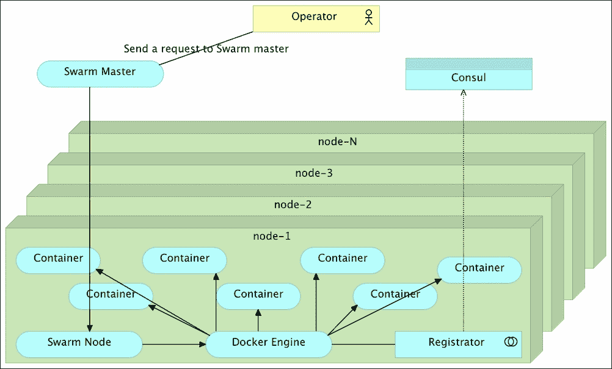

含基本服务发现的 Swarm 集群

请注意，除了小型集群外，其他集群将会有多个 Swarm master 和 Consul 实例，从而防止在其中一个出现故障时丢失信息或造成停机。

在这种设置下，部署容器的过程如下：

+   操作员向`Swarm master`发送请求，部署一个由一个或多个容器组成的服务。此请求可以通过`Docker CLI`发送，并通过定义`DOCKER_HOST`环境变量，指定`Swarm master`的 IP 和端口。

+   根据请求中发送的标准（如 CPU、内存、亲和性等），`Swarm master`决定容器运行的位置，并向选定的`Swarm nodes`发送请求。

+   `Swarm node`在接收到运行（或停止）容器的请求时，会调用本地的*Docker Engine*，后者运行（或停止）所需的容器，并将结果作为事件发布。

+   *Registrator*监控*Docker Engine*，并在检测到新事件时将信息发送到*Consul*。

+   任何对集群内运行的容器数据感兴趣的人都可以查询*Consul*。

虽然与我们过去操作集群的方式相比，这个过程是一次巨大的改进，但它仍然远远不完整，并且会产生一些应该解决的问题。

## 问题

在本章中，我将重点介绍之前描述的设置中缺失的三个主要问题，或者更准确地说，缺失的功能。

### 无停机部署

当拉取新版本时，运行 `docker-compose up` 会停止运行旧版本的容器，并用新版本替换它们。这个方法的问题在于停机时间。在停止旧版本和运行新版本之间，会有停机时间。无论是毫秒级别还是整整一分钟，新的容器都需要启动，并且其中的服务需要初始化。

我们可以通过设置带有健康检查的代理来解决这个问题。然而，这仍然需要运行多个服务实例（因为你绝对应该这么做）。过程是停止一个实例，并将新版本部署到其位置。在该实例的停机期间，代理会将请求重定向到其他实例中的一个。然后，当第一个实例运行新版本并且其中的服务初始化完成后，我们会继续对其他实例重复这一过程。这个过程可能会变得非常复杂，并且会阻止你使用 Docker Compose 的 `scale` 命令。

更好的解决方案是使用 *蓝绿* 部署过程来部署新版本。如果你不熟悉它，请阅读第十三章，*蓝绿* *部署*。简而言之，过程是将新版本与旧版本并行部署。在整个过程中，代理应该继续将所有请求发送到旧版本。一旦部署完成并且容器内的服务初始化完成，代理应重新配置以将所有请求发送到新版本，而旧版本可以停止。通过这种方式，我们可以避免停机。问题是 Swarm 不支持 *蓝绿* 部署。

### 使用相对数字扩展容器

*Docker Compose* 使得将服务扩展到固定数量变得非常容易。我们可以指定要运行多少个容器实例，并观察魔法的展开。当与 Docker Swarm 结合使用时，结果是管理集群中容器的简单方法。根据当前正在运行的实例数量，Docker Compose 会增加（或减少）运行中的容器数量，以便实现预期结果。

问题在于 Docker Compose 总是期望参数是一个固定的数字。当处理生产环境部署时，这会非常有限制。在许多情况下，我们并不希望知道已经运行了多少实例，而是希望通过某种因素发出信号来增加（或减少）容量。例如，我们可能会遇到流量增加的情况，并希望将容量增加三个实例。类似地，如果某个服务的需求下降，我们可能希望减少运行的实例数量，并以此释放资源供其他服务和进程使用。当我们朝着自主和自动化的第十三章、*自愈系统*迈进时，这种需求更加明显，人工干预降到最低。

除了缺乏相对扩展外，*Docker Compose* 还不知道如何在部署新容器时保持相同数量的运行实例。

### 新版本测试后的代理重新配置

一旦我们采用微服务架构，代理的动态重新配置需求便变得显而易见。容器让我们能够将它们打包为不可变的实体，而 Swarm 使我们能够将它们部署到集群中。通过容器和像 Swarm 这样的集群编排工具实现不可变性，极大地推动了微服务的兴趣和采用，同时也增加了部署的频率。与强制我们不频繁部署的单体应用不同，现在我们可以更频繁地部署。即使你不采用持续部署（每次提交都会发布到生产环境），你也可能开始更频繁地部署你的微服务。可能是每周一次，每天一次，甚至一天多次。无论频率如何，每次发布新版本时，都需要重新配置代理。Swarm 会将容器部署到集群中的某个地方，代理需要重新配置以将请求重定向到所有新版本的实例。这种重新配置需要是动态的。这意味着必须有一个进程从服务注册表中获取信息，改变代理的配置，并最终重新加载它。

解决这个问题有几种常用的方法。

由于显而易见的原因，手动代理重新配置应该被摒弃。频繁的部署意味着操作员没有时间手动更改配置。即使时间不是关键，手动重新配置也会将“人为因素”引入到过程中，而我们都知道人类会犯错。

有许多工具可以监控 Docker 事件或注册表中的条目，并在新容器启动或旧容器停止时重新配置代理。这些工具的问题在于，它们没有给我们足够的时间来测试新版本。如果出现 bug 或功能尚未完全完成，用户将受到影响。代理的重新配置应该仅在一系列测试运行并验证新版本之后进行。

我们可以在部署脚本中使用 `Consul Template` 或 `ConfD` 等工具。它们都非常好用，效果也不错，但在完全融入部署过程中之前，需要做很多配置工作。

### 解决问题

Docker Flow 是解决我们讨论过的问题的项目。它的目标是提供当前 Docker 生态系统中尚不可用的功能。它并不取代生态系统中的任何功能，而是建立在其基础之上。

## Docker Flow 使用指南

接下来的示例将使用 Vagrant 来模拟 Docker Swarm 集群。这并不意味着 Docker Flow 的使用仅限于 Vagrant。你可以在任何其他方式设置的单个 Docker 引擎或 Swarm 集群中使用它。

关于基于 Docker Machine 的类似示例（在 Linux 和 OS X 上测试过），请阅读项目（[`github.com/vfarcic/docker-flow`](https://github.com/vfarcic/docker-flow)）。

### 设置过程

在开始示例之前，请确保已安装 Vagrant。你不需要其他任何东西，因为我们即将运行的 Ansible playbooks 会确保所有工具都已正确配置。

请从 `vfarcic/docker-flow` 仓库克隆代码：

```
git clone https://github.com/vfarcic/docker-flow.git

cd docker-flow
```

下载代码后，我们可以运行 Vagrant 并创建本章中将使用的集群：

```
vagrant plugin install vagrant-cachier

vagrant up master node-1 node-2 proxy
```

一旦虚拟机（VM）创建并配置完成，设置过程将与本章中*标准设置*部分所述相同。`master` 服务器将包含 `Swarm master`，而节点 `1` 和 `2` 将组成集群。每个节点将有指向 `proxy` 服务器中运行的 `Consul` 实例的 `Registrator`：

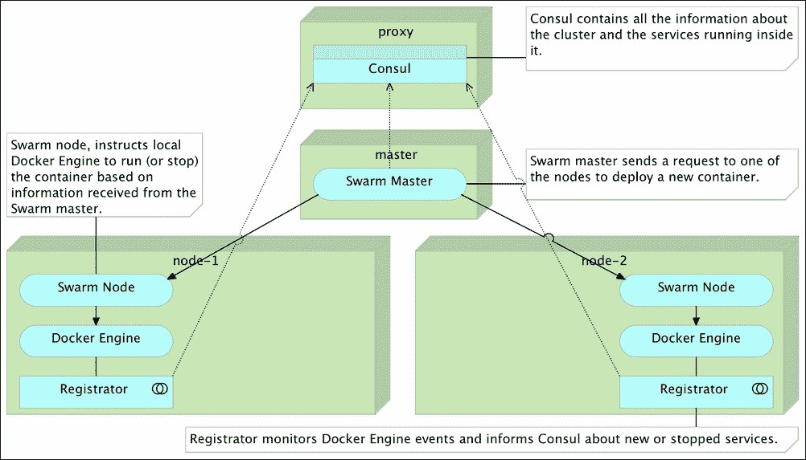

通过 Vagrant 设置 Swarm 集群

请注意，这个设置仅用于演示目的。虽然在生产环境中应应用相同的原则，但你应该确保有多个 Swarm 主节点和 Consul 实例，以避免其中一个失败时可能带来的停机时间。

一旦 `vagrant up` 命令完成，我们可以进入 `proxy` 虚拟机，看到*Docker Flow*的实际运行：

```
vagrant ssh proxy
```

我们将从 `proxy` 机器运行所有示例。然而，在生产环境中，你应该从一台单独的机器（甚至是你的笔记本电脑）运行部署命令。

最新版本的 *docker-flow* 二进制文件已下载并准备好使用，且 `/books-ms` 目录包含了我们将在接下来的示例中使用的 `docker-compose.yml` 文件。

让我们进入目录：

```
cd /books-ms
```

### 部署后重新配置 Proxy

Docker Flow 需要 Consul 实例的地址以及代理正在（或将要）运行的节点信息。它提供了三种方式来提供必要的信息。我们可以在`docker-flow.yml`文件中定义参数、作为环境变量，或作为命令行参数。在这个示例中，我们将使用这三种输入方法，这样你可以熟悉它们并选择适合你需求的组合。

让我们从通过环境变量定义代理和 Consul 数据开始：

```
export FLOW_PROXY_HOST=proxy

export FLOW_CONSUL_ADDRESS=http://10.100.198.200:8500

export FLOW_PROXY_DOCKER_HOST=tcp://proxy:2375

export DOCKER_HOST=tcp://master:2375

export BOOKS_MS_VERSION=":latest"
```

`FLOW_PROXY_HOST`变量是代理运行所在主机的 IP，而`FLOW_CONSUL_ADDRESS`代表 Consul API 的完整地址。`FLOW_PROXY_DOCKER_HOST`是 Docker 引擎的主机，运行在代理容器（或将要运行的代理容器）所在的服务器上。最后一个变量（`DOCKER_HOST`）是`Swarm master`的地址。Docker Flow 旨在同时在多个服务器上执行操作，因此我们需要提供所有它所需的信息，以便它能够完成任务。在我们正在探索的示例中，它将部署容器到 Swarm 集群，使用 Consul 实例来存储和检索信息，并在每次部署新服务时重新配置代理。最后，我们将环境变量`BOOKS_MS_VERSION`设置为*latest*。`docker-compose.yml`使用它来确定我们要运行的版本。

现在我们准备部署我们示例服务的第一个版本：

```
docker-flow \
 --blue-green \
 --target=app \
 --service-path="/api/v1/books" \
 --side-target=db \
 --flow=deploy --flow=proxy
```

我们指示`docker-flow`使用*蓝绿部署*流程，并且目标（在`docker-compose.yml`中定义）是`app`。我们还告诉它该服务在`/api/v1/books`地址上公开 API，并且它需要一个副目标`db`。最后，通过`--flow`参数，我们指定希望它*部署*目标并重新配置`proxy`。在那个单一的命令中发生了很多事情，所以我们将更详细地探讨结果。

让我们看看我们的服务器，看看发生了什么。我们从 Swarm 集群开始：

```
docker ps --format "table {{.Names}}\t{{.Image}}"
```

`ps`命令的输出如下：

```
NAMES                                IMAGE
node-2/dockerflow_app-blue_1   vfarcic/books-ms
node-1/books-ms-db             mongo
...
```

Docker Flow 将我们的主要目标`app`与名为 books-ms-db 的副目标一起运行。两个目标都在`docker-compose.yml`中定义。容器的名称取决于许多不同的因素，其中一些因素是 Docker Compose 项目（默认使用当前目录，如`app`目标的情况）或可以通过`docker-compose.yml`中的`container_name`参数来指定（如`db`目标）。你会注意到的第一个区别是*Docker Flow*在容器名称中添加了*blue*。其背后的原因是`--blue-green`参数。如果存在，`Docker Flow`将使用*blue-green*流程来运行主要目标。由于这是第一次部署，*Docker Flow*决定它将被称为*blue*。如果你不熟悉这个过程，请阅读第十三章，以了解有关*蓝绿部署*的一般信息。

让我们也看一下 `proxy` 节点：

```
export DOCKER_HOST=tcp://proxy:2375

docker ps --format "table {{.Names}}\t{{.Image}}"
```

`ps` 命令的输出如下：

```
NAMES               IMAGE
docker-flow-proxy   vfarcic/docker-flow-proxy
consul              progrium/consul
```

Docker Flow 检测到该节点上没有 `proxy`，并为我们运行了它。`docker-flow-proxy` 容器包含了 *HAProxy*，以及每次运行新服务时重新配置它的自定义代码。有关 *Docker Flow: Proxy* 的更多信息，请阅读该项目（[`github.com/vfarcic/docker-flow-proxy`](https://github.com/vfarcic/docker-flow-proxy)）。

由于我们指示 Swarm 在集群中的某个地方部署该服务，我们无法预先知道将选择哪个服务器。在这个特定的案例中，我们的服务最终运行在了 `node-2` 上。此外，为了避免潜在的冲突并允许更容易的扩展，我们没有指定服务应该暴露哪个端口。换句话说，服务的 IP 和端口在部署前没有定义。除此之外，*Docker Flow* 通过运行 `Docker Flow: Proxy` 并指示它在容器运行后使用收集到的信息重新配置自己来解决这个问题。我们可以通过向新部署的服务发送 HTTP 请求来确认代理的重新配置是否成功：

```
curl -I proxy/api/v1/books
```

`curl` 命令的输出如下：

```
HTTP/1.1 200 OK
Server: spray-can/1.3.1
Date: Thu, 07 Apr 2016 19:23:34 GMT
Access-Control-Allow-Origin: *
Content-Type: application/json; charset=UTF-8
Content-Length: 2
```

事件流如下：

1.  Docker Flow 检查了 Consul，以确定接下来应该部署哪个版本（蓝色或绿色）。由于这是第一次部署且没有版本在运行，因此决定将其部署为蓝色版本。

1.  Docker Flow 向 Swarm Master 发送了部署蓝色发布的请求，Swarm Master 决定在 node-2 上运行容器。Registrator 检测到了 Docker 引擎创建的新事件，并在 Consul 中注册了服务信息。同样，部署侧目标数据库的请求也被发送。

1.  Docker Flow 从 Consul 获取了服务信息。

1.  Docker Flow 检查了应该托管代理的服务器，发现该服务器没有运行，然后进行了部署。

1.  Docker Flow 更新了 HAProxy，并加入了服务信息。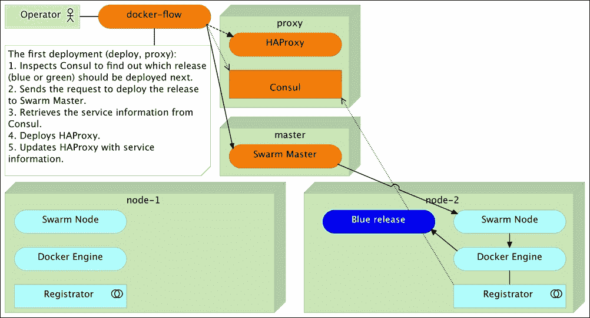

    通过 Docker Flow 的第一次部署

尽管我们的服务运行在 Swarm 选择的服务器之一，并且暴露了一个随机端口，代理已经重新配置，我们的用户可以通过固定的 IP 访问它，而且不需要端口（更精确地说，通过标准的 HTTP 端口 `80` 或 HTTPS 端口 `443`）。

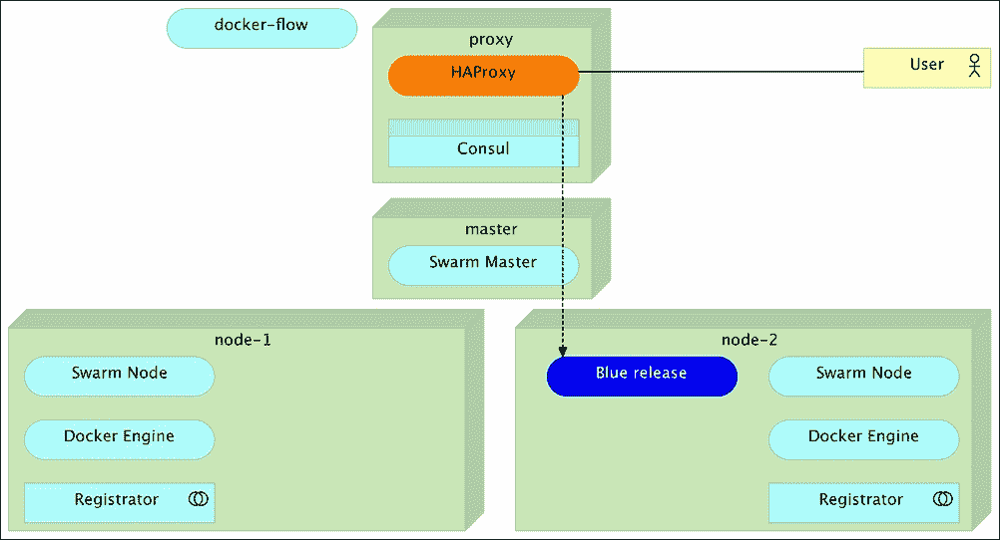

用户可以通过代理访问服务。

让我们看看当第二个版本被部署时会发生什么。

## 无停机时间的发布新版本

一段时间后，开发者将推送新的提交，我们将希望部署服务的新版本。为了避免停机，我们将继续使用 *蓝绿* 部署流程。由于当前版本是 *蓝色*，新的版本将命名为 *绿色*。通过使新版本（*绿色*）与旧版本（*蓝色*）并行运行，在新版本完全启动后，我们会重新配置代理，将所有请求发送到新版本。只有在代理重新配置完成后，我们才希望停止旧版本的运行并释放其占用的资源。我们可以通过运行相同的 `docker-flow` 命令来完成所有这些操作。不过，这次我们将利用已经包含一些之前使用过的参数的 `docker-flow.yml` 文件。

`docker-flow.yml` 的内容如下：

```
target: app
side_targets:
 - db
blue_green: true
service_path:
 - /api/v1/books
```

让我们运行新版本：

```
export DOCKER_HOST=tcp://master:2375

docker-flow \
 --flow=deploy --flow=proxy --flow=stop-old
```

就像之前一样，让我们探索 Docker 进程并查看结果：

```
docker ps -a --format "table {{.Names}}\t{{.Image}}\t{{.Status}}"
```

`ps`命令的输出如下：

```
NAMES                        IMAGE                    STATUS
node-1/booksms_app-green_1   vfarcic/books-ms         Up 33 seconds
node-2/booksms_app-blue_1    vfarcic/books-ms         Exited (137) 22 seconds ago
node-1/books-ms-db           mongo                    Up 41 minutes
...
```

从输出中，我们可以看到新版本（*绿色*）正在运行，旧版本（*蓝色*）已停止。旧版本之所以仅被停止而不是完全移除，是因为在稍后发现问题时可能需要快速回滚。

让我们确认代理是否也已经重新配置：

```
curl -I proxy/api/v1/books
```

`curl`命令的输出如下：

```
HTTP/1.1 200 OK
Server: spray-can/1.3.1
Date: Thu, 07 Apr 2016 19:45:07 GMT
Access-Control-Allow-Origin: *
Content-Type: application/json; charset=UTF-8
Content-Length: 2
```

事件的流程如下：

1.  Docker Flow 检查了 Consul，以找出应该部署下一个版本（蓝色或绿色）。由于之前的版本是蓝色，它决定将其作为绿色版本进行部署。

1.  Docker Flow 向 Swarm Master 发送请求部署绿色版本，Swarm Master 决定在 node-1 上运行该容器。Registrator 检测到 Docker Engine 创建的新事件，并将服务信息注册到 Consul 中。

1.  Docker Flow 从 Consul 获取了服务信息。

1.  Docker Flow 更新了 HAProxy 的服务信息。

1.  Docker Flow 停止了旧版本。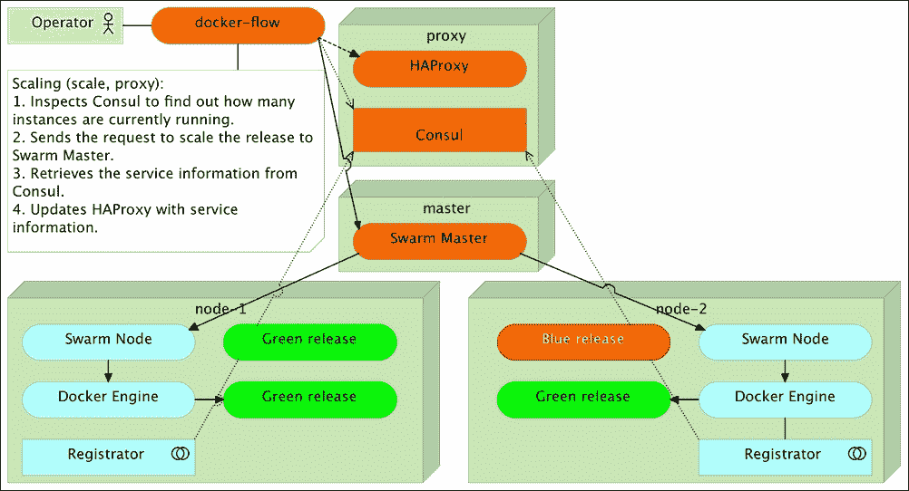

    通过 Docker Flow 进行的第二次部署

在流程的前三个步骤中，HAProxy 继续将所有请求发送到旧版本。因此，用户并未察觉到部署正在进行：

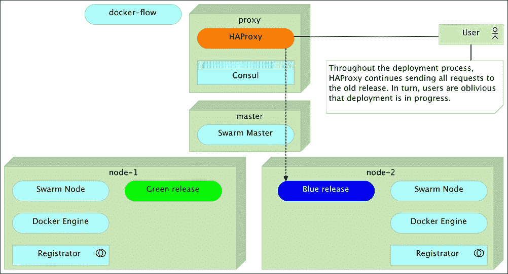

在部署过程中，用户继续与旧版本进行交互

只有在部署完成后，HAProxy 才被重新配置，用户才被重定向到新版本。因此，部署没有造成停机：

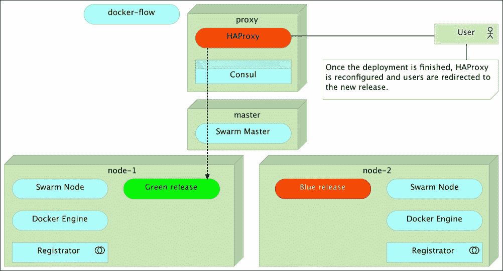

部署完成后，用户被重定向到新版本

现在我们有了一种安全的方式来部署新版本，让我们将注意力转向相对扩展。

### 扩展服务

*Docker Compose* 提供的一个巨大优势是可扩展性。我们可以使用它来扩展到任意数量的实例。然而，它只支持绝对扩展。我们无法指示 *Docker Compose* 执行相对扩展。这使得某些过程的自动化变得困难。例如，可能会有流量增加的情况，要求我们将实例数量增加两个。在这种情况下，自动化脚本需要获取当前运行的实例数量，进行简单的数学计算以得到所需的数量，并将结果传递给 Docker Compose。除此之外，代理仍然需要重新配置。*Docker Flow* 使这个过程变得更加容易。

让我们看看它是如何运作的：

```
docker-flow \
 --scale="+2" \
 --flow=scale --flow=proxy
```

通过列出当前运行的 Docker 进程，可以观察到扩展结果：

```
docker ps --format "table {{.Names}}\t{{.Image}}\t{{.Status}}"
```

`ps` 命令的输出如下：

```
NAMES                        IMAGE                     STATUS
node-2/booksms_app-green_2   vfarcic/books-ms:latest   Up 5 seconds
node-1/booksms_app-green_3   vfarcic/books-ms:latest   Up 6 seconds
node-1/booksms_app-green_1   vfarcic/books-ms:latest   Up 40 minutes
node-1/books-ms-db           mongo                     Up 53 minutes
```

实例数量增加了两个。在之前只有一个实例运行的情况下，现在我们有三个实例。

同样，代理也进行了重新配置，从现在开始，它将在这三个实例之间进行负载均衡所有请求。

事件的流程如下：

1.  Docker Flow 检查了 Consul，找出了当前正在运行的实例数量。

1.  由于只有一个实例在运行，并且我们指定要将该数量增加两个，Docker Flow 向 Swarm Master 发送请求，将绿色发布扩展到三个实例，Swarm Master 决定在 node-1 上运行一个容器，在 node-2 上运行另一个容器。Registrator 检测到 Docker Engine 创建的新事件，并将两个新实例注册到 Consul 中。

1.  Docker Flow 从 Consul 中获取了服务信息。

1.  Docker Flow 更新了 HAProxy 的服务信息，并将其配置为在三个实例之间执行负载均衡。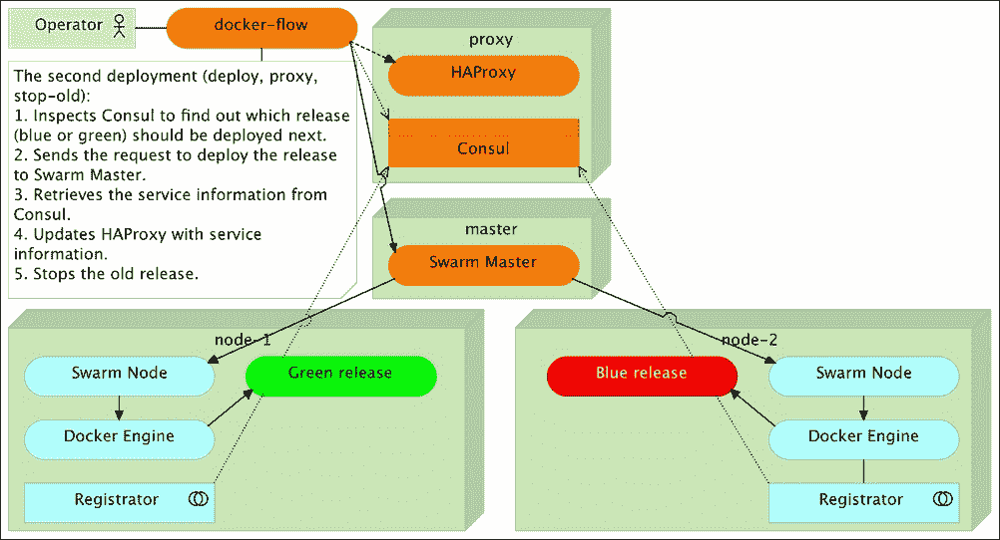

    通过 Docker Flow 实现相对扩展

从用户的角度来看，他们继续从当前版本接收响应，但这一次，他们的请求在所有服务实例之间进行负载均衡。因此，服务性能得到了提升：

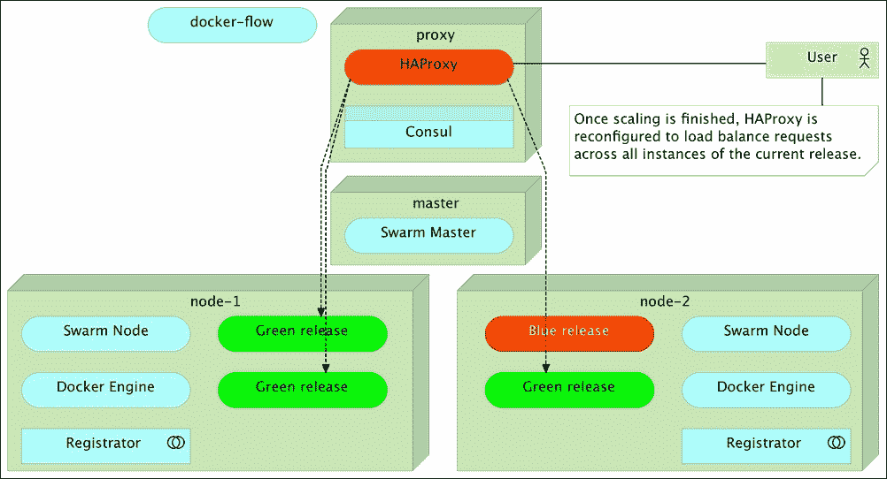

用户请求在所有服务实例之间进行负载均衡。

我们可以使用相同的方法，通过在`--scale`参数值前加上减号（`-`）来减少实例数量。按照相同的例子，当流量恢复正常时，我们可以通过运行以下命令将实例数量恢复到原来的数量：

```
docker-flow \
 --scale="-1" \

--flow=scale --flow=proxy
```

### 测试生产环境部署

到目前为止，我们运行的代理示例的主要缺点是无法在重新配置代理之前验证发布版本。理想情况下，我们应该使用 *blue-green* 过程，将新版本与旧版本并行部署，运行一系列验证一切正常的测试，最后只有在所有测试成功的情况下才重新配置代理。我们可以通过运行 `docker-flow` 两次轻松实现这一目标。

许多工具旨在提供零停机时间的部署，但只有少数工具（如果有的话）考虑到在重新配置代理之前应该运行一系列测试。

首先，我们应该部署新版本：

```
docker-flow \
 --flow=deploy
```

列出 Docker 进程：

```
docker ps --format "table {{.Names}}\t{{.Status}}\t{{.Ports}}"
```

`ps`命令的输出如下：

```
node-1/booksms_app-blue_2    Up 8 minutes        10.100.192.201:32773->8080/tcp
node-2/booksms_app-blue_1    Up 8 minutes        10.100.192.202:32771->8080/tcp
node-2/booksms_app-green_2   Up About an hour    10.100.192.202:32770->8080/tcp
node-1/booksms_app-green_1   Up 2 hours          10.100.192.201:32771->8080/tcp
node-1/books-ms-db           Up 2 hours          27017/tcp
```

此时，新版本（*蓝色*）与旧版本（*绿色*）并行运行。由于我们没有指定*--flow=proxy*参数，代理保持不变，仍然将请求重定向到旧版本的所有实例。这意味着我们的服务用户仍然看到旧版本，而我们则有机会进行测试。我们可以进行集成测试、功能测试或任何其他类型的测试，并验证新版本确实符合我们的预期。虽然在生产环境中进行测试并不排除在其他环境（例如预发布环境）中进行测试，但这种方法通过能够在用户将使用相同环境下验证软件，从而给予我们更高的信任，同时，在此过程中不影响用户（他们仍然不知道新版本的存在）。

### 注意

请注意，尽管我们没有指定应部署的实例数量，*Docker Flow*仍然部署了新版本并将其扩展到与之前相同的实例数量。

事件的流程如下：

1.  Docker Flow 检查 Consul 以查找当前版本的颜色以及当前正在运行的实例数量。

1.  由于旧版本（*绿色*）有两个实例在运行，并且我们没有指定要更改该数量，Docker Flow 向*Swarm Master*发送请求，部署新版本（*蓝色*）并将其扩展到两个实例。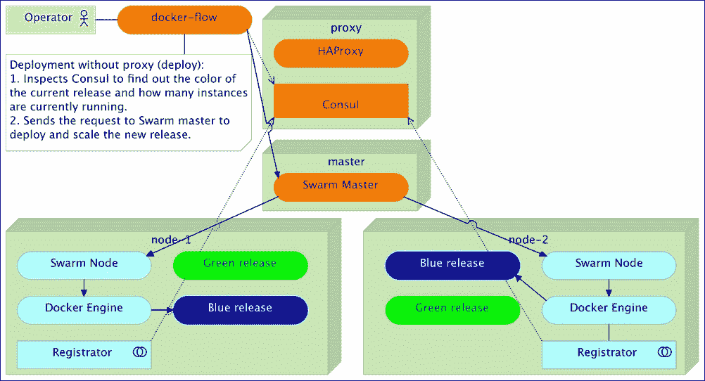

    无需重新配置代理的部署

从用户的角度来看，由于我们没有指定要重新配置代理，他们继续收到旧版本的响应：

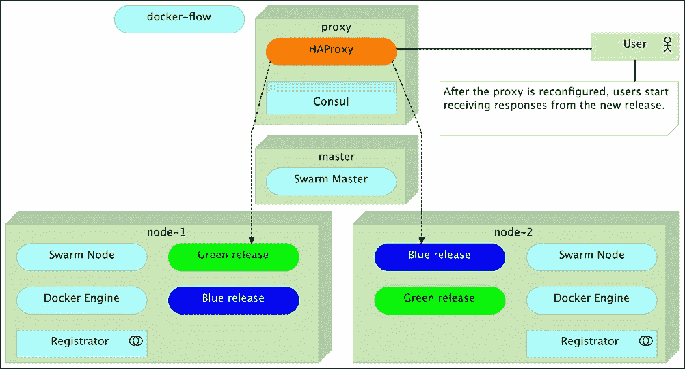

用户请求仍然被重定向到旧版本

从这一刻起，你可以在生产环境中对新版本进行测试。假设你没有过度负载服务器（例如压力测试），测试可以在任何时间段内运行而不影响用户。

测试执行完成后，我们有两条路径可选择。如果某个测试失败，我们可以停止新版本并修复问题。由于代理仍然将所有请求重定向到旧版本，用户不会受到影响，我们可以专注于解决问题。另一方面，如果所有测试都成功，我们可以运行剩余的`flow`，重新配置代理并停止旧版本：

```
docker-flow \
 --flow=proxy --flow=stop-old
```

该命令重新配置了代理并停止了旧版本。

事件的流程如下：

1.  Docker Flow 检查 Consul 以查找当前版本的颜色以及正在运行的实例数量。

1.  Docker Flow 更新了代理服务的信息。

1.  Docker Flow 停止了旧版本。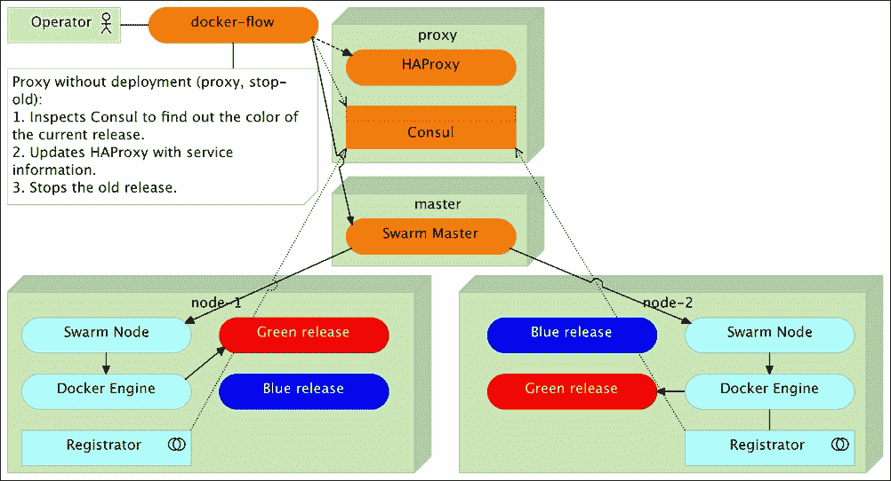

    代理重新配置而无需部署。

从用户的角度来看，所有新的请求都被重定向到了新版本：

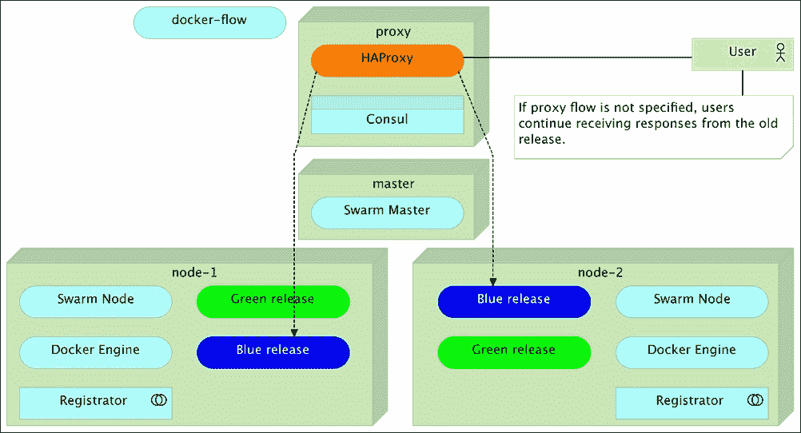

用户请求被重定向到了新版本。

这就是对*Docker Flow*一些功能进行快速浏览的结尾。请查看*使用*部分以获取更多详细信息。
