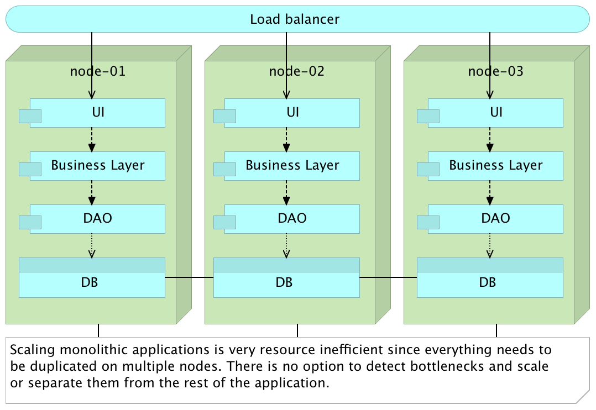
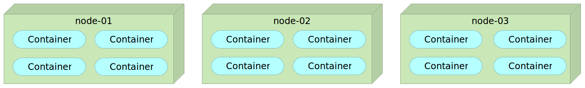
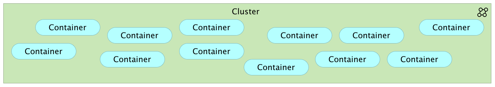
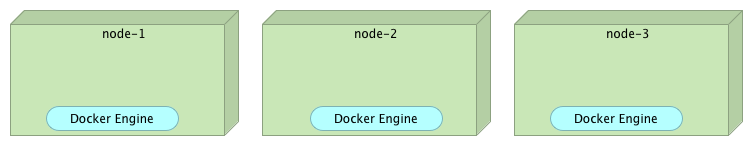
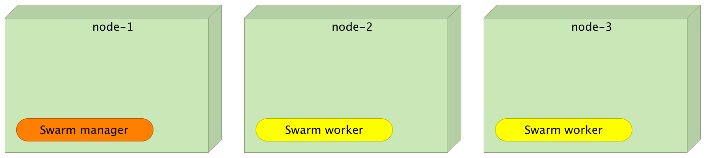
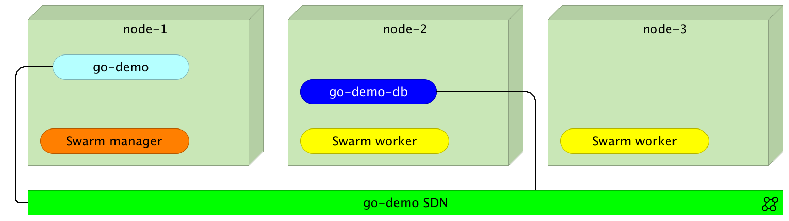
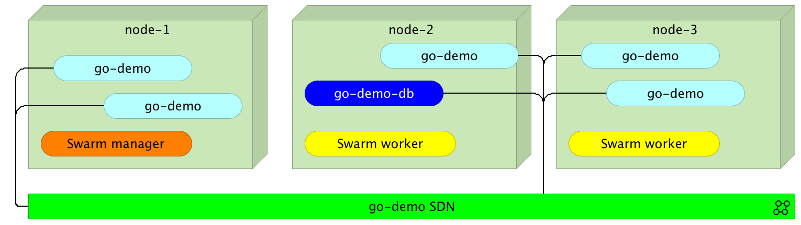
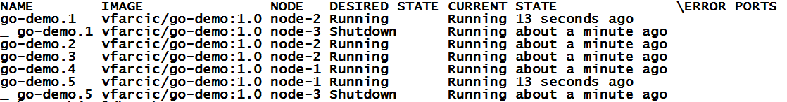

# 第二章：设置和操作 Swarm 集群

*设计系统的组织……受到这些组织的通信结构的限制，只能生产这些组织通信结构的复制品。*

–M. Conway*

许多人会告诉你他们拥有一个*可扩展的系统*。毕竟，扩展很简单。买一台服务器，安装 WebLogic（或者你使用的其他大型应用服务器），然后部署应用程序。接着等上几周，直到你发现一切都变得如此*快速*，以至于你可以点击一个按钮，喝杯咖啡，等你回到桌前，结果已经在那里等着你。你会怎么做？你扩展。你再买几台服务器，安装你那些庞大的应用服务器，然后在它们上面部署你的庞大应用程序。系统的瓶颈在哪个部分？没人知道。为什么要重复所有的东西？因为你不得不这么做。然后时间过去了，你继续扩展，直到钱花光了，同时，你的员工也都快疯了。今天我们不再像那样进行扩展。今天我们明白，扩展涉及到很多其他的事情。它关乎弹性，关乎根据流量的变化和业务的增长，能够快速、轻松地进行扩展和收缩，而且在这个过程中不至于破产。它关乎几乎每家公司都需要扩展他们的业务，而不会认为 IT 部门是一项负担。它关乎摆脱那些庞然大物。

**《DevOps 2.0 工具集》读者须知**

以下内容与*《DevOps 2.0 工具集》*中发布的文本完全相同。如果这部分内容你已经记得很清楚，可以直接跳到本章的*Docker Swarm 模式*部分。你会发现很多东西已经发生了变化。其中之一就是，旧版的 Swarm 作为独立容器运行的方式已经被废弃，取而代之的是*Swarm 模式*。在接下来的过程中，我们还会发现许多其他新内容。

# 可扩展性

让我们稍微退后一步，讨论一下为什么我们要扩展应用程序。主要原因是*高可用性*。为什么我们需要高可用性？因为我们希望我们的业务在任何负载下都能保持可用。负载越大越好（除非你遭遇了 DDoS 攻击）。这意味着我们的业务在蓬勃发展。拥有高可用性，我们的用户会很满意。我们都希望速度快，而且很多人如果网站加载太慢就会直接离开。我们希望避免宕机，因为每一分钟我们的业务无法运行都可能导致经济损失。如果一家在线商店无法访问，你会怎么做？大概会去另一个商店吧。也许不是第一次，也许不是第二次，但迟早你会受够了，换个商店。我们已经习惯了一切都很快速且响应迅速，而且有那么多替代选择，以至于我们在尝试其他东西之前不会多想。如果那个“其他”东西更好呢？一个人的损失可能是另一个人的收益。我们是否能通过扩展性解决所有问题？远远不够。还有许多其他因素决定了我们应用程序的可用性。然而，扩展性是其中的重要部分，而它恰好是本章的主题。

什么是扩展性？它是系统的一种属性，表示系统优雅地处理增加负载的能力，或在需求增加时扩展的潜力。它是接受增加的流量或工作负载的能力。

事实上，我们设计应用程序的方式决定了可用的扩展选项。如果应用程序没有设计为可扩展，它们将无法很好地扩展。这并不是说没有为扩展设计的应用程序就不能扩展。一切都可以扩展，但并不是所有的扩展都能做得好。

常见的场景如下。

我们从一个简单的架构开始，有时有负载均衡器，有时没有，设置几个应用服务器和一个数据库。一切都很好，复杂性较低，我们可以非常快速地开发新功能。运营成本低，收入高（考虑到我们刚刚起步），大家都很高兴并充满动力。

业务在增长，流量在增加。问题开始出现，性能下降。防火墙被添加，额外的负载均衡器被设置，数据库被扩展，增加了更多的应用服务器，等等。事情仍然相对简单。我们面临着新的挑战，但可以及时克服障碍。尽管复杂性在增加，但我们仍然能够相对轻松地处理它。换句话说，我们正在做的事情基本上还是一样的，只是规模变大了。业务做得很好，但仍然相对较小。

然后它发生了。你一直在等待的大事。也许某个营销活动得到了很好的反响。也许你的竞争对手发生了不利的变化。也许那个最后推出的功能确实非常关键。不管原因是什么，业务得到了大幅提升。在经历了这段由变化带来的短暂幸福之后，你的痛苦增加了十倍。增加更多的数据库似乎不够。扩展应用服务器似乎也不能满足需求。你开始加入缓存等等。你开始有一种感觉，每次你扩展某样东西时，收益并没有成比例地增加。成本在增加，但你仍然无法满足需求。数据库复制太慢。新的应用服务器已不再带来那么大的差异。运营成本的增长速度超出了你的预期。这个局面正在伤害业务和团队。你开始意识到，你曾经为之自豪的架构无法应对这种负载增长。你无法将它拆分。你无法扩展最痛苦的部分。你无法从头开始。你能做的只是继续扩展，但每次扩展的收益都在递减。

上述情况是相当常见的。一开始有效的方案，在需求增加时不一定还是对的。我们需要平衡**你不需要的东西（YAGNI）**原则和长期愿景。我们不能一开始就用针对大公司的系统来优化，因为它成本过高，并且在业务小的时候无法带来足够的收益。另一方面，我们也不能忽视任何业务的首要目标之一。从第一天起，我们就不能不考虑扩展性。设计可扩展的架构并不意味着我们必须从一开始就部署百台服务器的集群。也不意味着我们要从一开始就开发庞大复杂的系统。它的意思是，我们应该从小做起，但要确保当系统变大时，能够轻松扩展。虽然微服务并不是唯一能够实现这一目标的方式，但它们的确是一个很好的解决方案。成本不在于开发，而是在于运营。如果运营是自动化的，这个成本可以很快被吸收，并且不需要大量的投资。正如你已经看到的（并将在本书的其余部分继续看到），我们有许多优秀的开源工具可以使用。自动化的最大好处是，投资的维护成本往往低于手动操作时的成本。

我们已经讨论了微服务以及在小规模上的自动化部署。现在是时候将这种小规模转变为更大的规模了。在我们跳入实际部分之前，让我们探索一下人们可以采用哪些不同的方式来扩展。

我们常常受到设计的限制，选择应用程序的构建方式严重限制了我们的选择。尽管有许多不同的扩展方式，最常见的一种叫做*轴扩展*。

# 轴扩展

轴扩展最好的表示方式是通过立方体的三个维度：*X 轴*、*Y 轴*和*Z 轴*。每个维度描述了一种扩展类型：

+   X 轴：水平复制

+   Y 轴：功能分解

+   Z 轴：数据分区


图 2-1：扩展立方体

让我们逐一了解这些轴。

# X 轴扩展

简而言之，*x 轴*扩展是通过运行多个应用实例或服务实例来实现的。在大多数情况下，会有一个负载均衡器在上面，确保流量均匀分配到所有实例上。*x 轴*扩展的最大优点是简便性。我们只需要将相同的应用部署到多个服务器上。因此，这是最常用的扩展方式。然而，当应用是单体应用时，这种扩展方式也有一系列缺点。

拥有一个大型应用通常需要一个大缓存，这就要求大量使用内存。当这样的应用被复制时，一切都会被复制，包括缓存。另一个，通常更重要的问题是资源的不当使用。性能问题几乎从不与整个应用相关。并不是所有模块都受到同等影响，但我们却将它们全部复制。这意味着，尽管我们可以通过仅扩展需要的部分应用来获得更好的效果，但我们却扩展了整个应用。尽管如此，*x 轴*扩展在任何架构中都是重要的。主要的区别在于这种扩展的影响。



图 2-2：在集群中扩展的单体应用

通过使用微服务，我们并不是去除对*x 轴*扩展的需求，而是确保由于它们的架构，使得这种扩展比传统架构方法更有效。在微服务架构中，我们有更多的选择来微调扩展。我们可以为承受重负载的服务部署多个实例，而对于使用较少或需要较少资源的服务则只部署少数实例。除此之外，由于微服务体积小，我们可能永远不会达到某个服务的限制。在大服务器上运行一个小服务，只有当流量达到极高的水平时，才会需要扩展。微服务的扩展更多地与容错能力相关，而非性能问题。我们希望有多个副本在运行，这样当某个副本宕机时，其他副本可以接管，直到恢复完成。

# Y 轴扩展

Y 轴扩展完全是关于将应用程序分解成更小的服务。尽管有多种方法可以完成这种分解，但微服务可能是我们可以采取的最佳方法。当它们与不可变性和自给自足结合时，确实没有比这更好的替代方案（至少从 Y 轴扩展的角度来看）。与 X 轴扩展不同，Y 轴扩展不是通过运行多个相同应用程序的实例来实现的，而是通过将多个不同的服务分布到集群中。

# Z 轴扩展

Z 轴扩展很少应用于应用程序或服务。它的主要和最常见的用途是在数据库中。此类扩展背后的理念是将数据分布到多个服务器上，从而减少每个服务器需要执行的工作量。数据被分区并分配，使得每个服务器只需要处理数据的一个子集。这种分离通常被称为**分片**，并且有许多数据库专门为此目的而设计。Z 轴扩展的好处在于 I/O、缓存和内存利用率上最为明显。

# 集群

服务器集群由一组连接的服务器组成，这些服务器共同工作，可以看作是一个单一系统。它们通常通过高速**局域网**(**LAN**)连接。集群与服务器组的显著区别在于，集群作为一个单一系统，旨在提供高可用性、负载均衡和并行处理。

如果我们将应用程序或服务部署到单独管理的服务器上，并将它们视为独立单元，那么资源的利用率将处于次优状态。我们无法预先知道哪些服务组应该部署到某台服务器上，并将资源利用到最大。此外，资源使用往往会波动。比如，早上某些服务可能需要大量内存，而下午它们的使用量可能会降低。预定义的服务器限制了我们在最优方式下平衡资源使用的灵活性。即便不需要如此高的动态性，预定义的服务器也往往在出现问题时造成麻烦，导致需要人工干预，将受影响的服务重新部署到健康的节点上：



图 2-3：部署到预定义服务器上的容器集群

实现真正的集群是当我们不再只关注单独的服务器，而是开始将所有服务器视为一个大实体。要更好地理解这一点，我们可以稍微从更低的层次来解释。当我们部署应用时，我们通常会指定它可能需要多少内存或 CPU。然而，我们并不会决定应用使用哪个内存插槽或应使用哪些 CPU。例如，我们不会指定某个应用必须使用 CPU 4、5 和 7。这既低效又可能带来风险。我们只会决定需要三个 CPU。我们应该在更高层次上采用同样的方法。我们不应关心某个应用或服务将部署到哪里，而应关心它需要什么。我们应该能够定义该服务的某些需求，并告诉某个工具将它部署到集群中的任何服务器，只要它满足我们的需求。实现这一目标的最佳（如果不是唯一的）方法是将整个集群视为一个实体。

我们可以通过添加或移除服务器来增加或减少集群的容量，但无论做什么，它仍然应该是一个单一的实体。我们定义策略，然后让我们的服务在集群的某个地方部署。那些使用云服务提供商，如**Amazon Web Services**（**AWS**）、Microsoft Azure 和**Google Compute Engine**（**GCE**）的人，已经习惯了这种方法，尽管他们可能并没有意识到这一点。

在本章的其余部分，我们将探索创建集群的方法，并探讨可以帮助我们实现这一目标的工具。我们将在本地模拟集群，但这并不意味着相同的策略无法应用于公共或私有云和数据中心。恰恰相反：



图 2-4：基于预定义策略将容器部署到服务器的集群

# Docker Swarm 模式

*Docker Engine v1.12* 于 2016 年 7 月发布。它是自*v1.9*以来最重要的版本。那时，我们获得了 Docker 网络功能，最终使得容器可以在集群中使用。通过*v1.12*，Docker 以全新的方式重新定义了集群编排。告别依赖外部数据注册表的 Swarm 容器，迎接*全新的 Docker Swarm*或*Swarm 模式*。现在，你管理集群所需的一切都已集成进 Docker Engine。Swarm 已经在其中。服务发现已经在其中。改进的网络功能也已在其中。这并不意味着我们不需要额外的工具。我们确实需要。不过，主要的区别在于，Docker Engine 现在集成了我们所需的所有“基本”工具（甚至可以说是最小化的工具）。

旧版 Swarm（在*Docker v1.12*之前）采用了*一发即忘原则*。我们会向 Swarm 主节点发送命令，它就会执行该命令。例如，如果我们发送类似`docker-compose scale go-demo=5`的命令，旧版 Swarm 会评估当前集群的状态，发现例如只有一个实例在运行，然后决定应该再启动四个实例。一旦做出这个决定，旧版 Swarm 就会向 Docker Engines 发送命令。结果，我们会在集群中运行五个容器。为了让这一切正常工作，我们需要在组成集群的所有节点上设置 Swarm 代理（作为独立容器），并将它们接入到其中一个支持的数据注册中心（如 Consul、etcd 或 Zookeeper）。

问题在于，Swarm 执行我们发送的命令，但它并没有维持所需的状态。我们实际上是在告诉它我们希望发生什么（例如：扩容），而不是我们期望的状态（确保有五个实例在运行）。后来，旧版 Swarm 获得了从故障节点重新调度容器的功能。然而，该功能存在一些问题，导致它不能成为一个可靠的解决方案（例如：故障容器没有从覆盖网络中移除）。

现在我们有了全新的 Swarm。它是 Docker Engine 的一部分（无需将其作为独立容器运行），并且集成了服务发现功能（无需设置 Consul 或任何你选择的数据注册中心），它从底层开始设计，能够接受并维持所需的状态，等等。这是我们处理集群编排方式的真正重大变化。

过去，我倾向于使用旧版 Swarm 而非 Kubernetes。然而，这种倾向只是稍微的。两者各有优缺点。Kubernetes 有一些 Swarm 所缺少的功能（例如：所需状态的概念），而旧版 Swarm 则因其简洁性和低资源使用而脱颖而出。随着新版本 Swarm（即*v1.12*版本）的推出，我再也没有疑问该使用哪个了。*新版 Swarm 往往比 Kubernetes 更优选择*。它是 Docker Engine 的一部分，因此整个设置只需一个命令来指示引擎加入集群。新的网络功能也表现得非常出色。可以用 Docker Compose 文件创建的捆绑包来定义服务，因此无需维护两套配置（开发时使用 Docker Compose，编排时使用另一套配置）。最重要的是，新版 Docker Swarm 继续保持简便易用。从一开始，Docker 社区就承诺致力于简洁性，而通过这个发布，他们再次证明了这一点。

这还不是全部。新版本还带来了许多与 Swarm 直接无关的其他功能。然而，本书专注于集群管理。因此，我将专注于 Swarm，将其他内容留待下本书或博客文章中讨论。

因为我认为代码比文字更能解释问题，我们将从展示 *1.12 版本* 中的一些新特性开始。

# 设置 Swarm 集群

我们将继续使用 Docker Machine，因为它提供了一种非常方便的方式在笔记本上模拟集群。三个服务器应该足够展示 Swarm 集群的一些关键特性：

本章中的所有命令都可以在 `02-docker-swarm.sh` 文件中找到 ([`gist.github.com/vfarcic/750fc4117bad9d8619004081af171896`](https://gist.github.com/vfarcic/750fc4117bad9d8619004081af171896)) Gist

```
for i in 1 2 3; do
    docker-machine create -d virtualbox node-$i
done

```

此时，我们有三台节点。请注意，这些服务器除了 Docker 引擎外没有运行任何其他服务。

我们可以通过执行以下 `ls` 命令来查看节点的状态：

```
docker-machine ls

```

输出如下（错误列已去除以简化内容）：

```
NAME   ACTIVE DRIVER        STATE  URL                       SWARM DOCKER
node-1 -      virtualbox    Running tcp://192.168.99.100:2376 v1.12.1
node-2 -      virtualbox    Running tcp://192.168.99.101:2376 v1.12.1
node-3 -      virtualbox    Running tcp://192.168.99.102:2376 v1.12.1

```



图 2-5：运行 Docker 引擎的机器

在机器启动并运行后，我们可以继续设置 Swarm 集群。

集群设置包含两种类型的命令。我们需要先初始化第一个节点，这将是我们的管理节点。请参考以下插图：

```
eval $(docker-machine env node-1)

docker swarm init \
    --advertise-addr $(docker-machine ip node-1)

```

第一个命令设置了环境变量，使得本地的 Docker 引擎指向 `node-1`。第二个命令在该机器上初始化了 Swarm。

我们只在 `swarm init` 命令中指定了一个参数。`--advertise-addr` 是该节点将向其他节点公开的地址，用于内部通信。

`swarm init` 命令的输出如下：

```
Swarm initialized: current node (1o5k7hvcply6g2excjiqqf4ed) is now a manager.

To add a worker to this swarm, run the following command:
    docker swarm join \
--token SWMTKN-1-3czblm3rypyvrz6wyijsuwtmk1ozd7giqip0m \
6k0b3hllycgmv-3851i2gays638e7unmp2ng3az \
192.168.99.100:2377

To add a manager to this swarm, run the following command:
    docker swarm join \
--token SWMTKN-1-3czblm3rypyvrz6wyijsuwtmk1ozd7giqi \
p0m6k0b3hllycgmv-6oukeshmw7a295vudzmo9mv6i \
192.168.99.100:2377

```

我们可以看到该节点现在是管理节点，并且我们得到了可以用来将其他节点加入集群的命令。为了提高安全性，只有包含在初始化 Swarm 时生成的令牌的新节点才能加入集群。该令牌是在执行 `docker swarm init` 命令时作为输出结果打印出来的。您可以从输出中复制并粘贴代码，或者使用 `join-token` 命令。我们将使用后者。

目前，我们的 Swarm 集群仅由一个虚拟机组成。我们将把另外两个节点添加到集群中。但是，在此之前，让我们讨论一下 *manager* 和 *worker* 之间的区别。

Swarm 管理器持续监控集群的状态，并使实际状态与您设定的期望状态保持一致。例如，如果您设置了一个服务来运行十个容器副本，而托管其中两个副本的工作节点崩溃了，管理器将创建两个新的副本来替代失败的副本。Swarm 管理器将新副本分配给正在运行并可用的工作节点。管理节点具有所有工作节点的功能。

我们可以通过执行 `swarm join-token` 命令来获取添加额外节点到集群所需的令牌。

获取添加管理节点令牌的命令如下：

```
docker swarm join-token -q manager

```

类似地，要获取添加工作节点的令牌，我们将执行以下命令：

```
docker swarm join-token -q worker

```

在这两种情况下，我们都会得到一个长的哈希字符串。

工作节点令牌的输出如下：

```
SWMTKN-1-3czblm3rypyvrz6wyijsuwtmk1ozd7giqip0m6k0b3hll \          ycgmv-3851i2gays638\
e7unmp2ng3az

```

请注意，此令牌是在我的机器上生成的，您的令牌将会有所不同。

将令牌放入环境变量中，并将另外两个节点添加为工作节点：

```
TOKEN=$(docker swarm join-token -q worker)

```

现在令牌已存储在变量中，我们可以执行以下命令：

```
for i in 2 3; do
eval $(docker-machine env node-$i)

  docker swarm join \
    --token $TOKEN \
    --advertise-addr $(docker-machine ip node-$i) \
    $(docker-machine ip node-1):2377
done

```

我们刚刚运行的命令会遍历节点二和节点三并执行 `swarm join` 命令。我们设置了令牌、广告地址和管理节点的地址。结果，这两台机器作为工作节点加入了集群。我们可以通过向管理节点 `node-1` 发送 `node ls` 命令来确认这一点：

```
eval $(docker-machine env node-1)

docker node ls

```

`node ls` 命令的输出如下：

```
ID                           HOSTNAME  STATUS  AVAILABILITY  MANAGER STATUS
3vlq7dsa8g2sqkp6vl911nha8    node-3    Ready   Active
6cbtgzk19rne5mzwkwugiolox    node-2    Ready   Active
b644vkvs6007rpjre2bfb8cro *  node-1    Ready   Active        Leader

```

星号告诉我们当前使用的是哪个节点。`MANAGER STATUS` 显示 `node-1` 是*领导者*：



图 2-6：包含三个节点的 Docker Swarm 集群

在生产环境中，我们可能会设置多个节点为管理节点，从而避免其中一个节点故障时导致部署停机。为了演示的目的，设置一个管理节点应该足够。

# 将服务部署到 Swarm 集群

在我们部署示例服务之前，我们应创建一个新网络，以便所有构成该服务的容器无论部署在哪个节点上，都能相互通信：

```
docker network create --driver overlay go-demo

```

下一章将更详细地探讨网络。现在，我们只讨论并完成在 Swarm 集群内高效部署服务所需的最低限度内容。

我们可以通过以下命令检查所有网络的状态：

```
docker network ls

```

`network ls` 命令的输出如下：

```
NETWORK ID   NAME            DRIVER  SCOPE
e263fb34287a bridge          bridge  local
c5b60cff0f83 docker_gwbridge bridge  local
8d3gs95h5c5q go-demo         overlay swarm
4d0719f20d24 host            host    local
eafx9zd0czuu ingress         overlay swarm
81d392ce8717 none            null    local

```

如您所见，我们有两个 `swarm` 范围的网络。一个名为 `ingress`，是我们设置集群时默认创建的。第二个 `go-demo` 是通过 `network create` 命令创建的。我们将把所有构成 `go-demo` 服务的容器分配到该网络。

下一章将深入探讨 Swarm 网络。现在，重要的是要理解所有属于同一网络的服务可以自由地相互通信。

*go-demo* 应用程序需要两个容器。数据将存储在 MongoDB 中。使用该 `DB` 的后端定义为 `vfarcic/go-demo` 容器。

我们首先在集群中的某个地方部署 `mongo` 容器。

通常，我们会使用约束条件来指定容器的要求（例如：硬盘类型、内存和 CPU 的数量等）。目前我们跳过这些，直接告诉 Swarm 在集群中的任何地方部署它：

```
docker service create --name go-demo-db \
  --network go-demo \
  mongo:3.2.10

```

请注意，我们没有指定 `Mongo` 所监听的端口 `27017`。这意味着该数据库将不会对除属于同一 `go-demo` 网络的其他服务外的任何人可访问。

如您所见，我们使用 `service create` 的方式与您可能已经熟悉的 Docker `run` 命令类似。

我们可以列出所有正在运行的服务：

```
docker service ls

```

根据`service create`和`service ls`命令之间经过的时间，你会看到`REPLICAS`列的值是零或一。服务创建后，值应该是`*0/1*`，意味着没有副本在运行，而目标是运行一个副本。一旦拉取了`mongo`镜像并且容器启动，值应该会变为`*1/1*`。

`service ls`命令的最终输出应该如下所示（为了简洁，已移除 ID）：

```
NAME        MODE        REPLICAS  IMAGE
go-demo-db  replicated  1/1       mongo:3.2.10

```

如果我们需要更多关于`go-demo-db`服务的信息，我们可以运行`service inspect`命令：

```
docker service inspect go-demo-db

```

现在数据库已经运行，我们可以部署`go-demo`容器：

```
docker service create --name go-demo \
  -e DB=go-demo-db \
  --network go-demo \
  vfarcic/go-demo:1.0

```

这个命令没有什么新鲜的内容。服务将会连接到`go-demo`网络。环境变量`DB`是`go-demo`服务的内部要求，告知代码数据库的地址。

到此为止，我们已经在集群中运行了两个容器（`mongo`和`go-demo`），并通过`go-demo`网络相互通信。请注意，它们目前*还*无法从网络外部访问。此时，用户无法访问服务 API。我们稍后会更详细地讨论这个问题。在此之前，我只给你一个提示：*你需要一个反向代理*，它能够利用新的 Swarm 网络功能。

我们再运行一次`service ls`命令：

```
docker service ls

```

结果是，在`go-demo`服务被拉取到目标节点后，应该如下所示（为了简洁，已移除 ID）：

```
NAME       MODE       REPLICAS IMAGE
go-demo    replicated 1/1      vfarcic/go-demo:1.0
go-demo-db replicated 1/1      mongo:3.2.10

```

如你所见，两个服务都以单个副本的形式运行：



图 2-8：Docker Swarm 集群中的容器通过 go-demo SDN 通信

如果我们想要扩展其中一个容器会发生什么？我们如何扩展我们的服务？

# 扩展服务

我们应该始终运行至少两个实例的服务。这样，它们可以共享负载，而且如果其中一个服务失败，就不会出现停机。我们很快会探讨 Swarm 的故障切换功能，并将负载均衡留到下一章。

比如说，我们可以告诉 Swarm，我们希望运行五个`go-demo`服务的副本：

```
docker service scale go-demo=5

```

使用`service scale`命令，我们安排了五个副本。Swarm 会确保在集群的某个地方运行五个`go-demo`实例。

我们可以通过已熟悉的`service ls`命令确认，确实有五个副本在运行：

```
docker service ls

```

输出如下（为了简洁，已移除 ID）：

```
NAME       MODE       REPLICAS IMAGE
go-demo    replicated 5/5      vfarcic/go-demo:1.0
go-demo-db replicated 1/1      mongo:3.2.10

```

如我们所见，五个`go-demo`服务的副本中有五个在运行。

`service ps`命令提供关于单个服务的更详细信息：

```
docker service ps go-demo

```

输出如下（为了简洁，已移除 ID 和 ERROR PORT 列）：

```
NAME      IMAGE               NODE   DESIRED STATE CURRENT STATE            
go-demo.1 vfarcic/go-demo:1.0 node-3 Running       Running 1 minute ago
go-demo.2 vfarcic/go-demo:1.0 node-2 Running       Running 51 seconds ago
go-demo.3 vfarcic/go-demo:1.0 node-2 Running       Running 51 seconds ago
go-demo.4 vfarcic/go-demo:1.0 node-1 Running       Running 53 seconds ago
go-demo.5 vfarcic/go-demo:1.0 node-3 Running       Running 1 minute ago

```

我们可以看到，`go-demo` 服务正在运行五个实例，这些实例分布在三个节点上。由于它们都属于同一个 **go-demo SDN**，无论它们在集群中运行在哪个位置，都可以相互通信。同时，它们都无法从外部访问：



图 2-9：Docker Swarm 集群，其中 go-demo 服务已扩展至五个副本

如果其中一个容器停止运行，或者整个节点出现故障，会发生什么呢？毕竟，进程和节点迟早会发生故障。没有什么是完美的，我们需要为这种情况做好准备。

# 容错

幸运的是，容错策略是 Docker Swarm 的一部分。记住，当我们执行 `service` 命令时，我们并不是在告诉 Swarm 应该做什么，而是在告诉它我们希望的状态。反过来，Swarm 将尽力保持指定的状态，不管发生什么。

为了测试故障场景，我们将销毁其中一个节点：

```
docker-machine rm -f node-3

```

Swarm 需要一些时间才能检测到节点已宕机。一旦它检测到，便会重新调度容器。我们可以通过 `service ps` 命令来监控情况：

```
docker service ps go-demo

```

输出（在重新调度后）如下所示（`ID` 被省略以简化展示）：



如你所见，经过短暂的时间，Swarm 在健康节点（`node-1` 和 `node-2`）之间重新调度了容器，并将那些在故障节点上运行的容器状态更改为 `Shutdown`。如果你的输出仍显示某些实例在 `node-3` 上运行，请稍等片刻并重新执行 `service ps` 命令。

# 现在怎么办？

这就结束了我们对 Docker v1.12+ 新 Swarm 特性基本概念的探索。

这就是运行一个 Swarm 集群所需了解的一切吗？远远不够！到目前为止，我们探讨的只是一个开始。还有很多问题等待解答。我们如何将服务暴露给公众？我们如何在没有停机时间的情况下部署新版本？我将在接下来的章节中尝试回答这些问题，以及其他一些问题。下一章将专门探讨我们如何将服务暴露给公众。我们将尝试将代理与 Swarm 集群集成。为此，我们需要深入了解 Swarm 网络。

现在是休息的时间，在进入下一章之前。像之前一样，我们将销毁所创建的机器并重新开始：

```
docker-machine rm -f node-1 node-2

```
