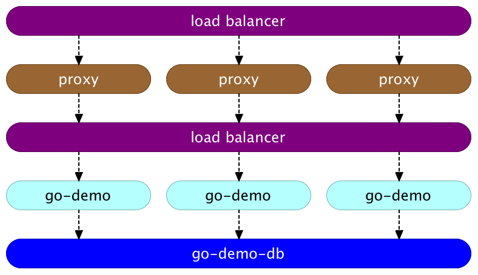
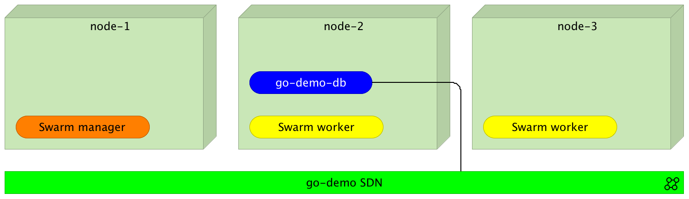
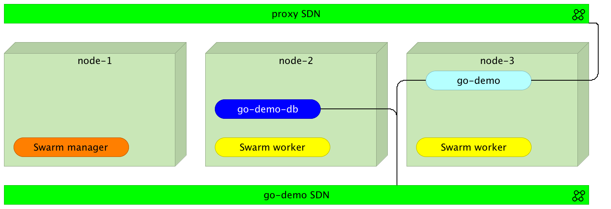
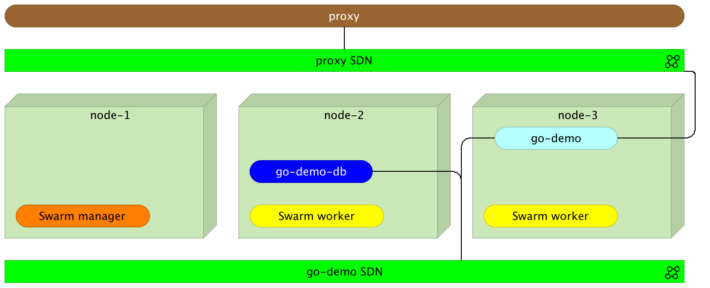
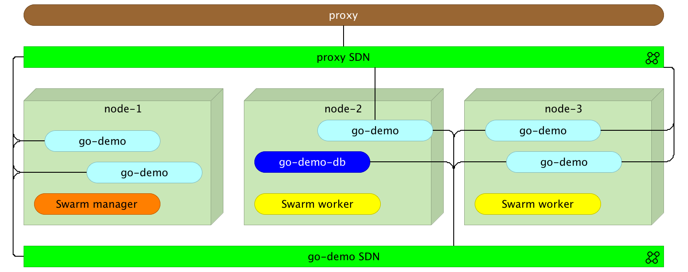

# 第三章：Docker Swarm 网络和反向代理

大多数人购买家庭计算机的最有力理由将是将其连接到全国范围的通信网络。我们正处于这一真正的突破性进展的初期阶段——对于大多数人来说，它将像电话一样令人震惊。

–史蒂夫·乔布斯

**软件定义网络**（**SDN**）是高效集群管理的基石。没有它，分布在集群中的服务将无法找到彼此。

基于静态配置的代理并不适合高度动态调度的世界。服务会被创建、更新、在集群中移动、扩展和缩减，等等。在这种环境中，信息时刻在变化。

我们可以采用的一种方法是使用代理作为中央通信点，让所有服务通过它进行通信。这样的设置将要求我们持续监控集群中的变化，并相应地更新代理。为了简化我们的工作，监控进程可能会使用其中一个服务注册中心来存储信息，并使用一个模板解决方案，每当注册中心检测到变化时，更新代理配置。正如你可以想象的那样，构建这样的系统一点也不简单。

幸运的是，Swarm 提供了全新的网络功能。简而言之，我们可以创建网络并将它们附加到服务上。所有属于同一网络的服务可以仅通过服务名称互相通信。更进一步，如果我们扩展某个服务，Swarm 网络将执行轮询负载均衡，并将请求分配到所有实例。当这一切仍然不够时，我们有一个新的网络，名为`ingress`，其包含`routing mesh`，具备所有这些功能及一些额外特性。

高效使用 Swarm 网络本身并不足够。我们仍然需要一个反向代理，作为外部世界与我们的服务之间的桥梁。除非有特殊要求，否则代理不需要执行负载均衡（Swarm 网络已经为我们完成这项工作）。然而，代理确实需要评估请求路径并将请求转发到目标服务。即使是这种情况，Swarm 网络仍然提供了很大的帮助。只要我们理解网络是如何工作的，并能够充分利用其潜力，配置反向代理变得相对容易。

让我们来实践一下网络功能。

# 设置集群

我们将创建一个与上一章相似的环境。我们将有三台节点，它们将形成一个 Swarm 集群。

本章中的所有命令都可以在`03-networking.sh` ([`gist.github.com/vfarcic/fd7d7e04e1133fc3c90084c4c1a919fe`](https://gist.github.com/vfarcic/fd7d7e04e1133fc3c90084c4c1a919fe)) Gist 中找到。

到这个时候，你已经知道如何设置集群了，所以我们跳过解释，直接开始：

```
for i in 1 2 3; do
  docker-machine create -d virtualbox node-$i
done

eval $(docker-machine env node-1)

docker swarm init \
  --advertise-addr $(docker-machine ip node-1)

TOKEN=$(docker swarm join-token -q worker)

for i in 2 3; do
eval $(docker-machine env node-$i)

  docker swarm join \
    --token $TOKEN \
    --advertise-addr $(docker-machine ip node-$i) \
    $(docker-machine ip node-1):2377
done

eval $(docker-machine env node-1)

docker node ls

```

上一个命令`node ls`的输出如下（为了简洁，已去除 ID）：

```
HOSTNAME  STATUS  AVAILABILITY  MANAGER STATUS
node-2    Ready   Active
node-1    Ready   Active        Leader
node-3    Ready   Active

```

如你所见，我们有一个由三个节点组成的集群，其中`node-1`是唯一的管理节点（因此也是领导节点）。

现在我们有了一个完全运行的集群，可以探索 Docker 网络与 Swarm 结合所提供的好处。我们在上一章中已经使用过 Swarm 网络。现在是时候深入了解我们已经看到的内容，并解锁一些新的功能和用例了。

# 高可用性下运行的安全且容错的服务需求

让我们快速浏览一下*go-demo*应用程序的内部结构。它由两个服务组成。数据存储在 MongoDB 中。数据库由名为`go-demo`的后端服务使用。其他服务不应直接访问数据库。如果其他服务需要数据，它应该向`go-demo`服务发送请求。这样，我们就有了明确的边界。数据由`go-demo`服务拥有和管理。它暴露了一个 API，作为访问数据的唯一入口。

系统应该能够托管多个应用程序。每个应用程序将有一个唯一的基础 URL。例如，`go-demo`路径以`/demo`开头。其他应用程序将有不同的路径（例如：`/users`，`/products`，等等）。系统将只能通过`80`端口（HTTP）和`443`端口（HTTPS）进行访问。请注意，不能有两个进程监听相同的端口。换句话说，只能配置一个服务来监听端口`80`。

为了应对负载波动并有效利用资源，我们必须能够单独且独立地扩展（或缩减）每个服务。任何对服务的请求都应该通过负载均衡器，负载均衡器将把负载分配到所有实例上。至少，任何服务在任意时刻都应该运行至少两个实例。这样，即使其中一个实例停止工作，我们也能确保高可用性。我们的目标应该更高，确保即使整个节点发生故障，系统整体也不会受到影响。

为了满足性能和故障转移需求，服务应分布在集群中。

我们将对每个服务应该运行多个实例的规则做出一个临时例外。Mongo 卷在 OS X 和 Windows 上与 Docker Machine 不兼容。稍后，当我们进入关于如何在主要托管提供商（例如 AWS）内部进行生产环境设置的章节时，我们将取消这一例外，并确保数据库也配置为支持多个实例运行。

综合考虑所有这些，我们可以提出以下要求：

1.  **负载均衡器**将均匀地分配请求（*轮询方式*）到任何给定服务的所有实例上（**代理**包括在内）。它应该是容错的，并且不依赖于任何单一节点。

1.  一个反向代理将负责根据请求的基础 URL 路由请求。

1.  **go-demo**服务将能够与**go-demo-db**服务自由通信，并且只能通过反向代理访问。

1.  数据库将与任何不属于它的服务隔离，仅与**go-demo**服务进行通信。

我们所尝试实现的逻辑架构可以通过接下来的图表展示：



图 3-1：go-demo 服务的逻辑架构

我们如何实现这些要求？

让我们逐一解决这四个要求。我们将从底部开始，逐步向上解决。

第一个要解决的问题是如何让数据库与它所属的服务以外的任何服务隔离运行。

# 在隔离中运行数据库

我们可以通过不暴露其端口来隔离数据库服务。这可以通过`service create`命令轻松实现：

```
docker service create --name go-demo-db \
  mongo:3.2.10

```

我们可以通过检查服务来确认端口确实没有暴露：

```
docker service inspect --pretty go-demo-db

```

输出如下：

```
ID:            rcedo70r2f1njpm0eyb3nwf8w
Name:          go-demo-db
Service Mode:  Replicated
 Replicas:     1
Placement:
UpdateConfig:
 Parallelism:  1
 On failure:   pause
 Max failure ratio: 0
ContainerSpec:
 Image:      mongo:3.2.10@sha256:532a19da83ee0e4e2a2ec6bc4212fc4af\
26357c040675d5c2629a4e4c4563cef
Resources:
Endpoint Mode: vip

```

如你所见，未提及任何端口。我们的`go-demo-db`服务是完全隔离的，任何人都无法访问。然而，这种隔离性过强了。我们希望服务仅与它所属的`go-demo`服务隔离。我们可以通过使用 Docker Swarm 网络来实现这一点。

让我们删除我们创建的服务并从头开始：

```
docker service rm go-demo-db

```

这次，我们应该创建一个网络，并确保`go-demo-db`服务已附加到该网络：

```
docker network create --driver overlay go-demo

docker service create --name go-demo-db \
  --network go-demo \
  mongo:3.2.10

```

我们创建了一个名为`go-demo`的覆盖网络，并随后创建了`go-demo-db`服务。这次，我们使用了`--network`参数将服务附加到该网络。从此时起，所有附加到`go-demo`网络的服务将彼此可访问。

让我们检查一下服务，并确认它是否确实已附加到网络：

```
docker service inspect --pretty go-demo-db

```

`service inspect`命令的输出如下：

```
ID:            ktrxcgp3gtszsjvi7xg0hmd73
Name:          go-demo-db
Service Mode:  Replicated
 Replicas:     1
Placement:
UpdateConfig:
 Parallelism:  1
 On failure:   pause
 Max failure ratio: 0
ContainerSpec:
 Image:           mongo:3.2.10@sha256:532a19da83ee0e4e2a2ec6bc4212fc4af26357c040675d
5c2629a4e4c4563cef
Resources:
Networks:      go-demo
Endpoint Mode: vip

```

如你所见，这一次有一个`Networks`条目，值设置为我们之前创建的`go-demo`网络的 ID。

让我们确认网络是否真的起作用。为了证明这一点，我们将创建一个名为`util`的全局服务：

```
docker service create --name util \
    --network go-demo --mode global \
    alpine sleep 1000000000

```

与`go-demo-db`类似，`util`服务也附加了`go-demo`网络。

一个新参数是`--mode`。当设置为 global 时，服务将会在集群中的每个节点上运行。当我们需要设置跨越整个集群的基础设施服务时，这是一个非常有用的特性。

我们可以通过执行`service ps`命令来确认它是否在每个节点上运行：

```
docker service ps util

```

输出如下（为了简洁，已删除 IDs 和 ERROR PORTS 列）：

```
NAME    IMAGE         NODE   DESIRED STATE CURRENT STATE        
util... alpine:latest node-1 Running       Running 6 minutes ago
util... alpine:latest node-3 Running       Running 6 minutes ago
util... alpine:latest node-2 Running       Running 6 minutes ago

```

如你所见，`util`服务在所有三台节点上都在运行。

我们正在运行`alpine`镜像（一种微型 Linux 发行版）。我们将其置于长时间休眠状态。否则，由于没有进程在运行，服务将停止，Swarm 将重新启动它，它会再次停止，依此类推。

`util`服务的目的将是演示我们正在探索的一些概念。我们将进入该服务并确认网络是否确实起作用。

要进入`util`容器，我们需要找出在`node-1`（本地 Docker 所指向的节点）上运行的实例的 ID：

```
ID=$(docker ps -q --filter label=com.docker.swarm.service.name=util)

```

我们以安静模式列出了所有进程`ps`，以便只返回 ID**`-q`**，并将结果限制为服务名称 util：

```
--filter label=com.docker.swarm.service.name=util

```

结果被存储为环境变量 ID。

我们将安装一个名为*drill*的工具。它是一个旨在从 DNS 获取各种信息的工具，很快就会派上用场：

```
docker exec -it $ID apk add --update drill

```

*Alpine* Linux 使用名为`apk`的包管理工具，因此我们告诉它添加 drill。

现在我们可以检查网络是否真正起作用。由于`go-demo-db`和 util 服务都属于同一个网络，它们应该能够通过 DNS 名称相互通信。每当我们将一个服务连接到网络时，一个新的虚拟 IP 将被创建，并且 DNS 与服务名称匹配。

让我们按以下方式尝试：

```
docker exec -it $ID drill go-demo-db

```

我们进入了`util`服务的一个实例，并“钻取”了 DNS `go-demo-db`。输出如下：

```
;; ->>HEADER<<- opcode: QUERY, rcode: NOERROR, id: 5751
;; flags: qr rd ra ; QUERY: 1, ANSWER: 1, AUTHORITY: 0, ADDITIONAL: 0
;; QUESTION SECTION:
;; go-demo-db.  IN      A

;; ANSWER SECTION:
go-demo-db.     600     IN      A       10.0.0.2

;; AUTHORITY SECTION:

;; ADDITIONAL SECTION:

;; Query time: 0 msec
;; SERVER: 127.0.0.11
;; WHEN: Thu Sep  1 12:53:42 2016
;; MSG SIZE  rcvd: 54

```

响应代码是`NOERROR`，并且`ANSWER`是`1`，这意味着 DNS `go-demo-db`正确响应了。它是可以访问的。

我们还可以观察到`go-demo-db`的 DNS 与 IP `10.0.0.2`相关联。每个附加到网络的服务都会获得一个 IP。请注意，我说的是服务，而不是实例。这是一个巨大的区别，我们稍后会深入探讨。现在，重要的是要理解，所有属于同一网络的服务都可以通过服务名称访问：



图 3-2：附加到 go-demo 网络的 go-demo-db 服务

让我们向上推进，完成需求。

# 通过反向代理运行服务

我们希望`go-demo`服务能够与`go-demo-db`服务自由通信，并且只能通过反向代理访问。我们已经知道如何完成第一部分。我们要做的就是确保这两个服务都属于同一个`go-demo`网络。

我们如何完成与反向代理的集成？

我们可以从创建一个新网络开始，并将其附加到所有应通过反向代理访问的服务：

```
docker network create --driver overlay proxy

```

让我们列出当前正在运行的`overlay`网络：

```
docker network ls -f "driver=overlay"

```

输出如下：

```
NETWORK ID   NAME    DRIVER  SCOPE
b17kzasd3gzu go-demo overlay swarm
0d7ssryojcyg ingress overlay swarm
9e4o7abyts0v proxy   overlay swarm

```

我们列出了之前创建的`go-demo`和`proxy`网络。第三个网络称为 ingress。它是默认设置的，具有特殊的用途，我们稍后会深入探讨。

现在我们准备运行`go-demo`服务。我们希望它能够与`go-demo-db`服务通信，因此它必须附加到`go-demo`网络。我们还希望它可以通过`proxy`访问（我们很快会创建它），因此我们也会将它附加到`proxy`网络。

创建`go-demo`服务的命令如下：

```
docker service create --name go-demo \
  -e DB=go-demo-db \
  --network go-demo \
  --network proxy \
  vfarcic/go-demo:1.0

```

这与我们在上一章执行的命令非常相似，只是在其中添加了`--network proxy`参数：



图 3-3：包含三个节点、两个网络和若干容器的 Docker Swarm 集群

现在两个服务都在集群中的某个地方运行，并且可以通过`go-demo`网络互相通信。让我们将代理添加进来。我们将使用*Docker Flow Proxy*（[https:/](https://github.com/vfarcic/docker-flow-proxy)[/github.com/vfarcic/docker-flow-proxy](https://github.com/vfarcic/docker-flow-proxy)）项目，它结合了 HAProxy（[`www.haproxy.org/`](http://www.haproxy.org/)）和一些额外的功能，使其更加动态。无论你选择哪个，本文所探讨的原则都是相同的。

请注意，目前，除非与同一网络连接的用户，否则其他任何人都无法访问这些服务。

# 创建一个反向代理服务，负责根据其基础 URL 路由请求。

我们可以通过几种方式实现反向代理。一种方法是基于 HAProxy（[`hub.docker.com/_/haproxy/`](https://hub.docker.com/_/haproxy/)）创建一个新镜像，并将配置文件包含其中。如果不同服务的数量相对静态，这种方法是可行的。否则，每当有新的服务（而不是新的版本）时，我们就需要创建一个新镜像，并带有新的配置。

第二种方法是暴露一个卷。这样，在需要时，我们可以修改配置文件，而不是构建一个全新的镜像。然而，这也有缺点。当部署到集群时，我们应该避免在不必要时使用卷。正如你很快会看到的，代理是其中之一，它不需要使用卷。顺便提一下，`--volume`已经被`docker service`参数`--mount`取代。

第三种选择是使用专为 Docker Swarm 设计的代理之一。在这种情况下，我们将使用容器`vfarcic/docker-flow-proxy`（[`hub.docker.com/r/vfarcic/docker-flow-proxy/`](https://hub.docker.com/r/vfarcic/docker-flow-proxy/)）。它基于 HAProxy，并增加了额外的功能，使我们能够通过发送 HTTP 请求来重新配置它。

让我们试试看。

创建`proxy`服务的命令如下：

```
docker service create --name proxy \
    -p 80:80 \
    -p 443:443 \ 
    -p 8080:8080 \ 
    --network proxy \ 
    -e MODE=swarm \
    vfarcic/docker-flow-proxy

```

我们开放了`80`和`443`端口，用于互联网流量（HTTP 和 HTTPS）。第三个端口是 8080。我们将使用它向代理发送配置请求。进一步地，我们指定它应该属于代理网络。这样，由于 go-demo 也连接到同一网络，代理可以通过 proxy-SDN 访问它。

通过我们刚刚运行的**代理**，我们可以观察到网络路由网格的一个酷炫特性。无论**代理**在哪台服务器上运行，都没关系。我们可以向任何节点发送请求，Docker 网络会确保将其重定向到其中一个代理。我们很快就会看到这一点。

最后的参数是环境变量`MODE`，它告诉`proxy`容器将部署到 Swarm 集群中。有关其他组合，请参阅项目的 README（[`github.com/vfarcic/docker-flow-proxy`](https://github.com/vfarcic/docker-flow-proxy)）。



图 3-4：带有代理服务的 Docker Swarm 集群

请注意，**proxy**虽然运行在某个节点内部，但它被放置在外部以更好地展示逻辑分离。

在继续之前，让我们确认`proxy`是否正在运行。

```
docker service ps proxy

```

如果`CURRENT STATE`是`Running`，我们可以继续。否则，请等到服务启动并运行。

现在`proxy`已部署，我们应该让它知道`go-demo`服务的存在：

```
curl "$(docker-machine ip node-1):8080/v1/docker-flow-\
proxy/reconfigure?serviceName=go-demo&servicePath=/demo&port=8080"

```

请求被发送以重新配置`proxy`，指定了服务名称`go-demo`，API 的基本 URL 路径`/demo`，以及服务的内部端口`8080`。从现在起，所有路径以`/demo`开头的请求将被重定向到`go-demo`服务。这个请求是 Docker Flow Proxy 在 HAProxy 基础上提供的额外功能之一。

请注意，我们将请求发送到了`node-1`。即使`proxy`可能在任何节点内部运行，请求仍然成功。这正是 Docker 的路由网格发挥重要作用的地方。我们稍后会更详细地探讨它。现在，重要的一点是，我们可以将请求发送到任何节点，它都会被重定向到监听同一端口的服务（在这个例子中是`8080`）。

请求的输出如下所示（已格式化以便于阅读）：

```
{
  "Mode": "swarm",
  "Status": "OK",
  "Message": "",
  "ServiceName": "go-demo",
  "AclName": "",
  "ConsulTemplateFePath": "",
  "ConsulTemplateBePath": "",
  "Distribute": false,
  "HttpsOnly": false,
  "HttpsPort": 0,
  "OutboundHostname": "",
  "PathType": "",
  "ReqMode": "http",
  "ReqRepReplace": "",
  "ReqRepSearch": "",
  "ReqPathReplace": "",
  "ReqPathSearch": "",
  "ServiceCert": "",
  "ServiceDomain": null,
  "SkipCheck": false,
  "TemplateBePath": "",
  "TemplateFePath": "",
  "TimeoutServer": "",
  "TimeoutTunnel": "",
  "Users": null,
  "ServiceColor": "",
  "ServicePort": "",
  "AclCondition": "",
  "FullServiceName": "",
  "Host": "",
  "LookupRetry": 0,
  "LookupRetryInterval": 0,
  "ServiceDest": [
    {
      "Port": "8080",
      "ServicePath": [
          "/demo"
      ],
      "SrcPort": 0,
      "SrcPortAcl": "",
      "SrcPortAclName": ""
    }
  ]
}

```

我不打算深入细节，但请注意，`Status`是`OK`，这表示`proxy`已正确重新配置。

我们可以通过发送 HTTP 请求来验证`proxy`是否如预期工作：

```
curl -i "$(docker-machine ip node-1)/demo/hello"

```

`curl`命令的输出如下：

```
HTTP/1.1 200 OK
Date: Thu, 01 Sep 2016 14:23:33 GMT
Content-Length: 14
Content-Type: text/plain; charset=utf-8

hello, world!

```

`proxy`工作正常！它响应了 HTTP 状态`200`，并返回了 API 响应`hello, world!`。和之前一样，请求不一定是发送到托管服务的节点，而是发送到了路由网格，再由它转发给`proxy`。

作为示例，我们将发送相同的请求，不过这次是发送到`node-3`：

```
curl -i "$(docker-machine ip node-3)/demo/hello"

```

结果仍然相同。

让我们来看看由`proxy`生成的配置。这将为我们提供有关 Docker Swarm 网络内部工作的更多见解。另一个好处是，如果你选择自己构建`proxy`解决方案，了解如何配置`proxy`并利用 Docker 新的网络功能可能会很有用。

我们将首先检查为我们创建的*Docker Flow Proxy*配置（[`github.com/vfa`](https://github.com/vfarcic/docker-flow-proxy)[rcic/docker-flow-proxy](https://github.com/vfarcic/docker-flow-proxy)）。我们可以通过进入运行中的容器，快速查看`/cfg/haproxy.cfg`文件来实现。问题是，找到由 Docker Swarm 运行的容器有些棘手。如果我们使用 Docker Compose 部署，容器名称是可以预测的。它会采用`<PROJECT>_<SERVICE>_<INDEX>`格式。

`docker service command`运行具有哈希名称的容器。我在笔记本上创建的`docker-flow-proxy`容器名为`proxy.1.e07jvhdb9e6s76mr9ol41u4sn`。因此，要进入由 Docker Swarm 部署的运行中容器，我们需要使用筛选器，例如使用镜像名称。

首先，我们需要找出`proxy`运行在哪个节点，执行以下命令：

```
NODE=$(docker service ps proxy | tail -n +2 | awk '{print $4}')

```

我们列出了`proxy`服务进程`docker service ps proxy`，去掉了标题`tail -n +2`，并输出了第四列中的节点`awk '{print $4}'`。输出结果被存储为环境变量`NODE`。

现在，我们可以将本地 Docker 引擎指向`proxy`所在的节点：

```
eval $(docker-machine env $NODE)

```

最后，只剩下找到`proxy`容器的 ID。我们可以通过以下命令来实现：

```
ID=$(docker ps -q \
    --filter label=com.docker.swarm.service.name=proxy)

```

现在我们已经将容器 ID 存储在变量中，我们可以执行命令来检索 HAProxy 配置：

```
docker exec -it \
$ID cat /cfg/haproxy.cfg

```

配置的重要部分如下：

```
frontend services
    bind *:80
    bind *:443
    mode http

    acl url_go-demo8080 path_beg /demo
    use_backend go-demo-be8080 if url_go-demo8080

backend go-demo-be8080
    mode http
    server go-demo go-demo:8080

```

第一部分`frontend`应该对使用过 HAProxy 的人来说很熟悉。它接受端口`80`的 HTTP 请求和端口`443`的 HTTPS 请求。如果路径以`/demo`开头，系统会将请求重定向到`backend go-demo-be`。在里面，请求会被发送到端口`8080`上的`go-demo`地址。这个地址和我们部署的服务名称相同。由于`go-demo`与`proxy`属于同一个网络，Docker 会确保请求被重定向到目标容器。很整洁，对吧？不再需要指定 IP 和外部端口了。

接下来的问题是如何进行负载均衡。我们应该如何指定`proxy`，例如，执行轮询遍历所有实例？我们应该使用`proxy`来完成这样的任务吗？

# 在所有实例间进行负载均衡请求

在我们探索负载均衡之前，需要有些东西来进行负载均衡。我们需要多个实例的服务。由于我们在上一章已经探讨过扩展，所以这个命令应该不会让你感到惊讶：

```
eval $(docker-machine env node-1)

docker service scale go-demo=5

```

几分钟后，五个`go-demo`服务的实例将会启动：



图 3-5：Docker Swarm 集群中的 go-demo 服务扩展

要使**proxy**在所有实例之间负载平衡请求，我们该做什么？答案是什么也不用做。我们不需要采取任何行动。实际上，这个问题本身是错的。**proxy**根本不会负载平衡请求。Docker Swarm 网络会。因此，让我们重新表述问题。要使*Docker Swarm 网络*在所有实例之间负载平衡请求，我们该做什么？同样地，答案是什么也不用做。我们不需要采取任何行动。

要理解负载平衡，我们可能需要回到以前讨论 Docker 网络出现之前的负载平衡。

通常，如果我们没有利用 Docker Swarm 的功能，我们可能会有类似以下的**proxy**配置模型：

```
backend go-demo-be
  server instance_1 <INSTANCE_1_IP>:<INSTANCE_1_PORT>
  server instance_2 <INSTANCE_2_IP>:<INSTANCE_2_PORT>
  server instance_3 <INSTANCE_3_IP>:<INSTANCE_3_PORT>
  server instance_4 <INSTANCE_4_IP>:<INSTANCE_4_PORT>
  server instance_5 <INSTANCE_5_IP>:<INSTANCE_5_PORT>

```

每次添加新实例时，我们需要将其添加到配置中。如果删除实例，我们需要从配置中删除它。如果实例失败了……嗯，你明白了。我们需要监控集群的状态，并在发生更改时更新`proxy`配置。

如果你读过《DevOps 2.0 工具包》，你可能还记得我建议使用*Registrator* ([`github.com/gliderlabs/registrator`](https://github.com/gliderlabs/registrator))、*Consul* ([`www`](https://www.consul.io/)[.consul.io/](https://www.consul.io/))和*Consul Template* ([`github.com/hashicorp/consul-template`](https://github.com/hashicorp/consul-template))的组合。Registrator 会监控 Docker 事件，并在创建或销毁容器时更新 Consul。通过 Consul 存储的信息，我们会使用 Consul Template 更新 nginx 或 HAProxy 配置。不再需要这样的组合了。虽然这些工具仍然有价值，但对于这个特定目的，不再需要它们。

每当集群内部发生变化时（例如，扩展事件），我们不会更新`proxy`；而是每次创建新服务时才会更新`proxy`。请注意，服务更新（发布新版本）不算作服务创建。我们创建一次服务，然后每次发布新版本时更新它（还有其他原因）。因此，只有新服务需要更改`proxy`配置。

背后的原因在于负载平衡现在是 Docker Swarm 网络的一部分。让我们从`util`服务再做一轮解析：

```
ID=$(docker ps -q --filter label=com.docker.swarm.service.name=util)

docker exec -it $ID apk add --update drill

docker exec -it $ID drill go-demo

```

前面命令的输出如下所示：

```
;; ->>HEADER<<- opcode: QUERY, rcode: NOERROR, id: 50359
;; flags: qr rd ra ; QUERY: 1, ANSWER: 1, AUTHORITY: 0, ADDITIONAL: 0
;; QUESTION SECTION:
;; go-demo.     IN      A

;; ANSWER SECTION:
go-demo.        600     IN      A       10.0.0.8

;; AUTHORITY SECTION:

;; ADDITIONAL SECTION:

;; Query time: 0 msec
;; SERVER: 127.0.0.11
;; WHEN: Thu Sep  1 17:46:09 2016
;; MSG SIZE  rcvd: 48

```

IP `10.0.0.8`代表`go-demo`服务，而不是单独的实例。当我们发送解析请求时，Swarm 网络跨服务的所有实例执行**负载平衡**（**LB**）。更准确地说，它执行*轮询* LB。

除了为每个服务创建虚拟 IP 外，每个实例也会获得自己的 IP。大多数情况下，不需要发现这些 IP（或任何 Docker 网络端点 IP），因为我们只需要一个服务名称，该名称会被转换为一个 IP，并在后台进行负载均衡。

# 接下来做什么？

这就结束了对 Docker Swarm 网络基础概念的探索。

这就是成功运行 Swarm 集群所需了解的全部内容吗？在本章中，我们深入探讨了 Swarm 的特性，但我们还没有结束。还有很多问题等待解答。在下一章中，我们将探索*服务发现*及其在 Swarm 模式中的作用。

现在是时候休息一下，准备进入下一个章节了。和之前一样，我们将销毁创建的机器，重新开始：

```
docker-machine rm -f node-1 node-2 node-3

```
