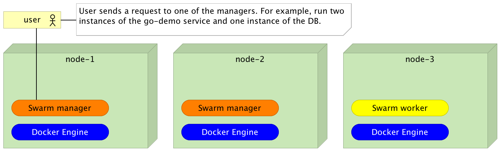
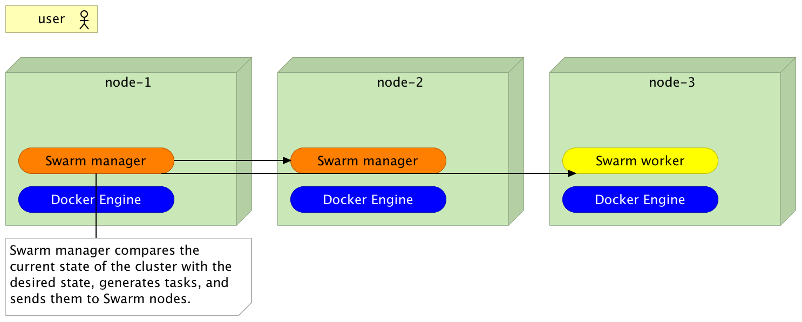
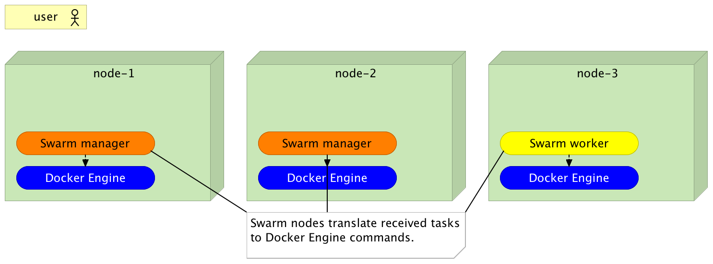
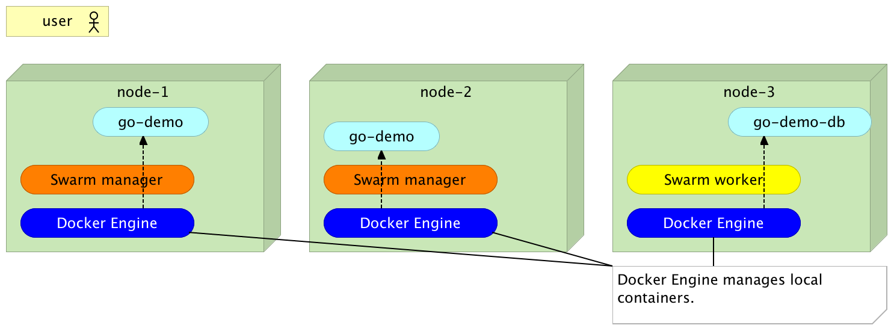
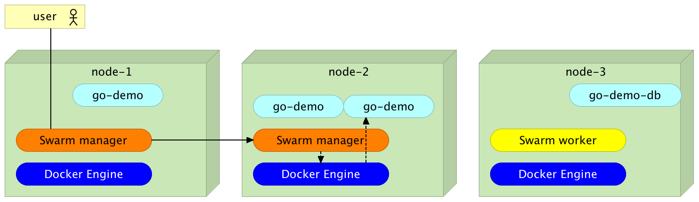
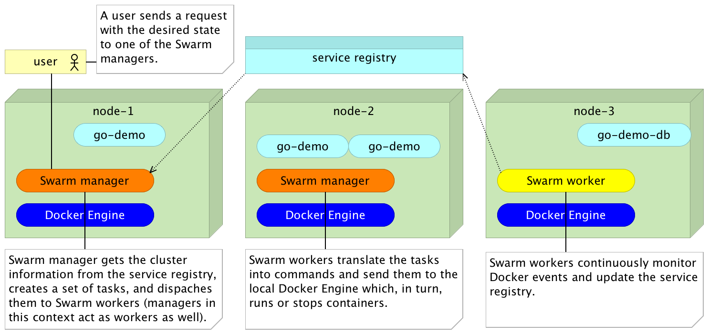
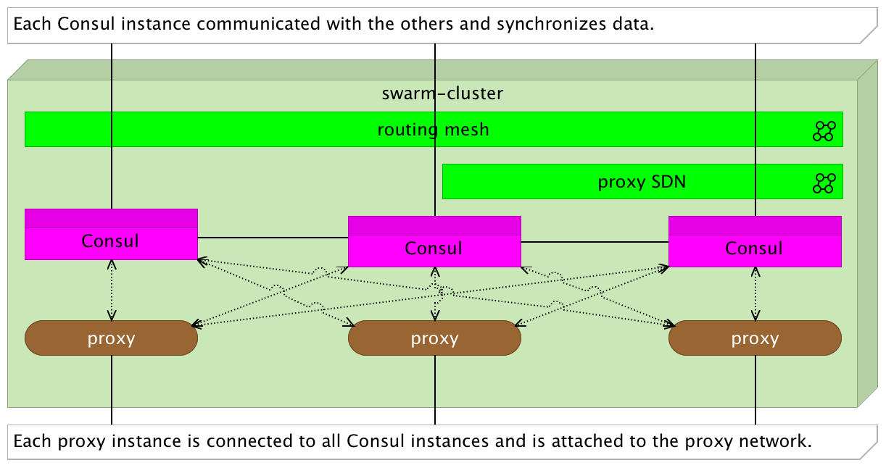
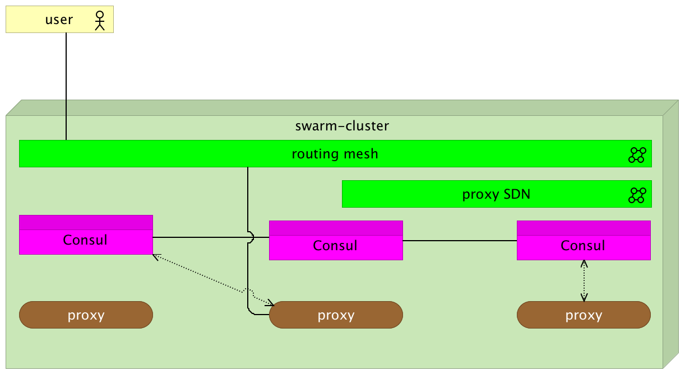
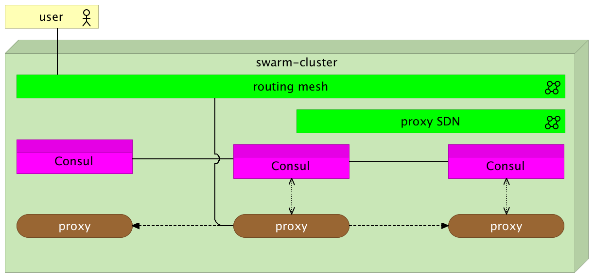

# 第四章：Swarm 集群中的服务发现

做事并不需要多大力气，但决定做什么却需要极大的力量。

- 埃尔伯特·哈伯德

如果你使用过旧版的 Swarm，即 *Docker 1.12* 之前作为独立产品发布的版本，你必须为其设置一个服务注册表。你可能选择了 Consul、etcd 或 Zookeeper。没有它们，独立版的 Swarm 无法工作。为什么会这样呢？为什么会有这么强的依赖关系？

在我们讨论使用外部服务注册表的原因之前，先来讨论一下没有它的情况下，Swarm 会是什么表现。

# 如果没有服务注册表，Docker Swarm 会是什么样子？

假设我们有一个由三个节点组成的集群。其中两个节点运行 **Swarm 管理器**，一个节点是工作节点。管理器接受我们的请求，决定应该做什么，并将任务发送给 **Swarm 工作节点**。反过来，工作节点将这些任务转换为命令，并将其发送到本地的 **Docker Engine**。管理器本身也充当工作节点。

如果我们用之前的 `go-demo` 服务描述流程，并假设 Swarm 没有服务发现功能，情况会是这样的：

用户向其中一个管理器发送请求。这个请求不是一个声明式指令，而是对期望状态的表达。例如，我希望在集群中运行两个 `go-demo` 服务实例和一个 `DB` 实例：



图 4-1：用户向其中一个管理器发送请求

一旦 **Swarm 管理器** 接收到我们对期望状态的请求，它会将其与集群的当前状态进行比较，生成任务并将其发送给 **Swarm 工作节点**。这些任务可能是将 `go-demo` 服务的一个实例运行在 **node-1** 和 **node-2** 上，并将 `go-demo-db` 服务的一个实例运行在 **node-3** 上：



图 4-2：Swarm 管理器将集群的当前状态与期望状态进行比较，生成任务并将其发送到 Swarm 工作节点。

**Swarm 工作节点** 接收来自管理器的任务，将其转换为 Docker Engine 命令，并将其发送到本地的 **Docker Engine** 实例：



图 4-3：Swarm 节点将接收到的任务转换为 Docker Engine 命令

Docker Engine 接收到来自 Swarm 工作节点的命令并执行：



图 4-4：Docker Engine 管理本地容器。

接下来，假设我们向管理器发送一个新的期望状态。例如，我们可能想要将**go-demo**实例的数量扩展到**node-3**。我们将向**node-1**上的**Swarm 管理器**发送请求，它会查询内部存储的集群状态，并做出决定，比如在**node-2**上运行一个新实例。一旦做出决定，管理器会创建一个新任务并将其发送到**node-2**上的**Swarm worker**。然后，worker 会将任务转换为 Docker 命令，并发送到本地引擎。命令执行后，我们将在**node-2**上运行第三个**go-demo**服务实例：



图 4-5：扩展请求被发送到 Swarm 管理器

如果流程按照描述进行，我们将面临许多问题，这将使这种解决方案几乎毫无用处。

让我们试着列举一些我们可能面临的问题。

Docker 管理器使用我们发送给它的信息。这在我们始终使用相同的管理器并且集群状态未因管理器控制之外的因素而变化时有效。需要理解的关键是，关于集群的信息并非存储在一个地方，也并不完整。每个管理器只知道它自己做过的事情。这为什么会是个问题呢？

让我们探索一些替代的（但并不罕见的）路径。

如果我们向**node-2**上的管理器发送扩展到三个实例的请求，会发生什么？该管理器对**node-1**上创建的任务一无所知。因此，它会尝试运行三个新的**go-demo**服务实例，导致集群中总共有五个实例。我们将有两个实例由**node-1**上的管理器创建，三个实例由**node-2**上的管理器创建。

虽然始终使用相同的管理器看起来很有吸引力，但在这种情况下，我们将面临单点故障的问题。如果整个**node-1**故障会发生什么？我们将无法使用管理器，或者只能强制使用**node-2**上的管理器。

可能有许多其他因素会导致这种差异。也许其中一个容器意外停止。在这种情况下，当我们决定扩展到三个实例时，**node-1**上的管理器会认为有两个实例在运行，并会创建一个任务来运行另一个实例。然而，这样做不会导致集群中运行三个实例，而是两个实例。

可能出错的情况是无穷无尽的，我们不会再举更多的例子。

需要注意的重要事项是，任何单一的管理器都不应当在孤立状态下保持有状态。每个管理器都需要拥有与其他管理器相同的信息。另一方面，每个节点需要监控 Docker 引擎生成的事件，并确保任何对其服务器的更改都会传播到所有管理器。最后，我们需要监督每台服务器的状态，以防其中一台出现故障。换句话说，每个管理器都需要有整个集群的最新状态。只有这样，它才能将我们请求的目标状态转化为任务，并将任务分发给 Swarm 节点。

如何确保所有管理器都能够全面了解整个集群的状态，无论是谁对其进行了更改？

这个问题的答案取决于我们设定的要求。我们需要一个存储所有信息的地方。这个地方需要是分布式的，以便一个服务器的故障不会影响工具的正常运行。分布式提供了容错能力，但仅此并不意味着数据会在集群中同步。该工具需要保持数据在所有实例之间的复制。复制并不是什么新鲜事，唯一不同的是，在这种情况下，它需要非常快速，以便咨询它的服务能够实时（或接近实时）接收数据。此外，我们还需要一个系统来监控集群内的每个服务器，并在任何变化发生时更新数据。

总结来说，我们需要一个分布式的服务注册表和监控系统。第一个需求最好通过使用服务注册表或键值存储来实现。旧版 Swarm（Docker 1.12 之前的独立版）支持*Consul* ([`www.consul.io/`](https://www.consul.io/))、*etcd* ([`github.com/coreos/etcd`](https://github.com/coreos/etcd)) 和 *Zookeeper* ([`zookeeper.apache.org/`](https://zookeeper.apache.org/))。我个人偏好 Consul，但三者中的任何一个都可以。

关于服务发现以及主要服务注册表比较的更详细讨论，请参考《DevOps 2.0 工具包》中的《服务发现：分布式服务的关键》章节。

# 独立版 Docker Swarm 在服务发现方面是什么样子的？

现在我们对需求和使用服务发现的原因有了更清晰的理解，我们可以定义请求到 Docker Swarm 管理器的（实际）流程。

请注意，我们仍在探索旧版（独立版）Swarm 的工作原理：

1.  用户向其中一台 Swarm 管理器发送带有目标状态的请求。

1.  Swarm 管理器从服务注册表中获取集群信息，创建一组任务，并将其分发给 Swarm 工作节点。

1.  Swarm 工作节点将任务转换为命令并发送到本地的 Docker 引擎，后者随后运行或停止容器**。**

1.  Swarm 工作节点持续监控 Docker 事件，并更新**服务注册表**。

这样，整个集群的信息始终是最新的。例外情况是当某个管理节点或工作节点失败时。由于管理节点相互监控，一个管理节点或工作节点的失败被视为整个节点的失败。毕竟，没了工作节点，容器就无法在该节点上调度：



图 4-6：Docker Swarm（独立）流程

既然我们已经确定服务发现是管理集群的必备工具，那么接下来自然的问题是它在 Swarm 模式（*Docker 1.12*）中发生了什么变化？

# Swarm 集群中的服务发现

旧版（独立）Swarm 需要一个服务注册中心，以便所有管理节点都能看到相同的集群状态。在实例化旧版 Swarm 节点时，我们必须指定服务注册中心的地址。然而，如果你查看新 Swarm（在 *Docker 1.12* 中引入的 Swarm 模式）的设置说明，你会注意到我们没有设置除了 Docker 引擎以外的任何东西。你不会发现有提到外部服务注册中心或键值存储。

这是否意味着 Swarm 不需要服务发现？恰恰相反。对服务发现的需求依旧强烈，Docker 决定将其集成到 Docker 引擎中。它与 Swarm 一样被捆绑在内部。其内部过程本质上仍然与独立的 Swarm 使用的方式非常相似，只是部件更少。现在，Docker 引擎充当着 Swarm 管理节点、Swarm 工作节点和服务注册中心的角色。

将所有内容捆绑到引擎中的决定引起了不同的反应。一些人认为这样的决策会导致过度耦合，增加 Docker 引擎的不稳定性。另一些人认为这种捆绑使得引擎更加强大，并为一些新可能性打开了大门。虽然双方都有有效的论点，但我更倾向于后者的观点。Docker Swarm 模式是一次巨大的进步，是否能够在不将服务注册中心捆绑到引擎中的情况下实现同样的效果，仍然值得质疑。

了解 Docker Swarm 的工作原理，尤其是其网络功能后，你可能会问，我们是否仍然需要服务发现（超出 Swarm 内部使用的范围）？在《DevOps 2.0 工具包》中，我曾认为服务发现是必须的，并建议大家设置 *Consul*（[`www.consul.io/`](https://www.consul.io/)）或 *etcd*（[`github.com/coreos/etcd`](https://github.com/coreos/etcd)）作为服务注册中心，使用 Registrator 作为在集群内注册更改的机制，并用 Consul Template 或 confd（[`github.com/kelseyhightower/confd`](https://github.com/kelseyhightower/confd)）作为模板解决方案。那么我们现在还需要这些工具吗？

# 我们需要服务发现吗？

很难提供一个通用的建议，说明在 Swarm 集群中工作时是否需要服务发现工具。如果我们把寻找服务作为这些工具的主要用途，答案通常是否定的。我们不需要外部的服务发现来解决这个问题。只要所有需要互相通信的服务在同一个网络中，我们只需要知道目标服务的名称。例如，对于 go-demo（[`github.com/vfarcic/go-demo`](https://github.com/vfarcic/go-demo)）服务，它只需要知道数据库的 DNS `go-demo-db` 就可以找到相关的数据库。第三章，*Docker Swarm 网络与反向代理* 已证明，正确的网络使用对于大多数用例来说已经足够。

然而，寻找服务和在它们之间进行负载均衡请求并不是服务发现的唯一原因。我们可能还有其他对服务注册表或键值存储的需求。我们可能需要存储一些信息，以便它是分布式的并且具有容错性。

需要键值存储的一个例子可以在*Docker Flow Proxy*（[`github.com/vfarcic/docker-flow-proxy`](https://github.com/vfarcic/docker-flow-proxy)）项目中看到。它基于 HAProxy，这是一个有状态的服务。它将配置信息加载到内存中。将有状态的服务放入动态集群中会带来挑战，必须解决这个问题。否则，当服务被扩展、在失败后重新调度等情况下，我们可能会丢失状态。

在深入探讨有状态服务的更多细节和相关问题之前，先来看一下如何将 Consul 设置为我们选择的键值存储，并了解它的基本功能。

# 在 Swarm 集群中设置 Consul 作为服务注册表

像以前一样，我们将首先设置一个 Swarm 集群。从那里开始，我们将继续进行 Consul 的设置，并快速概述我们可以用它做的基本操作。这将为本章的其余部分提供必要的知识。

**《DevOps 2.0 工具包》读者注意**

你可能会觉得可以跳过这一小节，因为你已经学会了如何设置 Consul。但我建议你继续阅读。我们将使用官方的 Consul 镜像，而在我写前一本书时，这个镜像还不可用。同时，我保证会尽量简洁地讲解这一小节，不会让新读者感到困惑。

熟能生巧，但也有一个限度，超出了这个限度，就没有理由一遍遍地重复相同的命令。我敢肯定，到目前为止，你已经厌倦了编写创建 Swarm 集群的命令。所以，我准备了`scripts/dm-swarm.sh`（[`github.com/vfarcic/cloud-provisioning/blob/master/scripts/dm-swarm.sh`](https://github.com/vfarcic/cloud-provisioning/blob/master/scripts/dm-swarm.sh)）脚本，它会创建 Docker Machine 节点并将它们加入到一个 Swarm 集群中。

本章中的所有命令都可以在`04-service-discovery.sh`（[`gist.github.com/vfarcic/fa57e88faf09651c9a7e9e46c8950ef5`](https://gist.github.com/vfarcic/fa57e88faf09651c9a7e9e46c8950ef5)）Gist 中找到。

让我们克隆代码并运行脚本：

一些文件将在主机文件系统和我们将很快创建的 Docker 机器之间共享。Docker Machine 会将当前用户所属的整个目录在虚拟机内共享。因此，请确保代码被克隆到用户的子文件夹中。

```
git clone https://github.com/vfarcic/cloud-provisioning.git

cd cloud-provisioning

scripts/dm-swarm.sh

eval $(docker-machine env swarm-1)

docker node ls

```

`node ls`命令的输出如下（为了简洁，ID 已移除）：

```
HOSTNAME STATUS AVAILABILITY MANAGER STATUS
swarm-2 Ready Active Reachable
swarm-3 Ready Active Reachable
swarm-1 Ready Active Leader

```

请注意，这次命令有所变化。我们使用了`manager`令牌，因此所有三个节点都设置为管理节点。

一般来说，我们应该至少有三个 Swarm 管理节点。这样，如果其中一个节点失败，其他节点会重新调度失败的容器，并且可以作为我们访问系统的入口点。正如许多需要法定人数的解决方案一样，通常奇数是最好的。因此，我们有三个管理节点。

你可能会想要将所有节点都运行为管理节点。我建议你不要这样做。管理节点之间会同步数据。运行的管理节点越多，同步所需的时间可能越长。当管理节点不多时，这种延迟几乎是察觉不到的，但如果你运行一百个管理节点，可能会有一些延迟。毕竟，这就是我们需要工作节点的原因。管理节点是我们进入系统的入口点和任务的协调者，而工作节点则执行实际的工作。

了解这一点后，我们可以继续设置 Consul。

我们将开始下载`docker-compose.yml`文件（[`github.com/vfarcic/docker-flow-proxy/blob/master/docker-compose.yml`](https://github.com/vfarcic/docker-flow-proxy/blob/master/docker-compose.yml)）来自*Docker Flow Proxy*（[`github.com/vfarcic/docker-flow-proxy`](https://github.com/vfarcic/docker-flow-proxy)）项目。该文件已经包含了定义为 Compose 服务的 Consul。

```
curl -o docker-compose-proxy.yml \
    https://raw.githubusercontent.com/\ 
vfarcic/docker-flow-proxy/master/docker-compose.yml

cat docker-compose-proxy.yml

```

就像 Docker Swarm 节点可以作为管理节点或工作节点一样，Consul 也可以作为服务器或代理运行。我们从服务器开始。

作为服务器运行的 Consul 服务的 Compose 定义如下：

```
consul-server:
  container_name: consul
  image: consul
  network_mode: host
  environment:
    - 'CONSUL_LOCAL_CONFIG={"skip_leave_on_interrupt": true}'
  command: agent -server -bind=$DOCKER_IP -bootstrap-expect=1 -client=$DOCKER_IP

```

需要注意的重要事项是，我们将网络模式设置为`host`。这意味着容器将与运行它的主机共享相同的网络。接下来是环境变量和命令。

该命令将以服务器模式运行代理，并且最初预计它是集群中唯一的一个`-bootstrap-expect=1`。

你会注意到使用了`DOCKER_IP`环境变量。Consul 需要绑定信息和客户端地址。由于我们无法提前知道服务器的 IP 地址，因此必须使用变量。

此时你可能会想，为什么我们在 Swarm 集群中讨论 Docker Compose 服务？我们不是应该运行 `docker service create` 命令吗？事实上，在写这篇文章时，官方的 Consul 镜像仍然没有适应“Swarm 方式”的运行方式。大多数镜像在启动到 Swarm 集群中时不需要任何更改。Consul 是少数几个例外之一。我会尽力在情况发生变化时及时更新说明。在此之前，经典的 Compose 方式应该没问题：

```
export DOCKER_IP=$(docker-machine ip swarm-1)

docker-compose -f docker-compose-proxy.yml \
    up -d consul-server

```

你会在输出中看到 `WARNING: The Docker Engine you're using is running in swarm mode` 消息。这只是一个友好的提醒，表明我们并没有以 Docker 服务的方式运行它。可以忽略这个警告。

现在我们已经有了一个 Consul 实例在运行，我们可以进行一些基本操作。

例如，我们可以将一些信息放入键值存储中：

```
curl -X PUT -d 'this is a test' \
    "http://$(docker-machine ip swarm-1):8500/v1/kv/msg1"

```

`curl` 命令将一个测试值作为 `msg1` 键放入 Consul 中。

我们可以通过发送 `GET` 请求来确认键值组合确实已经存储：

```
curl "http://$(docker-machine ip swarm-1):8500/v1/kv/msg1"

```

输出如下（已格式化以提高可读性）：

```
[
 {
   "LockIndex": 0,
   "Key": "msg1",
   "Flags": 0,
   "Value": "dGhpcyBpcyBhIHRlc3Q=",
   "CreateIndex": 17,
   "ModifyIndex": 17
 }
]

```

你会注意到值被编码了。如果我们在请求中添加 `raw` 参数，Consul 将仅返回原始格式的值：

```
curl "http://$(docker-machine ip swarm-1):8500/v1/kv/msg1?raw"

```

输出如下：

```
this is a test

```

现在，我们只有一个 Consul 实例。如果它运行的节点 `swarm-1` 失败，所有数据将丢失，服务注册将不可用。这种情况并不好。

我们可以通过运行更多的 Consul 实例来实现容错。这次，我们将运行代理。

就像 Consul 服务器实例一样，代理也在 `docker-compose.yml` 文件中定义（[`github.com/vfarcic/docker-flow-proxy/blob/master/docker-compose.yml`](https://github.com/vfarcic/docker-flow-proxy/blob/master/docker-compose.yml)）文件中，属于 *Docker Flow Proxy* 项目（[`github.com/vfarc`](https://github.com/vfarcic/docker-flow-proxy)[ic/docker-flow-proxy](https://github.com/vfarcic/docker-flow-proxy)）。记住，我们下载了名为 `docker-compose-proxy.yml` 的文件。让我们来看一下服务定义：

```
cat docker-compose-proxy.yml

```

输出中定义 `Consul-agent` 服务的部分如下：

```
consul-agent:
  container_name: consul
  image: consul
  network_mode: host
  environment:
    - 'CONSUL_LOCAL_CONFIG={"leave_on_terminate": true}'
  command: agent -bind=$DOCKER_IP -retry-join=$CONSUL_SERVER_IP \
-client=$DOCKER_IP

```

这几乎与我们用于运行 Consul 服务器实例的定义相同。唯一的重要区别是缺少 `-server`，并且我们有了 `-retry-join` 参数。我们使用后者来指定另一个实例的地址。Consul 使用 gossip 协议。只要每个实例至少知道一个其他实例，协议就会将信息传播到所有实例中。

让我们在其他两个节点 `swarm-2` 和 `swarm-3` 上运行代理：

```
export CONSUL_SERVER_IP=$(docker-machine ip swarm-1)

for i in 2 3; do
    eval $(docker-machine env swarm-$i)

    export DOCKER_IP=$(docker-machine ip swarm-$i)

    docker-compose -f docker-compose-proxy.yml \
        up -d consul-agent
done

```

现在我们已经在集群中运行了三个 Consul 实例（每个节点上一个），我们可以确认 gossip 协议确实有效。

让我们请求 `msg1` 键的值。这次，我们将从 `swarm-2` 上运行的 Consul 实例请求：

```
curl "http://$(docker-machine ip swarm-2):8500/v1/kv/msg1"

```

从输出中可以看出，尽管我们将信息存储到运行在 `swarm-1` 上的实例中，但它也可以从运行在 `swarm-2` 上的实例中访问。这些信息会在所有实例中传播。

我们可以再给 Gossip 协议进行一轮测试：

```
curl -X PUT -d 'this is another test' \
 "http://$(docker-machine ip swarm-2):8500/v1/kv/messages/msg2"

curl -X PUT -d 'this is a test with flags' \
 "http://$(docker-machine ip swarm-3):8500/v1/kv/messages/msg3?\ flags=1234"

curl "http://$(docker-machine ip swarm-1):8500/v1/kv/?recurse"

```

我们向运行在 `swarm-2` 上的实例发送了一个 `PUT` 请求，并向运行在 `swarm-3` 上的实例发送了另一个请求。当我们从运行在 `swarm-1` 上的实例请求所有键时，所有三个键都被返回。换句话说，无论我们对数据做什么，它都会在所有实例中保持同步。

类似地，我们也可以删除信息：

```
curl -X DELETE "http://$(docker-machine ip swarm-2):\
8500/v1/kv/?recurse"

curl "http://$(docker-machine ip swarm-3):8500/v1/kv/?recurse"

```

我们向 `swarm-2` 发送了删除所有键的请求。当我们查询运行在 `swarm-3` 上的实例时，得到了一个空的响应，意味着所有的东西确实都消失了。

通过类似我们探讨过的设置，我们可以拥有一种可靠、分布式且容错的方式来存储和检索我们的服务可能需要的任何信息。

我们将利用这些知识来探索在 Swarm 集群中运行有状态服务时可能出现的一些问题的解决方案。但在开始讨论解决方案之前，让我们先看看有状态服务的问题是什么。

# 扩展有状态实例时的问题

在 Swarm 集群中扩展服务很容易，不是吗？只需执行 `docker service scale <SERVICE_NAME>=<NUMBER_OF_INSTANCES>`，突然间，服务就运行了多个副本。

之前的说法只是部分正确。更准确的表述应该是：“在 Swarm 集群中扩展无状态服务很容易”。

无状态服务容易扩展的原因在于不需要考虑状态。无论实例运行多久，它都是一样的。新实例和运行一周的实例没有区别。由于状态不会随时间变化，我们可以在任何时刻创建新的副本，它们都会完全相同。

然而，世界并非无状态的。状态是我们行业中不可避免的一部分。一旦第一条信息被创建，就需要存储在某个地方。我们存储数据的地方必须是有状态的。它有一个随时间变化的状态。如果我们想要扩展这种有状态的服务，至少有两件事需要考虑：

1.  我们如何将一个实例的状态变化传播到其余实例？

1.  我们如何创建一个有状态服务的副本（一个新实例），并确保状态也被复制？

我们通常将无状态和有状态服务结合成一个逻辑实体。一个后端服务可以是无状态的，并依赖于数据库服务作为外部数据存储。这样，服务之间就有了明确的职责分离，每个服务的生命周期也不同。

在继续之前，我必须声明，没有一个“灵丹妙药”能让有状态的服务具备可扩展性和容错性。在本书中，我将通过几个示例来讲解，这些示例可能适用于您的使用场景，也可能不适用。一个显而易见且非常典型的有状态服务示例是数据库。尽管有一些常见的模式，但几乎每个数据库都提供不同的数据复制机制。这本身就足以阻止我们给出一个适用于所有情况的最终答案。我们将在本书后面探讨 MongoDB 的可扩展性。我们还会看到一个使用文件系统存储其状态的 Jenkins 示例。

我们将首先处理一个不同类型的情况。我们将讨论将状态存储在配置文件中的服务的可扩展性。为了使事情更复杂，配置是动态的。它随着时间的推移在服务的生命周期中不断变化。我们将探索使 HAProxy 可扩展的方法。

如果我们使用官方的*HAProxy*（[`hub.doc`](https://hub.docker.com/_/haproxy/)[ker.com/_/haproxy/](https://hub.docker.com/_/haproxy/)）镜像，我们面临的挑战之一是决定如何更新所有实例的状态。我们需要更改配置，并重新加载每个`proxy`副本。

例如，我们可以在集群中的每个节点上挂载一个 NFS 卷，并确保相同的主机卷在所有 HAProxy 容器内都被挂载。起初，这似乎能解决与状态相关的问题，因为所有实例都会共享相同的配置文件。对主机上配置文件的任何更改都会在所有实例中生效。然而，这本身并不会改变服务的状态。

HAProxy 在初始化时加载配置文件，之后对配置文件所做的任何更改它都无法察觉。为了让配置文件状态的更改反映到服务的状态中，我们需要重新加载配置文件。问题在于，实例可能在集群内的任何节点上运行。除此之外，如果我们采用动态扩展（稍后会详细讨论），我们可能甚至不知道有多少实例在运行。所以，我们需要发现我们有多少个实例，了解它们在哪些节点上运行，获取每个容器的 ID，只有这样，我们才能发送信号重新加载`proxy`。虽然所有这些可以通过脚本实现，但这远不是一个最优的解决方案。此外，挂载 NFS 卷是一个单点故障。如果托管卷的服务器发生故障，数据就会丢失。当然，我们可以创建备份，但这些备份只能部分恢复丢失的数据。也就是说，我们可以恢复备份，但从上次备份创建到节点故障之间生成的数据会丢失。

另一种方式是将配置嵌入到 HAProxy 镜像中。我们可以创建一个新的 Dockerfile，该文件基于 `haproxy`，并添加 `COPY` 指令来添加配置。这样，每次我们想重新配置代理时，都需要更改配置、构建一组新的镜像（即新的版本），并更新当前在集群内运行的 `proxy` 服务。正如你能想象的，这同样是不现实的。对于简单的代理重新配置而言，这个过程太复杂了。

*Docker Flow Proxy* 使用一种不同的、不太传统的方法来解决这个问题。它将其状态的副本存储在 Consul 中。它还使用了一个未记录的 Swarm 网络功能（至少在写这篇文章时是如此）。

# 使用服务注册表存储状态

现在我们已经设置了 Consul 实例，让我们探讨如何利用它们为我们所用。我们将研究 *Docker Flow Proxy* 的设计，作为展示一些你可能希望应用到自己服务中的挑战和解决方案的一种方式。

让我们创建 `proxy` 网络和服务：

```
eval $(docker-machine env swarm-1)

docker network create --driver overlay proxy

docker service create --name proxy \
    -p 80:80 \
    -p 443:443 \
    -p 8080:8080 \
    --network proxy \
    -e MODE=swarm \
    --replicas 3 \
    -e CONSUL_ADDRESS="$(docker-machine ip swarm-1):8500 \
,$(docker-machine ip \
swarm-2):8500,$(docker-machine ip swarm-3):8500" \
    vfarcic/docker-flow-proxy

```

我们用来创建 **proxy** 服务的命令与之前稍有不同。具体来说，现在我们有一个 `CONSUL_ADDRESS` 变量，其中包含所有三个 **Consul** 实例的用逗号分隔的地址。**proxy** 的设计方式是它会尝试第一个地址。如果该地址没有响应，它会尝试下一个，依此类推。这样，只要至少有一个 **Consul** 实例在运行，**proxy** 就能够获取和存储数据。如果 **Consul** 能作为 Swarm 服务运行，我们就不需要做这个循环了。在那种情况下，我们只需要将两者放在同一网络中，并使用服务名作为地址。

不幸的是，**Consul** 目前还不能作为 Swarm 服务运行，因此我们不得不指定所有的地址，请参考下面的图示：



图 4-7：代理扩展到三个实例

在继续之前，我们应该确保所有的 `proxy` 实例都在运行：

```
docker service ps proxy

```

请等待直到所有实例的当前状态设置为 `Running`。

让我们创建 `go-demo` 服务。它将作为一个催化剂，讨论我们在处理扩展的反向 `proxy` 时可能遇到的挑战：

```
docker network create --driver overlay go-demo

docker service create --name go-demo-db \
    --network go-demo \
    mongo:3.2.10

docker service create --name go-demo \
    -e DB=go-demo-db \
    --network go-demo \
    --network proxy \
    vfarcic/go-demo:1.0

```

没有必要详细解释这些命令。它们与我们在前几章中运行的命令是相同的。

请等待直到 `go-demo` 服务的当前状态为 Running。你可以随时使用 `docker service ps go-demo` 命令检查状态。

如果我们重复在 第三章 中使用的相同过程，*Docker Swarm 网络和反向代理*，重新配置代理的请求将如下所示（请不要执行它）。

```
curl "$(docker-machine ip swarm-1):8080/v1/\
proxy/reconfigure?serviceName=go-demo&servicePath=/demo&port=8080"

```

我们会向 `proxy` 服务发送一个重新配置的请求。你能猜到结果是什么吗？

用户发送请求来重新配置**代理**。请求由路由网格接收并在所有**代理**实例之间进行负载均衡。请求被转发到其中一个实例。由于**代理**使用**Consul**来存储其配置，它将信息发送到一个**Consul**实例，然后该实例会将数据同步到其他所有实例。

结果是我们得到了具有不同状态的**代理**实例。接收到请求的那个被重新配置为使用`go-demo`服务。其他两个实例依然对其一无所知。如果我们尝试通过**代理**来 ping `go-demo` 服务，我们将得到混合的响应。三次请求中一次会返回状态`200`，其余时间我们会收到`404`，未找到：



图 4-8：重新配置代理的请求

如果我们扩展 MongoDB，应该会得到类似的结果。**路由网格**会在所有实例之间进行负载均衡，它们的状态开始分歧。我们可以通过使用副本集来解决 MongoDB 的问题。这是一个允许我们在所有 `DB` 实例之间复制数据的机制。然而，HAProxy 并没有这样的功能。所以，我必须自己添加它。

正确的请求来重新配置运行多个实例的代理如下：

```
curl "$(docker-machine ip swarm-1):8080/v1/\
docker-flow-proxy/reconfigure \
serviceName=go-demo&servicePath=/demo&port=8080&distribute=true"

```

请注意新的参数`distribute=true`。当指定该参数时，**代理**将接受请求，重新配置自身，并将请求重新发送到所有其他实例：



图 4-9：接收请求并将其转发给所有其他实例的代理实例

这样，**代理**实现了类似于 MongoDB 中副本集的机制。对其中一个实例的更改会传播到所有其他实例。

让我们确认它确实按预期工作：

```
curl -i "$(docker-machine ip swarm-1)/demo/hello"

```

输出如下：

```
HTTP/1.1 200 OK
Date: Fri, 09 Sep 2016 16:04:05 GMT
Content-Length: 14
Content-Type: text/plain; charset=utf-8

hello, world!

```

响应为`200`，这意味着`go-demo`服务收到了**代理**服务转发的请求。由于路由网格的作用，请求进入系统后，进行了负载均衡，并再次转发到某个代理实例。接收到请求的代理实例评估了路径，决定将其转发到`go-demo`服务。因此，请求被重新发送到`go-demo`网络，再次进行负载均衡，并转发到某个`go-demo`实例。换句话说，任何一个`proxy`和`go-demo`实例都有可能收到请求。如果代理状态没有在所有实例之间同步，三次请求中有两次会失败。

可以随意重复`curl -i $(docker-machine ip swarm-1)/demo/hello`命令。结果应该始终相同。

我们可以通过查看其中一个容器来再次确认配置确实已同步。

让我们来看一下，比如说，代理实例三。

我们首先应该做的是找出实例运行所在的节点：

```
NODE=$(docker service ps proxy | grep "proxy.3" | awk '{print $4}')

```

我们列出了所有的`proxy`服务进程`docker service ps proxy`，通过第三个实例`grep "proxy.3"`过滤结果，并返回输出的第四列中存储的节点名称`awk '{print $4}'`。结果被存储在环境变量`NODE`中。

现在我们知道这个实例运行的服务器，我们可以进入容器并显示配置文件的内容：

```
eval $(docker-machine env $NODE)

ID=$(docker ps | grep "proxy.3" | awk '{print $1}')

```

我们将 Docker 客户端指向节点。接着执行列出所有正在运行的进程的命令`docker ps`，过滤出第三个实例`grep "proxy.3"`，并输出存储在第一列的容器 ID`awk '{print $1}'`。结果被存储在环境变量 ID 中。

客户端指向正确的节点，ID 也被存储为环境变量 ID，我们最终可以进入容器并显示配置：

```
docker exec -it $ID cat /cfg/haproxy.cfg

```

输出的相关部分如下：

```
frontend services
    bind *:80
    bind *:443
    mode http

    acl url_go-demo8080 path_beg /demo
    use_backend go-demo-be8080 if url_go-demo8080

backend go-demo-be8080
    mode http
    server go-demo go-demo:8080

```

如你所见，`proxy`的第三个实例确实已正确配置了`go-demo`服务。你可以随意重复这个过程，检查其他两个实例，结果应该完全相同，从而证明同步有效。

这是如何做到的？`proxy`实例是如何发现所有其他实例的 IP 的？毕竟，并没有一个 Registrator 提供 IP 给 Consul，而且我们也无法访问 Swarm 的内部服务发现 API。

# 发现组成服务的所有实例的地址

如果你浏览官方 Docker 文档，你将找不到任何提及组成服务的各个实例的地址。

当你阅读这段话时，前述句子可能不再成立。有人可能已经更新了文档。然而，在我写这章的时候，确实没有任何此类信息的痕迹。

事情没有被记录并不意味着它不存在。事实上，有一个特殊的 DNS，它会返回所有的 IP。

为了看到实际效果，我们将创建一个名为 util 的全局服务并将其附加到`proxy`网络：

```
docker service create --name util \
    --network proxy --mode global \
    alpine sleep 1000000000

docker service ps util

```

在继续之前，请等待直到当前状态设置为运行中。

接下来，我们将找到其中一个 util 实例的 ID 并安装 drill 工具，它将展示与 DNS 条目相关的信息：

```
ID=$(docker ps -q --filter label=com.docker.swarm.service.name=util)

docker exec -it $ID apk add --update drill

```

让我们从钻取 DNS 代理开始：

```
docker exec -it $ID drill proxy

```

输出如下：

```
;; ->>HEADER<<- opcode: QUERY, rcode: NOERROR, id: 31878
;; flags: qr rd ra ; QUERY: 1, ANSWER: 1, AUTHORITY: 0, ADDITIONAL: 0
;; QUESTION SECTION:
;; proxy.              IN             A

;; ANSWER SECTION:
proxy.        600             IN             A           10.0.0.2

;; AUTHORITY SECTION:

;; ADDITIONAL SECTION:

;; Query time: 0 msec
;; SERVER: 127.0.0.11
;; WHEN: Fri Sep 9 16:43:23 2016
;; MSG SIZE rcvd: 44

```

如你所见，尽管我们运行了三个实例，但只返回了一个 IP`10.0.0.2`。那是服务的 IP，而不是单个实例的 IP。更具体地说，它是`proxy`服务网络端点的 IP。当请求到达该端点时，Docker 网络会对所有实例进行负载均衡。

在大多数情况下，我们不需要其他任何东西。我们只需要知道服务的名称，Docker 就会为我们完成剩下的工作。然而，在某些情况下，我们可能需要更多信息。我们可能需要知道每个服务实例的 IP。这正是 *Docker Flow Proxy* 面临的问题。

要查找服务所有实例的 IP，我们可以使用“未文档化”的功能。我们需要在服务名称前添加 `tasks` 前缀。

让我们再深入了解一下：

```
docker exec -it $ID drill tasks.proxy

```

这次，输出有所不同：

```
;; ->>HEADER<<- opcode: QUERY, rcode: NOERROR, id: 54408
;; flags: qr rd ra ; QUERY: 1, ANSWER: 3, AUTHORITY: 0, ADDITIONAL: 0
;; QUESTION SECTION:
;; tasks.proxy. IN A

;; ANSWER SECTION:
tasks.proxy. 600 IN A 10.0.0.4
tasks.proxy. 600 IN A 10.0.0.3
tasks.proxy. 600 IN A 10.0.0.5

;; AUTHORITY SECTION:

;; ADDITIONAL SECTION:

;; Query time: 0 msec
;; SERVER: 127.0.0.11
;; WHEN: Fri Sep 9 16:48:46 2016
;; MSG SIZE rcvd: 110

```

我们得到了三个答案，每个答案有一个不同的 IP：`10.0.0.4, 10.0.0.3, 10.0.0.5`。

知道所有实例的 IP 解决了数据同步的问题。通过 tasks.`<SERVICE_NAME>` 我们得到了所有需要的信息。剩下的只是一些代码，利用这些 IP。这个机制类似于同步数据库时使用的机制（稍后会详细介绍）。

我们还没有完成。我们能够按需同步数据（或事件）并不意味着服务是容错的。如果我们需要创建一个新的实例该怎么办？如果一个实例失败，Swarm 将它调度到其他地方会发生什么？

# 使用服务注册表或键值存储来存储服务状态

我们将继续使用 *Docker Flow Proxy* 作为游乐场，探索在处理有状态服务时可能采取的一些机制和决策。请注意，在本章中，我们重点讨论的是状态相对较小的服务。在接下来的章节中，我们会探讨其他的使用案例。

假设代理没有使用 Consul 来存储数据，并且我们没有使用卷。如果我们要扩展它，会发生什么呢？新的实例将会不同步。它们的状态将与我们创建的第一个实例的初始状态相同。换句话说，虽然已经运行的实例随着时间变化并生成了数据，但它们将没有状态。

这时，Consul 就派上了用场。每当代理的某个实例接收到一个请求并导致其状态发生变化时，它会将该变化传播到其他实例，以及 Consul。另一方面，代理在初始化时执行的第一步就是查询 Consul，并从其中的数据创建配置。

我们可以通过发送请求获取所有以 `docker-flow` 开头的键的数据，来观察存储在 Consul 中的状态：

```
curl "http://$(docker-machine ip swarm-1):8500/v1/kv/\
docker-flow?recurse"

```

输出的一部分如下：

```
[
...
  {
   "LockIndex": 0,
   "Key": "docker-flow/go-demo/path",
   "Flags": 0,
   "Value": "L2RlbW8=",
   "CreateIndex": 233,
   "ModifyIndex": 245
  },
...
  {
   "LockIndex": 0,
   "Key": "docker-flow/go-demo/port",
   "Flags": 0,
   "Value": "ODA4MA==",
   "CreateIndex": 231,
   "ModifyIndex": 243
  },
...
]

```

上面的例子显示了我们在重新配置 `go-demo` 服务的代理时指定的路径和端口，已被存储在 Consul 中。如果我们指示 Swarm 管理器扩展 `proxy` 服务，新的实例将会被创建。这些实例会查询 Consul 并使用其中的信息来生成它们的配置。

让我们试试看：

```
docker service scale proxy=6

```

我们将实例数量从三增加到六。

让我们偷偷看看第六个实例：

```
NODE=$(docker service ps proxy | grep "proxy.6" | awk '{print $4}')

eval $(docker-machine env $NODE)

ID=$(docker ps | grep "proxy.6" | awk '{print $1}')

docker exec -it $ID cat /cfg/haproxy.cfg

```

`exec` 命令输出的一部分如下：

```
frontend services
    bind *:80
    bind *:443
    mode http

backend go-demo-be8080
   mode http
   server go-demo :8080

```

正如你所看到的，新实例从 Consul 恢复了所有信息。因此，它的状态与集群内运行的任何其他 `proxy` 实例的状态相同。

如果我们销毁一个实例，结果将再次是相同的。Swarm 会检测到实例崩溃并调度一个新的实例。新实例将重复相同的过程，查询 Consul 并创建与其他实例相同的状态：

```
docker rm -f $(docker ps \
    | grep proxy.6 \
    | awk '{print $1}')

```

我们应该稍等片刻，直到 Swarm 检测到故障并创建一个新实例。

一旦它运行起来，我们可以查看新实例的配置。它将与之前相同：

```
NODE=$(docker service ps \
    -f desired-state=running proxy \
    | grep "proxy.6" \
    | awk '{print $4}')

eval $(docker-machine env $NODE)

ID=$(docker ps | grep "proxy.6" | awk '{print $1}')

docker exec -it $ID cat /cfg/haproxy.cfg

```

*Docker Flow Proxy* 内部工作原理的解释主要是出于教育目的。我想向你展示在处理有状态服务时可能的一种解决方案。我们讨论的方法仅适用于状态相对较小的情况。当状态变得更大时，例如数据库的情况，我们应该使用不同的机制来实现相同的目标。

如果我们往上一层看，在集群内运行有状态服务时，主要的要求或前提条件如下：

1.  在所有实例之间同步状态的能力。

1.  在初始化期间恢复状态的能力。

如果我们能够满足这两个要求，我们就走在了正确的道路上，朝着解决在集群内操作有状态服务时的主要瓶颈之一迈进。

# 现在怎么办？

这就结束了关于在 Swarm 集群内使用服务发现的基本概念的探索。

我们学完 Swarm 特性了吗？我们远未掌握 Docker Swarm 的所有知识。然而，到目前为止，我们已经拥有足够的知识，可以回到第一章的末尾，*使用 Docker 容器进行持续集成*，并迈出下一步。我们可以设计一个持续交付流程。

现在是时候休息一下，再深入下一章了。和之前一样，我们将销毁创建的机器，重新开始：

```
docker-machine rm -f swarm-1 swarm-2 swarm-3

```
