# 使用 Docker 容器的持续交付和部署。

在软件中，当某个过程变得痛苦时，减少痛苦的方法是更加频繁地执行它，而不是减少频率。

– 大卫·法利（David Farley）

当时，我们无法将**持续集成**（**CI**）转化为**持续交付**（**CD**）过程，因为我们缺少一些关键知识。现在我们已经理解了 Docker Swarm 背后的基本原理和命令，我们可以回到第一章，*使用 Docker 容器进行持续集成*。我们可以定义出可以让我们执行完整 CD 过程的步骤。

我不会深入讨论持续交付的细节。相反，我将用一句话来概括它。*持续交付是一个应用于每次提交到代码库的过程，每次成功构建都会准备好部署到生产环境。*

CD 意味着任何人随时可以点击一个按钮，将构建部署到生产环境，而不必担心出现问题。这意味着该过程非常稳健，我们有充分的信心，"几乎"所有的问题都会在部署到生产之前被发现。毫无疑问，CD 是一个完全自动化的过程。从提交到代码库的那一刻起，一直到构建准备好部署到生产环境，过程中没有人工干预。唯一的手动操作是有人需要按下一个按钮，运行一个脚本执行部署。

**持续部署**（**CDP**）是向前迈出的一步。它是没有按钮的持续交付。*持续部署是一个应用于每次提交到代码库的过程，每次成功构建都会被部署到生产环境。*

无论选择哪种过程，步骤都是一样的。唯一的区别是是否有一个按钮用于将版本部署到生产环境。

在这一点上，可以安全地假设我们将尽可能方便地使用 Docker，并且我们将使用 Swarm 集群在生产和类似生产的环境中运行服务。

让我们从指定一些步骤开始，这些步骤可以定义 CD/CDP 过程的一个可能实现：

1.  查看代码。

1.  运行单元测试。

1.  构建二进制文件和其他所需的构件。

1.  将服务部署到预生产环境。

1.  运行功能测试。

1.  将服务部署到类似生产环境的环境中。

1.  运行生产就绪性测试。

1.  将服务部署到生产环境中。

1.  运行生产就绪性测试。

现在，让我们开始配置练习 CD 流程所需的环境。

# 定义持续交付环境。

持续交付环境的最基本要求是两个集群。一个应专门用于运行测试、构建构件和镜像，以及执行所有其他 CD 任务。我们可以将其用作模拟生产集群。第二个集群将用于生产部署。

为什么我们需要两个集群？难道只用一个就能完成同样的事情吗？

虽然我们完全可以仅用一个集群，但拥有两个集群将简化许多流程，更重要的是，提供更好的生产环境与非生产环境之间的隔离。

我们越是减少对生产集群的影响，就越好。通过不在生产集群内运行非生产服务和任务，我们减少了风险。因此，我们应该将生产集群与环境的其他部分隔离开来。

现在让我们开始，启动这些集群。

# 设置持续交付集群

对于一个类似生产的集群，最低需要多少台服务器？我认为是两台。如果只有一台服务器，我们将无法测试节点之间的网络和存储卷是否正常工作。所以，必须是多个节点。另一方面，我不希望给你的笔记本电脑造成过大负担，所以除非必要，我们将避免增加节点数量。

对于类似生产的集群，两台节点应该足够了。我们应该再增加一个节点，用于运行测试和构建镜像。生产集群可能需要稍微大一点，因为它将运行更多的服务。我们将它设为三节点。如果需要，稍后可以增加容量。如你所见，向 Swarm 集群中添加节点非常简单。

到目前为止，我们已经多次设置了一个 Swarm 集群，因此我们将跳过解释，直接通过脚本来完成。

本章中的所有命令都可以在 `05-continuous-delivery.sh` ([`gist.github.com/vfarcic/5d08a87a3d4cb07db5348fec49720cbe`](https://gist.github.com/vfarcic/5d08a87a3d4cb07db5348fec49720cbe)) Gist 中找到。

让我们回到前一章创建的云资源配置目录，并运行 `scripts/dm-swarm.sh` ([`github.com/vfarcic/cloud-provisioning/blob/master/scripts/dm-swarm.sh`](https://github.com/vfarcic/cloud-provisioning/blob/master/scripts/dm-swarm.sh)) 脚本。它将创建生产节点并将它们加入到集群中。节点将被命名为 `swarm-1`、`swarm-2` 和 `swarm-3`：

```
cd cloud-provisioning

scripts/dm-swarm.sh

eval $(docker-machine env swarm-1)

docker node ls

```

`**node ls**` 命令的输出如下（为了简洁，ID 已移除）：

```
HOSTNAME  STATUS  AVAILABILITY  MANAGER STATUS
swarm-2   Ready   Active        Reachable
swarm-1   Ready   Active        Leader
swarm-3   Ready   Active        Reachable

```

接下来，我们将创建第二个集群。我们将用它来运行持续交付任务，以及模拟生产环境。现在，三个节点应该足够了。我们将它们命名为 `swarm-test-1`、`swarm-test-2` 和 `swarm-test-3`。

我们将通过执行 `scripts/dm-test-swarm.sh` ([`github.com/vfarcic/cloud-provisioning/blob/master/scripts/dm-test-swarm.sh`](https://github.com/vfarcic/cloud-provisioning/blob/master/scripts/dm-test-swarm.sh)) 脚本来创建集群：

```
scripts/dm-test-swarm.sh

eval $(docker-machine env swarm-test-1)

docker node ls

```

`node ls` 命令的输出如下（为了简洁，ID 已移除）：

```
HOSTNAME      STATUS  AVAILABILITY  MANAGER STATUS
swarm-test-2  Ready   Active        Reachable
swarm-test-1  Ready   Active        Leader
swarm-test-3  Ready   Active        Reachable

```

现在剩下的工作就是创建 Docker 注册中心服务。我们将在每个集群中创建一个。这样，它们之间就没有直接的关联，并且可以相互独立操作。为了让运行在不同集群上的注册中心共享相同的数据，我们将把相同的主机卷挂载到两个服务上。这样，从一个集群推送的镜像将能够在另一个集群中访问，反之亦然。请注意，我们正在创建的卷仍然是一种临时解决方案。稍后我们将探索更好的挂载卷的方法。

让我们从生产集群开始。

我们已经在第一章中运行过注册中心，*使用 Docker 容器进行持续集成*。当时，我们有一个单一节点，并且使用 Docker Compose 来部署服务。注册中心并不是一个选项。

**Windows 用户注意** Git Bash 有修改文件系统路径的习惯。为了避免这种情况，在运行代码块之前执行以下命令：

`export MSYS_NO_PATHCONV=1`

这次，我们将作为 Swarm 服务运行注册中心：

```
eval $(docker-machine env swarm-1)

docker service create --name registry \
    -p 5000:5000 \
    --reserve-memory 100m \
    --mount "type=bind,source=$PWD,target=/var/lib/registry" \
    registry:2.5.0

```

我们暴露了端口`5000`并保留了`100` MB 的内存。我们使用了`--mount`参数来暴露一个卷。这个参数与 Docker 引擎的`--volume`参数或 Docker Compose 文件中的 volumes 参数有些相似。唯一显著的区别在于格式。在这种情况下，我们指定当前的主机目录`source=$PWD`应该挂载到容器内部`target=/var/lib/registry`。

请注意，从现在开始，我们将始终运行特定版本的服务。直到现在，使用最新版本作为演示是可以的，但现在我们尝试模拟 CD 过程，并且这些过程将在“真实”的集群中运行。我们应该始终明确指定要运行哪个版本的服务。这样，我们可以确保测试和部署到生产环境的是相同的服务。否则，我们可能会遇到一种情况，即在类似生产环境中部署和测试了一个版本，但生产环境中却部署了另一个版本。

使用特定版本的好处在我们使用 Docker Hub 的镜像时变得更加明显。例如，如果我们只运行注册中心的最新版本，就无法保证在以后运行时，在第二个集群中，最新版本不会被更新。我们可能会轻易地在不同的集群中得到不同版本的注册中心，这可能会导致一些非常难以检测的 bug。

我不会再多提版本控制的问题了。我相信你知道它的用途以及何时使用。

让我们回到`registry`服务。我们应该在第二个集群中也创建它：

```
eval $(docker-machine env swarm-test-1)

docker service create --name registry \
    -p 5000:5000 \
    --reserve-memory 100m \
    --mount "type=bind,source=$PWD,target=/var/lib/registry" \
    registry:2.5.0

```

现在，我们在两个集群中都运行了`registry`服务。

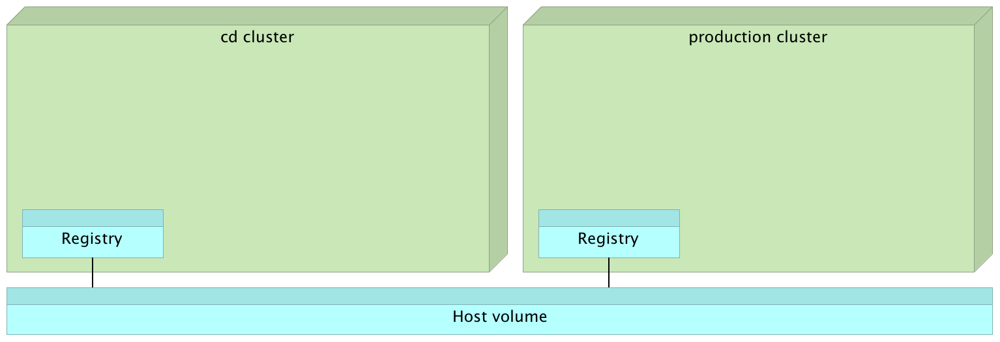

图 5-1：带有注册中心服务的 CD 和生产集群

目前，我们不知道注册表正在哪些服务器上运行。我们只知道每个集群中都有该服务的一个实例。通常，我们需要配置 Docker 引擎，将注册表服务视为不安全的并允许流量通过。为了做到这一点，我们需要知道注册表运行的服务器的 IP 地址。然而，由于我们将其作为 Swarm 服务运行并暴露了端口`5000`，路由网格将确保端口在集群中的每个节点上都开放，并将请求转发到服务。这使我们能够将注册表视为本地主机。我们可以从任何节点拉取和推送镜像，就好像注册表在每个节点上运行一样。此外，Docker 引擎的默认行为是只允许本地主机流量访问注册表。这意味着我们不需要更改它的配置。

# 使用节点标签来约束服务

标签被定义为键值对集合。我们将使用键`env`（即环境的缩写）。目前，我们不需要给用于持续交付（CD）任务的节点打标签，因为我们还没有将它们作为服务运行。我们将在接下来的章节中更改这一点。目前，我们只需要给将在生产环境中运行我们服务的节点打上标签。

我们将使用`swarm-test-2`和`swarm-test-3`节点作为我们的生产环境，所以我们将它们标记为键`env`，值`prod-like`。

让我们从节点`swarm-test-2`开始：

```
docker node update \
    --label-add env=prod-like \
    swarm-test-2

```

我们可以通过检查节点来确认标签确实已被添加：

```
docker node inspect --pretty swarm-test-2

```

节点`inspect`命令的输出如下：

```
ID:                vq5hj3lt7dskh54mr1jw4zunb
Labels:
 - env = prod-like
Hostname:          swarm-test-2
Joined at:         2017-01-21 23:01:40.557959238 +0000 utc
Status:
 State:            Ready
 Availability:     Active
 Address:          192.168.99.104
Manager Status:
 Address:          192.168.99.104:2377
 Raft Status:      Reachable
 Leader:           No
Platform:
 Operating System: linux
 Architecture:     x86_64
Resources:
 CPUs:             1
 Memory:           492.5 MiB
Plugins:
 Network:         bridge, host, macvlan, null, overlay
 Volume:          local
Engine Version:    1.13.0
Engine Labels:
 - provider = virtualbox

```

如你所见，其中一个标签是`env`，值为`prod-like`。

让我们将相同的标签添加到第二个节点：

```
docker node update \
    --label-add env=prod-like \
    swarm-test-3

```

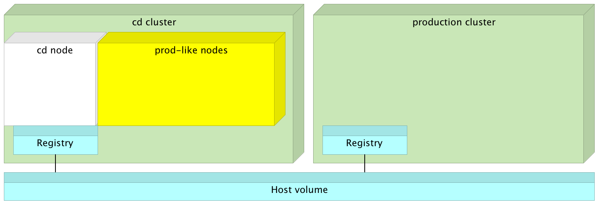

图 5-2：带标签节点的持续交付（CD）集群

现在我们有几个节点被标记为生产环境，我们可以创建只会在这些服务器上运行的服务。

让我们创建一个使用`alpine`镜像的服务，并将其约束到其中一个`prod-like`节点：

```
docker service create --name util \
    --constraint 'node.labels.env == prod-like' \
    alpine sleep 1000000000

```

我们可以列出`util`服务的进程，并确认它正在其中一个`prod-like`节点上运行：

```
docker service ps util

```

`service ps`命令的输出如下（为了简洁，ID 已被移除）：

```
NAME    IMAGE   NODE          DESIRED STATE  CURRENT STATE               
util.1  alpine  swarm-test-2  Running        Running about a minute ago

```

如你所见，服务正在`swarm-test-2`节点中运行，该节点被标记为`env=prod-like`。

这本身并不能证明标签起作用。毕竟，三个节点中有两个被标记为生产环境，所以如果标签不起作用，服务有 66%的概率会运行在其中一个节点上。那么，我们来稍微增加点难度。

我们将把实例数增加到六个：

```
docker service scale util=6

```

让我们来看看`util`进程：

```
docker service ps util

```

输出如下（为了简洁，ID 已被移除）：

```
NAME    IMAGE   NODE          DESIRED STATE  CURRENT STATE           
util.1  alpine  swarm-test-2  Running        Running 15 minutes ago
util.2  alpine  swarm-test-2  Running        Running 21 seconds ago
util.3  alpine  swarm-test-3  Running        Running 21 seconds ago
util.4  alpine  swarm-test-3  Running        Running 21 seconds ago
util.5  alpine  swarm-test-2  Running        Running 21 seconds ago
util.6  alpine  swarm-test-3  Running        Running 21 seconds ago

```

如你所见，所有六个实例都在标记为`env=prod-like`的节点上运行（`swarm-test-2`和`swarm-test-3`节点）。

如果我们在全局模式下运行服务，我们可以观察到类似的结果：

```
docker service create --name util-2 \
    --mode global \
    --constraint 'node.labels.env == prod-like' \
    alpine sleep 1000000000

```

让我们来看看`util-2`进程：

```
docker service ps util-2

```

输出如下（为了简洁，ID 已被移除）：

```
NAME      IMAGE         NODE         DESIRED STATE CURRENT STATE         
util-2... alpine:latest swarm-test-3 Running       Running 3 seconds ago
util-2... alpine:latest swarm-test-2 Running       Running 2 seconds ago

```

由于我们告诉 Docker 我们希望服务是全局性的，因此期望的状态是在所有节点上都处于`Running`状态。然而，由于我们指定了约束`node.labels.env == prod-like`，副本仅在与该约束匹配的节点上运行。换句话说，服务仅在节点`swarm-test-2`和`swarm-test-3`上运行。如果我们将标签添加到节点`swarm-test-1`，Swarm 也会在该节点上运行服务。

在继续之前，让我们删除`util`服务：

```
docker service rm util util-2

```

既然我们已经知道如何将服务限制到特定节点，我们必须在继续进行持续交付步骤之前先创建一个服务。

# 创建服务

在继续探索持续交付步骤之前，我们应该讨论一下 Docker Swarm 引入的部署变化。我们曾经认为每次发布意味着一次新的部署，但在 Docker Swarm 中并非如此。我们现在更新的是服务，而不是每次都进行部署。在构建 Docker 镜像后，我们所要做的就是更新已经运行的服务。在大多数情况下，我们所需要做的仅仅是运行`docker service update --image <IMAGE> <SERVICE_NAME>`命令。服务已经拥有它所需的所有信息，我们要做的就是将镜像更改为新版本。

为了使服务更新生效，我们需要有一个服务。我们需要创建它并确保它拥有所需的所有信息。换句话说，我们只需要创建一次服务，并在每次发布时进行更新。这大大简化了发布过程。

由于服务只创建一次，因此**投资回报率**（**ROI**）太低，我们不打算自动化这一步骤。记住，我们希望自动化的是那些需要做多次的过程。那些只做一次就不再做的事情是没有自动化价值的。其中之一就是服务的创建。我们仍然手动运行所有命令，所以请将此作为下一章的说明，下一章将自动化整个过程。

让我们创建构成*go-demo*应用程序的服务。我们需要`proxy`、`go-demo`服务以及随附的数据库。和之前一样，我们需要创建`go-demo`和`proxy`网络。由于我们已经做过几次了，我们将通过`scripts/dm-test-swarm-services.sh`（[`github.com/vfarcic/cloud-provisioning/blob/master/scripts/dm-test-swarm-services.sh`](https://github.com/vfarcic/cloud-provisioning/blob/master/scripts/dm-test-swarm-services.sh)）脚本运行所有命令。它几乎以与之前相同的方式创建服务。唯一的区别是，它使用`prod-like`标签将服务限制仅限于那些应该用于生产类似部署的节点。

```
scripts/dm-test-swarm-services.sh

eval $(docker-machine env swarm-test-1)

docker service ls

```

`service ls`命令的输出如下（为了简洁起见，已删除 ID）：

```
NAME       MODE       REPLICAS IMAGE
proxy      replicated 2/2      vfarcic/docker-flow-proxy:latest
go-demo    replicated 2/2      vfarcic/go-demo:1.0
go-demo-db replicated 1/1      mongo:3.2.10
registry   replicated 1/1      registry:2.5.0

```

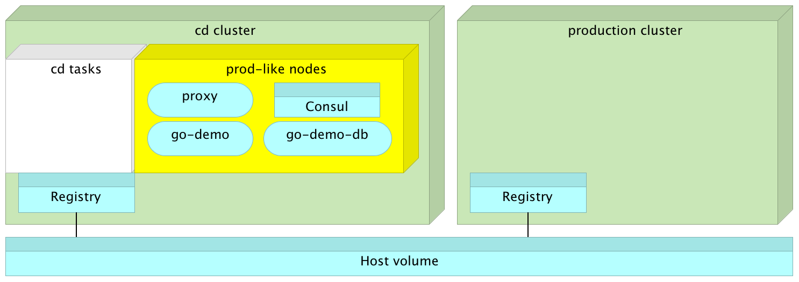

图 5-3：带有在标记为 prod-like 节点上运行的服务的 CD 集群

请注意，代理重新配置端口已设置为`8090`，并且在本地主机上。我们必须将其与我们在暂存环境中运行`go-demo`服务时将使用的`8080`端口区分开来。

一方面，我们希望生产环境类似集群中的服务与生产集群中的服务相似。另一方面，我们又不希望浪费资源去复制完整的生产环境。因此，我们运行了`proxy`和`go-demo`服务的两个实例（副本）。仅运行一个实例会偏离服务在生产环境中应扩展的目标。每个服务有两个实例，使我们能够测试扩展后的服务是否按预期工作。即便在生产环境中运行更多实例，两个副本也足以复制扩展行为。由于我们仍未能设置数据库复制，MongoDB 目前仅运行一个实例。

我们可以通过向`go-demo`发送请求来确认所有服务确实已成功创建和集成：

```
curl -i "$(docker-machine ip swarm-test-1)/demo/hello"

```

我们还将在生产集群中创建相同的服务。唯一的区别是副本数量（我们会有更多副本）以及我们不会限制它们。由于与之前的操作没有显著区别，我们将使用`scripts/dm-swarm-services.sh`（[`github.com/vfarcic/cloud-provisioning/blob/master/scripts/dm-swarm-services.sh`](https://github.com/vfarcic/cloud-provisioning/blob/master/scripts/dm-swarm-services.sh)）脚本来加速这个过程：

```
scripts/dm-swarm-services.sh

eval $(docker-machine env swarm-1)

docker service ls

```

`service ls`的输出如下（为了简洁，已移除 IDs）：

```
NAME       MODE       REPLICAS IMAGE
go-demo-db replicated 1/1      mongo:3.2.10
go-demo    replicated 3/3      vfarcic/go-demo:1.0
registry   replicated 1/1      registry:2.5.0
proxy      replicated 3/3      vfarcic/docker-flow-proxy:latest

```

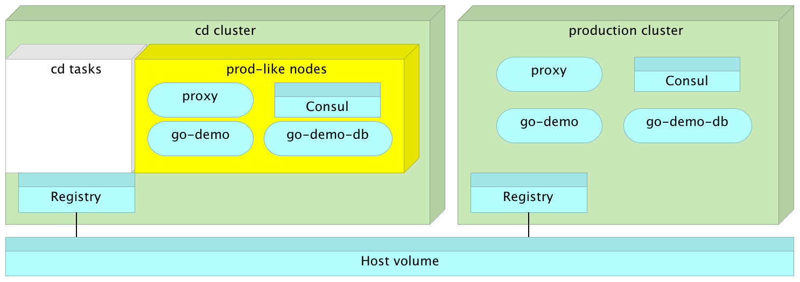

图 5-4：CD 和生产集群中的服务

现在我们已经在两个集群中创建了服务，可以开始进行持续交付步骤。

# 按照持续交付步骤进行操作

我们已经了解了连续交付过程所需的所有步骤。我们至少完成过一次每个步骤。在第一章《使用 Docker 容器进行持续集成》中，我们介绍了一些步骤。毕竟，持续交付是持续集成的“扩展”。如果持续集成有明确的目标，那它就是持续交付的样子。

我们在各章中完成了剩余的步骤，直到达到了这一点。我们知道如何在 Swarm 集群中创建服务，更重要的是，如何更新服务。因此，我不会详细讲解。可以将这一小节视为对我们到目前为止所做工作的一次回顾。

我们将首先检查一个我们希望通过 CD 流程迁移的服务的代码：

```
git clone https://github.com/vfarcic/go-demo.git

cd go-demo

```

接下来，我们应该运行`unit`测试并编译服务二进制文件：

```
eval $(docker-machine env swarm-test-1)

docker-compose \
    -f docker-compose-test-local.yml \
    run --rm unit

```

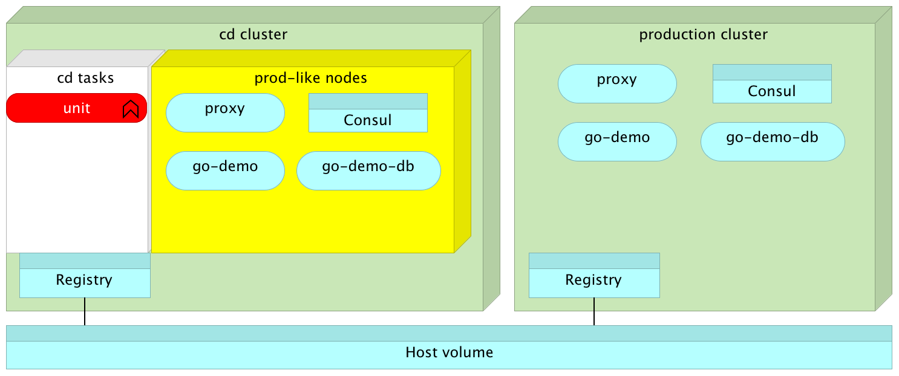

图 5-5：在 swarm-test-1 节点内运行单元测试

请注意，我们使用的是`swarm-test-1`节点。尽管它属于 Swarm 集群，但我们以“传统”模式使用它。

编译好二进制文件后，我们可以构建 Docker 镜像：

```
docker-compose \
    -f docker-compose-test-local.yml \
    build app

```

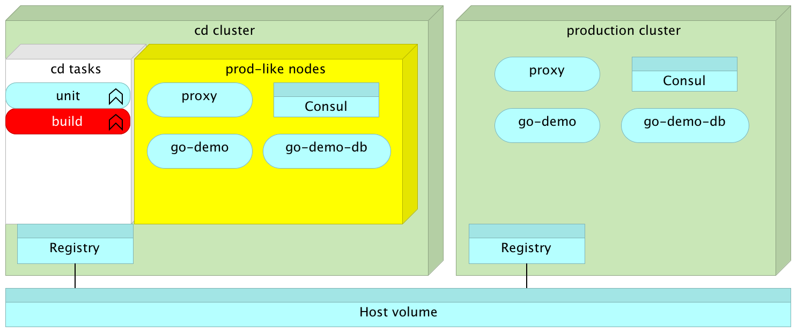

图 5-6：在 swarm-test-1 节点中运行的构建

构建了镜像后，我们可以运行 `staging` 依赖、功能测试，并在完成后销毁所有内容：

```
docker-compose \
    -f docker-compose-test-local.yml \
    up -d staging-dep

docker-compose \
    -f docker-compose-test-local.yml \
    run --rm staging

docker-compose \
    -f docker-compose-test-local.yml \
    down

```

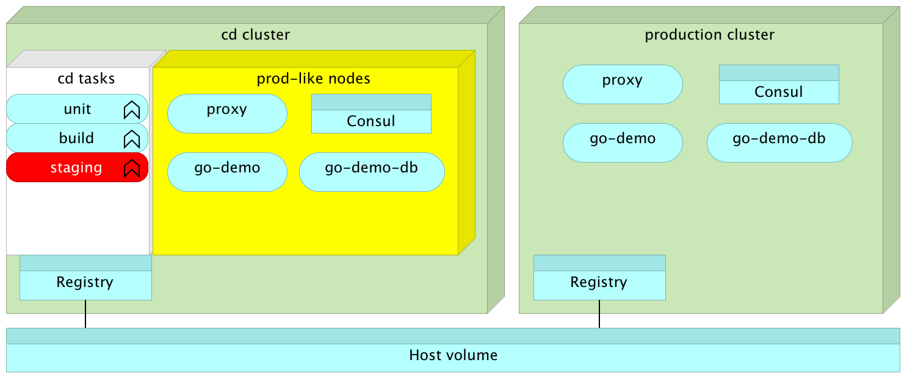

图 5-7：在 swarm-test-1 节点中运行的暂存或功能测试

现在我们有信心新版本很可能会按预期工作，我们可以将结果推送到注册表：

```
docker tag go-demo localhost:5000/go-demo:1.1

docker push localhost:5000/go-demo:1.1

```

我们运行了单元测试，构建了二进制文件，构建了镜像，运行了功能测试，并将镜像推送到注册表。这个版本很可能会按预期工作。然而，唯一真正的验证是该版本在生产环境中是否能正常工作。没有比这更可靠或更值得信赖的标准了。另一方面，我们希望尽可能有信心地进入生产环境。我们将通过使用尽可能接近生产环境的 `swarm-test` 集群来平衡这两者需求。

目前，`go-demo` 服务正在 `swarm-test` 集群中运行版本 1.0。我们可以通过观察 `service ps` 命令的输出确认这一点：

```
docker service ps go-demo -f desired-state=running

```

输出如下（为了简洁，已删除 ID）：

```
NAME      IMAGE               NODE         DESIRED STATE              
go-demo.1 vfarcic/go-demo:1.0 swarm-test-2 Running       
go-demo.2 vfarcic/go-demo:1.0 swarm-test-3 Running       
------------------------------------
CURRENT STATE
Running about an hour ago
Running about an hour ago 

```

让我们将当前正在运行的版本更新为我们刚刚构建的版本 1.1：

```
docker service update \
    --image=localhost:5000/go-demo:1.1 \
    go-demo

docker service ps go-demo -f desired-state=running

```

请注意，服务最初是通过 `--update-delay 5s` 参数创建的。这意味着每次更新将在每个副本集上持续五秒钟（加上一些时间来拉取镜像和初始化容器）。

经过片刻（大约 6 秒钟），`service ps` 命令的输出应如下所示（为了简洁，已删除 ID）：

```
NAME      IMAGE                      NODE         DESIRED STATE 
go-demo.1 localhost:5000/go-demo:1.1 swarm-test-3 Running       
go-demo.2 localhost:5000/go-demo:1.1 swarm-test-2 Running 
-----------------------------------
CURRENT STATE ERROR PORTS
Running 8 seconds ago
Running 2 seconds ago

```

如果你在笔记本电脑上的输出不同，请稍等片刻并重复 `service ps` 命令。

如你所见，镜像已经更改为 `localhost:5000/go-demo:1.1`，表明新版本确实已经启动并运行。

请注意，由于该服务是通过 `--constraint 'node.labels.env == prod-like'` 参数创建的，因此新的版本仍然仅在标记为 `prod-like` 的节点上运行。这显示了 Docker Swarm 提供的一个大优势。我们使用所有定义其完整行为的参数创建一个服务。从那时起，我们要做的就是在每次发布时更新镜像。稍后当我们开始扩展和进行其他操作时，事情会变得更复杂。然而，逻辑本质上还是一样的。我们需要的大多数参数仅在服务创建命令中定义一次。

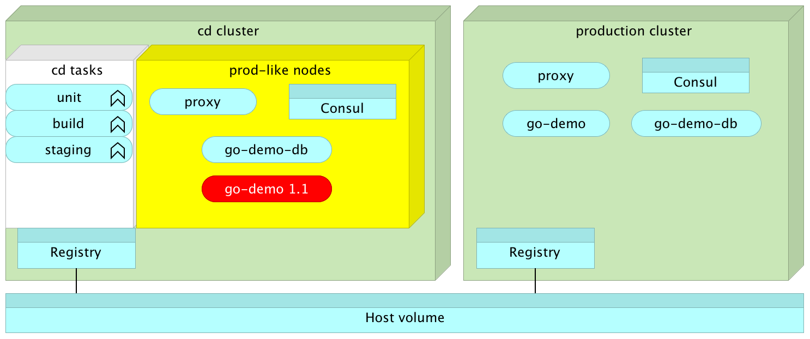

图 5-8：服务在 CD 集群中的 prod-like 节点内更新

现在我们已经准备好进行一些生产环境测试。我们仍然不够自信直接在生产环境中进行测试。首先，我们想看看它们在类似生产环境的集群中执行时是否能通过。

我们将像之前执行其他类型测试一样运行生产测试。我们的 Docker 客户端仍然指向`swarm-test-1`节点，因此我们通过 Docker Compose 运行的任何内容都会继续在该服务器内执行。

让我们快速查看`docker-compose-test-local.yml`文件中的生产服务定义（[`github.com/vfarcic/go-demo/blob/master/docker-compose-test-local.yml`](https://github.com/vfarcic/go-demo/blob/master/docker-compose-test-local.yml)）：

```
production:
  extends:
    service: unit
  environment:
    - HOST_IP=${HOST_IP}
  network_mode: host
  command: bash -c "go get -d -v -t && go test --tags integration -v"

```

`production` 服务`extends`了`unit`服务。这意味着它继承了`unit`服务的所有属性，从而避免了我们重复编写相同的内容。

接下来，我们将添加环境变量`HOST_IP`。我们即将运行的测试将使用该变量来推断正在测试的服务`go-demo`的地址。

最后，我们正在覆盖`unit`服务中使用的命令。新命令下载*go*依赖项`go get -d -v -t`并执行所有标记为集成测试的测试`go test --tags integration -v`。

让我们看看该服务是否确实在`swarm-test`集群中运行：

```
export HOST_IP=localhost

docker-compose \
    -f docker-compose-test-local.yml \
    run --rm production

```

我们指定了正在测试的服务的 IP 为 localhost。由于测试运行的节点`swarm-test-1`属于集群，入口网络将把请求转发到`proxy`服务，后者将请求转发给`go-demo`服务。

输出的最后几行如下：

```
PASS
ok      _/usr/src/myapp 0.019s

```

所有集成测试通过，整个操作花费不到 0.2 秒。

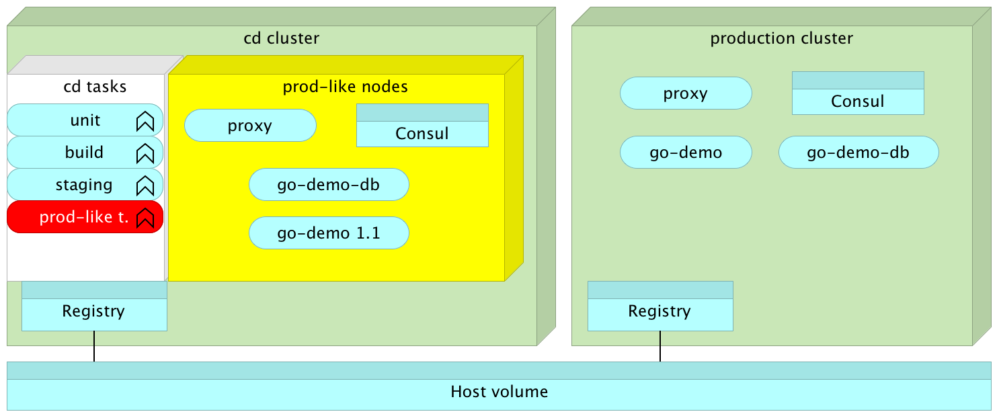

图 5-9：在 CD 集群中运行更新后的服务时执行生产测试

从现在开始，我们应该相当自信地认为发布已经准备好进入生产环境。我们已经进行了预部署单元测试，构建了镜像，运行了暂存测试，更新了生产环境类似的集群，并执行了一套集成测试。

我们的持续交付步骤已经正式完成。发布已准备好，等待有人做出决定来更新正在生产环境中运行的服务。换句话说，此时，持续交付已经完成，我们将等待有人按下按钮来更新生产集群中的服务。

现在没有理由停下。我们已经掌握了将此过程从持续交付转为持续部署所需的所有知识。我们所需要做的只是重复在生产集群中执行的最后几个命令。

# 从持续交付到持续部署的额外努力

如果我们有一套全面的测试，可以让我们确信每次提交到代码仓库的代码都按预期工作，并且有一个可重复和可靠的部署过程，那么就没有理由不走那一步，自动将每个发布版本部署到生产环境。

你可能选择不做持续部署（Continuous Deployment）。也许你的流程要求我们挑选特性。也许我们的营销部门希望新特性在他们的活动开始之前不可用。有很多理由可以选择停留在持续交付（Continuous Delivery）阶段。然而，从技术角度来看，流程是相同的。唯一的区别是，持续交付要求我们按下按钮将选定的版本发布到生产环境，而持续部署则作为相同自动化流程的一部分进行部署。换句话说，我们即将执行的步骤是相同的，只是中间是否有一个按钮而已。

这可能是本书中最短的子章节。我们只需要几个命令就能将持续交付流程转变为持续部署。我们需要更新生产集群中的服务（swarm），然后返回 `swarm-test-1` 节点，执行另一轮测试。由于我们已经做过这些，没必要再详细讲解。我们只需继续执行：

```
eval $(docker-machine env swarm-1)

docker service update \
    --image=localhost:5000/go-demo:1.1 \
    go-demo

```

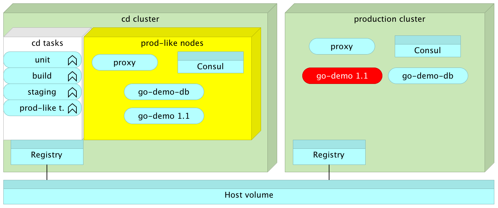

图 5-10：服务在生产集群内部更新

既然服务已经在生产集群中更新，我们可以执行最后一轮测试：

```
eval $(docker-machine env swarm-test-1)

export HOST_IP=$(docker-machine ip swarm-1)

docker-compose \
    -f docker-compose-test-local.yml \
    run --rm production

```

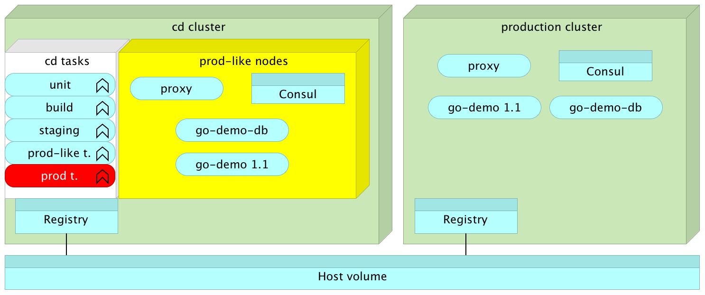

图 5-11：生产测试在生产集群内部更新的服务上执行

我们更新了生产集群中正在运行的版本，并进行了另一轮集成测试。没有出现失败，这表明新版本在生产环境中正确运行。

# 现在该做什么？

我们完成持续部署了吗？答案是否定的。我们没有创建自动化的持续部署流程，而是定义了帮助我们自动运行该流程的步骤。为了使整个过程完全自动化，并在每次提交时执行，我们需要使用其中一种 CD 工具。

我们将使用 Jenkins 将手动步骤转换为完全自动化的持续部署流程。为了使整个过程顺利进行，我们需要设置 Jenkins 主节点、一些代理节点以及部署流水线作业。

现在是休息一下的时候，再进入下一章。在开始之前，我们将销毁之前创建的机器并重新开始：

```
docker-machine rm -f \
    swarm-1 swarm-2 swarm-3 \
    swarm-test-1 swarm-test-2 swarm-test-3

```
