# 第六章：使用 Jenkins 自动化持续部署流程  

作为开发人员，我们最强大的工具就是自动化。  

-Scott Hanselman  

我们已经拥有了实现完全自动化持续部署流程所需的所有命令。现在我们需要一个工具，它可以监控代码库的变化，并在每次检测到提交时触发这些命令。  

市场上有大量的 CI/CD 工具。我们选择 Jenkins。并不意味着它是唯一的选择，也不是在所有使用场景中最好的选择。我不会对不同的工具进行比较，也不会提供更多的使用 Jenkins 的决策背后的细节。这将需要一个单独的章节，甚至是一本书。相反，我们将从讨论 Jenkins 的架构开始。  

# Jenkins 架构  

Jenkins 是一个基于主节点和代理的组合的单体应用程序。  

Jenkins 的主节点可以被描述为一个协调者。它监控源代码，当满足预定条件时触发任务，存储日志和工件，并执行与 CI/CD 协调相关的许多其他任务。它不执行实际任务，而是确保任务被执行。  

另一方面，Jenkins 代理执行实际的工作。当主节点触发任务执行时，实际的工作是由代理执行的。  

我们无法扩展 Jenkins 主节点。至少不能像我们扩展`go-demo`服务那样扩展它。我们可以创建多个 Jenkins 主节点，但它们不能共享相同的文件系统。由于 Jenkins 使用文件来存储其状态，创建多个实例会导致完全独立的应用程序。由于扩展的主要原因是容错性和性能收益，通过扩展 Jenkins 主节点无法实现这些目标。

如果 Jenkins 无法扩展，我们如何满足性能要求呢？我们通过添加代理来增加容量。一个主节点可以处理许多代理。在大多数情况下，一个代理是一个完整的服务器（物理或虚拟）。一个主节点拥有几十个甚至几百个代理（服务器）并不罕见。反过来，每个代理会运行多个执行器来运行任务。  

传统上，Jenkins 的主节点和代理会运行在专用服务器上。这本身就会带来一些问题。如果 Jenkins 运行在专用服务器上，当服务器出现故障时会发生什么？记住，一切都会有故障的时候。  

对于许多组织来说，Jenkins 是至关重要的。如果它不可用，就无法发布新版本，无法执行计划任务，无法部署软件，等等。通常，Jenkins 的故障会通过将软件及其状态文件移动到健康的服务器来修复。如果这是手动完成的，而且通常是手动的，那么停机时间可能会非常长。  

在本章中，我们将利用到目前为止获得的知识，尝试让 Jenkins 具备容错能力。我们可能无法实现零停机，但至少会尽力将停机时间缩短到最低。我们还将探讨如何应用所学知识，以几乎完全自动化的方式创建 Jenkins 主节点和代理。我们将尽力让主节点具备容错能力，代理则具备可扩展性和动态性。

够了，别再说了！让我们进入本章更实际的部分。

# 生产环境设置

我们将从重新创建上一章使用的生产集群开始。

本章中的所有命令都可以在 `06-jenkins.sh`  ([`gist.github.com/vfarcic/9f9995f90c6b8ce136376e38afb14588`](https://gist.github.com/vfarcic/9f9995f90c6b8ce136376e38afb14588)) Gist 中找到：

```
cd cloud-provisioning

git pull

scripts/dm-swarm.sh

```

我们进入了之前克隆的 `cloud-provisioning` 仓库并拉取了最新的代码。然后执行了创建生产集群的 `scripts/dm-swarm.sh`  ([`github.com/vfarcic/cloud-provisioning/blob/master/scripts/dm-swarm.sh`](https://github.com/vfarcic/cloud-provisioning/blob/master/scripts/dm-swarm.sh)) 脚本。这是我们在上一章中使用的相同脚本。

让我们确认集群确实已正确创建：

```
eval $(docker-machine env swarm-1)

docker node ls

```

`node ls` 命令的输出如下（为了简洁，ID 已删除）：

```
HOSTNAME  STATUS  AVAILABILITY  MANAGER STATUS
swarm-2   Ready   Active        Reachable
swarm-1   Ready   Active        Leader
swarm-3   Ready   Active        Reachable

```

现在生产集群已经启动并运行，我们可以创建 Jenkins 服务了。

# Jenkins 服务

传统上，我们会在自己的服务器上运行 Jenkins。即使我们选择与其他应用程序共享服务器资源，部署仍然是静态的。我们会运行一个 Jenkins 实例（无论是否使用 Docker），并希望它永不失败。这个方法的问题在于，每个应用程序迟早都会失败。要么进程会停止，要么整个节点会崩溃。不管怎样，Jenkins 和其他任何应用程序一样，都会在某个时刻停止工作。

问题在于，Jenkins 已经成为许多组织中的关键应用。如果我们将所有自动化的执行或更准确地说，触发过程移到 Jenkins 上，我们就创建了一个强依赖关系。如果 Jenkins 没有运行，我们的代码就不能构建、不能测试、不能部署。当然，当它失败时，你可以重新启动它。如果它运行的服务器停止工作，你可以将其部署到其他地方。假设停机发生在工作时间内，停机时间不会太长。从它停止工作到有人发现、通知其他人、有人重启应用程序或配置一个新服务器，可能会过去一个小时，也许两个小时，甚至更长时间。这算长时间吗？这取决于你的组织规模。依赖某个东西的人越多，那东西出现问题时的成本就越大。即使这样的停机时间及其带来的成本并不至关重要，我们已经掌握了所有知识和工具来避免这种情况。我们要做的只是创建另一个服务，让 Swarm 处理其余部分。

**Windows 用户请注意**

Git Bash 有改变文件系统路径的习惯。在运行代码块之前，请执行以下命令以防止这种情况：

`export MSYS_NO_PATHCONV=1`

让我们创建一个 Jenkins 服务。从 `cloud-provisioning` 目录中运行以下命令：

```
mkdir -p docker/jenkins

docker service create --name jenkins \
    -p 8082:8080 \
    -p 50000:50000 \ 
    -e JENKINS_OPTS="--prefix=/jenkins" \
    --mount "type=bind,source=$PWD/docker/jenkins,target=/var/ \
    jenkins_home"--reserve-memory 300m \
    jenkins:2.7.4-alpine

docker service ps jenkins

```

**Linux（例如：Ubuntu）用户请注意**

Docker Machine 会将主机的用户目录挂载到它创建的虚拟机中。这使我们能够共享文件。然而，这个功能在运行 Linux 的 Docker Machine 中无法使用。目前最简单的解决方法是去掉 `--mount` 参数。稍后，当我们达到持久存储时，你将看到如何更有效地挂载卷。

好消息是这个问题很快就会解决。请参阅 *issue #1376* ([`g`](https://github.com/docker/machine/issues/1376)[ithub.com/docker/machine/issues/1376](https://github.com/docker/machine/issues/1376)) 以了解讨论情况。一旦 *pull request #2122* ([`github.com/docker/machine/pull/2122`](https://github.com/docker/machine/pull/2122)) 被合并，你将能够在 Linux 上使用自动挂载功能。

Jenkins 将其状态存储在文件系统中。因此，我们首先在主机上创建了一个目录 `mkdir`。它将用作 Jenkins 的主目录。由于我们位于主机用户的子目录之一，`docker/jenkins` 目录被挂载到我们创建的所有机器上。

接下来，我们创建了服务。它将内部端口 `8080` 映射为 `8082`，并且映射端口 `50000`。第一个端口用于访问 Jenkins UI，第二个用于主节点与代理节点的通信。我们还定义了 URL 前缀 `as/jenkins` 并挂载了 `jenkins` 主目录。最后，我们保留了 `300m` 的内存。

一旦镜像下载完成，`service ps` 命令的输出如下（为了简洁，删除了 ID）：

```
NAME      IMAGE                NODE    DESIRED STATE CURRENT STATE          
jenkins.1 jenkins:2.7.4-alpine swarm-1 Running       Running 52 seconds ago

```

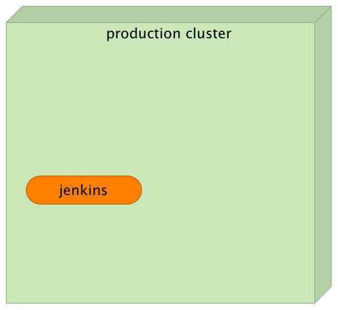

图 6-1：带有 Jenkins 服务的生产集群

Jenkins 2 改变了设置流程。以前的版本允许我们在没有任何强制配置的情况下运行，但新版 Jenkins 强制我们手动执行一些步骤。不幸的是，在撰写本文时，尚无好的 API 来帮助我们自动化这个过程。尽管有一些 *技巧* 可以使用，但与它们带来的额外复杂性相比，得到的好处并不高。毕竟，我们只会设置 Jenkins 一次，所以没有很大的动力去自动化这个过程（至少在创建配置 API 之前）。

让我们打开 UI：

```
open "http://$(docker-machine ip swarm-1):8082/jenkins"

```

**Windows 用户注意**

Git Bash 可能无法使用 open 命令。如果是这种情况，可以执行 `docker-machine ip <SERVER_NAME>` 来找出机器的 IP 地址，并直接在你选择的浏览器中打开该 URL。例如，上述命令应该替换为以下命令：

`docker-machine ip swarm-1`

如果输出是 `1.2.3.4`，你应该在浏览器中打开 `http://1.2.3.4:8082/jenkins`。

你首先会注意到，系统要求你输入管理员密码。许多企业用户要求增强安全性。因此，Jenkins 不再允许在没有初始化会话的情况下访问。如果你是 Jenkins 新手，或者至少是 *版本 2* 的用户，你可能会想知道密码是什么。它会输出到日志中（在我们的案例中是 `stdout`），也会输出到文件 `secrets/initialAdminPassword` 中，该文件会在设置过程结束时被删除。

让我们查看 `secrets/initialAdminPassword` 文件的内容：

```
cat docker/jenkins/secrets/initialAdminPassword

```

输出将是一个表示临时密码的 `long` 字符串。请复制它，返回到 UI，粘贴到管理员密码字段中，然后点击继续按钮：

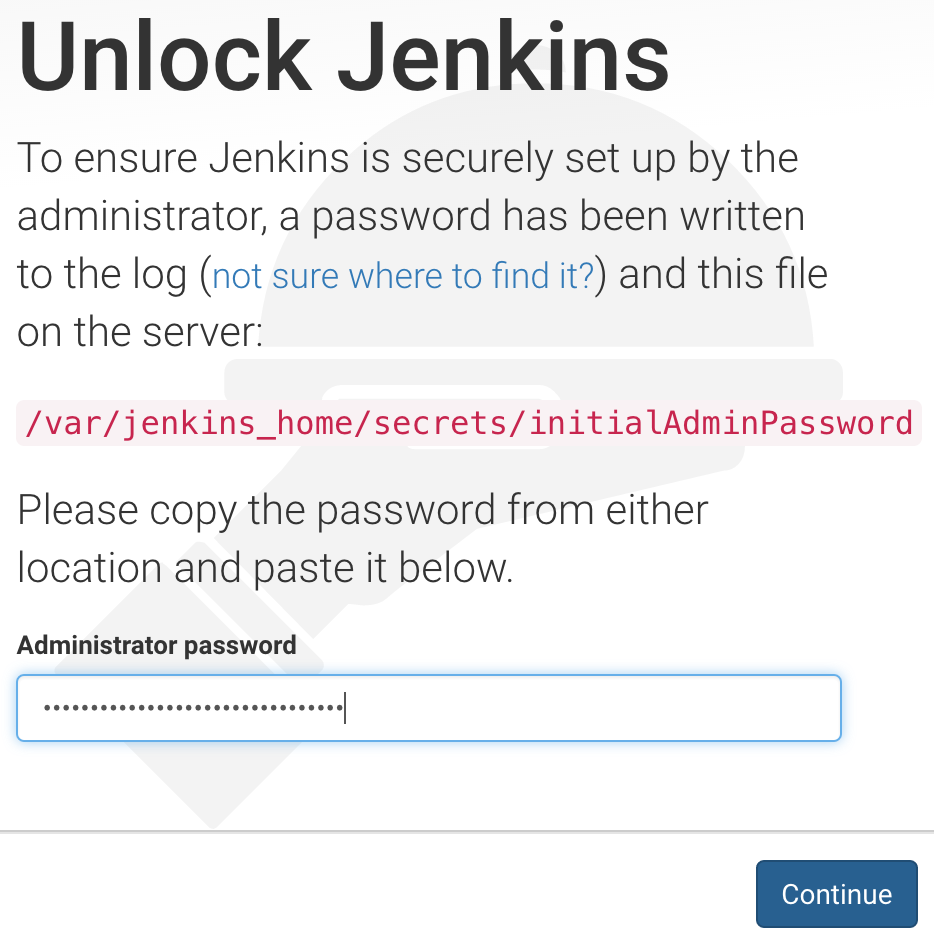

图 6-2：解锁 Jenkins 界面

解锁 Jenkins 后，你将看到一个选项，可以安装建议的插件或选择符合你需求的插件。推荐的插件适用于大多数常用场景，因此我们选择该选项。

请点击安装建议插件按钮。

一旦插件被下载并安装，我们将看到一个界面，允许我们创建第一个管理员用户。请将 `admin` 用作用户名和密码。可以自由填写其余字段的任何值。完成后，点击 `Save and Finish` 按钮：

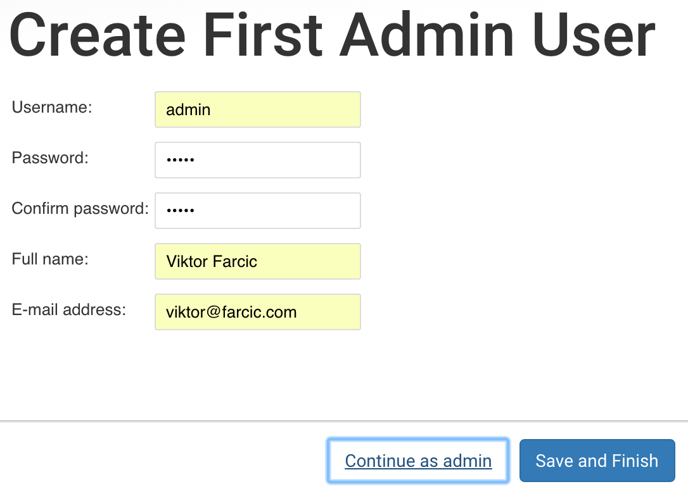

图 6-3：创建第一个管理员用户界面

Jenkins 已经准备好了。现在剩下的，就是点击 `Start using Jenkins` 按钮。

现在我们可以测试 Jenkins 的故障转移是否有效。

# Jenkins 故障转移

让我们停止服务并观察 Swarm 的运行情况。为此，我们需要找出它运行的节点，将 Docker 客户端指向该节点，然后删除容器：

```
NODE=$(docker service ps \
    -f desired-state=running jenkins \
    | tail -n +2 | awk '{print $4}')

eval $(docker-machine env $NODE)

docker rm -f $(docker ps -qa \
    -f label=com.docker.swarm.service.name=jenkins)

```

我们列出了 Jenkins 进程并应用了过滤器，返回状态为运行的进程 `docker service ps -f desired-state=running jenkins`。输出通过 `tail` 命令进行管道处理，去除了头部 `tail -n +2`，然后再次通过 `awk` 命令将输出限制为第四列 `awk '{print $4}'`，该列包含进程运行的节点。最终结果存储在 `NODE` 变量中。

后来，我们使用了 `eval` 命令来创建环境变量，这些变量将由我们的 Docker 客户端用于操作远程引擎。最后，我们通过 `ps` 和 `rm` 命令的组合来获取镜像 ID 并删除容器。

正如我们在前面的章节中已经学到的，如果一个容器失败，Swarm 会在集群内的某个地方重新启动它。当我们创建服务时，我们告诉 Swarm 期望的状态是运行一个实例，Swarm 正在尽最大努力确保我们的期望得到满足。

让我们确认服务确实正在运行：

```
docker service ps jenkins

```

如果 Swarm 决定在另一个节点上重新运行 Jenkins，可能需要一些时间来拉取镜像。稍等片刻后，`service ps` 命令的输出应如下所示：

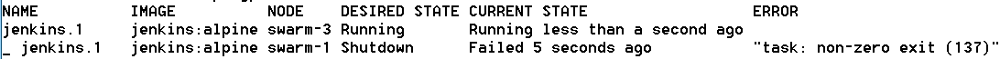

我们可以通过重新打开 UI 来做最终确认：

```
open "http://$(docker-machine ip swarm-1):8082/jenkins"

```

**Windows 用户注意事项**

Git Bash 可能无法使用 `open` 命令。如果是这种情况，请执行 `docker-machine ip <SERVER_NAME>` 来查找机器的 IP 地址，并直接在您选择的浏览器中打开 URL。例如，上面的命令应替换为以下命令：

`docker-machine ip swarm-1`

如果输出是 `1.2.3.4`，您应该在浏览器中打开 `http://1.2.3.4:8082/jenkins`。

由于 Jenkins 不允许未经身份验证的用户访问，您需要登录。请使用 `admin` 作为用户名和密码。

您会注意到，这次我们不需要重复设置过程。尽管在另一个节点上运行了一个全新的 Jenkins 镜像，但由于我们挂载的主机目录，状态仍然得以保留。

我们成功地使 Jenkins 容错，但未能使其在没有任何停机时间的情况下运行。由于其架构，Jenkins 主节点无法扩展。因此，当我们通过删除容器来模拟故障时，并没有第二个实例来吸收流量。即使 Swarm 将其重新调度到另一个节点，也会有一些停机时间。在短时间内，服务无法访问。虽然这不是一个完美的情况，但我们尽量将停机时间降到了最低。我们使其具有容错能力，但无法实现零停机运行。考虑到其架构，我们已经尽了最大努力。

现在是时候连接运行我们持续部署流程的 Jenkins 代理了。

# Jenkins 代理

运行 Jenkins 代理的方式有很多种。大多数方法的问题在于它们迫使我们通过 Jenkins UI 单独添加代理。我们将不再逐个添加代理，而是尝试利用 Docker Swarm 的能力来扩展服务。

实现可扩展代理的一个方法是 Jenkins Swarm 插件 ([`wiki.jenkins-ci.org/display/JENKINS/Swarm+Plugin`](https://wiki.jenkins-ci.org/display/JENKINS/Swarm+Plugin))。在你开始得出错误结论之前，我必须声明，这个插件与 Docker Swarm 没有任何关系。它们唯一的共同点就是名字中都包含 "Swarm"。

Jenkins Swarm 插件 ([`wiki.jenkins-ci.org/display/JENKINS/Swarm+Plugin`](https://wiki.jenkins-ci.org/display/JENKINS/Swarm+Plugin)) 允许我们自动发现附近的主节点并自动加入它们。我们将仅用于第二个功能。我们将创建一个 Docker Swarm 服务，作为 Jenkins 代理并自动加入主节点。

首先，我们需要安装插件。

请按照以下代码所示打开插件管理器页面：

```
open "http://$(docker-machine ip swarm-1):8082/jenkins/pluginManager/available"

```

**Windows 用户须知**

Git Bash 可能无法使用 open 命令。如果是这种情况，请执行 `docker-machine ip <SERVER_NAME>` 来查找机器的 IP，并直接在你选择的浏览器中打开该 URL。例如，以上命令应替换为以下命令：

`docker-machine ip swarm-1`

如果输出是 `1.2.3.4`，你应该在浏览器中打开 `http://1.2.3.4:8082/jenkins/pluginManager/available`。

接下来，我们需要搜索 *Self-Organizing Swarm Plug-in Modules 插件*。最简单的方法是将插件名称输入到屏幕右上角的筛选框中。一旦找到该插件，请选择它并点击 `Install without restart` 按钮。

现在插件已安装，我们可以设置第二个集群，它将由三个节点组成。如前所述，我们将其命名为 `swarm-test`。我们将使用脚本 `scripts/dm-test-swarm-2.sh` （[`github.com/vfarcic/cloud-provisioning/blob/master/scripts/dm-test-swarm-2.sh`](https://github.com/vfarcic/cloud-provisioning/blob/master/scripts/dm-test-swarm-2.sh)）运行所有创建机器并将其加入集群所需的命令。

```
scripts/dm-test-swarm-2.sh

eval $(docker-machine env swarm-test-1)

docker node ls

```

`node ls` 命令的输出如下（为了简洁，ID 已被移除）：

```
HOSTNAME      STATUS  AVAILABILITY  MANAGER STATUS
swarm-test-2  Ready   Active        Reachable
swarm-test-1  Ready   Active        Leader
swarm-test-3  Ready   Active        Reachable

```

我们刚才运行的脚本和之前使用的 `dm-test-swarm.sh` 脚本之间的主要区别在于，这个脚本添加了一些标签。第一个节点被标记为 `jenkins-agent`，而其他两个节点则标记为 `prod-like`。这些标签的目的是区分用于运行诸如构建和测试 `jenkins-agent` 等任务的节点和用于运行模拟生产环境服务的节点 `prod-like`。

让我们检查一下 `swarm-test-1` 节点：

```
eval $(docker-machine env swarm-test-1)

docker node inspect swarm-test-1 --pretty

```

输出如下：

```
ID:             3rznbsuvvkw4wf7f4qa32cla3
Labels:
 - env = jenkins-agent
Hostname:           swarm-test-1
Joined at:          2017-01-22 08:30:26.757026595 +0000 utc
Status:
 State:         Ready
 Availability:      Active
Manager Status:
 Address:           192.168.99.103:2377
 Raft Status:       Reachable
 Leader:            Yes
Platform:
 Operating System:      linux
 Architecture:      x86_64
Resources:
 CPUs:          1
 Memory:            492.5 MiB
Plugins:
  Network:          bridge, host, null, overlay
  Volume:           local
Engine Version:     1.13.0
Engine Labels:
 - provider = virtualbox

```

如你所见，这个节点有一个标签，键为`env`，值为`jenkins-agent`。如果你检查其他两个节点，你会看到它们也有标签，但这次值为`prod-like`：

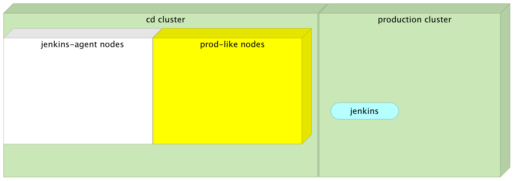

图 6-4：创建第一个管理员用户界面

现在`swarm-test`集群已经设置好，我们准备创建 Jenkins 代理服务。但是，在此之前，让我们快速查看一下我们将要使用的镜像定义。`vfarcic/jenkins-swarm-agent Dockerfile`（[`github.com/vfarcic/docker-jenkins-slave-dind/blob/master/Dockerfile`](https://github.com/vfarcic/docker-jenkins-slave-dind/blob/master/Dockerfile)）如下：

```
FROM docker:1.12.1

MAINTAINER Viktor Farcic <viktor@farcic.com>

ENV SWARM_CLIENT_VERSION 2.2
ENV DOCKER_COMPOSE_VERSION 1.8.0
ENV COMMAND_OPTIONS ""

RUN adduser -G root -D jenkins
RUN apk --update add openjdk8-jre python py-pip git

RUN wget -q https://repo.jenkins-ci.org/releases/org/jenkins-ci/plugins/swarm-client/ \
${SWARM_CLIENT_VERSION}/swarm-client-${SWARM_CLIENT_VERSION}-jar-with- \
dependencies.jar -P /home/jenkins/
RUN pip install docker-compose

COPY run.sh /run.sh
RUN chmod +x /run.sh

CMD ["/run.sh"]

```

它以`docker`作为基础镜像，接着定义了一些环境变量，指定将安装的软件版本。由于 Jenkins 作为`jenkins user`运行，我们也添加了它。然后是 OpenJDK、Python 和 pip 的安装。JDK 是 Jenkins Swarm 客户端所需的，其它的则是为了支持 Docker Compose。所有先决条件设置完毕后，我们下载 Swarm JAR 文件，并使用 pip 安装 Docker Compose。

最后，我们复制了`run.sh`脚本（[`github.com/vfarcic/docker-jenkins-slave-dind/blob/master/run.sh`](https://github.com/vfarcic/docker-jenkins-slave-dind/blob/master/run.sh)），设置其可执行权限，并定义运行命令来执行它。该脚本使用 Java 来运行 Jenkins Swarm 客户端。

在继续 Jenkins 代理服务之前，我们需要在每个代理将运行的主机上创建`/workspace`目录。目前，只有`swarm-test-1`节点符合条件。很快你就会明白为什么我们需要这个目录：

```
docker-machine ssh swarm-test-1

sudo mkdir /workspace && sudo chmod 777 /workspace && exit

```

我们进入了节点`swarm-test-1`，创建了目录，赋予它完全权限，然后退出了机器。

了解了`vfarcic/jenkins-swarm-agent`镜像（或者至少知道它包含什么）后，我们可以继续创建服务：

**Windows 用户注意事项**

为了使接下来的命令中的挂载工作，你需要停止 Git Bash 修改文件系统路径。按如下方式设置这个环境变量：

`export MSYS_NO_PATHCONV=1`

```
export USER=admin

export PASSWORD=admin

docker service create --name jenkins-agent \
    -e COMMAND_OPTIONS="-master \
    http://$(docker-machine ip swarm-1):8082/jenkins \
    -username $USER -password $PASSWORD \
    -labels 'docker' -executors 5" \
    --mode global \
    --constraint 'node.labels.env == jenkins-agent' \
    --mount \
    "type=bind,source=/var/run/docker.sock,target=/var/run/docker.sock" \
    --mount \
    "type=bind,source=$HOME/.docker/machine/machines,target=/machines" \
    --mount "type=bind,source=/workspace,target=/workspace" \
    vfarcic/jenkins-swarm-agent

```

这次的`service create`命令比我们通常使用的要长一些。`COMMAND_OPTIONS`环境变量包含了代理连接到主节点所需的所有信息。我们指定了`master -master http://$(docker-machine ip swarm-1):8082/jenkins`的地址，定义了`username`和`password` `-username $USER -password $PASSWORD`，为代理打上了`docker`标签 `-labels 'docker'`，并设置了执行器数量 `-executors 5`。

接下来，我们将服务声明为全局并限制在`jenkins-agent`节点上运行。这意味着它将运行在每个具有匹配标签的节点上。目前，只有一台服务器符合条件。很快我们就会看到这种设置所带来的好处。

我们挂载了 Docker 套接字。结果，发送到容器内运行的 Docker 客户端的任何命令将会对主机上的 Docker 引擎（在此情况下为 Docker Machine）执行。这样，我们就可以避免运行 `Docker inside Docker` 或 `DinD` 可能带来的陷阱。欲了解更多信息，请阅读文章《使用 Docker-in-Docker 作为 CI 或测试环境？三思而后行》([`jpetazzo.github.io/2015/09/03/do-not-use-docker-in-`](http://jpetazzo.github.io/2015/09/03/do-not-use-docker-in-docker-for-ci/)[docker-for-ci/](http://jpetazzo.github.io/2015/09/03/do-not-use-docker-in-docker-for-ci/))。

我们还挂载了包含密钥的主机（笔记本电脑）目录。这样，我们就可以向运行在另一个集群中的引擎发送请求。最终挂载将主机目录 `/workspace` 映射到容器内。所有在 Jenkins 代理中运行的构建将使用该目录：

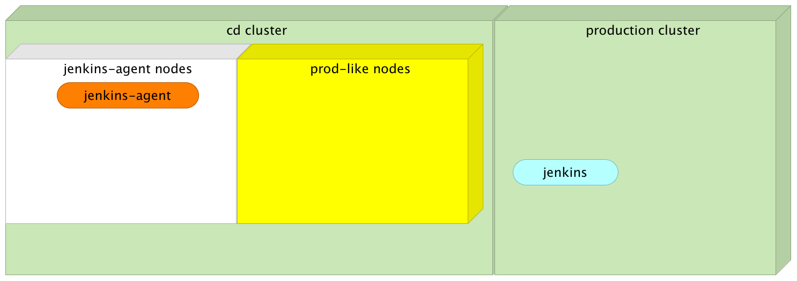

图 6-5：作为全局服务运行的 Jenkins 代理

让我们看一下服务进程：

```
docker service ps jenkins-agent

```

输出如下（为简洁起见，已移除 ID）：

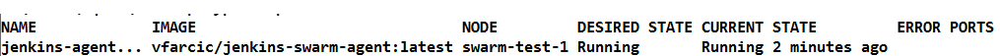

如您所见，服务是全局性的，因此期望的状态是它在每个节点上运行。然而，由于我们将其限制到带有 `jenkins-agent` 标签的节点，因此容器仅在那些具有匹配标签的节点中运行。换句话说，服务仅在 `jenkins-agent` 节点上运行。

让我们打开显示已注册代理的 Jenkins 界面：

```
open "http://$(docker-machine ip swarm-1):8082/jenkins/computer/"

```

**Windows 用户注意事项**

Git Bash 可能无法使用 `open` 命令。如果是这种情况，执行 `docker-machine ip <SERVER_NAME>` 来查找机器的 IP 地址，并直接在您选择的浏览器中打开该 URL。例如，上面的命令应替换为以下命令：

`docker-machine ip swarm-1`

如果输出为 `1.2.3.4`，则应该在浏览器中打开 `http://1.2.3.4:8082/jenkins/computer`。

如您所见，已经注册了两个代理。主代理默认与每个 Jenkins 实例一起运行。在我的机器上，作为 `jenkins-agent` 服务运行的代理被标识为 `e0961f7c1801-d9bf7835`：

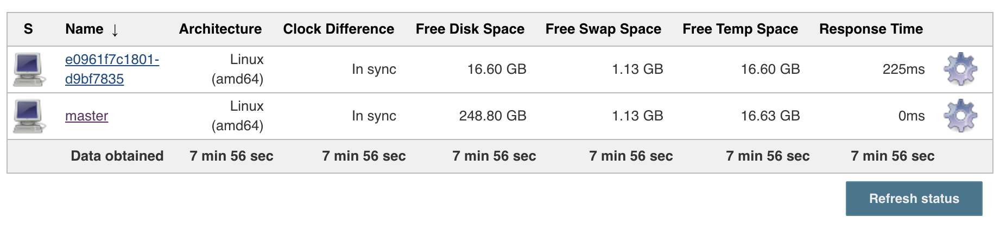

图 6-6：Jenkins Swarm 代理添加到主节点

由于我们使用标签将服务限制到 `swarm-test-1` 节点，目前只有一个代理被注册（除了主节点，在大多数情况下不应使用它）。

代理配置为使用五个执行器。这意味着可以并行执行五个构建。请注意，在这种情况下，执行器的数量被人为设定得很高。每台机器只有一个 CPU。如果没有其他信息，我可能会将执行器的数量设置为与 CPU 数量相同。这只是基本的计算，随时间变化而改变。如果我们通过这些执行器运行的任务需要大量 CPU，我们可能会降低执行器的数量。但是，对于本练习来说，五个执行器应该*可以*。我们只有一个服务，所以我们不会并行运行构建。

假设这是一个真实系统，有更多构建并行运行比执行器数量多的情况。在这种情况下，一些构建将排队等待执行器完成并释放资源。如果这是一个暂时的情况，我们不需要做任何事情。正在执行的构建将结束，释放资源，并运行排队的构建。然而，如果这是一个经常发生的情况，排队构建的数量可能会开始增加，并且一切都会放慢。既然我们已经确定速度是持续集成、交付和部署过程中的关键因素，当事情开始变得阻碍时，我们需要采取措施。在这种情况下，这种措施就是增加可用的执行器，从而增加代理的数量。

假设我们达到了限制并且需要增加代理的数量。了解全局 Swarm 服务的工作原理，我们只需创建一个新节点：

```
docker-machine create -d virtualbox swarm-test-4

docker-machine ssh swarm-test-4

sudo mkdir /workspace && sudo chmod 777 /workspace && exit

TOKEN=$(docker swarm join-token -q worker)

eval $(docker-machine env swarm-test-4)

docker swarm join \
    --token $TOKEN \
    --advertise-addr $(docker-machine ip swarm-test-4) \
    $(docker-machine ip swarm-test-1):2377

```

我们创建了`swarm-test-4`节点，并在其中创建了`/workspace`目录。然后我们获取了令牌并将新创建的服务加入集群作为工作节点。

让我们确认新节点确实已添加到集群中：

```
eval $(docker-machine env swarm-test-1)

docker node ls

```

`node ls`命令的输出如下（为简洁起见已删除 ID）：

```
HOSTNAME      STATUS  AVAILABILITY  MANAGER STATUS
swarm-test-3  Ready   Active        Reachable
swarm-test-2  Ready   Active        Reachable
swarm-test-1  Ready   Active        Leader
swarm-test-4  Ready   Active

```

Jenkins 代理是否正在新创建的节点内运行？让我们来看看：

```
docker service ps jenkins-agent

```

`service ps`命令的输出如下（为简洁起见已删除 ID）：

```
NAME             IMAGE                              NODE         
jenkins-agent... vfarcic/jenkins-swarm-agent:latest swarm-test-1  
---------------------------------------- DESIRED STATE CURRENT STATE ERROR PORTS
Running       Running

```

由于节点未标记为`jenkins-agent`，因此代理未在`swarm-test-4`服务器内运行。

让我们添加标签：

```
docker node update \
    --label-add env=jenkins-agent \
    swarm-test-4

docker service ps jenkins-agent

```

这次输出略有不同（为简洁起见已删除 ID）：

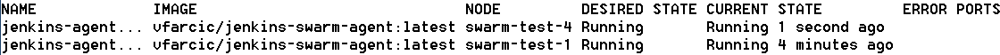

Swarm 检测到新标签，运行容器，并将状态更改为运行中。

让我们回到列出连接代理的 Jenkins 界面：

```
open "http://$(docker-machine ip swarm-1):8082/jenkins/computer"

```

**Windows 用户注意**

Git Bash 可能无法使用打开命令。如果是这样，请执行以下命令来查找机器的 IP 并直接在您选择的浏览器中打开 URL。例如，上面的命令应替换为以下命令：

`docker-machine ip swarm-1`

如果输出为`1.2.3.4`，您应在浏览器中打开`http://1.2.3.4:8082/jenkins/computer`。

正如您所见，新代理 b76e943ffe6c-d9bf7835 已添加到列表中：

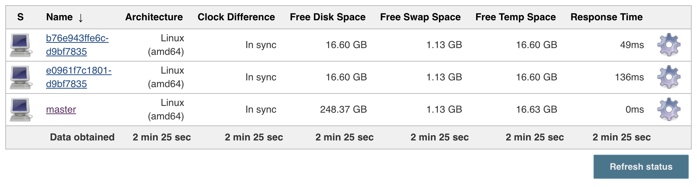

图 6-7：第二个 Jenkins Swarm 代理已添加到主节点

这很简单，不是吗？通常我们不仅需要创建一个新服务器，还需要运行代理并通过 UI 将其添加到 Jenkins 配置中。通过结合 *Jenkins Swarm* 插件和 *Docker Swarm* 全局服务，我们成功地自动化了大多数步骤。我们需要做的就是创建一个新节点，并将其添加到 Swarm 集群中。

在我们继续并通过 Jenkins 自动化持续部署流程之前，我们应该在生产和类生产环境中创建服务。

# 在生产和类生产环境中创建服务

由于服务仅在首次创建时添加，并且每当其某些方面发生变化（例如：新的镜像与新版本一起发布）时才会更新，因此没有强烈的动力将服务创建加入到持续部署流中。我们得到的只是增加复杂性而没有实际的好处。因此，我们将手动创建所有服务，之后再讨论如何在每次新版本发布时自动触发该流程。

我们已经创建了 `go-demo`、`go-demo-db`、`proxy`、`jenkins` 和 `registry` 服务很多次，因此我们将跳过解释并运行 `scripts/dm-swarm-services-2.sh` ([`github.com/vfarcic/cloud-provisioning/blob/master/scripts/dm-swarm-services-2.sh`](https://github.com/vfarcic/cloud-provisioning/blob/master/scripts/dm-swarm-services-2.sh))，该脚本将重新创建我们在前几章中遇到的情况：

```
scripts/dm-swarm-services-2.sh

eval $(docker-machine env swarm-1)

docker service ls

```

`service ls` 命令的输出如下（为了简洁，已移除 ID）：

```
NAME       MODE       REPLICAS IMAGE
go-demo    replicated 3/3      vfarcic/go-demo:1.0
jenkins    replicated 1/1      jenkins:2.7.4-alpine
go-demo-db replicated 1/1      mongo:3.2.10
registry   replicated 1/1      registry:2.5.0
proxy      replicated 3/3      vfarcic/docker-flow-proxy:latest

```

所有服务都在运行。我们现在运行的脚本与之前使用的脚本 `scripts/dm-swarm-services.sh` ([`github.com/vfarcic/cloud-provisioning/blob/master/scripts/dm-swarm-services.sh`](https://github.com/vfarcic/cloud-provisioning/blob/master/scripts/dm-swarm-services.sh)) 唯一的不同之处是，这次我们加入了 `registry`。

现在生产环境已经启动并运行，我们来在 `swarm-test` 集群中创建相同的服务集。由于这个集群在生产环境类环境中与 Jenkins 代理共享，我们将把服务限制在 `prod-like` 节点上。

与生产集群一样，我们将通过脚本来运行这些服务。这次我们将使用 `scripts/dm-test-swarm-services-2.sh` ([`github.com/vfarcic/cloud-provisioning/blob/master/scripts/dm-test-swarm-services-2.sh`](https://github.com/vfarcic/cloud-provisioning/blob/master/scripts/dm-test-swarm-services-2.sh))：

```
scripts/dm-test-swarm-services-2.sh

eval $(docker-machine env swarm-test-1)

docker service ls

```

`service ls` 命令的输出如下（为了简洁，已移除 ID）：

```
NAME          MODE       REPLICAS IMAGE
jenkins-agent global     2/2      vfarcic/jenkins-swarm-agent:latest
registry      replicated 1/1      registry:2.5.0
go-demo       replicated 2/2      vfarcic/go-demo:1.0
proxy         replicated 2/2      vfarcic/docker-flow-proxy:latest
go-demo-db    replicated 1/1      mongo:3.2.10

```

现在，服务已经在生产环境和类生产环境中运行，我们可以继续讨论我们将如何通过 Jenkins 实现 CD 流程自动化的方法。

# 使用 Jenkins 自动化持续部署流程

Jenkins 基于插件。几乎每个功能都是一个插件。如果我们需要使用 Git，有一个插件。如果我们想使用 Active Directory 进行身份验证，也有一个插件。你明白了，几乎所有东西都是插件。而且，大多数插件是由社区创建并维护的。当我们不确定如何完成某个任务时，*插件目录*（[`wiki.jenkins-ci.org/display/JENKINS/Plugins`](https://wiki.jenkins-ci.org/display/JENKINS/Plugins)）通常是我们开始查找的第一个地方。

有超过 `1200` 个插件可供选择，难怪在如此多样化的插件面前，大多数用户都不得不使用插件来完成几乎所有类型的任务。Jenkins 的老手们会创建一个 Freestyle 作业，举个例子，它会克隆代码并构建二进制文件。然后是另一个作业来运行单元测试，再一个来运行功能测试，依此类推。所有这些 Freestyle 作业都会连接起来。当第一个完成时，它会调用第二个，第二个会调用第三个，以此类推。Freestyle 作业促使了大量插件的使用。

我们会选择一个适合特定任务的插件，填写一些字段，然后点击保存。这样的做法使我们能够自动化步骤，而无需了解不同工具的工作原理。需要执行一些 Gradle 任务？只需选择 Gradle 插件，填写几个字段，然后开始吧。

这种基于大量使用插件的方法可能会带来灾难。理解自动化及其背后的工具至关重要。此外，使用 *Freestyle* 作业违背了我们行业中的一个基本原则。所有内容都应该存储在代码仓库中，经过代码审查、版本控制，等等。没有充分的理由说明编码实践不适用于自动化代码。

我们将采取一种不同的方法。

我坚信，形成 CI/CD Pipeline 的步骤应该在像 Jenkins 这样的工具之外进行指定。我们应该能够在没有 CI/CD 工具的情况下定义所有命令，并且一旦我们确信一切按预期工作，就可以将这些命令转化为 CI/CD 友好的格式。换句话说，自动化是第一步，CI/CD 工具是后续的。

幸运的是，最近 Jenkins 引入了一个新的概念——*Jenkins Pipeline*。与通过 Jenkins UI 定义的 *Freestyle* 作业不同，*Pipeline* 允许我们将 CD 流程定义为代码。由于我们已经有了一套良好定义的命令，转换为 *Jenkins Pipeline* 应该是相对简单的。

让我们来试试看。

# 创建 Jenkins Pipeline 作业

我们将从定义一些环境变量开始。声明这些变量的原因是，我们希望有一个集中存储关键信息的地方。这样，当某些内容发生变化时（例如：集群入口点），我们只需修改一个或两个变量，变化就会传递到所有作业中。

我们开始吧。首先，我们需要打开 Jenkins 的全局配置页面：

```
open "http://$(docker-machine ip swarm-1):8082/jenkins/configure"

```

**Windows 用户注意：**

Git Bash 可能无法使用 open 命令。如果是这种情况，请执行 `docker-machine ip <SERVER_NAME>` 来找出机器的 IP，并直接在你选择的浏览器中打开该 URL。例如，前面的命令应替换为以下命令：

`docker-machine ip swarm-1` 如果输出是 `1.2.3.4`，你应该在浏览器中打开 `http://1.2.3.4:8082/jenkins/configure`。

进入配置页面后，请勾选“Environment variables”复选框，然后点击“Add”按钮。你将看到 Name 和 Value 字段。我们将首先添加一个变量来存储生产 IP。但在输入之前，我们需要先查找它。路由网格将请求从任何节点重定向到目标服务，或者更确切地说，重定向到暴露与请求相同端口的服务。因此，我们可以使用生产集群`swarm`中的任何服务器作为我们的入口点。

要获取某个节点的 IP，我们可以使用 `docker-machine ip` 命令：

```
docker-machine ip swarm-1

```

结果会因情况而异。在我的笔记本电脑上，输出如下：

```
192.168.99.107

```

请复制 IP 并返回 Jenkins 配置页面。在 Name 字段中输入`PROD_IP`，并将 IP 粘贴到 Value 字段中。值得注意的是，我们刚刚引入了单点故障。如果`swarm-1`节点出现故障，所有使用该变量的作业也会失败。好消息是，我们可以通过更改这个环境变量的值来快速修复它。坏消息是，我们能做得更好，但不能通过 Docker 机器做到。如果我们使用 AWS，例如，我们可以利用弹性 IP。然而，我们还没有进入 AWS 章节，所以目前更改变量是最好的选择。

接下来，我们应添加另一个变量，表示生产节点的名称。我们稍后将看到这个变量的使用。现在，请创建一个新变量，Name 为`PROD_NAME`，Value 为`swarm-1`。

我们还需要为生产类集群`swarm-test`创建类似的变量。请分别输入变量`PROD_LIKE_IP`，值为`swarm-test-1`节点的 IP（`docker-machine ip swarm-test-1`），以及`PROD_LIKE_NAME`，值为`swarm-test-1`：

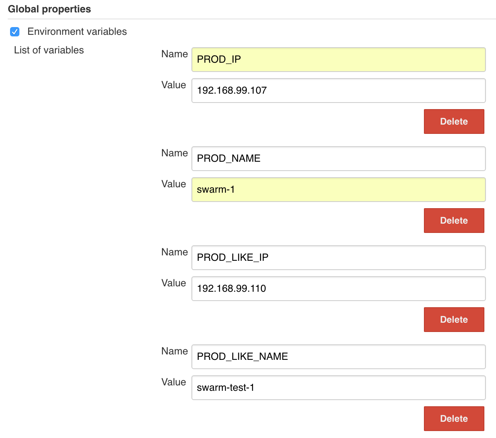

图 6-8：配置了环境变量的 Jenkins 全局配置页面

完成环境变量的设置后，请点击“Save”按钮。

现在环境变量已经定义完成，我们可以继续创建一个 Jenkins Pipeline 作业，用于自动化执行我们练习过的 CD 步骤。

为了创建新的作业，请点击左侧菜单中的“New Item”链接，输入`go-demo`作为项目名称，选择 Pipeline，然后点击 OK 按钮。

一个 Jenkins Pipeline 定义包含三个主要层次：node、stage 和 step。我们将通过逐一讲解这些层次来定义 go-demo Pipeline 代码。

# 定义 Pipeline 节点

在 Jenkins Pipeline DSL 中，*node* 是一个步骤，它通常通过请求代理上的可用执行器来完成两项任务。

节点通过将其中包含的步骤添加到 Jenkins 构建队列中来调度这些步骤。这样，当节点上的执行器槽位空闲时，相应的步骤就会被执行。

它还创建了一个工作空间，意味着一个特定于某个作业的文件目录，在这个目录中，资源密集型处理可以发生，而不会对你的 Pipeline 性能产生负面影响。节点创建的工作空间在节点声明中的所有步骤执行完成后会自动被删除。最佳实践是将所有实际工作（如构建或运行 shell 脚本）都放在节点内进行，因为阶段中的节点块告诉 Jenkins 其中的步骤是资源密集型的，足以进行调度，向代理池请求帮助，并仅在需要时锁定工作空间。

如果节点的定义让你感到困惑，可以把它理解为执行步骤的地方。它指定了一个服务器（代理），该服务器将执行任务。这个指定可以是服务器的名称（通常不是一个好主意，因为节点配置与代理的紧密耦合），也可以是一组标签，这些标签必须与代理中设置的标签匹配。如果你还记得我们用来启动 Jenkins Swarm 代理服务的命令，你会记得我们使用了`-labels docker`作为命令选项之一。由于 Docker 引擎和 Compose 是我们需要的唯一可执行文件，所以这就是我们作为节点规范所需的唯一标签。

请将以下代码输入到 go-demo 作业配置的 Pipeline 脚本字段中，并按下保存按钮：

```
node("docker") {
}

```

我们刚刚写了 Pipeline 的第一次迭代。现在让我们运行它。

请点击 "立即构建" 按钮。

作业开始运行并显示了消息，表示该 Pipeline 已成功运行，但没有定义任何阶段*。* 我们马上会更正这一点。现在，让我们看一下日志：

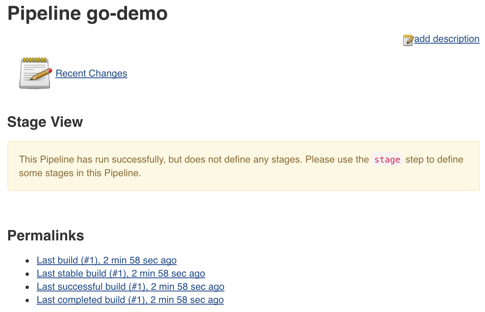

图 6-9：Jenkins Pipeline 作业的第一次构建

你可以通过点击构建号旁边的球形图标访问日志，在这种情况下是 *#1*。你也可以从位于屏幕左侧的 *构建历史* 小部件中访问构建记录。

输出结果如下：

```
Started by user admin
[Pipeline] node
Running on be61529c010a-d9bf7835 in /workspace/go-demo
[Pipeline] {
[Pipeline] }
[Pipeline] // node
[Pipeline] End of Pipeline
Finished: SUCCESS

```

在这次构建中，变化不大。Jenkins 解析了节点定义，并决定使用代理`be61529c010a-d9bf7835`（两个 Jenkins Swarm 服务实例之一），并在 `/workspace/go-demo` 目录中运行步骤。目录结构很简单。所有由构建生成的文件都位于一个与作业名称匹配的目录中。在本例中，目录名为 `go-demo`。

由于我们没有在节点内部指定任何步骤，Pipeline 几乎立即完成执行，结果是成功的。让我们通过添加阶段来稍微增加一点复杂度。

# 定义 Pipeline 阶段

**阶段**是执行任何任务的逻辑上不同部分，具有用于锁定、排序和标记其所属流程的参数。流水线语法通常由阶段组成。每个阶段步骤可以包含一个或多个构建步骤。在阶段内工作是一种最佳实践，因为它们通过为流水线提供逻辑划分来帮助组织工作，并且因为 Jenkins 流水线可视化功能将阶段显示为流水线的独特部分。

使用手动命令练习的流程阶段是什么？我们可以将定义的命令分成以下几组：

1.  从仓库拉取最新代码。

1.  运行单元测试并构建服务和 Docker 镜像。

1.  部署到预备环境并运行测试。

1.  对 Docker 镜像打标签并将其推送到注册表。

1.  使用最新镜像更新运行在类生产环境中的服务并运行测试。

1.  使用最新镜像更新运行在生产环境中的服务并运行测试。

当这些任务组被转换为流水线阶段时，节点内的代码如下：

```
stage("Pull") {
}

stage("Unit") {
}

stage("Staging") {
}

stage("Publish") {
}

stage("Prod-like") {
}

stage("Production") {
}

```

我们应该将之前定义的节点与这些阶段结合起来。更确切地说，它们都应该在节点块内定义。

请通过复制并粘贴来替换现有的流水线定义，从`scripts/go-demo-stages.groovy` ([`github.com/vfarcic/cloud-provisioning/blob/master/scripts/go-demo-stages.groovy`](https://github.com/vfarcic/cloud-provisioning/blob/master/scripts/go-demo-stages.groovy)) 中访问作业配置，您可以通过位于屏幕顶部的面包屑内的 go-demo 链接访问主作业页面。一旦进入主作业页面，请点击左侧菜单中的“配置”按钮。完成编写或粘贴新的流水线定义后，请保存并通过点击“立即构建”按钮重新运行作业。

我们仍然没有执行任何操作。但是，这次，阶段视图屏幕更加详细。它显示了我们之前定义的阶段：

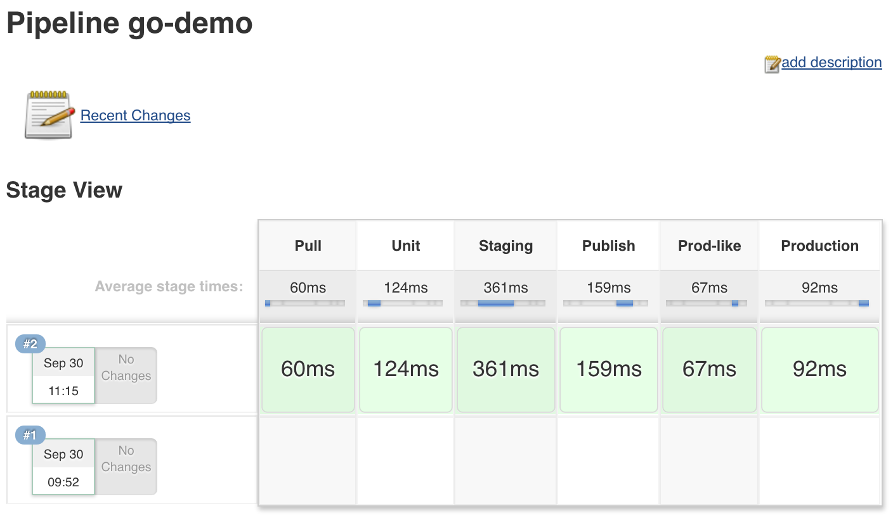

图 6-10：Jenkins 流水线阶段视图屏幕

现在我们准备定义将在每个阶段内执行的步骤。

# 定义流水线步骤

在我们开始编写步骤之前，我必须简要提到人们用于定义 Jenkins 作业的几种不同方法。有些人喜欢充分利用 Jenkins 插件。当这种方法被推向极致时，每个操作都通过插件执行。需要运行一些 Gradle 任务吗？有一个 Gradle 插件（或两个）。需要使用 Docker 做些什么？大约有十几个 Docker 插件。用 Ansible 进行配置管理呢？也有一个插件。

我不认为过度依赖插件是件好事。我相信我们应该能够在没有 Jenkins 的情况下完成大部分甚至全部自动化。毕竟，使用一个插件来避免我们写一行命令，合理吗？我不认为这是必要的。这并不意味着我们不应该使用插件。我们应该使用插件，但只在它们带来了实际且可触及的附加价值时。例如 Git 插件。它判断代码是需要克隆还是拉取。它管理身份验证。它提供了一些可以与其他步骤结合使用的自动填充环境变量。

我们是否总是应该使用 Git 插件？我们不应该。假设我们只需要在已经克隆的仓库中执行一个简单的拉取操作，且不需要身份验证，并且在后续步骤中不会使用一些拉取信息（例如：提交 ID）。在这种情况下，最简单的解决方案可能是最好的选择。从 Git 仓库中拉取代码的最简单方法是什么？最有可能的就是通过 Shell 执行 `git pull` 命令。

只有当我们了解自己在做什么，并且该过程是以与 CI/CD 工具无关的方式完成时，我们才应该继续并通过 Jenkins（或者您选择的任何工具）将其整合在一起。这样，我们不仅从纯自动化的角度理解过程，还能在工具、过程和架构的选择上把握清楚。所有部分需要以有机且高效的方式协同工作。如果我们能够做到这一点，那么 Jenkins 就像是把所有部分结合起来的胶水，而不是我们开始时的基础。

让我们定义第一阶段所需的步骤。目标非常简单，就是从 Git 仓库中获取代码。为了稍微增加一些复杂度，我们可能需要克隆或拉取代码。第一次构建时没有任何内容，所以我们必须进行克隆。所有后续的构建只应当执行拉取操作，拉取已经克隆的代码。虽然编写一个执行该逻辑的脚本相对简单，但这是一个很好的使用 Jenkins 插件的案例。更具体地说，我们将使用 Jenkins Pipeline 步骤 git，它在后台使用了其中一个 Git 插件。

Pipeline 中的 `Pull` 阶段如下所示：

```
stage("Pull") { \
  git "https://github.com/vfarcic/go-demo.git" \
}

```

git 步骤是通过 Pipeline **领域特定语言** (**DSL**) 提供的众多步骤之一。它会克隆代码。如果该操作已经完成，代码将会被拉取。您可以在 *Pipeline 步骤参考* 页面（[`jenkins.io/doc/pipeline/steps/`](https://jenkins.io/doc/pipeline/steps/)）中找到更多信息。

请注意，在实际情况中，我们会在代码仓库中创建一个 webhook。当有新的提交时，它会触发此作业。现在，我们将通过手动触发作业执行来模拟一个 webhook。

请随意通过复制并粘贴来自 `scripts/go-demo-pull.groovy` ([`github.com/vfarcic/cloud-provisioning/blob/master/scripts/go-demo-pull.groovy`](https://github.com/vfarcic/cloud-provisioning/blob/master/scripts/go-demo-pull.groovy)) 的代码来替换现有的流水线定义。完成后，请运行作业并观察构建日志。

继续前进。

以下代码是我们在前几章中用于运行单元测试并构建新 Docker 镜像的命令翻译：

```
withEnv([
  "COMPOSE_FILE=docker-compose-test-local.yml"
]) {

  stage("Unit") {
    sh "docker-compose run --rm unit"
    sh "docker-compose build app"
  }

}

```

我们将整个阶段包含在 `withEnv` 块中，定义了 `COMPOSE_FILE` 变量。这样，我们就不需要每次执行 `docker-compose` 时都重复 `-f docker-compose-test-local.yml` 参数。请注意，我们稍后定义的所有其他阶段也应该包含在 `withEnv` 块中。

单元阶段中的步骤与我们手动运行流程时练习的步骤相同。唯一的不同是，这次我们将命令放入了`sh DSL`步骤中。其目的很简单，就是运行一个 shell 命令。

我们将跳过运行作业，直接进入下一阶段：

```
stage("Staging") {
try {
    sh "docker-compose up -d staging-dep"
    sh "docker-compose run --rm staging"
} catch(e) {
    error "Staging failed"
  } finally {
    sh "docker-compose down"
  }
}

```

Staging 阶段稍微复杂一些。命令位于 `try/catch/finally` 块中。这样做的原因是由于 Jenkins 在出现故障时的行为。如果前一个单元阶段中的某个步骤失败，整个流水线构建将会中止。这对于没有额外操作要执行的情况很适合。但是，在 Staging 阶段，我们希望删除所有的依赖容器并释放资源供其他用途。换句话说，无论 Staging 测试的结果如何，都应该执行 `docker-compose down`。如果你是程序员，可能已经知道 `finally` 语句会在 `try` 语句是否产生错误时都被执行。在我们的情况下，`finally` 语句将关闭所有构成此 Docker Compose 项目的容器。

接下来是 `发布` 阶段：

```
stage("Publish") {
  sh "docker tag go-demo \
    localhost:5000/go-demo:2.${env.BUILD_NUMBER}"
  sh "docker push \
    localhost:5000/go-demo:2.${env.BUILD_NUMBER}"
}

```

这个阶段没有什么神秘的。我们重复在前几章中执行的相同命令。镜像被标记并推送到注册表。

请注意，我们使用 `BUILD_NUMBER` 为标签提供唯一的发布号。它是 Jenkins 内置的环境变量之一，保存当前正在执行的构建 ID 的值。

`生产环境类似` 阶段会带来一个额外的注意事项。具体如下：

```
stage("Prod-like") {
  withEnv([
     "DOCKER_TLS_VERIFY=1",
     "DOCKER_HOST=tcp://${env.PROD_LIKE_IP}:2376",
     "DOCKER_CERT_PATH=/machines/${env.PROD_LIKE_NAME}"
]) {
    sh "docker service update \
      --image localhost:5000/go-demo:2.${env.BUILD_NUMBER} \
      go-demo"
}
withEnv(["HOST_IP=localhost"]) { 
     for (i = 0; i <10; i++) {
      sh "docker-compose run --rm production"
    }
  }
}

```

由于我们使用滚动更新来将旧版本替换为新版本，因此必须在整个过程中运行测试。我们可以创建一个脚本来验证所有实例是否已更新，但我想保持简单（这次）。相反，我们将测试运行十次。根据测试的平均时长和更新所有实例所需的时间，你可能需要根据实际情况做一些调整。为了演示的目的，在`生产环境类似`的环境中进行十轮测试应该足够了。

总结一下，在这一阶段，我们正在使用新版本更新服务，并在更新过程中运行十轮测试。

请注意，我们声明了一些额外的环境变量。具体来说，我们定义了所有连接到远程主机上运行的 Docker 引擎所需的环境变量。

我们快完成了。现在服务已经在`production-like`环境中进行了测试，我们可以将其部署到生产集群中。

`Prod`阶段几乎与`Prod-like`相同：

```
stage("Production") {
  withEnv([
    "DOCKER_TLS_VERIFY=1",
    "DOCKER_HOST=tcp://${env.PROD_IP}:2376",
    "DOCKER_CERT_PATH=/machines/${env.PROD_NAME}"
]) {
   sh "docker service update \
    --image localhost:5000/go-demo:2.${env.BUILD_NUMBER} \
    go-demo"
 }
 withEnv(["HOST_IP=${env.PROD_IP}"]) {
   for (i = 0; i <10; i++) { 
     sh "docker-compose run --rm production"
   }
 }
}

```

唯一的区别是，这次，`DOCKER_HOST`和`PROD_IP`变量指向生产集群中的一台服务器。其余部分与`Prod-like`阶段相同。

随意用`scripts/go-demo.groovy`中的代码替换现有的 Pipeline 定义。完成后，请运行作业并查看构建日志。

稍等片刻，作业将完成执行，新的版本将在生产集群中运行：

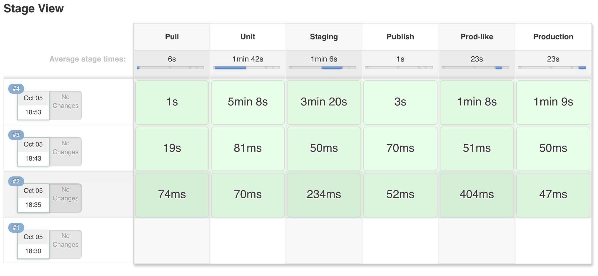

图 6-11：Jenkins Pipeline 阶段视图屏幕

我们可以通过执行`service ps`命令来确认使用新版本的服务更新确实成功：

```
eval $(docker-machine env swarm-1)

docker service ps go-demo

```

`service ps`命令的输出如下（为简洁起见，ID 已被移除）：

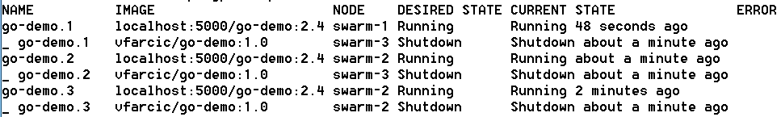

就是这样！我们已经拥有了一个完整的持续部署 Pipeline，运行顺利。如果我们为托管代码的 GitHub 仓库添加一个 Webhook，Pipeline 将在每次提交新代码时运行。因此，新的版本将被部署到生产环境，除非 Pipeline 中的某个步骤失败。

# 现在怎么办？

使用代码定义持续部署流程步骤的能力，比之前使用*Freestyle*作业时给我们带来了更多的灵活性。Docker Compose 让我们可以运行任何类型的任务，而无需设置任何特殊的基础设施。只要在容器内，任何东西都能运行。最后，Docker Swarm 大大简化了生产环境和类似生产环境的部署。

我们仅仅触及了使用 Jenkins Pipeline 来自动化持续部署流程的表面。我们还可以做出相当多的改进。例如，我们可以使用*Pipeline Shared Groovy Libraries Plugin* ([`wiki.jenkins-ci.org/display/JENKINS/Pipeline+Shared+Groovy+Libraries+Plugin`](https://wiki.jenkins-ci.org/display/JENKINS/Pipeline+Shared+Groovy+Libraries+Plugin))，将步骤，甚至整个阶段移动到函数中，从而减少代码重复。我们还可以创建一个*Jenkinsfile* ([`jenkins.io/doc/book/pipeline/jenkinsfile/`](https://jenkins.io/doc/book/pipeline/jenkinsfile/))，将 Pipeline 定义从 Jenkins 移动到服务仓库中，从而将与单个服务相关的所有内容保存在一个地方。我们还可以持续运行生产测试（不仅仅是在发布新版本时），确保在服务无法正常工作或表现不符合预期时收到通知。

我们将把这些以及其他可能的改进留到以后再做。虽然它不是完美的，也不是最优的，但 go-demo 流水线现在应该足够用了。

在深入下一章之前，是时候休息一下了。如同之前一样，我们将销毁已创建的机器并重新开始：

```
docker-machine rm -f \
    swarm-1 swarm-2 swarm-3 \
    swarm-test-1 swarm-test-2 \ 
    swarm-test-3 swarm-test-4 

```
