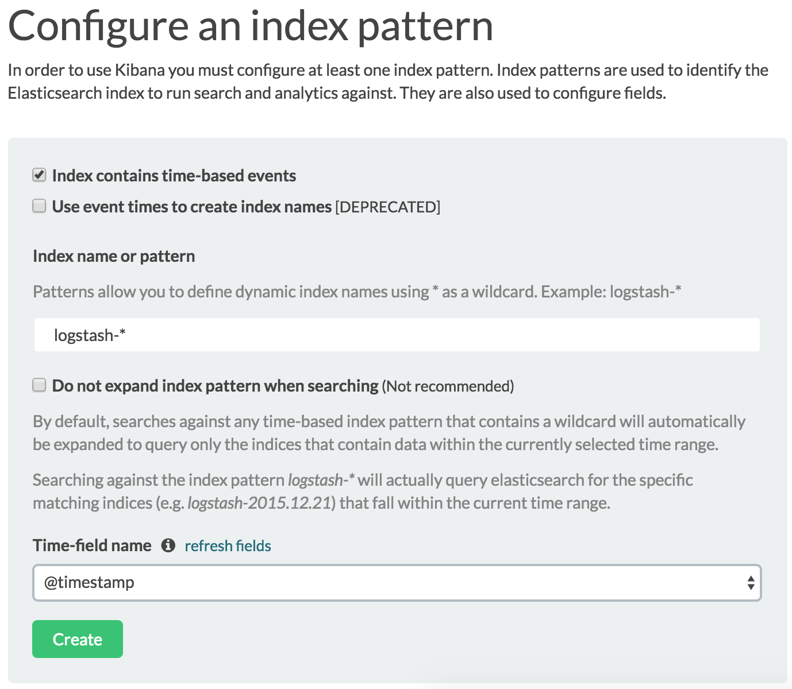
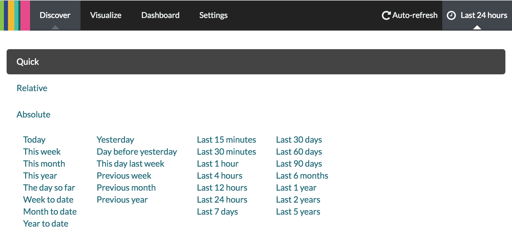
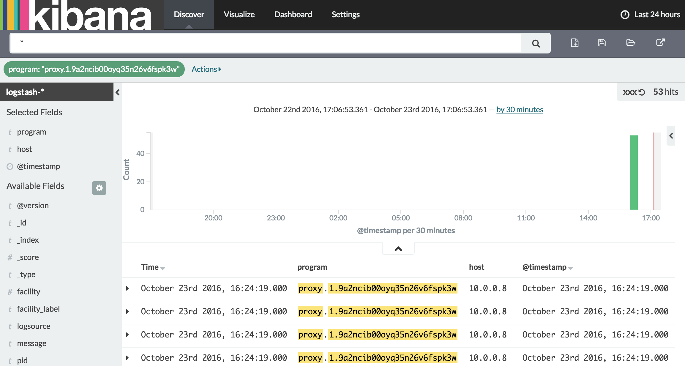

# 第九章：定义日志策略

今天的大多数软件就像埃及金字塔一样，数百万块砖头堆叠在一起，毫无结构性，只是靠蛮力和成千上万的奴隶完成的。

–艾伦·凯

我们已经达到了拥有一个完全运行的 Swarm 集群和一个定义好的持续部署管道的阶段，管道会在每次提交时更新我们的服务。现在，我们可以专注于编写代码并推送提交到我们的代码库，知道其余的流程是自动化的。我们最终可以将时间花在对组织真正有价值的任务上。我们可以把时间投入到为我们所工作的服务开发新功能。然而，当发生问题时，我们需要停止开发新功能并调查问题。

我们在发现问题时通常做的第一件事是查看日志。日志并不是我们调试问题时唯一能用的数据来源。我们还需要大量的指标（下一章会详细讲解）。然而，即使日志不是唯一需要查看的内容，它们通常是一个很好的起点。

**《The DevOps 2.0 Toolkit》读者的提示**

以下内容与《The DevOps 2.0 Toolkit》一书中的内容相同。如果它仍然记忆犹新，可以直接跳到*设置 LogStash 和 ElasticSearch 作为日志数据库*（`#logging-es`）子章节。自从我编写了*2.0*版本后，我发现了一些更好的处理日志的方法，特别是在 Swarm 集群内部。

我们对 DevOps 实践和工具的探索引导我们走向了集群化和扩展。因此，我们开发了一种系统，使我们能够以简单高效的方式将服务部署到集群中。结果是，集群内的容器数量不断增加，这些容器可能运行在多台服务器上。

监控一个服务器很简单，但在单台服务器上监控多个服务会带来一些困难。在多台服务器上监控多个服务需要全新的思维方式和一套新的工具。随着你开始拥抱微服务、容器和集群，创建的服务及其实例数量将迅速增加。对于构成集群的服务器而言，也是如此。我们不能再像以前那样登录到一个节点并查看日志了，因为日志实在是太多了。而且，它们分布在多个服务器上。昨天我们可能在单台服务器上部署了两个实例的服务，但明天我们可能会在六台服务器上部署八个实例。

我们需要系统的历史信息和（近）实时信息。这些信息可以是日志、硬件利用率、健康检查、网络流量等多种形式。存储历史数据的需求并不新鲜，早已在使用中。然而，信息传输的方向随着时间发生了变化。过去，大多数解决方案依赖于集中式数据收集器，而今天，由于服务和服务器的动态特性，我们倾向于将其去中心化。

我们对集群日志和监控的需求是一个结合了去中心化数据收集器的系统，这些收集器将信息发送到一个集中式的解析服务和数据存储。有许多专门设计用于满足这一需求的产品，从本地解决方案到云解决方案应有尽有。*FluentD* ([`www.fluentd.org/`](http://www.fluentd.org/))、*Loggly* ([`www.loggly.com/`](https://www.loggly.com/))、*GrayLog* ([`www.graylog.org/`](https://www.graylog.org/))、*Splunk* ([`www.splunk.com/`](http://www.splunk.com/)) 和 *DataDog* ([`www.datadoghq.com/`](https://www.datadoghq.com/)) 只是我们可以使用的一些解决方案。我选择通过 ELK 堆栈来展示这些概念（*ElasticSearch* ([`www.elastic.co/products/elasticsearch`](https://www.elastic.co/products/elasticsearch))、*LogStash* ([`www.elastic.co/products/logstash`](https://www.elastic.co/products/logstash)) 和 *Kibana* ([`www.elastic.co/products/kibana`](https://www.elastic.co/products/kibana))）。该堆栈的优势在于它是免费的、文档完善、高效且广泛使用。*ElasticSearch* ([`www.elastic.co/products/elasticsearch`](https://www.elastic.co/products/elasticsearch)) 已经证明自己是实时搜索和分析的最佳数据库之一。它是分布式的、可扩展的、高可用的，并提供了一个复杂的 API。*LogStash* ([`www.elastic.co/products/logstash`](https://www.elastic.co/products/logstash)) 让我们能够集中处理数据。它可以轻松扩展到自定义数据格式，并提供了许多插件，几乎可以满足任何需求。最后，*Kibana* ([`www.elastic.co/products/kibana`](https://www.elastic.co/products/kibana)) 是一个分析和可视化平台，具有直观的界面，基于 ElasticSearch。

我们将使用 ELK 堆栈并不意味着它比其他解决方案更好。一切都取决于特定的使用场景和需求。我将通过 ELK 堆栈的集中式日志和监控原则向您展示。一旦理解了这些原则，您应该能够轻松地将其应用到其他堆栈中，若您选择这样做的话。

我们调换了事务的顺序，并在讨论集中式日志需求之前就选择了工具。让我们来纠正这个问题。

# 集中式日志的需求

在大多数情况下，日志消息是写入文件的。这并不是说文件是唯一的方式，或者是存储日志最有效的方式。然而，由于大多数团队以某种形式使用基于文件的日志，因此暂时假设你也是如此。如果是这样，我们已经确定了需要修复的第一件事。容器期望我们将日志发送到`stdout`和`stderr`。只有转发到标准输出的日志条目才能通过`docker logs`命令检索。此外，专为容器日志设计的工具将只期待这一点。它们假设日志条目不是写入文件，而是发送到输出。即便没有容器，我相信`stdout`和`stderr`应该是我们服务记录日志的地方。不过，这是另一个话题。现在，我们将集中讨论容器，并假设你已经将日志输出到`stdout`和`stderr`。如果没有，大多数日志库会允许你将日志目标更改为标准输出和错误。

大多数时候，我们并不关心日志中写了什么。当一切正常时，没有太多必要花费宝贵的时间去浏览它们。日志不是我们用来打发时间的小说，也不是我们用来提升知识的技术书籍。日志存在的目的是在某些地方发生错误时，提供有价值的信息。

情况看起来很简单。我们把信息写入日志，而大多数时候忽略它们，当出现问题时，我们查阅日志，迅速找到问题的根源。至少，许多人是这样希望的。然而，现实远比这复杂。在除最简单的系统外，调试过程往往更加具有挑战性。应用程序和服务几乎总是相互关联的，而确定究竟是哪个服务引发了问题常常并不容易。虽然问题可能在某个应用程序中显现，但调查通常会发现，问题的根源在另一个地方。例如，一个服务可能未能实例化。经过一段时间浏览其日志后，我们可能发现根源在数据库中。该服务无法连接到数据库，从而导致启动失败。我们得到了症状，却没有得到原因。我们需要切换到数据库日志才能找出真相。通过这个简单的例子，我们已经得出结论：仅查看一个日志是远远不够的。

随着分布式服务在集群上运行，情况变得更加复杂。是哪个实例的服务出现故障？它运行在哪台服务器上？请求是由哪些上游服务发起的？故障所在节点的内存和硬盘使用情况如何？正如你可能猜到的，找到、收集并过滤出成功发现问题根源所需的信息，通常是非常复杂的。系统越大，问题就越复杂。即使是单体应用，也很容易陷入困境。

如果采用微服务架构，这些问题会成倍增加。集中式日志记录对所有系统都是必须的，除了最简单和最小的系统。相反，当问题发生时，我们中的许多人会开始从一台服务器跑到另一台服务器，从一个文件跳到另一个文件。就像一只丧失了头的鸡——到处乱跑，没有方向。我们往往接受日志所带来的混乱，并认为这是我们职业的一部分。

我们在集中式日志记录中寻找什么？实际上有很多东西，但最重要的有以下几点：

+   一种解析数据并将其发送到中央数据库的近实时方式

+   数据库处理近实时数据查询和分析的能力

+   通过过滤后的表格、仪表板等方式展示数据的可视化表示

我们已经选择了能够满足所有这些要求（甚至更多）工具。ELK 堆栈（ElasticSearch、LogStash 和 Kibana）可以做所有这些。与我们探索的其他工具一样，这个堆栈也可以轻松扩展，以满足我们设定的特定需求。

现在我们对自己想要达成的目标有了一个模糊的了解，并且也拥有了实现目标的工具，让我们来探索一下可以使用的一些日志策略。我们将从最常见的场景开始，逐步过渡到更复杂、更高效的日志策略定义方法。

话不多说，让我们创建将用于实验集中式日志记录和后续监控的环境。

# 将 ElasticSearch 设置为日志数据库

和之前许多情况一样，我们将从创建已经熟悉的节点（`swarm-1`、`swarm-2` 和 `swarm-3`）开始：

```
cd cloud-provisioning

git pull

scripts/dm-swarm.sh

```

本章中的所有命令都可以在 `08-logging.sh`（[`gist.github.com/vfarcic/c89b73ebd32dbf8f849531a842739c4d`](https://gist.github.com/vfarcic/c89b73ebd32dbf8f849531a842739c4d)）Gist 中找到。

我们将创建的第一个服务是*Elastic Search*（[`hub.docker.com/_/elasticsearch`](https://hub.docker.com/_/elasticsearch)）。由于我们需要让它能够从其他一些服务访问，我们还将创建一个名为`elk`的网络：

```
eval $(docker-machine env swarm-1)

docker network create --driver overlay elk

docker service create \
 --name elasticsearch \
 --network elk \
 --reserve-memory 500m \
 elasticsearch:2.4

```

几分钟后，`elasticsearch` 服务将启动并运行。

我们可以使用`service ps`命令检查状态：

```
docker service ps elasticsearch

```

输出如下（为简洁起见，ID 和 ERROR PORTS 列已被删除）：

```
NAME            IMAGE             NODE    DESIRED STATE 
elasticsearch.1 elasticsearch:2.4 swarm-1 Running       
------------------------------------------------------
CURRENT STATE
Running 19 seconds ago 

```

如果 `elasticsearch` 仍未启动，请稍等片刻再继续操作。

现在我们有了一个可以存储日志的数据库，下一步是创建一个服务来解析日志条目，并将结果转发到 ElasticSearch。

# 将 LogStash 设置为日志解析器和转发器

我们完成了*ELK*堆栈中的*E*部分。现在我们开始处理*L*部分。*LogStash*需要一个配置文件。我们将使用一个已经存在于`vfarcic/cloud-provisioning`（[`github.com/vfarcic/cloud-provisioning`](https://github.com/vfarcic/cloud-provisioning)）仓库中的配置文件。我们将创建一个新目录，复制`conf/logstash.conf`（[`github.com/vfarcic/cloud-provisioning/blob/master/conf/logstash.conf`](https://github.com/vfarcic/cloud-provisioning/blob/master/conf/logstash.conf)）配置，并在`logstash`服务中使用它：

```
mkdir -p docker/logstash

cp conf/logstash.conf \
    docker/logstash/logstash.conf

cat docker/logstash/logstash.conf

```

`logstash.conf`文件的内容如下：

```
input {
  syslog { port => 51415 }
}

output {
  elasticsearch {
    hosts => ["elasticsearch:9200"]
  }
  # Remove in production
  stdout {
    codec => rubydebug
  }
}

```

这是一个非常简单的*LogStash*配置。它将监听端口`51415`以接收`syslog`条目。

每个条目将被发送到两个输出：`elasticsearch`和`stdout`。由于`logstash`和`elasticsearch`将连接到同一网络，我们所要做的就是将服务名称作为主机名。

第二个输出将把所有内容发送到`stdout`。请注意，在生产环境中运行*LogStash*之前，应该删除这个条目。它会产生不必要的开销，如果有很多服务，可能会相当可观。我们之所以保留它，是为了展示日志如何通过 LogStash 传递。在生产环境中，你无需查看其输出，而是使用 Kibana 来浏览整个系统的日志。

让我们继续并创建第二个服务：

**Windows 用户注意**

为了让下一个命令中的挂载生效，你需要阻止 Git Bash 更改文件系统路径。请设置此环境变量：

`export MSYS_NO_PATHCONV=1`

```
docker service create --name logstash \
    --mount "type=bind,source=$PWD/docker/logstash,target=/conf" \
    --network elk \
    -e LOGSPOUT=ignore \
    --reserve-memory 100m \
    logstash:2.4 logstash -f /conf/logstash.conf

```

我们创建了一个名为`logstash`的服务，并将主机卷`docker/logstash`挂载到容器中的`/conf`。这样，我们可以在容器内访问当前位于主机上的配置文件。

请注意，挂载卷并不是将配置文件放入容器中的最佳方式。相反，我们应该构建一个包含配置文件的镜像。我们应该创建一个 Dockerfile，示例如下：

```
FROM logstash

RUN mkdir /config/
COPY conf/logstash.conf /config/

CMD ["-f", "/config/logstash.conf"]

```

这个配置文件不应频繁更改（如果有更改的话），因此基于`logstash`创建新镜像要比挂载卷更好。然而，为了简单起见，我们使用了挂载。只需记住，一旦开始应用本章所学内容，务必构建你自己的镜像。

我们还定义了环境变量`LOGSPOUT`。目前它并不相关，我们稍后会解释它。

`logStash`服务现在应该已启动并运行。让我们再检查一下：

```
docker service ps logstash

```

输出应如下所示：

```
NAME       IMAGE        NODE    DESIRED STATE CURRENT STATE
logstash.1 logstash:2.4 swarm-1 Running       Running 2 seconds ago

```

如果当前状态仍未运行，请稍等片刻并重复执行`service ps`命令。只有当`logstash`正常运行后，我们才能继续。

现在我们可以确认`logStash`已正确初始化。我们需要找出它运行在哪个节点，获取容器的`ID`，并输出日志：

```
LOGSTASH_NODE=$(docker service ps logstash | tail -n +2 | awk '{print $4}')

eval $(docker-machine env $LOGSTASH_NODE)

LOGSTASH_ID=$(docker ps -q \
    --filter label=com.docker.swarm.service.name=logstash)

docker logs $LOGSTASH_ID 

```

上一条命令`logs`的输出如下：

```
{:timestamp=>"2016-10-19T23:08:06.358000+0000", :message=>"Pipeline \
main started"}

```

`Pipeline main started` 表示 LogStash 正在运行并等待输入。

在我们设置一个解决方案来转发集群中所有容器的日志之前，我们将进行一个中间步骤，确认 LogStash 是否能在端口 `51415` 上接受 `syslog` 条目。我们将创建一个名为 `logger-test` 的临时服务：

```
eval $(docker-machine env swarm-1)

docker service create \
    --name logger-test \
    --network elk \
    --restart-condition none \
    debian \
    logger -n logstash -P 51415 hello world

```

该服务连接到 `elk` 网络，以便能够与 `logstash` 服务进行通信。

我们必须指定 `restart-condition` 为 `none`。否则，当进程完成时，容器会停止，Swarm 会将其视为故障并重新调度。换句话说，如果没有将重启条件设置为 none，Swarm 会进入一个无限循环，试图重新调度几乎立即停止的容器。

我们执行的命令发送了一个 `syslog` 消息 `logger`，目标是运行在端口 `51415` 上的 `logstash`。消息内容是 `hello world`。

让我们再一次输出 LogStash 日志：

```
eval $(docker-machine env $LOGSTASH_NODE)

docker logs $LOGSTASH_ID

```

输出如下：

```
{
    "message" => "<5>Oct 19 23:11:47 <someone>: hello world\u0000",
    "@version" => "1",
    "@timestamp" => "2016-10-19T23:11:47.882Z",
        "host" => "10.0.0.7",
        "tags" => [
        [0] "_grokparsefailure_sysloginput"
        ],
           "priority" => 0,
           "severity" => 0,
           "facility" => 0,
  "facility_label" => "kernel",
  "severity_label" => "Emergency"
}

```

首先，Swarm 需要下载 debian 镜像，并且一旦发送了 logger 消息，LogStash 就必须开始接收日志条目。在 LogStash 处理第一个条目之前会稍微花一些时间，后续的条目几乎会立即处理。如果你的输出与上述不相同，请稍等片刻，并重新执行日志命令。

正如你所看到的，LogStash 收到了消息 hello world。它还记录了一些其他字段，如 `timestamp` 和 `host`。忽略错误信息 `_grokparsefailure_sysloginput`。我们可以配置 LogStash 正确解析 `logger` 消息，但由于我们以后不再使用它，配置会浪费时间。很快我们将看到一种更好的方式来转发日志。

LogStash 充当了消息的解析器，并将其转发到 ElasticSearch。目前，你只能相信我说的这些。很快我们将看到这些消息是如何存储的，以及我们如何浏览它们。

我们将移除 `logger-test` 服务。它的目的是仅仅演示我们有一个接受 `syslog` 消息的 LogStash 实例：

```
eval $(docker-machine env swarm-1)

docker service rm logger-test

```

通过调用 logger 发送消息是很好的，但这并不是我们想要实现的目标。我们的目标是转发来自集群中任何地方运行的所有容器的日志。

# 转发来自 Swarm 集群中任何地方运行的所有容器的日志

如何将所有容器的日志转发到指定位置，无论它们在哪个环境中运行？一种可能的解决方案是*配置日志驱动程序*（[`docs.docker.com/engine/admin/logging/overview/`](https://docs.docker.com/engine/admin/logging/overview/)）。我们可以使用`--log-driver`参数为每个服务指定一个驱动程序。驱动程序可以是`syslog`或任何其他支持的选项。这样可以解决我们的日志转发问题。然而，为每个服务使用这个参数会很繁琐，更重要的是，我们可能会忘记为某些服务指定它，直到我们遇到问题并需要日志时才发现遗漏。让我们看看是否有其他方法可以实现相同的结果。

我们可以将日志驱动程序作为每个节点上 Docker 守护进程的配置选项进行指定。这样肯定能简化设置。毕竟，服务器数量可能少于服务数量。如果我们必须在创建服务时设置驱动程序与在守护进程配置中设置之间做选择，我会选择后者。然而，我们到目前为止都没有更改默认的守护进程配置，我更希望能继续在不涉及特殊配置工具的情况下进行工作。幸运的是，我们还没有用尽所有的选项。

我们可以通过名为`logspout`的项目来转发所有容器的日志（[`github.com/gliderlabs/logspout`](https://github.com/gliderlabs/logspout))

LogSpout 是一个用于 Docker 容器的日志路由器，运行在 Docker 内部。它附加到主机上的所有容器，然后将它们的日志路由到我们想要的地方。它还有一个可扩展的模块系统。它是一个几乎无状态的日志设备，设计并非用于管理日志文件或查看历史记录。它只是一个将日志发送到其他位置的工具，那是它们应该存在的地方。

如果你浏览项目文档，你会注意到没有关于如何将其作为 Docker 服务运行的说明。这个问题不应该影响你，因为到目前为止，你应该已经是创建服务的专家了。

我们需要什么样的服务来转发所有节点上运行的容器日志？由于我们希望将它们转发到已连接到`elk`网络的 LogStash，因此我们也应该将 LogSpout 连接到它。我们需要它从所有节点转发日志，所以服务应该是全局的。它需要知道目标是名为`logstash`的服务，并且该服务监听端口`51415`。最后，LogSpout 的一个要求是 Docker 主机的套接字必须挂载到服务容器内。这是它监控日志所需要的。

创建满足所有这些目标和要求的服务的命令如下：

**Windows 用户注意**

要使下一条命令中使用的挂载点生效，你必须停止 Git Bash 修改文件系统路径。设置这个环境变量：

`export MSYS_NO_PATHCONV=1`

```
docker service create --name logspout \
    --network elk \
    --mode global \
    --mount \
"type=bind,source=/var/run/docker.sock,target=/var/run/\
    docker.sock" 
    -e SYSLOG_FORMAT=rfc3164 \
    gliderlabs/logspout syslog://logstash:51415

```

我们创建了一个名为`logspout`的服务，将其连接到`elk`网络，设置为全局模式，并挂载了 Docker 套接字。容器创建后将执行的命令是`syslog://logstash:51415`。这告诉 LogSpout，我们希望使用`syslog`协议将日志发送到运行在`51415`端口的`logstash`。

该项目展示了 Docker 远程 API 的有用性。`logspout`容器将使用该 API 来检索当前所有正在运行的容器的列表，并流式传输它们的日志。这已经是我们集群中第二个使用该 API 的产品（第一个是*Docker Flow Swarm Listener* ([`github.com/vfarcic/docker-flow-swarm-listener`](https://github.com/vfarcic/docker-flow-swarm-listener))）。

让我们查看一下刚创建的服务的状态：

```
docker service ps logspout

```

输出如下（为了简洁，移除了 IDs & ERROR PORTS 列）：

```
NAME        IMAGE                      NODE    DESIRED STATE           
logspout... gliderlabs/logspout:latest swarm-3 Running       
logspout... gliderlabs/logspout:latest swarm-2 Running       
logspout... gliderlabs/logspout:latest swarm-1 Running       
------------------------------------------------------
CURRENT STATE
Running 11 seconds ago
Running 10 seconds ago
Running 10 seconds ago 

```

服务以全局模式运行，导致每个节点内部都有一个实例。

让我们测试一下`logspout`服务是否确实将所有日志发送到了 LogStash。我们只需要创建一个生成日志的服务，并从 LogStash 的输出中观察它们。我们将使用注册表来测试到目前为止我们所做的配置：

```
docker service create --name registry \
    -p 5000:5000 \
    --reserve-memory 100m \
    registry

```

在检查 LogStash 日志之前，我们应该等到注册表正在运行：

```
docker service ps registry

```

如果当前状态仍然没有运行，请稍等片刻。

现在我们可以查看`logstash`日志，确认`logspout`是否成功发送了由`registry`生成的日志条目：

```
eval $(docker-machine env $LOGSTASH_NODE)

docker logs $LOGSTASH_ID

```

输出中的一条记录如下：

```
{
   "message" => "time=\"2016-10-19T23:14:19Z\" level=info \
msg=\"listening on [::]:5000\" go.version=go1.6.3 \
instance.id=87c31e30-a747-4f70-b7c2-396dd80eb47b version=v2.5.1 \n",
         "@version" => "1",
     "@timestamp" => "2016-10-19T23:14:19.000Z",
         "host" => "10.0.0.7",
         "priority" => 14,
   "timestamp8601" => "2016-10-19T23:14:19Z",
      "logsource" => "c51c177bd308",
         "program" => "registry.1.abszmuwq8k3d7comu504lz2mc",
             "pid" => "4833",
        "severity" => 6,
        "facility" => 1,
       "timestamp" => "2016-10-19T23:14:19Z",
   "facility_label" => "user-level",
   "severity_label" => "Informational"
}

```

正如我们之前用 logger 测试 LogStash 输入时，我们会看到`timestamp`、`host`和一些其他`syslog`字段。我们还会看到`logsource`，它保存了生成日志的容器的`ID`，以及`program`，它保存了容器的名称。这两个字段在调试哪个服务和容器产生了故障时非常有用。

如果你回顾一下我们用于创建`logstash`服务的命令，你会注意到环境变量`LOGSPOUT=ignore`。它告诉 LogSpout 忽略该服务，或者更准确地说，忽略组成该服务的所有容器。如果我们没有定义它，LogSpout 会将所有`logstash`日志转发到`logstash`，从而形成一个无限循环。正如我们之前讨论的那样，在生产环境中，我们不应该将 LogStash 条目输出到`stdout`。我们这样做仅仅是为了更好地理解它是如何工作的。如果从 logstash 配置中移除`stdout`输出，就不再需要环境变量`LOGSPOUT=ignore`。结果，`logstash`日志也会被存储在 ElasticSearch 中。

现在我们将所有日志发送到 LogStash，并从那里发送到 ElasticSearch，我们应该探索如何查询这些日志。

# 探索日志

将所有日志集中存储在一个数据库中是一个好的开始，但它不能让我们以简单和用户友好的方式进行探索。我们不能指望开发人员每次想要探索发生了什么错误时都去调用 ElasticSearch API。我们需要一个 UI，允许我们可视化和筛选日志。我们需要*ELK*堆栈中的*K*。

**Windows 用户注意事项**

你可能会遇到 Docker Compose 无法正确映射卷的问题。如果你看到*Invalid volume specification*错误，请将环境变量`COMPOSE_CONVERT_WINDOWS_PATHS`设置为`0`：

`export COMPOSE_CONVERT_WINDOWS_PATHS=0`

请确保每次运行`docker-compose`或`docker stack deploy`时都导出该变量。

让我们再创建一个服务。这一次是 Kibana。除了需要此服务与`logspout`和`elasticsearch`服务进行通信外，我们还希望通过代理暴露它，因此我们还将创建`swarm-listener`和`proxy`服务。让我们开始吧：

```
docker network create --driver overlay proxy

curl -o docker-compose-stack.yml \
    https://raw.githubusercontent.com/\
vfarcic/docker-flow-proxy/master/docker-compose-stack.yml

docker stack deploy \
    -c docker-compose-stack.yml proxy

```

我们创建了`proxy`网络，下载了包含服务定义的 Compose 文件，并部署了由`swarm-listener`和`proxy`服务组成的代理堆栈。这些命令与我们在第八章中执行的相同，*使用 Docker Stack 和 Compose YAML 文件部署 Swarm 服务*，因此无需再重复解释。

在我们创建`kibana`服务之前，唯一缺少的就是等待`swarm-listener`和`proxy`两个服务启动并运行。

请执行`docker service ls`命令，确认两个服务的副本已在运行。

现在我们准备创建`kibana`服务：

**Windows 用户注意事项**

要使下一个命令中使用的挂载点工作，必须阻止 Git Bash 更改文件系统路径。设置此环境变量：

`export MSYS_NO_PATHCONV=1`

```
docker service create --name kibana \
    --network elk \
    --network proxy \ 
-e ELASTICSEARCH_URL=http://elasticsearch:9200 \
    --reserve-memory 50m \
    --label com.df.notify=true \
    --label com.df.distribute=true \
    --label com.df.servicePath=/app/kibana,/bundles,/elasticsearch \
    --label com.df.port=5601 \
    kibana:4.6

```

我们将它连接到了 elk 和`proxy`两个网络。第一个网络是为了使其能够与`elasticsearch`服务通信，第二个网络则是为了与代理进行通信。我们还设置了`ELASTICSEARCH_URL`环境变量，用于告知 Kibana 数据库的地址，并预留了`50m`的内存。最后，我们定义了一些标签，这些标签将由`swarm-listener`用于通知代理服务的存在。这一次，`com.df.servicePath`标签有三个路径，与 Kibana 使用的路径相匹配。

在打开其 UI 之前，让我们确认`kibana`是否正在运行：

```
docker service ps kibana

```

UI 可以通过以下命令打开：

```
open "http://$(docker-machine ip swarm-1)/app/kibana"

```

**Windows 用户注意事项**

Git Bash 可能无法使用 open 命令。如果是这种情况，请执行`docker-machine ip <SERVER_NAME>`来找出机器的 IP 地址，并直接在你选择的浏览器中打开 URL。例如，上面的命令应该替换为以下命令：

`docker-machine ip swarm-1`

如果输出是`1.2.3.4`，请在浏览器中打开`http://1.2.3.4:8082/jenkins`。

您应该看到一个屏幕，让您配置 ElasticSearch 索引。

现在，我们可以通过单击顶部菜单中的 Discover 按钮来探索日志。

默认情况下，Kibana 显示在最近十五分钟内生成的日志。根据生成日志以来的时间，十五分钟可能少于实际经过的时间。我们将持续时间增加到二十四小时。

请选择`@timestamp`作为时间字段名称，然后点击*Create*按钮在 ElasticSearch 中生成 LogStash 索引：



图 8-1：配置 Kibana 屏幕的索引模式

请单击右上角菜单中的“Last 15 minutes”。您将看到我们可以使用大量选项来基于时间过滤结果。

请单击“Last 24 hours”链接，并观察右上角菜单中的时间变化。现在点击“Last 24 hours”按钮以隐藏过滤器。

可在 Kibana 文档的*Setting the Time Filter*（[`www.elastic.co/guide/en/kibana/current/discover.html#set-time-filter`](https://www.elastic.co/guide/en/kibana/current/discover.html#set-time-filter)）部分找到更多信息：



图 8-2：Kibana 的发现屏幕中的时间过滤器

目前，屏幕中央显示与给定的`time-span`匹配的所有日志。在“真实”的生产系统上，我们通常不会对集群中生成的所有日志感兴趣。相反，我们会根据某些标准对它们进行过滤。

假设我们想要查看由`proxy`服务生成的所有日志。我们通常不需要知道生成它们的程序的确切名称。这是因为 Swarm 会向容器名称添加实例编号和哈希标记，我们经常不确定确切的名称或哪个实例引起了问题。因此，我们将过滤日志以显示所有包含`proxy`一词的程序。

请在屏幕上部的搜索字段中键入`program: "proxy_proxy"`，然后按 Enter。结果将只显示主屏幕中包含程序名称字段中`proxy_proxy`的日志。类似地，我们可以更改搜索到先前状态并列出所有与给定时间范围匹配的日志。我们只需在搜索字段中键入`*`，然后按 Enter。

可在*Kibanas*文档的*Searching Your Data*（[`www.elastic.co/guide/en/kibana/current/discover.html#search`](https://www.elastic.co/guide/en/kibana/current/discover.html#search)）部分找到更多信息。

当前查询匹配的所有字段列表位于左侧菜单中。我们可以通过点击某个字段来查看该字段的顶部值。例如，我们可以点击 *program* 字段，查看在指定时间内产生日志的所有程序。我们可以将这些值作为另一种过滤结果的方式。请点击 `proxy.1.4psvagyv4bky2lftjg4a`（在你的情况下，哈希值会不同）旁边的 + 号。我们刚刚达成的结果就相当于在搜索字段中输入了 `program: "proxy.1.4psvagyv4bky2lftjg4a:`。

更多信息可以在 Kibana 文档中的 *按字段过滤* ([`www.elastic.co/guide/en/kibana/current/discover.html#field-filter`](https://www.elastic.co/guide/en/kibana/current/discover.html#field-filter)) 部分找到。

屏幕的主体部分显示了每一行中所选的字段，并且可以深入查看并显示所有信息。事实上，默认字段（时间和 _source）并不是非常有用，因此我们将更改它们。

请点击左侧菜单中程序旁边的“添加”按钮。你会看到程序列已经添加到时间列。让我们再添加一些字段。请重复此操作，添加主机和 @timestamp 字段。

要查看特定条目的更多信息，请点击指向右边的箭头。它下面会出现一个包含所有字段的表格，你可以浏览与特定日志条目相关的所有详细信息。

更多信息可以在 Kibana 文档中的 *按字段过滤* ([`www.elastic.co/guide/en/kibana/current/discover.html#document-data`](https://www.elastic.co/guide/en/kibana/current/discover.html#document-data)) 部分找到。

在这次简短的 Kibana 之旅中剩下的唯一任务是保存我们刚刚创建的过滤器。请点击顶部菜单中的“保存搜索”按钮，将目前创建的内容保存。为你的搜索输入一个名称并点击“保存”按钮。你的过滤器现在已保存，可以通过顶部菜单中的“加载已保存搜索”按钮访问：



图 8-3：Kibana 中的 Discover 屏幕

就这样。现在你已经了解了如何浏览存储在 ElasticSearch 中的日志。如果你想知道在可视化和仪表板屏幕上能做什么，我只想说它们对日志不太有用。不过，如果我们开始添加其他类型的信息，比如资源使用情况（例如：内存、CPU、网络流量等），它们会变得更有趣。

# 讨论其他日志记录解决方案

ELK 是你应该选择的日志记录解决方案吗？这是一个很难回答的问题。市场上有大量类似的工具，要给出一个普适的答案几乎是不可能的。

你偏好使用免费解决方案吗？如果是，那么 ELK（*ElasticSearch*（[`www.elastic.co/products/elasticsearch`](https://www.elastic.co/products/elasticsearch)），*LogStash*（[`www.elastic.co/products/logstash`](https://www.elastic.co/products/logstash)），和 *Kibana*（[`www.elastic.co/products/kibana`](https://www.elastic.co/products/kibana)））是一个极好的选择。如果你在寻找一个同样便宜（免费的）替代方案，*FluentD*（[`www.fluentd.org/`](http://www.fluentd.org/)）是值得尝试的东西。还有许多其他的解决方案可能适合你的需求。一个简单的 Google 搜索会揭示大量的选择。

你是否对作为服务提供的解决方案更感兴趣？你希望有人为你管理日志基础设施吗？如果是，许多服务提供商会收费为你托管日志，并提供良好的界面供你查看。由于本书完全基于你可以自行运行的开源解决方案，因此我不会列举例子。如果你更倾向于使用由他人维护的服务，再次提醒，Google 是你的好帮手。

# 现在怎么办？

我们仅仅触及了 ELK 栈能做的皮毛。ElasticSearch 是一个非常强大的数据库，能够轻松扩展并存储大量数据。LogStash 提供几乎无限的可能性，使我们能够使用几乎任何数据源作为输入（在我们的案例中是 `syslog`），将其转换为我们认为有用的任何形式，并输出到许多不同的目标（在我们的案例中是 ElasticSearch）。当有需求时，你可以使用 Kibana 来浏览系统生成的日志。最后，促成这一切的工具是 LogSpout。它确保了在我们集群中运行的任何容器产生的所有日志都能被收集并发送到 LogStash。

本章的目标是探索一个潜在的解决方案，用以处理海量日志，并让你对如何从在 Swarm 集群中运行的服务中收集日志有一个基础的理解。你知道关于日志记录的所有知识吗？你可能并不知道。然而，我希望你能有一个良好的基础，来更深入地探索这个主题。

即使你选择使用不同的工具集，过程依然是相同的。使用一个工具从你的服务中收集日志，将其发送到某个数据库，在需要时使用用户界面进行查看。

现在我们有了日志，但它们只能提供我们找到问题原因所需信息的一部分。日志本身往往不足够。我们还需要来自系统的指标。也许我们的服务使用的内存超出了集群提供的范围。也许系统响应时间过长。或者可能我们在某个服务中有内存泄漏。这些问题通过日志很难发现。

我们不仅需要知道系统的当前指标，还需要了解其过去的表现。即使我们拥有这些指标，我们仍然需要一个能够通知我们问题的流程。查看日志和指标提供了大量的信息，帮助我们调试问题，但如果我们不知道问题的存在，根本无法开始调试。我们需要一个能够在问题发生时通知我们，或者更好的是，在问题真正发生之前就发出警告的流程。即便有了这样的系统，我们还应该进一步采取措施，尝试防止问题的发生。这种预防措施通常可以自动化。毕竟，为什么我们要手动修复所有问题，而其中一些问题可以由系统自己自动修复呢？最终目标是创建一个自我修复的系统，只有在出现意外情况时才需要人工介入。

指标、通知、自我修复系统以及我们面前的其他待办任务对于单独一章来说实在太多了，因此我们将一步步来。目前，我们已经完成了日志部分，接下来将讨论收集指标的不同方式，并使用它们来监控我们的集群及其内部运行的服务。

一如既往，我们将以一个破坏性的结尾结束：

```
docker-machine rm -f swarm-1 swarm-2 swarm-3

```
