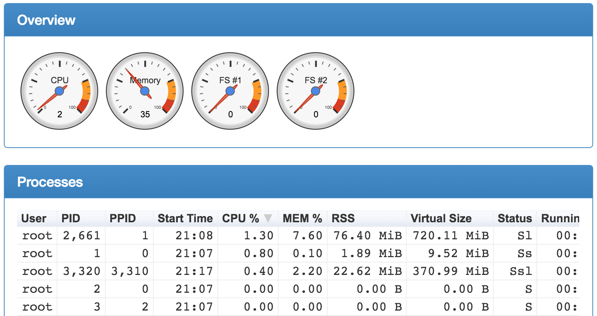
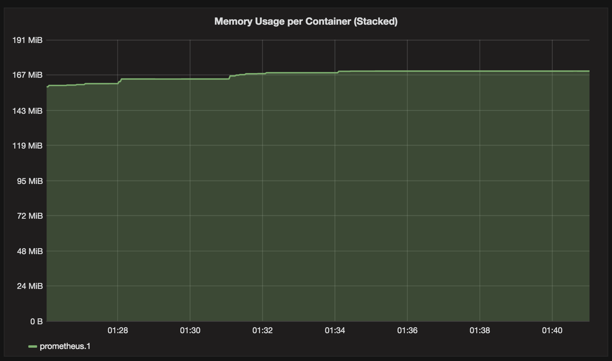

# 收集指标并监控集群

让我们改变传统的程序构建思维。与其想象我们的主要任务是指示计算机做什么，不如集中精力向人类解释我们希望计算机做什么。

——唐纳德·克努斯

我们成功地将集中式日志记录添加到集群中。来自任何节点中运行的任何容器的日志都会被发送到一个中央位置。它们存储在 Elasticsearch 中，并可以通过 Kibana 访问。然而，虽然我们可以轻松访问所有日志，但这并不意味着我们拥有调试问题或防止问题发生所需的所有信息。我们需要通过系统的其他信息来补充我们的日志。我们需要的远不止日志所能提供的内容。

# 集群监控系统的要求

迄今为止我们所做的一切，更不用说接下来在全书中要做的任务，我们正在同时增加和减少系统的复杂性。使用 Docker Swarm 比仅使用容器来扩展服务更简单且不那么复杂。事实上，Docker 已经简化了我们之前的很多过程。再加上新的网络功能和内置的服务发现，结果几乎简单到难以置信。但另一方面，复杂性也隐藏在表面之下。如果我们尝试将到目前为止使用的动态工具与为其他时代设计（并为其设计）的工具结合起来，这种复杂性就会显现出来。

以 *Nagios* ([`www.nagios.org/`](https://www.nagios.org/)) 为例。我并不是说我们不能使用它来监控我们的系统（我们当然可以）。我要说的是，它会与我们迄今为止设计的新系统架构发生冲突。我们的系统变得比以前更复杂了。副本的数量在波动。今天我们有四个实例的服务，但明天早上可能会有六个，下午可能会降到三个。它们分布在集群的多个节点上，并且在不断移动。服务器正在创建和销毁。我们的集群及其内部的一切都是真正动态和弹性的。

我们正在构建的系统的动态特性不适合 Nagios，因为它期望服务和服务器相对静态。它要求我们提前定义事物。采用这种方法的问题在于我们并没有提前获得信息，而 Swarm 则做到了。即便我们获取了所需的信息，它很快就会发生变化。

我们正在构建的系统高度动态，监控这样的系统所使用的工具需要能够应对这种动态变化。

事情不止于此。大多数“传统”工具往往将整个系统视为黑盒。一方面，这样做有一定的优点。最主要的优点是，它允许我们将服务与系统的其他部分解耦。在许多（但不是所有）情况下，白盒监控意味着我们需要向服务中添加监控库，并围绕它们编写代码，以便它们能够暴露服务的内部信息。

在决定为服务添加不属于其本职工作的内容时，请三思。当我们采用微服务架构时，我们应该尽量让服务的功能限制在其主要目标上。如果它是一个购物车，它应该是一个 API，允许我们添加和移除商品。添加库和代码以扩展该服务，使其能够在服务发现存储中注册自己，或者将其度量数据暴露给监控工具，这会产生过多的耦合。一旦我们这样做了，未来的选择将变得非常有限，且系统的变更可能需要相当多的时间和精力。

我们已经成功避免了将服务发现与服务本身耦合。`go-demo` 服务并不具备任何服务发现的知识，但我们的系统却拥有所需的所有信息。许多组织在此过程中落入陷阱，开始将他们的服务与周围的系统耦合。在这种情况下，我们主要关心的是，是否能够在监控中做到同样的事情。我们能否避免将度量数据的创建与为服务编写的代码耦合在一起？

但是，能够进行白盒监控比黑盒监控带来更多的好处。首先，了解服务的内部结构使我们能够更细致地操作。这为我们提供了在将系统视为黑盒时无法获得的知识。

在一个为高可用性和快速响应时间设计的分布式系统中，仅仅依赖健康检查以及 CPU、内存和磁盘使用情况的监控是不够的。我们已经有了 Swarm 来确保服务的健康状态，而且我们可以轻松地编写脚本来检查基本的资源使用情况。但我们需要的远不止这些。我们需要的是白盒监控，它不会引入不必要的耦合。我们需要智能告警，当出现问题时能够及时通知我们，甚至自动修复问题。理想情况下，我们希望能够在问题发生之前就触发告警并执行自动修复。

监控系统需要满足的一些要求如下：

+   *一种去中心化的度量生成方式*，能够应对我们集群的高度动态特性

+   *一种多维数据模型*，可以跨多个维度进行查询

+   *一种高效的查询语言*，使我们能够利用监控数据模型，创建有效的告警和可视化

+   *简便性*，让（几乎）任何人都能在没有广泛培训的情况下使用该系统。

在这一章中，我们将继续前一章的工作。我们将探索导出另一组指标的方法，收集它们、查询它们并通过仪表板展示它们的方法。

在我们做这些之前，我们需要做一些选择。我们应该使用哪些工具来进行监控解决方案？

# 选择合适的数据库来存储系统指标

在*《DevOps 2.0 工具包》*中，我反对使用像*Nagios*（[`www.nagios.org/`](https://www.nagios.org/)）和*Icinga*（[`www.icinga.org/`](https://www.icinga.org/)）这样的“传统”监控工具。相反，我们选择使用 Elasticsearch 来处理日志和系统指标。在前一章中，我重申了选择 Elasticsearch 作为日志解决方案的理由。那么，我们可以通过存储指标来扩展它的使用吗？是的，我们可以。我们应该这么做吗？我们应该用它来存储系统指标吗？是否有更好的解决方案？

如果将 Elasticsearch 作为存储系统指标的数据库，最大的难题是它并不是一个时间序列类型的数据库。日志从 Elasticsearch 能够进行自由文本搜索并以非结构化方式存储数据的能力中受益匪浅。然而，对于系统指标，我们可能需要利用另一种类型的数据存储。我们需要一个时间序列数据库。

时间序列数据库是围绕优化存储和检索时间序列数据的方式设计的。它们的一个主要优势是将信息存储在非常紧凑的格式中，使得它们能够承载大量数据。如果将基于时间的数据存储需求与其他类型的数据库（包括 Elasticsearch）进行比较，你会发现时间序列数据库更加高效。换句话说，如果你的数据是基于时间的指标，使用专门为此类数据设计的数据库。

大多数（如果不是所有的话）时间序列数据库的最大问题是分布式存储。以复制方式运行它们几乎是不可能的，或者说，至少是一个挑战。直白地说，这种数据库是为了运行单个实例而设计的。幸运的是，我们通常不需要在这些数据库中存储长期数据，可以定期清理它们。如果必须进行长期存储，解决方案是将汇总数据导出到其他类型的数据库中，如 Elasticsearch，而 Elasticsearch 在复制和分片方面表现出色。然而，在你“疯狂”地开始导出数据之前，确保你真的需要这么做。时间序列数据库可以轻松在单个实例中存储大量信息。很可能你不会因为容量问题而需要扩展它们。另一方面，如果数据库出现故障，Swarm 会重新调度它，你只会丢失几秒钟的信息。这种情况不应成为灾难，因为我们处理的是汇总数据，而不是单个事务。

最著名的时序数据库之一是*InfluxDB* ([`www.influxdata.com/`](https://www.influxdata.com/))。*Prometheus* ([`prometheus.io/`](https://prometheus.io/))是一个常用的替代品。我们将跳过这两者的比较，唯一要提及的是我们将使用后者。两者都是值得考虑的监控解决方案，其中 Prometheus 具有我们不能忽视的潜在优势。社区计划是将 Docker 指标以原生 Prometheus 格式暴露。目前没有确切的日期表明何时会实现这一点，但我们会尽力围绕这个计划设计系统。如果你想亲自跟踪进展，请关注*Docker issue 27307* ([`github.com/docker/docker/issues/27307`](https://github.com/docker/docker/issues/27307))。我们将以一种方式使用 Prometheus，使得一旦 Docker 原生指标可用时，我们可以切换过去。

让我们将文字转化为行动，创建我们将在本章中使用的集群。

# 创建集群

这次我们将创建比之前更多的服务，因此需要一个稍大的集群。并不是因为服务本身要求很高，而是因为我们的虚拟机每台只有一个 CPU 和 1GB 内存。这类机器并不值得炫耀。此次，我们将创建一个包含五台机器的集群。除了增加集群的容量外，其他一切将与之前相同，因此没有必要再次经历整个过程。我们只需执行`scripts/dm-swarm-5.sh` ([`github.com/vfarcic/cloud-provisioning/blob/master/scripts/dm-swarm-5.sh`](https://github.com/vfarcic/cloud-provisioning/blob/master/scripts/dm-swarm-5.sh))：

本章节中的所有命令都可以在`09-monitoring.sh` ([`gist.github.com/vfarcic/271fe5ab7eb6a3307b9f062eadcc3127`](https://gist.github.com/vfarcic/271fe5ab7eb6a3307b9f062eadcc3127)) Gist 中找到。

```
cd cloud-provisioning

git pull

scripts/dm-swarm-5.sh

eval $(docker-machine env swarm-1)

docker node ls

```

`docker node ls`命令的输出如下（为了简洁，已移除 ID）：

```
HOSTNAME  STATUS  AVAILABILITY  MANAGER STATUS
swarm-4   Ready   Active
swarm-2   Ready   Active        Reachable
swarm-1   Ready   Active        Leader
swarm-5   Ready   Active
swarm-3   Ready   Active        Reachable

```

我们创建了一个包含五个节点的 Swarm 集群，其中三个作为管理节点，剩下的作为工作节点。

现在我们可以创建之前使用过的服务了。由于这也是我们已经多次练习过的内容，我们将从 Compose 文件`vfarcic/docker-flow-proxy/docker-compose-stack.yml` ([`github.com/vfarcic/docker-flow-proxy/blob/master/docker-compose-stack.yml`](https://github.com/vfarcic/docker-flow-proxy/blob/master/docker-compose-stack.yml))和`vfarcic/go-demo/docker-compose-stack.yml` ([`github.com/vfarcic/go-demo/blob/master/docker-compose-stack.yml`](https://github.com/vfarcic/go-demo/blob/master/docker-compose-stack.yml))创建堆栈：

**Windows 用户注意事项**

你可能会遇到 Docker Compose 中卷没有正确映射的问题。如果看到*Invalid volume specification*错误，请将环境变量`COMPOSE_CONVERT_WINDOWS_PATHS`设置为`0`并导出：

`export COMPOSE_CONVERT_WINDOWS_PATHS=0`

请确保每次运行 `docker-compose` 或 `docker stack deploy` 时都导出该变量。

```
docker network create --driver overlay proxy

curl -o proxy-stack.yml \
    https://raw.githubusercontent.com/\
vfarcic/docker-flow-proxy/master/docker-compose-stack.yml

docker stack deploy \
    -c proxy-stack.yml proxy

curl -o go-demo-stack.yml \
    https://raw.githubusercontent.com/\
vfarcic/go-demo/master/docker-compose-stack.yml

docker stack deploy \
    -c go-demo-stack.yml go-demo

docker service create --name util \
    --network proxy \
    --mode global \
    alpine sleep 1000000000

docker service ls

```

一段时间后，`docker service ls` 命令的输出如下（为简洁起见，删除了 ID）：

```
NAME           REPLICAS IMAGE                             COMMAND
swarm-listener 1/1      vfarcic/docker-flow-swarm-listener
go-demo        3/3      vfarcic/go-demo:1.2
util           global   alpine                            sleep 1000000000
go-demo-db     1/1      mongo:3.2.10
proxy          3/3      vfarcic/docker-flow-proxy

```

我们使用从 GitHub 仓库下载的栈来创建除 util 以外的所有服务。目前，我们的集群托管着演示服务 `go-demo` 和 `go-demo-db`、`proxy`、`swarm-listener`，以及我们将用来实验监控度量的全球调度 util 服务。

我们准备开始生成一些度量数据了。

# Prometheus 度量

Prometheus 将所有数据存储为时间序列。它是一串带有时间戳的值，这些值属于相同的度量和相同的标签。标签为度量提供了多个维度。

例如，如果我们想基于 `proxy` 的 HTTP 请求导出数据，我们可以创建一个名为 `proxy_http_requests_total` 的度量。这样的度量可能会包含 `request` 方法、`status` 和 `path` 的标签。这三者可以如下指定：

```
{method="GET", url="/demo/person", status="200"}
{method="PUT", url="/demo/person", status="200"}
{method="GET", url="/demo/person", status="403"}

```

最后，我们需要一个度量值，在我们的示例中，它将是请求的总数。

当我们将度量名称与标签和值结合时，示例结果可能如下所示：

```
proxy_http_requests_total{method="GET", url="/demo/person", status="200"} 654
proxy_http_requests_total{method="PUT", url="/demo/person", status="200"} 143
proxy_http_requests_total{method="GET", url="/demo/person", status="403"} 13

```

通过这三个度量，我们可以看到有 `654` 次成功的 `GET` 请求，`143` 次成功的 `PUT` 请求，以及 `13` 次失败的 `GET` 请求 `HTTP 403`。

现在格式基本清晰，我们可以讨论生成度量数据并将其提供给 Prometheus 的不同方式。

Prometheus 基于一种 *拉取* 机制，从配置的目标中抓取度量数据。我们可以通过两种方式生成 Prometheus 友好的数据。一种是对我们自己的服务进行监控。Prometheus 提供了适用于 *Go*（[`github.com/prometheus/client_golang`](https://github.com/prometheus/client_golang)）、*Python*（[`github.com/prometheus/client_python`](https://github.com/prometheus/client_python)）、*Ruby*（[`github.com/prometheus/client_ruby`](https://github.com/prometheus/client_ruby)）和 *Java*（[`github.com/prometheus/client_java`](https://github.com/prometheus/client_java)）的客户端库。在这些库之上，还有许多非官方库可用于其他语言。暴露我们服务的度量数据被称为监控。对代码进行监控在某种程度上类似于日志记录。

尽管监控是提供将存储在 Prometheus 中的数据的首选方式，但我建议避免这样做。也就是说，除非无法通过其他方式获取相同的数据。这样建议的原因在于我倾向于将微服务与系统的其他部分解耦。如果我们能将服务发现保持在我们的服务之外，也许我们可以对度量数据做同样的处理。

当我们的服务无法被仪表化，或者更好的是，当我们不想对其进行仪表化时，我们可以使用 Prometheus 导出器。它们的作用是收集已经存在的度量数据并将其转换为 Prometheus 格式。正如你将看到的，我们的系统已经暴露了很多度量数据。由于不现实地期望我们的所有解决方案都提供 Prometheus 格式的度量数据，我们将使用导出器来进行转换。

当抓取（拉取）数据不足以满足需求时，我们可以改变方向并推送数据。尽管抓取是 Prometheus 获取度量数据的首选方式，但有些情况下这种方法并不适用。一个例子是短生命周期的批处理作业。它们可能存活的时间非常短，以至于 Prometheus 可能在作业结束并被销毁之前无法拉取数据。在这种情况下，批处理作业可以将数据推送到*Push Gateway*（[`github.com/prometheus/pushgateway`](https://github.com/prometheus/pushgateway)），然后 Prometheus 可以从 Push Gateway 抓取度量数据。

有关当前支持的导出器列表，请参考 Prometheus 文档中的*Exporters and Integrations*（[`prometheus.io/docs/instrumenting/exporters/`](https://prometheus.io/docs/instrumenting/exporters/)）部分。

现在，在简要介绍了度量标准之后，我们准备创建将托管导出器的服务。

# 导出系统级别的度量数据

我们将从*Node Exporter*（[`github.com/prometheus/node_exporter`](https://github.com/prometheus/node_exporter)）服务开始。它将导出与我们的服务器相关的不同类型的度量数据：

**Windows 用户注意事项**

为了使下一个命令中使用的挂载有效，您需要阻止 Git Bash 更改文件系统路径。请设置以下环境变量：

`export MSYS_NO_PATHCONV=1`

本章包含许多使用挂载的`docker service create`命令。在执行这些命令之前，请确保环境变量`MSYS_NO_PATHCONV`存在并设置为`1`：

`echo $MSYS_NO_PATHCONV`

```
docker service create \
    --name node-exporter \
    --mode global \
    --network proxy \ 
    --mount "type=bind,source=/proc,target=/host/proc" \
    --mount "type=bind,source=/sys,target=/host/sys" \
    --mount "type=bind,source=/,target=/rootfs" \
    prom/node-exporter:0.12.0 \
    -collector.procfs /host/proc \
    -collector.sysfs /host/proc \
    -collector.filesystem.ignored-mount-points \
    "^/(sys|proc|dev|host|etc)($|/)"

```

由于我们需要`node-exporter`在每台服务器上可用，因此我们指定该服务应为全局服务。通常，我们会将它连接到一个专门用于监控工具的网络（例如：monitoring）。然而，本地运行的 Docker 机器可能会遇到超过两个网络时的问题。由于我们已经通过`scripts/dm-swarm-services-3.sh`（[`github.com/vfarcic/cloud-provisioning/blob/master/scripts/dm-swarm-services-3.sh`](https://github.com/vfarcic/cloud-provisioning/blob/master/scripts/dm-swarm-services-3.sh)）创建了`go-demo`和`proxy`网络，因此已经达到了安全限制。因此，我们将使用现有的`proxy`网络来为监控服务提供网络支持。在操作“真实”集群时，您应该为监控服务创建一个单独的网络。

我们还挂载了一些卷。

`/proc` 目录非常特殊，它也是一个虚拟文件系统。它有时被称为进程信息伪文件系统。它不包含“真实”的文件，而是包含运行时系统信息（例如：系统内存、挂载的设备、硬件配置等）。

因此，它可以被视为内核的控制和信息中心。实际上，很多系统工具本质上只是对该目录中文件的调用。例如，`lsmod` 实际上就是 `cat /proc/modules`，而 `lspci` 是 `cat /proc/pci` 的同义词。通过更改该目录中的文件，甚至可以在系统运行时 `读取/更改` 内核参数 `sysctl`。`node-exporter` 服务将使用它来查找系统中运行的所有进程。

现代 Linux 发行版包括一个 `/sys` 目录，作为一个虚拟文件系统（`sysfs`，类似于 `/proc`，后者是 `procfs`），它存储并允许修改连接到系统的设备，而许多传统的 UNIX 和类 UNIX 操作系统则将 `/sys` 用作指向内核源代码树的符号链接。

`sys` 目录是 Linux 提供的虚拟文件系统。它通过从内核的设备模型将关于各种内核子系统、硬件设备及其相关设备驱动程序的信息导出到用户空间，提供一组虚拟文件。通过将其暴露为卷，服务将能够收集关于内核的信息。

最后，我们定义了镜像 `prom/node-exporter` 并传递了一些命令参数。我们指定了 `/proc` 和 `/sys` 的目标卷，并指示忽略容器内的挂载点。

请访问 *Node Exporter 项目* ([`github.com/prometheus/node_exporter`](https://github.com/prometheus/node_exporter)) 获取更多信息。

到这时，服务应该已经在集群内运行。让我们确认一下：

```
docker service ps node-exporter

```

`service ps` 命令的输出如下（为了简洁，已移除 ID）：

```
NAME             IMAGE                     NODE    DESIRED STATE          
node-exporter... prom/node-exporter:0.12.0 swarm-5 Running       
node-exporter... prom/node-exporter:0.12.0 swarm-4 Running       
node-exporter... prom/node-exporter:0.12.0 swarm-3 Running       
node-exporter... prom/node-exporter:0.12.0 swarm-2 Running       
node-exporter... prom/node-exporter:0.12.0 swarm-1 Running       
------------------------------------------------
CURRENT STATE         ERROR PORTS
Running 6 seconds ago
Running 7 seconds ago
Running 7 seconds ago
Running 7 seconds ago
Running 7 seconds ago 

```

让我们快速查看 `node-exporter` 服务提供的指标。我们将使用 `util` 服务来检索这些指标：

```
UTIL_ID=$(docker ps -q --filter \
    label=com.docker.swarm.service.name=util)

docker exec -it $UTIL_ID \
    apk add --update curl drill

docker exec -it $UTIL_ID \
    curl http://node-exporter:9100/metrics

```

`curl` 输出示例如下：

```
# HELP go_gc_duration_seconds A summary of the GC invocation durations.
# TYPE go_gc_duration_seconds summary
go_gc_duration_seconds{quantile="0"} 0
go_gc_duration_seconds{quantile="0.25"} 0
go_gc_duration_seconds{quantile="0.5"} 0
go_gc_duration_seconds{quantile="0.75"} 0
go_gc_duration_seconds{quantile="1"} 0
go_gc_duration_seconds_sum 0
go_gc_duration_seconds_count 0
...

```

如你所见，指标以 Prometheus 友好的格式展示。请访问 *Node Exporter 收集器* ([`github.com/prometheus/node_exporter#collectors`](https://github.com/prometheus/node_exporter#collectors)) 了解更多关于每个指标的含义。目前，你应该知道大多数节点信息已经可以获取，并且稍后会被 Prometheus 抓取。

由于我们通过 Docker 网络发送了请求，获得了一个负载均衡的响应，因此无法确定是哪一个节点产生了输出。当我们配置 Prometheus 时，我们需要更具体一点，并跳过网络负载均衡。

现在我们有了关于服务器的信息，我们应该添加特定于容器的指标。我们将使用 `cAdvisor`，也叫做 **容器顾问**。

`cAdvisor` 提供了容器用户对其运行容器的资源使用和性能特征的了解。它是一个运行中的守护进程，收集、聚合、处理并导出有关运行容器的信息。具体来说，它为每个容器保持资源隔离参数、历史资源使用情况、完整的历史资源使用直方图和网络统计数据。这些数据按容器和机器范围导出。它原生支持 Docker 容器。

让我们创建服务：

```
docker service create --name cadvisor \
    -p 8080:8080 \
    --mode global \
    --network proxy \
    --mount "type=bind,source=/,target=/rootfs" \
    --mount "type=bind,source=/var/run,target=/var/run" \
    --mount "type=bind,source=/sys,target=/sys" \
    --mount "type=bind,source=/var/lib/docker,target=/var/lib/docker" \
    google/cadvisor:v0.24.1

```

就像 `node-exporter` 一样，`cadvisor` 服务是全局的，并连接到 `proxy` 网络。它挂载了一些目录，使其能够监控主机上的 Docker 状态和事件。由于 `cAdvisor` 自带一个 Web UI，我们开放了端口 `8080`，这样我们就可以在浏览器中打开它。

在我们继续之前，我们应该确认服务确实在运行：

```
docker service ps cadvisor

```

`service ps` 的输出如下（为了简洁，省略了 ID）：

```
NAME        IMAGE                   NODE    DESIRED STATE         
cadvisor... google/cadvisor:v0.24.1 swarm-3 Running       
cadvisor... google/cadvisor:v0.24.1 swarm-2 Running       
cadvisor... google/cadvisor:v0.24.1 swarm-1 Running      
cadvisor... google/cadvisor:v0.24.1 swarm-5 Running       
cadvisor... google/cadvisor:v0.24.1 swarm-4 Running       
--------------------------------------------------------
CURRENT STATE           ERROR PORTS
Running 3 seconds ago
Running 3 seconds ago
Running 3 seconds ago
Running 8 seconds ago
Running 3 seconds ago 

```

现在我们可以打开 UI：

**给 Windows 用户的提示**

Git Bash 可能无法使用 open 命令。如果是这种情况，请执行 `docker-machine ip <SERVER_NAME>` 以查找机器的 IP，并在你选择的浏览器中直接打开该 URL。例如，下面的命令应该替换为随后的命令：

`docker-machine ip swarm-1`

如果输出是 `1.2.3.4`，你应该在浏览器中打开 `http://1.2.3.4:8080`。

```
open "http://$(docker-machine ip swarm-1):8080"

```



图 9-1：cAdvisor UI

随意向下滚动并探索 `cAdvisor` 提供的各种图表和指标。如果这些信息还不够，可以通过点击屏幕顶部的 Docker 容器链接获取有关运行中容器的更多信息。

虽然乍一看界面可能让人印象深刻，但对于除单个服务器外的任何其他用途，UI 几乎是无用的。因为它是作为一个监控单个节点的工具设计的，所以在 Swarm 集群中并没有太大作用。

首先，页面及其所有请求都是由入口网络进行负载均衡的。这不仅意味着我们无法知道是哪个服务器返回了 UI，还意味着返回指标和图表所使用的数据请求也进行了负载均衡。换句话说，来自所有服务器的不同数据被混合在一起，给我们一个非常不准确的视图。我们可以跳过使用该服务，直接使用 `docker run` 命令（对每个服务器重复）。然而，即使那样能让我们看到特定的服务器，解决方案仍然是不充分的，因为我们将被迫从一台服务器切换到另一台。我们的目标不同。我们需要收集并可视化整个集群的数据，而不是单个服务器。因此，UI 必须被去除。

顺便提一下，某些类型的指标在 `node-exporter` 和 `cadvisor` 服务之间有重叠。你可能会倾向于只选择其中一个。然而，它们的关注点不同，只有将两者结合起来，才能得到完整的视图。

既然我们已经确定当 UI 托管在 Swarm 集群中时是无用的，因此没有充分理由暴露端口 `8080`。因此，我们应将其从服务中移除。你可能会想删除该服务并重新创建它，而不暴露端口。其实不需要采取这种操作。相反，我们可以通过更新服务来消除该端口：

```
docker service update \
    --publish-rm 8080 cadvisor

docker service inspect cadvisor --pretty

```

通过检查 `service inspect` 命令的输出，你会注意到端口没有打开（它不存在）。

现在 `cadvisor` 服务已运行，并且我们没有从无用的 UI 生成噪声，我们可以快速查看 `cAdvisor` 导出的指标：

```
docker exec -it $UTIL_ID \
    curl http://cadvisor:8080/metrics

```

`curl` 输出的示例如下：

```
# TYPE container_cpu_system_seconds_total counter
container_cpu_system_seconds_total{id="/"} 22.91
container_cpu_system_seconds_total{id="/docker"} 0.32

```

我们进展顺利。我们正在导出服务器和容器指标。我们可能会继续无限地添加指标，并将本章扩展到无法承受的大小。我将把创建提供额外信息的服务作为你后续需要完成的练习。现在我们将进入 Prometheus。毕竟，没有能够查询和可视化指标，它们的存在没有太大意义。

# 抓取、查询和可视化 Prometheus 指标

Prometheus 服务器旨在从已仪表化的服务中拉取指标。然而，由于我们希望避免不必要的耦合，因此我们使用了提供所需指标的导出器。这些导出器已经作为 Swarm 服务在运行，现在我们可以通过 Prometheus 来利用它们。

要实例化 Prometheus 服务，我们应创建一个配置文件，其中包含在集群中运行的导出器。 在此之前，我们需要获取所有导出器服务实例的 IP 地址。如果你记得第四章，*Swarm 集群中的服务发现*，我们可以通过在服务名称前添加 tasks. 前缀来获取所有的 IP 地址。

要检索 `node-exporter` 服务的所有副本列表，我们可以例如从 `util` 服务的一个实例中提取：

```
docker exec -it $UTIL_ID \
    drill tasks.node-exporter

```

输出的相关部分如下：

```
;; ANSWER SECTION:
tasks.node-exporter.    600 IN  A   10.0.0.21
tasks.node-exporter.    600 IN  A   10.0.0.23
tasks.node-exporter.    600 IN  A   10.0.0.22
tasks.node-exporter.    600 IN  A   10.0.0.19
tasks.node-exporter.    600 IN  A   10.0.0.20

```

我们已获取所有当前运行的服务副本的 IP 地址。

单独列出 IP 地址是不够的。我们需要告诉 Prometheus 它应该动态地使用这些地址。每次想要拉取新数据时，它应该查询 tasks.`<SERVICE_NAME>`。幸运的是，Prometheus 可以通过 `dns_sd_configs` 配置，使用地址作为服务发现。有关可用选项的更多信息，请参阅文档中的 *配置*（[`prometheus.io/docs/operating/configuration/`](https://prometheus.io/docs/operating/configuration/)）部分。

了解了`dns_sd_configs`选项的存在后，我们可以继续定义 Prometheus 配置。我们将使用我为本章准备的配置文件。它位于`conf/prometheus.yml`中（[`github.com/vfarcic/cloud-provisioning/blob/master/conf/prometheus.yml`](https://github.com/vfarcic/cloud-provisioning/blob/master/conf/prometheus.yml)）

让我们快速浏览一下：

```
cat conf/prometheus.yml

```

输出如下：

```
global:
  scrape_interval: 5s

scrape_configs:
  - job_name: 'node'
    dns_sd_configs:
      - names: ['tasks.node-exporter']
        type: A
        port: 9100
  - job_name: 'cadvisor'
    dns_sd_configs:
      - names: ['tasks.cadvisor']
        type: A
        port: 8080
  - job_name: 'prometheus'
    static_configs:
      - targets: ['prometheus:9090']

```

我们定义了三个任务。前两个`node`和`cadvisor`使用了`dns_sd_configs`（DNS 服务发现配置）选项。它们都定义了任务`<SERVICE_NAME>`，类型为 A（您可以从`drill`的输出中看到类型），并且定义了内部端口。最后一个`prometheus`将提供内部度量。

请注意，我们将`scrape_interval`设置为五秒。在生产环境中，您可能希望获取更精细的数据并将其更改为例如一秒的间隔。小心！间隔越短，成本越高。我们抓取度量的频率越高，所需的资源就越多，包括查询这些结果，甚至存储数据。尽量在数据粒度和资源使用之间找到平衡。创建 Prometheus 服务很容易（几乎和创建其他任何 Swarm 服务一样简单）。

我们首先创建一个目录来持久化 Prometheus 数据：

```
mkdir -p docker/prometheus

```

现在我们可以创建服务了：

```
docker service create \
    --name prometheus \
    --network proxy \
    -p 9090:9090 \
    --mount "type=bind,source=$PWD/conf/prometheus.yml, \
    target=/etc/prometheus/prometheus.yml" 
    --mount "type=bind,source=$PWD/docker/\
    prometheus,target=/prometheus" 
    prom/prometheus:v1.2.1
docker service ps prometheus

```

我们创建了`docker/prometheus`目录，用于持久化 Prometheus 状态。

该服务非常普通。它附加到`proxy`网络，暴露端口`9090`，并挂载配置文件和状态目录。

`service ps`命令的输出如下（为了简洁，省略了 ID 和 ERROR 列）：

```
NAME          IMAGE                   NODE     DESIRED STATE             
prometheus.1  prom/prometheus:v1.2.1  swarm-3  Running        
-----------------------------------------
CURRENT STATE
Running 59 seconds ago 

```

请注意，扩展此服务没有意义。Prometheus 被设计为单实例工作。在大多数情况下，这不是问题，因为它可以轻松存储和处理大量数据。如果它失败，Swarm 将重新调度它到其他地方，届时我们只会丢失几秒钟的数据。

让我们打开它的 UI，看看可以做什么：

**Windows 用户注意**

Git Bash 可能无法使用 open 命令。如果是这种情况，请执行`docker-machine ip <SERVER_NAME>`以找出机器的 IP，并直接在您选择的浏览器中打开该 URL。例如，下面的命令应替换为如下命令：

`docker-machine ip swarm-1`

如果输出是`1.2.3.4`，您应该在浏览器中打开`http://1.2.3.4:9090`。

```
open "http://$(docker-machine ip swarm-1):9090"

```

我们首先应该检查它是否注册了所有导出的目标。

请点击顶部菜单中的“Status”按钮并选择“Targets”。您应该能看到五个*cadvisor*目标与形成集群的五台服务器匹配。同样，也有五个节点目标。最后，一个 prometheus 目标也已注册：


图 9-2：在 Prometheus 中注册的目标

现在我们已经确认所有目标都已注册，并且 Prometheus 已经开始抓取它们提供的指标，我们可以探索通过`ad-hoc`查询获取数据并将其可视化的方法。

请点击顶部菜单中的*图表*按钮，从`- 插入光标处的指标 *-*`列表中选择`node_memory_MemAvailable`，然后点击执行按钮。

你应该看到一个包含指标列表以及与每个指标相关的数值的表格。许多人更喜欢通过点击列表上方的“图表”选项卡来获取数据的可视化表示。请点击它。

你应该看到五台服务器的可用内存。它以指定时间段内的变化趋势显示，可以通过位于图表上方的字段和按钮进行调整。自从我们创建了`prometheus`服务以来，时间并不长，所以你可能需要将时间段缩短到五分钟或十五分钟。

同样的结果也可以通过在“表达式”字段中输入查询（或在这种情况下输入指标的名称）来实现。稍后，我们将做一些更复杂的查询，这些查询无法通过从`*-*插入光标处的指标 *-*`列表中选择单个指标来定义：


图 9-3：Prometheus 图表与可用内存

现在可能是讨论我们目前设置的系统主要缺点的好时机。我们没有能够轻松将数据与特定服务器关联的信息。由于地址列表是通过 Docker 网络获取的，而 Docker 网络为每个副本创建了一个虚拟 IP，因此这些地址并不是服务器的真实地址。对此没有简单的解决方法（据我所知），所以我们只有两个选择。一种方法是将导出程序作为“正常”容器运行（例如：`docker run`），而不是作为服务运行。这样做的好处是我们可以将网络类型设置为`host`，并获取服务器的 IP。这样做的问题是，我们需要为每个服务器单独运行导出程序。

这本来不会太糟糕，除了每次我们向集群添加新服务器时，都需要重新运行所有的导出器。更复杂的是，这也意味着我们需要更改 Prometheus 配置，或者仅为此目的添加一个单独的服务注册表。另一种选择是等待。无法从服务副本中检索主机 IP 是已知的限制。这个问题已经在多个地方记录过，其中之一是 *issue 25526* ([https:](https://github.com/docker/docker/issues/25526)[//github.com/docker/docker/issues/25526](https://github.com/docker/docker/issues/25526))。同时，社区已经决定从 Docker 引擎原生地暴露 Prometheus 指标。这将消除我们作为服务创建的一些，甚至是所有导出器的需求。我相信这两者中的一个很快会实现。在那之前，你必须做出决定，要么忽略 IP 是虚拟的事实，要么将服务替换为在集群中每台服务器上单独运行的容器。无论你做出什么选择，稍后我会向你展示如何找到虚拟 IP 和主机之间的关系。

让我们回到查询 Prometheus 指标。

`node_memory_MemAvailable`的示例只使用了该指标，因此我们得到了它的所有时间序列。

让我们稍微增加点趣味，创建一个将返回空闲 CPU 的图表。查询将是`node_cpu{mode="idle"}`。使用`mode="idle"`将`node_cpu`指标限制为仅显示标记为空闲的数据。试试看，你会发现图表应该由五条几乎直线的上升曲线组成。这看起来不太对。

让我们通过引入`irate`函数来创建一个更精确的图像。它计算时间序列的每秒瞬时增长率，基于最后两个数据点。要使用`irate`函数，我们还需要指定测量的持续时间。修改后的查询如下：

```
irate(node_cpu{mode="idle"}[5m])

```

由于我们正在从`cadvisor`服务抓取指标，我们也可以查询不同容器的指标。例如，我们可以查看每个容器的内存使用情况。

请执行下面的查询：

```
container_memory_usage_bytes

```

请执行查询并亲自查看结果。你应该看到每个节点在 5 分钟间隔内测量的空闲 CPU 使用率：


图 9-4：Prometheus 图表展示 CPU 空闲率

如果你通过图表查看结果，你会发现`cAdvisor`使用了最多的内存（在我的机器上大约是`800M`）。这看起来不太对。该服务的内存占用应该要小得多。如果你查看它的标签，你会注意到 ID 是`/`。这代表的是所有通过`cAdvisor`的容器的总内存使用情况。我们应该用`!=`操作符将其从结果中排除。

请执行下面的查询：

```
container_memory_usage_bytes{id!="/"}

```

这次，结果更有意义了。使用最多内存的服务是 Prometheus 本身。

之前的查询使用标签 ID 来过滤数据。当与`!=`操作符结合使用时，它排除了所有 ID 设置为`/`的度量。

即使是如此小的集群，容器数量也可能太多，无法在一个图表中显示，因此我们可能希望将结果限制为单个服务。可以通过使用`container_label_com_docker_swarm_service_name`来过滤数据，完成这一操作。

让我们来看一下所有`cadvisor`副本的内存使用情况：

```
container_memory_usage_bytes{container_label_com_docker_swarm_service_\
name="cadvisor"}

```

这一切看起来不错，但作为监控系统并不十分有用。Prometheus 更多的是用于`ad-hoc`查询，而不是我们可以用来创建能够展示整个系统的仪表盘的工具。为此，我们需要在其中再添加一个服务。

# 使用 Grafana 创建仪表盘

Prometheus 提供了一个名为*PromDash*的仪表盘构建工具([`github.com/prometheus/promdash`](https://github.com/prometheus/promdash))。然而，它已经不再推荐使用，并且对于 Grafana 而言，已经不再值得在我们的集群中运行，因此我们不再考虑它。

Grafana ([`grafana.org/`](http://grafana.org/)) 是一个领先的时间序列度量查询和可视化工具。它具有交互式和可编辑的图表，并支持多个数据源。Graphite、Elasticsearch、InfluxDB、OpenTSDB、KairosDB，以及最重要的 Prometheus 都能开箱即用地支持。如果这些还不够，还可以通过插件添加额外的数据源。Grafana 确实是一个功能丰富的 UI，已经在市场上确立了领导地位。最棒的是，它是免费的。

让我们创建一个`grafana`服务：

```
docker service create \
    --name grafana \
    --network proxy \
    -p 3000:3000 \
    grafana/grafana:3.1.1

```

几分钟后，副本的状态应该显示为正在运行：

```
docker service ps grafana

```

`service ps`命令的输出如下（为简洁起见，已移除 ID）：

```
NAME       IMAGE                NODE     DESIRED STATE CURRENT STATE 
grafana.1  grafana/grafana3.1.1 swarm-1  Running       Running 24 seconds ago

```

现在服务已经运行，我们可以打开 UI：

**Windows 用户注意事项**

Git Bash 可能无法使用`open`命令。如果是这种情况，执行`docker-machine ip <SERVER_NAME>`来查找机器的 IP 地址，并在你选择的浏览器中直接打开 URL。例如，下面的命令应该替换为以下命令：

`docker-machine ip swarm-1`

如果输出是`1.2.3.4`，你应该在浏览器中打开`http://1.2.3.4:3000`。

```
open "http://$(docker-machine ip swarm-1):3000"

```

你将看到登录界面。默认的用户名和密码是 admin。请继续登录。

用户名和密码以及其他许多设置可以通过配置文件和环境变量进行调整。由于我们在 Docker 容器内运行 Grafana，环境变量是更好的选择。更多信息，请访问官方文档的*配置*部分([`docs.grafana.org/installation/configuration/`](http://docs.grafana.org/installation/configuration/))。

我们应该做的第一件事是将 Prometheus 添加为数据源。

请点击位于屏幕左上角的*Grafana*徽标，选择数据源，并点击+添加数据源按钮。

我们将其命名为`Prometheus`并选择相同的类型。输入`http://prometheus:9090`作为`Url`并点击添加按钮。就这样。从现在开始，我们可以可视化并查询存储在 Prometheus 中的任何度量数据。

让我们创建第一个仪表盘。

请点击*Grafana*标志，选择仪表盘，并点击+ 新建。在屏幕的左上角有一个绿色的垂直按钮。点击它，选择添加面板，然后选择图表。你会看到一个默认的图表，显示的是测试度量。如果你不想欣赏那些上上下下的漂亮线条，它并不是很有用。我们将面板的数据源从默认的更改为 Prometheus。输入`irate(node_cpu{mode="idle"}[5m])`作为查询。片刻之后，你应该看到一个显示 CPU 使用率的图表。

默认情况下，图表显示六小时的数据。在这种情况下，如果你是一个阅读速度较慢的人，花了那么多时间创建 prometheus 服务并阅读后续的文本，那么这可能是*OK*的。我假设你只有半小时的数据，并且想要更改图表的时间轴。

请点击位于屏幕右上角的“过去 6 小时”按钮，然后点击“过去 30 分钟”链接。图表应该类似于*图 9-5*：


图 9-5：从 Prometheus 获取的 CPU 使用率的 Grafana 图表

你可以自定义许多内容，使图表符合你的需求。我会把这个留给你。继续玩玩新的工具，探索它提供的不同选项。

如果你像我一样懒惰，你可能不想自己创建所有需要的图表和仪表盘，而是直接利用别人的努力。幸运的是，Grafana 社区非常活跃，并且有不少成员创建了仪表盘。

请在*grafana.net*（[`grafana.net`](https://grafana.net)）的*仪表盘*（[`grafana.net/dashboards`](https://grafana.net/dashboards)）部分打开。你会在左侧看到一些筛选器以及一个通用的搜索框。我们可以例如搜索`node exporter`。

我鼓励你稍后去探索所有提供的 node exporter 仪表盘。目前，我们将选择*Node Exporter Server Metrics*（[`grafana.net/dashboards/405`](https://grafana.net/dashboards/405)）。在页面中，你会看到下载仪表盘按钮。使用它下载包含仪表盘定义的 JSON 文件。

让我们回到我们的`grafana`服务：

**Windows 用户注意事项**

Git Bash 可能无法使用`open`命令。如果是这种情况，请执行`docker-machine ip <SERVER_NAME>`来查找机器的 IP 地址，并直接在你选择的浏览器中打开 URL。例如，下面的命令应该替换为后续的命令：

`docker-machine ip swarm-1`

如果输出是`1.2.3.4`，你应该在浏览器中打开`http://1.2.3.4:3000`。

```
open "http://$(docker-machine ip swarm-1):3000"

```

再次打开仪表板选项，点击隐藏在 Grafana 徽标下的选项并选择导入。点击上传 .json 文件按钮，打开你刚刚下载的文件。我们将保持名称不变，并选择 Prometheus 作为数据源。最后，点击保存并打开按钮完成操作。

奇迹发生了，我们得到了属于某个节点的几个图表。然而，由于默认的持续时间是七天，而我们只有大约一个小时的数据，这些图表大部分是空的。将时间范围改为一个小时。图表应该开始变得有意义。

让我们增加一些变化，加入更多的服务器。请点击选定节点的`IP/port`，选择更多节点。你应该能够看到每个节点的度量数据：


图 9-6：Grafana 仪表板，显示来自选定节点的 Prometheus 度量

虽然这个仪表板在我们想比较选定节点之间的度量时非常有用，但我认为如果我们想专注于单一节点，它的用处就不大了。在这种情况下，*Node Exporter Server Stats* ([`grafana.net/dashboards/704`](https://grafana.net/dashboards/704))仪表板可能是更好的选择。请按照相同的步骤将其导入到`grafana`服务中。

你仍然可以更改仪表板中显示的节点（屏幕左上角的 IP）。然而，与其他仪表板不同，这个仪表板每次只显示一个节点。

根据具体情况，这两个仪表板都非常有用。如果我们需要比较多个节点，那么*Node Exporter Server Metrics* ([`grafana.net/dashboards/405`](https://grafana.net/dashboards/405))可能是更好的选择。另一方面，当我们想集中在一个特定的服务器时，*Node Exporter Server Stats* ([`grafana.net/dashboards/704`](https://grafana.net/dashboards/704))仪表板可能是更好的选择。你应该返回并导入其余的*Node Exporter*仪表板并尝试它们。你可能会发现它们比我建议的更有用。

迟早，你会想创建适合自己需求的仪表板。即使是这样，我仍然建议你从导入一个社区制作的仪表板开始，并对其进行修改，而不是从头开始。也就是说，在你更熟悉 Prometheus 和 Grafana 之前，请参考以下图像：


图 9-7：Grafana 仪表板，显示来自 Prometheus 的单一节点度量

我们接下来要创建的仪表板需要来自 Elasticsearch 的日志，因此我们也需要设置日志记录。

我们不会详细讨论日志服务，因为我们在第九章中已经探讨过它们，*定义日志策略*：

```
docker service create \
    --name elasticsearch \
    --network proxy \
    --reserve-memory 300m \
    -p 9200:9200 \
    elasticsearch:2.4

```

在继续进行`LogStash`服务之前，我们应该确认`elasticsearch`正在运行：

```
docker service ps elasticsearch

```

`service ps`命令的输出应该类似于以下内容（为了简洁，已移除 ID 和错误端口列）：

```
NAME            IMAGE             NODE    DESIRED STATE CURRENT STATE    
elasticsearch.1 elasticsearch:2.4 swarm-2 Running       Running 1 seconds ago

```

现在我们可以创建一个 `logstash` 服务：

```
docker service create \
    --name logstash \
    --mount "type=bind,source=$PWD/conf,target=/conf" \
    --network proxy \
    -e LOGSPOUT=ignore \
    logstash:2.4 \
    logstash -f /conf/logstash.conf

```

在继续到最后的日志服务之前，让我们确认它正在运行：

```
docker service ps logstash

```

`service ps` 命令的输出应该类似于下面所示（为了简洁，ID 和 ERROR PORTS 列已被移除）：

```
NAME       IMAGE        NODE    DESIRED STATE CURRENT STATE    
logstash.1 logstash:2.4 swarm-2 Running       Running 2 minutes ago

```

最后，我们还将创建一个 `logspout` 服务：

```
docker service create \
    --name logspout \
    --network proxy \ 
    --mode global \
    --mount "type=bind,source=/var/run/docker.sock,\
    target=/var/run/docker.sock" \
    -e SYSLOG_FORMAT=rfc3164 \
    gliderlabs/logspout \
    syslog://logstash:51415

```

…并确认它正在运行：

```
docker service ps logspout

```

`service ps` 命令的输出应该类似于下面所示（为了简洁，ID 和 ERROR PORTS 列已被移除）：

```
NAME        IMAGE                      NODE    DESIRED STATE CURRENT STATE          
logspout... gliderlabs/logspout:latest swarm-1 Running       Running 9 seconds ago
logspout... gliderlabs/logspout:latest swarm-5 Running       Running 9 seconds ago
logspout... gliderlabs/logspout:latest swarm-4 Running       Running 9 seconds ago
logspout... gliderlabs/logspout:latest swarm-3 Running       Running 9 seconds ago
logspout... gliderlabs/logspout:latest swarm-2 Running       Running 10 seconds ago

```

现在日志功能已经正常运行，我们应该添加 Elasticsearch 作为另一个 Grafana 数据源：

**Windows 用户注意事项**

Git Bash 可能无法使用 open 命令。如果是这种情况，请执行 `docker-machine ip <SERVER_NAME>` 来查找机器的 IP 地址，并在您选择的浏览器中直接打开该 URL。例如，下面的命令应替换为以下命令：

`docker-machine ip swarm-1`

如果输出是 `1.2.3.4`，您应该在浏览器中打开 `http://1.2.3.4:3000`。

```
open "http://$(docker-machine ip swarm-1):3000"

```

请点击 Grafana 徽标，选择数据源。一个新屏幕将打开，显示当前定义的源（目前只有 Prometheus）。点击 + 添加数据源 按钮。

我们将使用 `Elasticsearch` 作为名称和类型。Url 应设置为 [`e`](http://elasticsearch:9200)[lasticsearch:9200](http://elasticsearch:9200)，索引名称的值应设置为 `"logstash-*"`。完成后点击添加按钮。

现在我们可以创建或更准确地说是导入我们的第三个仪表板。这次，我们将导入一个主要聚焦于 Swarm 服务的仪表板。

请打开 Docker Swarm 和容器概览的仪表板页面 ([`grafana.net/dashboards/609`](https://grafana.net/dashboards/609))，下载并导入到 Grafana 中。在 Grafana 的导入仪表板屏幕中，您将被要求设置一个 *Prometheus* 数据源和两个 Elasticsearch 数据源。点击保存并打开按钮后，您将看到一个包含与 Docker Swarm 和容器相关的各种指标的仪表板。

您会注意到仪表板中的一些图表为空。这不是错误，而是表示我们的服务尚未准备好被监控。让我们通过添加一些仪表板期望的信息来更新它们。

# 在 Grafana 中查看 Docker Swarm 和容器概览仪表板

仪表板缺少的一项内容是主机名。如果您选择 Hostnames 列表，您会发现它是空的。原因在于 `node-exporter` 服务。由于它在容器内运行，因此它无法识别底层主机的名称。

我们已经提到过，`node-exporter`中的 IP 地址并不是很有价值，因为它们代表的是网络端点的地址。我们真正需要的是“真实”的主机 IP 或主机名。由于我们无法从 Docker 服务中获取真实 IP，因此替代方案是使用主机名。但是，官方的`Node Exporter`容器并未提供这个功能，因此我们需要采用替代方法。

我们将使用 GitHub 用户`bvis`创建的镜像替换我们的`node-exporter`服务。该项目可以在`bvis/docker-node-exporter` ([`github.com/bvis/docker-node-exporter`](https://github.com/bvis/docker-node-exporter)) GitHub 仓库中找到。因此，我们将移除`node-exporter`服务并基于`basi/node-exporter` ([`hub.docker.com/r/basi/node-exporter/`](https://hub.docker.com/r/basi/node-exporter/))镜像创建一个新的服务：

```
docker service rm node-exporter

docker service create \
    --name node-exporter \
    --mode global \
    --network proxy \ 
    --mount "type=bind,source=/proc,target=/host/proc" \
    --mount "type=bind,source=/sys,target=/host/sys" \
    --mount "type=bind,source=/,target=/rootfs" \
    --mount "type=bind,source=/etc/hostname,target=/etc/\
    host_hostname" \
    -e HOST_HOSTNAME=/etc/host_hostname \
    basi/node-exporter:v0.1.1 \
    -collector.procfs /host/proc \
    -collector.sysfs /host/proc \
    -collector.filesystem.ignored-mount-points \
    "^/(sys|proc|dev|host|etc)($|/)" \
    -collector.textfile.directory /etc/node-exporter/ \
    -collectors.enabled="conntrack,diskstats,\
    entropy,filefd,filesystem,loadavg,\
    mdadm,meminfo,netdev,netstat,stat,textfile,time,vmstat,ipvs"

```

除了使用不同的镜像`basi/node-exporter`，我们还挂载了`/etc/hostname`目录，容器可以从该目录获取底层主机的名称。我们还添加了环境变量`HOST_HOSTNAME`以及一些额外的采集器。

我们不详细讲解命令，因为它与我们之前使用的命令类似。附加参数的含义可以在该项目的`README`文件中找到（[`github.com/bvis/docker-node-exporter`](https://github.com/bvis/docker-node-exporter)）。

需要注意的是，新的`node-exporter`服务将包括`hostname`，以及 Docker 网络创建的虚拟 IP。我们将能够使用这一点来建立它们之间的关系。

我们本可以更新之前运行的服务，而不是创建新的服务。我决定不这么做，这样你就可以看到完整的命令，万一你选择在生产集群中使用节点度量。

请返回已经在浏览器中打开的 Grafana 仪表板并刷新页面*Ctrl*+*R*或*Cmd*+*R*。你会注意到，一些原本为空的图表现在已经变得五颜六色，展示着来自新`node-exporter`的度量数据。

Hostnames 列表显示了所有节点，其 IP 位于左侧，主机名位于右侧。现在我们可以选择任何主机的组合，节点的 CPU 使用情况、节点的空闲磁盘、节点的可用内存以及节点的磁盘 I/O 图表将相应更新，如下图所示：


图 9-8：Docker Swarm Grafana 仪表板与节点度量

我们不仅获得了仪表板所需的部分数据，还建立了虚拟 IP 和主机名之间的关系。现在，你将能够找出其他仪表板中使用的虚拟 IP 与`主机名`之间的关系。特别是，如果你监控 Node Exporter 仪表板并发现应该修复的问题，你可以返回 Swarm 仪表板并找出需要关注的主机。

使用主机名的解决方案仍然不是最好的，但应该是一个不错的变通方法，*直到问题 27307*（[`github.com/docker/docker/issues/27307`](https://github.com/docker/docker/issues/27307)）修复。选择权在你手中。通过能够将虚拟 IP 与主机名关联，我选择坚持使用 Docker 服务，而不是转向非 Swarm 解决方案。

接下来需要修复的是服务组。

如果你打开服务组列表，你会发现它是空的。这背后的原因在于仪表板的配置方式。它期望我们通过容器标签`com.docker.stack.namespace`来区分服务。由于我们没有指定任何标签，列表中只包含“所有”选项。

我们应该有哪些组？这个问题的答案因用例而异。随着时间的推移，你会定义最适合你组织的组。现在，我们将把我们的服务分成数据库、后台和基础设施三组。我们将把`go-demo-db`放入`db 组`，`go-demo`放入`backend`，其余的都放入 infra 组。虽然`elasticsearch`是数据库，但它是我们基础设施服务的一部分，因此我们会将其视为基础设施服务。

我们可以向现有服务添加标签。不需要删除它们并创建新的服务。相反，我们将执行`docker service update`命令，通过利用`--container-label-add`参数来添加`com.docker.stack.namespace`标签。

我们将首先把`go-demo_db`服务放入一个组中：

```
docker service update \
    --container-label-add \
    com.docker.stack.namespace=db \
    go-demo_db

```

让我们确认标签确实已被添加：

```
docker service inspect go-demo_db \
    --format \
    "{{.Spec.TaskTemplate.ContainerSpec.Labels}}"

```

`--format`参数使我们避免了冗长的输出，仅显示我们关心的内容。

`service inspect`命令的输出如下：

```
map[com.docker.stack.namespace:db]

```

如你所见，`com.docker.stack.namespace`标签已经添加，并且其值为`db`。

我们应该对`go-demo`服务做同样的操作，并将其放入`backend`组：

```
docker service update \
    --container-label-add \
    com.docker.stack.namespace=backend \
    go-demo_main

```

最后一个组是`infra`。由于应该有不少服务属于它，我们将通过一个命令更新所有服务：

```
for s in \
    proxy_proxy \
    logspout \
    logstash \
    util \
    prometheus \
    elasticsearch
do
    docker service update \
        --container-label-add \
        com.docker.stack.namespace=infra \
        $s
done

```

我们遍历了所有服务的名称，并对每个服务执行了`service update`命令。

请注意，`service update`命令会重新调度副本。这意味着容器会停止并重新启动，采用新的参数。可能需要一些时间才能使所有服务完全运行。请使用`docker service ls`列出服务，并确认它们都在运行，然后再继续。一旦所有副本启动，我们应该返回 Grafana 仪表板并刷新屏幕（*Ctrl*+*R* 或 *cmd*+*R*）。

这一次，当你打开服务组列表时，你会注意到我们创建的三个组现在都可以使用了。继续，选择一个或两个组。你会看到与服务相关的图表相应地发生了变化。

我们还可以通过`Service Name`来过滤结果，并将一些图表中显示的指标限制为选择的一组服务。

如果您向仪表板中部滚动，您会注意到与`proxy`相关的网络图表中有太多的服务，而不包括`proxy`的则为空。我们可以通过代理选择器进行更正。它允许我们定义哪些服务应视为`proxy`。请打开列表并选择`proxy`。


图 9-10：带有网络流量图的 Grafana 仪表板

与`proxy`相关的两个网络图现在仅限于`proxy`服务，或者更具体地说，我们确定的服务。底部现在包含来自所有其他服务的指标。分离监视外部和内部流量非常有用。通过代理图，您可以看到来自和去往外部源的流量，而另外两个则用于服务之间的内部通信。

让我们生成一些流量，并确认更改是否反映在代理图表中。我们将生成一百个请求：

```
for i in {1..100}
do
    curl "$(docker-machine ip swarm-1)/demo/hello"
done

```

如果您返回`proxy`网络图，您应该看到流量的增加。请注意，仪表板每分钟刷新数据。如果仍然看不到峰值，请等待，点击屏幕右上角的刷新按钮，或更改刷新频率，请参考以下图片：


图 9-10：带有网络流量图的 Grafana 仪表板

我们将继续前往仪表板菜单中的下一个选项，并点击错误复选框。此复选框连接到 Elasticsearch。由于没有记录的错误，图表保持不变。

让我们生成一些错误，并查看它们在仪表板中的可视化效果。

`go-demo`服务具有一个 API，允许我们创建随机错误。平均而言，十次请求中大约有一次会产生错误。我们需要它们来演示 Prometheus 指标与 Elasticsearch 数据之间的集成之一。

```
for i in {1..100}
do
    curl "$(docker-machine ip swarm-1)/demo/random-error"
done

```

输出样本应如下所示：

```
Everything is still OK
Everything is still OK
ERROR: Something, somewhere, went wrong!
Everything is still OK
Everything is still OK

```

如果您返回仪表板，您会注意到红色线条代表发生错误的时间点。当出现这种情况时，您可以调查系统指标，并尝试推断错误是由硬件故障、网络饱和或其他原因引起的。如果所有尝试失败，您应该转到 Kibana UI，浏览日志并尝试从中推断原因。请参考以下图片：


图 9-11：带有网络流量图的 Grafana 仪表板

很重要的是，您的系统不要报告虚假的正错误。如果您注意到日志中报告了错误，但没有需要处理的内容，最好更改代码，使得特定情况不被视为错误。否则，出现虚假正错误时，您会开始看到过多的错误，并开始忽略它们。因此，当真正的错误发生时，您可能不会注意到。

我们将跳过警报触发和警报解决选项，因为它们与*X-Pack*（[`www.elastic.co/products/x-pack`](https://www.elastic.co/products/x-pack)）相关，这是一个商业产品。由于本书面向开源解决方案，我们将跳过它。这并不意味着您不应考虑购买它。恰恰相反，在某些情况下，*X-Pack*是工具集的宝贵补充。

这结束了我们对 Docker Swarm & 容器概述仪表板选项的快速探索。图表本身应该是不言自明的。请花点时间自行探索一下。

# 通过仪表盘指标调整服务

我们的服务是不静态的。Swarm 会在每次发布时、复制品失败时、节点变得不健康时或由于其他种种原因重新调度它们。我们应尽力为 Swarm 提供尽可能多的信息。我们描述所需服务状态得越详细，Swarm 的工作就会越好。

我们不会详细介绍通过`docker service create`和`docker service update`命令提供的所有信息。相反，我们将专注于`--reserve-memory`参数。稍后，您可以将类似的逻辑应用于`--reserve-cpu`、`--limit-cpu`、`--limit-memory`和其他参数。

我们将在 Grafana 中观察内存指标并相应地更新我们的服务。

请在 Grafana 中的每个容器内存使用（堆叠）图表上点击，并选择查看。您将看到一个显示前二十个容器内存消耗的缩放图的屏幕。让我们通过选择服务名称列表中的 prometheus 来过滤指标。

Prometheus 大约使用 175 MB 内存。让我们将该信息添加到服务中：



图 9-12：带有通过 Prometheus 服务过滤的容器内存消耗的 Grafana 图表

```
docker service update \
    --reserve-memory 200m \
    prometheus

```

我们通过保留`200m`内存来更新`prometheus`服务。我们可以假设随着时间的推移，其内存使用量会增加，因此我们保留了比当前需求稍多一些的内存。

请注意，`--reserve-memory`并不真正保留内存，而是向 Swarm 提供我们希望服务使用多少内存的提示。有了这些信息，Swarm 将更好地在集群内部分布服务。

让我们确认 Swarm 是否重新调度了服务：

```
docker service ps prometheus

```

`service ps`命令的输出如下（为简洁起见，已删除 ID 和 Error 列）：

```
NAME             IMAGE                  NODE    DESIRED STATE          
prometheus.1     prom/prometheus:v1.2.1 swarm-3 Running       
_ prometheus.1   prom/prometheus:v1.2.1 swarm-1 Shutdown      
_ prometheus.1   prom/prometheus:v1.2.1 swarm-5 Shutdown      
-------------------------------------------------
CURRENT STATE 
Running 5 minutes ago
Shutdown 6 minutes ago
Shutdown 5 hours ago 

```

我们还可以确认`--reserve-memory`参数确实被应用了：

```
docker service inspect prometheus --pretty

```

输出如下：

```
ID:     6yez6se1oejvfhkvyuqg0ljfy
Name:       prometheus
Mode:       Replicated
 Replicas:  1
Update status:
 State:     completed
 Started:   10 minutes ago
 Completed: 9 minutes ago
 Message:   update completed
Placement:
UpdateConfig:
 Parallelism:   1
 On failure:    pause
ContainerSpec:
 Image:     prom/prometheus:v1.2.1
 Mounts:
  Target = /etc/prometheus/prometheus.yml
  Source = /Users/vfarcic/IdeaProjects/cloud-provisioning/conf/prometheus.yml
  ReadOnly = false
  Type = bind
  Target = /prometheus
  Source = /Users/vfarcic/IdeaProjects/cloud-provisioning/docker/prometheus
  ReadOnly = false
  Type = bind
Resources:
 Reservations:
  Memory:   200 MiB
Networks: 51rht5mtx58tg5gxdzo2rzirw
Ports:
 Protocol = tcp
 TargetPort = 9090
 PublishedPort = 9090

```

如您从`Resources`部分观察到的那样，该服务现在已保留了`200 MiB`内存。我们应该为`logstash`、`go-demo`、`go-demo-db`、`elasticsearch`和`proxy`服务重复类似的操作。

在您的笔记本电脑上可能会有不同的结果。在我这里，基于 Grafana 指标保留内存的命令如下：

```
docker service update \
    --reserve-memory 250m logstash

docker service update \
    --reserve-memory 10m go-demo_main

docker service update \
    --reserve-memory 100m go-demo_db

docker service update \
    --reserve-memory 300m elasticsearch

docker service update \
    --reserve-memory 10m proxy_proxy

```

每次更新后，Swarm 将重新调度属于服务的容器。因此，它会将它们放入集群中，使得没有一个容器会因为内存消耗而过载。你应该将过程扩展到 CPU 和其他指标，并定期重复此过程。

请注意，增加内存和 CPU 限制及预留并不总是正确的做法。在许多情况下，你可能希望通过扩展服务，使资源的利用在多个副本之间分配。

在本章中，我们使用了现成的仪表盘。我认为它们是一个很好的起点，提供了良好的学习体验。随着时间的推移，你会发现什么最适合你的组织，并可能开始修改这些仪表盘或创建特别为你需求量身定制的新仪表盘。希望你能将它们回馈给社区。

如果你创建了一个补充或替代本章中使用的仪表盘，请告诉我。我很乐意将它们展示在书中。

在我们进入下一章之前，让我们讨论一些监控最佳实践。

# 监控最佳实践

你可能会被诱惑将尽可能多的信息放入一个仪表盘中。有那么多指标，为什么不把它们可视化出来呢？对吧？错了！数据过多会使得重要信息难以找到。它让我们忽略我们看到的内容，因为太多信息是噪音。

你真正需要的是快速浏览中央仪表盘，瞬间判断是否有任何可能需要你关注的事项。如果有需要修复或调整的地方，你可以使用更专业的 Grafana 仪表盘或在 Prometheus 中使用临时查询来深入查看细节。

创建中央仪表盘时，只需提供足够的信息以适应屏幕，并提供系统的良好概览。接下来，创建包含更多详细信息的附加仪表盘。它们应该像我们组织代码一样进行组织。通常，主函数是进入更具体类的入口点。当我们开始编写代码时，我们通常会打开主函数并从中深入，直到找到一段值得我们关注的代码。仪表盘也应该类似。我们从一个提供关键和通用信息的仪表盘开始。这样的仪表盘应该是我们的主页，并提供足够的指标来判断是否有理由进入更具体的仪表盘。

单个仪表盘的图表数量不应超过六个。通常，这是一个适合单个屏幕的大小。你不应该在中央仪表盘中上下滚动才能查看所有图表。所有重要或关键的内容应该是可见的。

每个图表应限制在不超过六个数据点的范围内。在许多情况下，超过这个数量只会产生难以解读的噪音。

确实允许不同团队有不同的仪表盘，特别是那些被视为主要或核心的仪表盘。试图创建一个适应所有人需求的仪表盘是一个不好的做法。每个团队有不同的优先事项，应该通过不同的指标可视化来满足这些需求。

我们在本章中使用的仪表盘符合这些规则吗？它们不符合。它们有太多图表和图形。这就引出了一个问题：我们为什么要使用它们？答案很简单。我想展示给你一种快速而简易的方式，让你在短时间内搭建一个监控系统。我也想尽可能多地展示不同的图表，而不会让你的大脑过载。自己看看哪些图表没有提供价值，并把它们去除。保留那些真正有用的图表，并修改那些只提供部分价值的图表。创建你自己的仪表盘，看看什么最适合你。

# 现在该怎么办？

将监控系统付诸实践。不要试图从一开始就做到完美。如果你这么做，你会失败的。迭代仪表盘，先从小做起，随着时间的推移逐步发展。如果你是一个大型组织，让每个团队创建自己的仪表盘，并分享哪些有效，哪些未能提供足够的价值。

监控并不是一件简单的事情，除非你愿意把所有时间都花在仪表盘前。解决方案应该设计成只需一眼就能发现系统的某个部分是否需要你的关注。

现在让我们摧毁我们所做的一切。下一章将是一个全新的主题，带来一套新的挑战和解决方案：

```
docker-machine rm -f swarm-1 \
    swarm-2 swarm-3 swarm-4 swarm-5

```
