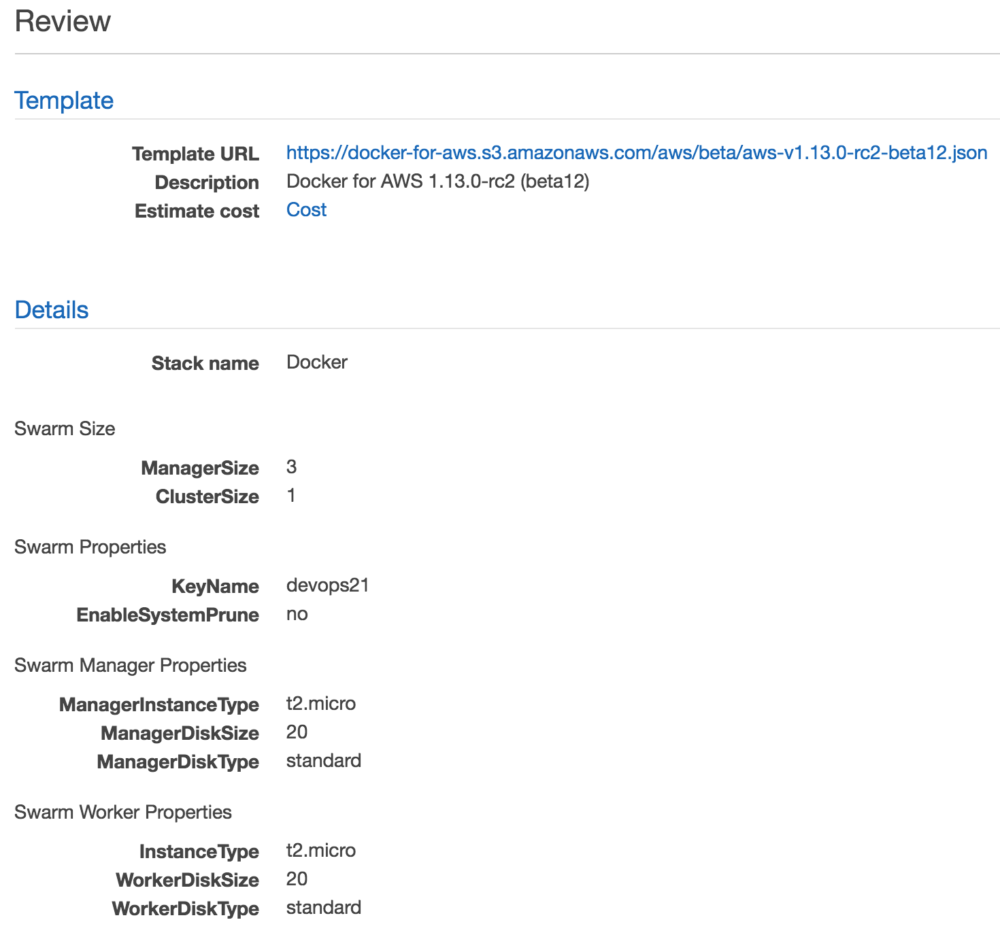

# 在 Amazon Web Services 中创建和管理 Docker Swarm 集群

在快速发展的市场中，适应性远比优化更为重要。

– 拉里·康斯坦丁

终于到了设置一个更接近生产环境的 Swarm 集群的时刻。我在这里加上“更接近”一词，是因为有一些话题我们将在后续章节中探讨。稍后，一旦我们走过几个托管服务商的选项，我们将处理那些缺失的部分（例如：持久存储）。

现在，我们将限制自己创建一个类似生产环境的集群，并探索我们可以选择的不同工具。

由于 AWS 占据了主机市场的最大份额，它是我们将要探索的第一个自然选择的提供商。

我相信 AWS 不需要太多介绍。即使你没有使用过，我相信你也知道它的存在及其大致功能。

**Amazon Web Services** (**AWS**) 于 2006 年创建，提供 IT 基础设施服务。AWS 提供的服务类型后来被广泛称为云计算。有了云计算，企业和个人不再需要提前几周或几个月规划和采购服务器及其他 IT 基础设施。相反，他们可以在几分钟内立即启动成百上千台服务器。

我假设你已经拥有一个 AWS 账号。如果不是这种情况，请前往 Amazon Web Services 并注册。即便你已经决定使用其他云计算提供商或内部服务器，我仍然强烈建议你阅读这一章节。你将接触到一些你可能未曾掌握的工具，并能够将 AWS 与其他解决方案进行对比。

在进入实践操作之前，我们需要安装 AWS CLI，获取访问密钥并决定我们将运行集群的区域和可用区。

# 安装 AWS CLI 并设置环境变量

我们首先应该做的是获取 AWS 凭证。

请打开*Amazon EC2 Console* ([`console.aws.amazon.com/ec2/`](https://console.aws.amazon.com/ec2/))，点击右上角菜单中的你的名字，选择“我的安全凭证”。你将看到包含不同类型凭证的页面。展开“访问密钥”*(Access Key ID*和*Secret Access Key)*部分，然后点击“创建新访问密钥”按钮。展开“显示访问密钥”部分即可查看密钥。

你将无法在之后查看这些密钥，因此这是唯一一次可以下载密钥文件的机会。

本章节中的所有命令都可以在`11-aws.sh` ([`gist.github.com/vfarcic/03931d011324431f211c4523941979f8`](https://gist.github.com/vfarcic/03931d011324431f211c4523941979f8)) Gist 中找到。

我们将把密钥作为环境变量，这些密钥将被本章中探索的工具所使用：

```
export AWS_ACCESS_KEY_ID=[...]

export AWS_SECRET_ACCESS_KEY=[...]

```

请将`[...]`替换为实际的值。

我们需要安装 AWS **命令行界面**（**CLI**）([`aws.amazon.com/cli/`](https://aws.amazon.com/cli/))并收集你的账户信息。

**给 Windows 用户的提示**

我发现安装 awscli 在 Windows 上最便捷的方式是使用*Chocolatey*([`chocolatey.org/`](https://chocolatey.org/))。下载并安装 Chocolatey，然后在管理员命令提示符下运行`choco install awscli`。在本章后面，Chocolatey 将被用于`安装 jq`、`packer`和 terraform。

如果你还没有，请打开*安装 AWS 命令行界面*([`docs.aws.amazon.com/cli/latest/userguide/installing.html`](http://docs.aws.amazon.com/cli/latest/userguide/installing.html))页面，并按照适合你操作系统的安装方法进行安装。

完成后，我们应该通过输出版本来确认安装是否成功：

```
aws --version

```

输出（来自我的笔记本电脑）如下：

```
aws-cli/1.11.15 Python/2.7.10 Darwin/16.0.0 botocore/1.4.72

```

**给 Windows 用户的提示**

你可能需要重新打开*GitBash*终端，以使环境变量`path`的更改生效。

现在命令行界面已经安装完成，我们可以获取集群将运行的区域和可用区。

Amazon EC2 在全球多个地点托管。这些地点由区域和可用区组成。每个区域是一个独立的地理区域，包含多个隔离的地点，这些地点被称为可用区。Amazon EC2 让你能够将资源（如实例）和数据放置在多个地点。

你可以在*可用区域*([`docs.aws.amazon.com/AWSEC2/latest/UserGuide/using-regions-availability-zones.html#concepts-available-regions`](http://docs.aws.amazon.com/AWSEC2/latest/UserGuide/using-regions-availability-zones.html#concepts-available-regions))部分查看当前可用的区域，页面位于*区域和可用区*([`docs.aws.amazon.com/AWSEC2/latest/UserGuide/using-regions-availability-zones.html`](http://docs.aws.amazon.com/AWSEC2/latest/UserGuide/using-regions-availability-zones.html))。

在本章中，我将使用`us-east-1`（美国东部（北弗吉尼亚））区域。你可以根据需要更改为离你位置最近的区域。

请将区域放入环境变量`AWS_DEFAULT_REGION`中：

```
export AWS_DEFAULT_REGION=us-east-1

```

选择好区域后，我们可以决定选择哪个可用区来运行我们的集群。

每个区域都是完全独立的，并由多个可用区组成。区域内的可用区是隔离的，并通过低延迟的连接相连。

一般来说，你应该将集群的所有节点放在同一个区域内，以便享受低延迟连接。节点应该分布在多个可用区内，以确保一个区域的故障不会导致整个集群故障。如果你需要跨多个区域操作，最佳选择是设置多个集群（每个区域一个）。否则，如果设置一个跨多个区域的单一集群，可能会遇到延迟问题。

**第一次使用 AWS 的注意事项**

如果这是你第一次执行 `aws`，你将收到一条消息，要求你配置凭证。请运行 `aws configure` 命令并按照提示操作。你将被要求输入凭证，使用我们之前生成的凭证。对于其余问题，可以直接按回车键跳过。

让我们使用 AWS CLI 查看所选区域中的可用区：

```
aws ec2 describe-availability-zones \
    --region $AWS_DEFAULT_REGION

```

由于我选择了 `us-east-1` 作为区域，输出如下：

```
{
 "AvailabilityZones": [
 {
 "State": "available",
 "RegionName": "us-east-1",
 "Messages": [],
 "ZoneName": "us-east-1a"
 },
 {
 "State": "available",
 "RegionName": "us-east-1",
 "Messages": [],
 "ZoneName": "us-east-1b"
 },

 {
 "State": "available",
 "RegionName": "us-east-1",
 "Messages": [],
 "ZoneName": "us-east-1d"
 }, {
 "State": "available",
 "RegionName": "us-east-1",
 "Messages": [],
 "ZoneName": "us-east-1e"
 }
 ]
}

```

如你所见，`us-east-1` 区域提供了四个可用的可用区（`a`、`b`、`d` 和 `e`）。根据你选择的区域，输出可能会有所不同。

请选择可用区，并将它们放入环境变量中，每个变量对应集群中的五个服务器：

```
AWS_ZONE[1]=b

AWS_ZONE[2]=d

AWS_ZONE[3]=e

AWS_ZONE[4]=b

AWS_ZONE[5]=d

```

随意选择任何可用区的组合。在我的案例中，我决定将集群分布在 `b`、`d` 和 `e` 区域。

现在，我们已经完成了创建 AWS 中第一个 Swarm 集群的前提准备。由于我们在本书的大部分时间里都使用了 Docker Machine，它将是我们的首选工具。

# 使用 Docker Machine 和 AWS CLI 设置 Swarm 集群

我们将继续使用 `vfarcic/cloud-provisioning` ([`github.com/vfarcic/cloud-provisioning`](https://github.com/vfarcic/cloud-provisioning)) 仓库。它包含了一些配置和脚本，可以帮助我们完成操作。你应该已经将其克隆到本地。为了安全起见，我们将拉取最新版本：

```
cd cloud-provisioning

git pull

```

让我们创建第一个 EC2 实例：

```
docker-machine create \
    --driver amazonec2 \
    --amazonec2-zone ${AWS_ZONE[1]} \
    --amazonec2-tags "Type,manager" \
    swarm-1

```

我们指定 *Docker Machine* 使用 `amazonec2` 驱动程序在我们定义的区域变量 `AWS_ZONE_1` 中创建一个实例。

我们为键 `type` 和值 `manager` 创建了一个标签。标签主要用于信息性目的。

最后，我们指定实例的名称为 `swarm-1`。

输出如下：

```
Running pre-create checks...
Creating machine...
(swarm-1) Launching instance...
Waiting for machine to be running, this may take a few minutes...
Detecting operating system of created instance...
Waiting for SSH to be available...
Detecting the provisioner...
Provisioning with ubuntu(systemd)...
Installing Docker...
Copying certs to the local machine directory...
Copying certs to the remote machine...
Setting Docker configuration on the remote daemon...
Checking connection to Docker...
Docker is up and running!
To see how to connect your Docker Client to the Docker Engine running on this\ virtual machine, run: docker-machine env swarm-1

```

Docker Machine 启动了一个 AWS EC2 实例，使用 Ubuntu 进行配置，并安装和配置了 Docker Engine。

现在我们可以初始化集群了。我们应该使用私有 IP 来进行节点间的所有通信。不幸的是，`docker-machine ip` 命令只返回公共 IP，因此我们需要使用其他方法来获取私有 IP。

我们可以使用`aws ec2 describe-instances`命令来检索所有 EC2 实例的信息。我们还通过添加`Name=instance-state-name`，`Values=running`来筛选仅显示正在运行的实例。这样可以排除正在终止或已终止的实例：

```
aws ec2 describe-instances \
    --filter "Name=tag:Name,Values=swarm-1" \
    "Name=instance-state-name,Values=running"

```

`describe-instances` 命令列出了所有 EC2 实例。我们将其与`--filter`结合，限制输出仅显示标记为`swarm-1`的实例。

输出的相关示例如下：

```
{
"Reservations": [
  {
   ...
   "Instances": [
    {
     ...
     "PrivateIpAddress": "172.31.51.25",
     ...

```

即使我们获取了与`swarm-1` EC2 实例相关的所有信息，我们仍然需要将输出限制为`PrivateIpAddress`值。我们将使用`jq`（[`stedolan.github.io/jq/`](https://stedolan.github.io/jq/)）来筛选输出并获取所需内容。请下载并安装适合您操作系统的发行版：

**Windows 用户注意事项**

使用 Chocolatey，在管理员命令提示符中通过`choco install jq`安装`jq`。

```
MANAGER_IP=$(aws ec2 describe-instances \
    --filter "Name=tag:Name,Values=swarm-1" \
    "Name=instance-state-name,Values=running" \
    | jq -r ".Reservations[0].Instances[0].PrivateIpAddress")

```

我们使用`jq`检索了 Reservations 数组的第一个元素。在该元素中，我们获取了 Instances 的第一个条目，然后是`PrivateIpAddress`。`-r`选项返回其原始格式的值（此处为没有双引号的 IP）。命令的结果被存储在环境变量`MANAGER_IP`中。

为了安全起见，我们可以回显新创建的变量值：

```
echo $MANAGER_IP

```

输出如下：

```
172.31.51.25

```

现在我们可以像之前章节中一样执行`swarm init`命令：

```
eval $(docker-machine env swarm-1)

docker swarm init \
    --advertise-addr $MANAGER_IP

```

让我们确认集群确实已初始化：

```
docker node ls

```

输出如下（为了简洁，已去除 ID）：

```
HOSTNAME  STATUS  AVAILABILITY  MANAGER STATUS
swarm-1   Ready   Active        Leader

```

除了创建 EC2 实例，`docker-machine` 还创建了一个安全组。

安全组充当虚拟防火墙，控制流量。当您启动实例时，您将一个或多个安全组与实例关联。您可以向每个安全组添加规则，允许流量进出其关联的实例。

在撰写本文时，Docker Machine 尚未适配支持 Swarm 模式。因此，它创建了一个名为`docker-machine`的 AWS 安全组，仅开放了入口（入站）端口`22`和`2376`，所有端口的出口（出站）均已开放。

为了使 Swarm 模式正常工作，应该打开的入口端口如下：

+   用于集群管理通信的 TCP 端口 2377

+   用于节点之间通信的 TCP 和 UDP 端口 7946

+   用于覆盖网络流量的 TCP 和 UDP 端口 4789

要修改安全组，我们需要获取其 ID。我们可以使用`aws ec2 describe-security-groups`命令查看安全组的详细信息：

```
aws ec2 describe-security-groups \
    --filter "Name=group-name,Values=docker-machine"

```

输出的一部分如下：

```
...
           "GroupName": "docker-machine",
           "VpcId": "vpc-7bbc391c",
           "OwnerId": "036548781187",
           "GroupId": "sg-f57bf388"
        }
    ]
}

```

将 ID 分配给`SECURITY_GROUP_ID`环境变量的命令如下：

```
SECURITY_GROUP_ID=$(aws ec2 \
    describe-security-groups \
    --filter \
    "Name=group-name,Values=docker-machine" |\ 
    jq -r '.SecurityGroups[0].GroupId')

```

我们请求了关于安全组`docker-machine`的信息，并筛选了 JSON 输出以获取位于`SecurityGroups`数组第一个元素中的`GroupId`键。

现在我们可以使用`aws ec2 authorize-security-group-ingress`命令来打开 TCP 端口`2377`、`7946`和`4789`：

```
for p in 2377 7946 4789; do \
    aws ec2 authorize-security-group-ingress \
        --group-id $SECURITY_GROUP_ID \
        --protocol tcp \
        --port $p \
        --source-group $SECURITY_GROUP_ID
done

```

我们应该执行一个类似的命令来打开 UDP 端口`7946`和`4789`：

```
for p in 7946 4789; do \
    aws ec2 authorize-security-group-ingress \
        --group-id $SECURITY_GROUP_ID \
        --protocol udp \
        --port $p \
        --source-group $SECURITY_GROUP_ID
done

```

请注意，在所有情况下，我们指定了`source-group`应该与安全组相同。这意味着端口将仅对属于相同组的实例开放。换句话说，这些端口对公众不可用。由于它们仅用于集群内部的通信，因此没有必要通过进一步暴露这些端口来危及我们的安全。

请重复执行`aws ec2 describe-security-groups`命令，确认端口确实已经打开：

```
aws ec2 describe-security-groups \
    --filter \
    "Name=group-name,Values=docker-machine"

```

现在我们可以向集群中添加更多节点。我们将通过创建两个新的实例并将其作为管理节点加入集群来开始：

```
MANAGER_TOKEN=$(docker swarm join-token -q manager)

for i in 2 3; do
    docker-machine create \
        --driver amazonec2 \
        --amazonec2-zone ${AWS_ZONE[$i]} \
        --amazonec2-tags "Type,manager" \
        swarm-$i

    IP=$(aws ec2 describe-instances \
        --filter "Name=tag:Name,Values=swarm-$i" \
        "Name=instance-state-name,Values=running" \
        | jq -r ".Reservations[0].Instances[0].PrivateIpAddress")

eval $(docker-machine env swarm-$i)

    docker swarm join \
        --token $MANAGER_TOKEN \
        --advertise-addr $IP \
        $MANAGER_IP:2377
done

```

由于我们刚才执行的命令是我们之前使用过命令的组合，因此无需再解释。

我们还将添加一些工作节点：

```
WORKER_TOKEN=$(docker swarm join-token -q worker)

for i in 4 5; do
  docker-machine create \
    --driver amazonec2 \
    --amazonec2-zone ${AWS_ZONE[$i]} \
    --amazonec2-tags "type,worker" \
    swarm-$i

  IP=$(aws ec2 describe-instances \
    --filter "Name=tag:Name,Values=swarm-$i" \
    "Name=instance-state-name,Values=running" \
    | jq -r ".Reservations[0].Instances[0].PrivateIpAddress")

eval $(docker-machine env swarm-$i)

  docker swarm join \
    --token $WORKER_TOKEN \
    --advertise-addr $IP \
    $MANAGER_IP:2377
done

```

让我们确认所有五个节点确实形成了集群：

```
eval $(docker-machine env swarm-1)

docker node ls

```

输出如下（为了简洁，ID 已移除）：

```
HOSTNAME  STATUS  AVAILABILITY  MANAGER STATUS
swarm-4   Ready   Active
swarm-2   Ready   Active        Reachable
swarm-3   Ready   Active        Reachable
swarm-5   Ready   Active
swarm-1   Ready   Active        Leader

```

就这样。我们的集群已经准备好了。剩下的唯一事情就是部署一些服务，并确认集群按预期运行。

由于我们已经创建了很多次服务，我们将通过`vfarcic/docker-flow-proxy/docker-compose-stack.yml` ([`github.com/vfarcic/docker-flow-proxy/blob/master/docker-compose-stack.yml`](https://github.com/vfarcic/docker-flow-proxy/blob/master/docker-compose-stack.yml))和`vfarcic/go-demo/docker-compose-stack.yml` ([`github.com/vfarcic/go-demo/blob/master/docker-compose-stack.yml`](https://github.com/vfarcic/go-demo/blob/master/docker-compose-stack.yml)) Compose 堆栈来加速过程。它们将创建`proxy`、`swarm-listener`、`go-demo-db`和`go-demo`服务：

```
docker-machine ssh swarm-1

sudo docker network create --driver overlay proxy

curl -o proxy-stack.yml \
    https://raw.githubusercontent.com/ \
vfarcic/docker-flow-proxy/master/docker-compose-stack.yml 

sudo docker stack deploy \
    -c proxy-stack.yml proxy

curl -o go-demo-stack.yml \
    https://raw.githubusercontent.com/ \
vfarcic/go-demo/master/docker-compose-stack.yml

sudo docker stack deploy \
    -c go-demo-stack.yml go-demo

exit

docker service ls

```

非 Windows 用户无需进入`swarm-1`机器，可以直接从他们的笔记本电脑部署堆栈来实现相同的结果。

下载所有镜像需要一些时间。过了一会儿，`service ls`命令的输出应该如下所示（为了简洁，ID 已移除）：

```
NAME                 MODE       REPLICA IMAGE
go-demo_db           replicated 1/1     mongo:latest
go-demo_main         replicated 3/3     vfarcic/go-demo:latest
proxy_swarm-listener replicated 1/1     vfarcic/docker-flow-swarmlistener:latest
proxy_proxy          replicated 2/2     vfarcic/docker-flow-proxy:latest

```

让我们确认`go-demo`服务是可以访问的：

```
curl "$(docker-machine ip swarm-1)/demo/hello"

```

输出如下：

```
curl: (7) Failed to connect to 54.157.196.113 port 80: Operation timed out

```

这真尴尬。尽管所有服务都在运行，并且我们使用了与前几章相同的命令，但我们无法访问`proxy`，也无法通过它访问`go-demo`服务。

解释很简单。我们从未打开过`80`和`443`端口。默认情况下，所有进入 AWS EC2 实例的流量都是关闭的，我们只打开了 Swarm 正常运行所需的端口。这些端口在附加到`docker-machine security`组的 EC2 实例内部是开放的，但在我们的 AWS VPC 外部是关闭的。

我们将使用`aws ec2 authorize-security-group-ingress`命令来打开`80`和`443`端口。这次我们将指定`cidr`而不是`source-group`作为源：

```
for p in 80 443; do
    aws ec2 authorize-security-group-ingress \
        --group-id $SECURITY_GROUP_ID \
        --protocol tcp \
        --port $p \
        --cidr "0.0.0.0/0"
done

```

`aws ec2 authorize-security-group-ingress`命令执行了两次；一次是为端口`80`，第二次是为端口`443`。

让我们再发送一次请求：

```
curl "$(docker-machine ip swarm-1)/demo/hello"

```

这次的输出符合预期。我们得到了响应：

```
hello, world!

```

我们使用 Docker Machine 和 AWS CLI 在 AWS 中设置了整个 Swarm 集群。这是我们需要的全部吗？这取决于我们为集群定义的要求。我们可能还需要添加一些弹性 IP 地址。

弹性 IP 地址是一种为动态云计算设计的静态 IP 地址。它与您的 AWS 账户相关联。通过弹性 IP 地址，您可以快速将地址重新映射到您账户中的另一个实例，从而掩盖实例或软件的故障。弹性 IP 地址是一个公共 IP 地址，可以从互联网访问。如果您的实例没有公共 IP 地址，您可以将弹性 IP 地址与其关联，以便与互联网通信；例如，从本地计算机连接到您的实例。

换句话说，我们可能应该至少设置两个弹性 IP 地址，并将它们映射到集群中的两个 EC2 实例。这两个（或更多）IP 地址将作为我们的 DNS 记录。这样，当一个实例发生故障，并且我们用一个新实例替换时，我们可以重新映射弹性 IP 而不影响用户。

我们还可以做一些其他改进。然而，这将使我们陷入一个尴尬的境地。我们将使用一个并非为设置复杂集群而设计的工具。

创建虚拟机（VM）的过程相当慢。Docker Machine 花费了太多时间为其配置 Ubuntu 并安装 Docker Engine。我们可以通过创建一个预装 Docker Engine 的**Amazon 机器镜像**（**AMI**）来减少这个时间。然而，采取这样的行动会使得使用 Docker Machine 的主要原因消失。它的主要优势是简单性。一旦我们开始将设置复杂化，加入其他 AWS 资源，我们就会发现简单性被过多的临时命令取代了。

当我们处理一个小型集群时，运行`docker-machine`和`aws`命令效果很好，特别是当我们想快速创建一些东西，而且这些东西可能并不非常持久。最大的问题是，到目前为止我们所做的一切都是临时命令。很可能我们无法在第二次重复相同的步骤。我们的基础设施没有文档化，所以我们的团队不知道我们的集群由什么组成。

我的建议是使用`docker-machine`和`aws`作为一种快速且简单的方式来创建集群，主要用于演示目的。只要集群相对较小，它对生产环境也能有用。

如果我们想要设置一个复杂、更大且可能更持久的解决方案，我们应该考虑其他方案。

让我们删除我们创建的集群，并以一个全新的状态探索其他方案：

```
for i in 1 2 3 4 5; do
    docker-machine rm -f swarm-$i
done

```

唯一剩下的就是删除`docker-machine`创建的安全组：

```
aws ec2 delete-security-group \
    --group-id $SECURITY_GROUP_ID

```

如果实例尚未终止，最后一条命令可能会失败。如果是这种情况，请稍等片刻并重新执行命令。

让我们继续探索*Docker for AWS*。

# 使用 Docker for AWS 设置 Swarm 集群

在我们使用*Docker for AWS*创建 Swarm 集群之前，我们需要生成一个将用于 SSH 连接到 EC2 实例的密钥对。

要创建一个新的`key-pair`，请执行以下命令：

```
aws ec2 create-key-pair \
    --key-name devops21 \
    | jq -r '.KeyMaterial' >devops21.pem

```

我们执行了`aws ec2 create-key-pair`命令，并将`devops21`作为名称传入。输出通过`jq`过滤，以确保只返回实际的值。最后，我们将输出内容发送到`devops21.pem`文件。

如果有人拿到你的密钥文件，你的实例将会暴露。因此，我们应该把密钥移到一个安全的地方。

在 Linux/OSX 系统上，SSH 密钥的常见位置是`$HOME/.ssh`。如果你是 Windows 用户，可以根据需要更改下面的命令，将其指向你认为合适的位置：

```
mv devops21.pem $HOME/.ssh/devops21.pem

```

我们还应该更改权限，只为当前用户提供读取访问权限，并移除其他用户或组的所有权限。如果您是 Windows 用户，请随意跳过下面的命令：

```
chmod 400 $HOME/.ssh/devops21.pem

```

最后，我们将把密钥的路径放入环境变量`KEY_PATH`中：

```
export KEY_PATH=$HOME/.ssh/devops21.pem

```

现在我们已经准备好使用*Docker for AWS*创建 Swarm 堆栈了。

请打开*Docker for AWS 发布说明*([`docs.docker.com/docker-for-aws/release-notes/`](https://docs.docker.com/docker-for-aws/release-notes/))页面，并点击“为 AWS 部署 Docker 社区版”按钮。

登录到*AWS 控制台*后，您将看到“选择模板”页面。这是一个通用的 CloudFormation 页面，Docker for AWS 模板已被选中：


图 11-1：Docker For AWS 选择模板屏幕

这里不需要做太多操作，所以请点击“下一步”按钮。

下一屏幕允许我们指定即将启动的堆栈的详细信息。各个字段应该是自解释的。我们唯一的修改是将 Swarm 工作节点的数量从*5*减少到*1*。本节中的练习不需要超过四台服务器，因此三个管理节点和一个工作节点应该足够了。我们将实例类型保持默认值`t2.micro`。通过仅创建四个微型节点，整个练习的成本几乎可以忽略不计，而且你不会因为我而破产，甚至可以告诉朋友们这个费用连你喝的那罐可乐或咖啡的钱都不值。

“使用哪个 SSH 密钥？”字段应填入我们刚刚创建的`devops21`密钥。请选择它：


图 11-2：Docker For AWS 指定详细信息屏幕

点击“下一步”按钮。

我们不会更改 Options 屏幕中的任何内容。稍后，当你熟悉*Docker for AWS*时，你可能会想回到这个屏幕，调整一些额外选项。现在，我们暂时忽略它的存在：


图 11-3：Docker For AWS 选项屏幕

点击下一步按钮。

我们已经到达最后一个屏幕。请随意检查堆栈信息。完成后，点击“我确认 AWS CloudFormation 可能会创建 IAM 资源”*.* 复选框，然后点击创建按钮：



图 11-4：Docker For AWS 审核屏幕

你将看到一个允许你创建新堆栈的界面。请点击右上角的刷新按钮。你将看到状态为`CREATE_IN_PROGRESS`的*Docker*堆栈。

创建所有资源将需要一段时间。如果你想查看进度，请选择*Docker*堆栈并点击位于屏幕右下角的恢复按钮。你将看到由*Docker for AWS*模板生成的所有事件列表。你可以在等待堆栈创建完成时，随意查看各个选项卡的内容：


图 11-5：Docker For AWS 堆栈状态屏幕

一旦*Docker*堆栈的状态为`CREATE_COMPLETE`，我们就可以继续。

我们的集群已经准备好。我们可以进入其中一个管理节点，详细探索集群。

要查找 Swarm 管理节点的信息，请点击 Outputs 选项卡：


图 11-6：Docker For AWS 堆栈输出屏幕

你将看到两行。

我们将把 DefaultDNSTarget 的值存储在环境变量中。它很快就会派上用场：

```
DNS=[...]

```

请将`[...]`替换为实际的 DefaultDNSTarget 值。

如果这是一个“真实”的生产集群，你将用它来更新你的 DNS 记录。它是你系统的公共入口。

点击“管理节点”列旁边的链接。你将看到包含按管理节点过滤的结果的 EC2 实例屏幕。工作节点将被隐藏：


图 11-7：按管理节点过滤的 Docker For AWS EC2 实例

选择一个管理节点并找到其公共 IP。和 DNS 一样，我们将把它存储为一个环境变量：

```
MANAGER_IP=[...]

```

请将`[...]`替换为实际的公共 IP 值。

我们终于准备好通过 SSH 进入其中一个管理节点，探索我们刚创建的集群：

```
ssh -i $KEY_PATH docker@$MANAGER_IP

```

一旦进入服务器，你将看到一条欢迎信息。专为该堆栈设计的操作系统非常简约，信息也反映了这一点：

```
Welcome to Docker!
~ $

```

和往常一样，我们将通过列出形成集群的节点来开始：

```
docker node ls

```

输出如下（为了简洁，已删除 ID）：

```
HOSTNAME                     STATUS  AVAILABILITY  MANAGER STATUS
ip-10-0-17-154.ec2.internal  Ready   Active        Reachable
ip-10-0-15-215.ec2.internal  Ready   Active        Reachable
ip-10-0-31-44.ec2.internal   Ready   Active
ip-10-0-15-214.ec2.internal  Ready   Active        Leader

```

剩下的就是创建一些服务，以确认集群按预期工作。

我们将部署与我们使用 Docker Machine 创建的集群相同的`vfarcic/docker-flow-proxy/docker-compose-stack.yml`（[`github.com/vfarcic/docker-flow-proxy/blob/master/docker-compose-stack.yml`](https://github.com/vfarcic/docker-flow-proxy/blob/master/docker-compose-stack.yml)）和`vfarcic/go-demo/docker-compose-stack.yml`（[`github.com/vfarcic/go-demo/blob/master/docker-compose-stack.yml`](https://github.com/vfarcic/go-demo/blob/master/docker-compose-stack.yml)）堆栈：

```
sudo docker network create --driver overlay proxy

curl -o proxy-stack.yml \
    https://raw.githubusercontent.com/ \
vfarcic/docker-flow-proxy/master/docker-compose-stack.yml

docker stack deploy \
    -c proxy-stack.yml proxy

curl -o go-demo-stack.yml \
    https://raw.githubusercontent.com/ \
vfarcic/go-demo/master/docker-compose-stack.yml

docker stack deploy \
    -c go-demo-stack.yml go-demo

```

我们下载了 Compose 文件并部署了堆栈。

让我们确认服务是否确实在运行：

```
docker service ls

```

一段时间后，输出应该如下所示（为了简洁，ID 已移除）：

```
NAME                 MODE       REPLICAS 
proxy_proxy          replicated 2/2      
go-demo_main         replicated 3/3      
proxy_swarm-listener replicated 1/1      
go-demo_db           replicated 1/1      
----------------------------------------------
IMAGE
vfarcic/docker-flow-proxy:latest
vfarcic/go-demo:latest
vfarcic/docker-flow-swarm-listener:latest
mongo:latest 

```

让我们退出服务器并确认`go-demo`服务是否对公众可访问：

```
exit

curl $DNS/demo/hello

```

如预期，我们收到了确认集群正在运行并且可访问的响应：

```
hello, world!

```

如果我们的服务器过于拥挤，需要扩展容量，会发生什么？我们如何增加（或减少）形成集群的节点数量？答案就在于 AWS 自动扩展组。请点击 EC2 控制台左侧菜单中的自动扩展组链接，并选择以`Docker-NodeAsg`开头的组名所在的行：


图 11-8：Docker For AWS 自动扩展组

要扩展或缩减节点数量，我们只需点击操作菜单中的编辑按钮，将 Desired 字段的值从`1`更改为`*2*`，然后点击保存按钮。Desired 实例的数量将立即更改为`2`。不过，可能需要一些时间，直到实际的实例数量与期望的数量一致。让我们回到其中一个管理服务器，并确认我们表达的需求是否确实得到了满足：

```
ssh -i $KEY_PATH docker@$MANAGER_IP

docker node ls

```

直到新实例被创建并加入集群可能需要一些时间。最终结果应该如下所示（为了简洁，ID 已移除）：

```
HOSTNAME                     STATUS  AVAILABILITY  MANAGER STATUS
ip-10-0-17-154.ec2.internal  Ready   Active        Reachable
ip-10-0-15-215.ec2.internal  Ready   Active        Reachable
ip-10-0-31-44.ec2.internal   Ready   Active
ip-10-0-15-214.ec2.internal  Ready   Active        Leader
ip-10-0-11-174.ec2.internal  Ready   Active

```

如果其中一台服务器故障，会发生什么？毕竟，任何事情都会早晚出现故障。我们可以通过移除其中一个节点来进行测试。

请从 EC2 控制台左侧菜单中点击实例链接，选择一个`Docker-worker`节点，点击操作，然后将实例状态更改为终止。通过点击“是，终止”按钮确认终止：

```
docker node ls

```

一段时间后，`node ls`命令的输出应如下所示（为了简洁，ID 已移除）：

```
HOSTNAME                     STATUS  AVAILABILITY  MANAGER STATUS
ip-10-0-17-154.ec2.internal  Ready   Active        Reachable
ip-10-0-15-215.ec2.internal  Ready   Active        Reachable
ip-10-0-31-44.ec2.internal   Ready   Active
ip-10-0-15-214.ec2.internal  Ready   Active        Leader
ip-10-0-11-174.ec2.internal  Down    Active

```

一旦自动扩展组意识到节点已停止，它将开始创建一个新的节点并将其加入到集群中：

```
docker node ls

```

不久后，`node ls`命令的输出应如下所示（为了简洁，ID 已移除）：

```
HOSTNAME                     STATUS  AVAILABILITY  MANAGER STATUS
ip-10-0-17-154.ec2.internal  Ready   Active        Reachable
ip-10-0-15-215.ec2.internal  Ready   Active        Reachable
ip-10-0-2-22.ec2.internal    Ready   Active
ip-10-0-31-44.ec2.internal   Ready   Active
ip-10-0-15-214.ec2.internal  Ready   Active        Leader
ip-10-0-11-174.ec2.internal  Down    Active

```

我们终止的服务器仍然标记为`Down`，并且一个新的服务器会被创建并加入到集群中，取而代之。

*Docker for AWS* 堆栈的内容远不止我们所探索的那些。我希望通过这次简短的探索，你所学到的内容能为你提供足够的基础信息，帮助你独立扩展知识。

我们不会继续探索堆栈的更多细节，而是看看如何在没有 UI 的情况下完成相同的结果。到这时，你应该已经足够了解我，明白我更倾向于使用可自动化和可重复的方式来执行任务。除非必要，我通常不会使用 UI，破例仅仅是为了让你更好地理解 *Docker for AWS* 堆栈的工作原理。接下来将介绍一种完全自动化的方法来完成相同的任务。

在我们继续之前，我们将删除堆栈，并且随之删除集群。这将是本章中你看到 UI 的最后一次。

请点击顶部菜单中的 Services 链接，然后点击 CloudFormation 链接。选择 Docker 堆栈，并从操作菜单中点击删除堆栈选项：


图 11-9：Docker For AWS 删除堆栈屏幕

在点击删除堆栈后，点击出现的确认删除按钮，确认摧毁操作。

# 使用 Docker for AWS 自动设置 Swarm 集群

从 UI 创建一个 *Docker for AWS* 堆栈是一次很好的练习。它帮助我们更好地理解了事物的运作方式。然而，我们的任务是尽可能自动化更多的流程。通过自动化，我们可以提高速度、可靠性和质量。当我们进行一些手动操作时，比如浏览 UI 并选择不同的选项，就增加了由于人为错误导致出错的可能性。我们很慢。当需要执行可重复的步骤时，我们远不如机器高效。

由于我对手动执行可重复任务的不信任，寻求一种更自动化的方式来创建 *Docker for AWS* 堆栈是很自然的。通过 AWS 控制台，我们所做的只是填入一些字段，这些字段在后台生成的参数会被用来执行 `CloudFormation` 过程。我们可以在没有 UI 的情况下做同样的事。

我们将从定义一些环境变量开始。它们将与本章中你已创建的变量相同。如果你仍然保持相同的终端会话，可以跳过接下来的命令：

```
export AWS_DEFAULT_REGION=us-east-1

export AWS_ACCESS_KEY_ID=[...]

export AWS_SECRET_ACCESS_KEY=[...]

```

请将 `us-east-1` 更改为你选择的区域，并用实际的值替换 `[...]`。

如果你还记得第一个允许我们选择模板的屏幕，你会记得其中有一个字段，预填充了一个 CloudFormation 模板的 URL。在撰写本文时，该模板是 `Docker.tmpl`（[`editions-us-east-1.s3.amazonaws.com/aws/stable/Docker.tmpl`](https://editions-us-east-1.s3.amazonaws.com/aws/stable/Docker.tmpl)）。请注意，这个地址在不同区域之间是不同的。我将使用 `us-east-1` 版本。

我们可以通过 `curl` 获取模板内容来检查它：

```
curl https://editions-us-east-1.s3.amazonaws.com/aws/stable/Docker.tmpl

```

请花点时间查看输出。即使你不熟悉 `CloudFormation` 语法，你也应该能识别出 AWS 资源。

我们最感兴趣的模板部分是元数据（Metadata）：

```
curl https://editions-us-east-1.s3.amazonaws.com/aws/stable/ \
Docker.tmpl  \
    | jq '.Metadata'

```

输出如下：

```
{
  "AWS::CloudFormation::Interface": {
    "ParameterGroups": [
      {
        "Label": {
          "default": "Swarm Size"
         },
        "Parameters": [
         "ManagerSize",
         "ClusterSize"
        ]
      },
    {
        "Label": {
        "default": "Swarm Properties"
        },
        "Parameters": [
         "KeyName",
         "EnableSystemPrune",
         "EnableCloudWatchLogs"
        ]
    },
    {
        "Label": {
         "default": "Swarm Manager Properties"
      },
        "Parameters": [
         "ManagerInstanceType",
         "ManagerDiskSize",
         "ManagerDiskType"
        ]
    },
    {
        "Label": {
         "default": "Swarm Worker Properties"
        },
        "Parameters": [
         "InstanceType",
         "WorkerDiskSize",
         "WorkerDiskType"
        ]
    }
  ],
        "ParameterLabels": {
         "ClusterSize": {
          "default": "Number of Swarm worker nodes?"
        },
      "EnableCloudWatchLogs": {
       "default": "Use Cloudwatch for container logging?"
      },
      "EnableSystemPrune": {
       "default": "Enable daily resource cleanup?"
      },
      "InstanceType": {
       "default": "Agent worker instance type?"
      },
      "KeyName": {
       "default": "Which SSH key to use?"
      },
      "ManagerDiskSize": {
       "default": "Manager ephemeral storage volume size?"
      },
      "ManagerDiskType": {
       "default": "Manager ephemeral storage volume type"
      },
      "ManagerInstanceType": {
       "default": "Swarm manager instance type?"
      },
      "ManagerSize": {
       "default": "Number of Swarm managers?"
      },
      "WorkerDiskSize": {
       "default": "Worker ephemeral storage volume size?"
      },
      "WorkerDiskType": {
       "default": "Worker ephemeral storage volume type"
      }
    }
  }
}

```

我们可以使用 `ParameterLabels` 来定制模板的结果。

创建与我们通过 AWS 控制台生成的相同堆栈的命令如下：

```
aws cloudformation create-stack \
    --template-url https://editions-us-east \
    -1.s3.amazonaws.com/aws/stable/Docker.tmpl \
    --stack-name swarm \
    --capabilities CAPABILITY_IAM \
    --parameters \
    ParameterKey=KeyName,ParameterValue=devops21 \
    ParameterKey=InstanceType,ParameterValue=t2.micro \
    ParameterKey=ManagerInstanceType,ParameterValue=t2.micro \
    ParameterKey=ManagerSize,ParameterValue=3 \
    ParameterKey=ClusterSize,ParameterValue=1

```

该命令应该是自解释的。我们使用 `aws` 创建了一个包含所有必需参数的 `CloudFormation` 堆栈。

我们可以通过执行 `cloudformation describe-stack-resources` 命令来监控堆栈资源的状态：

```
aws cloudformation describe-stack-resources \
    --stack-name swarm

```

一段时间后，应该会创建三个管理节点实例：

```
aws ec2 describe-instances \
    --filters "Name=tag:Name,Values=swarm-Manager" \
    "Name=instance-state-name,Values=running"

```

现在我们可以进入其中一个管理节点并开始创建服务。我将跳过创建服务并验证它们是否正常工作的示例。最终结果是与之前通过 AWS 控制台创建的相同集群。

随时可以自行探索集群，并在完成后 `delete` 堆栈：

```
aws cloudformation delete-stack \
    --stack-name swarm

```

除了小型集群，*Docker for AWS* 比使用 `docker-machine` 和 `aws` 命令的组合要好得多。它是一个更稳健、更可靠的解决方案。然而，它也有一些缺点。

*Docker for AWS* 仍然年轻，且容易发生频繁的变化。此外，它还非常新，文档几乎不存在。

作为一种开箱即用的解决方案，它非常容易使用且几乎不需要任何努力。这既是福音也是诅咒。如果你需要的功能与 *Docker for AWS* 提供的功能大致相同，那么它是一个不错的选择。然而，如果你的需求不同，在尝试将模板适应你的需求时，可能会遇到不少问题。该解决方案基于一个自定义操作系统、`CloudFormation` 模板和专为此目的构建的容器。强烈建议不要修改除模板之外的任何内容。

总的来说，我认为 *Docker for AWS* 有着非常光明的未来，并且在大多数情况下，它比 `docker-machine` 更好。如果这两者是唯一的选择，我会投票支持使用 *Docker for AWS*。幸运的是，我们可以选择许多其他选项；比一本书可以容纳的要多得多。你可能正在阅读书籍的印刷版，而我不太愿意牺牲太多的树木。因此，我只会展示我们可以用来创建 Swarm（或任何其他类型）集群的另一个工具集。

# 使用 Packer 和 Terraform 设置 Swarm 集群

这次我们将使用一组与 Docker 完全无关的工具。它们是 *Packer*([`www.packer.io/`](https://www.packer.io/)) 和 *Terraform* ([`www.terraform.io/`](https://www.terraform.io/))。这两者都来自 *HashiCorp* ([`www.hashicorp.com/`](https://www.hashicorp.com/))。

**Windows 用户注意事项**

使用 Chocolatey，通过管理员命令提示符执行 `choco install packer` 安装 packer。对于 terraform，在管理员命令提示符中执行 `choco install terraform`。

Packer 允许我们创建机器镜像。使用 Terraform，我们可以创建、修改和改进集群基础设施。两者都支持几乎所有主要的提供商。它们可以与 Amazon EC2、CloudStack、DigitalOcean、Google Compute Engine（GCE）、Microsoft Azure、VMware、VirtualBox 以及许多其他平台一起使用。基础设施独立的能力使我们能够避免供应商锁定。通过最小的配置更改，我们可以轻松地将集群从一个提供商迁移到另一个提供商。Swarm 的设计旨在无缝运行，无论我们使用哪个托管提供商，只要基础设施得到妥善定义。通过 Packer 和 Terraform，我们可以以这种方式定义基础设施，使得从一个提供商过渡到另一个提供商尽可能无痛。

# 使用 Packer 创建 Amazon 机器镜像

`vfarcic/cloud-provisioning` ([`github.com/vfarcic/cloud-provisioning`](https://github.com/vfarcic/cloud-provisioning)) 仓库已经包含了我们将要使用的 Packer 和 Terraform 配置文件。它们位于`terraform/aws`目录下：

```
cd terraform/aws

```

第一步是使用 Packer 创建一个**Amazon 机器镜像**（**AMI**）。为此，我们需要将 AWS 访问密钥设置为环境变量。它们将与您在本章中已经创建的密钥相同。如果您仍然保持当前终端会话打开，可以跳过下一组命令：

```
export AWS_ACCESS_KEY_ID=[...]

export AWS_SECRET_ACCESS_KEY=[...]

export AWS_DEFAULT_REGION=us-east-1

```

请将`[...]`替换为实际值。

我们将从相同的 AMI 实例化所有 Swarm 节点。它将基于 Ubuntu，并安装最新的 Docker 引擎。

我们即将构建的镜像的 JSON 定义位于`terraform/aws/packer-ubuntu-docker.json` ([`github.com/vfarcic/cloud-provisioning/blob/master/terraform/aws/packer-ubuntu-docker.json`](https://github.com/vfarcic/cloud-provisioning/blob/master/terraform/aws/packer-ubuntu-docker.json))：

```
cat packer-ubuntu-docker.json

```

配置由两个部分组成：`builders`和`provisioners`：

```
{
   "builders": [{
   ...
  }],
   "provisioners": [{
   ...
  }]
}

```

builders 部分定义了 Packer 构建镜像所需的所有信息。`provisioners`部分描述了用于安装和配置软件的命令，这些命令将用于 builders 创建的机器。唯一必需的部分是 builders。

Builders 负责创建机器并为各种平台生成镜像。例如，EC2、VMware、VirtualBox 等都有单独的 builders。Packer 默认带有许多 builders，也可以扩展以添加新的 builders。

我们将使用的`builders`部分如下：

```
"builders": [{
  "type": "amazon-ebs",
  "region": "us-east-1",
  "source_ami_filter": {
    "filters": {
      "virtualization-type": "hvm",
      "name": "*ubuntu-xenial-16.04-amd64-server-*",
      "root-device-type": "ebs"
    },
    "owners": ["099720109477"],
    "most_recent": true
  },
  "instance_type": "t2.micro",
  "ssh_username": "ubuntu",
  "ami_name": "devops21",
  "force_deregister": true 
}],

```

每种类型的 builder 都有特定的参数可以使用。我们指定了`type`为`amazon-ebs`。除了`amazon-ebs`，我们还可以使用`amazon-instance`和`amazon-chroot` builders 来构建 AMI。在大多数情况下，我们应该使用`amazon-ebs`。更多信息，请访问*Amazon AMI Builder* ([`www.packer.io/docs/builders/amazon.html`](https://www.packer.io/docs/builders/amazon.html)) 页面。

请注意，在使用`amazon-ebs`类型时，我们必须提供 AWS 密钥。我们本可以通过`access_key`和`secret_key`字段来指定它们。然而，也有一种替代方法。如果这些字段未指定，Packer 将尝试从环境变量`AWS_ACCESS_KEY_ID`和`AWS_SECRET_ACCESS_KEY`中获取值。由于我们已经导出了这些值，因此无需在 Packer 配置中重复设置它们。此外，这些密钥应该是保密的，将它们放在配置文件中可能会导致泄露风险。

该区域非常重要，因为 AMI 只能在一个区域内创建。如果我们希望在多个区域共享相同的机器，则每个区域都需要被指定为一个单独的构建器。

我们本可以通过`source_ami`指定初始 AMI 的 ID，该 AMI 将作为新创建机器的基础。然而，由于 AMI 是特定于某个区域的，如果我们决定更改区域，指定 ID 会使其无法使用。因此，我们采取了不同的方法，指定了`source_ami_filter`，该字段将填充`source_ami`字段。它将过滤 AMI 并找到一张 Ubuntu `16.04`镜像，要求其虚拟化类型为`hvm`，根设备类型设置为`ebs`。`owners`字段将限制结果为可信的 AMI 提供商。由于如果返回多个 AMI，过滤器会失败，因此`most_recent`字段将通过选择最新的镜像来限制结果。

`instance_type`字段定义了将用于构建 AMI 的 EC2 实例类型。请注意，这不会阻止我们基于此镜像实例化任何其他支持的实例类型，在本例中是由 Ubuntu 支持的类型。

与我们使用的其他字段不同，`ssh_username`并非特定于`amazon-ebs`构建器。它指定了 Packer 在创建镜像时将使用的用户。与实例类型一样，它不会阻止我们在基于此镜像实例化 VM 时指定任何其他用户。

`ami_name`字段是我们为此 AMI 指定的名称。

如果我们已经创建了具有相同 AMI 的镜像，则`force_deregister`字段将在创建新镜像之前删除它。

请访问*AMI 构建器（EBS 支持）*([`www.packer.io/docs/builders/amazon-ebs.html`](https://www.packer.io/docs/builders/amazon-ebs.html))页面以获取更多信息。

第二部分是`provisioners`。它包含一个 Packer 应使用的所有配置器数组，用于在将机器转化为机器镜像之前，在运行中的机器上安装和配置软件。

我们可以使用相当多的配置器类型。如果你读过*The DevOps 2.0 Toolkit*，你会知道我推荐使用 Ansible 作为首选配置器。我们也应该在这里使用它吗？在大多数情况下，当构建用于运行 Docker 容器的镜像时，我更倾向于使用简单的 shell。之所以从 Ansible 切换到 Shell，是因为配置器在实际服务器上运行时的目标与在构建镜像时的目标不同。

与 Shell 不同，Ansible（以及大多数其他提供者）是幂等的。它们会验证实际状态，并根据需要执行不同的操作，以便达成所需的目标状态。这是一种很好的方法，因为我们可以多次运行 Ansible，而结果始终是相同的。例如，如果我们指定需要 JDK 8，Ansible 会通过 SSH 连接到目标服务器，发现 JDK 不存在并进行安装。下次运行时，它会发现 JDK 已经存在，因此什么也不做。

这种方法允许我们根据需要多次运行 Ansible playbook，每次都会安装 JDK。如果我们尝试通过 Shell 脚本实现相同的功能，我们将需要编写冗长的 `if/else` 语句。如果 JDK 已安装，则什么也不做；如果未安装，则安装它；如果已安装，但版本不正确，则升级它，等等。

那么，为什么不将它与 Packer 一起使用呢？答案很简单。我们不需要幂等性，因为我们在创建镜像时只会运行一次，而不会在正在运行的实例上使用它。你还记得“宠物与牛”的讨论吗？我们的虚拟机将从一个已经包含所需内容的镜像中实例化。如果该虚拟机的状态发生变化，我们会终止它并创建一个新的。

如果我们需要进行升级或安装额外的软件，我们不会在正在运行的实例中进行，而是创建一个新的镜像，销毁正在运行的实例，并基于更新后的镜像实例化新的虚拟机。

幂等性是我们使用 Ansible 的唯一原因吗？当然不是！它是一个非常方便的工具，当我们需要定义一个复杂的服务器设置时非常有用。然而，在我们的案例中，设置是简单的。我们只需要 Docker 引擎，其他不多。几乎所有内容都会在容器内运行。写几个 Shell 命令来安装 Docker 比定义 Ansible playbook 更简单、更快捷。安装 Ansible 所需的命令可能与安装 Docker 的命令差不多。

简单来说，我们将使用 `shell` 作为构建 AMI 的首选提供者。

我们将使用的 `provisioners` 部分如下：

```
"provisioners": [{
  "type": "shell",
  "inline": [
    "sleep 15",
    "sudo apt-get update",
    "sudo apt-get install -y apt-transport-https ca-certificates \
nfs-common",
    "sudo apt-key adv --keyserver hkp://ha.pool.sks-keyservers.net: \
80 --recv-keys 58118E89F3A912897C070ADBF76221572C52609D",
    "echo 'deb https://apt.dockerproject.org/repo ubuntu-xenial \
main' | sudo tee /etc/apt/sources.list.d/docker.list",
    "sudo apt-get update",
    "sudo apt-get install -y docker-engine",
    "sudo usermod -aG docker ubuntu"
  ]
}]

```

`shell type` 后面跟着一组命令。它们与我们在*在 Ubuntu 上安装 Docker*（[`docs.docker.com/engine/installation/linux/ubuntulinux/`](https://docs.docker.com/engine/installation/linux/ubuntulinux/)）页面上找到的命令相同。

现在我们大致了解了 Packer 配置的工作原理，我们可以继续构建镜像：

```
packer build -machine-readable \
    packer-ubuntu-docker.json \
    | tee packer-ubuntu-docker.log

```

我们运行了 `packer` 构建，使用 `packer-ubuntu-docker.json`，并将 `machine-readable` 输出发送到 `packer-ubuntu-docker.log` 文件。机器可读的输出将使我们能够轻松解析并检索我们刚创建的 AMI 的 ID。

输出的最后几行如下：

```
...
1480105510,,ui,say,Build 'amazon-ebs' finished.
1480105510,,ui,say,\n==> Builds finished. The artifacts of successful builds are:
1480105510,amazon-ebs,artifact-count,1
1480105510,amazon-ebs,artifact,0,builder-id,mitchellh.amazonebs
1480105510,amazon-ebs,artifact,0,id,us-east-1:ami-02ebd915
1480105510,amazon-ebs,artifact,0,string,AMIs were \
created: \n\nus-east-1: ami-02ebd915
1480105510,amazon-ebs,artifact,0,files-count,0
1480105510,amazon-ebs,artifact,0,end
1480105510,,ui,say,--> amazon-ebs: AMIs were created: \n\nus-east-1: ami-02ebd915

```

除了确认构建成功之外，输出的相关部分是行 ID，`us-east-1:ami-02ebd915`。它包含了我们需要的 AMI ID，用于基于该镜像实例化虚拟机。

你可能希望将 `packer-ubuntu-docker.log` 存储在你的代码仓库中，以防你需要从不同的服务器获取 ID。

我们执行的流程可以通过 *图 11-10* 来描述：


图 11-10：Packer 过程的流程

现在我们准备好使用基于我们构建的镜像的虚拟机来创建一个 Swarm 集群。

# 使用 Terraform 在 AWS 中创建一个 Swarm 集群

我们将从重新定义我们在 Packer 中使用的环境变量开始，以防你在新的终端会话中开始本节：

```
cd terraform/aws

export AWS_ACCESS_KEY_ID=[...]

export AWS_SECRET_ACCESS_KEY=[...]

export AWS_DEFAULT_REGION=us-east-1

```

请将 `[...]` 替换为实际的值。

Terraform 不强制要求我们使用任何特定的文件结构。我们可以在一个文件中定义所有内容。然而，这并不意味着我们应该这么做。Terraform 配置可能会变得很大，将逻辑部分分离到不同的文件中通常是一个好主意。在我们的案例中，我们将使用三个 `tf` 文件。`terraform/aws/variables.tf` ([`github.com/vfarcic/cloud-provisioning/blob/master/terraform/aws/variables.tf`](https://github.com/vfarcic/cloud-provisioning/blob/master/terraform/aws/variables.tf)) 文件包含了所有的变量。

如果我们需要更改任何参数，我们会知道在哪里找到它。`terraform/aws/common.tf` ([`github.com/vfarcic/cloud-provisioning/blob/master/terraform/aws/common.tf`](https://github.com/vfarcic/cloud-provisioning/blob/master/terraform/aws/common.tf)) 文件包含了可能在其他场合重用的元素定义。最后，`terraform/aws/swarm.tf` ([`github.com/vfarcic/cloud-provisioning/blob/master/terraform/aws/swarm.tf`](https://github.com/vfarcic/cloud-provisioning/blob/master/terraform/aws/swarm.tf)) 文件包含了 `Swarm 特定` 资源。

我们将分别探讨每一个 Terraform 配置文件。

`terraform/aws/variables.tf` ([`github.com/vfarcic/cloud-provisioning/blob/master/terraform/aws/variables.tf`](https://github.com/vfarcic/cloud-provisioning/blob/master/terraform/aws/variables.tf)) 文件的内容如下：

```
variable "swarm_manager_token" {
  default = ""
}
variable "swarm_worker_token" {
  default = ""
}
variable "swarm_ami_id" {
  default = "unknown"
}
variable "swarm_manager_ip" {
  default = ""
}
variable "swarm_managers" {
  default = 3
}
variable "swarm_workers" {
  default = 2
}
variable "swarm_instance_type" {
  default = "t2.micro"
}
variable "swarm_init" {
  default = false
}

```

`swarm_manager_token` 和 `swarm_worker_token` 将在将节点加入集群时需要使用。`swarm_ami_id` 将包含我们用 Packer 创建的镜像 ID。`swarm_manager_ip` 变量是我们需要为节点提供的一个管理节点 IP 地址，以便它们可以加入集群。`swarm_managers` 和 `swarm_workers` 定义了我们希望创建的每种节点的数量。`swarm_instance_type` 是我们希望创建的实例类型。如果不指定，它默认使用最小且最便宜的（通常是免费的）实例。如果你开始使用这个 Terraform 配置来创建一个“真正的”集群，可以随时将其更改为更强大的类型。

>最后，`swarm_init` 变量允许我们指定这是否是第一次运行，并且节点应该初始化集群。我们很快就会看到它的使用方法。

`terraform/aws/common.tf`文件的内容如下：[`github.com/vfarcic/cloud-provisioning/blob/master/terraform/aws/common.tf`](https://github.com/vfarcic/cloud-provisioning/blob/master/terraform/aws/common.tf)

```
resource "aws_security_group" "docker" {
  name = "docker"
  ingress {
    from_port   = 22
    to_port     = 22
    protocol    = "tcp"
    cidr_blocks = ["0.0.0.0/0"]
  }
  ingress {
    from_port = 80
    to_port   = 80
    protocol  = "tcp"
    cidr_blocks = ["0.0.0.0/0"]
  }
  ingress {
    from_port = 443
    to_port   = 443
    protocol  = "tcp"
    cidr_blocks = ["0.0.0.0/0"]
  }
  ingress {
    from_port = 2377
    to_port   = 2377
    protocol  = "tcp"
    self      = true
  }
  ingress {
    from_port = 7946
    to_port   = 7946
    protocol  = "tcp"
    self      = true
  }
  ingress {
    from_port = 7946
    to_port   = 7946
    protocol  = "udp"
    self      = true
  }
  ingress {
    from_port = 4789
    to_port   = 4789
    protocol  = "tcp"
    self      = true
  }
  ingress {
    from_port = 4789
    to_port   = 4789
    protocol  = "udp"
    self      = true
  }
  egress {
    from_port   = 0
    to_port     = 0
    protocol    = "-1"
    cidr_blocks = ["0.0.0.0/0"]
  }
}

```

每个资源都通过类型（例如：`aws_security_group`）和名称（例如：`docker`）进行定义。类型决定了应创建哪种资源，并且必须是当前支持的类型之一。

第一个资源`aws_security_group`包含所有应打开的入口端口的列表。端口`22`是 SSH 所需的。端口`80`和`443`将用于 HTTP 和 HTTPS 访问`proxy`。其余端口将用于 Swarm 的内部通信。TCP 端口`2377`用于集群管理通信，TCP 和 UDP 端口`7946`用于节点间的通信，TCP 和 UDP 端口`4789`用于覆盖网络流量。这些端口与我们使用 Docker Machine 创建集群时必须打开的端口相同。请注意，除了端口`22`、`80`和`443`，其余端口都分配给了 self。这意味着这些端口仅对属于同一组的其他服务器可用，任何外部访问都将被阻止。

`aws_security_group`中的最后一个条目是`egress`，它允许集群与外部世界之间的通信，且没有任何限制。

请参考`AWS_SECURITY_GROUP`页面获取更多信息：[`www.terraform.io/docs/providers/aws/d/security_group.html`](https://www.terraform.io/docs/providers/aws/d/security_group.html)

现在进入“重头戏”。`terraform/aws/swarm.tf`文件包含我们将要创建的所有实例的定义。由于该文件的内容比其他文件稍大，我们将逐一检查每个资源。

第一行资源是类型为`aws_instance`、名为`swarm-manager`的资源。其目的是创建 Swarm 管理节点：

```
resource "aws_instance" "swarm-manager" {
  ami = "${var.swarm_ami_id}"
  instance_type = "${var.swarm_instance_type}"
  count = "${var.swarm_managers}"
  tags {
    Name = "swarm-manager"
  }
  vpc_security_group_ids = [
    "${aws_security_group.docker.id}"
  ]
  key_name = "devops21"
  connection {
    user = "ubuntu"
    private_key = "${file("devops21.pem")}"
  }
  provisioner "remote-exec" {
    inline = [
      "if ${var.swarm_init}; then docker swarm init \
--advertise-addr ${self.private_ip}; fi",
      "if ! ${var.swarm_init}; then docker swarm join \
--token ${var.swarm_manager_token} --advertise-addr \
${self.private_ip} ${var.swarm_manager_ip}:2377; fi"
    ]
  }
}

```

该资源包含`ami`，它引用了我们用 Packer 创建的镜像。实际值是一个变量，我们将在运行时定义。`instance_type`指定了我们希望创建的实例类型。默认值从变量`swarm_instance_type`中获取，默认为`t2.micro`。像其他任何变量一样，它可以在运行时被覆盖。

`count`字段定义了我们希望创建的管理节点数量。当我们第一次运行`terraform`时，该值应为 1，因为我们希望从一个管理节点开始初始化集群。之后，该值应为变量中定义的任何值。我们很快就会看到两种组合的使用场景。

标签仅用于信息性目的。

`vpc_security_group_id`字段包含我们希望附加到服务器的所有组的列表。在我们的例子中，我们只使用在`terraform/aws/common.tf`中定义的 docker 组。

`key_name` 是我们在 AWS 中存储的密钥的名称。我们在本章开始时创建了 `devops21` 密钥。请仔细检查是否没有删除它。如果没有它，您将无法通过 SSH 登录到机器。

连接字段定义了 SSH 连接的详细信息。用户将是 `ubuntu`。我们将使用 `devops21.pem` 密钥，而不是密码。

最后，定义了 provisioner。我们的目的是尽可能在创建镜像时进行大量的配置。这样，实例创建速度会更快，因为唯一的操作是从镜像中创建虚拟机。然而，通常有一部分配置是在创建镜像时无法完成的。`swarm init` 命令就是其中之一。我们不能在获取服务器的 IP 之前初始化第一个 Swarm 节点。换句话说，服务器需要运行（因此具有 IP 地址），才能执行 `swarm init` 命令。

由于第一个节点必须初始化集群，而其他节点则需要加入集群，我们使用了 if 语句来区分这两种情况。如果变量 `swarm_init` 为真，将执行 docker swarm init 命令。另一方面，如果 `swarm_init` 设置为假，则执行 docker swarm join 命令。在这种情况下，我们使用另一个变量 `swarm_manager_ip` 来告诉节点使用哪个管理节点加入集群。

请注意，IP 是通过特殊语法 `self.private_ip` 获取的。我们引用自身并获取 `private_ip`。我们可以从资源中获取许多其他属性。

请参考 *AWS_INSTANCE* ([`www.terraform.io/docs/providers/aws/r/instance.html`](https://www.terraform.io/docs/providers/aws/r/instance.html)) 页面了解更多信息。

让我们来看一下名为 `swarm-worker` 的 `aws_instance` 资源：

```
resource "aws_instance" "swarm-worker" {
  count = "${var.swarm_workers}"
  ami = "${var.swarm_ami_id}"
  instance_type = "${var.swarm_instance_type}"
  tags {
    Name = "swarm-worker"
  }
  vpc_security_group_ids = [
    "${aws_security_group.docker.id}"
  ]
  key_name = "devops21"
  connection {
    user = "ubuntu"
    private_key = "${file("devops21.pem")}"
  }
  provisioner "remote-exec" {
    inline = [
    "docker swarm join --token ${var.swarm_worker_token} \
--advertise-addr ${self.private_ip} ${var.swarm_manager_ip}:2377"
    ]
  }
}

```

`swarm-worker` 资源几乎与 `swarm-manager` 相同。唯一的区别在于计数字段，它使用 `swarm_workers` 变量和 provisioner。由于工作节点不能初始化集群，因此不需要 if 语句，所以我们唯一想要执行的命令是 `docker swarm join`。

Terraform 使用一种命名约定，允许我们通过添加 `TF_VAR_` 前缀来将值指定为环境变量。例如，我们可以通过设置环境变量 `TF_VAR_swarm_ami_id` 来指定变量 `swarm_ami_id` 的值。另一种方法是使用 `-var` 参数。我更喜欢使用环境变量，因为它们允许我只指定一次，而不需要在每个命令中添加 `-var`。

`terraform/aws/swarm.tf` 的最后部分 ([`github.com/vfarcic/cloud-provisioning/blob/master/terraform/aws/swarm.tf`](https://github.com/vfarcic/cloud-provisioning/blob/master/terraform/aws/swarm.tf)) 是输出。

在构建潜在复杂的基础设施时，Terraform 会为所有资源存储数百或数千个属性值。但是，作为用户，我们可能只对一些重要的值感兴趣，例如管理节点 IP。输出是一种告诉 Terraform 哪些数据是相关的方法。这些数据在调用 apply 时会被输出，并可以通过`terraform output`命令查询。

我们定义的输出如下：

```
output "swarm_manager_1_public_ip" {
  value = "${aws_instance.swarm-manager.0.public_ip}"
}

output "swarm_manager_1_private_ip" {
  value = "${aws_instance.swarm-manager.0.private_ip}"
}
output "swarm_manager_2_public_ip" {
  value = "${aws_instance.swarm-manager.1.public_ip}"
}

output "swarm_manager_2_private_ip" {
  value = "${aws_instance.swarm-manager.1.private_ip}"
}

output "swarm_manager_3_public_ip" {
  value = "${aws_instance.swarm-manager.2.public_ip}"
}

output "swarm_manager_3_private_ip" {
  value = "${aws_instance.swarm-manager.2.private_ip}"
}

```

它们是管理节点的公共和私有 IP 地址。由于知道工作节点 IP 的理由很少（如果有的话），我们没有将它们定义为输出。有关更多信息，请参阅*输出配置* ([`www.terraform.io/docs/configuration/outputs.html`](https://www.terraform.io/docs/configuration/outputs.html)) 页面。由于我们将使用 Packer 创建的 AMI，我们需要从`packer-ubuntu-docker.log`中检索 ID。下面的命令解析输出并提取 ID：

```
export TF_VAR_swarm_ami_id=$( \
    grep 'artifact,0,id' \
    packer-ubuntu-docker.log \
    | cut -d: -f2)

```

在创建我们的集群和周围的基础设施之前，我们应该让 Terraform 显示执行计划：

```
terraform plan

```

结果是一个包含资源及其属性的详细列表。由于输出过于庞大无法全部打印，我将仅限于显示资源类型和名称：

```
...
+ aws_instance.swarm-manager.0
...
+ aws_instance.swarm-manager.1
...
+ aws_instance.swarm-manager.2
...
+ aws_instance.swarm-worker.0
...
+ aws_instance.swarm-worker.1
...
+ aws_security_group.docker
...
Plan: 6 to add, 0 to change, 0 to destroy.

```

由于这是第一次执行，如果我们执行 terraform apply，所有资源都会被创建。我们将得到五个 EC2 实例：三个管理节点和两个工作节点。还将伴随一个安全组。

如果查看完整的输出，您会注意到一些属性值被设置为`<computed>`。这意味着 Terraform 无法知道实际值，直到它创建资源。例如，IP 地址。它们在 EC2 实例创建之前并不存在。

我们还可以使用`graph`命令输出计划：

```
terraform graph

```

输出如下：

```
digraph {
    compound = "true"
    newrank = "true"
    subgraph "root" {
      "[root] aws_instance.swarm-manager" [label = \
"aws_instance.swarm-manager",shape = "box"]
      "[root] aws_instance.swarm-worker" [label = \
"aws_instance.swarm-worker", shape= "box"] 
      "[root] aws_security_group.docker" [label = \
"aws_security_group.docker", shape = "box"]
     "[root] provider.aws" [label = "provider.aws", shape = \
"diamond"]
     "[root] aws_instance.swarm-man ager" -> "[root] \
aws_security_group.docker"
     "[root] aws_instance.swarm-manager" -> "[root] provider.aws" \
     "[root] aws_instance.swarm-worker" -> "[root] \
aws_security_group.docker"
     "[root] aws_instance.swarm-worker" -> "[root] provider.aws" \
     "[root] aws_security_group.docker" -> "[root] provider.aws" \
    }
}

```

这本身并不太有用。

`graph`命令用于生成配置或执行计划的可视化表示。输出是 DOT 格式，可以被 GraphViz 用来生成图表。

请打开*Graphviz 下载* ([`www.graphviz.org/Download..php`](http://www.graphviz.org/Download..php)) 页面，下载并安装与您的操作系统兼容的发行版。

现在我们可以将`graph`命令与 dot 结合使用：

```
terraform graph | dot -Tpng > graph.png

```

输出应与*图 11-11：*中的内容相同：


图 11-11：由 Graphviz 根据 terraform graph 命令的输出生成的图像

计划的可视化使我们能够看到不同资源之间的依赖关系。在我们的案例中，所有资源都将使用`aws`提供者。两种实例类型将依赖于安全组 docker。

当依赖关系被定义时，我们无需显式指定所有需要的资源。

作为示例，让我们看看 Terraform 在我们仅限制为一个 Swarm 管理节点时生成的计划，以便初始化集群：

```
terraform plan \
    -target aws_instance.swarm-manager \
    -var swarm_init=true \
    -var swarm_managers=1

```

运行时变量`swarm_init`和`swarm_managers`将被用来告诉 Terraform 我们希望用一个管理节点来初始化集群。`plan`命令会考虑这些变量并输出执行计划。

限制为资源类型和名称的输出如下：

```
+ aws_instance.swarm-manager
+ aws_security_group.docker

```

尽管我们指定了只希望获取`swarm-manager`资源的计划，Terraform 发现它依赖于安全组`docker`，并将其包含在执行计划中。

在开始创建 AWS 资源之前，唯一缺少的就是将 SSH 密钥`devops21.pem`复制到当前目录。配置要求它位于该目录中：

```
export KEY_PATH=$HOME/.ssh/devops21.pem

cp $KEY_PATH devops21.pem

```

请在复制之前将`KEY_PATH`值更改为正确的路径。

我们将从小做起，只创建一个管理节点实例来初始化集群。正如我们从计划中看到的，它依赖于安全组，因此 Terraform 也会创建它。

```
terraform apply \
    -target aws_instance.swarm-manager \
    -var swarm_init=true \
    -var swarm_managers=1

```

输出过大，无法在书中展示。如果你从终端查看，会注意到安全组首先被创建，因为`swarm-manager`依赖于它。请注意，我们并没有显式指定依赖关系。然而，由于该资源在`vpc_security_group_ids`字段中已指定依赖，Terraform 理解这是一个依赖项。

一旦`swarm-manager`实例创建完成，Terraform 将等待直到 SSH 访问可用。当它成功连接到新实例后，会执行`provisioning`命令来初始化集群。

输出的最后几行如下：

```
Apply complete! Resources: 2 added, 0 changed, 0 destroyed.

The state of your infrastructure has been saved to the path
below. This state is required to modify and destroy your
infrastructure, so keep it safe. To inspect the complete state
use the `terraform show` command.

State path: terraform.tfstate

Outputs:

swarm_manager_1_private_ip = 172.31.49.214
swarm_manager_1_public_ip = 52.23.252.207

```

输出定义位于`terraform/aws/swarm.tf`文件的底部（[`github.com/vfarcic/cloud-provisioning/blob/master/terraform/aws/swarm.tf`](https://github.com/vfarcic/cloud-provisioning/blob/master/terraform/aws/swarm.tf)）。请注意，并非所有的输出都会列出，只有已创建资源的输出。

我们可以使用新创建的 EC2 实例的公共 IP 并通过 SSH 连接。

你可能会倾向于复制 IP 地址，但其实没有必要。Terraform 有一个命令，可以用来获取我们定义为输出的任何信息。

以下命令用于获取当前唯一的管理节点的公共 IP 地址：

```
terraform output swarm_manager_1_public_ip

```

输出如下：

```
52.23.252.207

```

我们可以利用`output`命令来构建`SSH`命令。作为示例，以下命令将通过 SSH 连接到机器并获取 Swarm 节点的列表：

```
ssh -i devops21.pem \
    ubuntu@$(terraform output \
    swarm_manager_1_public_ip) \
    docker node ls

```

输出如下（为简洁起见，ID 已被移除）：

```
HOSTNAME         STATUS AVAILABILITY MANAGER STATUS
ip-172-31-49-214 Ready  Active       Leader

```

从现在开始，我们不再局限于初始化集群的单一管理节点。我们可以创建其余的所有节点。但是，在此之前，我们需要获取`manager`和`worker`令牌。出于安全原因，最好不要将它们存储在任何地方，因此我们将创建环境变量：

```
export TF_VAR_swarm_manager_token=$(ssh \
    -i devops21.pem \
    ubuntu@$(terraform output \
    swarm_manager_1_public_ip) \
    docker swarm join-token -q manager)

export TF_VAR_swarm_worker_token=$(ssh \
    -i devops21.pem \
    ubuntu@$(terraform output \
    swarm_manager_1_public_ip) \
    docker swarm join-token -q worker)

```

我们还需要设置环境变量`swarm_manager_ip`：

```
export TF_VAR_swarm_manager_ip=$(terraform \
    output swarm_manager_1_private_ip)

```

尽管我们可以在`terraform/aws/swarm.tf`（[`github.com/vfarcic/cloud-provisioning/blob/master/terraform/aws/swarm.tf`](https://github.com/vfarcic/cloud-provisioning/blob/master/terraform/aws/swarm.tf)）中使用`aws_instance.swarm-manager.0.private_ip`，但将其定义为环境变量是一个不错的主意。这样，如果第一个管理节点发生故障，我们可以轻松地将其更改为`swarm_manager_2_private_ip`，而无需修改`tf`文件。

现在，让我们查看创建所有缺失资源的计划：

```
terraform plan

```

不需要指定目标，因为这次我们希望创建所有缺失的资源。

输出的最后一行如下所示：

```
...
Plan: 4 to add, 0 to change, 0 to destroy.

```

我们可以看到，计划是创建四个新资源。由于我们已经有一个管理节点在运行，并且指定了期望的数量为三个，因此将会创建两个额外的管理节点和两个工作节点。

让我们应用执行计划：

```
terraform apply

```

输出的最后几行如下所示：

```
...
Apply complete! Resources: 4 added, 0 changed, 4 destroyed.

The state of your infrastructure has been saved to the path
below. This state is required to modify and destroy your
infrastructure, so keep it safe. To inspect the complete state
use the `terraform show` command.

State path: terraform.tfstate

Outputs:

swarm_manager_1_private_ip = 172.31.49.214
swarm_manager_1_public_ip = 52.23.252.207
swarm_manager_2_private_ip = 172.31.61.11
swarm_manager_2_public_ip = 52.90.245.134
swarm_manager_3_private_ip = 172.31.49.221
swarm_manager_3_public_ip = 54.85.49.136

```

所有四个资源都已创建，我们得到了管理节点公共和私有 IP 的输出。

让我们进入其中一个管理节点，确认集群确实在正常工作：

```
ssh -i devops21.pem \
    ubuntu@$(terraform \
    output swarm_manager_1_public_ip)

docker node ls

```

`node ls`命令的输出如下所示（为了简洁，删除了 ID）：

```
HOSTNAME          STATUS  AVAILABILITY  MANAGER STATUS
ip-172-31-61-11   Ready   Active        Reachable
ip-172-31-49-221  Ready   Active        Reachable
ip-172-31-50-78   Ready   Active
ip-172-31-49-214  Ready   Active        Leader
ip-172-31-49-41   Ready   Active

```

所有节点都存在，集群似乎正常工作。

为了确保一切按预期工作，我们将部署一些服务。这些服务将与我们在整个书中创建的服务相同，因此我们可以节省一些时间，直接部署`vfarcic/docker-flow-proxy/docker-compose-stack.yml`（[`github.com/vfarcic/docker-flow-proxy/blob/master/docker-compose-stack.yml`](https://github.com/vfarcic/docker-flow-proxy/blob/master/docker-compose-stack.yml)）和`vfarcic/go-demo/docker-compose-stack.yml`（[`github.com/vfarcic/go-demo/blob/master/docker-compose-stack.ym`](https://github.com/vfarcic/go-demo/blob/master/docker-compose-stack.ym)）堆栈：

```
sudo docker network create --driver overlay proxy

curl -o proxy-stack.yml \
    https://raw.githubusercontent.com/ \
vfarcic/docker-flow-proxy/master/docker-compose-stack.yml

sudo docker stack deploy \
    -c proxy-stack.yml proxy

curl -o go-demo-stack.yml \
    https://raw.githubusercontent.com/ \
vfarcic/go-demo/master/docker-compose-stack.yml

sudo docker stack deploy \
    -c go-demo-stack.yml go-demo

docker service ls

```

我们从仓库下载了脚本，授予了可执行权限，并执行了它。最后，我们列出了所有服务。

一段时间后，`service ls`命令的输出应该如下所示（为了简洁，删除了 ID）：

```
NAME                 MODE       REPLICAS 
go-demo_db           replicated 1/1      
proxy_swarm-listener replicated 1/1      
proxy_proxy          replicated 2/2      
go-demo_main         replicated 3/3      
-------------------------------------------------
IMAGE
mongo:latest
vfarcic/docker-flow-swarm-listener:latest
vfarcic/docker-flow-proxy:latest
vfarcic/go-demo:latest 

```

最后，让我们通过`proxy`发送请求到`go-demo`服务。如果返回正确的响应，我们就能确认一切正常：

```
curl localhost/demo/hello

```

输出如下：

```
hello, world!

```

它工作正常！

我们完成了吗？我们可能完成了。作为最后的检查，让我们验证`proxy`是否可以从安全组外部访问。我们可以通过退出服务器并从笔记本发送请求来确认：

```
exit

curl $(terraform output \
    swarm_manager_1_public_ip)/demo/hello

```

输出如下：

```
hello, world!

```

让我们看看如果模拟一个实例故障会发生什么。

我们将使用 AWS CLI 删除一个实例。我们本可以使用 Terraform 来删除实例，但使用 AWS CLI 删除实例更能模拟节点发生意外故障的情形。要删除实例，我们需要找到它的 ID。我们可以通过`terraform show`命令来做到这一点。假设我们想删除第二个工作节点。查找所有相关信息的命令如下：

```
terraform state show "aws_instance.swarm-worker[1]"

```

输出如下：

```
id                                        = i-6a3a1964
ami                                       = ami-02ebd915
associate_public_ip_address               = true
availability_zone                         = us-east-1b
disable_api_termination                   = false
ebs_block_device.#                        = 0
ebs_optimized                             = false
ephemeral_block_device.#                  = 0
iam_instance_profile                      =
instance_state                            = running
instance_type                             = t2.micro
key_name                                  = devops21
monitoring                                = false
network_interface_id                      = eni-322fd9cc
private_dns                               = ip-172-31-56-227.ec2.internal
private_ip                                = 172.31.56.227
public_dns                                = ec2-54-174-83-184.compute-1.amazonaws.com
public_ip                                 = 54.174.83.184
root_block_device.#                       = 1
root_block_device.0.delete_on_termination = true
root_block_device.0.iops                  = 100
root_block_device.0.volume_size           = 8
root_block_device.0.volume_type           = gp2
security_groups.#                         = 0
source_dest_check                         = true
subnet_id                                 = subnet-e71631cd
tags.%                                    = 1
tags.Name                                 = swarm-worker
tenancy                                   = default
vpc_security_group_ids.#                  = 1
vpc_security_group_ids.937984769          = sg-288e1555

```

除了其他一些数据外，我们得到了 ID。我的情况是`i-6a3a1964`。在运行接下来的命令之前，请将 ID 更改为你从`terraform state show`命令中获得的 ID：

```
aws ec2 terminate-instances \
    --instance-ids i-6a3a1964

```

输出如下：

```
{
    "TerminatingInstances": [
        {
            "InstanceId": "i-6a3a1964",
            "CurrentState": {
                "Code": 32,
                "Name": "shutting-down"
            },
            "PreviousState": {
                "Code": 16,
                "Name": "running"
            }
        }
    ]
}

```

AWS 将实例的状态从`running`更改为`shutting-down`。

让我们再运行一次`terraform plan`命令：

```
terraform plan

```

输出的最后一行如下：

```
Plan: 1 to add, 0 to change, 0 to destroy.

```

Terraform 推断出需要添加一个资源`swarm-worker.1`，以解决本地存储状态与集群实际状态之间的差异。

恢复集群到理想状态所需做的就是运行`terraform apply`：

```
terraform apply

```

输出的最后几行如下：

```
...
Apply complete! Resources: 1 added, 0 changed, 0 destroyed.

The state of your infrastructure has been saved to the path
below. This state is required to modify and destroy your
infrastructure, so keep it safe. To inspect the complete state
use the `terraform show` command.

State path: terraform.tfstate

Outputs:

swarm_manager_1_private_ip = 172.31.60.117
swarm_manager_1_public_ip = 52.91.201.148
swarm_manager_2_private_ip = 172.31.57.177
swarm_manager_2_public_ip = 54.91.90.33
swarm_manager_3_private_ip = 172.31.48.226
swarm_manager_3_public_ip = 54.209.238.50

```

我们可以看到添加了一个资源。被终止的工作节点已被重新创建，集群继续以其全部容量运行。

集群的状态存储在`terraform.tfstate`文件中。如果你不是总是从同一台计算机运行它，可能希望将该文件与其他配置文件一起存储在你的代码库中。另一种选择是使用*远程状态*([`www.terraform.io/docs/state/remote/index.html`](https://www.terraform.io/docs/state/remote/index.html))，例如，将其存储在 Consul 中。

改变集群的理想状态也很简单。我们所要做的就是添加更多资源并重新运行`terraform apply`。

我们已经完成了对 AWS 的 Terraform 简要介绍。

我们执行的过程流程可以通过*图 11-12*描述：


图 11-12：Terraform 流程图

在比较我们在 AWS 中创建和管理 Swarm 集群所采用的不同方法之前，让我们先销毁之前所做的：

```
terraform destroy -force

```

集群已经消失，仿佛它从未存在过，从而为我们节省了不必要的开支。

# 选择正确的工具来创建和管理 AWS 中的 Swarm 集群

我们尝试了三种不同的组合来在 AWS 中创建 Swarm 集群。我们使用了*Docker Machine*与*AWS CLI*，*Docker for AWS*与 CloudFormation 模板，以及*Packer*与*Terraform*。这当然不是我们能使用的工具的最终列表。时间有限，我曾承诺自己这本书会比*战争与和平*短一些，所以我必须在某个地方画上句号。按照我的观点，这三种组合是最适合作为你选择的工具。即便你选择了其他的工具，希望本章也能为你提供一个可能的方向。

你很可能不会使用所有三种组合，那么问题的关键是，应该选择哪一种？

只有你能回答这个问题。现在，你拥有了实际经验，应该结合你想要达成的目标。每个使用场景都是不同的，没有一种组合能适合所有人。

尽管如此，我将提供一个简要概述，并介绍每种组合可能适用的一些使用场景。

# 使用 Docker Machine 还是不使用 Docker Machine？

Docker Machine 是我们探索过的最弱的解决方案。它基于临时命令，提供的功能不多，除了创建 EC2 实例并安装 Docker 引擎外几乎没有其他功能。它使用 *Ubuntu 15.10* 作为基础 AMI。它不仅是旧版本，而且是一个临时发布。如果我们选择使用 Ubuntu，正确的选择应该是 *16.04*  **长期支持**（**LTS**）。

此外，Docker Machine 仍然不支持 Swarm 模式，因此我们需要在执行 `docker swarm init` 和 `docker swarm join` 命令之前手动打开端口。为此，我们需要将 Docker Machine 与 AWS 控制台、AWS CLI 或 CloudFormation 配合使用。

如果 Docker Machine 至少能提供 Swarm 模式的最基本配置（就像它之前对旧版 Standalone Swarm 做的那样），它可能是一个小型集群的好选择。

就目前而言，Docker Machine 在 AWS 中使用 Swarm 集群时，唯一真正的优势是远程节点上的 Docker 引擎安装，以及使用 `docker-machine env` 命令使本地 Docker 客户端与远程集群无缝通信的能力。Docker 引擎的安装很简单，仅凭这一点并不足够。另一方面，`docker-machine env` 命令不应该在生产环境中使用。这两个优势都太弱了。

当前 Docker Machine 的许多问题可以通过一些额外的参数（例如：`--amazonec2-ami`）和其他工具的配合来修复。然而，这样做只会削弱 Docker Machine 的主要优势。它本应简单并且开箱即用。这在 *Docker 1.12* 之前部分成立，但现在，至少在 AWS 上，它已经落后了。

这是否意味着我们在使用 AWS 时应该放弃 Docker Machine？并非总是如此。当我们想要创建一个临时集群用于演示或实验一些新特性时，它仍然很有用。此外，如果你不想花时间学习其他工具，而只想使用自己熟悉的工具，Docker Machine 可能是一个合适的选择。我怀疑这是不是你的情况。

你能读到这本书的这个部分，说明你确实想要探索更好的集群管理方式。

最终的建议是，当你想在本地模拟一个 Swarm 集群时，像我们在本章之前所做的那样，继续使用 Docker Machine。对于 AWS，还是有更好的选择。

# 使用 Docker for AWS 还是不使用 Docker for AWS？

*Docker for AWS*（[`docs.docker.com/docker-for-aws/release-notes/`](https://docs.docker.com/docker-for-aws/release-notes/)）与 Docker Machine 是不同的。它是一个完整的 Swarm 集群解决方案。而 Docker Machine 仅仅做的是创建 EC2 实例并安装 Docker Engine，*Docker for AWS*则设置了许多我们可能自己很难设置的内容。自动扩展组、VPC、子网和 ELB 只是其中的一部分。

使用*Docker for AWS*创建和管理 Swarm 集群几乎不需要做什么。只需选择所需的管理节点和工作节点数量，点击“创建堆栈”按钮，等待几分钟。就这么简单。

还有更多内容。*Docker for AWS*配备了一个专门为运行容器设计的新操作系统。

对*Docker for AWS*如此的赞誉是否意味着它一定是最佳选择？不一定。这取决于你的需求和使用场景。如果*Docker for AWS*提供的正是你所需要的，那么选择就很简单，直接使用它。另一方面，如果你想改变它的一些方面或添加未包含的功能，可能会遇到困难。修改或扩展它并不容易。

作为一个例子，*Docker for AWS*会将所有日志输出到*Amazon CloudWatch*（[`aws.amazon.com/cloudwatch/`](https://aws.amazon.com/cloudwatch/)）。这很好，前提是 CloudWatch 是你想要保存日志的地方。另一方面，如果你更倾向于使用 ELK 堆栈、DataDog 或其他日志解决方案，你会发现更改默认设置并不那么简单。

我们来看另一个例子。如果你想添加持久化存储呢？你可能会在所有服务器上挂载一个 EFS 卷，但这不是最优解。你可能想尝试使用 RexRay 或 Flocker。如果是这样，你会发现，扩展系统并不像想象的那么简单。你可能最终需要修改 CloudFormation 模板，并冒着无法升级到新版本*Docker for AWS*的风险。

我有提到过*Docker for AWS*还很年轻吗？在撰写本文时，它或多或少已经稳定了，但仍然存在一些问题。更准确地说，它缺少一些功能，比如持久化存储。例如，虽然有一些问题，但这并不意味着你应该放弃*Docker for AWS*。它是一个很棒的解决方案，随着时间的推移只会变得更好。

最终建议是，如果*Docker for AWS*提供了你所需要的（几乎）所有功能，或者你不想从头开始构建自己的解决方案，那就使用它。最大的障碍是，如果你已经有一套需要满足的要求，无论使用什么工具，都无法满足这些要求。

如果你决定在 AWS 中托管集群，并且不想花时间了解其所有服务的工作原理，那么无需再读下去。*Docker for AWS*就是你所需要的。它让你无需学习安全组、VPC、弹性 IP 以及其他可能需要或不需要的服务。

# 要使用 Terraform 还是不使用 Terraform？

Terraform 与 Packer 结合使用时，是一个非常好的选择。HashiCorp 又成功地开发了一个改变我们配置和部署服务器方式的工具。

配置管理工具的主要目标是使服务器始终处于期望的状态。如果 Web 服务器停止运行，它将被重新启动；如果配置文件发生更改，它将被恢复。无论服务器发生什么问题，其期望状态都会被恢复。除非问题无法修复。如果硬盘损坏，配置管理工具就无能为力了。

配置管理工具的问题在于，它们是为物理服务器而设计的，而不是虚拟服务器。当我们能在几秒钟内创建一个新的虚拟服务器时，为什么还要修复一个故障的虚拟服务器呢？Terraform 比任何人都更了解云计算的工作方式，并且接受一个观念，那就是我们的服务器不再是宠物，它们是牲畜。它会确保你的所有资源都可用。当服务器出现问题时，它不会试图修复它，而是会销毁它，并基于我们选择的镜像创建一个新的服务器。

这是否意味着 Puppet、Chef、Ansible 和其他类似工具就没有用武之地了？它们在云环境中是否已经过时？有些工具比其他的更加过时。Puppet 和 Chef 设计用于在每台服务器上运行代理，不断监控其状态，并在出错时进行修改。当我们开始将服务器视为牲畜时，这些工具就没有用了。Ansible 的位置稍好一些，因为它比其他工具更有用，它是设计来配置服务器的，而不是监控服务器的。因此，在创建镜像时，它可以非常有帮助。

我们可以将 Ansible 与 Packer 结合使用。Packer 会创建一个新的虚拟机，Ansible 会为该虚拟机配置我们需要的一切，然后交给 Packer 从中创建一个镜像。如果服务器的配置比较复杂，这样做是非常有意义的。问题是，服务器的配置复杂度应该如何衡量？在 AWS 中，许多传统上运行在服务器上的资源现在已经变成了服务。我们不会在每台服务器上设置防火墙，而是使用 VPC 和安全组服务。我们也不会创建很多系统用户，因为我们不需要登录到机器上部署软件。Swarm 为我们完成了这些工作。我们也不再安装 Web 服务器和运行时依赖，它们都在容器内。那么，使用配置管理工具将一些东西安装到将被转化为镜像的虚拟机中，真的有意义吗？大多数情况下，答案是没有。我们需要的几个东西，可以通过几条 Shell 命令同样轻松地安装和配置。我们对“牲畜”的配置管理可以，也应该通过 bash 来完成。

我可能有些过于严苛了。如果你知道何时使用它以及使用它的目的，Ansible 仍然是一个很棒的工具。如果你更喜欢用它而不是 bash 来安装和配置一个服务器，直到它成为镜像，那就用吧。如果你尝试用它来控制节点并创建 AWS 资源，那你就走错路了。Terraform 在这方面做得更好。如果你认为应该配置一个正在运行的节点，而不是实例化已经包含所有内容的镜像，那你必须比我更有耐心。

既然我们已经确定了我对那些从一开始就为云环境设计的工具（而非本地物理服务器）的偏好，你可能会想知道是否应该使用 CloudFormation 而不是 Terraform。

CloudFormation 的主要问题在于它是为了将你绑定到 AWS 设计的。它只管理亚马逊的服务，几乎没有其他功能。就个人而言，我认为如果有好的替代方案，厂商锁定是不可接受的。如果你已经充分使用了 AWS 的服务，可以忽略我在这个问题上的意见。我更喜欢选择自由。通常，我尝试设计那些依赖于供应商最小化的系统，只有在某些服务在 AWS 上更好或更容易设置时，我才会使用它们。在某些情况下，这是真的，但在许多情况下并非如此。AWS 的 VPC 和安全组是提供大量价值的服务，我认为没有理由不使用它们，尤其是它们在我转移到其他提供商时很容易被替换。

CloudWatch 是一个相反的例子。ELK 是比 CloudWatch 更好的解决方案，它是免费的，且可以迁移到任何提供商。比如 ELB，也是如此。它在 Docker 网络下已经基本过时。如果你需要一个代理，选择 HAProxy 或 nginx。

对你来说，厂商锁定的问题可能无关紧要。你可能已经选择了 AWS，并且会在未来一段时间内继续使用它。也没问题。然而，Terraform 支持与众多托管服务提供商合作的能力，绝不仅仅是它的唯一优势。

与 CloudFormation 相比，Terraform 的配置更容易理解，且能够很好地与其他类型的资源（如 *DNSimple* ([`www.terraform.io/docs/providers/dnsimple/`](https://www.terraform.io/docs/providers/dnsimple/))）配合使用，它在应用之前显示计划的功能能帮助我们避免许多痛苦的错误。结合 Packer 使用时，我认为它是管理云基础设施的最佳组合。

让我们回到最初的讨论。我们应该使用 *Docker for AWS* 还是 *Terraform* 配合 *Packer*？

与 Docker Machine 在大多数情况下容易被拒绝不同，是否使用*Terraform*或*Docker for AWS*这一难题更难解决。使用 Terraform 可能需要一段时间才能让集群达到你所需的状态。这不是一个开箱即用的解决方案，你必须自己编写配置。如果你对 AWS 有经验，这样的挑战应该不会造成太大困扰。另一方面，如果 AWS 不是你的强项，那么定义所有内容可能需要你花费相当长的时间。

然而，我不会将学习 AWS 作为选择其中一个而非另一个的理由。即便你选择了像*Docker for AWS*这样的开箱即用解决方案，你依然应该了解 AWS。否则，当基础设施出现问题时，你将面临无法及时应对的风险。不要以为有什么能替代你理解 AWS 的复杂性。问题只是你会在创建集群之前还是之后学习这些细节。

最终建议是，如果你想控制组成集群的所有部分，或者如果你已经有一套需要遵循的规则，使用 Terraform 配合 Packer。如果你选择这种方式，准备花些时间调试配置，直到达到最佳设置。与 Docker for AWS 不同，使用 Terraform 你不会在一小时内就定义出一个完全可用的集群。如果你需要的是这一点，那么选择 Docker for AWS。而另一方面，当你配置好 Terraform 去完成你需要的所有任务时，结果将会非常完美。

# 最终判决

我们应该使用什么？如何做出决策？由懂行的人创建的*Docker for AWS* 完全功能集群，还是由你用 Terraform 创建的完全可操作集群？Docker for AWS 和你想给自己的解决方案贴上标签的 Terraform。更多的功能（Docker for AWS）还是你所需要的资源（Terraform）。

做出选择很难。*Docker for AWS*仍然过于年轻，可能是一个不成熟的解决方案。Docker 的开发者将继续开发它，几乎可以肯定它在不久的将来会变得更好。Terraform 给你自由，但代价不小。

就个人而言，我会密切关注*Docker for AWS*的改进，并保留稍后作出最终判决的权利。在那之前，我略微倾向于选择 Terraform。我喜欢构建东西。这是一个非常微弱的胜利，值得很快重新审视。
