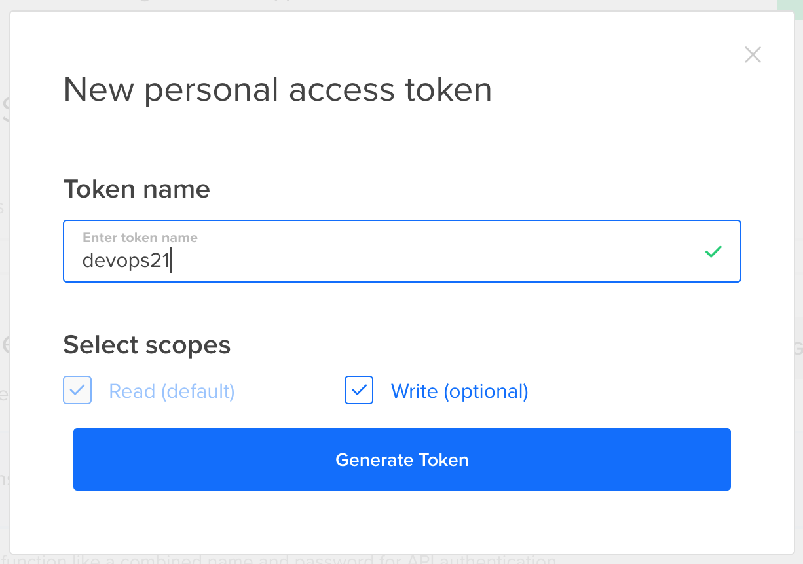
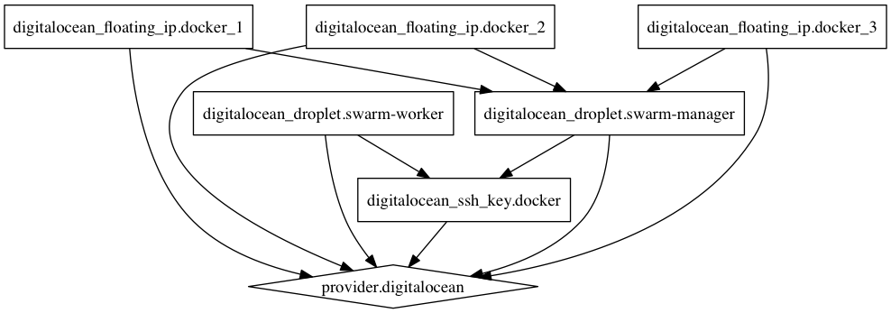

# 第十三章：在 DigitalOcean 中创建和管理 Docker Swarm 集群

*                               计划将一个（实现）抛弃；反正你会的。**–弗雷德·布鲁克斯*

我们已经看到了一些在 AWS 中创建和操作 Swarm 集群的方法。现在我们将尝试在*DigitalOcean* ([`www.digitalocean.com/`](https://www.digitalocean.com/))中做同样的事情。我们将探索一些可以与此托管服务提供商一起使用的工具和配置。

与大家熟知的 AWS 不同，DigitalOcean 相对较新，知名度较低。你可能会好奇为什么我选择了 DigitalOcean，而不是像 Azure 和 GCE 这样的其他提供商。原因在于 AWS（以及其他类似提供商）与 DigitalOcean 之间的差异。两者在许多方面不同。比较它们就像比较大卫与哥利亚。一个很小，而另一个（AWS）则庞大无比。DigitalOcean 明白自己无法在 AWS 的领域中与其竞争，因此它决定采取不同的游戏规则。

DigitalOcean 于 2011 年推出，专注于非常特定的需求。与提供 *面面俱到* 服务的 AWS 不同，DigitalOcean 提供虚拟机。没有多余的花哨功能。你不会在他们的服务目录中迷失，因为几乎没有目录可言。如果你需要一个地方来托管你的集群，并且不想使用那些旨在将你“锁定”的服务，那么 DigitalOcean 可能是一个合适的选择。

DigitalOcean 的主要优点是定价、出色的性能和简单性。如果这些是你所追求的，那么值得尝试一下。

让我们逐一了解这三个优点。

DigitalOcean 的定价可能是所有云服务提供商中最具竞争力的。无论你是需要仅仅几个服务器的小公司，还是寻找一个能够部署数百甚至数千台服务器的大型企业，DigitalOcean 可能比任何其他提供商都便宜。这可能会让你对质量产生疑问。毕竟，便宜的东西往往会在质量上做出牺牲。那 DigitalOcean 会是这种情况吗？

DigitalOcean 提供了非常高性能的机器。所有磁盘驱动器都是 SSD，网络速度为 1 Gbps，而且创建和初始化 Droplets（它们对虚拟机的称呼）不到一分钟。作为对比，AWS EC2 实例的启动时间可能在 1 到 3 分钟之间。

DigitalOcean 提供的最后一个优点是他们的 UI 和 API。两者都简洁易懂。与 AWS 可能具有陡峭学习曲线不同，你应该在几个小时内就能学会如何使用它们。

够了，夸奖的话说得够多了，并非一切都很完美。那么，缺点是什么呢？

DigitalOcean 提供的服务种类不多。它做几件事，但做得很好。它是一个简化的 **基础设施即服务** (**IaaS**) 提供商。它假设你会自己设置服务。没有负载均衡、集中式日志记录、复杂的分析、托管数据库等。如果你需要这些功能，预计你需要自己进行设置。根据你的使用情况，这可能是优势，也可能是劣势。

将 DigitalOcean 与 AWS 进行比较是不公平的，因为它们的功能范围不同。DigitalOcean 并没有试图与 AWS 整体竞争。如果一定要做比较，那就是 DigitalOcean 与 AWS EC2 之间的对比。在这种情况下，DigitalOcean 完全占优势。

我假设你已经有了一个 DigitalOcean 账户。如果没有，请使用以下链接注册：[`m.do.co/c/ee6d08525457`](https://m.do.co/c/ee6d08525457)。你将获得 10 美元的信用额度。这应该足够用于本章中的示例。DigitalOcean 价格非常便宜，你可能会发现到本章结束时，账户余额仍然有超过 9 美元。

即使你已经决定使用其他云计算提供商或本地服务器，我还是强烈推荐你阅读本章。它将帮助你将 DigitalOcean 与你选择的提供商进行比较。

让我们尝试使用 DigitalOcean，并通过示例来判断它是否是托管我们的 Swarm 集群的一个好选择。

你可能会注意到，本章的某些部分与你在其他云计算章节中阅读的内容非常相似，甚至完全相同，比如第十二章，*在亚马逊 Web 服务中创建和管理 Docker Swarm 集群*。部分内容重复的原因是为了让云计算章节对那些阅读过全部内容的人有用，同时也能对跳过其他提供商直接来到这里的人有所帮助。

在我们进行实际操作之前，我们需要获取访问密钥并决定将在哪个区域运行集群。

# 设置环境变量

在第十二章，*在亚马逊 Web 服务中创建和管理 Docker Swarm 集群*，我们安装了 AWS **命令行接口** (**CLI**) ([`aws.amazon.com/cli/`](https://aws.amazon.com/cli/))，它帮助我们完成了一些任务。DigitalOcean 有一个类似的接口，叫做 doctl。我们需要安装它吗？我认为我们不需要 DigitalOcean 的 CLI。它们的 API 清晰且定义明确，我们可以通过简单的 curl 请求完成 CLI 的所有功能。DigitalOcean 证明了一个设计良好的 API 能够做到这一点，并且可以成为进入系统的唯一入口，省去了我们处理像 CLI 这样的中介应用的麻烦。

在我们开始使用 API 之前，我们应该生成一个访问令牌，作为认证方法。

请打开*DigitalOcean 令牌*屏幕 ([`cloud.digitalocean.com/settings/api/tokens`](https://cloud.digitalocean.com/settings/api/tokens))并点击生成新令牌按钮。你将看到新个人访问令牌的弹出窗口，如下图所示：



图 12-1：DigitalOcean 新个人访问令牌屏幕

输入`devops21`作为令牌名称，然后点击生成令牌按钮。你将看到新生成的令牌。我们会将它放入环境变量`DIGITALOCEAN_ACCESS_TOKEN`中。

本章中的所有命令都可以在 Gist `12-digital-ocean.sh`中找到 ([`gist.github.com/vfarcic/81248d2b6551f6a1c2bcfb76026bae5e`](https://gist.github.com/vfarcic/81248d2b6551f6a1c2bcfb76026bae5e))。

在执行接下来的命令之前，请先复制令牌：

```
export DIGITALOCEAN_ACCESS_TOKEN=[...]

```

请将`[...]`替换为实际的令牌。

现在我们可以决定我们的集群将在哪个区域运行。

我们可以通过向[`api.digitalocean.com/v2/regions`](https://api.digitalocean.com/v2/regions)发送请求来查看当前可用的区域：

```
curl -X GET 
    -H "Authorization: Bearer $DIGITALOCEAN_ACCESS_TOKEN"  
    "https://api.digitalocean.com/v2/regions"  
    | jq '.'

```

我们向地区 API 发送了一个 HTTP `GET`请求。请求中包含访问令牌。响应通过管道传递给`jq`。

输出的一部分如下：

```
{
  "regions": [
    ...
    {
      "name": "San Francisco 2",
      "slug": "sfo2",
      "sizes": [
"512mb",
"1gb",
"2gb"
      ],
      "features": [
"private_networking",
"backups",
"ipv6",
"metadata",
"storage"
      ],
      "available": true
},
    ...
  ],
  "links": {},
  "meta": {
    "total": 12
}
}

```

从响应底部可以看出，DigitalOcean 目前支持十二个区域。每个区域都包含有关可用 Droplet 大小和支持的功能的信息。

在本章中，我将使用**旧金山 2**（**sfo2**）区域。你可以根据自己的位置随意更改为最接近的区域。如果你选择在其他区域运行示例，请确保该区域包含`private_networking`功能。

我们将把区域放入环境变量`DIGITALOCEAN_REGION`中：

```
export DIGITALOCEAN_REGION=sfo2

```

现在我们已经准备好所有前提条件，可以在 DigitalOcean 中创建第一个 Swarm 集群。由于我们在本书的大部分时间里都使用了 Docker Machine，它将是我们的首选。

# 使用 Docker Machine 和 DigitalOcean API 设置 Swarm 集群

我们将继续使用`vfarcic/cloud-provisioning` ([`github.com/vfarcic/cloud-provisioning`](https://github.com/vfarcic/cloud-provisioning)) 仓库，它包含了帮助我们的配置和脚本。你已经将它克隆。为了保险起见，我们将拉取最新版本：

```
cd cloud-provisioning

git pull

```

让我们创建第一个 Droplet：

```
docker-machine create \
    --driver digitalocean  \
    --digitalocean-size 1gb  \
    --digitalocean-private-networking \  
    swarm-1

```

我们指定*Docker Machine*使用`digitalocean`驱动程序，在我们定义为环境变量`DIGITALOCEAN_REGION`的区域中创建一个实例。Droplet 的大小为 1GB，并启用了私有网络。

Docker Machine 启动了一个 DigitalOcean Droplet，配置了 Ubuntu，并安装和配置了 Docker Engine。

正如你无疑已经注意到的，大家都在尝试为相同的事物想出不同的名称。DigitalOcean 也不例外。它们提出了术语*droplet*，即虚拟私人服务器的不同名称。是同样的东西，不同的名字。

现在我们可以初始化集群了。我们应该使用私有 IP 进行节点之间的所有通信。不幸的是，`docker-machine ip` 命令只返回公共 IP，因此我们必须采取不同的方法来获取私有 IP。

我们可以向 `droplets` API 发送 `GET` 请求：

```
curl -X GET \
    -H "Authorization: Bearer $DIGITALOCEAN_ACCESS_TOKEN"  \
"https://api.digitalocean.com/v2/droplets"  \
    | jq '.'

```

一部分输出如下：

```
{
"droplets": [
    {
          "id": 33906152,
          "name": "swarm-1",
          ...
          "networks": {
          "v4": [
            {
              "ip_address": "138.68.11.80",
              "netmask": "255.255.240.0",
              "gateway": "138.68.0.1",
              "type": "public"
           },
          {
              "ip_address": "10.138.64.175",
              "netmask": "255.255.0.0",
              "gateway": "10.138.0.1",
              "type": "private"
          }
        ],
        "v6": []
      },
      ...
],
"links": {},
"meta": {
   "total": 1
  }
}

```

`droplets` API 返回了我们拥有的所有 droplet 的信息（目前只有一个）。我们只关心新创建的名为 `swarm-1` 实例的私有 IP。我们可以通过过滤结果，只包括名为 `swarm-1` 的 droplet，并选择类型为 `private` 的 `v4` 元素来获取它。

我们将使用 `jq` ([`stedolan.github.io/jq/`](https://stedolan.github.io/jq/)) 来过滤输出并获取我们需要的信息。如果你还没有安装，请下载并安装适合你操作系统的 jq 版本。

发送请求、过滤结果并将私有 IP 存储为环境变量的命令如下：

```
MANAGER_IP=$(curl -X GET  \
    -H "Authorization: Bearer $DIGITALOCEAN_ACCESS_TOKEN"  \
"https://api.digitalocean.com/v2/droplets"  \
    | jq -r '.droplets[]
    | select(.name=="swarm-1").networks.v4[]
    | select(.type=="private").ip_address')

```

我们向 `droplets` API 发送了 `GET` 请求，使用 `jq select` 语句丢弃了所有条目，除了名为 `swarm-1` 的条目。接着用了另一个 select 语句，只返回了私有地址。输出被存储为环境变量 `MANAGER_IP`。

为了保险起见，我们可以回显新创建变量的值：

```
echo $MANAGER_IP

```

输出如下：

```
10.138.64.175

```

现在我们可以像在前几章中一样执行 `swarm init` 命令：

```
eval $(docker-machine env swarm-1)

docker swarm init \
    --advertise-addr $MANAGER_IP

```

让我们确认集群确实已经初始化：

```
docker node ls

```

输出如下（为了简洁，ID 已删除）：

```
HOSTNAME STATUS  AVAILABILITY  MANAGER STATUS
swarm-1  Ready   Active        Leader

```

现在集群已经初始化，我们可以添加更多节点。我们将首先创建两个新实例，并将它们作为管理节点加入：

```
MANAGER_TOKEN=$(docker swarm join-token -q manager)

for i in 2 3; do
  docker-machine create \
    --driver digitalocean \
    --digitalocean-size 1gb \ 
    --digitalocean-private-networking \ 
    swarm-$i

  IP=$(curl -X GET \
    -H "Authorization: Bearer $DIGITALOCEAN_ACCESS_TOKEN" \ 
"https://api.digitalocean.com/v2/droplets" \ 
    | jq -r ".droplets[]
    | select(.name==\"swarm-$i\").networks.v4[]
    | select(.type==\"private\").ip_address")

eval $(docker-machine env swarm-$i)

  docker swarm join \
    --token $MANAGER_TOKEN \
    --advertise-addr $IP \
$MANAGER_IP:2377 
done

```

不需要解释我们刚刚执行的命令，因为它们是之前使用过的命令的组合。

我们还将添加一些工作节点：

```
WORKER_TOKEN=$(docker swarm join-token -q worker)

for i in 4 5; do
 docker-machine create \
 --driver digitalocean \
 --digitalocean-size 1gb \
 --digitalocean-private-networking \ 
 swarm-$i

 IP=$(curl -X GET \
 -H "Authorization: Bearer $DIGITALOCEAN_ACCESS_TOKEN" \
 "https://api.digitalocean.com/v2/droplets" \
 | jq -r ".droplets[]
 | select(.name==\"swarm-$i\").networks.v4[]
 | select(.type=="\private\").ip_address")

 eval $(docker-machine env swarm-$i)

 docker swarm join \
 --token $WORKER_TOKEN \
 --advertise-addr $IP \
 $MANAGER_IP:2377
done

```

让我们确认这五个节点确实在组成集群：

```
eval $(docker-machine env swarm-1)

docker node ls

```

输出如下（为了简洁，ID 已删除）：

```
HOSTNAME STATUS AVAILABILITY MANAGER STATUS
swarm-5  Ready  Active
swarm-1  Ready  Active       Leader
swarm-4  Ready  Active
swarm-2  Ready  Active       Reachable
swarm-3  Ready  Active       Reachable

```

就这样。我们的集群已经准备好。剩下的就是部署几个服务，并确认集群按预期工作。

由于我们已经创建了服务很多次，我们将通过 `vfarcic/docker-flow-proxy/docker-compose-stack.yml` ([`github.com/vfarcic/docker-flow-proxy/blob/master/docker-compose-stack.yml`](https://github.com/vfarcic/docker-flow-proxy/blob/master/docker-compose-stack.yml)) 和 `vfarcic/go-demo/docker-compose-stack.yml` ([`github.com/vfarcic/go-demo/blob/master/docker-compose-stack.yml`](https://github.com/vfarcic/go-demo/blob/master/docker-compose-stack.yml)) Compose 堆栈加速这个过程。它们将创建 `proxy`、`swarm-listener`、`go-demo-db` 和 `go-demo` 服务：

```
docker-machine ssh swarm-1

sudo docker network create --driver overlay proxy

curl -o proxy-stack.yml \
    https://raw.githubusercontent.com/ \
vfarcic/docker-flow-proxy/master/docker-compose-stack.yml

sudo docker stack deploy \
    -c proxy-stack.yml proxy

curl -o go-demo-stack.yml \
    https://raw.githubusercontent.com/ \
vfarcic/go-demo/master/docker-compose-stack.yml

sudo docker stack deploy \
    -c go-demo-stack.yml go-demo

exit

docker service ls

```

非 Windows 用户无需进入 `swarm-1` 机器，可以直接从他们的笔记本电脑部署堆栈来实现相同的结果。

下载所有镜像需要一些时间。过一会儿，`service ls command` 的输出应该如下所示（为了简洁，已去除 ID）：

```
NAME           REPLICAS IMAGE                              COMMAND
go-demo        3/3      vfarcic/go-demo:1.2
go-demo-db     1/1      mongo:3.2.10
proxy          3/3      vfarcic/docker-flow-proxy
swarm-listener 1/1      vfarcic/docker-flow-swarm-listener

```

让我们确认 `go-demo` 服务是否可访问：

```
curl -i $(docker-machine ip swarm-1)/demo/hello

```

输出如下：

```
HTTP/1.1 200 OK
Date: Wed, 07 Dec 2016 05:05:58 GMT
Content-Length: 14
Content-Type: text/plain; charset=utf-8

hello, world!

```

我们使用 Docker Machine 和 DigitalOcean API 设置了整个 Swarm 集群。这是我们所需的一切吗？这取决于我们为集群定义的需求。我们可能应该添加一些浮动 IP 地址。

DigitalOcean 的浮动 IP 是一个公开可访问的静态 IP 地址，可以分配给您的一个 Droplet。通过 DigitalOcean 控制面板或 API，浮动 IP 还可以立即重新映射到同一数据中心中的其他 Droplets。这种即时重映射的能力使您能够设计和创建**高可用性**（**HA**）服务器基础设施，这样就没有单点故障，通过为服务器的入口点或网关增加冗余，提升可靠性。

换句话说，我们可能应该设置至少两个浮动 IP 并将它们映射到集群中的两个 Droplets。这两个（或更多）IP 将作为我们的 DNS 记录。这样，当某个实例故障并且我们用新实例替换时，我们可以重新映射弹性 IP，而不会影响我们的用户。

还有不少其他改进我们可以做。然而，这样做会让我们陷入一个尴尬的境地。我们将使用一个并不适合用来搭建复杂集群的工具。

创建虚拟机的速度相当慢。Docker Machine 花费了太多时间来为其配置 Ubuntu 并安装 Docker 引擎。我们可以通过创建预装了 Docker 引擎的快照来减少这一时间。然而，进行这样的操作后，使用 Docker Machine 的主要理由就会消失。它的主要优势是简单性。一旦我们开始用其他资源来复杂化设置，就会发现简单性被太多的临时命令所取代。

运行 `docker-machine` 并结合 API 请求，当我们处理一个小型集群时效果很好，特别是当我们想要快速创建某些东西并且这些东西可能不太持久时。最大的问题是，到目前为止我们所做的一切都是临时命令。很可能我们无法在第二次重复相同的步骤。我们的基础设施没有文档记录，因此我们的团队不知道我们的集群是什么组成的。

我的建议是，在 DigitalOcean 使用 `docker-machine` 来快速搭建一个集群，主要用于演示目的。这对于生产环境也可以有用，只要集群相对较小。

如果我们想要设置一个更复杂、更大且可能更持久的解决方案，我们应该考虑其他替代方案。

让我们删除我们创建的集群，并从零开始探索替代方案：

```
for i in 1 2 3 4 5; do 
    docker-machine rm -f swarm-$i
done

```

如果你读过上一章，你可能会期待看到一个名为 *Docker for DigitalOcean* 的子章节。实际上并没有这样的章节。至少在我写这章的时候没有。因此，我们将直接进入 *Packer* 和 *Terraform*。

# 使用 Packer 和 Terraform 设置 Swarm 集群

这次我们将使用一套与 Docker 完全无关的工具。它将是*Packer* ([`www.packer.io/`](https://www.packer.io/)) 和 *Terraform* ([`www.terraform.io/`](https://www.terraform.io/))。这两个工具都来自 *HashiCorp* ([`www.hashicorp.com/`](https://www.hashicorp.com/))。Packer 允许我们创建机器镜像，而 Terraform 则帮助我们创建、修改和改进集群基础设施。这两个工具几乎支持所有主要的云服务提供商。

它们可以与 Amazon EC2、CloudStack、DigitalOcean、**Google Compute Engine** (**GCE**)、Microsoft Azure、VMWare、VirtualBox 等多个平台一起使用。基础设施的独立性使我们能够避免厂商锁定。只需进行最小的配置更改，我们就能轻松地将集群从一个提供商迁移到另一个。Swarm 被设计为无缝工作，无论我们使用哪个托管提供商，只要基础设施定义得当。使用 Packer 和 Terraform，我们可以以一种方式定义基础设施，使得从一个提供商切换到另一个提供商变得尽可能平滑。

# 使用 Packer 创建 DigitalOcean 快照

`vfarcic/cloud-provisioning` ([`github.com/vfarcic/cloud-provisioning`](https://github.com/vfarcic/cloud-provisioning)) 仓库已经包含了我们将要使用的 Packer 和 Terraform 配置。它们位于 `terraform/do` 目录下：

```
cd terraform/do

```

第一步是使用 Packer 创建一个快照。为此，我们需要将 DigitalOcean 的 API 令牌设置为环境变量 `DIGITALOCEAN_API_TOKEN`。这与我们设置为环境变量 `DIGITALOCEAN_ACCESS_TOKEN` 的令牌是相同的。不幸的是，Docker Machine 和 Packer 使用了不同的命名标准：

```
export DIGITALOCEAN_API_TOKEN=[...]

```

请将 `[...]` 替换为实际的令牌。

我们将从同一个快照实例化所有 Swarm 节点。该快照将基于 Ubuntu，并安装最新版本的 Docker 引擎。

我们即将构建的镜像的 JSON 定义位于 `terraform/do/packer-ubuntu-docker.json` ([`github.com/vfarcic/cloud-provisioning/blob/master/terraform/do/packer-ubuntu-docker.json`](https://github.com/vfarcic/cloud-provisioning/blob/master/terraform/do/packer-ubuntu-docker.json))：

```
cat packer-ubuntu-docker.json

```

配置由两个部分组成：`builders` 和 `provisioners`：

```
{
   "builders": [{
     ...
   }],
   "provisioners": [{
     ...
   }]
}

```

`builders` 部分定义了 Packer 构建快照所需的所有信息。`provisioners` 部分描述了用于为由 builders 创建的机器安装和配置软件的命令。唯一必须的部分是 builders。

构建器负责创建机器并生成适用于各种平台的镜像。例如，EC2、VMware、VirtualBox 等都有单独的构建器。Packer 默认包含许多构建器，并且还可以扩展以添加新的构建器。

我们将使用的构建器部分如下：

```
"builders": [{
   "type": "digitalocean",
   "region": "sfo2",
   "image": "ubuntu-16-04-x64",
   "size": "1gb",
   "private_networking": true,
   "snapshot_name": "devops21-{{timestamp}}"
}]

```

每种类型的构建器都有特定的参数可以使用。我们指定了`type`为`digitalocean`。有关更多信息，请访问 DigitalOcean 构建器页面([`www.packer.io/docs/builders/digitalocean.html`](https://www.packer.io/docs/builders/digitalocean.html))。

请注意，当使用`digitalocean`类型时，我们必须提供 token。我们可以通过`api_token`字段指定它。不过，还有另一种方法。如果没有指定该字段，Packer 会尝试从环境变量`DIGITALOCEAN_API_TOKEN`中获取值。由于我们已经导出了它，因此无需在 Packer 配置中重复填写 token。此外，token 应该保密。

将其放入配置中可能会导致暴露风险。区域非常重要，因为快照只能在一个区域内创建。如果我们想要在多个区域共享相同的机器，每个区域都需要作为一个单独的构建器来指定。

我们将镜像设置为`ubuntu-16-04-x64`。这将是我们用来创建自己镜像的基础镜像。快照的大小与我们将要创建的 Droplet 的大小没有直接关系，因此无需将其设置得太大。我们将其设置为 1GB。

默认情况下，DigitalOcean 只启用公共网络，因此我们将`private_networking`设置为`true`。稍后，我们将设置 Swarm 通信，仅通过私有网络进行。

`snapshot_name`字段是我们为此快照指定的名称。由于没有选项可以覆盖现有快照，因此名称必须是唯一的，因此我们在名称中加入了`timestamp`。

有关更多信息，请访问 DigitalOcean 构建器页面([`www.packer.io/docs/builders/digitalocean.html`](https://www.packer.io/docs/builders/digitalocean.html))。

第二部分是 provisioners。它包含了 Packer 在将机器转换为快照之前，安装和配置软件时应该使用的所有 provisioner 的数组。

我们可以使用相当多的`provisioner`类型。如果你读过*《DevOps 2.0 工具包》*([`www.amazon.com/dp/B01BJ4V66M`](https://www.amazon.com/dp/B01BJ4V66M))，你会知道我提倡将 Ansible 作为首选的`provisioner`。我们是否也应该在这里使用它？在大多数情况下，当构建用于运行 Docker 容器的镜像时，我更倾向于使用简单的 Shell。将 Ansible 更改为 Shell 的原因在于，`provisioner`在运行实时服务器时需要完成的目标与在构建镜像时有所不同。

与 Shell 不同，Ansible（以及大多数其他`provisioners`）是幂等的。它们会验证实际状态，并根据需要执行一个或另一个操作，以确保所需状态得到满足。这是一种很好的方法，因为我们可以随意运行 Ansible，结果总是相同的。例如，如果我们指定要安装 JDK 8，Ansible 会通过 SSH 连接到目标服务器，发现 JDK 没有安装，然后进行安装。下次运行时，它会发现 JDK 已经安装并不做任何操作。这样的做法允许我们随时运行 Ansible playbook，最终都会安装 JDK。如果我们试图通过 Shell 脚本实现相同的功能，就需要编写冗长的`if/else`语句。如果 JDK 已安装，则什么也不做；如果未安装，则安装；如果安装了但版本不对，则升级，依此类推。

那么，为什么不与 Packer 一起使用它呢？答案很简单。我们不需要幂等性，因为在创建镜像时只会运行一次。我们不会在运行的实例上使用它。你还记得 *宠物与牲畜* 的讨论吗？我们的虚拟机将从已经包含我们所需的一切的镜像中实例化。如果该虚拟机的状态发生变化，我们将终止它并创建一个新的。如果我们需要进行升级或安装额外的软件，我们不会在运行中的实例内完成，而是创建一个新的镜像，销毁运行中的实例，并基于更新后的镜像实例化新的虚拟机。

幂等性是我们使用 Ansible 的唯一原因吗？绝对不是！当我们需要定义复杂的服务器配置时，Ansible 是一个非常方便的工具。然而，在我们的情况下，配置非常简单。我们只需要 Docker 引擎，其他的没有太多需求。几条 Shell 命令就能轻松安装 Docker，比起定义 Ansible playbook，写 Shell 命令更简单、更快。

安装 Ansible 所需的命令数量可能与安装 Docker 相同。

简而言之，我们将使用 shell 作为构建 AMI 的`provisioner`工具。

我们将使用的`provisioners`部分如下：

```
"provisioners": [{
  "type": "shell",
  "inline": [
    "sudo apt-get update",
    "sudo apt-get install -y apt-transport-https ca-certificates nfs-common",
    "sudo apt-key adv --keyserver hkp://ha.pool.sks-keyservers.net:80\ 
--recv-keys 58118E89F3A912897C070ADBF76221572C52609D",
    "echo 'deb https://apt.dockerproject.org/repo ubuntu-xenial main'\ 
| sudo tee /etc/apt/sources.list.d/docker.list",
    "sudo apt-get update",
    "sudo apt-get install -y docker-engine"
  ]
}]

```

shell 类型后面跟着一组命令。这些命令与我们可以在《在 Ubuntu 上安装 Docker》([`docs.docker.com/engine/installation/linux/ubuntulinux/`](https://docs.docker.com/engine/installation/linux/ubuntulinux/))页面上找到的命令相同。

现在我们大致了解了 Packer 配置的工作原理，接下来可以继续构建镜像：

```
packer build -machine-readable \
    packer-ubuntu-docker.json \
    | tee packer-ubuntu-docker.log

```

我们运行`packer build`命令，使用`packer-ubuntu-docker.json`并将`machine-readable`格式的输出发送到`packer-ubuntu-docker.log`文件。机器可读的输出将使我们能够轻松解析，并获取刚刚创建的快照的 ID。

输出的最后几行如下：

```
...
1481087549,,ui,say,Build 'digitalocean' finished.
1481087549,,ui,say,n==> Builds finished. The artifacts of successful builds are:
1481087549,digitalocean,artifact-count,1
1481087549,digitalocean,artifact,0,builder-id,pearkes.digitalocean
1481087549,digitalocean,artifact,0,id,sfo2:21373017
1481087549,digitalocean,artifact,0,string,A snapshot was created: \
'devops21-1481087268' (ID: 21373017) in region 'sfo2'
1481087549,digitalocean,artifact,0,files-count,0
1481087549,digitalocean,artifact,0,end
1481087549,,ui,say,--> digitalocean: A snapshot was created:\ 
'devops21-1481087268' (ID: 21373017) in region 'sfo2'

```

除了确认构建成功外，输出的相关部分是行 `id,sfo2:21373017`。它包含我们需要的快照 ID，以便根据该镜像实例化虚拟机。你可能希望将 `packer-ubuntu-docker.log` 存储在代码库中，以防你需要从其他服务器获取该 ID。

我们执行的过程流可以通过 *图 12-2* 描述：


图 12-2：Packer 过程的流程

现在我们准备好使用基于我们构建的快照的虚拟机来创建一个 Swarm 集群。

# 使用 Terraform 在 DigitalOcean 上创建 Swarm 集群

Terraform 是“*每个人都使用不同的环境变量来存储 token*”俱乐部的第三个成员。它期望将 token 存储为环境变量 `DIGITALOCEAN_TOKEN`：

```
export DIGITALOCEAN_TOKEN=[...]

```

请将 `[...]` 替换为实际的 token。

Terraform 不强制要求我们采用任何特定的文件结构。我们可以在一个文件中定义所有内容。然而，这并不意味着我们应该这样做。Terraform 配置文件可能会变得很大，将逻辑部分拆分到不同的文件中通常是一个好主意。在我们的案例中，我们将有三个 `tf` 文件。`terraform/do/variables.tf` ([`github.com/vfarcic/cloud-provisioning/blob/master/terraform/do/variables.tf`](https://github.com/vfarcic/cloud-provisioning/blob/master/terraform/do/variables.tf)) 文件包含所有变量。如果我们需要更改任何参数，我们知道在哪里可以找到它。`terraform/do/common.tf` ([`github.com/vfarcic/cloud-provisioning/blob/master/terraform/do/common.tf`](https://github.com/vfarcic/cloud-provisioning/blob/master/terraform/do/common.tf)) 文件包含可能在其他场合重复使用的元素定义。最后，`terraform/do/swarm.tf` ([`github.com/vfarcic/cloud-provisioning/blob/master/terraform/do/swarm.tf`](https://github.com/vfarcic/cloud-provisioning/blob/master/terraform/do/swarm.tf)) 文件包含与 Swarm 相关的资源。我们将分别探索每个 Terraform 配置文件。

`terraform/do/variables.tf` ([`github.com/vfarcic/cloud-provisioning/blob/master/terraform/do/variables.tf`](https://github.com/vfarcic/cloud-provisioning/blob/master/terraform/do/variables.tf)) 文件的内容如下：

```
variable "swarm_manager_token" {
   default = ""
}
variable "swarm_worker_token" {
   default = ""
}
variable "swarm_snapshot_id" {
   default = "unknown"
}
variable "swarm_manager_ip" {
   default = ""
}
variable "swarm_managers" {
   default = 3
}
variable "swarm_workers" {
   default = 2
}
variable "swarm_region" {
   default = "sfo2"
}
variable "swarm_instance_size" {
   default = "1gb"
}
variable "swarm_init" {
   default = false
}

```

`swarm_manager_token`和`swarm_worker_token`将用于将节点加入集群。`swarm_snapshot_id`将保存我们使用 Packer 创建的快照的 ID。`swarm_manager_ip`变量是我们需要提供的其中一个管理节点的 IP，以便节点能够加入集群。`swarm_managers`和`swarm_workers`定义了我们希望拥有的每种类型节点的数量。`swarm_region`定义了集群运行的区域，而`swarm_instance_size`设置为 1GB。如果您开始使用此 Terraform 配置创建一个实际的集群，可以随时更改为更大的大小。最后，`swarm_init`变量允许我们指定是否为第一次运行，并且节点应初始化集群。我们很快会看到它的用法。

`terraform/do/common.tf`（[`github.com/vfarcic/cloud-provisioning/blob/master/terraform/do/common.tf`](https://github.com/vfarcic/cloud-provisioning/blob/master/terraform/do/common.tf)）文件的内容如下：

```
resource "digitalocean_ssh_key" "docker" {
  name = "devops21-do"
  public_key = "${file("devops21-do.pub")}"
}

resource "digitalocean_floating_ip" "docker_1" {
  droplet_id = "${digitalocean_droplet.swarm-manager.0.id}"
  region = "${var.swarm_region}"
}

resource "digitalocean_floating_ip" "docker_2" {
  droplet_id = "${digitalocean_droplet.swarm-manager.1.id}"
  region = "${var.swarm_region}"
}

resource "digitalocean_floating_ip" "docker_3" {
  droplet_id = "${digitalocean_droplet.swarm-manager.2.id}"
  region = "${var.swarm_region}"
}
output "floating_ip_1" {
  value = "${digitalocean_floating_ip.docker_1.ip_address}"
}

output "floating_ip_2" {
  value = "${digitalocean_floating_ip.docker_2.ip_address}"
}

output "floating_ip_3" {
  value = "${digitalocean_floating_ip.docker_3.ip_address}"
}

```

每个资源都定义了一个类型（例如，`digitalocean_ssh_key`）和一个名称（例如，`docker`）。类型决定了应该创建哪个资源，并且必须是当前支持的类型之一。

第一个资源`digitalocean_ssh_key`允许我们管理用于访问滴水（droplet）的 SSH 密钥。通过此资源创建的密钥可以通过其 ID 或指纹在滴水配置中引用。我们将其设置为稍后将创建的`devops21-do.pub`文件的值。

我们使用的第二个资源是`digitalocean_floating_ip`。它代表一个可公开访问的静态 IP 地址，可以映射到我们的一个滴水上。我们定义了三个这样的 IP 地址。它们将在我们的 DNS 配置中使用。这样，当对您的域名发出请求时，DNS 会将其重定向到其中一个浮动 IP。如果其中一个滴水宕机，DNS 应该使用其他条目之一。这样，您就有时间将浮动 IP 从失败的滴水切换到新的滴水。

请参阅*DIGITALOCEAN_SSH_KEY*（[`www.terraform.io/docs/providers/do/r/ssh_key.html`](https://www.terraform.io/docs/providers/do/r/ssh_key.html)）和*DIGITALOCEAN_FLOATING_IP*（[`www.terraform.io/docs/providers/do/r/floating_ip.html`](https://www.terraform.io/docs/providers/do/r/floating_ip.html)）页面以获取更多信息。

除了资源，我们还定义了几个输出。它们表示在执行 Terraform apply 时将显示的值，并且可以通过输出命令轻松查询。

在构建潜在的复杂基础设施时，Terraform 会为所有资源存储数百或数千个属性值。但是，作为用户，我们可能只对几个重要的值感兴趣，例如管理节点 IP。输出是告诉 Terraform 哪些数据是相关的一种方式。

在我们的案例中，输出是浮动 IP 的地址。

请参阅*输出配置*([`www.terraform.io/docs/configuration/outputs.html`](https://www.terraform.io/docs/configuration/outputs.html))页面以获取更多信息。

现在进入真正的重点。`terraform/do/swarm.tf`([`github.com/vfarcic/cloud-provisioning/blob/master/terraform/do/swarm.tf`](https://github.com/vfarcic/cloud-provisioning/blob/master/terraform/do/swarm.tf))文件包含了我们将要创建的所有实例的定义。

由于这个文件的内容比其他文件稍大，我们将分别检查每个资源。

第一项资源是名为`swarm-manager`的`digitalocean_droplet`类型。它的目的是创建 Swarm 管理节点：

```
resource "digitalocean_droplet" "swarm-manager" {
  image = "${var.swarm_snapshot_id}"
  size = "${var.swarm_instance_size}"
  count = "${var.swarm_managers}"
  name = "${format("swarm-manager-%02d", (count.index + 1))}"
  region = "${var.swarm_region}"
  private_networking = true
  ssh_keys = [
"${digitalocean_ssh_key.docker.id}"
  ]
  connection {
    user = "root"
    private_key = "${file("devops21-do")}"
    agent = false
  }
  provisioner "remote-exec" {
    inline = [
"if ${var.swarm_init}; then docker swarm init \
--advertise-addr ${self.ipv4_address_private}; fi",
"if ! ${var.swarm_init}; then docker swarm join \
--token ${var.swarm_manager_token} --advertise-addr 
${self.ipv4_address_private} ${var.swarm_manager_ip}:2377; fi"
    ]
  }
}

```

该资源包含了引用我们用 Packer 创建的快照的镜像。实际的值是一个变量，我们将在运行时定义。`size`指定了我们想要创建的实例的大小。默认值从变量`swarm_instance_size`中获取，默认设置为 1 GB。像其他变量一样，它可以在运行时被重写。

`count`字段定义了我们想要创建的管理节点数量。当我们第一次运行 terraform 时，值应该是 1，因为我们希望从一个管理节点开始，初始化集群。之后，值应根据变量中定义的内容进行调整。我们很快就会看到这两种组合的使用情况。

`name`、`region`和`private_networking`应该是自解释的。`ssh-keys`类型是一个数组，此时仅包含一个元素；即我们在`common.tf`文件中定义的`digitalocean_ssh_key`资源的 ID。

`connection`字段定义了 SSH 连接的详细信息。用户将是 root。我们将使用`devops21-do`密钥，而不是密码。

最后，定义了`provisioner`。这个想法是在创建镜像的过程中尽可能多地进行预配置。这样，实例创建的速度会更快，因为唯一的操作就是从镜像创建虚拟机。然而，通常有些预配置是无法在创建镜像时完成的。`swarm init`命令就是其中之一。在获取服务器的 IP 之前，我们无法初始化第一个 Swarm 节点。换句话说，服务器需要运行（因此拥有 IP）后，才能执行`swarm init`命令。

由于第一个节点需要初始化集群，而其他节点则应加入集群，因此我们使用`if`语句来区分两种情况。如果变量`swarm_init`为`true`，则将执行`docker swarm init`命令。另一方面，如果变量`swarm_init`设置为`false`，则命令将是`docker swarm join`。在这种情况下，我们使用另一个变量`swarm_manager_ip`来告诉节点使用哪个管理节点加入集群。请注意，IP 是通过特殊语法`self.ipv4_address_private`获得的。我们引用了自身并获取了`ipv4_address_private`。从资源中我们可以获取许多其他属性。请参阅*DIGITALOCEAN_DROPLET*([`www.terraform.io/docs/providers/do/r/droplet.html`](https://www.terraform.io/docs/providers/do/r/droplet.html))页面获取更多信息。

让我们看一下名为`swarm-worker`的`digitalocean_droplet`资源：

```
resource "digitalocean_droplet" "swarm-worker" {
  image = "${var.swarm_snapshot_id}"
  size = "${var.swarm_instance_size}"
  count = "${var.swarm_workers}"
  name = "${format("swarm-worker-%02d", (count.index + 1))}"
  region = "${var.swarm_region}"
  private_networking = true
  ssh_keys = [
   "${digitalocean_ssh_key.docker.id}"
  ]
  connection {
    user = "root"
    private_key = "${file("devops21-do")}"
    agent = false
  }
  provisioner "remote-exec" {
    inline = [
      "docker swarm join --token ${var.swarm_worker_token} \
--advertise-addr ${self.ipv4_address_private} ${var.swarm_manager_ip}:\
2377"
    ]
  }
}

```

`swarm-worker`资源与`swarm-manager`几乎相同。唯一的区别在于使用`swarm_workers`变量的`count`字段和`provisioner`。由于工作节点无法初始化集群，因此不需要`if`语句，因此我们只需要执行`docker swarm join`命令。Terraform 使用命名约定允许我们通过添加`TF_VAR_`前缀来指定值作为环境变量。例如，我们可以通过设置环境变量`TF_VAR_swarm_snapshot_id`来指定变量`swarm_snapshot_id`的值。另一种方式是使用`-var`参数。我更喜欢使用环境变量，因为它们允许我只指定一次，而不是在每个命令中都添加`-var`。`terraform/do/swarm.tf`([`github.com/vfarcic/cloud-provisioning/blob/master/terraform/do/swarm.tf`](https://github.com/vfarcic/cloud-provisioning/blob/master/terraform/do/swarm.tf))规范的最后一部分是输出。

我们定义的输出如下：

```
output "swarm_manager_1_public_ip" {
  value = "${digitalocean_droplet.swarm-manager.0.ipv4_address}"
}

output "swarm_manager_1_private_ip" {
  value = "${digitalocean_droplet.swarm-manager.0.ipv4_address_private}"
}

output "swarm_manager_2_public_ip" {
  value = "${digitalocean_droplet.swarm-manager.1.ipv4_address}"
}

output "swarm_manager_2_private_ip" {
  value = "${digitalocean_droplet.swarm-manager.1.ipv4_address_private}"
}

output "swarm_manager_3_public_ip" {
  value = "${digitalocean_droplet.swarm-manager.2.ipv4_address}"
}

output "swarm_manager_3_private_ip" {
  value = "${digitalocean_droplet.swarm-manager.2.ipv4_address_private}"
}

```

它们是管理节点的公有和私有 IP 地址。由于只有少数（如果有的话）需要知道工作节点的 IP 地址，我们没有将其定义为输出。

由于我们将使用通过 Packer 创建的快照，因此我们需要从`packer-ubuntu-docker.log`中检索 ID。让我们再看一遍文件：

```
cat packer-ubuntu-docker.log

```

输出中的重要行如下：

```
1481087549,digitalocean,artifact,0,id,sfo2:21373017

```

接下来的命令解析输出并提取 ID：

```
export TF_VAR_swarm_snapshot_id=$( \
    grep 'artifact,0,id' \
    packer-ubuntu-docker.log \
    | cut -d: -f2)

```

让我们再确认一下命令是否按预期执行：

```
echo $TF_VAR_swarm_snapshot_id

```

输出如下：

```
21373017

```

我们得到了快照的 ID。在开始创建资源之前，我们需要创建在 Terraform 配置中引用的 SSH 密钥`devops21-do`。

我们将使用`ssh-keygen`创建 SSH 密钥：

```
ssh-keygen -t rsa

```

当提示*输入保存密钥的文件*时，请回答`devops21-do`。其他问题可以按您的喜好回答。我会将它们全部留空。

输出应类似于以下内容：

```
Generating public/private rsa key pair.
Enter file in which to save the key (/Users/vfarcic/.ssh/id_rsa): devops21-do
Enter passphrase (empty for no passphrase):
Enter same passphrase again:
Your identification has been saved in devops21-do.
Your public key has been saved in devops21-do.pub.
The key fingerprint is:
SHA256:a9BqjLkcC9eMnuKH+TZPE6E9S0w+cDQD4HTWEY9CuVk \
vfarcic@Viktors-MacBook-Pro-2.local
The key's randomart image is:
+---[RSA 2048]----+
|  o.=+*o         |
| o +..E=         |
|  . o+= .        |
|    oX o         |
|    . X S        |
|     O B .       |
|  .o* X o        |
|  +=+B o         |
| ..=Bo.          |
+----[SHA256]-----+

```

现在`devops21-do`密钥已经创建，我们可以开始使用 Terraform。在创建集群及其周围基础设施之前，我们应该要求 Terraform 显示执行计划。

**给 Terraform v0.8+ 用户的注意事项。**

通常，我们不需要指定目标就能查看完整的执行计划。然而，Terraform *v0.8* 引入了一个 bug，有时会阻止我们输出计划，特别是当资源引用了一个尚未创建的其他资源时。在这种情况下，`digitalocean_floating_ip.docker_2`和`digitalocean_floating_ip.docker_3`就是这样的资源。接下来的命令中的目标是作为一种临时解决方案，直到问题被修复：

```
terraform plan \
    -target digitalocean_droplet.swarm-manager \ 
    -target digitalocean_droplet.swarm-worker \

```

结果是一个包含资源及其属性的详细列表。由于输出过大，无法全部打印，我将仅限于资源类型和名称：

```
...
+ digitalocean_droplet.swarm-manager.0
...
+ digitalocean_droplet.swarm-manager.1
...
+ digitalocean_droplet.swarm-manager.2
...
+ digitalocean_droplet.swarm-worker.0
...
+ digitalocean_droplet.swarm-worker.1
...
+ digitalocean_ssh_key.docker
...
Plan: 6 to add, 0 to change, 0 to destroy.

```

由于这是第一次执行，如果我们执行`terraform apply`，所有资源将会被创建。我们将获得五个 droplet，三个管理节点和两个工作节点。与此同时，还会创建三个浮动 IP 和一个 SSH 密钥。

如果你查看完整的输出，你会注意到一些属性值被设置为`<computed>`。这意味着 Terraform 在创建资源之前无法知道实际的值。一个好的例子是 IP 地址。它们在 droplet 创建之前是不存在的。

我们还可以使用`graph`命令输出计划：

```
terraform graph

```

输出如下所示：

```
digraph {
    compound = "true"
    newrank = "true"
    subgraph "root" {
"[root] digitalocean_droplet.swarm-manager" [label = \
"digitalocean_droplet.swarm-manager", shape = "box"]
"[root] digitalocean_droplet.swarm-worker" [label = \
"digitalocean_droplet.swarm-worker", shape = "box"]
"[root] digitalocean_floating_ip.docker_1" [label = \
"digitalocean_floating_ip.docker_1", shape = "box"]
"[root] digitalocean_floating_ip.docker_2" [label = \
"digitalocean_floating_ip.docker_2", shape = "box"]
"[root] digitalocean_floating_ip.docker_3" [label = \
"digitalocean_floating_ip.docker_3", shape = "box"]
"[root] digitalocean_ssh_key.docker" [label = \
"digitalocean_ssh_key.docker", shape = "box"]
"[root] provider.digitalocean" [label = \
"provider.digitalocean", shape = "diamond"]
"[root] digitalocean_droplet.swarm-manager" \
-> "[root] digitalocean_ssh_key.docker"
"[root] digitalocean_droplet.swarm-manager" \
-> "[root] provider.digitalocean"
"[root] digitalocean_droplet.swarm-worker" \
-> "[root] digitalocean_ssh_key.docker"
"[root] digitalocean_droplet.swarm-worker" \
-> "[root] provider.digitalocean"
"[root] digitalocean_floating_ip.docker_1" 
-> "[root] digitalocean_droplet.swarm-manager"
"[root] digitalocean_floating_ip.docker_1" \
-> "[root] provider.digitalocean"
"[root] digitalocean_floating_ip.docker_2" \
-> "[root] digitalocean_droplet.swarm-manager"
"[root] digitalocean_floating_ip.docker_2" \
-> "[root] provider.digitalocean"
"[root] digitalocean_floating_ip.docker_3" \
-> "[root] digitalocean_droplet.swarm-manager"
"[root] digitalocean_floating_ip.docker_3" \
-> "[root] provider.digitalocean"
"[root] digitalocean_ssh_key.docker" \
-> "[root] provider.digitalocean"
    }
}

```

这本身并不是很有用。

`graph`命令用于生成配置或执行计划的可视化表示。输出采用 DOT 格式，可以被 GraphViz 用来生成图形。

请访问*Graphviz*下载页面([`www.graphviz.org/Download.php`](http://www.graphviz.org/Download.php))，下载并安装与您的操作系统兼容的发行版。

现在我们可以将`graph`命令与`dot`结合使用：

```
terraform graph | dot -Tpng > graph.png

```

输出应该与*图 11-10：*中的相同。



图 12-3：由 Graphviz 从 terraform graph 命令的输出生成的图像

对计划的可视化让我们能够看到不同资源之间的依赖关系。在我们的案例中，所有资源都将使用`digitalocean`提供程序。两种实例类型将依赖于 SSH 密钥 docker，而浮动 IP 将附加到管理节点的 droplet 上。

当定义了依赖关系时，我们不需要明确指定所有需要的资源。

作为一个例子，让我们来看一下当我们限制只有一个 Swarm 管理节点时，Terraform 生成的计划，以便初始化集群：

```
terraform plan \
    -target digitalocean_droplet.swarm-manager \
    -var swarm_init=true \
    -var swarm_managers=1

```

运行时变量`swarm_init`和`swarm_managers`将被用来告诉 Terraform 我们想用一个管理节点来初始化集群。plan 命令会考虑这些变量并输出执行计划。

输出仅限于资源类型和名称，如下所示：

```
+ digitalocean_droplet.swarm-manager
...
+ digitalocean_ssh_key.docker
...
Plan: 2 to add, 0 to change, 0 to destroy.

```

即使我们指定只想要`swarm-manager`资源的计划，Terraform 仍然注意到它依赖于 SSH 密钥 docker，并将其包含在执行计划中。

我们将从小做起，首先创建一个管理节点实例来初始化集群。正如我们从计划中看到的，它依赖于 SSH 密钥，因此 Terraform 也会创建它：

```
terraform apply \
    -target digitalocean_droplet.swarm-manager \
    -var swarm_init=true \
    -var swarm_managers=1

```

输出太大，无法在书中完全展示。如果你从终端查看，会注意到首先创建的是 SSH 密钥，因为`swarm-manager`依赖于它。请注意，我们没有显式指定依赖关系。然而，由于资源在`ssh_keys`字段中指定了它，Terraform 理解它是依赖关系。

一旦`swarm-manager`实例创建完成，Terraform 会等待直到 SSH 访问可用。在成功连接到新实例后，它执行了初始化集群的配置命令。

输出的最后几行如下：

```
Apply complete! Resources: 2 added, 0 changed, 0 destroyed.

...

Outputs:

swarm_manager_1_private_ip = 10.138.255.140
swarm_manager_1_public_ip = 138.68.57.39

```

输出定义在`terraform/do/swarm.tf`文件的底部（[`github.com/vfarcic/cloud-provisioning/blob/master/terraform/do/swarm.tf`](https://github.com/vfarcic/cloud-provisioning/blob/master/terraform/do/swarm.tf)）。请注意，并非所有输出都列出，而是只列出了已创建资源的输出。

我们可以使用新创建的 Droplet 的公共 IP 并通过 SSH 连接到它。

你可能会倾向于复制 IP 地址，但不需要这样做。Terraform 有一个命令可以用来检索我们定义为输出的任何信息。

检索第一个且当前唯一管理节点的公共 IP 的命令如下：

```
terraform output swarm_manager_1_public_ip

```

输出如下：

```
138.68.57.39

```

我们可以利用输出命令构建 SSH 命令。作为一个例子，接下来的命令将通过 SSH 连接到机器并获取 Swarm 节点列表：

```
ssh -i devops21-do \
    root@$(terraform output \
    swarm_manager_1_public_ip) \
    docker node ls

```

输出如下（为了简洁，已移除 ID）：

```
HOSTNAME          STATUS  AVAILABILITY  MANAGER STATUS
swarm-manager-01  Ready   Active        Leader

```

从现在开始，我们不再局限于初始化集群的单个管理节点。我们可以创建所有其他节点。然而，在此之前，我们需要获取管理节点和工作节点的令牌。出于安全原因，最好不要将其存储在任何地方，因此我们将创建环境变量：

```
export TF_VAR_swarm_manager_token=$(ssh \
    -i devops21-do \
    root@$(terraform output \
    swarm_manager_1_public_ip) \
    docker swarm join-token -q manager)

export TF_VAR_swarm_worker_token=$(ssh \
    -i devops21-do \
    root@$(terraform output \
    swarm_manager_1_public_ip) \
    docker swarm join-token -q worker)

```

我们还需要设置环境变量`swarm_manager_ip`：

```
export TF_VAR_swarm_manager_ip=$(terraform \
    output swarm_manager_1_private_ip)

```

即使我们可以在`terraform/do/swarm.tf`中使用`digitalocean_droplet.swarm-manager.0.private_ip`（[`github.com/vfarcic/cloud-provisioning/blob/master/terraform/do/swarm.tf`](https://github.com/vfarcic/cloud-provisioning/blob/master/terraform/do/swarm.tf)），但将其定义为环境变量是一个好主意。这样，如果第一个管理节点失败，我们可以轻松将其更改为`swarm_manager_2_private_ip`，而无需修改`.tf`文件。

现在，让我们看看创建其余 Swarm 节点的计划：

```
terraform plan \
    -target digitalocean_droplet.swarm-manager \
    -target digitalocean_droplet.swarm-worker

```

输出的相关行如下：

```
...
+ digitalocean_droplet.swarm-manager.1
...
+ digitalocean_droplet.swarm-manager.2
...
+ digitalocean_droplet.swarm-worker.0
...
+ digitalocean_droplet.swarm-worker.1
...
Plan: 4 to add, 0 to change, 0 to destroy.

```

我们可以看到，计划是创建四个新资源。由于我们已经有一个管理节点在运行，并且指定了所需数量为三个，所以将创建两个额外的管理节点和两个工作节点。

让我们应用执行计划：

```
terraform apply \
    -target digitalocean_droplet.swarm-manager \
    -target digitalocean_droplet.swarm-worker

```

输出的最后几行如下：

```
...
Apply complete! Resources: 4 added, 0 changed, 0 destroyed.

...

Outputs:

swarm_manager_1_private_ip = 10.138.255.140
swarm_manager_1_public_ip = 138.68.57.39
swarm_manager_2_private_ip = 10.138.224.161
swarm_manager_2_public_ip = 138.68.17.88
swarm_manager_3_private_ip = 10.138.224.202
swarm_manager_3_public_ip = 138.68.29.23

```

四个资源已被创建，并且我们得到了管理节点的公有和私有 IP 的输出。

让我们进入其中一个管理节点并确认集群确实工作正常：

```
ssh -i devops21-do \
    root@$(terraform \
    output swarm_manager_1_public_ip)

docker node ls

```

`node ls`命令的输出如下（为了简洁，ID 已被移除）：

```
HOSTNAME         STATUS AVAILABILITY MANAGER STATUS
swarm-manager-02 Ready  Active       Reachable
swarm-manager-01 Ready  Active       Leader
swarm-worker-02  Ready  Active
swarm-manager-03 Ready  Active       Reachable
swarm-worker-01  Ready  Active

```

所有节点都存在，集群似乎在正常工作。

为了完全确信一切按预期工作，我们将部署一些服务。这些将是我们在整本书中创建的相同服务，因此我们将节省一些时间并部署`vfarcic/docker-flow-proxy/docker-compose-stack.yml`（[`github.com/vfarcic/docker-flow-proxy/blob/master/docker-compose-stack.yml`](https://github.com/vfarcic/docker-flow-proxy/blob/master/docker-compose-stack.yml)）和`vfarcic/go-demo/docker-compose-stack.yml`（[`github.com/vfarcic/go-demo/blob/master/docker-compose-stack.yml`](https://github.com/vfarcic/go-demo/blob/master/docker-compose-stack.yml)）堆栈：

```
sudo docker network create --driver overlay proxy

curl -o proxy-stack.yml \
    https://raw.githubusercontent.com/\
vfarcic/docker-flow-proxy/master/docker-compose-stack.yml

sudo docker stack deploy \
    -c proxy-stack.yml proxy

curl -o go-demo-stack.yml \
    https://raw.githubusercontent.com/\
vfarcic/go-demo/master/docker-compose-stack.yml

sudo docker stack deploy \
    -c go-demo-stack.yml go-demo

```

我们从仓库下载了堆栈并执行了`stack deploy`命令。

现在我们要做的就是等待片刻，执行`service ls`命令，确认所有副本都在运行：

```
docker service ls

```

`service ls`命令的输出应如下所示（为了简洁，ID 已被移除）：

```
NAME           REPLICAS IMAGE                              COMMAND
go-demo-db     1/1      mongo:3.2.10
proxy          3/3      vfarcic/docker-flow-proxy
go-demo        3/3      vfarcic/go-demo:1.2
swarm-listener 1/1      vfarcic/docker-flow-swarm-listener

```

最后，让我们通过`proxy`向`go-demo`服务发送请求。如果返回正确的响应，我们就知道一切正常：

```
curl -i localhost/demo/hello

```

输出如下：

```
HTTP/1.1 200 OK
Date: Wed, 07 Dec 2016 06:21:01 GMT
Content-Length: 14
Content-Type: text/plain; charset=utf-8

hello, world!

```

它工作正常！

我们完成了吗？我们可能完成了。作为最后的检查，让我们验证`proxy`是否可以从服务器外部访问。我们可以通过退出服务器并从我们的笔记本发送请求来确认：

```
exit

curl -i $(terraform output \
    swarm_manager_1_public_ip)/demo/hello

```

输出如下：

```
HTTP/1.1 200 OK
Date: Wed, 07 Dec 2016 06:21:33 GMT
Content-Length: 14
Content-Type: text/plain; charset=utf-8

hello, world!

```

我们仍然缺少浮动 IP。虽然在这个演示中它们不是必须的，但如果这是生产集群，我们会创建它们并用它们来配置我们的 DNS。

这次，我们可以在不指定目标的情况下创建计划：

```
terraform plan

```

输出的相关部分如下：

```
...
+ digitalocean_floating_ip.docker_1
...
+ digitalocean_floating_ip.docker_2
...
+ digitalocean_floating_ip.docker_3
...
Plan: 3 to add, 0 to change, 0 to destroy.

```

正如你所看到的，Terraform 检测到除了浮动 IP 外，所有资源已经创建，因此它生成了一个计划，只执行三项资源的创建。

让我们应用该计划：

```
terraform apply

```

输出如下：

```
...
Apply complete! Resources: 3 added, 0 changed, 0 destroyed.

...

Outputs:

floating_ip_1 = 138.197.232.121
floating_ip_2 = 138.197.232.119
floating_ip_3 = 138.197.232.120
swarm_manager_1_private_ip = 10.138.255.140
swarm_manager_1_public_ip = 138.68.57.39
swarm_manager_2_private_ip = 10.138.224.161
swarm_manager_2_public_ip = 138.68.17.88
swarm_manager_3_private_ip = 10.138.224.202
swarm_manager_3_public_ip = 138.68.29.23

```

浮动 IP 已被创建，我们可以看到它们的 IP 输出。

唯一剩下的就是确认浮动 IP 确实被创建并正确配置。我们可以通过发送请求通过其中一个 IP 来确认：

```
curl -i $(terraform output \
    floating_ip_1)/demo/hello

```

如预期的那样，输出是状态`200 OK`：

```
HTTP/1.1 200 OK
Date: Wed, 07 Dec 2016 06:23:27 GMT
Content-Length: 14
Content-Type: text/plain; charset=utf-8

hello, world!

```

让我们看看如果模拟一个实例故障会发生什么。

我们将使用 DigitalOcean API 删除一个实例。我们也可以使用 Terraform 来删除实例。然而，使用 API 删除将更接近模拟一个节点的意外失败。

要删除一个实例，我们需要找到它的 ID。我们可以通过`terraform show`命令来做到这一点。

假设我们要移除第二个工作节点。查找其所有信息的命令如下：

```
terraform state show "digitalocean_droplet.swarm-worker[1]"

```

输出如下：

```
id                   = 33909722
disk                 = 30
image                = 21373017
ipv4_address         = 138.68.57.13
ipv4_address_private = 10.138.224.209
locked               = false
name                 = swarm-worker-02
private_networking   = true
region               = sfo2
resize_disk          = true
size                 = 1gb
ssh_keys.#           = 1
ssh_keys.0           = 5080274
status               = active
tags.#               = 0
vcpus                = 1

```

在其他数据中，我们获得了 ID。在我的例子中，它是`33909722`。

在运行接下来的命令之前，请将 ID 更改为您从`terraform state show`命令中获得的 ID：

```
curl -i -X DELETE \
    -H "Authorization: Bearer $DIGITALOCEAN_TOKEN" \
"https://api.digitalocean.com/v2/droplets/33909722"

```

输出的相关部分如下：

```
HTTP/1.1 204 No Content
...

```

DigitalOcean 对`DELETE`请求不提供任何响应内容，因此状态`204`表示操作成功。

直到 Droplet 被完全移除大约需要几分钟。

让我们再运行一次`terraform plan`命令：

```
terraform plan

```

输出的相关部分如下：

```
...
+ digitalocean_droplet.swarm-worker.1
...
Plan: 1 to add, 0 to change, 0 to destroy.

```

Terraform 推断出需要添加一个资源`swarm-worker.1`，以解决它本地存储的状态与集群实际状态之间的差异。

要将集群恢复到期望状态，我们所要做的就是运行`terraform apply`：

```
terraform apply

```

输出的相关部分如下：

```
...
Apply complete! Resources: 1 added, 0 changed, 0 destroyed.

...

Outputs:

floating_ip_1 = 138.197.232.121
floating_ip_2 = 138.197.232.119
floating_ip_3 = 138.197.232.120
swarm_manager_1_private_ip = 10.138.255.140
swarm_manager_1_public_ip = 138.68.57.39
swarm_manager_2_private_ip = 10.138.224.161
swarm_manager_2_public_ip = 138.68.17.88
swarm_manager_3_private_ip = 10.138.224.202
swarm_manager_3_public_ip = 138.68.29.23

```

我们可以看到添加了一个资源。已终止的工作节点已经被重新创建，集群继续以其满负荷运转。

集群的状态存储在`terraform.tfstate`文件中。如果你不是总是在同一台电脑上运行它，可能需要将这个文件与其他配置文件一起存储在你的代码库中。另一种选择是使用远程状态([`www.terraform.io/docs/state/remote/index.html`](https://www.terraform.io/docs/state/remote/index.html))，例如将其存储在 Consul 中。

更改集群的期望状态也很简单。我们所需要做的就是添加更多资源并重新运行`terraform apply`。

我们已经完成了对 Terraform 在 DigitalOcean 上的简要介绍。

我们执行的过程流可以通过*图 12-4*来描述：


图 12-4：Terraform 过程的流程

在我们比较不同的创建和管理 Swarm 集群的方法之前，让我们销毁之前的操作：

```
terraform destroy -force

```

输出的最后一行如下：

```
...
Destroy complete! Resources: 9 destroyed.

```

集群已经消失，仿佛它从未存在过，帮助我们节省了不必要的开支。

让我们看看如何删除一个快照。

在删除我们创建的快照之前，我们需要找到它的`ID`。

将返回所有快照列表的请求如下：

```
curl -X GET \
    -H "Authorization: Bearer $DIGITALOCEAN_ACCESS_TOKEN" \
"https://api.digitalocean.com/v2/snapshots?resource_type=droplet" \
    | jq '.'

```

响应的输出如下：

```
{
  "snapshots": [
    {
      "id": "21373017",
      "name": "devops21-1481087268",
      "regions": [
"sfo2"
      ],
      "created_at": "2016-12-07T05:11:05Z",
      "resource_id": "33907398",
      "resource_type": "droplet",
      "min_disk_size": 30,
      "size_gigabytes": 1.32
}
  ],
  "links": {},
  "meta": {
    "total": 1
}
}

```

我们将使用`jq`获取快照 ID：

```
SNAPSHOT_ID=$(curl -X GET \
    -H "Authorization: Bearer $DIGITALOCEAN_ACCESS_TOKEN" \
"https://api.digitalocean.com/v2/snapshots?resource_type=droplet" \
    | jq -r '.snapshots[].id')

```

我们发送了一个`HTTP GET`请求来获取所有快照，并使用`jq`仅提取 ID。结果存储在环境变量`SNAPSHOT_ID`中。

现在我们可以发送一个`DELETE`请求来删除快照：

```
curl -X DELETE \
    -H "Authorization: Bearer $DIGITALOCEAN_ACCESS_TOKEN" \
"https://api.digitalocean.com/v2/snapshots/$SNAPSHOT_ID"

```

响应的相关输出如下：

```
HTTP/1.1 204 No Content
...

```

快照已被删除。DigitalOcean 账户上没有正在运行的资源，你将不会被收取超过本章练习所花费的费用。

# 选择合适的工具来创建和管理 DigitalOcean 中的 Swarm 集群

我们尝试了两种不同的组合来在 DigitalOcean 上创建 Swarm 集群。我们使用了*Docker Machine*与*DigitalOcean API*，以及*Packer*与*Terraform*。这绝不是我们可以使用的工具的最终清单。时间有限，我也向自己承诺，这本书会比*战争与和平*要短，所以我必须在某些地方划定界限。在我看来，这两种组合是作为首选工具的最佳候选。即使你选择其他工具，本章也希望能给你一些关于你可能想走的方向的启示。

很可能你不会同时使用这两种组合，那么百万美元的问题是，应该选择哪一个？

只有你能回答这个问题。现在你已经有了实践经验，这些经验应该与想要实现的目标相结合。每个使用场景都不同，没有一种组合能适合所有人。

尽管如此，我还是会提供一个简要概述，并介绍一些可能适合每种组合的使用场景。

# 使用 Docker Machine 还是不使用 Docker Machine？

Docker Machine 是我们探索的较弱解决方案。它基于临时命令，提供的功能仅限于创建 droplets 和安装 Docker 引擎。它使用 *Ubuntu 15.10* 作为基础镜像。它不仅过时，而且是一个临时版本。如果我们选择使用 Ubuntu，正确的选择应是 16.04 **长期支持**（**LTS**）版本。

如果 Docker Machine 至少能为 Swarm 模式提供最基本的设置（就像它为旧版 Standalone Swarm 提供的那样），它可能是小型集群的一个不错选择。

目前，Docker Machine 在与 DigitalOcean 上的 Swarm 集群配合使用时提供的唯一真正的好处，是能够在远程节点上安装 Docker 引擎，并使用 `docker-machine env` 命令，使我们的本地 Docker 客户端能够与远程集群无缝通信。Docker 引擎的安装很简单，因此仅此一点并不足够。另一方面，`docker-machine env` 命令不应在生产环境中使用。这两个好处都太薄弱了。

Docker Machine 当前的许多问题可以通过一些额外的参数（例如，`--digitalocean-image`）和与其他工具结合使用来修复。然而，这只是削弱了 Docker Machine 的主要优势。它本应该是简单且开箱即用的。这个说法在 Docker 1.12 之前部分成立。现在，至少在 DigitalOcean 上，它已经落后了。

这是否意味着在使用 DigitalOcean 时我们应该放弃 Docker Machine？并非总是如此。当我们想要创建一个临时集群用于演示或可能实验一些新功能时，Docker Machine 仍然有用。而且，如果你不想花时间学习其他工具，只是想使用自己熟悉的工具，Docker Machine 可能是合适的选择。我怀疑这就是你的情况。你能读到这本书的这一部分，说明你确实想要探索更好的集群管理方式。

最后的建议是，当你想要在本地模拟 Swarm 集群时，继续使用 Docker Machine，正如我们在前几章所做的那样。在 DigitalOcean 上有更好的选择。

# 要不要使用 Terraform？

当 Terraform 与 Packer 结合使用时，它是一个非常优秀的选择。HashiCorp 成功地又开发了一款工具，改变了我们配置和预置服务器的方式。

配置管理工具的主要目标是确保服务器始终处于期望的状态。如果一个 Web 服务器停止运行，它会被重新启动。如果一个配置文件被更改，它会被恢复。无论服务器发生什么，它都会恢复到期望的状态。除非问题没有修复的方法。如果硬盘出现故障，配置管理就无能为力了。

配置管理工具的问题在于，它们是为物理服务器设计的，而不是虚拟服务器。为什么要修复一个有故障的虚拟服务器，而我们可以在几秒钟内创建一个新的？Terraform 比任何人都更了解云计算的工作原理，并接受我们的服务器不再是“宠物”这一观点。它们是“牲畜”。它会确保你的所有资源都可用。

当服务器出现问题时，它不会尝试修复它。相反，它会销毁该服务器，并根据我们选择的镜像创建一个新的服务器。

这是否意味着 Puppet、Chef、Ansible 以及其他类似的工具没有用武之地？它们在云计算环境中是否已经过时？其中一些工具比其他的更为过时。Puppet 和 Chef 设计的目的是在每个服务器上运行一个代理，持续监控其状态，并在出现问题时进行修改。当我们开始把服务器当作“牲畜”来管理时，这类工具就失去了作用。而 Ansible 的处境稍微好一点，因为它更有用，它是一个用于配置服务器的工具，而不是监控服务器。因此，当我们创建镜像时，它会非常有帮助。

我们可以将 Ansible 与 Packer 结合使用。Packer 创建一个新的虚拟机，Ansible 为这个虚拟机配置所需的一切，然后交给 Packer 将其转换为镜像。如果服务器配置比较复杂，这样做非常有意义。我们不会创建很多系统用户，因为我们不需要登录到机器上部署软件。Swarm 会为我们做这件事。我们也不再安装 Web 服务器和运行时依赖项，它们都在容器内。使用配置管理工具为即将转为镜像的虚拟机安装一些东西真的有意义吗？大多数情况下，答案是否定的。我们需要的那些东西可以通过几条 Shell 命令轻松安装和配置。对我们的“牛群”进行配置管理，通常应该用 bash 来做。

我可能说得有些严厉。Ansible 依然是一个很棒的工具，前提是你知道何时使用它以及用来做什么。如果你更倾向于用它而非 bash 来安装和配置服务器，直到它变成镜像，那就去使用吧。如果你尝试用它来控制你的节点并创建 DigitalOcean 资源，那你就走错了路。Terraform 做得更好。如果你认为最好是为一个运行中的节点配置，而不是实例化已经包含一切内容的镜像，那你可能需要比我更多的耐心。

最终推荐是，如果你想要控制构成你集群的所有部分，或者你已经有一套需要遵循的规则，建议使用*Terraform*和*Packer*。准备花些时间调优配置，直到达到最佳设置。与 AWS 不同，无论好坏，它迫使我们处理许多类型的资源，DigitalOcean 则简单许多。你只需创建 Droplets，添加几个浮动 IP，就完成了。你可能想在机器上安装防火墙。如果确实要安装，最佳方式是在用 Packer 创建快照时一起完成。至于是否在使用 Swarm 网络时需要防火墙，这个问题值得另行讨论。

由于没有类似于*Docker for DigitalOcean*的东西，Terraform 显然是赢家。DigitalOcean 简单，这种简单性在 Terraform 配置中得到了体现。

# 最终结论

Terraform 在与 Docker Machine 的对比中取得了压倒性的胜利。如果有类似于*Docker for DigitalOcean*的东西，这个讨论可能会更长。但目前来说，选择是非常明确的。如果你选择了 DigitalOcean，就用 Packer 和 Terraform 来管理你的集群。

# 是否使用 DigitalOcean

一般来说，我喜欢那些专注于少数几件事并且做得很好的产品和服务。DigitalOcean 就是其中之一。它是一个**基础设施即服务**（**IaaS**）提供商，除此之外没有其他业务。它提供的服务数量很少（例如，浮动 IP），并且仅限于那些真正必要的服务。如果你正在寻找一个可以提供你所能想象的所有服务的提供商，选择**亚马逊网络服务**（**AWS**）、Azure、GCE，或者任何其他不仅提供托管服务，还提供大量附加服务的云计算提供商。从你已经读到这本书的这一点来看，意味着你很可能有兴趣自己搭建基础设施服务。如果是这样，DigitalOcean 值得一试。做得太多往往意味着什么都做不好。DigitalOcean 做了几件事，而且做得很好。它做的事情，比大多数其他云服务做得都要好。

真正的问题是你是否只需要**基础设施即服务**（**IaaS**）提供商，还是还需要**平台即服务**（**PaaS**）。在我看来，容器使 PaaS 变得过时。它将逐渐被由调度程序管理的容器（例如，*Docker Swarm*）或**容器即服务**（**CaaS**）所取代。你可能不同意我的看法。如果你同意，那么 AWS 的大部分服务将变得过时，剩下的只有 EC2、存储、VPC 和少数其他服务。在这种情况下，DigitalOcean 是一个强大的竞争者，也是一个非常好的选择。它做的几件事，比 AWS 做得更好，而且价格更低。它的性能令人印象深刻。只需测量创建一个 droplet 所需的时间，并将其与 AWS 创建和启动 EC2 实例所需的时间进行比较，你会发现差异巨大。我第一次创建 droplet 时，甚至觉得出了什么问题。我的大脑无法理解为什么这件事可以在不到一分钟的时间内完成。

我提到过简洁吗？DigitalOcean 很简洁，而我喜欢简洁。因此，合乎逻辑的结论是，我喜欢 DigitalOcean。真正的高手是能让复杂的事情变得易于使用。这正是 Docker 和 DigitalOcean 的闪光之处。
