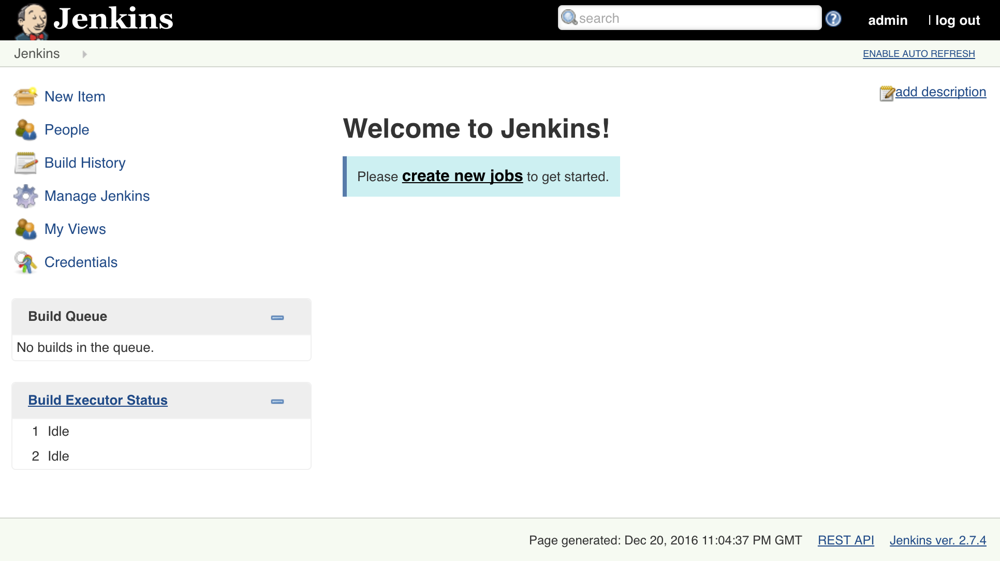
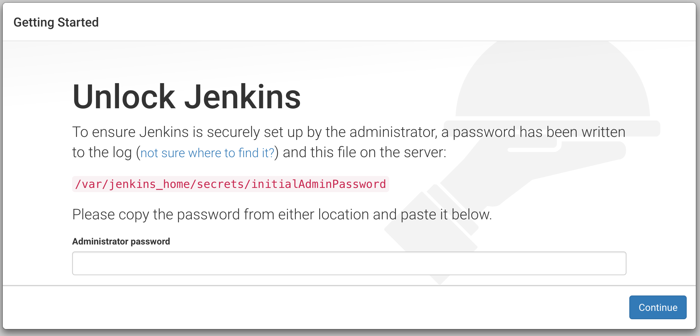
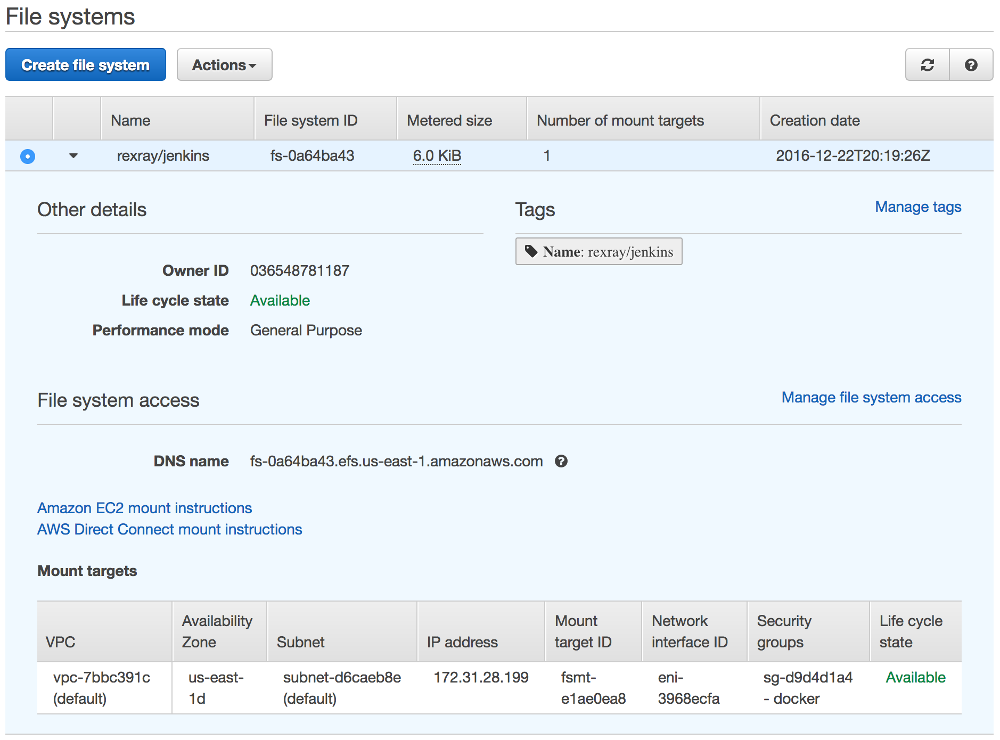

# 在 Swarm 集群中创建和管理有状态服务

任何足够先进的技术都与魔法 indistinguishable（无法区分）。

- 阿瑟·C·克拉克

如果你参加过会议、听过播客、读过论坛，或者参与过任何与容器和云原生应用相关的辩论，你一定听过“无状态服务”这个口号。它几乎像是一种教义。只有无状态服务才是值得的，其他的都是异端。任何问题的解决方案都是移除状态。我们如何扩展这个应用程序？让它变得无状态。我们如何将其放入容器中？让它变得无状态。我们如何让它具有容错能力？让它变得无状态。无论是什么问题，解决方案都是无状态的。

我们直到现在所使用的所有服务都是无状态的吗？并不是。所以，逻辑上来说，我们还没有解决所有问题。

在我们开始探索无状态服务之前，我们应该回顾一下并讨论一下十二因素应用程序方法论。

# 探索十二因素应用程序方法论

如果我的记忆没错，*Heroku*（[`www.heroku.com/`](https://www.heroku.com/)）大约在 2010 年左右开始流行。它向我们展示了如何利用*软件即服务（SaaS）*原则。它使开发者不再需要过多考虑底层基础设施，能够专注于开发，其他的交给别人来做。我们所需要做的只是将代码推送到 Heroku，它会自动检测我们使用的编程语言，创建虚拟机，安装所有依赖，构建、启动，等等。结果就是我们的应用程序在服务器上运行。

当然，在某些情况下，Heroku 自己无法自动搞定一切。当这种情况发生时，我们所要做的就是创建一个简单的配置文件，提供一些额外的信息。依然非常简单高效。

初创公司很喜欢它（有些现在仍然喜欢）。它让他们能够专注于开发新功能，把其他的交给 Heroku 来做。我们编写软件，其他人来运行它。这就是**软件即服务（SaaS）**的最佳体现。它背后的理念和原则变得非常流行，以至于许多人决定复制这个想法，创建自己的 Heroku 类服务。

在 Heroku 广泛被采用后不久，它的创始人意识到许多应用程序并没有如预期般运行。拥有一个解放开发者的操作平台是一回事，但实际编写能在 SaaS 提供商环境下良好运行的代码又是另一回事。因此，Heroku 的团队和一些其他人提出了 *The Twelve-Factor App*（[`12factor.net/`](https://12factor.net/)）原则。如果你的应用满足这十二个因素，它将在 SaaS 中运行良好。这些因素大多数适用于任何现代应用程序，无论它是在本地服务器上运行，还是通过云计算提供商、PaaS、SaaS、容器等运行。每个现代应用都应该采用十二因素应用方法论，或者至少，很多人是这么说的。

让我们探索每个因素，看看我们在这些方面表现如何。也许，仅仅是也许，我们迄今为止学到的东西将使我们符合十二因素原则。我们将逐一分析所有因素，并将它们与本书中使用的服务进行比较。

1.  **代码库**

一个代码库通过版本控制追踪，多个部署。`go-demo` 服务在一个 Git 仓库中。每次提交都部署到测试和生产环境中。我们创建的所有其他服务由其他人发布。 – 通过

1.  **依赖关系**

明确声明并隔离依赖关系。所有依赖项都包含在 Docker 镜像中。除去 Docker 引擎外，没有系统级别的依赖项。Docker 镜像默认遵循此原则。*– 通过*

1.  **配置**

将配置存储在环境中。

`go-demo` 服务没有任何配置文件。所有内容都通过环境变量进行设置。我们创建的所有其他服务也可以这样说。通过网络进行的服务发现极大地帮助了我们实现这一点，它允许我们在没有任何配置的情况下找到服务。请注意，这一原则仅适用于在不同部署间会发生变化的配置。其他任何配置，只要在服务部署时无论何时何地保持一致，都可以继续存储为文件。 *–* 通过

1.  **后端服务**

将后端服务视为附加资源。

在我们的案例中，MongoDB 是一个后端服务。它通过网络连接到主服务 `go-demo`。 *– 通过*

1.  **构建、发布、运行**

严格分离构建和运行阶段。

在这个上下文中，除运行服务外的所有内容都被视为构建阶段。在我们的情况下，构建阶段与运行阶段清晰分离。Jenkins 构建我们的服务，而 Swarm 负责运行它们。构建和运行在不同的集群中进行。 *–* 通过

1.  **进程**

将应用程序作为一个或多个无状态进程执行。

我们在这一原则上严重失败。尽管 `go-demo` 服务是无状态的，但几乎所有其他服务（`docker-flow-proxy`、`jenkins`、`prometheus` 等）都不是无状态的。 – 失败

1.  **端口绑定**

通过端口绑定导出服务。

Docker 网络和 `docker-flow-proxy` 负责端口绑定。在许多情况下，唯一会绑定任何端口的服务是 `proxy`。其他一切服务应该位于一个或多个网络中，并通过 `proxy` 使其可访问。– 已通过

1.  **并发性**

通过进程模型进行扩展。

这一因素直接与无状态性相关。无状态服务（例如：`go-demo`）易于扩展。一些非无状态服务（例如：`docker-flow-proxy`）被设计为可扩展的，因此它们也符合这一原则。许多其他有状态服务（例如：Jenkins、Prometheus 等）无法进行水平扩展。即使可以，过程往往太复杂且容易出错。– 失败

1.  **可丢弃性**

通过快速启动和优雅关机最大化系统的健壮性。

无状态服务默认是可丢弃的。它们可以随时启动和停止，并且通常具有容错能力。如果一个实例失败，Swarm 会将其重新调度到健康的节点上。我们使用的所有服务并非如此。比如 Jenkins 和 MongoDB，如果发生故障，它们会丢失状态，这使得它们根本不可丢弃。– 失败

1.  **开发/生产一致性**

保持开发、预发布和生产环境尽可能相似。

这是 Docker 提供的主要优点之一。由于容器是从不可变的镜像创建的，因此无论是在我们的笔记本电脑、测试环境还是生产环境中运行，服务都是相同的。– 已通过

1.  **日志**

将日志视为事件流。

*ELK* 堆栈和 *LogSpout* 实现了这一原则。只要容器内部的应用程序将日志输出到 `stdout`，所有容器的日志都会被流式传输到 *ElasticSearch*。我们运行的 Jenkins 是个例外，因为它将部分日志写入文件。不过，这个行为是可配置的，所以我们不对它提出批评。– 已通过

1.  **管理进程**

将 `admin/management` 任务作为一次性进程运行。在我们的案例中，所有进程都是作为 Docker 容器执行的，显然符合这一因素。– 已通过

我们通过了十二项因素中的九项。我们应该追求全部十二项吗？实际上，这个问题本身就有问题。一个更好的提问方式是：我们是否能追求全部十二项？我们通常做不到。这个世界不是昨天才建立的，我们无法丢弃所有遗留代码从头开始。即便我们能，十二因子应用原则也有一个重大缺陷：它假设有一个完全由无状态服务组成的系统。

无论我们采用哪种架构风格（包括微服务），应用程序都有状态！在微服务架构中，每个服务可以有多个实例，每个服务实例应该设计为无状态的。无状态的意思是，服务实例在操作过程中不会存储任何数据。因此，无状态意味着任何服务实例都可以从其他地方检索执行某个行为所需的所有应用状态。这是微服务架构应用的一个重要限制，因为它使得系统具备弹性、可扩展性，并允许任何可用的服务实例执行任何任务。即使状态不在我们正在开发的服务内部，它仍然存在，并需要以某种方式进行管理。我们没有开发存储状态的数据库，并不意味着它不应遵循相同的原则，并具备可扩展性、容错性、弹性等特性。

因此，所有系统都有状态，但如果一个服务能够干净地将行为与数据分离，并能够获取执行行为所需的数据，那么该服务可以是无状态的。

十二要素应用的作者们是否会短视到认为状态不存在呢？他们显然不会。他们假设，除了我们编写的代码之外，其他一切都将是由其他人维护的服务。以 MongoDB 为例，它的主要用途是存储状态，因此它当然是有状态的。十二要素应用的作者们假设，我们愿意让其他人管理有状态的服务，而只专注于我们正在开发的那些服务。

虽然在某些情况下，我们可能会选择使用 Mongo 作为由云服务提供商维护的服务，但在许多其他情况下，这种选择并不是最有效的。无论如何，这类服务往往非常昂贵。当我们没有足够的知识或能力来维护我们的后台服务时，这种费用通常是值得支付的。然而，当我们有能力时，如果我们自己运行数据库，往往能得到更好、更便宜的结果。在这种情况下，数据库就是我们的一个服务，显然它是有状态的。我们没有编写所有服务并不意味着我们不在运行它们，因此，我们仍然对它们负责。

好消息是，我们未能实现的三个原则都与有状态性相关。如果我们能够以一种方式创建服务，使得它们的状态在关闭时被保存，并且在所有实例之间共享，那么我们就能够让整个系统变得*云原生*。我们将能够在任何地方运行它，根据需要扩展其服务，并使系统具备容错能力。

创建和管理有状态服务是我们目前缺失的唯一重要环节。完成本章内容后，您将能够在 Swarm 集群内运行任何类型的服务。

本章的实际部分将从创建 Swarm 集群开始。我们将仅使用 AWS 作为示范。这里探讨的原则可以应用于几乎任何云计算提供商，以及本地服务器。

# 设置 Swarm 集群和代理

我们将使用*Packer*([`www.packer.io/`](https://www.packer.io/))和*Terraform*([`www.terraform.io/`](https://www.terraform.io/))在 AWS 上创建一个 Swarm 集群。目前，我们将使用的配置将（几乎）与第十二章中探索的配置相同，*在 Amazon Web Services (AWS) 中创建和管理 Docker Swarm 集群*。在后续更复杂的场景中，我们会进一步扩展该配置。

本章中的所有命令都可以在`13-volumes.sh`([`gist.github.com/vfarcic/338e8f2baf2f0c9aa1ebd70daac31899`](https://gist.github.com/vfarcic/338e8f2baf2f0c9aa1ebd70daac31899)) Gist 中找到。

我们将继续使用`vfarcic/cloud-provisioning`([`github.com/vfarcic/cloud-provisioning`](https://github.com/vfarcic/cloud-provisioning)) 仓库。它包含了一些配置和脚本，将帮助我们完成工作。你已经克隆了这个仓库。为了保险起见，我们将`pull`最新版本：

```
cd cloud-provisioning

git pull

```

Packer 和 Terraform 配置位于`terraform/aws-full`([`github.com/vfarcic/cloud-provisioning/tree/master/terraform/aws-full`](https://github.com/vfarcic/cloud-provisioning/tree/master/terraform/aws-full))目录下：

```
cd terraform/aws-full

```

我们将定义一些环境变量，这些变量将为 Packer 提供在使用 AWS 时所需的信息：

```
export AWS_ACCESS_KEY_ID=[...]

export AWS_SECRET_ACCESS_KEY=[...]

export AWS_DEFAULT_REGION=us-east-1

```

请将`[...]`替换为实际值。如果你丢失了密钥并忘记了如何创建它们，请参考第十二章，*在 Amazon Web Services 中创建和管理 Docker Swarm 集群*。

我们准备好创建本章将使用的第一个镜像了。我们将使用的 Packer 配置位于`terraform/aws-full/packer-ubuntu-docker-compose.json`([`github.com/vfarcic/cloud-provisioning/blob/master/terraform/aws-full/packer-ubuntu-docker-compose.json`](https://github.com/vfarcic/cloud-provisioning/blob/master/terraform/aws-full/packer-ubuntu-docker-compose.json))。它与我们之前使用的几乎相同，因此我们只会评论相关的不同之处。具体如下：

```
 "provisioners": [{
...
  }, {
"type": "file",
"source": "docker.service",
"destination": "/tmp/docker.service"
  }, {
"type": "shell",
"inline": [
"sudo mv /tmp/docker.service /lib/systemd/system/docker.service",
"sudo chmod 644 /lib/systemd/system/docker.service",
"sudo systemctl daemon-reload",
"sudo systemctl restart docker"
    ]
  }]

```

文件提供器将 `docker.service` 文件复制到虚拟机中。来自 shell 提供器的命令将把上传的文件移动到正确的目录，赋予正确的权限，并重启`docker service`。

`docker.service`([`github.com/vfarcic/cloud-provisioning/blob/master/terraform/aws-full/docker.service`](https://github.com/vfarcic/cloud-provisioning/blob/master/terraform/aws-full/docker.service)) 文件内容如下：

```
[Unit]
Description=Docker Application Container Engine
Documentation=https://docs.docker.com
After=network.target docker.socket
Requires=docker.socket

[Service]
Type=notify
ExecStart=/usr/bin/dockerd -H fd:// -H tcp://0.0.0.0:2375
ExecReload=/bin/kill -s HUP $MAINPID
LimitNOFILE=infinity
LimitNPROC=infinity
LimitCORE=infinity
TasksMax=infinity
TimeoutStartSec=0
Delegate=yes
KillMode=process

[Install]
WantedBy=multi-user.target

```

Docker 服务配置与默认配置几乎相同。唯一的区别是`ExecStart`中的`-H tcp://0.0.0.0:2375`。

默认情况下，Docker Engine 不允许远程连接。如果配置不变，我们无法从一台服务器向另一台服务器发送命令。通过添加`-H tcp://0.0.0.0:2375`，我们告诉 Docker 接受来自任何地址`0.0.0.0`的请求。通常，这会带来很大的安全风险。然而，所有 AWS 的端口默认是关闭的。稍后，我们将只对属于同一安全组的服务器开放`2375`端口。因此，只要我们在其中一台服务器内，我们就能够控制任何 Docker Engine。正如你将很快看到的，这在接下来的几个例子中会非常有用。

让我们构建`packer-ubuntu-docker-compose.json`中定义的 AMI：

```
packer build -machine-readable \ 
    packer-ubuntu-docker.json \
    | tee packer-ubuntu-docker.log

```

现在我们可以将注意力转向 Terraform，它将创建我们的集群。我们将复制之前创建的 SSH 密钥`devops21.pem`，并声明一些环境变量，以便 Terraform 能够访问我们的 AWS 账户：

```
export TF_VAR_aws_access_key=$AWS_ACCESS_KEY_ID

export TF_VAR_aws_secret_key=$AWS_SECRET_ACCESS_KEY

export TF_VAR_aws_default_region=$AWS_DEFAULT_REGION

export KEY_PATH=$HOME/.ssh/devops21.pem

cp $KEY_PATH devops21.pem

export TF_VAR_swarm_ami_id=$( \
    grep 'artifact,0,id' \
    packer-ubuntu-docker.log \
    | cut -d: -f2)

```

Terraform 要求环境变量以`TF_VAR`为前缀，因此我们不得不创建新的环境变量，尽管它们的值和我们在 Packer 中使用的一样。环境变量`KEY_PATH`的值仅为示例。你可能将它存储在其他地方。如果是这样，请更改为正确的路径。

最后一条命令过滤了`packer-ubuntu-docker.log`并将 AMI ID 存储为环境变量`TF_VAR_swarm_ami_id`。

现在我们可以创建一个 Swarm 集群了。接下来的练习中，三个虚拟机就足够了，因此我们只会创建管理节点。由于命令和我们在前几章中执行的一样，我们将跳过解释，直接运行它们：

```
terraform apply \
    -target aws_instance.swarm-manager \
    -var swarm_init=true \
    -var swarm_managers=1

export TF_VAR_swarm_manager_token=$(ssh \
    -i devops21.pem \
    ubuntu@$(terraform output \
    swarm_manager_1_public_ip) \
    docker swarm join-token -q manager)

export TF_VAR_swarm_manager_ip=$(terraform \
    output swarm_manager_1_private_ip)

terraform apply \
    -target aws_instance.swarm-manager

```

我们创建了第一个服务器并初始化了 Swarm 集群。随后，我们获取了令牌和其中一个管理节点的 IP，并使用这些数据创建并加入了另外两个节点。

为了安全起见，我们将进入其中一个管理节点并列出组成集群的节点：

```
ssh -i devops21.pem \
    ubuntu@$(terraform output \
    swarm_manager_1_public_ip) \

docker node ls

```

输出如下（为简洁起见，已删除 ID）：

```
HOSTNAME         STATUS AVAILABILITY MANAGER STATUS
ip-172-31-16-158 Ready  Active       Leader
ip-172-31-31-201 Ready  Active       Reachable
ip-172-31-27-205 Ready  Active       Reachable

```

**工作节点在哪里？**

我们没有创建任何工作节点。原因很简单。对于本章中的练习，三个节点就足够了。这并不妨碍你在开始使用类似的集群设置时为你的组织添加工作节点。

要添加工作节点，请执行以下命令：

`export TF_VAR_swarm_worker_token=$(ssh\ '-i devops21.pem ''ubuntu@$(terraform output ''swarm_manager_1_public_ip)' 'docker swarm join-token -q worker) terraform apply\'-target aws_instance.swarm-worker'`

如果输出为`1.2.3.4`，你应该在浏览器中打开`http://1.2.3.4/jenkins`。

我们快完成了。在进入有状态性之前，唯一剩下的就是运行`docker-flow-proxy`和`docker-flow-swarm-listener`服务。由于我们已经创建过这些服务很多次，因此不需要进一步解释，我们可以通过部署`vfarcic/docker-flow-proxy/docker-compose-stack.yml` ([`github.com/vfarcic/docker-flow-proxy/blob/master/docker-compose-stack.yml`](https://github.com/vfarcic/docker-flow-proxy/blob/master/docker-compose-stack.yml))堆栈来加快过程：

```
docker network create --driver overlay proxy

curl -o proxy-stack.yml \
    https://raw.githubusercontent.com/\
vfarcic/docker-flow-proxy/master/docker-compose-stack.yml

docker stack deploy \
    -c proxy-stack.yml proxy

exit

```

# 无数据持久化的有状态服务运行

我们将在 Swarm 集群中开始探索有状态服务，首先看看如果像其他服务一样部署它们，会发生什么情况。

一个很好的例子是 Jenkins。我们创建的每个任务都是一个 XML 文件。我们安装的每个插件都是一个 HPI 文件。每次配置更改都会以 XML 格式存储。你可以明白了，Jenkins 中的一切操作最终都会形成一个文件。这些文件构成了它的状态。如果没有这些，Jenkins 将无法运行。Jenkins 也是我们在遗留应用中遇到问题的一个很好的例子。如果我们今天重新设计它，可能会使用数据库来存储其状态。这样做可以让我们进行扩展，因为所有实例将通过连接到同一个数据库来共享相同的状态。如果我们今天从头开始设计，可能会做出很多其他的设计选择。成为遗留系统并不一定是坏事。当然，今天的经验帮助我们避免了一些过去的陷阱。另一方面，长时间的存在意味着它经过了战斗考验，拥有高采纳率，庞大的贡献者数量，广泛的用户基础等等。一切都有权衡，我们无法得到所有的好处。

我们将暂时搁置有一个成熟且经过验证的应用与年轻且现代但往往未经验证的应用之间的优缺点。相反，我们来看看作为有状态服务的 Jenkins，在我们使用 Terraform 创建的 Swarm 集群中运行时的表现：

```
ssh -i devops21.pem \
    ubuntu@$(terraform output \
    swarm_manager_1_public_ip)

docker service create --name jenkins \
-e JENKINS_OPTS="--prefix=/jenkins" \
    --label com.df.notify=true \
    --label com.df.distribute=true \
    --label com.df.servicePath=/jenkins \
    --label com.df.port=8080 \
    --network proxy \
    --reserve-memory 300m \
    jenkins:2.7.4-alpine

```

我们进入了其中一台管理节点并创建了`jenkins`服务。

请稍等片刻，直到`jenkins`服务运行起来。你可以使用 docker 命令`service ps jenkins`来检查当前状态。

现在 Jenkins 已经运行，我们应该在浏览器中打开它：

```
exit

open "http://$(terraform output swarm_manager_1_public_ip)/jenkins"

```

**Windows 用户注意** Git Bash 可能无法使用`open`命令。如果是这种情况，请执行`terraform output` `swarm_manager_1_public_ip`来查找管理节点的 IP，并在你选择的浏览器中直接打开该 URL。例如，上述命令应替换为以下命令：

`terraform output swarm_manager_1_public_ip`

如果输出是`1.2.3.4`，你应该在浏览器中打开`http://1.2.3.4/jenkins`。

正如你从第六章《*使用 Jenkins 自动化持续部署流程*》中记得的那样，我们需要从日志或文件系统中提取密码。然而，这次，操作会稍微复杂一些。Docker Machine 将本地（笔记本电脑）目录挂载到它创建的每个虚拟机中，因此我们可以直接获取`initialAdminPassword`，而无需进入虚拟机。

在 AWS 中并没有这样的事情，*至少现在没有*，所以我们需要找出哪个 EC2 实例托管了 Jenkins，获取容器的 ID，并进入其中以获取文件。虽然手动做这件事很容易，但由于我们坚持自动化，我们将采用更难的方式。

我们将通过进入其中一个管理界面并列出服务任务，开始寻找密码的任务：

```
ssh -i devops21.pem \
    ubuntu@$(terraform output \
    swarm_manager_1_public_ip) \

docker service ps jenkins

```

输出如下（为了简洁，ID 和 ERROR 列已被移除）：

```
NAME       IMAGE                 NODE              DESIRED STATE           
jenkins.1  jenkins:2.7.4-alpine  ip-172-31-16-158  Running       
---------------------------------------------------------------
CURRENT STATE
Running 8 minutes ago 

```

幸运的是，AWS EC2 实例的名称中包含了内部 IP。我们可以利用这一点：

```
JENKINS_IP=$(docker service ps jenkins \
    | tail -n 1 \
    | awk '{ print $4 }' \
    | cut -c 4- \
    | tr "-" ".")

```

我们列出了服务任务并通过管道传递给`tail`，以便只返回最后一行。然后我们使用`awk`获取第四列。`cut`命令打印了第四个字节的结果，有效地移除了`ip-`。所有结果都通过`tr`命令替换了`-`，最后，结果被存储在环境变量`JENKINS_IP`中。

如果这对你来说太过奇怪，可以手动指定该值（在我的情况下是`172.31.16.159`）。

现在我们知道了哪个节点托管了 Jenkins，我们需要获取容器的 ID。由于我们修改了`docker.service`配置，使得可以向远程引擎发送命令，我们可以使用`-H`参数。

用于检索 Jenkins 容器 ID 的命令如下：

```
JENKINS_ID=$(docker -H tcp://$JENKINS_IP:2375 \
    ps -q \
    --filter label=com.docker.swarm.service.name=jenkins)

```

我们使用`-H`告诉本地客户端连接到在`tcp://$JENKINS_IP:2375`上运行的远程引擎。我们列出了所有正在运行的容器`ps`，并在安静模式`-q`下显示，确保只返回 ID。同时我们应用了过滤器，只检索名为 Jenkins 的服务。结果被存储在环境变量`JENKINS_ID`中。

现在我们可以使用 IP 和 ID 进入容器并输出存储在文件`/var/jenkins_home/secrets/initialAdminPassword`中的密码。

```
docker -H tcp://$JENKINS_IP:2375 \
    exec -it $JENKINS_ID \
    cat /var/jenkins_home/secrets/initialAdminPassword

```

在我的情况下，输出如下：

```
cb7483ce39894c44a48b761c4708dc7d

```

请复制密码，返回到 Jenkins UI 并粘贴。

在继续之前，请完成 Jenkins 的设置。你已经从第六章《*使用 Jenkins 自动化持续部署流程*》中了解了流程，所以我就不再多说了，让你安静地完成它。

结果应该是一个类似于*图 13-1*的屏幕：



图 13-1：初始设置后的 Jenkins 主屏幕

这里有一个简单的问题，我相信你知道如何回答。如果由于某种原因，Jenkins 实例失败，会发生什么情况？

让我们模拟失败并观察结果：

```
docker -H tcp://$JENKINS_IP:2375 \
    rm -f $JENKINS_ID

```

我们使用了环境变量`JENKINS_IP`和`JENKINS_ID`，将强制移除`rm -f`命令发送到托管 Jenkins 的远程节点。

没有什么是永恒的。迟早，服务会失败。如果它不失败，运行它的节点会失败。通过移除容器，我们模拟了现实世界中可能发生的情况。

一段时间后，Swarm 会检测到 jenkins 副本失败并实例化一个新的副本。我们可以通过列出 jenkins 任务来确认这一点：

```
docker service ps jenkins

```

输出如下（为了简洁，ID 已被移除）：

```
NAME        IMAGE                NODE               DESIRED STATE CURRENT STATE                                    
jenkins.1   jenkins:2.7.4-alpine ip-172-31-31-201   Running       Running about 1 min 
_ jenkins.1 jenkins:2.7.4-alpine ip-172-31-16-158   Shutdown      Failed about 1 min   
-------------------------------------------------------------
ERROR PORT
"task: non-zero exit (137)" 

```

到目前为止，一切顺利。Swarm 正在按照我们希望的方式运行。它确保我们的服务（几乎）始终在运行。

剩下的唯一任务是返回 UI 并刷新屏幕。

屏幕应该看起来像*图 13-2*那样：



图 13-2：Jenkins 初始设置屏幕

这很尴尬。我们所做的一切都丢失了，我们又回到了原点。由于 Jenkins 的状态没有保存在容器外部，当 Swarm 创建了一个新的容器时，它从一个空白状态开始。

我们该如何解决这个问题？我们可以采用哪些解决方案来解决持久化问题？

请在继续之前移除`jenkins`服务：

```
docker service rm jenkins

exit

```

# 在主机上持久化有状态服务

在 Docker 早期，当人们在没有 Docker Swarm、Kubernetes 或 Mesos 等调度程序的预定义节点上运行容器时，主机上的持久化非常常见。当时，我们会选择一个节点来运行容器，并将其放在那里。升级会在同一服务器上进行。换句话说，我们将应用程序打包成容器，并在大多数情况下将其视为任何传统服务。如果一个节点发生故障……运气不好！不管有没有容器，都会是灾难。

由于服务是预定义的，我们可以在主机上持久化状态，并在主机故障时依赖备份。根据备份的频率，我们可能会丢失一分钟、一小时、一天，甚至一整周的数据。生活真是艰难。

这种方法唯一的优点是持久化很简单。我们会在容器内挂载一个主机卷。文件会保存在容器外部，因此在“正常”情况下不会丢失数据。如果容器因为故障或升级而重新启动，当我们运行新容器时，数据依然存在。

还有其他单主机的模型变体，比如数据卷、仅数据容器等。它们都有相同的缺点。它们消除了可移植性。没有可移植性，就没有容错，也没有扩展能力。没有 Swarm。

基于主机的持久化是不可接受的，因此我不会再浪费你们的时间。

如果你有系统管理员的背景，可能会想知道为什么我没有提到网络文件系统（**NFS**）。原因很简单。我想让你先感受一下痛苦，然后再深入探讨显而易见的解决方案。

# 在网络文件系统上持久化有状态服务

我们需要找到一种方法来在运行我们服务的容器之外保留状态。

我们可以在主机上挂载一个卷。这样，如果容器失败并在同一节点重新调度，它将允许我们保持状态。问题在于，这样的解决方案过于局限。除非我们加以约束，否则无法保证 Swarm 会将服务重新调度到相同的节点。如果我们做了这样的事情，就会妨碍 Swarm 确保服务的可用性。当该节点发生故障时（每个节点总有一天会故障），Swarm 无法重新调度服务。只有当我们的服务器正常运行时，我们才能保证容错能力。

我们可以通过将 NFS 挂载到每台服务器上来解决节点故障问题。这样，每台服务器都可以访问相同的数据，我们可以将 Docker 卷挂载到它上面。

我们将使用**Amazon 弹性文件系统**(**EFS**)([`aws.amazon.com/efs/`](https://aws.amazon.com/efs/))。由于本书并未专门讲解 AWS，我将跳过不同 AWS 文件系统的比较，仅提到选择 EFS 是因为它可以跨多个可用区使用。

请打开*EFS 首页*([`console.aws.amazon.com/efs/home`](https://console.aws.amazon.com/efs/home))界面：

```
open "https://console.aws.amazon.com/efs/home?region=$AWS_DEFAULT_REGION"

```

**Windows 用户注意**

Git Bash 可能无法使用`open`命令。如果是这种情况，请将`$AWS_DEFAULT_REGION`替换为您的集群所在的区域（例如，`us-east-1`），并在浏览器中打开它。

点击“创建文件系统”按钮。在每个可用区中，将默认的安全组替换为*docker*（我们之前使用 Terraform 创建了它）。然后点击“下一步”按钮两次，最后点击“创建文件系统”。

我们应等待直到每个可用区的生命周期状态设置为“可用”。

现在，我们准备在每个节点上挂载 EFS。最简单的做法是点击 Amazon EC2 挂载说明链接。我们只需要复制“挂载文件系统”部分第三点中的命令。

接下来只需进入每个节点并执行挂载 EFS 卷的命令：

```
ssh -i devops21.pem \
    ubuntu@$(terraform output \
    swarm_manager_1_public_ip)

sudo mkdir -p /mnt/efs

```

我们进入了第一个管理节点并创建了`/mnt/efs`目录。

粘贴您从 EC2 挂载说明界面复制的命令。在执行之前，我们需要做一个小的修改。请将目标路径从`efs`改为`/mnt/efs`，然后执行命令。

在我的案例中，命令如下（您的命令会有所不同）：

```
sudo mount -t nfs4 \
    -o nfsvers=4.1,rsize=1048576,wsize=1048576,hard,timeo=600,\
    retrans=2 fs-07538d4e.efs.us-east-1.amazonaws.com:/ \
    /mnt/efs

```

我们还应该创建一个子目录，用于存储 Jenkins 状态：

```
sudo mkdir -p /mnt/efs/jenkins

sudo chmod 777 /mnt/efs/jenkins

exit

```

我们创建了目录`/mnt/efs/jenkins`，并授予了所有人完全权限，然后退出了服务器。由于 Swarm 可能会选择在任意节点上创建服务，我们应在其余服务器上重复相同的过程。请注意，您的挂载路径会有所不同，因此不要直接粘贴下面的`sudo mount`命令：

```
ssh -i devops21.pem \
    ubuntu@$(terraform output \
    swarm_manager_2_public_ip)

sudo mkdir -p /mnt/efs

sudo mount -t nfs4 \
    -o nfsvers=4.1,rsize=1048576,wsize=1048576,hard,timeo=600, \
    retrans=2 fs-07538d4e.efs.us-east-1.amazonaws.com:/ \
    /mnt/efs

exit

ssh -i devops21.pem \
    ubuntu@$(terraform output \
    swarm_manager_3_public_ip)

sudo mkdir -p /mnt/efs

sudo mount -t nfs4 \
    -o nfsvers=4.1,rsize=1048576,wsize=1048576,hard,timeo=600,\
    retrans=2 fs-07538d4e.efs.us-east-1.amazonaws.com:/ \
    /mnt/efs

exit

```

现在，我们终于可以再次尝试创建 `jenkins` 服务。希望这次在发生故障时状态能够得到保留：

```
ssh -i devops21.pem \
    ubuntu@$(terraform output \
    swarm_manager_1_public_ip) \

docker service create --name jenkins \
-e JENKINS_OPTS="--prefix=/jenkins" \
    --mount "type=bind,source=/mnt/efs/jenkins,target=/var/jenkins_home" \
    --label com.df.notify=true \
    --label com.df.distribute=true \
    --label com.df.servicePath=/jenkins \
    --label com.df.port=8080 \
    --network proxy \
    --reserve-memory 300m \
    jenkins:2.7.4-alpine

```

这个命令和我们之前使用的命令唯一的区别在于`--mount`参数。它告诉 Docker 将主机目录 `/mnt/efs/jenkins` 挂载为容器内的 `/var/jenkins_home`。由于我们在所有节点上将 `/mnt/efs` 挂载为 EFS 卷，因此无论 `jenkins` 服务运行在哪台服务器上，它都能访问相同的文件。

现在我们应该等待直到服务启动。请执行 `service ps` 命令查看当前状态：

```
docker service ps jenkins

```

让我们在浏览器中打开 Jenkins UI：

```
exit

open "http://$(terraform output swarm_manager_1_public_ip)/jenkins"

```

**Windows 用户注意**

Git Bash 可能无法使用 `open` 命令。如果是这种情况，请执行 `terraform output swarm_manager_1_public_ip` 查找管理节点的 IP 地址，然后直接在你选择的浏览器中打开该 URL。例如，上面的命令应该替换为以下命令：

`terraform output swarm_manager_1_public_ip` 如果输出是 `1.2.3.4`，你应该在浏览器中打开 `http://1.2.3.4/jenkins`。

这一次，由于 Jenkins 主目录被挂载为 `/mnt/efs/jenkins`，查找密码变得更加容易。我们只需要从其中一台服务器输出 `/mnt/efs/jenkins/secrets/initialAdminPassword` 文件的内容：

```
ssh -i devops21.pem \
    ubuntu@$(terraform output \
    swarm_manager_1_public_ip)

cat /mnt/efs/jenkins/secrets/initialAdminPassword

```

请复制密码并将其粘贴到 Jenkins UI 中的管理员密码字段。完成设置：


图 13-3：初始设置后的 Jenkins 主屏幕

我们将再次模拟故障并观察结果。接下来的命令与我们之前执行的命令相同，所以没有理由对它们进行评论：

```
JENKINS_IP=$(docker service ps jenkins \
    | tail -n 1 \
    | awk '{ print $4 }' \
    | cut -c 4- \
    | tr "-" ".")

JENKINS_ID=$(docker -H tcp://$JENKINS_IP:2375 \
    ps -q \
    --filter label=com.docker.swarm.service.name=jenkins)

docker -H tcp://$JENKINS_IP:2375 \
    rm -f $JENKINS_ID

docker service ps jenkins

```

请等待 Swarm 启动一个新的副本，并在浏览器中刷新 Jenkins UI 屏幕。这一次，我们看到的是登录页面，而不是返回到初始设置。状态得以保存，使得我们的 `jenkins` 服务具备容错能力。在最坏的情况下，当服务或整个节点失败时，我们会经历短暂的停机，直到 Swarm 重新创建失败的副本。你可能会想：为什么我强制你手动创建 EFS 并挂载它？难道这不应该通过 Terraform 自动完成吗？原因很简单：这个解决方案不值得自动化，它有很多缺点。

我们需要将所有服务的状态放置到同一个 EFS 驱动器中。更好的解决方案是为每个服务创建一个 EFS 卷。采用这种方法的问题是，每当有人向集群添加一个新的有状态服务时，我们都需要修改 Terraform 配置。在这种情况下，Terraform 的帮助有限，因为它并不是为了具有特定服务配置而设计的。它应当作为一种设置集群的方法，能够托管任何服务。即使我们接受为所有服务使用一个单独的 EFS 卷，我们仍然需要为每个服务创建一个新的子目录。如果我们将 Terraform 作为创建基础设施的工具，而将 Docker 用于所有与服务相关的任务，岂不是更好？

幸运的是，还有更好的方法来创建和挂载 EFS 卷。

在我们探索其他替代方案之前，请先移除`jenkins`服务并`exit`服务器：

```
docker service rm jenkins

exit

```

我们之前创建的 EFS 卷没有必要保留，所以请返回到*EFS 控制台*（[`console.aws.amazon.com/efs`](https://console.aws.amazon.com/efs)），选择文件系统，然后点击“操作”并点击“删除文件系统”按钮。其余步骤请按照屏幕上的说明进行操作。

# 数据卷编排

有很多存储编排解决方案通过其卷插件与 Docker 集成。我们不会对它们进行比较。这样的尝试需要整整一章内容，甚至可能一本书。

即使你选择了不同的解决方案，接下来要解释的原则也适用于（几乎）所有其他解决方案。有关当前支持的插件的完整列表，请访问*卷插件*（[`docs.docker.com/engine/extend/legacy_plugins/#/volume-plugins`](https://docs.docker.com/engine/extend/legacy_plugins/#/volume-plugins)）部分，详情请见*使用 Docker 引擎插件*（[`docs.docker.com/engine/extend/legacy_plugins/`](https://docs.docker.com/engine/extend/legacy_plugins/)）文档。

*REX-Ray*（[`github.com/codedellemc/rexray`](https://github.com/codedellemc/rexray)）是一个供应商无关的存储编排引擎。它建立在*libStorage*（[`libstorage.readthedocs.io`](http://libstorage.readthedocs.io)）框架之上。它支持*EMC*、*Oracle VirtualBox*和*Amazon EC2*。在撰写本文时，*GCE*、*Open Stack*、*Rackspace*和*DigitalOcean*的支持正在进行中。

我发现当我看到某个事物实际操作时，更容易理解它。秉持这种精神，我们将不再长时间辩论 REX-Ray 的功能和工作原理，而是直接进入实际演示。

# 使用 REX-Ray 持久化有状态服务

我们将从手动设置 REX-Ray 开始。如果它证明是我们有状态服务的一个好解决方案，我们将把它转移到 Packer 和 Terraform 配置中。我们从手动设置开始的另一个原因是让你更好地理解它是如何工作的。

让我们开始吧。

除了我们已经使用过很多次的 AWS 访问密钥和区域，我们还需要通过 Terraform 创建的安全组 ID：

```
terraform output security_group_id

```

输出应该类似于下面的内容（你的输出会有所不同）：

```
sg-d9d4d1a4

```

请复制该值，我们很快会用到它。

我们将进入其中一个节点，在那里安装和配置 REX-Ray：

```
ssh -i devops21.pem \
    ubuntu@$(terraform output \
    swarm_manager_1_public_ip)

```

REX-Ray 的设置相对简单，这也是我比其他一些解决方案更喜欢它的原因之一：

```
curl -sSL https://dl.bintray.com/emccode/rexray/install | sh -s -- stable

```

输出如下：

```
REX-Ray
-------
Binary: /usr/bin/rexray
SemVer: 0.6.3
OsArch: Linux-x86_64
Branch: v0.6.3
Commit: 69b1f5c2d86a2103c792bec23b5855babada1c0a
Formed: Wed, 07 Dec 2016 23:22:14 UTC

libStorage
----------
SemVer: 0.3.5
OsArch: Linux-x86_64
Branch: v0.6.3
Commit: 456dd68123dd6b49da0275d9bbabd6c800583f61
Formed: Wed, 07 Dec 2016 23:21:36 UTC

```

我们安装了 *REX-Ray 版本 0.6.3* 以及其依赖 *libStorage 版本 0.3.5*。在你的情况下，版本可能会更新。

接下来，我们将创建所需的环境变量，用于 REX-Ray 配置：

```
export AWS_ACCESS_KEY_ID=[...]

export AWS_SECRET_ACCESS_KEY=[...]

export AWS_DEFAULT_REGION=[...]

export AWS_SECURITY_GROUP=[...]

```

请将 `[...]` 替换为实际值。安全组的值应与我们之前通过 `terraform output security_group_id` 命令获取的相同。

现在我们准备通过位于 `/etc/rexray/config.yml` 的 YML 配置文件来配置 REX-Ray：

```
echo "
libstorage:
  service: efs
  server:
    services:
      efs:
        driver: efs
        efs:
          accessKey:      ${AWS_ACCESS_KEY_ID}
          secretKey:      ${AWS_SECRET_ACCESS_KEY}
          securityGroups: ${AWS_SECURITY_GROUP}
          region:         ${AWS_DEFAULT_REGION}
          tag:            rexray" \
 | sudo tee /etc/rexray/config.yml

```

我们将驱动程序设置为 `efs` 并提供了 AWS 数据。结果输出到 `/etc/rexray/config.yml` 文件。

现在我们可以启动服务：

```
sudo rexray service start

```

输出如下：

```
rexray.service - rexray
   Loaded: loaded (/etc/systemd/system/rexray.service; enabled; \
vendor preset: enabled)
   Active: active (running) since Thu 2016-12-22 19:34:51 UTC; 245ms ago
 Main PID: 7238 (rexray)
    Tasks: 4
   Memory: 10.6M
      CPU: 109ms
   CGroup: /system.slice/rexray.service/\
           _7238 /usr/bin/rexray start -f

Dec 22 19:34:51 ip-172-31-20-98 systemd[1]: Started rexray.

```

REX-Ray 正在运行，我们可以 `exit` 节点：

```
exit

```

由于我们不知道哪个节点将托管我们的有状态服务，我们需要在集群的每个节点上设置 REX-Ray。请在 Swarm 管理节点 2 和 3 上重复这些设置步骤。

一旦 REX-Ray 在所有节点上运行，我们可以开始尝试。请进入其中一个管理节点：

```
ssh -i devops21.pem \
    ubuntu@$(terraform output \
    swarm_manager_1_public_ip)

```

可以通过我们安装的 `rexray` 二进制文件直接使用 REX-Ray。例如，我们可以列出所有的卷：

```
sudo rexray volume get

```

输出如下：

```
ID  Name  Status  Size

```

由于我们尚未创建任何卷，所以没有太多可查看的内容。我们可以使用 `rexray` 卷创建命令来实现这一点。然而，没有必要这么做。得益于与 Docker 的集成，实际上没有太多必要直接使用二进制文件进行任何操作。

让我们再试一次创建 `jenkins` 服务。这一次，我们将使用 REX-Ray 作为卷驱动：

```
docker service create --name jenkins \
-e JENKINS_OPTS="--prefix=/jenkins" \
    --mount "type=volume,source=jenkins,target=/var/jenkins_home, \
volume-driver=rexray" \
    --label com.df.notify=true \
    --label com.df.distribute=true \
    --label com.df.servicePath=/jenkins \
    --label com.df.port=8080 \
    --network proxy \
    --reserve-memory 300m \
    jenkins:2.7.4-alpine

```

我们刚执行的命令与之前尝试创建 `jenkins` 服务的唯一区别在于 `--mount` 参数。源现在只是一个名称 `jenkins`，它代表卷的名称。目标依然相同，表示容器内的 Jenkins 主目录。重要的区别是添加了 `volume-driver` 参数。这条指令告诉 Docker 使用 `rexray` 来挂载卷。

如果 REX-Ray 和 Docker 的集成正常，我们应该能看到一个 `jenkins` 卷：

```
sudo rexray volume get

```

输出如下：

```
ID          Name    Status   Size
fs-0a64ba43 jenkins attached 6144

```

这次，`rexray` 卷获取命令的输出不为空。我们可以看到 `jenkins` 卷。如我之前提到的，实际上没有必要使用 `rexray` 二进制文件。我们可以通过 Docker 直接实现它的许多功能。例如，我们可以执行 `docker volume ls` 命令来列出所有卷：

```
docker volume ls

```

输出如下：

```
DRIVER  VOLUME NAME
rexray  jenkins

```

列出卷仅证明 Docker 和 REX-Ray 注册了一个新的挂载。让我们看看在 AWS 中发生了什么：

```
exit

open "https://console.aws.amazon.com/efs/home?region=$AWS_DEFAULT_REGION"

```

**给 Windows 用户的提示**

Git Bash 可能无法使用 `open` 命令。如果是这种情况，请将 `$AWS_DEFAULT_REGION` 替换为你集群所在的区域（例如，`us-east-1`），然后在浏览器中打开。

你应该看到一个类似于 *图 13-4* 中展示的屏幕：



图 13-4：AWS EFS 卷与 REX-Ray 一起创建并挂载

如你所见，REX-Ray 创建了一个名为 `rexray/jenkins` 的新 EFS 卷，并在与托管 `jenkins` 服务的节点相同的可用区挂载了一个目标。

唯一缺少的部分，以满足我多疑的本性，就是杀掉 Jenkins，并确认 REX-Ray 是否在 Swarm 重新调度的一个新容器上挂载了 EFS 卷。

和之前一样，我们将从设置 Jenkins 开始：

```
open "http://$(terraform output swarm_manager_1_public_ip)/jenkins"

```

**给 Windows 用户的提示**

Git Bash 可能无法使用 `open` 命令。如果是这种情况，请执行 `terraform output` `swarm_manager_1_public_ip` 以查找管理器的 IP，并直接在你选择的浏览器中打开该 URL。例如，前面的命令应替换为以下命令：

`terraform output swarm_manager_1_public_ip` 如果输出是 `1.2.3.4`，你应该在浏览器中打开 `http://1.2.3.4/jenkins`。

我们面临着一个反复出现的挑战。如何找到初始 Jenkins 管理员密码。从好的一面看，这个挑战作为演示不同方式访问容器内内容的示例非常有用。

这次，我们将利用 REX-Ray 访问存储在 EFS 卷中的数据，而不是尝试查找托管 `jenkins` 服务的节点和容器 ID：

```
ssh -i devops21.pem \
    ubuntu@$(terraform output \
    swarm_manager_1_public_ip)

docker run -it --rm \
    --volume-driver rexray \
    -v jenkins:/var/jenkins_home \
    alpine cat /var/jenkins_home/secrets/initialAdminPassword

```

输出应该与以下内容类似：

```
9c5e8e51af954d7988b310d862c3d38c

```

我们创建了一个新的 alpine 容器，并使用 rexray 卷驱动程序将其附加到 jenkins EFS 卷。命令输出了 `/var/jenkins_home/secrets/initialAdminPassword` 文件的内容，该文件包含密码。由于我们指定了 `--rm` 参数，Docker 在进程 `cat` 退出后会移除容器。最终结果是密码输出到屏幕。请复制并粘贴到 Jenkins UI 中的管理员密码字段，完成设置。

现在，我们需要经历一个痛苦的过程，找到托管 Jenkins 的节点，获取容器的 ID，并在远程引擎上执行 `docker rm` 命令。换句话说，我们将运行与之前尝试时相同的一组命令：

```
JENKINS_IP=$(docker service ps jenkins | tail -n 1 \
    | awk '{ print $4 }' | cut -c 4- | tr "-" ".")

JENKINS_ID=$(docker -H tcp://$JENKINS_IP:2375 \
    ps -q \
    --filter label=com.docker.swarm.service.name=jenkins)

docker -H tcp://$JENKINS_IP:2375 \
    rm -f $JENKINS_ID

```

几分钟后，Swarm 将重新调度容器，Jenkins 将再次运行。

请等待直到服务当前状态为运行中：

```
docker service ps jenkins

```

重新加载 Jenkins UI，观察你是否被重定向到登录屏幕，而不是初始设置页面。状态已被保存。

我们已经完成了这个集群。现在我们需要手动删除卷。否则，由于它不是由 Terraform 创建的，即使我们销毁集群，AWS 仍会继续收取费用。问题是，如果有一个或多个服务正在使用这个卷，它是不能被删除的，因此我们还需要销毁 `jenkins` 服务：

```
docker service rm jenkins

docker volume rm jenkins

exit

terraform destroy -force

```

# 为有状态服务选择持久化方法

我们可以使用很多其他工具来持久化状态。它们中的大多数可以归为我们探索过的几类。在我们可以采取的不同方法中，最常用的三种方法如下：

1.  不持久化状态。

1.  将状态持久化到主机上。

1.  将状态持久化到集群外部的某个地方。

没有必要争论为什么持久化有状态服务的数据是至关重要的，因此第一个选项自动被淘汰。

由于我们正在操作一个集群，我们不能依赖任何单一主机始终可用。它可能随时发生故障。即使某个节点没有故障，迟早某个服务会故障，Swarm 会重新调度它。发生这种情况时，我们无法保证 Swarm 会在同一主机上运行新副本。即使不幸的是，节点从未发生故障，且服务永不出问题，在我们第一次执行该服务的更新（例如：发布新版本）时，Swarm 也可能会在其他地方创建新副本。总之，我们不知道服务会在哪儿运行，也不知道它会在那里停留多久。唯一能否定这个说法的方法是使用约束，将服务绑定到特定主机上。然而，如果我们这么做，那就没有必要再使用 Swarm 或者阅读这本书了。总之，状态不应持久化到特定主机上。

这让我们剩下了第三个选择。状态应该被持久化到集群外部的某个地方，可能是一个网络驱动器。传统上，系统管理员会在所有主机上挂载一个网络驱动器，从而使服务无论运行在哪里都能访问状态。这个方法有很多问题，主要的问题是需要挂载一个驱动器，并期望所有有状态服务将它们的状态持久化到这个驱动器上。理论上，我们可以为每个服务挂载一个新的驱动器，但这样的要求很快就会成为负担。例如，如果我们使用 Terraform 来管理基础设施，每当有新服务时，我们就需要更新它。你还记得十二因子应用的第一个原则吗？每个服务应该有一个代码库。服务所需的所有内容都应该放在一个单一的仓库中。因此，Terraform 或任何其他基础设施配置工具不应包含任何与服务相关的细节。

问题的解决方案是使用与管理服务类似的原则来管理数据卷。正如我们采用了调度器（例如：Swarm）来管理我们的服务，我们也应该采用卷调度器来管理我们的挂载点。

由于我们采用了 Docker 容器作为运行服务的方式，卷调度程序应该能够与它集成并提供无缝体验。换句话说，管理卷应该是管理服务的一个重要部分。Docker 卷插件正好允许我们做到这一点。它们的目的是将第三方解决方案集成到 Docker 生态系统中，使卷管理变得透明。

REX-Ray 是我们探索过的解决方案之一。还有许多其他解决方案，我将留给你去比较它们，并决定哪种卷调度器在你的使用场景中效果最好。

如果我们仅仅在本章中探索的选项中选择，REX-Ray 无疑是一个明确的赢家。它允许我们以透明的方式在集群中持久化数据。唯一的额外要求是确保安装了 REX-Ray。之后，我们像挂载常规主机卷一样挂载带有其驱动程序的卷。在背后，REX-Ray 负责繁重的工作，它会创建一个网络驱动器，挂载它并进行管理。

长话短说，我们将使用 REX-Ray 来管理所有有状态的服务。这个说法并不完全准确，让我重新表述一下。我们将使用 REX-Ray 来管理所有不使用实例间复制和同步的有状态服务。如果你在想这是什么意思，我只能说，耐心是一种美德。我们很快就会讲解到。

现在我们决定将 REX-Ray 作为我们技术栈的一部分，值得将其添加到我们的 Packer 和 Terraform 配置中。

# 将 REX-Ray 添加到 Packer 和 Terraform

我们已经完成了 REX-Ray 手动设置，因此将其添加到 Packer 和 Terraform 配置中应该相对容易。我们将把那些不依赖于运行时资源的静态部分添加到 Packer 中，其余的则添加到 Terraform 中。这意味着 Packer 将创建带有 REX-Ray 安装的 AMI，而 Terraform 将创建其配置并启动服务。

让我们来看看 `terraform/aws-full/packer-ubuntu-docker-rexray.json` 文件：([`github.com/vfarcic/cloud-provisioning/blob/master/terraform/aws-full/packer-ubuntu-docker-rexray.json`](https://github.com/vfarcic/cloud-provisioning/blob/master/terraform/aws-full/packer-ubuntu-docker-rexray.json)) 

```
cat packer-ubuntu-docker-rexray.json

```

与我们之前使用的 `terraform/aws-full/packer-ubuntu-docker.json` 配置文件（[`github.com/vfarcic/cloud-provisioning/blob/master/terraform/aws-full/packer-ubuntu-docker.json`](https://github.com/vfarcic/cloud-provisioning/blob/master/terraform/aws-full/packer-ubuntu-docker.json)）相比，唯一的区别是在 shell `provisioner` 中多了一个命令：

```
"provisioners": [{
  "type": "shell",
  "inline": [
   ...
   "curl -sSL https://dl.bintray.com/emccode/rexray/install | sh -s -- stable"
   ...
  }]

```

在创建一个 VM，之后它将成为 AMI 时，Packer 将执行我们安装 REX-Ray 时所运行的相同命令。

让我们来构建 AMI：

```
packer build -machine-readable \
    packer-ubuntu-docker-rexray.json \
    | tee packer-ubuntu-docker-rexray.log

export TF_VAR_swarm_ami_id=$(\
    grep 'artifact,0,id' \
    packer-ubuntu-docker-rexray.log \
    | cut -d: -f2)

```

我们构建了 AMI，并将 ID 存储在环境变量 `TF_VAR_swarm_ami_id` 中。它将很快被 Terraform 使用。

定义 REX-Ray 设置的 Terraform 部分稍微复杂一些，因为它的配置需要动态生成，并在运行时决定。

配置定义在`terraform/aws-full/rexray.tpl` ([`github.com/vfarcic/cloud-provisioning/blob/master/terraform/aws-full/rexray.tpl`](https://github.com/vfarcic/cloud-provisioning/blob/master/terraform/aws-full/rexray.tpl)) 模板中：

```
cat rexray.tpl

```

输出如下：

```
libstorage:
  service: efs
  server:
    services:
      efs:
        driver: efs
        efs:
          accessKey:      ${aws_access_key}
          secretKey:      ${aws_secret_key}
          region:         ${aws_default_region}
          securityGroups: ${aws_security_group}
          tag:            rexray

```

如你所见，AWS 密钥、区域和安全组被定义为变量。魔法发生在`terraform/aws-full/common.tf` ([`github.com/vfarcic/cloud-provisioning/blob/master/terraform/aws-full/common.tf`](https://github.com/vfarcic/cloud-provisioning/blob/master/terraform/aws-full/common.tf)) 文件中：

```
cat common.tf

```

输出的相关部分是`template_file`数据源，内容如下：

```
data "template_file" "rexray" {
  template = "${file("rexray.tpl")}"

  vars {
    aws_access_key = "${var.aws_access_key}"
    aws_secret_key = "${var.aws_secret_key}"
    aws_default_region = "${var.aws_default_region}"
    aws_security_group = "${aws_security_group.docker.id}"
  }
}

```

模板的内容在之前探索过的`rexray.tpl` ([`github.com/vfarcic/cloud-provisioning/blob/master/terraform/aws-full/rexray.tpl`](https://github.com/vfarcic/cloud-provisioning/blob/master/terraform/aws-full/rexray.tpl)) 文件中。模板中的变量在 vars 部分定义。最后一个变量`aws_security_group`的值将在运行时决定，一旦名为 docker 的`aws_security_group`被创建。

最后，拼图的最后一块在`terraform/aws-full/swarm.tf` ([`github.com/vfarcic/cloud-provisioning/blob/master/terraform/aws-full/swarm.tf`](https://github.com/vfarcic/cloud-provisioning/blob/master/terraform/aws-full/swarm.tf)) 文件中：

```
cat swarm.tf

```

`swarm-manager`和`swarm-worker`的 AWS 实例在`remote-exec provisioners`中有两行额外的配置。它们如下：

```
"if ${var.rexray}; then echo \"${data.template_file.rexray.rendered}\"\
 | sudo tee /etc/rexray/config.yml; fi",
"if ${var.rexray}; then sudo rexray service start >/dev/null 2>/dev/null; fi"

```

命令位于`if`语句内部。这样我们可以在运行时决定是否配置并启动 REX-Ray。通常，你不需要`if`语句。你要么选择使用 REX-Ray，要么不使用。然而，在本章开头，我们需要一个包含 REX-Ray 的集群，我不想维护两个几乎相同的配置副本（一个包含 REX-Ray，另一个不包含 REX-Ray）。

关键部分在`if`语句内部。第一行将模板内容放入`/etc/rexray/config.yml` ([`github.com/vfarcic/cloud-provisioning/blob/master/terraform/aws-full/swarm.tf`](https://github.com/vfarcic/cloud-provisioning/blob/master/terraform/aws-full/swarm.tf)) 文件中。第二行启动服务。

现在已经显而易见，我们是如何在 Terraform 配置中定义 REX-Ray 的，接下来是自动创建包含 REX-Ray 的集群：

```
terraform apply \
    -target aws_instance.swarm-manager \
    -var swarm_init=true \
    -var swarm_managers=1 \
    -var rexray=true

```

初始化 Swarm 集群的第一个节点已创建，我们可以继续添加另外两个管理节点：

```
export TF_VAR_swarm_manager_token=$(ssh \
    -i devops21.pem \
    ubuntu@$(terraform output \
    swarm_manager_1_public_ip) \
    docker swarm join-token -q manager)

export TF_VAR_swarm_manager_ip=$(terraform \
    output swarm_manager_1_private_ip)

terraform apply \
    -target aws_instance.swarm-manager \
    -var rexray=true

```

我们获取了令牌和第一个管理节点的 IP，并使用这些信息创建了其余的节点。

让我们进入其中一台服务器，确认 REX-Ray 已安装：

```
ssh -i devops21.pem \
    ubuntu@$(terraform output \
    swarm_manager_1_public_ip)

rexray version

```

`rexray version`命令的输出如下：

```
REX-Ray
-------
Binary: /usr/bin/rexray
SemVer: 0.6.3
OsArch: Linux-x86_64
Branch: v0.6.3
Commit: 69b1f5c2d86a2103c792bec23b5855babada1c0a
Formed: Wed, 07 Dec 2016 23:22:14 UTC

libStorage
----------
SemVer: 0.3.5
OsArch: Linux-x86_64
Branch: v0.6.3
Commit: 456dd68123dd6b49da0275d9bbabd6c800583f61
Formed: Wed, 07 Dec 2016 23:21:36 UTC

```

REX-Ray 和 libStorage 都已安装。最后，在检查是否正常工作之前，让我们快速看一下配置。

```
cat /etc/rexray/config.yml

```

输出如下：

```
libstorage:
service: efs
server:
  services:
  efs:
    driver: efs
    efs:
      accessKey:      ##########
      secretKey:      ##########
      region:         ##########
      securityGroups: ##########
      tag:            rexray

```

出于显而易见的原因，我已经隐藏了我的 AWS 账户详情。尽管如此，配置看起来*没问题*，我们可以试试 REX-Ray。

我们将部署`vfarcic/docker-flow-proxy/docker-compose-stack.yml` ([`github.com/vfarcic/docker-flow-proxy/blob/master/docker-compose-stack.yml`](https://github.com/vfarcic/docker-flow-proxy/blob/master/docker-compose-stack.yml))堆栈，并按照我们在手动安装 REX-Ray 时所做的方式创建`jenkins`服务：

```
docker network create --driver overlay proxy

curl -o proxy-stack.yml \
    https://raw.githubusercontent.com/ \
vfarcic/docker-flow-proxy/master/docker-compose-stack.yml

docker stack deploy \
    -c proxy-stack.yml proxy

docker service create --name jenkins \
-e JENKINS_OPTS="--prefix=/jenkins" \
    --mount "type=volume,source=jenkins,target=/var/jenkins_home,\
volume-driver=rexray" \
    --label com.df.notify=true \
    --label com.df.distribute=true \
    --label com.df.servicePath=/jenkins \
    --label com.df.port=8080 \
    --network proxy \
    --reserve-memory 300m \
    jenkins:2.7.4-alpine

```

脚本完成应该只需要几分钟。现在我们可以检查 Docker 卷：

```
docker volume ls

```

输出如下：

```
DRIVER              VOLUME NAME
rexray              jenkins

```

如预期的那样，`jenkins`服务创建了一个同名的`rexray`卷。我们应该等到 Jenkins 运行起来，然后在浏览器中打开它：

```
docker service ps jenkins # Wait until finished

exit

open "http://$(terraform output swarm_manager_1_public_ip)/jenkins"

```

**Windows 用户注意**

Git Bash 可能无法使用 open 命令。如果是这样，请执行`terraform output swarm_manager_1_public_ip`以查找管理器的 IP，并直接在你选择的浏览器中打开 URL。例如，上面的命令应替换为以下命令：

`terraform output swarm_manager_1_public_ip`

如果输出为`1.2.3.4`，你应该在浏览器中打开`http://1.2.3.4/jenkins`。

剩下的就是恢复初始的管理员密码，并用它来设置 Jenkins：

```
ssh -i devops21.pem \
    ubuntu@$(terraform output \
    swarm_manager_1_public_ip)

docker run -it --rm \
    --volume-driver rexray \
    -v jenkins:/var/jenkins_home \
    alpine cat /var/jenkins_home/secrets/initialAdminPassword

```

剩下的交给你了。完成设置，销毁容器，等待 Swarm 重新调度它，确认状态是否得到保留，等等。花些时间与它玩耍。

除非你对 Jenkins 和 REX-Ray 有感情依赖，否则请删除服务和卷。我们以后不再需要它：

```
docker service rm jenkins

docker volume rm jenkins

exit

```

Prometheus、ElasticSearch 和 Mongo 只是存储状态的几个服务例子。我们是否应该为它们所有服务都添加 REX-Ray 挂载？不一定。有些有状态的服务已经有了保存其状态的机制。在我们开始盲目添加 REX-Ray 挂载之前，我们应该先检查服务是否已有数据复制机制。

# 持久化无复制的有状态服务

Jenkins 是一个很好的有状态服务例子，迫使我们保存其状态。而且，它无法在多个实例之间共享或同步状态。因此，它不能水平扩展。不能有两个 Jenkins 主节点拥有相同或复制的状态。当然，你可以创建任意多个主节点，但每个都将是完全独立的服务，与其他实例没有任何关系。

Jenkins 无法横向扩展的最明显负面副作用是性能。如果一个主节点负载过重，我们无法创建新实例来减轻原本的负担。

只有三种类型的服务能够进行扩展。它们需要是无状态的、有状态的并能够使用共享状态，或者是有状态的并能够同步状态。Jenkins 既不是这三者中的任何一种，因此无法进行水平扩展。我们能做的唯一事情就是增加 Jenkins 的资源（例如：CPU 和内存）。这样的操作可以提高其性能，但无法提供高可用性。当 Jenkins 发生故障时，Swarm 会重新调度它。尽管如此，在故障发生和新的副本完全恢复之间，仍然会有一段时间的间隔。

在这段时间里，Jenkins 将无法正常工作。如果没有扩展能力，就没有高可用性。

Jenkins 工作负载的大部分是由其代理执行的，因此许多组织无需处理其无法扩展的问题。

将 Jenkins 转变为有状态服务的原因，是为了展示有状态服务的设计方法之一。当运行没有同步机制的有状态服务时，我们能采用的最好的方法就是挂载一个来自外部驱动器的卷。这并不意味着挂载卷是我们唯一可以用来部署有状态服务的方式，但它是处理那些无法在多个副本之间共享或同步状态的服务的优选方法。

让我们探索那些实现了状态同步的有状态服务。

# 持久化有状态服务的同步和复制

在创建有状态服务时，自然的反应是想办法保留它们的状态。虽然在许多情况下这是正确的做法，但在某些情况下却不是。这取决于服务的架构。

在本书中，我们探讨了至少两种可以同步其状态的有状态服务。它们是 *Docker Flow Proxy* 和 *MongoDB*。简而言之，同步状态的能力意味着当一个实例中的数据发生变化时，它能够将变化传播到所有其他实例。这个过程中的最大问题是如何确保每个人都拥有相同的数据，而不牺牲可用性。我们会将这个讨论留到其他时间和地点。相反，我们将深入了解 `docker-flow-proxy` 和 `mongo` 服务，决定需要进行哪些更改（如果有的话）来实现高可用性和性能。我们将以它们为例，展示如何处理能够进行数据复制和同步的有状态服务。

并不是每个人都使用 Mongo 来存储数据，也不是每个人都认为 *Docker Flow Proxy* 是路由请求的最佳选择。你的数据库和代理的选择很可能不同。即使如此，我仍然强烈建议你阅读以下内容，因为它仅使用这两项服务作为如何设计复制机制的示例，以及如何设置已经内置了复制机制的第三方有状态服务。大多数数据库使用相同的复制和同步原理，你应该不会有问题将 MongoDB 的示例作为创建数据库服务的蓝图。

# 持久化 Docker Flow Proxy 状态

*Docker Flow Proxy* 是一个有状态服务。然而，这并没有阻止我们对其进行扩展。它的架构设计使得，即使它是有状态的，所有实例的数据也是相同的。实现这一点的机制有很多种叫法。我更喜欢称之为状态复制和同步。

当其中一个实例接收到一个改变其状态的新指令时，它应该找到所有其他副本并传播这一变化。

复制流程通常如下所示：

1.  一个实例接收到一个改变其状态的请求。

1.  它找到同一服务的所有其他实例的地址。

1.  它重新将请求发送给同一服务的所有其他实例。

传播变化的能力并不足够。当一个新实例被创建时，一个带有数据复制的有状态服务需要能够从其他实例请求完整的状态。它在初始化时需要执行的第一项操作是与其他副本达到相同的状态。这可以通过拉取机制来实现。虽然一个实例的状态变化的传播通常涉及到推送到所有其他实例，但新实例的初始化通常伴随着数据拉取。

同步流程通常如下所示：

1.  创建一个新的服务实例。

1.  它找到同一服务的其他实例的地址。

1.  它从同一服务的另一个实例中拉取数据。

你已经多次看到过 *Docker Flow Proxy* 的实际操作。我们对其进行了扩展，并模拟了故障，这导致了重新调度。在这两种情况下，所有副本始终保持相同的状态，或者更准确地说，保持相同的配置。你之前已经看过了，所以没有必要再进行一次代理功能的实际演示。

理解复制和同步是如何工作的，并不意味着我们应该将服务编写为有状态的并亲自实现这些机制。恰恰相反。在合适的情况下，设计你的服务为无状态，并将其状态存储在数据库中。否则，你可能很快就会遇到问题，并意识到你不得不重新发明轮子。例如，你可能会遇到已经在 Raft 和 Paxos 协议中解决的共识问题。你可能需要实现某种变体的 Gossip 协议。诸如此类。集中精力在那些能为你的项目带来价值的地方，其它问题则使用经过验证的解决方案。

推荐使用外部数据库而不是将状态存储在我们服务中的做法，可能听起来与 *Docker Flow Proxy* 的做法相冲突。后者是一个有状态的应用，没有任何外部数据存储（至少在 Swarm 模式下是这样的）。原因很简单。这个代理并不是从零开始编写的。它在后台使用了 HAProxy，而 HAProxy 本身没有能力将其配置（状态）存储到外部。如果我要从零开始编写一个代理，它会将状态保存到外部。或许有一天我会这么做。在此之前，HAProxy 是有状态的，*Docker Flow Proxy* 也是有状态的。从用户的角度来看，这不应该是问题，因为它通过数据复制和所有实例之间的同步来确保一致性。问题出在开发者身上，特别是正在参与该项目的开发者。

让我们看看另一个具有数据复制功能的有状态服务的例子。

# 持久化 MongoDB 状态

我们在整本书中都使用了 `go-demo` 服务。这帮助我们更好地理解了 Swarm 的工作原理。除了其他内容，我们还多次扩展了该服务。因为它是无状态的，所以扩展非常容易。我们可以创建任意多的副本，而不必担心数据的存储。数据存储在其他地方。

`go-demo` 服务将其状态外部化到 MongoDB。如果你留意过，你会发现我们从未扩展过数据库。原因很简单，MongoDB 不能通过简单的 `docker service scale` 命令进行扩展。

与 *Docker Flow Proxy* 从头开始设计，利用 Swarm 网络查找其他实例再进行数据复制不同，MongoDB 是网络无关的。它不能自动发现其副本。更复杂的是，只有一个实例可以是主节点，意味着只有一个实例可以接收写请求。这一切意味着我们不能通过 Swarm 扩展 MongoDB。我们需要一种不同的方法。让我们尝试通过创建副本集来设置三个 MongoDB 实例并实现数据复制。我们将从手动过程开始，这将帮助我们理解可能面临的问题以及可以采取的解决方案。稍后，当我们得到令人满意的结果时，我们会尝试自动化这个过程。

我们将从进入其中一个管理节点开始：

```
ssh -i devops21.pem \
    ubuntu@$(terraform output \
    swarm_manager_1_public_ip)

```

Mongo 副本集中的所有成员都需要能够相互通信，因此我们将创建一个老旧的 `go-demo` 网络：

```
docker network create --driver overlay go-demo

```

如果我们创建一个包含三个副本的单一服务，Swarm 会为该服务创建一个网络端点，并在所有实例之间进行负载均衡。这样做的问题在于 MongoDB 配置。它需要每个属于副本集的数据库的固定地址。

我们不会创建一个包含三个副本的服务，而是创建三个服务：

```
for i in 1 2 3; do
    docker service create --name go-demo-db-rs$i \
        --reserve-memory 100m \
        --network go-demo \
        mongo:3.2.10 mongod --replSet "rs0"
done

```

我们执行的命令创建了 `go-demo-db-rs1`、`go-demo-db-rs2` 和 `go-demo-db-rs3` 三个服务。它们都属于 `go-demo` 网络，因此可以自由地相互通信。该命令为所有服务指定了 `mongod --replSet "rs0"`，使它们都属于名为 `rs0` 的 Mongo 副本集。请不要混淆 Swarm 副本和 Mongo 副本集。虽然它们的目标类似，但背后的逻辑有很大不同。

我们应该等待所有服务启动完成：

```
docker service ls

```

输出的相关部分如下（为了简洁，已省略 ID）：

```
NAME           REPLICAS IMAGE        COMMAND
...
go-demo-db-rs2 1/1      mongo:3.2.10 mongod --replSet rs0
go-demo-db-rs1 1/1      mongo:3.2.10 mongod --replSet rs0
go-demo-db-rs3 1/1      mongo:3.2.10 mongod --replSet rs0
...

```

现在我们应该配置 Mongo 的副本集。我们将通过创建另一个 `mongo` 服务来实现：

```
docker service create --name go-demo-db-util \
    --reserve-memory 100m \
    --network go-demo \
    --mode global \
    mongo:3.2.10 sleep 100000

```

我们将服务设置为全局模式，以确保它将在我们所在的同一节点上运行。这样比试图找出其运行节点的 IP 更加简便。它属于同一个 `go-demo` 网络，因此可以访问其他的数据库服务。

我们不希望在这个服务中运行 Mongo 服务器。`go-demo-db-util` 的目的是提供一个 Mongo 客户端，我们可以使用它连接到其他数据库并进行配置。因此，我们将默认命令 `mongod` 替换为一个非常长的睡眠命令。

要进入 `go-demo-db-util` 服务的某个容器，我们需要找到其 ID：

```
UTIL_ID=$(docker ps -q \
    --filter label=com.docker.swarm.service.name=go-demo-db-util)

```

现在我们已经知道了在同一服务器上运行的 `go-demo-db-util` 副本的 ID，可以进入容器内部：

```
docker exec -it $UTIL_ID sh

```

下一步是执行一个命令来启动 Mongo 的副本集：

```
mongo --host go-demo-db-rs1 --eval '
    rs.initiate({
        _id: "rs0",
        version: 1,
        members: [
            {_id: 0, host: "go-demo-db-rs1" },
            {_id: 1, host: "go-demo-db-rs2" },
            {_id: 2, host: "go-demo-db-rs3" }
        ]
    })
'

```

我们使用本地的 `mongo` 客户端，在运行在 `go-demo-db-rs1` 内的服务器上执行命令。它以 `rs0` 为 ID 启动了副本集，并指定了我们之前创建的三个服务作为其成员。由于 Docker Swarm 网络的存在，我们不需要知道 IP 地址，仅指定服务名称就足够了。

响应如下：

```
MongoDB shell version: 3.2.10
connecting to: go-demo-db-rs1:27017/test
{ "ok" : 1 }

```

我们不应仅仅依赖确认消息。让我们查看一下配置：

```
mongo --host go-demo-db-rs1 --eval 'rs.conf()'

```

我们向运行在 `go-demo-db-rs1` 的远程服务器发出了另一个命令。它检索了副本集的配置。输出的一部分如下：

```
MongoDB shell version: 3.2.10
connecting to: go-demo-db-rs1:27017/test
{
      "_id" : "rs0",
      "version" : 1,
      "protocolVersion" : NumberLong(1),
      "members" : [
              {
                    "_id" : 0,
                    "host" : "go-demo-db-rs1:27017",
                    "arbiterOnly" : false,
                    "buildIndexes" : true,
                    "hidden" : false,
                    "priority" : 1,
                    "tags" : {

                    },
                    "slaveDelay" : NumberLong(0),
                    "votes" : 1
              },
              ...
    ],
    "settings" : {
            "chainingAllowed" : true,
            "heartbeatIntervalMillis" : 2000,
            "heartbeatTimeoutSecs" : 10,
            "electionTimeoutMillis" : 10000,
            "getLastErrorModes" : {

            },
           "getLastErrorDefaults" : {
                   "w" : 1,
                   "wtimeout" : 0
            },
            "replicaSetId" : ObjectId("585d643276899856d1dc5f36")
    }
}

```

我们可以看到副本集中有三个成员（两个已被省略）。

让我们再向远程运行在 `go-demo-db-rs1` 上的 Mongo 发送一个命令。这一次，我们将检查副本集的状态：

```
mongo --host go-demo-db-rs1 --eval 'rs.status()'

```

输出的一部分如下：

```
connecting to: go-demo-db-rs1:27017/test
{
        "set" : "rs0",
        "date" : ISODate("2016-12-23T17:52:36.822Z"),
        "myState" : 1,
        "term" : NumberLong(1),
        "heartbeatIntervalMillis" : NumberLong(2000),
        "members" : [
                {
                        "_id" : 0,
                        "name" : "go-demo-db-rs1:27017",
                        "health" : 1,
                        "state" : 1,
                        "stateStr" : "PRIMARY",
                        "uptime" : 254,
                        "optime" : {
                                "ts" : Timestamp(1482515517, 2),
                                "t" : NumberLong(1)
              },
              "optimeDate" : ISODate("2016-12-23T17:51:57Z"),
              "infoMessage" : "could not find member to sync from",
              "electionTime" : Timestamp(1482515517, 1),
              "electionDate" : ISODate("2016-12-23T17:51:57Z"),
              "configVersion" : 1,
              "self" : true
        },
        ...
    ],
    "ok" : 1
}

```

由于简洁性，已省略两个副本的信息。

我们可以看到所有 Mongo 副本都在运行。`go-demo-db-rs1` 服务充当主节点，而另外两个是从节点。

设置 Mongo 副本集意味着数据将被复制到所有成员中。一个始终是主节点，其余的是从节点。在当前配置下，我们只能对主节点进行读写操作。副本集可以配置为允许对所有服务器进行读取访问，但写入始终限制在主节点上。

让我们生成一些示例数据：

```
mongo --host go-demo-db-rs1

```

我们进入了运行在 `go-demo-db-rs1` 上的远程 Mongo。

输出如下：

```
MongoDB shell version: 3.2.10
connecting to: go-demo-db-rs1:27017/test
Welcome to the MongoDB shell.
For interactive help, type "help".
For more comprehensive documentation, see
       http://docs.mongodb.org/
Questions? Try the support group
       http://groups.google.com/group/mongodb-user
rs0:PRIMARY>

```

如从提示中所见，我们处于主数据库服务器内。

我们将在数据库测试中创建一些记录：

```
use test

db.books.insert(
   {
      title:"The DevOps 2.0 Toolkit"
   }
)

db.books.insert(
   {
      title:"The DevOps 2.1 Toolkit"
   }
)

db.books.find()

```

上一个命令从数据库测试中检索了所有记录。

输出如下：

```
{ "_id" : ObjectId("585d6491660a574f80478cb6"), "title" : \
"The DevOps 2.0 Toolkit" }
{ "_id" : ObjectId("585d6491660a574f80478cb7"), "title" : \
"The DevOps 2.1 Toolkit" }

```

现在我们已经配置了副本集并且有了一些样本记录，我们可以模拟其中一台服务器的故障并观察结果：

```
exit # Mongo

exit # go-demo-db-util

RS1_IP=$(docker service ps go-demo-db-rs1 \
    | tail -n 1 \
    | awk '{ print $4 }' \
    | cut -c 4- \
    | tr "-" ".")

docker -H tcp://$RS1_IP:2375 ps

```

我们退出了 MongoDB 和 `go-demo-db-util` 服务副本。然后，我们找到了 `go-demo-db-rs1`（Mongo 副本集的主成员）的 IP，并列出了服务器上运行的所有容器。

输出如下（为了简洁，已删除 ID 和 STATUS 列）：

```
IMAGE                            COMMAND                CREATED                                 
mongo:3.2.10                     "/entrypoint.sh sleep" 3 minutes ago                   
mongo:3.2.10                     "/entrypoint.sh mongo" 6 minutes ago                   
vfarcic/docker-flow-proxy:latest "/docker-entrypoint.s" 13 minutes ago 
-----------------------------------------------------------------------
NAMES                                        PORTS 
go-demo-db-util.0.8qcsmlzioohn3j6p78hntskj1  27017/tcp 
go-demo-db-rs1.1.86sg93z9oasd43dtgoax53nuw   27017/tcp proxy.2.3tlpr1xyiu8wm70lmrffod7ui            80/tcp,443/tcp/,8080/tcp 

```

现在我们可以找到 `go-demo-db-rs1` 服务副本的 ID，并通过移除它来模拟故障：

```
RS1_ID=$(docker -H tcp://$RS1_IP:2375 \
    ps -q \
    --filter label=com.docker.swarm.service.name=go-demo-db-rs1) \

docker -H tcp://$RS1_IP:2375 rm -f $RS1_ID

```

让我们看一下 `go-demo-db-rs1` 的任务：

```
docker service ps go-demo-db-rs1

```

Swarm 发现其中一个副本失败并重新调度了它。稍后会有一个新的实例运行。

`service ps` 命令的输出如下（为了简洁，已删除 ID）：

```
NAME                 IMAGE        NODE               DESIRED STATE          
go-demo-db-rs1.1     mongo:3.2.10 ip-172-31-16-215   Running       
_ go-demo-db-rs1.1   mongo:3.2.10 ip-172-31-16-215   Shutdown       
-----------------------------------------------------------------------
CURRENT STATE           ERROR
Running 28 seconds ago   
Failed 35 seconds ago   "task: non-zero exit (137)"

```

我们将再次进入 `go-demo-db-util` 服务副本，并输出 Mongo 副本集的状态：

```
docker exec -it $UTIL_ID sh

mongo --host go-demo-db-rs1 --eval 'rs.status()'

```

输出的相关部分如下：

```
MongoDB shell version: 3.2.10
connecting to: go-demo-db-rs1:27017/test
{
       "set" : "rs0",
       "date" : ISODate("2016-12-23T17:56:08.543Z"),
       "myState" : 2,
       "term" : NumberLong(2),
       "heartbeatIntervalMillis" : NumberLong(2000),
       "members" : [
               {
                   "_id" : 0,
                   "name" : "go-demo-db-rs1:27017",
                   ...
                   "stateStr" : "SECONDARY",
                   ...
               },
               {
                   "_id" : 1,
                   "name" : "go-demo-db-rs2:27017",
                   ...
                   "stateStr" : "PRIMARY",
                   ...
               },
               {
                  "_id" : 2,
                  "name" : "go-demo-db-rs3:27017",
                  ...
                  "stateStr" : "SECONDARY",
                  ...
               }
    ],
    "ok" : 1
}

```

我们可以看到 `go-demo-db-rs2` 成为了主 Mongo 副本。发生的简化流程如下：

+   Mongo 副本 `go-demo-db-rs1` 失败

+   剩余的成员注意到它的缺失，并将 `go-demo-db-rs2` 提升为主节点状态。

+   与此同时，Swarm 重新调度了失败的服务副本。

+   主 Mongo 副本注意到 `go-demo-db-rs1` 服务器恢复在线并加入 Mongo 副本集作为从节点。

+   新创建的 `go-demo-db-rs1` 从 Mongo 副本集的其他成员同步了其数据。

所有这一切能够正常工作的关键元素之一是 Docker 网络。当重新调度的服务副本重新上线时，它保持了相同的地址 `go-demo-db-rs1`，因此我们无需更改 Mongo 副本集的配置。

如果我们使用虚拟机，并且在 AWS 中使用 *Auto Scaling Groups* 托管 Mongo，当一个节点失败时，系统会创建一个新的节点来替代它。然而，新节点将会分配到一个新的 IP，并且在没有配置修改的情况下无法加入 Mongo 副本集。我们也可以在没有容器的情况下在 AWS 中实现相同的功能，但没有任何方法能像 Docker Swarm 和网络配置那样简单和优雅。

我们创建的示例数据发生了什么？记住，我们将数据写入了主 Mongo 副本`go-demo-db-rs1`，然后将其删除。我们没有使用 REX-Ray 或任何其他解决方案来持久化数据。

让我们进入新的主 Mongo 副本：

```
mongo --host go-demo-db-rs2

```

在你的集群中，新的主节点可能是`go-demo-db-rs3`。如果是这种情况，请更改上面的命令。

接下来，我们将指定要使用测试数据库并检索所有数据：

```
use test

db.books.find()

```

输出如下：

```
{ "_id" : ObjectId("585d6491660a574f80478cb6"), "title" : \
"The DevOps 2.0 Toolkit" }
{ "_id" : ObjectId("585d6491660a574f80478cb7"), "title" : \
"The DevOps 2.1 Toolkit" }

```

即使我们没有设置数据持久化，所有数据仍然存在。

Mongo 副本集的主要目的是提供容错性。如果一个数据库失败，其他成员会接管。任何数据（状态）的变更会在副本集的所有成员之间复制。

那是不是意味着我们不需要将状态保存在外部驱动器上？这取决于使用场景。如果我们操作的数据量非常庞大，可能会采用某种磁盘持久化方式来加快同步过程。在其他情况下，使用卷是浪费，因为大多数数据库都设计了数据复制和同步机制。

当前的解决方案运行良好，我们应该寻找一种更自动化（且更简单）的方法来进行配置。

我们将退出 MongoDB 和`go-demo-db-util`服务副本，移除所有 DB 服务并重新开始：

```
exit # Mongo

exit # go-demo-db-util

docker service rm go-demo-db-rs1 \
    go-demo-db-rs2 go-demo-db-rs3 \
    go-demo-db-util

```

# 通过 Swarm 服务初始化 MongoDB 副本集

让我们尝试定义一种更好且更简单的方式来设置 MongoDB 副本集。

我们将从创建三个`mongo`服务开始。稍后，每个服务都会成为 Mongo 副本集的成员：

```
for i in 1 2 3; do
    docker service create --name go-demo-db-rs$i \
        --reserve-memory 100m \
        --network go-demo \
        mongo:3.2.10 mongod --replSet "rs0"

    MEMBERS="$MEMBERS go-demo-db-rs$i"
done

```

与我们之前用于创建`mongo`服务的命令唯一的不同之处在于增加了环境变量`MEMBERS`。它包含所有 MongoDB 的服务名称。我们将使用它作为下一个服务的参数。

由于官方的`mongo`镜像没有配置 Mongo 副本集的机制，我们将使用一个自定义的镜像。它的唯一目的是配置 Mongo 副本集。

镜像的定义在`conf/Dockerfile.mongo`文件中（[`github.com/vfarcic/cloud-provisioning/blob/master/conf/Dockerfile.mongo`](https://github.com/vfarcic/cloud-provisioning/blob/master/conf/Dockerfile.mongo)）。其内容如下：

```
FROM mongo:3.2.10

COPY init-mongo-rs.sh /init-mongo-rs.sh
RUN chmod +x /init-mongo-rs.sh
ENTRYPOINT ["/init-mongo-rs.sh"]

```

`Dockerfile.mongo`扩展了官方的`mongo`镜像，添加了一个自定义的`init-mongo-rs.sh`脚本，赋予其执行权限，并将其设置为入口点。

`ENTRYPOINT`定义了每当启动容器时运行的可执行文件。我们指定的任何命令参数都会附加到它后面。

`conf/init-mongo-rs.sh`脚本（[`github.com/vfarcic/cloud-provisioning/blob/master/conf/init-mongo-rs.sh`](https://github.com/vfarcic/cloud-provisioning/blob/master/conf/init-mongo-rs.sh)）的内容如下：

```
#!/usr/bin/env bash

for rs in "$@"; do
    mongo --host $rs --eval 'db'
    while [$? -ne 0 ]; do
      echo "Waiting for $rs to become available"
      sleep 3
        mongo --host $rs --eval 'db'
    done
done

i=0
for rs in "$@"; do
    if [ "$rs" != "$1" ]; then
       MEMBERS="$MEMBERS ,"
    fi
    MEMBERS="$MEMBERS {_id: $i, host: \"$rs\" }"
    i=$((i+1))
done

mongo --host $1 --eval "rs.initiate({_id: \"rs0\", version: 1, \
members: [$MEMBERS]})"
sleep 3
mongo --host $1 --eval 'rs.status()'

```

第一部分遍历所有`DB`地址（定义为脚本参数），检查它们是否可用。如果不可用，它会等待三秒钟，然后重新执行循环。

第二部分格式化了一个 JSON 字符串，定义了所有成员（ID 和主机）的列表。最后，我们初始化副本集，等待三秒钟，并输出其状态。

这个脚本是我们之前手动设置副本集时执行的命令的稍微复杂版本。它不是硬编码的值（例如：`服务名称`），而是以可重用的方式编写，可以用于多个 Mongo 副本集，且成员数可以变化。

剩下的就是将容器作为 Swarm 服务运行。我已经构建了镜像`vfarcic/mongo-devops21`并推送到 Docker Hub：

```
docker service create --name go-demo-db-init \
    --restart-condition none \
    --network go-demo \
    vfarcic/mongo-devops21 $MEMBERS

```

当脚本完成后，容器将停止。通常，Swarm 会将停止的容器视为故障并重新调度它。这不是我们需要的行为。我们希望该服务执行一些任务（配置副本集），完成后停止。我们通过`--restart-condition none`参数实现了这一点。否则，Swarm 会进入一个无限循环，不断重新调度一个几秒钟后就会失败的服务副本。

服务的命令是`$MEMBERS`。当它附加到`ENTRYPOINT`时，完整的命令是`init-mongo-rs.sh` `go-demo-db-rs1 go-demo-db-rs2 go-demo-db-rs3`。

让我们确认所有服务（除了`go-demo-db-init`）都在运行：

```
docker service ls

```

输出如下：

```
ID            NAME             REPLICAS  IMAGE                     
1lpus9pvxoj6  go-demo-db-rs1   1/1       mongo:3.2.10             
59eox5zqfhf8  go-demo-db-rs2   1/1       mongo:3.2.10              
5tchuajhi05e  go-demo-db-init  0/1       vfarcic/mongo-devops21    
6cmd34ezpun9  go-demo-db-rs3   1/1       mongo:3.2.10                        
bvfrbwdi5li3  swarm-listener   1/1       vfarcic/docker-flow-swarm-listener
djy5p4re3sbh  proxy            3/3       vfarcic/docker-flow-proxy
----------------------------------------------------------------------
COMMAND
mongod --replSet rs0
mongod --replSet rs0
go-demo-db-rs1 go-demo-db-rs2 go-demo-db-rs3
mongod --replSet rs0 

```

唯一没有运行的服务是`go-demo-db-init`。到这时，它已经完成了执行，并且由于我们使用了`--restart-condition none`参数，Swarm 没有重新调度它。

我们已经建立了一定的信任，你可能相信`go-demo-db-init`完成了它的工作。尽管如此，仔细检查一遍并不会有坏处。由于脚本的最后一个命令输出了副本集的状态，我们可以查看其日志，看看一切是否配置正确。这意味着我们需要再一次麻烦地找到容器的 IP 和 ID：

```
DB_INIT_IP=$(docker service ps go-demo-db-init \
    | tail -n 1 \
    | awk '{ print $4 }' \
    | cut -c 4- \
    | tr "-" ".")

DB_INIT_ID=$(docker -H tcp://$DB_INIT_IP:2375 \
    ps -aq \
    --filter label=com.docker.swarm.service.name=go-demo-db-init)

docker -H tcp://$DB_INIT_IP:2375 logs $DB_INIT_ID

```

`logs`命令的相关输出如下：

```
MongoDB shell version: 3.2.10
connecting to: go-demo-db-rs1:27017/test
{
        "set" : "rs0",
        "date" : ISODate("2016-12-23T18:18:30.723Z"),
        "myState" : 1,
        "term" : NumberLong(1),
        "heartbeatIntervalMillis" : NumberLong(2000),
        "members" : [
               {
                    "_id" : 0,
                    "name" : "go-demo-db-rs1:27017",
                    ...
                    "stateStr" : "PRIMARY",
                    ...
               },
               {
                   "_id" : 1,
                   "name" : "go-demo-db-rs2:27017",
                   "...
                   "stateStr" : "SECONDARY",
                   ...
              },
              {
                   "_id" : 2,
                   "name" : "go-demo-db-rs3:27017",
                   ...
                   "stateStr" : "SECONDARY",
                   ...
              }
    ],
    "ok" : 1
}

```

Mongo 副本集确实已经配置了所有三个成员。我们拥有一个工作中的故障容错 MongoDB 集群，提供高可用性。我们可以与我们的`go-demo`（或任何其他）服务一起使用它们：

```
docker service create --name go-demo \
-e DB="go-demo-db-rs1,go-demo-db-rs2,go-demo-db-rs3" \
    --reserve-memory 10m \
    --network go-demo \
    --network proxy \
    --replicas 3 \
    --label com.df.notify=true \
    --label com.df.distribute=true \
    --label com.df.servicePath=/demo \
    --label com.df.port=8080 \
    vfarcic/go-demo:1.2

```

这个命令与我们在前几章使用的命令之间只有一个区别。如果我们继续使用主 MongoDB 的单一地址，我们将无法实现高可用性。当该数据库失败时，服务将无法处理请求。尽管 Swarm 会重新调度它，但由于副本集会选举一个新的主节点，主节点的地址会发生变化。

这次我们指定了所有三个 MongoDB 作为环境变量`DB`的值。服务的代码将这个字符串传递给 MongoDB 驱动程序。然后，驱动程序将使用这些地址来推断哪个数据库是主节点，并使用它来发送请求。所有 Mongo 驱动程序都有相同的机制来指定副本集的成员。

最后，让我们确认`go-demo`服务的三个副本确实在运行。记住，服务是以这样一种方式编写的，如果无法建立与数据库的连接，它将会失败。如果所有服务副本都在运行，那么这就是我们一切设置正确的证明：

```
docker service ps go-demo

```

输出如下（为了简洁，已删除了 ID 和 ERROR 列）：

```
NAME      IMAGE               NODE             DESIRED STATE          
go-demo.1 vfarcic/go-demo:1.2 ip-172-31-23-206 Running       
go-demo.2 vfarcic/go-demo:1.2 ip-172-31-25-35  Running       
go-demo.3 vfarcic/go-demo:1.2 ip-172-31-25-35  Running       
---------------------------------------------------
ERROR
Running 11 seconds ago
Running 9 seconds ago
Running 9 seconds ago 

```

# 接下来怎么办？

不是所有的状态服务都应该以相同的方式对待。有些可能需要挂载外部驱动器，而其他的可能已经内建了某种形式的复制和同步。在某些情况下，你可能想将挂载和复制结合起来使用，而在另一些情况下，单纯的复制就足够了。

请记住，我们并没有探索所有的其他组合。

重要的是要理解一个服务是如何工作的，以及它是如何设计来持久化其状态的。在许多情况下，无论我们是否使用容器，解决方案的逻辑都是相同的。容器通常并不会改变事情，只是让它们变得更简单。

采用正确的方法，状态服务完全可以是云友好、容错、高可用、可扩展等。关键问题是你是否希望自己管理它们，还是更倾向于将管理工作交给云计算提供商（如果你使用的是云计算）。重要的是你已经初步了解了如何自己管理状态服务。

在继续之前，让我们销毁集群：

```
exit

terraform destroy -force

```
