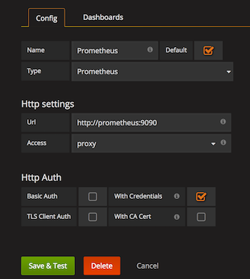
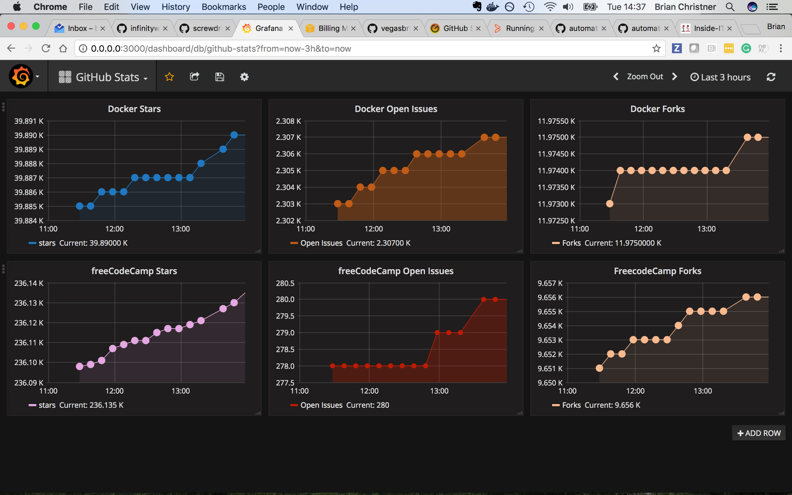

# 使用 Docker 和 Prometheus 监控您的 GitHub 仓库

作者：**Brian Christner**

GitHub 拥有丰富的代码、信息和有趣的统计数据。GitHub 仓库中充满了统计数据，非常适合用 Grafana 绘制图表。绘制这些数据的最佳方式，当然是使用 Docker 和 Prometheus。

Prometheus 包含一个令人印象深刻的*导出器*列表（[`prometheus.io/docs/instrumenting/exporters/`](https://prometheus.io/docs/instrumenting/exporters/)）。这些导出器覆盖从 API 到物联网的各个领域。它们还可以与 Prometheus 和 Grafana 集成，从而生成一些漂亮的图表。

# Docker、Prometheus 和 Grafana

我的基础监控设置是 Docker、Prometheus 和 Grafana 堆栈。这是我工作的基准，并且会添加像导出器这样的组件。我已创建了 *GitHub-Monitoring 仓库*（[`github.com/vegasbrianc/github-monitoring`](https://github.com/vegasbrianc/github-monitoring)）。该仓库包含一个 Docker Compose 文件，使得这个堆栈变得简化且易于启动。

# 入门

前提条件：确保您的 Docker 主机正在运行最新版本的 Docker 引擎和 Compose。接下来，将 *GitHub-Monitoring*（[`github.com/vegasbrianc/github-monitoring`](https://github.com/vegasbrianc/github-monitoring)）项目克隆到您的 Docker 机器上。

我们可以根据您的需求开始配置项目。如果需要跟踪额外的导出器或目标，请编辑 *Prometheus 目标*（[`github.com/vegasbrianc/github-monitoring/blob/master/prometheus/prometheus.yml`](https://github.com/vegasbrianc/github-monitoring/blob/master/prometheus/prometheus.yml)）。它们位于文件末尾的静态配置部分。导出器使用名为 metrics 的名称，端口为 `9171`：

```
static_configs:
- targets: ['node exporter:9100','localhost:9090', 'metrics:9171']

```

# 配置

创建一个 GitHub 令牌，用于此项目。这可以防止我们触及 GitHub 对未经身份验证的流量施加的 API 限制。

导航到 *创建 GitHub 令牌*（[`github.com/settings/tokens`](https://github.com/settings/tokens)），我们将在这里为该项目创建一个令牌。

请按照以下步骤操作：

+   提供令牌的描述。

+   选择作用域（我们的项目仅需要 `repo` 权限）。

+   点击生成令牌按钮。

+   复制令牌 ID 并将其存储在安全的地方。这相当于一个密码，因此请勿将其保存在公共场所。

使用您喜欢的编辑器编辑 `docker-compose.yml` 文件（[`github.com/vegasbrianc/github-monitoring/blob/master/docker-compose.yml`](https://github.com/vegasbrianc/github-monitoring/blob/master/docker-compose.yml)）。滚动到文件末尾，您会找到度量服务部分。

首先，将 `GITHUB_TOKEN=<GitHub API Token see README>` 替换为您之前生成的令牌。接着，将 `REPOS` 替换为您希望跟踪的目标仓库。在我的示例中，我选择了 Docker 和 `freeCodeCamp` 仓库，因为它们提供了很多动态和统计数据。

配置如下：

```
metrics:
  tty: true
  stdin_open: true
expose:
  - 9171
image: infinityworks/github-exporter:latest
environment:
 - REPOS=freeCodeCamp/freeCodeCamp,docker/docker
 - GITHUB_TOKEN=<GitHub API Token see README>
networks:
 - back-tier

```

配置完成后，我们可以启动它。从 `github-monitoring 项目` 目录运行以下命令：

```
docker-compose up

```

就是这样。Docker Compose 会自动构建整个 Grafana 和 Prometheus 堆栈。Compose 文件还会将新的 GitHub Exporter 连接到我们的基础堆栈。我选择最初不使用 `-d` 标志运行 docker-compose。这样做有助于故障排除，因为日志条目会直接打印到终端。

Grafana Dashboard 现在可以通过以下地址访问：`http://<Host IP Address>:3000`（例如：`http://localhost:3000`）。

请使用 `admin` 作为用户名，`foobar` 作为密码（它在 `config.monitoring` 文件中定义，该文件设置了一些环境变量）。

# 配置后续步骤

现在我们需要创建 Prometheus 数据源，以将 Grafana 连接到 Prometheus：

+   点击左上角的 Grafana 菜单（看起来像一个火球）

+   点击数据源

+   点击绿色按钮 添加数据源

请参考以下图像以添加 Grafana 数据源：



图 A-1：添加 Grafana 数据源

# 安装仪表盘

我创建了一个仪表盘模板，可以在*GitHub Stats Dashboard*([`grafana.net/dashboards/1559`](https://grafana.net/dashboards/1559))找到。下载该仪表盘，并从 Grafana 菜单中选择 -> 仪表盘 -> 导入

这个仪表盘是帮助你开始绘制 GitHub 仓库图表的起点。如果你有任何希望在仪表盘中看到的更改，请告诉我，我也会更新 Grafana 网站。



图 A-2：GitHub Grafana 仪表盘

# 结论

Prometheus 与 Docker 结合，是一种强大而简单的监控不同数据源的方法。GitHub Exporter 是 Prometheus 提供的众多优秀 Exporter 之一。

# 关于作者

**Brian Christner** 来自亚利桑那州，现在居住在瑞士的阿尔卑斯山脉。Brian 曾在赌场行业工作了很长时间，他确保赌场总是赢钱。Brian 是 Docker Captain 计划的提名成员，也是一位经验丰富的云架构师。他还是 Docker、Cloud Foundry、IaaS、PaaS、DevOps、CI/CD 以及当然的容器监控等领域的云主题专家。Brian 热衷于为云和容器技术代言。当 Brian 不忙于将一切容器化时，你会发现他骑着山地自行车或在瑞士阿尔卑斯山滑雪。

Twitter - `@idomyowntricks`

网站 - [www.brianchristner.io](http://www.brianchristner.io)
