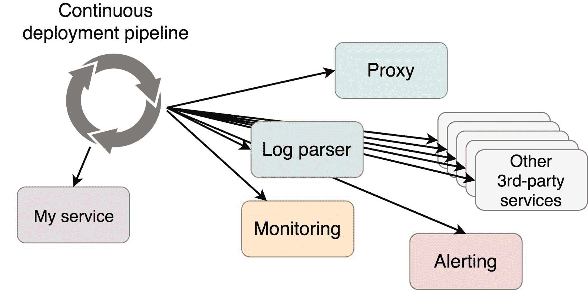

## 第五章：自适应和自愈系统简介

微服务，微服务，微服务。我们都在将单体架构重写成微服务的过程中。有些人已经做到了。我们将它们放入容器中，并通过调度程序进行部署。我们正朝着一个辉煌的未来迈进。现在没有什么可以阻止我们了。除了……我们作为一个行业，还没有为微服务做好准备。一方面，我们可以设计服务，使其无状态、容错、可扩展，等等。另一方面，我们还需要将这些服务作为一个整体整合进系统中。

除非你刚开始了一个新项目，否则你很可能还没有达到“微服务的涅槃”，并且仍然有许多遗留服务存在。但为了简洁起见，并且为了直接切入正题，我假设你所控制的所有服务确实是微服务。这是否意味着整个系统已经达到了那个涅槃状态？服务的部署（无论是谁编写的）是否完全独立于系统的其余部分？很可能不是。

你们在实践持续部署（CD）吗？我假设你们是。现在，假设你刚刚完成了新服务的第一次发布。这个第一次发布就是你代码仓库中的第一次提交。你选择的 CD 工具检测到代码仓库中的变更，并启动了 CD 管道。管道的最终目标是将服务部署到生产环境中。我能看到你脸上的笑容。那是只有在孩子出生或服务首次部署到生产环境时，才能看到的幸福表情。但这个笑容不应该持续太久，因为部署服务只是个开始。它还需要与整个系统进行集成。代理需要重新配置。日志解析器需要更新以适应新服务生成的格式。监控系统需要识别新服务。还需要创建警报，以便在服务状态达到某些阈值时发送警告和错误通知。整个系统必须适应新服务，并融入我们刚刚提交的更新所引入的新变量。

我们如何调整系统，使其能够考虑到新的服务？我们如何将该服务融入系统的整体架构中？

除非你自己编写所有内容（在这种情况下你一定是 Google），否则你的系统由你自己开发的服务和其他人编写和维护的服务组成。你可能使用了第三方代理（希望是[Docker Flow Proxy](http://proxy.dockerflow.com)）。你可能选择了 ELK 堆栈或 Splunk 来进行集中式日志记录。监控呢？也许是 Nagios，或者可能是 Prometheus。不管你做了什么选择，你都无法掌控整个系统的架构。实际上，你甚至可能无法掌控你自己编写的所有服务。

大多数第三方服务并不是为高度动态的集群而设计的。当你部署该服务的第一个版本时，你可能需要手动配置代理。你可能需要为 LogStash 配置添加一些解析规则。你的 Prometheus 目标也必须更新。新的报警规则需要添加，等等。即使所有这些任务已经自动化，持续部署管道也会变得过于庞大，且流程会变得非常脆弱。

我将尝试保持乐观，并假设你已经成功克服了配置所有第三方工具以使它们与新服务无缝协作的难题。接下来将没有时间休息，因为同样的服务（或其他服务）很快就会被更新。有人可能会做出修改，导致更高的内存阈值。这意味着例如监控工具需要重新配置。你可能会说这没问题，因为偶尔会发生这种情况，但那也不是真的。如果我们采用了微服务和持续部署，"偶尔"可能意味着“在任何频繁的提交中”。记住，团队很小，而且它们是独立的。影响整个系统的更改可能随时发生，我们需要为此做好准备。

图 1-1: 传统部署，其中服务的真实来源分散在许多不同的地方

第三方服务的一个主要限制是它们依赖于静态配置。以 Prometheus 为例，它可能负责监控你所有的服务、硬件、网络等。它观察的每个目标可能有不同的指标集和不同的条件来触发告警。每次我们想要添加一个新目标时，都需要修改 Prometheus 的配置并重新加载。这意味着为了容错，我们必须将配置文件存储在网络驱动上，并使用某种模板机制，每次新增服务或更新现有服务时更新该配置。因此，我们将部署我们那新奇的服务，更新生成 Prometheus 配置的模板，创建新配置，覆盖存储在网络驱动上的配置，并重新加载 Prometheus。即使如此，这还不够，因为驱动这些模板的数据需要存储在某个地方，这意味着我们需要在服务注册中心注册每个服务（或者使用 Docker 中内置的服务注册），并确保模板解决方案从中读取。

如果 Prometheus 可以通过其 API 进行配置，部分混乱是可以避免的。然而，配置 API 虽然可以移除模板的需求，但不会消除网络驱动的需求。它的配置就是它的状态，这个状态必须被保存。

这种思维方式具有历史性。我们习惯于基于单体系统的信息被分散在各处。我们正在慢慢朝着一种不同的模型发展。系统被拆分成多个小服务，每个服务都是它解决的领域问题的完整真相来源。如果你需要有关某个服务的信息，向它请求，或者有一个机制会将这些信息推送给你。一个服务既不需要知道，也不应该关心谁使用它以及如何使用它。

服务本身应该包含描述它的所有数据。如果它需要重新配置代理，这些信息应该是服务的一部分。它应该包含用于输出日志的模式。它应该有监控工具应从中抓取的目标地址。它应该包含用于触发告警的信息。换句话说，服务所需的所有内容都应该在该服务中定义，而不是其他地方。我们需要将系统适配到新服务所需的数据来源不应该分散在多个位置，而应当位于我们正在部署的服务内部。由于我们都在使用容器（不是吗？），定义这些信息的最佳位置是服务标签。

如果你的服务应该通过路径`/v1/my-fancy-service`进行访问，可以使用参数`--label servicePath=/v1/my-fancy-service`来定义标签。如果 Prometheus 应该在端口`8080`抓取指标，则定义标签`--label scrapePort=8080`。依此类推。

为什么这一切很重要？其中一个原因是，当我们在服务内部定义所有所需数据时，我们有一个包含服务完整信息的单一位置。这使得配置变得更加简单，使负责服务的团队更加自给自足，使得部署更加可管理并且减少错误，等等。

图 1-2：一个服务是唯一的事实来源，通常通过中介，向系统的其他部分宣布它的存在

在我们开发的服务中定义所有信息并不成问题。问题在于，大多数我们使用的第三方服务并没有设计成能够利用这些信息。请记住，关于服务的数据需要在集群中分布，它需要到达所有与我们开发和部署的服务协同工作的其他服务。我们不希望在多个位置定义这些信息，因为这会增加维护成本，并且可能引入由人为错误造成的问题。相反，我们希望将所有内容定义在我们部署的服务中，并将这些信息传播到整个集群中。

我们不希望在多个位置定义和维护相同的信息，我们确实希望将这些信息保留在源头，但第三方服务无法从源头获取这些数据。如果我们排除修改第三方服务的选项，那么唯一的选择就是扩展这些服务，使其能够拉取或接收所需的数据。

我们真正需要的是能够从我们部署的服务中发现信息的第三方服务。该发现可以是拉取（一个服务从另一个服务中拉取信息）或推送（一个服务充当中介，将数据从一个服务推送到另一个服务）。无论发现是依赖推送还是拉取，接收数据的服务都需要能够重新配置自己。所有这些都需要与一个能够检测服务已部署或已更新并通知所有相关方的系统结合起来。

最终目标是设计一个能够适应我们投入的任何服务以及集群变化的系统。最终的目标是拥有一个**自适应**和**自愈**的系统，即使在我们度假时，它也能继续高效运行。

### 什么是自适应系统？

自适应系统是能够适应变化条件的系统。这一点显而易见，不是吗？从实际操作的角度来看，当操作一个集群并部署服务时，这意味着当部署一个新服务或更新一个现有服务时，系统应该能够适应。当集群中的条件发生变化时，整个系统应该通过适应这些条件而发生变化。如果部署了一个新服务，监控解决方案应该获取关于该服务的信息并更改其配置。日志系统应该开始处理该服务的日志并正确解析。集群中的节点数量应进行调整，等等。系统自适应的最重要要求是将其构建成不需要人工干预的方式。否则，我们就不妨把“自适应”改为“John 适应它”系统。

### 什么是自愈系统？

一个自愈系统需要具有适应性。如果没有适应环境变化的能力，我们就无法实现自愈。虽然适应性更为持久或长期，而自愈则是一个暂时性的行动。举个例子，假设请求数量的增加是永久性的，可能是因为我们现在有更多的用户，或者是因为新设计的 UI 非常好，用户花更多时间使用我们的前端。由于这种增加，我们的系统需要适应并永久性（或至少更持久地）增加服务的副本数量。这个增加应该匹配最低预期负载。也许我们运行了五个购物车副本，这在大多数情况下足够了，但由于用户数量增加，购物车的实例数量需要增加，比如说增加到十个副本。这个数量不必是固定的。例如，它可以在七个（最低预期负载）到十二个（最高预期负载）之间变化。

自愈是一种对突发事件的反应，具有临时性。以我们（人类）为例。当病毒攻击我们时，我们的身体会作出反应并进行抵抗。一旦病毒被消灭，紧急状态就会结束，我们恢复正常状态。这个过程始于病毒的入侵，结束于病毒的清除。一个副作用是，在这个过程中我们可能会适应，并永久性地创造出更强的免疫系统。我们可以将同样的逻辑应用到我们的集群中。我们可以创建一些流程，来应对外部威胁并采取相应的措施。有些措施会在威胁消失后立即被移除，而其他措施可能会对我们的系统产生永久性的变化。

自愈并不总是有效。我们（人类）和软件系统有时也需要外部帮助。如果一切都失败了，我们无法自愈并在内部解决问题时，我们可能会去看医生。类似地，如果集群无法自行修复，它应该向操作员发送通知，操作员希望能够修复问题、写出事后分析，并改善系统，以便下次同样的问题出现时，它能够自愈。

对外部帮助的需求概述了一种有效构建自愈系统的方法。我们无法预测系统中可能发生的所有组合。然而，我们能做的是确保当意外发生时，它不会持续太久。一位优秀的工程师会尽力使自己变得不再必要。他会尝试只执行一次相同的操作，而做到这一点的唯一方法就是通过不断增加的自动化过程。所有预期的事项都应该被脚本化，并且纳入由系统执行的自适应和自愈过程。我们应该仅在意外发生时作出反应。

### 现在怎么办？

让我们开始构建一个自适应和自愈的系统。我们首先需要的是度量标准。没有度量标准，无论是系统还是我们都无法做出决策。我们将从选择合适的工具开始。
