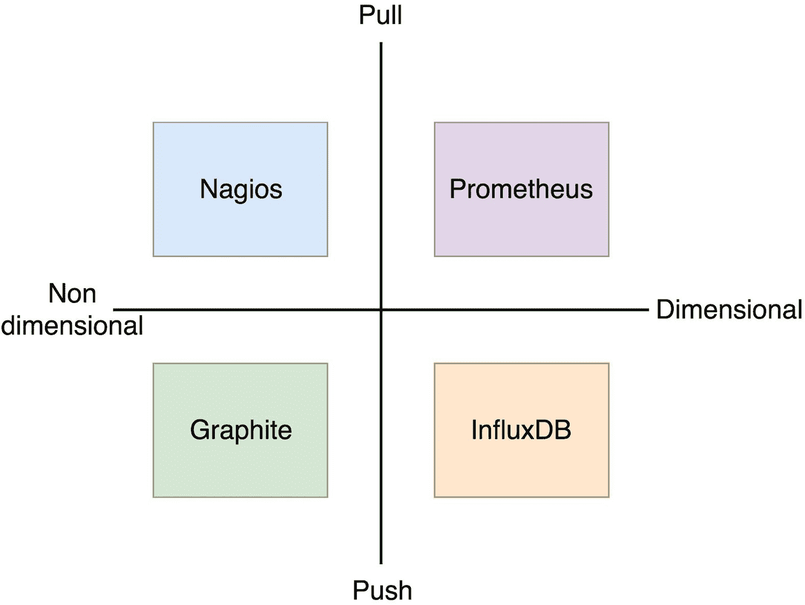

## 选择度量存储和查询解决方案

每个集群都需要收集度量指标。这些指标是我们可能想要使用的任何告警系统的基础。如果没有集群当前和过去状态的信息，我们将无法在问题发生时做出反应，也无法从一开始就防止问题的发生。事实上，这并不完全准确。我们本可以做所有这些事，但无法以高效且可扩展的方式进行。

一个好的类比是失明。失明并不意味着我们不能通过触觉在环境中移动。同样，如果没有收集和查询度量指标的方法，我们也并非无能为力。我们可以通过 SSH 进入每个节点，手动检查系统。我们可以从使用 `top`、`mem`、`df` 等命令开始。我们可以通过 `docker stats` 命令检查容器的状态。我们可以在一个容器与另一个容器之间切换，查看它们的日志。我们可以做所有这些事，但这种方式无法扩展。我们无法让操作员的数量与服务器的数量同步增长。我们无法将自己转变为人类机器。即使我们能够做到，也会非常糟糕。这就是为什么我们需要工具来帮助我们。如果这些工具不能满足我们的需求，我们可以在它们之上构建自己的解决方案。

我们可以选择的工具有很多。要将它们一一比较几乎是不可能的，所以我们将限制范围，只讨论少数几个。

我们将只关注开源项目。我们将讨论的一些工具有付费的企业版，提供附加功能。我们将从比较中排除这些工具。排除的原因是我认为我们应该始终从开源软件开始，先对其进行熟悉，只有当它证明其价值后，才评估是否值得切换到企业版。

此外，我们还将引入一个额外的限制条件。我们将仅探讨那些可以自行托管的解决方案。这排除了像 [Scout](https://scoutapp.com/) 或 [DataDog](https://www.datadoghq.com/) 这样的托管服务。做出这一决定的原因有两个方面。一方面，许多组织不愿意将数据“交给”第三方托管服务。即使没有这样的限制，托管服务也需要能够将警报发送回我们的系统，而这将是一个巨大的安全漏洞。如果这些问题对你来说不重要，那么它们的灵活性也不足以满足需求。我所知道的没有任何服务能提供足够的灵活性来构建一个*自适应*和*自愈*的系统。而且，本书的目的是为你提供免费的解决方案，因此坚持使用可以自己托管的开源解决方案。

这并不意味着付费软件不值这个价格，或者我们不应该使用并支付托管服务。恰恰相反。然而，我觉得从我们可以自己构建的工具开始，并探索其极限会更好。从那里开始，你将更好地理解自己需要什么，以及支付费用是否值得。

### 无量纲与有量纲的度量

在我们探讨选择的工具之前，我们应该讨论不同的度量存储和收集方法。

我们可以根据维度来划分工具。一些工具可以存储带有维度的数据，而其他工具则不能。无量纲度量工具的代表是 Graphite 和 Nagios。说实话，Graphite 中确实有某种维度的形式，但由于它们本质上非常有限，我们会将其视为无量纲工具。支持维度的解决方案有，例如 InfluxDB 和 Prometheus。前者以键/值对的形式支持维度，后者则使用标签。

无量纲（或无维度）度量存储属于*旧世界*，那时服务器相对静态，被监控的目标数量较少。这可以从这些工具创建的时间看出来。Nagios 和 Graphite 都比 InfluxDB 和 Prometheus 更早。

为什么维度相关？查询语言需要维度才能有效。如果没有维度，语言的能力必然受到限制。这并不意味着我们总是需要维度。对于简单的监控，维度可能是多余的。然而，运行一个可扩展的集群，其中服务不断部署、扩展、更新和移动，可远非简单。我们需要能够表示集群所有维度和其上运行服务的度量。一个动态系统需要动态分析，这需要包含维度的度量来实现。

一个无量纲度量的例子是`container_memory_usage`。与此相比，`container_memory_usage{service_name="my-service", task_name="my-service.2.###", memory_limit="20000000", ...}`则提供了更多的自由度。我们可以像无量纲度量那样计算平均内存使用量，但我们还可以推断出内存限制、服务名称、该任务是哪个副本（任务），等等。

维度（或缺乏维度）是区分存储和分析度量工具的唯一因素吗？除此之外，这些度量最终如何进入数据库也是一个可能产生显著差异的因素。一些工具期望数据被推送，而其他工具则会拉取（或抓取）数据。

如果我们坚持之前提到的工具，推送方法的代表是 Graphite 和 InfluxDB，而 Nagios 和 Prometheus 则属于拉取组。

那些属于推送类别的系统期望数据主动送到它们那里。它们是被动的（至少在指标收集方面是这样的）。每个收集数据的服务应该将数据推送到一个中心位置。*collectD* 和 *statsD* 就是流行的例子。而拉取系统则是主动的。它会从所有指定的目标中抓取数据。数据收集器并不知道数据库的存在。它们的唯一目的是收集数据并通过一种系统可以接受的协议将数据暴露出来。

关于每个系统的优缺点的讨论已经激烈进行了一段时间。关于为何一个系统优于另一个系统的论据有很多，我们可以花费大量时间来讨论它们。相反，我们将讨论发现机制，这个论点在我看来是最相关的。

在推送系统中，发现是容易的。数据收集器只需要知道指标存储的地址并推送数据。只要该地址保持可用，配置就非常简单。对于拉取系统，系统需要知道所有数据收集器（或导出器）的地址。当只有少数几个时，这很容易配置。如果数量增加到数十、数百甚至数千个目标时，配置可能会变得非常繁琐。这种情况显然更有利于推送模式。但技术发生了变化。我们现在有了可靠的系统来提供服务发现。例如，Docker Swarm 就将其作为 Docker 引擎的一部分内置。找到目标非常容易，并且假设我们信任服务发现，我们总是能获取到所有数据收集器的最新信息。

如果有一个适当的服务发现机制，拉取与推送的争论就变得或多或少无关紧要。这引出了一个让拉取更加有吸引力的论点。拉取数据时，发现一个失败的实例或缺失的服务要容易得多。当一个系统期望数据收集器推送数据时，它并不会意识到有什么东西缺失。我们可以用“我不知道我不知道什么”来总结这个问题。另一方面，拉取系统知道应该期待什么。它们知道它们的目标是什么，当一个抓取目标没有响应时，很容易推测其原因是它停止了工作。

图 2-1：根据维度和数据收集方法放置的监控工具

无论是推送还是拉取的论点都不是绝对的，我们不应该仅仅基于这些标准做出选择。相反，我们将稍微深入探讨我们之前讨论过的工具。

排行榜上的第一个是 Graphite。

### Graphite

Graphite 是一个被动的指标存储工具。我们之所以称其为被动，是因为它不能收集指标。指标需要通过单独的进程进行收集并推送。

它是一个时序数据库，拥有自己的查询语言和生成图表的能力。查询 API 非常强大。或者，更准确地说，在它出现时被认为非常强大。今天，与其他一些工具相比，它的查询语言显得有些局限，主要是由于它用于存储度量标准的无维度格式。

Graphite 将数值数据存储为时序格式。它的度量名称由点分隔的元素组成。

数据存储在本地磁盘上。

### InfluxDB

就像 Graphite 一样，InfluxDB 也是一个时序数据库。与 Graphite 不同，InfluxDB 的数据模型是基于标签形式的键值对。

InfluxDB（更准确地说是开源版本）依赖本地存储来存储数据，并进行抓取、规则处理和告警。

### Nagios 和 Sensu

Nagios 是一个起源于 90 年代的监控系统，最初名为 NetSaint。它主要通过脚本的退出码进行告警。

与其他解决方案不同，它存储的数据量和数据类型受到限制，仅用于检查状态，因此只适合非常基础的监控。

Sensu 可以视为 Nagios 的更现代版本。主要的区别在于，Sensu 客户端会自行注册，并可以从中央或本地配置中决定要运行的检查项。它还有一个客户端套接字，允许将任意的检查结果推送到 Sensu 中。

Sensu 使用与 Nagios 几乎相同的数据模型，并且共享其在存储度量标准时使用的格式的限制。

### Prometheus

Prometheus 是一个完整的监控和趋势分析系统，包含内置的主动抓取、存储、查询、绘图和基于时序数据的告警功能。它了解世界应该是什么样子（哪些端点应该存在，什么时序模式表示问题，等等），并主动寻找故障。

Prometheus 拥有丰富的数据模型，并且可能是时序数据库中最强大的查询语言。它将维度显式地编码为附加在度量名称上的键值对（标签）。这使得通过查询语言可以轻松地按这些标签进行过滤、分组和匹配。

### 我们应该选择哪种工具？

我们列出的所有工具都各有优点。它们在许多方面有所不同，但在某些方面又是相似的。

Nagios 和 Sensu 过去为我们提供了很好的服务。它们设计于不同的时代，基于今天被认为已经过时的原则。它们在静态集群和运行在预定义位置的单体应用程序与服务中表现良好。它们存储的度量标准（或缺乏度量标准）并不适合进行更复杂的决策。在我们想要运营像 Docker Swarm 这样的调度器，运行在一个自动扩展的集群中时，它们会让我们遇到很大的困难。在我们探索的解决方案中，它们是最先应该被舍弃的。一个被淘汰，剩下三个可以选择。

Graphite 使用的点分隔度量格式存在局限性。使用星号（`*`）排除度量的元素往往不足以进行适当的过滤、分组和其他操作。与 InfluxDB 和 Prometheus 相比，它的查询语言是我们放弃它的主要原因。

我们剩下的选择是 InfluxDB 和 Prometheus，二者的差异仅在于一些细微之处。

InfluxDB 和 Prometheus 在许多方面相似，因此选择并不容易。说实话，我们不可能做出错误的决策。不论我们选择哪个，最终的决定都会基于一些细小的差异。

如果我们不局限于开源解决方案作为唯一候选项，那么 InfluxDB 企业版可能会因为其可扩展性而成为赢家。然而，我们将放弃它，选择 Prometheus。它提供了更为完整的解决方案。更重要的是，Prometheus 正在慢慢成为事实上的标准，至少在与调度器一起使用时是如此。它在 Kubernetes 中是首选解决方案。Docker（因此 Swarm）很快会以 Prometheus 格式公开其度量数据。这一点本身就是一个转折点，应该让我们更倾向于选择 Prometheus。

决定已定。我们将使用 Prometheus 来存储度量数据，查询它们，并触发警报。

### 接下来怎么办？

现在我们已经决定了用于存储度量数据的工具基础，接下来应当进行设置。由于我们将使用 Docker Swarm 服务，以最基本的形式部署 Prometheus 将会非常轻松。
