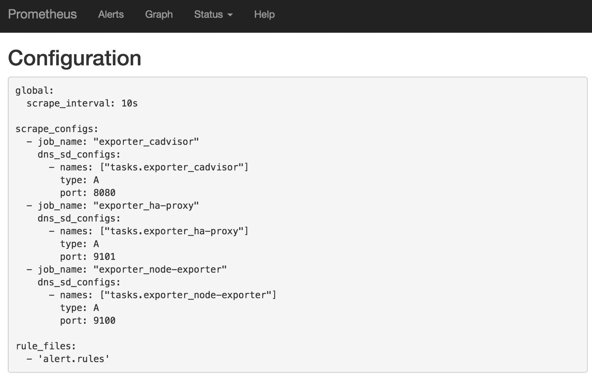
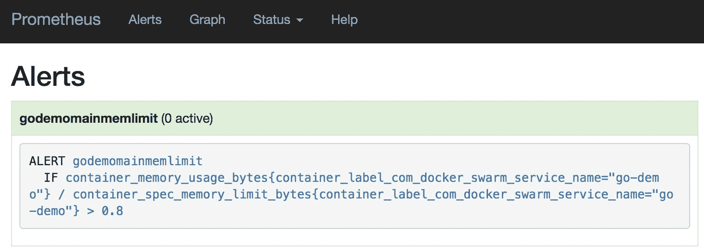

## 定义集群级别警报

一个常见的错误是过于依赖仪表盘作为发现问题的主要手段。仪表盘在整体方案中有其作用，是任何监控解决方案中不可或缺的一部分。然而，它们并不像我们想象的那么重要。

监控系统的目的不是替代 Netflix。它们不应该被不断观察。相反，它们应该收集数据，并在满足特定条件时创建警报。这些警报应该尝试与系统进行交互，并触发一系列操作来自动修复问题。只有在系统无法修复问题时，才应该向人类发送通知。换句话说，我们应该努力创建一个自愈系统，只有在它无法自我修复时，才会向“医生”（我们，人类）求助。

当我们知道系统出现问题时，仪表盘非常有用。如果系统运行正常，查看仪表盘就是浪费时间，应该把时间花在系统改进上。

想象一下，一个 Slack 通知会显示“集群内没有可用内存，系统未能创建额外的虚拟机”。请注意这句话的第二部分。系统检测到问题并未能修复它。出现了故障，系统无法扩展，未能创建新的虚拟机。这是一个很好的例子，说明这种类型的通知应该发送给人工操作员。如果系统能够自我修复，就无需发送这样的 Slack 通知了。

我们应该在收到系统无法自我修复的消息后，才查看仪表盘。在那之前，一切正常，我们可以继续进行系统的下一次重大改进。收到消息后，我们应访问一个或两个仪表盘，试图获取系统的高层次视图。有时，仪表盘提供的信息就足够了。但更常见的是，我们需要更多的信息。我们需要访问 Prometheus，开始查询更多信息。最后，一旦找出罪魁祸首，我们可以创建修复方案，进行测试，并将其应用到生产环境中，改进自愈系统，使得下次发生同样的问题时能够自动修复，并撰写“事后分析”报告。

如你所见，一切都从一个单一的警报开始，这将是本章的重点。目前，我们不会区分那些能自我修正的系统和那些需要发送通知给人工操作员的警报。这个问题会在后面讨论。现在，我们将专注于创建警报，而不定义它们应该触发的事件。

### 创建集群并部署服务

我们将从重新创建集群并部署上一章中使用的堆栈开始。

```
`1` chmod +x scripts/dm-swarm-05.sh
`2` 
`3` ./scripts/dm-swarm-05.sh
`4` 
`5` `eval` `$(`docker-machine env swarm-1`)` 
```

````````````````````````````````` We executed the `dm-swarm-05.sh` script which, in turn, created a Swarm cluster composed of Docker Machines, created the networks, and deployed the stacks. Now we should wait a few moments until all the services in the `monitor` stack are up and running. Please use `docker stack ps monitor` command to confirm that the status of all the services in the stack is *Running*.    Finally, we’ll confirm that everything is deployed correctly by opening Prometheus in a browser.    ``` `1` open `"http://``$(`docker-machine ip swarm-1`)``/monitor"`  ```   ```````````````````````````````` Now the state of our cluster is the same as it was at the end of the previous chapter and we can proceed towards deploying exporters.    ### Creating Alerts Based On Metrics    Let us create the first alert. We’ll update our `go-demo_main` service by adding a few labels.    ``` `1` docker service update `\` `2 `    --label-add com.df.alertName`=`mem `\` `3 `    --label-add com.df.alertIf`=``'container_memory_usage_bytes{container_label_com\` `4` `_docker_swarm_service_name="go-demo_main"} > 20000000'` `\` `5 `    go-demo_main  ```   ``````````````````````````````` The label `com.df.alertName` is the name of the alert. It will be prefixed with the name of the service stripped from underscores and dashes (`godemomem`). That way, a unique alert name is guaranteed.    The second label (`com.df.alertIf`) is more important. It defines the expression. Translated to plain words, it takes the memory usage limited to the `go-demo_main` service and checks whether it is bigger than 20MB (20000000 bytes). An alert will be launched if the expression is true.    Let’s take a look at the Prometheus configuration.    ``` `1` open `"http://``$(`docker-machine ip swarm-1`)``/monitor/config"`  ```   `````````````````````````````` As you can see, `alert.rules` file was added to the `rule_files` section.    Figure 5-1: Prometheus configuration with alert rules    Let us explore the rules we created so far.    ``` `1` open `"http://``$(`docker-machine ip swarm-1`)``/monitor/rules"`  ```   ````````````````````````````` As you can see, the expression we specified with the `com.df.alertIf` label reached *Docker Flow Monitor*.    Figure 5-2: Prometheus rule with go-demo memory usage    Finally, let’s take a look at the alerts.    ``` `1` open `"http://``$(`docker-machine ip swarm-1`)``/monitor/alerts"`  ```   ```````````````````````````` The *godemomainmem* alert is green meaning that none of the `go-demo_main` containers are using over 20MB of memory. Please click the *godemomainmem* link to expand the alert definition.    Figure 5-3: Prometheus alerts with go-demo memory usage    The alert is green meaning that the service uses less than 20MB of memory. If we’d like to see how much memory it uses, we need to go back to the graph screen.    ``` `1` open `"http://``$(`docker-machine ip swarm-1`)``/monitor/graph"`  ```   ``````````````````````````` Once inside the graph screen, please type the expression that follows, and press the *Execute* button.    ``` `1` container_memory_usage_bytes{container_label_com_docker_swarm_service_name="go-d\ `2` emo_main"}  ```   `````````````````````````` The exact value will vary from one case to another. No matter which one you got, it should be below 20MB.    Let’s change the alert so that it is triggered when `go-demo_main` service uses more than 1MB.    ``` `1` docker service update `\` `2 `    --label-add com.df.alertName`=`mem `\` `3 `    --label-add com.df.alertIf`=``'container_memory_usage_bytes{container_label_com\` `4` `_docker_swarm_service_name="go-demo_main"} > 1000000'` `\` `5 `    go-demo_main  ```   ````````````````````````` Since we are updating the same service and using the same `alertName`, the previous alert definition was overwritten with the new one.    Let’s go back to the alerts screen.    ``` `1` open `"http://``$(`docker-machine ip swarm-1`)``/monitor/alerts"`  ```   ```````````````````````` This time, the alert is red, meaning that the condition is fulfilled. If it is still green, please wait for a few moments and refresh your screen.    Our service is using more than 1MB of memory and, therefore, the `ALERT IF` statement is fulfilled, and the alert is firing.    Please click the *godemomainmem* link to expand the alert and see more details.    Figure 5-4: Prometheus alerts screen with go-demo memory usage in firing state    The flow of the events can be described through the figure 5-5.    Figure 5-5: The flow of the events that result in a service alert being fired    Let’s take a look at the graph screen.    ``` `1` open `"http://``$(`docker-machine ip swarm-1`)``/monitor/graph"`  ```   ``````````````````````` Let us quickly review `go-demo_main` service memory reservations and limits. They might be useful in defining alerts.    Please type the expression that follows, and press the *Execute* button.    ``` `1` container_spec_memory_limit_bytes{container_label_com_docker_swarm_service_name=\ `2` "go-demo_main"}  ```   `````````````````````` As you can see, memory metric is set to 10MB. Soon, we’ll use those metrics to our benefit.    Next, we’ll check the metrics of the “real” memory usage of the service.    Please type the expression that follows, and press the *Execute* button.    ``` `1` container_memory_usage_bytes{container_label_com_docker_swarm_service_name="go-d\ `2` emo_main"}  ```   ````````````````````` Memory consumption will vary from one case to another. In my case it ranges from 1MB to 3.5MB.    Figure 5-6: go-demo memory usage    If we go back to the `alertIf` label we specified, there is an apparent duplication of data. Both the `alertIf` label and the service reservations are defining the thresholds of the service. As you probably already know, duplication is not a good idea because it increases the chances of an error and complicates future updates that would need to be performed in multiple places.    A better definition of the `alertIf` statement is as follows.    ``` `1` docker service update `\` `2 `    --label-add com.df.alertName`=`mem_limit `\` `3 `    --label-add com.df.alertIf`=``'container_memory_usage_bytes{container_label_com\` `4` `_docker_swarm_service_name="go-demo"}/container_spec_memory_limit_bytes{containe\` `5` `r_label_com_docker_swarm_service_name="go-demo"} > 0.8'` `\` `6 `    go-demo_main  ```   ```````````````````` This time we defined that the `mem_limit` alert should be triggered if memory usage is higher than 80% of the memory limit. We avoided duplicating the value that is already defined as service’ memory limit. That way, if, at some later stage, we change the value of the `--limit-memory` argument, the alert will continue working properly.    Let’s confirm that *Docker Flow Swarm Listener* sent the notification and that *Docker Flow Monitor* was reconfigured accordingly.    ``` `1` open `"http://``$(`docker-machine ip swarm-1`)``/monitor/alerts"`  ```   ``````````````````` Please click the *godemo_main_mem_limit* link to see the new definition of the alert.    Figure 5-7: go-demo alert based on memory limit and usage    ### Defining Multiple Alerts For A Service    In many cases, one alert per service is not enough. We need to be able to define multiple specifications. *Docker Flow Monitor* allows us that by adding an index to labels. We can, for example, define labels `com.df.alertName.1`, `com.df.alertName.2`, and `com.df.alertName.3`. As a result, *Docker Flow Monitor* would create three alerts.    Let’s see it in action.    We’ll update the `node-exporter` service in the `exporter` stack so that it registers two alerts.    ``` `1` docker service update `\` `2 `    --label-add com.df.alertName.1`=`mem_load `\` `3 `    --label-add com.df.alertIf.1`=``'(sum by (instance) (node_memory_MemTotal) - su\` `4` `m by (instance) (node_memory_MemFree + node_memory_Buffers + node_memory_Cached)\` `5` `) / sum by (instance) (node_memory_MemTotal) > 0.8'` `\` `6 `    --label-add com.df.alertName.2`=`diskload `\` `7 `    --label-add com.df.alertIf.2`=``'(node_filesystem_size{fstype="aufs"} - node_fi\` `8` `lesystem_free{fstype="aufs"}) / node_filesystem_size{fstype="aufs"} > 0.8'` `\` `9 `    exporter_node-exporter  ```   `````````````````` This time, `alertName` and `alertIf` labels got an index suffix (e.g. `.1` and `.2`). The first one (`mem_load`) will create an alert if memory usage is over 80% of the total available memory. The second alert will fire if disk usage is over 80%.    Let’s explore the *alerts* screen.    ``` `1` open `"http://``$(`docker-machine ip swarm-1`)``/monitor/alerts"`  ```   ````````````````` As you can see, two new alerts were registered.    Figure 5-8: Node exporter alerts    The flow of the events can be described through the figure 5-9.    Figure 5-9: The flow of the events that result in an exporter alert being fired    ### Postponing Alerts Firing    Firing an alert as soon as the condition is met is often not the best idea. The conditions of the system might change temporarily and go back to “normal” shortly afterward. A spike in memory is not bad in itself. We should not worry if memory utilization jumps to 95% only to go back to 70% a few moments later. On the other hand, if it continues being over 80% for, let’s say, five minutes, some actions should be taken.    We’ll modify the `go-demo_main` service so that it fires an alert only if memory threshold is reached and the condition continues for at least one minute.    The relevant parts of the `go-demo` stack file are as follows.    ```  `1` `services``:`  `2`   `3`  `main``:`  `4`    `...`  `5`    `deploy``:`  `6`      `...`  `7`      `labels``:`  `8`        `...`  `9`        `-` `com``.``df``.``alertName``=``mem_limit` `10 `        `-` `com``.``df``.``alertIf``=``container_memory_usage_bytes``{``container_label_com_docker``\` `11` `_swarm_service_name``=``"go-demo"``}/``container_spec_memory_limit_bytes``{``container_label``\` `12` `_com_docker_swarm_service_name``=``"go-demo"``}` `>` `0.8` `13 `        `-` `com``.``df``.``alertFor``=``30``s` `14` `...`  ```   ```````````````` We set the `com.df.alertName` and `com.df.alertIf` labels to the same values as those we used to update the service. The new addition is the `com.df.alertFor` label that specifies the period Prometheus should wait before firing an alert. In this case, the condition would need to persist for thirty seconds before the alert is fired. Until then, the alert will be in the pending state.    Let’s deploy the new stack.    ``` `1` docker stack deploy `\` `2 `    -c stacks/go-demo-alert-long.yml `\` `3 `    go-demo  ```   ``````````````` After a few moments, the `go-demo_main` service will be rescheduled, and the `alert` labels will be propagated to the Prometheus instance. Let’s take a look at the alerts screen.    ``` `1` open `"http://``$(`docker-machine ip swarm-1`)``/monitor/alerts"`  ```   `````````````` The `go-demo` memory limit alert with the `FOR` statement set to thirty seconds is registered.    Figure 5-10: go-demo memory limit aert with the `FOR` statement    We should test whether the alert indeed works. We’ll temporarily decrease the threshold to five percent. That should certainly trigger the alert.    ``` `1` docker service update `\` `2 `    --label-add com.df.alertIf`=``'container_memory_usage_bytes{container_label_com\` `3` `_docker_swarm_service_name="go-demo_main"}/container_spec_memory_limit_bytes{con\` `4` `tainer_label_com_docker_swarm_service_name="go-demo_main"} > 0.05'` `\` `5 `    go-demo_main  ```   ````````````` Let us take another look at the alerts screen.    ``` `1` open `"http://``$(`docker-machine ip swarm-1`)``/monitor/alerts"`  ```   ```````````` If you opened the screen within thirty seconds since the update, you should see that there are three alerts in the *PENDING* state. Once thirty seconds expire, the status will change to *FIRING*. Unfortunately, there is no destination Prometheus can fire those alerts. We’ll fix that in the next chapter. For now, we’ll have to be content by simply observing the alerts from Prometheus.    Figure 5-11: go-demo alerts in the PENDING state    ### Defining Additional Alert Information Through Labels And Annotations    We might want to specify supplementary information to our alerts. We can accomplish that through the usage of alert labels and annotations.    Alert labels clause allows specifying a set of additional labels to be attached to the alert. The annotations clause specifies another set of labels that are not identifying for an alert instance. They are used to store longer additional information such as alert descriptions or runbook links.    We can, for example, update our `go-demo` stack by adding service labels that follow.    ```  `1` ...  `2` services:  `3`   `4`  main:  `5`    ...  `6`    deploy:  `7`      ...  `8`      labels:  `9`        ... `10 `        - com.df.alertLabels=severity=high,receiver=system `11 `        - com.df.alertAnnotations=summary=Service memory is high,description=Do \ `12` something or start panicking `13 `      ...  ```   ``````````` Let’s deploy the updated stack.    ``` `1` docker stack deploy `\` `2 `    -c stacks/go-demo-alert-info.yml `\` `3 `    go-demo  ```   `````````` A few moments later, the alert definition reached Prometheus, and we can explore it from a browser.    ``` `1` open `"http://``$(`docker-machine ip swarm-1`)``/monitor/alerts"`  ```   ````````` Please expand the `godemo_main_mem_limit` alert, and you’ll see that it contains the labels and annotations we specified through service labels.    Besides serving as additional information, alert labels and annotations can be used with *Alertmanager* which we’ll explore in the next chapter. For now, just remember that they are available.    Figure 5-12: go-demo alerts with labels and annotations    ### Using Shortcuts To Define Alerts    Setting alerts as service labels is great but, as you probably noticed, a bit cumbersome. Alert conditions can get pretty long and repetitive. I, for one, got tired of writing the same statement over and over again. So, I created shortcuts that accomplish the same functionality. Let’s see them in action.    The modified version of the `go-demo` stack definition is as follows (restricted to relevant parts).    ```  `1` version: '3'  `2`   `3` services:  `4`   `5`  main:  `6`    ...  `7`    deploy:  `8`      ...  `9`      labels: `10 `        - com.df.alertIf=@service_mem_limit:0.8 `11 `        ...  ```   ```````` We simplified the definition by replacing the expression that follows with `com.df.alertIf=@service_mem_limit:0.8`.    ``` `1` com.df.alertIf=container_memory_usage_bytes{container_label_com_docker_swarm_ser\ `2` vice_name="go-demo_main"}/container_spec_memory_limit_bytes{container_label_com_\ `3` docker_swarm_service_name="go-demo_main"} > 0.8  ```   ``````` Similarly, the modified version of the `exporter` stack definition is as follows (limited to relevant parts).    ```  `1` version: "3"  `2`   `3` services:  `4`   `5`  ...  `6`  node-exporter:  `7`    ...  `8`    deploy:  `9`      ... `10 `      labels: `11 `        ... `12 `        - com.df.alertIf.1=@node_mem_limit:0.8 `13 `        ... `14 `        - com.df.alertIf.2=@node_fs_limit:0.8 `15 `      ...  ```   `````` Just as with the `go-demo`, we simplified the stack definition by replacing `alertIf` labels with shortcut values.    Now we can deploy the modified stacks.    ``` `1` docker stack deploy `\` `2 `    -c stacks/exporters-alert.yml `\` `3 `    exporter `4`  `5` docker stack deploy `\` `6 `    -c stacks/go-demo-alert.yml `\` `7 `    go-demo  ```   ````` Let’s check the outcome in the Prometheus *Alerts* screen.    ``` `1` open `"http://``$(`docker-machine ip swarm-1`)``/monitor/alerts"`  ```   ```` If you check the details of the alerts, you’ll notice that they are the same as they were before. The shortcuts were sent to Prometheus and expanded into their full syntax.    ### What Now?    We are moving forwards. Alerts are an important step towards a self-healing system. However, at this moment, we can only see them. They are not firing any events. Prometheus is aware of the conditions that should create an alert but is unaware what to do with them. We’ll fix that in the next chapter.    Take another break. Remove the machines we created, do something fun, and come back fresh. A brain needs a rest every once in a while.    ``` `1` docker-machine rm -f `\` `2 `    swarm-1 swarm-2 swarm-3  ``` ```` ````` `````` ``````` ```````` ````````` `````````` ``````````` ```````````` ````````````` `````````````` ``````````````` ```````````````` ````````````````` `````````````````` ``````````````````` ```````````````````` ````````````````````` `````````````````````` ``````````````````````` ```````````````````````` ````````````````````````` `````````````````````````` ``````````````````````````` ```````````````````````````` ````````````````````````````` `````````````````````````````` ``````````````````````````````` ```````````````````````````````` `````````````````````````````````
