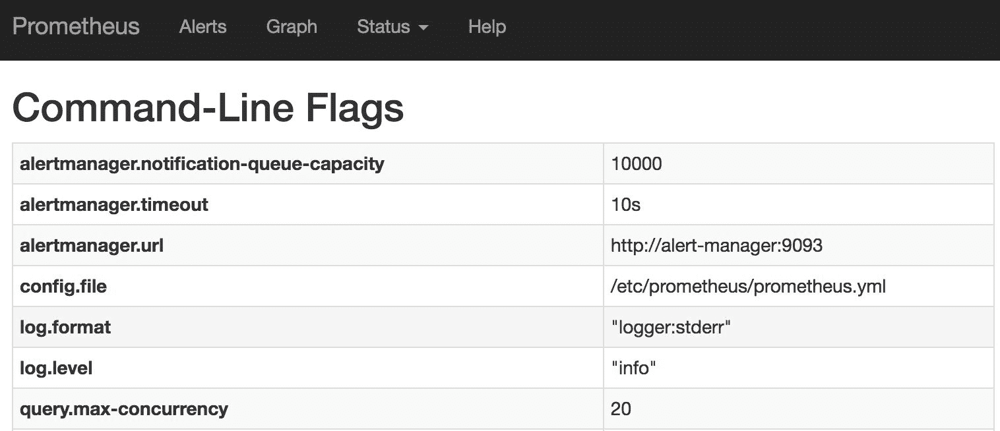

## 向人类发送警报

尽管 Prometheus 警报本身很有用，但除非你打算把所有时间都花在 *警报* 屏幕前，否则它们并不太有用。还有更好的事物可以盯着看。例如，你可以选择观看 Netflix。它比看 Prometheus 屏幕要有趣得多。然而，在你开始在工作时间观看 Netflix 之前，我们需要找到一种方法，确保在警报触发时，你能够收到通知。

在继续之前，我必须强调，向人类（操作员和系统管理员）发送警报是最后的手段。我们只有在系统无法自行修复问题时，才应该接收到警报。然而，在开始时，我们并没有一个自愈系统。我们将采取的方法是将每个警报发送给人类。这是一个快速修复。从那里开始，我们将努力构建一个能够接收这些警报的系统，而不是由我们来接收。这将根据具体用例进行。我们会创建一个发送所有警报的系统，然后开始探索每种情况。如果我们能让系统接受这个警报并进行自我修复，我们将停止将其发送给人类。另一方面，如果我们无法将该场景添加到系统中，它将继续向我们发出警报。换句话说，所有的警报都会发送给人类，除非它们被集成到我们将要构建的自愈系统中。

我们应该将警报消息发送到哪里？Slack 可能是一个不错的起点。即使你不使用 Slack，我们将探索的原则在无论你使用的是电子邮件、HangOuts、Messenger、HipChat、SMS，还是信鸽快递等终端时，都是相同的。只要该终端有 API，我们应该能够利用它。对于一些人来说，这可能比其他人更容易。信鸽快递可能还没有 API。

### 创建集群并部署服务

我们将从重新创建集群并部署在上一章中使用的堆栈开始。

```
`1` chmod +x scripts/dm-swarm-06.sh
`2` 
`3` ./scripts/dm-swarm-06.sh
`4` 
`5` `eval` `$(`docker-machine env swarm-1`)` 
```

````````````````````````` We executed the `dm-swarm-06.sh` script which, in turn, created a Swarm cluster composed of Docker Machines, created the networks and deployed the stacks. Now we should wait a few moments until all the services in the `monitor` stack are up and running. Please use `docker stack ps monitor` command to confirm that the status of all the services in the stack is *Running*.    Finally, we’ll confirm that everything is deployed correctly by opening Prometheus in a browser.    ``` `1` open `"http://``$(`docker-machine ip swarm-1`)``/monitor"`  ```   ```````````````````````` Now the state of our cluster is the same as it was at the end of the previous chapter and we can proceed towards deploying exporters.    ### Setting Up Alertmanager    Since we are already using Prometheus, it makes sense to deploy Prometheus’ companion *Alertmanager*. It will receive alerts, filter and forward them to the end-points we’ll define. Slack will be the first.    Alertmanager Docker image expect us to define a configuration file that defines routes, receivers, and a few other things. One possible configuration can be as follows.    ```  `1` `route``:`  `2`  `receiver``:` `"slack"`  `3`  `repeat_interval``:` `1``h`  `4`   `5` `receivers``:`  `6`    `-` `name``:` `"slack"`  `7`      `slack_configs``:`  `8`          `-` `send_resolved``:` `true`  `9`            `text``:` `"Something horrible happened! Run for your lives!"` `10 `            `api_url``:` `"https://hooks.slack.com/services/T308SC7HD/B59ER97SS/S0Kvv\` `11` `yStVnIt3ZWpIaLnqLCu"`  ```   ``````````````````````` The configuration defines the `route` with `slack` as the receiver of the alerts. In the `receivers` section, we specified that we want resolved notifications (besides alerts), creative text, and the Slack API URL. As a result, alerts will be posted to the *df-monitor-tests* channel in DevOps20 team slack. Please sign up through the [DevOps20 Registration page](http://slack.devops20toolkit.com/) and make sure you join the *df-monitor-tests* channel. This configuration should be more than enough for demo purposes.    Please consult the [alerting documentation](https://prometheus.io/docs/alerting/configuration/) for more information about *Alertmanager* configuration options.    Next, we’ll take a quick look at the [alert-manager-slack.yml](https://github.com/vfarcic/docker-flow-monitor/blob/master/stacks/alert-manager-slack.yml) stack.    ```  `1` version: "3"  `2`   `3` services:  `4`   `5`  alert-manager:  `6`    image: prom/alertmanager  `7`    ports:  `8`      - 9093:9093  `9`    networks: `10 `      - monitor `11 `    secrets: `12 `      - alert_manager_config `13 `    command: -config.file=/run/secrets/alert_manager_config -storage.path=/alert\ `14` manager `15`  `16` networks: `17 `  monitor: `18 `    external: true `19`  `20` secrets: `21 `  alert_manager_config: `22 `    external: true  ```   `````````````````````` The stack is very straightforward. The only thing worth noting is that we are exposing port `9093` only for demo purposes. Later on, when we integrate it with *Docker Flow Monitor*, they will communicate through the `monitor` network without the need to expose any ports. We need the port `9093` to demonstrate manual triggering of alerts through *Alertmanager*. We’ll get rid of it later on.    If you take a look at the `command`, you’ll notice that it specifies the configuration file that resides in the `/run/secrets/` directory. It is an in-memory file system where Docker stores secrets. We defined `alert_manager_config` as the external secret. Please visit [Alerting Rules](https://prometheus.io/docs/alerting/rules/) for more information.    Let’s create the secret.    ```  `1` `echo` `'route:`  `2``  receiver: "slack"`  `3``  repeat_interval: 1h`  `4`   `5` `receivers:`  `6``  - name: "slack"`  `7``    slack_configs:`  `8``      - send_resolved: true`  `9``        text: "Something horrible happened! Run for your lives!"` `10 ``        api_url: "https://hooks.slack.com/services/T308SC7HD/B59ER97SS/S0KvvyStV\` `11` `nIt3ZWpIaLnqLCu"` `12` `'` `|` docker secret create alert_manager_config -  ```   ````````````````````` Now that the secret with the *Alertmanager* configuration is created, we can deploy the `alert-manager-slack.yml` stack.    ``` `1` docker stack deploy `\` `2 `    -c stacks/alert-manager-slack.yml `\` `3 `    alert-manager  ```   ```````````````````` Please wait a few moments until the service is deployed. You can monitor the status through the `docker stack ps alert-manager` command.    Now we can send a manual request to the *Alertmanager*.    ``` `1` curl -H `"Content-Type: application/json"` `\` `2 `    -d `'[{"labels":{"alertname":"My Fancy Alert"}}]'` `\` `3 `    `$(`docker-machine ip swarm-1`)`:9093/api/v1/alerts  ```   ``````````````````` Before you execute the request, please change the *My Fancy Alert* name to something else. That way you’ll be able to recognize your alert from those submitted by other readers.    The output should be as follows.    ``` `1` { `2 `  "status": "success" `3` }  ```   `````````````````` Please open *df-monitor-tests* channel in *DevOps20* Slack team and observe that a new notification was posted.    Now that we confirmed that `alert-manager` works when triggered manually, we’ll remove the stack and deploy the version integrated with *Docker Flow Monitor*.    ``` `1` docker stack rm alert-manager  ```   ````````````````` We’ll deploy the `docker-flow-monitor-slack.yml` stack. It contains `monitor` and `swarm-listener` services we’re already familiar with and adds `alert-manager`. The only change to the `monitor` service is the addition of the environment variable `ARG_ALERTMANAGER_URL=http://alert-manager:9093`. It defines the address and the port of the `alert-manager`.    The definition of the `alert-manager` service is as follows.    ```  `1`  monitor:  `2`    image: vfarcic/docker-flow-monitor  `3`    environment:  `4`      ...  `5`      - ARG_ALERTMANAGER_URL=http://alert-manager:9093  `6`    ...  `7`   `8`  alert-manager:  `9`    image: prom/alertmanager `10 `    networks: `11 `      - monitor `12 `    secrets: `13 `      - alert_manager_config `14 `    command: -config.file=/run/secrets/alert_manager_config -storage.path=/alert\ `15` manager `16` ...  ```   ```````````````` We added the environment variable `ARG_ALERTMANAGER_URL` to the `monitor` service. Prometheus will use it as the address to which to send alerts. Since both services are connected through the same `monitor` network, all we had to specify is the name of the service and the internal port.    The `alert-manager` service is the same as the one we deployed earlier except that the ports are removed. There’s no need to publish them when services communicate through Overlay network.    Let’s deploy the new stack.    ``` `1` `DOMAIN``=``$(`docker-machine ip swarm-1`)` `\` `2 `    docker stack deploy `\` `3 `    -c stacks/docker-flow-monitor-slack.yml `\` `4 `    monitor  ```   ``````````````` We should confirm that the `alert-manager` is correctly configured through the environment variable `ARG_ALERTMANAGER_URL`.    ``` `1` open `"http://``$(`docker-machine ip swarm-1`)``/monitor/flags"`  ```   `````````````` As you can see from the *flags* screen, the *alertmanager.url* is now part of the Prometheus configuration. Since both are connected through the same network (`monitor`), the address is the name of the service.    Figure 6-1: Prometheus flags screen with values passed through environment variables    Let us generate an alert.    ``` `1` docker service update `\` `2 `    --label-add com.df.alertIf`=`@service_mem_limit:0.1 `\` `3 `    go-demo_main  ```   ````````````` We updated the `main` service from the `go-demo` stack by adding the `alertIf` label. It defines `mem_limit` alert that will be triggered if the service exceeds 10% of the memory limit. In other words, it will almost certainly fire the alert.    Let’s open the alerts screen.    ``` `1` open `"http://``$(`docker-machine ip swarm-1`)``/monitor/alerts"`  ```   ```````````` As you can see, the alert is red (if it isn’t, wait a few moments and refresh your screen). Since we configured *Alertmanager*, the alert was already sent to it and, from there, forwarded to Slack. Please open the *df-monitor-tests* channel in the *DevOps20* Slack team and observe that a new notification was posted.    Figure 6-2: Slack message generated by Alertmanager    As you can see, the message is not very well defined. The title is anything but understandable, the text of the message is the same no matter which alert was fired, and the link does not lead back to Prometheus but to the internal address. We’ll fix all those problems soon. For now, the important thing is that we managed to send alert to Slack.    The flow of the events is described through figure 6-3.    Figure 6-3: The flow of the events that results in a Slack message being created    We’ll restore the `go-demo` alert to its original state (used memory over 80%).    ``` `1` docker service update `\` `2 `    --label-add com.df.alertIf`=`@service_mem_limit:0.8 `\` `3 `    go-demo_main  ```   ``````````` A few moments later, we can observe that the alert is green again.    ``` `1` open `"http://``$(`docker-machine ip swarm-1`)``/monitor/alerts"`  ```   `````````` If the alert is still not green, please wait for a while and refresh the screen.    Since we specified `send_resolved: true` in the `alert-manager` config, we got another notification. This time, the message states that the issue is resolved.    The only thing left is to create your own *Alertmanager* configuration. You’ll need Webhook URL if you choose to send alerts to your team’s Slack. The instructions for obtaining it are as follows.    Please login to your Team Slack channel, open the settings menu by clicking the team name, and select *Apps & integrations*.    Figure 6-4: Team setting Slack menu    You will be presented with the *App Directory* screen. Click the *Manage* link located in the top-right corner of the screen followed by the *Custom Integrations* item in the left-hand menu. Select *Incoming WebHooks* and click the *Add Configuration* button. Choose the channel where alerts will be posted and click the *Add Incoming WebHooks integration* button. Copy the *Webhook URL*. You’ll need it when you customize the solution to your needs.    Now that you know how to get the *Webhook URL*, feel free to replace the one from the examples that follow. That does not mean that you cannot run them as they are. You’re free to use *DevOps20* team Slack if that suits you better.    ### Using Templates In Alertmanager Configuration    Defining *Alertmanager* configuration using static text is not very useful if we’re running more than one service. Instead, we should employ templates that will help us customize messages. While we’re at it, we can also fix the broken link from the message and customize the title.    Before we proceed, let us remove the `monitor_alert-manager` service and the `alert_manager_config` secret. That will allow us to deploy it again with better-defined messages.    ``` `1` docker service rm monitor_alert-manager `2`  `3` docker secret rm alert_manager_config  ```   ````````` We’ll create a new secret with the complete *Alertmanager* configuration.    ```  `1` `echo` `"route:`  `2``  group_by: [service]`  `3``  receiver: 'slack'`  `4``  repeat_interval: 1h`  `5`   `6` `receivers:`  `7``  - name: 'slack'`  `8``    slack_configs:`  `9``      - send_resolved: true` `10 ``        title: '[{{ .Status | toUpper }}] {{ .GroupLabels.service }} service is \` `11` `in danger!'` `12 ``        title_link: 'http://``$(`docker-machine ip swarm-1`)``/monitor/alerts'` `13 ``        text: '{{ .CommonAnnotations.summary}}'` `14 ``        api_url: 'https://hooks.slack.com/services/T308SC7HD/B59ER97SS/S0KvvyStV\` `15` `nIt3ZWpIaLnqLCu'` `16` `"` `|` docker secret create alert_manager_config -  ```   ```````` Previously, we specified only `text` and `api_url` and let *Alertmanager* fill in the blanks. This time, we added `title` and `title_link` to the mix.    We used `{{ .GroupLabels.service }}` to specify the name of the service inside the `title`. Group labels are defined in the `route` section. Even though we could use “normal” labels, group labels are easier since they are unique for all the alerts coming from, in this case, the same service. The title is prefixed with the alert `status` in the upper case. That should give us clear indication whether the alert is fired or resolved.    The previous configuration produced a link that did not work. That was to be expected since the communication goes through internal networking. This time, we made sure that the `title_link` is correct and points to one of the servers in the cluster.    Finally, the `text` is the same as the alert summary defined as one of the alert `ANNOTATIONS`.    Please visit [Notification Template Reference](https://prometheus.io/docs/alerting/notifications/) for more info about the templates that can be used when configuring Alertmanager.    If everything works as expected, the new Alertmanager config will result in clearer messages customized for each service.    Let us deploy the stack and, with it, `alert-manager` with the new configuration.    ``` `1` `DOMAIN``=``$(`docker-machine ip swarm-1`)` `\` `2 `    docker stack deploy `\` `3 `    -c stacks/docker-flow-monitor-slack.yml `\` `4 `    monitor  ```   ``````` We’ll test the alert in the same way as before by decreasing the threshold.    ``` `1` docker service update `\` `2 `    --label-add com.df.alertIf`=`@service_mem_limit:0.1 `\` `3 `    go-demo_main  ```   `````` A few moments later, Prometheus will change the state of the alert to pending and, a while later to firing. We can observe those changes by opening the *Alerts* screen.    ``` `1` open `"http://``$(`docker-machine ip swarm-1`)``/monitor/alerts"`  ```   ````` If you open Slack channel *#df-monitor-tests* you’ll notice that the message is much better this time.    The only thing left is to confirm that we’re receiving the correct message when an issue is resolved. We’ll change the alert threshold back to 80%.    ``` `1` docker service update `\` `2 `    --label-add com.df.alertIf`=`@service_mem_limit:0.8 `\` `3 `    go-demo_main  ```   ```` After a while, Prometheus will change the alert status to resolved, send a notification to Alertmanager which, in turn, will communicate the news to Slack. The result will be the *RESOLVED* message.    Figure 6-5: Customized Slack alert messages    ### What Now?    We’re done. We have a system that will alert us whenever there’s something wrong inside the cluster. The next step is to start alerting the system so that it can self-heal and leave our Slack channel only for emergencies that cannot be auto-fixed.    The next chapter will explore the options for alerting the system. For now, the time has come for both us and our laptops to take a rest.    ``` `1` docker-machine rm -f `\` `2 `    swarm-1 swarm-2 swarm-3  ``` ```` ````` `````` ``````` ```````` ````````` `````````` ``````````` ```````````` ````````````` `````````````` ``````````````` ```````````````` ````````````````` `````````````````` ``````````````````` ```````````````````` ````````````````````` `````````````````````` ``````````````````````` ```````````````````````` `````````````````````````
