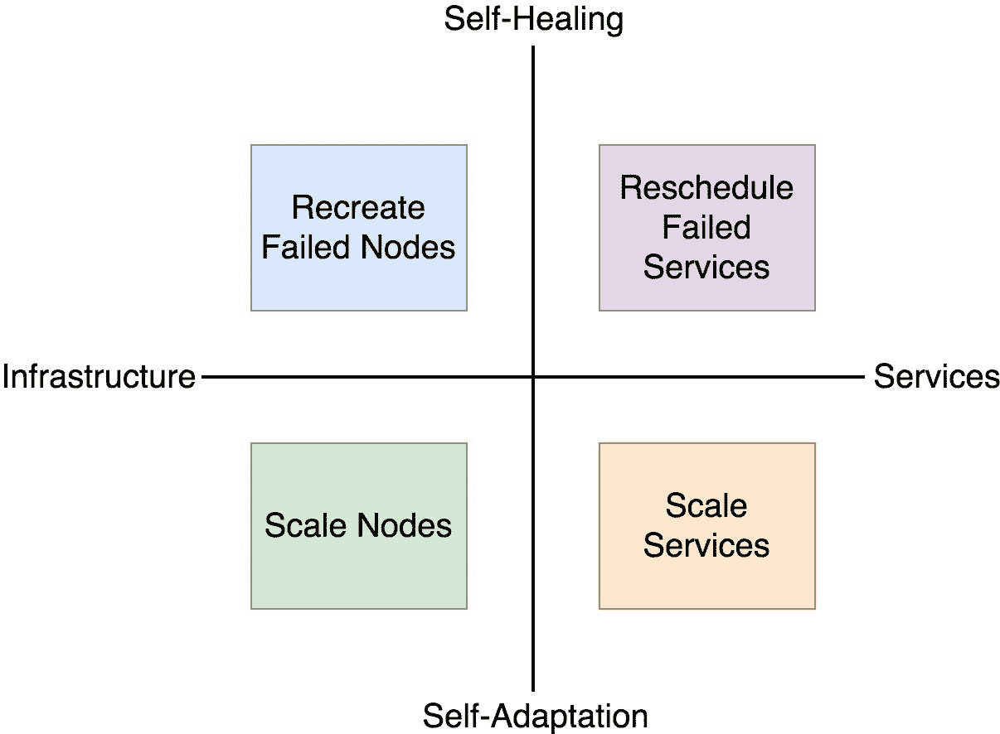

## 系统告警

我们的告警系统已经设置好了。Alertmanager 已配置为将通知发送到 Slack。虽然这已经是一个不错的进步，但它距离作为自适应和自愈系统基础的告警系统仍然差得很远。到目前为止，我们所做的可以被视为一个后备策略。如果系统无法检测到条件变化，并在需要时自我适应或自我修复，通过 Slack 通知人类是一个不错的解决方案。在某些情况下，Slack 通知将是暂时的，并会被请求系统自动修正替代。在其他情况下，系统无法自我修复，因此必须将通知发送给医生（我们，人类，工程师）。

我们已经构建了一个初步的告警系统解决方案。Alertmanager 可以满足我们的一些需求。它并不是唯一的，还有另一个我们在全书中使用过的系统，尽管我们从未在此上下文中提到过它。我相信你能猜出它是哪一个。如果你猜不出来，我会再让你悬念一段时间。

在我们继续并开始构建接收告警的系统之前，我们应该讨论系统可能需要执行的操作类型。

### 动态和自给自足系统的四个象限

任何打算完全自动化和自给自足的系统必须能够自愈和自适应。最低要求是，它需要能够监控自己，并在服务和基础设施层面执行某些操作。

两个轴可以表示系统可能执行的操作集。一组操作通过基础设施与服务之间的差异来表示。另一个轴可以通过活动类型来解释，一端是自愈，另一端是自适应。

在基础设施中应用最常见的自愈类型是重新创建一个失败或有故障的节点。当基础设施需要适应变化的条件时，节点会被扩展。自愈大多是关于重新调度失败的服务。当系统条件发生变化时，它应该通过扩展某些服务来自我适应。

图 7-1: 系统操作类型

系统如何区分自适应与自愈？它应该什么时候选择执行一个操作而非另一个？

每个系统都有设计。这个设计可能会长时间保持不变，也可能每几分钟就被重新设计一次。系统设计变化的频率将静态系统与动态系统区分开来。在软件行业的短暂历史中，我们通常偏爱长期有效的设计。我们会花大量时间规划，甚至花费更长时间设计一个系统，然后再实现它。难怪我们不愿意在做所有这些工作后，直到上线后一周就开始更改系统设计。我们曾采用瀑布模型工作，所有工作都提前规划，并分阶段执行。大多数情况下，最终结果是失败，但我们此刻不讨论这个问题。如果你在这个行业工作了一段时间，你大概知道什么是瀑布模型。希望你的公司发生了变化，或者你改变了公司。瀑布模型已经死去，长期稳定的静态设计也随之消失。

动态系统的特点是设计中非常频繁，甚至可以说是持续不断的变化。我们可能会设计一个运行五个副本的服务，但一周后又将其更改为七个副本。我们可能会设计一个由二十七个节点组成的基础设施，但过了一段时间后，这个数字可能变成三十个。每当我们做出有意识的决定来改变系统中的某些内容时，我们实际上是在改变设计。这些变化的每一个，都可能是初期计算错误的结果，或者是外部条件的变化影响了系统。流量的稳定增长要求设计发生变化。这要求我们扩大一个或多个服务的副本数量。其他条件相同的情况下，副本数量的增加意味着基础设施资源的增加。我们需要添加更多的节点来承载这些增加的副本。如果情况并非如此，我们就过度配置了系统。也就是说，我们有闲置资源，在扩展服务时可以利用它们。

自适应是一种自动化方式，用于改变系统的设计。当我们（人类）改变设计时，我们通过评估指标来做出决定。至少，我们应该这么做。否则，我们就像是在咨询水晶球、雇佣算命师，或仅仅是在猜测。如果我们能够基于指标做出决策，那么系统也能这样做。不管是谁在改变系统，每次更改都是对设计的修改。如果我们将这一过程自动化，就得到了自适应。

自愈功能并不会影响设计。相反，它是遵循设计的。如果设计中规定有五个副本，而系统中只有四个副本在运行，那么系统应该尽力增加一个副本。而且这并不总是关于增加数量。如果副本数量超过了设计要求，则应删除一些副本。同样的逻辑适用于节点或系统中的任何其他可量化部分。简而言之，自愈功能就是确保设计始终被遵循。

一个系统可以适应或修复服务或基础设施。修复背后的最常见操作是重建失败的部分，而适应通常是关于扩展。它们是四个象限，代表了一个动态且自给自足的系统。

我们即将开始构建一个（几乎）自动化的系统，利用这四个象限。到目前为止，我们所做的一切都是构建这样一个系统的前提条件。我们在 Prometheus 中有度量指标，并且可以通过 Alertmanager 管理警报。现在是时候充分利用这些工具，并扩展它们的应用了。

我们将要探索的第一个象限集中在自我修复和服务上。
