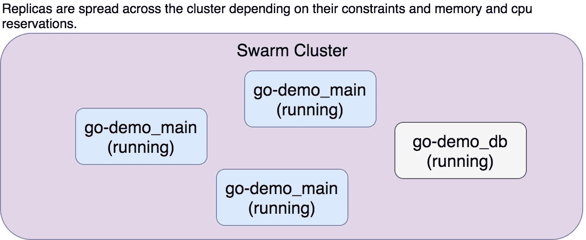
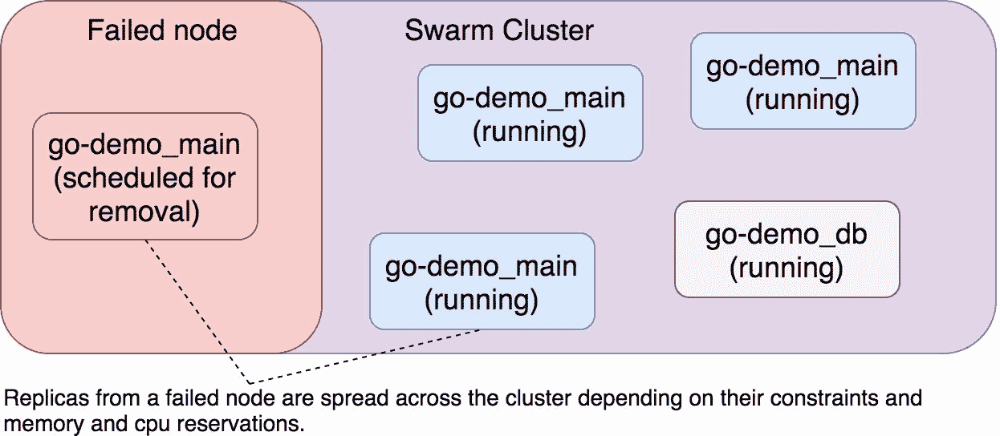

## 第十二章：自我修复应用于服务

自我修复服务的系统的工作就是确保服务（几乎）始终按照设计运行。这样的系统需要监控集群的状态，并持续确保所有服务都在运行指定数量的副本。如果其中一个停止，系统应启动一个新的副本。如果整个节点宕机，该节点上运行的所有副本应该被调度到健康节点上运行。只要集群的容量能够容纳所有副本，系统应该能够保持已定义的规格。

拥有一个自我修复服务的系统并不意味着它提供高可用性。如果一个副本停止工作，系统将把它恢复到运行状态。然而，系统恢复到所需状态之间会有一个（非常）短的时间间隔。如果我们只运行一个副本的服务，那么在这段时间内将会有停机时间。解决这个问题的最佳方法是运行每个服务的至少两个副本。这样，当其中一个副本宕机时，其他副本将处理请求，直到故障副本恢复到所需状态。

假设集群的条件保持不变（节点不会宕机）且集群负载保持恒定，具备自我修复服务的系统应该能够提供接近 100% 的正常运行时间。不幸的是，节点确实会宕机，并且集群的负载（几乎）从不恒定。我们稍后将探讨如何解决这些问题。现在，我们将重点关注如何构建系统的部分，以确保服务能够自动修复。

### 创建集群并部署服务

我们将从设置一个 Swarm 集群开始，并部署在本章中使用的堆栈。

```
`1` chmod +x scripts/dm-swarm-08.sh
`2` 
`3` ./scripts/dm-swarm-08.sh
`4` 
`5` `eval` `$(`docker-machine env swarm-1`)`
`6` 
`7` docker stack ls 
```

```````````````` We executed the `dm-swarm-08.sh` script which, in turn, created a Swarm cluster composed of Docker Machines, created the networks and deployed the stacks. The last command listed all the stacks in the cluster. We are running only `go-demo` and `proxy` stacks. Where are `prometheus` and `exporter` stacks we deployed in the previous chapters? Why are we missing them? The reason is quite simple. We don’t need them to demonstrate self-healing applied to services. We have everything we need.    Before we proceed, please confirm that all the replicas that compose the `go-demo` stack are running. You can check their statuses by executing `docker stack ps go-demo` command. You might see a few failed replicas of the `go-demo_main` service. The reason is in its design. It fails if it cannot connect to the database running inside the `go-demo_db` service. Since the database is a bigger image, it takes more time to pull it. Ignore the failed replicas and confirm that there are three instances of `go-demo_main` running.    Figure 8-1: Replicas spread across the cluster    ### Using Docker Swarm For Self-Healing Services    Docker Swarm already provides almost everything we need from a system that self-heals services.    What follows is a short demonstration of some of the scenarios the system might encounter when facing failed service replicas. I already warned you that at least basic knowledge of operating Swarm is the pre-requirement for this book so I chose to skip a lengthy discussion about the features behind the scheduler. I won’t go into details but only prove that Swarm guarantees that the services will (almost) always be healthy.    Let’s see what happens when one of the three replicas of the `go-demo_main` service fails. We’ll simulate it by stopping the primary process inside one of the replicas.    The first thing we need to do is find out the node where one of the replicas are running.    ``` `1` `NODE``=``$(`docker service ps `\` `2 `    -f desired-state`=`Running `\` `3 `    go-demo_main `|` tail -n `1` `\` `4 `    `|` awk `'{print $4}'``)` `5`  `6` `eval` `$(`docker-machine env `$NODE``)`  ```   ``````````````` We listed all the processes of the `go-demo_main` service and used a filter to limit the output only to those that are running. The output was sent to `tail` so that only one result is returned. Further on, we used `awk` to print only the fourth column which contains the name of the node. The result was assigned to the environment variable `NODE`.    The second command changed our local Docker client to point to the node with one of the replicas.    Next, we need to find the ID of one of the replicas running on the node we selected.    ``` `1` `CONTAINER_ID``=``$(`docker container ls -q `\` `2 `    -f `"label=com.docker.swarm.service.name=go-demo_main"` `\` `3 `    `|` tail -n `1``)`  ```   `````````````` We listed all the containers in quiet mode so that only IDs are returned. We used filtering so that only containers labeled as the service `go-demo_main` are retrieved. Since we need only one container (there might be more on that node), we sent the output to `tail` that returned only the last row.    Now we can stop the main process inside the container and observe what happens.    ``` `1` docker container `exec` -it `\` `2 `    `$CONTAINER_ID` pkill go-demo  ```   ````````````` We killed the `go-demo` process inside the container. That was the main and the only process inside that container. As soon as it stopped, container stopped as well.    Let’s list the processes of the `go-demo` stack.    ``` `1` docker stack ps go-demo  ```   ```````````` The output, limited to the replica we killed, is as follows (IDs are removed for brevity).    ``` `1` NAME               IMAGE                  NODE    DESIRED STATE CURRENT STATE   \ `2 `      ERROR                     PORTS `3` go-demo_main.3     vfarcic/go-demo:latest swarm-2 Running       Running 1 second\ `4 ` ago `5 ` \_ go-demo_main.3 vfarcic/go-demo:latest swarm-2 Shutdown      Failed 11 second\ `6` s ago "task: non-zero exit (2)"  ```   ``````````` As you can see, Swarm detected that one of the replicas failed, and scheduled a new one. It made sure that the specification (the design) is followed. When we deployed the `go-demo` stack, we told Swarm that we want to have three replicas of the `go-demo_main` service and Swarm is continuously monitoring the cluster making sure that our desire is always fulfilled. There were a few seconds between the failure and until the new replica was running. If we’d run only one replica, that would mean a short downtime. However, since we are running three, the other two took over the requests, and there was no downtime. High availability is preserved.    Figure 8-2: The failed replica was re-scheduled    What happens when a whole node is destroyed? I’m sure you already know the answer, but I’ll go through a small demonstration never the less.    We’ll repeat the command that we executed earlier and find a node with at least one of the `go-demo_main` replicas.    ``` `1` `NODE``=``$(`docker service ps `\` `2 `    -f desired-state`=`Running `\` `3 `    go-demo_main `|` tail -n `1` `\` `4 `    `|` awk `'{print $4}'``)`  ```   `````````` Let’s be destructive and delete the node.    ``` `1` docker-machine rm -f `$NODE`  ```   ````````` To be on the safe side, we’ll list all the machines and confirm that one was indeed removed.    ``` `1` docker-machine ls  ```   ```````` The output is as follows.    ``` `1` NAME      ACTIVE   DRIVER       STATE     URL                         SWARM   DO\ `2` CKER        ERRORS `3` swarm-1   -        virtualbox   Running   tcp://192.168.99.100:2376           v1\ `4` 7.03.1-ce `5` swarm-3   *        virtualbox   Running   tcp://192.168.99.102:2376           v1\ `6` 7.03.1-ce  ```   ``````` Next, we’ll have to change our environment variables to ensure that our local Docker client is not pointing to the node we just removed.    ``` `1` `NODE``=``$(`docker-machine ls -q `|` tail -n `1``)` `2`  `3` `eval` `$(`docker-machine env `$NODE``)`  ```   `````` Now we can, finally, list the processes of the `go-demo` stack and see the result.    ``` `1` docker stack ps go-demo  ```   ````` The output, limited to the relevant parts, is as follows (IDs are removed for brevity).    ``` `1` NAME               IMAGE                  NODE    DESIRED STATE CURRENT STATE   \ `2 `        ERROR                        PORTS `3` ... `4` go-demo_main.3     vfarcic/go-demo:latest swarm-1 Running       Running 2 minute\ `5` s ago `6 ` \_ go-demo_main.3 vfarcic/go-demo:latest swarm-2 Shutdown      Running 7 minute\ `7` s ago `8` ...  ```   ```` Docker Swarm detected that `swarm-2` node is not available and changed the desired state of the replicas that were running there to `Shutdown`. Unlike the case when a container fails, the current state stayed unchanged. Swarm still assumes that the replicas are running inside `swarm-2`. We know that the node is destroyed and that no replicas are running inside it. Swarm, on the other hand, is not aware of that. It just knows what the last known state of that replica is. The node, from Swarm’s point of view, might still be operational and only lost the connection with the cluster. Theoretically, the connection could be reestablished later. There could be many other explanations besides the destruction of the node, so Swarm keeps the last known state. Never the less, if the node rejoins the cluster, that replica is scheduled for shutdown and will be destroyed immediately as a way to preserve the desired state.    Figure 8-3: Replicas from a failed node are spread across the cluster    ### Is It Enough To Have Self-Healing Applied To Services?    Self-healing applied to services is only the beginning. It is by no means enough. The system, as it is now, is far from being autonomous. At best, it can recuperate from a few types failures. If one replica of a service goes down, Swarm will do the right thing. Even a simultaneous failure of a few replicas should not be a cause for alarm. However, self-healing applied to services by itself does not contemplate many of the common circumstances.    Let us imagine that the sizing of a cluster is done in a way that around 80 percent of CPU and memory is utilized. Such a number, more or less, provides a good balance between having too many unused resources and under-provisioning our cluster. With greater resource utilization we are running a risk that even a failure of a single node would mean that there are no available resources to reschedule the replicas that were running inside it. On the other hand, if we have more than twenty percent of available resources, we are paying for more hardware than we need.    Assuming that we do aim for eighty percent of resource utilization, without self-healing applied to infrastructure, a failure of more than one node could have a devastating effect. Swarm would not have enough available resources to reschedule replicas from the failed servers. While it is not common, an availability zone (to use AWS terms) can go down. Assuming that our infrastructure is spread over three availability zones, such a failure would mean that our capacity is reduced by thirty-three percent. When we do the math, that would mean that we would be missing sixteen percent of resources. It is even worse than that since Swarm cannot schedule services so that hundred percent is used. Somewhere around ninety to ninety-five percent is more likely. So, a failure of an AZ would mean that we would be missing quite a lot of resources and some replicas could not be rescheduled. At best, we would have reduced performance. Self-healing applied to infrastructure is a must, and we will explore it soon.    Even if nothing failed, our system would not function autonomously for long. We should expect that the load will increase with time. After all, we want our business to expand and that, in most cases, results in increased load. We need to build a system that will adapt to those changes. We need it to expand when the load increases thus providing high availability and low response times. At the same time, we need it to contract when the load decreases and save money from paying for unused resources. We need the system not only to self-heal but also self-adapt to the changed conditions. We need it to redesign itself.    There are many other things that we are missing, and we won’t discuss them just yet. Patience is a virtue, and you’ll have to wait for a while longer.    ### What Now?    We’re done with a brief exploration of self-healing capabilities provided with Docker Swarm. We have a system that will reschedule failed services as long as there is enough capacity inside our cluster. The next step is to apply self-adaptation to our services.    Please remove the machines we created. We’ll recreate the cluster in the next chapter.    ``` `1` docker-machine rm -f `\` `2 `    swarm-1 swarm-2 swarm-3  ``` ```` ````` `````` ``````` ```````` ````````` `````````` ``````````` ```````````` ````````````` `````````````` ``````````````` ````````````````
