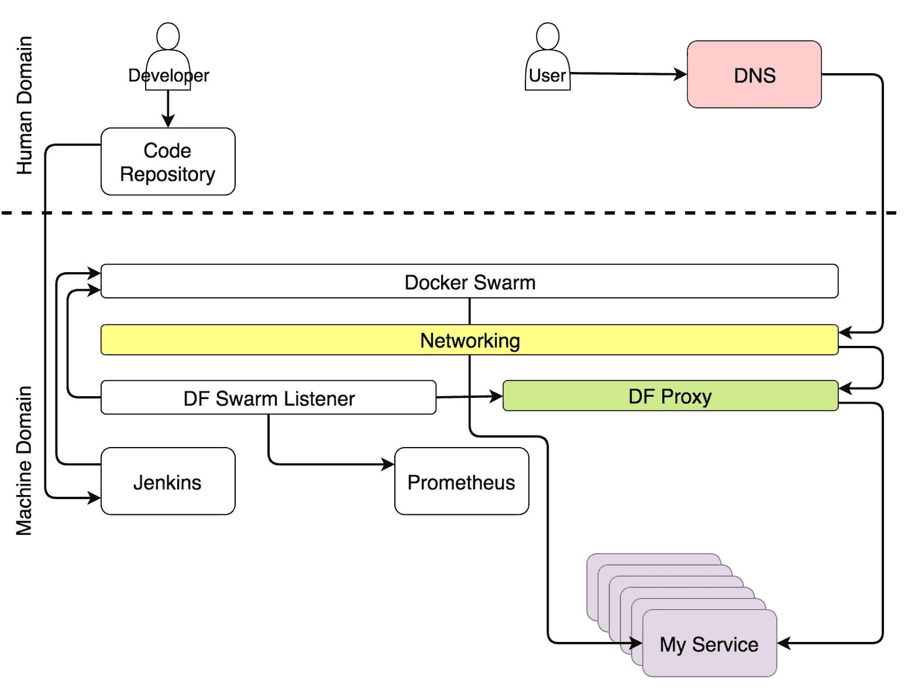

## 描绘全貌：到目前为止的自给自足系统

自给自足系统是一个能够自我修复和自我适应的系统。修复意味着集群始终保持在设计的状态。例如，如果某个服务的副本宕机，系统需要重新启动它。适应性则是指修改期望状态，以便系统能够应对变化的条件。一个简单的例子是流量增加。当流量增加时，服务需要扩展。当修复和适应自动化时，我们就得到了自我修复和自我适应。两者共同构成了一个无需人工干预即可运行的自给自足系统。

一个自给自足的系统是什么样的？它的主要组成部分有哪些？谁是其中的参与者？

我们将讨论范围限制为服务，并忽略硬件同样重要的事实。考虑到这一限制，我们将描绘一个高层次的图景，描述从服务角度来看（大多数）自主系统。我们将从细节中抽身，俯瞰整个系统。

如果你是那种什么都想一次性看全的人，系统已在图 10-1 中做了总结。

图 10-1：具有自我修复和自我适应服务的系统

这样的图表可能一下子让人难以消化。直接展示给你可能会让你觉得同理心不是我的强项。如果你有这种感觉，你并不孤单。我的妻子也有同样的印象，即使没有任何图表。这次我会尽力改变你的看法，从头开始，重新整理一下。

我们可以将系统分为两个主要领域：人类和机器。可以把它们想象成[黑客帝国](http://www.imdb.com/title/tt0133093/)。如果你还没看过这部电影，立刻停下阅读这本书，准备些爆米花，去看一看吧。

在《黑客帝国》中，世界被机器控制。人类几乎不做什么，只有那些意识到发生了什么的人例外。大多数人生活在一个反映人类历史过去事件的梦境中。他们身体上处于现在，但思想却停留在过去。现代集群也呈现出类似的情况。大多数人仍然像 1999 年那样操作它们。几乎所有的操作都是手动的，过程繁琐，系统依靠蛮力和浪费的能量勉强存活下来。少数人意识到现在已经是 2017 年（至少在本文写作时是这样），而一个设计良好的系统是一个大部分工作由机器自动完成的系统。几乎所有的操作都是由机器而非人工操控的。

这并不意味着我们（人类）没有角色。我们有，但它更与创造性和非重复性任务相关。因此，如果我们仅关注集群操作，人类领域正在缩小，并被机器领域取代。

系统可以分为不同的角色。正如你将看到的那样，一个工具或一个人可以非常专业化，只执行单一的角色，也可以负责操作的多个方面。

### 开发者在系统中的角色

人类领域包括那些由人工操作的流程和工具。我们试图将所有可以重复的操作从这个领域移除。这并不意味着这个领域的目标是消失，恰恰相反。通过将重复的任务移出人类领域，我们解放了自己，使我们能花更多时间在那些带来真正价值的事情上。我们越少做那些可以委托给机器的任务，我们就能有更多时间去做那些需要创造力的工作。这种哲学符合每个角色在这场戏中的优势和劣势。机器擅长处理数据，它们知道如何快速执行预定义的操作，且比我们更快、更可靠。与机器不同，我们能够进行批判性思维，我们可以富有创造力。我们可以编程这些机器，告诉它们做什么以及何时做。

我将开发者指定为人类领域的主要角色。我有意避免使用“编码员”一词。开发者是指参与软件开发项目的所有人。无论你是编码员、测试员、运维专家，还是敏捷教练，都归为开发者这个群体。你们的工作成果是将某些内容提交到代码库中。在它到达之前，它就像不存在一样。无论它是在你的笔记本电脑上、笔记本中、桌面上，还是在一张小纸条上附着在信鸽上，都不重要。从系统的角度看，直到它进入代码库，它才算存在。那个代码库希望是 Git，但为了便于讨论，它可以是任何一个可以存储和版本管理代码的地方。

这个代码库也是人类领域的一部分。尽管它是一款软件，它仍然属于我们。我们来操作它。我们提交代码、拉取代码、合并代码，有时还会因太多的合并冲突而无奈地盯着它看。这并不意味着它没有自动化操作，也不意味着机器领域的某些部分在没有任何人为干预的情况下操作它。尽管如此，只要某件事大多是人工操作的，我们就会认为它属于人类领域。代码库绝对算是需要大量人工干预的系统的一部分。

图 10-2: 开发者将代码提交到代码库

让我们看看当代码提交到代码库时发生了什么。

### 系统中持续部署的角色

持续部署过程是完全自动化的。没有例外。如果你的流水线没有自动化，那就不是持续部署。你可能需要手动操作才能部署到生产环境。如果这个操作仅仅是按下一个写着**deploy**的按钮，那么你的过程是持续交付。我可以接受这种情况。可能出于业务原因需要这样一个按钮。尽管如此，自动化的程度和持续部署是一样的。你只是一个决策者。如果有任何其他手动操作，那你要么是在做持续集成，要么，更可能是在做一些不该带有“持续”字眼的工作。

无论是持续部署还是持续交付，过程都是完全自动化的。只有在你的系统是一个遗留系统，并且你的组织选择不去触碰它时，你才可以免于手动操作（通常是一个 Cobol 应用）。它仅仅是坐在服务器上做一些事情。我非常喜欢“没人知道它在做什么，不要碰它”类型的规则。这是一种在保持安全距离的同时，表现出极高尊重的方式。然而，我假设这不是你的情况。你想要去触碰它。你内心的渴望在燃烧。如果不是这样，而你不幸正在一个那种“远离它”的系统上工作，那么你读错了书，我很惊讶你自己没有意识到这一点。

一旦代码仓库接收到提交或拉取请求，它会触发一个 Web hook，发送请求给 CD 工具，启动持续部署过程。在我们的案例中，这个工具是[Jenkins](https://jenkins.io/)。该请求会启动流水线构建，执行各种持续部署任务。它会检出代码并运行单元测试。它构建一个镜像并将其推送到注册表。它运行功能测试、集成测试、性能测试以及其他需要实时服务的测试。流程的最后阶段（不包括生产环境测试）是向调度器发送请求，在生产集群中部署或更新服务。我们选择的调度器是 Docker Swarm。

图 10-3：通过 Jenkins 部署服务

与持续部署并行，另一组进程正在运行并试图保持系统配置的最新状态。

### 系统中服务配置的角色

系统的某些部分需要在集群的任何方面发生变化时重新配置。代理可能需要更新其配置，指标收集器可能需要新的目标，日志解析器可能需要更新它的规则。

无论系统的哪些部分需要更改，这些更改都需要自动应用。几乎没有人对此有异议。更大的问题是，如何找到那些应当被纳入系统的信息。最理想的地方是服务本身。由于几乎所有的调度程序都使用 Docker，因此关于服务的信息最合理的位置就是它内部，以标签的形式存在。将信息放在其他地方会阻碍我们拥有单一的信息源，并使自动发现变得难以实现。

将服务信息放在服务内部，并不意味着同样的信息不应该存在于集群中的其他地方。它应该存在。然而，服务是主信息必须存在的地方，从那里开始，信息应当传播到其他服务。Docker 使这一过程变得非常简单。它已经有一个 API，任何人都可以接入，并发现任何服务的所有信息。

用来发现服务信息并将其传播到系统其他部分的工具是 [Docker Flow Swarm Listener (DFSL)](http://swarmlistener.dockerflow.com/)。你可以选择其他工具或构建自己的解决方案。这类工具的目标，特别是 *Docker Flow Swarm Listener*，是监听 Docker Swarm 事件。如果服务包含特定的标签集，监听器将在服务部署或更新时立即获取信息，并将其传递给所有相关方。在这种情况下，相关方是 *Docker Flow Proxy (DFP)*（内部包含 HAProxy）和 *Docker Flow Monitor (DFM)*（内部包含 Prometheus）。最终，二者都拥有始终最新的配置。代理拥有所有公开服务的路由，而 Prometheus 则拥有有关导出器、警报、*Alertmanager* 的地址以及其他许多信息。

图 10-4：通过 Docker Flow Swarm Listener 重新配置系统

在部署和重新配置进行时，用户必须能够在不中断服务的情况下访问我们的服务。

### 代理在系统中的角色

每个集群都需要一个代理，代理将接收发送到单个端口的请求并将其转发到目标服务。唯一的例外是当我们只有一个面向公众的服务时。在这种情况下，值得质疑的不仅是我们是否需要代理，甚至是否根本需要集群。

当请求到达代理时，它会被评估，并根据其路径、域名或其他几个头信息，转发到其中一个服务。

Docker 使得代理的许多方面变得过时。负载均衡已经没有必要，Docker 的 Overlay 网络会为我们完成这项工作。我们也不需要维护托管服务的节点的 IP 地址，服务发现系统会为我们处理这一切。对头信息的评估和转发基本上就是代理应当执行的所有工作。

由于 Docker Swarm 在服务的每个方面发生变化时都会利用滚动更新，因此持续部署（CD）过程不应产生任何停机时间。为了确保这一点成立，需要满足一些要求。除了其他要求外，服务至少需要运行两个副本，最好更多。否则，任何单副本的服务更新都会不可避免地造成停机。无论是几分钟、几秒钟还是毫秒，都没有区别。

停机并不总是灾难性的，这取决于服务的类型。如果 Prometheus 被更新为新版本，由于它无法扩展，肯定会有停机时间。但它不是一个面向公众的服务，除非你算上几个操作员。几秒钟的停机对它来说并不算大问题。

一个面向公众的服务，例如一个在线零售商店，成千上万甚至数百万用户在其中购物，如果服务出现故障，迅速就会失去良好的声誉。作为消费者，我们已经非常惯坏了，哪怕是一个小小的故障，也能让我们改变主意，转而去竞争对手那里。如果这个“故障”一而再、再而三地发生，业务损失几乎是注定的。持续部署有很多优点，但由于它执行得比较频繁，它也放大了潜在的部署问题，其中停机就是其中之一。每天多次出现的“一秒钟停机”，实际上是不可接受的。

好消息是，结合滚动更新和多个副本，我们可以避免停机，只要代理始终保持最新。

滚动更新与能够动态重新配置自己的代理相结合，结果是用户可以在任何时候向服务发送请求，而不受持续部署、故障和集群状态变化的影响。

当用户向某个域发送请求时，请求通过任何一个健康节点进入集群，并被 Docker 的*Ingress*网络接管。该网络会检测到请求使用的是代理发布的端口并进行转发。代理则会评估请求的路径、域名或其他某个方面，并将请求转发到目标服务。

我们使用的是[Docker Flow Proxy (DFP)](http://proxy.dockerflow.com/)，它在 HAProxy 上增加了所需的动态性。

图 10-5：请求流向目标服务的过程

我们接下来要讨论的角色是关于收集度量指标的。

### 系统中的度量指标角色

任何集群中至关重要的部分，尤其是那些朝着自适应方向发展的集群，是数据。几乎没有人会争辩过去和当前指标的必要性。如果没有它们，当出现问题时我们就像无头的苍蝇一样乱跑。关键问题不在于是否需要它们，而在于我们如何使用它们。传统上，运维人员会花费无数小时盯着仪表板看。这远远低效，不如看 Netflix。至少，后者更具娱乐性。系统应该使用这些指标。系统生成它们，收集它们，并且应该决定在它们达到某些阈值时执行哪些操作。只有这样，系统才能自适应。只有在没有人工干预的情况下执行操作，系统才能自给自足。

一个实现自适应的系统需要收集数据、存储数据并对数据采取行动。我将跳过推送和抓取数据的利弊讨论。由于我们选择使用[Prometheus](https://prometheus.io/)作为数据存储和评估的地方，以及生成和触发告警的服务，因此选择了抓取数据。这些数据通过导出器的形式提供。它们可以是通用的（例如 Node Exporter、cAdvisor 等），也可以是特定于某个服务的。在后者情况下，服务必须以 Prometheus 期望的简单格式暴露指标。

独立于我们之前描述的流程，导出器暴露了不同类型的指标。Prometheus 会定期抓取这些指标并将其存储在数据库中。与抓取数据并行，Prometheus 会持续评估由告警设置的阈值，如果达到任何一个阈值，它会被传播到[Alertmanager](https://prometheus.io/docs/alerting/alertmanager/)。在大多数情况下，这些阈值的触发是由于条件发生变化（例如，系统负载增加）。

图 10-6：数据收集与告警

告警接收器是决定差异的关键。

### 系统中的告警角色

告警根据接收器的类型分为两大类。它可以转发到系统或人类。当某个告警被认定为应该发送到系统时，通常会转发一个请求到一个能够评估情况并执行适应系统任务的服务。在我们的案例中，这个服务是 *Jenkins*，它会执行预定义的某个作业。

Jenkins 执行的最常见任务集是调整（或反向调整）服务。然而，在尝试扩展之前，它需要发现当前副本数量，并将其与我们通过服务标签设置的上限和下限进行比较。如果扩展会导致副本数量超出这些边界，它会向 Slack 发送通知，以便人类决定应采取什么正确的操作来解决问题。另一方面，当扩展会保持副本数量在限制范围内时，Jenkins 会向其中一个 Swarm 管理器发送请求，后者会增加（或减少）服务的副本数量。我们称这个过程为自适应，因为系统在没有人类干预的情况下适应了变化的条件。

图 10-7：系统自适应的通知

即使目标是使系统完全自动化，几乎可以肯定在某些情况下需要人工干预。这些情况本质上是无法预测的。当发生预期之外的情况时，让系统修复它。另一方面，当出现意外情况时，呼叫人类。在这些情况下，Alertmanager 向人类领域发送消息。在我们的情况下，这是一条[Slack](https://slack.com/)消息，但也可以是任何其他通讯服务。

当您开始设计自愈系统时，大多数警报将属于“意外”类别。您无法预测系统可能发生的所有情况。您可以做的是确保每个这类情况只被视为意外一次。当您收到警报时，您的第一组任务应该是手动调整系统。第二组同样重要的行动是改进 Alertmanager 和 Jenkins 的规则，以便在下次发生相同情况时，系统可以自动处理。

图 10-8：当发生意外情况时向人类发送通知

设置自适应系统是困难的，它是永远不会真正结束的事情。它将需要持续改进。那么自愈系统呢？它同样难以实现吗？

### 系统中的调度程序角色

与自适应不同，自愈相对容易实现。只要有可用资源，调度程序将确保指定数量的副本始终在运行。在我们的情况下，该调度程序是[Docker Swarm](https://docs.docker.com/engine/swarm/)。

副本可能会失败，可能会被杀死，也可能会驻留在不健康的节点上。但这并不重要，因为 Swarm 会确保在需要时重新调度它们，并且（几乎）总是保持运行。如果我们的所有服务都是可扩展的，并且每个服务至少运行几个副本，就永远不会出现停机时间。Docker 内部的自我修复过程将确保这一点，而我们的自适应过程旨在提供高可用性。两者的结合使得系统几乎完全自治，且自给自足。

当服务不可扩展时，问题就开始堆积。如果我们无法拥有多个副本，Swarm 就无法保证没有停机时间。如果一个副本失败，它会被重新调度。但是，如果那个副本是唯一的副本，那么从失败到恢复运行之间的这段时间就会导致停机。这就像我们自己一样：我们生病了，躺在床上，过一段时间后才回到工作岗位。问题是，如果我们是公司里唯一的员工，而在我们离开时没有人来接手工作，那么就会造成问题。服务也是如此。两个副本是任何希望避免停机的服务的最小要求。

图 10-9：Docker Swarm 确保无停机时间

不幸的是，你的服务可能没有考虑到可扩展性。即使考虑到了，可你所使用的某些第三方服务可能并未做到这一点。可扩展性是一个重要的设计决策，也是我们在选择下一个工具时必须评估的必要条件。我们需要清楚地区分那些绝不能有停机时间的服务和那些在几秒钟不可用时不会对系统造成风险的服务。一旦做出这种区分，你就能知道哪些服务必须具备可扩展性。可扩展性是零停机服务的必要要求。

### 集群角色在系统中的作用

最后，我们所做的一切都在一个或多个集群内。现在不再有独立的服务器。我们不决定什么东西放在哪里。调度器来做决定。从我们的（人类的）角度来看，最小的实体是集群，它是由资源（如内存和 CPU）组成的集合。

图 10-10：一切都是集群

### 现在怎么办？

我们休息了一下。希望这次短暂的停顿对提升你的层次有所帮助，并且能从更远的角度看我们所做的事情。希望这段插曲能让整体思路更加清晰，同时你也已经重新充电了。还有很多工作要做，我希望你已准备好迎接新的挑战。
