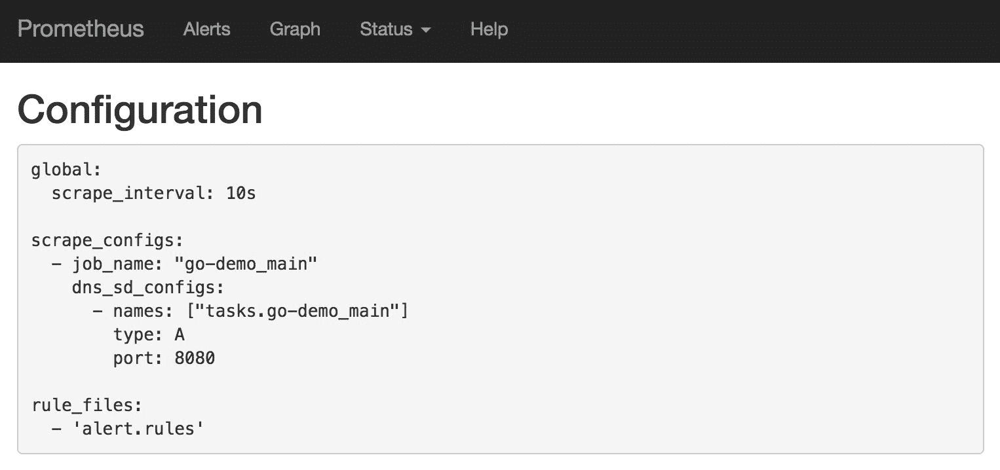
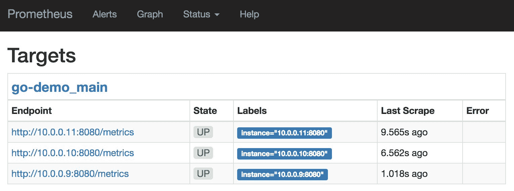
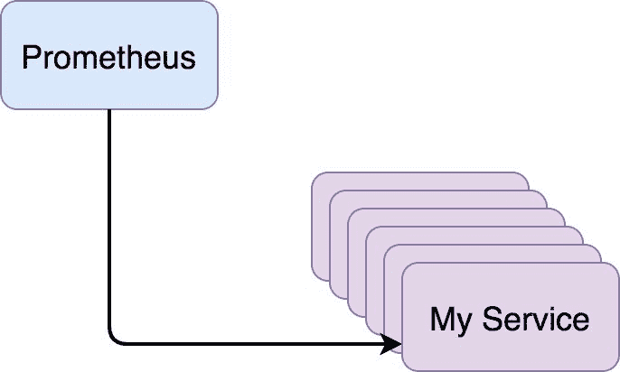
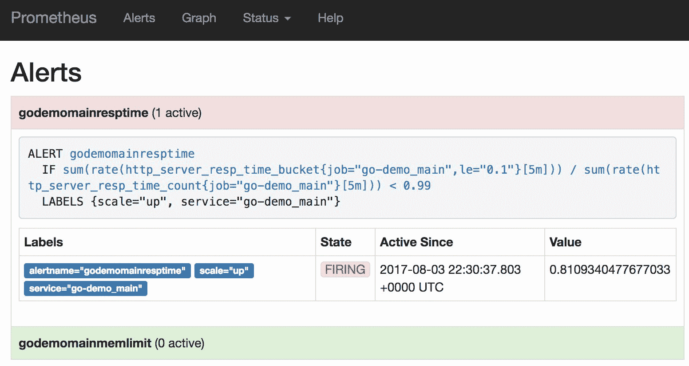
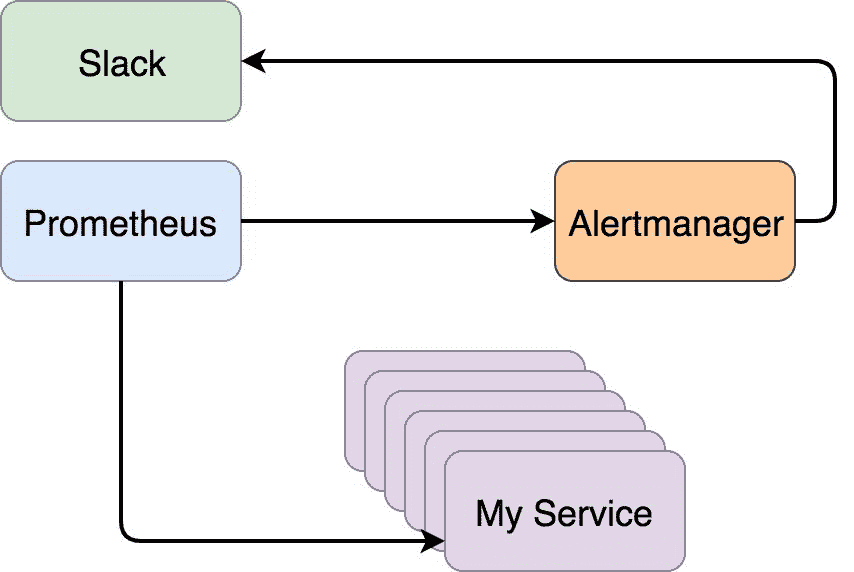
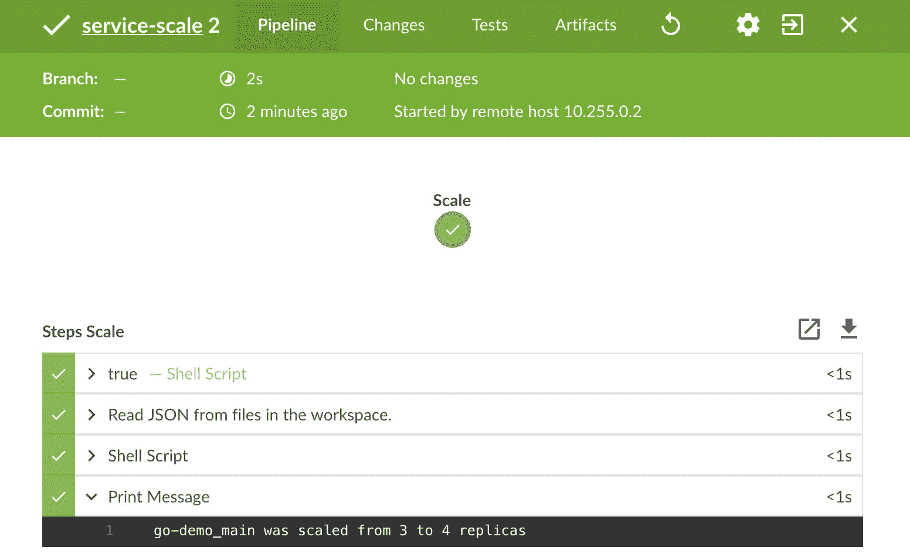
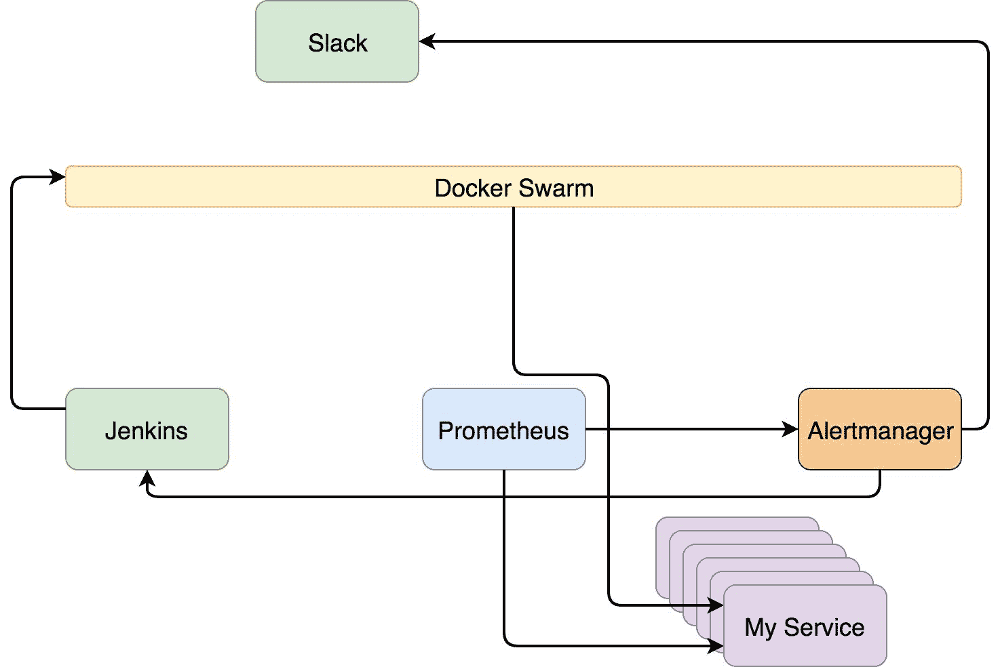
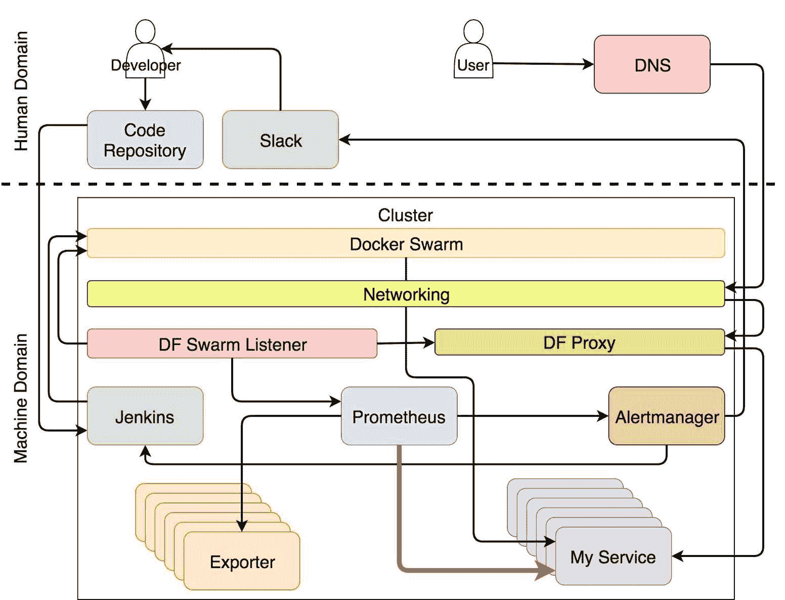

## 自适应应用于仪表化服务

[仪表化服务](https://prometheus.io/docs/practices/instrumentation/)提供比我们从[exporters](https://prometheus.io/docs/instrumenting/exporters/)抓取的更多详细指标。添加我们可能需要的所有指标的能力打开了通常由 exporters 关闭的大门。这并不意味着 exporters 就不那么有用，而是我们需要考虑我们观察的资源的性质。

硬件指标应从 exporter 中抓取。毕竟，我们无法对 CPU 进行仪表化。第三方服务是另一个很好的例子，在这些场景下，exporter 通常是更好的选择。如果我们使用数据库，我们应该寻找一个从中获取指标并将其转换为 Prometheus 友好格式的 exporter。代理、网关以及几乎所有其他非我们开发的服务也应如此。

如果我们已经投入了大量时间实现不符合 Prometheus 格式的指标，我们甚至可以选择为我们控制的服务[编写一个 exporter](https://prometheus.io/docs/instrumenting/writing_exporters/)。

Exporter 只能帮助我们走一半的路。我们可以指示系统根据内存使用情况进行扩展。[cAdvisor](https://github.com/google/cadvisor)提供有关集群内运行的容器的信息，但它提供的指标过于通用，无法获取服务特定的数据。无法针对每个服务进行指标微调，导致我们只能使用基本的警报，信息不足。仪表化填补了这一缺失的拼图。

在我们愿意投入时间对服务进行仪表化的情况下，结果是令人印象深刻的。我们可以在不做妥协的情况下获得所需的一切。我们可以完成几乎任何细节层级的任务，并以一种能够编写可靠警报的方式对服务进行仪表化，这些警报将以系统所需的所有信息通知系统。结果是向自愈更近了一步，更重要的是，向自适应更近了一步。我将自适应归为“更重要”的原因在于，自愈问题已经大部分通过其他工具解决了。调度程序（例如 Docker Swarm）已经在自愈服务方面做得相当好。如果我们排除硬件范围，我们剩下的最大障碍是服务的自适应性。

### 设定目标

我们需要定义通过仪表化想要实现的目标范围。我们将通过限制自己只关注一个目标来保持目标的简洁。如果服务的响应时间超过上限，我们将扩大其规模；如果低于下限，我们将缩小其规模。任何其他警报都将导致通知发送到 Slack。并不意味着 Slack 通知应该永远存在。相反，它们应该被视为一种临时解决方案，直到我们找到将手动修正操作转化为由系统执行的自动响应的方法。

一个经常手动处理的警报的好例子是错误响应（状态码 500 及以上）。当它们在指定的时间段内达到某个阈值时，我们会发送警报。它们会导致 Slack 通知，并成为待处理任务交给人工。一个内部规则应该是先修复问题，评估问题发生的原因，并编写一个脚本来重复相同的步骤。有了这样的脚本，如果相同的警报再次触发，我们就可以指示系统执行相同的操作。通过这种方法，我们（人类）可以将时间花费在解决意外问题上，把机器交给那些反复出现的问题。

我们将尝试完成的目标总结如下。

+   定义服务的最大响应时间并创建将其扩展的流程。

+   定义服务的最小响应时间并创建将其缩减的流程。

+   基于状态码 500 及以上的响应定义阈值，并发送 Slack 通知。

请注意，响应时间阈值不能仅依赖于毫秒。我们必须定义分位数、速率以及其他一些因素。此外，我们需要设置服务的最小和最大副本数量。否则，我们可能会面临无限扩展或缩减到零副本的风险。一旦我们开始实施系统，就可以查看这些额外的需求是否足够，或者是否需要进一步扩展范围。

说的够多了，接下来让我们进入实际的主题探索。

一如既往，第一步是创建一个集群并部署一些服务。

### 创建集群并部署服务

你知道该怎么做。我们将创建一个 Swarm 集群，并部署一些我们已经熟悉的栈。完成后，我们将拥有进行任务探索所需的基础。

```
`1` chmod +x scripts/dm-swarm-12.sh
`2` 
`3` ./scripts/dm-swarm-12.sh
`4` 
`5` `eval` `$(`docker-machine env swarm-1`)`
`6` 
`7` docker stack ls 
```

```````````````````````````````````````````````````````````` We created the cluster and deployed three stacks. The output of the last command gives us the list of those stacks.    ``` `1` NAME                SERVICES `2` monitor             3 `3` proxy               2 `4` jenkins             2  ```   ``````````````````````````````````````````````````````````` Now we’re ready to explore how to scrape metrics from instrumented services.    ### Scraping Metrics From Instrumented Services    The [go-demo](https://github.com/vfarcic/go-demo) service is already instrumented with a few metrics. However, they do not mean much by themselves. Their usage starts only once Prometheus scrapes them. Even then, they provide only a visual representation and the ability to query them after we find a problem. The major role of graphs and the capacity to query metrics comes after we detect an issue and we want to drill deeper into it. But, before we get there, we need to set up alerts that will notify us that there is a problem.    We cannot think about metrics before we have some data those metrics will evaluate. So, we’ll start from the beginning and explore how to let Prometheus know that metrics are coming from services we instrumented. That should be a relatively easy thing to accomplish since we already have all the tools and processes we need.    Let’s start by deploying the `go-demo` stack. The `main` service inside it is already instrumented and provides the `/metrics` endpoint Prometheus can query.    ``` `1` docker stack deploy `\` `2 `    -c stacks/go-demo-instrument.yml `\` `3 `    go-demo  ```   `````````````````````````````````````````````````````````` We can use the time Swarm needs to initialize the replicas of the stack and explore the YAML file. The definition of the [go-demo-instrument.yml](https://github.com/vfarcic/docker-flow-monitor/blob/master/stacks/go-demo-instrument.yml) stack is as follows (limited to relevant parts).    ```  `1` ...  `2`  main:  `3`    ...  `4`    networks:  `5`      ...  `6`      - monitor  `7`    deploy:  `8`      ...  `9`      labels: `10 `        - com.df.notify=true `11 `        ... `12 `        - com.df.scrapePort=8080 `13 `      ...  ```   ````````````````````````````````````````````````````````` We used `com.df.notify=true` label to let *Docker Flow Swarm Listener* know that it should notify *Docker Flow Monitor*. The `com.df.scrapePort` is set to `8080` thus letting Prometheus know the port it should use to scrape metrics. The `monitor` network is added to the stack. Since *Docker Flow Monitor* is attached to the same network, they will be able to communicate internally by using service names.    Let’s confirm that *Docker Flow Monitor* configured Prometheus correctly.    ``` `1` open `"http://``$(`docker-machine ip swarm-1`)``/monitor/config"`  ```   ```````````````````````````````````````````````````````` As you can see, `job_name` is set to the name of the service (`go-demo_main`). The `names` argument is set to `tasks.go-demo_main`. When service DNS is prefixed with `tasks.`, Overlay network returns IPs of all the replicas. That way, Prometheus will be able to scrape metrics from all those that form the `go-demo_main` service.    Figure 12-1: Prometheus configuration with the go-demo_main job    Before we proceed, please confirm that all the replicas of the services that form the `go-demo` stack are up-and-running.    ``` `1` docker stack ps `\` `2 `    -f desired-state`=`Running go-demo  ```   ``````````````````````````````````````````````````````` The output should show three replicas of `go-demo_main` and one replica of `go-demo_db` services with the current state `running`. If that’s not the case, please wait a while longer.    The output should be similar to the one that follows (IDs are removed for brevity).    ```  `1` NAME           IMAGE                  NODE    DESIRED STATE CURRENT STATE       \  `2`       ERROR PORTS  `3` go-demo_main.1 vfarcic/go-demo:latest swarm-2 Running       Running about a minu\  `4` te ago  `5` go-demo_db.1   mongo:latest           swarm-1 Running       Running about a minu\  `6` te ago  `7` go-demo_main.2 vfarcic/go-demo:latest swarm-2 Running       Running about a minu\  `8` te ago  `9` go-demo_main.3 vfarcic/go-demo:latest swarm-3 Running       Running about a minu\ `10` te ago  ```   `````````````````````````````````````````````````````` Now we can verify that all the targets (replicas) are indeed registered.    ``` `1` open `"http://``$(`docker-machine ip swarm-1`)``/monitor/targets"`  ```   ````````````````````````````````````````````````````` As you can see, Prometheus registered three targets that correspond to three replicas of the service. Now we know that it scrapes metrics from all of them and can explore different ways to query data.    Figure 12-2: Prometheus targets that correspond with the replicas of the go-demo_main service    If we focus only on scraping instrumented services, the process can be described with a simple diagram from the figure 12-3.    Figure 12-3: Prometheus scrapes metrics from services    ### Querying Metrics From Instrumented Services    Let’s open the Prometheus *graph* screen and explore different ways to query metrics scraped from the `go-demo_main` service.    ``` `1` open `"http://``$(`docker-machine ip swarm-1`)``/monitor/graph"`  ```   ```````````````````````````````````````````````````` Please click the *Graph* tab, enter the query that follows, and click the *Execute* button    ``` `1` http_server_resp_time_sum / http_server_resp_time_count  ```   ``````````````````````````````````````````````````` We divided the summary of response times with the count of the requests. You’ll notice that the output graph shows that the average value is close to zero. Feel free to hover over one of the lines and observe that the values are only a few milliseconds. The `go-demo_main` service pings itself periodically and the responses are very fast.    We should generate some slower responses since the current result does not show metrics in their true glory.    The `/demo/hello` endpoint of the service can be supplemented with the `delay` parameter. When set to a value in milliseconds, the service will wait for the given period before responding to the request. Since we want to demonstrate a variety of response times, we should send a few requests with different `delay` values.    The commands that will send thirty requests with random delays are as follows.    ``` `1` `for` i in `{``1`..30`}``;` `do` `2 `    `DELAY``=`$`[` `$RANDOM` % `6000` `]` `3 `    curl `"http://``$(`docker-machine ip swarm-1`)``/demo/hello?delay=``$DELAY``"` `4` `done`  ```   `````````````````````````````````````````````````` The delay of each of the thirty requests was set to a random value between zero and six thousand milliseconds. Now we should have more variable metrics we can explore.    Please write the query that follows in the *Expression* field and click the *Execute* button.    ``` `1` http_server_resp_time_sum / http_server_resp_time_count  ```   ````````````````````````````````````````````````` This time you should see a graph with more differentiating response times. You should note that the response times you’re seeing are a combination of those we sent (with up to six seconds delay) and fast pings that the service executes periodically.    The previous query is not enough, and we should add a few functions into the mix.    We’ll add `rate`. It calculates per-second average rate of increase of the time series in the range vector.    We’ll also limit the metrics to the last five minutes. While that does not make much of a difference when presenting data in a graph, it is crucial for defining alerts. Since they are our ultimate goal while we’re working with Prometheus, we should get used to such limits from the start.    Please write the query that follows in the *Expression* field and click the *Execute* button.    ``` `1` rate(http_server_resp_time_sum[5m]) / rate(http_server_resp_time_count[5m])  ```   ```````````````````````````````````````````````` Since we are trying to define queries we’ll use in alerts, we might want to limit the results only to a single service.    The expression limited to `go-demo_main` service is as follows.    ``` `1` rate(http_server_resp_time_sum{service="go-demo"}[5m]) / rate(http_server_resp_t\ `2` ime_count{service="go-demo"}[5m])  ```   ``````````````````````````````````````````````` The graph output of the last query should show a spike in response times of each of the three replicas. That spike corresponds to the thirty requests we created with the `delay` parameter.    Figure 12-4: Prometheus graph with response duration spike    The `service` label comes from instrumentation. It is hard-coded to `go-demo` and, therefore, not very reliable. If we would be confident that there will be only one instance of that service, we could continue using that label as one of the filters. However, that might not be the case. Even though it is likely we’ll use only one instance of the `go-demo` service in production, we might still run the same service as part of testing or some other processes. That would produce incorrect query results since we would be combining different instances of the service and potentially get unreliable data. Instead, it might be a better idea to use the `job` label.    The `job` label comes out-of-the-box with all metrics scraped by Prometheus. It corresponds to the `job_name` specified in the `scrape` section of the configuration. Since *Docker Flow Monitor* uses the “real” name of the service to register scraping target, it is always unique. That fixes one of our problems since we cannot have two services with the same name inside a single cluster. In our case, the full name of the service is the combination of the name of the stack and the name of the service defined in that YAML file. Since we deployed `go-demo` stack with the service `main`, the full name of the service is `go-demo_main`.    If we’d like to see metrics of all the services that provide instrumentation with the metric name `http_server_resp_time`, the query would be as follows.    ``` `1` sum(rate(http_server_resp_time_sum[5m])) by (job) / sum(rate(http_server_resp_ti\ `2` me_count[5m])) by (job)  ```   `````````````````````````````````````````````` Since we used `sum` to summarize data `by` `job`, each line represents a different service. That is not so obvious from the current graph since we are scraping metrics from only one service, so you’ll need to trust me on this one. If we’d have metrics from multiple services, each would get its line in the graph.    That must be it. Doesn’t it? We have an average response time for each job (service) as measured over last five minutes. Unfortunately, even though such expressions might be useful when watching graphs, they have little value when used for alerts. It might be even dangerous to instruct the system to do some corrective actions based on such an alert.    Let’s say that we create an alert defined as follows.    ``` `1` sum(rate(http_server_resp_time_sum[5m])) by (job) / sum(rate(http_server_resp_ti\ `2` me_count[5m])) by (job) > 0.1  ```   ````````````````````````````````````````````` It will fire if average response time is over one hundred milliseconds (0.1 seconds). Now let us imagine that nine out of ten responses are around ten milliseconds while one out of ten lasts for five hundred milliseconds (half a second). The above alert would not fire in such a scenario since the average is 59 milliseconds, which is still way below the 100 milliseconds alert threshold. As a result, we would never know that there is a problem experienced by ten percent of those who invoke this service.    Rejection of the above mentioned alert definition might lead you to write something simpler. The new alert could be as follows.    ``` `1` http_server_resp_time_sum > 0.25  ```   ```````````````````````````````````````````` If there is a request that lasted longer than the threshold, fire an alert. We even increased the threshold from `0.1` to `0.25` seconds. While I do like the simplicity of that alert, it is even worse than the one with average response time. It would be enough to have one request that passed the threshold to fire an alert and, potentially, initiate the process that would scale the number of replicas of that service. What if there were a million other responses that were way below that threshold. The alert would still fire and probably produce undesirable consequences. Do we really care that one out of million responses is slow?    The problem is that we were focused on averages. While there is value in them, they derailed us from creating a query that we could use to create a useful alert. Instead, we should focus on percentages. A better goal would be to construct an expression that would give us the percentage of requests that are above the certain threshold.    The new query is as follows.    ``` `1` sum(rate(http_server_resp_time_bucket{le="0.1"}[5m])) by (job) / sum(rate(http_s\ `2` erver_resp_time_count[5m])) by (job)  ```   ``````````````````````````````````````````` The first part of the expression returns summary of the number of requests that are in the `0.1` bucket. In other words, it retrieves all the requests that are equal to or faster than `0.1` second. Further on, we are dividing that result with the summary of all the requests. The result is the percentage of requests that are below the `0.1` seconds threshold.    Figure 12-5: Prometheus graph with percentage of response times below 0.1 second threshold    If you do not see a drop in the percentage of requests, the likely cause is that more than one hour passed since you executed thirty requests with the delay. If that’s the case, please rerun the commands that follow and, after that, re-execute the expression.    ``` `1` `for` i in `{``1`..30`}``;` `do` `2 `    `DELAY``=`$`[` `$RANDOM` % `6000` `]` `3 `    curl `"http://``$(`docker-machine ip swarm-1`)``/demo/hello?delay=``$DELAY``"` `4` `done`  ```   `````````````````````````````````````````` That was an expression worthy of an alert. We could use it to create something similar to a *service license agreement*. The alert would fire if, for example, less than 0.999 (99.9%) responses are below the defined time-based threshold. The only thing missing is to limit the output of the expression to the `go-demo_main` service.    ``` `1` sum(rate(http_server_resp_time_bucket{job="go-demo_main",le="0.1"}[5m])) / sum(r\ `2` ate(http_server_resp_time_count{job="go-demo_main"}[5m]))  ```   ````````````````````````````````````````` Let’s try to explore at least one more example.    Among others, the `http_server_resp_time` metric has the `code` label that contains status codes of the responses. We can use that information to define an expression that will retrieve the number of requests that produced an error. Since we are returning standard [HTTP response codes](https://en.wikipedia.org/wiki/List_of_HTTP_status_codes), we can filter metrics so that only those with the `code` label that starts with `5` are retrieved.    Before we start filtering metrics in search for errors, we should generate some requests that do result in error responses.    ``` `1` `for` i in `{``1`..100`}``;` `do` `2 `    curl `"http://``$(`docker-machine ip swarm-1`)``/demo/random-error"` `3` `done`  ```   ```````````````````````````````````````` We sent a hundred requests to the `/demo/random-error` endpoint. Approximately one out of ten requests resulted in error responses.    The expression that follows will retrieve the rate of error responses over the period of five minutes.    ``` `1` sum(rate(http_server_resp_time_count{code=~"⁵..$"}[5m])) by (job)  ```   ``````````````````````````````````````` The total number does not mean much unless you plan on sending an alert every time an error occurs. Such an action would likely result in too many alerts, and you’d run a risk of developing high-tolerance and start ignoring them. That’s not the way to go. Instead, we should use a similar approach as with response times. We’ll calculate the rate by dividing the number of errors with the total number of responses.    ``` `1` sum(rate(http_server_resp_time_count{code=~"⁵..$"}[5m])) by (job) / sum(rate(ht\ `2` tp_server_resp_time_count[5m])) by (job)  ```   `````````````````````````````````````` That would be an useful alert that could be fired if the number is higher than some threshold.    Figure 12-6: Prometheus graph with error rate percentage    Now that we defined two sets of expressions, we can take a step further and convert them into alerts.    ### Firing Alerts Based On Instrumented Metrics    Now that we have a solid understanding of some of the expressions based on instrumented metrics, we can proceed and apply that knowledge to create a few alerts.    Let us deploy updated version of the `go-demo` stack.    ``` `1` docker stack deploy `\` `2 `    -c stacks/go-demo-instrument-alert.yml `\` `3 `    go-demo  ```   ````````````````````````````````````` We’ll take a couple of moments to discuss the changes to the updated stack while waiting for the services to become operational. The stack definition, limited to relevant parts, is as follows.    ```  `1` ...  `2`  main:  `3`    ...  `4`    deploy:  `5`      ...  `6`      labels:  `7`        ...  `8`        - com.df.alertName.1=mem_limit  `9`        - com.df.alertIf.1=@service_mem_limit:0.8 `10 `        - com.df.alertFor.1=5m `11 `        - com.df.alertName.2=resp_time `12 `        - com.df.alertIf.2=sum(rate(http_server_resp_time_bucket{job="go-demo_ma\ `13` in", le="0.1"}[5m])) / sum(rate(http_server_resp_time_count{job="go-demo_main"}[\ `14` 5m])) < 0.99 `15 `        - com.df.alertLabels.2=scale=up,service=go-demo_main `16 `        - com.df.scrapePort=8080 `17 `        - com.df.scaleMin=2 `18 `        - com.df.scaleMax=4 `19 `      ...  ```   ```````````````````````````````````` The `com.df.alertName` label was present in the previous stack. However, since specifying memory limit is not enough anymore, we added an index suffix (`.1`) that allows us to specify multiple alerts. The same `.1` suffix was added to the rest of labels that form that alert.    The second alert will fire if the number of the responses in the `0.1` bucket (equal to or below 100 milliseconds) is smaller than 99% of all the requests. The rate is measured over the period of five minutes and the results are restricted to the job `go-demo_main`. The `if` statement we used is as follows.    ``` `1` sum(rate(http_server_resp_time_bucket{job="go-demo_main", le="0.1"}[5m])) / sum(\ `2` rate(http_server_resp_time_count{job="go-demo_main"}[5m])) < 0.99  ```   ``````````````````````````````````` Since we are measuring the percentage of requests, there’s no real need to set `for` statement. As soon as more than one percent of requests result in response times over 100 milliseconds, the alert will be fired. Later on we’ll discuss what should be done with such an alert. For the moment, we’ll limit the scope and let Alertmanager forward all alerts to Slack.    We also added `scale=up` and `service=go-demo_main` alert labels. Later on, the `scale` label will help the system know whether it should scale up or down.    Finally, we used `com.df.scaleMin` and `com.df.scaleMax` labels to specify the minimum and the maximum number of replicas allowed for this service. We won’t use those labels just yet. Just remember that they are defined.    Next, we’ll repeat the commands that will create slow responses and verify that the alerts are indeed fired. But, before we do that, we’ll open the Prometheus’ alert screen and confirm that the new alert is indeed registered.    ``` `1` open `"http://``$(`docker-machine ip swarm-1`)``/monitor/alerts"`  ```   `````````````````````````````````` The *godemo_main_resp_time* row should be green meaning that the alert is registered but that the condition is not met. In other words, at least 99% of responses were generated in 100 milliseconds or less.    Now we can truly test the alert. Let’s generate some slow responses.    ``` `1` `for` i in `{``1`..30`}``;` `do` `2 `    `DELAY``=`$`[` `$RANDOM` % `6000` `]` `3 `    curl `"http://``$(`docker-machine ip swarm-1`)``/demo/hello?delay=``$DELAY``"` `4` `done`  ```   ````````````````````````````````` You already executed those commands at least once so there should be no reason to explain what happened. Instead, we’ll go back to the *alerts* screen and confirm that the alert is indeed firing.    ``` `1` open `"http://``$(`docker-machine ip swarm-1`)``/monitor/alerts"`  ```   ```````````````````````````````` The *godemo_main_resp_time* should be red. If it isn’t, please wait a few moments and refresh the screen. Feel free to click it if you’d like to see the definition of the alert.    Figure 12-7: Prometheus alert in firing state    Please visit the *#df-monitor-tests* channel inside [devops20.slack.com](https://devops20.slack.com/). You should see the *[FIRING] go-demo_main service is in danger!* message.    The process, so far, can be described through the diagram in figure 12-8.    Figure 12-8: Alerts that result in Slack notifications    That worked out quite well. When slow responses start piling up, we’ll get a Slack notification letting us know that we should enter the cluster and scale the service. The only problem is that we should not waste our time with such operations. We should let the system scale up automatically.    ### Scaling Services Automatically    With the alerts firing from Prometheus into Alertmanager, the only thing left to do is to send requests to Jenkins to scale the service. We already created a similar Alertmanager config in one of the previous chapters, so we’ll comment only on a few minor differences. The configuration is injected into the `alert-manager` service as a Docker secret.    Since secrets are immutable, we cannot update the one that is currently used. Instead, we’ll have to remove the stack and the secret and create them again.    ``` `1` docker stack rm monitor `2`  `3` docker secret rm alert_manager_config  ```   ``````````````````````````````` Now we can create a new secret with the updated Alertmanager configuration.    ```  `1` `echo` `"route:`  `2``  group_by: [service,scale]`  `3``  repeat_interval: 5m`  `4``  group_interval: 5m`  `5``  receiver: 'slack'`  `6``  routes:`  `7``  - match:`  `8``      service: 'go-demo_main'`  `9``      scale: 'up'` `10 ``    receiver: 'jenkins-go-demo_main-up'` `11`  `12` `receivers:` `13 ``  - name: 'slack'` `14 ``    slack_configs:` `15 ``      - send_resolved: true` `16 ``        title: '[{{ .Status | toUpper }}] {{ .GroupLabels.service }} service is \` `17` `in danger!'` `18 ``        title_link: 'http://``$(`docker-machine ip swarm-1`)``/monitor/alerts'` `19 ``        text: '{{ .CommonAnnotations.summary}}'` `20 ``        api_url: 'https://hooks.slack.com/services/T308SC7HD/B59ER97SS/S0KvvyStV\` `21` `nIt3ZWpIaLnqLCu'` `22 ``  - name: 'jenkins-go-demo_main-up'` `23 ``    webhook_configs:` `24 ``      - send_resolved: false` `25 ``        url: 'http://``$(`docker-machine ip swarm-1`)``/jenkins/job/service-scale/buil\` `26` `dWithParameters?token=DevOps22&service=go-demo_main&scale=1'` `27` `"` `|` docker secret create alert_manager_config -  ```   `````````````````````````````` Remember that the gist with all the commands from this chapter is available from [12-alert-instrumentation.sh](https://gist.github.com/vfarcic/8bafbe912f277491eb2ce6f9d29039f9). Use it to copy and paste the command if you got tired of typing.    The difference, when compared with the similar configuration we used before, is the `scale` label and a subtle change in the Jenkins receiver name. This time we are not grouping routes based only on `service` but with the combination of the labels `service` and `scale`. Even though we are, at the moment, focused only on scaling up, soon we’ll try to add another alert that will de-scale the number of replicas. While we would accomplish the current objective without the `scale` label, it might be a good idea to be prepared for what’s coming next.    This time, the `match` section uses a combination of both `service` and `scale` labels. If they are set to `go-demo_main` and `up`, the alert will be forwarded to the `jenkins-go-demo_main-up` receiver. Any other combination will be sent to Slack. The `jenkins-go-demo_main-up` receiver is triggering a build of the Jenkins job `service-scale` with a few parameters. It contains the authentication token, the name of the service that should be scaled, and the increment in the number replicas.    The `repeat_interval` is set to five minutes. Alertmanager will send a new notification every five minutes (plus the `group_interval`) unless the problem is fixed and Prometheus stops firing alerts. That is almost certainly not the value you should use in production. One hour (`1h`) is a much more reasonable period. However, I’d like to avoid making you wait for too long so, in this case, it’s set to five minutes (`5m`).    Let us deploy the stack with the new secret.    ``` `1` `DOMAIN``=``$(`docker-machine ip swarm-1`)` `\` `2 `    docker stack deploy `\` `3 `    -c stacks/docker-flow-monitor-slack.yml `\` `4 `    monitor  ```   ````````````````````````````` There’s only one thing missing before we see the alert in its full glory. We need to run the Jenkins job manually. The first build will fail due to a bug we already experienced in one of the previous chapters.    Please open the `service-scale` activity screen.    ``` `1` open `"http://``$(`docker-machine ip swarm-1`)``/jenkins/blue/organizations/jenkins/ser\` `2` `vice-scale/activity"`  ```   ```````````````````````````` You’ll have to login with `admin` as both username and password. Afterward, click the *Run* button and observe the failure. The issue is that Jenkins was not aware that the job uses a few parameters. After the first run, it’ll get that information, and the job should not fail again. If it does, it’ll be for a different reason.    The `go-demo_main` service should have three replicas. Let’s double-check that.    ``` `1` docker stack ps `\` `2 `    -f desired-state`=`Running go-demo  ```   ``````````````````````````` The output should be similar to the one that follows (ID are removed for brevity).    ```  `1` NAME           IMAGE                  NODE    DESIRED STATE CURRENT STATE       \  `2`   ERROR PORTS  `3` go-demo_main.1 vfarcic/go-demo:latest swarm-1 Running       Running 42 minutes a\  `4` go  `5` go-demo_db.1   mongo:latest           swarm-3 Running       Running 42 minutes a\  `6` go  `7` go-demo_main.2 vfarcic/go-demo:latest swarm-3 Running       Running 42 minutes a\  `8` go  `9` go-demo_main.3 vfarcic/go-demo:latest swarm-1 Running       Running 42 minutes a\ `10` go  ```   `````````````````````````` Before we proceed, please make sure that all replicas of the `monitor` stack are up and running. You can use `docker stack ps monitor` command to check the status.    Now we can send requests that will produce delayed responses and open the Prometheus *alerts* screen.    ``` `1` `for` i in `{``1`..30`}``;` `do` `2 `    `DELAY``=`$`[` `$RANDOM` % `6000` `]` `3 `    curl `"http://``$(`docker-machine ip swarm-1`)``/demo/hello?delay=``$DELAY``"` `4` `done` `5`  `6` open `"http://``$(`docker-machine ip swarm-1`)``/monitor/alerts"`  ```   ````````````````````````` The *godemo_main_resp_time* alert should be red. If it is not, please wait a few moments and refresh the screen.    Prometheus fired the alert to Alertmanager which, in turn, notified Jenkins. As a result, we should see a new build of the `service-scale` job.    ``` `1` open `"http://``$(`docker-machine ip swarm-1`)``/jenkins/blue/organizations/jenkins/ser\` `2` `vice-scale/activity"`  ```   ```````````````````````` Please click on the latest build. It should be green with the output of the last task set to `go-demo_main` was scaled from 3 to 4 replicas.    Figure 12-9: A build of a Jenkins job that scales Docker services    We should confirm that Jenkins indeed did the work it was supposed to do. The number of replicas of the `go-demo_main` service should be four.    ``` `1` docker stack ps `\` `2 `    -f desired-state`=`Running go-demo  ```   ``````````````````````` The output of the `stack ps` command is as follows (IDs are removed for brevity).    ```  `1` NAME           IMAGE                  NODE    DESIRED STATE CURRENT STATE       \  `2`      ERROR PORTS  `3` go-demo_main.1 vfarcic/go-demo:latest swarm-1 Running       Running about an hou\  `4` r ago  `5` go-demo_db.1   mongo:latest           swarm-2 Running       Running about an hou\  `6` r ago  `7` go-demo_main.2 vfarcic/go-demo:latest swarm-2 Running       Running about an hou\  `8` r ago  `9` go-demo_main.3 vfarcic/go-demo:latest swarm-3 Running       Running about an hou\ `10` r ago `11` go-demo_main.4 vfarcic/go-demo:latest swarm-3 Running       Running 2 minutes ago  ```   `````````````````````` Since we stopped simulating slow responses, the alert in Prometheus should turn into green. Otherwise, if Prometheus would continue firing the alert, Alertmanager would send another notification to Jenkins ten minutes later. Since the service has the `com.df.scaleMax` label set to four, Jenkins job would not scale the service. Instead, it would send a notification to Slack so that we (humans) can deal with the problem.    Let’s remove the stack and the secret and work on Alertmanager configuration that will also de-scale services.    ``` `1` docker stack rm monitor `2`  `3` docker secret rm alert_manager_config  ```   ````````````````````` The command that creates a new secret is as follows.    ```  `1` `echo` `"route:`  `2``  group_by: [service,scale]`  `3``  repeat_interval: 5m`  `4``  group_interval: 5m`  `5``  receiver: 'slack'`  `6``  routes:`  `7``  - match:`  `8``      service: 'go-demo_main'`  `9``      scale: 'up'` `10 ``    receiver: 'jenkins-go-demo_main-up'` `11 ``  - match:` `12 ``      service: 'go-demo_main'` `13 ``      scale: 'down'` `14 ``    receiver: 'jenkins-go-demo_main-down'` `15`  `16` `receivers:` `17 ``  - name: 'slack'` `18 ``    slack_configs:` `19 ``      - send_resolved: true` `20 ``        title: '[{{ .Status | toUpper }}] {{ .GroupLabels.service }} service is \` `21` `in danger!'` `22 ``        title_link: 'http://``$(`docker-machine ip swarm-1`)``/monitor/alerts'` `23 ``        text: '{{ .CommonAnnotations.summary}}'` `24 ``        api_url: 'https://hooks.slack.com/services/T308SC7HD/B59ER97SS/S0KvvyStV\` `25` `nIt3ZWpIaLnqLCu'` `26 ``  - name: 'jenkins-go-demo_main-up'` `27 ``    webhook_configs:` `28 ``      - send_resolved: false` `29 ``        url: 'http://``$(`docker-machine ip swarm-1`)``/jenkins/job/service-scale/buil\` `30` `dWithParameters?token=DevOps22&service=go-demo_main&scale=1'` `31 ``  - name: 'jenkins-go-demo_main-down'` `32 ``    webhook_configs:` `33 ``      - send_resolved: false` `34 ``        url: 'http://``$(`docker-machine ip swarm-1`)``/jenkins/job/service-scale/buil\` `35` `dWithParameters?token=DevOps22&service=go-demo_main&scale=-1'` `36` `"` `|` docker secret create alert_manager_config -  ```   ```````````````````` We added an additional route and a receiver. Both are very similar to their counterparts in charge of scaling up. The only substantial difference is that the route match now looks for `scale` label with the value `down` and that a Jenkins build is invoked with `scale` parameter set to `-1`. As I mentioned earlier in one of the previous chapters, it is unfortunate that we need to produce so much duplication. But, since webhook `url` cannot be parametrized, we need to hard-code each combination. I would encourage you, dear reader, to contribute to Alertmanager project by adding Jenkins receiver. Until then, repetition of similar configuration entries is unavoidable.    Let us deploy the `monitor` stack with the new configuration injected as a Docker secret.    ``` `1` `DOMAIN``=``$(`docker-machine ip swarm-1`)` `\` `2 `    docker stack deploy `\` `3 `    -c stacks/docker-flow-monitor-slack.yml `\` `4 `    monitor  ```   ``````````````````` Please wait until the `monitor` stack is up-and-running. You can check the status of its services with `docker stack ps monitor` command.    While we’re into creating services, we’ll deploy a new definition of the `go-demo` stack as well.    ``` `1` docker stack deploy `\` `2 `    -c stacks/go-demo-instrument-alert-2.yml `\` `3 `    go-demo  ```   `````````````````` The new definition of the stack, limited to relevant parts, is as follows.    ```  `1` ...  `2`  main:  `3`    ...  `4`    deploy:  `5`      ...  `6`      labels:  `7`        ...  `8`        - com.df.alertName.3=resp_time_below  `9`        - com.df.alertIf.3=sum(rate(http_server_resp_time_bucket{job="my-service\ `10` ", le="0.025"}[5m])) / sum(rate(http_server_resp_time_count{job="my-service"}[5m\ `11` ])) > 0.75 `12 `        - com.df.alertLabels.3=scale=down,service=go-demo_main `13 `        ...  ```   ````````````````` We added a new set of labels that define the alert that will send a notification that the service should be scaled down. The expression of the alert uses a similar logic as the one we’re using to scale up. It calculates the percentage of responses that were created in twenty-five milliseconds or less. If the result is over 75 percent, the system has more replicas than it needs so it should be scaled down.    Since `go-demo` produces internal pings that are very fast, there’s no need to create fake responses. The alert will fire soon.    If you doubt the new alert, we can visit the Prometheus *alerts* screen.    ``` `1` open `"http://``$(`docker-machine ip swarm-1`)``/monitor/alerts"`  ```   ```````````````` The *godemo_main_resp_time_below* alert should be red.    Similarly, we can visit Jenkins *service-scale* job and confirm that a new build was executed.    ``` `1` open `"http://``$(`docker-machine ip swarm-1`)``/jenkins/blue/organizations/jenkins/ser\` `2` `vice-scale/activity"`  ```   ``````````````` The output of the last step says that *go-demo_main was scaled from 3 to 2 replicas*. That might sound confusing since the previous build scaled it to four replicas. However, we re-deployed the `go-demo` stack which, among other things, specifies that the number of replicas should be three.    That leads us to an important note.    Figure 12-10: A build of a Jenkins job that scales Docker services    Prometheus will continue firing alerts because the service is still responding faster than the defined lower limit. Since Alertmanager has both the `repeat_interval` and the `group_interval` set to five minutes, it will ignore the alerts until ten minutes expire. For more information about `repeat_interval` and `group_interval` options, please visit [route](https://prometheus.io/docs/alerting/configuration/#route) section of Alertmanager configuration.    Once more than ten minutes pass, it will send a build request to Jenkins. This time, since the service is already using the minimum number of replicas, Jenkins will decide not to continue de-scaling and will send a notification message to Slack.    Please visit the *#df-monitor-tests* channel inside [devops20.slack.com](https://devops20.slack.com/). Wait for a few minutes, and you should see a Slack notification stating that *go-demo_main could not be scaled*.    Specifying long `alertIf` labels can be daunting and error prone. Fortunately, *Docker Flow Monitor* provides shortcuts for the expressions we used.    Let’s deploy the `go-demo` stack one last time.    ``` `1` docker stack deploy `\` `2 `    -c stacks/go-demo-instrument-alert-short.yml `\` `3 `    go-demo  ```   `````````````` The definition of the stack, limited to relevant parts, is as follows.    ```  `1` ...  `2`  main:  `3`    ...  `4`    deploy:  `5`      ...  `6`      labels:  `7`        ...  `8`        - com.df.alertIf.1=@service_mem_limit:0.8  `9`        ... `10 `        - com.df.alertIf.2=@resp_time_above:0.1,5m,0.99 `11 `        ... `12 `        - com.df.alertIf.3=@resp_time_below:0.025,5m,0.75 `13 `      ...  ```   ````````````` This time we used shortcuts for all three alerts. `@resp_time_above:0.1,5m,0.99` was expanded into the expression that follows.    ``` `1` sum(rate(http_server_resp_time_bucket{job="my-service", le="0.1"}[5m])) / sum(ra\ `2` te(http_server_resp_time_count{job="my-service"}[5m])) < 0.99``` `3`  `4` Similarly, `@resp_time_below:0.025,5m,0.75` became the following expression.  ```   ```````````` sum(rate(http_server_resp_time_bucket{job=”my-service”, le=”0.025”}[5m])) / sum(rate(http_server_resp_time_count{job=”my-service”}[5m])) > 0.75 ```    Feel free to confirm that the alerts were correctly configured in Prometheus. They should be the same as they were before since the shortcuts expand to the same full expressions we deployed previously.    We managed to create a system that scales services depending on thresholds based on response times. It is entirely automated except if the service is already running the minimum or the maximum number of replicas. In those cases scaling probably does not help and humans need to find out what is the unexpected circumstance that generated the alerts.    We started with expected and created a fallback when unexpected happens. Next, we’ll explore the situation when we start from unexpected.    ### Sending Error Notifications To Slack    Errors inside our code usually fall into two groups.    There are those we are throwing to the caller function because we do not yet know how to handle it properly, or we are too lazy to implement proper recuperation from such a failure. For example, we might implement a function that reads files from a directory and returns an error if that fails. In such a case we might want to get a notification when the error occurs and do some actions to fix it. After evaluating the problem, we might find out that the directory we’re reading does not exist. Apart from the obvious fix to create the missing directory (immediate response), we should probably modify our code so that the directory is created as a result of receiving such an error. Even better, we should probably extend our code to check whether the directory exists before reading the files from it. Errors such as those fall into “I did not expect it the first time it happened, but it will not happen again” type of situations. There’s nothing we would need to do outside the service. The solution depends entirely on code modifications.    Another common type of errors is related to problems with communication with other services. For example, we might get a notification that there was an error establishing communication with a database. The first action should be to fix the problem (restore DB connection). After that, we should create another set of alerts that will monitor the database itself and execute some corrective steps to fix the issue. Those metrics should not be inside the service that communicates with the database but probably coming from an exporter that is specialized with that particular database. If such an exporter does not exist, database probably has some metrics that could be transformed into Prometheus format. The alternative approach would be to ping the database periodically. We might be able to use [Blackbox exporter](https://github.com/prometheus/blackbox_exporter) for that. If none of those options is applicable to your database, you might need to evaluate whether it is worth using something that does not have exporter, not it has metrics, nor it can be pinged.    The examples we explored do not warrant the effort of making anything more complicated than a simple notification to Slack. Self-adaptation does not apply, and self-healing depends on your code more than anything else.    Let us take a look at a few examples.    We’ll continue using metrics coming from instrumentation added to the `go-demo` service. In the previous chapter you already saw the metrics with errors based on response codes, so let’s deploy the updated stack with the labels that will add a new alert to *Docker Flow Monitor*.    ``` `1` docker stack deploy `\` `2 `    -c stacks/go-demo-instrument-alert-error.yml `\` `3 `    go-demo  ```   ``````````` The definition of the stack, limited to relevant parts, is as follows.    ```  `1` ...  `2`  main:  `3`    ...  `4`    deploy:  `5`      ...  `6`      labels:  `7`        ...  `8` #        - com.df.alertName.3=resp_time_below  `9` #        - com.df.alertIf.3=@resp_time_below:0.025,5m,0.75 `10 `        - com.df.alertName.3=erro_rrate `11 `        - com.df.alertIf.3=sum(rate(http_server_resp_time_count{job="go-demo_mai\ `12` n", code=~"⁵..$$"}[5m])) / sum(rate(http_server_resp_time_count{job="go-demo_ma\ `13` in"}[5m])) > 0.001 `14 `        - com.df.alertLabels.3=service=go-demo_main,type=errors `15 `        - com.df.alertAnnotations.3=summary=Error rate is too high,description=D\ `16` o something or start panicking `17 `      ...  ```   `````````` We commented the `resp_time_below` alert because it would only create noise. Without “real” traffic, responses are too fast, and Prometheus would continuously fire alerts that would only derail us from the task at hand.    The new alert is as follows.    ``` `1` sum(rate(http_server_resp_time_count{job="go-demo_main", code=~"⁵..$$"}[5m])) /\ `2 ` sum(rate(http_server_resp_time_count{job="go-demo_main"}[5m])) > 0.001  ```   ````````` It takes the summary of all response time counts filtered by response codes that start with `5`. That envelops all service side errors. That number is divided with the count of all responses thus giving us the percentage of requests that failed due to server errors. The alert will fire if the result is greater than `0.001` (0.1%). In other words, Prometheus will fire the alert if more than 0.1% of responses result in server side errors.    If you tried to write a similar alert, your first thought might have been to send an alert whenever there is an error. Don’t do that! It would probably result in spam since errors are an unavoidable part of what we do. The real goal is not to be notified the system produces an error but when the rate of errors surpasses some threshold. Those thresholds will differ from one service to another. In out case, it is set to 0.1%. That does not mean that alerts should never fire after a single error. In some cases, they should. But this is not one of those. The service will produce errors, and we want to know when there are too many of them and thus discard a temporary problem or something that happened only once, but it will not repeat.    One thing you should note is that inside stack YML definition, dollar signs (`$`) need to be escaped with another dollar. For that reason, the part of the regular expression that should be `⁵..$` is defined as `⁵..$$`.    Let us open the Prometheus’ alert screen and confirm that the new alert is indeed registered.    ``` `1` open `"http://``$(`docker-machine ip swarm-1`)``/monitor/alerts"`  ```   ```````` Among others, there should be the *godemo_main_error_rate* alert marked as green thus indicating that the percentage of server error rate is below 0.1%.    We do not need to change Alertmanager configuration. It is already configured to send all alerts to Slack unless they match one of the routes.    Let us generate a few responses with fake errors and see whether the system works.    ``` `1` `for` i in `{``1`..100`}``;` `do` `2 `    curl `"http://``$(`docker-machine ip swarm-1`)``/demo/random-error"` `3` `done`  ```   ``````` Around ten out of those hundred requests should result in errorred responses. That’s just enough to confirm that the alerts work as expected.    Let’s go back to the alerts screen.    ``` `1` open `"http://``$(`docker-machine ip swarm-1`)``/monitor/alerts"`  ```   `````` This time *godemo_main_error_rate* should be red indicating that Prometheus fired it to Alertmanger which, in turn, sent a Slack notification. Please visit the *#df-monitor-tests* channel inside [devops20.slack.com](https://devops20.slack.com/) and confirm that the notification was indeed sent. The message should say *[FIRING] go-demo_main service is in danger!*.    If this would not be a simulation, your immediate action should be to go back to Prometheus and query metrics in search of the cause of the problem. The expression could be as follows.    ``` `1` sum(rate(http_server_resp_time_count{job="go-demo_main", code=~"⁵..$$"}[5m])) b\ `2` y (path)  ```   ````` By grouping data by path, we can discover which one generated those errors and relate it to the code that is in charge of that path. That would get us a step closer to the discovery of the cause of he problem. The rest would greatly differ from one case to another. Maybe we’d need to consult logs, make more queries in Prometheus, find out which node is causing the problem, correlate data with network information, and so on and so forth. No one can give you exact set of steps that should be followed in all cases. The most important part is that you know that there is an error, which service generated it, and what is the path of the requests behind it. You’re on your own for the rest.    All the metrics we used so far have their shortcuts that let us write a more concise stack definition. The error rate is no exception. An example can be found in the stack `stacks/go-demo-instrument-alert-short-2.yml`. The definition, limited to relevant parts, is as follows    ```  `1` ...  `2`  main:  `3`    ...  `4`    deploy:  `5`      ...  `6`      labels:  `7`        ...  `8`        - com.df.alertName.3=errorate  `9`        - com.df.alertIf.3=@resp_time_server_error:5m,0.001 `10 `      ...  ```   ```` The system we built in this chapter can be described through the diagram in the figure 12-11.    Figure 12-11: Alerts fired to Jenkins and Slack    ### What Now?    Did we finish with self-adaptation applied to services? We’re not even close. The exercises we passed through should give you only the base you’ll need to extend and adapt to your specific use-cases. I hope that now you know what to do. What you need now, more than anything else, is time. Instrument your services, start scraping metrics, create alerts based both on exporters and instrumentation, start receiving notifications, and observe the patterns. The system should start small and grow organically.    Do not create a project out of the lessons you learned but adopt continuous improvement. Every alert is not only a potential problem but also an opportunity to make the system better and more robust.    The figure 12-12 provides a high-level overview of the system we built so far. Use it as a way to refresh your memory with everything we learned by now.    Figure 12-12: Self-healing and self-adapting system (so far)    The time has come to take another rest. Destroy the cluster and recharge your batteries. There’s still a lot left to do.    ``` `1` docker-machine rm `\` `2 `    -f swarm-1 swarm-2 swarm-3  ``` ```` ````` `````` ``````` ```````` ````````` `````````` ``````````` ```````````` ````````````` `````````````` ``````````````` ```````````````` ````````````````` `````````````````` ``````````````````` ```````````````````` ````````````````````` `````````````````````` ``````````````````````` ```````````````````````` ````````````````````````` `````````````````````````` ``````````````````````````` ```````````````````````````` ````````````````````````````` `````````````````````````````` ``````````````````````````````` ```````````````````````````````` ````````````````````````````````` `````````````````````````````````` ``````````````````````````````````` ```````````````````````````````````` ````````````````````````````````````` `````````````````````````````````````` ``````````````````````````````````````` ```````````````````````````````````````` ````````````````````````````````````````` `````````````````````````````````````````` ``````````````````````````````````````````` ```````````````````````````````````````````` ````````````````````````````````````````````` `````````````````````````````````````````````` ``````````````````````````````````````````````` ```````````````````````````````````````````````` ````````````````````````````````````````````````` `````````````````````````````````````````````````` ``````````````````````````````````````````````````` ```````````````````````````````````````````````````` ````````````````````````````````````````````````````` `````````````````````````````````````````````````````` ``````````````````````````````````````````````````````` ```````````````````````````````````````````````````````` ````````````````````````````````````````````````````````` `````````````````````````````````````````````````````````` ``````````````````````````````````````````````````````````` ````````````````````````````````````````````````````````````
