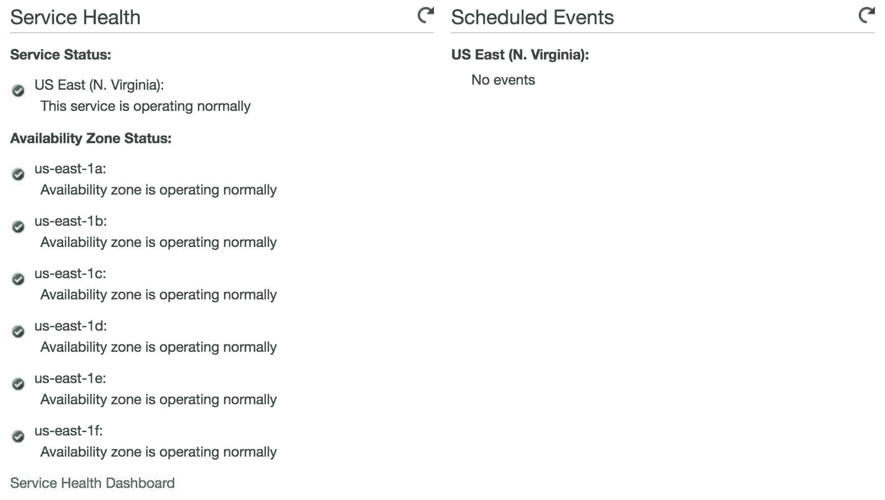
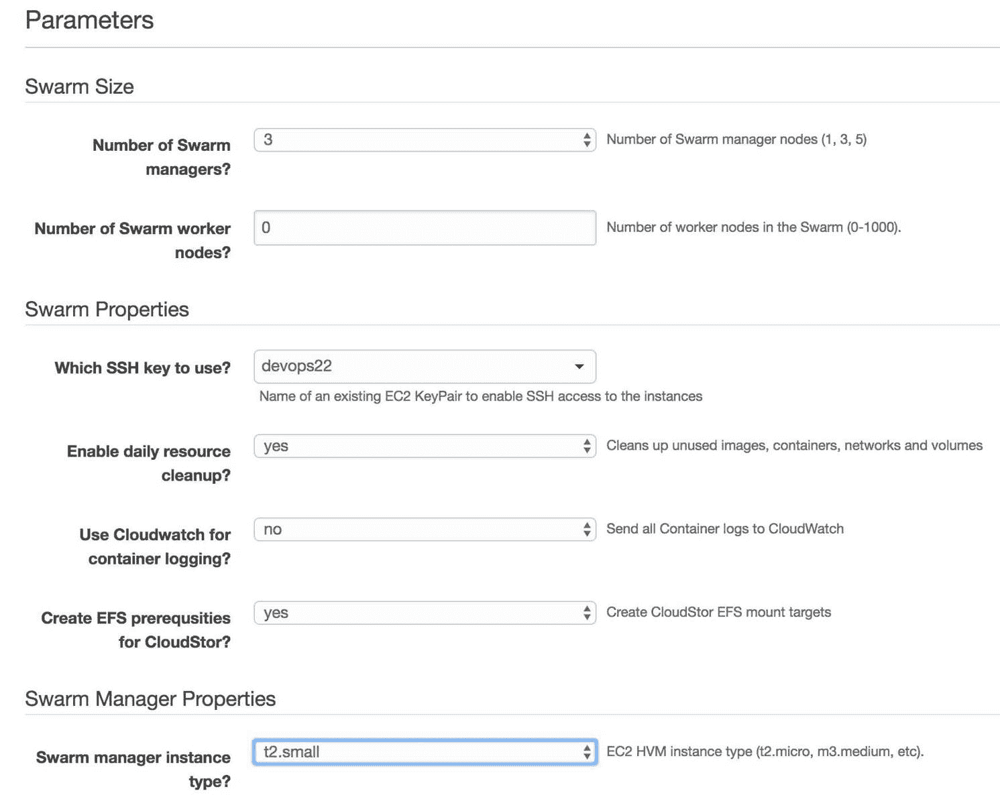
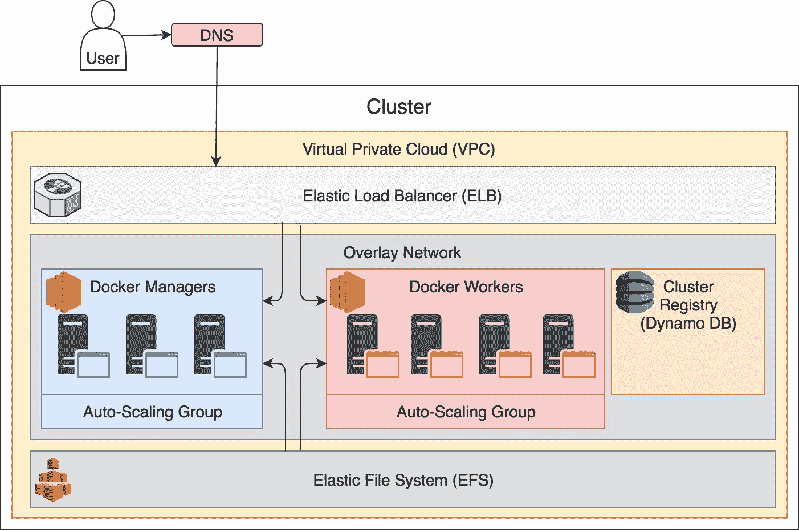
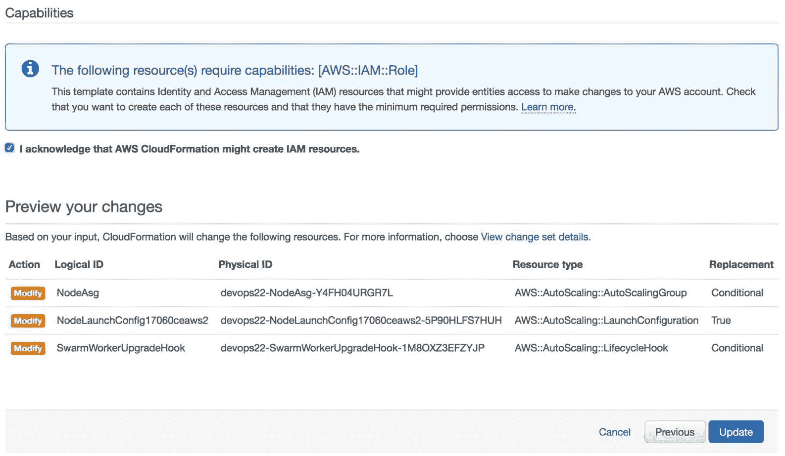
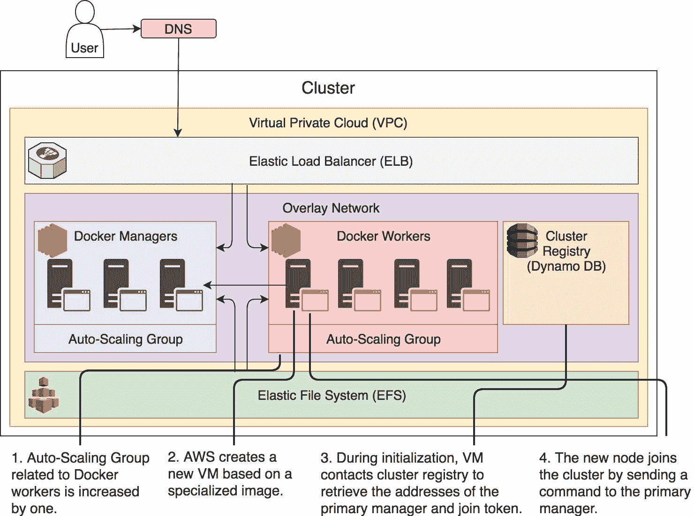

## 第十七章：设置生产集群

我们已经探讨了很多技术、流程和工具，这些可以帮助我们构建一个适用于服务的自给自足系统。Docker Swarm 提供了自愈功能，我们也创建了自己的自适应系统。到目前为止，我们应该对我们的服务相当有信心，现在是时候探索如何将类似的目标应用到基础设施上了。

系统应该能够重新创建故障节点，能够无停机时间地进行升级，并根据波动的需求扩展服务器。我们无法使用基于 Docker Machine 节点本地运行的集群来探讨这些主题。我们笔记本电脑的容量有限，因此无法将节点扩展到更大的数量。即使能够，供生产集群使用的基础设施也完全不同。我们需要一个 API 使我们的系统能够与基础设施进行通信。此外，我们之前使用的服务并没有机会探讨持久存储。这些少数示例仅仅是我们所需的冰山一角，细节我们暂时不进入。目前，我们将尝试创建一个生产就绪的集群，以便继续向自给自足的系统迈进。

直接的目标是将基于 Docker 机器本地运行的 Swarm 集群过渡到一个更可靠的环境。我们必须迁移到云端。

我们可以选择的托管供应商太多，逐一解释每个供应商的过程几乎是不可能的。即使我们只专注于那些非常流行的供应商，仍然至少有十个供应商需要介绍。这会使本书的内容范围超出可管理的大小，因此我们将选择一个托管供应商，用它来演示生产集群的设置。必须选一个，而 AWS 是最常用的托管供应商。

根据你目前选择的供应商，你可能会对其非常满意，或者极度不满。如果你更喜欢使用 [Microsoft Azure](https://azure.microsoft.com)，你会发现你能够跟随我们为 AWS 探索的相同步骤。你可能更倾向于使用 [Google Compute Engine (GCE)](https://cloud.google.com/compute/)，[Digital Ocean](https://www.digitalocean.com/)，[OpenStack](https://www.openstack.org) 本地部署，或者成千上万的解决方案和供应商中的任何一个。我会尽力解释我们在 AWS 上进行设置的背后逻辑。希望你能够将相同的逻辑应用到你的基础设施中。我会尽量让你明白你应该做什么，而我希望你能卷起袖子自己动手做。我会提供一个蓝图，你来完成工作。

你可能会想直接将接下来的练习翻译到你自己的托管解决方案中。但不要！如果你还没有账户，请在[Amazon Web Services (AWS)](https://aws.amazon.com/)上创建一个账户，并按照指示进行操作。这样，你应该能清楚地了解可以做什么，以及应该采取的路径。只有在阅读完本书后，你才应该尝试将这些经验应用到你的基础设施中。在这一过程中，我会尽力以一种方式讲解 AWS 中我们所做的一切，使得相同的原则能够转化到其他任何选择上。而且，我会尽最大努力将 AWS 的费用控制在最低限度。

说了这么多，我们开始进入本章的动手实践部分，创建一个 Docker Swarm 集群。集群搭建好后，我们将部署迄今为止使用的所有服务。最后，我们会讨论哪些服务可能还缺失，以及我们应该对我们的栈做哪些修改，以便让它们具备生产环境的准备。开始吧！

### 创建 Docker For AWS 集群

在[《DevOps 2.1 工具包：Docker Swarm》](https://www.amazon.com/dp/1542468914)中，我曾提到，创建 AWS 上的 Swarm 集群的最佳方式是结合使用[Packers](https://www.packer.io/)和[Terraform](https://www.terraform.io/)。另一种选择是使用[Docker CE for AWS](https://store.docker.com/editions/community/docker-ce-aws)。那时，*Docker for AWS* 还不够成熟。但今天，情况已不同。*Docker for AWS* 提供了一个稳健的 Docker Swarm 集群，几乎具备我们期望的所有服务。

我们将创建一个*Docker for AWS*集群，并在过程中讨论其中的一些方面。

在开始创建集群之前，我们需要选择一个区域。真正重要的是你选择的区域是否支持至少三个可用区。如果只有一个可用区，那么一旦该可用区不可用，我们就会面临停机风险。如果有两个可用区，一旦其中一个可用区发生故障，我们将失去 Docker 管理器的法定人数。正如我们应该始终在 Docker 管理器中使用奇数数量一样，我们也应该将集群分布在奇数个可用区中。三个可用区是一个不错的选择，适用于大多数场景。

如果你是 AWS 的新手，了解一下可用区（AZ）。一个可用区是区域内部的一个隔离位置。每个区域由一个或多个可用区组成。每个 AZ 都是隔离的，但同一区域内的 AZ 通过低延迟链接连接在一起。AZ 之间的隔离提供了高可用性。跨多个 AZ 部署的集群，即便一个 AZ 发生故障，依然能够继续运行。使用同一区域内的 AZ 时，延迟较低，因此不会影响性能。总的来说，我们应始终在同一区域内跨多个 AZ 运行集群。

让我们检查一下你最喜欢的 AWS 区域是否至少有三个可用区。请从*AWS 控制台*打开[EC2 屏幕](https://console.aws.amazon.com/ec2/v2/home)。你会看到屏幕右上角选中了其中一个可用区。如果这不是你想用于集群的位置，点击它进行更改。

向下滚动到*服务健康*部分，你会在其中找到*可用区状态*。如果列出了至少三个可用区，那么你选择的区域是可以的。否则，请更改区域并再次检查是否至少有三个可用区。



图 13-1：美国东部区域支持的可用区列表

在创建集群之前，我们还需要满足另一个先决条件。我们需要创建一个 SSH 密钥。没有它，我们将无法访问构成集群的任何节点。

请返回*AWS 控制台*，从左侧菜单中点击*密钥对*链接。点击*创建密钥对*按钮，输入*devops22*作为*密钥对名称*，然后点击*创建*按钮。新创建的 SSH 密钥将下载到你的笔记本电脑。请将其复制到*docker-flow-monitor*目录中。该项目中已在 `.gitignore` 文件中添加了 `/*.pem` 条目，以确保密钥不会意外提交到 GitHub。尽管如此，为了额外的安全措施，我们应该确保只有你能读取该文件的内容。

```
`1` chmod `400` devops22.pem 
```

`````````````````````````````````````````````````````````` Now we are ready to create the cluster. Please open *https://store.docker.com/editions/community/docker-ce-aws* in your favorite browser and click the *Get Docker* button.    You might be asked to log in to *AWS console*. The region should be set to the one you chose previously. If it isn’t, please change it by clicking the name of the current region (e.g., *N. Virginia*) button located in the top-right section of the screen.    We can proceed once you’re logged in, and the desired region is selected. Please click the *Next* button located at the bottom of the screen. You will be presented with the *Specify Details* screen.    Please type *devops22* as the *Stack name*.    We’ll leave the number of managers set to three, but we’ll change the number of workers to *0*. For now, we will not need more nodes. We can always increase the number of workers later on if such a need arises. For now, we’ll go with a minimal setup.    Please select *devops22* as the answer to *Which SSH key to use?*.    We’ll do the opposite from the default values for the rest of the fields in the *Swarm Properties* section.    We do want to *enable daily resource cleanup* so we’ll change it to *yes*. That way, our cluster will be nice and clean most of the time since Docker will prune it periodically.    We will select *no* as the value of the *use CloudWatch for container logging* drop-box. CloudWatch is very limiting. There are much better and cheaper solutions for storing logs, and we’ll explore them soon.    Finally, please select *yes* as the value of the *create EFS prerequisites for CloudStor* drop-box. The setup process will make sure that all the requirements for the usage of EFS are created and thus speed up the process of mounting network drives.    We should select the type of instances. One option could be to use *t2.micro* which is one of the free tiers. However, in my experience, *t2.micro* is just too small. *1GB* memory and *1* virtual CPU (vCPU) is not enough for some of the services we’ll run. We’ll use *t2.small* instead. With *2GB* of memory and *1* vCPU, it is still very small and would not be suitable for “real” production usage. However, it should be enough for the exercises we’ll run throughout the rest of this chapter.    Please select *t2.small* as both the *Swarm manager instance type* and *Agent worker instance type* values. Even though we’re not creating any workers, we might choose to add some later on so having the proper size set in advance might be a good idea. We might discover that we need bigger nodes later on. Still, any aspect of the cluster is easy to modify, so there’s no reason to aim for perfection from the start.    Figure 13-2: Docker For AWS Parameters screen    Please click the *Next* button. You’ll be presented with the *Options* screen. We won’t modify any of the available options so please click the *Next* button on this screen as well.    We reached the last screen of the setup. It shows the summary of all the options we chose. Please go through the information and confirm that everything is set to the correct values. Once you’re done, click the *I acknowledge that AWS CloudFormation might create IAM resources* checkbox followed by the *Create* button.    It’ll take around ten to fifteen minutes for the CloudFormation to finish creating all the resources. We can use that time to comment on a few of them. If you plan to transfer this knowledge to a different hosting solution, you’ll probably need to replicate the same types of resources and the processes behind them. The list of all the resources created by the template can be found by selecting the *devops22* stack and clicking the *Resources* tab. Please click the *Restore* icon from the bottom-right part of the page if you don’t see the tabs located at the bottom of the screen.    We won’t comment on all the resources *Docker for AWS* template creates but only on the few that are crucial if you’d like to replicate a similar setup with a different vendor.    *VPC* (short for *Virtual Private Cloud*) makes the system secured by closing all but a few externally accessible ports. The only port open by default is *22* required for SSH access. All others are locked down. Even the port *22* is not open directly but through a load balancer.    *ELB* (short for *Elastic Load Balancer*) is sitting on top of the cluster. In the beginning, it forwards only SSH traffic. However, it is configured in a way that forwarding will be added to the ELB every time we create a service that publishes a port. As a result, any service with a published port will be accessible through *ELB* only. The load balancer itself cannot (in its current setting) forward requests based on their paths, domains, and other information from their headers. It does (a kind of) layer 4 load balancing that uses only port as the forwarding criteria. It does a similar job as the ingress network. That, in itself, is not very useful if all your services are routed through a layer 7 proxy like [Docker Flow Proxy](http://proxy.dockerflow.com/), and since it lacks proper routing, it cannot replace it. However, the more important feature ELB provides is load balancing across healthy nodes. It provides a DNS that we can use to setup our domain’s *C Name* entries. No matter whether a node fails or is replaced during upgrades, ELB will always forward requests to one of the healthy nodes.    *EFS* (short for *Elastic File System*) will provide network drives we’ll use to persist stateful services that do not have replication capabilities. It can be replaced with *EBS* (short for *Elastic Block Storage*). Each has advantages and disadvantages. EFS volumes can be used across multiple availability zones thus allowing us to move services from one to another without any additional steps. However, EFS is slower than EBS so, if IO speed is of the essence, it might not be the best choice. EBS, on the other hand, is opposite. If is faster than EFS, but it cannot be used across multiple AZs. If a replica needs to be moved from one to another, a data snapshot needs to be created first and restored on the EBS volume created in a different AZ.    *ASGs* (short for *Auto-Scaling Groups*) provide an effortless way to scale (or de-scale) nodes. It will be essential in our quest for self-healing system applied to infrastructure.    *Overlay Network*, even though it is not unique to AWS, envelops all the nodes of the cluster and provides communication between services.    *Dynamo DB* is used to store information about the primary manager. That information is changed if the node hosting the primary manager goes down and a different one is promoted. When a new node is added to the cluster, it uses information from Dynamo DB to find out the location of the primary manager and join itself to the cluster.    The cluster, limited to the most significant resources, can be described through the *figure 13-3*.    Figure 13-3: Simplified diagram with the key services created through the Docker For AWS template    By this time, the cluster should be up and running and waiting for us to deploy the first stack. We can confirm that it is finished by checking the *Status* column of the *devops22* CloudFormation stack. We’re all set if the value is *CREATE_COMPLETE*. If it isn’t, please wait a few more minutes until the last round of resources is created.    We’ll need to retrieve a few pieces of information before we proceed. We’ll need to know the DNS of the newly created cluster as well as the IP of one of the manager nodes.    All the information we need is in the *Outputs* tab. Please go there and copy the value of the *DefaultDNSTarget* key. We’ll paste it into an environment variable. That will allow us to avoid coming back to this screen every time we need to use the DNS.    ``` `1` `CLUSTER_DNS``=[`...`]`  ```   ````````````````````````````````````````````````````````` Please change `[...]` with the actual DNS of your cluster.    You should map your domain to that DNS in a “real” world situation. But, for the sake of simplicity, we’ll skip that part and use the DNS provided by AWS.    The only thing left before we enter the cluster is to get the IP of one of the managers. Please click the link next to the *Managers* key. You will be presented with the *EC2 Instances* screen that lists all the manager nodes of the cluster. Select any of them and copy the value of the *IPv4 Public IP* key.    Just as with DNS, we’ll set that value as an environment variable.    ``` `1` `CLUSTER_IP``=[`...`]`  ```   ```````````````````````````````````````````````````````` Please change `[...]` with the actual public IP of one of the manager nodes.    The moment of truth has come. Does our cluster indeed work? Let’s check it out.    ``` `1` ssh -i devops22.pem docker@`$CLUSTER_IP` `2`  `3` docker node ls  ```   ``````````````````````````````````````````````````````` We entered into one of the manager nodes and executed `docker node ls`. The output of the latter command is as follows (IDs are removed for brevity).    ``` `1` HOSTNAME                      STATUS AVAILABILITY MANAGER STATUS `2` ip-172-31-2-46.ec2.internal   Ready  Active       Reachable `3` ip-172-31-35-26.ec2.internal  Ready  Active       Leader `4` ip-172-31-19-176.ec2.internal Ready  Active       Reachable  ```   `````````````````````````````````````````````````````` As you can see, all three nodes are up and running and joined into a single Docker Swarm cluster. Even though this looks like a simple cluster, many things are going on in the background, and we’ll explore many of the cluster features later on. For now, we’ll concentrate on only a few observations.    The nodes we’re running has an OS created by Docker and designed with only one goal. It runs containers, and nothing else. We cannot install packages directly. The benefits such an OS brings are related mainly to stability and performance. An OS designed with a specific goal is often more effective than general distributions capable of fulfilling all needs. Those often end up being fine at many things but not excellent with any. Docker’s OS is optimized for containers, and that makes it more stable. When there are no things we don’t use, there are fewer things that can cause trouble. In this case, the only thing we need is Docker Server (or Engine). Whatever else we might need must be deployed as a container. The truth is that we do not need much with Docker. A few things that we do need are already available.    Let’s take a quick look at the containers running on this node.    ``` `1` docker container ls -a  ```   ````````````````````````````````````````````````````` The output is as follows (IDs are removed for brevity).    ```  `1` IMAGE                                     COMMAND                CREATED        \  `2` STATUS        PORTS                        NAMES  `3` docker4x/l4controller-aws:17.06.0-ce-aws2 "loadbalancer run ..." 10 minutes ago \  `4` Up 10 minutes                              l4controller-aws  `5` docker4x/meta-aws:17.06.0-ce-aws2         "metaserver -iaas_..." 10 minutes ago \  `6` Up 10 minutes 172.31.19.205:9024->8080/tcp meta-aws  `7` docker4x/guide-aws:17.06.0-ce-aws2        "/entry.sh"            10 minutes ago \  `8` Up 10 minutes                              guide-aws  `9` docker4x/shell-aws:17.06.0-ce-aws2        "/entry.sh /usr/sb..." 10 minutes ago \ `10` Up 10 minutes 0.0.0.0:22->22/tcp           shell-aws `11` docker4x/init-aws:17.06.1-ce-aws1         "/entry.sh"            10 minutes ago \ `12` Exited (0) 10 minutes ago                  lucid_leakey  ```   ```````````````````````````````````````````````````` We’ll explore those containers only briefly so that we understand their high level purposes.    The *l4controller-aws* container is in charge of ELB. It monitors services and updates load balancer whenever a service that publishes a port is created, updated, or removed. You’ll see the ELB integration in action soon. For now, the important part to note is that we do not need to worry what happens when a node goes down nor we need to update security groups when a new port needs to be opened. ELB and *l4controller-aws* containers are making sure those things are always up-to-date.    The *meta-aws* container provides general server metadata to the rest of the swarm cluster. Its main purpose is to provide tokens for members to join a Swarm cluster.    The *guide-aws* container is in charge of house keeping. It removes unused images, stopped containers, volumes, and so on. On top of those responsibilities, it updates DynamoDB with information about managers and a few other things.    The *shell-aws* container provides Shell, FPT, SSH, and a few other essential tools. When we entered the node we’re in right now, we actually entered this container. We’re not running commands (i.g., `docker container ls`) from the OS but from inside this container. The OS is so specialized that it does not even have SSH.    The *lucid_leakey* (your name might be different) is based on *docker4x/init-aws* might be the most interesting system container. It was run, did its job, and exited. It has only one purpose. It discovered the IP and the token of the primary manager and joined the node to the cluster. With that process in place, we can add more nodes whenever we need them knowing that they will join the cluster automatically. If a node fails, the auto-scaling group will create a new one which will, through this container, join the cluster.    We did not explore all of the features of the cluster. We’ll postpone the discussion for the next chapter when we explore self-healing capabilities of the cluster and, later on, self-adaptation. Instead, we’ll proceed by deploying the services we used in the previous chapters. The immediate goal is to reach the same state as the one we left in the previous chapter. The only real difference, for now, will be that the services will run on a production-ready cluster.    ### Deploying Services    We’ll start by deploying the stacks we used so far. We will not modify them in any form or way but deploy them as they are. Further on, we’ll explore what modifications we should add to those stacks to make them more production-ready.    We’ll execute [scripts/aws-services.sh](https://github.com/vfarcic/docker-flow-monitor/blob/master/scripts/aws-services.sh) script that contains all the commands we used thus far.    Please replace `[...]` with the DNS of your cluster.    ``` `1` `export` `CLUSTER_DNS``=[`...`]` `2`  `3` curl -o aws-services.sh `\` `4 `    https://raw.githubusercontent.com/vfarcic/docker-flow-monitor/master/scripts`\` `5` /aws-services.sh `6`  `7` chmod +x aws-services.sh  ```   ``````````````````````````````````````````````````` The commands we executed created the environment variable `CLUSTER_DNS`, downloaded the script, and assigned it execute permissions.    We won’t go into details of the script since it deploys the same stacks we used before. Feel free to explore it yourself.    Now we can execute the script which will deploy the familiar stacks and services.    ``` `1` ./aws-services.sh `2`  `3` docker stack ls  ```   `````````````````````````````````````````````````` We executed the script and listed all the stacks we deployed with it. The output of the `docker stack ls` command is as follows.    ``` `1` NAME                SERVICES `2` exporter            3 `3` go-demo             2 `4` jenkins             2 `5` monitor             3 `6` proxy               2  ```   ````````````````````````````````````````````````` You should be familiar with all those stacks. At this moment, the services in our AWS cluster behave in the same way as when we deployed them to Docker Machine clusters. As you might have guessed, there are a few things we’re still missing before those services can be considered production-ready.    The first problem we’ll tackle is security.    ### Securing Services    There’s not much reason to secure internal services that do not publish any ports. Such services are usually intended to be accessed by other services that are attached to the same internal network. For example, the `go-demo` stack deploys two services. One of them is the `db` service that can be accessed only by the other service from the stack (`main`). We accomplished that by having both services attached to the same network and by not publishing any ports.    The main objective should be to secure communication between clients outside your cluster and services residing inside. We usually accomplish that by adding SSL certificates to a proxy and, potentially, disabling HTTP communication. *Docker Flow Proxy* makes that an easy task. If you haven’t set up your SSL, you might want to explore [Configuring SSL Certificates](http://proxy.dockerflow.com/certs/) tutorial.    There are quite a few ways to get certificates, but the one that sticks above the crowd is [Let’s Encrypt](https://letsencrypt.org/). It’s free and commonly used by a massive community. Two projects integrate *Let’s Encrypt* with *Docker Flow Proxy*. You can find them in GitHub repositories [n1b0r/docker-flow-proxy-letsencrypt](https://github.com/n1b0r/docker-flow-proxy-letsencrypt) and [hamburml/docker-flow-letsencrypt](https://github.com/hamburml/docker-flow-letsencrypt). They use different approaches to obtain certificates and pass them to the proxy. I urge not to explore both before making a decision which one to use (if any).    Unfortunately, we won’t be able to set up certificates since we do not have a valid domain. Let’s Encrypt would not allow us to use DNS name AWS gave us and I could not know in advance whether you have a domain name you could use for this exercise. So, we’ll skip the examples of how to set up SSL assuming that you’ll explore it on your own. Feel free to reach me on [DevOps20](http://slack.devops20toolkit.com/) Slack channel if you have a question or you run into a problem.    Encryption is only a part of what we need to do to secure our services. One of the obvious things we’re missing is authentication.    Let us review the publicly available services we’re currently running inside our cluster and discuss the authentication strategies we might apply.    We’ll start with Jenkins.    ``` `1` `exit` `2`  `3` open `"http://``$CLUSTER_DNS``/jenkins"`  ```   ```````````````````````````````````````````````` Jenkins service was created from a custom built image that already has an admin user set through Docker secrets. That was a great first step that allowed us to skip the manual setup and, at the same time, have a relatively secure initial experience. However, we need more. Potentially, every member of our organization should be able to access Jenkins. We could add them all as users of Jenkins’ internal registry, but that would prove to be too much work for anything but small teams.    Fortunately, Jenkins allows authentication through almost any provider. All you have to do is install and configure one of the authentication plugins. [GitHub Authentication](https://plugins.jenkins.io/github-oauth), [Google Login](https://plugins.jenkins.io/google-login), [LDAP](https://plugins.jenkins.io/ldap), and [Gitlab Authentication](https://plugins.jenkins.io/gitlab-oauth) are only a few among many other available solutions.    We won’t go into details how to setup a “proper” authentication since there are too many of them and I cannot predict which one would suit your needs. In most cases, following the instructions on the plugin page should be more than enough to get you up and running in no time. For now, it is important that the image we’re running is secured by default with the user we defined through Docker secrets and that you can easily replace it with authentication through one of the plugins. The current setup allows any user to see the jobs, but only the administrator to create new ones, to build them, or to update them.    Let’s move to Prometheus and explore how to secure it with authentication.    While Jenkins that has both its internal credentials storage as well as the ability to connect to many third-party credential providers, Prometheus has neither. There is no internal authentication, nor it has a built-in ability to integrate with an external authentication service. All that does not mean that everything is lost. Prometheus holds metrics of your cluster and the services inside it. Metrics have labels, and they might keep confidential information. It needs to be protected, and the only option is to deny external access to the service or to authenticate requests before they reach it. The first option would entail VPN and black-listing Prometheus domain or some other method that would deny access to anyone but those inside the VPN. The alternative is to use authentication gateway or instruct the proxy to request authentication. We won’t go into a discussion of pros and cons of each method since it often depends on personal preferences, the company culture, and the existing infrastructure. Instead, we’ll roll with the simplest solution. We’ll instruct the proxy to authenticate requests to Prometheus.    ``` `1` ssh -i devops22.pem docker@`$CLUSTER_IP` `2`  `3` curl -o proxy.yml `\` `4 `    https://raw.githubusercontent.com/vfarcic/docker-flow-monitor/master/stacks/`\` `5` docker-flow-proxy-aws.yml `6`  `7` cat proxy.yml  ```   ``````````````````````````````````````````````` We entered the cluster, downloaded a new proxy stack and displayed its content. The output of the `cat` command, limited to relevant parts, is as follows.    ```  `1` ...  `2`  proxy:  `3`    ...  `4`    secrets:  `5`      - dfp_users_admin  `6`    ...  `7`   `8` secrets:  `9`  dfp_users_admin: `10 `    external: true  ```   `````````````````````````````````````````````` We added Docker secret `dfp_users_admin`. We’ll use it to store username and password we’ll use later one with services that require authentication through the proxy.    Now that we know that the stack requires a secret, we can create it and redeploy the services.    ``` `1` `echo` `"admin:admin"` `|` docker secret `\` `2 `    create dfp_users_admin - `3`  `4` docker stack deploy -c proxy.yml `\` `5 `    proxy  ```   ````````````````````````````````````````````` We piped the value `admin:admin` to the command that created the `dfp_users_admin` secret and deployed the new definition of the stack. All that’s left now is to update the *monitor* service by adding a few labels that will tell the proxy that the service requires authentication using the credentials from the secret we created.    ``` `1` curl -o monitor.yml `\` `2 `    https://raw.githubusercontent.com/vfarcic/docker-flow-monitor/master/stacks/`\` `3` docker-flow-monitor-user.yml `4`  `5` cat monitor.yml  ```   ```````````````````````````````````````````` We downloaded a new monitor stack and displayed its content. The output, limited to relevant parts, is as follows.    ``` `1` ... `2 `  monitor: `3 `    ... `4 `    deploy: `5 `      labels: `6 `        - com.df.usersPassEncrypted=false `7 `        - com.df.usersSecret=admin `8 `        ...  ```   ``````````````````````````````````````````` *Docker Flow Proxy* uses a naming convention to resolve names of Docker secrets that contain users and passwords. The value of the `userSecret` parameter will be prepended with `dfp_users_` thus matching the name of the secret we created a moment ago. We used the `usersPassEncrypted` parameter to tell the proxy that the credentials are not encrypted. Please check [HTTP Mode Query Parameters](http://proxy.dockerflow.com/usage/#http-mode-query-parameters) section of the documentation for more details and additional options.    The monitor stack requires the DNS of our cluster so we’ll define it as environment variable `CLUSTER_DNS`. Please replace `[...]` with the `CLUSTER_DNS` value obtained from the variable defined locally.    ``` `1` `exit` `2`  `3` `echo` `$CLUSTER_DNS` `4`  `5` ssh -i devops22.pem docker@`$CLUSTER_IP` `6`  `7` `CLUSTER_DNS``=[`...`]`  ```   `````````````````````````````````````````` We exited the cluster so that we can output the value of the `CLUSTER_DNS` variable we created locally, entered back, and defined the same variable inside one of the nodes of the cluster. Those commands might seem like overkill but, in my case, they are easier than opening CloudFormation UI and looking for the outputs. You probably guessed by now that I prefer doing as much as possible from the command line.    Now we can deploy the updated stack.    ``` `1` `DOMAIN``=``$CLUSTER_DNS` docker stack `\` `2 `    deploy -c monitor.yml monitor  ```   ````````````````````````````````````````` Before we check whether authentication is indeed applied, we should wait for a moment or two until all the services of the stack are up-and-running. You can check the status by executing `docker stack ps monitor`.    All that’s left now is to open Prometheus and authenticate.    ``` `1` `exit` `2`  `3` open `"http://``$CLUSTER_DNS``/monitor"`  ```   ```````````````````````````````````````` We exited the cluster and opened Prometheus in our default browser. This time we were asked to enter username and password before being redirected to the UI. Authentication works! While it might not be a perfect solution (nothing is), it is more secure than it was a moment ago when anyone could enter Prometheus.    Now we can try to solve one more problem. Our cluster runs a few stateful services that might need to be persisted somewhere.    ### Persisting State    What shall we do with the stateful services inside our cluster? If any of them fails and Swarm reschedules it, the state will be lost. Even if impossible happens and none of the replicas of the service ever fail, sooner or later we’ll have to upgrade the cluster. That means that existing nodes will be replaced with new images and Swarm will have to reschedule your services to the new nodes. In other words, services will fail or be rescheduled, and we might need to persist state when they are stateful.    Let us go through each of the stateful services we’re currently running inside our cluster.    The obvious case of stateful services is databases. We are running MongoDB. Should we persist its state? Many would answer positively to that question. I’ll argue against persisting data on disk. Instead, we should create a replica set with at least three MongoDBs. That way, data would be replicated across multiple instances, and a failure of one or even two of them would not mean a loss of data.    Unfortunately, MongoDB is not a container-friendly database (almost none of the DBs are) so scaling Mongo service to a few replicas will not do the trick. We’d need to create three services and do some custom plumbing. It’s nothing too complicated, and yet it’s not what we’re used to with Docker Swarm services. We won’t go into details how to setup Mongo replica-set inside Docker services. I’ll leave that up to your Google-ing skills. The important note I tried to convey is that we do not always need to persist state. If stateful service can replicate state across different instances, there might not be a need to store that state on a network drive as well.    Moving on…    *Docker Flow Proxy* is also a stateful service. It uses HAProxy which uses file system for its configuration. Since we are changing that configuration whenever a service is created, updated, or removed, we can consider that configuration as its state. If it gets lost, *Docker Flow Proxy* would not be able to forward requests to all our public facing services.    Fortunately, there’s no need to persist proxy state either. *Docker Flow Swarm Listener* sends service notifications to all proxy replicas. On the other hand, when a new replica of the proxy is created, the first thing it does is to request all the info it needs from the listener. All in all, if we ignore possible bugs, all the replicas of the proxy should always be up-to-date and with identical configuration. In other words, there’s one less stateful service to worry.    Moving on…    Prometheus is also a stateful service. However, it cannot be scaled so its state cannot be replicated among its instances. It is a good example of a service that needs to persist its data on disk.    Let’s open Prometheus flags screen and see the checkpoint interval.    ``` `1` open `"http://``$CLUSTER_DNS``/monitor/flags"`  ```   ``````````````````````````````````````` You’ll see a property called `storage.local.checkpoint-interval` set to `5m0s`. Prometheus will flush its state to a file every five minutes.    By now, you should have a decent amount of data stored in Prometheus. We can confirm that by opening the graph screen.    ``` `1` open `"http://``$CLUSTER_DNS``/monitor/graph"`  ```   `````````````````````````````````````` Please type the query that follows into the *Expression* field.    ``` `1` container_memory_usage_bytes{container_label_com_docker_swarm_service_name!=""}  ```   ````````````````````````````````````` Click the *Execute* button followed with a switch to the *Graph* tab. You should see the memory usage of each container in the cluster. However, the reason we got here is not to admire metrics but to demonstrate state persistence.    Let’s see what happens when we simulate a failure of the service.    ``` `1` ssh -i devops22.pem docker@`$CLUSTER_IP` `2`  `3` docker service scale `monitor_monitor``=``0` `4`  `5` docker service scale `monitor_monitor``=``1` `6`  `7` `exit`  ```   ```````````````````````````````````` We entered the cluster, scaled the service to zero replicas, scaled it back to one, and exited. That was probably the fastest way to simulate a failure.    Let’s go back to the graph screen.    ``` `1` open `"http://``$CLUSTER_DNS``/monitor/graph"`  ```   ``````````````````````````````````` If Prometheus does not load, you might need to wait for a few moments and refresh the screen.    Repeat the execution of the same query like the one we used a short while ago.    ``` `1` container_memory_usage_bytes{container_label_com_docker_swarm_service_name!=""}  ```   `````````````````````````````````` You should notice that metrics are gone. You might have a minute or two of data. Those from before the failure simulation are gone.    Let’s download a new version of the `monitor` stack and see how it solves our persistence problem.    ``` `1` ssh -i devops22.pem docker@`$CLUSTER_IP` `2`  `3` curl -o monitor.yml `\` `4 `    https://raw.githubusercontent.com/vfarcic/docker-flow-monitor/master/stacks/`\` `5` docker-flow-monitor-aws.yml `6`  `7` cat monitor.yml  ```   ````````````````````````````````` We entered into the cluster and downloaded an updated version of the `monitor` stack. The output of the `cat` command, limited to relevant parts, is as follows.    ```  `1` ...  `2`  monitor:  `3`    image: vfarcic/docker-flow-monitor  `4`    environment:  `5`      - ARG_STORAGE_LOCAL_PATH=/data  `6`      ...  `7`    volumes:  `8`      - prom:/data  `9`      ... `10`  `11` volumes: `12 `  prom: `13 `    driver: cloudstor:aws `14 `    external: false  ```   ```````````````````````````````` We specified the storage path using the environment variable `ARG_STORAGE_LOCAL_PATH`, mapped `prom` volume to the directory `/data`, and defined the volume with the driver `cloudstor:aws`.    The *cloudstor* driver was developed by Docker specifically for usage in AWS and Azure. It will create a network drive (in this case EFS) and attach it to the service. Since the `prom` volume has `external` set to `false`, the volume will be created automatically when we deploy the stack. Otherwise, we’d need to execute `docker volume create` command first.    Let’s deploy the new stack. Please make sure to replace `[...]` with the value of the `CLUSTER_DNS` variable defined locally (the second command).    ```  `1` `exit`  `2`   `3` `echo` `$CLUSTER_DNS`  `4`   `5` ssh -i devops22.pem docker@`$CLUSTER_IP`  `6`   `7` `CLUSTER_DNS``=[`...`]`  `8`   `9` `DOMAIN``=``$CLUSTER_DNS` docker stack `\` `10 `    deploy -c monitor.yml monitor  ```   ``````````````````````````````` We exited the cluster only to output the DNS, went back, created `CLUSTER_DNS` variable, and deployed the new stack.    Now we should wait for a while so that Prometheus can accumulate some metrics. If we repeat the failure simulation right away, we would not be able to confirm whether data is persisted or not. Instead, you should grab a coffee and come back in ten minutes or more. That should be enough for a checkpoint or two to flush data to disk.    Now, after a while, we can repeat the failure simulation steps and verify whether data is indeed persisted across failures.    ``` `1` docker service scale `monitor_monitor``=``0` `2`  `3` docker service scale `monitor_monitor``=``1`  ```   `````````````````````````````` We changed the number of replicas to zero only to increase them to one a few moments later. As a result, Swarm created a new instance of the service.    Let’s go back to the graph screen and confirm that the data survived the failure.    ``` `1` `exit` `2`  `3` open `"http://``$CLUSTER_DNS``/monitor/graph"`  ```   ````````````````````````````` Please type the query that follows in the *Expression* field, click the *Execute* button, and switch to the *Graph* tab.    ``` `1` container_memory_usage_bytes{container_label_com_docker_swarm_service_name!=""}  ```   ```````````````````````````` You should see that metrics go back in time longer then the duration of the newly scheduled replica. Data persistence works! Partly… Prometheus is an in-memory database. It keeps all the metrics in memory and periodically flushes them to disk. It is not designed to be transactional but fast. We might have lost some data that was scraped between the last checkpoint and the (simulated) failure of the service. However, that, in most cases, is not a real problem since metrics are supposed to show us tendencies, not every single transaction. If you compare the graphs from before and after the (simulated) crash, you’ll notice that they are, more or less, the same even though some data might be lost.    We have one more service left to fix.    Jenkins is also a stateful service. It stores its state as files. They are, in a way, its database, and we need to persist them.    Let’s download a new Jenkins stack.    ``` `1` ssh -i devops22.pem docker@`$CLUSTER_IP` `2`  `3` curl -o jenkins.yml `\` `4 `    https://raw.githubusercontent.com/vfarcic/docker-flow-monitor/master/stacks/`\` `5` jenkins-aws.yml `6`  `7` cat jenkins.yml  ```   ``````````````````````````` The output of the `cat` command, limited to relevant parts, is as follows.    ```  `1` ...  `2`  master:  `3`    ...  `4`    volumes:  `5`      - master:/var/jenkins_home  `6`    ...  `7`   `8` volumes:  `9`  master: `10 `    driver: cloudstor:aws `11 `    external: false  ```   `````````````````````````` By now, all the additions should be familiar. We defined a volume called `master` and mapped it to Jenkins home directory. Further down, we defined the `master` volume to use `cloudstor:aws` driver and set `external` to `false` so that `docekr stack deploy` command can take care of creating the volume.    We’ll deploy the new stack before checking whether persistence works.    ``` `1` docker stack deploy -c jenkins.yml `\` `2 `    jenkins `3`  `4` docker stack ps jenkins  ```   ````````````````````````` It will take a couple of minutes until the volume is created, the image is pulled, and Jenkins process inside the container is initialized. You’ll know that Jenkins is initialized when you see the message `INFO: Jenkins is fully up and running` in its logs. Use `docker service logs jenkins_master` command to see the output.    Now that Jenkins is initialized and uses EFS to store its state, we should confirm that persistence indeed works. We’ll do that by creating a new job, shutting down Jenkins, letting Swarm reschedule a new replica, and, finally, checking that the newly created job is present.    ``` `1` `exit` `2`  `3` open `"http://``$CLUSTER_DNS``/jenkins/newJob"`  ```   ```````````````````````` We exited the cluster and opened *New Job* screen. Please use *admin* and *username* and *password* if you’re asked to authenticate.    Next, type *test* as the *item name*, select *Pipeline* as job type and click the *OK* button.    Once inside the job configuration screen, please click the *Pipeline* tab. We are about to write a very complicated pipeline script. Are you ready?    Please type the script that follows inside the *Pipeline Script* field and press the *Save* button.    ``` `1` `echo` `"This is a test"`  ```   ``````````````````````` Now that we created a mighty pipeline job, we can simulate Jenkins failure by sending it an *exit* command.    ``` `1` open `"http://``$CLUSTER_DNS``/jenkins/exit"`  ```   `````````````````````` We exited the cluster and opened the *exit* screen. You’ll see a button saying *Try POSTing*. Click it. Jenkins will shut down, and Swarm will detect that as a failure and schedule a new replica of the service.    Wait a few moments until Jenkins inside a new replica is initialized and open the home screen.    ``` `1` open `"http://``$CLUSTER_DNS``/jenkins"`  ```   ````````````````````` As you can see, the newly created job is there. Persistence works!    If you visit Jenkins nodes screen, you’ll notice that we are running only one agent labeled `prod`. That’s the agent we should use only to deploy a new release to production and, potentially, run production tests. We still need to setup agents we’ll use to run unit tests, build images, run integration tests, and so on. We’ll postpone that part for one of the next chapters since efficient usage of agents is related to self-adaptation applied to infrastructure. We are yet to reach that section.    ### Alternatives to CloudStor Volume Driver    If you’re not using *Docker For AWS* or *Azure*, using CloudStor might not be the best idea. Even though it can be made to work with AWS or Azure without the template we used to create the cluster, it is not well documented. For now, its goal is only to be used with AWS or Azure clusters made with Docker templates. For anything else, I’d recommend you choose one of the alternatives. My personal preference is [REX-Ray](http://rexray.readthedocs.io/).    All in all, stick with *CloudStor* if you choose to create your Swarm cluster using *Docker For AWS* or *Azure* templates. It is well integrated and provides great out-of-the-box experience. For anything else use *REX-Ray* if it supports your hosting vendor. Otherwise, look for some other alternative. There are plenty others, and more is yet to come. The most important part of the story is to know when to persist the state and when to let replication do the work. When persistence is paramount, use any of the volume drivers that support your hosting vendor and fit your requirements.    The only thing left before we can call this cluster production-ready is to set up centralized logging.    ### Setting Up Centralized Logging    We choose not to integrate our cluster with CloudWatch. Actually, I chose not to use it, and you blindly followed my example. Therefore, I guess that an explanation is in order. It’s going to be a short one. I don’t like CloudWatch. I think it is a bad solution that is way behind the competition and, at the same time, it can become quite expensive when dealing with large quantities of data. More importantly, I believe that we should use services coming from hosting vendors only when they are essential or provide an actual benefit. Otherwise, we’d run a risk of entering the trap called *vendor locking*. Docker Swarm allows us to deploy services in the same way, no matter whether they are running in AWS or anywhere else. The only difference would be a volume driver we choose to plug in. Similarly, all the services we decided to deploy thus far can run anywhere. The only “lock-in” is with Docker Swarm but, unlike AWS, it is open source. If needed we can even fork it to our repository and build our own Docker Server. That is not to say that I would recommend forking Docker but rather that I am trying to make a clear distinction between being locked into an open source project and with a commercial product. Moreover, with relatively moderate changes, we could migrate our Swarm services to Kubernetes or even Mesos and Marathon. Again, that is not something I recommend but more of a statement that a choice to change the solution is not as time demanding as it might seem on the first look.    I think I run astray from the main subject so let me summarize it. CloudWatch is bad, and it costs money. Many of the free alternatives are much better. If you read my previous books, you probably know that my preference for a logging solution is the ELK stack (ElasticSearch, LogStash, and Kibana). I used them for both logging and metrics but, since then, metrics solution was replaced with Prometheus. How about centralized logging? I think that ELK is still one of the best self-hosted solutions even though I’m not entirely convinced I like the new path Elastic is taking as a company. I’ll leave the discussion about their direction for later and, instead, we’ll dive right into setting up the ELK stack in our cluster.    ``` `1` ssh -i devops22.pem docker@`$CLUSTER_IP` `2`  `3` curl -o logging.yml `\` `4 `    https://raw.githubusercontent.com/vfarcic/docker-flow-monitor/master/stacks/`\` `5` logging-aws.yml `6`  `7` cat logging.yml  ```   ```````````````````` We went back to the cluster, downloaded the logging stack, and displayed its contents. The YML file defines the ELK (ElasticSearch, LogStash, and Kibana) stack as well as LogSpout. ElasticSearch is an in-memory database that will store our logs. LogSpout will be sending logs from all containers running inside the cluster to LogStash, which, in turn, will process them and send the output to ElasticSearch. Kibana will be used as UI to explore logs. That was all the details of the stack you’ll get. I’ll assume that you are already familiar with the services we’ll use. They were described in [The DevOps 2.1 Toolkit: Docker Swarm](https://www.amazon.com/dp/1542468914). If you did not read it, information could be easily found on the Internet. Google is your friend.    The first service in the stack is `elasticsearch`. It is an in-memory database we’ll use to store logs. Its definition is as follows.    ```  `1`  elasticsearch:  `2`    image: docker.elastic.co/elasticsearch/elasticsearch:5.5.2  `3`    environment:  `4`      - xpack.security.enabled=false  `5`    volumes:  `6`      - es:/usr/share/elasticsearch/data  `7`    networks:  `8`      - default  `9`    deploy: `10 `      labels: `11 `        - com.df.distribute=true `12 `        - com.df.notify=true `13 `        - com.df.port=80 `14 `        - com.df.alertName=mem_limit `15 `        - com.df.alertIf=@service_mem_limit:0.8 `16 `        - com.df.alertFor=30s `17 `      resources: `18 `        reservations: `19 `          memory: 3000M `20 `        limits: `21 `          memory: 3500M `22 `      placement: `23 `        constraints: [node.role == worker] `24` ... `25` volumes: `26 `  es: `27 `    driver: cloudstor:aws `28 `    external: false `29` ...  ```   ``````````````````` There’s nothing special about the service. We used the environment variable `xpack.security.enabled` to disable X-Pack. It is a commercial product baked into ElasticSearch image. Since this book uses only open source services, we had to disable it. That does not mean that X-Pack is not useful. It is. Among other things, it provides authentication capabilities to ElasticSearch. I encourage you to explore it and make your own decision whether it’s worth the money.    I could argue that there’s not much reason to secure ElasticSearch since we are not exposing any ports. Only services that are attached to the same network will be able to access it. That means that only people you trust to deploy services would have direct access to it.    Usually, we’d run multiple ElasticSearch services and join them into a cluster (ElasticSearch calls replica set a cluster). Data would be replicated between multiple instances and would be thus preserved in case of a failure. However, we do not need multiple ElasticSearch services, nor do we have enough hardware to host them. Therefore, we’ll run only one ElasticSearch service and, since there will be no replication, we’ll store its state on a volume called `es`.    The only other noteworthy part of the service definition is the placement defined as `constraints: [node.role == worker]`. Since ElasticSearch is very resource demanding, it might not be a wise idea to place it on a manager. Therefore, we defined that it should always run on one of the workers and reserved 3GB of memory. That should be enough to get us started. Later on, depending on a number of log entries you’re storing and the cleanup strategy, you might need to increase the memory allocated to it and scale it to multiple services.    Let’s move to the next service.    ```  `1` ...  `2`  logstash:  `3`    image: docker.elastic.co/logstash/logstash:5.5.2  `4`    networks:  `5`      - default  `6`    deploy:  `7`      labels:  `8`        - com.df.distribute=true  `9`        - com.df.notify=true `10 `        - com.df.port=80 `11 `        - com.df.alertName=mem_limit `12 `        - com.df.alertIf=@service_mem_limit:0.8 `13 `        - com.df.alertFor=30s `14 `      resources: `15 `        reservations: `16 `          memory: 600M `17 `        limits: `18 `          memory: 1000M `19 `    configs: `20 `      - logstash.conf `21 `    environment: `22 `      - LOGSPOUT=ignore `23 `    command: logstash -f /logstash.conf `24` ... `25` configs: `26 `  logstash.conf: `27 `    external: true  ```   `````````````````` LogStash will accept logs using syslog format and protocol and forward them to ElasticSearch. You’ll see the configuration soon.    The only interesting part about the service is that we’re injecting a Docker config. It works in almost the same way as secrets except that it is not encrypted at rest. Since it will not contain anything compromising, there’s no need to set it up as a secret. We did not specify config destination, so it will be available as file `/logstash.conf`. The command is set to reflect that.    We’re halfway through. The next service in line is `kibana`.    ```  `1`  kibana:  `2`    image: docker.elastic.co/kibana/kibana:5.5.2  `3`    networks:  `4`      - default  `5`      - proxy  `6`    environment:  `7`      - xpack.security.enabled=false  `8`      - ELASTICSEARCH_URL=http://elasticsearch:9200  `9`    deploy: `10 `      labels: `11 `        - com.df.notify=true `12 `        - com.df.distribute=true `13 `        - com.df.usersPassEncrypted=false `14 `        - com.df.usersSecret=admin `15 `        - com.df.servicePath=/app,/elasticsearch,/api,/ui,/bundles,/plugins,/sta\ `16` tus,/es_admin `17 `        - com.df.port=5601 `18 `        - com.df.alertName=mem_limit `19 `        - com.df.alertIf=@service_mem_limit:0.8 `20 `        - com.df.alertFor=30s `21 `      resources: `22 `        reservations: `23 `          memory: 600M `24 `        limits: `25 `          memory: 1000M  ```   ````````````````` Kibana will provide a UI that will allow us to filter and display logs. It can do many other things but logs are all we need for now. Unfortunately, Kibana is not proxy-friendly. Even though there are a few environment variables that can configure the base path, they do not truly work as expected. We had to specify multiple paths through the `com.df.servicePath`. They reflect all the combinations of requests Kibana makes. I’d recommend that you replace `com.df.servicePath` with `com.df.serviceDomain`. The value could be a subdomain (e.g., `kibana.acme.com`).    The rest of the definition is pretty uneventful, so we’ll move on.    We, finally, reached the last service of the stack.    ```  `1`  logspout:  `2`    image: gliderlabs/logspout:v3.2.2  `3`    networks:  `4`      - default  `5`    environment:  `6`      - SYSLOG_FORMAT=rfc3164  `7`    volumes:  `8`      - /var/run/docker.sock:/var/run/docker.sock  `9`    command: syslog://logstash:51415 `10 `    deploy: `11 `      mode: global `12 `      labels: `13 `        - com.df.notify=true `14 `        - com.df.distribute=true `15 `        - com.df.alertName=mem_limit `16 `        - com.df.alertIf=@service_mem_limit:0.8 `17 `        - com.df.alertFor=30s `18 `      resources: `19 `        reservations: `20 `          memory: 20M `21 `        limits: `22 `          memory: 30M  ```   ```````````````` LogSpout will monitor Docker events and send all logs to ElasticSearch. We’re exposing Docker socket as a volume so that the service can communicate with Docker server. The command specifies `syslog` as protocol and `logstash` running on `51415` as the destination address. Since all the services of the stack are connected through the same `default` network, the name of the service (`logstash`) is all we need as address.    The service will run in the `global` mode so that a replica is present on each node of the cluster.    We need to create the `logstash.conf` config before we deploy the stack. The command is as follows.    ```  `1` `echo` `'`  `2` `input {`  `3``  syslog { port => 51415 }`  `4` `}`  `5`   `6` `output {`  `7``  elasticsearch {`  `8``    hosts => ["elasticsearch:9200"]`  `9``  }` `10` `}` `11` `'` `|` docker config create logstash.conf -  ```   ``````````````` We echoed a configuration and piped the output to the `docker config create` command. The configuration specifies `syslog` running on port `51415` as `input`. The output is ElasticSearch running on port `9200`. The address of the output is the name of the destination service (`elasticsearch`).    Now we can deploy the stack.    ``` `1` docker stack deploy -c logging.yml `\` `2 `    logging  ```   `````````````` A few of the images are big, and it will take a moment or two until all services are up-and-running. We’ll confirm the state of the stack by executing the command that follows.    ``` `1` docker stack ps `\` `2 `    -f desired-state`=`running logging  ```   ````````````` The output is as follows (IDs are removed for brevity).    ```  `1` NAME                    IMAGE                                               NODE\  `2`                                        DESIRED STATE CURRENT STATE          ERR\  `3` OR PORTS  `4` logging_logspout...     gliderlabs/logspout:v3.2.2                          ip-1\  `5` 72-31-46-204.us-east-2.compute.internal Running       Running 3 minutes ago  `6` logging_logspout...     gliderlabs/logspout:v3.2.2                          ip-1\  `7` 72-31-12-85.us-east-2.compute.internal  Running       Running 2 minutes ago  `8` logging_logspout...     gliderlabs/logspout:v3.2.2                          ip-1\  `9` 72-31-31-76.us-east-2.compute.internal  Running       Running 3 minutes ago `10` logging_kibana.1        docker.elastic.co/kibana/kibana:5.5.2               ip-1\ `11` 72-31-46-204.us-east-2.compute.internal Running       Running 15 seconds ago `12` logging_logstash.1      docker.elastic.co/logstash/logstash:5.5.2           ip-1\ `13` 72-31-31-76.us-east-2.compute.internal  Running       Running 3 minutes ago `14` logging_elasticsearch.1 docker.elastic.co/elasticsearch/elasticsearch:5.5.2     \ `15 `                                        Running       Pending 3 minutes a  ```   ```````````` You’ll notice that `elasticsearch` in in *pending* state. Swarm cannot deploy it because none of the servers meet the requirements we set. We need at least 3GB of memory and a worker node. We should either change the constraint and reservations to fit out current cluster setup or add a worker as a new node. We’ll go with latter.    As a side note, Kibana might fail after a while. It will try to connect to ElasticSearch for a few times and stop the process. Soon after, it will be rescheduled by Swarm, only to stop again. That will continue until we manage to run ElasticSearch.    Please exit the cluster before we proceed.    ``` `1` `exit`  ```   ``````````` ### Extending The Capacity Of The Cluster    Among other resources, *Docker For AWS* template created two auto-scaling groups. One is used for masters and the other for workers. Those security groups have multiple purposes.    If we choose to update the stack to, for example, change the size of the nodes or upgrade Docker server to a newer version, the template will temporarily increase the number of nodes by one and shut down one of the old ones. The replicas that were running on the old server will be moved to the new one. Once the new server is created, it will move to the next, and the next after that, all the way until all the nodes are replaced. The process is very similar to rolling updates we performed by Swarm when updating services. The same process is done whenever we decide to update any aspect of the *Docker For AWS* stack.    Similarly, if one of the nodes fail health checks, the template will increase auto-scaling group by one so that a new node is created in its place and, once everything goes back to “normal” update the ASG back to its initial value.    In all those cases, not only that new nodes will be created through auto-scaling groups, but they will also join the cluster as a manager or a worker depending on the type of the server that is being replaced.    We will explore failure recovery in the chapter dedicated to self-healing applied to infrastructure. For now, we’ll limit the scope to an example how to update the CloudFormation stack that created our cluster. We even have a perfect use-case. Our ElasticSearch service needs a worker node, and it needs it to be bigger than those we use as managers. Let’s create it.    We’ll start by opening CloudFormation home screen.    ``` `1` open `"https://us-east-2.console.aws.amazon.com/cloudformation/home"`  ```   `````````` Please select the *devops22* stack. Click the *Actions* drop-down list and select the *Update Stack* item. Click the *Next* button    You will be presented with the same initial screen you saw while we were creating the *Docker For AWS* stack. The only difference is that the values are now populated with choices we made previously.    We can change anything we want. Not only that the changes will be applied accordingly, but the process will use rolling updates to avoid downtime. Whether you will have downtime or not depends on the capabilities of your services. If needed, the process will change one node at the time. If you’re running multiple replicas of a service, the worst case scenario is that you will experience degraded performance for a short period. However, services that are not scalable like, for example, Prometheus, will experience downtime.    When a node is destroyed, Swarm will move it to a newly created server. If the state of that service is on a network drive like EFS, it will continue working as if nothing happened. However, we must count the time between the service failure due to the destruction of the node and until it is up and running again. In most cases that should be only a couple of seconds. No matter how short the downtime is, it is still a period during which our non-scalable services are not operational. Be it as it may, not all services are scalable, and the process is the best we can do. If there is downtime, let it be as short as possible.    In this case, we won’t make an update that will force the system to recreate nodes. Instead, we’ll only add a new worker node.    Please scroll to the *Number of Swarm worker nodes?* field and change the value from *0* to *1*.    Since we defined that ElasticSearch should reserve 3GB of memory, we should change worker instance type. Our managers are using *t2.small* that comes with 2GB. The smallest instance that fulfills our requirements is *t2.medium* that comes 4GB of allocated memory.    Please change the value of the *Agent worker instance type?* drop-down list to *t2.medium*.    We will not change any other aspect of the cluster, so all that’s left is to click the *Next* button twice, and select the *I acknowledge that AWS CloudFormation might create IAM resources.* checkbox.    After a few moments, the *Preview your changes* section of the screen will be populated with the list of changes that will be applied to the cluster. Since this is a simple and non-destructive update, only a few resources related to auto-scaling groups will be updated.    Figure 13-4: Preview your changes screen from the Docker For AWS template    Click the *Update* button and relax. It’ll take a minute or two until the new server is created and it joins the cluster.    While waiting, we should explore a different method to accomplish the same result.    Please open the *Auto-Scaling Groups Details* screen.    ``` `1` open `"https://console.aws.amazon.com/ec2/autoscaling/home?#AutoScalingGroups:vie\` `2` `w=details"`  ```   ````````` You’ll be presented with the *Welcome to Auto Scaling* screen. Click the *Auto Scaling Groups: 2* link.    Select the item with the name starting with *devops22-NodeAsg*, click the *Actions* drop-down list, and select the *Edit* item. We’re looking for the *Desired* field located in the *details* tab. It can be changed to any value, and the number of workers would increase (or decrease) accordingly. We could do the same with the auto-scaling group associated with manager nodes. Do not make any change. We’re almost finished with this chapter, and we already have more than enough nodes for the services we’re running.    The knowledge that we can change the number of manager or worker nodes by changing the values in auto-scaling groups is essential. Later on, we’ll combine that with AWS API and Prometheus alerts to automate the process when certain conditions are met.    The new worker node should be up-and-running by now unless you are a very fast reader. If that’s the case, go and grab a coffee.    Let’s go back to the cluster and list the available nodes.    ``` `1` ssh -i devops22.pem docker@`$CLUSTER_IP` `2`  `3` docker node ls  ```   ```````` The output is as follows (IDs are removed for brevity).    ``` `1` HOSTNAME                                    STATUS AVAILABILITY MANAGER STATUS `2` ip-172-31-2-119.us-east-2.compute.internal  Ready  Active `3` ip-172-31-32-225.us-east-2.compute.internal Ready  Active       Leader `4` ip-172-31-10-207.us-east-2.compute.internal Ready  Active       Reachable `5` ip-172-31-30-18.us-east-2.compute.internal  Ready  Active       Reachable  ```   ``````` As you can see, a new node is added to the mix. Since its a worker, manager status is empty.    Your first thought might be that it is a simple process. After all, all that AWS did was create a new VM. That is right from AWS point of view, but there are a few other things that happened in the background.    During VM initialization, it contacted Dynamo DB to find out the address of the primary manager and the access token. Equipped with that info, it sent a request to that manager to join the cluster. From there on, the new node (in this case worked) is available as part of the Swarm cluster.    Figure 13-5: The process of increasing the number of worker nodes    Let’s take a look at the `logging` stack and confirm that adding a new worker node accomplished the mission.    ``` `1` docker stack ps `\` `2 `    -f desired-state`=`running logging  ```   `````` The output is as follows (IDs are removed for brevity).    ```  `1` NAME                    IMAGE                                               NODE\  `2`                                        DESIRED STATE CURRENT STATE            E\  `3` RROR               PORTS  `4` logging_logspout...     gliderlabs/logspout:v3.2.2                          ip-1\  `5` 72-31-30-18.us-east-2.compute.internal  Running       Running 4 minutes ago  `6` logging_logspout...     gliderlabs/logspout:v3.2.2                          ip-1\  `7` 72-31-10-207.us-east-2.compute.internal Running       Running 4 minutes ago  `8` logging_logspout...     gliderlabs/logspout:v3.2.2                          ip-1\  `9` 72-31-32-225.us-east-2.compute.internal Running       Running 4 minutes ago `10` logging_logspout...     gliderlabs/logspout:v3.2.2                          ip-1\ `11` 72-31-2-119.us-east-2.compute.internal  Running       Running 4 minutes ago `12` logging_elasticsearch.1 docker.elastic.co/elasticsearch/elasticsearch:5.5.2 ip-1\ `13` 72-31-2-119.us-east-2.compute.internal  Running       Running 3 seconds ago `14` logging_kibana.1        docker.elastic.co/kibana/kibana:5.5.2               ip-1\ `15` 72-31-30-18.us-east-2.compute.internal  Running       Running 28 seconds ago `16` logging_logstash.1      docker.elastic.co/logstash/logstash:5.5.2           ip-1\ `17` 72-31-10-207.us-east-2.compute.internal Running       Running 52 seconds  ```   ````` Since `logspout` is a global service, a new replica was created in the new node. More importantly, `elasticsearch` changed its current state from pending to running. Swarm detected that a worker was added to the cluster and deployed a replica of the `elasticsearch` service.    Our whole production setup is up and running. The only thing left to do is to confirm that Kibana is indeed working as expected and that logs are shipped to ElasticSearch.    ``` `1` `exit` `2`  `3` open `"http://``$CLUSTER_DNS``/app/kibana"`  ```   ```` We exited the cluster and opened Kibana in a browser. Since we defined the `com.df.usersSecret` label, *Docker Flow Proxy* will not allow access to it without authentication. Please use *admin* as both username and password.    The first time you open Kibana, you’ll be presented with the *Configure an index pattern* screen. Select *@timestamp* as *Time Filter field name* and click the *Create* button. Kibana and the rest of the ELK stack are ready for use.    ### What Now?    Our production cluster is up and running, and it already has most of the vertical services we’ll need. The next steps will build on top of that. We’ll explore *Docker For AWS* features that make it self-heal and, later on, discuss how we can make it self-adapt as well.    We explored how to update our cluster through UI. That is useful as a way to learn what’s going on but not that much if we’re planning to automate the processes. Fortunately, everything that can be done through UI can be accomplished through AWS API. We’ll use it soon.    Docker folks did a great job with *Docker For AWS* and *Azure*. The result is fantastic. It is a very simple, yet very powerful tool in our belt.    I hope you’re hosting your Swarm cluster in AWS or Azure (both behave almost the same). If you’re not, it will be very useful to use *Docker For AWS* for a while. That, together with this chapter and those that follow, should give you inspiration how to create a cluster with your vendor of choice. Even though the resources will be different, the logic should be the same. The major difference is that you will have to roll your sleeves and replicate many of the features you already saw. More is yet to come so be prepared.    I still recommend using Terraform for anything but a cluster running in AWS or Azure. It is the best tool for creating infrastructure resources. I wish Docker chose it as well instead of relying on the tools that are native to AWS and Azure. That would simplify the process of extending them to other vendors and foster contributions that would enable the same features elsewhere. On the other hand, providing a “native” experience like the one you saw in this chapter has its benefits.    There’s nothing else left to say (until the next chapter).    There’s no reason to pay for things you don’t use. We’ll destroy the cluster and take a break.    ``` `1` open `"https://console.aws.amazon.com/cloudformation"`  ```   `Select the *devops22* stack, click the the *Actions* drop-down list, select the *Delete Stack* item, and click the *Yes, Delete* button. The cluster will be gone in a few minutes. Don’t worry. We’ll create a new one soon. Until then, you won’t be able to complain that I’m forcing you to make unnecessary expense.` ```` ````` `````` ``````` ```````` ````````` `````````` ``````````` ```````````` ````````````` `````````````` ``````````````` ```````````````` ````````````````` `````````````````` ``````````````````` ```````````````````` ````````````````````` `````````````````````` ``````````````````````` ```````````````````````` ````````````````````````` `````````````````````````` ``````````````````````````` ```````````````````````````` ````````````````````````````` `````````````````````````````` ``````````````````````````````` ```````````````````````````````` ````````````````````````````````` `````````````````````````````````` ``````````````````````````````````` ```````````````````````````````````` ````````````````````````````````````` `````````````````````````````````````` ``````````````````````````````````````` ```````````````````````````````````````` ````````````````````````````````````````` `````````````````````````````````````````` ``````````````````````````````````````````` ```````````````````````````````````````````` ````````````````````````````````````````````` `````````````````````````````````````````````` ``````````````````````````````````````````````` ```````````````````````````````````````````````` ````````````````````````````````````````````````` `````````````````````````````````````````````````` ``````````````````````````````````````````````````` ```````````````````````````````````````````````````` ````````````````````````````````````````````````````` `````````````````````````````````````````````````````` ``````````````````````````````````````````````````````` ```````````````````````````````````````````````````````` ````````````````````````````````````````````````````````` ``````````````````````````````````````````````````````````
