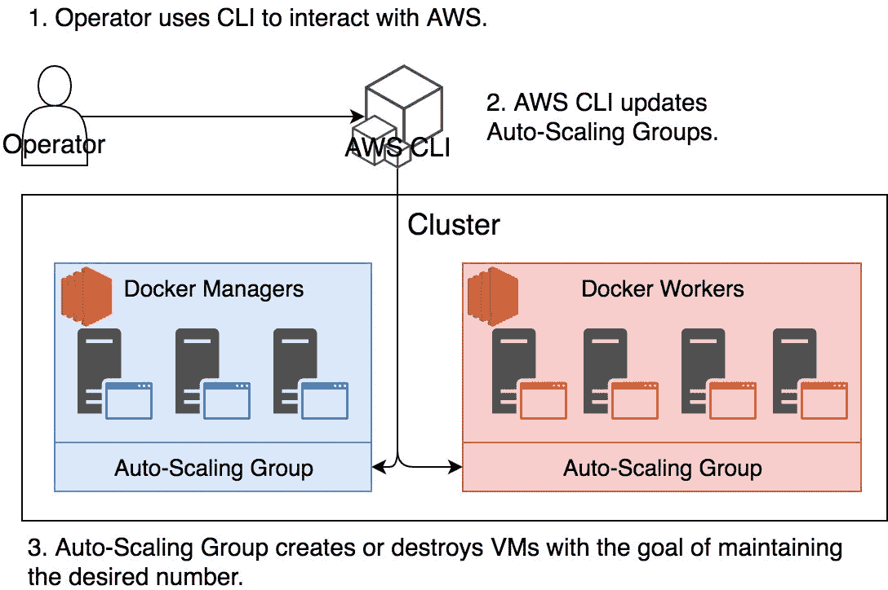
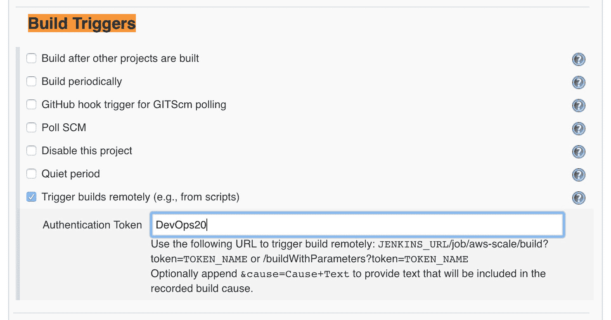
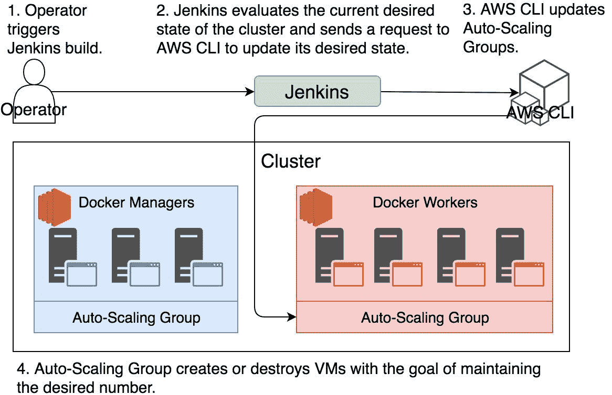
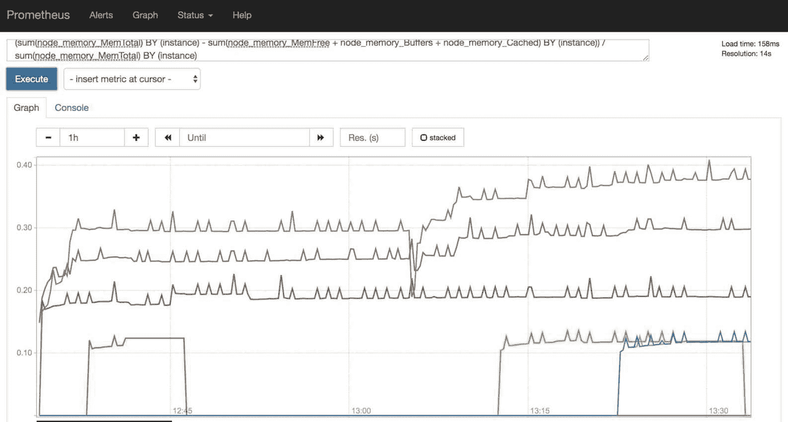
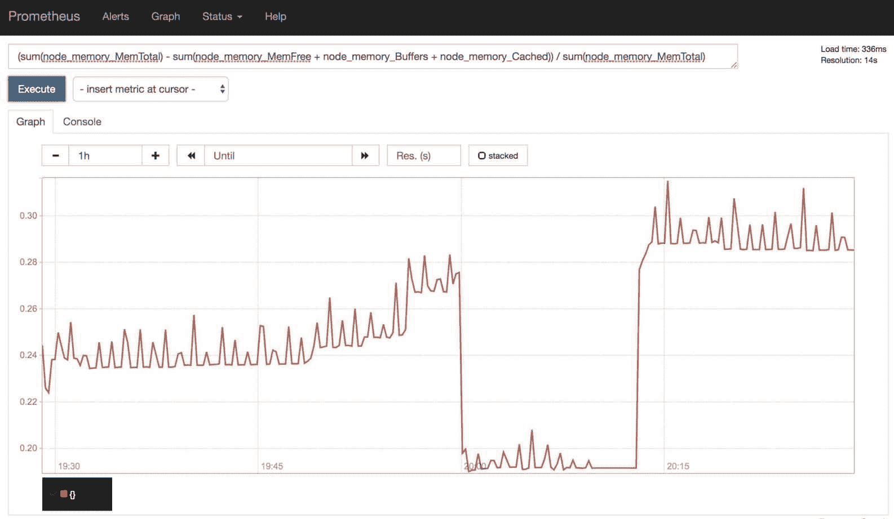
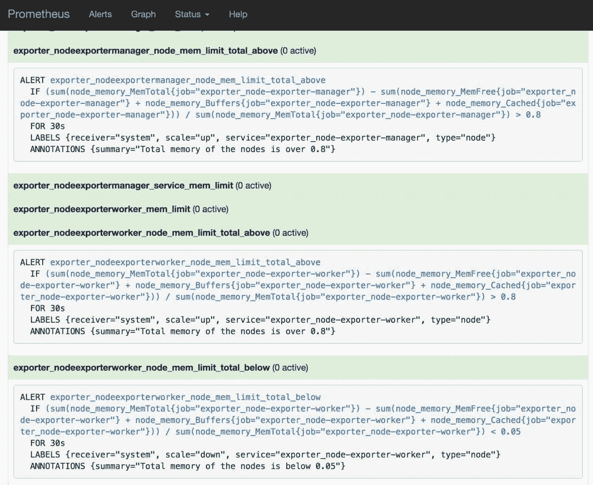
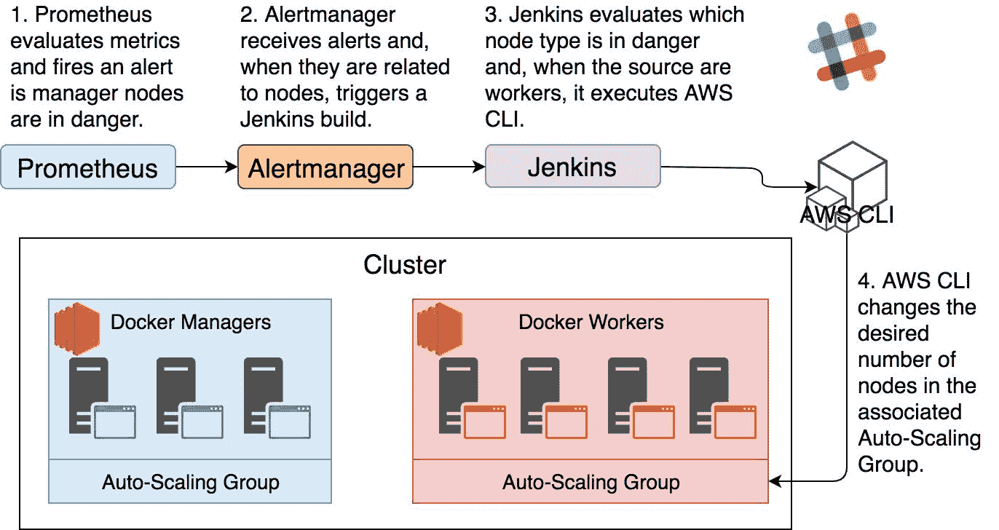
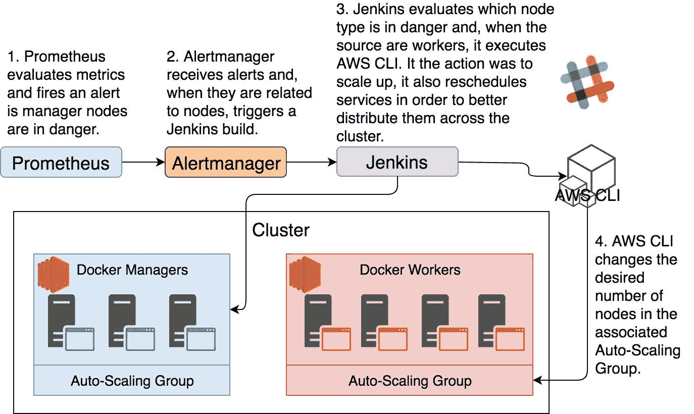

## 应用到基础设施的自适应

我们的目标触手可及。我们采用了调度器（在此案例中为 Docker Swarm），它为服务提供自我修复功能。我们观察到*Docker For AWS*在基础设施层面实现了类似的目标。我们使用了 Prometheus、Alertmanager 和 Jenkins 来构建一个能够自动适应不断变化条件的系统。我们存储在 Prometheus 中的指标，既有通过 exporters 收集的，也有通过仪表化（instrumentation）添加到我们服务中的。唯一缺少的就是应用于基础设施的自适应能力。如果我们能够实现这一点，我们将闭合这个循环，见证一个几乎无需人工干预即可自给自足的系统。

应用到基础设施的自适应逻辑与我们在服务中使用的逻辑大致相同。我们需要指标、警报和脚本，这些脚本会在条件变化时自动调整集群的容量。

我们已经拥有所有必需的工具。Prometheus 将继续收集指标并触发警报。Alertmanager 仍然是一个出色的选择，用来接收这些警报并将它们转发到不同的系统组件。我们将继续使用 Jenkins 作为一个工具，使我们能够快速编写与系统交互的脚本。由于我们使用 AWS 来托管集群，Jenkins 需要与 AWS 的 API 进行交互。

我们距离最终目标非常接近，我觉得我们应该跳过理论部分，直接进入本章的实际操作。因此，不再赘述，我们将再次创建我们的集群。

### 创建集群

在前一章中，我们已经探索了如何在没有 UI 的情况下创建集群。接下来的命令应该很熟悉，希望不需要太多解释。

请在执行后续命令之前，将`[...]`替换为你的密钥。

```
 `1` `export` `AWS_ACCESS_KEY_ID``=[`...`]`
 `2` 
 `3` `export` `AWS_SECRET_ACCESS_KEY``=[`...`]`
 `4` 
 `5` `export` `AWS_DEFAULT_REGION``=`us-east-1
 `6` 
 `7` `export` `STACK_NAME``=`devops22
 `8` 
 `9` `export` `KEY_NAME``=`devops22
`10` 
`11` aws cloudformation create-stack `\`
`12 `    --template-url https://editions-us-east-1.s3.amazonaws.com/aws/stable/Docker`\`
`13` .tmpl `\`
`14 `    --capabilities CAPABILITY_IAM `\`
`15 `    --stack-name `$STACK_NAME` `\`
`16 `    --parameters `\`
`17 `    `ParameterKey``=`ManagerSize,ParameterValue`=``3` `\`
`18 `    `ParameterKey``=`ClusterSize,ParameterValue`=``0` `\`
`19 `    `ParameterKey``=`KeyName,ParameterValue`=``$KEY_NAME` `\`
`20 `    `ParameterKey``=`EnableSystemPrune,ParameterValue`=`yes `\`
`21 `    `ParameterKey``=`EnableCloudWatchLogs,ParameterValue`=`no `\`
`22 `    `ParameterKey``=`EnableCloudStorEfs,ParameterValue`=`yes `\`
`23 `    `ParameterKey``=`ManagerInstanceType,ParameterValue`=`t2.small `\`
`24 `    `ParameterKey``=`InstanceType,ParameterValue`=`t2.small 
```

```````````````````````````````````````````````````````````````````````````````````````````````````````````````````` We defined a few environment variables and executed the `aws cloudformation create-stack` command that initiated creation of a cluster. It should take around five to ten minutes until it is finished.    ``` `1` aws cloudformation describe-stacks `\` `2 `    --stack-name `$STACK_NAME` `|` `\` `3 `    jq -r `".Stacks[0].StackStatus"`  ```   ``````````````````````````````````````````````````````````````````````````````````````````````````````````````````` If the output of the `describe-stacks` command is `CREATE_COMPLETE`, our cluster is fully operational, and we can continue. Otherwise, please wait for a while longer and recheck the stack status.    Next, we’ll retrieve cluster DNS and public IP of one of the manager nodes and store those values as environment variables `CLUSTER_DNS` and `CLUSTER_IP`.    ```  `1` `CLUSTER_DNS``=``$(`aws cloudformation `\`  `2`    describe-stacks `\`  `3`    --stack-name `$STACK_NAME` `|` `\`  `4`    jq -r `".Stacks[0].Outputs[] | \`  `5``    select(.OutputKey==\"DefaultDNSTarget\")\`  `6``    .OutputValue"``)`  `7`   `8` `CLUSTER_IP``=``$(`aws ec2 describe-instances `\`  `9`    `|` jq -r `".Reservations[] \` `10 ``    .Instances[] \` `11 ``    | select(.SecurityGroups[].GroupName \` `12 ``    | contains(\"``$STACK_NAME``-ManagerVpcSG\"))\` `13 ``    .PublicIpAddress"` `\` `14 `    `|` tail -n `1``)`  ```   `````````````````````````````````````````````````````````````````````````````````````````````````````````````````` Once we enter the cluster, we’ll create a file that will hold the environment variables we’ll need inside the cluster. Those are the same variables we already defined on our host. We’ll output them so that we can easily copy and paste them when we enter one of the nodes.    ``` `1` `echo` `"` `2` `export CLUSTER_DNS=``$CLUSTER_DNS` ````` `3` `export AWS_ACCESS_KEY_ID=``$AWS_ACCESS_KEY_ID` ```` `4` `export AWS_SECRET_ACCESS_KEY=``$AWS_SECRET_ACCESS_KEY` ``` `5` `export AWS_DEFAULT_REGION=``$AWS_DEFAULT_REGION` `` `6` `"` `` ``` ```` `````  ```   ````````````````````````````````````````````````````````````````````````````````````````````````````````````````` ```````````````````````````````````````````````````````````````````````````````````````````````````````````````` ``````````````````````````````````````````````````````````````````````````````````````````````````````````````` Please copy the output of the `echo` command. We’ll use it soon.    Now that we got all the cluster information we’ll need, we can `ssh` into one of the manager nodes.    ``` `1` ssh -i `$KEY_NAME`.pem docker@`$CLUSTER_IP`  ```   `````````````````````````````````````````````````````````````````````````````````````````````````````````````` Next, we’ll create a file that will hold all the information we’ll need. That way we’ll be able to get in and out of the cluster without losing the ability to retrieve that data quickly.    ``` `1` `echo` `"` `2` `export CLUSTER_DNS=[...]` `3` `export AWS_ACCESS_KEY_ID=[...]` `4` `export AWS_SECRET_ACCESS_KEY=[...]` `5` `export AWS_DEFAULT_REGION=[...]` `6` `"`>creds  ```   ````````````````````````````````````````````````````````````````````````````````````````````````````````````` Instead of typing the command from above, please type `echo "`, paste the output you copied a moment ago, and close it with `">creds`. The result should be four `export` commands inside the `creds` file.    Let’s download a script that will deploy (almost) all the services we used in the previous chapter.    ``` `1` curl -o aws-services-15.sh `\` `2 `    https://raw.githubusercontent.com/vfarcic/docker-flow-monitor/master/scripts`\` `3` /aws-services-15.sh `4`  `5` chmod +x aws-services-15.sh  ```   ```````````````````````````````````````````````````````````````````````````````````````````````````````````` We download the script and gave it execute permissions.    Now we are ready to deploy the services.    ``` `1` `source` creds `2`  `3` ./aws-services-15.sh `4`  `5` docker stack ls  ```   ``````````````````````````````````````````````````````````````````````````````````````````````````````````` Since `aws-services-15.sh` needs environment variable `CLUSTER_DNS`, we exported it by executing `source`. Further on, we executed the script and listed all the stacks deployed to the cluster. The output is as follows.    ``` `1` NAME                SERVICES `2` exporter            3 `3` go-demo             2 `4` jenkins             2 `5` monitor             3 `6` proxy               2  ```   `````````````````````````````````````````````````````````````````````````````````````````````````````````` You’ll notice that the `logging` stack is missing. We did not deploy it since it is not relevant to the goals we’re trying to accomplish in this chapter and, at the same time, it requires extra nodes. Since I am committed towards not making you spend more money than needed, it seemed like a sensible thing not to deploy that stack.    Finally, let’s get out of the cluster and explore how we could scale it manually. That will give us an insight into the processes we’ll want to automate.    ``` `1` `exit`  ```   ````````````````````````````````````````````````````````````````````````````````````````````````````````` ### Scaling Nodes Manually    Let’s explore how we can scale nodes manually and, later on, try to apply the same logic to our automated processes.    We’re running the cluster in AWS which already has auto-scaling groups defined for both managers and workers. In such a setting, the most sensible way to scale the nodes is to change the desired capacity of those groups.    When new nodes are created by auto-scaling groups in *Docker For AWS* or *Azure*, they will join the cluster as managers or workers. If you choose not to use *Docker For AWS* or *Azure*, you’ll have to do some additional work to replicate the same functionality as the one we’re about to explore. You’ll have to create init scripts that will find IP of one of the managers, retrieve join token, and, finally, execute `docker swarm join` command.    No matter which hosting vendor you’re using, the logic should, more or less, be always the same. We need to change the number of running managers or workers and, in case that number increased, join new nodes to the cluster. I am confident that you’ll be able to modify the logic that follows to your cluster setup.    The first thing we need to do is find out the name of the auto-scaling group created for our cluster. A good start is to list all the groups by executing `aws autoscaling describe-auto-scaling-groups` command.    ``` `1` aws autoscaling `\` `2 `    describe-auto-scaling-groups `\` `3 `    `|` jq `"."`  ```   ```````````````````````````````````````````````````````````````````````````````````````````````````````` The output is too big to be presented in a book format, and we do not need it in its entirety. Therefore, we’ll limit the output. Luckily, we know that the name of the auto-scaling group starts with `[STACK_NAME]-Node`. We can use that to filter the output.    A command that will retrieve only the auto-scaling group assigned to worker nodes and retrieve just the name of the group is as follows.    ``` `1` aws autoscaling `\` `2 `    describe-auto-scaling-groups `\` `3 `    `|` jq -r `".AutoScalingGroups[] \` `4 ``    | select(.AutoScalingGroupName \` `5 ``    | startswith(\"``$STACK_NAME``-NodeAsg-\"))\` `6 ``    .AutoScalingGroupName"`  ```   ``````````````````````````````````````````````````````````````````````````````````````````````````````` We used `jq` to retrieve all data within the root node `AutoScalingGroups`. Further on, we used `select` command to retrieve only records with `AutoScalingGroupName` that starts with `[STACK_NAME]-Node`. Finally, we limited the output further so that only the name of the name of the group is retrieved.    The output will vary from one case to another. It should be similar to the one that follows.    ``` `1` devops22-NodeAsg-1J93DRR7VYUHU  ```   `````````````````````````````````````````````````````````````````````````````````````````````````````` We cannot change the auto-scaling group desired capacity without knowing what the current number of nodes is. Therefore, we need to construct another query that will provide that information. Fortunately, the command is very similar since all we need is to retrieve a different value based on the same filter.    ``` `1` aws autoscaling `\` `2 `    describe-auto-scaling-groups `\` `3 `    `|` jq -r `".AutoScalingGroups[] \` `4 ``    | select(.AutoScalingGroupName \` `5 ``    | startswith(\"``$STACK_NAME``-NodeAsg-\"))\` `6 ``    .DesiredCapacity"`  ```   ````````````````````````````````````````````````````````````````````````````````````````````````````` When compared with the previous command, the only change is that, this time, we retrieved `DesiredCapacity` instead `AutoScalingGroupName`. The output is `0`. That should come as no surprise since we specified that we did not want any workers when we created the cluster.    We’ll repeat the command we used to retrieve the name of the auto-scaling group and, this time, we’ll put the result as a value of an environment variable. That way we’ll be able to reuse it across the commands we’ll execute later on.    ``` `1` `ASG_NAME``=``$(`aws autoscaling `\` `2 `    describe-auto-scaling-groups `\` `3 `    `|` jq -r `".AutoScalingGroups[] \` `4 ``    | select(.AutoScalingGroupName \` `5 ``    | startswith(\"``$STACK_NAME``-NodeAsg-\"))\` `6 ``    .AutoScalingGroupName"``)`  ```   ```````````````````````````````````````````````````````````````````````````````````````````````````` Now that we have the name of the auto-scaling group, we can increase the desired capacity from `0` to `1`.    ``` `1` aws autoscaling `\` `2 `    update-auto-scaling-group `\` `3 `    --auto-scaling-group-name `$ASG_NAME` `\` `4 `    --desired-capacity `1`  ```   ``````````````````````````````````````````````````````````````````````````````````````````````````` Let’s confirm that the capacity is indeed increased.    ``` `1` aws autoscaling `\` `2 `    describe-auto-scaling-groups `\` `3 `    --auto-scaling-group-names `$ASG_NAME` `\` `4 `    `|` jq `".AutoScalingGroups[0]\` `5 ``    .DesiredCapacity"`  ```   `````````````````````````````````````````````````````````````````````````````````````````````````` We executed `describe-auto-scaling-groups` one more time. However, since now we know the name of the group, there was no need for `jq` filters.    As expected, the output is `1` confirming that the update indeed worked.    The fact that the desired capacity of the group was updated does not necessarily mean that a new node was created. We can check that easily by executing `ec2 describe-instances` combined with a bit of `jq` magic.    ``` `1` aws ec2 describe-instances `|` jq -r `\` `2 `    `".Reservations[].Instances[] \` `3 ``    | select(.SecurityGroups[].GroupName \` `4 ``    | startswith(\"``$STACK_NAME``-NodeVpcSG\"))\` `5 ``    .InstanceId"`  ```   ````````````````````````````````````````````````````````````````````````````````````````````````` We executed `ec2 describe-instances` and used `jq` to retrieve all instances, filter them by the security group which has a name that starts with a predictable string, and retrieved the ID of the only worker instance. The output should be similar to the one that follows.    ``` `1` i-06f7e78c063fedeb3  ```   ```````````````````````````````````````````````````````````````````````````````````````````````` Creation of an EC2 instance is fast. What takes a bit of time is its initialization. We should check its status and confirm that it finished initializing.    ```  `1` `INSTANCE_ID``=``$(`aws ec2 `\`  `2`    describe-instances `|` jq -r `\`  `3`    `".Reservations[].Instances[] \`  `4``    | select(.SecurityGroups[].GroupName \`  `5``    | startswith(\"``$STACK_NAME``-NodeVpcSG\"))\`  `6``    .InstanceId"``)`  `7`   `8` aws ec2 describe-instance-status `\`  `9`    --instance-ids `$INSTANCE_ID` `\` `10 `    `|` jq -r `".InstanceStatuses[0]\` `11 ``    .InstanceStatus.Status"`  ```   ``````````````````````````````````````````````````````````````````````````````````````````````` We repeated the previous command but, this time, stored the instance ID as the environment variable `INSTANCE_ID`. Later on, we used it with the `ec2 describe-instance-status` command to retrieve the status.    If the output is `ok`, the new node is created, is initialized, and (probably) joined the cluster. Otherwise, please wait for a minute or two and recheck the status.    Finally, let’s confirm that the new node indeed joined the Swarm cluster.    ``` `1` ssh -i `$KEY_NAME`.pem docker@`$CLUSTER_IP` `2`  `3` docker node ls `4`  `5` `exit`  ```   `````````````````````````````````````````````````````````````````````````````````````````````` We entered one of the manager servers, listed all the nodes of the cluster, and returned to the host.    The output of the `node ls` command is as follows (IDs are removed for brevity).    ``` `1` HOSTNAME                                    STATUS AVAILABILITY MANAGER STATUS `2` ip-172-31-40-169.us-east-2.compute.internal Ready  Active `3` ip-172-31-24-32.us-east-2.compute.internal  Ready  Active       Reachable `4` ip-172-31-2-29.us-east-2.compute.internal   Ready  Active       Leader `5` ip-172-31-42-64.us-east-2.compute.internal  Ready  Active       Reachable  ```   ````````````````````````````````````````````````````````````````````````````````````````````` That’s brilliant! The new worker joined the cluster, and our capacity increased. If, in your case, the new node did not yet join the cluster, please wait for a few moments and list the nodes again.    Figure 15-1: Manual updates of Auto-Scaling Groups    There are a few other manual actions we should explore before we move towards automation. But, before we proceed, we’ll change the auto-scaling group one more time. We’ll set the desired capacity back to `0`. That way we’ll not only confirm that the process works in both directions, but also save a bit of money by not running more nodes than we need.    ``` `1` aws autoscaling `\` `2 `    update-auto-scaling-group `\` `3 `    --auto-scaling-group-name `$ASG_NAME` `\` `4 `    --desired-capacity `0`  ```   ```````````````````````````````````````````````````````````````````````````````````````````` We updated the auto-scaling group back to the desired capacity of `0`.    After a while, we can return to the cluster and confirm that the worker is removed from the cluster.    ``` `1` ssh -i `$KEY_NAME`.pem docker@`$CLUSTER_IP` `2`  `3` docker node ls  ```   ``````````````````````````````````````````````````````````````````````````````````````````` The output of the `node ls` command is as follows (IDs are removed for brevity).    ``` `1` HOSTNAME                                    STATUS AVAILABILITY MANAGER STATUS `2` ip-172-31-40-169.us-east-2.compute.internal Down   Active `3` ip-172-31-24-32.us-east-2.compute.internal  Ready  Active       Reachable `4` ip-172-31-2-29.us-east-2.compute.internal   Ready  Active       Leader `5` ip-172-31-42-64.us-east-2.compute.internal  Ready  Active       Reachable  ```   `````````````````````````````````````````````````````````````````````````````````````````` As you can see, the status of the worker node is set to `Down`. Swarm lost communication with the node once the auto-scaling group shut it down and changed its status. Soon it will remove it completely from its records.    We still have one more problem to solve. We cannot run `aws` commands from the cluster. *Docker For AWS* does not let us install any additional software. Even if we would find the way to install the CLI, we should not pollute our production servers. Instead, we should run any tool we need thorough a container.    Since there is no official AWS CLI Docker image, I created one for the exercises in this chapter. Let’s take a look at the Dockerfile.    ``` `1` curl `"https://raw.githubusercontent.com/vfarcic/docker-aws-cli/master/Dockerfile"`  ```   ````````````````````````````````````````````````````````````````````````````````````````` ```  `1` FROM alpine  `2`   `3` MAINTAINER Viktor Farcic <viktor@farcic.com>  `4`   `5` RUN apk --update add python py-pip jq && \  `6`    pip install awscli && \  `7`    apk del py-pip && \  `8`    rm -rf /var/cache/apk/*  `9`  `10` ENV AWS_ACCESS_KEY_ID "" `11` ENV AWS_SECRET_ACCESS_KEY "" `12` ENV AWS_DEFAULT_REGION "us-east-1"  ```   ```````````````````````````````````````````````````````````````````````````````````````` As you can see, it’s pretty straightforward. The image is based on `alpine` and installs `python`, `py-pip`, and `jq`. We’re installing Python since `pip` is the easiest way to install `awscli`. The rest of the image specification defines a few environment variables required by the AWS CLI. The image was built and pushed as `vfarcic/aws-cli`.    Let’s do a test run of a container based on the image.    ``` `1` `source` creds `2`  `3` docker container run --rm `\` `4 `    -e `AWS_ACCESS_KEY_ID``=``$AWS_ACCESS_KEY_ID` `\` `5 `    -e `AWS_SECRET_ACCESS_KEY``=``$AWS_SECRET_ACCESS_KEY` `\` `6 `    -e `AWS_DEFAULT_REGION``=``$AWS_DEFAULT_REGION` `\` `7 `    vfarcic/aws-cli `\` `8 `    aws ec2 describe-instances  ```   ``````````````````````````````````````````````````````````````````````````````````````` We sourced the `creds` file that contains the environment variables we need. Further on we run a container based on the `vfarcic/aws-cli` image. We used `aws ec2 describe-instances` as the command only to demonstrate that any `aws` command could be executed through a container. The result should be information about all the EC2 nodes we have in that region.    We’re using the `creds` file only as a convenience and for demo purposes since we cannot inject a secret into a container. It must be a Swarm service.    The `docker container run` command we executed is too long to remember. We can mitigate that by creating a Docker Compose YAML file with all the `aws` commands we need. An example of such a file can be found in the [vfarcic/docker-aws-cli](https://github.com/vfarcic/docker-aws-cli) repository. It contains all the commands we’ll use in this chapter.    Let’s take a brief look at it.    ``` `1` curl `"https://raw.githubusercontent.com/vfarcic/docker-aws-cli/master/docker-com\` `2` `pose.yml"`  ```   `````````````````````````````````````````````````````````````````````````````````````` The output is as follows.    ```  `1` version: '3.2'  `2`   `3` services:  `4`   `5`  asg-name:  `6`    image: vfarcic/aws-cli  `7`    environment:  `8`      - AWS_ACCESS_KEY_ID=`${``AWS_ACCESS_KEY_ID``}`  `9`      - AWS_SECRET_ACCESS_KEY=`${``AWS_SECRET_ACCESS_KEY``}` `10 `      - AWS_DEFAULT_REGION=`${``AWS_DEFAULT_REGION``}` `11 `    command: sh -c "aws autoscaling describe-auto-scaling-groups | jq -r '.AutoS\ `12` calingGroups[] | select(.AutoScalingGroupName | startswith(\"`${``STACK_NAME``}`--Node\ `13` Asg\")).AutoScalingGroupName'" `14`  `15 `  asg-desired-capacity: `16 `    image: vfarcic/aws-cli `17 `    environment: `18 `      - AWS_ACCESS_KEY_ID=`${``AWS_ACCESS_KEY_ID``}` `19 `      - AWS_SECRET_ACCESS_KEY=`${``AWS_SECRET_ACCESS_KEY``}` `20 `      - AWS_DEFAULT_REGION=`${``AWS_DEFAULT_REGION``}` `21 `    command: sh -c "aws autoscaling describe-auto-scaling-groups --auto-scaling-\ `22` group-names `$ASG_NAME` | jq '.AutoScalingGroups[0].DesiredCapacity'" `23`  `24 `  asg-update-desired-capacity: `25 `    image: vfarcic/aws-cli `26 `    environment: `27 `      - AWS_ACCESS_KEY_ID=`${``AWS_ACCESS_KEY_ID``}` `28 `      - AWS_SECRET_ACCESS_KEY=`${``AWS_SECRET_ACCESS_KEY``}` `29 `      - AWS_DEFAULT_REGION=`${``AWS_DEFAULT_REGION``}` `30 `    command: sh -c "aws autoscaling update-auto-scaling-group --auto-scaling-gro\ `31` up-name `$ASG_NAME` --desired-capacity `$ASG_DESIRED_CAPACITY`"  ```   ````````````````````````````````````````````````````````````````````````````````````` We won’t go into details of the services defined in that YAML file. It should be self explanatory what each of them does.    Please note that `docker-compose` is not installed on the nodes of the cluster. We will not need it since the plan is to use those Compose services through Jenkins agents which will have Docker Compose.    Let’s move on and explore how to transform the commands we used so far into automated scaling solution.    ### Creating Scaling Job    Let’s try to translate the commands we executed manually into a Jenkins job. If we manage to do that, we can go further and let Alertmanager trigger that job whenever certain thresholds are reached in Prometheus.    We’ll start by downloading Jenkins stack from the [vfarcic/docker-flow-monitor](http://github.com/vfarcic/docker-flow-monitor) repository.    ``` `1` curl -o jenkins.yml `\` `2 `    https://raw.githubusercontent.com/vfarcic/docker-flow-monitor/master/stacks/`\` `3` jenkins-aws-secret.yml `4`  `5` cat jenkins.yml  ```   ```````````````````````````````````````````````````````````````````````````````````` The stack definition we just downloaded is almost identical to the one we used before so we’ll comment only the differences.    ```  `1` version: "3.2"  `2`   `3` services:  `4`   `5`  ...  `6`   `7`  agent:  `8`    image: vfarcic/jenkins-swarm-agent  `9`    ... `10 `    secrets: `11 `      - aws `12 `      ... `13`  `14` secrets: `15 `  aws: `16 `    external: true `17 `  ...  ```   ``````````````````````````````````````````````````````````````````````````````````` The only new addition to the Jenkins stack is the `aws` secret. It should contain AWS keys and the region we’ll need for AWS CLI. So, let’s start by creating the secret.    ``` `1` `source` creds `2`  `3` `echo` `"` `4` `export AWS_ACCESS_KEY_ID=``$AWS_ACCESS_KEY_ID` ```` `5` `export AWS_SECRET_ACCESS_KEY=``$AWS_SECRET_ACCESS_KEY` ``` `6` `export AWS_DEFAULT_REGION=``$AWS_DEFAULT_REGION` `` `7` `export STACK_NAME=devops22` `8` `"` `|` docker secret create aws - `` ``` ````  ```   `````````````````````````````````````````````````````````````````````````````````` ````````````````````````````````````````````````````````````````````````````````` ```````````````````````````````````````````````````````````````````````````````` We sourced the `creds` file and used the environment variables to construct the `aws` secret.    Now we can deploy the `jenkins` stack.    ``` `1` docker stack deploy `\` `2 `    -c jenkins.yml jenkins `3`  `4` `exit`  ```   ``````````````````````````````````````````````````````````````````````````````` We deployed the stack and exited the cluster.    Jenkins has a small nuance with its URL. If we do not change anything, it will not know what its address is and, when we construct notification messages, it’ll resolve itself to `null`. Fortunately, the fix is reasonably easy. All we have to do is open the configuration page and click the *Save* button.    ``` `1` open `"http://``$CLUSTER_DNS``/jenkins/configure"`  ```   `````````````````````````````````````````````````````````````````````````````` Please login using *admin* as both the *User* and the *Password*. Once you’re authenticated, you’ll see the configuration screen which, among other fields, contains *Jenkins URL*. Please confirm that it is correct and click the *Save* button.    Figure 15-2: Jenkins URL configuration    Now that we resolved Jenkins’ identity crisis, we can create a new job capable of scaling nodes of the cluster.    ``` `1` open `"http://``$CLUSTER_DNS``/jenkins/view/all/newJob"`  ```   ````````````````````````````````````````````````````````````````````````````` Please type *aws-scale* as the job name, select *Pipeline* as the job type, and click the *OK* button. You’ll see the job configuration screen.    Since we’re planning to trigger builds remotely, we should create an authentication token. Please click the *Build Triggers* tab, select the *Trigger builds remotely* checkbox, and type *DevOps22* as the *Authentication Token*.    Figure 15-3: Jenkins job build triggers    Now we’re ready to define a pipeline script.    Please click the *Pipeline* tab and type the script that follows in the *Pipeline Script* field.    ```  `1` `pipeline` `{`  `2`  `agent` `{`  `3`    `label` `"prod"`  `4`  `}`  `5`  `options` `{`  `6`    `buildDiscarder``(``logRotator``(``numToKeepStr:` `'2'``))`  `7`    `disableConcurrentBuilds``()`  `8`  `}`  `9`  `parameters` `{` `10 `    `string``(` `11 `      `name:` `"scale"``,` `12 `      `defaultValue:` `"1"``,` `13 `      `description:` `"The number of worker nodes to add or remove"` `14 `    `)` `15 `  `}` `16 `  `stages` `{` `17 `    `stage``(``"scale"``)` `{` `18 `      `steps` `{` `19 `        `git` `"https://github.com/vfarcic/docker-aws-cli.git"` `20 `        `script` `{` `21 `          `def` `asgName` `=` `sh``(` `22 `            `script:` `"source /run/secrets/aws && docker-compose run --rm asg-name\` `23` `"``,` `24 `            `returnStdout:` `true` `25 `          `).``trim``()` `26 `          `if` `(``asgName` `==` `""``)` `{` `27 `            `error` `"Could not find auto-scaling group"` `28 `          `}` `29 `          `def` `asgDesiredCapacity` `=` `sh``(` `30 `            `script:` `"source /run/secrets/aws && ASG_NAME=${asgName} docker-compo\` `31` `se run --rm asg-desired-capacity"``,` `32 `            `returnStdout:` `true` `33 `          `).``trim``().``toInteger``()` `34 `          `def` `asgNewCapacity` `=` `asgDesiredCapacity` `+` `scale``.``toInteger``()` `35 `          `if` `(``asgNewCapacity` `<` `1``)` `{` `36 `            `error` `"The number of worker nodes is already at the minimum capacity\` `37 `` of 1"` `38 `          `}` `else` `if` `(``asgNewCapacity` `>` `3``)` `{` `39 `            `error` `"The number of worker nodes is already at the maximum capacity\` `40 `` of 3"` `41 `          `}` `else` `{` `42 `            `sh` `"source /run/secrets/aws && ASG_NAME=${asgName} ASG_DESIRED_CAPAC\` `43` `ITY=${asgNewCapacity} docker-compose run --rm asg-update-desired-capacity"` `44 `            `echo` `"Changed the number of worker nodes from ${asgDesiredCapacity} \` `45` `to ${asgNewCapacity}"` `46 `          `}` `47 `        `}` `48 `      `}` `49 `    `}` `50 `  `}` `51 `  `post` `{` `52 `    `success` `{` `53 `      `slackSend``(` `54 `        `color:` `"good"``,` `55 `        `message:` `"""Worker nodes were scaled.` `56` `Please check Jenkins logs for the job ${env.JOB_NAME} #${env.BUILD_NUMBER}` `57` `${env.BUILD_URL}console"""` `58 `      `)` `59 `    `}` `60 `    `failure` `{` `61 `      `slackSend``(` `62 `        `color:` `"danger"``,` `63 `        `message:` `"""Worker nodes could not be scaled.` `64` `Please check Jenkins logs for the job ${env.JOB_NAME} #${env.BUILD_NUMBER}` `65` `${env.BUILD_URL}console"""` `66 `      `)` `67 `    `}` `68 `  `}` `69` `}`  ```   ```````````````````````````````````````````````````````````````````````````` You should be able to understand most of the Pipeline without any help so I’ll limit the discussion on the steps of the `scale` stage.    We start by cloning the `vfarcic/docker-aws-cli` repository that contains `docker-compose.yml` file with AWS CLI services we’ll need.    Next, we’re executing Docker Compose service `asg-name` that retrieves the name of the auto-scaling group associated with worker nodes. The result is stored in the variable `asgName`. Since all the services defined in that Compose file require environment variables with AWS keys and the region where the cluster is running, we’re executing `source /run/secrets/aws` before `docker-compose` commands. The file was injected as the Docker secret `aws`.    Further on, we’re retrieving the current desired capacity. The new capacity is calculated by adding the value of the `scale` parameter to the current capacity. Finally, we have a simple `if/else` statement that throws an error if the future capacity would be lower than `1` or higher than `3` nodes. That way we are setting boundaries so that the system cannot expand or contract too much. You should change those limits to better match your current size of the cluster.    Finally, if the new capacity is within the boundaries, we are updating the auto-scaling group.    As you can see, the script is relatively simple and straightforward. Even though this might not be the final version that fits everyone’s purposes, the general gist is there, and I’m confident that you’ll have no problem adapting it to suit your needs.    Do not forget to click the *Save* button before moving forward.    Let’s give the job a spin.    ``` `1` open `"http://``$CLUSTER_DNS``/jenkins/blue/organizations/jenkins/aws-scale/activity"`  ```   ``````````````````````````````````````````````````````````````````````````` You should see the `aws-scale` screen with the *Run* button in the middle. Please click it.    We already discussed the bug that makes the first build of a Pipeline job with properties fail. All subsequent builds should work properly, so we’ll give it another try.    Please reload the page and click the *Run* button. You’ll be presented with a screen with a single parameter that allows us to specify how many nodes we’d like to add or remove. Leave the default value of `1` and click the *Run* button. A new build will start.    Please click on the row that represents the new build and explore it. The second to last step should state that the number of workers changed from `0` to `1`.    Figure 15-4: Jenkins build results    As you saw before, it takes a minute or two until a new node is created and initialized. Fetch a coffee. By the time you come back, the new node will be fully operational within the cluster.    Let’s enter one of the manager nodes and confirm that the new node joined the Swarm cluster.    ``` `1` ssh -i `$KEY_NAME`.pem docker@`$CLUSTER_IP` `2`  `3` docker node ls  ```   `````````````````````````````````````````````````````````````````````````` The output is as follows (IDs are removed for brevity).    ``` `1` HOSTNAME                                    STATUS AVAILABILITY MANAGER STATUS `2` ip-172-31-31-102.us-east-2.compute.internal Ready  Active       Reachable `3` ip-172-31-33-251.us-east-2.compute.internal Ready  Active `4` ip-172-31-34-254.us-east-2.compute.internal Ready  Active       Reachable `5` ip-172-31-7-121.us-east-2.compute.internal  Ready  Active       Leader  ```   ````````````````````````````````````````````````````````````````````````` As you can see, the new worker indeed joined the cluster. In your cluster, the new node might not yet be initialized. If that’s the case, please wait for a minute or two and re-execute `docker node ls`.    Figure 15-5: Infrastructure scaling orchestrated by Jenkins    UI is useful as a learning experience, but our goal is to trigger the job remotely. Let’s check whether we can send a `POST` request.    ``` `1` `exit` `2`  `3` curl -XPOST -i `\` `4 `    `"http://``$CLUSTER_DNS``/jenkins/job/aws-scale/buildWithParameters?token=DevOps2\` `5` `2&scale=2"`  ```   ```````````````````````````````````````````````````````````````````````` We exited the cluster and sent a post request with the token and the `scale` parameter set to `2`. The response is as follows.    ``` `1` HTTP/1.1 201 Created `2` Connection: close `3` Date: Sat, 23 Sep 2017 20:07:21 GMT `4` X-Content-Type-Options: nosniff `5` Location: http://devops22-ExternalL-1OG8BA7IMZCT0-900324820.us-east-2.elb.amazon\ `6` aws.com/jenkins/queue/item/5/ `7` Server: Jetty(9.4.z-SNAPSHOT)  ```   ``````````````````````````````````````````````````````````````````````` Let’s confirm that Jenkins build was executed successfully.    ``` `1` open `"http://``$CLUSTER_DNS``/jenkins/blue/organizations/jenkins/aws-scale/activity"`  ```   `````````````````````````````````````````````````````````````````````` Please click the last build and observe that the number of nodes scaled. Similarly, you should see a new notification in *#df-monitor-tests* in the *DevOps20* Slack channel.    Figure 15-6: Slack notification indicating that nodes scaled    Finally, we’ll go back to the cluster and confirm not only that a new node was created but also that it joined the cluster.    ``` `1` ssh -i `$KEY_NAME`.pem docker@`$CLUSTER_IP` `2`  `3` docker node ls  ```   ````````````````````````````````````````````````````````````````````` The output is as follows (IDs are removed for brevity).    ``` `1` HOSTNAME                                   STATUS AVAILABILITY MANAGER STATUS `2` ip-172-31-24-32.us-east-2.compute.internal Ready  Active       Reachable `3` ip-172-31-2-29.us-east-2.compute.internal  Ready  Active       Leader `4` ip-172-31-42-64.us-east-2.compute.internal Ready  Active       Reachable `5` ip-172-31-24-95.us-east-2.compute.internal Ready  Active `6` ip-172-31-34-28.us-east-2.compute.internal Ready  Active `7` ip-172-31-4-136.us-east-2.compute.internal Ready  Active  ```   ```````````````````````````````````````````````````````````````````` The number of worker nodes increased from one to three. If you do not yet see three worker nodes, please wait for a minute or two and re-run the `docker node ls` command.    Let’s test whether the limits we set are respected. Remember, our Pipeline script should not allow less than one nor more than three worker nodes. Since we are already running three workers, we should be able to test it by attempting to add one more.    ``` `1` `exit` `2`  `3` curl -XPOST -i `\` `4 `    `"http://``$CLUSTER_DNS``/jenkins/job/aws-scale/buildWithParameters?token=DevOps2\` `5` `2&scale=1"`  ```   ``````````````````````````````````````````````````````````````````` We exited the cluster and sent a `POST` request to build the `aws-scale` job with the `scale` parameter set to `1`.    Let’s see the result in Jenkins UI.    ``` `1` open `"http://``$CLUSTER_DNS``/jenkins/blue/organizations/jenkins/aws-scale/activity"`  ```   `````````````````````````````````````````````````````````````````` You should see that the last build failed. We tried to add more workers than allowed and the build responded with an error. Similarly, we should see an error notification in *#df-monitor-tests* in the *DevOps20* Slack channel.    Figure 15-7: Slack notification indicating that node scaling failed    It won’t hurt to check whether de-scaling nodes works as well.    ``` `1` curl -XPOST -i `\` `2 `    `"http://``$CLUSTER_DNS``/jenkins/job/aws-scale/buildWithParameters?token=DevOps2\` `3` `2&scale=-2"`  ```   ````````````````````````````````````````````````````````````````` We sent a similar `POST` request like a few times before. The only notable difference is that the `scale` param is now set to `-2`. As a result, two worker nodes should be removed, leaving us with one.    At this point, there should be no need to check build results in Jenkins or notifications in Slack. The system proved to be working well. So, we’ll skip through those and jump straight into the cluster and output the list of joined nodes.    ``` `1` ssh -i `$KEY_NAME`.pem docker@`$CLUSTER_IP` `2`  `3` docker node ls  ```   ```````````````````````````````````````````````````````````````` We entered the cluster and listed all the nodes.    The output is as follows (IDs are removed for brevity).    ``` `1` HOSTNAME                                   STATUS AVAILABILITY MANAGER STATUS `2` ip-172-31-24-32.us-east-2.compute.internal Ready  Active       Reachable `3` ip-172-31-2-29.us-east-2.compute.internal  Ready  Active       Leader `4` ip-172-31-42-64.us-east-2.compute.internal Ready  Active       Reachable `5` ip-172-31-24-95.us-east-2.compute.internal Down   Active `6` ip-172-31-34-28.us-east-2.compute.internal Ready  Active `7` ip-172-31-4-136.us-east-2.compute.internal Down   Active  ```   ``````````````````````````````````````````````````````````````` You’ll notice that status of two of the nodes is set to `Down`. If, in your case, all the nodes are still `Ready`, you might need to wait for a minute or two and re-execute the `docker node ls` command. On the other hand, if you were not fast enough, Swarm might have cleaned its registry, and the two nodes that were `down` might have been removed altogether.    Finally, the last verification we should do is to check whether the lower limit is respected as well.    ``` `1` `exit` `2`  `3` curl -XPOST -i `\` `4 `    `"http://``$CLUSTER_DNS``/jenkins/job/aws-scale/buildWithParameters?token=DevOps2\` `5` `2&scale=-1"`  ```   `````````````````````````````````````````````````````````````` You know what to do. Visit the last build in Jenkins, check Slack, list Swarm nodes, or trust me blindly. The number of worker nodes should be left intact since we are running only one and reducing them to zero would violate the lower limit we set in the pipeline job.    Now that we confirmed that triggering the `aws-scale` job (de)scales our worker nodes, we can turn our attention to Prometheus and Alertmanager and try to tie them all together into a system that will, for example, scale the number of workers depending on memory usage.    ### Scaling Cluster Nodes Automatically    We created the last piece of the chain. Jenkins job will scale nodes of a cluster only if something triggers it. We did that manually by sending `POST` requests but, as you might have guessed, that is not our ultimate goal. We need to run those builds through alerts based on metrics. Therefore, we’ll move back to the beginning of the chain and explore some of the metrics we can use and try to convert them into meaningful alerts.    Let’s open Prometheus and try to define an alert worthy of our scaling needs.    ``` `1` open `"http://``$CLUSTER_DNS``/monitor"`  ```   ````````````````````````````````````````````````````````````` Please use *admin* as both the *User Name* and the *Password* if you’re asked to authenticate.    We’ll start with an expression we already used in the previous chapters.    Please type the query that follows in the *Expression* field, click the *Execute* button, and switch to the *Graph* tab.    ``` `1` (sum(node_memory_MemTotal) BY (instance) - sum(node_memory_MemFree + node_memory\ `2` _Buffers + node_memory_Cached) BY (instance)) / sum(node_memory_MemTotal) BY (in\ `3` stance)  ```   ```````````````````````````````````````````````````````````` As a reminder, the expression calculates the percentage of used memory for each instance (node). It does that by taking the total amount of memory and reducing it with free, buffered, and cached memory. Further on, the result is divided with total memory to get a percentage. Each segment of the expression is using `BY (instance)` to separate the results.    The output should be four graphs representing four nodes currently running in the cluster. Used memory should be somewhere between ten and forty percent for each node.    Don’t get confused if you see more than four lines. We had more than four nodes and, during their lifespan, their metrics were also recorded in Prometheus.    Figure 15-8: Prometheus graph with memory utilization    At this point you might be tempted to write an alert that would be fired whenever memory is, let’s say, over 80%. That alert could result in a `POST` request to Jenkins which, in turn, would scale worker nodes.    What would such a spike in memory usage on one of the nodes tell us? If all nodes are using too much memory, it would not make sense to monitor them individually. On the other hand, if only one node has a spike, that would probably not indicate a problem that should be solved by scaling the number of nodes. The issue would, more likely, lie in incorrect memory reservations and limitations defined for one of our services. Or, maybe one of the services went wild with memory consumption. However, in that case, we probably did not even define its resources. If we did, Swarm would reschedule that service and, before that happens, we’d get a service-level alert. Such an alert might result in scaling of the service, or it might require some other type of actions. There might be other reasons for memory spike in one of the nodes but, in most of the cases, the resolution would have to rely on manual intervention. We’d need to (re)define service resources, fix a bug, or do one of many other actions that should be performed manually.    All in all, auto-scaling based on memory usage of a single node is, in most cases, not a good strategy. Instead, I believe that it would be better to base our auto-scaling strategy on memory usage of the entire cluster. After all, we already adopted the concept of treating the whole cluster as a single entity.    Let’s try to write an expression that will give us the percentage of used memory across the whole cluster. We’ll break it into two parts. First, we’ll write a query that retrieves the number of used bytes and, later on, we’ll get the total available memory of the whole cluster. If we divide those two, the result should be a percentage of the used memory of a cluster.    Please type the query that follows in the *Expression* field, and click the *Execute* button.    ``` `1` sum(node_memory_MemTotal) - sum(node_memory_MemFree + node_memory_Buffers + node\ `2` _memory_Cached)  ```   ``````````````````````````````````````````````````````````` You should see that around 2GB of memory is currently used in the cluster.    The expression we used is very similar to the one that did the calculation for each instance. The only significant difference is that we removed `BY (instance)` parts.    Next, we need to find out the total amount of memory of the cluster. That part should be easy since the previous expression already starts with the total.    Please type the query that follows in the *Expression* field, and click the *Execute* button.    ``` `1` sum(node_memory_MemTotal)  ```   `````````````````````````````````````````````````````````` The output should show that we have 8GB of total memory. You might see that the number was bigger in the past since we had a brief period with five or six nodes when we were experimenting with Jenkins’ job `aws-scale`. You might still have it set to more than 8GB. In that case, please wait for a few moments until metrics from the removed nodes expire.    If we combine those two expressions, the result is as follows.    ``` `1` (sum(node_memory_MemTotal) - sum(node_memory_MemFree + node_memory_Buffers + nod\ `2` e_memory_Cached)) / sum(node_memory_MemTotal)  ```   ````````````````````````````````````````````````````````` Please type the previous expression and click the *Execute* button. The result should be current memory usage of approximately 25%.    Figure 15-9: Prometheus graph with total memory utilization of the cluster    There’s still one more problem we might need to solve. We should probably not treat manager and worker nodes equally so we might want to split metrics between the two. If we’d distinguish `node_exporter` services running on manager nodes from those deployed to workers, we could create different types of alerts for each server types.    Let’s go back to the cluster and download an updated version of the `exporter` stack definition.    ``` `1` ssh -i `$KEY_NAME`.pem docker@`$CLUSTER_IP` `2`  `3` curl -o exporters.yml `\` `4 `    https://raw.githubusercontent.com/vfarcic/docker-flow-monitor/master/stacks/`\` `5` exporters-aws.yml `6`  `7` cat exporters.yml  ```   ```````````````````````````````````````````````````````` We entered the cluster, downloaded the `exporters-aws.yml` stack definition, and displayed its content. The output of the relevant parts of the `cat` command is as follows.    ```  `1`  node-exporter-manager:  `2`    ...  `3`    deploy:  `4`      labels:  `5`        ...  `6`        - com.df.alertName.2=node_mem_limit_total_above  `7`        - com.df.alertIf.2=@node_mem_limit_total_above:0.8  `8`        - com.df.alertLabels.2=receiver=system,scale=no,service=exporter_node-ex\  `9` porter-manager,type=node `10 `        - com.df.alertFor.2=30s `11 `        ... `12 `      placement: `13 `        constraints: `14 `          - node.role == manager `15 `      ... `16`  `17 `  node-exporter-worker: `18 `    ... `19 `    deploy: `20 `      labels: `21 `        ... `22 `        - com.df.alertName.2=node_mem_limit_total_above `23 `        - com.df.alertIf.2=@node_mem_limit_total_above:0.8 `24 `        - com.df.alertFor.2=30s `25 `        - com.df.alertName.3=node_mem_limit_total_below `26 `        - com.df.alertIf.3=@node_mem_limit_total_below:0.05 `27 `        - com.df.alertFor.3=30s `28 `        ... `29 `      placement: `30 `        constraints: `31 `          - node.role == worker `32 `      ...  ```   ``````````````````````````````````````````````````````` We split `node-exporter` service into two. We added two new label sets besides those we used before. They are `@node_mem_limit_total_above` and `@node_mem_limit_total_below` shortcuts that expand to alerts with the expression we wrote earlier. The first one will trigger an alert if the total memory of all the nodes where the exporter is running is above a certain threshold. Similarly, the other will be triggered if total memory is below the threshold. Those shortcuts are accompanied with labels `scale` and `type`. Default values of the `scale` label are `up` and `down` depending on the shortcut. The `type` label is always set to `node`. That way, we’ll know whether to scale or de-scale and, through the `type` label, we’ll know that the action should be performed on nodes. For more info, please consult [AlertIf Parameter Shortcuts](http://monitor.dockerflow.com/usage/#alertif-parameter-shortcuts) section of the [Docker Flow Monitor](http://monitor.dockerflow.com/) documentation.    You’ll notice that the `node-exporter-manager` service does not have the `node_mem_limit_total_below` alert. The reason is simple. If memory usage is very low on manager nodes, there’s still nothing we should do. We’re not going to remove one of the managers since that would put cluster at risk. Furthermore, we changed the `node_mem_limit_total_above` default labels so that `scale` is set to `no`. That way, we can instruct Alertmanager not to send a request to Jenkins to scale the nodes but a Slack notification instead. All in all, when memory usage of manager nodes is too low, we will take no action. When it’s too high, we’ll investigate the reason behind that, instead of taking any automated actions.    The `node-exporter-worker` service will trigger automation in both cases. We’ll configure Alertmanager to send requests to Jenkins to add or remove worker nodes if memory usage goes beyond defined thresholds. We put `node_mem_limit_total_below` limit to five percent. If this were a production cluster, that value would be too low. The more reasonable lower threshold would be thirty or forty percent. If total memory usage is below it, we have too many nodes in the cluster, and one (or more) of them should be removed. However, since our current cluster already has more capacity than we need, that would trigger an alert right away. Therefore, we decreased the limit to avoid spoiling the surprise.    Finally, both services have `placement constraints` that will make sure that they are running only on the correct node types.    We are about to deploy the exporters. Before we do that, please note that they will not trigger correct processes in Alertmanager. We are yet to configure it correctly. For now, we’ll limit our scope only to alerts in Prometheus.    ``` `1` docker stack rm exporter `2`  `3` docker stack deploy -c exporters.yml `\` `4 `    exporter `5`  `6` `exit` `7`  `8` open `"http://``$CLUSTER_DNS``/monitor/alerts"`  ```   `````````````````````````````````````````````````````` Since the new stack definition does not have one of the services contained in the old one and `docker stack deploy` does not delete services (only creates and updates them), we had to remove the whole stack. The alternative would be to remove only that service (`exporter_node-exporter`) but, since it’s not critical whether we’ll miss a second or two of metrics, removing the whole stack was an easier solution.    Further on, we deployed the stack, exited the cluster, and opened the Prometheus’ alerts screen.    You’ll notice that, this time, we have two sets of *nodeexporter* alerts. Let’s start with those dedicated to managers.    Please expand the `exporter_nodeexportermanager_node_mem_limit_total_above` alert.    You’ll see that it contains a similar expression as the one we wrote previously. It is as follows.    ``` `1` (sum(node_memory_MemTotal{job="exporter_node-exporter-manager"}) - sum(node_memo\ `2` ry_MemFree{job="exporter_node-exporter-manager"} + node_memory_Buffers{job="expo\ `3` rter_node-exporter-manager"} + node_memory_Cached{job="exporter_node-exporter-ma\ `4` nager"})) / sum(node_memory_MemTotal{job="exporter_node-exporter-manager"}) > 0.\ `5` 8  ```   ````````````````````````````````````````````````````` The difference is that we are limiting the alert only to metrics coming from the `exporter_node-exporter-manager` job. That way, we have a clear distinction between node types. The alert will be triggered only if total memory of manager nodes is above eighty percent.    Please click the link next to the `IF` statement.    You’ll be presented with the graph screen with the alert query pre-populated. Please remove `> 0.8` and click the *Execute* button. You’ll see the graph with the memory usage of manager nodes. Whatever the values are, they should be way below eighty percent.    Please explore the `exporter_nodeexporterworker_node_mem_limit_total_above` and `exporter_nodeexporterworker_node_mem_limit_total_below`. They use the similar logic as the `exporter_nodeexportermanager_node_mem_limit_total_above`.    Figure 15-10: Prometheus alert based on total memory utilization of cluster managers    Now that we created the alerts, we should switch our focus to Alertmanager.    Since Docker secrets are immutable, we’ll have to remove the `monitor` stack and the `alert_manager_config` secret before we start working on a new configuration.    ``` `1` ssh -i `$KEY_NAME`.pem docker@`$CLUSTER_IP` `2`  `3` docker stack rm monitor `4`  `5` docker secret rm alert_manager_config  ```   ```````````````````````````````````````````````````` Now we can create a new Alertmanager configuration and store it as a Docker secret.    ```  `1` `source` creds  `2`   `3` `echo` `"route:`  `4``  group_by: [service,scale,type]`  `5``  repeat_interval: 30m`  `6``  group_interval: 30m`  `7``  receiver: 'slack'`  `8``  routes:`  `9``  - match:` `10 ``      type: 'node'` `11 ``      scale: 'up'` `12 ``    receiver: 'jenkins-node-up'` `13 ``  - match:` `14 ``      type: 'node'` `15 ``      scale: 'down'` `16 ``    receiver: 'jenkins-node-down'` `17 ``  - match:` `18 ``      service: 'go-demo_main'` `19 ``      scale: 'up'` `20 ``    receiver: 'jenkins-go-demo_main-up'` `21 ``  - match:` `22 ``      service: 'go-demo_main'` `23 ``      scale: 'down'` `24 ``    receiver: 'jenkins-go-demo_main-down'` `25`  `26` `receivers:` `27 ``  - name: 'slack'` `28 ``    slack_configs:` `29 ``      - send_resolved: true` `30 ``        title: '[{{ .Status | toUpper }}] {{ .GroupLabels.service }} service is \` `31` `in danger!'` `32 ``        title_link: 'http://``$CLUSTER_DNS``/monitor/alerts'` `33 ``        text: '{{ .CommonAnnotations.summary}}'` `34 ``        api_url: 'https://hooks.slack.com/services/T308SC7HD/B59ER97SS/S0KvvyStV\` `35` `nIt3ZWpIaLnqLCu'` `36 ``  - name: 'jenkins-go-demo_main-up'` `37 ``    webhook_configs:` `38 ``      - send_resolved: false` `39 ``        url: 'http://``$CLUSTER_DNS``/jenkins/job/service-scale/buildWithParameters?\` `40` `token=DevOps22&service=go-demo_main&scale=1'` `41 ``  - name: 'jenkins-go-demo_main-down'` `42 ``    webhook_configs:` `43 ``      - send_resolved: false` `44 ``        url: 'http://``$CLUSTER_DNS``/jenkins/job/service-scale/buildWithParameters?\` `45` `token=DevOps22&service=go-demo_main&scale=-1'` `46 ``  - name: 'jenkins-node-up'` `47 ``    webhook_configs:` `48 ``      - send_resolved: false` `49 ``        url: 'http://``$CLUSTER_DNS``/jenkins/job/aws-scale/buildWithParameters?toke\` `50` `n=DevOps22&scale=1'` `51 ``  - name: 'jenkins-node-down'` `52 ``    webhook_configs:` `53 ``      - send_resolved: false` `54 ``        url: 'http://``$CLUSTER_DNS``/jenkins/job/aws-scale/buildWithParameters?toke\` `55` `n=DevOps22&scale=-1'` `56` `"` `|` docker secret create alert_manager_config -  ```   ``````````````````````````````````````````````````` Feel free to use the [15-self-adaptation-infra-alertmanager-config.sh](https://gist.github.com/vfarcic/efebfba9d42ba48eedabc118fcac7ed7) gist if you do not feel like typing the whole config.    Since the config needs environment variable `CLUSTER_DNS`, we sourced the `creds` file that already contains it.    We added two new routes. Alerts will be routed to the `jenkins-node-up` receiver if the `type` label is set to `node` and `scale` is `up`. Similarly, if the `scale` is set to `down`, alerts will be routed to `jenkins-node-down`. Both receivers are sending `POST` requests to build the `aws-scale` job. The only difference is the `scale` parameter that is either `1` or `-1` depending on the outcome we want to accomplish.    Jenkins builds will not be executed with the alert associated with managers. It has the `scale` label set to `no`, so none of the routes match it. Instead, we’ll get a notification to Slack (default receiver). On the other hand, worker alerts will trigger Jenkins which, in turn, will scale or de-scale nodes of the cluster. Since `repeat_interval` and `group_interval` are both set to thirty minutes, new nodes would spawn every hour if memory usage does not drop.    Now we can deploy the `monitor` stack again. Alertmanager will, this time, use the new configuration and, if everything goes as planned, act as a bridge between Prometheus alerts and Jenkins.    ``` `1` `DOMAIN``=``$CLUSTER_DNS` docker stack `\` `2 `    deploy -c monitor.yml monitor  ```   `````````````````````````````````````````````````` Now that Alertmanager is using the new configuration, we can test the system. We’ll start with a simple scenario and verify that increased memory usage of manager nodes results in a notification to Slack. Remember, we’re not trying to scale managers automatically. That is reserved for worker nodes. Instead, we want to notify a human that there is an anomaly.    Since our current memory usage is way below 80%, we need to either increase the number of services we’re running or change the alert threshold. We’ll choose the latter since it is easier to accomplish. All we need to do is change the label of the `node-exporter-manager` service.    Before we proceed, let’s confirm that all the services in the `monitor` stack are up and running.    ``` `1` docker stack ps `\` `2 `    -f desired-state`=`running monitor  ```   ````````````````````````````````````````````````` The output is as follows (IDs are removed for brevity).    ``` `1` NAME                     IMAGE                                     NODE         \ `2 `                               DESIRED STATE CURRENT STATE         ERROR PORTS `3` monitor_alert-manager.1  prom/alertmanager:latest                  ip-172-31-7-5\ `4` 6.us-east-2.compute.internal   Running       Running 2 minutes ago `5` monitor_monitor.1        vfarcic/docker-flow-monitor:latest        ip-172-31-7-5\ `6` 6.us-east-2.compute.internal   Running       Running 2 minutes ago `7` monitor_swarm-listener.1 vfarcic/docker-flow-swarm-listener:latest ip-172-31-33-\ `8` 127.us-east-2.compute.internal Running       Running 2 minutes ago  ```   ```````````````````````````````````````````````` Now we can lower the upper memory threshold for the alert related to the `node-exporter-manager` and confirm that the alert associated with it works.    ``` `1` docker service update `\` `2 `    --label-add `"com.df.alertIf.2=@node_mem_limit_total_above:0.1"` `\` `3 `    exporter_node-exporter-manager  ```   ``````````````````````````````````````````````` Since our memory usage is currently between 20% and 30%, setting up the alert to 10% will certainly result in fired event.    Let’s go to Prometheus UI and confirm that the alert is firing.    ``` `1` `exit` `2`  `3` open `"http://``$CLUSTER_DNS``/monitor/alerts"`  ```   `````````````````````````````````````````````` The `exporter_nodeexportermanager_node_mem_limit_total_above` should be red. If it isn’t, please wait a few moments and refresh the screen.    Once the alert is fired, we can confirm that a Slack notification was sent by Alertmanager. Please open *DevOps20* slack channel *#df-monitor-tests* and observe the note stating that *Total memory of the nodes is over 0.1*.    Figure 15-11: Prometheus initiated Slack notifications    Before we proceed, we should restore the `node-exporter-manager` alert definition to its previous threshold. Otherwise, another alert would fire an hour from now. We’ll imagine that someone saw the alert and fixed the imaginary problem.    ``` `1` ssh -i `$KEY_NAME`.pem docker@`$CLUSTER_IP` `2`  `3` docker service update `\` `4 `    --label-add `"com.df.alertIf.2=@node_mem_limit_total_above:0.8"` `\` `5 `    exporter_node-exporter-manager  ```   ````````````````````````````````````````````` We entered the cluster and updated the service by adding (overwriting) the alert with 80% threshold.    Now we can test the real deal. We’ll verify that automated scaling of worker nodes works as expected. We’ll repeat a similar simulation by lowering the threshold. The only difference is that, this time, we’ll update the `node-exporter-worker` service.    ``` `1` docker service update `\` `2 `    --label-add `"com.df.alertIf.2=@node_mem_limit_total_above:0.1"` `\` `3 `    exporter_node-exporter-worker  ```   ```````````````````````````````````````````` The alert is now set to fire when 10% of the total memory of worker nodes is reached. We can confirm that by visiting Prometheus one more time.    ``` `1` `exit` `2`  `3` open `"http://``$CLUSTER_DNS``/monitor/alerts"`  ```   ``````````````````````````````````````````` You’ll notice that the `exporter_nodeexporterworker_node_mem_limit_total_above` alert is red. If it isn’t, please wait a few moments and refresh the screen.    Since we configured Alertmanager to send build requests to Jenkins whenever an alert with the label `type` is set to `node` and `scale` is set to `up`, and those happen to be labels associated with this alert, the result should be a new build of the `aws-scale` job. Let’s confirm that.    ``` `1` open `"http://``$CLUSTER_DNS``/jenkins/blue/organizations/jenkins/aws-scale/activity"`  ```   `````````````````````````````````````````` You’ll notice that the new Jenkins build was triggered. As a result, we should see a notification in Slack stating that *worker nodes were scaled*. More importantly, the number of worker nodes should increase by one.    ``` `1` ssh -i `$KEY_NAME`.pem docker@`$CLUSTER_IP` `2`  `3` docker node ls  ```   ````````````````````````````````````````` We entered the cluster and listed all the nodes.    The output is as follows (IDs are removed for brevity).    ``` `1` HOSTNAME                                    STATUS AVAILABILITY MANAGER STATUS `2` ip-172-31-9-40.us-east-2.compute.internal   Ready  Active       Leader `3` ip-172-31-18-10.us-east-2.compute.internal  Ready  Active `4` ip-172-31-25-34.us-east-2.compute.internal  Ready  Active       Reachable `5` ip-172-31-35-24.us-east-2.compute.internal  Ready  Active       Reachable `6` ip-172-31-35-253.us-east-2.compute.internal Ready  Active  ```   ```````````````````````````````````````` You’ll see that now we have two worker nodes in the cluster (there was one before). If, in your case, there are still no two worker nodes with the `Ready` status, please wait for a minute or two. We need to give enough time for AWS to detect the change in the auto-scaling group, to create a new VM, and to execute the init script that will join it to the cluster.    Figure 15-12: Prometheus initiated worker nodes scaling    Now that we confirmed that scaling up works, we should verify that the system is capable of scaling down as well. But, before we do that, we’ll restore the label to the initial threshold, and thus avoid getting another node an hour later.    ``` `1` docker service update `\` `2 `    --label-add `"com.df.alertIf.2=@node_mem_limit_total_above:0.8"` `\` `3 `    exporter_node-exporter-worker  ```   ``````````````````````````````````````` We’ll follow the same testing pattern. But, since we are now testing the processes triggered when there’s too much unused memory, we’ll have to increase the threshold of the next alert.    ``` `1` docker service update `\` `2 `    --label-add `"com.df.alertIf.3=@node_mem_limit_total_below:0.9"` `\` `3 `    exporter_node-exporter-worker  ```   `````````````````````````````````````` The rest of validations should be the same as before.    ``` `1` `exit` `2`  `3` open `"http://``$CLUSTER_DNS``/monitor/alerts"`  ```   ````````````````````````````````````` We opened the Prometheus *alerts* screen. The *exporter_nodeexporterworker_node_mem_limit_total_below* alert should be red. You know what to do if it’s not. Have patience and refresh the screen.    Jenkins build was executed, and we got a new notification in Slack. If you don’t believe me, check it yourself. There’s no need for instructions.    Finally, after a few minutes, one of the worker nodes should be removed from the cluster.    ``` `1` ssh -i `$KEY_NAME`.pem docker@`$CLUSTER_IP` `2`  `3` docker node ls  ```   ```````````````````````````````````` If you were patient enough, the output of the `node ls` command should be as follows.    ```  `1` HOSTNAME                                      STATUS              AVAILABILITY  \  `2`      MANAGER STATUS  `3` ip-172-31-25-180.us-east-2.compute.internal   Ready               Active  `4` ip-172-31-44-104.us-east-2.compute.internal   Down                Active  `5` ip-172-31-24-63.us-east-2.compute.internal    Ready               Active        \  `6`      Leader  `7` ip-172-31-15-200.us-east-2.compute.internal   Ready               Active        \  `8`      Reachable  `9` ip-172-31-32-99.us-east-2.compute.internal    Ready               Active        \ `10 `      Reachable  ```   ``````````````````````````````````` One of the worker nodes was removed (or will be removed soon).    Before we move on, we’ll restore the alert to its original formula.    ``` `1` docker service update `\` `2 `    --label-add `"com.df.alertIf.3=@node_mem_limit_total_below:0.05"` `\` `3 `    exporter_node-exporter-worker `4`  `5` `exit`  ```   `````````````````````````````````` Among many other combinations and actions that we could perform, there is one area that might be very important. We might need to reschedule our services after scaling our cluster.    ### Rescheduling Services After Scaling Nodes    We managed to build a system that scales (and de-scales) our worker nodes automatically. Even though we might need to extend alerts to other types of metrics, the system we created is already good as it is. Kind of… The problem is that new nodes are empty. They do not host any services until we deploy new ones of we updated some of those that are already running inside our cluster. That, in itself, is not a problem if we deploy new releases to production often.    Let’s say that, on average, we deploy a new release every hour. That would mean that our newly added nodes will be empty only for a short while. Our deployment pipelines will re-balance the cluster. But, what happens if we do not deploy any new release until the next day? Having empty nodes for a while is not a big problem since our services have memory reservations based on actual memory usage. We observed metrics and decided how much each replica of a service should use. Having nodes with services that are using 80% or even 90% is not a problem. Still, we can do better. We can forcefully update some of our services and, thus, let Swarm reschedule. As a result, new nodes will be filled with replicas.    We could, for example, iterate over all the services in the cluster and update them by adding an environment variable. That would initiate rolling updates and result in better distribution of our services across the cluster. However, that might produce downtime. Some of our services (e.g., `go-demo`) are scalable and stateless. They can be updated at any time without any downtime. Unfortunately, not all are created using distributed-systems principles. A good example is Jenkins and Prometheus. They cannot be scaled, so we cannot run multiple replicas. Update of a service with a single replica inevitably produces downtime, no matter whether we employ rolling updates or, for example, blue-green deployment. It does not matter whether that downtime is a millisecond or a full minute. Downtime is downtime. We might never be able to avoid downtime with services like those. Still, we should probably not produce it ourselves without a valid reason. Filling newly added nodes with services is not a reason good enough.    Therefore, we need to figure out a way to distinguish which services are safe to update, and from which we should stay away. The solution is probably obvious. We can add one more label to our services. For example, we can use a service label `com.df.reschedule`. If it’s set to `true`, it would mean that the service can be rescheduled (updated) without any danger. Services with any other value (including not having that label) should be ignored.    We could use the command that follows to retrieve IDs of all the services with the `com.df.reschedule` label (do not execute it).    ``` `1` docker service ls -q `\` `2 `    -f `label``=`com.df.reschedule`=``true`  ```   ````````````````````````````````` The output would be the list of IDs (`-q`) of all the services with the label `com.df.reschedule` set to `true`.    Further on, we could iterate through that list of IDs and update services. Such an action would result in a redistribution of services across the cluster. We do not have to update anything significant. Anything should do. For example, we can add an environment variable called `RESCHEDULE_DATE`. Since its value needs to be different every time we update it (otherwise update would not trigger rescheduling) we can put current date and time as the value.    The command that would update a service can be as follows (do not execute it).    ``` `1` docker service update --env-add `'RESCHEDULE_DATE=${date}'` `${``service``}`  ```   ```````````````````````````````` Finally, we should execute the process only if we are scaling up and skip it when scaling down.    All that, translated to a Jenkins Pipeline script, would produce the snippet that follows (do not paste it to Jenkins).    ```  `1` `if` `(``scale``.``toInteger``()` `>` `0``)` `{`  `2`  `sleep` `300`  `3`  `script` `{`  `4`    `def` `servicesOut` `=` `sh``(`  `5`      `script:` `"docker service ls -q -f label=com.df.reschedule=true"``,`  `6`      `returnStdout:` `true`  `7`    `)`  `8`    `def` `services` `=` `servicesOut``.``split``(``'\n'``)`  `9`    `def` `date` `=` `new` `Date``()` `10 `    `for``(``int` `i` `=` `0``;` `i` `<` `services``.``size``();` `i``++)` `{` `11 `      `def` `service` `=` `services``[``0``]` `12 `      `sh` `"docker service update --env-add 'RESCHEDULE_DATE=${date}' ${service}"` `13 `    `}` `14 `  `}` `15` `}`  ```   ``We start with a simple `if` statement that validates whether we want to scale up. Since it takes a bit of time until a new node is created, we’re waiting for 5 minutes (`300` seconds). We could probably do a more intelligent type of verification with some kind of a loop that would verify whether the node joined the cluster. However, that might be an overkill (for now) so a simple `sleep` should do.    Further on, we are retrieving the list of all IDs of services that should be rescheduled. The result is split into an array and assigned to the variable `services`.    Finally, we are iterating over all IDs (`services`) and executing `docker service update` which will reschedule the services.``   ``` aws-scale job we created earlier. ```    Please open the `aws-scale` configuration screen.    ``` `1` open `"http://``$CLUSTER_DNS``/jenkins/job/aws-scale/configure"`  ```   ``````````````````````````````` Click the *Pipeline* tab and type the script that follows in the *Pipeline Script* field.    ```  `1` `pipeline` `{`  `2`  `agent` `{`  `3`    `label` `"prod"`  `4`  `}`  `5`  `options` `{`  `6`    `buildDiscarder``(``logRotator``(``numToKeepStr:` `'2'``))`  `7`    `disableConcurrentBuilds``()`  `8`  `}`  `9`  `parameters` `{` `10 `    `string``(` `11 `      `name:` `"scale"``,` `12 `      `defaultValue:` `"1"``,` `13 `      `description:` `"The number of worker nodes to add or remove"` `14 `    `)` `15 `  `}` `16 `  `stages` `{` `17 `    `stage``(``"scale"``)` `{` `18 `      `steps` `{` `19 `        `git` `"https://github.com/vfarcic/docker-aws-cli.git"` `20 `        `script` `{` `21 `          `def` `asgName` `=` `sh``(` `22 `            `script:` `"source /run/secrets/aws && docker-compose run --rm asg-name\` `23` `"``,` `24 `            `returnStdout:` `true` `25 `          `).``trim``()` `26 `          `if` `(``asgName` `==` `""``)` `{` `27 `            `error` `"Could not find auto-scaling group"` `28 `          `}` `29 `          `def` `asgDesiredCapacity` `=` `sh``(` `30 `            `script:` `"source /run/secrets/aws && ASG_NAME=${asgName} docker-compo\` `31` `se run --rm asg-desired-capacity"``,` `32 `            `returnStdout:` `true` `33 `          `).``trim``().``toInteger``()` `34 `          `def` `asgNewCapacity` `=` `asgDesiredCapacity` `+` `scale``.``toInteger``()` `35 `          `if` `(``asgNewCapacity` `<` `1``)` `{` `36 `            `error` `"The number of worker nodes is already at the minimum capacity\` `37 `` of 1"` `38 `          `}` `else` `if` `(``asgNewCapacity` `>` `3``)` `{` `39 `            `error` `"The number of worker nodes is already at the maximum capacity\` `40 `` of 3"` `41 `          `}` `else` `{` `42 `            `sh` `"source /run/secrets/aws && ASG_NAME=${asgName} ASG_DESIRED_CAPAC\` `43` `ITY=${asgNewCapacity} docker-compose run --rm asg-update-desired-capacity"` `44 `            `if` `(``scale``.``toInteger``()` `>` `0``)` `{` `45 `              `sleep` `300` `46 `              `script` `{` `47 `                `def` `servicesOut` `=` `sh``(` `48 `                  `script:` `"docker service ls -q -f label=com.df.reschedule=true"``,` `49 `                  `returnStdout:` `true` `50 `                `)` `51 `                `def` `services` `=` `servicesOut``.``split``(``'\n'``)` `52 `                `def` `date` `=` `new` `Date``()` `53 `                `for``(``int` `i` `=` `0``;` `i` `<` `services``.``size``();` `i``++)` `{` `54 `                  `def` `service` `=` `services``[``0``]` `55 `                  `sh` `"docker service update --env-add 'RESCHEDULE_DATE=${date}' \` `56` `${service}"` `57 `                `}` `58 `              `}` `59 `            `}` `60 `            `echo` `"Changed the number of worker nodes from ${asgDesiredCapacity} \` `61` `to ${asgNewCapacity}"` `62 `          `}` `63 `        `}` `64 `      `}` `65 `    `}` `66 `  `}` `67 `  `post` `{` `68 `    `success` `{` `69 `      `slackSend``(` `70 `        `color:` `"good"``,` `71 `        `message:` `"""Worker nodes were scaled.` `72` `Please check Jenkins logs for the job ${env.JOB_NAME} #${env.BUILD_NUMBER}` `73` `${env.BUILD_URL}console"""` `74 `      `)` `75 `    `}` `76 `    `failure` `{` `77 `      `slackSend``(` `78 `        `color:` `"danger"``,` `79 `        `message:` `"""Worker nodes could not be scaled.` `80` `Please check Jenkins logs for the job ${env.JOB_NAME} #${env.BUILD_NUMBER}` `81` `${env.BUILD_URL}console"""` `82 `      `)` `83 `    `}` `84 `  `}` `85` `}`  ```   `````````````````````````````` Do not forget to click the *Save* button.    We should add the `com.df.reschedule` label to at least one service before we give the `aws-scale` job a spin.    ``` `1` ssh -i `$KEY_NAME`.pem docker@`$CLUSTER_IP` `2`  `3` curl -o go-demo.yml `\` `4 `    https://raw.githubusercontent.com/vfarcic/docker-flow-monitor/master/stacks/`\` `5` go-demo-aws.yml `6`  `7` cat go-demo.yml  ```   ````````````````````````````` We entered the cluster, downloaded the updated version of the `go-demo` stack, and displayed its content on the screen. The output of the `cat` command, limited to relevant parts, is as follows.    ```  `1` version: '3'  `2`   `3` services:  `4`   `5`  main:  `6`    ...  `7`    deploy:  `8`      ...  `9`      labels: `10 `        ... `11 `        - com.df.reschedule=true `12 `        ...  ```   ```````````````````````````` The only notable change, when compared with the previous version of the stack, is in the addition of the `com.df.reschedule` label.    Now we can re-deploy the stack and confirm that the updated Jenkins job works as expected.    ``` `1` docker stack deploy -c go-demo.yml `\` `2 `    go-demo `3`  `4` `exit` `5`  `6` curl -XPOST -i `\` `7 `    `"http://``$CLUSTER_DNS``/jenkins/job/aws-scale/buildWithParameters?token=DevOps2\` `8` `2&scale=1"`  ```   ``````````````````````````` We deployed the stack, exited the cluster, and sent a `POST` request to build the `aws-scale` job with the `scale` parameter set to `1`.    If we go to the `aws-scale` activity screen, there should be a new build.    ``` `1` open `"http://``$CLUSTER_DNS``/jenkins/blue/organizations/jenkins/aws-scale/activity"`  ```   `````````````````````````` Let’s go back to the cluster and confirm that the `go-demo` service was re-scheduled and, since the new node is empty (except for global services), at least one replica should end up there.    ``` `1` ssh -i `$KEY_NAME`.pem docker@`$CLUSTER_IP` `2`  `3` docker node ls  ```   ````````````````````````` If you were quick, the output of the `docker node ls` should reveal that the new node did not yet join the cluster. If that’s the case, wait for a while until AWS creates and initializes the new node and repeat the command.    Once the new node is created, please copy its ID. We’ll put it as a value of an environment variable.    ``` `1` `NODE_ID``=[`...`]`  ```   ```````````````````````` Please make sure that you replaced `[...]` with the actual ID of the new node.    If we continued with the fast pace and less than five minutes passed (`sleep 300`) since the new build started, the new node should be empty except for global services.    ``` `1` docker node ps `\` `2 `    -f desired-state`=`running `$NODE_ID`  ```   ``````````````````````` The output is as follows (IDs are removed for brevity).    ``` `1` NAME                             IMAGE                      NODE                \ `2 `                     DESIRED STATE CURRENT STATE              ERROR PORTS `3` exporter_cadvisor...             google/cadvisor:latest     ip-172-31-4-4.us-eas\ `4` t-2.compute.internal Running       Running about a minute ago `5` exporter_node-exporter-worker... basi/node-exporter:v1.14.0 ip-172-31-4-4.us-eas\ `6` t-2.compute.internal Running       Running about a minute ago  ```   `````````````````````` Once five minutes passed, the update was executed, and the `go-demo` service (the only one with the `com.df.reschedule` label) was rescheduled. Let’s take another look at the processes running on the new node.    ``` `1` docker node ps `\` `2 `    -f desired-state`=`running `$NODE_ID`  ```   ````````````````````` The output is as follows (IDs are removed for brevity).    ``` `1` NAME                             IMAGE                      NODE                \ `2 `                     DESIRED STATE CURRENT STATE              ERROR PORTS `3` exporter_cadvisor...             google/cadvisor:latest     ip-172-31-4-4.us-eas\ `4` t-2.compute.internal Running       Running about a minute ago `5` exporter_node-exporter-worker... basi/node-exporter:v1.14.0 ip-172-31-4-4.us-eas\ `6` t-2.compute.internal Running       Running about a minute ago `7` go-demo_main.2                   vfarcic/go-demo:latest     ip-172-31-4-4.us-eas\ `8` t-2.compute.internal Running       Running 3 minutes ago  ```   ```````````````````` As you can see, rescheduling worked, and one of the replicas of the `go-demo_main` service was deployed to the new node.    Figure 15-13: Prometheus initiated worker nodes scaling and service rescheduling    If you’d like to test that re-scheduling is not executed when de-scaling nodes, please exit the cluster and send a `POST` request to Jenkins with the `scale` parameter set to `-1`.    ``` `1` `exit` `2`  `3` curl -XPOST -i `\` `4 `    `"http://``$CLUSTER_DNS``/jenkins/job/aws-scale/buildWithParameters?token=DevOps2\` `5` `2&scale=-1"`  ```   ``````````````````` I’ll leave to you the tedious steps of checking Jenkins logs and confirming that re-scheduling was not executed.    Even though our goal is within our grasp, we’re not yet finished. There’s still one more critical case left to explore.    ### Scaling Nodes When Replica State Is Pending    A replica of a service might be in the pending state. There might be quite a few reasons for that, and we won’t go through all of them. Instead, we’ll explore one of the most common causes behind having a replica pending deployment. A service might have memory reservation that cannot be fulfilled with the current cluster.    Let’s say that a service has memory reservation set to 3GB. All the replicas of that service are running but, at one moment, the system scales that service by increasing the number of replicas by one. What happens if none of the nodes have 3GB of unreserved memory? Docker Swarm will set the status of the new replica to pending, hoping that 3GB will be available in the future.    Such a situation might not be discovered with any of the existing alerts. The used memory of each of the nodes might be below the threshold (e.g., 80%). The total used memory of the cluster might be below the threshold as well.    All in all, the system scaled the service, but the new replica cannot be deployed because there are not enough un-reserved resources, and none of the existing alerts noticed an anomaly. To make things even more complicated, if scaling was initiated as, for example, the result of slow response times, the same alert will fire again since the problem was not solved. Without the new replica, response times will continue being slow.    We can fix that problem by evaluating whether the number of containers that belong to a service matches the number of replicas. If, for example, we intend to have five replicas, we should have an alert that confirms that all five replicas are indeed running. Before we try to create such an alert, we should explore a query that will return the number of replicas of a given service.    Let’s go back to Prometheus’ UI.    ``` `1` open `"http://``$CLUSTER_DNS``/monitor"`  ```   `````````````````` Since the number of replicas is the same as the number of running containers, the query can be as follows.    ``` `1` count`(`container_memory_usage_bytes`{`container_label_com_docker_swarm_service_name`\` `2` `=``"go-demo_main"``})`  ```   ````````````````` The query counts the number of metrics with, in the case, the label set to `go-demo_main`.    Please type the query into the *Expression* field, press the *Execute* button, and select the *Graph* tab. You should see that we are currently running three replicas of the service. If you are a fast reader, the result of the query might have revealed six replicas. When the system updated the `go-demo_main` service, it created three new containers and removed the old ones. Metrics from the old containers might be included in the `count`. If that’s the case, wait for a few moments and repeat the query.    The expression we explored, translated to an alert, is as follows (do not try to execute it).    ``` `1` count(container_memory_usage_bytes{container_label_com_docker_swarm_service_name\ `2` ="go-demo_main"}) != 3  ```   ```````````````` The alert would fire if the number of running containers (replicas) is different than the expected number (in this case `3`). Since Swarm needs a bit of time to pull images and, in case of a failure, reschedule replicas, we’d have to combine such an `IF` logic with the `FOR` statement so that the alert does not produce false positives.    There’s one more thing left to discuss. How do we get the desired number of replicas? We cannot hard-code a value to the alert since it would produce undesirable results when the service is scaled. It needs to be dynamic. The alert needs to change every time the desired number of replicas changes.    Fortunately, [Docker Flow Swarm Listener](http://swarmlistener.dockerflow.com/) is, among other parameters, sending the number of replicas of a service to all its notification addresses. [Docker Flow Monitor](http://monitor.dockerflow.com/), on the other hand, already has the shortcut `@replicas_running` that will expand into the alert we discussed and use the number of replicas from the listener. In other words, all we have to do is define `@replicas_running` as one more label of the service.    I forgot to mention one more thing. Prometheus is already running that alert. It was defined in the last `go-demo` stack definition. So, let’s take another look at the YAML file we used previously.    ``` `1` ssh -i `$KEY_NAME`.pem docker@`$CLUSTER_IP` `2`  `3` cat go-demo.yml  ```   ``````````````` We went back into the cluster and listed the contents of the `go-demo.yml` file. The relevant parts are as follows.    ```  `1` `services``:`  `2`   `3`  `main``:`  `4`    `...`  `5`    `deploy``:`  `6`      `...`  `7`      `labels``:`  `8`        `...`  `9`        `-` `com``.``df``.``alertName``.``4``=``replicas_running` `10 `        `-` `com``.``df``.``alertIf``.``4``=``@``replicas_running` `11 `        `-` `com``.``df``.``alertFor``.``4``=``10``m` `12 `      `...`  ```   `````````````` There’s no big mystery in those labels. They follow the same pattern as all other Prometheus-related labels we used throughout the book. The shortcut will expand into `count(container_memory_usage_bytes{container_label_com_docker_swarm_service_name="go-demo_main"}) != 3`. If we change the desired number of replicas, the listener will send a new request to the monitor, and the alert will change accordingly.    You’ll notice that the `alertFor` label is set to `10m`. If a Docker image is big, it might take more than ten minutes to deploy a replica, and you might want to increase that time. On top of that, you should keep in mind that the more replicas we have, the longer it might take Swarm to deploy them all. However, since `go-demo` is very light, and we’re running only a few replicas, ten minutes should be more than enough. If all the replicas are not running within ten minutes, the alert should fire.    Let’s confirm that the alert is indeed registered in Prometheus.    ``` `1` `exit` `2`  `3` open `"http://``$CLUSTER_DNS``/monitor/alerts"`  ```   ````````````` Please observe the alert *godemo_main_replicas_running*. If should contain the definition we discussed.    We should test whether the system works so now we need to figure out how force Docker Swarm to create a replica in the `pending` state. But, before we do that, we need to deal with the intervals we set in *Alertmanager* configuration.    *Alertmanager* is grouping alerts by labels `service`, `scale`, and `type`, and has parameters `repeat_interval` and `group_interval` both set to `30m`. That means that an alert will be propagated to one of the receivers only if more than an hour passed since the last one with the same labels. In other words, even though Prometheus is firing the alert, Alertmanager might be discarding it if less then an hour passed since the last time we scaled the nodes.    If you are impatient and do not want to wait for an hour, we can remove *Alertmanager* and put it back up again.    ``` `1` ssh -i `$KEY_NAME`.pem docker@`$CLUSTER_IP` `2`  `3` docker service scale `\` `4 `    monitor_alert-manager`=``0` `5`  `6` docker service scale `\` `7 `    monitor_alert-manager`=``1`  ```   ```````````` Scaling to zero and back up to one means that *Alertmanager* would start over and, as a result, we would not need to wait for an hour to test the new alert.    Now we can go back to the task at hand.    We can, for example, change memory reservation of the service to 1.5GB. Since our nodes have 2GB each, that should result in one of the replicas in the pending state. To be on the safe side, we can also increase the number of replicas to four.    ``` `1` docker service update `\` `2 `    --reserve-memory 1500M `\` `3 `    --replicas `4` `\` `4 `    go-demo_main  ```   ``````````` We entered the cluster and updated the service.    Since Swarm is doing rolling updates, and it takes approximately twenty seconds for each replica, we should wait for a minute or two until all the replicas are updated.    Let’s take a look at the stack processes.    ``` `1` docker stack ps `\` `2 `    -f desired-state`=`running go-demo  ```   `````````` The output is as follows (IDs are removed for brevity).    ```  `1` NAME           IMAGE                  NODE                                      \  `2`  DESIRED STATE CURRENT STATE          ERROR PORTS  `3` go-demo_main.1 vfarcic/go-demo:latest ip-172-31-47-61.us-east-2.compute.internal\  `4`  Running       Running 2 minutes ago  `5` go-demo_db.1   mongo:latest           ip-172-31-47-61.us-east-2.compute.internal\  `6`  Running       Running 8 minutes ago  `7` go-demo_main.2 vfarcic/go-demo:latest ip-172-31-36-187.us-east-2.compute.interna\  `8` l Running       Running 53 seconds ago  `9` go-demo_main.3 vfarcic/go-demo:latest ip-172-31-36-187.us-east-2.compute.interna\ `10` l Running       Running 43 seconds ago `11` go-demo_main.4 vfarcic/go-demo:latest                                           \ `12 `  Running       Pending 20 seconds ago  ```   ````````` As you can see, Swarm could not deploy one of the replicas. None of the nodes has enough un-reserved memory so the state of one of them is `pending`.    Let’s see what happens with the alert.    ``` `1` `exit` `2`  `3` open `"http://``$CLUSTER_DNS``/monitor/alerts"`  ```   ```````` Since the `@replicas_running` shortcut creates labels `scale=up` and `type=node`, there’s no need to modify *Alertmanager* config nor the `aws-scale` Jenkins job.    Given that we set `alertFor` to `10m`, the *godemo_main_replicas_running* alert should be red ten minutes after we executed the `docker service update` command.    For a short time, you might see “strange” numbers generated by the alert. For example, it might be in the pending state, saying that there are five containers instead four, while we’re expecting to see three. Those “strange” results might be due to caching. The alert might be taking into account the old containers, those that were replaced with the recent update. Fear not. A short while later, the alert will stop counting the old containers and will report that there are three running, while it is expecting four. Ten minutes later it’ll fire the alert.    Finally, let’s confirm that Jenkins executed a new build.    ``` `1` open `"http://``$CLUSTER_DNS``/jenkins/blue/organizations/jenkins/aws-scale/activity"`  ```   ``````` As you can see, a new build was executed, or, if less than five minutes passed, is about to finish. The auto-scaling group has been modified, and a new worker node joined the cluster.    ``` `1` ssh -i `$KEY_NAME`.pem docker@`$CLUSTER_IP` `2`  `3` docker node ls  ```   `````` The output of the `node ls` command is as follows (IDs are removed for brevity).    ```  `1` HOSTNAME                                      STATUS              AVAILABILITY  \  `2`      MANAGER STATUS  `3` ip-172-31-15-5.us-east-2.compute.internal     Ready               Active        \  `4`      Reachable  `5` ip-172-31-26-189.us-east-2.compute.internal   Ready               Active        \  `6`      Reachable  `7` ip-172-31-29-239.us-east-2.compute.internal   Ready               Active  `8` ip-172-31-36-140.us-east-2.compute.internal   Ready               Active  `9` ip-172-31-36-153.us-east-2.compute.internal   Ready               Active        \ `10 `      Leader  ```   ````` A new worker node was created. There should be three manager and two worker nodes. If you don’t see the new node, please wait for a while and re-run the `docker node ls` command.    Let’s see what’s going on with replicas of the `go-demo_main` service.    ``` `1` docker stack ps `\` `2 `    -f desired-state`=`running go-demo  ```   ```` Swarm found of that, with the additional node, there is enough un-reserved memory and deployed the pending replica.    ### What Now?    We have a self-sufficient system! It can self-heal and self-adapt. It can work without any humans around. We built [Matrix](http://www.imdb.com/title/tt0133093/)! We’ll… We’re not quite there yet. You will have to observe metrics, look for patterns, create new alerts, and so on. You will have to be behind the system we built so far and continue perfecting it. What we have, for now, is a solid base that you will need to expand. You’ll have to use the knowledge you got so far and adapt the examples to suit your own needs.    There are many other combinations and formulas you might want to define as alerts. You might want to perform some actions when CPU usage is too high or when a disk is almost full. I’ll leave that to you with a word of caution. Don’t go crazy. Don’t create too many alerts. Don’t saturate humans with notifications and try to avoid having the system collapse on itself with unreliable alerts. Observe metrics for a while. Try to find patterns. Ask yourself what should be the action when you notice some spike. Define and validate a hypothesis. Wait some more. Repeat the cycle a few more times.    You should extend your alerts only after you’re confident in your observations and actions that should be performed.    Before we move on, please delete the stack we created.    ``` `1` `exit` `2`  `3` aws cloudformation delete-stack `\` `4 `    --stack-name devops22  ``` ```` ````` `````` ``````` ```````` ````````` `````````` ``````````` ```````````` ````````````` `````````````` ``````````````` ```````````````` ````````````````` `````````````````` ``````````````````` ```````````````````` ````````````````````` `````````````````````` ``````````````````````` ```````````````````````` ````````````````````````` `````````````````````````` ``````````````````````````` ```````````````````````````` ````````````````````````````` `````````````````````````````` ``````````````````````````````` ```````````````````````````````` ````````````````````````````````` `````````````````````````````````` ``````````````````````````````````` ```````````````````````````````````` ````````````````````````````````````` `````````````````````````````````````` ``````````````````````````````````````` ```````````````````````````````````````` ````````````````````````````````````````` `````````````````````````````````````````` ``````````````````````````````````````````` ```````````````````````````````````````````` ````````````````````````````````````````````` `````````````````````````````````````````````` ``````````````````````````````````````````````` ```````````````````````````````````````````````` ````````````````````````````````````````````````` `````````````````````````````````````````````````` ``````````````````````````````````````````````````` ```````````````````````````````````````````````````` ````````````````````````````````````````````````````` `````````````````````````````````````````````````````` ``````````````````````````````````````````````````````` ```````````````````````````````````````````````````````` ````````````````````````````````````````````````````````` `````````````````````````````````````````````````````````` ``````````````````````````````````````````````````````````` ```````````````````````````````````````````````````````````` ````````````````````````````````````````````````````````````` `````````````````````````````````````````````````````````````` ``````````````````````````````````````````````````````````````` ```````````````````````````````````````````````````````````````` ````````````````````````````````````````````````````````````````` `````````````````````````````````````````````````````````````````` ``````````````````````````````````````````````````````````````````` ```````````````````````````````````````````````````````````````````` ````````````````````````````````````````````````````````````````````` `````````````````````````````````````````````````````````````````````` ``````````````````````````````````````````````````````````````````````` ```````````````````````````````````````````````````````````````````````` ````````````````````````````````````````````````````````````````````````` `````````````````````````````````````````````````````````````````````````` ``````````````````````````````````````````````````````````````````````````` ```````````````````````````````````````````````````````````````````````````` ````````````````````````````````````````````````````````````````````````````` `````````````````````````````````````````````````````````````````````````````` ``````````````````````````````````````````````````````````````````````````````` ```````````````````````````````````````````````````````````````````````````````` ````````````````````````````````````````````````````````````````````````````````` `````````````````````````````````````````````````````````````````````````````````` ``````````````````````````````````````````````````````````````````````````````````` ```````````````````````````````````````````````````````````````````````````````````` ````````````````````````````````````````````````````````````````````````````````````` `````````````````````````````````````````````````````````````````````````````````````` ``````````````````````````````````````````````````````````````````````````````````````` ```````````````````````````````````````````````````````````````````````````````````````` ````````````````````````````````````````````````````````````````````````````````````````` `````````````````````````````````````````````````````````````````````````````````````````` ``````````````````````````````````````````````````````````````````````````````````````````` ```````````````````````````````````````````````````````````````````````````````````````````` ````````````````````````````````````````````````````````````````````````````````````````````` `````````````````````````````````````````````````````````````````````````````````````````````` ``````````````````````````````````````````````````````````````````````````````````````````````` ```````````````````````````````````````````````````````````````````````````````````````````````` ````````````````````````````````````````````````````````````````````````````````````````````````` `````````````````````````````````````````````````````````````````````````````````````````````````` ``````````````````````````````````````````````````````````````````````````````````````````````````` ```````````````````````````````````````````````````````````````````````````````````````````````````` ````````````````````````````````````````````````````````````````````````````````````````````````````` `````````````````````````````````````````````````````````````````````````````````````````````````````` ``````````````````````````````````````````````````````````````````````````````````````````````````````` ```````````````````````````````````````````````````````````````````````````````````````````````````````` ````````````````````````````````````````````````````````````````````````````````````````````````````````` `````````````````````````````````````````````````````````````````````````````````````````````````````````` ``````````````````````````````````````````````````````````````````````````````````````````````````````````` ```````````````````````````````````````````````````````````````````````````````````````````````````````````` ````````````````````````````````````````````````````````````````````````````````````````````````````````````` `````````````````````````````````````````````````````````````````````````````````````````````````````````````` ``````````````````````````````````````````````````````````````````````````````````````````````````````````````` ```````````````````````````````````````````````````````````````````````````````````````````````````````````````` ````````````````````````````````````````````````````````````````````````````````````````````````````````````````` `````````````````````````````````````````````````````````````````````````````````````````````````````````````````` ``````````````````````````````````````````````````````````````````````````````````````````````````````````````````` ````````````````````````````````````````````````````````````````````````````````````````````````````````````````````
