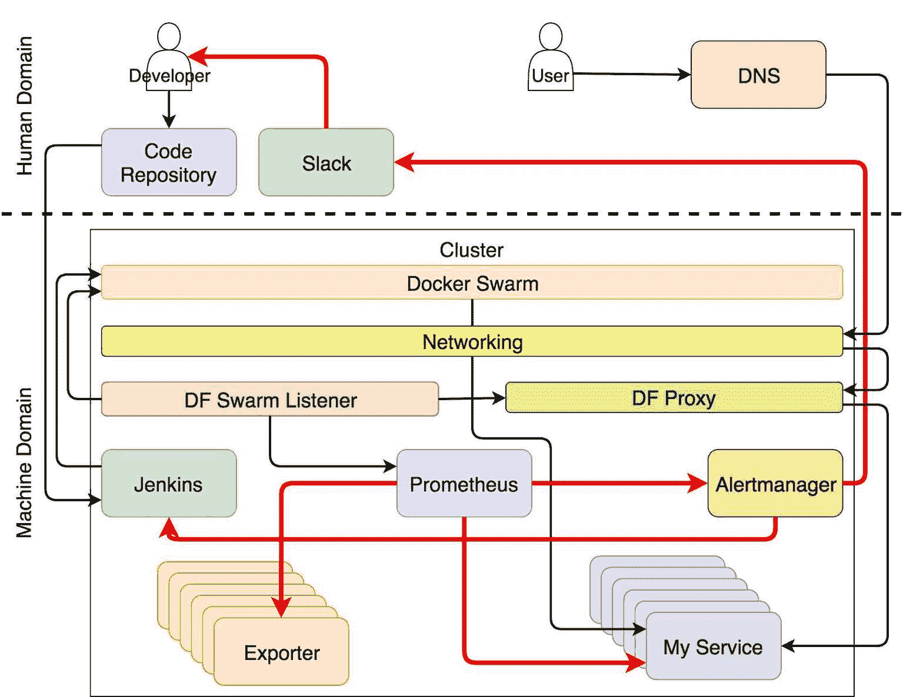

## 第二十章：自给自足系统的蓝图

我们走了很长一段路，现在我们已经处于旅程的第一阶段的终点。接下来会发生什么，取决于你。你需要扩展我试图传递的知识，并改进我们构建的系统。它是一个需要根据你的需求扩展的基础。每个系统都是不同的，没有任何蓝图可以盲目跟随。

每个好的故事都需要有一个结局，而这个故事也不例外。我会尽量总结前面章节中传递的知识，尽管我觉得我应该简明扼要。如果你需要一个我们所探讨内容的长篇总结，那就意味着我没有做好我的工作。我没有讲解得够清晰，或者内容太枯燥，你跳过了某些部分，期待它们在最后被总结。请告诉我如果我做得不够好，我会尽力改进。现在，我假设你已经理解了我们讨论的主题的要点，并将本章作为对所有内容的简洁总结。

我们将自给自足系统应执行的任务分为与服务相关的任务和面向基础设施的任务。尽管一些工具在这两组中都有使用，但这两者之间的划分使我们能够保持基础设施与运行其上的服务之间的清晰分离。

### 服务任务

服务任务与负责确保服务正常运行的流程有关，包括正确版本的部署、信息传播到所有依赖项、服务可访问性、按预期行为执行等。换句话说，所有与服务相关的任务都在这个范围之内。

我们将与服务相关的任务分为自我修复、部署、重配置、请求和自我适应流程。

#### 自我修复流程

Docker Swarm（或任何其他调度器）负责自我修复。只要硬件资源足够，它会确保每个服务的期望副本数量几乎总是处于运行状态。如果某个副本宕机，它将被重新调度。如果整个节点被销毁或失去与其他管理节点的连接，它上面运行的所有副本将被重新调度。自我修复是开箱即用的。然而，如果我们希望我们的解决方案能够自给自足并且（几乎）完全自主，仍然有许多其他任务需要定义。

#### 部署流程

提交到代码库是我们希望的最后一个人工操作。虽然这并不总是如此。无论我们的系统多么智能和自主，总会有一些问题是系统无法自动解决的。然而，我们仍应以完全无人工干预的系统为目标。即使我们无法完全实现这一点，它依然是一个值得追求的目标，能够让我们保持专注，避免走捷径。

当我们提交代码时会发生什么？代码仓库（例如，GitHub）执行一个 webhook，向我们选择的持续部署工具发送请求。全书中我们使用的是 Jenkins，但就像我们使用的其他工具一样，它也可以被替换成其他解决方案。

webhook 触发器启动一个新的 Jenkins 任务，该任务运行我们的持续部署（CD）管道。它运行单元测试，构建新镜像，执行功能测试，将镜像发布到 Docker Hub（或任何其他注册表）等。流程结束时，Jenkins 管道指示 Swarm 更新与提交相关的服务。至少，更新应将与服务相关联的镜像更改为我们刚刚构建的镜像。

一旦 Docker Swarm 收到更新服务的指令，它会执行滚动更新过程，一次替换一个副本（除非另有指定）。通过这样的过程，并假设我们的服务是以云友好的方式设计的，新版本不会造成任何停机，我们可以根据需要随时运行它们。

图 16-1：持续部署过程

#### 重新配置流程

部署新版本只是过程的一部分。在大多数情况下，其他服务需要重新配置以包含有关已部署服务的信息。监控（例如，[Prometheus](https://prometheus.io/)）和代理（例如，[HAProxy](http://www.haproxy.org/) 或 [nginx](https://www.nginx.com)）只是需要了解集群中其他服务的服务中的两个例子。我们将它们称为基础设施服务，因为从功能角度来看，它们的范围与业务无关。它们通常负责使集群能够正常运行，或至少能被识别。

如果我们运行的是一个高度动态的集群，基础设施服务也需要是动态的。高度的动态性无法通过每次部署业务服务时手动修改配置来实现。我们必须有一个过程来监控集群内服务的变化，并更新所有需要关于已部署或已更新服务信息的服务。

解决自动更新基础设施服务问题的方式有很多种。本书中，我们使用了多种可能过程中的一种。我们假设服务的信息会存储为标签，这使我们可以专注于当前服务，让系统的其余部分发现这些信息。

我们使用了[Docker Flow Swarm Listener (DFSL)](http://swarmlistener.dockerflow.com/)来检测服务的变化（如新的部署、更新和移除）。每当检测到变化时，相关信息会被发送到指定的地址。在我们的案例中，这些地址指向代理服务器（[Docker Flow Monitor](http://monitor.dockerflow.com/)）和 Prometheus（[Docker Flow Proxy](http://proxy.dockerflow.com/)）。一旦这些服务收到关于新（或更新，或移除）服务的请求，它们会改变配置并重新加载主进程。通过这种事件流，我们可以确保所有基础设施服务始终保持最新，而无需担心它们的配置。否则，我们将需要创建一个更复杂的管道，不仅部署新版本，还要确保所有其他服务保持最新。

图 16-2: 重新配置流程

#### 请求流

当用户（或外部客户端）向我们的服务发送请求时，该请求首先会被 Ingress 网络捕获。每个服务发布的端口都会使该端口在 Ingress 中打开。由于网络的范围是全球性的，请求可以发送到任何节点。当请求被捕获时，Ingress 会评估该请求并将其转发到发布了相同端口的服务副本之一。在此过程中，Ingress 网络执行轮询负载均衡，从而确保所有副本接收到（或多或少）相同数量的请求。

Overlay 网络（Ingress 是其中的一种类型）不仅负责将请求转发到发布了相同端口的服务，还确保只有健康的副本被纳入轮询负载均衡中。Docker 镜像中定义的`HEALTHCHECK`对于确保零停机时间部署至关重要。当一个新的副本被部署时，它在报告健康之前不会被纳入负载均衡算法。

在本书中，[Docker Flow Proxy (DFP)](http://proxy.dockerflow.com/)是唯一发布任何端口的服务。这使我们能够将所有流量通过端口`80`和`443`进行通道化。由于其动态特性并且与 DFSL 配合良好，我们无需担心其下方的 HAProxy 配置。这意味着，所有到达我们集群的请求都由 Ingress 网络捕获，并转发到 DFP，后者会评估请求路径、域名及其他来自请求头的信息，然后决定哪个服务应接收请求。一旦做出决策，DFP 会将请求进一步转发。假设代理和目标服务都连接到相同的网络，那么这些转发的请求将再次被 Overlay 网络捕获，进行轮询负载均衡并将请求转发到最终目的地。

尽管请求的流程看起来可能很复杂，但从服务所有者的角度来看，它非常直观。他（或她）所需要做的只是定义几个服务标签，告诉代理所需的路径或区分该服务与其他服务的域名。另一方面，用户无论我们多频繁部署新版本，都不会经历停机。

图 16-3：请求服务流程

#### 自适应流程

一旦我们成功创建了能够在没有停机的情况下部署新版本，同时重新配置所有依赖服务的流程，我们就可以向前推进，解决应用于服务的自适应问题。目标是创建一个系统，根据指标来扩展（或缩减）服务。这样，我们的服务就能高效地运行，无论外部变化如何。例如，如果预定义百分位的响应时间过长，我们可以增加副本的数量。

[Prometheus](https://prometheus.io/)定期从通用导出器以及我们的服务中抓取指标。我们通过对其进行仪表化实现了后者。导出器适用于诸如容器（例如，[cAdvisor](https://github.com/google/cadvisor)）或节点（例如，[Node exporter](https://github.com/prometheus/node_exporter)）等生成的全局指标。仪表化则适用于我们希望获取更详细的、特定于服务的指标（例如，特定功能的响应时间）。

我们通过[Docker Flow Monitor (DFM)](http://monitor.dockerflow.com/)配置了 Prometheus，不仅能够从导出器和仪表化服务中抓取指标，还能评估触发的警报，并将其发送到[Alertmanager](https://github.com/prometheus/alertmanager)。Alertmanager 会过滤触发的警报，并将通知发送到系统的其他部分（内部或外部）。

在可能的情况下，警报通知应发送到一个或多个服务，这些服务将自动“修正”集群的状态。例如，因服务响应时间过长而触发的警报通知应导致该服务进行扩容。这样的操作相对容易编写脚本。它是一个可重复的操作，机器可以轻松执行，因此不应浪费人力时间。我们使用 Jenkins 作为工具，允许我们执行诸如扩容（增容或缩容）之类的任务。

只有在警报是由于不可预测的情况发生时，才应将通知发送给人类。基于从未发生过的条件的警报是需要人工干预的好候选。我们擅长解决突发问题；机器擅长执行可重复的任务。尽管如此，即使在这些前所未见的情况下，我们（人类）也不仅要解决问题，还应该创建一个脚本，以便下次遇到相同问题时能够重复相同的步骤。第一次触发警报并通知人类时，应该将其转换为通知机器，机器将按照我们之前的步骤操作。换句话说，第一次发生时自己解决问题，若再次发生则让机器重复解决方案。在整本书中，我们使用了 Slack 作为发送给人类的通知引擎，Jenkins 作为接收这些通知的机器端。

图 16-4：自适应服务流程

### 基础设施任务

基础设施任务与确保硬件正常工作和节点组成集群的流程相关。就像服务副本一样，这些节点是动态的。由于服务背后的需求不断变化，它们的数量在波动。一切与硬件相关的内容，或者更常见的，与虚拟机及其作为集群成员的能力相关，都属于这一范畴。

我们将把与基础设施相关的任务分为自愈、请求和自适应流程。

#### 自愈流程

一个自动管理基础设施的系统与我们围绕服务构建的系统没有太大区别。就像 Docker Swarm（或任何其他调度器）负责确保服务（几乎）始终运行并具备所需的容量一样，AWS 中的自动扩展组确保所需数量的节点（几乎）始终可用。大多数其他托管供应商和本地解决方案都有类似的功能，只是名称不同。

自动扩展组只是应用于基础设施的自愈解决方案的一部分。仅仅重建一个失败的节点是不够的。我们需要一个过程，将该节点加入现有的集群。在整本书中，我们使用了 [Docker For AWS](https://docs.docker.com/docker-for-aws/)，它已经为这个问题提供了解决方案。每个节点都运行一些系统容器，其中一个容器定期检查其运行的节点是否是主节点。如果是，它会将加入令牌和节点的 IP 等信息存储在一个中央位置（截至写作时存储在 DynamoDB 中）。当一个新节点被创建时，系统容器会检索这些数据并使用它来加入集群。

如果你没有使用 Docker For AWS 或 Azure，你可能需要自己动手编写解决方案，或者，如果你懒的话，去找现成的解决方案。有很多开源代码片段可以帮助你。

无论你选择（或自己构建）什么解决方案，步骤几乎总是相同的。创建自动扩展组（或你托管服务商提供的任何功能），以维持所需的节点数量。将加入令牌和主管理节点的 IP 地址存储在容错位置（外部数据库、服务注册表、网络驱动器等），并利用它将新节点加入到集群中。

最后，有状态服务是不可避免的。即使你开发的所有服务都是无状态的，状态也必须存储在某个地方。对于一些情况，我们需要将状态存储到磁盘上。使用本地存储不是一个选项。迟早，一个副本将被重新调度，并且可能会被调度到一个不同的节点。这可能是由于进程故障、升级，或因为某个节点不再可操作。无论重新调度的原因是什么，事实是我们必须假设它不会永远在同一个节点上运行。唯一合理的防止数据丢失的方法是在磁盘上存储状态时使用网络驱动器或分布式文件系统。在本书中，我们使用了 AWS 弹性文件系统（EFS），因为它可以在多个可用区中工作。在其他一些情况下，如果 IO 速度至关重要，你可能会选择 EBS。如果你选择其他供应商，解决方案会有所不同，但逻辑是相同的。创建一个网络驱动器并将其作为卷附加到服务上。AWS 和 Azure 的 Docker 都附带了 CloudStor 卷驱动程序。如果你选择了其他创建集群的解决方案，可能需要寻找其他驱动程序。[REXRay](http://rexray.readthedocs.io/)是其中一个解决方案，因为它支持大多数常用的托管供应商和操作系统。

在开始使用附加到网络驱动器的卷之前，请确保你真的需要它们。一个常见的错误是认为数据库生成的状态需要持久化。虽然在某些情况下这是对的，但在许多其他情况下并非如此。现代数据库可以在不同实例之间复制数据。在这种情况下，持久化数据可能不需要（甚至可能不欢迎）。如果多个实例拥有相同的数据，那么其中一个实例的失败并不意味着数据丢失。该实例将被重新调度，并且在适当配置的情况下，它将从没有失败的副本中检索数据。

图 16-5：自愈基础设施流程

#### 请求流程

我们已经探讨了如何确保用户或客户在集群外部发起的请求能够到达目标服务。然而，还有一个关键部分未解决。我们保证了一旦请求进入集群就能找到路径，但我们未能提供足够的保证它能够到达集群。我们不能配置 DNS 为节点之一的 IP，因为该服务器随时可能会失败。我们必须在 DNS 和集群之间添加一些东西。那个东西应该有一个单一的目标。它应确保请求到达任何一个健康节点。无论是哪一个节点，因为 Ingress 网络将接管并启动我们讨论过的请求流程。介于其中的元素可以是外部负载均衡器、弹性 IP 或其他任何解决方案。只要它是容错的并且能够执行健康检查以确定哪个节点是运行的，任何解决方案都可以做到。唯一的挑战是确保节点列表始终保持最新。这意味着集群添加新节点时应将其添加到该列表中。这可能有些多余，你可能希望将范围缩小到当前和未来的管理节点。幸运的是，Docker For AWS（或 Azure）已经将该功能集成到其模板和系统级容器中。尽管如此，如果你使用不同的解决方案来创建你的集群，找到类似的替代方案或编写你自己的解决方案应该相对容易。

图 16-6: 请求基础设施流程

#### 自适应流程

基础设施的自适应概念上与服务的自适应相同。我们需要收集指标并将它们存储在某个地方（Prometheus），并定义警报并有一个系统根据指标对其进行评估（Prometheus）。当警报达到阈值并经过指定时间后，它们需要被过滤，并根据问题转换为通知发送到其他服务（Alertmanager）。我们使用 Jenkins 作为这些通知的接收器。如果问题可以由系统解决，将执行预定义的操作。由于我们的示例使用 AWS，Jenkins 将通过 AWS CLI 运行任务。另一方面，如果警报导致需要创造性解决方案的新问题，通知的最终接收者是人类（在我们的情况下通过 Slack）。

图 16-7: 自适应基础设施流程

### 逻辑至关重要，工具可能会有所不同

不要认为我们迄今使用的工具是理所当然的。技术变化实在太快。当你读到这篇文章时，至少有一个已经过时了。可能存在更好的替代方案。技术变化速度如此之快，以至于即使我们全部时间都用于评估“新玩具”，也无法跟上。

流程和逻辑也不是静止不变的，亦非永恒的。它们不应被视为理所当然，也不应永远被遵循。没有所谓的“永远最佳实践”。然而，逻辑的变化远远慢于工具。它更为重要，因为它能持续更长时间。

我相信本书中所描述的逻辑和流程将超越我们所使用的工具。对此，你可以自行评估其价值。探索其他工具，寻找那些更符合你目标的工具。至于我，我甚至还没写完这本书，但我已经看到了我们使用的工具可以改进的地方。它们中的一些可以被更好的工具替代，其他的可能一开始就不是最佳选择。但这并不像看起来那么重要。真正重要的是流程和逻辑，我希望我们探索过的那些能够再持续一段时间。

不要让这种悲观的态度阻碍你去实现你所学到的东西。把责任归咎于我和我那永无止境的探索，去寻找更好、更有效的方式来做事。

### 现在该怎么办？

这就是结尾了。去应用你所学的，改进它，回馈社区。

**再见了，感谢所有的鱼。**
