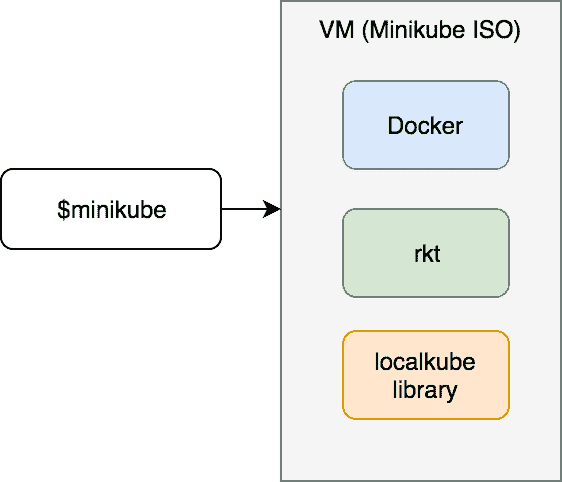
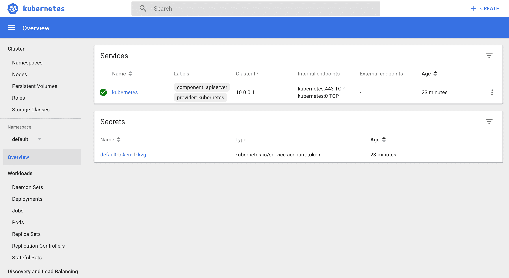

# 第二章：在本地运行 Kubernetes 集群

本书的一个目标是将学习成本控制到最低。秉承这一精神，我们将尽可能长时间地运行本地 Kubernetes 集群。最终，我们将不得不切换到托管的多节点 Kubernetes 集群。我会尽力将这个过程推迟到尽可能晚，而不限制你的学习体验。目前，我们将在你的笔记本上创建一个本地 Kubernetes 集群。

有很多种方法可以设置本地 Kubernetes 集群。例如，我们可以使用 Vagrant ([`www.vagrantup.com/`](https://www.vagrantup.com/)) 创建一些节点，并执行一系列 shell 命令，将它们转换为 Kubernetes 集群。我们甚至可以进一步创建一个已经预装所有必需软件的 VirtualBox 镜像，并用它来创建 Vagrant 虚拟机。我们还可以使用 Ansible 来进行镜像的配置，并执行所有将虚拟机加入集群所需的命令。我们可以做很多其他事情，但我们不打算这样做。

目前，重点不是教授你如何设置 Kubernetes 集群的所有复杂细节。相反，我希望尽可能快地让你跟上进度，让你能够体验 Kubernetes，而不被安装细节所干扰。

如果本书的主题是 Docker Swarm（就像在*The DevOps 2.1 Toolkit: Docker Swarm* 中那样），我们只需要在 Mac 或 Windows 上使用 Docker（或在 Linux 上原生运行），并执行一个 `docker swarm init` 命令。这就是创建本地 Docker Swarm 集群所需的一切。我们能否用 Kubernetes 实现同样的简单性呢？

在 2017 年 10 月，Docker 宣布在 Docker for Mac 和 Windows 中初步支持 Kubernetes。在撰写本文时，这项功能仅在 Mac 的边缘通道中可用。

Minikube 在你的笔记本电脑上的虚拟机内创建了一个单节点集群。虽然这并不理想，因为我们无法展示 Kubernetes 在多节点环境下提供的一些功能，但它足够用来解释 Kubernetes 背后的大部分概念。稍后我们将转向更接近生产环境的设置，探索那些在 Minikube 中无法展示的功能。

给 Windows 用户的提示

请通过 *Git* 安装的 *GitBash* 运行所有示例。这样，你在书中看到的命令将与在 *MacOS* 或任何 *Linux* 发行版上执行的命令相同。如果你使用的是 Hyper-V 而不是 VirtualBox，你可能需要以管理员身份运行 *GitBash* 窗口。

在我们深入讨论 Minikube 安装之前，有一些先决条件需要我们进行设置。首先要设置的是`kubectl`。

# 安装 kubectl

Kubernetes 的命令行工具 `kubectl` 用于管理集群和运行在其中的应用程序。在本书中我们将频繁使用 `kubectl`，因此目前不会深入讲解其细节。相反，我们会通过接下来的示例来讨论它的命令。目前，把它看作是你与 Kubernetes 集群的交流工具。

让我们安装 `kubectl`。

本章中的所有命令都可以在 `02-minikube.sh` ([`gist.github.com/vfarcic/77ca05f4d16125b5a5a5dc30a1ade7fc`](https://gist.github.com/vfarcic/77ca05f4d16125b5a5a5dc30a1ade7fc)) Gist 中找到。

如果您已经安装了 `kubectl`，可以跳过安装步骤。只需确保版本是 1.8 或以上。

如果您是 **MacOS 用户**，请执行以下命令：

```
curl -LO https://storage.googleapis.com/kubernetes-release/release/`curl -s https://storage.googleapis.com/kubernetes-release/release/stable.txt`/bin/darwin/amd64/kubectl

chmod +x ./kubectl

sudo mv ./kubectl /usr/local/bin/kubectl  
```

如果您已经安装了 Homebrew（[`brew.sh/`](https://brew.sh/)）包管理器，可以通过以下命令使用 "brew" 安装：

```
brew install kubectl  
```

如果您是 **Linux 用户**，安装 `kubectl` 的命令如下：

```
curl -LO https://storage.googleapis.com/kubernetes-release/release/$(curl -s 
 https://storage.googleapis.com/kubernetes-release/release/stable.txt)/bin/linux/amd64/kubectl

chmod +x ./kubectl

sudo mv ./kubectl /usr/local/bin/kubectl  
```

最后，**Windows 用户**应通过以下命令下载二进制文件。

```
curl -LO https://storage.googleapis.com/kubernetes-release/release/$(curl -s https://storage.googleapis.com/kubernetes-release/release/stable.txt)/bin/windows/amd64/kubectl.exe

```

随时将二进制文件复制到任何目录。重要的是将其添加到 `PATH` 中。

让我们检查 `kubectl` 版本，并同时验证它是否正常工作。不管您使用的是哪个操作系统，命令如下：

```
kubectl version
```

输出如下：

```
Client Version: version.Info{Major:"1", Minor:"9", GitVersion:"v1.9.0", 
GitCommit:"925c127ec6b946659ad0fd596fa959be43f0cc05", 
GitTreeState:"clean", BuildDate:"2017-12-15T21:07:38Z", GoVersion:"go1.9.2", 
Compiler:"gc", Platform:"darwin/amd64"}  
```

无法连接到服务器 `localhost:8080` - 您是否指定了正确的主机或端口？

这是一个非常丑陋且难以阅读的输出。幸运的是，`kubectl` 可以使用几种不同的格式来输出结果。例如，我们可以告诉它输出为 `yaml` 格式

```
kubectl version --output=yaml 
```

输出如下：

```
clientVersion:
  buildDate: 2017-12-15T21:07:38Z
  compiler: gc
  gitCommit: 925c127ec6b946659ad0fd596fa959be43f0cc05
  gitTreeState: clean
  gitVersion: v1.9.0
  goVersion: go1.9.2
  major: "1"
  minor: "9"
  platform: darwin/amd64

The connection to the server localhost:8080 was refused - did you specify the right host or port? 
```

这是一个更好的（更易读的）输出。

我们可以看到客户端版本为 1.9。在底部显示错误信息，表明 `kubectl` 无法连接到服务器。这是预期中的情况，因为我们还没有创建集群。接下来我们就要进行这一步。

在撰写本书时，kubectl 的版本为 1.9.0。您安装时的版本可能不同。

# 安装 Minikube

Minikube 支持多种虚拟化技术。我们在本书中将使用 VirtualBox，因为它是唯一支持所有操作系统的虚拟化工具。如果你还没有安装，请前往下载 VirtualBox 页面 ([`www.virtualbox.org/wiki/Downloads`](https://www.virtualbox.org/wiki/Downloads))，下载与您的操作系统匹配的版本。请记住，要使 VirtualBox 或 HyperV 正常工作，必须在 BIOS 中启用虚拟化。大多数笔记本电脑默认应已启用此功能。

最后，我们可以安装 Minikube。

如果您使用的是 **MacOS**，请执行以下命令：

```
brew cask install minikube  
```

如果您更喜欢使用 **Linux**，可以执行以下命令：

```
curl -Lo minikube 
https://storage.googleapis.com/minikube/releases/latest/minikube-"linux-amd64 && chmod +x minikube && sudo mv minikube "/usr/local/bin/
```

最后，如果你是 Windows 用户，你将不会收到命令。相反，你需要从 `minikube-windows-amd64.exe`（[`storage.googleapis.com/minikube/releases/latest/minikube-windows-amd64.exe`](https://storage.googleapis.com/minikube/releases/latest/minikube-windows-amd64.exe)）下载最新版本，重命名为 `minikube.exe`，并将其添加到你的路径中。

我们通过检查 Minikube 的版本来测试它是否正常工作。

```
minikube version  
```

输出如下：

```
minikube version: v0.23.0 
```

现在我们准备好开始使用这个集群了。

# 使用 Minikube 创建本地 Kubernetes 集群

Minikube 背后的开发者将创建集群的过程做得尽可能简单。我们只需执行一个命令，Minikube 就会在本地启动一个虚拟机，并将必要的 Kubernetes 组件部署到其中。虚拟机会通过一个名为 localkube 的单一二进制文件配置 Docker 和 Kubernetes。

```
minikube start --vm-driver=virtualbox  
```

Windows 用户须知

你可能会遇到 `virtualbox` 的问题。如果是这样，你可以考虑改用 `hyperv`。打开 Powershell 管理员窗口，执行 `Get-NetAdapter` 命令，并记录下你的网络连接名称。创建一个 `hyperv` 虚拟交换机：`New-VMSwitch -name NonDockerSwitch -NetAdapterName Ethernet -AllowManagementOS $true`，将 `Ethernet` 替换为你的网络连接名称。然后创建 Minikube 虚拟机：`minikube start --vm-driver=hyperv --hyperv-virtual-switch "NonDockerSwitch" --memory=4096`。其他 Minikube 命令，如 `minikube start`、`minikube stop` 和 `minikube delete`，无论你是使用 VirtualBox 还是 Hyper-V，都可以正常工作。

稍等片刻，一个新的 Minikube 虚拟机将被创建并设置好，集群将准备就绪可以使用。

当我们执行 `minikube start` 命令时，它基于 Minikube 镜像创建了一个新的虚拟机。该镜像包含了一些二进制文件，既有 `Docker`（[`www.docker.com/`](https://www.docker.com/)）也有 `rkt`（[`coreos.com/rkt/`](https://coreos.com/rkt/)）容器引擎，以及 `localkube` 库。这个库包含了运行 Kubernetes 所需的所有组件。稍后我们将详细介绍这些组件。目前，最重要的是，localkube 提供了运行本地 Kubernetes 集群所需的一切。



图 2-1：Minikube 简化架构

记住，这是一个单节点集群。虽然这有点遗憾，但它仍然是目前最简单的方法（据我所知）来“玩转”本地的 Kubernetes。暂时应该够用了。稍后，我们将探索如何创建一个多节点集群，它将更加接近生产环境的设置。

让我们来查看集群的状态：

```
minikube status  
```

输出如下：

```
minikube: Running
cluster: Running
kubectl: Correctly Configured: pointing to minikube-vm at 192.168.99.100 
```

Minikube 正在运行，它初始化了一个 Kubernetes 集群。它还配置了 `kubectl`，使其指向新创建的虚拟机。

本书中不会看到太多的 UI。我认为终端是操作集群的最佳方式。更重要的是，我坚信应该先通过命令掌握一款工具。等我们感觉熟练并理解了工具的工作原理后，可以选择在其基础上使用 UI。在后面的章节中，我们会探索 Kubernetes UI。现在，我让你快速瞥一眼它。

```
minikube dashboard  
```

可以自由探索 UI，但不要花太多时间。你会被一些我们尚未学习的概念弄混。等我们学习了 pods、replica-sets、services 和其他 Kubernetes 组件后，UI 会变得更加有意义。



图 2-2：Kubernetes 仪表盘

另一个有用的 Minikube 命令是 `docker-env`。

```
minikube docker-env  
```

输出如下：

```
export DOCKER_TLS_VERIFY="1"
export DOCKER_HOST="tcp://192.168.99.100:2376"
export DOCKER_CERT_PATH="/Users/vfarcic/.minikube/certs"
export DOCKER_API_VERSION="1.23"
# Run this command to configure your shell:
# eval $(minikube docker-env)  
```

如果你曾使用 Docker Machine，你会注意到输出是相同的。`docker-machine env` 和 `minikube docker-env` 都有相同的作用。它们输出本地 Docker 客户端与远程 Docker 服务器通信所需的环境变量。在这种情况下，那个 Docker 服务器就是 Minikube 创建的虚拟机中的 Docker 服务器。我假设你已经在笔记本上安装了 Docker。如果没有，请访问 Docker 安装页面（[`docs.docker.com/install/`](https://docs.docker.com/install/)），并按照你操作系统的说明进行安装。Docker 安装完成后，我们可以将你笔记本上的客户端与 Minikube 虚拟机中的服务器连接起来。

```
eval $(minikube docker-env)  
```

我们通过 `minikube docker-env` 命令评估（创建）了所提供的环境变量。因此，我们发送到本地 Docker 客户端的每个命令都会在 Minikube 虚拟机上执行。我们可以通过例如列出该虚拟机上所有正在运行的容器来轻松验证这一点。

```
docker container ls  
```

输出中列出的容器是 Kubernetes 所需的容器。我们可以将它们视为系统容器。我们不会逐一讨论它们。事实上，我们不会讨论它们中的任何一个。至少，暂时不会。你现在需要知道的是，它们使得 Kubernetes 能够正常工作。

由于几乎虚拟机中的所有内容都是容器，将本地 Docker 客户端指向其中的服务应该就足够了（除了 `kubectl`）。不过，在某些情况下，你可能需要通过 SSH 进入虚拟机。

```
minikube ssh

docker container ls

exit  
```

我们进入了 Minikube 虚拟机，列出了容器，然后退出了。没有必要做其他操作，除了展示 SSH 是可用的，尽管你可能不会使用它。

还有什么需要验证的吗？例如，我们可以确认 `kubectl` 也指向了 Minikube 虚拟机。

```
kubectl config current-context  
```

输出应该是一个单词，`minikube`，表示 `kubectl` 已配置为与新创建的集群中的 Kubernetes 通信。

作为额外的验证，我们可以列出集群的所有节点。

```
kubectl get nodes  
```

输出如下：

```
NAME     STATUS ROLES  AGE VERSION
minikube Ready  <none> 31m v1.8.0  
```

不足为奇的是，只有一个节点，方便地被命名为 `minikube`。

如果你熟悉 Docker Machine 或 Vagrant，你可能会注意到它们之间有相似的模式。Minikube 的命令几乎与 Docker Machine 的命令完全相同，而 Docker Machine 的命令又类似于 Vagrant 的命令。

让我们快速浏览一下当前在我们小型集群中运行的组件。

```
kubectl get all --all-namespaces
```

看哪，集群的全部荣耀。它由许多我们尚未探索的构建模块组成。而且，这些只是开始。随着我们的需求和知识增加，我们将添加更多的内容。目前，记住有许多活动的组件。我们暂时不深入探讨，这样会有些过于复杂。

回到 Minikube，我们可以做所有我们期望从虚拟机中看到的常见操作。例如，我们可以停止它。

```
minikube stop  
```

我们可以重新启动它。

```
minikube start  
```

我们可以删除它。

```
minikube delete  
```

一个有趣的功能是能够指定我们希望使用的 Kubernetes 版本。

由于 Kubernetes 仍然是一个年轻的项目，我们可以预期它会快速发生很多变化。这意味着我们的生产集群可能无法运行最新版本。另一方面，我们应该尽力使我们的本地环境尽可能接近生产环境（在合理范围内）。

我们可以通过以下命令列出所有可用版本：

```
minikube get-k8s-versions  
```

输出内容，限于前几行，如下所示：

```
The following Kubernetes versions are available:
        - v1.9.0
        - v1.8.0
        - v1.7.5
        - v1.7.4
        - v1.7.3
        - v1.7.2
        - v1.7.0
        ...
```

现在我们知道了哪些版本是可用的，我们可以基于 Kubernetes v1.7.0 创建一个新的集群。

```
minikube start \
 --vm-driver=virtualbox \
 --kubernetes-version="v1.7.0"

kubectl version --output=yaml  
```

我们创建了一个新的集群，并输出了客户端和服务器的版本信息。

后一个命令的输出如下：

```
clientVersion:
  buildDate: 2017-10-24T19:48:57Z
  compiler: gc
  gitCommit: bdaeafa71f6c7c04636251031f93464384d54963
  gitTreeState: clean
  gitVersion: v1.8.2
  goVersion: go1.8.3
  major: "1"
  minor: "8"
  platform: darwin/amd64
serverVersion:
  buildDate: 2017-10-04T09:25:40Z
  compiler: gc
  gitCommit: d3ada0119e776222f11ec7945e6d860061339aad
  gitTreeState: dirty
  gitVersion: v1.7.0
  goVersion: go1.8.3
  major: "1"
  minor: "7"
  platform: linux/amd64
```

如果你关注`serverVersion`部分，你会注意到`major`版本是`1`，而`minor`版本是`7`。

# 现在怎么办？

我们已经简要介绍了 Minikube。实际上，这也可以算作一个较长的介绍。我们用它来创建一个单节点的 Kubernetes 集群，启动 UI，执行常见的虚拟机操作，如`stop`、`restart`和`delete`等。除此之外没什么了。如果你熟悉 Vagrant 或 Docker Machine，原理是一样的，命令也非常相似。

离开之前，我们会销毁这个集群。下一章将从头开始。这样，你可以随时在任何章节执行命令。

```
minikube delete  
```

就这样，集群不复存在。
