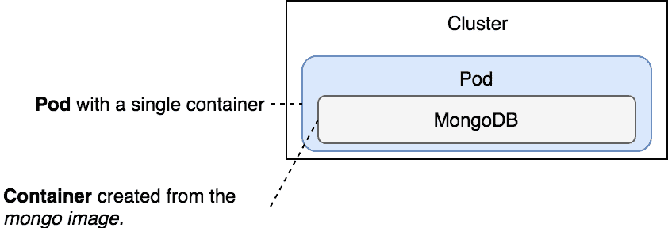
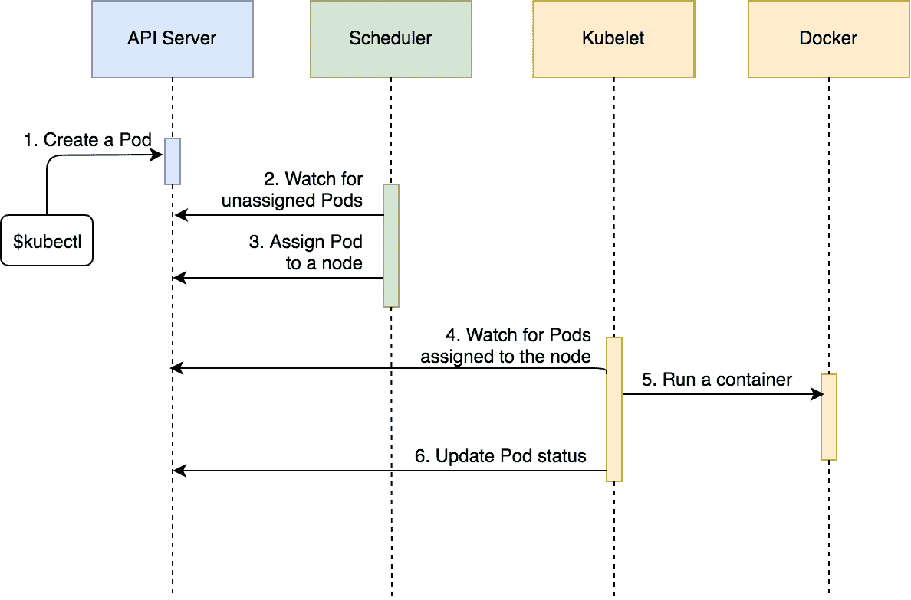
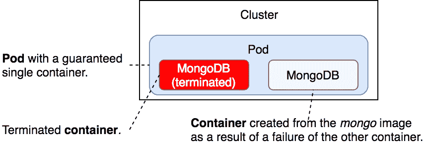
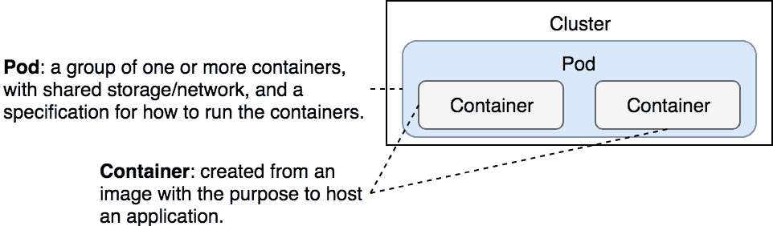

# 第三章：创建 Pods

Pods 就像我们用来建造房屋的砖块。它们本身并不显眼，单独看也不显得特别重要。然而，它们是基本的构建块，没有它们，我们无法构建我们设定的解决方案。

如果你使用过 Docker 或 Docker Swarm，你可能已经习惯了认为容器是最小的单位，复杂的模式是在它之上构建的。而在 Kubernetes 中，最小的单位是 Pod。Pod 是表示集群中正在运行的进程的方式。从 Kubernetes 的角度来看，没有比 Pod 更小的单位。

一个 Pod 封装了一个或多个容器。它提供了一个独特的网络 IP，附加了存储资源，并决定容器的运行方式。Pod 内的一切都是紧密耦合的。

我们需要澄清，Pod 中的容器不一定是由 Docker 创建的。其他容器运行时也受到支持。然而，在撰写本书时，Docker 是最常用的容器运行时，我们的所有示例都会使用 Docker。

从本章开始，我们将打破传统，避免在深入实践示例之前进行长篇的概念解释。相反，我们将通过实践来学习理论，一步一步来。

我们将直接进入动手操作。由于没有 Kubernetes 集群，我们无法创建 Pods，因此我们的首要任务是先创建一个集群。

# 创建集群

我们将使用 Minikube 创建一个本地的 Kubernetes 集群。

本章中的所有命令都可以在 [`03-pods.sh`](https://gist.github.com/vfarcic/d860631d0dd3158c32740e9260c7add0) ([`gist.github.com/vfarcic/d860631d0dd3158c32740e9260c7add0`](https://gist.github.com/vfarcic/d860631d0dd3158c32740e9260c7add0)) Gist 中找到。

```
minikube start --vm-driver=virtualbox

kubectl get nodes  
```

后者命令的输出如下：

```
NAME     STATUS ROLES  AGE VERSION
minikube Ready  <none> 47s v1.8.0  
```

为了简化过程并免去你编写所有配置文件的麻烦，我们将克隆 GitHub 仓库 [`vfarcic/k8s-specs`](https://github.com/vfarcic/k8s-specs) ([`github.com/vfarcic/k8s-specs`](https://github.com/vfarcic/k8s-specs))。它包含了我们本章以及本书大多数其他章节所需的一切。

```
git clone https://github.com/vfarcic/k8s-specs.git

cd k8s-specs  
```

我们克隆了仓库并进入了创建的目录。

现在我们可以运行我们的第一个 Pod。

# 快速而简便地运行 Pods

就像我们可以执行 `docker run` 来创建容器一样，`kubectl` 也允许我们通过一个命令来创建 Pods。例如，如果我们想要创建一个包含 Mongo 数据库的 Pod，命令如下：

```
kubectl run db --image mongo  
```

你会注意到输出中显示 `deployment "db" was created`。Kubernetes 运行的不仅仅是一个 Pod，它创建了一个 Deployment 和一些其他的东西。我们暂时不会深入讨论所有细节。现在重要的是，我们已经创建了一个 Pod。我们可以通过列出集群中的所有 Pods 来确认这一点：

```
kubectl get pods  
```

输出结果如下：

```
NAME                READY STATUS            RESTARTS AGE
db-59d5f5b96b-kch6p 0/1   ContainerCreating 0        1m  
```

我们可以看到 Pod 的名称、就绪状态、状态、重启次数以及存在时长（年龄）。如果你反应够快，或者你的网络较慢，可能没有 Pod 准备就绪。我们期望有一个 Pod，但此时没有正在运行的 Pod。由于`mongo`镜像相对较大，因此可能需要一些时间才能从 Docker Hub 拉取镜像。过了一段时间后，我们可以再次检索 Pods，确认 Mongo 数据库的 Pod 是否正在运行。

```
kubectl get pods  
```

输出如下：

```
NAME                READY STATUS  RESTARTS AGE
db-59d5f5b96b-kch6p 1/1   Running 0        6m  
```

我们可以看到，这次 Pod 已就绪，我们可以开始使用 Mongo 数据库。

我们可以确认基于`mongo`镜像的容器确实正在集群中运行。

```
eval $(minikube docker-env)

docker container ls -f ancestor=mongo  
```

我们评估了`minikube`变量，以便我们的本地 Docker 客户端使用在虚拟机内运行的 Docker 服务器。接着，我们列出了所有基于`mongo`镜像的容器。输出如下（为了简洁起见，已删除 ID）：

```
IMAGE COMMAND                CREATED       STATUS       PORTS NAMES
mongo "docker-entrypoint.s..." 5 minutes ago Up 5 minutes       k8s
 _db_db-...  
```

如你所见，Pod 中定义的容器正在运行。



图 3-1：一个包含单个容器的 Pod

那不是运行 Pods 的最佳方式，因此我们将删除部署，这样会删除它所包含的所有内容，包括 Pod。

```
kubectl delete deployment db  
```

输出如下：

```
deployment "db" deleted  
```

为什么我说那不是运行 Pods 的最佳方式？我们使用了命令式方式告诉 Kubernetes 该做什么。尽管在某些情况下这样做可能有用，但大多数时候我们希望利用声明式方法。我们希望能够在文件中定义我们需要的内容，并将这些信息传递给 Kubernetes。这样，我们可以拥有一个有文档记录的、可重复的过程，并且（应该）可以进行版本控制。此外，`kubectl run`的命令相对简单。在实际应用中，我们需要声明的内容远比部署名称和镜像多。像`kubectl`这样的命令可能会迅速变得冗长，且在许多情况下非常复杂。相反，我们将以 YAML 格式编写规范。稍后，我们将看到如何使用声明式语法实现类似的结果。

# 通过声明式语法定义 Pods

尽管一个 Pod 可以包含任意数量的容器，但最常见的使用场景是使用单容器 Pod 模型。在这种情况下，Pod 是围绕一个容器的封装。从 Kubernetes 的角度来看，Pod 是最小的单元。我们不能告诉 Kubernetes 运行一个容器。相反，我们要求它创建一个封装容器的 Pod。

让我们来看一个简单的 Pod 定义：

```
cat pod/db.yml  
```

输出如下：

```
apiVersion: v1
kind: Pod
metadata:
 name: db
 labels:
 type: db
 vendor: Mongo Labs
spec:
 containers:
 - name: db
 image: mongo:3.3
 command: ["mongod"]
 args: ["--rest", "--httpinterface"]  
```

我们正在使用`v1`版本的 Kubernetes Pods API。`apiVersion`和`kind`都是必需的。通过这种方式，Kubernetes 知道我们想做什么（创建一个 Pod）以及使用哪个 API 版本。

下一部分是`metadata`。它提供了不影响 Pod 行为的信息。我们使用`metadata`来定义 Pod 的名称（`db`）和一些标签。稍后，当我们学习控制器时，标签将有实际用途。目前，它们纯粹是信息性的。

最后一部分是`spec`，我们在其中定义了一个容器。正如你可能猜到的，我们可以将多个容器定义为一个 Pod。否则，部分将以单数形式（`container`而非`containers`）书写。稍后我们将探讨多容器 Pod。

在我们的案例中，容器定义了名称（`db`）、镜像（`mongo`）、容器启动时应执行的命令（`mongod`），以及最后的参数集。参数以数组形式定义，在这个例子中包含两个元素（`--rest`和`--httpinterface`）。

我们不会深入探讨你可以用来定义 Pod 的所有内容。在本书中，你将看到很多其他常用（或不那么常用）的 Pod 定义项。稍后，当你决定学习所有可以应用的参数时，请查看官方的、不断变化的[`Pod v1 core`](https://kubernetes.io/docs/reference/generated/kubernetes-api/v1.9/#pod-v1-core)文档。

让我们创建在`db.yml`文件中定义的 Pod。

```
kubectl create -f pod/db.yml  
```

你会注意到我们在命令中并没有需要指定`pod`。该命令将创建在`pod/db.yml`文件中定义的资源类型。稍后，你会看到一个 YAML 文件可以包含多个资源的定义。

让我们看一下集群中的 Pods：

```
kubectl get pods  
```

输出如下：

```
NAME READY STATUS  RESTARTS AGE
db   1/1   Running 0        11s  
```

我们名为`db`的 Pod 已经启动并运行。

在某些情况下，你可能想通过指定`wide`输出获取更多信息。

```
kubectl get pods -o wide  
```

输出如下：

```
NAME READY STATUS  RESTARTS AGE IP         NODE
db   1/1   Running 0        1m  172.17.0.4 minikube  
```

如你所见，我们得到了两列额外的信息：IP 和节点。

如果你想解析输出，使用`json`格式可能是最佳选择。

```
kubectl get pods -o json  
```

输出数据太大，无法在书中呈现，尤其是因为我们不会详细介绍通过`json`输出格式提供的所有信息。

当我们需要比默认输出提供的更多信息，但仍希望以对人类友好的格式呈现时，`yaml`输出可能是最佳选择。

```
kubectl get pods -o yaml  
```

就像使用`json`输出一样，我们不会深入讨论从 Kubernetes 获取的所有信息。随着时间的推移，你将熟悉与 Pod 相关的所有信息。目前，我们想集中精力关注最重要的方面。

让我们介绍一个新的`kubectl`子命令。

```
kubectl describe pod db  
```

`describe`子命令返回了指定资源的详细信息。在这个例子中，资源是名为`db`的 Pod。

输出太大，无法逐一讲解每个细节。此外，如果你熟悉容器，大部分内容应该是显而易见的。我们将简要评论最后一部分，名为 `events`。

```
...
Events:
 Type    Reason                 Age   From               Message
 ----    ------                 ----  ----               -------
 Normal  Scheduled              2m    default-scheduler  Successfully assigned db to minikube
 Normal  SuccessfulMountVolume  2m    kubelet, minikube  MountVolume.SetUp succeeded for volume "default-token-x27md"
 Normal  Pulling                2m    kubelet, minikube  pulling image "mongo:3.3"
 Normal  Pulled                 2m    kubelet, minikube  Successfully pulled image "mongo:3.3"
 Normal  Created                2m    kubelet, minikube  Created container
 Normal  Started                2m    kubelet, minikube  Started container
```

我们可以看到 Pod 已创建并经历了多个阶段，如下图所示。尽管从用户的角度来看过程很简单，但在后台发生了许多事情。

现在可能是暂停练习、讨论 Kubernetes 组件的一些细节，并试图理解 Pod 调度是如何工作的好时机。

该过程涉及三个主要组件。

*API 服务器* 是 Kubernetes 集群的核心组件，运行在主节点上。由于我们使用的是 Minikube，因此主节点和工作节点被打包在同一个虚拟机中。然而，更严肃的 Kubernetes 集群应该将这两个节点分布在不同的主机上。

所有其他组件与 API 服务器交互并保持监视变化。Kubernetes 中的大多数协调工作都涉及一个组件向 API 服务器资源写入，另一个组件在监视该资源。第二个组件将几乎立即对变化作出反应。

*调度器* 也在主节点上运行。它的任务是监视未分配的 Pod，并将它们分配到具有符合 Pod 要求的可用资源（CPU 和内存）的节点上。由于我们正在运行一个单节点集群，指定资源不会提供太多关于资源使用的见解，因此我们会留到稍后讨论。

*Kubelet* 在每个节点上运行。它的主要功能是确保分配给该节点的 Pod 正在运行。它会监视该节点的任何新 Pod 分配。如果一个 Pod 被分配到 Kubelet 正在运行的节点上，它将拉取 Pod 定义并使用它通过 Docker 或任何其他支持的容器引擎来创建容器。

执行 `kubectl create -f pod/db.yml` 命令后发生的事件顺序如下：

1.  Kubernetes 客户端（`kubectl`）向 API 服务器发送请求，要求创建在 `pod/db.yml` 文件中定义的 Pod。

1.  由于调度器在监视 API 服务器的新事件，它检测到有一个未分配的 Pod。

1.  调度器决定将 Pod 分配给哪个节点，并将该信息发送到 API 服务器。

1.  Kubelet 也在监视 API 服务器。它检测到 Pod 被分配到它正在运行的节点上。

1.  Kubelet 向 Docker 发送请求，请求创建构成该 Pod 的容器。在我们的案例中，Pod 定义了一个基于 `mongo` 镜像的单一容器。

1.  最终，Kubelet 向 API 服务器发送请求，通知它 Pod 已成功创建。

这个过程现在可能不太容易理解，因为我们正在运行一个单节点集群。如果我们有更多的虚拟机，调度可能会在其他地方发生，过程的复杂性也会更容易理解。我们会在适当的时候到达那里。



图 3-2：Pod 调度顺序

在许多情况下，通过引用定义资源的文件来描述资源更加实用。这样就不会产生混淆，也不需要记住资源的名称。我们本可以执行以下命令：

```
kubectl describe -f pod/db.yml  
```

输出应该是相同的，因为在两种情况下，`kubectl`都向 Kubernetes API 发送了请求，获取名为`db`的 Pod 的信息。

就像在 Docker 中一样，我们可以在 Pod 内的运行容器中执行一个新的进程。

```
kubectl exec db ps aux  
```

输出如下：

```
USER PID %CPU %MEM    VSZ   RSS TTY STAT START TIME COMMAND
root   1  0.5  2.9 967452 59692 ?   Ssl  21:47 0:03 mongod --rest --httpinterface
root  31  0.0  0.0  17504  1980 ?   Rs   21:58 0:00 ps aux

```

我们告诉 Kubernetes 我们想在`db` Pod 的第一个容器内执行一个进程。由于我们的 Pod 只定义了一个容器，这个容器就是第一个容器。可以通过设置`--container`（或`-c`）参数来指定使用哪个容器。当 Pod 中运行多个容器时，这一点特别有用。

除了将 Pod 作为参考外，`kubectl exec`几乎与`docker container exec`命令相同。显著的区别是，`kubectl`允许我们在集群内的任何节点上的容器中执行进程，而`docker container exec`则仅限于在特定节点上的容器中执行。

我们可以进入一个正在运行的容器，而不是在其中执行一个新的短时进程。例如，我们可以通过`-i (stdin)`和`-t`（终端）参数使执行变得交互式，并在容器内运行`shell`。

```
kubectl exec -it db sh  
```

我们现在在容器内的`sh`进程中。由于容器托管着一个 Mongo 数据库，我们可以例如执行`db.stats()`来确认数据库确实在运行。

```
echo 'db.stats()' | mongo localhost:27017/test  
```

我们使用`mongo`客户端执行`db.stats()`，用于检查在`localhost:27017`上运行的`test`数据库。由于我们不是在这本书中学习 Mongo（至少不是现在），这个练习的唯一目的是证明数据库已经启动并在运行。接下来让我们退出容器。

```
exit  
```

日志应该从容器发送到一个中央位置。然而，由于我们尚未深入探讨这个话题，因此能够查看 Pod 中容器的日志会非常有用。

输出日志的命令如下，适用于`db` Pod 中唯一的容器：

```
kubectl logs db  
```

输出太大且整个输出并不重要。最后一行之一如下所示：

```
...
2017-11-10T22:06:20.039+0000 I NETWORK  [thread1] waiting for connections on port 27017
...  
```

使用`-f`（或`--follow`）选项，我们可以实时跟踪日志。就像使用`exec`子命令一样，如果一个 Pod 定义了多个容器，我们可以通过`-c`参数指定使用哪个容器。

当 Pod 内的容器死掉时会发生什么？让我们模拟一个故障并观察发生的情况。

```
kubectl exec -it db pkill mongod

kubectl get pods  
```

我们终止了容器的主进程，并列出了所有的 Pods。输出如下：

```
NAME READY STATUS  RESTARTS AGE
db   1/1   Running 1        13m  
```

容器正在运行（`1/1`）。Kubernetes 保证 Pod 内的容器（几乎）始终在运行。请注意，`RESTARTS`字段现在的值为`1`。每当一个容器失败时，Kubernetes 会重新启动它：



图 3-3：容器失败的 Pod

最后，如果我们不再需要 Pod，可以将其删除。

```
kubectl delete -f pod/db.yml

kubectl get pods  
```

我们移除了在`db.yml`中定义的 Pods，并检索了集群中所有 Pod 的列表。后者命令的输出如下：

```
NAME READY STATUS      RESTARTS AGE
db   0/1   Terminating 1        3h  
```

就绪容器的数量下降至`0`，`db` Pod 的状态为`terminating`。

当我们发送删除 Pod 的指令时，Kubernetes 尝试优雅地终止它。首先，它会向所有 Pod 内容器中的主进程发送`TERM`信号。从那时起，Kubernetes 为每个容器提供了 30 秒的时间，以便容器中的进程能够优雅地关闭。一旦宽限期到期，`KILL`信号会被发送以强制终止所有主进程，并与之一起终止所有容器。默认的宽限期可以通过 YAML 定义中的`gracePeriodSeconds`值或`kubectl delete`命令的`--grace-period`参数进行更改。

如果我们在发出`delete`指令后的 30 秒重复执行`get pods`命令，Pod 应该会从系统中移除：

```
kubectl get pods  
```

这次，输出结果不同。

```
No resources found.  
```

系统中唯一的 Pod 已不再存在。

# 在单个 Pod 中运行多个容器

Pods 旨在运行多个合作进程，这些进程应作为一个统一体进行操作。这些进程被封装在容器中。构成 Pod 的所有容器都运行在同一台机器上。Pod 不能分布在多个节点上。

Pod 中的所有进程（容器）共享相同的资源集，它们可以通过`localhost`相互通信。共享资源之一是存储。在 Pod 中定义的卷可以被所有容器访问，从而使它们可以共享相同的数据。我们稍后将更深入地探讨存储内容。现在，让我们来看看`pod/go-demo-2.yml`的规范：

```
cat pod/go-demo-2.yml  
```

输出如下：

```
apiVersion: v1
kind: Pod
metadata:
 name: go-demo-2
 labels:
 type: stack
spec:
 containers:
 - name: db
 image: mongo:3.3
 - name: api
 image: vfarcic/go-demo-2
    env:
 - name: DB
 value: localhost  
```

YAML 文件定义了一个包含名为`db`和`api`的两个容器的 Pod。`vfarcic/go-demo-2`镜像中的服务使用环境变量`DB`来确定数据库的位置。该值为`localhost`，因为同一 Pod 中的所有容器都可以通过它访问。

让我们创建 Pod：

```
kubectl create -f pod/go-demo-2.yml

kubectl get -f pod/go-demo-2.yml  
```

我们创建了一个在`go-demo-2.yml`文件中定义的新 Pod，并从 Kubernetes 获取了其信息。后者命令的输出如下：

```
NAME      READY STATUS  RESTARTS AGE
go-demo-2 2/2   Running 0        2m  
```

从`READY`列可以看出，这次 Pod 有两个容器（`2/2`）。

这可能是一个很好的机会来引入格式化，获取特定信息。

假设我们想获取 Pod 中容器的名称。首先，我们需要熟悉 Kubernetes API。我们可以通过访问[`Pod v1 core`](https://kubernetes.io/docs/reference/generated/kubernetes-api/v1.9/#pod-v1-core)（[`v1-9.docs.kubernetes.io/docs/reference/generated/kubernetes-api/v1.9/#pod-v1-core`](https://v1-9.docs.kubernetes.io/docs/reference/generated/kubernetes-api/v1.9/#pod-v1-core)）文档来实现。虽然阅读文档迟早是必须的，但我们将采用更简单的方式，直接检查 Kubernetes 的输出。

```
kubectl get -f pod/go-demo-2.yml -o json  
```

输出过大，不适合在书中展示，所以我们将专注于当前任务。我们需要获取 Pod 中容器的名称。因此，我们需要关注输出中的以下部分：

```
{
 ...
 "spec": {
 "containers": [
 {
 ...
 "name": "db",
 ...
 },
 {
 ...
 "name": "api",
 ...
 }
 ],
 ...
 },
 ...
}  
```

用于筛选输出并仅获取容器名称的`get`命令如下：

```
kubectl get -f pod/go-demo-2.yml \
 -o jsonpath="{.spec.containers[*].name}"
```

输出如下：

```
db api  
```

我们使用了`jsonpath`作为输出格式，并指定要从`spec`中获取所有`containers`的名称。现在这种筛选和格式化信息的能力可能看起来不那么重要，但当我们进入更复杂的场景时，它将变得非常宝贵。尤其是在我们尝试自动化过程并向 Kubernetes API 发送请求时，这一点尤为明显。

我们如何在 Pod 内执行命令呢？与之前做类似任务的例子不同，这次 Pod 中有两个容器，因此我们需要更具体地指定。

```
kubectl exec -it -c db go-demo-2 ps aux  
```

输出应显示`db`容器中的进程，即`mongod`进程。

容器的日志怎么办？正如你可能猜到的，我们不能执行类似`kubectl logs go-demo-2`的命令，因为该 Pod 托管了多个容器。相反，我们需要更具体地指定想查看日志的容器名称：

```
kubectl logs go-demo-2 -c db  
```

那如何进行扩展呢？例如，我们如何扩展服务，使得 API 有两个容器，数据库有一个容器？

一种选择是定义 Pod 中的两个容器。我们来看看一个可能完成所需任务的 Pod 定义。

```
cat pod/go-demo-2-scaled.yml  
```

输出如下：

```
apiVersion: v1
kind: Pod
metadata:
 name: go-demo-2
 labels:
 type: stack
spec:
 containers:
 - name: db
 image: mongo:3.3
 - name: api-1
 image: vfarcic/go-demo-2
 env:
 - name: DB
 value: localhost
 - name: api-2
 image: vfarcic/go-demo-2
 env:
 - name: DB
 value: localhost  
```

我们为 API 定义了两个容器，分别命名为`api-1`和`api-2`。剩下的就是创建 Pod。但我们暂时不打算这么做。

我们不应将 Pod 视为资源，应该仅仅看作是我们集群中最小单元的定义。Pod 是一个容器集合，共享相同的资源，仅此而已。其他的任务应通过更高层次的构造来完成。在接下来的章节中，我们将探索如何在不改变 Pod 定义的情况下进行扩展。

让我们回到最初定义了 `api` 和 `db` 容器的多容器 Pod。这个设计选择非常糟糕，因为它将两者紧密耦合在一起。因此，当我们探讨如何扩展 Pods（而不是容器）时，两者都需要匹配。例如，如果我们将 Pod 扩展到三个实例，我们将得到三个 API 和三个数据库。相反，我们应该定义两个 Pod，每个容器一个（`db` 和 `api`）。这样，我们就能灵活地独立处理每个容器。

还有一些其他原因不建议将多个容器放在同一个 Pod 中。现在，先耐心等待。大多数情况下，可能认为多容器 Pod 是解决方案的场景，最终将通过其他资源来解决。

Pod 是容器的集合。然而，这并不意味着多容器 Pod 是常见的。它们是非常罕见的。你创建的大多数 Pod 将是单容器的。

这是否意味着多容器 Pod 是没有用的？并不是。实际上，在某些场景下，将多个容器放入同一个 Pod 是一个好主意。然而，这些场景非常特定，并且在大多数情况下是基于一个作为主服务的容器，其他容器作为 side-car 服务。一个常见的用例是用于 **持续集成**（**CI**）、**持续交付**（**CD**）或 **持续部署**（**CDP**）的多容器 Pod。我们稍后会探讨这些场景。现在，我们将重点关注单容器 Pod。

在我们开始讲解容器健康检查之前，让我们先移除 Pod。

```
kubectl delete -f pod/go-demo-2.yml  
```

# 监控健康状态

`vfarcic/go-demo-2` Docker 镜像被设计为在出现问题的第一时间就失败。在这种情况下，不需要任何健康检查。当问题发生时，主进程停止，承载它的容器也停止，Kubernetes 会重启该失败的容器。然而，并非所有服务都设计为快速失败。即使是设计为快速失败的服务，也可能仍然受益于额外的健康检查。例如，一个后端 API 可能在运行，但由于内存泄漏，响应请求的速度比预期慢。这样的情况可能需要一个健康检查，来验证服务是否在例如两秒钟内作出响应。我们可以利用 Kubernetes 的 liveness 和 readiness 探针来实现这一点。

`livenessProbe` 可用于确认容器是否应继续运行。如果探针失败，Kubernetes 会终止该容器并应用重启策略，默认情况下为`Always`。另一方面，`readinessProbe` 应该用作指示服务是否准备好接收请求的标志。与 `Services` 构造结合时，只有将 `readinessProbe` 状态设置为 `Success` 的容器才会接收请求。我们将稍后讨论 `readinessProbe`，因为它与 `Services` 直接相关。相反，我们将先探讨 `livenessProbe`。两者的定义方式相同，因此对其中一个的经验可以轻松应用到另一个上。

让我们来看看我们迄今为止使用的 Pod 的更新定义：

```
cat pod/go-demo-2-health.yml  
```

输出如下：

```
apiVersion: v1
kind: Pod
metadata:
 name: go-demo-2
 labels:
 type: stack
spec:
 containers:
 - name: db
 image: mongo:3.3
 - name: api
 image: vfarcic/go-demo-2
 env:
 - name: DB
 value: localhost
 livenessProbe:
 httpGet:
 path: /this/path/does/not/exist
 port: 8080
 initialDelaySeconds: 5
 timeoutSeconds: 2 # Defaults to 1
 periodSeconds: 5 # Defaults to 10
 failureThreshold: 1 # Defaults to 3  
```

不要因为在这个 Pod 中看到两个容器而感到困惑。我坚持我的观点。这两个容器应该在不同的 Pod 中定义。然而，由于这需要我们尚未掌握的知识，而`vfarcic/go-demo-2`在没有数据库的情况下无法工作，我们必须坚持使用这个指定了两个容器的示例。很快我们就会将其拆解开来。

额外的定义在`livenessProbe`内。

我们定义了动作应该是`httpGet`，后面跟着服务的`path`和`port`。由于`/this/path/does/not/exist`对自身来说是正确的，探针将会失败，从而向我们展示容器不健康时会发生什么。`host`没有指定，因为它默认使用 Pod IP。

在下方，我们声明了第一次执行探针时应该延迟五秒（`initialDelaySeconds`），请求在两秒后超时（`timeoutSeconds`），该过程应该每五秒重复一次（`periodSeconds`），并且（`failureThreshold`）定义了在放弃之前必须尝试多少次。

让我们来看一下探针的实际运行情况。

```
kubectl create \
 -f pod/go-demo-2-health.yml  
```

我们创建了带有探针的 Pod。现在我们必须等待探针失败几次。一分钟就足够了。一旦等待完成，我们可以描述 Pod：

```
kubectl describe \
 -f pod/go-demo-2-health.yml  
```

输出的底部包含事件。它们如下所示：

```
...
Events:
 Type     Reason                 Age              From           Message
 ----     ------                 ----             ----           -------
 Normal   Scheduled              6m               default-scheduler  Successfully assigned go-demo-2 to minikube
 Normal   SuccessfulMountVolume  6m               kubelet, minikube  MountVolume.SetUp succeeded for volume "default-token-7jc7q"
 Normal   Pulling                6m               kubelet, minikube  pulling image "mongo"
 Normal   Pulled                 6m               kubelet, minikube  Successfully pulled image "mongo"
 Normal   Created                6m               kubelet, minikube  Created container
 Normal   Started                6m               kubelet, minikube  Started container
 Normal   Created                5m (x3 over 6m)  kubelet, minikube  Created container
 Normal   Started                5m (x3 over 6m)  kubelet, minikube  Started container
 Warning  Unhealthy              5m (x3 over 6m)  kubelet, minikube  Liveness probe failed: HTTP probe failed with statuscode: 404
 Normal   Pulling                5m (x4 over 6m)  kubelet, minikube  pulling image "vfarcic/go-demo-2"
  Normal   Killing                5m (x3 over 6m)  kubelet, minikube  Killing container with id docker://api:Container failed live ness probe.. Container will be killed and recreated.
 Normal   Pulled                 5m (x4 over 6m)  kubelet, minikube  Successfully pulled image "vfarcic/go-demo-2"  
```

我们可以看到，一旦容器启动，探针就会执行，并且失败了。因此，容器被终止后又重新创建。在前面的输出中，我们可以看到这个过程重复了三次（`3x over ...`）。

如果你想了解所有可用的选项，请访问[Probe v1 core](https://kubernetes.io/docs/reference/generated/kubernetes-api/v1.9/#probe-v1-core)（[`v1-9.docs.kubernetes.io/docs/reference/generated/kubernetes-api/v1.9/#probe-v1-core`](https://v1-9.docs.kubernetes.io/docs/reference/generated/kubernetes-api/v1.9/#probe-v1-core)）。

# Pod 本身（几乎）没有用处。

Pod 是 Kubernetes 中的基本构建块。在大多数情况下，你不会直接创建 Pod，而是使用更高层次的构建块，如控制器。

Pod 是可消耗的，它们不是持久的服务。尽管 Kubernetes 尽力确保 Pod 中的容器（几乎）始终正常运行，但 Pod 本身却不能这样。如果 Pod 失败、被销毁或从节点中驱逐，它将不会重新调度，至少没有控制器的情况下是如此。类似地，如果整个节点被销毁，节点上的所有 Pod 将会消失。Pod 不会自我修复。除了某些特殊情况，Pod 并不是用来直接创建的。

不要自行创建 Pod。让控制器为你创建 Pod。

# 现在怎么办？

我们将删除集群并重新开始下一章。

```
minikube delete  
```

请花些时间更好地熟悉 Pods。它们是 Kubernetes 中最基础、也可以说是最关键的构建模块。既然你现在已经对 Pods 有了扎实的理解，接下来的一个好步骤可能是阅读 PodSpec v1 核心文档（[`v1-9.docs.kubernetes.io/docs/reference/generated/kubernetes-api/v1.9/#pod-v1-core`](https://v1-9.docs.kubernetes.io/docs/reference/generated/kubernetes-api/v1.9/#pod-v1-core)）。



图 3-4：至今为止探索的组件
