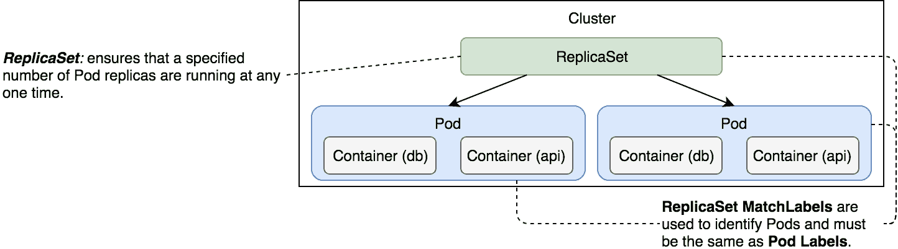
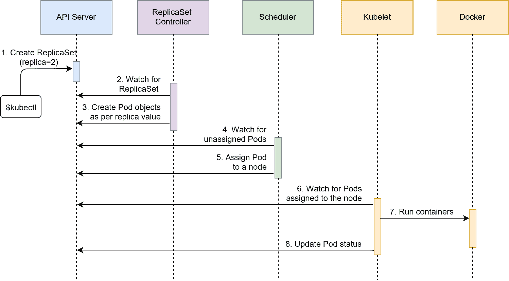
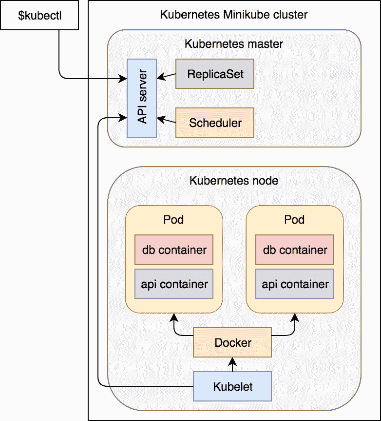
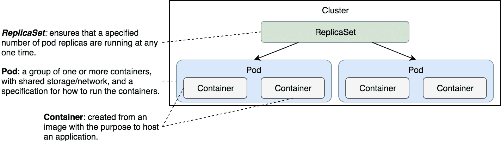

# 第四章：使用 ReplicaSets 扩展 Pods

大多数应用程序应该是可扩展的，所有应用程序都必须具备容错性。Pods 本身并不提供这些功能，而 ReplicaSets 提供了这些功能。

我们了解到，Pods 是 Kubernetes 中最小的单位。我们还了解到，Pods 并不具备容错性。如果一个 Pod 被销毁，Kubernetes 不会采取任何措施来修复这个问题。也就是说，如果没有控制器，Pods 是不会得到自动修复的。

我们将探索的第一个控制器叫做 *ReplicaSet*。它的主要功能，几乎是唯一功能，就是确保指定数量的 Pod 副本（几乎）始终与实际状态匹配。这意味着 ReplicaSets 使 Pods 具备可扩展性。

我们可以将 ReplicaSets 看作一种自我修复机制。只要满足基本条件（例如足够的内存和 CPU），与 ReplicaSet 关联的 Pods 会被保证运行。它们提供了容错性和高可用性。

值得一提的是，ReplicaSet 是下一代 ReplicationController。唯一显著的区别是 ReplicaSet 增强了对选择器的支持。其他一切都相同。由于 ReplicationController 被视为弃用，因此我们只关注 ReplicaSet。

ReplicaSet 的主要功能是确保指定数量的服务副本（几乎）始终在运行。

让我们通过示例来探索 ReplicaSet，看看它是如何工作的，以及它到底做了什么。

第一步是创建一个 Kubernetes 集群。

# 创建集群

我们将继续使用 Minikube 在本地模拟集群。

本章中的所有命令都可以在 `04-rs.sh`（[`gist.github.com/vfarcic/f6588da3d1c8a82100a81709295d4a93`](https://gist.github.com/vfarcic/f6588da3d1c8a82100a81709295d4a93)）Gist 中找到。

```
minikube start --vm-driver=virtualbox

kubectl config current-context  
```

我们创建了一个单节点集群并配置了 `kubectl` 以便使用它。

在我们探索第一个 ReplicaSet 示例之前，我们将进入本地的 `vfarcic/k8s-spec` 仓库，并拉取最新版本。谁知道呢，也许自上次你查看它以来，我添加了一些新内容。

```
cd k8s-specs

git pull  
```

现在集群正在运行，并且包含规格的仓库是最新的，我们可以创建我们的第一个 ReplicaSet。

# 创建 ReplicaSets

让我们看一下基于上一章节创建的 Pod 的 ReplicaSet：

```
cat rs/go-demo-2.yml  
```

输出如下：

```
apiVersion: apps/v1beta2
kind: ReplicaSet
metadata:
 name: go-demo-2
spec:
 replicas: 2
 selector:
 matchLabels:
 type: backend
 service: go-demo-2
 template:
 metadata:
 labels:
 type: backend
 service: go-demo-2
 db: mongo
 language: go
 spec:
 containers:
 - name: db
 image: mongo:3.3
 - name: api
 image: vfarcic/go-demo-2
 env:
 - name: DB
 value: localhost
 livenessProbe:
 httpGet:
 path: /demo/hello
 port: 8080  
```

`apiVersion`、`kind` 和 `metadata` 字段是所有 Kubernetes 对象的必填项，ReplicaSet 也不例外。

我们指定了 `apiVersion` 为 `apps/v1beta2`。在写这篇文章时，ReplicaSet 仍处于 beta 阶段。很快它将被视为稳定版本，到时候你可以将该值替换为 `apps/v1`。`kind` 是 `ReplicaSet`，`metadata` 中有一个 `name` 键设置为 `go-demo-2`。我们本可以扩展 ReplicaSet 的 `metadata` 来添加标签，但我们跳过了这一部分，因为它们仅用于信息传递，不会影响 ReplicaSet 的行为。

你应该对这三个字段比较熟悉，因为我们在处理 Pod 时已经探索过它们。除了这些字段，`spec`部分也是必需的。

我们在`spec`部分定义的第一个字段是`replicas`。它设置 Pod 的期望副本数。在这种情况下，ReplicaSet 应该确保同时运行两个 Pod。如果我们没有指定`replicas`的值，默认值将为`1`。

下一个`spec`部分是`selector`。我们用它来选择哪些 Pod 应包含在 ReplicaSet 中。它不会区分由 ReplicaSet 或其他过程创建的 Pod。换句话说，ReplicaSet 和 Pod 是解耦的。如果已经存在匹配`selector`的 Pod，ReplicaSet 将不会做任何操作。如果不存在，它将创建足够数量的 Pod 以匹配`replicas`字段的值。不仅如此，ReplicaSet 会创建缺失的 Pod，还会监控集群并确保所需数量的`replicas`几乎始终在运行。如果已经有更多匹配`selector`的 Pod 在运行，ReplicaSet 会终止一些 Pod 以匹配`replicas`中设置的数量。

我们使用了`spec.selector.matchLabels`来指定几个标签。它们必须与`spec.template`中定义的标签匹配。在我们的例子中，ReplicaSet 将查找`type`设置为`backend`，`service`设置为`go-demo-2`的 Pod。如果具有这些标签的 Pod 尚不存在，ReplicaSet 将根据`spec.template`部分创建它们。

`spec`字段的最后一部分是`template`。它是`spec`中唯一必需的字段，且其结构与 Pod 的规格相同。至少，`spec.template.metadata.labels`部分的标签必须与`spec.selector.matchLabels`中指定的标签匹配。我们还可以设置其他标签，这些标签仅用于信息性目的。ReplicaSet 会确保具有相同标签的 Pod 的数量与副本数匹配。在我们的例子中，我们将`type`和`service`设置为相同的值，并添加了两个额外的标签（`db`和`language`）。

可能会让人感到困惑的是，`spec.template.spec.containers`字段是必需的。ReplicaSet 将查找其他方式创建的具有匹配标签的 Pod。如果我们已经创建了一个标签为`type: backend`和`service: go-demo-2`的 Pod，那么这个 ReplicaSet 会找到它们，而不会创建`spec.template`中定义的 Pod。这个字段的主要目的是确保所需数量的`replicas`在运行。如果这些 Pod 是通过其他方式创建的，ReplicaSet 将不会做任何事情。否则，它将根据`spec.template`中的信息创建 Pod。

最后，`spec.template.spec`部分包含我们在上一章中使用的相同`containers`定义。它定义了一个具有两个容器（`db`和`api`）的 Pod。

在前一章中，我提到这两个容器不应属于同一个 Pod。对于由 ReplicaSet 管理的 Pods 中的容器也是如此。不过，我们还没有机会探索如何允许运行在不同 Pods 中的容器相互通信。因此，暂时我们将继续使用同样有缺陷的 Pods 定义。

让我们先创建 ReplicaSet 并亲身体验它的优势。

```
kubectl create -f rs/go-demo-2.yml  
```

我们收到了 `replicaset "go-demo-2"` 被 `created` 的响应。我们可以通过列出集群中所有的 ReplicaSets 来确认这一点。

```
kubectl get rs  
```

输出如下：

```
NAME      DESIRED CURRENT READY AGE
go-demo-2 2       2       0     14s  
```

我们可以看到期望的副本数是 `2`，并且与当前值匹配。`ready` 字段的值仍为 `0`，但在镜像被拉取并且容器运行后，它将变为 `2`。

我们可以检索 `rs/go-demo-2.yml` 文件中指定的副本，而不是检索集群中所有的副本。

```
kubectl get -f rs/go-demo-2.yml  
```

输出应该是相同的，因为在两种情况下，集群中只有一个 ReplicaSet 在运行。

在前一章中我们探索的所有其他 `kubectl get` 参数同样适用于 ReplicaSets，或者更准确地说，适用于所有 Kubernetes 对象。`kubectl describe` 命令也是如此：

```
kubectl describe -f rs/go-demo-2.yml  
```

输出的最后几行如下：

```
...
Events:
 Type   Reason           Age  From                  Message
 ----   ------           ---- ----                  -------
 Normal SuccessfulCreate 3m   replicaset-controller Created pod: 
 go-demo-2-v59t5
 Normal SuccessfulCreate 3m   replicaset-controller Created pod: 
 go-demo-2-5fd54  
```

从事件来看，我们可以看到 ReplicaSet 在尝试将期望状态与实际状态匹配时创建了两个 Pods。

最后，如果你还不相信 ReplicaSet 创建了缺失的 Pods，我们可以列出集群中所有正在运行的 Pods 并确认这一点：

```
kubectl get pods --show-labels  
```

为了确保安全，我们使用了 `--show-labels` 参数，这样我们可以验证集群中的 Pods 是否与 ReplicaSet 创建的 Pods 匹配。

输出如下：

```
NAME            READY STATUS  RESTARTS AGE LABELS
go-demo-2-5fd54 2/2   Running 0        6m  db=mongo,language=go,service=go-demo-2,type=backend
go-demo-2-v59t5 2/2   Running 0        6m  db=mongo,language=go,service=go-demo-2,type=backend    
```



图 4-1：一个包含两个 Pod 副本的 ReplicaSet

`kubectl create -f rs/go-demo-2.yml` 命令执行的事件顺序如下：

1.  Kubernetes 客户端（`kubectl`）向 API 服务器发送请求，请求创建定义在 `rs/go-demo-2.yml` 文件中的 ReplicaSet。

1.  控制器正在监视 API 服务器的新事件，它检测到有一个新的 ReplicaSet 对象。

1.  控制器创建了两个新的 Pod 定义，因为我们在 `rs/go-demo-2.yml` 文件中将副本数配置为 `2`。

1.  由于调度器正在监视 API 服务器的新事件，它检测到有两个未分配的 Pods。

1.  调度器决定将 Pod 分配到哪个节点，并将该信息发送给 API 服务器。

1.  Kubelet 也在监视 API 服务器。它检测到这两个 Pod 已经分配到它所在的节点上。

1.  Kubelet 向 Docker 发送请求，请求创建构成 Pod 的容器。在我们的例子中，Pod 定义了基于 `mongo` 和 `api` 镜像的两个容器。因此，最终会创建四个容器。

1.  最后，Kubelet 向 API 服务器发送请求，通知其 Pods 已成功创建。



图 4-2：请求创建 ReplicaSet 后的事件顺序

我们描述的顺序有助于理解从我们请求创建新 ReplicaSet 之时开始，到集群中发生的所有事情。然而，这可能有些混乱，所以我们将尝试通过一个更直观的图表来解释同一过程，以便更接近地展示集群的情况。



图 4-3：请求创建 ReplicaSet 后的事件顺序

通常，我们会有一个多节点集群，Pods 会分布在不同节点上。目前，在使用 Minikube 时，只有一台服务器同时充当主节点和工作节点。稍后，当我们开始使用多节点集群时，Pods 的分布将变得更加明显。架构也是如此。我们稍后会更详细地解释 Kubernetes 的不同组件。

让我们看看我们可以对 ReplicaSets 执行哪些类型的操作。

# 操作 ReplicaSets

如果我们删除 ReplicaSet 会发生什么？正如你可能猜到的那样，ReplicaSet 及其创建的所有对象（即 Pods）将通过执行 `kubectl delete -f rs/go-demo-2.yml` 命令一同消失。然而，由于 ReplicaSets 和 Pods 是松耦合的对象，且具有匹配的标签，我们可以删除一个而不删除另一个。例如，我们可以删除我们创建的 ReplicaSet，同时保留这两个 Pods。

```
kubectl delete -f rs/go-demo-2.yml \
 --cascade=false  
```

我们使用了 `--cascade=false` 参数，防止 Kubernetes 删除所有下游对象。因此，我们获得了 `replicaset "go-demo-2"` 被 `删除` 的确认。让我们确认它是否真的从系统中移除。

```
kubectl get rs  
```

正如预期的那样，输出显示 `没有找到资源`。

如果 `--cascade=false` 确实防止 Kubernetes 删除下游对象，那么 Pods 应该继续在集群中运行。让我们确认这个假设。

```
kubectl get pods  
```

输出如下：

```
NAME            READY STATUS  RESTARTS AGE
go-demo-2-md5xp 2/2   Running 0        9m
go-demo-2-vnmf7 2/2   Running 0        9m  
```

虽然我们删除了 ReplicaSet，但 ReplicaSet 创建的两个 Pods 仍然在集群中运行。

当前在集群中运行的 Pods 与我们之前创建的 ReplicaSet 没有任何关联。我们删除了 ReplicaSet，但 Pods 仍然存在。由于 ReplicaSet 使用标签来决定集群中是否已经运行了所需数量的 Pods，我们应该得出结论：如果我们再次创建相同的 ReplicaSet，它应该会重新使用集群中运行的两个 Pods。让我们验证一下。

除了之前执行的 `kubectl create` 命令，我们还将添加 `--save-config` 参数。它将保存 ReplicaSet 的配置，允许我们稍后执行一些额外的操作。稍后我们会讨论这些操作。现在，重要的是我们即将创建与之前相同的 ReplicaSet。

```
kubectl create -f rs/go-demo-2.yml \
 --save-config  
```

输出显示 `replicaset "go-demo-2" 已创建`。让我们看看 Pods 怎么样了。

```
kubectl get pods  
```

输出如下：

```
NAME            READY STATUS  RESTARTS AGE
go-demo-2-md5xp 2/2   Running 0        10m
go-demo-2-vnmf7 2/2   Running 0        10m  
```

如果你比较 Pods 的名称，你会发现它们与我们创建 ReplicaSet 之前的名称相同。它根据匹配的标签进行查找，推断出有两个 Pod 与之匹配，并决定不需要创建新的 Pod。匹配的 Pods 已经满足所需的副本数。

由于我们保存了配置，我们可以`apply`一个更新后的 ReplicaSet 定义。例如，我们可以使用`rs/go-demo-2-scaled.yml`文件，文件中唯一的不同是副本数设置为`4`。我们本可以一开始就使用`apply`创建 ReplicaSet，但我们没有这样做。`apply`命令会自动保存配置，以便我们以后可以编辑它。`create`命令默认不执行此操作，因此我们必须通过`--save-config`手动保存它。

```
kubectl apply -f rs/go-demo-2-scaled.yml  
```

这次输出稍有不同。我们看到的不是 ReplicaSet 被创建，而是它被`configured`（配置）了：

让我们看一下这些 Pods。

```
kubectl get pods  
```

输出如下：

```
NAME            READY STATUS  RESTARTS AGE
go-demo-2-ckmtv 2/2   Running 0        50s
go-demo-2-lt4qm 2/2   Running 0        50s
go-demo-2-md5xp 2/2   Running 0        11m
go-demo-2-vnmf7 2/2   Running 0        11m  
```

正如预期的那样，现在集群中有四个 Pods。如果你仔细观察 Pods 的名称，你会注意到其中有两个与之前相同。

当我们应用了新的配置，`replicas`设置为`4`而不是`2`时，Kubernetes 更新了 ReplicaSet，后者反过来评估了具有匹配标签的 Pods 的当前状态。它找到了两个具有相同标签的 Pods，并决定创建两个新的 Pods，以便新的期望状态能够与实际状态匹配。

让我们看看当一个 Pod 被销毁时会发生什么。

```
POD_NAME=$(kubectl get pods -o name \
 | tail -1)

kubectl delete $POD_NAME  
```

我们获取了所有 Pods，并使用`-o name`只获取它们的名称。结果通过`tail -1`命令传输，以便只输出其中一个名称。结果存储在环境变量`POD_NAME`中。后面的命令使用该变量来移除该 Pod，模拟故障发生。

让我们再看看集群中的 Pods：

```
kubectl get pods  
```

输出如下：

```
NAME              READY     STATUS        RESTARTS   AGE
go-demo-2-ckmtv   2/2       Running       0          10m
go-demo-2-lt4qm   2/2       Running       0          10m
go-demo-2-md5xp   2/2       Running       0          13m
go-demo-2-t8sfs   2/2       Running       0          30s
go-demo-2-vnmf7   0/2       Terminating   0          13m  
```

我们可以看到，我们删除的 Pod 正在`terminating`（终止）。然而，由于我们有一个 ReplicaSet，其`replicas`设置为`4`，一旦它发现 Pod 数量降到`3`，它就创建了一个新的 Pod。我们刚刚见证了自愈的过程。只要集群中有足够的可用资源，ReplicaSets 会确保指定数量的 Pod 副本（几乎）始终运行。

让我们看看如果我们移除 ReplicaSet 在选择器中使用的一个 Pod 标签会发生什么。

```
POD_NAME=$(kubectl get pods -o name \
 | tail -1)

kubectl label $POD_NAME service-

kubectl describe $POD_NAME  
```

我们使用相同的命令来获取一个 Pod 的名称，并执行移除`service`标签的命令。请注意标签名称末尾的`-`。这是表示标签应该被移除的语法：

最后，我们描述了 Pod：

最后一个命令的输出，限于标签部分，如下所示：

```
...
Labels: db=mongo
 language=go
 type=backend
...  
```

如你所见，`service`标签已经消失。

现在，让我们列出集群中的 Pods，并检查是否有任何变化：

```
kubectl get pods --show-labels  
```

输出如下：

```
NAME            READY STATUS  RESTARTS AGE LABELS
go-demo-2-ckmtv 2/2   Running 0        24m db=mongo,language=go,service=go-demo-2,type=backend
go-demo-2-lt4qm 2/2   Running 0        24m db=mongo,language=go,service=go-demo-2,type=backend
go-demo-2-md5xp 2/2   Running 0        28m db=mongo,language=go,type=backend
go-demo-2-nrnbh 2/2   Running 0        4m  db=mongo,language=go,service=go-demo-2,type=backend
go-demo-2-t8sfs 2/2   Running 0        15m db=mongo,language=go,service=go-demo-2,type=backend 
```

Pods 的总数增加到了五个。当我们从一个 Pod 中移除了`service`标签时，ReplicaSet 发现与`selector`标签匹配的 Pods 数量为三，并创建了一个新的 Pod。现在，我们有四个由 ReplicaSet 控制的 Pods 和一个由于不匹配标签而自由运行的 Pod。

如果我们添加了我们移除的标签会发生什么？

```
kubectl label $POD_NAME service=go-demo-2

kubectl get pods --show-labels  
```

我们添加了`service=go-demo-2`标签并列出了所有的 Pods。

后一命令的输出如下：

```
NAME            READY STATUS      RESTARTS AGE LABELS
go-demo-2-ckmtv 2/2   Running     0        28m db=mongo,language=go,service=go-demo-2,type=backend
go-demo-2-lt4qm 2/2   Running     0        28m db=mongo,language=go,service=go-demo-2,type=backend
go-demo-2-md5xp 2/2   Running     0        31m db=mongo,language=go,service=go-demo-2,type=backend
go-demo-2-nrnbh 0/2   Terminating 0        7m  db=mongo,language=go,service=go-demo-2,type=backend
go-demo-2-t8sfs 2/2   Running     0        18m db=mongo,language=go,service=go-demo-2,type=backend
```

在我们添加标签的那一刻，ReplicaSet 发现有五个具有匹配选择器标签的 Pods。由于规范规定应该有四个 Pod 的副本，它移除了一个 Pod，以使期望状态与实际状态匹配。

前几个示例再次表明，ReplicaSets 和 Pods 通过匹配标签松散耦合，并且 ReplicaSets 使用这些标签来维护实际状态和期望状态之间的一致性。到目前为止，自愈工作如预期般正常。

# 现在怎么办？

好消息是 ReplicaSets 相对直接。它们保证 Pod 的指定数量副本将在系统中运行，只要有可用资源。这是其主要且可以说是唯一的目的。

不好的消息是 ReplicaSets 很少单独使用。你几乎不会直接创建 ReplicaSet 就像你不会创建 Pods 一样。相反，我们倾向于通过 Deployments 创建 ReplicaSets。换句话说，我们使用 ReplicaSets 来创建和控制 Pods，使用 Deployments 来创建 ReplicaSets（以及其他一些内容）。我们很快就会介绍 Deployment。现在，请删除你的本地 Minikube 集群。下一章将从头开始。

```
minikube delete  
```

如果您想了解更多关于 ReplicaSets 的信息，请查看 ReplicaSet v1 apps ([`v1-9.docs.kubernetes.io/docs/reference/generated/kubernetes-api/v1.9/#replicaset-v1-apps`](https://v1-9.docs.kubernetes.io/docs/reference/generated/kubernetes-api/v1.9/#replicaset-v1-apps)) API 文档。



图 4-4：迄今为止探索的组件
