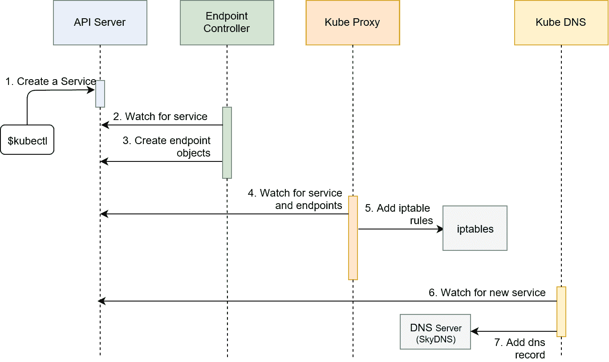
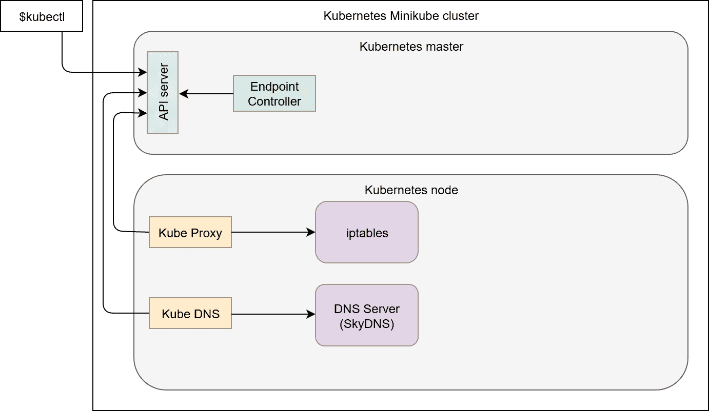
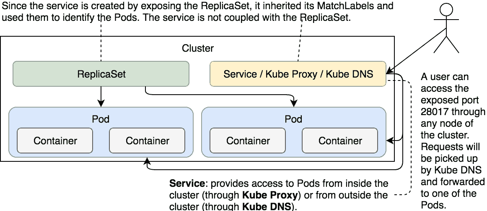
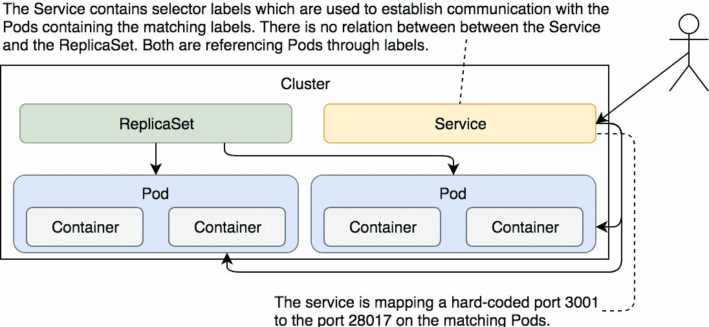
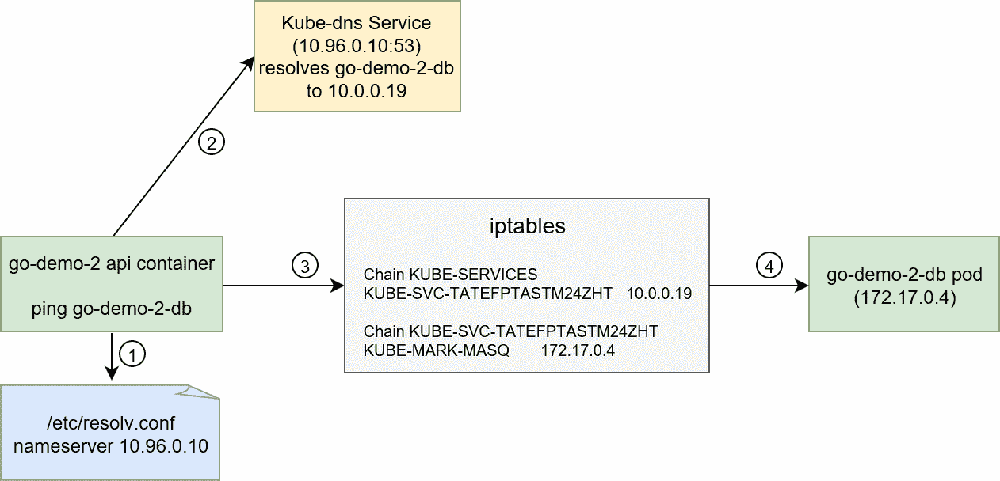

# 使用服务启用 Pods 之间的通信

不能相互通信或无法对最终用户访问的应用程序毫无价值。只有在建立了通信路径后，应用程序才能履行其角色。

Pods 是 Kubernetes 中最小的单位，生命周期相对较短。它们被创建，然后被销毁。它们从不被修复。系统通过创建新的 Pods（单元）和销毁那些不健康或多余的 Pods 来进行自我修复。系统是长寿的，而 Pods 不是。

控制器与调度器等其他组件一起，确保 Pods 执行正确的操作。它们控制调度器。到目前为止，我们只使用了其中一个。ReplicaSet 负责确保所需数量的 Pods 始终在运行。如果数量不足，它会创建新的 Pods；如果数量过多，它会销毁一些 Pods。那些变得不健康的 Pods 也会被终止。所有这些，甚至更多，都由 ReplicaSet 控制。

我们当前设置的问题在于没有通信路径。我们的 Pods 不能相互通信。到目前为止，只有同一 Pod 内的容器能够通过`localhost`相互通信。这导致我们设计时将 API 和数据库都放入同一个 Pod 内。这是一个糟糕的解决方案，原因有很多。主要问题在于我们不能在没有彼此的情况下扩展其中一个服务。我们无法设计出这样的设置，例如有三个 API 副本和一个数据库副本。主要的障碍就是通信。

说实话，每个 Pod 确实会有自己的地址。我们本可以将 API 和数据库拆分到不同的 Pods 中，并配置 API Pods 通过所在 Pod 的地址与数据库通信。然而，由于 Pods 不可靠、生命周期短暂且具有不稳定性，我们不能假设数据库总是可以通过 Pod 的 IP 访问。当该 Pod 被销毁（或失败）时，ReplicaSet 会创建一个新的 Pod，并为其分配一个新的地址。我们需要一个稳定的、永不改变的地址，用于将请求转发到当前正在运行的 Pod。

Kubernetes 服务提供了通过地址访问关联 Pods 的方式。

让我们看看服务的实际应用。

# 创建集群

你知道的，按照惯例，每一章开始时，我们都会从 `vfarcic/k8s-specs` ([`github.com/vfarcic/k8s-specs`](https://github.com/vfarcic/k8s-specs)) 仓库拉取最新代码，并创建一个新的 Minikube 集群。

本章中的所有命令都可以在 `05-svc.sh` ([`github.com/vfarcic/k8s-specs`](https://github.com/vfarcic/k8s-specs)) Gist 中找到。

```
cd k8s-specs

git pull

minikube start --vm-driver=virtualbox

kubectl config current-context  
```

现在我们已经拉取了最新代码，并且 Minikube 集群正在运行（再次启动）。

我们可以开始第一个 Service 示例了。

# 通过暴露端口创建服务

在深入了解服务之前，我们应该创建一个与上一章中使用的类似的 ReplicaSet。它将提供我们可以用来演示服务工作原理的 Pods。

让我们快速浏览一下 ReplicaSet 的定义：

```
cat svc/go-demo-2-rs.yml  
```

唯一显著的区别是`db`容器的定义。具体如下。

```
...
- name: db
 image: mongo:3.3
 command: ["mongod"]
 args: ["--rest", "--httpinterface"]
 ports:
 - containerPort: 28017
 protocol: TCP
...  
```

我们自定义了命令和参数，以便 MongoDB 可以暴露 REST 接口。我们还定义了`containerPort`。这些附加配置是必要的，以便我们能够测试数据库是否可以通过服务访问。

让我们创建 ReplicaSet：

```
kubectl create -f svc/go-demo-2-rs.yml

kubectl get -f svc/go-demo-2-rs.yml  
```

我们创建了 ReplicaSet 并从 Kubernetes 中获取了其状态。输出如下：

```
NAME      DESIRED CURRENT READY AGE
go-demo-2 2       2       2     1m  
```

你可能需要等待直到两个副本都启动并运行。如果在你的情况下，`READY`列还没有显示`2`，请稍等片刻并再次执行`get`命令查看状态。等到两个副本都运行时，我们就可以继续操作了。

我们可以使用`kubectl expose`命令将资源暴露为新的 Kubernetes 服务。该资源可以是 Deployment、另一个 Service、ReplicaSet、ReplicationController 或 Pod。我们将暴露 ReplicaSet，因为它已经在集群中运行。

```
kubectl expose rs go-demo-2 \
 --name=go-demo-2-svc \
 --target-port=28017 \
 --type=NodePort  
```

我们指定了要暴露一个 ReplicaSet（`rs`），并且新服务的名称应为`go-demo-2-svc`。应暴露的端口是`28017`（MongoDB 接口正在监听的端口）。最后，我们指定服务的类型应为`NodePort`。因此，目标端口将在集群的每个节点上暴露到外部，并会路由到 ReplicaSet 控制的某个 Pod。

我们还可以使用其他类型的服务。

`ClusterIP`（默认类型）仅在集群内部暴露端口。此端口无法从外部任何地方访问。当我们希望启用 Pod 之间的通信，同时又不希望任何外部访问时，`ClusterIP`非常有用。如果使用`NodePort`，则会自动创建`ClusterIP`。`LoadBalancer`类型只有与云提供商的负载均衡器结合使用时才有意义。`ExternalName`将服务映射到外部地址（例如，`kubernetes.io`）。

本章我们将重点介绍`NodePort`和`ClusterIP`类型。`LoadBalancer`将等到我们将集群迁移到云提供商后才会使用，而`ExternalName`的使用非常有限。

创建服务时启动的进程如下：

1.  Kubernetes 客户端（`kubectl`）向 API 服务器发送请求，请求基于通过`go-demo-2` ReplicaSet 创建的 Pods 来创建服务。

1.  Endpoint 控制器正在监视 API 服务器上的新服务事件。它检测到有一个新的服务对象。

1.  Endpoint 控制器创建了与服务同名的端点对象，并使用服务选择器来识别端点（在此例中是`go-demo-2` Pod 的 IP 和端口）。

1.  kube-proxy 正在监视 Service 和 endpoint 对象。它检测到有一个新的 Service 和一个新的 endpoint 对象。

1.  kube-proxy 添加了 iptables 规则，捕获流量到 Service 端口并将其重定向到端点。对于每个端点对象，它会添加 iptables 规则来选择一个 Pod。

1.  kube-dns 插件正在监视 Service。它检测到有一个新的 Service。

1.  kube-dns 将 `db` 容器的记录添加到 DNS 服务器（skydns）。



图 5-1：请求创建 Service 后的事件顺序

我们描述的这个过程对于我们想要理解从请求创建新 Service 开始，到集群中发生的每一件事是非常有用的。然而，这个过程可能会显得过于混乱，因此我们将尝试通过一个更能代表集群的图表来解释相同的过程。



图 5-2：请求创建 Service 时 Kubernetes 组件的视图

让我们来看一下我们的新 Service。

```
kubectl describe svc go-demo-2-svc  
```

输出如下：

```
Name:                    go-demo-2-svc
Namespace:               default
Labels:                  db=mongo
 language=go
 service=go-demo-2
 type=backend
Annotations:             <none>
Selector:                service=go-demo-2,type=backend
Type:                    NodePort
IP:                      10.0.0.194
Port:                    <unset>  28017/TCP
TargetPort:              28017/TCP
NodePort:                 <unset>  31879/TCP
Endpoints:               172.17.0.4:28017,172.17.0.5:28017
Session Affinity:        None
External Traffic Policy: Cluster
Events:                  <none>  
```

我们可以看到名称和命名空间。我们还没有探索命名空间（稍后会介绍），由于我们没有指定任何命名空间，它被设置为 `default`。由于 Service 与通过 ReplicaSet 创建的 Pods 关联，因此它继承了所有这些 Pod 的标签。选择器与 ReplicaSet 中的选择器匹配。Service 并未直接与 ReplicaSet（或任何其他控制器）关联，而是通过匹配标签与 Pods 关联。

接下来是 `NodePort` 类型，它将端口暴露给所有节点。由于 `NodePort` 自动创建了 `ClusterIP` 类型，因此集群中的所有 Pods 都可以访问 `TargetPort`。`Port` 设置为 `28017`。这是 Pods 用来访问 Service 的端口。由于我们在执行命令时没有显式指定该端口，其值与 `TargetPort` 的值相同，即与 Pod 关联的端口，该端口将接收所有请求。`NodePort` 是自动生成的，因为我们没有显式设置它。它是我们可以用来从集群外部访问 Service 以及 Pods 的端口。在大多数情况下，它应该是随机生成的，这样可以避免端口冲突。

让我们看看 Service 是否真的有效：

```
PORT=$(kubectl get svc go-demo-2-svc \
 -o jsonpath="{.spec.ports[0].nodePort}")

IP=$(minikube ip)

open "http://$IP:$PORT"  
```

给 Windows 用户的提示

Git Bash 可能无法使用 `open` 命令。如果是这种情况，将 `open` 命令替换为 `echo`。这样，你将获得一个完整的地址，应该在你选择的浏览器中直接打开。

我们使用了 `kubectl get` 命令的过滤输出来检索 `nodePort` 并将其存储为环境变量 `PORT`。接下来，我们获取了 minikube VM 的 IP 地址。最后，我们通过 Service 端口在浏览器中打开了 MongoDB UI。



图 5-3：通过暴露 ReplicaSet 创建的 Service

正如我在前面章节中提到的，除非我们正在尝试一些快速的黑客操作，否则使用命令式命令创建 Kubernetes 对象并不是一个好主意。服务也是如此。尽管 `kubectl expose` 完成了工作，但我们应该尝试通过 YAML 文件使用一种文档化的方法。从这个角度出发，我们将销毁已创建的服务并重新开始。

```
kubectl delete svc go-demo-2-svc  
```

# 通过声明式语法创建服务

我们可以通过 `svc/go-demo-2-svc.yml` 规范实现与使用 `kubectl expose` 相似的结果。

```
cat svc/go-demo-2-svc.yml  
```

输出如下：

```
apiVersion: v1
kind: Service
metadata:
 name: go-demo-2
spec:
 type: NodePort
 ports:
 - port: 28017
 nodePort: 30001
 protocol: TCP
 selector:
 type: backend
 service: go-demo-2  
```

你应该熟悉 `apiVersion`、`kind` 和 `metadata` 的含义，所以我们将直接跳到 `spec` 部分。既然我们已经通过 `kubectl expose` 命令探索过一些选项，`spec` 部分应该比较容易理解。

服务的类型设置为 `NodePort`，这意味着这些端口将同时在集群内和外部通过向任何节点发送请求的方式可用。

`ports` 部分指定请求应该转发到端口为 `28017` 的 Pods。`nodePort` 是新的。我们没有让服务暴露一个随机端口，而是将其设置为明确的 `30001` 值。尽管在大多数情况下，这不是一个好的实践，但我觉得演示这个选项也是个不错的主意。协议设置为 `TCP`。唯一的其他选择是使用 `UDP`。我们本可以完全跳过协议部分，因为 `TCP` 是默认值，但有时候，留下一些选项作为提醒是个好主意。

`selector` 被服务用于确定哪些 Pods 应该接收请求。它的工作方式与 ReplicaSet 的选择器相同。在这种情况下，我们定义了服务应将请求转发到 `type` 设置为 `backend` 且 `service` 设置为 `go-demo` 的 Pods。这两个标签在 ReplicaSet 的 Pods `spec` 中设置。

既然定义中没有什么神秘的内容，我们可以继续并创建服务。

```
kubectl create -f svc/go-demo-2-svc.yml

kubectl get -f svc/go-demo-2-svc.yml  
```

我们创建了服务并从 API 服务器获取了其信息。后一条命令的输出如下：

```
NAME      TYPE     CLUSTER-IP EXTERNAL-IP PORT(S)         AGE
go-demo-2 NodePort 10.0.0.129 <none>      28017:30001/TCP 10m  
```

现在服务已经运行（再次），我们可以通过尝试访问 MongoDB UI 来再次确认它是否按预期工作。

```
open "http://$IP:30001"  
```

由于我们将 `nodePort` 固定为 `30001`，因此无需从 API 服务器获取端口。相反，我们使用了 Minikube 节点的 IP 和硬编码的端口 `30001` 来打开 UI。



图 5-4：具有匹配 Pods 和硬编码端口的服务

让我们看看端点。它包含了应该接收请求的 Pod 列表。

```
kubectl get ep go-demo-2 -o yaml  
```

输出如下：

```
apiVersion: v1
kind: Endpoints
metadata:
 creationTimestamp: 2017-12-12T16:00:51Z
 name: go-demo-2
 namespace: default
 resourceVersion: "5196"
 selfLink: /api/v1/namespaces/default/endpoints/go-demo-2
 uid: a028b9a7-df55-11e7-a8ef-080027d94e34
subsets:
- addresses:
 - ip: 172.17.0.4
 nodeName: minikube
 targetRef:
 kind: Pod
 name: go-demo-2-j8kdw
 namespace: default
 resourceVersion: "5194"
 uid: ac70f868-df4d-11e7-a8ef-080027d94e34
 - ip: 172.17.0.5
 nodeName: minikube
 targetRef:
 kind: Pod
 name: go-demo-2-5vlcc
 namespace: default
 resourceVersion: "5184"
 uid: ac7214d9-df4d-11e7-a8ef-080027d94e34
 ports:
 - port: 28017
 protocol: TCP  
```

我们可以看到有两个子集，分别对应于包含与 Service `selector` 相同标签的两个 Pods。每个 Pod 都有一个唯一的 IP 地址，并会在转发请求时包含在算法中。实际上，这并不算复杂的算法。请求将随机发送到这些 Pods。这种随机性产生了类似于轮询负载均衡的效果。如果 Pods 数量不变，每个 Pod 会接收大致相等的请求数量。

对于大多数使用场景，随机请求转发应该足够。如果不够，我们将不得不借助第三方解决方案（暂时如此）。然而，当 Kubernetes 1.9 发布时，我们将有一个替代 *iptables* 解决方案。我们将能够应用不同类型的负载均衡算法，如最后连接、目标哈希、新队列等。不过，目前的解决方案仍基于 *iptables*，我们暂时保持这个方案。

在这本书中，到目前为止，我已经提到过几次我们当前的 Pod 设计有缺陷。我们有两个容器（一个 API 和一个数据库）打包在一起。除此之外，它还阻止了我们对其中一个进行扩展而不影响另一个。现在，我们已经学会了如何使用 Services，我们可以重新设计我们的 Pod 解决方案。

在继续之前，我们将删除我们创建的 Service 和 ReplicaSet：

```
kubectl delete -f svc/go-demo-2-svc.yml

kubectl delete -f svc/go-demo-2-rs.yml  
```

ReplicaSet 和 Service 都已删除，我们可以重新开始。

# 分割 Pod 并通过 Services 建立通信

让我们看一下一个仅包含数据库的 Pod 的 ReplicaSet 定义：

```
cat svc/go-demo-2-db-rs.yml  
```

输出如下：

```
apiVersion: apps/v1beta2
kind: ReplicaSet
metadata:
 name: go-demo-2-db
spec:
 selector:
 matchLabels:
 type: db
 service: go-demo-2
 template:
 metadata:
 labels:
 type: db
 service: go-demo-2
 vendor: MongoLabs
 spec:
 containers:
 - name: db
 image: mongo:3.3
 ports:
 - containerPort: 28017  
```

我们只对发生变化的部分进行评论。

由于这个 ReplicaSet 仅定义了数据库，我们将副本数减少到 `1`。说实话，MongoDB 也应该进行扩展，但这超出了本章（甚至可能是本书）的范围。现在，我们假设一个数据库副本就足够了。

由于 `selector` 标签需要唯一，我们稍微更改了一下它们。`service` 仍然是 `go-demo-2`，但 `type` 已更改为 `db`。

其余的定义相同，只是 `containers` 现在只包含 `mongo`。我们将在一个单独的 ReplicaSet 中定义 API。

在我们转到引用其 Pod 的 Service 之前，先创建 ReplicaSet。

```
kubectl create \
 -f svc/go-demo-2-db-rs.yml  
```

已创建一个对象，剩下三个。

下一个是我们刚通过 ReplicaSet 创建的 Pod 的 Service。

```
cat svc/go-demo-2-db-svc.yml  
```

输出如下：

```
apiVersion: v1
kind: Service
metadata:
 name: go-demo-2-db
spec:
 ports:
 - port: 27017
 selector:
 type: db
 service: go-demo-2  
```

这个 Service 定义没有包含任何新内容。没有 `type`，所以它将默认使用 `ClusterIP`。由于没有理由让集群外部的任何人访问数据库，因此无需使用 `NodePort` 类型暴露它。我们还跳过了指定 `nodePort`，因为只允许集群内部的通信。`protocol` 也是如此。`TCP` 就足够了，它恰好是默认协议。最后，`selector` 标签与定义 Pod 的标签相同。

让我们来创建 Service：

```
kubectl create \
 -f svc/go-demo-2-db-svc.yml  
```

数据库部分已经完成。副本集将确保 Pod（几乎）始终运行，而服务将允许其他 Pods 通过固定的 DNS 与其通信。

继续处理后端 API...

```
cat svc/go-demo-2-api-rs.yml  
```

输出如下：

```
apiVersion: apps/v1beta2
kind: ReplicaSet
metadata:
 name: go-demo-2-api
spec:
 replicas: 3
 selector:
 matchLabels:
 type: api
 service: go-demo-2
 template:
 metadata:
 labels:
 type: api
 service: go-demo-2
 language: go
 spec:
 containers:
 - name: api
 image: vfarcic/go-demo-2
 env:
 - name: DB
 value: go-demo-2-db
 readinessProbe:
 httpGet:
 path: /demo/hello
 port: 8080
 periodSeconds: 1
 livenessProbe:
 httpGet:
 path: /demo/hello
 port: 8080
```

和数据库一样，这个副本集应该很熟悉，因为它与我们之前使用的副本集非常相似。我们只会评论其中的差异。

`replicas`的数量设置为`3`。这解决了我们在之前的副本集中遇到的一个主要问题，即定义了包含两个容器的 Pod。现在副本数量可以不同，我们有一个数据库 Pod，三个后端 API Pod。

`type`标签设置为`api`，以便副本集和（即将到来的）服务可以区分这些 Pod 与为数据库创建的 Pod。

我们设置了环境变量`DB`，其值为`go-demo-2-db`。`vfarcic/go-demo-2`镜像中的代码通过读取该变量来建立与数据库的连接。在这种情况下，我们可以说它会尝试连接到运行在 DNS `go-demo-2-db`上的数据库。如果你返回查看数据库服务定义，你会注意到它的名称也是`go-demo-2-db`。如果一切正常，我们应该期待 DNS 已经与服务一起创建，并且会将请求转发到数据库。

在早期的 Kubernetes 版本中，使用的是`userspace`代理模式。它的优点是代理会将失败的请求重试到另一个 Pod。随着转向`iptables`模式，这一特性丧失了。然而，`iptables`更快、更可靠，因此丧失重试机制的缺失得到了很好的弥补。这并不意味着请求会“盲目地”发送到 Pods。缺少重试机制通过我们为副本集添加的`readinessProbe`得到了缓解。

`readinessProbe`与`livenessProbe`有相同的字段。我们对两者使用了相同的值，除了`periodSeconds`，我们将其从默认的`10`设置为`1`。`livenessProbe`用于确定一个 Pod 是否存活，或者是否应该被新 Pod 替代，而`readinessProbe`则由`iptables`使用。未通过`readinessProbe`的 Pod 将被排除，并且不会接收请求。从理论上讲，请求可能仍然会在两次探测之间发送到故障 Pod，但由于`iptables`会在下一次探测响应 HTTP 代码小于`200`或大于等于`400`时立即更改，因此这种情况发生的请求数量会很少。

理想情况下，应用程序会为`readinessProbe`和`livenessProbe`设置不同的端点。但这个没有，因此相同的端点就足够了。你可以怪我太懒，没去添加它们。

让我们创建副本集。

```
kubectl create \
 -f svc/go-demo-2-api-rs.yml  
```

只缺少一个对象，那就是服务：

```
cat svc/go-demo-2-api-svc.yml  
```

输出如下：

```
apiVersion: v1
kind: Service
metadata:
 name: go-demo-2-api
spec:
 type: NodePort
 ports:
 - port: 8080
 selector:
 type: api
 service: go-demo-2 
```

这个定义中没有什么新的内容。`type`设置为`NodePort`，因为 API 应该可以从集群外部访问。`selector`标签`type`设置为`api`，以便它与 Pod 中定义的标签匹配。

这是我们将要创建的最后一个对象（在本节中），所以让我们继续并进行创建：

```
kubectl create \
 -f svc/go-demo-2-api-svc.yml  
```

我们来看看集群中有什么内容：

```
kubectl get all  
```

输出如下：

```
NAME             DESIRED CURRENT READY AGE
rs/go-demo-2-api 3       3       3     18m
rs/go-demo-2-db  1       1       1     48m
rs/go-demo-2-api 3       3       3     18m
rs/go-demo-2-db  1       1       1     48m    
NAME                   READY STATUS  RESTARTS AGE
po/go-demo-2-api-6brtz 1/1   Running 0        18m
po/go-demo-2-api-fj9mg 1/1   Running 0        18m
po/go-demo-2-api-vrcxh 1/1   Running 0        18m
po/go-demo-2-db-qcftz  1/1   Running 0        48m  
NAME              TYPE      CLUSTER-IP EXTERNAL-IP PORT(S)        
AGE
svc/go-demo-2-api NodePort  10.0.0.162 <none>      8080:31256/TCP 
2m
svc/go-demo-2-db  ClusterIP 10.0.0.19  <none>      27017/TCP      
48m
svc/kubernetes    ClusterIP 10.0.0.1   <none>      443/TCP        
1h  
```

`db`和 api 的两个 ReplicaSets 都在其中，接着是`go-demo-2-api` Pod 的三个副本和`go-demo-2-db` Pod 的一个副本。最后，两个服务也在运行，包括 Kubernetes 自身创建的那个。

我不确定为什么在这个视图中会出现重复的 ReplicaSets。我的最佳猜测是这可能是一个 bug，应该很快就会被修复。说实话，我没有花时间去调查这个问题，因为它不会影响集群和 ReplicaSets 的工作。如果你执行`kubectl get rs`，你会看到只有两个 ReplicaSets，而不是四个。

在继续之前，可能值得一提的是，`vfarcic/go-demo-2`镜像背后的代码设计是，如果它无法连接到数据库，它将失败。`go-demo-2-api` Pod 的三个副本能够运行，意味着通信已经建立。剩下的唯一验证就是检查我们是否能从集群外部访问 API。让我们试试看。

```
PORT=$(kubectl get svc go-demo-2-api \
 -o jsonpath="{.spec.ports[0].nodePort}")

curl -i "http://$IP:$PORT/demo/hello"  
```

我们获取了服务的端口（我们仍然保留之前的 Minikube 节点`IP`）并使用它发送了请求。最后一条命令的输出如下：

```
HTTP/1.1 200 OK
Date: Tue, 12 Dec 2017 21:27:51 GMT
Content-Length: 14
Content-Type: text/plain; charset=utf-8

hello, world!  
```

我们得到了响应`200`，以及一个友好的`hello, world!`消息，表明 API 确实可以从集群外部访问。

此时，你可能会想，是否需要为一个应用程序准备四个 YAML 文件。我们能不能简化这些定义？实际上不能。我们能否将所有内容定义在一个文件中？继续往下看。

在继续之前，我们将删除我们创建的对象。到现在为止，你可能已经注意到，我喜欢摧毁现有的东西然后重新开始。请耐心一点，摧毁是有充分理由的：

```
kubectl delete -f svc/go-demo-2-db-rs.yml

kubectl delete -f svc/go-demo-2-db-svc.yml

kubectl delete -f svc/go-demo-2-api-rs.yml

kubectl delete -f svc/go-demo-2-api-svc.yml  
```

我们创建的所有内容都已删除，我们可以重新开始。

# 在同一个 YAML 文件中定义多个对象

`vfarcic/go-demo-2`和`mongo`镜像构成了同一个堆栈。它们一起工作，拥有四个 YAML 定义很让人困惑。以后会更复杂，因为我们将会向堆栈中添加更多对象。如果我们把迄今为止创建的所有对象移到一个单一的 YAML 定义中，事情会变得更简单，容易得多。幸运的是，这很容易实现。

让我们再看看另一个 YAML 文件：

```
cat svc/go-demo-2.yml  
```

我们不展示输出，因为它与前四个 YAML 文件的内容相同。唯一的不同是每个对象的定义之间用三个破折号（`---`）分隔。

如果你像我一样偏执，你会想再次确认一切是否按预期工作，所以让我们创建那个文件中定义的对象：

```
kubectl create -f svc/go-demo-2.yml

kubectl get -f svc/go-demo-2.yml  
```

后者命令的输出如下：

```
NAME            DESIRED CURRENT READY AGE
rs/go-demo-2-db 1       1       1     1m

NAME             TYPE      CLUSTER-IP EXTERNAL-IP PORT(S)   AGE
svc/go-demo-2-db ClusterIP 10.0.0.250 <none>      27017/TCP 1m

NAME             DESIRED CURRENT READY AGE
rs/go-demo-2-api 3       3       3     1m

NAME              TYPE     CLUSTER-IP EXTERNAL-IP PORT(S)        
AGE
svc/go-demo-2-api NodePort 10.0.0.99  <none>      8080:31726/TCP 
1m  
```

创建了两个 ReplicaSet 和两个服务，我们可以为将四个文件替换为一个而感到高兴。

最后，为了安全起见，我们还将再次检查堆栈 API 是否正在运行并且可访问。

```
PORT=$(kubectl get svc go-demo-2-api \
 -o jsonpath="{.spec.ports[0].nodePort}")

curl -i "http://$IP:$PORT/demo/hello"  
```

响应为`200`，表明一切按预期工作。

在我们结束关于服务的讨论之前，我们可能希望了解一下发现过程。

# 服务发现

服务可以通过两种主要模式进行发现：环境变量和 DNS。

每个 Pod 都获取与每个活动服务相关的环境变量。它们的格式与 Docker 链接期望的格式相同，也具有更简单的 Kubernetes 特定语法。

让我们看一下我们正在运行的其中一个 Pod 中的环境变量。

```
POD_NAME=$(kubectl get pod \
 --no-headers \
 -o=custom-columns=NAME:.metadata.name \
 -l type=api,service=go-demo-2 \
 | tail -1)

kubectl exec $POD_NAME env  
```

输出仅限于与`go-demo-2-db`服务相关的环境变量，如下所示：

```
GO_DEMO_2_DB_PORT=tcp://10.0.0.250:27017
GO_DEMO_2_DB_PORT_27017_TCP_ADDR=10.0.0.250
GO_DEMO_2_DB_PORT_27017_TCP_PROTO=tcp
GO_DEMO_2_DB_PORT_27017_TCP_PORT=27017
GO_DEMO_2_DB_PORT_27017_TCP=tcp://10.0.0.250:27017
GO_DEMO_2_DB_SERVICE_HOST=10.0.0.250
GO_DEMO_2_DB_SERVICE_PORT=27017  
```

前五个变量采用 Docker 格式。如果你曾经使用过 Docker 网络，你应该对它们很熟悉。至少，如果你熟悉 Swarm（独立）和 Docker Compose 的工作方式的话。Swarm（模式）的后续版本仍然会生成这些环境变量，但用户大多已放弃使用它们，转而使用 DNS。

最后两个环境变量是 Kubernetes 特定的，遵循`[SERVICE_NAME]_SERVICE_HOST`和`[SERVICE_NAME]_SERVICE_PORT`格式（服务名称为大写）。

无论你选择使用哪一组环境变量（如果有的话），它们的目的都是一样的。它们提供了一个可以用来连接到服务，从而连接到相关 Pod 的参考。

当我们描述`go-demo-2-db`服务时，事情会变得更加清晰。

```
kubectl describe svc go-demo-2-db  
```

输出如下：

```
Name:              go-demo-2-db
Namespace:         default
Labels:            <none>
Annotations:       <none>
Selector:          service=go-demo-2,type=db
Type:              ClusterIP
IP:                10.0.0.250
Port:              <unset>  27017/TCP
TargetPort:        27017/TCP
Endpoints:         172.17.0.4:27017
Session Affinity:  None
Events:            <none>
```

关键在于`IP`字段。那是可以访问此服务的 IP，它与环境变量`GO_DEMO_2_DB_*`和`GO_DEMO_2_DB_SERVICE_HOST`的值匹配。

形成`go-demo-2-api` Pods 的容器中的代码可以使用任何这些环境变量来构造与`go-demo-2-db` Pods 的连接字符串。例如，我们本可以使用`GO_DEMO_2_DB_SERVICE_HOST`来连接到数据库。然而，我们并没有这样做。原因很简单，使用 DNS 更为便捷。

让我们再看一眼来自`go-demo-2-api-rs.yml`的`ReplicaSet`定义片段：

```
cat svc/go-demo-2-api-rs.yml
...
env:
- name: DB
 value: go-demo-2-db
...  
```

我们声明了一个名为服务名称（`go-demo-2-db`）的环境变量。代码使用该变量作为连接数据库的连接字符串。Kubernetes 将服务名称转换为 DNS，并将其添加到 DNS 服务器中。它是一个由 Minikube 已设置的集群插件。

让我们回顾一下与服务发现相关的事件顺序和涉及的组件：

1.  当 `api` 容器 `go-demo-2` 尝试连接到 `go-demo-2-db` 服务时，它会查看 `/etc/resolv.conf` 中配置的名称服务器。`kubelet` 在 Pod 调度过程中将名称服务器配置为 kube-dns 服务的 IP（`10.96.0.10`）。

1.  容器查询监听在端口 `53` 的 DNS 服务器。`go-demo-2-db` 的 DNS 被解析为服务 IP `10.0.0.19`。这个 DNS 记录是在服务创建过程中由 kube-dns 添加的。

1.  容器使用服务 IP，它通过 iptables 规则转发请求。iptables 规则是在服务和端点创建过程中由 kube-proxy 添加的。

1.  由于我们只有一个 `go-demo-2-db` Pod 的副本，iptables 只会将请求转发到一个端点。如果我们有多个副本，iptables 会充当负载均衡器，将请求随机转发到服务的多个端点。



图 5-5：服务发现过程及涉及的组件

# 接下来做什么？

就这些了。我们已经讲解了服务的最重要方面。还有一些我们尚未探索的情况，但目前的知识应该足够让你继续前进。

服务是不可或缺的对象，没有它们，Pod 之间的通信将变得困难且不稳定。它们提供静态地址，通过这些地址我们不仅可以从其他 Pod 访问它们，还可以从集群外部访问它们。拥有固定的入口点至关重要，因为它为本来动态的集群元素提供了稳定性。Pod 会来来去去，而服务则一直存在。

我们只差一个关键的主题，就能拥有一个功能完整、但仍然简单的应用部署和管理策略。我们还没有探索如何在没有停机的情况下部署和更新服务。

我们已经讨论完这个话题，接下来是时候销毁我们迄今为止所做的一切了。

```
minikube delete  
```

如果你想了解更多关于服务的信息，请查看 Service v1 核心 ([`v1-9.docs.kubernetes.io/docs/reference/generated/kubernetes-api/v1.9/#service-v1-core`](https://v1-9.docs.kubernetes.io/docs/reference/generated/kubernetes-api/v1.9/#service-v1-core)) API 文档。

图 5-6：迄今为止探索的组件

# Kubernetes Pods、ReplicaSets 和 Services 与 Docker Swarm 堆栈的对比

从本章开始，我们将把每个 Kubernetes 功能与 Docker Swarm 对应功能进行对比。这样，Swarm 用户可以更平滑地过渡到 Kubernetes，或者根据他们的目标，选择继续使用 Swarm。

请记住，比较仅会基于特定的功能集进行。你（目前）无法得出 Kubernetes 是否优于 Docker Swarm 的结论。你需要全面掌握这两款产品，才能做出明智的决定。像接下来的比较，只有在对两款产品进行更详细的审视时，才会有用。

目前，我们将比较范围限制为 Pod、ReplicaSet 和 Service 一方面，以及 Docker Service 堆栈另一方面。

让我们从 Kubernetes 文件`go-demo-2.yml`（[`github.com/vfarcic/k8s-specs/blob/master/svc/go-demo-2.yml`](https://github.com/vfarcic/k8s-specs/blob/master/svc/go-demo-2.yml)）开始（这是我们之前使用过的同一个文件）。

定义如下：

```
apiVersion: apps/v1beta2
kind: ReplicaSet
metadata:
 name: go-demo-2-db
spec:
 selector:
 matchLabels:
 type: db
 service: go-demo-2
 template:
 metadata:
 labels:
 type: db
 service: go-demo-2
 spec:
 containers:
 - name: db
 image: mongo:3.3
 ports:
 - containerPort: 28017

---

apiVersion: v1
kind: Service
metadata:
 name: go-demo-2-db
spec:
 ports:
 - port: 27017
 selector:
 type: db
 service: go-demo-2

---

apiVersion: apps/v1beta2
kind: ReplicaSet
metadata:
 name: go-demo-2-api
spec:
 replicas: 3
 selector:
 matchLabels:
 type: api
 service: go-demo-2
 template:
 metadata:
 labels:
 type: api
 service: go-demo-2
 spec:
 containers:
 - name: api
 image: vfarcic/go-demo-2
 env:
 - name: DB
 value: go-demo-2-db
 readinessProbe:
 httpGet:
 path: /demo/hello
 port: 8080
 periodSeconds: 1
 livenessProbe:
 httpGet:
 path: /demo/hello
 port: 8080

---

apiVersion: v1
kind: Service
metadata:
 name: go-demo-2-api
spec:
 type: NodePort
 ports:
 - port: 8080
 selector:
 type: api
 service: go-demo-2  
```

现在，让我们来看一下在`go-demo-2-swarm.yml`中定义的 Docker 堆栈（[`github.com/vfarcic/k8s-specs/blob/master/svc/go-demo-2-swarm.yml`](https://github.com/vfarcic/k8s-specs/blob/master/svc/go-demo-2-swarm.yml)）。

规范如下：

```
version: "3"
services:
 api:
 image: vfarcic/go-demo-2
 environment:
 - DB=db
 ports:
 - 8080
 deploy:
 replicas: 3
 db:
 image: mongo  
```

两种定义实现了相同的结果。从功能角度来看，没有重要区别，唯一的区别是 Pods。Docker 没有创建类似的选项。当 Swarm 服务被创建时，它们会分布在集群中，并且没有简单的方法来指定多个容器应运行在同一节点上。是否需要多容器 Pod，这是我们稍后探讨的内容。现在，我们暂时忽略这个功能。

如果我们执行类似于`docker stack deploy -c svc/go-demo-2-swarm.yml go-demo-2`的命令，结果将与我们运行`kubectl create -f svc/go-demo-2.yml`时的结果相同。在这两种情况下，我们都会得到三个`vfarcic/go-demo-2`副本，以及一个`mongo`副本。各自的调度器确保期望状态（几乎）始终与实际状态匹配。通过内部 DNS 进行的网络通信在这两种解决方案中都已建立。集群中的每个节点都会暴露一个随机定义的端口，将请求转发到`api`。总的来说，这两种解决方案在功能上没有区别。

在服务定义的方式上，确实存在相当大的差异。Docker 的堆栈定义更加紧凑、直接。我们在 12 行中定义了 Kubernetes 格式中约 80 行所需要的内容。

有人可能会争辩说 Kubernetes 的 YAML 文件可以更小，也许可以。但无论如何简化，它仍然会更大、更复杂。也有人可能会说，Docker 的堆栈缺少`readinessProbe`和`livenessProbe`。是的，确实如此，这也是因为我决定不把它们放在那里，因为`vfarcic/go-demo-2`镜像已经有了 Docker 用于类似目的的`HEALTHCHECK`定义。在大多数情况下，Dockerfile 是定义健康检查的更好地方，而不是堆栈定义。这并不意味着它不能在 YAML 文件中设置或覆盖。如果需要，它是可以的。但在这个例子中，并不需要。

总的来说，如果我们仅限于 Kubernetes 的 Pods、ReplicaSets 和 Services，以及它们在 Docker Swarm 中的等效项，由于 Docker Swarm 定义规范的方式更加简单直接，后者更具优势。从功能角度来看，两者非常相似。

你应该得出 Swarm 比 Kubernetes 更好的结论吗？完全不应如此。至少，在我们比较其他特性之前，不应该这么认为。Swarm 赢得了这场战斗，但战争才刚刚开始。随着我们的深入，你会发现 Kubernetes 还有更多值得探索的内容。我们只是触及了皮毛。
