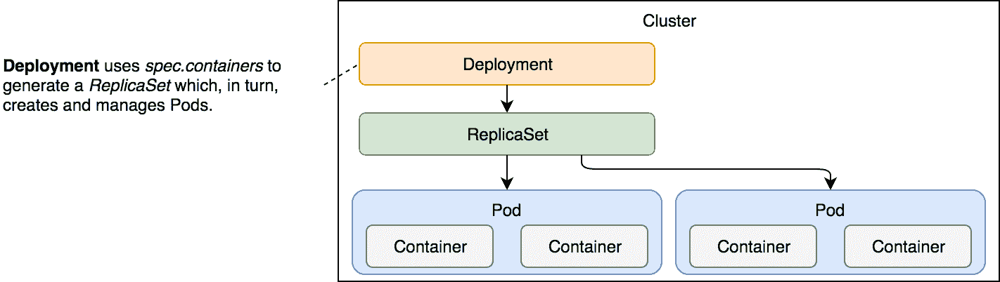
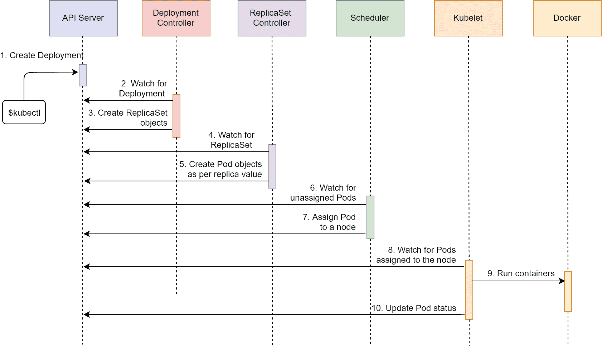
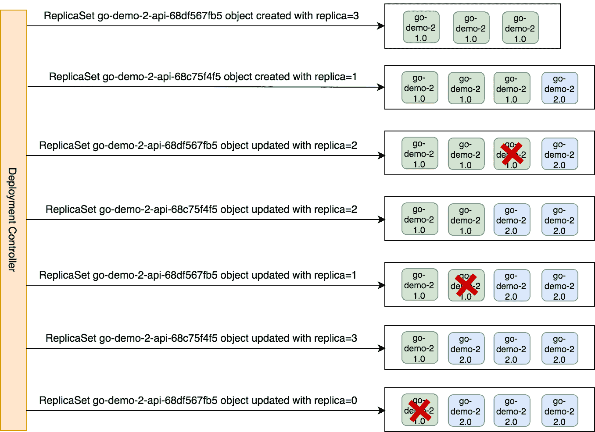
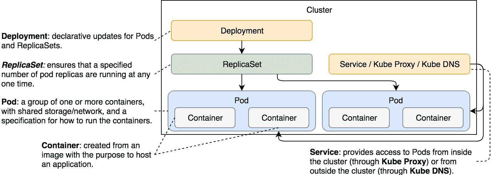

# 第六章：零停机发布部署

如果我们要在竞争中生存下去，我们必须在功能开发和测试完成后尽快将其发布到生产环境。频繁发布的需求进一步强调了零停机部署的重要性。

我们已经学会了如何部署打包为 Pod 的应用程序，如何通过 ReplicaSets 扩展它们，以及如何通过 Services 启用通信。然而，如果我们无法用新版本更新这些应用程序，那一切都是无用的。Kubernetes 部署在这一点上非常有用。

我们的应用程序的期望状态始终在变化。导致新状态的最常见原因是新的发布版本。这个过程相对简单。我们进行更改并将其提交到代码仓库，然后进行构建和测试。一旦我们确认它按预期工作，我们就将其部署到集群中。无论该部署是针对开发、测试、预生产还是生产环境，我们都需要将新版本部署到集群中，即使这个集群只是运行在笔记本电脑上的单节点 Kubernetes。不论我们有多少个环境，过程应该始终保持相同，或者至少尽可能相似。

部署必须确保无停机。无论是在测试集群还是生产集群上执行，都不应中断消费者的服务，这样会导致金钱和对产品的信任损失。过去的时代，用户可能不在乎应用偶尔无法工作，但现在竞争如此激烈，单次糟糕的体验可能会导致用户选择其他解决方案。在今天的规模下，0.1%的请求失败率都被视为灾难性的。虽然我们可能永远无法达到 100%的可用性，但我们至少不应该自己导致停机，并且必须尽量减少其他可能导致停机的因素。

由我们无法控制的外部环境引起的失败，按定义来说是我们无法采取任何措施的事情。然而，由于过时的做法或疏忽导致的失败则是应该避免的失败。Kubernetes 部署为我们提供了必要的工具，使我们能够在不产生停机的情况下更新应用程序，从而避免这些失败。

让我们探讨一下 Kubernetes 部署的工作原理，以及我们通过采用它们获得的好处。

# 创建一个集群

在每一章开始时创建集群可以让我们直接进入书中的任何部分，而不需要担心是否需要完成前面的章节要求。它还使我们可以在章节之间暂停，而无需让笔记本电脑因运行一个未使用的虚拟机而承受压力。缺点是，这部分是每章最枯燥的部分。因此，今天就讲到这里，让我们尽快完成这项工作。

本章的所有命令都可以在 `06-deploy.sh` 文件中找到，地址为 [`gist.github.com/vfarcic/677a0d688f65ceb01e31e33db59a4400`](https://gist.github.com/vfarcic/677a0d688f65ceb01e31e33db59a4400)。

```
cd k8s-specs

git pull

minikube start --vm-driver=virtualbox

kubectl config current-context  
```

代码已更新，集群正常运行，我们可以开始探索 Deployments。

# 部署新版本

就像我们不应该直接创建 Pods，而是使用 ReplicaSet 等其他控制器一样，我们也不应该直接创建 ReplicaSets。Kubernetes Deployments 会为我们创建它们。如果你在想为什么，稍等片刻，我们将揭示答案。首先，我们将创建几个 Deployments，一旦熟悉了这个过程和结果，就会很明显为什么它们在管理 ReplicaSets 方面比我们更有效。

让我们来看一下我们迄今为止使用的数据库 ReplicaSet 的 Deployment 规格。

```
cat deploy/go-demo-2-db.yml  
```

输出结果如下：

```
apiVersion: apps/v1beta2
kind: Deployment
metadata:
 name: go-demo-2-db
spec:
 selector:
 matchLabels:
 type: db
 service: go-demo-2
 template:
 metadata:
 labels:
 type: db
 service: go-demo-2
 vendor: MongoLabs
 spec:
 containers:
 - name: db
 image: mongo:3.3
 ports:
 - containerPort: 28017  
```

如果你将这个 Deployment 与我们在前一章中创建的 ReplicaSet 进行比较，你可能会很难找到差异。除了`kind`字段之外，它们是相同的。

由于在这种情况下，Deployment 和 ReplicaSet 是相同的，你可能会想知道使用其中一个而不是另一个的优势是什么。

我们将定期在`kubectl create`命令中添加`--record`选项。这样，我们就能跟踪每次对资源（如 Deployments）的更改。

让我们创建 Deployment 并探索它所提供的功能。

```
kubectl create \
 -f deploy/go-demo-2-db.yml \
 --record

kubectl get -f deploy/go-demo-2-db.yml  
```

后一个命令的输出如下：

```
NAME         DESIRED CURRENT UP-TO-DATE AVAILABLE AGE
go-demo-2-db 1       1       1          0         7s  
```

Deployment 已创建。然而，`get`命令没有提供太多信息，所以让我们用`describe`命令查看。

```
kubectl describe \
 -f deploy/go-demo-2-db.yml  
```

输出结果（仅限最后几行）如下：

```
...
Events:
 Type   Reason            Age  From                  Message
 ----   ------            ---- ----                  -------
 Normal ScalingReplicaSet 2m   deployment-controller Scaled up r
eplica set go-demo-2-db-75fbcbb5cd to 1  
```

从`Events`部分，我们可以看到 Deployment 创建了一个 ReplicaSet。更准确地说，它对其进行了扩展。这很有趣，它显示了 Deployments 控制 ReplicaSets。Deployment 创建了 ReplicaSet，而 ReplicaSet 又创建了 Pods。让我们通过检索所有对象的列表来确认这一点：

```
kubectl get all  
```

输出结果如下：

```
NAME                DESIRED CURRENT UP-TO-DATE AVAILABLE AGE
deploy/go-demo-2-db 1       1       1          1         8m

NAME                       DESIRED CURRENT READY AGE
rs/go-demo-2-db-75fbcbb5cd 1       1       1     8m

NAME                             READY STATUS  RESTARTS AGE
po/go-demo-2-db-75fbcbb5cd-k6tz9 1/1   Running 0        8m

NAME           TYPE      CLUSTER-IP EXTERNAL-IP PORT(S) AGE
svc/kubernetes ClusterIP 10.0.0.1   <none>      443/TCP 14m  
```

三个对象都已创建，你可能会想，为什么要创建 Deployment 呢？你可能认为如果直接创建 ReplicaSet，结果应该是一样的。你是对的。到目前为止，从功能角度来看，直接创建 ReplicaSet 或通过 Deployment 创建没有什么区别。Deployments 的真正优势在于我们尝试改变它的一些方面时才会显现出来。例如，我们可能会选择将 MongoDB 升级到 3.4 版本。



图 6-1：Deployment 及其级联效应，创建 ReplicaSet，并通过 ReplicaSet 创建 Pods

在继续讨论 Deployment 更新之前，我们将通过一个序列图来回顾我们惯常的流程。我们不会重复解释 ReplicaSet 对象创建后发生的事件，因为这些步骤已经在前面的章节中解释过。

1.  Kubernetes 客户端（`kubectl`）向 API 服务器发送请求，请求创建`deploy/go-demo-2-db.yml`文件中定义的 Deployment。

1.  部署控制器正在监视 API 服务器的新事件，并检测到有新的 Deployment 对象。

1.  部署控制器创建了一个新的 ReplicaSet 对象



图 6-2：请求创建部署时的事件顺序

# 更新部署

让我们看看当我们给`db` Pod 设置新镜像时会发生什么。

```
kubectl set image \
 -f deploy/go-demo-2-db.yml \
 db=mongo:3.4 \
 --record  
```

新镜像被拉取需要一些时间，所以你可以去喝杯咖啡。一旦你回来，我们可以通过检查它创建的事件来`describe`该部署。

```
kubectl describe \
 -f deploy/go-demo-2-db.yml
```

输出的最后几行如下：

```
...
Events:
 Type    Reason             Age   From                   Message
 ----    ------             ----  ----                   -------
 Normal  ScalingReplicaSet  19m   deployment-controller  Scaled 
up replica set go-demo-2-db-75fbcbb5cd to 1
 Normal  ScalingReplicaSet  5m    deployment-controller  Scaled 
up replica set go-demo-2-db-f8d4b86ff to 1
 Normal  ScalingReplicaSet  0s    deployment-controller  Scaled 
down replica set go-demo-2-db-75fbcbb5cd to 0  
```

我们可以看到它创建了一个新的 ReplicaSet，并将旧的 ReplicaSet 缩放到了`0`。如果在你的情况中，最后一行没有出现，你需要等到新的 `mongo` 镜像被拉取完毕。

部署并不是直接在 Pods 层面操作，而是创建了一个新的 ReplicaSet，后者基于新镜像生成 Pods。等它们完全可用后，旧的 ReplicaSet 会被缩放到`0`。由于我们只运行了一个副本的 ReplicaSet，可能不太清楚为什么采用这种策略。当我们为 API 创建一个部署时，情况会变得更加明确。

为了安全起见，我们可能想从集群中获取所有对象：

```
kubectl get all  
```

输出如下：

```
NAME                  DESIRED   CURRENT   UP-TO-DATE   AVAILABLE   
AGE
deploy/go-demo-2-db   1         1         1            1           
3m

NAME                         DESIRED   CURRENT   READY     AGE
rs/go-demo-2-db-75fbcbb5cd   0         0         0         3m
rs/go-demo-2-db-f8d4b86ff    1         1         1         2m
NAME                              READY     STATUS    RESTARTS   
AGE
po/go-demo-2-db-f8d4b86ff-qvhgg   1/1       Running   0          
2m

NAME             TYPE        CLUSTER-IP   EXTERNAL-IP   PORT(S)   
AGE
svc/kubernetes   ClusterIP   10.0.0.1     <none>        443/TCP   
35m  
```

如你所见，两个 ReplicaSets 都存在。然而，一个处于非活动状态（已缩放为`0`）。

你会注意到，Pod 名称中包含了一个与新 ReplicaSet 名称中的哈希值相匹配的哈希值，即 `f8d4b86ff`。尽管看起来像是一个随机值，但实际上并不是。如果你销毁部署并重新创建它，你会发现 Pod 名称和 ReplicaSet 名称中的哈希值保持一致。这个值是通过对 ReplicaSet 的 PodTemplate 进行哈希生成的。只要 PodTemplate 不变，哈希值也会保持一致。这样，部署就可以知道是否有与 Pods 相关的更改，如果有更改，就会创建一个新的 ReplicaSet。

`kubectl set image`命令并不是更新部署的唯一方法。我们也可以使用`kubectl edit`。命令如下。**请不要执行它。**如果你执行了（违背我的建议），你需要输入`:q`并按*Enter*键才能退出。

```
kubectl edit -f deploy/go-demo-2-db.yml  
```

我认为上述的`edit`命令并不是更新定义的好方法。它既不实用，也没有文档说明。如果我们希望将部署更新与 CI/CD 工具之一集成，`kubectl set image`会更有用。由于接下来会有专门讲解持续部署的章节，我们从现在开始将继续使用`kubectl set image`。

另一种替代方法是更新 YAML 文件并执行`kubectl apply`命令。虽然这对不常更新的应用程序来说是个好主意，但对于每周、每天甚至每小时都会发生变化的应用程序来说并不适用。

MongoDB 是那些每年可能只更新几次新版本的应用之一，因此在源代码仓库中始终保持最新的 YAML 文件是一种很好的实践。我们使用了`kubectl set image`，只是为了让你了解接下来我们将要探讨的内容：如何在没有停机的情况下进行频繁的部署。

单纯更新 Pod 镜像远远无法展示 Deployment 的真正优势。为了看到其真正的力量，我们应该部署 API。由于它可以扩展到多个 Pod，它将为我们提供一个更好的操作环境。

在我们继续之前，让我们通过添加一个 Service 来完成数据库的配置，从而启用集群内部的通信：

```
kubectl create \
 -f deploy/go-demo-2-db-svc.yml \
 --record  
```

# 零停机部署

更新单个副本的 MongoDB 无法展示 Deployment 背后的真正能力。我们需要一个可扩展的服务。并不是说 MongoDB 不能扩展（它是可以的），但它不像一个从一开始就设计为可扩展的应用程序那样简单。我们将跳到堆栈中的第二个应用程序，并创建一个 ReplicaSet 的 Deployment，基于`vfarcic/go-demo-2`镜像创建 Pod。但在此之前，我们将花一些时间讨论零停机部署的需求。

一方面，我们的应用程序应该具备非常高的可用性。根据上下文和目标的不同，我们通常会讨论 99%之后有多少个“9”。至少，一个应用程序的可用性必须达到 99.9%。更常见的是，它应该接近 99.99%甚至 99.999%的可用性。百分之百的可用性通常是不可能的，或者实现起来成本过高。我们无法避免所有故障，但可以将其减少到可接受的范围内。

无论 SLA 的可用性是多少，应用程序（至少是我们开发的应用程序）必须是可扩展的。只有当有多个副本时，我们才能期望有合理的可用性。可扩展的应用程序不仅可以将负载分摊到多个实例上，还能确保一个副本的故障不会导致停机。健康的实例会继续处理负载，直到调度器重新创建失败的副本。

高可用性是通过容错和可扩展性来实现的。如果其中任何一项缺失，任何故障可能都会产生灾难性的后果。

我们讨论故障和可扩展性的原因在于不可变部署的特性。如果一个 Pod 是不可变的，那么更新它的新版本的唯一方法是销毁旧的 Pod，并用基于新镜像的 Pod 替换它们。Pod 的销毁与故障没有太大区别。在两种情况下，Pod 都停止工作。另一方面，容错（重新调度）是对失败 Pod 的替代。

唯一的实质性区别在于，新版本发布会导致 Pod 被新的基于新镜像的 Pod 替换。只要过程得到控制，当应用程序有多个副本运行并且设计得当时，新版本发布应该不会导致停机。

我们不应该担心新版本发布的频率。无论是每月发布一次、每周发布一次、每天发布一次还是每几分钟发布一次，过程应该是相同的。如果发布过程中出现任何停机时间，我们可能会被迫减少新版本发布的频率。事实上，在软件开发历史上，我们曾经被告知发布应该是有限的。每年发布几次是常态。之所以发布不频繁，部分原因是它们会造成停机时间。如果我们能够实现零停机部署，那么发布频率就可以发生变化，我们可以目标为持续部署。我们现在不打算深入探讨持续部署的好处，这在此时并不相关。相反，我们将专注于零停机部署。如果有选择的话，没人会选择那种“稍微有点停机”的策略，所以我假设每个人都希望能够在没有中断的情况下发布。

零停机部署是频繁发布的前提条件。

让我们来看看 API 的 Deployment 定义：

```
cat deploy/go-demo-2-api.yml  
```

输出如下：

```
apiVersion: apps/v1beta2
kind: Deployment
metadata:
 name: go-demo-2-api
spec:
 replicas: 3
 selector:
 matchLabels:
 type: api
 service: go-demo-2
 minReadySeconds: 1
 progressDeadlineSeconds: 60
 revisionHistoryLimit: 5
 strategy:
 type: RollingUpdate
 rollingUpdate:
 maxSurge: 1
 maxUnavailable: 1
 template:
 metadata:
 labels:
 type: api
 service: go-demo-2
 language: go
 spec:
 containers:
 - name: api
 image: vfarcic/go-demo-2
 env:
 - name: DB
 value: go-demo-2-db
 readinessProbe:
 httpGet:
 path: /demo/hello
 port: 8080
 periodSeconds: 1
 livenessProbe:
 httpGet:
 path: /demo/hello
 port: 8080  
```

我们将跳过对`apiVersion`、`kind`和`metadata`的解释，因为它们总是遵循相同的模式。

`spec`部分包含了一些我们之前没有见过的字段，也有一些我们熟悉的字段。`replicas`和`selector`与我们在上一章的 ReplicaSet 中使用的相同。

`minReadySeconds`定义了 Kubernetes 在将 Pod 视为健康之前的最小秒数。我们将该字段的值设置为`1`秒。默认值为`0`，这意味着一旦 Pod 准备好，并且在指定时`livenessProbe`返回 OK，它们就会被视为可用。如果有疑问，可以省略此字段，保留默认值`0`。我们主要是为了演示目的才定义了这个值。

下一个字段是`revisionHistoryLimit`。它定义了我们可以回滚的旧 ReplicaSet 数量。像大多数字段一样，它的默认值是合理的`10`。我们将其更改为`5`，因此，我们将能够回滚到之前的五个 ReplicaSet 中的任何一个。

`strategy`可以是`RollingUpdate`或`Recreate`类型。后者将在更新之前杀死所有现有的 Pod。`Recreate`类似于我们过去使用的过程，当时部署新版本的典型策略是先停止现有版本，然后用新版本替换它。这种方法不可避免地会导致停机。只有在应用程序没有设计为支持两个版本并行存在时，这个策略才有用。不幸的是，这种情况比应有的还要普遍。如果你怀疑你的应用程序是否属于这种情况，可以问自己以下问题：如果我的应用程序的两个不同版本并行运行，是否会有不良影响？如果是这样，`Recreate`策略可能是一个不错的选择，并且*你必须意识到，无法实现零停机部署*。

`recreate`策略更适合我们的单副本数据库。我们应该已经设置了本地数据库复制（与 Kubernetes 的 ReplicaSet 对象不同），但正如前面所述，这超出了本章的范围（也许甚至超出了本书的范围）。

如果我们将数据库作为单副本运行，必须挂载一个网络驱动器卷。这样可以避免在更新过程中或发生故障时数据丢失。由于大多数数据库（包括 MongoDB）不能让多个实例写入相同的数据文件，因此在没有复制的情况下，先停止旧版本再创建新版本是一种很好的策略。我们稍后会应用它。

`RollingUpdate`策略是默认类型，这也是有原因的。它允许我们在不间断的情况下部署新版本。它会创建一个副本数为零的新 ReplicaSet，并根据其他参数，逐步增加新 ReplicaSet 的副本数，同时减少旧 ReplicaSet 的副本数。该过程在新 ReplicaSet 的副本完全替代旧版本副本时结束。

当`RollingUpdate`作为首选策略时，可以通过`maxSurge`和`maxUnavailable`字段进行微调。前者定义了可以超过所需数量（通过`replicas`设置）的 Pod 的最大数量。它可以设置为一个绝对值（例如，`2`）或一个百分比（例如，`35%`）。Pod 的总数永远不会超过所需数量（通过`replicas`设置）和`maxSurge`的总和。默认值为`25%`。

`maxUnavailable`定义了不可操作的 Pod 的最大数量。例如，如果副本数设置为 15，而此字段设置为 4，则在任何时刻运行的最少 Pod 数量将为 11。就像`maxSurge`字段一样，这个字段的默认值也是`25%`。如果没有指定此字段，将始终至少有 75%的 Pod 是期望中的 Pod。

在大多数情况下，Deployment 特定字段的默认值是一个不错的选择。我们仅通过更改默认设置来展示我们可以使用的更多选项。在随后的大多数 Deployment 定义中，我们将移除这些设置。

`template`是我们之前使用的相同的`PodTemplate`。最佳实践是像我们为`mongo:3.3`设置镜像标签时那样，明确指定镜像标签。然而，这对于我们构建的镜像可能并不是最佳策略。只要我们遵循正确的实践，就可以依赖`latest`标签保持稳定。即使发现它们不稳定，我们也可以通过创建一个新的`latest`标签来迅速修复。然而，我们不能指望第三方镜像也如此，它们必须始终使用特定版本的标签。

永远不要基于`latest`标签部署第三方镜像。通过明确发布版本，我们可以更好地控制生产环境中正在运行的内容，并明确下一次升级应该是什么。

我们不会一直使用`latest`标签来标识我们的服务，而只是用于初始部署。假设我们尽最大努力保持`latest`标签稳定且适合生产环境，它在首次设置集群时非常方便。之后，每个新的发布版本将使用一个特定的标签。我们的自动化持续部署流水线将在后续章节中为我们完成此任务。

如果您有信心保持`latest`标签的稳定性，那么在应用程序的首次部署时使用它是非常方便的。

在我们探索滚动更新之前，我们应该创建部署，并通过它发布我们应用程序的第一个版本。

```
kubectl create \
 -f deploy/go-demo-2-api.yml \
 --record

kubectl get -f deploy/go-demo-2-api.yml  
```

我们创建了 Deployment，并从 Kubernetes API 服务器获取了该对象。

后一个命令的输出如下：

```
NAME          DESIRED CURRENT UP-TO-DATE AVAILABLE AGE
go-demo-2-api 3       3       3          3         1m  
```

请确保可用的 Pods 数量为`3`。如果不是，稍等片刻。一旦所有 Pods 都启动并运行，我们将拥有一个创建了新 ReplicaSet 的 Deployment，而 ReplicaSet 又根据`vfarcic/go-demo-2`镜像的最新版本创建了三个 Pods。

让我们看看设置新镜像时会发生什么。

```
kubectl set image \
 -f deploy/go-demo-2-api.yml \
 api=vfarcic/go-demo-2:2.0 \
 --record  
```

我们可以通过几种方式观察更新过程中发生了什么。其中一种方法是通过`kubectl rollout status`命令。

```
kubectl rollout status -w \
 -f deploy/go-demo-2-api.yml  
```

输出如下：

```
...
deployment "go-demo-2-api" successfully rolled out  
```

从最后一条记录中，我们可以看到新部署的发布成功了。根据设置新镜像和显示发布状态之间经过的时间，您可能会看到其他记录标记了进展情况。不过，我认为`kubectl describe`命令的事件提供了一个更清晰的执行过程图景。

```
kubectl describe \
 -f deploy/go-demo-2-api.yml  
```

输出的最后几行如下：

```
...
Replicas: 3 desired | 3 updated | 3 total | 3 available | 0 unava
liable
...
OldReplicaSets:  <none>
NewReplicaSet:   go-demo-2-api-68c75f4f5 (3/3 replicas created)
Events:
 Type   Reason            Age  From                  Message
 ----   ------            ---- ----                  -------
 Normal ScalingReplicaSet 2m   deployment-controller Scaled up r
eplica set go-demo-2-api-68df567fb5 to 3
 Normal ScalingReplicaSet 2m   deployment-controller Scaled up r
eplica set go-demo-2-api-68c75f4f5 to 1
 Normal ScalingReplicaSet 2m   deployment-controller Scaled down 
replica set go-demo-2-api-68df567fb5 to 2
 Normal ScalingReplicaSet 2m   deployment-controller Scaled up r
eplica set go-demo-2-api-68c75f4f5 to 2
 Normal ScalingReplicaSet 2m   deployment-controller Scaled down 
replica set go-demo-2-api-68df567fb5 to 1
 Normal ScalingReplicaSet 2m   deployment-controller Scaled up r
eplica set go-demo-2-api-68c75f4f5 to 3
 Normal ScalingReplicaSet 2m   deployment-controller Scaled down 
replica set go-demo-2-api-68df567fb5 to 0  
```

我们可以看到，期望的副本数是`3`。该数量已更新并且都处于可用状态。

输出底部是与部署相关的事件。该过程始于增加新 ReplicaSet (`go-demo-2-api-68c75f4f5`) 的副本数至 `1`。接下来，它减少了旧 ReplicaSet (`go-demo-2-api-68df567fb5`) 的副本数至 `2`。同样的过程，增加新的副本并减少旧的 ReplicaSet 的副本数一直持续，直到新的 ReplicaSet 达到所需的数量 (`3`)，而旧的则减少到零。

整个过程中没有停机时间。用户无论在更新前、期间还是之后发送请求，都会收到应用程序的响应。唯一重要的是，在更新期间，响应可能来自旧版或新版。更新过程中，两个版本都在并行运行。

让我们看一下回滚历史记录：

```
kubectl rollout history \
 -f deploy/go-demo-2-api.yml  
```

输出如下所示：

```
deployments "go-demo-2-api"
REVISION CHANGE-CAUSE
1        kubectl create --filename=deploy/go-demo-2-api.yml --rec
ord=true
2        kubectl set image api=vfarcic/go-demo-2:2.0 --filename=d
eploy/go-demo-2-api.yml  
```

到目前为止，我们可以看到软件有两个修订版。更改原因显示了每个修订版由哪个命令创建。

ReplicaSets 怎么样？

```
kubectl get rs  
```

输出结果仅限于 `go-demo-2-api`，如下所示。

```
NAME                     DESIRED CURRENT READY AGE
go-demo-2-api-68c75f4f5  3       3       3     4m
go-demo-2-api-68df567fb5 0       0       0     4m
...  
```

我们可以看到部署没有修改 ReplicaSet，而是创建了一个新的 ReplicaSet，在过程结束时，旧的 ReplicaSet 被缩减为零副本。

图 6-2 中的图示了自执行 `kubectl set image` 命令以来发生的事件流。它紧密地描述了我们从 `kubectl describe` 命令中已经看到的事件。



图 6-3：部署控制器滚动更新工作流程

我们取得了很大进展。然而，意外随时可能发生，我们必须做好应对准备。

# 回滚还是向前滚动？

在这一点上，我们或多或少能够在准备好的时候立即向生产环境部署新的发布版。然而，总会出现问题。意外情况会发生。错误会悄悄溜进来，使我们的生产集群面临风险。在这种情况下，我们该怎么办？这个问题的答案很大程度上取决于变更的规模和部署的频率。

如果我们正在使用持续部署流程，我们会经常向生产环境部署新的发布版。与其等待功能累积，我们更倾向于部署小块。在这种情况下，修复问题可能与回滚一样快。毕竟，解决仅仅几小时工作（也许一天）导致的问题需要多少时间？可能不多。问题是由最近的一个变更引入的，该变更仍在工程师的头脑中。修复它不应该需要很长时间，我们应该能够很快部署新版本。

你可能没有频繁发布，或者所包含的更改量超过了几百行代码。在这种情况下，前进的速度可能不如预期。即便如此，回滚可能也无法实现。如果数据库模式发生变化，且与使用它的后端旧版本不兼容，我们可能无法回滚部署。一旦第一个事务开始处理，我们可能就无法再回滚，至少没有丢失自新发布以来生成的数据。

回滚引入了数据库更改的发布通常是不可行的。即便可行，在实践持续部署时，尤其是高频发布且更改范围较小的情况下，前进通常是更好的选择。

我已经尽力劝阻你不要回滚，但在某些情况下回滚是更好的选择。在其他情况下，它可能是唯一的选择。幸运的是，使用 Kubernetes 回滚相对来说是非常直接的。

我们假设刚刚发现最新发布的`vfarcic/go-demo-2`镜像存在问题，需要回滚到先前的版本。执行这一操作的命令如下：

```
kubectl rollout undo \
 -f deploy/go-demo-2-api.yml

kubectl describe \
 -f deploy/go-demo-2-api.yml  
```

后者命令的输出，仅限最后几行，结果如下：

```
OldReplicaSets:  <none>
NewReplicaSet:   go-demo-2-api-68df567fb5 (3/3 replicas created)
Events:
 Type   Reason             Age             From                  
Message
 ----   ------             ----            ----                  
-------
 Normal ScalingReplicaSet  6m              deployment-controller 
Scaled up replica set go-demo-2-api-68c75f4f5 to 1
 Normal ScalingReplicaSet  6m              deployment-controller 
Scaled down replica set go-demo-2-api-68df567fb5 to 2
 Normal ScalingReplicaSet  6m              deployment-controller 
Scaled up replica set go-demo-2-api-68c75f4f5 to 2
 Normal ScalingReplicaSet  6m              deployment-controller 
Scaled down replica set go-demo-2-api-68df567fb5 to 1
 Normal ScalingReplicaSet  6m              deployment-controller 
Scaled up replica set go-demo-2-api-68c75f4f5 to 3
 Normal ScalingReplicaSet  6m              deployment-controller 
Scaled down replica set go-demo-2-api-68df567fb5 to 0
 Normal DeploymentRollback 1m              deployment-controller 
Rolled back deployment "go-demo-2-api" to revision 1
 Normal ScalingReplicaSet  1m              deployment-controller 
Scaled up replica set go-demo-2-api-68df567fb5 to 1
 Normal ScalingReplicaSet  1m              deployment-controller 
Scaled down replica set go-demo-2-api-68c75f4f5 to 2
 Normal ScalingReplicaSet  1m (x2 over 6m) deployment-controller 
Scaled up replica set go-demo-2-api-68df567fb5 to 3
 Normal ScalingReplicaSet  1m (x3 over 1m) deployment-controller 
(combined from similar events): Scaled down replica set go-demo-2
-api-68c75f4f5 to0  
```

从事件部分可以看到，Deployment 启动了回滚操作，从那里开始，我们之前经历的过程被逆转了。它开始增加旧 ReplicaSet 的副本数，并减少最新 ReplicaSet 的副本数。一旦该过程完成，旧的 ReplicaSet 变为活动状态并拥有所有副本，而新的 ReplicaSet 则被缩放为零。

最终结果可能更容易通过位于`Events`上方的`NewReplicaSet`条目看到。在我们撤销部署之前，值是`go-demo-2-api-68c75f4f5`，现在是`go-demo-2-api-68df567fb5`。

仅了解最新 Deployment 的当前状态通常是不够的，我们可能需要获取过去的发布列表。可以通过`kubectl rollout history`命令来获取。

```
kubectl rollout history \
 -f deploy/go-demo-2-api.yml  
```

输出结果如下：

```
REVISION  CHANGE-CAUSE
2         kubectl set image api=vfarcic/go-demo-2:2.0 --filename=
deploy/go-demo-2-api.yml
3         kubectl create --filename=deploy/go-demo-2-api.yml --re
cord=true  
```

如果你查看第三次修订，你会注意到变更原因是我们第一次创建 Deployment 时使用的相同命令。在执行`kubectl rollout undo`之前，我们有两个修订版本；`1`和`2`。`undo`命令检查了倒数第二个修订版本（`1`）。由于新的部署不会删除 ReplicaSets，而是将其缩放到`0`，因此撤销最后一次更改所需做的只是将其缩放回所需的副本数，并同时将当前的副本数缩放为零。

让我们加快进度，部署几个新版本。这样可以为我们提供更广阔的探索空间，以尝试一些我们可以在 Deployments 中做的额外操作。

```
kubectl set image \
 -f deploy/go-demo-2-api.yml \
 api=vfarcic/go-demo-2:3.0 \
 --record

kubectl rollout status \
 -f deploy/go-demo-2-api.yml  
```

我们将镜像更新为`vfarcic/go-demo-2:3.0`并检索了发布状态。后者命令的最后一行如下：

```
deployment "go-demo-2-api" successfully rolled out  
```

部署成功更新，因此创建了一个新的 ReplicaSet，并将其扩展到所需的副本数。先前活跃的 ReplicaSet 被缩放到`0`。因此，我们正在运行标签`3.0`的`vfarcic/go-demo-2`镜像。

我们将重复使用`4.0`标签进行操作：

```
kubectl set image \
 -f deploy/go-demo-2-api.yml \
 api=vfarcic/go-demo-2:4.0 \
 --record

kubectl rollout status \
 -f deploy/go-demo-2-api.yml  
```

`rollout status`的最后一行输出确认了发布成功。

现在，我们已经部署了一些版本，可以检查当前的`rollout history`：

```
kubectl rollout history \
 -f deploy/go-demo-2-api.yml  
```

输出如下：

```
deployments "go-demo-2-api"
REVISION CHANGE-CAUSE
2        kubectl set image api=vfarcic/go-demo-2:2.0 --filename=d
eploy/go-demo-2-api.yml --record=true
3        kubectl create --filename=deploy/go-demo-2-api.yml --rec
ord=true
4        kubectl set image api=vfarcic/go-demo-2:3.0 --filename=d
eploy/go-demo-2-api.yml --record=true
5        kubectl set image api=vfarcic/go-demo-2:4.0 --filename=deploy/go-demo-2-api.yml --record=true  
```

我们可以清楚地看到生成这些更改的命令，以及通过它们我们如何将应用程序推进到当前基于镜像`vfarcic/go-demo-2:4.0`的版本。

如您所见，我们可以通过`kubectl rollout undo`命令回滚到上一个版本。在大多数情况下，当遇到问题且无法通过创建包含修复的新版本进行向前推进时，回滚是正确的操作。然而，有时即使这样也不够，我们必须回退到比上一个版本更早的时间点。

假设我们发现当前版本不仅有问题，而且之前的几个版本也存在 bug。按照相同的思路，我们假设最后一个正确的版本是基于镜像`vfarcic/go-demo-2:2.0`。我们可以通过执行以下命令来解决该问题（**请勿执行此命令**）：

```
kubectl set image \
 -f deploy/go-demo-2-api.yml \
 api=vfarcic/go-demo-2:2.0 \
 --record  
```

尽管该命令肯定会解决问题，但有一种更简单的方法来实现相同的结果。我们可以通过回退到最后一个工作正常的版本来`undo`该`rollout`。假设我们要恢复到镜像`vfarcic/go-demo-2:2.0`，通过查看历史记录中的变更原因，我们得知应该回退到版本`2`。这可以通过`--to-revision`参数来完成。命令如下：

```
kubectl rollout undo \
 -f deploy/go-demo-2-api.yml \
 --to-revision=2

kubectl rollout history \
 -f deploy/go-demo-2-api.yml  
```

我们通过回退到版本`2`撤销了发布。我们还恢复了`history`。

后续命令的输出如下：

```
deployments "go-demo-2-api"
REVISION  CHANGE-CAUSE
3         kubectl create --filename=deploy/go-demo-2-api.yml --re
cord=true
4         kubectl set image api=vfarcic/go-demo-2:3.0 --filename=
deploy/go-demo-2-api.yml --record=true
5         kubectl set image api=vfarcic/go-demo-2:4.0 --filename=
deploy/go-demo-2-api.yml --record=true
6         kubectl set image api=vfarcic/go-demo-2:2.0 --filename=
deploy/go-demo-2-api.yml --record=true  
```

通过新版本`6`，我们可以看到当前活跃的部署是基于镜像`vfarcic/go-demo-2:2.0`。我们成功地回到了特定的时间点。问题已经解决，如果这是一个在生产集群中运行的“真实”应用程序，我们的用户将继续与我们实际有效的版本进行交互。

# 回滚失败的部署

发现关键性 bug 可能是回滚的最常见原因，但也有其他情况。例如，我们可能会遇到无法创建 Pods 的情况。一个容易重现的案例是尝试部署一个不存在标签的镜像。

```
kubectl set image \
 -f deploy/go-demo-2-api.yml \
 api=vfarcic/go-demo-2:does-not-exist \
 --record 
```

输出如下：

```
deployment "go-demo-2-api" image updated  
```

看见这样的消息，你可能会以为一切都正常了。然而，输出的只是表示部署中使用的镜像定义已成功更新。这并不意味着副本集背后的 Pods 确实在运行。举个例子，我可以向你保证，`vfarcic/go-demo-2:does-not-exist`镜像并不存在。

请确保自执行`kubectl set image`命令后，至少已经过去`60`秒。如果你想知道为什么要等待，答案就在`go-demo-2-api`部署定义中的`progressDeadlineSeconds`字段。这就是部署在得出无法进行的结论之前必须等待的时间，因为无法运行某个 Pod。

让我们来看看副本集。

```
kubectl get rs -l type=api  
```

输出如下：

```
NAME                     DESIRED CURRENT READY AGE
go-demo-2-api-5b49d94f9b 0       0       0     8m
go-demo-2-api-68c75f4f5  2       2       2     9m
go-demo-2-api-7cb9bb5675 0       0       0     8m
go-demo-2-api-68df567fb5 0       0       0     9m
go-demo-2-api-dc7877dcd  2       2       0     4m  
```

到目前为止，在不同情况下，新的副本集（`go-demo-2-api-dc7877dcd`）中的所有 Pods 应该已被设置为`3`，而之前的副本集（`go-demo-2-api-68c75f4f5`）中的 Pods 应该已经缩减到`0`。然而，部署过程中发现了问题，并停止了更新操作。

我们应该能够通过`kubectl rollout status`命令获取更详细的信息：

```
kubectl rollout status \
 -f deploy/go-demo-2-api.yml  
```

输出如下：

```
error: deployment "go-demo-2-api" exceeded its progress deadline  
```

部署意识到不应该继续进行。新的 Pods 没有运行，且达到了限制。继续尝试也没有意义。

如果你期待部署在失败后会自动回滚，那你就错了。它不会自动回滚。至少，不没有额外的插件。并不是说我期待你在终端前坐着，等待超时，然后检查`rollout status`，再决定是保持新的更新还是回滚。我希望你能够在自动化 CDP 管道中部署新的版本。幸运的是，`status`命令返回`1`表示部署失败，我们可以利用这些信息决定接下来的操作。对于那些不常接触 Linux 的人来说，任何非`0`的退出代码都被视为错误。让我们通过检查上一个命令的退出代码来确认这一点：

```
echo $?  
```

输出的确是`1`，从而确认了部署失败。

我们很快会探讨自动化 CDP 管道。目前，先记住我们可以通过查看部署更新是否成功来进行判断。

现在我们发现上一次的部署失败了，我们应该撤销它。你已经知道如何操作，但我会再提醒一下，以防你有点健忘。

```
kubectl rollout undo \
 -f deploy/go-demo-2-api.yml

kubectl rollout status \
 -f deploy/go-demo-2-api.yml  
```

上一个命令的输出确认了`deployment "go-demo-2-api"`已经`成功部署`。

既然我们已经学会了如何回滚，无论问题是严重的 bug 还是无法运行新版本，我们可以稍作休息，先把到目前为止所学的所有定义合并到一个 YAML 文件中。但在此之前，我们先删除我们创建的对象。

```
kubectl delete \
 -f deploy/go-demo-2-db.yml

kubectl delete \
 -f deploy/go-demo-2-db-svc.yml

kubectl delete \
 -f deploy/go-demo-2-api.yml  
```

# 将所有内容合并到同一个 YAML 定义中

将这一部分视为一个简短的插曲。我们将本章中使用的定义合并成一个单独的 YAML 文件。你之前已经见过类似的示例，因此无需详细解释。

```
cat deploy/go-demo-2.yml  
```

如果你开始与之前的定义进行对比，你会发现一些不同之处。`minReadySeconds`、`progressDeadlineSeconds`、`revisionHistoryLimit`和`strategy`字段已从`go-demo-2-api` Deployment 中移除。我们主要是用它们来演示如何使用它们。但由于 Kubernetes 有合理的默认值，我们在这个定义中省略了它们。你还会注意到有两个 Services，尽管我们在本章中只创建了一个。由于我们没有需要访问 API 的需求，因此在我们的示例中没有使用`go-demo-2-api` Service。但为了完整性，它被包含在这个定义中。最后，数据库的部署策略被设置为`recreate`。正如前面所解释的，它更适合单副本数据库，尽管我们没有挂载可以保留数据的卷。

让我们创建`deploy/go-demo-2.yml`中定义的对象。记住，通过使用`--save-config`，我们确保可以在以后编辑配置。另一种选择是使用`kubectl apply`。

```
kubectl create \
 -f deploy/go-demo-2.yml \
 --record --save-config

kubectl get -f deploy/go-demo-2.yml  
```

后一个命令的输出如下：

```
NAME                DESIRED CURRENT UP-TO-DATE AVAILABLE AGE
deploy/go-demo-2-db 1       1       1          1         15s

NAME             TYPE      CLUSTER-IP EXTERNAL-IP PORT(S)   AGE
svc/go-demo-2-db ClusterIP 10.0.0.125 <none>      27017/TCP 15s

NAME                 DESIRED CURRENT UP-TO-DATE AVAILABLE AGE
deploy/go-demo-2-api 3       3       3          3         15s

NAME              TYPE     CLUSTER-IP EXTERNAL-IP PORT(S)        
AGE
svc/go-demo-2-api NodePort 10.0.0.57  <none>      8080:31586/TCP 
15s
```

所有四个对象（两个 Deployments 和两个 Services）都已创建，我们可以继续探索如何通过单个命令更新多个对象。

# 更新多个对象

即使大多数时候我们将请求发送到特定的对象，几乎所有操作都是通过选择器标签进行的。当我们更新 Deployments 时，它们会根据匹配的选择器来选择要创建和扩展的 ReplicaSets。它们反过来使用匹配的选择器来创建或终止 Pods。Kubernetes 中的几乎所有操作都是通过标签选择器来完成的。只是有时候这一点对我们来说是隐藏的。

我们不必仅通过指定对象的名称或其定义所在的 YAML 文件来更新对象。我们还可以使用标签来决定应该更新哪个对象。这为我们打开了一些有趣的可能性，因为选择器可能匹配多个对象。

假设我们正在运行多个带有 Mongo 数据库的 Deployments，现在到了更新它们到新版本的时候。在我们探索如何做到这一点之前，我们将创建另一个 Deployment，以便我们至少有两个带有数据库 Pods 的 Deployment。

让我们首先看一下定义：

```
cat deploy/different-app-db.yml  
```

输出如下：

```
piVersion: apps/v1beta2
kind: Deployment
metadata:
 name: different-app-db
  labels:
     type: db
     service: different-app
     vendor: MongoLabs
spec:
 selector:
 matchLabels:
 type: db
 service: different-app
 template:
 metadata:
 labels:
 type: db
 service: different-app
 vendor: MongoLabs
 spec:
 containers:
 - name: db
 image: mongo:3.3
 ports:
 - containerPort: 28017  
```

与`go-demo-2-db` Deployment 相比，唯一的区别在于`service`标签。两者的`type`都设置为`db`。

让我们创建这个 Deployment：

```
kubectl create \
 -f deploy/different-app-db.yml  
```

现在我们有了两个带有`mongo:3.3` Pods 的 Deployments，我们可以尝试同时更新这两个。

诀窍是找到一个标签（或一组标签），它能够唯一标识我们想要更新的所有 Deployments。

让我们看看带有标签的 Deployment 列表：

```
kubectl get deployments --show-labels  
```

输出如下：

```
NAME             DESIRED CURRENT UP-TO-DATE AVAILABLE AGE LABELS
different-app-db 1       1       1          1         1h  service
=different-app,type=db,vendor=MongoLabs
go-demo-2-api    3       3       3          3         1h  languag
e=go,service=go-demo-2,type=api
go-demo-2-db     1       1       1          1         1h  service
=go-demo-2,type=db,vendor=MongoLabs  
```

我们想要更新使用`different-app-db`和`go-demo-2-db`部署创建的`mongo` Pods。它们都通过`type=db`和`vendor=MongoLabs`标签唯一标识。让我们来测试一下：

```
kubectl get deployments \
 -l type=db,vendor=MongoLabs  
```

输出如下所示：

```
NAME             DESIRED CURRENT UP-TO-DATE AVAILABLE AGE
different-app-db 1       1       1          1         1h
go-demo-2-db     1       1       1          1         1h  
```

我们可以看到，使用这两个标签进行过滤是有效的。我们只检索了我们想要更新的部署，所以让我们继续并推出新版本：

```
kubectl set image deployments \
 -l type=db,vendor=MongoLabs \ 
 db=mongo:3.4 --record  
```

输出如下所示：

```
deployment "different-app-db" image updated
deployment "go-demo-2-db" image updated  
```

最后，在进入下一个主题之前，我们应该验证镜像是否确实更改为`mongo:3.4`：

```
kubectl describe \
 -f deploy/go-demo-2.yml  
```

输出，仅限于相关部分，如下所示：

```
...
 Containers:
 db:
 Image:        mongo:3.4
...  
```

如我们所见，更新确实成功，至少在该部署上是如此。可以随意描述`deploy/different-app-db.yml`中定义的部署。你应该会看到它的镜像也已更新为新版。

# 扩展部署

扩展部署有许多不同的方式。我们在这一部分所做的所有操作不仅限于部署，任何控制器，如 ReplicaSet，甚至那些我们还没有探索过的控制器，都可以应用这些方法。

如果我们认为副本数量的变化相对较少，或者部署是手动进行的，那么扩展的最佳方式是编写一个新的 YAML 文件，或者更好的是，修改现有的文件。假设我们将 YAML 文件存储在代码库中，通过更新现有文件，我们就能有一个文档化并可复现的集群内部对象定义。

我们已经在应用`go-demo-2-scaled.yml`定义时进行了扩展。我们将做类似的事情，但这次是针对部署进行操作。

让我们看一下`deploy/go-demo-2-scaled.yml`。

```
cat deploy/go-demo-2-scaled.yml  
```

我们不会显示整个文件的内容，因为它与`deploy/go-demo-2.yml`几乎相同。唯一的区别是`go-demo-2-api`部署的副本数量。

```
...
apiVersion: apps/v1beta2
kind: Deployment
metadata:
  name: go-demo-2-api
spec:
  replicas: 5
...  
```

目前，我们运行的是三个副本。应用新的定义后，它应该增加到五个副本。

```
kubectl apply \
 -f deploy/go-demo-2-scaled.yml  
```

请注意，尽管文件不同，但资源的名称是相同的，因此`kubectl apply`并没有创建新对象，而是更新了那些发生变化的对象。特别是，它更改了`go-demo-2-api`部署的副本数量。

让我们确认，确实有五个副本的 Pod 是通过该部署控制的。

```
kubectl get \
 -f deploy/go-demo-2-scaled.yml  
```

输出，仅限于`deploy/go-demo-2-api`，如下所示：

```
...
NAME                 DESIRED CURRENT UP-TO-DATE AVAILABLE AGE
deploy/go-demo-2-api 5       5       5          5         11m
...  
```

结果应该不足为奇。毕竟，我们之前在探索 ReplicaSets 时已经执行过相同的过程。

虽然使用 YAML 文件（或其他控制器）扩展部署是保持文档准确的绝佳方式，但它很少适应集群的动态特性。我们应该力求实现一个可以自动扩展（和缩减）服务的系统。当扩展频繁且希望自动化时，我们不能指望每次更新 YAML 定义并将其推送到 Git。这将非常低效，而且如果通过仓库 Webhook 触发，可能会导致交付流水线的不必要执行。毕竟，我们真的希望每天多次推送更新的 YAML 文件吗？

`replicas` 的数量不应是设计的一部分。相反，它是一个波动的数字，随着流量、内存和 CPU 使用率等因素的变化而持续变化（或者至少经常变化）。

根据发布频率，`image` 也可以说是一样的。如果我们在进行持续交付或部署，我们可能会每周发布一次，每天发布一次，甚至更频繁。在这种情况下，新的镜像会经常部署，并且没有强烈的理由要求我们在每次发布新版本时都更改 YAML 文件。尤其是当我们通过自动化过程进行部署时（如我们应该做的那样），这一点尤为重要。

我们稍后会探讨自动化。现在，我们将限制在类似于 `kubectl set image` 的命令上。我们用它来在每次发布时更改 Pods 使用的 `image`。类似地，我们将使用 `kubectl scale` 来更改副本数量。可以把这看作是对即将到来的自动化的介绍。

```
kubectl scale deployment \
 go-demo-2-api --replicas 8 --record  
```

我们扩展了与 Deployment `go-demo-2-api` 相关的副本数量。请注意，这次我们没有使用 `-f` 来引用文件。由于在同一个 YAML 文件中指定了两个 Deployment，这将导致两个都被扩展。由于我们只想对特定的 Deployment 进行扩展，所以我们改为使用了它的名称。

让我们确认扩展是否如预期那样工作。

```
kubectl get -f deploy/go-demo-2.yml  
```

输出（仅限于 Deployment）如下：

```
NAME                DESIRED CURRENT UP-TO-DATE AVAILABLE AGE
deploy/go-demo-2-db 1       1       1          1         33m

NAME                 DESIRED CURRENT UP-TO-DATE AVAILABLE AGE
deploy/go-demo-2-api 8       8       8          8         33m  
```

正如我之前提到的，我们将花费相当多的时间来实现自动化，届时你将不必手动扩展应用程序。不过，我认为了解 `kubectl scale` 命令的存在是有用的。现在，你知道如何扩展 Deployment（和其他控制器）。

# 现在怎么办？

我们所学的一切都指向了 Deployments。Pods 不能直接创建，而必须通过 ReplicaSets 来创建，而 ReplicaSets 同样不能直接创建，必须通过 Deployments 来创建。它们是允许我们不仅可以创建 ReplicaSets 和 Pods，而且可以在不造成任何停机的情况下更新它们（前提是应用程序经过相应设计）。我们将 Deployments 与 Services 结合使用，使 Pods 之间能够相互通信，或者能够从集群外部访问。总的来说，我们已经拥有了将服务发布到生产环境所需的一切。这并不意味着我们已经理解了 Kubernetes 的所有关键方面。我们离这个目标还远。但我们已经具备了运行某些类型应用程序到生产环境所需的几乎所有内容。我们所缺少的只是网络部分。

在进入我们知识探索任务的下一阶段之前，我们将销毁当前运行的集群，让我们的笔记本休息一下。

```
minikube delete
```

如果你想了解更多关于部署的内容，请查阅 Deployment v1 apps 的[API 文档](https://v1-9.docs.kubernetes.io/docs/reference/generated/kubernetes-api/v1.9/#deployment-v1-apps)。



图 6-4：到目前为止探索的组件

在进入下一章之前，我们将探讨 Kubernetes 部署与 Docker Swarm 堆栈之间的差异。

# Kubernetes 部署与 Docker Swarm 堆栈的对比

如果你已经使用过 Docker Swarm，那么 Kubernetes Deployments 背后的逻辑应该是熟悉的。两者的目的相同，都可以用来部署新应用或更新已经在集群中运行的应用。在这两种情况下，我们都可以轻松地部署新版本而不会造成停机（前提是应用架构允许）。

与之前 Kubernetes Pods、ReplicaSets 和 Services 与 Docker Swarm Stacks 的对比不同，Kubernetes Deployments 确实提供了一些潜在的重要功能差异。但在我们深入探讨功能对比之前，我们将先花些时间来了解我们定义对象的方式有何不同。

一个 Kubernetes Deployment 和 Service 的定义示例如下：

```
apiVersion: apps/v1beta2
kind: Deployment
metadata:
 name: go-demo-2-db
spec:
 selector:
 matchLabels:
 type: db
 service: go-demo-2
 strategy:
 type: Recreate
 template:
 metadata:
 labels:
 type: db
 service: go-demo-2
 vendor: MongoLabs
 spec:
 containers:
 - name: db
 image: mongo:3.3
 ports:
 - containerPort: 28017

---

apiVersion: v1
kind: Service
metadata:
 name: go-demo-2-db
spec:
 ports:
 - port: 27017
 selector:
 type: db
 service: go-demo-2

---

apiVersion: apps/v1beta2
kind: Deployment
metadata:
 name: go-demo-2-api
spec:
 replicas: 3
 selector:
 matchLabels:
 type: api
 service: go-demo-2
 template:
 metadata:
 labels:
 type: api
 service: go-demo-2
 language: go
 spec:
 containers:
 - name: api
 image: vfarcic/go-demo-2
 env:
 - name: DB
 value: go-demo-2-db
 readinessProbe:
 httpGet:
 path: /demo/hello
 port: 8080
 periodSeconds: 1
 livenessProbe:
 httpGet:
 path: /demo/hello
 port: 8080

---

apiVersion: v1
kind: Service
metadata:
 name: go-demo-2-api
spec:
 type: NodePort
 ports:
 - port: 8080
 selector:
 type: api
 service: go-demo-2  
```

一个等效的 Docker Swarm 堆栈定义如下：

```
version: "3"
services:
 api:
 image: vfarcic/go-demo-2
 environment:
 - DB=db
 ports:
 - 8080
 deploy:
 replicas: 3
 db:
 image: mongo:3.3  
```

两种定义提供的功能大致相同。

显然，Kubernetes 部署需要一个更长的定义，并且具有更复杂的语法。值得注意的是，Swarm 中与 `readinessProbe` 和 `livenessProbe` 对应的功能在该栈中并不存在，因为它们在 Dockerfile 中作为 `HEALTHCHECK` 被定义。即便我们去掉它们，Kubernetes 部署依然较长且更为复杂。

如果仅仅比较定义对象的方式，Docker Swarm 显然是**胜者**。接下来我们来看从功能角度我们能得出什么结论。

创建对象相对简单。`kubectl create` 和 `docker stack deploy` 都能在没有停机的情况下部署新版本。新的容器，或者在 Kubernetes 中是新的 Pods，将会被创建，同时旧的容器会被终止。到目前为止，这两个方案差别不大。

其中一个主要的区别是发生故障时的处理方式。Kubernetes Deployment 在发生故障时不会执行任何修复操作。它会停止更新，导致新的和旧的 Pods 并行运行。另一方面，Docker Swarm 可以配置为自动回滚。这看起来像是 Docker Swarm 的又一个优势。然而，Kubernetes 有一些 Swarm 没有的功能。我们可以使用 `kubectl rollout status` 命令来查看更新是否成功，如果失败，我们可以 `undo` 更新的 `rollout`。尽管我们需要执行一些命令才能实现相同的结果，但当更新是自动化时，这可能更有利。知道更新是成功还是失败，不仅可以执行后续的回滚操作，还可以通知相关人员问题的存在。

这两种方法各有优缺点。在某些情况下，Docker Swarm 的自动回滚更合适，而 Kubernetes 的更新状态则在其他情况下更为有效。这些方法不同，并没有明显的优胜者，因此我认为这也是平局。

Kubernetes Deployment 可以记录历史。我们可以使用 `kubectl rollout history` 命令查看过去的更新历史。当更新按预期工作时，`history` 并不是非常有用。但当出现问题时，它可能提供额外的见解。这可以与回滚到特定版本的能力结合使用，而不一定是回滚到上一个版本。然而，大多数时候我们会回滚到上一个版本。回滚到更早的版本通常不太有用。即使这种需求出现，两个产品都可以做到。不同之处在于，Kubernetes Deployment 允许我们回滚到特定的修订版本（例如，我们现在是第五个修订版本，可以回滚到第二个修订版本）。而在 Docker Swarm 中，我们需要发布一个新的更新（例如，将镜像更新为 2.0 标签）。由于容器是不可变的，结果是一样的，所以差异仅在于回滚背后的语法。

两种产品都具备回滚到特定版本或标签的功能。我们可以讨论哪种语法更直接或更有用。差异很小，我认为在这项功能上没有赢家。可以说这是平局。

由于 Kubernetes 中几乎所有内容都基于标签选择器，它拥有 Docker Swarm 所没有的功能。我们可以同时更新多个部署。例如，我们可以发布一个更新（`kubetl set image`），使用过滤器查找所有 Mongo 数据库并将其升级到更新版本。这是一个在 Docker Swarm 中需要几行 bash 脚本才能实现的功能。然而，尽管能够更新所有符合特定标签的部署听起来像是一个有用的功能，但实际上它并不总是如此。更多时候，这种操作可能会产生不希望出现的效果。例如，如果我们有五个后端应用程序都使用 Mongo 数据库（每个应用一个数据库），我们可能希望以更加可控的方式进行升级。负责这些服务的团队可能希望测试每次升级并确认其可行性。我们可能不会等到所有升级完成，而是当负责的团队觉得准备好了时，就升级单个数据库。

在某些情况下，更新多个对象是有用的，所以这点我必须给 Kubernetes 认可。虽然是一个小胜，但依然算数。

还有一些事情是 Kubernetes 更容易实现的。例如，由于 Kubernetes 服务的工作方式，创建一个蓝绿部署流程比使用滚动更新要简单得多。然而，这样的过程属于高级用法，所以我会将其排除在这次比较之外。它（可能）稍后会提到。

很难说哪个解决方案提供更好的结果。从用户友好性的角度来看，Docker Swarm 依然很出色。另一方面，Kubernetes 部署提供了几个额外的功能。

写一个 Docker Swarm 堆栈文件比编写 Kubernetes 部署定义要简单得多。Kubernetes 部署提供了 Swarm 所没有的一些附加功能。然而，这些功能对于大多数使用场景来说重要性较小。那些真正重要的功能，或多或少是相同的。

不要仅仅基于 Kubernetes 部署和 Docker Swarm 堆栈之间的差异做出决策。在定义语法方面，Swarm 明显占优，而在功能方面，Kubernetes 比 Swarm 稍微有些优势。如果你仅仅根据部署做决策，Swarm 可能是一个稍微更好的选择。或者不是。这完全取决于在你案例中最重要的是什么。你关心 YAML 语法吗？那些额外的 Kubernetes 部署功能是你会用到的吗？

无论如何，Kubernetes 提供了更多的功能，基于如此有限的比较范围做出的任何结论都注定是不完整的。我们只是触及了表面。敬请关注更多内容。
