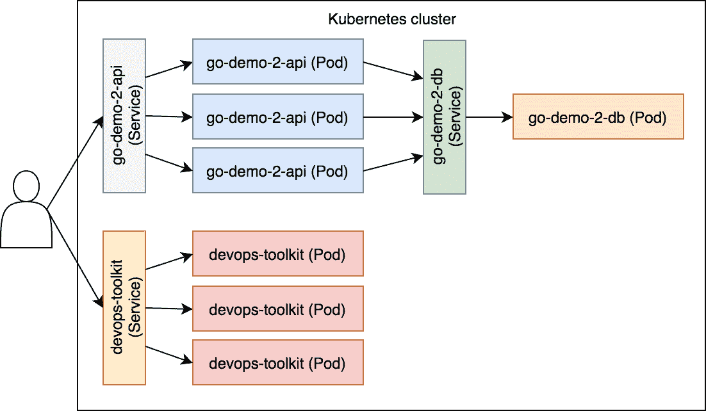

# 使用 Ingress 转发流量

无法访问的应用程序是无用的。Kubernetes 服务提供了可访问性，但有一定的可用性成本。每个应用程序都可以通过不同的端口访问。我们不能指望用户知道我们集群中每个服务的端口。

Ingress 对象管理着外部访问运行在 Kubernetes 集群内部的应用程序。乍一看，似乎我们已经通过 Kubernetes 服务完成了这一任务，但它们并没有真正让应用程序可访问。我们仍然需要基于路径和域的转发规则、SSL 终止以及其他许多功能。在更传统的设置中，我们可能会使用外部代理和负载均衡器。Ingress 提供了一个 API，让我们能够实现这些功能，并附带了一些我们期望从动态集群中获得的其他特性。

我们将通过示例探索问题和解决方案。现在，首先我们需要创建一个集群。

# 创建集群

和之前的每一章一样，我们将首先创建一个 Minikube 单节点集群。

本章中的所有命令都可以在 `07-ingress.sh` ([`gist.github.com/vfarcic/54ef6592bce747ff2d1b089834fc755b`](https://gist.github.com/vfarcic/54ef6592bce747ff2d1b089834fc755b)) Gist 中找到。

```
cd k8s-specs

git pull

minikube start --vm-driver=virtualbox

kubectl config current-context  
```

集群应已启动并运行，我们可以继续。

# 探索通过 Kubernetes 服务启用外部访问时的不足

在我们了解问题之前，我们无法探索解决方案。因此，我们将重新创建一些对象，利用我们已经掌握的知识。这将帮助我们查看 Kubernetes 服务是否满足应用程序用户的所有需求。或者，更明确地说，我们将探索在使我们的应用程序对用户可访问时，缺少哪些功能。

我们已经讨论过，通过服务发布固定端口是一个不好的做法。这种方法很可能导致冲突，或者至少会增加额外的负担，需要仔细跟踪每个端口属于哪个服务。我们之前已经放弃了这个选项，现在也不会改变主意。既然我们已经澄清了这一点，让我们回过头来创建上一章中的 Deployments 和 Services。

```
kubectl create \
 -f ingress/go-demo-2-deploy.yml

kubectl get \
 -f ingress/go-demo-2-deploy.yml  
```

`get` 命令的输出如下：

```
NAME                DESIRED CURRENT UP-TO-DATE AVAILABLE AGE
deploy/go-demo-2-db 1       1       1          1         48s

NAME             TYPE      CLUSTER-IP EXTERNAL-IP PORT(S)   AGE
svc/go-demo-2-db ClusterIP 10.0.0.14  <none>      27017/TCP 48s

NAME                 DESIRED CURRENT UP-TO-DATE AVAILABLE AGE
deploy/go-demo-2-api 3       3       3          3         48s

NAME              TYPE     CLUSTER-IP EXTERNAL-IP PORT(S)        
AGE
svc/go-demo-2-api NodePort 10.0.0.179 <none>      8080:30417/TCP 
48s  
```

如你所见，这些就是我们之前创建的相同的 Services 和 Deployments。

在继续之前，我们应该等到所有 Pods 都启动并运行。

```
kubectl get pods  
```

输出如下：

```
NAME                           READY STATUS  RESTARTS AGE
go-demo-2-api-68df567fb5-8qcmv 1/1   Running 0        3m
go-demo-2-api-68df567fb5-k55d4 1/1   Running 0        3m
go-demo-2-api-68df567fb5-ws9cj 1/1   Running 0        3m
go-demo-2-db-dd48b7dfc-hdxbz   1/1   Running 0        3m  
```

如果在你的情况下，某些 Pods 尚未运行，请等待片刻并重新执行 `kubectl get pods` 命令。我们将在它们准备好后继续。

访问应用程序的一种明显方法是通过服务：

```
IP=$(minikube ip)

PORT=$(kubectl get svc go-demo-2-api \
 -o jsonpath="{.spec.ports[0].nodePort}")

curl -i "http://$IP:$PORT/demo/hello"  
```

我们获取了 Minikube 的 IP 地址以及 `go-demo-2-api` 服务的端口。我们使用这些信息发送了请求。

`curl` 命令的输出如下：

```
HTTP/1.1 200 OK
Date: Sun, 24 Dec 2017 13:35:26 GMT
Content-Length: 14
Content-Type: text/plain; charset=utf-8

hello, world!  
```

应用程序返回了状态码 `200`，从而确认服务确实转发了请求。

尽管发布一个随机端口，甚至是硬编码的单一应用程序端口可能不会太糟，但如果我们将同样的原则应用到更多的应用程序上，用户体验将会非常糟糕。为了让这个问题更清楚，我们将部署另一个应用程序：

```
kubectl create \
 -f ingress/devops-toolkit-dep.yml \
 --record --save-config

kubectl get \
 -f ingress/devops-toolkit-dep.yml  
```

这个应用程序遵循与第一个应用程序类似的逻辑。从后面的命令中我们可以看到，它包含一个 Deployment 和一个 Service。由于 YAML 定义与之前使用的非常相似，因此细节不太重要。关键是现在我们有两个应用程序在集群内运行。

让我们检查一下新应用程序是否真的可以访问：

```
PORT=$(kubectl get svc devops-toolkit \
 -o jsonpath="{.spec.ports[0].nodePort}")

open "http://$IP:$PORT"  
```

我们获取了新服务的端口，并在浏览器中打开应用程序。你应该能看到一个包含*《DevOps 工具包》*书籍的简单前端。如果没有看到，你可能需要稍等一会儿，直到容器拉取完成，再试一次。

请求的简化流程如*图 7-1*所示。用户向集群的某个节点发送请求。请求由一个服务接收，并通过负载均衡转发到其中一个关联的 Pod。其实这个过程要比这复杂，涉及到 iptables、kube DNS、kube proxy 和其他一些组件。我们在第五章《使用服务启用 Pod 之间的通信》中对这些进行了更详细的探讨，可能不需要再一一介绍。为了简洁起见，简化的图示应该足够：



图 7-1：通过服务访问应用程序

我们不能指望用户知道每个应用程序背后的具体端口。即使只有两个应用程序，这样也不太符合用户友好性。如果应用程序数量增加到几十个甚至几百个，我们的业务也将很快消亡。

我们需要的是一种通过标准的 HTTP (`80`) 或 HTTPS (`443`) 端口使所有服务都能访问的方法。单独使用 Kubernetes 服务无法实现这一点，我们还需要更多的东西。

我们需要做的是在预定义的路径和域名上授予访问我们的服务的权限。我们的`go-demo-2`服务可以通过基础路径`/demo`与其他服务区分开来。同样，书籍应用程序可以通过`devopstoolkitseries.com`域名访问。如果我们能做到这一点，我们就可以通过以下命令访问它们：

```
curl "http://$IP/demo/hello"  
```

请求收到了 `Connection refused` 响应。端口 `80` 上没有进程在监听，所以这个结果并不令人意外。我们本可以将其中一个服务修改为发布固定端口 `80`，而不是分配一个随机端口。然而，这样做仍然只会提供对两个应用程序中的一个的访问。

我们通常希望将每个应用程序与不同的域名或子域名关联。在我们运行的示例之外，书籍应用程序可以通过 `devopstoolkitseries.com` ([`www.devopstoolkitseries.com/`](http://www.devopstoolkitseries.com/)) 域名访问。由于我不会给你修改我的域名 DNS 记录的权限，我们将通过将域名添加到 `Host` 头来模拟这一点。

应该验证我们集群内运行的应用程序是否可以通过 `devopstoolkitseries.com` 域名访问的命令如下：

```
curl -i \
 -H "Host: devopstoolkitseries.com" \
 "http://$IP"  
```

正如预期的那样，请求仍然被拒绝。

最后但同样重要的是，我们应该能够通过启用 HTTPS 访问，使一些应用程序（如果不是全部）变得部分安全。这意味着我们应该有地方存储我们的 SSL 证书。我们可以将它们放在应用程序内部，但那样只会增加操作复杂性。相反，我们应该朝着在客户端和应用程序之间进行 SSL 卸载的方向努力。

我们面临的问题是常见的，因此 Kubernetes 有解决方案也就不足为奇了。

# 启用 Ingress 控制器

我们需要一个机制来接受预定义端口（例如 `80` 和 `443`）上的请求，并将其转发到 Kubernetes 服务。它应该能够根据路径和域名区分请求，并能够执行 SSL 卸载。

Kubernetes 本身没有现成的解决方案来实现这一点。与通常作为 `kube-controller-manager` 二进制文件一部分的其他类型的控制器不同，Ingress 控制器需要单独安装。与控制器不同，`kube-controller-manager` 提供了 *Ingress 资源*，其他第三方解决方案可以利用这些资源来提供请求转发和 SSL 功能。换句话说，Kubernetes 只提供了一个 *API*，我们需要设置一个将使用它的控制器。

幸运的是，社区已经构建了众多 Ingress 控制器。我们不会评估所有可用的选项，因为这需要大量空间，而且大多取决于你的需求和你的托管供应商。相反，我们将通过 Minikube 中已经可用的 Ingress 控制器来探索它是如何工作的。

让我们来看一下 Minikube 插件的列表：

```
minikube addons list  
```

输出如下：

```
- kube-dns: enabled
- registry: disabled
- registry-creds: disabled
- dashboard: enabled
- coredns: disabled
- heapster: disabled
- ingress: disabled
- addon-manager: enabled
- default-storageclass: enabled  
```

我们可以看到 `ingress` 作为 Minikube 插件之一可用。然而，它默认是禁用的，因此我们的下一步操作将是启用它。

如果你以前使用过 Minikube，`ingress` 插件可能已经启用。如果是这种情况，请跳过接下来的命令。

```
minikube addons enable ingress  
```

现在 `ingress` 插件已启用，我们将检查它是否在我们的集群内运行：

```
kubectl get pods -n kube-system \
 | grep ingress
```

忽略 `-n` 参数。我们尚未探索命名空间。目前，请注意命令的输出应显示 `nginx-ingress-controller-...` Pod 正在运行。

如果输出为空，可能需要稍等片刻，直到容器被拉取完毕，然后重新执行 `kubectl get all --namespace ingress-nginx` 命令。

Minikube 附带的 Ingress 控制器基于 **Google Cloud Platform** (**GCP**) 容器注册中心中托管的 `gcr.io/google_containers/nginx-ingress-controller` ([`console.cloud.google.com/gcr/images/google-containers/GLOBAL/nginx-ingress-controller?gcrImageListsize=50`](https://console.cloud.google.com/gcr/images/google-containers/GLOBAL/nginx-ingress-controller?gcrImageListsize=50)) 镜像。该镜像基于 NGINX Ingress 控制器 ([`github.com/kubernetes/ingress-nginx/blob/master/README.md`](https://github.com/kubernetes/ingress-nginx/blob/master/README.md))。它是目前 Kubernetes 社区支持和维护的仅有的两个控制器之一。另一个是 GLBC ([`github.com/kubernetes/ingress-gce/blob/master/README.md`](https://github.com/kubernetes/ingress-gce/blob/master/README.md))，它与 **Google Compute Engine** (**GCE**) ([`cloud.google.com/compute/`](https://cloud.google.com/compute/)) Kubernetes 托管解决方案一起使用。

默认情况下，Ingress 控制器只配置了两个端点。

如果我们想检查控制器的健康状态，可以向 `/healthz` 发送请求。

```
curl -i "http://$IP/healthz"  
```

输出如下：

```
HTTP/1.1 200 OK
Server: nginx/1.13.5
Date: Sun, 24 Dec 2017 15:22:20 GMT
Content-Type: text/html
Content-Length: 0
Connection: keep-alive
Strict-Transport-Security: max-age=15724800; includeSubDomains;  
```

它以状态码 `200 OK` 响应，表示它是健康的并准备好处理请求。没什么复杂的，接下来我们会进入第二个端点。

Ingress 控制器有一个默认的 catch-all 端点，当请求不匹配其他任何条件时会使用该端点。由于我们还没有创建任何 Ingress 资源，这个端点应该对除 `/healthz` 外的所有请求返回相同的响应：

```
curl -i "http://$IP/something" 
```

输出如下：

```
HTTP/1.1 404 Not Found
Server: nginx/1.13.5
Date: Sun, 24 Dec 2017 15:36:23 GMT
Content-Type: text/plain; charset=utf-8
Content-Length: 21
Connection: keep-alive
Strict-Transport-Security: max-age=15724800; includeSubDomains;

default backend - 404  
```

我们收到了响应，表示请求的资源未找到。

现在我们准备创建我们的第一个 Ingress 资源。

# 基于路径创建 Ingress 资源

我们将尝试通过端口 `80` 使我们的 `go-demo-2-api` 服务可用。我们将通过定义一个 Ingress 资源并设置规则，将所有路径以 `/demo` 开头的请求转发到 `go-demo-2-api` 服务来实现。

让我们来看一下 Ingress 的 YAML 定义：

```
cat ingress/go-demo-2-ingress.yml  
```

输出如下：

```
apiVersion: extensions/v1beta1
kind: Ingress
metadata:
 name: go-demo-2
 annotations:
 ingress.kubernetes.io/ssl-redirect: "false"    nginx.ingress.kubernetes.io/ssl-redirect: "false"
spec:
 rules:
 - http:
 paths:
 - path: /demo
 backend:
 serviceName: go-demo-2-api
 servicePort: 8080  
```

这次，`metadata` 包含了一个我们之前没有使用过的字段。`annotations` 部分允许我们向 Ingress 控制器提供额外的信息。如你将很快看到的，Ingress API 规范简洁且有限。这样做是有目的的。该规范 API 仅定义了所有 Ingress 控制器必须的字段。Ingress 控制器所需的所有额外信息都通过 `annotations` 来指定。这样，控制器背后的社区可以以极快的速度发展，同时仍然提供基本的通用兼容性和标准。

一般注解的列表和支持它们的控制器可以在 Ingress 注解页面找到([`github.com/kubernetes/ingress-nginx/blob/master/docs/user-guide/nginx-configuration/annotations.md`](https://github.com/kubernetes/ingress-nginx/blob/master/docs/user-guide/nginx-configuration/annotations.md))。有关 NGINX Ingress 控制器的注解，请访问 NGINX 注解页面([`github.com/kubernetes/ingress-nginx/blob/master/README.md`](https://github.com/kubernetes/ingress-nginx/blob/master/README.md))，而针对 GCE Ingress 的注解，请访问`ingress-gce`页面([`github.com/kubernetes/ingress-gce`](https://github.com/kubernetes/ingress-gce))。

你会注意到文档使用了`nginx.ingress.kubernetes.io/`注解前缀。这是一个相对较新的变化，在撰写本文时，它适用于控制器的测试版本。我们将其与`ingress.kubernetes.io/`前缀结合使用，以便定义在所有 Kubernetes 版本中都能生效。

我们只指定了一个注解。`nginx.ingress.kubernetes.io/ssl-redirect: "false"`告诉控制器，我们不希望将所有 HTTP 请求重定向到 HTTPS。我们必须这样做，因为接下来的练习没有 SSL 证书。

在我们对`metadata annotations`有了一些了解后，我们可以继续研究`ingress`的规格。

我们在`spec`部分指定了一组`rules`。它们用于配置 Ingress 资源。现在，我们的规则是基于`http`的，具有一个单一的`path`和`backend`。所有以`/demo`开头的请求都会被转发到`go-demo-2-api`服务的`8080`端口。

现在我们已经简要了解了一些 Ingress 配置选项，我们可以继续创建资源了。

```
kubectl create \
 -f ingress/go-demo-2-ingress.yml

kubectl get \
 -f ingress/go-demo-2-ingress.yml  
```

后者命令的输出如下：

```
NAME      HOSTS ADDRESS        PORTS AGE
go-demo-2 *     192.168.99.100 80    29s  
```

我们可以看到 Ingress 资源已创建。如果在你的情况下，地址为空，不用慌张，它可能需要一些时间才能获取到。

让我们看看是否可以成功地将请求发送到基础路径`/demo`。

```
IP=$(kubectl get ingress go-demo-2 \
    -o jsonpath="{.status.loadBalancer.ingress[0].ip}")

curl -i "http://$IP/demo/hello"  
```

输出如下：

```
HTTP/1.1 200 OK
Server: nginx/1.13.5
Date: Sun, 24 Dec 2017 14:19:04 GMT
Content-Type: text/plain; charset=utf-8
Content-Length: 14
Connection: keep-alive
Strict-Transport-Security: max-age=15724800; includeSubDomains;

hello, world!  
```

状态码`200 OK`清楚地表明这一次，应用程序通过端口`80`可以访问。如果这还不足以让你放心，你还可以观察到`hello, world!`的响应。

我们当前使用的 `go-demo-2` 服务不再适合我们的 Ingress 配置。使用 `type: NodePort`，它配置为在所有节点上导出端口 `8080`。由于我们期望用户通过端口 `80` 通过 Ingress 控制器访问应用程序，因此可能不需要通过端口 `8080` 允许外部访问。我们应该切换到 `ClusterIP` 类型。这样只允许集群内部直接访问该服务，从而通过 Ingress 限制所有外部通信。

我们不能仅仅通过新的定义来更新 Service。一旦 Service 端口被暴露，就不能再取消暴露。我们将删除创建的 `go-demo-2` 对象并重新开始。除了需要更改 Service 类型之外，这还将使我们有机会将所有内容统一到一个 YAML 文件中。

```
kubectl delete \
 -f ingress/go-demo-2-ingress.yml

kubectl delete \
 -f ingress/go-demo-2-deploy.yml  
```

我们删除了与 `go-demo-2` 相关的对象，现在可以看看统一的定义。

```
cat ingress/go-demo-2.yml  
```

我们不会详细讨论新的定义，因为它没有任何显著变化。它将 `ingress/go-demo-2-ingress.yml` 和 `ingress/go-demo-2-deploy.yml` 合并为一个文件，并从 `go-demo-2` 服务中移除了 `type: NodePort`。

```
kubectl create \
 -f ingress/go-demo-2.yml \
 --record --save-config

curl -i "http://$IP/demo/hello"  
```

我们从统一的定义中创建了对象，并发送了请求来验证一切是否按预期工作。响应应该是 `200 OK`，表示一切（仍然）按预期工作。

请注意，Kubernetes 需要几秒钟才能让所有对象按预期运行。如果你操作太快，可能会收到 `404 Not Found` 响应，而不是 `200 OK`。如果发生这种情况，你只需要再次发送 `curl` 请求。

让我们通过一个顺序图来看看，当我们创建 Ingress 资源时发生了什么。

1.  Kubernetes 客户端（`kubectl`）向 API 服务器发送请求，要求创建在 `ingress/go-demo-2.yml` 文件中定义的 Ingress 资源。

1.  Ingress 控制器正在监视 API 服务器的新事件。它检测到有一个新的 Ingress 资源。

1.  Ingress 控制器配置了负载均衡器。在这个例子中，它是 nginx，通过 `minikube addons enable ingress` 命令启用。它修改了 `nginx.conf`，并加入了所有 `go-demo-2-api` 端点的值。


图 7-2：创建 Ingress 资源请求后事件的顺序

现在，其中一个应用程序可以通过 Ingress 访问，我们应该将相同的原则应用于另一个应用程序。

让我们来看看 `devops-toolkit` 应用程序背后所有对象的完整定义。

```
cat ingress/devops-toolkit.yml  
```

限制为 Ingress 对象的输出如下：

```
apiVersion: extensions/v1beta1
kind: Ingress
metadata:
 name: devops-toolkit
 annotations:
    ingress.kubernetes.io/ssl-redirect: "false"
    nginx.ingress.kubernetes.io/ssl-redirect: "false"
spec:
 rules:
 - http:
 paths:
 - path: /
 backend:
 serviceName: devops-toolkit
 servicePort: 80
...  
```

`devops-toolkit` Ingress 资源与`go-demo-2`非常相似。唯一显著的区别是`path`设置为`/`。它将处理所有请求。如果我们将其改为一个唯一的基础路径（例如`/devops-toolkit`），那将是一个更好的解决方案，因为这将提供一个唯一的标识符。然而，这个应用程序没有定义基础路径的选项，因此如果尝试在 Ingress 中定义基础路径，它将导致无法检索资源。我们需要编写`rewrite`规则来代替。例如，我们可以创建一个规则，将路径基础`/devops-toolkit`重写为`/`。这样，如果有人发送请求到`/devops-toolkit/something`，Ingress 会在发送到目标服务之前将其重写为`/something`。虽然这种做法通常很有用，但我们暂时忽略它。我有更好的计划，直到我决定揭示它们之前，`/`作为基础`path`应该足够了。

除了添加 Ingress 之外，定义中还移除了服务中的`type: NodePort`。这是我们之前在`go-demo-2`服务上做过的相同操作。我们不需要外部访问该服务。

让我们移除旧的对象，并创建`ingress/devops-toolkit.yml`文件中定义的对象：

```
kubectl delete \
 -f ingress/devops-toolkit-dep.yml

kubectl create \
 -f ingress/devops-toolkit.yml \
 --record --save-config  
```

我们移除了旧的`devops-toolkit`并创建了新的。

让我们来看一下集群内部运行的 Ingress：

```
kubectl get ing  
```

输出如下：

```
NAME           HOSTS ADDRESS        PORTS AGE
devops-toolkit *     192.168.99.100 80    20s
go-demo-2      *     192.168.99.100 80    58s  
```

我们可以看到，现在我们有了多个 Ingress 资源。Ingress 控制器（在本例中为 NGINX）会根据这两个资源进行配置。

我们可以定义多个 Ingress 资源来配置单个 Ingress 控制器。

让我们确认这两个应用程序是否可以通过 HTTP（端口`80`）访问。

```
open http://$IP

curl "http://$IP/demo/hello"  
```

第一个命令在浏览器中打开了其中一个应用程序，而另一个则返回了我们熟悉的`hello, world!`消息。

Ingress 是一种（类似）服务，运行在集群的所有节点上。用户可以向任何节点发送请求，只要请求匹配其中一个规则，它将被转发到相应的服务。


图 7-3：通过 Ingress 控制器访问的应用程序

即使我们可以通过相同的端口（`80`）向两个应用程序发送请求，这通常并不是最优的解决方案。如果用户能够通过不同的域名访问这些应用程序，他们可能会更高兴。

# 基于域名创建 Ingress 资源

我们将尝试重构我们的`devops-toolkit` Ingress 定义，以便控制器能够转发来自`devopstoolkitseries.com`域名的请求。此更改应该是最小化的，因此我们马上开始处理。

```
cat ingress/devops-toolkit-dom.yml  
```

与之前的定义相比，唯一的区别在于新增的条目`host: devopstoolkitseries.com`。由于这个域名将是唯一可以通过该域访问的应用程序，我们还移除了`path: /`条目。

让我们`apply`新的定义：

```
kubectl apply \
 -f ingress/devops-toolkit-dom.yml \
 --record  
```

如果我们向应用程序发送一个类似的无域名请求，会发生什么呢？我相信你已经知道答案了，但我们还是来验证一下：

```
curl -I "http://$IP"  
```

输出结果如下：

```
HTTP/1.1 404 Not Found
Server: nginx/1.13.5
Date: Sun, 24 Dec 2017 14:50:29 GMT
Content-Type: text/plain; charset=utf-8
Content-Length: 21
Connection: keep-alive
Strict-Transport-Security: max-age=15724800; includeSubDomains;  
```

没有定义 Ingress 资源来监听`/`路径。更新后的 Ingress 将仅在请求来自`devopstoolkitseries.com`时转发请求。

我拥有`devopstoolkitseries.com`域名，并且不愿意将我的 DNS 注册信息提供给你来配置它指向你 Minikube 集群的 IP。因此，我们无法通过向`devopstoolkitseries.com`发送请求来进行测试。我们可以做的是通过在请求头中添加该域名来“伪造”它：

```
curl -I \ 
 -H "Host: devopstoolkitseries.com" \
 "http://$IP"

```

输出结果如下：

```
HTTP/1.1 200 OK
Server: nginx/1.13.5
Date: Sun, 24 Dec 2017 14:51:09 GMT
Content-Type: text/html
Content-Length: 12872
Connection: keep-alive
Last-Modified: Thu, 14 Dec 2017 13:59:34 GMT
ETag: "5a3283c6-3248"
Accept-Ranges: bytes  
```

现在，Ingress 接收到一个看起来像是来自`devopstoolkitseries.com`域名的请求，它将请求转发给了`devops-toolkit`服务，后者又将其负载均衡到其中一个`devops-toolkit` Pod。结果，我们得到了`200 OK`响应。

为了确保万无一失，我们将验证`go-demo-2` Ingress 是否仍然有效。

```
curl -H "Host: acme.com" \
 "http://$IP/demo/hello"  
```

我们得到了著名的`hello, world!`响应，从而确认两个 Ingress 资源都在正常工作。即使我们“伪造”了最后一个请求，仿佛它来自`acme.com`，它仍然正常工作。由于`go-demo-2` Ingress 没有定义任何`host`，它接受所有以`/demo`开头的请求。

我们还缺少一些东西，其中之一就是设置默认后端。

# 创建带有默认后端的 Ingress 资源

在某些情况下，我们可能希望定义一个默认后端。我们可能希望将不符合任何 Ingress 规则的请求转发到默认后端。

让我们来看一个示例：

```
curl -I -H "Host: acme.com" \
    "http://$IP"
```

到目前为止，我们的集群中有两组 Ingress 规则。一组接受所有以`/demo`为基础路径的请求。另一组转发所有来自`devopstoolkitseries.com`域名的请求。我们刚刚发送的请求并不符合这两组规则，因此响应再次是 404 Not Found。

假设将所有带有错误域名的请求转发到`devops-toolkit`应用程序是个好主意。当然，这里的“错误域名”是指我们拥有的域名，而不是那些已经包含在 Ingress 规则中的域名：

```
cat ingress/default-backend.yml  
```

输出结果如下：

```
apiVersion: extensions/v1beta1
kind: Ingress
metadata:
 name: default
 annotations:
 ingress.kubernetes.io/ssl-redirect: "false"
    nginx.ingress.kubernetes.io/ssl-redirect: "false"
spec:
 backend:
 serviceName: devops-toolkit
 servicePort: 80  
```

这里没有 Deployment，也没有 Service。这次，我们只创建了一个 Ingress 资源。

`spec`没有规则，只有一个单一的`backend`。

当 Ingress 的`spec`没有规则时，它被视为默认后端。因此，它将转发所有不匹配其他 Ingress 资源中的路径和/或域名规则的请求。

我们可以使用默认后端作为默认的`404`页面，或在其他规则未涵盖的情况下使用。

你会注意到 `serviceName` 是 `devops-toolkit`。如果我为此创建一个单独的应用程序，示例会更好。冒着被你叫懒的风险，我想说，这个例子并不重要。我们现在只想看到一些不同于 `404 Not Found` 的响应。

```
kubectl create \
 -f ingress/default-backend.yml  
```

我们创建了带有默认后端的 Ingress 资源，现在可以测试它是否真正有效：

```
curl -I -H "Host: acme.com" \
 "http://$IP"
```

这次，输出不同了。我们得到了 `200 OK`，而不是 `404 Not Found` 响应。

```
HTTP/1.1 200 OK
...  
```

# 接下来做什么？

我们探索了 Ingress 资源和控制器的一些基本功能。具体来说，我们几乎审视了 Ingress API 中定义的所有功能。

我们没有探索的一个显著功能是 TLS 配置。没有它，我们的服务无法提供 HTTPS 请求。为了启用它，我们需要配置 Ingress 来卸载 SSL 证书。

我们没有探索 TLS 的原因有两个。首先，我们没有有效的 SSL 证书。除此之外，我们还没有学习 Kubernetes Secrets。我建议你在决定使用哪个 Ingress 控制器后，自己探索 SSL 配置。而 Secrets 会很快进行解释。

一旦我们将集群迁移到我们将与某个托管供应商一起创建的“真实”服务器上，我们将探索其他 Ingress 控制器。在此之前，你可以通过更详细地阅读 NGINX Ingress 控制器的 [文档](https://github.com/kubernetes/ingress-nginx/blob/master/README.md) 来受益。具体来说，我建议你特别关注它的注解部分，[文档链接](https://github.com/kubernetes/ingress-nginx/blob/master/docs/user-guide/nginx-configuration/annotations.md)。

现在，另一章已经完成，我们将销毁集群，让你的笔记本休息一下，它也该休息了。

```
minikube delete  
```

如果你想了解更多关于 Ingress 的信息，请查看 Ingress v1beta1 扩展的 [API 文档](https://v1-9.docs.kubernetes.io/docs/reference/generated/kubernetes-api/v1.9/#ingress-v1beta1-extensions)。

在进入下一章之前，我们将探索 Kubernetes Ingress 与 Docker Swarm 中的等效项之间的区别。


图 7-4：到目前为止已探索的组件

# Kubernetes Ingress 与 Docker Swarm 的等效项比较

Kubernetes 和 Docker Swarm 都有 Ingress，比较它们并探索差异可能会很有吸引力。虽然从表面上看，似乎这是正确的做法，但问题在于，Ingress 在两者中的工作方式差异很大。

Swarm 的 Ingress 网络更像是 Kubernetes 服务。两者都可以并且应该用于向集群内外的客户端暴露端口。如果我们对这两个产品进行比较，我们会发现 Kubernetes 服务类似于 Docker Swarm 的 Overlay 和 Ingress 网络的组合。Overlay 用于提供集群内应用程序之间的通信，而 Swarm 的 Ingress 是一种 Overlay 网络，用于将端口发布到外部世界。事实是，Swarm 并没有 Kubernetes Ingress 控制器的等效物。也就是说，*如果我们不将 Docker 企业版纳入考虑的话*。

Kubernetes Ingress 等效的功能没有随 Docker Swarm 一起发布，并不意味着无法通过其他方式实现类似的功能。它是可以的。例如，[Traefik](https://traefik.io/) 可以同时作为 Kubernetes Ingress 控制器，也可以作为动态的 Docker Swarm 代理。无论选择哪个调度程序，它提供的功能或多或少是相同的。如果你在寻找 Swarm 特定的替代方案，你可能会选择 Docker Flow Proxy ([`proxy.dockerflow.com/`](http://proxy.dockerflow.com/))（由我亲自编写）。

总的来说，一旦我们停止比较两个平台上的 Ingress，并开始寻找相似的功能集，我们可以迅速得出结论，Kubernetes 和 Docker Swarm 都提供了相似的功能集。我们可以使用路径和域名将流量从一组端口（例如，`80` 和 `443`）路由到匹配规则的特定应用程序。两者都允许我们卸载 SSL 证书，并且都提供了使所有必要配置动态化的解决方案。

如果从功能层面上讲，两个平台提供了非常相似的功能集，那么在仅考虑动态路由和负载均衡时，我们能得出结论说两个调度程序没有本质区别吗？*我认为不能*。一些重要的区别可能并非功能性方面的。

Kubernetes 提供了一个明确定义的 Ingress API，第三方解决方案可以利用它来提供无缝的体验。让我们看一个例子：

```
apiVersion: extensions/v1beta1
kind: Ingress
metadata:
 name: devops-toolkit
spec:
 rules:
 - host: devopstoolkitseries.com
 http:
 paths:
 - backend:
 serviceName: devops-toolkit
 servicePort: 80  
```

这个定义可以与许多不同的解决方案一起使用。在这个 Ingress 资源后面可以是 nginx、voyager、haproxy 或 trafficserver Ingress 控制器。它们都使用相同的 Ingress API 来推断应该使用哪些服务进行转发算法。即使是以与常用的 Ingress 注解不兼容著称的 Traefik，也会接受这个 YAML 定义。

拥有一个明确定义的 API 仍然为创新留下了很大的空间。我们可以使用 `annotations` 提供我们的 Ingress 控制器可能需要的额外信息。某些注解在不同的解决方案中使用，而其他注解则是特定于某个控制器的。

总的来说，Kubernetes Ingress 控制器结合了一个明确定义（且简单）的规范，所有 Ingress 控制器都必须接受，并且同时通过元数据中指定的自定义 `annotations` 提供了创新的空间。

Docker Swarm 没有类似 Ingress API 的东西。类似 Kubernetes Ingress 控制器的功能可以通过使用 Swarm Kit 或使用 Docker API 来实现。问题在于没有定义的 API 应该遵循第三方解决方案，因此每个解决方案都是独立的世界。例如，了解 Traefik 的工作原理并不能帮助你在尝试切换到 Docker Flow Proxy 时多少有所帮助。每个解决方案都是孤立运行的，操作方式各不相同。由于 Docker 没有专注于制定标准，因此没有标准可循。

Docker 对调度的方法完全基于内置到 Docker Server 中的功能。只有一种方法可以做到这一点。通常，这提供了非常用户友好和可靠的体验。如果 Swarm 能够满足你的需求，那么它是一个很好的选择。但问题在于当你需要更多功能时，可能会在寻找 Docker Swarm 解决方案时遇到困难。

当我们将 Kubernetes 的 ReplicaSets、Services 和 Deployments 与它们在 Docker Swarm 中的等效物进行比较时，功能级别上没有实质性差异。从用户体验的角度来看，Swarm 提供了更好的结果。它的 YAML 文件更为简单和简洁。仅仅考虑这些功能，Swarm 比 Kubernetes 更具优势。这一次情况不同了。

Kubernetes 的策略主要基于 API。一旦定义了某种资源类型，任何解决方案都可以利用它来提供所需的功能。这在 Ingress 方面尤为明显。我们可以在众多解决方案中进行选择。其中一些由 Kubernetes 社区开发和维护（例如 GLBC 和 NGINX Ingress 控制器），而其他则由第三方提供。无论解决方案来自何方，都遵循相同的 API 和 YAML 定义。因此，我们有更多的解决方案可供选择，而不会牺牲资源定义的一致性。

如果我们将比较局限于 Kubernetes Ingress 控制器及其在 Docker Swarm 中的等效物，前者显然是胜者。假设当前策略持续下去，Docker 需要将第 7 层转发添加到 Docker Server 中，才能在这一前沿重新进入竞争。如果我们仅限于这一组功能，Kubernetes 通过其 Ingress API 赢得胜利，它不仅打开了内部解决方案的大门，还包括第三方控制器。

我们还处于起步阶段。还有许多值得比较的特性。我们只是触及了表面。请继续关注更多信息。
