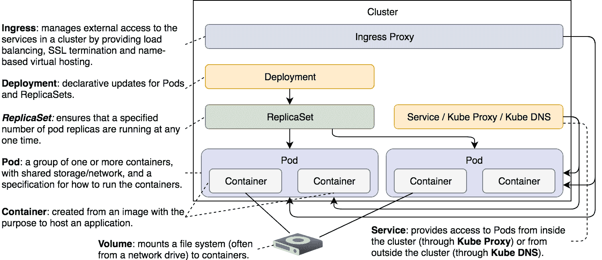

# 第八章：使用卷访问主机的文件系统

没有状态的系统是无法存在的。尽管目前有将应用程序开发为无状态的趋势，但我们仍然需要处理状态问题。有数据库和其他有状态的第三方应用程序。无论我们做什么，都需要确保无论容器、Pod，甚至整个节点发生什么情况，状态都能够保持。

大多数时候，有状态的应用程序会将其状态存储在磁盘上。这给我们带来了一个问题。如果容器崩溃，`kubelet` 会重启它。问题在于，它会基于相同的镜像创建一个新的容器。崩溃容器内积累的所有数据将会丢失。

Kubernetes 卷解决了容器崩溃时保持状态的需求。从本质上讲，卷是指向文件和目录的引用，这些文件和目录对构成 Pod 的容器可访问。不同类型的 Kubernetes 卷之间的主要区别在于这些文件和目录是如何创建的。

虽然卷的主要用途是保持状态，但其实还有很多其他用途。例如，我们可以使用卷来访问主机上运行的 Docker 套接字，或者我们可以使用它们来访问存储在主机文件系统中的配置文件。

我们可以将卷描述为一种访问文件系统的方式，该文件系统可能运行在同一主机或其他地方。无论该文件系统在哪里，它都是容器挂载卷时外部的。有人挂载卷的原因有很多，其中状态保持只是其中之一。

Kubernetes 支持超过二十五种卷类型。要逐一讲解它们需要花费大量时间。此外，即使我们愿意这么做，很多卷类型都是特定于某个托管商的。例如，`awsElasticBlockStore` 仅与 AWS 配合使用，`azureDisk` 和 `azureFile` 仅与 Azure 配合使用，依此类推。我们将把探索范围限制在 Minikube 中可以使用的卷类型。你应该能够将这些知识推断到适用于你所选择的托管商的卷类型。

让我们开始吧。

# 创建集群

这次，在准备创建 Minikube 集群时，我们将执行一个额外的操作。

本章中的所有命令都可以在 [`08-volume.sh`](https://gist.github.com/5acafb64c0124a1965f6d371dd0dedd1) ([`gist.github.com/vfarcic/5acafb64c0124a1965f6d371dd0dedd1`](https://gist.github.com/vfarcic/5acafb64c0124a1965f6d371dd0dedd1)) Gist 中找到。

```
cd k8s-specs 

git pull 

cp volume/prometheus-conf.yml \  
    ~/.minikube/files 
```

我们需要 Minikube 虚拟机内的文件。它启动时，会将主机上 `~/.minikube/files` 目录中的所有文件复制到虚拟机中的 `/files` 目录。

根据你的操作系统，`~/.minikube/files` 目录可能在其他地方。如果是这种情况，请调整前面的命令。

现在文件已复制到共享目录，我们可以重复之前做过的相同过程。请注意，我们已经添加了上一章节的步骤，以启用 ingress 插件。

```
minikube start --vm-driver=virtualbox

minikube addons enable ingress

kubectl config current-context
```

现在 Minikube 集群已启动，我们可以探索第一种卷类型。

# 通过 hostPath 卷访问主机的资源

无论如何，最终我们都需要构建镜像。一种简单的解决方案是直接在服务器上执行`docker image build`命令。然而，这可能会导致问题。在单个主机上构建镜像意味着资源利用不均衡，并且存在单点故障。如果我们能够在 Kubernetes 集群内的任何地方构建镜像，岂不是更好吗？

我们可以基于`docker`镜像创建一个 Pod，而不是执行`docker image build`命令。Kubernetes 会确保 Pod 被调度到集群中的某个位置，从而更好地分配资源使用。

让我们从一个基础的例子开始。如果我们能够列出镜像，我们就能证明在容器内运行 docker 命令是可行的。因为从 Kubernetes 的角度来看，Pod 是最小的实体，所以我们将运行 Pod。

```
kubectl run docker \
 --image=docker:17.11 \
    --restart=Never \
    docker image ls

kubectl get pods --show-all  
```

我们创建了一个名为`docker`的 Pod，并基于官方的`docker`镜像。由于我们想执行一个一次性的命令，因此指定它应该`Never`重启。最后，容器命令是`docker image ls`。第二个命令列出了集群中所有的 Pod（包括失败的 Pod）。

后者命令的输出如下：

```
NAME   READY STATUS RESTARTS AGE
docker 0/1   Error  0        1m  
```

输出应该显示状态为`Error`，这表示我们运行的容器存在问题。如果你的状态还不是`Error`，可能是 Kubernetes 仍在拉取镜像。在这种情况下，请稍等片刻，然后重新执行`kubectl get pods`命令。

让我们看一下容器的日志：

```
kubectl logs docker  
```

输出如下：

```
Cannot connect to the Docker daemon at unix:///var/run/docker.sock. Is the docker daemon running?  
```

Docker 由两个主要部分组成。一个是客户端，一个是服务器。当我们执行`docker image ls`时，我们调用了客户端，它通过 API 与服务器进行通信。问题在于，Docker 服务器并没有在容器中运行。我们应该做的是告诉客户端（在容器内）使用已经在主机（Minikube VM）上运行的 Docker 服务器。

默认情况下，客户端通过位于`/var/run/docker.sock`的套接字向服务器发送指令。如果我们将该文件从主机挂载到容器内，就可以实现我们的目标。

在尝试启用容器内的 Docker 客户端与主机上的 Docker 服务器之间的通信之前，我们将删除几分钟前创建的 Pod：

```
kubectl delete pod docker  
```

让我们看一下存储在`volume/docker.yml`中的 Pod 定义：

```
cat volume/docker.yml
```

输出如下：

```
apiVersion: v1 
kind: Pod 
metadata: 
  name: docker 
spec: 
  containers: 
  - name: docker 
    image: docker:17.11 
    command: ["sleep"] 
    args: ["100000"] 
    volumeMounts: 
    - mountPath: /var/run/docker.sock 
      name: docker-socket
  volumes: 
  - name: docker-socket 
    hostPath: 
      path: /var/run/docker.sock 
      type: Socket 
```

部分定义与我们之前执行的`kubectl run`命令非常相似。唯一显著的区别是在`volumeMounts`和`volumes`部分。

`volumeMounts` 字段相对简单，不论我们使用哪种类型的卷，都是相同的。在这一部分，我们指定了 `mountPath` 和卷的名称。前者是我们期望在容器内挂载的路径。你会注意到，我们并没有在 `VolumeMounts` 部分指定卷的类型或其他任何细节。相反，我们仅仅引用了一个名为 `docker-socket` 的卷。

每种类型的卷配置在 `volumes` 部分中定义。在本例中，我们使用的是 `hostPath` 卷类型。

`hostPath` 允许我们将主机上的文件或目录挂载到 Pod，并通过这些 Pod 挂载到容器。在讨论此类型的实用性之前，我们先简单讨论一下在什么情况下它并不是一个好的选择。

不要使用 `hostPath` 来存储应用的状态。由于它将文件或目录从主机挂载到 Pod，因此它不是容错的。如果服务器失败，Kubernetes 会将 Pod 调度到健康的节点，而状态将会丢失。

对于我们的使用场景，`hostPath` 非常合适。我们不是用它来保存应用的状态，而是为了访问与 Pod 运行在同一主机上的 Docker 服务。

`hostPath` 类型只有两个字段。`path` 表示我们希望从主机挂载的文件或目录。由于我们想挂载一个套接字，因此相应地设置了 `type`。当然，也可以使用其他类型。

`Directory` 类型将挂载主机上的目录。该目录必须存在于给定的路径上。如果不存在，我们可以改用 `DirectoryOrCreate` 类型，后者具有相同的目的。区别在于，`DirectoryOrCreate` 会在主机上不存在目录时自动创建该目录。

`File` 和 `FileOrCreate` 与其 `Directory` 对应类型类似。唯一的区别是这次我们会挂载文件，而不是目录。

其他支持的类型包括 `Socket`、`CharDevice` 和 `BlockDevice`。它们应该是自解释的。如果你不知道字符设备或块设备是什么，那么你可能不需要这些类型。

最后但同样重要的是，我们修改了命令和参数为 `sleep 100000`。这将给我们更多自由，因为我们可以创建 Pod，进入它唯一的容器，并尝试不同的命令。

让我们创建 Pod，并检查这次是否可以从容器内部执行 Docker 命令：

```
kubectl create \
 -f volume/docker.yml
```

由于镜像已经拉取，启动 Pod 应该几乎是瞬时的。

让我们看看是否能检索到 Docker 镜像列表：

```
kubectl exec -it docker \
 -- docker image ls \
 --format "{{.Repository}}" 
```

我们执行了 `docker image ls` 命令，并通过将输出格式限制为 `Repository` 来缩短结果。输出如下：

```
Docker
gcr.io/google_containers/nginx-ingress-controller
gcr.io/google_containers/k8s-dns-sidecar-amd64
gcr.io/google_containers/k8s-dns-kube-dns-amd64
gcr.io/google_containers/k8s-dns-dnsmasq-nanny-amd64
gcr.io/google_containers/kubernetes-dashboard-amd64
gcr.io/google_containers/kubernetes-dashboard-amd64
gcr.io/google-containers/kube-addon-manager
gcr.io/google_containers/defaultbackend   
gcr.io/google_containers/pause-amd64
```

即使我们在容器内执行了 `docker` 命令，输出仍清楚地显示了来自主机的镜像。我们证明了将 Docker 套接字（`/var/run/docker.sock`）作为卷挂载可以实现容器内的 Docker 客户端与主机上运行的 Docker 服务器之间的通信。


图 8-1：HostPath 挂载在容器内

让我们进入容器，看看能否构建 Docker 镜像。

```
kubectl exec -it docker sh
```

要构建镜像，我们需要一个 `Dockerfile` 和应用程序的源代码。我们将继续使用 `go-demo-2` 作为示例，因此我们的第一步是克隆仓库：

```
apk add -U git

git clone \ 
    https://github.com/vfarcic/go-demo-2.git 
cd go-demo-2  
```

我们使用 `apk add` 安装了 `git`。`docker` 和许多其他镜像使用 `alpine` 作为基础镜像。如果你不熟悉 `alpine`，它是一个非常精简且高效的基础镜像，我强烈建议在构建自己的镜像时使用它。像 `debian`、`centos`、`ubuntu`、`redhat` 和类似的基础镜像，常常因为误解容器工作原理而成为糟糕的选择。

`alpine` 使用 `apk` 包管理器，因此我们调用它安装了 `git`。接下来，我们克隆了 `vfarcic/go-demo-2` 仓库，最后进入了 `go-demo-2` 目录：

让我们快速看一下 `Dockerfile`：

```
cat Dockerfile  
```

输出结果如下：

```
FROM golang:1.9 AS build 
ADD . /src 
WORKDIR /src 
RUN go get -d -v -t 
RUN go test --cover -v ./... --run UnitTest 
RUN go build -v -o go-demo 

FROM alpine:3.4 
MAINTAINER      Viktor Farcic viktor@farcic.com 

RUN mkdir /lib64 &amp;&amp; ln -s /lib/libc.musl-x86_64.so.1 /lib64/ld-linux-x86-64.so.2 

EXPOSE 8080 
ENV DB db 
CMD ["go-demo"] 
HEALTHCHECK --interval=10s CMD wget -qO- localhost:8080/demo/hello 

COPY --from=build /src/go-demo /usr/local/bin/go-demo 
RUN chmod +x /usr/local/bin/go-demo 
```

由于本书专注于 Kubernetes，我们不会详细探讨这个 Dockerfile 的内容，只评论它使用了 Docker 的多阶段构建。第一阶段下载依赖，运行单元测试，并构建二进制文件。第二阶段重新开始，构建一个新镜像，并将之前阶段构建的 `go-demo` 二进制文件复制过来。

我真心希望你对 Docker 已经非常熟练，因此无需进一步解释镜像构建。如果情况并非如此，你可能需要查阅官方文档或我之前的书籍之一。本书专注于 Kubernetes。

让我们测试构建镜像是否确实可行。

```
docker image build \ 
    -t vfarcic/go-demo-2:beta . 

docker image ls \ 
    --format "{{.Repository}}" 
```

我们执行了 `docker image build` 命令，然后运行了 `docker image ls`。后者的输出如下：

```
vfarcic/go-demo-2
<none>
golang
docker
alpine
gcr.io/google_containers/nginx-ingress-controller
gcr.io/google_containers/k8s-dns-sidecar-amd64
gcr.io/google_containers/k8s-dns-kube-dns-amd64
gcr.io/google_containers/k8s-dns-dnsmasq-nanny-amd64
gcr.io/google_containers/kubernetes-dashboard-amd64
gcr.io/google_containers/kubernetes-dashboard-amd64
gcr.io/google-containers/kube-addon-manager
gcr.io/google_containers/defaultbackend
gcr.io/google_containers/pause-amd64  
```

如果我们与之前的 `docker image ls` 输出进行对比，会发现这一次列出了几个新镜像。`golang` 和 `alpine` 镜像作为每个构建阶段的基础。而 `vfarcic/go-demo-2` 则是我们构建的结果。最后，`<none>` 只是构建过程中的残余，可以安全移除。

```
docker system prune -f 

docker image ls \  
    --format "{{.Repository}}" 
```

`docker system prune` 命令会移除所有未使用的资源。至少是那些由 Docker 创建但未使用的资源。我们通过再次执行 `docker image ls` 来验证这一点。这一次，我们可以看到 `<none>` 镜像已经消失。

我们将销毁 `docker` Pod，并探索 `hostPath` 卷类型的其他用法：

```
Exit

kubectl delete \
    -f volume/docker.yml

```

`hostPath` 是访问主机资源（如 `/var/run/docker.sock`、`/dev/cgroups` 等）的好方法。前提是我们要访问的资源和 Pod 在同一节点上。

让我们看看是否能找到 `hostPath` 的其他用例。

# 使用 hostPath 卷类型注入配置文件

我们即将首次部署 Prometheus（[`prometheus.io/`](https://prometheus.io/)）(在本书中)。我们不会深入讨论该应用，除了说它非常棒，并且你应该考虑将其用于监控和告警需求。为了避免让你失望，我必须告诉你，Prometheus 并不在本章的范围内，可能也不在本书的范围内。我们仅仅是用它来演示一些 Kubernetes 概念。我们并不打算学习如何操作它。

让我们看看应用的定义：

```
cat volume/prometheus.yml  
```

输出如下：

```
apiVersion: extensions/v1beta1 
kind: Ingress 
metadata: 
  name: Prometheus 
  annotations: 
    ingress.kubernetes.io/ssl-redirect: "false"
    nginx.ingress.kubernetes.io/ssl-redirect: "false" 
spec: 
  rules: 
  - http: 
      paths: 
      - path: /Prometheus 
        backend: 
          serviceName: Prometheus 
          servicePort: 9090 

--- 

apiVersion: apps/v1beta2 
kind: Deployment 
metadata: 
  name: Prometheus 
spec: 
  selector: 
    matchLabels: 
      type: monitor 
      service: Prometheus 
  strategy: 
    type: Recreate 
  template: 
    metadata: 
      labels: 
        type: monitor 
        service: Prometheus 
    spec: 
      containers: 
      - name: Prometheus 
        image: prom/prometheus:v2.0.0 
        command: 
        - /bin/Prometheus 
        args: 
        - "--config.file=/etc/prometheus/prometheus.yml" 
        - "--storage.tsdb.path=/prometheus" 
        - "--web.console.libraries=/usr/share" 
        - "--web.external-url=http://192.168.99.100/prometheus" 

--- 

apiVersion: v1 
kind: Service 
metadata: 
  name: Prometheus 
spec: 
  ports: 
  - port: 9090 
  selector: 
    type: monitor 
    service: Prometheus 
```

那个 YAML 文件并没有什么真正的新内容。它定义了一个 Ingress、一个部署和一个服务。不过，我们可能需要修改一件事。如果我们想更改基础路径，Prometheus 需要一个完整的`external-url`。目前，它被设置为我 Minikube 虚拟机的 IP。在你的情况下，那个 IP 可能不同。我们将通过添加一些`sed`“魔法”来修复它，确保 IP 与您的 Minikube 虚拟机的 IP 匹配。

```
cat volume/prometheus.yml | sed -e \  
    "s/192.168.99.100/$(minikube ip)/g" \  
    | kubectl create -f - \ 
    --record --save-config 

kubectl rollout status deploy prometheus 
```

我们输出了`volume/prometheus.yml`文件的内容，使用`sed`命令将硬编码的 IP 替换为实际的 Minikube 实例的值，然后将结果传递给`kubectl create`。请注意，这次的`create`命令使用了破折号（`-`）而不是文件路径。这表明应该使用`stdin`。

在创建应用后，我们使用`kubectl rollout status`命令确认部署已完成。

现在我们可以在浏览器中打开 Prometheus 了。

```
open "http://$(minikube ip)/prometheus"  
```

一开始，应用似乎运行正常。然而，由于目标是应用的关键部分，我们应该检查它们。对于不熟悉 Prometheus 的人来说，它从目标（外部数据源）拉取数据，默认情况下，只配置了一个目标：Prometheus 本身。Prometheus 会始终从这个目标拉取数据，除非我们另行配置。

让我们看看它的目标。

```
open "http://$(minikube ip)/prometheus/targets"  
```

出现了一些问题。默认的目标无法访问。在我们开始惊慌之前，我们应该仔细查看其配置。

```
open "http://$(minikube ip)/prometheus/config"  
```

问题出在`metrics_path`字段上。默认情况下，它被设置为`/metrics`。然而，由于我们已经将基础路径更改为`/prometheus`，该字段的值应该为`/prometheus/metrics`。

长话短说，我们必须更改 Prometheus 的配置。

例如，我们可以进入容器，更新配置文件，并发送重新加载请求给 Prometheus。这个解决方案非常糟糕，因为它只会持续到下次更新应用，或者直到容器崩溃，Kubernetes 决定重新调度它为止。

让我们探索一下替代方案。例如，我们也可以使用`hostPath`卷来实现这一点。如果我们能确保正确的配置文件在虚拟机中，Pod 就可以将其挂载到`prometheus`容器。让我们试试看。

```
cat volume/prometheus-host-path.yml
```

输出（仅显示相关部分）如下：

```
apiVersion: apps/v1beta2 
kind: Deployment 
metadata: 
  name: Prometheus 
spec: 
  selector: 
    ... 
    spec: 
      containers: 
        ... 
        volumeMounts: 
        - mountPath: /etc/prometheus/prometheus.yml 
          name: prom-conf 
      volumes: 
      - name: prom-conf 
        hostPath: 
          path: /files/prometheus-conf.yml 
          type: File 
... 
```

与之前的定义相比，唯一显著的区别在于增加了 `volumeMounts` 和 `volumes` 字段。我们使用的是与之前相同的模式，只不过这次 `type` 设置为 `File`。一旦我们应用了这个 Deployment，主机上的 `/files/prometheus-conf.yml` 文件将在容器内作为 `/etc/prometheus/prometheus.yml` 可用。

如果你还记得，我们将一个文件复制到 `~/.minikube/files` 目录，并且 Minikube 将其复制到虚拟机中的 `/files` 目录。

在某些情况下，文件可能最终被复制到虚拟机的根目录（`/`），而不是 `/files`。如果发生了这种情况，请进入虚拟机（`minikube ssh`），并通过执行以下命令将文件移到 `/files`（前提是 `/files` 目录不存在或为空）。

```
minikube ssh

sudo mkdir /files

sudo mv /prometheus-conf.yml  /files/

exit  
```

现在是时候查看文件的内容了。

```
minikube ssh sudo chmod +rw \ 
    /files/prometheus-conf.yml 

minikube ssh cat \  
    /files/prometheus-conf.yml 
```

我们更改了文件的权限并显示了其内容。

输出如下：

```
global: 
  scrape_interval:     15s 

scrape_configs: 
  - job_name: Prometheus 
    metrics_path: /prometheus/metrics 
    static_configs: 
      - targets: 
        - localhost:9090 
```

这个配置几乎与 Prometheus 默认使用的配置相同。唯一的区别是在 `metrics_path`，它现在指向 `/prometheus/metrics`。

让我们看看使用新配置的 Prometheus 是否按预期工作：

```
cat volume/prometheus-host-path.yml \ 
 | sed -e \
 "s/192.168.99.100/$(minikube ip)/g" \
 | kubectl apply -f -

kubectl rollout status deploy Prometheus

open http://$(minikube ip)/prometheus/targets  
```

我们应用了新的定义（在执行了 `sed` 的“魔法”之后），等待 `rollout` 完成，然后在浏览器中打开 Prometheus 目标。这次，使用更新的配置，Prometheus 成功地从当前配置的唯一目标拉取数据：


图 8-2：Prometheus 目标界面

接下来的逻辑步骤是为 Prometheus 配置额外的目标。具体来说，你可能想配置它以获取已经通过 Kubernetes API 提供的指标。不过，我们*不会*这么做。首先，本章并不是关于监控和告警的。第二，也是更重要的原因是，使用 `hostPath` 卷类型来提供配置*不是*一个好主意。

`hostPath` 卷将主机上的一个目录映射到 Pod 运行的地方。使用它来“注入”配置文件到容器中，意味着我们必须确保该文件在集群的每个节点上都存在。

使用 Minikube 可能会产生误导。由于我们运行的是单节点集群，意味着我们运行的每个 Pod 都会调度到一个节点上。将配置文件复制到这个单节点，如我们在示例中所做的，确保它可以在任何 Pod 中挂载。然而，一旦我们向集群中添加更多节点，就会出现副作用。我们需要确保集群中的每个节点都有我们想要挂载的相同文件，因为我们无法预测单个 Pod 会被调度到哪里。这会带来过多不必要的工作和额外的复杂性。

另一种解决方案是将 NFS 驱动器挂载到所有节点，并在那里存储文件。这可以确保文件在所有节点上可用，只要我们*不*忘记在每个节点上挂载 NFS。

另一种解决方案可能是创建一个自定义的 Prometheus 镜像。它可以基于官方镜像，并且只需一个`COPY`指令来添加配置。这个解决方案的优势在于镜像将是完全不可变的。它的状态不会被不必要的卷挂载污染。任何人都可以运行该镜像并期待相同的结果。这是我更倾向的解决方案。然而，在某些情况下，你可能希望使用稍微不同的配置部署相同的应用程序。在这些情况下，我们是否应该回退到在每个节点上挂载一个 NFS 驱动器并继续使用`hostPath`？

即使挂载 NFS 驱动器可以解决一些问题，它仍然不是一个很好的解决方案。为了从 NFS 挂载文件，我们需要使用[`nfs`](https://kubernetes.io/docs/concepts/storage/volumes/#nfs)（[`kubernetes.io/docs/concepts/storage/volumes/#nfs`](https://kubernetes.io/docs/concepts/storage/volumes/#nfs)）卷类型，而不是`hostPath`。即使如此，它仍然是一个次优解决方案。一个更好的方法是使用`configMap`。我们将在下一章中探讨这个问题。

确实要使用`hostPath`来挂载主机资源，如`/var/run/docker.sock`和`/dev/cgroups`。不要使用它来注入配置文件或存储应用程序的状态。

我们将继续讨论一种更为特殊的卷类型。但在此之前，我们将删除当前运行的 Pod：

```
kubectl delete \  
    -f volume/prometheus-host-path.yml 
```

# 使用 gitRepo 挂载 Git 仓库

`gitRepo`卷类型可能不会出现在你列出的前三大卷类型中。或者，也可能会。它完全取决于你的使用场景。我喜欢它，因为它展示了如何将卷的概念扩展到新的创新解决方案。

让我们通过`volume/github.yml`定义来查看其实际效果：

```
cat volume/github.yml
```

输出如下：

```
apiVersion: v1 
kind: Pod 
metadata: 
  name: github 
spec: 
  containers: 
  - name: github 
    image: docker:17.11 
    command: ["sleep"] 
    args: ["100000"] 
    volumeMounts: 
    - mountPath: /var/run/docker.sock 
      name: docker-socket 
    - mountPath: /src 
      name: github 
  volumes: 
  - name: docker-socket 
    hostPath: 
      path: /var/run/docker.sock 
      type: Socket 
  - name: github 
    gitRepo: 
      repository: https://github.com/vfarcic/go-demo-2.git 
      directory: . 
```

这个 Pod 定义与`volume/docker.yml`非常相似。唯一显著的区别是我们添加了第二个`volumeMount`。它将在容器内部挂载`/src`目录，并使用名为`github`的卷。卷的定义非常简单。`gitRepo`类型定义了 Git`repository`和`directory`。如果我们省略后者，仓库将作为`/src/go-demo-2`挂载。

`gitRepo`卷类型允许使用第三个字段，但我们没有使用它。我们本可以设置仓库的特定`revision`。不过，出于演示目的，`HEAD`应该足够了。

让我们创建 Pod。

```
kubectl create \  
    -f volume/github.yml 
```

现在我们已经创建了 Pod，我们将进入其唯一的容器，并检查`gitRepo`是否如预期工作：

```
kubectl exec -it github sh 

cd /src 

ls -l 
```

我们进入 Pod 的容器，切换到`/src`目录，并列出了其中的所有文件和目录。这证明了`gitRepo`将`vfarcic/go-demo-2`GitHub 仓库的内容挂载为一个卷。


图 8-3：GitHub 仓库挂载在容器内

由于 Pod 容器基于`docker`镜像，并且插座也已挂载，我们应该能够使用由`gitRepo`卷提供的源代码来构建镜像：

```
docker image build \  
    -t vfarcic/go-demo-2:beta . 
```

这一次，构建应该非常快速，因为我们已经在主机上有了相同的镜像，而且在此期间源代码没有发生变化。你应该能看到每个构建层都有一个`Using cache`的通知。

既然我们已经证明了这一点，接下来让我们退出容器并移除 Pod：

```
Exit 

kubectl delete \  
    -f volume/github.yml 
```

`gitRepo`是一个小巧的新增功能，它并没有为我们节省大量工作，也没有提供什么真正特别的功能。我们可以通过使用带有`git`的镜像并执行简单的`git clone`命令来达到相同的效果。不过，这种卷类型在某些情况下可能会派上用场。我们在 YAML 文件中定义的内容越多，就越不依赖临时命令。这样，我们就能朝着完全文档化的流程迈进。

`gitRepo`卷类型帮助我们将`git`命令（例如`git clone`）移到 YAML 定义中。它还消除了容器中需要`git`二进制文件的需求。虽然`gitRepo`可能并不总是最佳选择，但它确实是值得考虑的一个选项。

# 通过 emptyDir 卷类型持久化状态

这一次，我们将部署 Jenkins，看看会遇到什么挑战。

我们来看看`volume/jenkins.yml`的定义：

```
cat volume/jenkins.yml  
```

输出结果如下：

```
apiVersion: extensions/v1beta1 
kind: Ingress 
metadata: 
  name: Jenkins 
  annotations: 
    ingress.kubernetes.io/ssl-redirect: "false"
    nginx.ingress.kubernetes.io/ssl-redirect: "false" 
spec: 
  rules: 
  - http: 
      paths: 
      - path: /Jenkins 
        backend: 
          serviceName: Jenkins 
          servicePort: 8080 

--- 

apiVersion: apps/v1beta2 
kind: Deployment 
metadata: 
  name: Jenkins 
spec: 
  selector: 
    matchLabels: 
      type: master 
      service: Jenkins 
  strategy: 
    type: Recreate 
  template: 
    metadata: 
      labels: 
        type: master 
        service: Jenkins 
    spec: 
      containers: 
      - name: Jenkins 
        image: vfarcic/Jenkins 
        env: 
        - name: JENKINS_OPTS 
          value: --prefix=/jenkins 

--- 

apiVersion: v1 
kind: Service 
metadata: 
  name: Jenkins 
spec: 
  ports: 
  - port: 8080 
  selector: 
    type: master 
    service: jenkins 
```

这个 YAML 文件没有什么特别的。它定义了一个路径为`/jenkins`的 Ingress，一个 Deployment 和一个 Service。我们不会浪费时间在这些上，而是继续前进并创建这些对象。

```
kubectl create \  
    -f volume/jenkins.yml \  
    --record --save-config 

kubectl rollout status deploy jenkins 
```

我们创建了对象并等待进程完成。现在，我们可以在我们选择的浏览器中打开 Jenkins：

```
open "http://$(minikube ip)/jenkins" 
```

Jenkins UI 已经打开，确认应用程序已正确部署。Jenkins 的主要功能是执行作业，因此理应创建一个作业：

```
open "http://$(minikube ip)/jenkins/newJob" 
```

请在项目名称字段中输入`test`，选择`Pipeline`作为类型，然后点击“OK”按钮。

不需要让 Pipeline 执行任何特定的任务。现在，只要你保存作业，就应该没有问题。

让我们探索一下如果 Jenkins 容器中的主进程终止会发生什么：

```
POD_NAME=$(kubectl get pods \  
    -l service=jenkins,type=master \  
    -o jsonpath="{.items[*].metadata.name}") 

kubectl exec -it $POD_NAME kill 1 
```

我们检索到了 Pod 的名称，并使用它在唯一的容器中执行了`kill 1`命令。结果是模拟了一个失败。很快，Kubernetes 检测到这个失败并重新创建了容器。让我们再检查一遍。

```
kubectl get pods 
```

输出结果如下：

```
NAME                     READY STATUS  RESTARTS AGE
jenkins-76d59945d8-zcz8m 1/1   Running 1        12m
```

我们看到有一个容器正在运行。由于我们杀掉了主进程，并且因此杀死了第一个容器，重启次数增加到了 1。

让我们回到 Jenkins UI，检查一下作业发生了什么。我相信你已经知道答案了，但我们还是再确认一遍。

```
open "http://$(minikube ip)/jenkins" 
```

正如预期的那样，我们创建的任务消失了。当 Kubernetes 重新创建失败的容器时，它是从相同的镜像创建了一个新的容器。在运行中的容器内生成的所有内容都不复存在。我们恢复到了初始状态：

让我们看看稍作更新的 YAML 定义：

```
cat volume/jenkins-empty-dir.yml  
```

输出内容（只包括相关部分）如下：

```
... 
kind: Deployment 
... 
spec: 
  ... 
  template: 
    ... 
    spec: 
      containers: 
        ... 
        volumeMounts: 
        - mountPath: /var/jenkins_home 
          name: jenkins-home 
      volumes: 
      - emptyDir: {} 
        name: jenkins-home 
... 
```

我们添加了一个引用 `jenkins-home` 卷的挂载。此时，卷类型是 `emptyDir`。我们很快会讨论这种新的卷类型。但是，在我们深入解释之前，我们先体验一下它的效果：

```
kubectl apply \  
    -f volume/jenkins-empty-dir.yml 

kubectl rollout status deploy jenkins 
```

我们应用了新的定义，并等待部署完成。

现在我们可以打开新的 Jenkins 任务屏幕，重复之前的操作：

```
open "http://$(minikube ip)/jenkins/newJob" 
```

请在项目名称字段中输入 `test`，选择 `Pipeline` 作为类型，点击确定按钮，然后点击保存按钮完成操作。

现在我们将停止容器并观察会发生什么：

```
POD_NAME=$(kubectl get pods \  
    -l service=jenkins,type=master \  
    -o jsonpath="{.items[*].metadata.name}") 

kubectl exec -it $POD_NAME kill 1 

kubectl get pods 
```

输出应该显示有一个正在运行的容器，换句话说，Kubernetes 已检测到故障并创建了一个新的容器。

最后，让我们再一次打开 Jenkins 的主页：

```
open "http://$(minikube ip)/jenkins" 
```

这次，`test` 任务仍然存在。即使容器失败，应用程序的状态也得以保留，并且 Kubernetes 创建了一个新的容器：


图 8-4：带有持久化状态的 Jenkins

现在我们来讨论一下 `emptyDir` 卷。它与我们到目前为止探索的那些卷有显著不同。

当 Pod 被分配到一个节点时，会创建一个 `emptyDir` 卷。只要 Pod 继续在该服务器上运行，该卷就会一直存在。

这意味着 `emptyDir` 可以在容器失败时继续存活。当容器崩溃时，Pod 不会从节点中移除。相反，Kubernetes 会在同一个 Pod 内重新创建失败的容器，从而保留 `emptyDir` 卷。总的来说，这种卷类型只具有部分容错能力。

如果 `emptyDir` 并不完全具有容错性，你可能会想知道为什么我们一开始要讨论它。

`emptyDir` 卷类型是我们在不使用网络驱动器的情况下能接近容错卷的最接近类型。由于我们没有网络驱动器，所以我们不得不使用 `emptyDir` 作为最接近容错持久化的卷类型。

当你开始部署第三方应用程序时，你会发现许多应用程序都附带了推荐的 YAML 定义。如果你仔细观察，会注意到很多使用了 `emptyDir` 卷类型。并不是说 `emptyDir` 是最好的选择，而是它完全取决于你的需求、托管服务商、基础设施以及其他许多因素。没有一种“通用适用”的持久性和容错性卷类型。另一方面，`emptyDir` 总是能工作。由于它没有外部依赖，因此可以将其作为示例，假设人们会根据需要更改为更适合自己的卷类型。

有一个不成文的假设，即`emptyDir`是用于测试目的的，并将在正式进入生产环境之前更换为其他方案。

只要我们使用 Minikube 来创建 Kubernetes 集群，就会使用`emptyDir`作为持久卷的解决方案。不要灰心。稍后，一旦我们转向更“正式”的集群配置，我们将探索更好的持久化状态的方案。目前，你已经初步体验过。真正的（且持久的）内容将在之后呈现。

# 现在怎么办？

除了`emptyDir`，我们在本章中展示的卷类型选择并不仅仅是基于它们在 Minikube 集群中使用的能力。这三种卷类型中的每一种都将在接下来的章节中成为关键部分。我们将使用`hostPath`从容器内部访问 Docker 服务器。`gitRepo`卷类型在我们开始设计持续部署管道时将变得非常重要。只要我们使用 Minikube，`emptyDir`类型就会是必需的。在我们找到更好的 Kubernetes 集群创建方案之前，`emptyDir`将继续在我们的 Minikube 示例中使用。

我们才刚刚触及卷的表面。至少还有两种卷类型我们应该在 Minikube 中进一步探索，另外一种（或更多）则是当我们转向其他集群创建方案时需要探索的内容。整个书籍中将要探索的卷是一个足够庞大的主题，值得单独成章，或者，正如我们已经提到的，需要我们摆脱 Minikube。现在，我们将销毁集群并休息一下。

```
minikube delete  
```

如果你想了解更多关于卷的信息，请参考卷 v1 核心的 API 文档（[`v1-9.docs.kubernetes.io/docs/reference/generated/kubernetes-api/v1.9/#volume-v1-core`](https://v1-9.docs.kubernetes.io/docs/reference/generated/kubernetes-api/v1.9/#volume-v1-core)）。

下一章将专注于`configMap`卷类型。希望它能够解决一些问题，并提供比本章中使用的方案更好的解决方案。ConfigMap 值得单独成章，所以它将有一章内容。



图 8-5：迄今为止探索的组件
