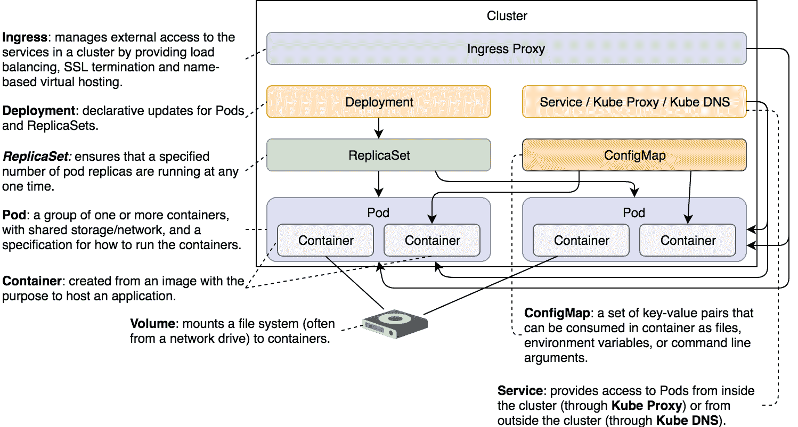

# 使用 ConfigMap 注入配置文件

ConfigMap 允许我们将配置与应用镜像分开存储。这种分离在其他替代方案不适合时非常有用。

几乎每个应用程序都可以通过配置进行微调。传统的软件部署方法促进了配置文件的使用。然而，我们现在讨论的不是传统的部署，而是通过 Kubernetes 调度器进行的先进、分布式和不可变部署。使用根本性的新技术通常需要新的流程和不同的架构，才能最大化其潜力。另一方面，我们不能仅仅抛弃所有现有的东西，从头开始。

我们必须尝试平衡新原则和遗留需求。

如果我们今天开始开发一个新的应用，它将是分布式的、可扩展的、无状态的，并且具有容错能力。这些是当今的需求。尽管我们可能会质疑是否有足够的人知道如何设计一个具有这些质量属性的应用，但几乎没有人会反对拥有这些属性。经常被忽视的是配置。你的新应用应该使用什么机制来配置自己？环境变量怎么样？

环境变量非常适合分布式系统。它们易于定义，并且是可移植的。它们是新应用配置机制的理想选择。

然而，在某些情况下，配置可能对环境变量来说过于复杂。在这种情况下，我们可能需要退回到文件（希望是 YAML）。当这些情况与几乎完全使用基于文件配置的遗留应用结合时，很明显我们不能仅仅依赖环境变量。

当配置基于文件时，我们可以采取的最佳方法是将配置嵌入到 Docker 镜像中。这样，我们就走上了完全不可变的道路。然而，当我们的应用需要为不同集群（例如，测试和生产）提供不同的配置选项时，这可能不可行。我将忽略我内心想要将其转化为“你不需要为不同环境使用不同配置”这一讨论的需求。只是暂时假设你有非常充分的理由来使用这样的配置。在这种情况下，将配置文件嵌入到镜像中是行不通的。这就是 ConfigMap 发挥作用的地方。

ConfigMap 允许我们将配置“注入”到容器中。配置的来源可以是文件、目录或字面值。目标可以是文件或环境变量。

ConfigMap 从一个源获取配置，并将其挂载到正在运行的容器中，作为一个卷。

这就是你将获得的全部理论内容。我们不会进行冗长的解释，而是通过一些示例进行实践，并评论我们所体验到的特性。我们将通过实践学习，而不是通过记忆理论来学习。

让我们准备集群并查看 ConfigMap 的实际应用。

# 创建集群

这与之前的过程相同，所以让我们默默地完成它。

本章中的所有命令都可以在`09-config-map.sh` ([`gist.github.com/vfarcic/717f8418982cc5ec1c755fcf7d4255dd`](https://gist.github.com/vfarcic/717f8418982cc5ec1c755fcf7d4255dd)) Gist 中找到。

```
cd k8s-specs

git pull

minikube start --vm-driver=virtualbox

minikube addons enable ingress

kubectl config current-context  
```

现在我们可以尝试 ConfigMap 的第一个变体。

# 从文件注入配置

在其最纯粹、也可能是最常见的形式下，ConfigMap 包含一个文件。例如，我们可以从`cm/prometheus-conf.yml`文件创建一个 ConfigMap：

```
kubectl create cm my-config \
 --from-file=cm/prometheus-conf.yml
```

我们创建了一个名为**ConfigMap**（`cm`）的`my-config`。该映射的数据来自`cm/prometheus-conf.yml`文件的内容。

让我们描述它，看看会得到什么。

```
kubectl describe cm my-config  
```

输出结果如下：

```
Name:         my-config 
Namespace:    default 
Labels:       <none> 
Annotations:  <none> 

Data 
==== 
prometheus-conf.yml: 
---- 
global: 
  scrape_interval:     15s 

scrape_configs: 
  - job_name: Prometheus 
    metrics_path: /prometheus/metrics 
    static_configs: 
      - targets: 
        - localhost:9090 

Events:  <none> 
```

重要的部分位于`Data`下方。我们可以看到键，这里是文件的名称（`prometheus-conf.yml`）。再往下，你可以看到文件的内容。如果你执行`cat cm/prometheus-conf.yml`，你会看到它与我们从 ConfigMap 描述中看到的内容相同。

ConfigMap 本身是没有用的。它只是另一个卷，就像所有其他卷一样，需要挂载。

让我们看看在`cm/alpine.yml`中定义的 Pod 规格。

```
cat cm/alpine.yml  
```

输出结果如下：

```
apiVersion: v1 
kind: Pod 
metadata: 
  name: alpine 
spec: 
  containers: 
  - name: alpine 
    image: alpine 
    command: ["sleep"] 
    args: ["100000"] 
    volumeMounts: 
    - name: config-vol 
      mountPath: /etc/config 
  volumes: 
  - name: config-vol 
    configMap: 
      name: my-config 
```

重要的部分是`volumeMounts`和`volumes`。由于`volumeMounts`在所有 Volume 类型中都是相同的，因此它没有什么特别的。我们定义了它应该基于名为`config-vol`的卷，并且应该挂载路径`/etc/config`。`volumes`部分使用`configMap`作为类型，在这种情况下，只有一个`name`项，与我们之前创建的 ConfigMap 的名称一致。

让我们创建 Pod 并看看会发生什么。

```
kubectl create -f cm/alpine.yml

kubectl get pods  
```

请在继续之前确认 Pod 确实正在运行。

让我们看看 Pod 内唯一容器中`/etc/config`目录的内容。

```
kubectl exec -it alpine -- \
 ls /etc/config 
```

输出结果如下：

```
prometheus-conf.yml
```

现在`/etc/config`目录下有一个文件，它与我们在 ConfigMap 中存储的文件一致。

如果你在刚才执行的`ls`命令中添加`-l`，你会看到`prometheus-conf.yml`是指向`..data/prometheus-conf.yml`的链接。如果你深入查看，你会发现`..data`也是指向一个由时间戳命名的目录的链接。如此类推。目前，所有链接背后的确切逻辑和实际文件并不十分重要。从功能的角度来看，`prometheus-conf.yml`存在，我们的应用可以对其执行所需的操作。

让我们确认容器内文件的内容确实与我们用来创建 ConfigMap 的源文件相同：

```
kubectl exec -it alpine -- \
 cat /etc/config/prometheus-conf.yml  
```

输出应该与`cm/prometheus-conf.yml`文件的内容相同。

我们看到了 ConfigMap 的一个组合。让我们看看还能用它做些什么。我们将删除迄今为止创建的对象，并重新开始：

```
kubectl delete -f cm/alpine.yml

kubectl delete cm my-config  
```

我们不限于使用一个`--from-file`参数。我们可以根据需要指定多个。

让我们看看执行接下来的命令时会发生什么：

```
kubectl create cm my-config \
 --from-file=cm/prometheus-conf.yml \ 
    --from-file=cm/prometheus.yml

kubectl create -f cm/alpine.yml

kubectl exec -it alpine -- \
 ls /etc/config
```

我们创建了一个包含两个文件的 ConfigMap，并根据 `alpine.yml` 定义创建了相同的 Pod。最后，我们输出了 Pod 唯一容器中 `/etc/config` 目录下的文件列表。最后命令的输出如下：

```
prometheus-conf.yml  prometheus.yml  
```

我们可以看到两个文件都存在于容器中。这让我们得出结论，ConfigMap 可以包含多个文件，所有文件都会被创建在挂载它的容器中。

让我们再次删除对象，并探索 `--from-file` 参数背后的另一个选项。

```
kubectl delete -f cm/alpine.yml

kubectl delete cm my-config  
```

`--from-file` 参数可能会让你得出结论，认为它的值只能指定一个文件路径。其实它也可以与目录一起使用。例如，我们可以将 `cm` 目录中的所有文件添加到 ConfigMap 中。

```
kubectl create cm my-config \
 --from-file=cm  
```

我们创建了 `my-config` ConfigMap 并使用了 `cm` 目录。让我们描述它，并查看里面有什么。

```
kubectl describe cm my-config  
```

输出如下（为了简洁，文件内容被省略）。

```
Name:         my-config
Namespace:    default
Labels:       <none>
Annotations:  <none>

Data
====
alpine-env-all.yml:
----
...
alpine-env.yml:
----
...
alpine.yml:
----
...
my-env-file.yml:
----
...
prometheus-conf.yml:
----
...
prometheus.yml:
----
...

Events:  <none>  
```

我们可以看到 `cm` 目录中的所有六个文件现在都在 `my-config` ConfigMap 内。

我相信你已经知道，如果我们创建一个挂载该 ConfigMap 的 Pod，会发生什么。我们还是来看一下：

```
kubectl create -f cm/alpine.yml

kubectl exec -it alpine -- \
 ls /etc/config  
```

最后命令的输出如下：

```
alpine-env-all.yml alpine.yml      prometheus-conf.yml
alpine-env.yml     my-env-file.yml prometheus.yml  
```

所有文件都在那里，现在是时候从文件和目录转移开了。所以，首先让我们删除这些对象，并讨论其他配置源。

```
kubectl delete -f cm/alpine.yml

kubectl delete cm my-config  
```

# 从键/值字面量注入配置

希望即使我们的应用需要不同的配置来在不同的集群中工作，这些差异也会受到限制。通常，它们应该仅限于少数几个键/值条目。在这种情况下，使用 `--from-literal` 创建 ConfigMap 可能更容易。

让我们看一个例子：

```
kubectl create cm my-config \
 --from-literal=something=else \
 --from-literal=weather=sunny

kubectl get cm my-config -o yaml  
```

最后命令的输出如下（`metadata` 为了简洁被省略）：

```
apiVersion: v1 
data: 
  something: else 
  weather: sunny 
kind: ConfigMap 
... 
```

我们可以看到添加了两个条目，每个字面量对应一个条目。

让我们创建一个挂载了 ConfigMap 的 Pod：

```
kubectl create -f cm/alpine.yml 

kubectl exec -it alpine -- \
    ls /etc/config 
```

最后命令的输出如下：

```
something  weather 
Both files are there.  
```

最后，让我们确认其中一个文件的内容是正确的。

```
kubectl exec -it alpine -- \
 cat /etc/config/something  
```

输出如下：

```
else  
```

`--from-literal` 参数在我们需要在不同的集群中设置一小组配置条目时非常有用。它更合理的做法是只指定发生变化的部分，而不是所有的配置选项。

问题在于，大多数现有应用程序并没有设计成从不同的文件中读取独立的配置条目。另一方面，如果你正在开发一个新应用程序，你也许不会选择这种方式，因为你可以将它开发成读取环境变量的方式。在 ConfigMap 和环境变量之间做出选择时，大多数情况下环境变量会胜出。

总的来说，我不确定你会多频繁使用 `--from-literal` 参数。可能会用很多次，更可能完全不会用。

还有一个配置源需要探索，所以让我们删除当前正在运行的对象，然后继续。

```
kubectl delete -f cm/alpine.yml

kubectl delete cm my-config
```

# 从环境文件注入配置

让我们看一下 `cm/my-env-file.yml` 文件：

```
cat cm/my-env-file.yml  
```

输出如下：

```
something=else 
weather=sunny 
```

该文件包含与我们在使用 `--from-literal` 时示例中使用的相同的键值对：

让我们看看如果我们使用该文件作为源来创建 ConfigMap，会发生什么。

```
kubectl create cm my-config \
 --from-env-file=cm/my-env-file.yml

kubectl get cm my-config -o yaml  
```

我们使用 `--from-env-file` 参数创建了 ConfigMap，并以 `yaml` 格式获取了 ConfigMap。

后者命令的输出如下（为了简便，`metadata` 被删除）：

```
apiVersion: v1 
data: 
  something: else 
  weather: sunny 
kind: ConfigMap 
... 
```

我们可以看到有两个条目，每个条目都对应文件中的键值对。结果与我们使用 `--from-literal` 参数创建 ConfigMap 时相同。两个不同的源产生了相同的结果：

如果我们使用 `--from-file` 参数，结果将如下：

```
apiVersion: v1 
data: 
  my-env-file.yml: | 
    something=else 
    weather=sunny 
kind: ConfigMap 
... 
```

总的来说，`--from-file` 读取一个或多个文件的内容，并使用文件名作为键存储它。`--from-env-file` 假定文件的内容是键值对格式，并将每个键值对作为单独的条目存储。

# 将 ConfigMap 输出转换为环境变量

到目前为止，我们看到的所有示例只是源不同。目标始终是相同的。无论是通过文件、目录、字面值还是环境文件创建 ConfigMap，最终都会将一个或多个文件注入到容器中。

这次我们会尝试一些不同的方式。我们将看到如何将 ConfigMap 转换为环境变量。

让我们来看一个示例定义：

```
cat cm/alpine-env.yml  
```

输出如下。

```
apiVersion: v1 
kind: Pod 
metadata: 
  name: alpine-env 
spec: 
  containers: 
  - name: alpine 
    image: alpine 
    command: ["sleep"] 
    args: ["100000"] 
    env: 
    - name: something 
      valueFrom: 
        configMapKeyRef: 
          name: my-config 
          key: something 
    - name: weather 
      valueFrom: 
        configMapKeyRef: 
          name: my-config 
          key: weather 
```

与 `cm/alpine.yml` 相比，主要的区别是 `volumeMounts` 和 `volumes` 部分消失了。这次我们有了 `env` 部分。

我们没有 `value` 字段，而是有 `valueFrom`。进一步来说，我们声明它应该从名为 `my-config` 的 ConfigMap 中获取值。由于该 ConfigMap 有多个值，我们也指定了 `key`。

让我们创建 Pod：

```
kubectl create \
 -f cm/alpine-env.yml

kubectl exec -it alpine-env -- env  
```

我们创建了 Pod，并在其唯一的容器内执行了 `env` 命令。后者命令的输出，限于相关部分，如下所示：

```
... 
weather=sunny 
something=else 
... 
```

还有一种方法，通常更有用，可以从 ConfigMap 中指定环境变量。在尝试之前，我们将删除当前正在运行的 Pod：

```
kubectl delete \
 -f cm/alpine-env.yml  
```

让我们再看另一个定义：

```
cat cm/alpine-env-all.yml  
```

输出如下：

```
apiVersion: v1 
kind: Pod 
metadata: 
  name: alpine-env 
spec: 
  containers: 
  - name: alpine 
    image: alpine 
    command: ["sleep"] 
    args: ["100000"] 
    envFrom: 
    - configMapRef: 
        name: my-config 
```

区别仅在于环境变量的定义方式。这次，语法更简短了。我们有了 `envFrom`，而不是 `env` 部分。它可以是 `configMapRef` 或 `secretRef`。由于我们还没有探索 Secrets，我们将继续使用前者。在 `configMapRef` 中是指向 `my-config` ConfigMap 的名称引用。

让我们来看一下实际效果。

```
kubectl create \
 -f cm/alpine-env-all.yml

kubectl exec -it alpine-env -- env  
```

我们创建了 Pod，并从其唯一的容器内获取了所有环境变量。后者命令的输出，限于相关部分，如下所示：

```
... 
something=else 
weather=sunny 
... 
```

结果与之前相同。唯一的区别在于我们定义环境变量的方式。使用 `env.valueFrom.configMapKeyRef` 语法时，我们需要分别指定每个 ConfigMap 键。这让我们可以控制作用域，并与容器变量的名称建立关系。

`envFrom.configMapRef` 会将所有 ConfigMap 的数据转换为环境变量。如果你不需要在 ConfigMap 和环境变量键之间使用不同的名称，这通常是一个更好、更简单的选择。语法简短，而且我们不需要担心是否遗漏了 ConfigMap 的某个键。

# 将 ConfigMap 定义为 YAML

到目前为止，我们创建的所有 ConfigMap 都是通过 `kubectl create cm` 命令完成的。如果我们不能像定义其他 Kubernetes 资源和对象一样通过 YAML 定义它们，那就太可惜了。幸运的是，我们可以。Kubernetes 中的一切都可以通过 YAML 定义，包括 ConfigMap。

即使我们还没有将 ConfigMap 以 YAML 格式进行定义，但在本章中我们已经多次见过这种格式。由于我无法确定你是否能凭记忆创建一个 ConfigMap 的 YAML 文件，让我们简化操作，使用 `kubectl` 来输出我们现有的 `my-config` ConfigMap 以 YAML 格式。

```
kubectl get cm my-config -o yaml  
```

输出结果如下：

```
apiVersion: v1 
data: 
  something: else 
  weather: sunny 
kind: ConfigMap 
metadata: 
  name: my-config 
  ... 
```

就像任何其他 Kubernetes 对象一样，ConfigMap 也有 `apiVersion`、`kind` 和 `metadata`。数据部分是定义映射的地方。每个映射必须有一个键和值。在这个例子中，有一个键 `weather`，值为 `sunny`。

让我们尝试将这些知识转化为部署 Prometheus 所需的对象。

```
cat cm/prometheus.yml  
```

输出，限制在相关部分，结果如下：

```
apiVersion: apps/v1beta2 
kind: Deployment 
metadata: 
  name: Prometheus 
spec: 
  ... 
  template: 
    ... 
    spec: 
      containers: 
        ... 
        volumeMounts: 
        - mountPath: /etc/Prometheus 
          name: prom-conf 
      volumes: 
      - name: prom-conf 
        configMap: 
          name: prom-conf 
... 
apiVersion: v1 
kind: ConfigMap 
metadata: 
  name: prom-conf 
data: 
  prometheus.yml: | 
    global: 
      scrape_interval:     15s 

    scrape_configs: 
      - job_name: Prometheus 
        metrics_path: /prometheus/metrics 
        static_configs: 
          - targets: 
            - localhost:9090 
```

`Deployment` 对象定义了引用 `prom-conf` 卷的 `volumeMount`，该卷是一个 `configMap`。我们之前见过不少类似的例子。

`ConfigMap` 对象的 `data` 部分只有一个键（`prometheus.yml`）。一旦这个 ConfigMap 被挂载为卷，文件的名称将与键相同（`prometheus.yml`）。该值具有一些“特殊”的语法。与之前例子中值直接跟在冒号后面的单一单词不同，现在值的结构要复杂一些。更准确地说，它包含多行内容。在处理较大值时，我们可以从管道符号（`|`）开始。Kubernetes 将把值解释为“后续所有内容，只要它有缩进”。你会注意到，值的所有行都至少比键（`prometheus.yml`）的起始位置向右缩进了两个空格。如果你想插入额外的键，只需将其添加在与其他 `prometheus.yml` 相同的缩进级别即可。

让我们创建应用并确认一切按预期工作。

```
cat cm/prometheus.yml | sed -e \
 "s/192.168.99.100/$(minikube ip)/g" \
 | kubectl create -f -

kubectl rollout status deploy prometheus

open "http://$(minikube ip)/prometheus/targets"  
```

我们创建了对象（通过 `sed` 转换），等待直到 Deployment 部署完成，最后，我们在浏览器中打开了 Prometheus 目标页面。结果应该是指向 Prometheus 内部指标的绿色目标。

# 请不要使用 ConfigMaps！

根据我的经验，ConfigMaps 被过度使用了。

如果你有一个在多个集群中相同的配置，或者你只有一个集群，那么你所需要做的就是将它包含在你的 Dockerfile 中，然后忘记它的存在。当配置没有变化时，就没有必要使用配置文件。至少，在不可变镜像之外是不需要的。不幸的是，这并不总是这样，实际上，几乎从来都不是这样。我们往往把事情弄得比应该更复杂。除此之外，这通常意味着一个几乎没人用的冗长配置选项列表。不过，一些东西通常会发生变化，从一个集群到另一个集群，我们可能需要考虑替代配置的方式，而不是将其硬编码在镜像中。

设计你的新应用程序时，使用配置文件和环境变量的组合。确保配置文件中的默认值合理，并适用于大多数使用场景。将其打包到镜像中。在运行容器时，只声明代表特定集群差异的环境变量。这样，你的配置将既便于移植，又简洁。

如果你的应用程序不是新的，并且不支持通过环境变量进行配置怎么办？那么就重构它，使它支持这种方式。添加读取一些环境变量的能力不应该很难。记住，你不需要所有的设置，只需要那些在不同集群之间有所不同的设置。很难想象这样的请求会复杂或耗时。如果是的话，你可能在考虑将应用程序容器化之前，应该先修复更重要的问题。

不过，配置文件不会消失。无论我们选择哪种策略，每个镜像都应该有一份配置文件，并包含合理的默认值。也许，我们可以额外努力一下，修改应用程序，使得配置条目可以从两个位置加载。这样，我们就可以从一个位置加载默认值，只从另一个位置加载差异值。至少，这样可以减少为每个集群指定更多的配置的需求。在这种情况下，ConfigMap 的 `--from-literal` 和 `--from-env-file` 源是一个很好的选择。

当其他一切都失败时，`--from-file` 源就是你的朋友。只需确保 ConfigMap 不与挂载它的对象定义在同一个文件中。如果它们在同一个文件中，这就意味着它们只能在一个集群内使用。否则，我们就会部署相同的配置，并且我们应该回到最初的想法，将其与应用程序一起打包进镜像。

不要让这种悲观情绪阻止你使用 ConfigMap。它们非常方便，你应该采用它们。我之所以试图让你感到沮丧，是想让你思考替代方案，而不是告诉你永远不要使用 ConfigMap。

# 那么现在该怎么办？

下一章将探讨与 ConfigMap 非常相似的内容。显著的区别在于，这次我们会更加保密。

现在，我们将销毁本章使用的集群。

```
minikube delete 
```

如果你想了解更多关于 ConfigMap 的信息，请查看 ConfigMap v1 核心的 API 文档（[`v1-9.docs.kubernetes.io/docs/reference/generated/kubernetes-api/v1.9/#configmap-v1-core`](https://v1-9.docs.kubernetes.io/docs/reference/generated/kubernetes-api/v1.9/#configmap-v1-core)）。



图 9-1：到目前为止探索的组件

# Kubernetes ConfigMap 与 Docker Swarm 配置的比较

Kubernetes ConfigMap 和 Docker Swarm 配置的机制几乎相同。至少，从功能角度来看是这样的。两者都允许我们将一些字面文本存储在调度器的内部数据存储中，并且都允许将它们添加到容器中。两者的语法都非常简单直观。不过，还是有一些区别。

Docker 擅长防止人们做傻事（“傻事”这个词的政治正确版本）。一个例子就是尝试删除配置。如果有 Docker 服务引用了该配置，它是不能被删除的。只有在删除了所有引用它的服务后，我们才允许删除配置源。另一方面，Kubernetes 允许我们删除 ConfigMap 对象，而不会提示任何后果。

另一方面，Kubernetes ConfigMap 提供了更多的选项。虽然 Docker Swarm 配置只能通过文件或 `stdin` 创建，但 Kubernetes 的等效配置可以通过文件、目录、字面值以及带有环境变量的文件生成。每个来源都可以多次使用。我们甚至可以将它们结合起来。此外，Kubernetes ConfigMap 不仅可以转换为文件，还可以转换为环境变量。灵活性和额外的功能在源端和目标端都可以使用。

Docker Swarm 赢得了用户体验分。Kubernetes 则因为提供更多选择而获得了一颗星。两者之间没有显著差异足以决定胜负，所以我宣布它们是 *平局*。

还有许多其他值得比较的功能。我们还没有完成。敬请期待更多内容。
