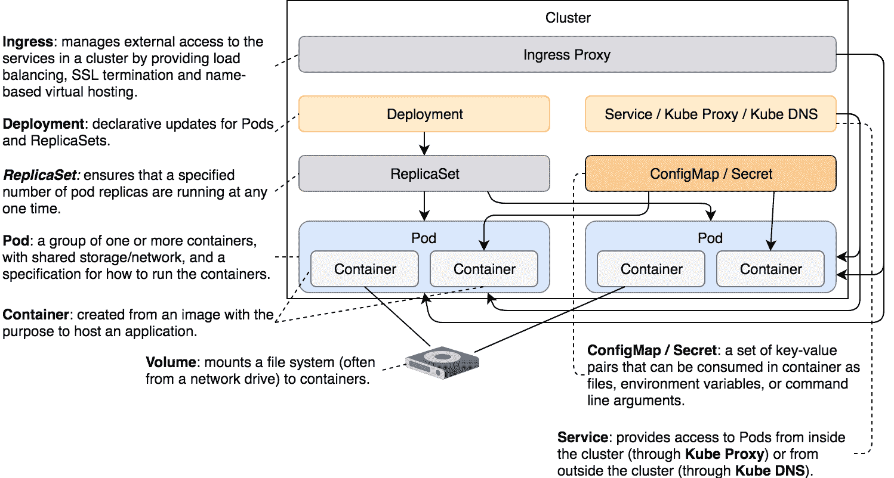

# 第十章：使用 Secrets 隐藏机密信息

我们不能对所有信息一视同仁。敏感数据需要额外的保护。Kubernetes 通过 Secrets 提供了额外的保护层。

Secret 是相对少量的敏感数据。典型的 Secrets 候选项包括密码、令牌和 SSH 密钥。

Kubernetes Secrets 与 ConfigMaps 非常相似。如果比较语法上的区别，你会注意到它们几乎没有区别（如果有的话）。从概念上讲，ConfigMaps 和 Secrets 在本质上是相同的。如果你熟悉 ConfigMaps，那么你应该能够轻松地将这些知识应用到 Secrets 上。

我们已经在不知不觉中使用了 Secrets。到目前为止，我们创建的每个 Pod 都由系统自动挂载了一个 Secret。我们将从探索自动生成的 Secrets 开始，然后逐步创建我们自己的 Secrets。

# 创建集群

我们将继续使用 Minikube，因此创建集群的指令仍然相同。这些指令应该已经刻在你脑海中，因此我们将直接执行它们而不再解释。

本章中的所有命令都可以在[`10-secret.sh`](https://gist.github.com/37b3ef7afeaf9237aeb2b9a8065b10c3) ([`gist.github.com/vfarcic/37b3ef7afeaf9237aeb2b9a8065b10c3`](https://gist.github.com/vfarcic/37b3ef7afeaf9237aeb2b9a8065b10c3)) Gist 中找到。

```
cd k8s-specs

git pull

minikube start --vm-driver=virtualbox

minikube addons enable ingress

kubectl config current-context  
```

我们将从部署一个没有创建任何用户定义的 Secret 的应用开始。

# 探索内置 Secrets

我们将创建与之前定义的 Jenkins 对象相同的对象：

```
kubectl create \
 -f secret/jenkins-unprotected.yml \
 --record --save-config

kubectl rollout status deploy jenkins  
```

我们创建了一个 Ingress、一个 Deployment 和一个 Service 对象。我们还执行了`kubectl rollout status`命令，该命令会告诉我们部署何时完成。

`secret/jenkins-unprotected.yml`定义没有使用任何新特性，因此我们不会浪费时间逐一解释这个 YAML 文件。相反，我们将直接在浏览器中打开 Jenkins UI。

```
open "http://$(minikube ip)/jenkins"  
```

仔细观察，你会发现没有登录按钮。Jenkins 当前没有保护。镜像确实允许定义初始管理员用户名和密码。如果`/etc/secrets/jenkins-user`和`/etc/secrets/jenkins-pass`文件存在，初始化脚本将读取这些文件，并使用其中的内容来定义用户名和密码。由于我们已经熟悉 ConfigMaps，我们可以用它们来生成这些文件。然而，由于用户名和密码应该比其他配置项更加保护，我们将切换到 Secrets。

如果你对详细信息感兴趣，请探索[`jenkins/Dockerfile`](https://github.com/vfarcic/docker-flow-stacks/blob/master/jenkins/Dockerfile)（[`github.com/vfarcic/docker-flow-stacks/blob/master/jenkins/Dockerfile`](https://github.com/vfarcic/docker-flow-stacks/blob/master/jenkins/Dockerfile)）来自[`vfarcic/docker-flow-stack`](https://github.com/vfarcic/docker-flow-stacks)（[`github.com/vfarcic/docker-flow-stacks`](https://github.com/vfarcic/docker-flow-stacks)）仓库。重要部分是它需要`/etc/secrets/jenkins-user`和`/etc/secrets/jenkins-pass`文件。如果我们能以相对安全的方式提供它们，我们的 Jenkins 将默认（更加）安全。

我们将从检查集群中是否已有一些 Secrets 开始：

```
kubectl get secrets  
```

输出如下：

```
NAME                TYPE                                DATA AGE
default-token-l9fhk kubernetes.io/service-account-token 3    32m  
```

我们没有创建任何 Secret，但系统中却有一个可用的 Secret。

`default-token-l9fhk` Secret 是由 Kubernetes 自动创建的。它包含可用于访问 API 的凭据。此外，Kubernetes 会自动修改 Pods 以使用此 Secret。除非我们调整服务账户，否则我们创建的每个 Pod 都会包含此 Secret。让我们确认这确实是事实。

```
kubectl describe pods  
```

输出，仅限相关部分，如下：

```
...
 Mounts:
 /var/jenkins_home from jenkins-home (rw)
 /var/run/secrets/kubernetes.io/serviceaccount from default-
 token-l9fhk (ro)
...
Volumes:
 jenkins-home:
 Type:    EmptyDir (a temporary directory that shares a pod's 
 lifetime)
 Medium:
 default-token-l9fhk:
 Type:        Secret (a volume populated by a Secret)
 SecretName:  default-token-l9fhk
 Optional:    false
...  
```

我们可以看到挂载了两个卷。第一个卷（`/var/jenkins_home`）是我们定义的。这与我们在上一章中使用的挂载卷相同，旨在通过挂载其主目录来保留 Jenkins 的状态。

第二个挂载更为有趣。我们可以看到它引用了自动生成的 Secret `default-token-l9fhk`，并将其挂载为`/var/run/secrets/kubernetes.io/serviceaccount`。让我们查看一下这个目录。

```
POD_NAME=$(kubectl get pods \
 -l service=jenkins,type=master \
 -o jsonpath="{.items[*].metadata.name}")

kubectl exec -it $POD_NAME -- ls \
 /var/run/secrets/kubernetes.io/serviceaccount  
```

输出如下：

```
ca.crt  namespace  token  
```

通过自动挂载该 Secret，我们得到了三个文件。如果我们想从容器内访问 API 服务器，这些文件是必须的。`ca.crt`是证书，`namespace`包含 Pod 运行的命名空间，而最后一个是我们需要的 token，用于与 API 建立通信。

我们不会深入讨论证明这些文件可以安全地访问 API 服务器的示例。只需记住，如果你需要这样做，Kubernetes 通过那个自动生成的 Secret 已经为你提供了保障。

让我们回到当前任务。我们希望通过为 Jenkins 提供初始的用户名和密码来增强其安全性。

# 创建和挂载通用 Secrets

创建 Secrets 的命令几乎与创建 ConfigMaps 时相同。例如，我们可以基于字面值生成 Secrets。

```
kubectl create secret \
 generic my-creds \
 --from-literal=username=jdoe \
 --from-literal=password=incognito  
```

主要的区别在于我们指定了 Secret 的类型为`generic`。它也可以是`docker-registry`或`tls`。我们不会探讨这两种类型，只会提到前者可用于向`kubelet`提供从私有仓库拉取镜像所需的凭据，后者用于存储证书。在本章中，我们将重点讨论`generic`类型的秘密，它与 ConfigMaps 使用相同的语法。

就像 ConfigMaps 一样，generic 类型的 Secrets 也可以使用`--from-env-file`、`--from-file`和`--from-literal`作为源。它们可以作为文件挂载，或者转换为环境变量。由于创建 Secrets 与创建 ConfigMaps 非常相似，我们不会详细探讨所有可能的组合。如果你已经忘记了可以使用的参数，我建议你查阅 ConfigMaps 章节。

目前，我们创建了一个名为`my-creds`的 Secret，包含两个字面值。

让我们看看现在集群中有哪些 Secrets：

```
kubectl get secrets
```

输出如下：

```
NAME                TYPE                                DATA AGE
default-token-n6fs4 kubernetes.io/service-account-token 3    33m
my-creds            Opaque                              2    6s  
```

我们可以看到新创建的 Secret 已经可用，并且它包含两条数据。

让我们查看 Secret 的`json`表示，并尝试找出如何检索它。

```
kubectl get secret my-creds -o json  
```

输出如下（`metadata`部分为了简洁被省略）：

```
{
 "apiVersion": "v1",
 "data": {
 "password": "aW5jb2duaXRv",
 "username": "amRvZQ=="
 },
 "kind": "Secret",
 "metadata": {
 ...
 },
 "type": "Opaque"
}  
```

我们可以看到`data`字段包含`password`和`username`，它们与我们在创建 Secret 时指定的字面值一致。

你会注意到这些值“很奇怪”。它们是经过编码的。如果我们想看到我们存储为秘密的原始值，我们需要解码它们：

```
kubectl get secret my-creds \
 -o jsonpath="{.data.username}" \
 | base64 --decode  
```

我们使用`jsonpath`过滤输出，使其仅检索`username`数据。由于值是编码的，我们将输出通过`base64`命令解码。结果是`jdoe`。

类似地，检索并解码第二个 Secret 数据的命令如下：

```
kubectl get secret my-creds \
 -o jsonpath="{.data.password}" \
 | base64 --decode  
```

输出是`incognito`：

让我们看看如何挂载我们创建的 Secret：

```
cat secret/jenkins.yml  
```

输出，限制为相关部分，如下所示：

```
apiVersion: apps/v1beta2
kind: Deployment
metadata:
 name: Jenkins
spec:
 ...
 template:
 ...
 spec:
 containers:
 - name: Jenkins
 image: vfarcic/Jenkins
 env:
         - name: JENKINS_OPTS
 value: --prefix=/Jenkins
 volumeMounts:
 - name: jenkins-home
 mountPath: /var/jenkins_home
 - name: jenkins-creds
 mountPath: /run/secrets
 volumes:
 - name: jenkins-home
 emptyDir: {}
 - name: jenkins-creds
 secret:
 secretName: my-creds
 defaultMode: 0444
 items:
 - key: username
 path: jenkins-user
 - key: password
 path: jenkins-pass
...  
```

我们添加了`jenkins-creds`，它挂载了`/etc/secrets`目录。`jenkins-creds`卷引用了名为`my-creds`的 Secret。由于我们希望容器内的进程只能读取 Secret，因此将`defaultMode`设置为`0444`。这将给予所有人读取权限。通常，我们会将其设置为`0400`，只给`root`用户读取权限。然而，由于 Jenkins 镜像使用的是`jenkins`用户，因此我们将读取权限授予了所有人，而不仅仅是`root`用户。

最后，由于镜像期望文件名为`jenkins-user`和`jenkins-pass`，我们明确指定了路径。否则，Kubernetes 会创建名为`username`和`password`的文件。

让我们应用新的定义：

```
kubectl apply -f secret/jenkins.yml

kubectl rollout status deploy jenkins  
```

我们应用了定义并等待新对象被部署。

现在，我们可以检查是否正确地将文件存储在`/etc/secrets`目录中：

```
POD_NAME=$(kubectl get pods \
 -l service=jenkins,type=master \
 -o jsonpath="{.items[*].metadata.name}")

kubectl exec -it $POD_NAME \
 -- ls /etc/secrets  
```

后者命令的输出如下：

```
jenkins-pass  jenkins-user  
```

我们需要的文件确实是注入的。为了安全起见，我们还将检查其中一个文件的内容：

```
kubectl exec -it $POD_NAME \
 -- cat /etc/secrets/jenkins-user  
```

输出为`jdoe`，这是我们新部署的 Jenkins 的用户名。

最后，让我们确认应用程序确实是安全的。

```
open "http://$(minikube ip)/jenkins"  
```

你会看到，这次创建新任务的链接已经不见了。

如果你想登录到新部署的（并且更安全的）Jenkins，请使用`jdoe`和`incognito`。

# Secrets 与 ConfigMaps 的比较

到目前为止，Kubernetes Secrets 似乎与 ConfigMaps 没有什么区别。从功能角度来看，它们确实是一样的。两者都允许我们注入一些内容。两者都可以使用文件、字面值和包含环境变量的文件作为数据源。两者都可以将数据作为文件或环境变量输出到容器中。甚至使用 Secrets 的语法几乎与 ConfigMaps 使用的相同。

ConfigMaps 和 Secrets 之间唯一显著的区别是后者会在 tmpfs 中创建文件。它们作为内存中的文件构建，因此不会在主机的文件系统上留下痕迹。单凭这一点还不足以称 Secrets 为安全，但它是朝着这个目标迈出的一步。我们需要将它们与*授权策略*结合起来，确保密码、密钥、令牌以及其他绝不公开显示的数据的安全。即便如此，我们仍然可能希望将注意力转向像 HashiCorp Vault 这样的第三方 Secret 管理器（[`www.vaultproject.io/`](https://www.vaultproject.io/)）。

Secrets 几乎与 ConfigMaps 相同。主要的区别在于，Secret 文件是在 tmpfs 中创建的。Kubernetes 的 Secrets 并不能使你的系统更安全，它们只是朝着这个目标迈出的第一步。

# 不那么机密的 Secrets

Kubernetes 几乎所需的一切都存储在 etcd 中（[`github.com/coreos/etcd`](https://github.com/coreos/etcd)）。其中包括 Secrets。问题在于它们是以纯文本形式存储的。任何访问 etcd 的人都可以访问 Kubernetes 的 Secrets。我们可以限制对 etcd 的访问，但这并不是我们问题的终结。*etcd*将数据以纯文本形式存储到磁盘上。限制对 etcd 的访问仍然会让 Secrets 暴露于那些可以访问文件系统的人。以某种方式来说，这减少了将 Secrets 存储在 tmpfs 中的优势。如果这些 Secrets 仍然被 etcd 存储在磁盘上，容器使用 tmpfs 存储它们就没有太大意义。

即使我们已经确保了 etcd 的访问安全，并确保未授权用户无法访问 etcd 所使用的文件系统分区，我们仍然面临风险。当多个 etcd 副本运行时，数据会在它们之间同步。默认情况下，etcd 副本之间的通信没有加密。任何监听该通信的人都可能获取我们的 Secrets。

Kubernetes Secrets 是朝着正确方向迈出的第一步。毫无疑问，使用 Secrets 比将机密信息暴露为环境变量或其他不太安全的方法要好得多。然而，Secrets 仍然可能给我们带来虚假的安全感。

我们需要采取额外的预防措施来保护自己。这可能包括但不限于以下措施：

+   使用 SSL/TLS 保护 etcd 实例之间的通信。

+   限制对 etcd 的访问并擦除已使用的磁盘或分区。

+   不要在存储库中的 YAML 文件中定义机密信息。通过临时的`kubectl create secret`命令创建机密信息。如果可能，之后删除命令历史记录。

+   确保使用机密信息的应用程序不会不小心将其输出到日志中或传递给其他应用程序。

+   创建策略，仅允许受信任的用户检索机密信息。但是，你需要注意，即使有适当的策略，任何拥有运行 Pod 权限的用户也可以挂载机密并读取它。

我们尚未探索 etcd 配置，也没有学习如何设置授权策略。目前，只需记住，机密信息并不像人们想象的那样安全。至少，Kubernetes 社区提供的机密信息并不安全。我鼓励你使用它们，只要你意识到它们的不足之处。

# 那么，接下来做什么？

没有太多需要说的，我们将进入破坏模式并删除我们创建的集群：

```
minikube delete  
```

如果你想了解更多关于机密信息的内容，请查阅 Secret v1 core 的 API 文档（[`v1-9.docs.kubernetes.io/docs/reference/generated/kubernetes-api/v1.9/#secret-v1-core`](https://v1-9.docs.kubernetes.io/docs/reference/generated/kubernetes-api/v1.9/#secret-v1-core)）。



图 10-1：到目前为止探索的组件

# Kubernetes 机密信息与 Docker Swarm 机密信息的对比

机密信息与 Kubernetes 的 ConfigMaps 和 Docker Swarm 的配置非常相似。我们为配置所说的一切同样适用于机密信息，只是多了一些附加功能。

Kubernetes 和 Docker Swarm 都将机密信息存储在容器内的 tmpfs 中。从这一点上看，它们是同样安全的。显著的区别在于机密信息的存储方式。

Kubernetes 将机密信息存储在 etcd 中。默认情况下，它们是暴露的，因此我们需要采取额外的措施来保护它们。另一方面，Docker Swarm 的机密信息默认更为安全。它们通过 SSL/TLS 在管理节点之间进行同步，并且在存储时是加密的。我更喜欢 Docker Swarm 机密信息的“默认安全”策略。在 Kubernetes 中，我们需要采取额外的步骤，才能达到与 Docker Swarm 相似的安全级别。

另一方面，Kubernetes 与第三方解决方案集成以管理机密信息要好得多。例如，将 HashiCorp Vault（[`www.vaultproject.io/`](https://www.vaultproject.io/)）集成到 Kubernetes 工作流中，要比将其与 Docker Swarm 集成要顺利得多。使用 Vault 比 Kubernetes 和 Swarm 本身提供的解决方案更为优秀。

尽管可以通过 Vault 等产品提高 Kubernetes 的安全性，但目前我们正在评估 Kubernetes 和 Docker Swarm 自带的秘密管理功能。如果排除第三方解决方案，Docker Swarm 在这方面明显优于 Kubernetes。其默认的秘密管理更加安全。即便对 Kubernetes 进行一些调整（尤其是 etcd），Docker Swarm 依然更为安全。这并不意味着这两款产品的秘密管理就没有可改进之处，它们都有各自的不足之处。然而，我必须宣布 Docker Swarm 在这一回合中获胜。它的秘密更加**保密**。
