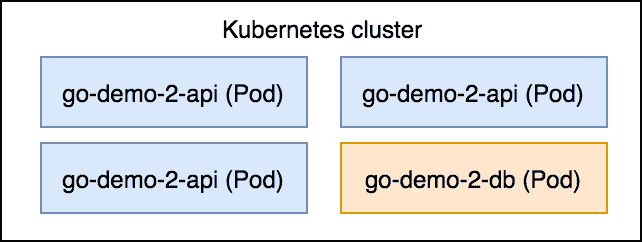
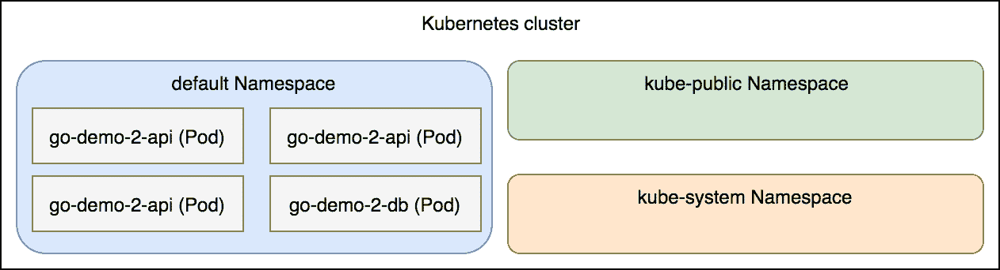
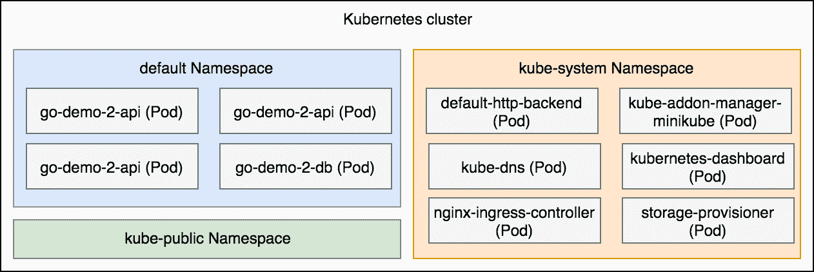
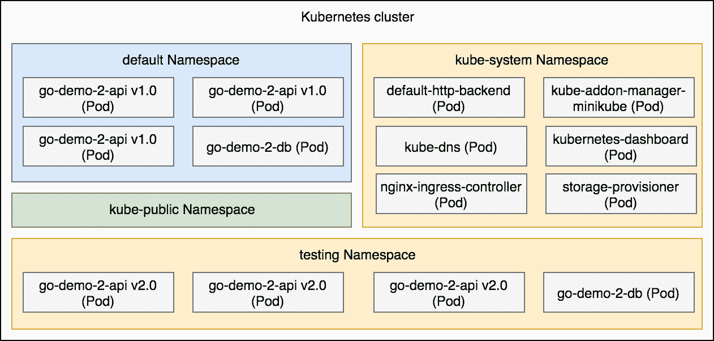

# 将集群划分为命名空间

应用程序及其相应对象通常需要彼此分开，以避免冲突和其他不良影响。

我们可能需要将不同团队创建的对象分开。例如，我们可以给每个团队一个单独的集群，让他们可以“实验”而不会影响其他人。在其他情况下，我们可能希望创建不同的集群，用于各种不同的目的。例如，我们可以有一个生产集群和一个测试集群。我们通常通过创建不同的集群来解决许多其他问题。大多数问题源自对某些对象可能对其他对象产生不良影响的担忧。我们可能担心某个团队会不小心将应用程序的生产版本替换为未经测试的测试版。或者，我们可能担心性能测试会拖慢整个集群的速度。恐惧是我们倾向于采取防守性和保守性措施的主要原因之一。在某些情况下，这种恐惧是基于过去的经验。在其他情况下，它可能源于对我们采用的工具了解不足。更常见的是，这两者的结合。

拥有多个 Kubernetes 集群的问题在于，每个集群都需要操作和资源的开销。管理一个集群通常远非简单。拥有几个集群会很复杂。拥有多个集群则可能变成一场噩梦，需要投入大量的时间来进行操作和维护。如果这种开销还不够，我们还必须注意，每个集群都需要专门的资源来运行 Kubernetes。集群越多，消耗的资源（CPU、内存、IO）就越多。虽然大集群也有类似的问题，但事实仍然是，拥有多个小集群的资源开销高于拥有一个大集群。

我并不是想阻止你拥有多个 Kubernetes 集群。在许多情况下，这是一个受欢迎的（如果不是必需的）策略。然而，也可以选择使用 Kubernetes 命名空间。在本章中，我们将探讨将集群拆分为不同区域的方式，作为拥有多个集群的替代方案。

# 创建集群

你知道该怎么做，所以让我们快速完成集群设置。

本章中的所有命令都可以在 `11-ns.sh`（[`gist.github.com/vfarcic/6e0a03df4c64a9248fbb68673c1ab719`](https://gist.github.com/vfarcic/6e0a03df4c64a9248fbb68673c1ab719)）Gist 中找到。

```
cd k8s-specs

git pull

minikube start --vm-driver=virtualbox

minikube addons enable ingress

kubectl config current-context  
```

现在集群已经创建（再次），我们可以开始探索命名空间了。

# 部署第一次发布

我们将从部署 `go-demo-2` 应用程序开始，并使用它来探索命名空间。

```
cat ns/go-demo-2.yml  
```

定义与我们之前使用的相同，因此我们将跳过对 YAML 文件的解释。相反，我们将直接进入部署过程。

与之前的情况不同，我们将部署应用程序的特定标签。如果这是一个 Docker Swarm 堆栈，我们会将 `vfarcic/go-demo-2` 镜像的标签定义为环境变量，默认值为 `latest`。不幸的是，Kubernetes 并不提供这个选项。由于我认为为每个版本创建不同的 YAML 文件并不是一个好主意，因此我们将使用 `sed` 在将定义传递给 `kubectl` 之前进行修改。

使用 `sed` 来修改 Kubernetes 定义并不是一个好方法。事实上，这简直是一个糟糕的解决方案。我们应该使用像 Helm（[`helm.sh/`](https://helm.sh/)）这样的模板解决方案。然而，我们现在专注于 Kubernetes，Helm 和其他第三方产品超出了本书的范畴。因此，我们将不得不使用 `sed` 命令作为一种变通方法：

```
IMG=vfarcic/go-demo-2

TAG=1.0

cat ns/go-demo-2.yml \
 | sed -e \
    "s@image: $IMG@image: $IMG:$TAG@g" \
    | kubectl create -f - 
```

我们声明了环境变量 `IMG` 和 `TAG`。接下来，我们用 `cat` 读取 YAML 文件并将输出通过管道传递给 `sed`。然后，它将 `image: vfarcic/go-demo-2` 替换为 `image: vfarcic/go-demo-2:1.0`。最后，修改后的定义被传递给 `kubectl`。当 `-f` 参数后跟一个破折号（`-`）时，`kubectl` 会使用标准输入（`stdin`）而不是文件。在我们的例子中，这个输入是通过添加特定 `tag (1.0)` 到 `vfarcic/go-demo-2` 镜像而修改过的 YAML 定义。

让我们确认部署是否成功完成：

```
kubectl rollout status \
    deploy go-demo-2-api
```

我们将通过发送 HTTP 请求来检查应用程序是否已正确部署。由于我们刚刚创建的 Ingress 资源的 `host` 被设置为 `go-demo-2.com`，因此我们需要通过在请求中添加 `Host: go-demo-2.com` 头来“伪装”这一点：

```
curl -H "Host: go-demo-2.com" \
 "http://$(minikube ip)/demo/hello"
```

输出结果如下：

```
hello, release 1.0!  
```

我们之所以在部署特定版本时经历了这么多曲折的过程，很快就会揭晓原因。目前，我们假设我们在生产环境中运行的是第一个版本。

# 探索虚拟集群

几乎所有的系统服务都作为 Kubernetes 对象运行。Kube DNS 是一个部署，Minikube 插件管理器、仪表盘、存储控制器和 nginx Ingress 是我们当前在 Minikube 集群中运行的部分系统 Pods。尽管如此，我们还没有看到它们。尽管我们已经执行了好几次 `kubectl get all`，但并未看到任何这些对象。那么这是怎么回事呢？如果我们列出所有对象，是否能看到它们？让我们检查一下。

```
kubectl get all  
```

输出结果仅显示我们创建的对象。有 `go-demo-2` 部署、ReplicaSets、服务和 Pods。唯一可以观察到的系统对象是 `kubernetes` 服务。

从当前信息来看，如果我们将观察范围仅限于 Pods，我们可以通过*图 11-1* 来描述我们的集群。



图 11-1：包含 go-demo-2 Pods 的集群

总的来说，我们的集群运行的是系统级对象和我们创建的对象的混合体，但只有后者是可见的。你可能会想执行`kubectl get --help`，希望能找到一个参数来获取系统级对象的信息。你可能认为它们默认对你是隐藏的。其实并非如此。它们并没有被隐藏。相反，它们不在我们当前查看的命名空间中。

Kubernetes 使用命名空间来创建虚拟集群。当我们创建 Minikube 集群时，我们得到了三个命名空间。在某种程度上，每个命名空间都是集群中的一个子集群。它们为名称提供作用域。

到目前为止，我们的经验告诉我们，不能有两个相同类型的对象，且名称相同。例如，不能有两个名为`go-demo-2-api`的部署。然而，这个规则仅适用于命名空间。在集群内部，只要它们属于不同的命名空间，我们可以有多个相同名称的相同类型的对象。

到目前为止，我们的印象是我们在操作一个 Minikube Kubernetes 集群的层级。那是一个错误的假设。实际上，我们一直处于集群中所有可能的命名空间之一。更具体地说，我们迄今为止执行的所有命令都在`default`命名空间中创建了对象。

命名空间不仅仅是对象名称的作用域。它们使我们能够将一个集群划分为不同的用户组。每个命名空间可以有不同的权限和资源配额。如果我们将命名空间与其他 Kubernetes 服务和概念结合使用，我们还能做很多其他事情。然而，我们将忽略权限、配额、策略等我们尚未探索的内容。我们将仅关注命名空间本身。

我们将从探索预定义的命名空间开始。

# 探索现有的命名空间

现在我们知道集群中有多个命名空间，让我们稍微探索一下它们。

我们可以通过`kubectl get namespaces`命令列出所有命名空间。与大多数其他 Kubernetes 对象和资源一样，我们也可以使用简写`ns`来代替完整名称。

```
kubectl get ns  
```

输出如下：

```
NAME          STATUS    AGE
default       Active    3m
kube-public   Active    3m
kube-system   Active    3m  
```

我们可以看到，在创建 Minikube 集群时，自动设置了三个命名空间。

`default`命名空间是我们一直使用的命名空间。如果我们没有特别指定，所有的`kubectl`命令将作用于`default`命名空间中的对象。我们的`go-demo-2`应用程序就在这个命名空间中运行。虽然我们之前没有意识到它的存在，但现在我们知道，所有我们创建的对象都在这里。



图 11-2：命名空间与 go-demo-2 Pods

有很多种方法可以指定一个命名空间。现在，我们将使用`--namespace`参数。它是所有`kubectl`命令都可以使用的全局选项之一。

获取`kube-public`命名空间中所有对象的命令如下：

```
kubectl --namespace kube-public get all  
```

输出显示`未找到资源`。这令人失望，不是吗？Kubernetes 不会使用`kube-public`命名空间来存放其系统级对象。我们创建的所有对象都在`default`命名空间中。

`kube-public`命名空间是所有命名空间的用户都可以读取的。它存在的主要原因是提供一个空间，我们可以在其中创建应该在整个集群中可见的对象。一个很好的例子是 ConfigMap。当我们在例如`default`命名空间中创建一个 ConfigMap 时，它只对同一命名空间中的其他对象可访问。其他地方的对象根本不知道它的存在。如果我们希望这样的 ConfigMap 在任何地方的对象都能看到，我们会把它放到`kube-public`命名空间中。我们不太会使用这个命名空间（如果有的话）。

`kube-system`命名空间至关重要。Kubernetes 所需的几乎所有对象和资源都在其中运行。我们可以通过执行以下命令来检查这一点：

```
kubectl --namespace kube-system get all  
```

我们检索了所有在`kube-system`命名空间中运行的对象和资源。输出如下：

```
NAME            DESIRED CURRENT UP-TO-DATE AVAILABLE AGE
deploy/kube-dns 1       1       1          1         3m

NAME                   DESIRED CURRENT READY AGE
rs/kube-dns-86f6f55dd5 1       1       1     3m

NAME            DESIRED CURRENT UP-TO-DATE AVAILABLE AGE
deploy/kube-dns 1       1       1          1         3m

NAME                   DESIRED CURRENT READY AGE
rs/kube-dns-86f6f55dd5 1       1       1     3m

NAME                              READY STATUS  RESTARTS AGE
po/default-http-backend-j7mlp     1/1   Running 0        3m
po/kube-addon-manager-minikube    1/1   Running 0        4m
po/kube-dns-86f6f55dd5-62dsn      3/3   Running 0        3m
po/kubernetes-dashboard-mtkrl     1/1   Running 1        3m
po/nginx-ingress-controller-fxrhn 1/1   Running 0        3m
po/storage-provisioner            1/1   Running 0        3m

NAME                        DESIRED CURRENT READY AGE
rc/default-http-backend     1       1       1     3m
rc/kubernetes-dashboard     1       1       1     3m
rc/nginx-ingress-controller 1       1       1     3m

NAME                     TYPE      CLUSTER-IP    EXTERNAL-IP PORT
(S)       AGE
svc/default-http-backend NodePort  10.107.189.73 <none>      80:3
0001/TCP  3m
svc/kube-dns             ClusterIP 10.96.0.10    <none>      53/U
DP,53/TCP 3m
svc/kubernetes-dashboard NodePort  10.96.41.245  <none>      80:3
0000/TCP  3m  
```

如我们所见，`kube-system`命名空间中运行着相当多的内容。例如，我们知道有一个 nginx Ingress 控制器，但这是我们第一次看到它的对象。它由一个复制控制器`nginx-ingress-controller`和它创建的 Pod`nginx-ingress-controller-fxrhn`组成。



图 11-3：命名空间和 Pod

只要系统按预期工作，就不需要在`kube-system`命名空间中做太多事情。真正有趣的部分开始于我们创建新的命名空间。

# 部署到新命名空间

目前，我们正在运行`go-demo-2`应用的 1.0 版本。我们可以把它看作是生产版本。现在，假设负责该应用的团队刚刚发布了一个新版本。他们运行了单元测试并构建了二进制文件，生产了一个新的 Docker 镜像并将其标记为`vfarcic/go-demo-2:2.0`。他们没有做的是运行功能性测试、性能测试以及其他需要运行应用的测试。这个新版本仍然无法部署到生产环境，所以我们还不能执行滚动更新，并用新版本替换生产版本。我们需要完成测试运行，而为此我们需要让新版本与旧版本并行运行。

我们可以，例如，创建一个仅用于测试目的的新集群。虽然在某些情况下这是一个不错的选择，但在其他情况下可能是资源的浪费。此外，我们还会在测试集群中面临同样的挑战。可能会有多个新版本需要并行部署和测试。

另一种选择是为每个要测试的发布版本创建一个新的集群。这将创建必要的隔离并保持我们追求的自由。然而，这种方式很慢。创建一个集群需要时间。即使看起来不多，光是这十分钟（如果不是更多）就浪费了太多时间。即使你不同意我，认为十分钟不算什么，但这种做法依然成本太高。每个集群都有资源开销，这是必须支付的。虽然集群的整体大小会影响资源开销，但集群的数量对它的影响更大。拥有许多小集群比一个大集群更昂贵。更重要的是，操作成本。尽管操作成本与集群数量通常不成比例，但它依然会增加。

为我们所有的测试需求拥有一个独立的集群并非坏主意。我们不应轻易放弃它，就像我们应该考虑为每个新发布创建（并销毁）一个新的集群一样。然而，在你开始创建新的 Kubernetes 集群之前，我们将探讨如何利用单一集群并借助命名空间实现相同的目标。

首先，我们需要创建一个新的命名空间，然后才能使用它。

```
kubectl create ns testing

kubectl get ns  
```

后一个命令的输出如下：

```
NAME          STATUS    AGE
default       Active    5m
kube-public   Active    5m
kube-system   Active    5m
testing       Active    3s
```

我们可以看到新命名空间`testing`已被创建。

我们可以继续使用`--namespace`参数在新创建的命名空间中操作。然而，每个命令都添加`--namespace`参数很繁琐。相反，我们将创建一个新的上下文。

```
kubectl config set-context testing \
 --namespace testing \
    --cluster minikube \
    --user minikube  
```

我们创建了一个名为`testing`的新上下文。它与`minikube`上下文相同，唯一的区别是它使用了`testing`命名空间。

```
kubectl config view  
```

限制为相关部分的输出如下：

```
...
contexts:
- context:
 cluster: minikube
 user: minikube
 name: minikube
- context:
 cluster: minikube
 Namespace: testing
 user: minikube
 name: testing
...  
```

我们可以看到有两个上下文。两者都设置为使用相同的`minikube`集群和相同的`minikube`用户。唯一的区别是一个没有设置命名空间，这意味着它将使用`default`。另一个则设置为`testing`。

现在我们有了两个上下文，我们可以切换到`testing`。

```
kubectl config use-context testing  
```

我们切换到了使用同名命名空间的`testing`上下文。从现在起，所有的`kubectl`命令将在`testing`命名空间的上下文中执行。也就是说，直到我们再次更改上下文或使用`--namespace`参数。

为了安全起见，我们将确认新创建的命名空间中没有运行任何资源。

```
kubectl get all  
```

输出显示`未找到资源`。

如果我们在相同的命令中添加`--namespace=default`参数，再次执行该命令，我们会看到我们之前创建的`go-demo-2`对象仍在运行。

继续并部署新的发布版本。正如我们之前所解释的，部署的主要目标是提供测试发布版本的手段。它应该对用户保持隐藏。他们应该不知道新部署的存在，继续使用 1.0 版本，直到我们确认 2.0 版本如预期般正常：

```
TAG=2.0

DOM=go-demo-2.com

cat ns/go-demo-2.yml \
    | sed -e \
    "s@image: $IMG@image: $IMG:$TAG@g" \
    | sed -e \
    "s@host: $DOM@host: $TAG\.$DOM@g" \
    | kubectl create -f -  
```

就像之前一样，我们使用`sed`修改了镜像定义。这一次，我们部署的是`2.0`标签。

除了更改镜像标签外，我们还修改了主机。这次，Ingress 资源将配置主机为`2.0.go-demo-2.com`。这将允许我们使用该域名测试新版本，同时用户将继续通过`go-demo-2.com`域名访问生产版本 1.0。

让我们确认部署是否完成。

```
kubectl rollout status \
 deploy go-demo-2-api
```

输出如下：

```
deployment "go-demo-2-api" successfully rolled out  
```

如你所见，我们部署了`go-demo-2-api`，以及一些其他资源。这意味着我们有两组同名的对象，一组运行在`default`命名空间中，另一组（版本 2.0）运行在`testing`命名空间中。



图 11-4：带有新命名空间测试的集群

在我们打开一瓶香槟庆祝新版本的成功部署且未影响生产环境之前，我们应该验证两者是否确实按预期工作。

如果我们向`go-demo-2.com`发送请求，我们应该收到来自`default`命名空间中运行的 1.0 版本的响应。

```
curl -H "Host: go-demo-2.com" \
    "http://$(minikube ip)/demo/hello"
```

输出如下：

```
hello, release 1.0!  
```

另一方面，如果我们向`2.0.go-demo-2.com`发送请求，我们应该从`testing`命名空间中运行的 2.0 版本获得响应。

```
curl -H "Host: 2.0.go-demo-2.com" \
 "http://$(minikube ip)/demo/hello"
```

输出如下：

```
hello, release 2.0!  
```

我们通过不同的命名空间实现的结果与使用独立集群时的预期非常相似。主要的区别在于，我们无需通过创建一个新的集群来复杂化事情，而是通过使用一个新的命名空间来节省了时间和资源。

如果这是一个“现实世界”的情况，我们会运行功能测试以及其他类型的测试，使用新部署的版本。希望这些测试是自动化的，且只会持续几分钟。由于测试部分不在本章的范围内（可能也不在本书的范围内），我们将跳过测试部分。我们假设这些测试已经执行，并且是成功的。

通信是处理命名空间时非常重要的主题，因此我们将花一点时间来探讨它。

# 在命名空间之间进行通信

我们将创建一个基于`alpine`的 Pod，用于演示命名空间之间的通信。

```
kubectl config use-context minikube

kubectl run test --image=alpine \
 --restart=Never sleep 10000
```

我们切换到`minikube`上下文（`default`命名空间），并创建了一个基于`alpine`镜像的 Pod。我们让它`sleep`很长时间，否则容器将没有进程，几乎会立即停止。

在继续之前，我们应该确认 Pod 确实正在运行。

```
kubectl get pod test  
```

输出如下：

```
NAME READY STATUS  RESTARTS AGE
test 1/1   Running 0        10m  
```

如果在你的情况下 Pod 尚未就绪，请稍等片刻。

在继续之前，我们将在`test` Pod 内安装`curl`。

```
kubectl exec -it test \
    -- apk add -U curl  
```

我们已经探讨了同一 Namespace 中对象之间的通信。由于 `test` Pod 运行在 `default` Namespace 中，我们可以通过使用服务名称作为 DNS 名称来访问 `go-demo-2-api` 服务。

```
kubectl exec -it test -- curl \
    "http://go-demo-2-api:8080/demo/hello"
```

输出如下：

```
hello, release 1.0!  
```

我们得到了 1.0 版本的响应，因为它运行在同一 Namespace 中。这是否意味着我们无法访问其他 Namespace 中的服务？

当我们创建一个服务时，它会创建几个 DNS 条目，其中一个与服务名称对应。因此，`go-demo-2-api` 服务创建了一个基于该名称的 DNS。实际上，完整的 DNS 条目是 `go-demo-2-api.svc.cluster.local`。这两个条目都解析到相同的服务 `go-demo-2-api`，而在这种情况下，它运行在 `default` Namespace 中。

我们得到的第三个 DNS 条目采用 `<service-name>.<namespace-name>.svc.cluster.local` 格式。在我们的案例中，这是 `go-demo-2-api.default.svc.cluster.local`。或者，如果我们更喜欢短一点的版本，也可以使用 `go-demo-2-api.default`。

在大多数情况下，当与同一 Namespace 中的服务进行通信时，使用 `<service-name>.<namespace-name>` 格式并没有太大的必要。DNS 以 Namespace 名称存在的主要目的，是为了在我们想要访问位于不同 Namespace 中的服务时使用。

如果我们希望从 `default` Namespace 中的 `test` Pod 访问在 `testing` Namespace 中运行的 `go-demo-2-api`，我们应该使用 `go-demo-2-api.testing.svc.cluster.local` DNS，或者更好的是，使用更短的版本 `go-demo-2-api.testing`。

```
kubectl exec -it test -- curl \
    "http://go-demo-2-api.testing:8080/demo/hello"
```

这次，输出结果不同：

```
hello, release 2.0!  
```

Kube DNS 使用 DNS 后缀 `testing` 来推断我们想要访问位于该 Namespace 中的服务。因此，我们收到了 `go-demo-2` 应用程序的 2.0 版本的响应。

# 删除 Namespace 及其所有对象

Namespaces 的另一个便捷特性是它们的级联效果。例如，如果我们删除 `testing` Namespace，那么其中运行的所有对象和资源也会被一并删除。

```
kubectl delete ns testing

kubectl -n testing get all  
```

我们删除了 `testing` Namespace，并恢复了所有其中的对象。输出如下：

```
NAME                              READY STATUS      RESTARTS AGE
po/go-demo-2-api-56dfb69dbd-8w6rf 0/1   Terminating 0        2m
po/go-demo-2-api-56dfb69dbd-hrr4b 0/1   Terminating 0        2m
po/go-demo-2-api-56dfb69dbd-ws855 0/1   Terminating 0        2m
po/go-demo-2-db-5b49cc946b-xdd6v  0/1   Terminating 0        2m  
```

请注意，在你的情况下，输出可能会显示更多的对象。如果是这样，那是因为你操作太快，Kubernetes 还没有时间将它们删除。

一两秒后，`testing` Namespace 中唯一剩下的对象是状态为 `terminating` 的 Pods。一旦宽限期结束，它们也会被删除。Namespace 被删除，我们在其中创建的所有内容也会被移除。

删除命名空间及其所托管的所有对象和资源的能力在我们需要创建临时对象时尤为有用。一个好的例子是**持续部署**（**CDP**）过程。我们可以创建一个命名空间来构建、打包、测试以及执行管道所需的其他任务。完成后，我们可以简单地删除该命名空间。否则，我们将需要跟踪我们创建的所有对象，并确保在终止 CDP 管道之前将它们删除。

现在托管我们 2.0 版本的命名空间已经消失，我们可能需要再次检查生产版本（1.0）是否仍在运行。

```
kubectl get all  
```

输出应显示`go-demo-2`的 Deployments、ReplicaSets、Pods 和 Services，因为我们仍在使用`default`上下文。

为了安全起见，我们将检查来自`go-demo-2.com`域的请求是否仍然返回来自 1.0 版本的响应。

```
curl -H "Host: go-demo-2.com" \
 "http://$(minikube ip)/demo/hello"
```

如预期的那样，响应是`hello, release 1.0!`。

如果这是一个持续部署管道，剩下的唯一任务就是执行滚动更新，将生产发布的镜像更改为`vfarcic/go-demo-2:2.0`。命令可以如下所示：

```
kubectl set image \
 deployment/go-demo-2-api \
    api=vfarcic/go-demo-2:2.0 \
    --record
```

# 现在该做什么？

将测试版本作为持续部署过程的一部分进行部署并不是命名空间的唯一用途。还有许多其他情况下它们非常有用。例如，我们可以为组织中的每个团队分配一个独立的命名空间，或者根据应用类型（例如监控、持续部署、后端等）将集群划分为多个命名空间。总的来说，命名空间是将集群分成不同部分的一个便捷方法。我们将创建的一些命名空间会长期存在，而另一些，如我们例子中的测试命名空间，将是短期的。

命名空间的真正力量体现在它们与授权策略和约束结合使用时。然而，我们尚未探索这些主题，因此目前我们将把命名空间的体验局限于其基本形式。

本章已经结束，这意味着我们即将删除集群。

```
minikube delete  
```

如果你想了解更多关于命名空间的信息，请查看 Namespace v1 核心的[API 文档](https://v1-9.docs.kubernetes.io/docs/reference/generated/kubernetes-api/v1.9/#namespace-v1-core)。

# Kubernetes 命名空间与 Docker Swarm 的等效项比较（如果有的话）

Docker Swarm 没有类似于 Kubernetes 命名空间的功能。我们无法将 Swarm 集群分割成多个部分。因此，我们可以通过说 Kubernetes 在此功能上明显优于 Docker Swarm 来结束这个比较，因为 Docker Swarm 没有命名空间。但这并不完全准确。

Docker Swarm 堆栈在某种程度上类似于 Kubernetes 命名空间。堆栈中的所有服务通过堆栈名称和其中服务名称的组合唯一标识。默认情况下，堆栈内的所有服务都可以通过堆栈的默认网络互相通信。服务只有在显式附加到同一网络时，才能与来自其他堆栈的服务通信。总的来说，每个 Swarm 堆栈都是与其他堆栈分开的。从某种程度上说，它们类似于 Kubernetes 命名空间。

尽管 Docker Swarm 堆栈提供了类似于 Kubernetes 命名空间的功能，但它们的使用受到限制。例如，如果我们希望将集群划分为生产和测试环境，我们需要创建两个潜在较大的 Swarm 堆栈文件。这将是不切实际的。此外，Kubernetes 命名空间可以与资源配额、策略以及其他许多功能相关联。它们确实充当真正独立的集群。另一方面，Swarm 堆栈旨在将服务分组为逻辑实体。尽管 Kubernetes 命名空间和 Docker Swarm 堆栈中的某些功能有重叠，但这仍然是 Kubernetes 的明显胜利。

有人可能会争辩说，它们仅适用于更大的集群或有多个团队的大型组织。我认为这是一种轻描淡写的说法。命名空间可以应用于许多其他场景。例如，为每个持续集成、交付或部署管道创建一个新的命名空间是一种有益的实践。我们可以为名称提供独特的作用域，可以通过资源配额来减少潜在问题，还能提高安全性。在整个过程中，最终我们可以删除命名空间以及其中创建的所有对象。

Kubernetes 命名空间是使 Kubernetes 成为大集群需求团队以及依赖自动化的团队更可能选择的平台之一。在我们到目前为止比较的特性中，这是两个平台之间的第一个真正的区分点。Kubernetes 在这一回合中获胜。
