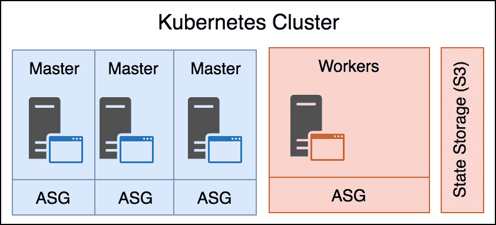
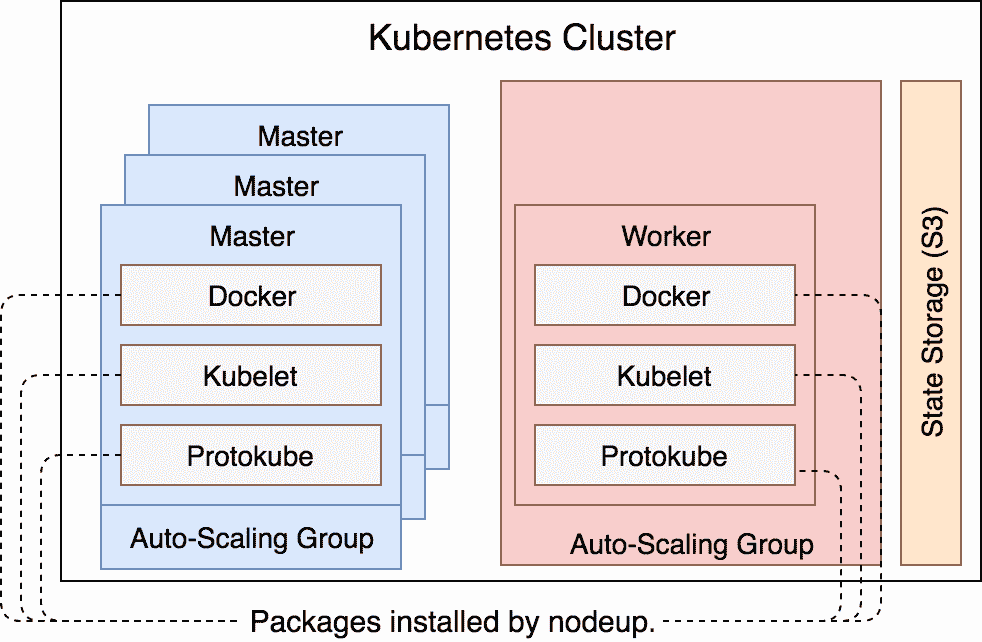
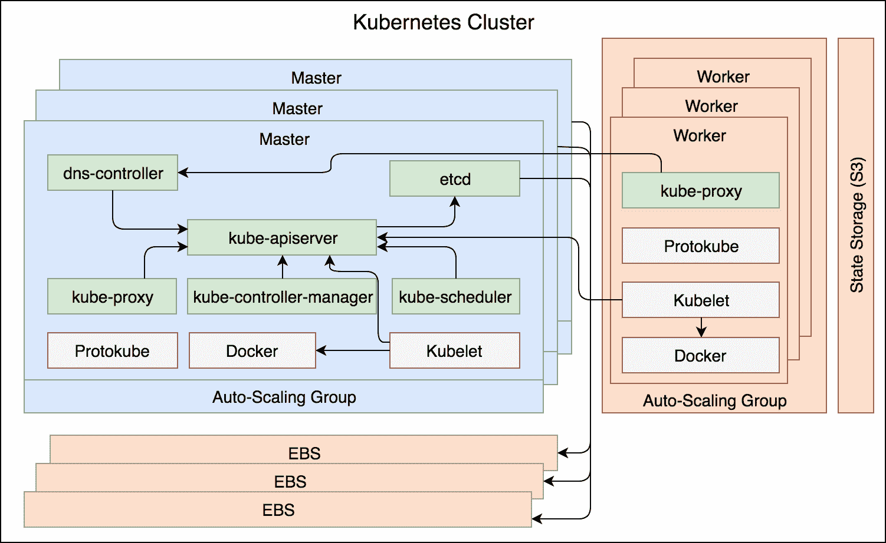
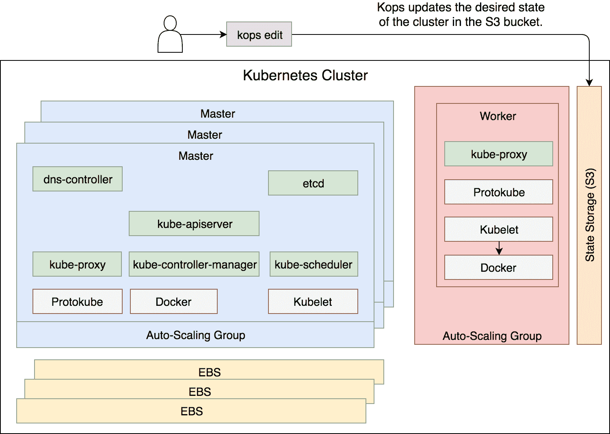
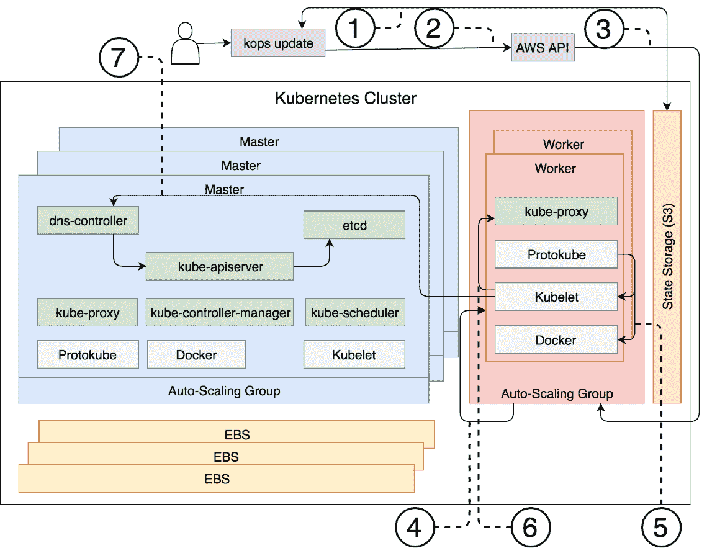
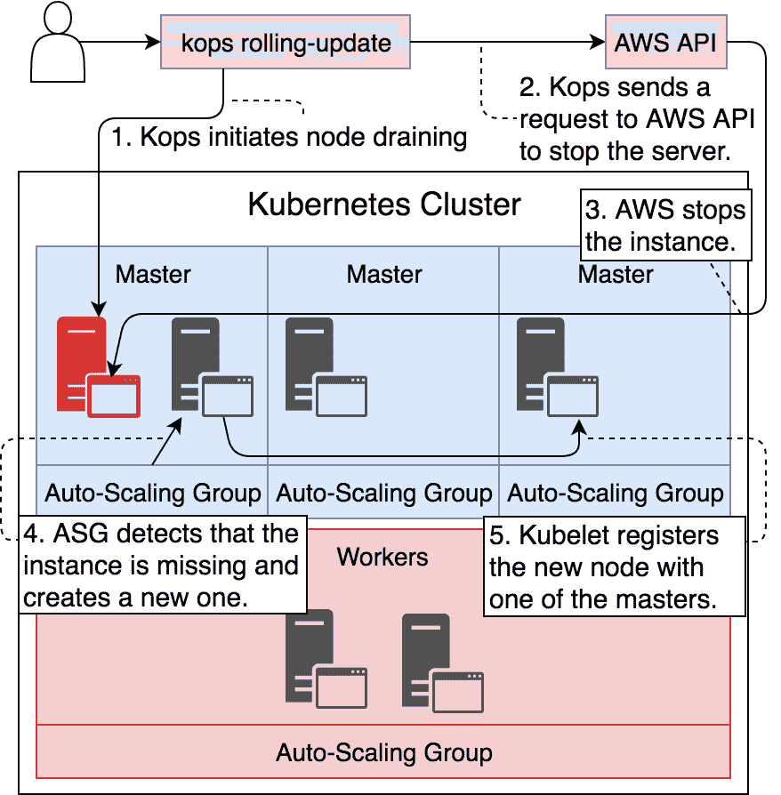
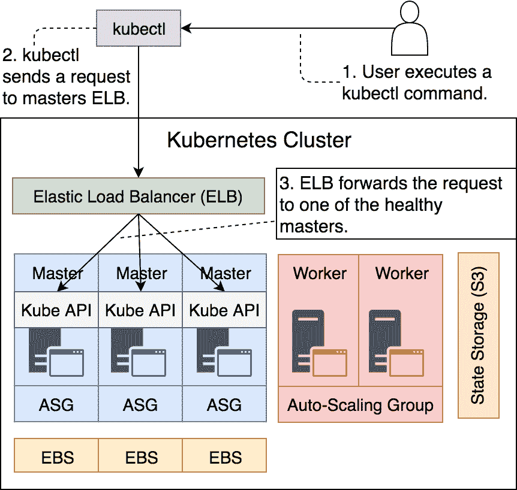
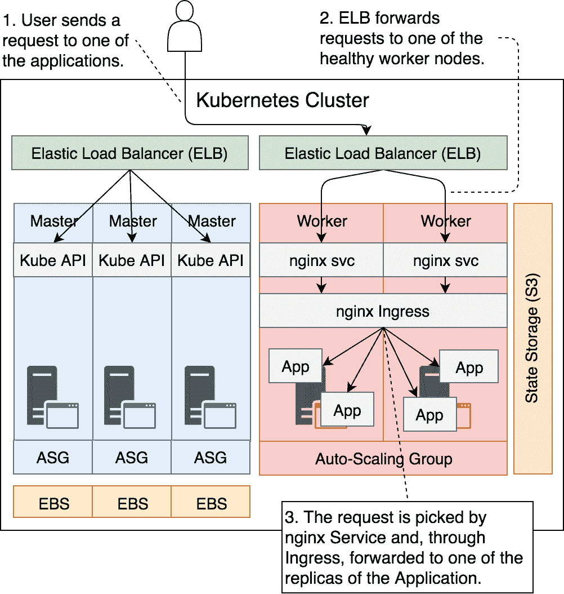
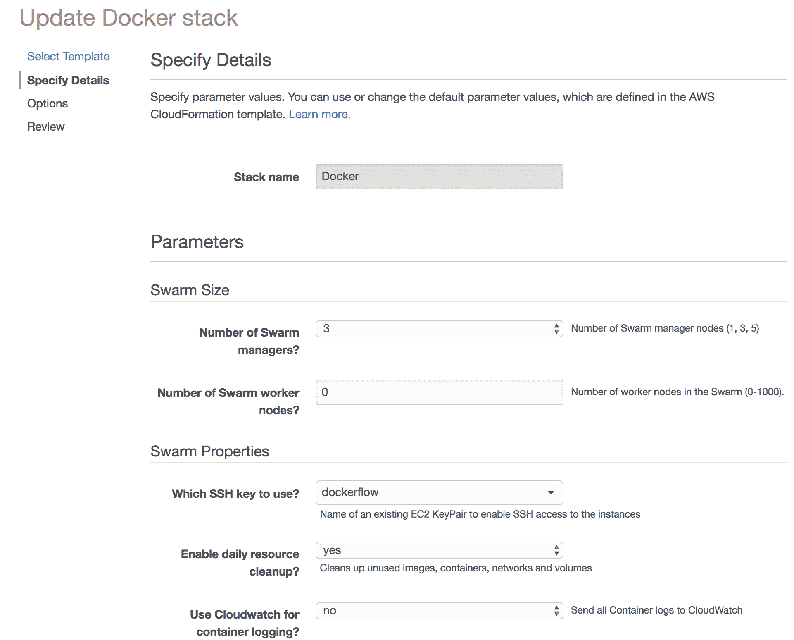

# 创建一个生产就绪的 Kubernetes 集群

创建 Kubernetes 集群并非简单任务。我们需要做出许多选择，并且很容易在各种选项中迷失。可选择的排列组合几乎是无限的，但我们的集群需要一致地进行配置。从第一次尝试设置集群的经验中，很容易就会变成一个困扰你一生的噩梦。

与将几乎所有内容打包成单一二进制文件的 Docker Swarm 不同，Kubernetes 集群需要在各个节点上运行多个独立的组件。设置这些组件可以非常简单，也可能变得非常复杂，这一切取决于我们最初做出的选择。我们需要做的第一件事之一就是选择一个工具，用来创建 Kubernetes 集群。

如果我们决定安装一个 Docker Swarm 集群，我们只需要在所有服务器上安装 Docker 引擎，并在每个节点上执行 `docker swarm init` 或 `docker swarm join` 命令，仅此而已。Docker 将一切打包到一个二进制文件中。Docker Swarm 的设置过程简单至极。而 Kubernetes 就不一样了。与高度意见化的 Swarm 不同，Kubernetes 提供了更高的自由选择。它的设计注重扩展性。我们需要在众多组件中做出选择。其中一些是由 Kubernetes 核心项目维护的，而其他则由第三方提供。扩展性可能是 Kubernetes 快速发展的主要原因之一。今天，几乎每个软件供应商都在为 Kubernetes 构建组件，或者提供其之上的服务。

除了智能设计以及解决与分布式、可扩展、容错和高可用系统相关的问题外，Kubernetes 的强大之处还在于它得到了无数个人和公司广泛的采用和支持。只要你理解它背后的责任，你就可以利用这股力量。亲爱的读者，如何构建你的 Kubernetes 集群，选择哪些组件来托管，完全取决于你。你可以选择从零开始构建，也可以使用像**Google Cloud Platform**（**GCE**）Kubernetes 引擎这样的托管解决方案。不过，实际上还有第三种选择。我们可以选择使用其中一个安装工具。大多数工具都有明确的使用意见，且可调整的参数非常有限。

你可能会认为，使用 `kubeadm` 从零开始创建一个集群并不难。如果运行 Kubernetes 就是我们唯一需要做的事，你是对的。但是事实并非如此。我们还需要确保它是容错的并且具有高可用性。它需要经得起时间的考验。构建一个稳健的解决方案将需要结合 Kubernetes 核心和第三方组件、AWS 的专业知识，以及大量的自定义脚本来将这两者结合起来。但我们不会走这条路，至少现在不走。

我们将使用 **Kubernetes Operations**（**kops**）来创建集群。它介于从零开始自己动手和托管解决方案（例如 GCE）之间。对于新手和老手来说，它都是一个很好的选择。你将学习运行 Kubernetes 集群所需的组件。你将能够做出一些选择。然而，我们不会深入讨论从零开始设置集群的问题。相信我，这个坑非常深，要想爬出来可能需要很长时间。

通常，这是一个很好的机会来解释 Kubernetes 集群中最重要的组件。天哪，你可能已经在想，为什么我们不在开始时就做这个了。尽管如此，我们会再推迟一会儿再讨论。我相信，先创建一个集群，再通过实时示例来讨论组件会更好。我觉得，通过实际的操作和触摸去理解某些东西，要比仅仅停留在理论层面要容易得多。

总而言之，我们将先创建一个集群，稍后再讨论它的组件。

既然我已经提到我们将使用 **kops** 来创建集群，那我们就先简单介绍一下它背后的项目。

# 什么是 Kubernetes 操作（kops）项目？

如果你访问 **Kubernetes Operations**（**kops**）([`github.com/kubernetes/kops`](https://github.com/kubernetes/kops)) 项目，你看到的第一句话是它是“让生产级 Kubernetes 集群快速上线的最简单方法。”在我看来，只有在排除 **Google Kubernetes Engine**（**GKE**）的情况下，这句话才是准确的。今天（2018 年 2 月），其他托管服务商还没有发布他们的 Kubernetes 即服务解决方案。亚马逊的 **Elastic Container Service for Kubernetes**（**EKS**）([`aws.amazon.com/eks/`](https://aws.amazon.com/eks/)) 仍然没有对公众开放。**Azure Container Service**（**AKS**）([`azure.microsoft.com/en-us/services/kubernetes-service/`](https://azure.microsoft.com/en-us/services/kubernetes-service/)) 也是一个新的增添，仍然有一些痛点。等到你阅读本文时，所有主要托管商可能都会有他们的解决方案。不过，我更倾向于使用 kops，因为它提供了几乎相同的简易性，同时没有剥夺我们对过程的控制。它让我们能够对集群进行比托管解决方案更多的定制。它完全是开源的，可以存储在版本控制中，也不是设计来让你被某个供应商锁定。

如果你的托管服务商是 AWS，我认为 kops 是创建 Kubernetes 集群的最佳方式。至于 GCE 是否适用，尚有争议，因为 GKE 表现非常出色。我们可以预期未来 kops 会扩展到其他托管商。例如，在本文撰写时，VMWare 正处于 alpha 阶段，应该很快就会稳定。Azure 和 Digital Ocean 的支持正在增加，正如我写这篇文章时所看到的那样。

我们将使用 kops 在 AWS 中创建 Kubernetes 集群。这是故事的部分内容，可能会让你感到失望。你可能选择在其他地方运行 Kubernetes，但不要沮丧。几乎所有 Kubernetes 集群遵循相同的原则，尽管它们的设置方法可能不同。原则才是真正重要的，一旦你成功地在 AWS 上设置了 Kubernetes，你将能够将这些知识迁移到其他地方。

选择 AWS 的原因在于其广泛的使用。它是目前拥有最多用户群的托管服务提供商。如果我要盲目下注你的选择，那一定是 AWS，因为从统计上看，这是最有可能的选择。我无法在单一章节中覆盖所有的选项。如果我需要遍历所有托管提供商和可能帮助安装的不同项目，我们得为此写一本完整的书。相反，我邀请你在完成在 AWS 上使用 kops 安装 Kubernetes 后，进一步探索该主题。作为替代方案，可以通过 `slack.devops20toolkit.com` 与我联系，或者发邮件到 `viktor@farcic.com`，我会帮助你。如果我收到足够多的消息，我甚至可能会为 Kubernetes 安装专门写一本书。

我偏离了 kops……

Kops 让我们可以创建一个生产级的 Kubernetes 集群。这意味着我们不仅可以用它来创建集群，还可以用它来升级集群（没有停机时间）、更新集群，或者如果不再需要它时销毁集群。一个集群如果没有高度可用和容错能力，不能称为“生产级”。如果我们希望它能够自动化运行，应该能够完全通过命令行执行。这些以及其他很多功能，正是 kops 所提供的，这也使它如此优秀。

Kops 遵循与 Kubernetes 相同的哲学。我们创建一组 JSON 或 YAML 对象，并将其发送到控制器，控制器负责创建集群。

我们将很快更详细地讨论 kops 能做和不能做的事情。现在，我们将进入本章的实际操作部分，确保所有安装的前置条件已设置好。

# 为集群设置做准备

我们将继续使用 `vfarcic/k8s-specs` 仓库中的规格，因此我们首先要做的是进入克隆该仓库的目录，并拉取最新版本。

本章中的所有命令都可以在 `14-aws.sh` ([`gist.github.com/vfarcic/04af9efcd1c972e8199fc014b030b134`](https://gist.github.com/vfarcic/04af9efcd1c972e8199fc014b030b134)) Gist 中找到。

```
cd k8s-specs

git pull 
```

我假设你已经有了一个 AWS 账户。如果没有，请访问 Amazon Web Services ([`aws.amazon.com/`](https://aws.amazon.com/)) 并注册。

如果你已经熟悉 AWS，你可能只需要浏览接下来的内容并执行命令。

我们应该做的第一件事是获取 AWS 凭证。

请打开 Amazon EC2 控制台 ([`console.aws.amazon.com/ec2/v2/home`](https://console.aws.amazon.com/ec2/v2/home))，点击右上角菜单中的您的名字并选择“我的安全凭证”。您将看到不同类型凭证的屏幕。展开“访问密钥（Access Key ID 和 Secret Access Key）”部分，点击“创建新访问密钥”按钮。展开“显示访问密钥”部分以查看密钥。

您将无法稍后查看密钥，因此这是唯一一次能够*下载密钥文件*的机会。

我们将把密钥作为环境变量，这些变量将由 **AWS 命令行界面** (**AWS CLI**) ([`aws.amazon.com/cli/`](https://aws.amazon.com/cli/)) 使用。

请在执行以下命令之前，将 `[...]` 替换为您的密钥：

```
export AWS_ACCESS_KEY_ID=[...] 

export AWS_SECRET_ACCESS_KEY=[...] 
```

我们需要安装 AWS **命令行界面** (**CLI**) ([`aws.amazon.com/cli/`](https://aws.amazon.com/cli/)) 并收集您的帐户信息。

如果您还没有，请打开 [安装 AWS 命令行界面](https://docs.aws.amazon.com/cli/latest/userguide/installing.html) 页面，并按照适合您操作系统的安装方法进行安装。

给 Windows 用户的提示：我发现最方便的在 Windows 上安装 AWS CLI 的方法是使用 Chocolatey ([`chocolatey.org/`](https://chocolatey.org/))。下载并安装 Chocolatey，然后在管理员命令提示符下运行 `choco install awscli`。本章稍后将使用 Chocolatey 安装 jq。

完成后，我们将通过输出版本来确认安装是否成功。

给 Windows 用户的提示：您可能需要重新打开您的 *GitBash* 终端，以使环境变量 `PATH` 的更改生效。

```
aws --version
```

输出（来自我的笔记本电脑）如下：

```
aws-cli/1.11.15 Python/2.7.10 Darwin/16.0.0 botocore/1.4.72
```

Amazon EC2 托管在全球多个位置。这些位置由区域和可用区组成。每个区域是一个由多个隔离位置组成的独立地理区域，这些位置称为可用区。Amazon EC2 使您能够将资源（如实例）和数据放置在多个位置。

接下来，我们将定义环境变量 `AWS_DEFAULT_REGION`，该变量将告诉 AWS CLI 默认使用哪个区域。

```
export AWS_DEFAULT_REGION=us-east-2 
```

目前，请注意，您可以将变量的值更改为任何其他区域，只要该区域至少有三个可用区。我们很快会讨论为什么选择 `us-east-2` 区域以及需要多个可用区的原因。

接下来，我们将创建一些 **身份和访问管理** (**IAM**) 资源。尽管我们可以使用您注册 AWS 时使用的用户创建一个集群，但创建一个仅包含我们后续练习所需权限的独立帐户是一个良好的实践：

首先，我们将创建一个名为 `kops` 的 IAM 组：

```
aws iam create-group \
 --group-name kops

```

输出如下：

```
{
 "Group": {
 "Path": "/",
 "CreateDate": "2018-02-21T12:58:47.853Z",
 "GroupId": "AGPAIF2Y6HJF7YFYQBQK2",
 "Arn": "arn:aws:iam::036548781187:group/kops",
 "GroupName": "kops"
 }
}
```

除了确认没有错误信息、证明组已成功创建外，我们不太关心输出中的任何信息。

接下来，我们将为该组分配几个策略，从而为该组的未来用户提供足够的权限，创建我们所需的对象。

由于我们的集群将由 EC2（[`aws.amazon.com/ec2/`](https://aws.amazon.com/ec2/)）实例组成，因此该组需要拥有创建和管理这些实例的权限。我们还需要一个地方存储集群的状态，因此我们需要访问 S3（[`aws.amazon.com/s3/`](https://aws.amazon.com/s3/)）。此外，我们需要添加 VPC（[`aws.amazon.com/vpc/`](https://aws.amazon.com/vpc/)）以使我们的集群与外界隔离。最后，我们还需要能够创建额外的 IAM。

在 AWS 中，用户权限通过创建策略来授予。我们需要的策略包括*AmazonEC2FullAccess*、*AmazonS3FullAccess*、*AmazonVPCFullAccess*和*IAMFullAccess*。

将所需策略附加到`kops`组的命令如下：

```
aws iam attach-group-policy \
 --policy-arn arn:aws:iam::aws:policy/AmazonEC2FullAccess \
 --group-name kops

aws iam attach-group-policy \
 --policy-arn arn:aws:iam::aws:policy/AmazonS3FullAccess \
 --group-name kops

aws iam attach-group-policy \
 --policy-arn arn:aws:iam::aws:policy/AmazonVPCFullAccess \
 --group-name kops

aws iam attach-group-policy \
 --policy-arn arn:aws:iam::aws:policy/IAMFullAccess \
 --group-name kops  
```

现在我们已经创建了一个拥有足够权限的组，接下来我们应该创建一个用户。

```
aws iam create-user \
 --user-name kops
```

输出如下：

```
{
 "User": {
 "UserName": "kops",
 "Path": "/",
 "CreateDate": "2018-02-21T12:59:28.836Z",
 "UserId": "AIDAJ22UOS7JVYQIAVMWA",
 "Arn": "arn:aws:iam::036548781187:user/kops"
 }
}  
```

就像我们创建组时一样，输出的内容并不重要，唯一重要的是确认命令已成功执行。

我们创建的用户还没有加入`kops`组。接下来我们来解决这个问题：

```
aws iam add-user-to-group \
 --user-name kops \
 --group-name kops  
```

最后，我们还需要为新创建的用户生成访问密钥。没有这些密钥，我们将无法代表其执行操作。

```
aws iam create-access-key \
 --user-name kops >kops-creds  
```

我们创建了访问密钥，并将输出存储在`kops-creds`文件中。让我们快速查看它的内容。

```
cat kops-creds  
```

输出如下：

```
{
 "AccessKey": {
 "UserName": "kops",
 "Status": "Active",
 "CreateDate": "2018-02-21T13:00:24.733Z",
 "SecretAccessKey": "...",
 "AccessKeyId": "..."
 }
}  
```

请注意，我已移除了密钥的值。我还不够信任你，将我的 AWS 账户密钥交给你。

我们需要`SecretAccessKey`和`AccessKeyId`字段。因此，接下来的步骤是解析`kops-creds`文件的内容，并将这两个值存储为环境变量`AWS_ACCESS_KEY_ID`和`AWS_SECRET_ACCESS_KEY`。

为了实现完全自动化，我们将使用`jq`（[`stedolan.github.io/jq/`](https://stedolan.github.io/jq/)）解析`kops-creds`文件的内容。请下载并安装适合你操作系统的发行版。

提示 Windows 用户：通过 Chocolatey 在管理员命令提示符下使用`choco install jq`来安装`jq`。

```
export AWS_ACCESS_KEY_ID=$(\
 cat kops-creds | jq -r \
 '.AccessKey.AccessKeyId')

export AWS_SECRET_ACCESS_KEY=$(
 cat kops-creds | jq -r \
 '.AccessKey.SecretAccessKey')  
```

我们使用`cat`命令输出文件内容，并结合`jq`命令过滤输入，以便只提取我们需要的字段。

从现在开始，所有的 AWS CLI 命令将不再由你用于注册 AWS 的管理员用户执行，而是由`kops`执行。

`kops-creds`文件必须得到妥善保护，只有你信任的人才能访问。如何保护它的方法因组织而异。不管你采取什么措施，千万不要把它写在便签上并贴在显示器上，存放在 GitHub 仓库中更是一个坏主意。

接下来，我们应该决定使用哪些可用区。因此，让我们查看 `us-east-2` 区域中有哪些可用区。

```
aws ec2 describe-availability-zones \
    --region $AWS_DEFAULT_REGION
```

输出结果如下：

```
{
 "AvailabilityZones": [
 {
 "State": "available", 
 "RegionName": "us-east-2", 
 "Messages": [], 
 "ZoneName": "us-east-2a"
 }, 
 {
 "State": "available", 
 "RegionName": "us-east-2", 
 "Messages": [], 
 "ZoneName": "us-east-2b"
 }, 
 {
 "State": "available", 
 "RegionName": "us-east-2", 
 "Messages": [], 
 "ZoneName": "us-east-2c"
 }
 ]
}
```

正如我们所看到的，该区域有三个可用区。我们将把它们存储在一个环境变量中。

提醒 Windows 用户：请在接下来的命令中使用 `tr '\r\n' ', '`，而不是 `tr '\n' ','`。

```
export ZONES=$(aws ec2 \
 describe-availability-zones \
 --region $AWS_DEFAULT_REGION \
 | jq -r \
 '.AvailabilityZones[].ZoneName' \
 | tr '\n' ',' | tr -d ' ')

ZONES=${ZONES%?}

echo $ZONES  
```

就像访问密钥一样，我们使用 `jq` 将结果限制为仅显示区域名称，并将其与 `tr` 结合，替换掉换行符为逗号。第二条命令会去掉尾部的逗号。

最后一条命令的输出，回显了环境变量的值，结果如下：

```
us-east-2a,us-east-2b,us-east-2c  
```

我们稍后会讨论使用三个可用区的原因。现在，只需要记住它们已存储在环境变量 `ZONES` 中。

最后的准备步骤是创建设置所需的 SSH 密钥。由于在此过程中我们可能会创建其他一些工件，我们将创建一个专门用于集群创建的目录。

```
mkdir -p cluster

cd cluster  
```

可以通过 `aws ec2` 命令 `create-key-pair` 创建 SSH 密钥：

```
aws ec2 create-key-pair \
 --key-name devops23 \
 | jq -r '.KeyMaterial' \
 >devops23.pem
```

我们创建了一个新的密钥对，过滤输出，使得只有 `KeyMaterial` 被返回，并将其存储在 `devops23.pem` 文件中。

出于安全考虑，我们应该更改 `devops23.pem` 文件的权限，使得只有当前用户可以读取它。

```
chmod 400 devops23.pem \ 
```

最后，我们只需要新生成的 SSH 密钥的公钥部分，因此我们将使用 `ssh-keygen` 提取它。

```
ssh-keygen -y -f devops23.pem 
 >devops23.pub  
```

如果这是您第一次接触 AWS，那么这些步骤可能看起来有些令人生畏。然而，它们其实是非常标准的。无论在 AWS 中做什么，您都需要或多或少地执行相同的操作。并非所有步骤都是强制性的，但它们都是良好的实践。拥有一个专门的（非管理员）用户和仅包含所需策略的用户组总是一个好主意。访问密钥对于任何 `aws` 命令都是必需的。如果没有 SSH 密钥，任何人都无法进入服务器。

好消息是我们已经完成了前提条件的设置，现在可以将注意力转向创建 Kubernetes 集群。

# 在 AWS 中创建 Kubernetes 集群

我们将首先决定即将创建的集群的名称。我们选择将其命名为 `devops23.k8s.local`。如果没有 DNS，这个名称的后缀（`.k8s.local`）是必须的。这是 kops 用来决定是否创建一个基于 gossip 的集群，或者依赖于公开可用域名的命名约定。如果这是一个“真实”的生产集群，您可能会有一个 DNS。然而，由于我无法确定您是否在本书中的练习中有 DNS，我们将采取更为保守的做法，使用 gossip 模式继续。

我们将把名称存储在一个环境变量中，以便它易于访问。

```
export NAME=devops23.k8s.local  
```

当我们创建集群时，kops 会将其状态存储在我们即将配置的位置。如果你使用过 Terraform，你会注意到 kops 使用了非常相似的方法。它使用在创建集群时生成的状态进行所有后续操作。如果我们想改变集群的任何方面，首先需要更改所需的状态，然后再将这些更改应用到集群中。

目前，在 AWS 中创建集群时，唯一存储状态的选项是 `Amazon S3`（[`aws.amazon.com/s3/`](https://aws.amazon.com/s3/)）存储桶。我们可以预期很快会有更多的存储选项。现在，S3 是我们唯一的选择。

创建我们所在区域的 S3 存储桶的命令如下：

```
export BUCKET_NAME=devops23-$(date +%s)

aws s3api create-bucket \
 --bucket $BUCKET_NAME \
 --create-bucket-configuration \ 
 LocationConstraint=$AWS_DEFAULT_REGION  
```

我们创建了一个唯一名称的存储桶，输出结果如下：

```
{
 "Location": http://devops23-1519993212.s3.amazonaws.com/
}  
```

为了简化，我们将定义环境变量 `KOPS_STATE_STORE`。kops 将使用它来知道我们存储状态的位置。否则，我们需要在每个 `kops` 命令中都使用 `--store` 参数。

```
export KOPS_STATE_STORE=s3://$BUCKET_NAME  
```

在创建集群之前，只差一步了。我们需要安装 kops。

如果你是 **MacOS 用户**，安装 `kops` 最简单的方法是通过 `Homebrew`（[`brew.sh/`](https://brew.sh/)）。

```
brew update && brew install kops  
```

作为替代方案，我们可以从 GitHub 下载一个发布版本。

```
curl -Lo kops https://github.com/kubernetes/kops/releases/download/$(curl -s 
https://api.github.com/repos/kubernetes/kops/releases/latest | grep tag_name | cut -d '"' -f 4)/kops-darwin-amd64

chmod +x ./kops

sudo mv ./kops /usr/local/bin/  
```

如果你是 **Linux 用户**，安装 `kops` 的命令如下：

```
wget -O kops https://github.com/kubernetes/kops/releases/download/$(curl -s 
https://api.github.com/repos/kubernetes/kops/releases/latest | grep tag_name | 
cut -d '"' -f 4)/kops-linux-amd64

chmod +x ./kops

sudo mv ./kops /usr/local/bin/  
```

最后，如果你是 **Windows 用户**，你将无法安装 *kops*。在撰写本文时，它的发布版本不包括 Windows 二进制文件。别担心，我不会放弃你，亲爱的 *Windows 用户*。我们很快就能通过利用 Docker 运行任何 Linux 应用的能力来解决这个问题。唯一的要求是你安装了 Docker for Windows（[`www.docker.com/docker-windows`](https://www.docker.com/docker-windows)）。

我已经创建了一个包含 `kops` 及其依赖项的 Docker 镜像。因此，我们将创建一个别名 `kops`，该别名将创建一个容器，而不是运行二进制文件。结果是一样的。

创建 `kops` 别名的命令如下。如果你是 **Windows 用户**，请执行该命令：

```
mkdir config

alias kops="docker run -it --rm \
 -v $PWD/devops23.pub:/devops23.pub \ 
 -v $PWD/config:/config \
 -e KUBECONFIG=/config/kubecfg.yaml \ 
 -e NAME=$NAME -e ZONES=$ZONES \
 -e AWS_ACCESS_KEY_ID=$AWS_ACCESS_KEY_ID \ 
 -e AWS_SECRET_ACCESS_KEY=$AWS_SECRET_ACCESS_KEY \ 
 -e KOPS_STATE_STORE=$KOPS_STATE_STORE \
 vfarcic/kops"  
```

我们不会深入讨论 `docker run` 命令使用的所有参数。它们的用法将在我们开始使用 `kops` 时变得清晰。只需要记住，我们传递了所有可能使用的环境变量，并挂载了 SSH 密钥和 `kops` 存储 `kubectl` 配置的目录。

我们终于准备好创建集群了。但是，在我们开始之前，我们将花一点时间讨论我们可能需要的要求。毕竟，并不是所有的集群都是一样的，我们即将做出的选择可能会严重影响我们实现目标的能力。

我们可能首先问自己的是，我们是否想要高可用性。如果有人回答“不”，那将是很奇怪的。谁不希望拥有一个（几乎）始终可用的集群呢？相反，我们会问自己是什么因素可能导致集群的宕机。

当一个节点被销毁时，Kubernetes 会将所有运行在该节点上的应用程序重新调度到健康的节点上。我们需要做的就是确保，稍后一个新的服务器被创建并加入集群，从而使其容量恢复到期望的值。我们稍后会讨论新节点是如何应对服务器故障时创建的。现在，我们假设这一切会以某种方式发生。

但仍然有一个陷阱。因为新节点需要加入集群，如果失败的服务器是唯一的主节点，就没有集群可以加入了。一切都完了。关键在于主服务器所在的位置。它们承载着 Kubernetes 无法运作的关键组件。

所以，我们需要不止一个主节点。两个怎么样？如果一个失败了，另一个还能继续工作。但这依然行不通。

每一条进入主节点的信息都会传播到其他主节点，只有在多数节点同意后，该信息才会被提交。如果我们失去多数（50%+1），主节点就无法建立法定人数（quorum）并停止工作。如果两个主节点中有一个宕机，我们只能获得一半的投票，因此我们将失去建立法定人数的能力。因此，我们需要三个或更多的主节点。大于 1 的奇数是“魔术”数字。鉴于我们不会创建一个大型集群，三个就足够了。

有了三个主节点，我们就能防范任何一个主节点的故障。鉴于失败的服务器会被新的服务器替代，只要在任何时候只有一个主节点失败，我们应该具备容错性并具有高可用性。

始终为主节点设置一个大于 1 的奇数数量。

拥有多个主节点的整体想法，如果一个完整的数据中心宕机的话，将不再有太大意义。

尽力防止数据中心故障是值得称赞的。然而，无论数据中心设计得多么完美，总有可能出现导致其中断的情况。所以，我们需要不止一个数据中心。按照主节点的逻辑，我们至少需要三个。但和几乎所有事情一样，我们不能随便选择这三个（或更多）数据中心。如果它们相距太远，之间的延迟可能会太高。由于每一条信息都需要传播到集群中的所有主节点，数据中心之间的缓慢通信将严重影响整个集群。

总的来说，我们需要三个数据中心，它们要足够接近以提供低延迟，同时又要物理上分隔，以便一个数据中心的故障不会影响到其他数据中心。由于我们打算在 AWS 中创建集群，我们将使用**可用区**（**AZs**），它是物理上分隔且具有低延迟的数据中心。

始终将你的集群分布在至少三个数据中心，这些数据中心距离足够近，以确保低延迟。

高可用性不仅仅是运行多个主节点和将集群分布在多个可用区之间的问题，我们稍后会回到这个话题。现在，我们将继续探索我们必须做出的其他决策。

我们应该选择哪种网络？我们可以选择 *kubenet*、*CNI*、*经典* 或 *外部* 网络。

经典的 Kubernetes 原生网络已被弃用，转而支持 kubenet，因此我们可以立即排除它。

外部网络通常用于一些自定义实现和特定用例，因此我们也将排除这一选项。

这就剩下 kubenet 和 CNI。

**容器网络接口**（**CNI**）允许我们插入第三方网络驱动程序。Kops 支持 Calico ([`docs.projectcalico.org/v2.0/getting-started/kubernetes/installation/hosted/`](https://docs.projectcalico.org/v2.0/getting-started/kubernetes/installation/hosted/))、flannel ([`github.com/coreos/flannel`](https://github.com/coreos/flannel))、Canal（Flannel + Calico）([`github.com/projectcalico/canal`](https://github.com/projectcalico/canal))、kopeio-vxlan ([`github.com/kopeio/networking`](https://github.com/kopeio/networking))、kube-router ([`github.com/kubernetes/kops/blob/master/docs/networking.md#kube-router-example-for-cni-ipvs-based-service-proxy-and-network-policy-enforcer`](https://github.com/kubernetes/kops/blob/master/docs/networking.md#kube-router-example-for-cni-ipvs-based-service-proxy-and-network-policy-enforcer))、romana ([`github.com/romana/romana`](https://github.com/romana/romana))、weave ([`github.com/weaveworks-experiments/weave-kube`](https://github.com/weaveworks-experiments/weave-kube)) 和 `amazon-vpc-routed-eni` ([`github.com/kubernetes/kops/blob/master/docs/networking.md#amazon-vpc-backend`](https://github.com/kubernetes/kops/blob/master/docs/networking.md#amazon-vpc-backend)) 网络。每种网络都有优缺点，且在实现方式和主要目标上各不相同。选择其中之一需要对每个方案进行详细分析。我们将留待以后再做这方面的比较，今天我们专注于 `kubenet`。

Kubenet 是 kops 的默认网络解决方案。它是 Kubernetes 原生的网络方案，被认为经过实战检验，非常可靠。然而，它也有一个限制。在 AWS 上，每个节点的路由都配置在 AWS VPC 路由表中。由于这些路由表不能有超过五十条条目，因此 kubenet 只能在最多五十个节点的集群中使用。如果你打算建立一个更大的集群，必须切换到之前提到的某个 CNI。

如果你的集群小于五十个节点，使用 kubenet 网络。

好消息是，使用任何网络解决方案都很容易。我们只需要指定 `--networking` 参数，并跟上网络的名称。

鉴于我们没有足够的时间和空间来评估所有的 CNI，我们将使用 kubenet 作为我们即将创建的集群的网络解决方案。我鼓励你自己探索其他选项（或者等到我写一篇文章或新书时再了解）。

最后，我们只剩下一个选择需要做出决定。我们的节点大小应该是多少？由于我们不会运行很多应用，`t2.small` 应该足够了，而且能将 AWS 成本控制到最低。`t2.micro` 太小，因此我们选择了 AWS 提供的第二小的实例类型。

你可能已经注意到我们没有提到持久化存储卷。我们将在下一章中进行探讨。

使用我们讨论过的规格创建集群的命令如下：

```
kops create cluster \
 --name $NAME \
 --master-count 3 \
 --node-count 1 \
 --node-size t2.small \
 --master-size t2.small \
 --zones $ZONES \
 --master-zones $ZONES \
 --ssh-public-key devops23.pub \
 --networking kubenet \
 --kubernetes-version v1.8.4 \
 --yes  
```

我们指定集群应有三个主节点和一个工作节点。记住，我们始终可以增加工作节点的数量，因此目前不需要比实际需求更多的节点。

工作节点和主节点的大小都设置为 `t2.small`。这两种类型的节点将分布在我们通过环境变量 `ZONES` 指定的三个可用区中。接下来，我们定义了公钥和网络类型。

我们使用 `--kubernetes-version` 参数指定我们偏好运行版本 `v1.8.4`。否则，我们将得到一个由 kops 认为稳定的最新版本的集群。尽管运行最新的稳定版本可能是个不错的主意，但我们需要稍微滞后几个版本，以展示 kops 提供的一些特性。

默认情况下，kops 将 `authorization` 设置为 `AlwaysAllow`。由于这是一个生产就绪集群的模拟，我们将其更改为 `RBAC`，这是我们在之前的章节中已经探索过的。

`--yes` 参数指定集群应立即创建。如果没有它，`kops` 只会更新 S3 存储桶中的状态，我们需要执行 `kops apply` 来创建集群。虽然这种两步法更为推荐，但我有点急切，想尽快看到集群的最终效果。

命令的输出如下：

```
...
kops has set your kubectl context to devops23.k8s.local

Cluster is starting.  It should be ready in a few minutes.

Suggestions:
 * validate cluster: kops validate cluster
 * list nodes: kubectl get nodes --show-labels
 * ssh to the master: ssh -i ~/.ssh/id_rsa admin@api.devops23.k8s.local
The admin user is specific to Debian. If not using Debian please use the appropriate user based on your OS.
 * read about installing addons: https://github.com/kubernetes/kops/blob/master/docs/addons.md  
```

我们可以看到 `kubectl` 上下文已更改，指向正在启动的新集群，并且即将就绪。接下来列出了一些建议的后续操作。我们暂时跳过它们。

Windows 用户注意

Kops 是在容器内执行的。它更改了容器内的上下文，但这个上下文现在已经消失。因此，你的本地`kubectl`上下文保持不变。我们可以通过执行`kops export kubecfg --name ${NAME}`和`export KUBECONFIG=$PWD/config/kubecfg.yaml`来修复这个问题。第一个命令将配置导出了`/config/kubecfg.yaml`。这个路径是通过环境变量`KUBECONFIG`指定的，并且在本地硬盘上挂载为`config/kubecfg.yaml`。第二个命令将`KUBECONFIG`导出到本地。通过这个变量，kubectl 现在被指示使用`config/kubecfg.yaml`中的配置，而不是默认配置。在运行这些命令之前，请等待 AWS 几分钟，让所有的 EC2 实例创建完成并加入集群。等待后，执行这些命令，你就一切准备好了。

我们将使用 kops 来获取有关新创建集群的信息。

```
kops get cluster  
```

输出如下：

```
NAME               CLOUD ZONES
devops23.k8s.local aws   us-east-2a,us-east-2b,us-east-2c  
```

这些信息没有告诉我们任何新内容。我们已经知道集群的名称以及它运行的区域。

`kubectl cluster-info`怎么样？

```
kubectl cluster-info  
```

输出如下：

```
Kubernetes master is running at https://api-devops23-k8s-local-ivnbim-6094461
90.us-east-2.elb.amazonaws.com
KubeDNS is running at https://api-devops23-k8s-local-ivnbim-609446190.us-east
-2.elb.amazonaws.com/api/v1/namespaces/kube-system/services/kube-dns:dns/proxy

To further debug and diagnose cluster problems, use 'kubectl cluster-info dump'.  
```

我们可以看到主节点正在运行，KubeDNS 也在运行。集群可能已经准备好了。如果在你的情况下 KubeDNS 没有出现在输出中，你可能需要再等几分钟。

我们可以通过`kops validate`命令获得更可靠的集群准备状态信息。

```
kops validate cluster  
```

输出如下：

```
Using cluster from kubectl context: devops23.k8s.local

Validating cluster devops23.k8s.local

INSTANCE GROUPS
NAME              ROLE   MACHINETYPE MIN MAX SUBNETS
master-us-east-2a Master t2.small    1   1   us-east-2a
master-us-east-2b Master t2.small    1   1   us-east-2b
master-us-east-2c Master t2.small    1   1   us-east-2c
nodes             Node   t2.small    1   1   us-east-2a,us-east-2b,us-east-2c

NODE STATUS
NAME                 ROLE   READY
ip-172-20-120-133... master True
ip-172-20-34-249...  master True
ip-172-20-65-28...   master True
ip-172-20-95-101...  node   True

Your cluster devops23.k8s.local is ready  
```

这很有用。我们可以看到集群使用了四个实例组，或者用 AWS 的术语来说，四个**自动扩展组**（**ASG**）。每个主节点都有一个，所有（工作）节点共用一个。

每个主节点都有一个单独的 ASG，其原因在于需要确保每个主节点都在自己的**可用区**（**AZ**）中运行。这样，我们可以保证整个 AZ 的故障只会影响一个主节点。而节点（工作节点）则不受任何特定 AZ 的限制。AWS 可以在任何可用的 AZ 中调度节点。

我们稍后会更详细地讨论 ASG。

输出中进一步显示，我们可以看到四台服务器，其中三台为主节点，一台为工作节点。所有节点都已准备好。

最终，我们得到了确认信息：我们的`cluster devops23.k8s.local 已准备好`。

使用到目前为止获得的信息，我们可以通过*图 14-1*来描述集群。



图 14-1：构成 Kubernetes 集群的服务器

显然，集群中包含的内容比*图 14-1*所展示的要多得多。那么，让我们来发现 kops 为我们创建的那些好东西吧。

# 探索构成集群的组件

当 kops 创建 VM（EC2 实例）时，第一件事就是执行*nodeup*。它进而安装了一些软件包。它确保 Docker、Kubelet 和 Protokube 都已经启动并运行。

**Docker**用于运行容器。我很难想象你不知道 Docker 的作用，因此我们跳到下一个内容。

**Kubelet** 是 Kubernetes 的节点代理。它在集群的每个节点上运行，其主要目的就是运行 Pods。或者，更准确地说，它确保 PodSpecs 中描述的容器在健康的情况下始终运行。它主要通过 Kubernetes 的 API 服务器获取应该运行的 Pods 信息。作为替代方案，它还可以通过文件、HTTP 端点和 HTTP 服务器获取这些信息。

与 Docker 和 Kubelet 不同，**Protokube** 是 kops 特有的。它的主要职责是发现主节点磁盘、挂载磁盘并创建清单。其中一些清单被 Kubelet 用于创建系统级 Pods，并确保它们始终运行。

除了通过清单中定义的 Pods 启动容器（由 Protokube 创建）之外，Kubelet 还会尝试联系 API 服务器，而该服务器最终也是由 Kubelet 启动的。一旦连接建立，Kubelet 会注册其所在的节点。

这三个软件包在所有节点上运行，无论它们是主节点还是工作节点：



图 14-2：组成 Kubernetes 集群的服务器

让我们来看看当前在集群中运行的系统级 Pods：

```
kubectl --namespace kube-system get pods 
```

输出结果如下：

```
NAME                                         READY STATUS  RESTARTS AGE
dns-controller-...                           1/1   Running 0        5m
etcd-server-events-ip-172-20-120-133...      1/1   Running 0        5m
etcd-server-events-ip-172-20-34-249...       1/1   Running 1        4m
etcd-server-events-ip-172-20-65-28...        1/1   Running 0        4m
etcd-server-ip-172-20-120-133...             1/1   Running 0        4m
etcd-server-ip-172-20-34-249...              1/1   Running 1        3m
etcd-server-ip-172-20-65-28...               1/1   Running 0        4m
kube-apiserver-ip-172-20-120-133...          1/1   Running 0        4m
kube-apiserver-ip-172-20-34-249...           1/1   Running 3        3m
kube-apiserver-ip-172-20-65-28...            1/1   Running 1        4m
kube-controller-manager-ip-172-20-120-133... 1/1   Running 0        4m
kube-controller-manager-ip-172-20-34-249...  1/1   Running 0        4m
kube-controller-manager-ip-172-20-65-28...   1/1   Running 0        4m
kube-dns-7f56f9f8c7-...                      3/3   Running 0        5m
kube-dns-7f56f9f8c7-...                      3/3   Running 0        2m
kube-dns-autoscaler-f4c47db64-...            1/1   Running 0        5m
kube-proxy-ip-172-20-120-133...              1/1   Running 0        4m
kube-proxy-ip-172-20-34-249...               1/1   Running 0        4m
kube-proxy-ip-172-20-65-28...                1/1   Running 0        4m
kube-proxy-ip-172-20-95-101...               1/1   Running 0        3m
kube-scheduler-ip-172-20-120-133...          1/1   Running 0        4m
kube-scheduler-ip-172-20-34-249...           1/1   Running 0        4m
kube-scheduler-ip-172-20-65-28...            1/1   Running 0        4m  
```

如你所见，许多核心组件正在运行。

我们可以将核心（或系统级）组件分为两组。主组件仅在主节点上运行。在我们的例子中，它们是 `kube-apiserver`、`kube-controller-manager`、`kube-scheduler`、`etcd` 和 `dns-controller`。节点组件在所有节点上运行，包括主节点和工作节点。我们已经讨论了其中的一些。除了 Protokube、Docker 和 Kubelet 之外，我们还需要了解 `kube-proxy`，这是另一个节点组件。由于这可能是你第一次听说这些核心组件，我们将简要解释每个组件的功能。

**Kubernetes API 服务器**（`kube-apiserver`）接受请求以创建、更新或删除 Kubernetes 资源。它监听 `8080` 和 `443` 端口。前者是不安全的，仅能从同一服务器访问。通过它，其他组件可以在不需要令牌的情况下注册自己。后者（`443` 端口）用于与 API 服务器的所有外部通信。这些通信可以是面向用户的，例如，当我们发送 `kubectl` 命令时。Kubelet 也使用 `443` 端口与 API 服务器通信并注册自己为节点。

无论谁发起与 API 服务器的通信，其目的都是验证和配置 API 对象。其他的对象包括 Pods、Services、ReplicaSets 等等。它的使用不仅限于面向用户的交互。集群中的所有组件都与 API 服务器进行交互，以执行需要集群范围共享状态的操作。

集群的共享状态存储在`etcd`（[`github.com/coreos/etcd`](https://github.com/coreos/etcd)）中。它是一个键/值存储，其中保存了所有集群数据，并通过一致性数据复制保持高可用性。它分为两个 Pod，其中`etcd-server`保存集群的状态，`etcd-server-events`存储事件。

Kops 为每个`etcd`实例创建一个**EBS 卷**。它充当其存储。

**Kubernetes Controller Manager** (`kube-controller-manager`) 负责运行控制器。您已经看到一些控制器在运行，比如`ReplicaSets`和`Deployments`。除了这些对象控制器外，`kube-controller-manager`还负责节点控制器，负责监视服务器并在其中一个不可用时做出响应。

**Kubernetes Scheduler** (`kube-scheduler`) 监视 API 服务器以获取新的 Pod，并将它们分配给一个节点。从那时起，这些 Pod 由分配的节点上的 Kubelet 运行。

**DNS Controller** (`dns-controller`) 允许节点和用户发现 API 服务器。

**Kubernetes Proxy** (`kube-proxy`) 反映了通过 API 服务器定义的服务。它负责 TCP 和 UDP 转发。它在集群的所有节点上运行（包括主节点和工作节点）。



图 14-3：集群的核心组件

在我们的新集群中，还有更多的工作。目前，我们只探索了主要的组件。

接下来，我们将尝试更新我们的集群。

# 更新集群

无论我们计划多少，我们都永远无法管理一个集群，它的能力应该在今天和明天同样好。事情在变化，我们需要能够适应这些变化。理想情况下，我们的集群应该通过评估指标和触发警报来自动增加和减少其容量，这些警报将与 kops 或直接与 AWS 交互。但这是一个我们目前无法涵盖的高级主题。目前，我们将限制范围在手动更新集群上。

使用 kops，我们不能直接更新集群。相反，我们编辑存储在 S3 存储桶中的集群期望状态。一旦状态改变，kops 将进行必要的更改以符合新的期望。

我们将尝试更新集群，从一个工作节点增加到两个。换句话说，我们希望在集群中添加一个服务器。

让我们看看通过`kops edit`提供的子命令。

```
kops edit --help  
```

输出，仅限于可用命令，如下所示：

```
...
Available Commands:
 cluster       Edit cluster.
 federation    Edit federation.
 instancegroup Edit instancegroup.
...  
```

我们可以进行三种类型的编辑。由于我们没有设置联合，因此这一项排除在外。你可能认为`cluster`会提供创建新工作节点的可能性。然而，事实并非如此。如果你执行`kops edit cluster --name $NAME`，你会看到配置中并没有指示我们应该有多少个节点。这是正常的，因为我们不应直接在 AWS 中创建服务器。正如 Kubernetes 一样，AWS 也更倾向于使用声明式方法而非命令式方法。至少在处理 EC2 实例时是如此。

我们不会直接发送命令式指令来创建新节点，而是会修改与工作节点相关的**自动扩展组**（**ASG**）的值。一旦我们更改了 ASG 值，AWS 将确保其符合新的期望值。它不仅会创建一台新服务器以符合新的 ASG 大小，而且还会监控 EC2 实例，确保在其中一台实例出现故障时，保持期望的实例数量。

所以，我们将选择第三个`kops edit`选项。

```
kops edit ig --name $NAME nodes  
```

我们执行了`kops edit ig`命令，其中`ig`是`instancegroup`的一个别名。我们使用`--name`参数指定了集群的名称。最后，我们将服务器的类型设置为`nodes`。结果，我们看到了与工作节点相关的自动扩展组（Auto-Scaling Group）的`InstanceGroup`配置。

输出如下：

```
apiVersion: kops/v1alpha2
kind: InstanceGroup
metadata:
 creationTimestamp: 2018-02-23T00:04:50Z
 labels:
 kops.k8s.io/cluster: devops23.k8s.local
 name: nodes
spec:
 image: kope.io/k8s-1.8-debian-jessie-amd64-hvm-ebs-2018-01-14
 machineType: t2.small
 maxSize: 1
 minSize: 1
 nodeLabels:
 kops.k8s.io/instancegroup: nodes
 role: Node
 subnets:
 - us-east-2a
 - us-east-2b
 - us-east-2c  
```

请记住，你在屏幕上看到的并不是标准输出（`stdout`）。相反，配置会在你默认的编辑器中打开。在我的情况下，它是`vi`。

我们可以从这个配置中看到一些有用的信息。例如，用于创建 EC2 实例的`image`是基于 Debian 的，专为 kops 定制。`machineType`表示 EC2 的大小，设置为`t2.small`。再往下看，我们可以看到我们在三个子网中运行虚拟机，或者说，因为我们在 AWS 中，实际上是三个可用区。

我们关心的配置部分是`spec`条目中的`maxSize`和`minSize`。这两个值都设置为`1`，因为那是我们在创建集群时指定的工作节点数。请将这两个条目的值更改为`2`，然后保存并退出。

如果你使用`vi`作为默认编辑器，你需要按*I*键进入`插入`模式。从那时起，你可以更改值。编辑完成后，请按*ESC*键，然后输入`:wq`。冒号（`:`）允许我们输入命令，`w`代表保存，`q`代表退出。别忘了按回车键。如果你使用的不是`vi`，那就看你自己了。我相信你知道如何操作你的默认编辑器。如果不确定，Google 是你的好朋友。



图 14-4：`kops edit`命令背后的过程

既然我们已经更改了配置，我们需要告诉 kops，我们希望它更新集群，以符合新的期望状态。

```
kops update cluster --name $NAME --yes  
```

输出的最后几行如下：

```
...
kops has set your kubectl context to devops23.k8s.local

Cluster changes have been applied to the cloud.

Changes may require instances to restart: kops rolling-update cluster  
```

我们可以看到，kops 将我们的 `kubectl` 上下文设置为我们更新的集群。其实没有必要这样做，因为那已经是我们的上下文了，但它还是执行了此操作。接下来，我们收到了变更“已应用到云端”的确认。

最后一句话很有意思。它告诉我们可以使用 `kops rolling-update`。`kops update` 命令会一次性将所有更改应用到集群。这可能会导致停机。例如，如果我们想将镜像更换为更新版本，运行 `kops update` 会一次性重新创建所有工作节点。因此，从实例被关闭的那一刻到新实例创建完成并且 Kubernetes 调度 Pods 的过程中，我们会经历停机。Kops 知道此类操作不应被允许，因此，如果更新需要替换服务器，它什么也不做，而是期望你在之后执行 `kops rolling-update`。但这不是我们的情况。添加新节点不需要重启或替换现有服务器。

`kops rolling-update` 命令旨在无停机地应用更改。它会一次应用到一台服务器，这样大多数服务器始终处于运行状态。与此同时，Kubernetes 会重新调度在被停机的服务器上运行的 Pods。

只要我们的应用程序被扩展，`kops rolling-update` 应该不会导致停机。

让我们看看当我们执行 `kops update` 命令时发生了什么。

1.  Kops 从 S3 存储桶中获取了期望的状态。

1.  Kops 向 AWS API 发送请求，以更改工作节点 ASG 的值。

1.  AWS 修改了工作节点 ASG 的值，增加了 1。

1.  ASG 创建了一个新的 EC2 实例，以符合新的大小要求。

1.  Protokube 安装了 Kubelet 和 Docker，并创建了包含 Pods 列表的清单文件。

1.  Kubelet 读取了清单文件，并运行了形成 `kube-proxy` Pod（唯一在工作节点上的 Pod）的容器。

1.  Kubelet 向 `kube-apiserver`（通过 `dns-controller`）发送请求，以注册新节点并将其加入集群。关于新节点的信息被存储在 `etcd` 中。

这个过程几乎与用于创建集群节点的过程相同。



图 14-5：`kops update` 命令背后的过程

除非你是一个非常慢的读者，否则 ASG 创建了一个新的 EC2 实例，Kubelet 将其加入了集群。我们可以通过 `kops validate` 命令来确认这一点。

```
kops validate cluster  
```

输出如下：

```
Validating cluster devops23.k8s.local

INSTANCE GROUPS
NAME              ROLE   MACHINETYPE MIN MAX SUBNETS
master-us-east-2a Master t2.small    1   1   us-east-2a
master-us-east-2b Master t2.small    1   1   us-east-2b
master-us-east-2c Master t2.small    1   1   us-east-2c
nodes             Node   t2.small    2   2   us-east-2a,us-east-2b,us-east-2c

NODE STATUS
NAME                 ROLE   READY
ip-172-20-120-133... master True
ip-172-20-33-237...  node   True
ip-172-20-34-249...  master True
ip-172-20-65-28...   master True
ip-172-20-95-101...  node   True

Your cluster devops23.k8s.local is ready  
```

我们可以看到，现在我们有两个节点（之前只有一个），它们位于 `us-east-2` 区域的三个可用区中的某个位置。

类似地，我们可以使用 `kubectl` 来确认 Kubernetes 确实将新的工作节点添加到了集群中。

```
kubectl get nodes  
```

输出如下：

```
NAME                 STATUS ROLES  AGE VERSION
ip-172-20-120-133... Ready  master 13m v1.8.4
ip-172-20-33-237...  Ready  node   1m  v1.8.4
ip-172-20-34-249...  Ready  master 13m v1.8.4
ip-172-20-65-28...   Ready  master 13m v1.8.4
ip-172-20-95-101...  Ready  node   12m v1.8.4  
```

这很简单，不是吗？从现在开始，我们可以轻松地添加或移除节点。

那么，升级怎么样呢？

# 手动升级集群

升级集群的过程取决于我们想做什么。

如果我们想将其升级到特定的 Kubernetes 版本，可以执行类似我们添加新工作节点时的过程。

```
kops edit cluster $NAME  
```

就像之前一样，我们将编辑集群定义。唯一的不同是这次我们不是编辑特定的实例组，而是整个集群。

如果你查看面前的 YAML 文件，你会看到它包含了我们创建集群时指定的信息，以及我们未设置的 kops 默认值。

目前，我们关注的是`kubernetesVersion`。请找到它并将版本从`v1.8.4`更改为`v1.8.5`。保存并退出。

既然我们修改了集群的期望状态，就可以继续执行`kops update`。

```
kops update cluster $NAME  
```

输出的最后一行指出我们*必须指定*`--yes`*以应用更改*。与上次执行`kops update`时不同，这次我们没有指定`--yes`参数。因此，我们获得了一个预览，或者说是一个干运行，显示了如果我们应用更改会发生什么。之前，我们添加了一个新工作节点，这个操作不会影响现有的服务器。我们当时足够大胆，直接更新了集群，而没有预览会创建、更新或销毁哪些资源。然而，这次我们要升级集群中的服务器。现有节点将被新节点替代，这是一项潜在的危险操作。以后，我们可能会信任 kops 自动执行正确的操作，完全跳过预览。但现在，我们应该评估一下如果继续操作会发生什么。

请查看输出。你将看到一个类似 Git 的差异，列出了将应用于集群中某些资源的更改。请慢慢查看。

既然你对更改充满信心，我们就可以应用这些更改。

```
kops update cluster $NAME --yes  
```

输出的最后一行指出`更改可能需要重新启动实例：kops rolling-update cluster`。我们之前已经看到过这个消息，但这次没有执行更新。原因很简单，虽然不一定直观。我们可以更新自动扩展组，因为那会导致节点的创建或销毁。但当我们需要替换它们时，像这种情况，执行一个简单的更新可能会造成灾难性的后果。一次性更新所有内容，充其量会造成停机。在我们的案例中，情况更糟。一次性销毁所有主节点可能导致法定人数丧失，新的集群可能无法恢复。

总的来说，kops 在进行“big bang”更新时需要额外的步骤，因为这可能会导致不期望的结果。因此，我们需要执行`kops rolling-update`命令。由于我们仍然处于不安全状态，所以我们首先运行预览。

```
kops rolling-update cluster $NAME  
```

输出如下：

```
NAME              STATUS      NEEDUPDATE READY MIN MAX NODES
master-us-east-2a NeedsUpdate 1          0     1   1   1
master-us-east-2b NeedsUpdate 1          0     1   1   1
master-us-east-2c NeedsUpdate 1          0     1   1   1
nodes             NeedsUpdate 2          0     2   2   2

Must specify --yes to rolling-update.  
```

我们可以看到所有节点都需要更新。由于我们已经通过`kops update`命令的输出评估了这些更改，我们将继续进行并应用滚动更新。

```
kops rolling-update cluster $NAME --yes  
```

滚动更新过程已启动，预计需要大约 30 分钟才能完成。

我们将逐步查看输出：

```
NAME              STATUS      NEEDUPDATE READY MIN MAX NODES
master-us-east-2a NeedsUpdate 1          0     1   1   1
master-us-east-2b NeedsUpdate 1          0     1   1   1
master-us-east-2c NeedsUpdate 1          0     1   1   1
nodes             NeedsUpdate 2          0     2   2   2  
```

输出内容与我们在请求预览时获得的信息相同，因此没有太多需要评论的地方：

```
I0225 23:03:03.993068       1 instancegroups.go:130] Draining the node: "ip-1
 72-20-40-167...".
node "ip-172-20-40-167..." cordoned
node "ip-172-20-40-167..." cordoned
WARNING: Deleting pods not managed by ReplicationController, 
 ReplicaSet, Job, DaemonSet or StatefulSet: etcd-server-events-
 ip-172-20-40-167..., etcd-server-ip-172-20-40-167..., kube-apiserver-ip-172-20-40-167..., kube-controller-manager-ip-172-20-40-167..., 
 kube-proxy-ip-172-20-40-167..., kube-scheduler-ip-172-20-40-167...
node "ip-172-20-40-167..." drained
```

kops 选择了排空其中一个主节点，而不是销毁第一个节点。这样，运行在该节点上的应用可以优雅地关闭。我们可以看到，它排空了在服务器 `ip-172-20-40-167` 上运行的 `etcd-server-events`、`etcd-server-ip`、`kube-apiserver`、`kube-controller-manager`、`kube-proxy` 和 `kube-scheduler` Pods。因此，Kubernetes 将它们重新调度到其他健康的节点上。可能并非所有的 Pods 都如此，但对于那些可以重新调度的 Pods 来说是成立的。

```
I0225 23:04:37.479407 1 instancegroups.go:237] Stopping instance "i-
 06d40d6ff583fe10b", node "ip-172-20-40-167...", in group "master-us-east-
 2a.masters.devops23.k8s.local".  
```

我们可以看到，在排空完成后，主节点被停止。由于每个主节点都与一个自动扩展组相关联，AWS 会检测到该节点已不存在，并启动一个新节点。新服务器初始化后，`nodeup` 将执行并安装 Docker、Kubelet 和 Protokube。后者将创建一个清单，用于 Kubelet 运行主节点所需的 Pods。Kubelet 还会将新节点注册到某个健康的主节点上。

这一过程与创建新集群或添加新服务器时执行的过程相同。这是整个过程中最耗时的一部分（大约需要五分钟）。

```
I0225 23:09:38.218945 1 instancegroups.go:161] Validating the cluster.
I0225 23:09:39.437456 1 instancegroups.go:212] Cluster validated.  
```

我们可以看到，在等待一切稳定后，kops 验证了集群，从而确认了第一个主节点的升级已成功完成。



图 14-6：滚动升级其中一个主节点

一旦验证完第一个主节点的升级，kops 会继续进行下一个节点的升级。在接下来的十到十五分钟内，其他两个主节点会重复相同的过程。所有三个主节点升级完成后，kops 会对工作节点执行相同的过程，我们还需要再等十到十五分钟。

```
I0225 23:34:01.148318 1 rollingupdate.go:191] Rolling update 
 completed for cluster "devops23.k8s.local"!

```

最后，一旦所有服务器都升级完成，我们可以看到滚动更新已经完成。

整个体验是积极的，但过程较长。自动扩展组需要一些时间来检测到服务器已宕机。创建并初始化新虚拟机需要一两分钟。Docker、Kubelet 和 Protokube 需要被安装。构成核心 Pod 的容器需要被拉取。总的来说，需要完成的工作还不少。

如果 kops 使用不可变的方法并将所有内容打包成镜像（AMI），升级过程会更快。然而，选择将操作系统与软件包和核心 Pod 解耦，因此安装需要在运行时进行。另外，默认的发行版是 Debian，它不像 CoreOS 那样轻量。由于这些以及其他一些设计选择，整个过程较为冗长。再加上 AWS 执行其部分过程所需的时间，每个集群节点的升级时长超过五分钟。即便只有五个节点，整个过程也需要大约三十分钟。如果集群规模更大，升级可能需要几个小时，甚至几天。

尽管升级过程需要相当长的时间，但它是免手动的。如果我们足够勇敢，可以让 kops 完成任务，然后将时间投入到更有趣的事情上。假设我们的应用程序设计得可扩展且具容错能力，我们不会经历停机。这比是否能够观看升级过程更重要。如果我们信任系统，就可以在后台运行它并忽略它。然而，赢得信任是很难的。在将我们的命运交给它之前，我们需要成功执行几次升级。即便如此，我们仍应建立一个强大的监控和报警系统，以便在出现问题时通知我们。不幸的是，这本书不涉及这些内容。你需要等到下一本书或者自己探索。

让我们回到集群，验证 Kubernetes 是否确实已经升级。

```
kubectl get nodes  
```

输出如下：

```
NAME                 STATUS ROLES  AGE VERSION
ip-172-20-107-172... Ready  node   4m  v1.8.5
ip-172-20-124-177... Ready  master 16m v1.8.5
ip-172-20-44-126...  Ready  master 28m v1.8.5
ip-172-20-56-244...  Ready  node   10m v1.8.5
ip-172-20-67-40...   Ready  master 22m v1.8.5  
```

从每个节点的版本来看，所有节点都已升级到 `v1.8.5`。升级过程成功。

尝试经常升级。作为一个经验法则，你应该一次升级一个次要版本。

即使你落后于稳定的 kops 推荐版本几个次要版本，执行多次滚动升级（每次升级一个次要版本）也比一次性跳到最新版本更好。通过升级到下一个次要版本，你将最小化潜在问题，并简化回滚操作（如果需要的话）。

即使 kops 相当可靠，你也不应盲目相信它。创建一个与生产环境相同版本的小型测试集群，执行升级过程，并验证一切是否按预期工作是相对简单的。完成后，你可以销毁测试集群，避免不必要的开销。

不要轻易相信任何人。在单独的集群中测试升级。

# 自动升级集群

在开始滚动更新过程之前，我们编辑了集群的期望状态。尽管这有效，但我们通常会始终升级到最新的稳定版本。在这种情况下，我们可以执行 `kops upgrade` 命令。

```
kops upgrade cluster $NAME --yes  
```

请注意，这次我们通过设置 `--yes` 参数跳过了预览步骤。输出如下：

```
ITEM    PROPERTY          OLD    NEW
Cluster KubernetesVersion v1.8.5 1.8.6

Updates applied to configuration.
You can now apply these changes, using 'kops update cluster 
devops23.k8s.local'
```

我们可以看到当前的 Kubernetes 版本是 `v1.8.5`，如果选择继续操作，它将升级到最新版本，在撰写本文时，最新版本是 `v1.8.6`。

```
kops update cluster $NAME --yes  
```

正如之前所看到的，从最后一条记录可以看出，`更改可能需要实例重启：kops rolling-update cluster`。

让我们继续：

```
kops rolling-update cluster $NAME --yes  
```

我将跳过对输出的评论，因为它与上次升级集群时相同。从过程的角度来看，唯一的显著不同是我们没有通过指定所需版本来编辑集群的期望状态，而是通过 `kops upgrade` 命令启动了升级过程。其他方面在两种情况下完全相同。

如果我们要创建一个测试集群，并编写一组测试来验证升级过程，我们可以定期执行升级过程。例如，我们可以在 Jenkins 中创建一个作业，每月升级一次。如果没有新的 Kubernetes 版本，它将什么也不做。如果有新版本，它将创建一个与生产环境相同版本的集群，对其进行升级，验证一切是否按预期工作，销毁测试集群，升级生产集群，并进行下一轮测试。然而，达到这一点需要时间和经验。在那之前，手动执行的升级是可行的方式。

在我们能够将应用程序部署到模拟的生产集群之前，我们还缺少一件事情。

# 访问集群

我们需要一种方式来访问集群。到目前为止，我们看到我们至少可以与 Kubernetes API 进行交互。每次执行`kubectl`时，它都会通过 API 服务器与集群进行通信。这种通信是通过 AWS 弹性负载均衡器（ELB）建立的。让我们快速看一下它。

```
aws elb describe-load-balancers  
```

输出的相关部分如下：

```
{
 "LoadBalancerDescriptions": [
 {
 ...
 "ListenerDescriptions": [
 {
 "Listener": {
 "InstancePort": 443, 
 "LoadBalancerPort": 443, 
 "Protocol": "TCP", 
 "InstanceProtocol": "TCP"
 }, 
 ...
 "Instances": [
 {
 "InstanceId": "i-01f5c2ca47168b248"
 }, 
 {
 "InstanceId": "i-0305e3b2d3da6e1ce"
 }, 
 {
 "InstanceId": "i-04291ef2432b462f2"
 }
 ], 

 "DNSName": "api-devops23-k8s-local-ivnbim-1190013982.us-east-2.elb.amazonaws.com", 
 ...
 "LoadBalancerName": "api-devops23-k8s-local-ivnbim", 
 ...  
```

从`Listener`部分可以看出，只有`443`端口是开放的，因此只允许 SSL 请求。这三个实例属于管理节点。我们可以放心地假设，这个负载均衡器仅用于访问 Kubernetes API。换句话说，我们仍然缺少通过工作节点访问的方式，通过它我们可以与应用程序进行通信。稍后我们会回到这个问题。

对用户来说，重要的条目是`DNSName`。这是我们需要使用的地址，如果我们想要与 Kubernetes 的 API 服务器通信的话。负载均衡器的作用是确保我们拥有一个固定地址，并且请求会被转发到一个健康的主节点。

最后，负载均衡器的名称是`api-devops23-k8s-local-ivnbim`。记住它以`api-devops23`开头非常重要。你很快就会明白为什么这个名称很重要。

我们可以通过检查`kubectl`配置来确认`DNSName`确实是通向 API 的入口：

```
kubectl config view  
```

输出的相关部分如下：

```
apiVersion: v1
clusters:
- cluster:
 certificate-authority-data: REDACTED
 server: https://api-devops23-k8s-local-ivnbim-1190013982.us-east-2.elb.am
 azonaws.com
 name: devops23.k8s.local
...
current-context: devops23.k8s.local
...  
```

我们可以看到`devops23.k8s.local`被设置为使用`amazonaws.com`子域作为服务器地址，并且它是当前的上下文。这是 ELB 的 DNS。



图 14-7：Kubernetes API 服务器后的负载均衡器

我们能够访问 API，但这并没有让我们更接近能够访问我们即将部署的应用程序。我们已经了解到，我们可以使用 Ingress 将请求引导到一组端口（通常是`80`和`443`）。然而，即使我们部署了 Ingress，我们仍然需要一个进入工作节点的入口点。我们需要另一个位于节点之上的负载均衡器。

幸运的是，kops 有一个解决方案。

我们可以使用 kops 的插件来部署额外的核心服务。你可以通过浏览 [`github.com/kubernetes/kops/tree/master/addons`](https://github.com/kubernetes/kops/tree/master/addons) 中的目录，获取当前可用插件的列表。尽管大多数插件都很有用，但我们只关注当前任务。

插件通常是 Kubernetes 资源，定义在 YAML 文件中。我们所需要做的就是选择想要的插件，选择我们偏好的版本，并执行`kubectl create`。我们将创建在`ingress-nginx`版本`v1.6.0`中定义的资源。

我们不会深入探讨我们即将使用的定义 YAML 文件背后的细节，这个文件用于创建 kops 为我们组装的资源。我将把这部分留给你自己。相反，我们将继续使用`kubectl create`。

```
kubectl create \
 -f https://raw.githubusercontent.com/kubernetes/kops/master/addons/ingress-nginx/v1.6.0.yaml
```

输出如下：

```
namespace "kube-ingress" created
serviceaccount "nginx-ingress-controller" created
clusterrole "nginx-ingress-controller" created
role "nginx-ingress-controller" created
clusterrolebinding "nginx-ingress-controller" created
rolebinding "nginx-ingress-controller" created
service "nginx-default-backend" created
deployment "nginx-default-backend" created
configmap "ingress-nginx" created
service "ingress-nginx" created
deployment "ingress-nginx" created  
```

我们可以看到，在命名空间`kube-ingress`中创建了相当多的资源。让我们来看看里面有什么。

```
kubectl --namespace kube-ingress \
 get all

```

输出如下：

```
NAME                         DESIRED CURRENT UP-TO-DATE AVAILABLE AGE
deploy/ingress-nginx         3       3       3          3         1m
deploy/nginx-default-backend 1       1       1          1         1m
NAME                                DESIRED CURRENT READY AGE
rs/ingress-nginx-768fc7997b         3       3       3     1m
rs/nginx-default-backend-74f9cd546d 1       1       1     1m
NAME                                      READY STATUS  RESTARTS AGE
po/ingress-nginx-768fc7997b-4xfq8         1/1   Running 0        1m
po/ingress-nginx-768fc7997b-c7zvx         1/1   Running 0        1m
po/ingress-nginx-768fc7997b-clr5m         1/1   Running 0        1m
po/nginx-default-backend-74f9cd546d-mtct8 1/1   Running 0        1m
NAME                      TYPE         CLUSTER-IP     EXTERNAL-IP      PORT(S)                    AGE
svc/ingress-nginx         LoadBalancer 100.66.190.165 abb5117871831... 80:301
    07/TCP,443:30430/TCP 1m
svc/nginx-default-backend ClusterIP    100.70.227.240 <none>           80/TCP
                         1m
```

我们可以看到，它创建了两个部署，这些部署创建了两个`ReplicaSets`，进而创建了 Pods。此外，我们还得到了两个服务。因此，Ingress 正在我们的集群中运行，距离能够测试它又近了一步。尽管如此，我们仍然需要弄清楚如何访问集群。

两个服务中的一个（`ingress-nginx`）是`LoadBalancer`类型。我们在讨论服务时并未探索这种类型。

`LoadBalancer`服务类型通过云提供商的负载均衡器将服务暴露到外部。`NodePort`和`ClusterIP`服务会自动创建，外部负载均衡器将路由到这些服务。Ingress 是“智能的”，知道如何创建和配置 AWS ELB。它所需要的只是一个注解`service.beta.kubernetes.io/aws-load-balancer-proxy-protocol`（在 YAML 文件中定义）。

你会注意到，`ingress-nginx`服务发布了端口`30107`并将其映射到`80`。`30430`被映射到`443`。这意味着，在集群内部，我们应该能够向`30107`发送 HTTP 请求，向`30430`发送 HTTPS 请求。然而，这只是部分情况。由于该服务是`LoadBalancer`类型，我们也应该期望 AWS **弹性负载均衡器**（**ELBs**）发生一些变化。

让我们检查一下集群中负载均衡器的状态。

```
aws elb describe-load-balancers  
```

输出（只显示相关部分）如下：

```
{
 "LoadBalancerDescriptions": [
 {
 ...
 "LoadBalancerName": "api-devops23-k8s-local-ivnbim",
 ...
 }, 
 {
 ...
 "ListenerDescriptions": [
 {
 "Listener": {
 "InstancePort": 30107, 
 "LoadBalancerPort": 80, 
 "Protocol": "TCP", 
 "InstanceProtocol": "TCP"
 }, 
 "PolicyNames": []
 }, 
 {
 "Listener": {
 "InstancePort": 30430, 
 "LoadBalancerPort": 443, 
 "Protocol": "TCP", 
 "InstanceProtocol": "TCP"
 }, 
          "PolicyNames": []
        }
    ], 
      ...
      "Instances": [
        {
          "InstanceId": "i-063fabc7ad5935db5"
        },
        {
          "InstanceId": "i-04d32c91cfc084369"
        }
    ], 
    "DNSName": "a1c431cef1bfa11e88b600650be36f73-2136831960.us-east-2.elb.amazonaws.com", 
      ...
   "LoadBalancerName": "a1c431cef1bfa11e88b600650be36f73", 
      ...
```

从输出中我们可以看到，新增了一个负载均衡器。

新的负载均衡器发布了端口`80`（HTTP），并将其映射到`30107`。这个端口与`ingress-nginx`服务发布的端口相同。类似地，LB 发布了端口`443`（HTTPS），并将其映射到`30430`。从`Instances`部分我们可以看到，它当前映射到两个工作节点。

接下来，我们可以看到 `DNSName`。我们应该获取它，但不幸的是，`LoadBalancerName` 并不遵循任何特定格式。然而，我们知道现在有两个负载均衡器，其中专用于主节点的负载均衡器的名称以 `api-devops23` 开头。因此，我们可以通过指定名称中不包含该前缀来获取另一个负载均衡器。我们将使用 `jq` 指令中的 `not` 来实现这一点。

以下是从新负载均衡器获取 DNS 的命令：

```
CLUSTER_DNS=$(aws elb \
 describe-load-balancers | jq -r \
 ".LoadBalancerDescriptions[] \
 | select(.DNSName \
 | contains (\"api-devops23\") \
 | not).DNSName")  
```

我们很快会回到新创建的 Ingress 和负载均衡器。现在，我们继续部署 `go-demo-2` 应用程序。

# 部署应用程序

将资源部署到 AWS 上运行的 Kubernetes 集群与在其他任何地方的部署没有区别，包括 Minikube。这就是 Kubernetes 的一个重要优势，或者说是任何其他容器调度器的优势。我们在托管提供商和我们的应用程序之间有一层抽象。因此，我们可以将几乎任何 YAML 定义部署到任何 Kubernetes 集群，无论它位于何处。这非常重要。它为我们提供了很高的自由度，避免了供应商锁定。当然，我们不能轻松地从一个调度器切换到另一个调度器，这意味着我们被“锁定”在了我们选择的调度器中。尽管如此，依赖开源项目总比依赖 AWS、GCE 或 Azure 等商业托管供应商要好。

我们需要花时间设置 Kubernetes 集群，而不同的托管提供商步骤会有所不同。然而，一旦集群搭建完成，我们可以创建几乎任何 Kubernetes 资源，完全忽略其底层的具体实现。无论我们的集群是在 AWS、GCE、Azure、私有云还是其他地方，结果都是一样的。

让我们回到当前任务，创建 `go-demo-2` 资源：

```
cd ..

kubectl create \
 -f aws/go-demo-2.yml \
 --record --save-config
```

我们回到仓库的根目录，创建了在 `aws/go-demo-2.yml` 中定义的资源。输出结果如下：

```
ingress "go-demo-2" created
deployment "go-demo-2-db" created
service "go-demo-2-db" created
deployment "go-demo-2-api" created
service "go-demo-2-api" created  
```

接下来，我们应该等待 `go-demo-2-api` 部署完成。

```
kubectl rollout status \
 deployment go-demo-2-api  
```

输出结果如下：

```
deployment "go-demo-2-api" successfully rolled out  
```

最后，我们可以验证应用程序是否正在运行，并且可以通过 AWS **弹性负载均衡器**（**ELB**）提供的 DNS 进行访问：

```
curl -i "http://$CLUSTER_DNS/demo/hello"  
```

我们得到了响应码 `200` 和消息 `hello, world!`。我们在 AWS 上设置的 Kubernetes 集群运行正常！

当我们向专用于工作节点的 ELB 发送请求时，它执行了轮询并将请求转发到一个健康的节点。一旦进入工作节点，请求被 `nginx` 服务接收，转发到 Ingress，然后再转发到构成 `go-demo-2-api` ReplicaSet 副本的某个容器。



图 14-8：Kubernetes 工作节点背后的负载均衡器

值得指出的是，构成我们应用程序的容器总是运行在 worker 节点上。另一方面，master 服务器完全专用于运行 Kubernetes 系统。并不意味着我们不能像在 Minikube 中那样将 master 和 worker 组合在同一台服务器上创建集群。然而，这是有风险的，最好将两种类型的节点分开。Master 节点在专用服务器上运行时更可靠。Kops 知道这一点，甚至不允许我们将两者混合。

# 探索高可用性和容错性

如果集群没有容错能力，它将不可靠。Kops 的目的是使其具备容错能力，但我们还是要验证一下。

让我们获取 worker 节点实例的列表：

```
aws ec2 \
 describe-instances | jq -r \
 ".Reservations[].Instances[] \
 | select(.SecurityGroups[]\
 .GroupName==\"nodes.$NAME\")\
 .InstanceId"  
```

我们使用`aws ec2 describe-instances`来获取所有实例（共五个）。输出被发送到`jq`，由它按专门用于 worker 节点的安全组进行筛选。

输出如下：

```
i-063fabc7ad5935db5
i-04d32c91cfc084369  
```

我们将终止其中一个 worker 节点。为了做到这一点，我们将随机选择一个，并获取它的 ID。

```
INSTANCE_ID=$(aws ec2 \
 describe-instances | jq -r \
 ".Reservations[].Instances[] \ 
 | select(.SecurityGroups[]\
 .GroupName==\"nodes.$NAME\")\
 .InstanceId" | tail -n 1)  
```

我们使用了和之前相同的命令，并添加了`tail -n 1`，这样输出就限制为一行（条目）。我们将结果存储在`INSTANCE_ID`变量中。现在我们知道要终止哪个实例。

```
aws ec2 terminate-instances \
 --instance-ids $INSTANCE_ID  
```

输出如下：

```
{
 "TerminatingInstances": [
 {
 "InstanceId": "i-063fabc7ad5935db5",
 "CurrentState": {
 "Code": 32,
 "Name": "shutting-down"
 },
 "PreviousState": {
 "Code": 16,
 "Name": "running"
 }
 }
 ]
}  
```

从输出中我们可以看到该实例正在关闭。我们可以通过列出来自安全组`nodes.devops23.k8s.local`的所有实例来确认这一点。

```
aws ec2 describe-instances | jq -r \
    ".Reservations[].Instances[] \
    | select(\
    .SecurityGroups[].GroupName \
    ==\"nodes.$NAME\").InstanceId"

```

输出如下：

```
i-04d32c91cfc084369  
```

正如预期的那样，现在我们只运行了一个实例。剩下的就是等待一分钟，然后重复相同的命令。

```
aws ec2 \ 
 describe-instances | jq -r \
 ".Reservations[].Instances[] \ 
 | select(.SecurityGroups[]\
 .GroupName==\"nodes.$NAME\")\
 .InstanceId"  
```

输出如下：

```
i-003b4b1934d85641a
i-04d32c91cfc084369  
```

这一次，我们可以看到又有了两个实例。唯一的不同是，这一次其中一个实例 ID 不同。

AWS 自动扩展组发现实例与期望的数量不符，于是创建了一个新实例。

AWS 创建了一个新节点来替换我们终止的节点，这并不意味着新服务器已加入 Kubernetes 集群。让我们验证一下：

```
kubectl get nodes  
```

输出如下：

```
NAME                                        STATUS ROLES  AGE VERSION
ip-172-20-55-183.us-east-2.compute.internal Ready  master 30m v1.
 8.6
ip-172-20-61-82.us-east-2.compute.internal  Ready  node   13m v1.
 8.6
ip-172-20-71-53.us-east-2.compute.internal  Ready  master 30m v1.
 8.6
ip-172-20-97-39.us-east-2.compute.internal  Ready  master 30m v1.
 8.6 
```

如果你足够快，你的输出应该也会显示只有一个(worker) `node`。一旦 AWS 创建了一个新服务器，直到 Docker、Kubelet 和 Protokube 安装完成，容器拉取并运行，并通过其中一个 master 注册节点，还需要一点时间。

我们再试一次。

```
kubectl get nodes  
```

输出如下：

```
NAME                                        STATUS ROLES  AGE VERSION
ip-172-20-55-183.us-east-2.compute.internal Ready  master 32m v1.
 8.6
ip-172-20-61-82.us-east-2.compute.internal  Ready  node   15m v1.
 8.6
ip-172-20-71-53.us-east-2.compute.internal  Ready  master 32m v1.
 8.6
ip-172-20-79-161.us-east-2.compute.internal Ready  node   2m  v1.
 8.6
ip-172-20-97-39.us-east-2.compute.internal  Ready  master 32m v1.
 8.6  
```

这一次，(worker)节点的数量回到了两个。我们的集群恢复到了期望的状态。

我们刚才经历的，基本上和执行滚动升级时一样。唯一的区别是我们终止了一个实例，以模拟故障。在升级过程中，kops 也会做同样的事情。它一次关闭一个实例，并等待直到集群恢复到期望的状态。

随时可以对主节点进行类似的测试。唯一的区别是，你需要使用`masters`而不是`nodes`作为安全组名称的前缀。由于其他一切都相同，我相信你不需要更多的指令和解释。

# 给予他人访问集群的权限

除非你打算成为组织中唯一拥有集群访问权限的人，否则你需要创建一个`kubectl`配置，分发给你的同事。让我们来看看步骤：

```
cd cluster

mkdir -p config

export KUBECONFIG=$PWD/config/kubecfg.yaml  
```

我们回到`cluster`目录，创建了`config`子目录，并导出了`KUBECONFIG`变量，指向我们希望存储配置文件的路径。现在，我们可以执行`kops export`：

```
kops export kubecfg --name ${NAME}

cat $KUBECONFIG  
```

后一个命令的输出如下：

```
apiVersion: v1
clusters:
- cluster:
 certificate-authority-data: ...
 server: https://api-devops23-k8s-local-ivnbim-609446190.us-east-2.elb.amazonaws.com
  name: devops23.k8s.local
contexts:
- context:
 cluster: devops23.k8s.local
 user: devops23.k8s.local
 name: devops23.k8s.local
current-context: devops23.k8s.local
kind: Config
preferences: {}
users:
- name: devops23.k8s.local
 user:
 as-user-extra: {}
 client-certificate-data: ...
 client-key-data: ...
 password: oeezRbhG4yz3oBUO5kf7DSWcOwvjKZ6l
 username: admin
- name: devops23.k8s.local-basic-auth
 user:
 as-user-extra: {}
    password: oeezRbhG4yz3oBUO5kf7DSWcOwvjKZ6l
    username: admin
```

现在，你可以将这个配置文件交给你的同事，他将拥有和你一样的访问权限。

说实话，你应该创建一个新用户和密码，或者更好的是，创建一个 SSH 密钥，并让你组织中的每个用户使用自己的认证来访问集群。你还应该为每个用户或一组用户创建 RBAC 权限。我们不会详细讲解这些步骤，因为它们已经在第十二章《保护 Kubernetes 集群》中解释过了，*Securing Kubernetes Clusters*。

# 销毁集群

本章即将结束，我们不再需要集群。我们希望尽快销毁它。没有什么理由在不使用时让它继续运行。但在进行破坏性操作之前，我们将创建一个文件，存储本章使用的所有环境变量。这样下次我们想重建集群时会更加方便。

```
echo "export AWS_ACCESS_KEY_ID=$AWS_ACCESS_KEY_ID 
export AWS_SECRET_ACCESS_KEY=$AWS_SECRET_ACCESS_KEY 
export AWS_DEFAULT_REGION=$AWS_DEFAULT_REGION 
export ZONES=$ZONES 
export NAME=$NAME 
export KOPS_STATE_STORE=$KOPS_STATE_STORE" \ 
    >kops 
```

我们将变量及其值写入了`kops`文件，现在我们可以删除集群：

```
kops delete cluster \
 --name $NAME \
 --yes  
```

输出如下：

```
...
Deleted kubectl config for devops23.k8s.local

Deleted cluster: "devops23.k8s.local"  
```

Kops 从我们的`kubectl`配置中删除了集群的引用，并开始删除它所创建的所有 AWS 资源。我们的集群不复存在。我们可以继续并删除 S3 存储桶。

```
aws s3api delete-bucket \
 --bucket $BUCKET_NAME  
```

我们不会删除 IAM 资源（组、用户、访问密钥和策略）。在 AWS 中保留它们不会产生费用，我们也能避免重新执行创建它们的命令。然而，我会列出这些命令作为参考。

请勿执行以下命令。它们仅作为参考。我们将在下一章使用这些资源。

```
# Replace `[...]` with the administrative access key ID.
export AWS_ACCESS_KEY_ID=[...]

# Replace `[...]` with the administrative secret access key.
export AWS_SECRET_ACCESS_KEY=[...]

aws iam remove-user-from-group \
 --user-name kops \
 --group-name kops

aws iam delete-access-key \ 
 --user-name kops \
 --access-key-id $(\
 cat kops-creds | jq -r\ 
 '.AccessKey.AccessKeyId')

aws iam delete-user \
 --user-name kops

aws iam detach-group-policy \
 --policy-arn arn:aws:iam::aws:policy/AmazonEC2FullAccess \
 --group-name kops

aws iam detach-group-policy \
 --policy-arn arn:aws:iam::aws:policy/AmazonS3FullAccess \
 --group-name kops

aws iam detach-group-policy \
 --policy-arn arn:aws:iam::aws:policy/AmazonVPCFullAccess \
 --group-name kops

aws iam detach-group-policy \
 --policy-arn arn:aws:iam::aws:policy/IAMFullAccess \
 --group-name kops

aws iam delete-group \
 --group-name kops  
```

# 接下来做什么？

我们在 AWS 中运行着一个生产就绪的 Kubernetes 集群。这难道不是值得庆祝的事情吗？

Kops 证明了它相对易于使用。我们执行的`aws`命令比`kops`命令更多。如果不考虑这些命令，整个集群可以通过单个`kops`命令创建。我们可以轻松地添加或删除工作节点。升级过程简单且可靠，虽然有些漫长。关键是，通过滚动升级，我们可以避免停机。

有一些`kops`命令我们没有探讨。我觉得现在你已经掌握了重要部分，并且能够通过文档弄清楚剩下的内容。

你可能会觉得自己已经准备好应用到目前为止所学的一切。别急着打开那瓶你为特殊场合准备的香槟。还有一个重要的话题我们需要探索。我们推迟了关于有状态服务的讨论，因为当时我们没有使用外部存储的能力。我们确实使用了卷，但它们都是本地卷，不具备持久性。单个服务器的故障就能证明这一点。现在我们在 AWS 上运行集群，我们可以探讨如何部署有状态应用。

# Kubernetes 操作（kops）与 Docker for AWS 的比较

Docker for AWS (D4AWS)很快成为了在 AWS（和 Azure）上创建 Docker Swarm 集群的首选方式。同样，kops 是创建 Kubernetes 集群的最常用工具，至少在本文写作时是如此。

使用这两个工具得到的结果大致相同。它们都会创建安全组、VPC、自动伸缩组、弹性负载均衡器以及集群所需的其他所有组件。在这两种情况下，自动伸缩组负责创建 EC2 实例。两者都依赖外部存储来保持集群的状态（kops 使用 S3，D4AWS 使用 DynamoDB）。在这两种情况下，由自动伸缩组创建的 EC2 实例知道如何运行系统级服务并加入集群。如果我们排除一个方案使用 Docker Swarm 而另一个使用 Kubernetes 的事实，仅观察结果（即集群），就没有什么显著的功能差异。因此，我们将重点关注用户体验。

两个工具都可以通过命令行执行，这就是我们能察觉到的第一个区别。

Docker for AWS 依赖于 CloudFormation 模板，因此我们需要执行`aws cloudformation`命令。Docker 提供了一个模板，我们应使用参数来定制它。在我看来，CloudFormation 要求我们传递参数的方式实在是有些愚蠢。

让我们来看一个例子：

```
aws cloudformation create-stack \
 --template-url https://editions-us-east-1.s3.amazonaws.com/aws/stable/Docker.tmpl \
 --capabilities CAPABILITY_IAM \
 --stack-name devops22 \
    --parameters \
 ParameterKey=ManagerSize,ParameterValue=3 \
 ParameterKey=ClusterSize,ParameterValue=2 \
 ParameterKey=KeyName,ParameterValue=workshop \ 
 ParameterKey=EnableSystemPrune,ParameterValue=yes \
 ParameterKey=EnableCloudWatchLogs,ParameterValue=no \ 
 ParameterKey=EnableCloudStorEfs,ParameterValue=yes \
 ParameterKey=ManagerInstanceType,ParameterValue=t2.small \
    ParameterKey=InstanceType,ParameterValue=t2.small  
```

写出像`ParameterKey=ManagerSize,ParameterValue=3`这样的内容，而不是`ManagerSize=3`，无疑是让人烦恼的。

使用`kops`创建 Kubernetes 集群的示例命令如下：

```
kops create cluster \
 --name $NAME \
 --master-count 3 \
 --node-count 1 \
 --node-size t2.small \
 --master-size t2.small \ 
 --zones $ZONES \
 --master-zones $ZONES \
 --ssh-public-key devops23.pub \
 --networking kubenet \
 --kubernetes-version v1.8.4 \
 --yes 
```

这是不是更简单更直观？

此外，kops 是一个包含我们所需要的一切的二进制文件。例如，我们可以执行 `kops --help` 来查看可用选项和一些示例。如果我们想知道 Docker For AWS 可以使用哪些参数，我们需要浏览模板。这显然没有运行 `kops create cluster --help` 那样直观和简单。即使我们不介意查看 Docker For AWS 模板，我们仍然没有命令行上的示例（而不是浏览器中的示例）。从用户体验的角度来看，如果我们仅限于命令行接口，kops 胜过 Docker For AWS。简单来说，执行一个专门用于管理集群的明确定义的二进制文件比执行带有远程模板的 `aws cloudformation` 命令要好。

Docker 选择 CloudFormation 是不是一个错误？我不这么认为。即使命令行体验不尽如人意，显然他们希望提供一种与托管供应商原生兼容的体验。在我们的案例中，这是 AWS，但对于 Azure 也可以说是同样的道理。如果你总是通过命令行操作集群（就像我认为你应该做的那样），那么这个故事就到此为止，kops 以微弱优势获胜。

我们能够使用 CloudFormation 创建 Docker For AWS 集群，意味着我们可以通过 AWS 控制台来利用它。这就转化为 UI 体验。我们可以使用 AWS 控制台的 UI 来创建、更新或删除集群。我们可以查看事件的进展，探索创建的资源，回滚到先前的版本，等等。通过选择 CloudFormation 模板，Docker 决定不仅提供命令行，还提供了可视化体验。

就我个人而言，我认为用户界面是邪恶的，我们应该通过命令行来完成所有操作。话虽如此，我完全理解并不是每个人都有相同的看法。即使你决定永远不使用 UI 进行“实际”工作，至少在开始时，UI 仍然非常有帮助，它可以作为一种学习体验，让你了解可以做什么，不能做什么，以及所有步骤如何关联在一起。



图 14-9：Docker For AWS 用户界面

这确实是一个艰难的抉择。重要的是，这两个工具都能创建可靠的集群。kops 在命令行方面更具用户友好性，但没有 UI。另一方面，Docker For AWS 通过 CloudFormation 作为原生 AWS 解决方案工作。这样它就拥有了 UI，但也牺牲了命令行体验的最佳效果。

你不必在两者之间做出选择，因为这个选择不取决于你更喜欢哪个，而是取决于你是否想使用 Docker Swarm 或 Kubernetes。
