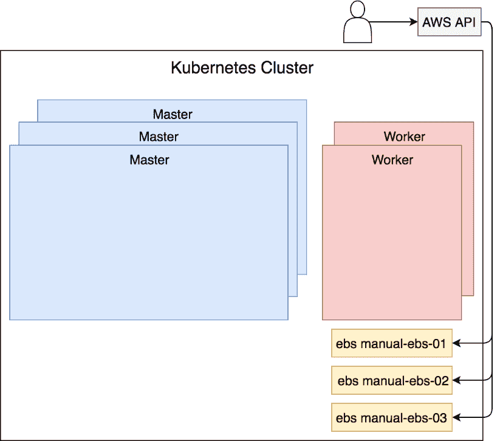
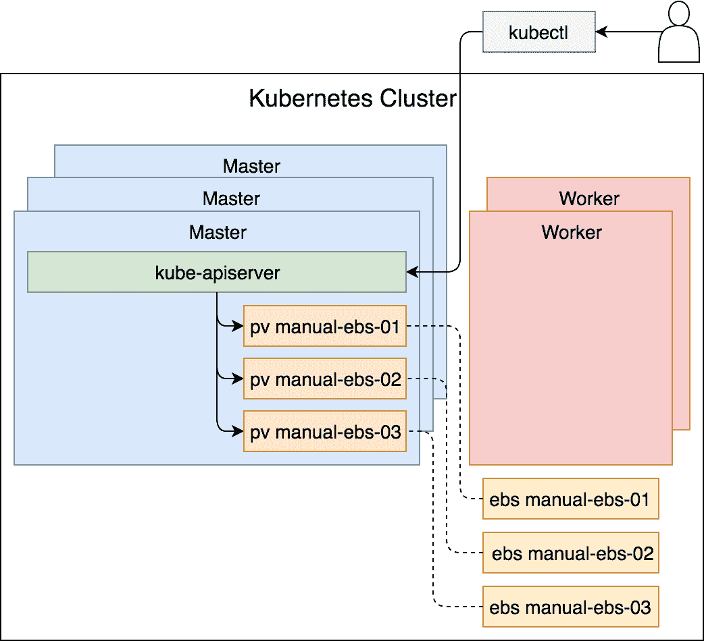
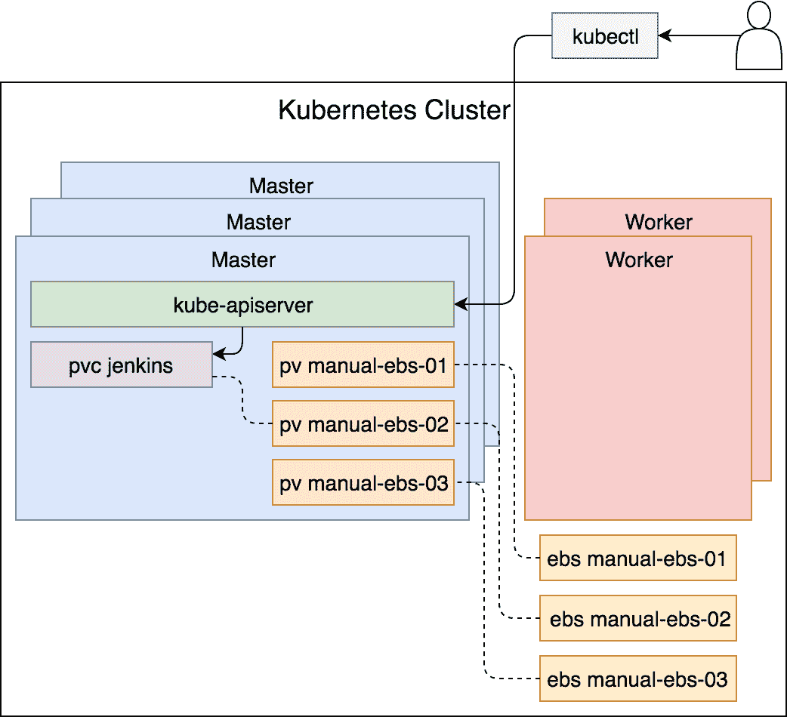
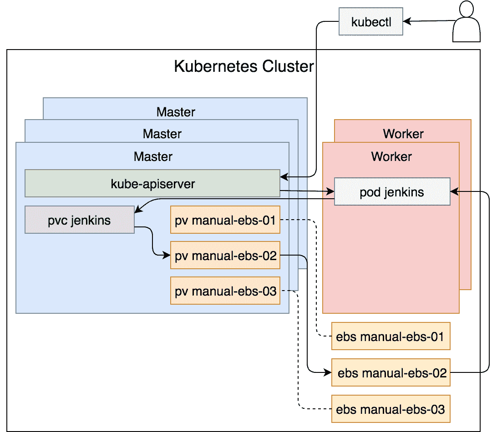
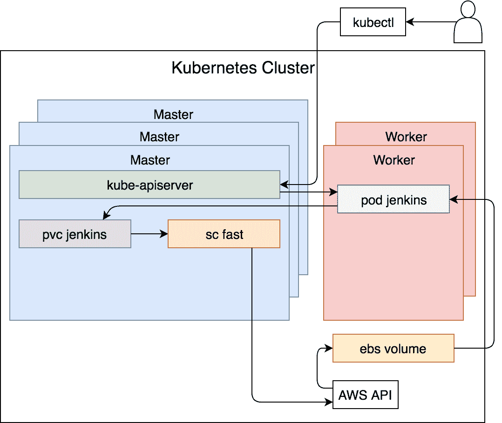

# 第十五章：持久化状态

如果在重新调度时丢失应用状态，那么无论我们有多高的容错能力和高可用性，都没有意义。拥有状态是不可避免的，我们需要无论发生什么，始终保存它，不论是应用程序、服务器，甚至整个数据中心。

保存应用状态的方式取决于它们的架构。一些应用将数据存储在内存中，并依赖于定期备份。其他应用能够在多个副本之间同步数据，因此一个副本的丢失不会导致数据丢失。然而，大多数应用依赖于磁盘来存储它们的状态。我们将重点关注这一类有状态的应用。

如果我们要构建容错系统，就需要确保系统任何部分的故障都能恢复。由于速度至关重要，我们不能依赖手动操作来从故障中恢复。即使我们能做到，也没有人愿意坐在屏幕前，等待某些东西发生故障，然后再把它恢复到先前的状态。

我们已经看到，Kubernetes 在大多数情况下会从应用程序、服务器，甚至整个数据中心的故障中恢复。它会将 Pods 重新调度到健康节点。我们也体验过 AWS 和 kops 在基础设施层面上实现大致相同效果的方式。自动扩展组会重新创建故障节点，且由于它们使用 kops 启动过程进行配置，新的实例会拥有所需的所有内容，并加入集群。

唯一阻止我们称系统（大多数情况下）具备高可用性和容错性的是我们没有解决在故障发生时如何保持状态的问题。这也是我们接下来将要探讨的主题。

无论我们的有状态应用程序或其运行的服务器发生什么，我们都会尽力保留我们的数据。

# 创建 Kubernetes 集群

我们将通过重新创建与上一章相似的集群开始：

本章中的所有命令可以在 [`15-pv.sh`](https://gist.github.com/41c86eb385dfc5c881d910c5e98596f2) ([`gist.github.com/vfarcic/41c86eb385dfc5c881d910c5e98596f2`](https://gist.github.com/vfarcic/41c86eb385dfc5c881d910c5e98596f2)) Gist 中找到。

```
cd k8s-specs

git pull

cd cluster  
```

我们进入了 `k8s-specs` 仓库的本地副本，拉取了最新的代码，并进入了 `cluster` 目录。

在上一章中，我们将使用的环境变量存储在 `kops` 文件中。让我们快速看一下它们。

```
cat kops  
```

输出结果（不包括密钥）如下：

```
export AWS_ACCESS_KEY_ID=...
export AWS_SECRET_ACCESS_KEY=...
export AWS_DEFAULT_REGION=us-east-2
export ZONES=us-east-2a,us-east-2b,us-east-2c
export NAME=devops23.k8s.local
export KOPS_STATE_STORE=s3://devops23-1520933480  
```

通过将环境变量存储在文件中，我们可以通过 `source` 命令快速加载它们，从而加速该过程。

在书籍的早期版本中，我们用于存储环境变量到 `kops` 文件的命令存在错误。`export` 命令缺失。请确保你文件中的所有行都以 `export` 开头。如果不是这种情况，请相应地更新它。

```
source kops  
```

现在环境变量已设置好，我们可以继续创建`S3`存储桶：

```
export BUCKET_NAME=devops23-$(date +%s)

aws s3api create-bucket \ 
 --bucket $BUCKET_NAME \
 --create-bucket-configuration \
 LocationConstraint=$AWS_DEFAULT_REGION

export KOPS_STATE_STORE=s3://$BUCKET_NAME  
```

创建`kops`别名的命令如下。只有**Windows 用户**执行此命令：

```
alias kops="docker run -it --rm \
 -v $PWD/devops23.pub:/devops23.pub \
 -v $PWD/config:/config \
 -e KUBECONFIG=/config/kubecfg.yaml \
 -e NAME=$NAME -e ZONES=$ZONES \
 -e AWS_ACCESS_KEY_ID=$AWS_ACCESS_KEY_ID \
 -e AWS_SECRET_ACCESS_KEY=$AWS_SECRET_ACCESS_KEY \
 -e KOPS_STATE_STORE=$KOPS_STATE_STORE \
 vfarcic/kops"  
```

现在，我们终于可以在 AWS 中创建一个新的 Kubernetes 集群了。

```
kops create cluster \
 --name $NAME \
 --master-count 3 \
 --master-size t2.small \
 --node-count 2 \
 --node-size t2.medium \
 --zones $ZONES \
 --master-zones $ZONES \
 --ssh-public-key devops23.pub \
 --networking kubenet \
  --yes  
```

如果我们将此命令与上一章执行的命令进行比较，会发现只有几个小变化。我们将`node-count`增加到`2`，`node-size`增大为`t2.medium`。这将为我们提供足够的容量，以应对本章中的所有练习。

让我们验证集群：

```
kops validate cluster  
```

假设在我们执行`kops create cluster`后已经过了一段时间，输出应表明`cluster devops23.k8s.local is ready`。

给 Windows 用户的提示

Kops 在容器内执行。它改变了容器内的上下文，但现在上下文已消失。结果，你本地的`kubectl`上下文保持不变。我们可以通过执行`kops export kubecfg --name ${NAME}`和`export KUBECONFIG=$PWD/config/kubecfg.yaml`来解决这个问题。第一个命令将配置导出到`/config/kubecfg.yaml`。该路径通过环境变量`KUBECONFIG`指定，并被挂载为本地硬盘上的`config/kubecfg.yaml`。后一个命令将在本地导出`KUBECONFIG`。通过这个变量，`kubectl`现在会使用`config/kubecfg.yaml`中的配置，而不是默认配置。在你执行这些命令之前，请给 AWS 一些时间来创建所有 EC2 实例，并让它们加入集群。等待并执行这些命令后，一切就绪。

如果我们希望访问将要部署的应用程序，我们将需要 Ingress。

```
kubectl create \
 -f https://raw.githubusercontent.com/kubernetes/kops/master/addons/ingress-nginx/v1.6.0.yaml

```

如果没有 ELB DNS，Ingress 对我们帮助不大，所以我们也需要获取 ELB DNS：

```
CLUSTER_DNS=$(aws elb \
 describe-load-balancers | jq -r \
 ".LoadBalancerDescriptions[] \
 | select(.DNSName \
 | contains (\"api-devops23\") \
 | not).DNSName")

echo $CLUSTER_DNS  
```

后一个命令的输出应该以`us-east-2.elb.amazonaws.com`结尾。

最后，既然集群设置已经完成，我们可以回到仓库根目录。

```
cd ..  
```

# 部署无状态持久化的状态应用

我们将通过部署一个没有任何持久化机制的状态应用程序来开始探索。这将帮助我们更好地理解在本章中使用的一些 Kubernetes 概念和资源的好处。

我们已经部署过几次 Jenkins。由于它是一个有状态的应用程序，非常适合用作实验平台。

让我们看一下存储在`pv/jenkins-no-pv.yml`文件中的定义。

```
cat pv/jenkins-no-pv.yml  
```

YAML 定义了`jenkins`命名空间、Ingress 控制器和服务。我们已经熟悉这些资源类型，因此跳过解释，直接进入 Deployment 定义。

`cat`命令的输出，限定为`jenkins`部署，如下所示：

```
...
apiVersion: apps/v1beta2
kind: Deployment
metadata:
 name: Jenkins
      namespace: Jenkins
    spec:
      selector:
        matchLabels:
          app: Jenkins
      strategy:
        type: Recreate
      template:
        metadata:
          labels:
            app: Jenkins
        spec:
          containers:
          - name: Jenkins
            image: vfarcic/Jenkins
            env:
            - name: JENKINS_OPTS
              value: --prefix=/Jenkins
            volumeMounts:
            - name: jenkins-creds
              mountPath: /etc/secrets
            resources:
              limits:
                memory: 2Gi
                cpu: 1
              requests:
                memory: 1Gi
                cpu: 0.5
          volumes:
          - name: jenkins-creds
            secret:
              secretName: jenkins-creds
```

这个部署没有什么特别的地方。我们已经使用过非常类似的部署。此外，到现在为止，你已经是部署控制器的专家了。

唯一值得一提的是，只有一个卷挂载，它引用了我们用来为 Jenkins 提供初始管理员用户的秘密。Jenkins 将其状态保存在 `/var/jenkins_home` 中，而我们没有挂载该目录。

让我们创建在 `pv/jenkins-no-pv.yml` 中定义的资源：

```
kubectl create \
 -f pv/jenkins-no-pv.yml \
 --record --save-config  
```

输出如下：

```
namespace "jenkins" created
ingress "jenkins" created
service "jenkins" created
deployment "jenkins" created  
```

我们将快速查看事件，作为检查一切是否成功部署的方式：

```
kubectl --namespace jenkins \
 get events
```

输出（仅限相关部分）如下：

```
...
2018-03-14 22:36:26 +0100 CET   2018-03-14 22:35:54 +0100 CET   7         jenkins-8768d486-lmv6b.151be70fd682e40d   Pod                 Warning   FailedMount  kubelet, ip-172-20-99-208.us-east-2.compute.internal   MountVolume.SetUp 
 failed for volume "jenkins-creds" : secrets "jenkins-creds" not found
    ...
```

我们可以看到唯一的卷设置失败，因为它找不到作为 `jenkins-creds` 引用的秘密。让我们创建它：

```
kubectl --namespace jenkins \
 create secret \
 generic jenkins-creds \
 --from-literal=jenkins-user=jdoe \
 --from-literal=jenkins-pass=incognito  
```

现在，随着 `jenkins` 命名空间中创建的秘密 `jenkins-creds`，我们可以确认部署的发布成功。

```
kubectl --namespace jenkins \
 rollout status \
 deployment jenkins  
```

我们可以从输出中看到，`deployment "jenkins"` 已成功发布。

现在一切正常运行，我们可以在浏览器中打开 Jenkins 用户界面：

```
open "http://$CLUSTER_DNS/jenkins"
```

对 Windows 用户的说明

Git Bash 可能无法使用 `open` 命令。如果是这种情况，请将 `open` 命令替换为 `echo`。这样，你将得到应在你选择的浏览器中直接打开的完整地址。

请点击登录链接，输入 `jdoe` 作为用户，`incognito` 作为密码。完成后，点击登录按钮。

现在我们以 jdoe 管理员身份认证成功，我们可以继续创建一个任务。这将生成一个状态，我们可以用来探索有状态应用程序失败时会发生什么。

请点击创建新任务链接，输入 `my-job` 作为项目名称，选择管道作为任务类型，并点击确定按钮。

你将看到任务配置屏幕。这里无需做任何操作，因为我们目前并不关心任何特定的管道定义。只需点击保存按钮即可。

接下来，我们将通过终止 `jenkins` 部署中创建的 Pod 内运行的 `java` 进程来模拟一个故障。为了做到这一点，我们需要找出 Pod 的名称。

```
kubectl --namespace jenkins \
 get pods \
 --selector=app=jenkins \
 -o json  
```

我们从 `jenkins` 命名空间中获取了 Pods，使用选择器 `api=jenkins` 进行过滤，并将输出格式化为 `json`。

输出（仅限相关部分）如下：

```
{
 "apiVersion": "v1",
 "items": [
 {
 ...
 "metadata": {
 ...
 "name": "jenkins-8768d486-lmv6b",
 ...
```

我们可以看到名称位于某个 `items` 的 `metadata` 条目中。我们可以利用这一点来构建 `jsonpath`，仅提取 Pod 的名称：

```
POD_NAME=$(kubectl \
 --namespace jenkins \
 get pods \
 --selector=app=jenkins \
 -o jsonpath="{.items[*].metadata.name}")

echo $POD_NAME  
```

Pod 的名称现在存储在环境变量 `POD_NAME` 中。

后续命令的输出如下：

```
jenkins-8768d486-lmv6b  
```

现在我们知道了托管 Jenkins 的 Pod 名称，我们可以继续并终止 `java` 进程：

```
kubectl --namespace jenkins \
 exec -it $POD_NAME pkill java  
```

一旦我们终止了 Jenkins 进程，容器就失败了。从经验来看，我们知道 Pod 内部的失败容器会被重新创建。结果是，我们有一个短暂的停机时间，但 Jenkins 已经再次运行。

让我们看看之前创建的任务发生了什么。我相信你知道答案，但我们还是检查一下：

```
open "http://$CLUSTER_DNS/jenkins"  
```

如预期的那样，`my-job` 无法找到。托管 `/var/jenkins_home` 目录的容器失败了，并且被替换成了一个新的容器。我们创建的状态丢失了。

说实话，我们已经在 第八章，*使用卷访问主机文件系统* 中看到了我们可以挂载卷来尝试保持状态跨故障的情况。然而，过去我们使用的是 `emptyDir`，它挂载了一个本地卷。尽管比什么都不使用要好，但这种卷仅在存储它的服务器运行时存在。如果服务器发生故障，存储在 `emptyDir` 中的状态就会丢失。这样的解决方案仅比不使用任何卷稍好一些。通过使用本地磁盘，我们只是在推迟不可避免的故障，迟早我们会遇到同样的情况。最后我们会困惑于为什么在 Jenkins 中创建的所有内容都丢失了。我们可以做得更好。

# 创建 AWS 卷

如果我们希望保存即使在服务器故障后也能持久化的状态，我们有两个可选择的方案。例如，我们可以将数据存储在本地，并将其复制到多个服务器上。这样，容器可以使用本地存储，并确保文件在所有服务器上都能访问到。如果我们自己实现这一过程，配置起来会非常复杂。说实话，我们可以使用某些卷驱动程序来实现这一点。但我们会选择一种更常用的方法来确保状态在故障中持久化。我们将使用外部存储。

由于我们在 AWS 中运行我们的集群，我们可以在 [`S3`](https://aws.amazon.com/s3/) ([`aws.amazon.com/s3/`](https://aws.amazon.com/s3/))、[**弹性文件系统**（**EFS**)](https://aws.amazon.com/efs/) ([`aws.amazon.com/efs/`](https://aws.amazon.com/efs/)) 和 [**弹性块存储**](https://aws.amazon.com/ebs/) (**EBS**)([`aws.amazon.com/ebs/`](https://aws.amazon.com/ebs/)) 之间进行选择。

S3 是通过其 API 访问的，并不适合作为本地磁盘的替代品。因此，我们只剩下了 EFS 和 EBS 作为选择。

EFS 有一个显著的优势，它可以挂载到多个 EC2 实例，并跨多个可用区进行分布。它是我们能够实现的最接近容错存储的解决方案。即使整个可用区（数据中心）发生故障，我们仍然可以在集群所使用的其他可用区中使用 EFS。然而，这也带来了一定的成本。EFS 会引入性能惩罚。毕竟，它是一个 **网络文件系统**（**NFS**），这意味着它会带来更高的延迟。

**弹性块存储**（**EBS**）是我们在 AWS 中可以使用的最快存储。它的数据访问延迟非常低，因此在性能是主要关注点时，它是最佳选择。缺点是可用性。它不能跨多个可用区工作。如果某个区发生故障，意味着会有停机时间，至少直到该区恢复正常运行状态。

我们将选择 EBS 来满足我们的存储需求。Jenkins 强烈依赖 I/O，因此我们需要尽可能快速地访问数据。然而，选择 EBS 还有一个原因。EBS 完全支持 Kubernetes。EFS 将会推出，但在写作时，它仍处于实验阶段。作为一个额外的优势，EBS 比 EFS 便宜得多。

考虑到需求和 Kubernetes 提供的功能，选择显而易见。我们将使用 EBS，尽管如果 Jenkins 所在的可用区发生故障，我们可能会遇到问题。在这种情况下，我们需要将 EBS 卷迁移到一个健康的区域。没有完美的解决方案。

我们有些急于求成了。我们暂时搁置 Kubernetes，集中精力创建 EBS 卷。

每个 EBS 卷都与一个可用区绑定。与 EFS 不同，EBS 不能跨多个可用区。所以，我们首先需要做的是找出工作节点所在的区域。我们可以通过描述属于安全组 `nodes.devops23.k8s.local` 的 EC2 实例来获取这些信息。

```
aws ec2 describe-instances  
```

输出，限定为相关部分，如下：

```
{
 "Reservations": [
 {
 "Instances": [
 {
 ...
          "SecurityGroups": [
            {
              "GroupName": "nodes.devops23.k8s.local",
              "GroupId": "sg-33fd8c58"
            }
          ],
          ...
          "Placement": {
            "Tenancy": "default",
            "GroupName": "",
            "AvailabilityZone": "us-east-2a"
          },
          ...
```

我们可以看到信息位于 `Reservations.Instances` 数组中。要获取区域，我们需要通过 `SecurityGroups.GroupName` 字段筛选输出。区域名称位于 `Placement.AvailabilityZone` 字段中。

进行筛选并获取工作节点可用区的命令如下：

```
aws ec2 describe-instances \
 | jq -r \
 ".Reservations[].Instances[] \
 | select(.SecurityGroups[]\
 .GroupName==\"nodes.$NAME\")\
 .Placement.AvailabilityZone"  
```

输出如下：

```
us-east-2a
us-east-2c  
```

我们可以看到，两个工作节点位于区域 `us-east-2a` 和 `us-east-2c`。

检索两个工作节点区域并将其存储在环境变量中的命令如下：

```
aws ec2 describe-instances \
 | jq -r \
 ".Reservations[].Instances[] \
 | select(.SecurityGroups[]\
 .GroupName=="\nodes.$NAME\")\
 .Placement.AvailabilityZone" \
 | tee zones

AZ_1=$(cat zones | head -n 1)

AZ_2=$(cat zones | tail -n 1)  
```

我们检索了区域并将输出存储到 `zones` 文件中。接下来，我们用 `head` 命令检索了第一行并将其存储在环境变量 `AZ_1` 中。同样地，我们将最后一行（第二行）存储在变量 `AZ_2` 中。

现在我们拥有了创建几个卷所需的所有信息。

接下来的命令需要较新的 `aws` 版本。如果执行失败，请更新您的 AWS CLI 二进制文件到最新版本。

```
VOLUME_ID_1=$(aws ec2 create-volume \
 --availability-zone $AZ_1 \
 --size 10 \
 --volume-type gp2 \
 --tag-specifications "ResourceType=volume,Tags=[{Key=KubernetesCluster,Value=$NAME}]" \
 | jq -r '.VolumeId')

VOLUME_ID_2=$(aws ec2 create-volume \
 --availability-zone $AZ_1 \
 --size 10 \
 --volume-type gp2 \
 --tag-specifications "ResourceType=volume,Tags=[{Key=KubernetesCluster,Value=$NAME}]" \
    | jq -r '.VolumeId')

VOLUME_ID_3=$(aws ec2 create-volume \
    --availability-zone $AZ_2 \
    --size 10 \
    --volume-type gp2 \
    --tag-specifications "ResourceType=volume,Tags=[{Key=KubernetesCluster,Value=$NAME}]" \
 | jq -r '.VolumeId')
```

我们执行了三次 `aws ec2 create-volume` 命令，结果创建了三个 EBS 卷。两个在同一区域，第三个在另一区域。它们的空间都是 `10` GB。我们选择了 `gp2` 作为卷类型。其他类型要么需要更大的大小，要么更贵。若有疑问，`gp2` 通常是 EBS 卷的最佳选择。

我们还定义了一个标签，用于帮助我们区分专门为该集群分配的卷与我们在 AWS 账户中为其他用途可能拥有的卷。

最后，`jq` 筛选了输出，只提取了卷 ID。结果存储在环境变量 `VOLUME_ID_1`、`VOLUME_ID_2` 和 `VOLUME_ID_3` 中。

让我们快速查看一下我们作为环境变量存储的其中一个 ID：

```
echo $VOLUME_ID_1  
```

输出如下：

```
vol-092b8980b1964574a  
```

最后，为了安全起见，我们将列出与 ID 匹配的卷，从而毫无疑问地确认 EBS 确实已创建。

```
aws ec2 describe-volumes \
 --volume-ids $VOLUME_ID_1  
```

输出结果如下：

```
{
 "Volumes": [
 {
 "AvailabilityZone": "us-east-2c",
 "Attachments": [],
 "Tags": [
 {
 "Value": "devops23.k8s.local",
 "Key": "KubernetesCluster"
 }
 ],
 "Encrypted": false,
 "VolumeType": "gp2",
 "VolumeId": "vol-092b8980b1964574a",
 "State": "available",
 "Iops": 100,
 "SnapshotId": "",
 "CreateTime": "2018-03-14T21:47:13.242Z",
 "Size": 10
 }
 ]
}  
```

现在 EBS 卷确实是 `available` 并且与工作节点位于同一可用区，我们可以继续创建 Kubernetes 持久化卷。



图 15-1：在与工作节点相同的可用区中创建的 EBS 卷

# 创建 Kubernetes 持久化卷

我们有几个 EBS 卷可用，但这并不意味着 Kubernetes 知道它们的存在。我们需要添加 PersistentVolumes，它们将作为 Kubernetes 集群与 AWS EBS 卷之间的桥梁。

PersistentVolumes 使我们能够抽象存储提供的细节（例如 EBS）与如何使用存储的细节。就像 Volumes 一样，PersistentVolumes 是 Kubernetes 集群中的资源。主要的区别是它们的生命周期独立于使用它们的单个 Pod。

让我们来看一个定义，它将创建一些 PersistentVolumes：

```
cat pv/pv.yml  
```

输出结果，限于三卷中的第一卷，具体如下：

```
kind: PersistentVolume
apiVersion: v1
metadata:
 name: manual-ebs-01
 labels:
 type: ebs
spec:
 storageClassName: manual-ebs
 capacity:
 storage: 5Gi
 accessModes:
 - ReadWriteOnce
 awsElasticBlockStore:
 volumeID: REPLACE_ME_1
 fsType: ext4
...  
```

`spec` 部分包含了一些有趣的细节。我们将 `manual-ebs` 设置为存储类名称。稍后我们将了解它的功能。目前，只需要记住这个名称。

我们定义了存储容量为 `5Gi`。它不需要与我们之前创建的 EBS 容量相同，只要不大于即可。Kubernetes 会尽量匹配 `PersistentVolume` 和容量相似的 EBS，在这种情况下，容量相同或类似的 EBS。如果我们只有一个 10 GB 的 EBS 卷，它就是 `5Gi` 请求的最接近（也是唯一）匹配。理想情况下，持久卷的容量应与 EBS 大小匹配，但我想展示任何小于或等于实际大小的值都能满足要求。

我们指定了访问模式为 `ReadWriteOnce`。这意味着我们将能够以只读写一次的方式挂载卷。任何时候只有一个 Pod 能够使用它。由于 EBS 不能挂载到多个实例，这种策略对我们非常适合。我们选择的访问模式不算真正的选择，而是对 EBS 工作方式的确认。其他访问模式是 `ReadOnlyMany` 和 `ReadWriteMany`。这两种模式会导致卷可以挂载到多个 Pod，分别以只读或读写模式。这些模式更适合像 EFS 这样的 NFS 系统，后者可以被多个实例挂载。

到目前为止，我们探讨过的`spec`字段是所有持久卷类型通用的。除此之外，还有一些条目是特定于我们与 Kubernetes `PersistentVolume`关联的实际卷的。由于我们将使用 EBS，因此我们指定了`awsElasticBlockStore`，并提供了卷 ID 和文件系统类型。由于我无法提前知道您 EBS 卷的 ID，所以在定义中将其值设置为`REPLACE_ME`。稍后我们将用之前创建的 EBS 的 ID 来替换它。

我们本来可以指定许多其他类型。如果这个集群运行在 Azure 上，我们可以使用`azureDisk`或`azureFile`。在**Google Compute Engine**（**GCE**）中，它将是`GCEPersistentDisk`。我们也可以设置`Glusterfs`。或者，如果我们把这个集群运行在本地数据中心，可能会使用`nfs`。我们可以使用的类型还有很多，但由于我们在 AWS 上运行集群，许多类型将无法使用，而其他一些可能会设置起来太复杂。由于 EBS 已经可用，我们就选择它吧。总的来说，这个集群运行在 AWS 上，而`awsElasticBlockStore`是最简单的，若不是最好的选择。

现在我们已经理解了 YAML 定义，我们可以继续创建`PersistentVolume`：

```
cat pv/pv.yml \
 | sed -e \
 "s@REPLACE_ME_1@$VOLUME_ID_1@g" \
 | sed -e \
 "s@REPLACE_ME_2@$VOLUME_ID_2@g" \
 | sed -e \
 "s@REPLACE_ME_3@$VOLUME_ID_3@g" \
 | kubectl create -f - \
 --save-config --record  
```

我们使用`cat`命令输出`pv/pv.yml`文件的内容，并将其管道传输到`sed`命令，这些命令又将`REPLACE_ME_*`字符串替换为我们之前创建的 EBS 卷的 ID。结果被传递给`kubectl create`命令，后者创建了持久卷。从输出结果可以看到，所有三个 PersistentVolume 都已创建。

让我们来看一下当前在集群中可用的持久卷。

```
kubectl get pv  
```

输出如下：

```
NAME          CAPACITY ACCESS MODES RECLAIM POLICY STATUS    CLAIM STORAGECLASS REASON AGE
manual-ebs-01 5Gi      RWO          Retain         Available       manual-ebs          11s
manual-ebs-02 5Gi      RWO          Retain         Available       manual-ebs          11s
manual-ebs-03 5Gi      RWO          Retain         Available       manual-ebs          11s
```

不足为奇的是，我们有三个卷：

我们看到的有趣部分是状态信息。持久卷是`可用的`。我们已经创建了它们，但没有人使用它们。它们只是静静地等待某人来声明它们。



图 15-2：与 EBS 卷关联的 Kubernetes 持久卷

# 声明持久卷

如果没有人使用它们，Kubernetes 持久卷是没有用的。它们仅作为与特定 EBS 卷相关的对象存在。它们在等待通过`PersistentVolumeClaim`资源来声明它们。

就像可以请求特定资源（如内存和 CPU）的 Pod 一样，`PersistentVolumeClaims`也可以请求特定的大小和访问模式。尽管它们的类型不同，但两者从某种程度上来说都在消耗资源。就像 Pod 不应指定在哪个节点上运行一样，`PersistentVolumeClaims`也不能定义应挂载哪个卷。相反，Kubernetes 调度器将根据请求的资源为它们分配一个卷。

我们将使用`pv/pvc.yml`来探讨如何声明一个持久卷：

```
cat pv/pvc.yml 
```

输出如下：

```
kind: PersistentVolumeClaim
apiVersion: v1
metadata:
 name: jenkins
 namespace: jenkins
spec:
 storageClassName: manual-ebs
 accessModes:
 - ReadWriteOnce
 resources:
 requests:
 storage: 1Gi  
```

YAML 文件定义了一个存储类名称为 `manual-ebs` 的 `PersistentVolumeClaim`。这与我们之前创建的持久卷 `manual-ebs-*` 使用的存储类相同。访问模式和存储请求也与我们为持久卷定义的内容匹配。

请注意，我们没有指定要使用哪个卷。相反，这个声明指定了一组属性（`storageClassName`、`accessModes` 和 `storage`）。系统中任何符合这些规格的卷都可能被名为`jenkins`的`PersistentVolumeClaim`声明。请记住，`resources`不必完全匹配。任何具有相同或更大存储量的卷都被视为匹配。对于`1Gi`的请求可以转化为*至少 1Gi*。在我们的案例中，`1Gi`的请求匹配所有三个持久卷，因为它们的存储量被设置为`5Gi`。

现在我们已经探讨了声明的定义，我们可以继续并创建它：

```
kubectl create -f pv/pvc.yml \
 --save-config --record  
```

输出显示 `persistentvolumeclaim "jenkins" 已创建`。

让我们列出这些声明，看看我们得到了什么：

```
kubectl --namespace jenkins \
 get pvc  
```

输出如下：

```
NAME    STATUS VOLUME        CAPACITY ACCESS MODES STORAGECLASS AGE
jenkins Bound  manual-ebs-02 5Gi      RWO          manual-ebs   17s  
```

我们从输出中看到，声明的状态是`Bound`。这意味着声明找到了匹配的持久卷并将其绑定。我们可以通过列出卷来确认这一点：

```
kubectl get pv  
```

输出如下：

```
NAME          CAPACITY ACCESS MODES RECLAIM POLICY STATUS    CLAIM           STORAGECLASS REASON AGE
manual-ebs-01 5Gi      RWO          Retain         Available                 manual-ebs          7m
manual-ebs-02 5Gi      RWO          Retain         Bound     jenkins/jenkins manual-ebs          7m
manual-ebs-03 5Gi      RWO          Retain         Available                 manual-ebs          7m

```

我们可以看到，其中一个卷（`manual-ebs-02`）将状态从`Available`更改为`Bound`。这就是我们刚刚创建的索赔所绑定的卷。我们可以看到，该索赔来自`jenkins`命名空间和`jenkins``PersistentVolumeClaim`。



图 15-3：持久卷声明的创建

请注意，如果 `PersistentVolumeClaim` 无法找到匹配的卷，它将会永远处于未绑定状态，除非我们添加一个符合规格的新持久卷。

我们仍然没有达到我们的目标。声明一个卷并不意味着任何人都会使用它。另一方面，我们的 Jenkins 需要持久化它的状态。我们将把`PersistentVolumeClaim`与 Jenkins 容器关联起来。

# 将已声明的卷附加到 Pods

```
cat pv/jenkins-pv.yml  
```

输出的相关部分如下：

```
...
apiVersion: apps/v1beta2
kind: Deployment
metadata:
 name: jenkins
 namespace: jenkins
spec:
 ...
 template:
 ...
 spec:
 containers:
 - name: jenkins
 ...
 volumeMounts:
 - name: jenkins-home
 mountPath: /var/jenkins_home
 ...
 volumes:
 - name: jenkins-home
 persistentVolumeClaim:
 claimName: jenkins
 ...  
```

你会注意到，这次我们添加了一个新的卷 `jenkins-home`，它引用了名为 `jenkins` 的 `PersistentVolumeClaim`。从容器的角度来看，声明就是一个卷。

让我们部署 Jenkins 资源，并确认一切按预期工作。

```
kubectl apply \
 -f pv/jenkins-pv.yml \
 --record  
```

输出如下：

```
namespace "jenkins" configured
ingress "jenkins" configured
service "jenkins" configured
deployment "jenkins" configured  
```

我们将等到部署完成后，再进行一个测试，确认 Jenkins 的状态现在已经被持久化。

```
kubectl --namespace jenkins \
 rollout status \
 deployment jenkins  
```

一旦部署完成，我们将看到一条消息，表示 `deployment "jenkins"` 已成功滚动部署。

我们发送了一个请求到 Kubernetes API 来创建一个 Deployment。结果，我们得到了一个`ReplicaSet`，它进一步创建了`jenkins` Pod。它挂载了`PersistentVolumeClaim`，该声明绑定到`PersistenceVolume`，后者与 EBS 卷相关联。结果，EBS 卷被挂载到运行在 Pod 中的`jenkins`容器。

图 15-4 的简化版本显示了事件序列。



图 15-4：事件序列始于请求创建一个具有 PersistentVolumeClaim 的 Jenkins Pod

1.  我们执行了`kubectl`命令

1.  `kubectl`向`kube-apiserver`发送了一个请求，以创建`pv/jenkins-pv.yml`中定义的资源

1.  `jenkins` Pod 是在一个工作节点上创建的

1.  由于 Pod 中的`jenkins`容器具有`PersistentVolumeClaim`，它将其挂载为逻辑卷

1.  PersistentVolumeClaim 已经绑定到一个 PersistentVolume

1.  PersistentVolume 与一个 EBS 卷相关联

1.  EBS 卷作为物理卷被挂载到`jenkins` Pod

现在 Jenkins 已经启动运行，我们将执行与之前类似的一套步骤，并验证状态是否在故障时得到了保留。

```
open "http://$CLUSTER_DNS/jenkins"  
```

我们打开了 Jenkins 主屏幕。如果您没有通过身份验证，请点击“登录”链接，并输入`jdoe`作为用户名和`**incognito*`作为密码。点击登录按钮。

你会看到一个创建新作业的链接。点击它。将`my-job`输入为项目名称，选择`Pipeline`作为作业类型，然后点击“确定”按钮。一旦进入作业配置屏幕，我们只需点击“保存”按钮。一个空作业足以测试持久性。

现在我们需要找出通过`jenkins` Deployment 创建的 Pod 的名称。

```
POD_NAME=$(kubectl \
 --namespace jenkins \
 get pod \
 --selector=app=jenkins \
 -o jsonpath="{.items[*].metadata.name}")
```

通过环境变量`POD_NAME`存储的 Pod 名称，我们可以继续并终止运行 Jenkins 的`java`进程。

```
kubectl --namespace jenkins \
 exec -it $POD_NAME pkill java  
```

我们杀死了 Jenkins 进程，从而模拟容器的故障。结果，Kubernetes 检测到故障并重新创建了容器。

一分钟后，我们可以再次打开 Jenkins 主屏幕，并检查状态（我们创建的作业）是否被保留。

```
open "http://$CLUSTER_DNS/jenkins"  
```

如您所见，作业仍然可用，从而证明我们成功地将 EBS 卷挂载为 Jenkins 保存其状态的目录。

如果我们不销毁容器，而是终止运行 Pod 的服务器，从功能角度来看，结果是一样的。Pod 将重新调度到一个健康的节点。Jenkins 会重新启动，并从 EBS 卷恢复其状态。或者，至少我们希望是这样。然而，在我们的集群中，不能保证会发生这样的行为。

我们只有两个工作节点，分布在两个（从三个中选择）可用区。如果托管 Jenkins 的节点发生故障，我们将只剩下一个节点。更准确地说，直到自动扩展组检测到缺少 EC2 实例并重新创建它，我们只会有一个工作节点在集群中运行。在这几分钟内，我们剩下的唯一节点并不在同一区域。如前所述，每个 EBS 实例都绑定到一个区域，而我们挂载到 Jenkins Pod 的 EBS 实例不会与另一个 EC2 实例所在的区域关联。因此，PersistentVolume 无法重新绑定 EBS 卷，导致故障的容器无法重建，直到故障的 EC2 实例被重建。

新的 EC2 实例可能不会和故障服务器所在的区域处于同一区域。因为我们使用了三个可用区，其中一个已包含 EC2 实例，AWS 会在其他两个可用区中的一个重建故障服务器。我们有 50% 的机会，新的 EC2 实例会和故障服务器所在的区域在同一可用区。这并不是一个理想的概率。

在实际的场景中，我们可能会有超过两个工作节点。即使只是稍微增加到三个节点，也会大大增加故障服务器在同一区域重建的机会。自动扩展组会尽可能地在所有可用区之间均衡分配 EC2 实例，但这并不能保证一定会发生。一个合理的最小工作节点数是六个。

我们的服务器越多，集群具有容错能力的机会就越大。特别是当我们托管有状态应用时，这一点尤为重要。事实上，我们几乎肯定有这些应用。几乎没有系统是没有某种形式的状态的。

如果更多的服务器更好，那么如果我们的系统较小并且需要，比如说，不到六台服务器时，我们可能会处于一个复杂的情况。在这种情况下，我建议使用更小的虚拟机。例如，如果你打算使用三台 `t2.xlarge` 的 EC2 实例作为工作节点，你可以重新考虑并改用六台 `t2.large` 的服务器。当然，更多的节点意味着在操作系统、Kubernetes 系统 Pod 和一些其他方面会有更多的资源开销。然而，我相信这种开销会通过集群的更高稳定性得到补偿。

还有一种情况可能会遇到。整个可用区（数据中心）可能会出现故障。Kubernetes 会继续正常运行。它将只有两个而不是三个主节点，故障的工作节点将在健康的区域重新创建。然而，我们的有状态服务将遇到问题。Kubernetes 无法重新调度那些挂载到故障区 EBS 卷的服务。我们需要等待可用区恢复在线，或者需要手动将 EBS 卷移到健康区。很有可能在这种情况下，EBS 将不可用，因此无法迁移。

我们可以创建一个过程，在多个可用区之间实时（接近）复制 EBS 卷中的数据，但这也有一个缺点。这样的操作会非常昂贵，而且在一切正常运作时，可能会减慢状态的恢复。我们是否应该选择较低的性能而换取更高的可用性？增加的运营开销是否值得？这些问题的答案因具体场景而异。

还有另一种选择。我们可以使用[EFS](https://aws.amazon.com/efs/) ([`aws.amazon.com/efs/`](https://aws.amazon.com/efs/))替代 EBS。但是，这也会影响性能，因为 EFS 通常比 EBS 慢。除此之外，Kubernetes 目前并不支持生产就绪的 EFS。在写这篇文章时，EFS provisioner ([`github.com/kubernetes-incubator/external-storage/tree/master/aws/efs`](https://github.com/kubernetes-incubator/external-storage/tree/master/aws/efs))仍处于测试阶段。到你读这篇文章时，情况可能已经有所变化，或者可能没有变化。即使*efs provisioner*稳定下来，它仍然是比 EBS 更慢且更贵的解决方案。

也许你会决定放弃 EBS（和 EFS），转而选择其他类型的持久存储。你可以选择许多不同的选项。我们不会深入探讨这些选项，因为对所有流行方案的深入比较需要更多的篇幅，而我们剩余的篇幅有限。可以将它们视为一个高级话题，下一本书会讲解。或者也许不会。我还不清楚*The DevOps 2.4 Toolkit*一书的具体范围。

总的来说，每种解决方案都有优缺点，且没有一种能适用于所有场景。无论好坏，我们将继续使用 EBS，直到本书结束。

回到与 EBS 绑定的 PersistentVolumes…

现在，我们已经探索了如何管理静态持久卷，我们将尝试使用动态方法实现相同的结果。但在此之前，我们先来看看当我们创建的一些资源被删除时会发生什么。

让我们删除`jenkins`部署。

```
kubectl --namespace jenkins delete \
 deploy jenkins  
```

输出显示我们`deployment "jenkins"已被删除`。

PersistentVolumeClaim 和 PersistentVolume 发生了什么事情吗？

```
kubectl --namespace jenkins get pvc

kubectl get pv  
```

两个命令的合并输出如下：

```
NAME    STATUS VOLUME        CAPACITY ACCESS MODES STORAGECLASS   AGE
jenkins Bound  manual-ebs-02 5Gi      RWO          manual-ebs     57s

NAME          CAPACITY ACCESS MODES RECLAIM POLICY STATUS    CLAIM           STORAGECLASS REASON AGE
manual-ebs-01 5Gi      RWO          Retain         Available jenkins/jenkins manual-ebs          10m
manual-ebs-02 5Gi      RWO          Retain         Bound     jenkins/jenkins manual-ebs          10m
manual-ebs-03 5Gi      RWO          Retain         Available jenkins/jenkins manual-ebs          10m
```

即使我们删除了 Jenkins 部署，并且删除了使用该声明的 Pod，PersistentVolumeClaim 和 PersistentVolumes 仍然保持不变。`manual-ebs-01`卷仍然绑定到`jenkins`声明。

如果我们删除 PersistentVolumeClaim `jenkins`，会发生什么？

```
kubectl --namespace jenkins \
 delete pvc jenkins  
```

输出显示`persistentvolumeclaim "jenkins"已被删除`。

现在，让我们来看一下 PersistentVolumes 的情况：

```
kubectl get pv  
```

输出如下：

```
NAME          CAPACITY ACCESS MODES RECLAIM POLICY STATUS   CLAIM          STORAGECLASS REASON AGE
manual-ebs-01 5Gi      RWO          Retain         Available jenkins/jenkins manual-ebs          10m
manual-ebs-02 5Gi      RWO          Retain         Released  jenkins/jenkins manual-ebs          10m
manual-ebs-03 5Gi      RWO          Retain         Available jenkins/jenkins manual-ebs          10m
```

这一次，`manual-ebs-2`卷已被`Released`。

这是一个很好的时机，来解释我们创建的 PersistentVolumes 所应用的`Retain`策略。

`ReclaimPolicy`定义了一个卷在从其声明中释放后应该如何处理。该策略在我们删除绑定到`manual-ebs-02`的 PersistentVolumeClaim 时就已经应用。当我们创建 PersistentVolumes 时，我们没有指定`ReclaimPolicy`，所以这些卷被分配了默认的`Retain`策略。

`Retain`回收策略强制手动回收资源。当 PersistentVolumeClaim 被删除时，PersistentVolume 仍然存在，并且该卷被认为是`released`（已释放）。但它尚未对其他声明可用，因为先前声明者的数据仍然保留在该卷上。在我们的例子中，这些数据就是 Jenkins 的状态。如果我们希望这个 PersistentVolume 变得可用，我们需要删除 EBS 卷上的所有数据。

由于我们在 AWS 中运行集群，删除资源比回收资源更容易，因此我们将删除已释放的 PersistentVolume，而不是尝试清理我们在 EBS 中生成的所有内容。实际上，我们将删除所有的卷，因为我们即将探索如何动态地实现相同的效果。

另外两种回收策略是`Recycle`和`Delete`。`Recycle`被认为已经弃用，所以我们不会浪费时间来解释它。`Delete`策略需要动态配置，但我们会推迟解释，直到我们探讨该主题。

让我们删除一些内容：

```
kubectl delete -f pv/pv.yml 
```

输出如下：

```
persistentvolume "manual-ebs-01" deleted
persistentvolume "manual-ebs-02" deleted
persistentvolume "manual-ebs-03" deleted 
```

我们可以看到所有三个 PersistentVolumes 都被删除了。然而，只有 Kubernetes 资源被移除。我们仍然需要手动删除 EBS 卷。

如果你进入 AWS 控制台，你会看到所有三个 EBS 卷现在处于`available`状态，等待挂载。我们将删除它们：

```
aws ec2 delete-volume \
 --volume-id $VOLUME_ID_1

aws ec2 delete-volume \
 --volume-id $VOLUME_ID_2

aws ec2 delete-volume \
 --volume-id $VOLUME_ID_3
```

我们已经完成了对手动创建持久卷的巡回讲解。如果我们采用这种卷管理方式，集群管理员需要确保始终有额外的可用卷供新的声明使用。这是一个繁琐的工作，往往会导致拥有比实际需要更多的卷。另一方面，如果我们没有足够的可用（未使用）卷，我们就有可能面临某个声明无法找到合适的卷进行挂载的风险。

手动卷管理有时是不可避免的，特别是当你选择使用本地基础设施结合 NFS 时。然而，这不是我们的情况。AWS 的核心就是动态资源配置，我们将充分利用这一点。

# 使用存储类动态配置持久卷

到目前为止，我们使用了静态的 PersistentVolumes。我们必须手动创建 EBS 卷和 Kubernetes PersistentVolumes。只有当两者都可用时，我们才能部署挂载这些卷的 Pod，通过 PersistentVolumeClaims 进行挂载。我们将这个过程称为静态卷配置。

在某些情况下，静态卷配置是必要的。我们的基础设施可能无法创建动态卷。这通常出现在基于 NFS 的本地基础设施中。即便如此，通过使用一些工具、改变流程以及选择合适的支持卷类型，我们通常可以达到动态配置卷的效果。不过，这在遗留流程和基础设施中可能仍然是一个挑战。

由于我们的集群在 AWS 中，我们不能将手动配置卷归咎于遗留的基础设施。事实上，我们本可以直接进入这一部分。毕竟，AWS 就是为了动态基础设施管理而存在的。然而，我认为通过首先探索手动配置，会更容易理解这些过程。到目前为止我们获得的知识将帮助我们更好地理解接下来要做的事情。开始手动配置的第二个原因是我无法预测你的计划。也许你会在必须是静态的基础设施上运行 Kubernetes 集群。即使我们在示例中使用的是 AWS，但到目前为止你所学到的所有内容也可以在静态基础设施上实现。你只需要将 EBS 替换为 NFS，并参考 NFSVolumeSource（[`v1-9.docs.kubernetes.io/docs/reference/generated/kubernetes-api/v1.9/#nfsvolumesource-v1-core`](https://v1-9.docs.kubernetes.io/docs/reference/generated/kubernetes-api/v1.9/#nfsvolumesource-v1-core)）文档。NFS 特定的字段只有三个，所以你应该能很快上手。

在我们讨论如何启用动态持久卷配置之前，我们应该理解，只有当没有静态的 PersistentVolumes 匹配我们的声明时，才会使用动态配置。换句话说，Kubernetes 总是优先选择静态创建的 PersistentVolumes，而不是动态的。

动态卷配置允许我们按需创建存储。我们可以在资源请求时自动配置存储，而不是手动预配置存储。

我们可以通过使用来自 `storage.k8s.io` API 组的 StorageClasses 来启用动态供给。它们允许我们描述可以声明的存储类型。一方面，集群管理员可以根据存储类型创建任意数量的 StorageClasses。另一方面，集群的用户无需担心每个外部存储的细节。这是一个双赢的局面，管理员不需要预先创建 PersistentVolumes，而用户只需声明他们需要的存储类型。

为了启用动态供给，我们需要创建至少一个 StorageClass 对象。幸运的是，kops 已经设置了一些，我们不妨看看目前集群中可用的 StorageClasses：

```
kubectl get sc  
```

输出如下：

```
NAME          PROVISIONER           AGE
default       kubernetes.io/aws-ebs 44m
gp2 (default) kubernetes.io/aws-ebs 44m  
```

我们可以看到，集群中有两个 StorageClasses。两者都使用相同的 `aws-ebs` 供应者。除了名称外，唯一的区别，至少在这个输出中，是其中一个被标记为 `default`。稍后我们将探讨这意味着什么。现在，我们相信 kops 正确配置了这些类，并尝试声明一个 PersistentVolume。

让我们快速看看另一个 `jenkins` 定义：

```
cat pv/jenkins-dynamic.yml  
```

输出，仅限于相关部分，如下所示：

```
...
kind: PersistentVolumeClaim
apiVersion: v1
metadata:
 name: jenkins
 namespace: jenkins
spec:
 storageClassName: gp2
 accessModes:
 - ReadWriteOnce
 resources:
 requests:
 storage: 1Gi
...  
```

这个 Jenkins 定义与我们之前使用的几乎相同。唯一的区别在于 PersistentVolumeClaim，这次指定了 `gp2` 作为 `StorageClassName`。不过还有一个区别。这一次我们没有预先 provision 的 PersistentVolume。如果一切按预期工作，将会动态创建一个新的 PersistentVolume。

```
kubectl apply \
 -f pv/jenkins-dynamic.yml \
 --record
```

我们可以看到一些资源被重新配置了，而另一些则被创建了。

接下来，我们将等待直到 `jenkins` 部署成功滚动完成：

```
kubectl --namespace jenkins \
 rollout status \
 deployment jenkins
```

现在，我们应该能够通过 `jenkins` 命名空间的事件来查看发生了什么。

```
kubectl --namespace jenkins \
 get events
```

输出，仅限于最后几行，如下所示：

```
...
20s 20s 1 jenkins.... Deployment            Normal ScalingReplicaSet     deployment-controller       Scaled up replica set jenkins-... to 1
20s 20s 1 jenkins.... PersistentVolumeClaim Normal ProvisioningSucceeded persistentvolume-controller Successfully provisioned volume pvc-... using kubernetes.io/aws-ebs
```

我们可以看到，一个新的 PersistentVolume 已经 `成功 provision`。

让我们查看 PersistentVolumeClaim 的状态。

```
kubectl --namespace jenkins get pvc  
```

输出如下：

```
NAME    STATUS VOLUME  CAPACITY ACCESS MODES STORAGECLASS AGE
jenkins Bound  pvc-... 1Gi      RWO          gp2          1m
```

输出中重要的部分是状态。我们可以看到它已与 PersistentVolume `绑定`，从而再次确认该卷确实是动态创建的。

为了安全起见，我们也会列出 PersistentVolumes：

```
kubectl get pv  
```

输出如下：

```
NAME    CAPACITY ACCESS MODES RECLAIM POLICY STATUS CLAIM                STORAGECLASS REASON AGE
pvc-... 1Gi      RWO          Delete         Bound  jenkins/jenkins gp2                      4m

```

正如预期的那样，PersistentVolume 已经创建，它与 PersistentVolumeClaim 绑定，并且其回收策略为 `Delete`。我们很快就能看到该策略的实际效果。

最后，我们进行的最后一次验证是确认 EBS 卷是否也已创建：

```
aws ec2 describe-volumes \
 --filters 'Name=tag-key,Values="kubernetes.io/created-for/pvc
 /name"'

```

输出，仅限于相关部分，如下所示：

```
{
 "Volumes": [
 {
 "AvailabilityZone": "us-east-2c",
 ...
 "VolumeType": "gp2",
 "VolumeId": "vol-0a4d5cfa4699e5c6f",
 "State": "in-use",
 ...
 }
 ]
}  
```

我们可以看到，一个新的 EBS 卷已在可用区 `us-east-2c` 中创建，类型为 `gp2`，状态为 `in-use`。

动态供给工作正常！考虑到我们使用的是 AWS，这比使用静态资源要好得多。

在我们进入下一个主题之前，我们将探讨回收策略`Delete`的效果。为此，我们将删除 Deployment 和 PersistentVolumeClaim。

```
kubectl --namespace jenkins \
 delete deploy,pvc jenkins  
```

输出如下：

```
deployment "jenkins" deleted
persistentvolumeclaim "jenkins" deleted
```

现在请求的卷已被移除，我们可以检查动态供应的 PersistentVolumes 发生了什么。

```
kubectl get pv  
```

输出显示`未找到资源`，清楚地表明通过请求创建的 PersistentVolume 已经不存在了。

那么 AWS EBS 卷怎么样？它也被移除了吗？

```
aws ec2 describe-volumes \
 --filters 'Name=tag-key,Values="kubernetes.io/created-for/pvc/name"'

```

输出如下：

```
{
 "Volumes": []
}  
```

我们得到了一个空数组，证明 EBS 卷也已被移除。

通过动态卷供应，不仅在资源请求时创建卷，而且当请求释放时，这些卷也会被删除。动态删除通过回收策略`Delete`完成。

# 使用默认存储类

使用动态供应简化了一些事情。然而，用户仍然需要知道使用哪种卷类型。虽然在很多情况下这是一个重要的选择，但也常常会有用户不希望为此担忧的情况。可能更方便的是使用集群管理员选择的卷类型，并让所有没有指定`storageClassName`的请求得到默认卷。我们将尝试通过其中一个 Admission 控制器来实现这一点。

Admission 控制器正在拦截请求到 Kubernetes API 服务器的请求。我们不会深入讨论 Admission 控制器，因为 Kubernetes 支持的控制器列表相对较大。我们只对`DefaultStorageClass`感兴趣，而这个控制器恰好在我们使用 kops 创建的集群中已经启用。

`DefaultStorageClass` Admission 控制器观察 PersistentVolumeClaims 的创建。通过它，所有没有请求特定存储类的 PersistentVolumeClaims 会自动被添加上默认的存储类。因此，那些没有请求任何特殊存储类的 PersistentVolumeClaims 将绑定到由默认`StorageClass`创建的 PersistentVolumes。从用户的角度来看，不需要关心卷的类型，因为它们将根据默认类型进行配置，除非用户选择了特定的类。

让我们来看看当前在集群中可用的存储类：

```
kubectl get sc
```

输出如下：

```
NAME          PROVISIONER           AGE
default       kubernetes.io/aws-ebs 56m
gp2 (default) kubernetes.io/aws-ebs 56m  
```

这不是我们第一次列出集群中的存储类。然而，我们并没有讨论到两个存储类（`gp2`）中的一个被标记为默认`StorageClass`。

让我们描述一下`gp2`类。

```
kubectl describe sc gp2 
```

限制在相关部分的输出如下：

```
Name:            gp2
IsDefaultClass:  Yes
Annotations:     kubectl.kubernetes.io/last-applied-configuration={"apiVersion":"storage.k8s.io/v1","kind":"StorageClass","metadata":{"annotations":{"storageclass.beta.kubernetes.io/is-default-class":"true"},"labels":{"k8s-addon":"storage-aws.addons.k8s.io"},"name":"gp2","namespace":""},"parameters":{"type":"gp2"},"provisioner":"kubernetes.io/aws-ebs"}
,storageclass.beta.kubernetes.io/is-default-class=true
Provisioner:    kubernetes.io/aws-ebs
Parameters:     type=gp2
ReclaimPolicy:  Delete
Events:         <none>  
```

重要部分在于注解。其之一是`".../is-default-class":"true"`。它将该`StorageClass`设置为默认。结果，任何未指定 StorageClass 名称的 PersistentVolumeClaim 都会使用该 StorageClass 来创建 PersistentVolumes。

让我们尝试调整 Jenkins 堆栈，利用动态供应与`DefaultStorageClass`相关联的卷的能力。

新的 Jenkins 定义如下：

```
cat pv/jenkins-default.yml
```

输出，仅限于 `PersistentVolumeClaim`，如下所示。

```
...
kind: PersistentVolumeClaim
apiVersion: v1
metadata:
 name: jenkins
 namespace: jenkins
spec:
 accessModes:
 - ReadWriteOnce
 resources:
 requests:
 storage: 1Gi
...  
```

很难区分这个 YAML 文件和我们之前使用的文件之间的差异。它非常小，难以察觉，因此我们将执行 `diff` 来对比这两个文件：

```
diff pv/jenkins-dynamic.yml \
 pv/jenkins-default.yml
```

输出如下：

```
48d47
<   storageClassName: gp2  
```

如你所见，唯一的不同是 `pv/jenkins-dynamic.yml` 没有 `storageClassName: gp2`。这个字段在新的定义中被省略了。我们新的 `PersistentVolumeClaim` 没有关联的 StorageClass。

让我们 `apply` 新的定义：

```
kubectl apply \
 -f pv/jenkins-default.yml \
 --record  
```

输出如下：

```
namespace "jenkins" configured
ingress "jenkins" configured
service "jenkins" configured
persistentvolumeclaim "jenkins" created
deployment "jenkins" created  
```

我们关注的是 PersistentVolumes，所以让我们来获取它们。

```
kubectl get pv
NAME    CAPACITY ACCESS MODES RECLAIM POLICY STATUS CLAIM                STORAGECLASS REASON AGE
pvc-... 1Gi      RWO          Delete         Bound  jenkins/jenkins gp2                      16s

```

如你所见，尽管我们没有指定任何 StorageClass，但还是基于 `gp2` 类创建了一个卷，而 `gp2` 恰好是默认的存储类。

在我们探索如何创建自己的 StorageClasses 之前，我们将删除 `jenkins` Deployment 和 PersistentVolumeClaim。

```
kubectl --namespace jenkins \
 delete deploy,pvc jenkins
```

输出如下：

```
deployment "jenkins" deleted
persistentvolumeclaim "jenkins" deleted  
```

# 创建存储类

即使 kops 创建了两个 StorageClasses，它们都基于 `gp2`。虽然这是最常用的 EBS 类型，但我们可能希望基于 AWS 提供的其他三个选项之一来创建卷。

假设我们希望为 Jenkins 使用最快的 EBS 卷类型，那就是 `io1`。由于 kops 并没有创建这种类型的 StorageClass，我们可能需要自己创建一个。

创建基于 EBS `io1` 的 StorageClass 的 YAML 文件定义在 `pv/sc.yml` 中。我们快速看一下。

```
cat pv/sc.yml  
```

输出如下：

```
kind: StorageClass
apiVersion: storage.k8s.io/v1
metadata:
 name: fast
 labels:
 type: ebs
provisioner: kubernetes.io/aws-ebs
parameters:
 type: io1
reclaimPolicy: Delete  
```

我们使用了 `kubernetes.io/aws-ebs` 作为 `provisioner`。这是一个必填字段，用来确定用于供应 PersistentVolumes 的插件。由于我们在 AWS 上运行集群，`aws-ebs` 是合适的选择。我们还可以选择其他一些 provisioners，其中一些是特定于某个托管提供商的（例如，`GCEPersistentDisk` 和 `AzureDisk`），而其他一些则可以在任何地方使用（例如，`GlusterFS`）。

支持的 provisioners 列表在不断增长。在撰写本文时，支持的类型如下：

| Volume Plugin | Internal Provisioner |
| --- | --- |
| AWSElasticBlockStore | yes |
| AzureFile | yes |
| AzureDisk | yes |
| CephFS | no |
| Cinder | yes |
| FC | no |
| FlexVolume | no |
| Flocker | yes |
| GCEPersistentDisk | yes |
| Glusterfs | yes |
| iSCSI | no |
| PhotonPersistentDisk | yes |
| Quobyte | yes |
| NFS | no |
| RBD | yes |
| VsphereVolume | yes |
| PortworxVolume | yes |
| ScaleIO | yes |
| StorageOS | yes |
| Local | no |

内部供应器是那些名称以`kubernetes.io`为前缀的（例如`kubernetes.io/aws-ebs`）。它们是与 Kubernetes 一起发布的。另一方面，外部供应器是与 Kubernetes 分开发布的独立程序。一个常用的外部供应器例子是`NFS`。参数依赖于 StorageClass。我们使用了`aws-ebs`供应器，它允许我们指定`type`参数，该参数定义了支持的 Amazon EBS 卷类型之一。它可以是 EBS Provisioned IOPS SSD（`io1`）、EBS **普通用途 SSD**（**gp2**）、吞吐优化 HDD（`st1`）和冷 HDD（`sc1`）。我们将其设置为`io1`，这是性能最高的 SSD 卷。更多信息请参考[*参数*](https://kubernetes.io/docs/concepts/storage/storage-classes/#parameters)（[`kubernetes.io/docs/concepts/storage/storage-classes/#parameters`](https://kubernetes.io/docs/concepts/storage/storage-classes/#parameters)）部分的*Storage Classes*文档。最后，我们将`reclaimPolicy`设置为`Delete`。与`Retain`不同，`Retain`要求我们在释放的卷变得可供新 PersistentVolumeClaims 使用之前删除卷内容，而`Delete`会删除 PersistentVolume 及其在外部架构中的关联卷。`Delete`回收策略仅适用于某些外部卷，如 AWS EBS、Azure Disk 或 Cinder 卷。现在我们已经初步了解了 StorageClass 定义，可以继续创建它。

```
kubectl create -f pv/sc.yml
```

输出显示`storageclass "fast" 已创建`，因此我们将再次列出集群中的 StorageClasses。

```
kubectl get sc
```

输出如下：

```
NAME          PROVISIONER           AGE default       kubernetes.io/aws-ebs 58m fast          kubernetes.io/aws-ebs 19s gp2 (default) kubernetes.io/aws-ebs 58m
```

我们可以看到，这次我们使用了一个新的 StorageClass。

让我们再看一个 Jenkins 定义。

```
cat pv/jenkins-sc.yml
```

输出，仅限相关部分，如下：

```
... kind: PersistentVolumeClaim apiVersion: v1 metadata:
 name: jenkins namespace: jenkins spec:
 storageClassName: fast accessModes: - ReadWriteOnce resources: requests: storage: 4Gi ...
```

与之前的定义相比，唯一的区别是我们现在使用了新创建的名为`fast`的 StorageClass。

最后，我们将通过部署新的`jenkins`定义来确认新的 StorageClass 是否正常工作。

```
kubectl apply \
 -f pv/jenkins-sc.yml \ --record
```

输出如下：

```
namespace "jenkins" configured ingress "jenkins" configured service "jenkins" configured persistentvolumeclaim "jenkins" created deployment "jenkins" created
```

作为最终验证，我们将列出 EBS 卷并确认是否基于新的类创建了一个新卷。

```
aws ec2 describe-volumes \ 
    --filters 'Name=tag-key,Values="kubernetes.io/created-for/pvc/name"' 
```

输出，仅限相关部分，如下：

```
{
 "Volumes": [ { ... "VolumeType": "io1",
 "VolumeId": "vol-0e0af4f2a7a54354d", "State": "in-use", ...    }
 ]
}
```

我们可以看到，新创建的 EBS 卷类型是`io1`，并且它是`in-use`状态。



图 15-5：通过请求创建一个带有 PersistentVolumeClaim 并使用自定义 StorageClass 的 Jenkins Pod，启动的事件序列

通过简化版本的事件流，可以看到在创建`jenkins` Deployment 时，事件的流转过程如下：

1.  我们创建了`jenkins` Deployment，随后创建了一个 ReplicaSet，ReplicaSet 又创建了一个 Pod。

1.  Pod 通过 PersistentVolumeClaim 请求持久存储。

1.  PersistentVolumeClaim 请求了带有 StorageClass 名称`fast`的 PersistentStorage。

1.  StorageClass `fast` 被定义为创建一个新的 EBS 卷，因此它向 AWS API 请求了一个卷。

1.  AWS API 创建了一个新的 EBS 卷。

1.  EBS 卷已挂载到 `jenkins` Pod。

我们已经完成了持久卷的探索。你应该已经掌握了如何持久化你的有状态应用程序，唯一待做的就是删除这些卷和集群。

# 那现在该怎么办？

现在没什么可做的了，除了销毁我们迄今为止所做的操作。

这次，我们不能直接删除集群。这样做会导致 EBS 卷继续运行。因此，我们需要先删除这些卷。

我们可以通过 AWS CLI 删除 EBS 卷。然而，还有一种更简便的方法。如果我们删除所有对 EBS 卷的声明，它们也会被删除，因为我们的 PersistentVolumes 是按照回收策略 `Delete` 创建的。EBS 卷在需要时创建，不需要时销毁。

由于所有的声明都在 `jenkins` 命名空间中，删除它是删除所有资源的最简便方法。

```
kubectl delete ns jenkins
```

输出显示 `namespace "jenkins" 被删除`，我们可以继续删除集群。

```
kops delete cluster \ --name $NAME \ --yes
```

从输出中我们可以看到集群 `devops23.k8s.local` 已被删除，剩下的只有用于 kops 状态的 S3 存储桶，我们也将删除它。

```
aws s3api delete-bucket \ --bucket $BUCKET_NAME
```

在离开之前，请参考以下 API 文档以了解更多关于卷相关资源的信息。

+   [PersistentVolume v1 核心](https://v1-8.docs.kubernetes.io/docs/api-reference/v1.8/#persistentvolume-v1-core) ([`v1-8.docs.kubernetes.io/docs/api-reference/v1.8/#storageclass-v1-storage`](https://v1-8.docs.kubernetes.io/docs/api-reference/v1.8/#storageclass-v1-storage))

+   [PersistentVolumeClaim v1 核心](https://v1-8.docs.kubernetes.io/docs/api-reference/v1.8/#persistentvolumeclaim-v1-core) ([`v1-8.docs.kubernetes.io/docs/api-reference/v1.8/#persistentvolumeclaim-v1-core`](https://v1-8.docs.kubernetes.io/docs/api-reference/v1.8/#persistentvolumeclaim-v1-core))

+   [StorageClass v1 存储](https://v1-8.docs.kubernetes.io/docs/api-reference/v1.8/#storageclass-v1-storage) ([`v1-8.docs.kubernetes.io/docs/api-reference/v1.8/#storageclass-v1-storage`](https://v1-8.docs.kubernetes.io/docs/api-reference/v1.8/#storageclass-v1-storage))

就这样，没剩下什么了。
