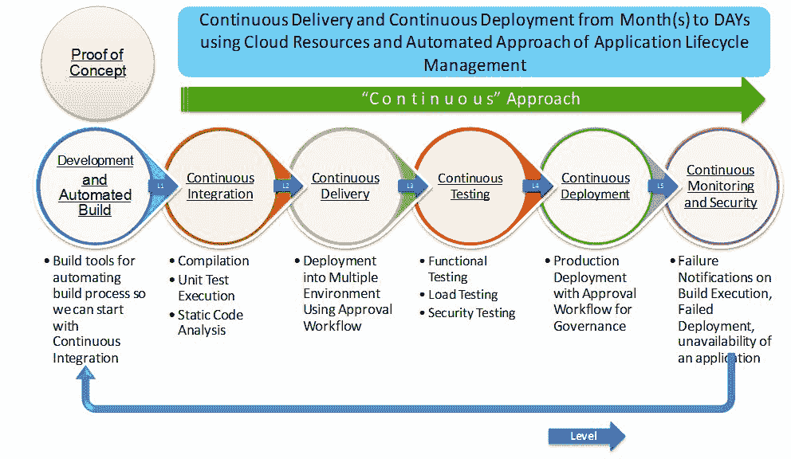

# 第一章：DevOps 概念与评估框架

一旦你拥有创新文化，即使是那些不是科学家或工程师的人——诗人、演员、记者——他们作为一个群体也能理解科学素养的意义。他们接受创新文化的概念，并以支持它的方式投票。他们不会反对科学，也不会反对技术。

-  尼尔·德格拉斯·泰森

本章中，我们将讨论如何从 1 万英尺的高度快速理解 DevOps，并讨论如何准备改变文化的最佳实践。这将帮助我们通过讨论目标并获得组织管理层的支持，来构建 DevOps 概念的基础。基本上，我们将尝试介绍能够使应用生命周期管理变得简单和高效的 DevOps 实践。

很重要的一点是要理解，DevOps 不是一个框架、工具或技术，它更多的是一个组织的文化。它也是人们在组织中通过定义的流程和利用自动化工具来使日常工作更加高效、减少手动操作的一种工作方式。

为了理解 DevOps 的基本重要性，本章将涵盖以下主题：

+   DevOps 的需求

+   DevOps 文化如何发展

+   PPT 的重要性——人、流程与技术

+   为什么 DevOps 不仅仅是关于工具

+   DevOps 评估问题

# DevOps 的需求

有一句*哈丽雅特·塔布曼*的名言，你可以在([`harriettubmanbiography.com`](http://harriettubmanbiography.com))找到。她说：

每个伟大的梦想都始于一个梦想者。永远记住，你拥有内在的力量、耐心和激情，去追寻星辰，改变世界。

变化是生活的法则，这同样适用于组织。如果任何组织或个人只关注过去或现在的模式、文化或做法，那么他们肯定会错失未来的最佳实践。在动态变化的 IT 世界中，我们需要跟上技术的发展步伐。

我们可以联系到*乔治·伯纳德·肖*的这句话：

没有变化就没有进步，那些不能改变自己想法的人无法改变任何事情。

在这里，我们专注于改变我们管理应用生命周期的方式。

重要的问题是我们真的需要这种变化吗？我们真的需要经历这种变化带来的痛苦吗？

答案是肯定的。

有人可能会说，这种商业或文化中的变化不应该是强制的。

同意。

让我们通过下面的图示，了解现代世界中组织在应用生命周期管理中面临的痛点：

考虑到商业中变化的模式和竞争环境，改善应用生命周期管理已经成为当务之急。

是否有一些现代的因素可以帮助我们改善应用生命周期管理？

是的，云计算改变了游戏规则。它为许多突破性的解决方案和创新打开了大门。让我们了解云计算到底意味着什么，以及像 DevOps 和自动化这样的术语在企业公司中扮演的重要角色。

# 云计算概览

云计算是计算演变中的下一个逻辑步骤。从传统的数据中心和虚拟化，到混合环境、私有云、公有云和混合云服务，云计算是一种提供多租户或专用计算资源（如计算、存储和网络）的计算类型，这些资源按需交付给云消费者。它有不同的形式，包括**云部署模型**和**云服务模型**。最重要的是其定价模型的运作方式，即按需付费。

云部署模型描述了云资源的部署方式：

1) **私有云**：私有云由位于防火墙后并专门为特定组织提供的云资源组成。

2) **公有云**：公有云由所有组织和个人可以使用的云资源组成。

3) **混合云**：混合云由一组特定组织共享的云资源组成，这些组织具有相似的利益或需求。

4) **社区云**：社区云由结合两种或更多部署模型的云资源组成。

云服务模型描述了云资源如何提供给各类客户，从个人和小型组织到大型企业。

它可以是纯基础设施的形式，在这种情况下，虚拟机可由云消费者或最终用户访问和控制，也就是**基础设施即服务**（**IaaS**）；或者是提供运行时环境的平台，安装和配置运行应用所需的所有软件已由云服务提供商管理并可用，也就是**平台即服务**（**PaaS**）；或者是**软件即服务**（**SaaS**），在这种模式下，整个应用程序由云服务提供商提供，基础设施和平台的责任仍然由云服务提供商承担。

在过去几年里，出现了许多服务模型，但 IaaS、PaaS 和 SaaS 基于**国家标准与技术研究院**（**NIST**）的定义：

云计算具有一些显著的特点，比如多租户、按需付费（类似于电力或天然气连接）、按需自服务、资源池化以更好地利用计算、存储和网络资源、快速弹性（根据需求自动扩展或缩减资源），以及计量服务用于计费。

多年来，不同云部署模型的使用也根据用例有所变化。最初，公共云用于那些被认为是非关键性的应用，而私有云则用于那些安全性要求较高的关键应用。

混合云和公共云的使用随着时间的推移不断发展，基于对云服务提供商提供的服务的经验和信任。类似地，基于用例和灵活性的不同，云服务模型的使用也有所不同。IaaS 在早期是最流行的，但随着企业能力的不断提升，PaaS 在成熟度和易用性方面逐渐追赶上来，包括自动扩展、支持多种编程语言以及支持端到端应用生命周期管理工具等功能。

# DevOps 概述

DevOps 关乎组织的文化、流程和技术，通过促进开发与 IT 运维团队之间的沟通与协作，以比传统方式更有效地管理应用生命周期。我们常常基于模式工作，从类似的问题或挑战中找到可复用的解决方案。

多年来，成就与失败的实验、最佳实践、自动化脚本、配置管理工具以及方法论已成为 DevOps 文化的核心部分。

它有助于定义一套实践方法，包括设计方式、开发方式、测试方式、资源配置方式、环境管理方式、配置管理方式、应用部署方式、反馈收集方式、代码改进方式以及创新方式。

以下是通过实施 DevOps 实践可以实现的一些显著好处。

DevOps 文化被视为一种创新的方式，旨在有效地整合开发（Dev）和运维（Ops）团队，包含如持续构建集成、持续测试、云资源配置、持续交付、持续部署、持续监控、持续反馈、持续改进和持续创新等组成部分，以便根据敏捷方法论的需求加快应用交付。培养文化并非一蹴而就的过程，通常需要很长时间。然而，关于 DevOps 的定义仍然存在困惑，因此，很多时候，只有持续集成或配置管理实践才被视为 DevOps 实践的实施。这种情况类似于“大象与五个盲人”的故事，每个人摸到大象的某个部位，就认为那就是大象的全部。

然而，参与其中的并不仅仅是开发和运维团队。测试团队、业务分析师、构建工程师、自动化团队、云团队以及其他许多利益相关者都参与了这一推动现有文化演变的过程。

DevOps 文化与组织文化没有太大区别，组织文化有共同的价值观和行为规范。它需要在思维方式和流程上进行调整，以便与新技术和工具对接。

# 开发和运维团队面临的挑战

之所以出现这种情况，有一些挑战存在，这也是为什么 DevOps 正在不断发展，并成为所有信息技术相关讨论中的热议话题。

# 开发团队面临的挑战

开发人员热衷于采用新技术和方法来解决问题。然而，他们面临许多挑战，包括以下内容：

+   竞争激烈的市场对准时交付施加了压力

+   他们需要负责生产就绪代码管理和新特性实现

+   发布周期通常较长，因此开发团队必须在最终进行应用部署之前做出假设。在这种情况下，修复在预发布或生产环境中部署过程中出现的问题需要更多时间

# 运维团队面临的挑战

运维团队在更改资源或使用任何新技术或新方法时总是非常小心，因为他们追求稳定性。然而，他们面临许多挑战，包括以下内容：

+   资源争夺：很难应对日益增长的资源需求

+   重新设计或调整：这是在生产环境中运行应用程序所需要的

+   诊断与修正：他们需要在应用程序部署后对问题进行诊断和修复

# IT 团队面临的挑战

IT 团队为各个团队提供资源，以支持运维工作：

+   基础设施配置：为资源提供基础设施和运行时环境，并正确安装软件包

+   配置管理：根据工具或技术中可用的更新来升级现有的基础设施或软件包

鉴于开发和运维团队所面临的所有挑战，我们如何改进现有流程，利用自动化工具提高流程效率，并改变人们的思维方式？让我们在下一节中讨论如何在组织中演变 DevOps 文化并提高效率和效果。

# DevOps 文化如何演变？

低效的估算、较长的市场推出时间和其他问题导致了瀑布模型的变化，从而转向了敏捷模型。文化的演变不是一个有时间限制或一蹴而就的过程。它可以是一个逐步进行的过程，可以在没有依赖其他阶段的情况下实现。

我们可以在没有**云资源配置**的情况下实现持续集成。我们可以在没有**云资源配置**的情况下实现**配置管理**。我们可以在没有其他 DevOps 实践的情况下实现**持续测试**。以下是实现 DevOps 实践的不同阶段：

# 敏捷开发

敏捷开发或基于敏捷的方法论有助于通过赋权个人并鼓励互动来构建应用程序，重视工作软件、客户合作——利用反馈在后续步骤中进行改进——并以高效的方式应对变化。

敏捷开发的一个最具吸引力的优势是在短时间内进行持续交付，或者用敏捷术语来说，就是迭代周期（sprints）。因此，应用开发的敏捷方法、技术的进步以及颠覆性创新和方法，造成了开发团队和运维团队之间的差距。

# DevOps

DevOps 通过在开发和运维团队之间建立合作伙伴关系，尝试填补这些差距。DevOps 运动强调软件开发人员和 IT 运维之间的沟通、协作和集成。

DevOps 促进协作，而协作通过自动化和编排来推动，以改善流程。换句话说，DevOps 本质上将敏捷运动的持续开发目标扩展到持续集成和发布。

DevOps 是敏捷实践和流程的结合，利用云解决方案的优势。敏捷开发和测试方法帮助我们实现持续集成、开发、构建、部署、测试和发布应用程序的目标。

# 构建自动化

自动化构建帮助我们使用构建自动化工具（如 Gradle、Apache Ant 和 Apache Maven）创建应用程序构建。

自动化构建过程包括编译源代码成类文件或二进制文件、提供第三方库文件的引用、提供配置文件路径、将类文件或二进制文件打包成包文件、执行自动化测试用例、在本地或远程机器上部署包文件，并减少创建包文件时的人工工作。

# 持续集成

简单来说，持续集成（CI）是一种软件工程实践，每次开发人员提交的代码都会通过以下方式之一进行验证：

+   **拉取机制**：在预定时间执行自动化构建

+   **推送机制**：在更改保存到仓库时执行自动化构建

接下来的步骤是对源代码仓库中的最新更改执行单元测试。持续集成是一种流行的 DevOps 实践，要求开发人员每天多次将代码集成到 Git 和 SVN 等代码仓库中，以验证代码的完整性。

每次提交都会通过自动化构建进行验证，允许团队尽早发现问题。

CI，甚至 CD，是公司实现 DevOps 的基础。如果没有良好的 CI 和 CD 实施，组织是无法进行 DevOps 的。

# 云资源配置

我们在本章之前已经介绍了云计算的基础知识。云资源配置使得将**基础设施即代码**（**IAC**）成为可能，这使整个过程变得非常高效和有效，因为我们正在自动化一个曾经需要大量人工干预的过程。

按需付费的计费模型使得所需资源对大型组织、以及中小型组织和个人都变得更加负担得起。

它有助于推动改进和创新，因为以前资源限制阻碍了组织因为成本和维护问题而走得更远。一旦基础设施资源具有灵活性，我们就可以考虑自动化安装和配置运行应用程序所需的包。

# 配置管理

**配置管理**（**CM**）管理系统中的变更，或者更具体地说，服务器运行时环境中的变更。市场上有许多工具可以帮助我们实现配置管理。常见的工具包括 Chef、Puppet、Ansible、Salt 等。

假设我们需要管理多个具有相同配置的服务器。

例如，我们需要在每个服务器上安装 Tomcat。如果我们需要更改所有服务器上的端口、更新某些包或为某些用户提供权限呢？在这种情况下的任何修改都是手动的，并且容易出错。由于相同的配置被用于所有服务器，自动化在这里是非常有用的。

# 持续交付

持续交付和持续部署常常可以互换使用。然而，它们之间有一个小的区别。

持续交付是以自动化方式将应用程序部署到任何环境中，并提供持续反馈以改进其质量的过程。

自动化方法在持续交付和持续部署中可能不会发生变化。批准过程和一些其他小的事项可能会有所不同。

# 持续测试和部署

持续测试是端到端应用生命周期管理过程中的非常重要的阶段。它包括功能测试、性能测试、安全性测试等。

Selenium、Appium、Apache JMeter 以及许多其他工具都可以用于此目的。

另一方面，持续部署是指将带有最新更改的应用程序部署到生产环境中。

# 持续监控

持续监控是端到端交付管道的支柱，而开源监控工具则像是冰淇淋上的配料。

在几乎每个阶段进行监控是理想的，以便对所有过程保持透明，正如以下图表所示。这也帮助我们快速排查故障。监控应该是经过深思熟虑的计划实施。

让我们尝试在以下图表中将整个过程呈现为持续的方法：

我们需要在这里理解，变革是一个阶段性的方法，并且并不需要一次性自动化每个阶段的所有内容。一次集中实施一个 DevOps 实践，先实现它并感受到其效益，再实施下一个，会更加有效。

通过这种方式，我们可以安全地评估组织文化变革带来的改进，并消除应用生命周期管理中的手工操作。

# PPT 的重要性——人员、流程与技术

PPT 是任何组织中一个重要的词。等一下！我们这里不是在说 Powerpoint 演示文稿。这里，我们关注的是人员、流程和工具/技术。让我们理解为什么它们在改变任何组织文化中的重要性。

# 人员

根据 Jack Canfield 的名言：

成功的人无论周围发生什么，他们都会保持积极的生活态度。他们专注于过去的成功，而不是过去的失败，并专注于下一步的行动，以便将自己带到更接近目标实现的地方，而不是生活中所有的其他干扰。

一个值得思考的问题是，为什么人员如此重要？如果我们要用一句话回答，那就是：因为我们在试图改变文化。

那么呢？

人员是任何文化的重要组成部分，只有人才能推动变革，或是改变自己去适应新流程，或是定义新流程并学习新的工具或技术。

让我们通过*变革公式*来理解其中的原理和原因。

David Gleicher 在 1960 年代初创建了*变革公式*，根据维基百科中的资料。Kathie Dannemiller 于 1980 年进行了改进。这个公式为评估影响组织变革成功的相对因素提供了一个模型。

Gleicher（原版）公式***:** C = (ABD) > X，**其中：C = 变革，A = 对现状的不满，B = 渴望的清晰目标，D = 实现目标的实际步骤，X = 变革的成本。*

**Dannemiller 版公式：** *D x V x F > R； 其中 D、V 和 F 必须同时存在，才能促成组织变革，其中：D = 对现状的不满，V = 对可能的愿景，F = 实现愿景的第一步。若这三者的乘积大于 R = 抵制力，则变革是可能的。*

本质上，这意味着必须对现有的事物或流程有强烈的不满，对新趋势、技术和创新在市场场景中的潜力有明确的愿景，并能够采取具体的步骤朝着实现这一愿景的方向努力。

若想了解更多关于*变革公式*的内容，您可以访问这个维基页面：[`en.wikipedia.org/wiki/Formula_for_change#cite_note-myth-1`](https://en.wikipedia.org/wiki/Formula_for_change#cite_note-myth-1)

如果要分享经验，我认为训练人们采纳新文化非常重要。这是一个耐心的游戏。我们无法在一夜之间改变人们的思维方式，我们需要先理解，再去改变文化。

在行业中，经常会看到带有 DevOps 知识或 DevOps 工程师职位的招聘广告，但理想情况下，这些职位不应该是外部引进的，而是应该通过逐步改变现有环境来培训现有人员，以便有效管理抗拒。我们不需要一个专门的 DevOps 团队；我们需要开发人员、测试团队、自动化促进者和云或基础设施团队之间更多的沟通与协作。

了解彼此的痛点至关重要。在我工作过的组织中，我们曾经设有**卓越中心**（**COE**），用来管理新技术、创新或文化。作为自动化促进者和 DevOps 团队的一部分，我们应该仅作为促进者工作，而不是孤立的一部分。

# 流程

这里有一句来自*汤姆·彼得斯*的名言，原文是：

几乎所有的质量改进都来自于设计、制造、布局、流程和程序的简化。

在推动文化演变的过程中，质量至关重要。我们需要制定流程和政策，以规范且标准化的方式进行工作，从而确保操作顺序、约束条件、规则等得到明确定义，以衡量成功。

我们需要为以下内容设定流程：

+   敏捷规划

+   资源规划和配置

+   配置管理

+   基于角色的访问控制，适用于云资源和自动化中使用的其他工具

+   静态代码分析——编程语言的规则

+   测试方法和工具

+   发布管理

这些流程对于衡量在推动 DevOps 文化演变过程中的成功也至关重要。

# 技术

这里有一句来自*史蒂夫·乔布斯*的名言，原文是：

技术并不重要。重要的是你对人们有信心，相信他们本质上是善良且聪明的，给他们工具，他们会用这些工具做出令人惊叹的事情。

技术帮助个人和组织在改变文化的过程中带来创造力和创新。如果没有技术，难以在日常和例行的自动化操作中实现速度和效果。云计算、配置管理工具和构建流水线等工具，在资源配置、运行环境安装和编排方面非常有用。从本质上讲，它有助于加速应用生命周期管理的各个方面。

# 为什么 DevOps 并不完全是工具的问题

是的，工具并不重要。它们在改变任何组织文化中并不是那么重要的因素。原因很简单。无论我们使用什么技术，我们都会执行持续集成、云资源配置、配置管理、持续交付、持续部署、持续监控等操作。

按类别，您可以使用不同的工具集，但它们执行的操作相似。只是工具执行某项操作的方式不同，其他方面的结果是相同的。以下是基于类别的一些工具：

| **类别** | **工具** |
| --- | --- |
| **构建自动化** | Nant, MSBuild, Maven, Ant 和 Gradle |
| **代码库** | Git 和 SVN |
| **静态代码分析** | Sonar 和 PMD |
| **持续集成** | Jenkins, Atlassian Bamboo, 和 VSTS |
| **配置管理** | Chef, Puppet, Ansible, 和 Salt |
| **云平台** | AWS 和 Microsoft Azure |
| **云管理工具** | RightScale |
| **应用部署** | Shell 脚本和插件 |
| **功能测试** | Selenium 和 Appium |
| **负载测试** | Apache Jmeter |
| **代码仓库** | Artifactory, Nexus, 和 Fabric |

让我们看看不同的工具如何在不同的阶段、不同的操作中发挥作用。这可能会根据环境的数量或我们在不同组织中遵循的 DevOps 实践的数量而有所变化：

如果我们需要根据不同的 DevOps 最佳实践对工具进行分类，可以根据开源和商业类别进行分类。以下只是一些示例：

| **组件** | **开源** | **IBM Urban Code** | **Electric-Cloud** |
| --- | --- | --- | --- |
| **构建工具** | Ant 或 Maven 或 MS Build | Ant 或 Maven 或 MS Build | Ant 或 Maven 或 MS Build |
| **代码仓库** | Git 或 Subversion | Git 或 Atlassian Stash 或 Subversion 或 StarTeam | Git 或 Subversion 或 StarTeam |
| **代码分析工具** | Sonar | Sonar | Sonar |
| **持续集成** | Jenkins | Jenkins 或 Atlassian Bamboo | Jenkins 或 ElectricAccelerator |
| **持续交付** | Chef | Artifactory 和 IBM UrbanCode Deploy | ElectricFlow |

在本书中，我们将尝试聚焦于开源类别和商业工具。我们将使用 Jenkins 和 Visual Studio Team Services 来执行所有主要的自动化和编排相关活动。

# DevOps 评估问题

DevOps 是一种文化，我们非常清楚这一点。然而，在实施自动化、制定流程和发展文化之前，我们需要了解组织当前的文化状态，以及是否需要引入新的流程或自动化工具。

我们需要非常清楚的是，我们需要使现有文化更加高效，而不是引入新的文化。适应一个评估框架是困难的，但我们将尽力提供一些问题和提示，基于这些内容，创建评估框架会更加容易。

创建我们希望提问并为特定应用获取反馈的类别。

以下是一些示例问题：

1.  您是否遵循敏捷原则？

1.  您是否在使用任何源代码仓库？

1.  您是否在使用任何静态代码分析工具？

1.  您是否在使用任何构建自动化工具？

1.  您是使用本地基础设施还是云基础设施？

1.  您是否使用任何配置管理工具或脚本来安装应用程序包或运行时环境？

1.  您是否使用任何自动化脚本来部署应用程序到生产环境和非生产环境？

1.  您是否使用任何编排工具或脚本来进行应用生命周期管理？

1.  您是否使用任何自动化工具进行功能测试、负载测试、安全测试和移动测试？

1.  您是否使用任何工具来进行应用程序和基础设施监控？

一旦问题准备好，准备响应，并根据这些响应，为每个前述问题的回答决定评分。

使框架具有灵活性，这样即使我们更改某一类别中的问题，也能自动管理。

一旦给出评级，就通过引入不同的条件和智能到框架中，捕捉响应并计算总体评分。

创建按类别划分的最终评级，并从最终评级中创建不同类型的图表，以提高其阅读价值。这里需要注意的重要事项是组织在每个应用生命周期管理领域的专业知识的重要性。这将为评估框架赋予新的维度，加入智能，使其更有效。

# 总结

在本章中，我们已经设定了整个书籍要实现的多个目标。我们涵盖了持续集成、云环境中的资源配置、配置管理、持续交付、持续部署和持续监控。

设定目标是将无形转化为有形的第一步。

-托尼·罗宾斯（Tony Robbins）

我们已经看到了云计算如何改变以前对创新的看法，以及现在它变得多么可行。我们还简要介绍了 DevOps 及其所有不同的实践。在这个过程中，人、流程和技术也非常重要，这关系到改变一个组织的现有文化。我们试图探讨它们为何重要。工具很重要，但不是决定性因素；任何工具集都可以使用，改变文化不需要特定的工具集。我们也简要讨论了 DevOps 评估框架，它将帮助你走上改变文化的道路。

信仰就是即使看不到整个楼梯，也要迈出第一步。

-马丁·路德·金（Martin Luther King, Jr.）

在下一章中，我们将迈出朝向持续集成的旅程的第一步。我们将使用 Jenkins 和 Microsoft Visual Studio Team Services 来实现持续集成，并验证如何在不同的工具中实现 CI，而不会遇到重大挑战。
