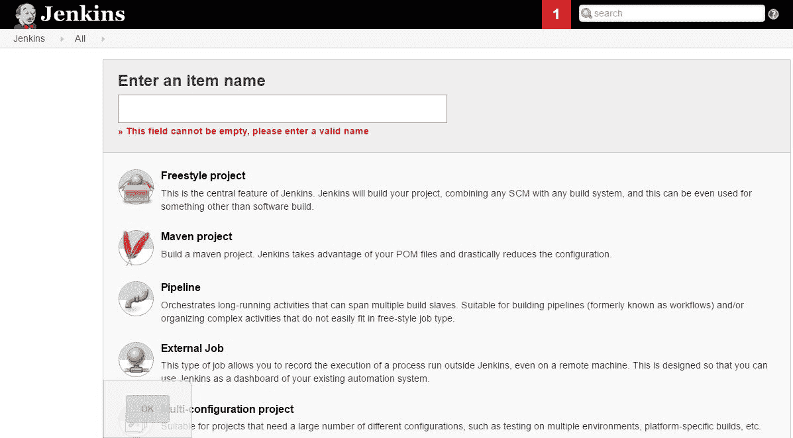
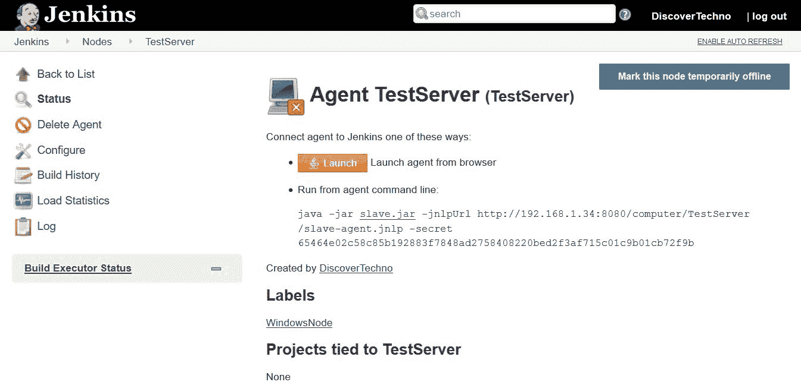

# 第二章：持续集成

持续的努力——不是力量或智力——是解锁我们潜力的关键

- 温斯顿·丘吉尔

在本章中，我们将介绍如何安装持续集成服务器 Jenkins，并执行与编译、单元测试执行、代码分析和创建包文件相关的各种任务。我们还将讨论使用微软技术栈进行的持续集成。目标是尽可能多地了解持续集成，因为它是其他自动化的基础。以下是我们将涉及的主题要点：

+   安装 Jenkins 2

+   配置基于 Maven 的 JEE Web 应用程序

+   集成 Jenkins 和 SonarQube

+   从 Jenkins 执行命令行操作

+   使用 VSTS 进行持续集成

首先让我们了解一下 Jenkins——现在的持续集成服务器或自动化服务器，尤其是在 Jenkins 2.0 之后。

# 安装 Jenkins 2

以下是我们可以遵循的一些安装 Jenkins 的步骤：

1.  安装 Java 开发工具包 8，并将`JAVA_HOME`设置为环境变量。在命令提示符或终端中，执行`java –version`、`javac`和`java`命令，以验证 Java 是否正确安装。 从 Jenkins 官网下载安装`jenkins.war`文件。

1.  要运行 Jenkins，执行`java –jar jenkins.war`。 等待 Jenkins 完全启动并运行。

1.  Jenkins 完全启动并运行后，打开浏览器并访问`http://<localhost/IP_ADDRESS>:8080`。

1.  我们需要首先解锁 Jenkins，才能继续进行配置。从给定的文件位置复制密码，或者从我们执行 Java 命令的控制台/终端中复制密码。

1.  输入管理员密码并点击继续。

1.  安装推荐的插件或选择要安装的插件。

如果我们处于防火墙后面，它将要求我们设置代理设置，以便下载所需的插件。如果我们熟悉 Jenkins，可以完全跳过插件安装，并在需要时稍后安装它们。这会使配置过程更快。如果在代理后面，我们在下载某些插件时可能会遇到问题。在这种情况下，最好先识别这些插件，并使用“选择插件安装”选项，以避免无休止的等待或配置失败。

1.  完成插件安装过程后，或跳过该过程后，我们需要创建第一个管理员用户。Jenkins 2 之后，插件安装和安全配置成为初始设置的一部分，这使得工具更加成熟。

1.  提供所需的用户详细信息并点击保存并完成。现在，Jenkins 已经准备就绪，Jenkins 的设置也已完成。我们可以开始使用 Jenkins 了。这时，我们将首次遇到 Jenkins 仪表板。

我们可以管理与 Jenkins 相关的配置，如工具配置、安全配置、创建构建任务、管理插件和管理代理。

以下截图展示了 Jenkins 仪表板：

我们将在自动化目标中使用 Java/JEE 示例应用程序。首先，我们需要告诉 Jenkins 安装文件的位置，因为这些文件是执行某些任务所必需的。由于该应用程序使用 Maven 构建工具，我们还需要一个 Maven 安装文件夹。下载 Apache Maven。进入 Jenkins 仪表板中的“管理 Jenkins”，点击“全局工具配置”。点击“添加 JDK”。我们已经安装了 JDK，因此可以提供 `JAVA_HOME` 的路径，我们的 Java 配置也已经完成。

# Jenkins 中的全局工具配置

在本节中，我们将配置在创建构建作业时需要使用的各种工具，例如 Java、Ant、Maven 等。

我们也可以从 Jenkins 仪表板中安装这些工具。如果我们有两个不同的应用程序，其中一个需要使用 JDK 1.7 编译，另一个需要使用 JDK 1.8 编译怎么办？我们可以添加多个 JDK，并在创建构建作业时指定要为该构建作业执行所使用的 JDK。

配置完 Java 后，我们的下一个任务是配置 Maven：

现在，我们已经在 Jenkins 中配置了不同的工具，接下来我们将在 Jenkins 仪表板中创建一个新作业或项目，以便为基于 JEE 的应用程序配置持续集成。

# 创建和配置基于 Maven 的 JEE Web 应用程序

在本节中，我们将创建一个基于 Maven 的 Jenkins 构建作业，该作业将执行 `pom.xml` 文件的编译、单元测试执行并创建包文件。让我们开始吧！

在 Jenkins 仪表板上点击“新建项目”：

由于这是一个基于 Maven 的项目，我们将选择“Maven 项目”模板。如果是基于 Ant 的应用程序或其他自动化任务，则可以选择“自由风格项目”模板来创建构建作业。选择 Maven 项目并点击“确定”。这将打开构建作业配置页面，如下图所示：

在源代码管理中，提供 GitHub URL、SVN URL（首先安装 Subversion 插件）或任何仓库 URL。我们还可以访问文件系统中的代码：

在构建部分，选择我们在“全局工具配置”部分配置的 Maven 版本。提供要在 `pom.xml` 上执行的 Maven 目标。有关 Maven 目标的更多详细信息，请访问 Apache Maven 网站。`package` 目标将编译源代码，执行单元测试，并在 Java 环境中创建包或 war 文件：

在作业配置页面点击“应用”并保存。点击仪表板上的“立即构建”链接。验证同一页面上的构建历史。第一次构建将会开始。

点击进度条，直接跳转到 Jenkins 仪表板上的控制台输出。

它将开始从代码库中获取代码并将其放入本地工作空间。如果成功获取代码，则可以在项目或构建仪表板上检查工作空间。

等待 Maven 包目标在 Jenkins 中执行。它将编译所有源文件，执行用 JUnit 编写的单元测试用例，并生成需要在 Web 服务器（如 Tomcat 或 JBoss）上部署的 WAR 文件：

一旦构建成功，我们的第一个目标就达成了，那就是持续集成。如果由于 Maven 下载问题失败，则检查 Maven 相关设置。如果 Jenkins 安装在代理后面，则在 Apache Maven 的配置文件中提供代理详细信息，这样它就可以访问 Maven 仓库并下载所需的文件。

# Jenkins 中的单元测试用例结果

要检查单元测试的执行情况，进入项目并验证已成功执行的构建。点击测试结果（无失败）：

它会根据包的情况给出测试结果列表。要获取更多详细信息，转到具体的包并验证结果：

# Jenkins 中的主代理架构

假设有一个场景，我们需要的特定工具位于另一台服务器上，而这些工具是应用生命周期管理中重要阶段的一部分。

在这种情况下，我们可以将 Jenkins 服务器作为主节点，将具有特定工具的服务器作为代理。这样，主 Jenkins 就可以访问其他服务器上的资源来执行特定操作。

转到“管理 Jenkins”，然后点击“管理节点”。我们可以看到安装了 Jenkins 的主节点。要添加一个新的节点（可能有不同的操作系统和工具集），我们需要点击“新建节点”：

输入节点名称，并选择其为“永久代理”。点击“确定”。输入名称、标签和远程根目录。远程根目录是存储代理上执行所有详细信息的目录。它类似于代理节点上 JENKINS_HOME 的工作空间目录：

点击“保存”；然后转到安全配置并启用从属代理端口——JNLP 代理的 TCP 端口（保持为随机端口，而非禁用状态）：

转到主 Jenkins 中的代理配置。复制从代理命令行运行的命令：

在代理机器上下载 `slave.jar` 文件，并按以下截图中的命令执行：

一旦代理在控制台连接成功，也请在主 Jenkins 中验证该连接：

当我们将代理连接到主节点后，就可以将构建任务分配给该代理执行。在执行构建任务之前，我们需要确保所有执行所需的工具也在主 Jenkins 中进行了配置，以便主节点能够使用这些可安装工具进行执行。

在任务配置中，我们可以选择勾选“限制此项目可运行的位置”复选框，并为代理提供标签表达式：

在代理节点页面中，我们可以提供工具位置：

我们可以使用这些代理进行静态代码分析或测试执行，在这些代理上可以安装不同的工具，然后将代理分配给执行任务。接下来我们将介绍 SonarQube。

# 集成 Jenkins 和 SonarQube

首先，让我们看看如何将 SonarQube 配置到 Jenkins 中，这样我们就可以通过触发 Jenkins 来执行静态代码分析。

转到管理 Jenkins，点击管理插件，然后点击可用选项卡。找到 SonarQube 插件并安装它。

转到管理 Jenkins，然后点击配置系统。找到 SonarQube 服务器部分，点击添加 SonarQube 服务器。提供服务器 URL 和凭据。从 SonarQube 获取服务器身份验证令牌（`管理` | `安全` | `用户`），并在 Jenkins 中提供该令牌：

转到管理 Jenkins 中的全局工具配置，并配置 SonarQube 扫描器自动安装：

在 Jenkins 中创建一个新的自由风格任务。配置 SonarQube 安装的代理的 JDK 路径。

还需要安装 `质量门` 插件。通过配置 `质量门` 插件，我们可以在 SonarQube 分析失败时使 Jenkins 构建任务失败。

配置项目的仓库 URL。转到任务配置，在构建步骤中添加执行 SonarQube 扫描器。选择 JDK，并输入 `sonar-project.properties` 的路径或提供分析属性：

在构建后操作中，选择质量门。

输入我们在分析属性或 `sonar-project.properties` 中提供的项目密钥：

点击立即构建并验证 Jenkins 中构建执行的结果。

转到 SonarQube 服务器，验证仪表板中是否有代码分析：

这就是如何将 SonarQube 集成到 Jenkins 中的方式。接下来，让我们看看如何从 Jenkins 发送电子邮件通知。

# Jenkins 中的电子邮件通知

让我们看看如何配置电子邮件通知，将任务执行的状态发送给特定的利益相关者。转到管理 Jenkins，点击配置系统，并配置电子邮件设置，如下图所示：

在构建后操作中，选择电子邮件通知并配置收件人。保存设置：

如果构建不稳定，我们可以发送通知，并向破坏构建的个人发送电子邮件。

在下一部分，我们将看到如何使用 **Visual Studio Team Services** (**VSTS**) 进行持续集成。

# 使用 **Visual Studio Team Services** 进行持续集成

我们常说 DevOps 和工具无关。所有工具执行相同的操作，只是有些细微的差异或灵活性。我们将看到如何使用 VSTS 进行持续集成。

在 VSTS 中创建一个账户，并创建一个名为`PetClinic`的项目。

# Eclipse 与 VSTS 集成

在本节中，我们将看到如何将 Eclipse 与 VSTS 集成，以便我们可以从本地系统将代码提交到 VSTS。

下载 Eclipse，打开它，然后点击“Help”菜单。选择“Install New Software”。

在 Eclipse 中添加一个站点以安装 TFS 插件，这样我们就可以直接从 Eclipse 提交代码到 VSTS。

选择“Team Explorer Everywhere”，然后点击“Next”：

审核安装详细信息并点击“Next”。

审核许可协议并接受条款，点击“Finish”。

等待安装完成后重新启动 Eclipse。

在 Eclipse 中，转到 Window | Perspective | Open Perspective | Other... | 选择 Team Foundation Server Exploring。

点击“Connect to Team Services or a Team Foundation Server”。我们将连接到团队服务：

在“Team Foundation Server”列表中点击“Add...”并提供我们 VSTS 账户的 URL：

它将尝试连接到 VSTS 账户并请求凭证。

一旦连接成功，我们就可以从 Eclipse 连接到服务器。

点击“Next”：

从列表中选择一个团队项目。

点击“Finish”。

进入浏览器中的 VSTS 账户并验证项目文件夹中的现有数据。

在 Eclipse 中验证 Team Explorer 视图。现在它已连接，我们可以进行操作：

在进行任何其他操作之前，将 PetClinic 代码导入到 Eclipse 中。

右键点击项目并选择“Team”。

选择`Share Project`。

在“Select a repository type plugin”对话框中选择 Team Foundation Server。

点击“Next”：

在“Team Project Selection”对话框中选择我们最初在 VSTS 中创建的团队项目：

选择一个服务器位置以共享项目：

审核共享配置并点击“Finish”。

完成后，转到 Team Explorer 视图，并在提供评论后点击 Check In：

确认 Check In。

在 Eclipse 中验证 Check In，附近文件的图标将会变化，以表示文件自上次 Check In 以来没有更改。

验证 VSTS 中的所有文件：

一旦我们在 VSTS 的代码部分中拥有代码，就可以轻松配置 VSTS 中的持续集成。

# VSTS 中的持续集成

本质上，我们将按照开发者可以通过 IDE 在代码库中共享代码的流程进行操作。VSTS 会触发构建定义的执行，并根据配置进行源文件编译、单元测试执行等任务，生成一个包文件：

在 VSTS 中，我们需要为持续集成创建构建定义。请在浏览器中进入 VSTS 账户。

点击 PetClinic 项目：

点击顶部菜单栏中的“Build & Release”，然后选择“Builds”：

目前没有可用的构建定义。创建一个+新建定义：

我们有基于 Maven 的项目，因此我们将选择 Maven 构建定义模板：

选择一个仓库源：

勾选“持续集成（每当此仓库更新时构建）”。点击“创建”：

它将以编辑模式打开构建定义。

在 Maven 构建步骤中，验证`pom.xml`文件的位置：

点击“触发器”部分，验证持续集成（CI）：

点击“保存”按钮并为构建定义命名：

点击“排队新构建...”来执行构建定义：

它将等待可用的代理来执行构建定义：

等待构建执行成功完成：

转到“构建”部分，验证构建结果：

验证构建定义执行的摘要。它在托管代理上执行。所有必需的运行时环境都在托管代理上可用：

验证构建定义执行历史记录，以查看单元测试执行的结果：

转到 VSTS 中的测试计划部分，点击“最近的测试运行”以查看单元测试执行的更多细节：

现在我们完成了。

我们使用 VSTS 实现了一个基于 Spring 的 Java Web 应用程序的持续集成。

在 Jenkins 和 VSTS 中，自动化执行的方式大致相同。因此，理解其中一种工具总是有助于使用任何其他工具完成相同的任务，这证明了我们对“这不在于工具”的信念。它关乎于人、流程、心态和工具。

# 摘要

有一句来自**马塞尔·普鲁斯特**的著名名言：

发现的真正旅行不在于寻找新的风景，而在于拥有新的眼光。

我们将改变应用程序包的创建方式。我们可能需要通过相同的过程来创建一个包、WAR 文件、APK 文件或 IPA 文件。因此，我们并不是在寻找新的风景。然而，我们需要找到一种高效的方式来有效地完成这个过程，因此我们需要寻找拥有新的眼光。

在本章中，我们详细描述了如何使用 Jenkins 和 Visual Studio Team Services 进行持续集成。我们查看了单元测试执行的结果，以及在 Jenkins 和 Visual Studio Team Services 中如何创建包。

我们所知道的最重要的事情是，实施持续集成作为一种 DevOps 实践并不依赖于特定的工具。我们可以使用任何工具来实现自动化，并达到相同的目标。关键在于组织中的文化或模式，而不是工具。

一旦我们准备好软件包，我们需要为部署准备或保持一个环境。在下一章中，我们将看到如何使用 Docker 容器来准备环境。
