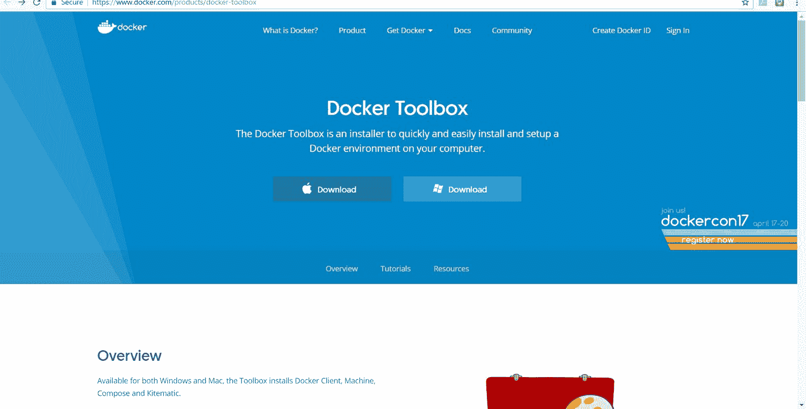
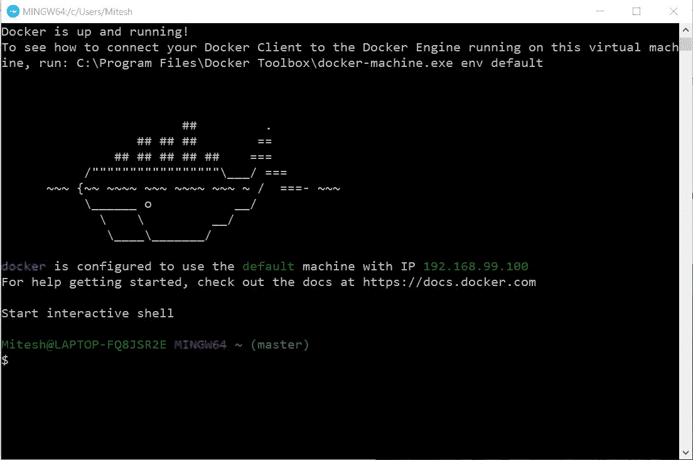

# 容器

“任何技术在商业中使用的第一条规则是，自动化应用于高效的操作会放大效率。第二条规则是，自动化应用于低效的操作会放大低效。”

- 比尔·盖茨

到目前为止，我们已经看到 DevOps 实践和持续集成。然而，最近，容器已经成为一个流行词，大家都希望亲自体验它。主要原因是为了更有效地利用资源。Docker 是一个开源的操作系统虚拟化项目，自动化应用程序在软件容器中的部署。它在开发或质量保证环境中非常有用，可以更好地利用资源。

在本章中，我们将尝试安装和创建一个示例容器。目标是熟悉 Docker 容器，并了解如何利用容器进行应用程序部署。

本章提供了对容器的快速概述。我们将集中讨论本章中的以下主题：

+   Docker 容器概述

+   理解虚拟机和容器之间的区别

+   安装和配置 Docker

+   创建一个 Tomcat 容器

# Docker 容器概述

Docker 提供了隔离的用户空间，从而提供基于用户的进程、空间和文件系统。在幕后，它共享 Linux 主机的内核。以下图示说明了 Docker 容器的工作机制：


Docker 有两个主要组件，采用客户端-服务器架构：

+   **Docker 主机**

+   **Docker Hub**

让我们更详细地看一下它们：

+   **Docker 主机**：Docker 主机包含 Docker 守护进程、容器和镜像。Docker 引擎是一个重要组件，提供核心的 Docker 技术。这一核心 Docker 技术使得镜像和容器得以实现。当我们成功安装 Docker 后，只需运行一个简单的命令。在我们的案例中，我们将使用 CentOS 作为容器。要在 CentOS 镜像中运行交互式 Shell，可以使用命令 `docker run -i -t <image> /bin/bash`：

    +   `-i` 标志启动交互式容器

    +   `-t` 标志创建一个伪终端，连接 `stdin` 和 `stdout`

    +   镜像是一个 CentOS 镜像

    +   `/bin/bash` 启动一个 Shell

当我们运行此命令时，它会验证 CentOS 镜像是否本地可用。如果不可用，它会从 Docker Hub 下载该镜像。

镜像有文件系统和可在运行时使用的参数，而容器是具有状态的镜像实例。理解容器会发生变化，而镜像不会变化是很简单的。

+   **Docker Hub**：Docker Hub 是一个 **软件即服务**（**SaaS**），用于共享和管理 Docker 容器。它是 Docker 提供的一种集中式注册服务。作为用户，我们可以使用它来构建和交付应用程序。它允许我们创建一个管道，集成代码仓库，进行协作、镜像发现和自动化。

# 理解虚拟机和容器之间的差异

在开始安装 Docker 和创建容器之前，了解容器为什么与虚拟机不同以及它们之间的差异会很有帮助。

让我们了解虚拟机和容器之间的基本区别。

# 虚拟机

在 **虚拟机** (**VM**) 中，我们需要安装一个操作系统，并配备适当的设备驱动程序；因此，虚拟机的占用空间非常大。一个正常的虚拟机，安装了 Tomcat 和 Java，可能需要高达 10 GB 的硬盘空间：


存在内存管理和设备驱动程序的开销。虚拟机拥有正常物理机器所具备的所有组件。

在虚拟机中，虚拟化程序抽象了资源。它的包不仅包括应用程序，还包括必要的二进制文件和库，以及整个来宾操作系统，例如 CentOS 6.7 和 Windows 2003。

云服务提供商使用虚拟化程序（hypervisor）为虚拟机提供标准的运行时环境。虚拟化程序分为类型 1 和类型 2。

# 容器

容器共享主机的操作系统和设备驱动程序。容器是从镜像创建的，对于安装了 Tomcat 的容器，其大小不到 500 MB：


容器体积小，因此提供更快更好的性能。它们将操作系统进行了抽象。

容器以隔离的用户空间运行，进程和文件系统位于主机操作系统的用户空间中，并且与其他容器共享内核。容器的共享和资源利用效率非常高，并且由于开销较少，能够提供更多的资源。它在资源要求非常少的情况下就能正常工作。

Docker 使得跨环境迁移应用变得高效且更容易。

# 安装和配置 Docker

让我们快速在 Windows 10 上安装 Docker。对于我们来说，是 Windows 家庭版；所以我们需要从 [`www.docker.com/products/docker-toolbox`](https://www.docker.com/products/docker-toolbox) 安装 Docker Toolbox：

1.  点击下载按钮：



1.  它会将您重定向到 [`github.com/docker/toolbox/releases/tag/v1.12.5`](https://github.com/docker/toolbox/releases/tag/v1.12.5) 或包含最新版本的页面。

1.  下载 DockerToolbox。点击 Docker Toolbox 的 `exe` 文件进行安装：


1.  在欢迎页面上点击“下一步 >”：


1.  选择安装 Docker Toolbox 的首选位置：


1.  保留安装的所有默认组件。


1.  选择应执行的附加任务，然后点击“下一步 >”：


1.  点击安装：


1.  Docker Toolbox 安装将同时安装 VirtualBox：


1.  点击完成：


在开始 Docker 操作之前，我们需要在 Windows 系统中启用虚拟化技术，否则我们将遇到以下错误：

+   使用`C:UsersMitesh.dockermachinecertsca.pem`创建 CA

+   使用`C:UsersMitesh.dockermachinecertscert.pem`创建客户端证书

+   `运行预创建检查... 预创建检查错误: "此计算机未启用 VT-X/AMD-v。必须在 BIOS 中启用它" 看起来在步骤'检查是否存在默认机器'中出了问题... 按任意键继续...`

+   转到设置并点击高级启动。重启系统。更改 BIOS 设置以启用虚拟化技术：


系统重启后，点击桌面上的 Docker Quickstart Terminal。它将执行预创建检查并下载`boot2docker.iso`，然后运行虚拟机。

完成所有配置和检查后，Docker 已成功启动：


要获取如何在 CentOS 中安装 Docker 的详细信息，请阅读《DevOps for Web Development》，可以在[`www.packtpub.com/networking-and-servers/devops-web-development`](https://www.packtpub.com/networking-and-servers/devops-web-development)找到。

一旦 Docker 正常运行，我们就可以创建 docker 容器了。请注意默认 docker 机器的 IP 地址：



让我们创建一个示例的 hello world 容器。执行`docker run hello-world`。如果你看到`"Hello from Docker!"`消息，那么我们已经成功创建了容器：


因为我们需要部署一个 JEE 应用程序，在接下来的部分我们将创建一个 Tomcat 容器。

# 创建一个 Tomcat 容器

在本节中，我们将创建一个已安装 Tomcat Web 服务器的容器，以便可以将基于 Java 的 Web 应用程序部署到其中：

1.  在 Docker hub 上创建一个帐户并登录：


1.  我们可以从 Docker hub 中搜索不同的镜像：


1.  你可以在[`hub.docker.com/_/tomcat/`](https://hub.docker.com/_/tomcat/)找到 Tomcat 镜像。

1.  使用 Docker 的`pull`命令获取 Tomcat 镜像：

```
 docker pull tomcat 

```

1.  一旦 Tomcat 镜像可用，通过执行`docker images`命令验证它：


1.  要从镜像中运行 docker 容器，执行`docker run -it --rm -p 8888:8080 tomcat:8.0`。

1.  在浏览器中使用默认 docker 机器的 IP 地址和端口`8888`来验证 Tomcat 是否在容器中正常运行：


1.  要获取虚拟机的 IP 地址，执行`docker-machine ls`命令。

让我们验证是否可以访问这个容器中的 Tomcat 管理应用程序：


我们在这里要做的是，创建一个带有我们自己`tomcat-users.xml`的新镜像，在该文件中创建一个拥有`manager-script`角色的用户来访问 Tomcat 管理应用程序。

创建一个目录。进入该目录并创建一个`tomcat-users.xml`文件。

在其中添加以下内容：

```
<?xml version='1.0' encoding='utf-8'?>
<tomcat-users  
xsi:schemaLocation="http://tomcat.apache.org/xml tomcat-users.xsd" version="1.0">
<!--
NOTE: The sample user and role entries below are intended for use with the examples web application. They are wrapped in a comment and thus are ignored when reading this file. If you wish to configure these users for use with the examples web application, do not forget to remove the <!....> that surrounds them. You will also need to set the passwords to something appropriate.
-->
<role rolename="manager-script"/>
<user username="admin" password="admin@123" roles="manager-script"/>
</tomcat-users>

```

在同一目录中创建一个名为 `Dockerfile` 的新文件，并添加以下内容：

```
FROM tomcat:8.0 MAINTAINER Mitesh<xxxxxx.xxxxxx@gmail.com> COPY tomcat-users.xml /usr/local/tomcat/conf/tomcat-users.xml

```

在 Docker Quickstart Terminal 中，进入我们创建的目录。

执行 `docker build -t devops_tomcat_sc` 。

镜像成功构建后，使用 docker images 来验证：


执行 `docker run -it -p 8888:8080 devops_tomcat_sc:8.0` 并使用 `docker ps -a` 验证容器数量。

我们可以使用 `docker stop <container_name>` 来停止容器：


要更改容器的名称，请使用 `docker run -it -p 9999:8080 --name bootcamp_tomcat devops_tomcat_sc`。

使用 `docker ps -a` 验证名称：


使用虚拟机的 IP 地址和 `9999` 作为端口号访问容器中运行的 Tomcat：


使用以下 URL 使用 `manager-script` 角色验证管理器访问：


让我们尝试使用 Tomcat 中的 `Deploy to Container` 插件部署应用程序。如果某个构建任务生成了 WAR 文件，则使用复制构件插件从该构建中复制它：


在构建后操作中，选择将 WAR/ EAR 部署到容器。提供 tomcat-users.xml 中的用户名和密码。提供 Tomcat URL。点击应用/保存：


点击立即构建：


转到控制台输出并验证部署过程：


使用 Tomcat URL 和应用程序上下文验证应用程序的 URL：


现在我们完成了。

如此一来，你可以看到我们已经创建了一个镜像、一个容器，并在 Tomcat 容器中部署了应用程序。

# 总结

所以我们在本章中看到了如何在 Windows 10 中安装 Docker 容器，以及如何使用 Docker hub 查找公共域中可用的镜像。

我们执行了 hello world 容器以验证 Docker 是否成功安装。一旦验证了 Docker 安装，我们就使用 Docker hub 获取了 Tomcat 镜像，并成功创建了一个 Tomcat 8 容器并通过浏览器访问它。

我们还使用 Jenkins 在 Tomcat 容器中部署了应用程序。我们的目标是利用 Docker 容器进行应用程序部署。

在下一章中，我们将介绍如何利用配置管理工具 Chef 来设置运行时环境，以便在虚拟机中部署基于 Java 的 Web 应用程序。
