# 云计算与配置管理

“变革之所以困难，是因为人们高估了自己所拥有的价值，而低估了放弃它后可能获得的价值。”

—— James Belasco 和 Ralph Stayer

在上一章中，我们已概述了 Docker 容器。本章将重点讲解如何为云中的应用程序部署创建和配置环境。我们将使用 **基础设施即服务**（**IaaS**）和配置管理工具 Chef 来创建一个平台，以便后续使用自动化部署应用程序。

Chef 是一种配置管理工具，可用于创建物理机、虚拟化基础设施或公有或私有云基础设施上的应用程序部署运行时环境。

在本章中，我们将讨论以下主题：

+   Chef 配置管理工具概述

+   安装和配置 Chef 工作站

+   使用 Chef 工作站合并 Chef 节点

+   使用社区食谱安装 Tomcat 包

# Chef 配置管理工具概述

Chef 是最受欢迎的配置工具之一。它有两种版本：

+   开源 Chef 服务器

+   托管 Chef

我们这里打算展示的是如何为应用程序部署准备运行时环境。让我们从应用生命周期管理的角度来理解：

1.  我们有一个基于 Java 的 Spring 应用程序包，经过持续集成后已经准备好。

1.  我们需要在 Tomcat Web 服务器中部署应用程序。

1.  Tomcat 服务器可以安装在物理系统、虚拟化环境、Amazon EC2 实例或 Microsoft Azure 虚拟机中。

1.  我们还需要安装 Java。

在这些内容中，除了第一点外，我们需要手动完成安装和配置活动。为了避免这种重复场景，我们可以使用 Chef 配置管理工具在 AWS 或 Microsoft Azure 中创建虚拟机，然后安装 Tomcat 及其所有依赖项，以便部署基于 Java 的 Spring 应用程序。

然而，让我们先了解 Chef 配置管理工具的基本知识，以便理解 Chef 如何工作以及它如何执行各种步骤。

Chef 配置管理工具有三个重要部分：

+   **开源 Chef 服务器或托管 Chef**：安装在本地的 Chef 服务器或托管的 Chef，是自动化安装运行时环境过程的核心。它是食谱和注册节点详细信息的集中存储库。Chef 工作站用于上传食谱并修改配置，使其可以应用到 AWS 和 Microsoft Azure 中的节点。

+   **Chef 工作站**：Chef 工作站是我们可以管理 cookbook 和其他更改的系统。我们可以在 Chef 工作站上执行所有管理任务。使用 Knife 上传 cookbooks 到 Chef 服务器，并执行插件命令。Knife 插件可以在 AWS 和 Microsoft Azure 云中执行各种操作。

+   **节点**：节点是物理机或虚拟机。该虚拟机可以位于虚拟化环境、由 Openstack 或 VMware 提供支持的私有云中，或位于 AWS 或 Microsoft Azure 等公共云中：

    +   节点与开源或托管的 Chef 服务器进行通信。

    +   节点获取与自身相关的配置详细信息，然后基于这些信息开始执行步骤，以保持与管理员所决定的内容一致。

访问官方 Chef 网站 [`chef.io`](https://chef.io)，并访问 Chef 首页。我们可以通过安装和管理本地 Chef 服务器使用它，也可以使用托管 Chef：

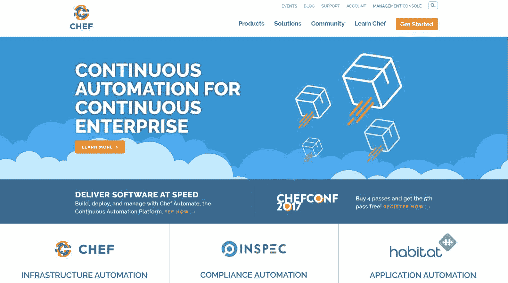

1.  点击 [`chef.io`](https://chef.io) 上的“管理控制台”或前往 [`manage.chef.io/login`](https://manage.chef.io/login)。

1.  在 [`manage.chef.io/login`](https://manage.chef.io/login) 上点击“点击这里开始！”。

1.  提供完整名称、公司名称、电子邮件 ID 和用户名。

1.  勾选“我同意服务条款和主许可及服务协议”框。

1.  点击“开始使用”按钮。

请参考以下截图：

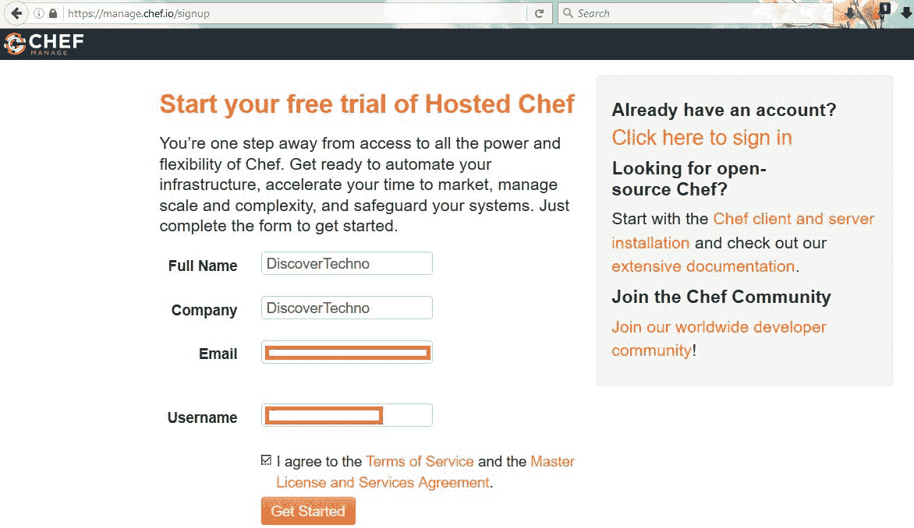

所以显而易见的下一步是前往邮箱并验证电子邮件 ID 以完成注册过程。我们将收到电子邮件验证成功的消息：

1.  提供密码并点击“创建用户”按钮。

1.  现在创建一个组织。

1.  点击“创建新组织”。

1.  提供组织的完整名称和简称。

1.  点击“创建组织”按钮。

请参考以下截图：

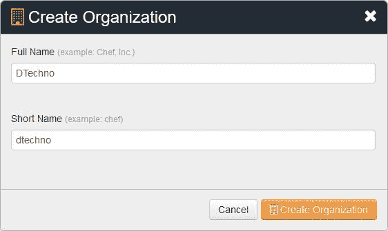

现在，下载一个入门套件：

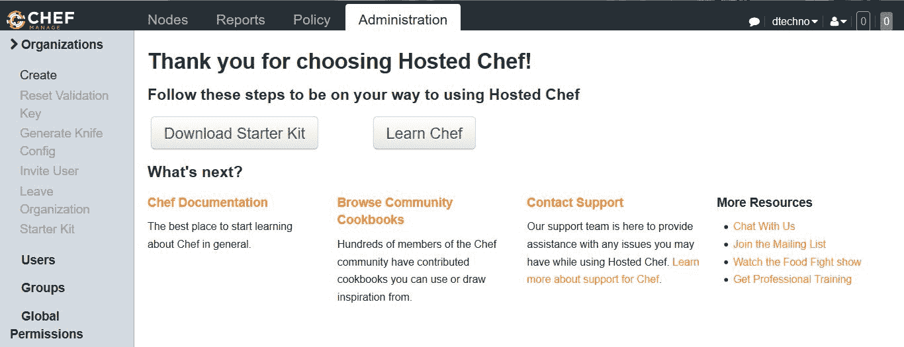

1.  点击“下载入门套件”。

1.  我们将收到确认对话框；点击“继续”。

1.  让我们验证托管 Chef 上可用的操作。

1.  我们还没有配置任何节点，所以节点列表为空。点击“节点”。一旦我们创建并注册节点，我们将能在 Chef 服务器或托管的 Chef 上获取该节点的所有详细信息。

1.  前往“管理”菜单，并点击侧边栏中的“用户”。

1.  验证在注册时创建的用户名、完整名称和电子邮件 ID：

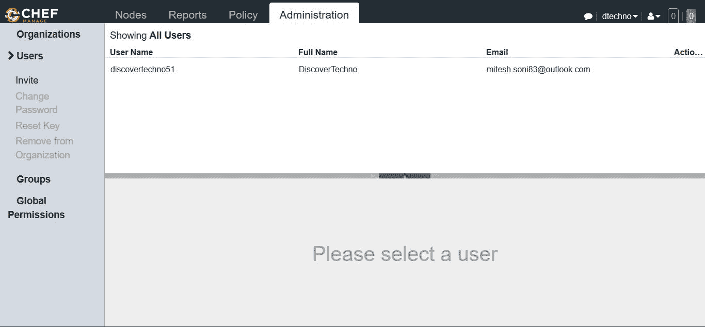

检查“报告”标签，我们将找不到任何数据。原因是节点汇聚的过程（即节点根据 Chef 服务器上可用的配置变得符合要求）尚未发生，因此没有数据。

此时，我们已有一个托管 Chef 账户。

现在，让我们配置一个 Chef 工作站，以便我们可以与托管的 Chef 通信，并汇聚 AWS 和 Microsoft Azure 云中的节点：

1.  根据操作系统，下载 Chef 客户端可安装文件。在我们的案例中，我们使用 CentOS；因此，我们将从 [`downloads.chef.io/chef-client/redhat/`](https://downloads.chef.io/chef-client/redhat/) 下载 Chef 客户端的 Red Hat 版本。

1.  选择操作系统类型。

1.  选择 Chef 客户端版本。

1.  下载安装文件。

Chef-dk 或 Chef 开发工具包用于安装开发工具，也可用于安装 AWS 和 Microsoft Azure 的 knife 插件。请从 [`downloads.chef.io/chef-dk/`](https://downloads.chef.io/chef-dk/) 下载。这将帮助我们安装 `knife-ec2` 和 `knife-azure` 插件，以便在云环境中创建和管理虚拟机。

一旦 Chef 客户端和 Chef 开发工具包的可安装文件准备好，并且托管 Chef 帐户也可用，就可以开始安装和配置 Chef 工作站。让我们在下一节中进行。

# 安装并配置 Chef 工作站

让我们验证是否在我们希望配置 Chef 工作站的系统或虚拟机上安装了 Chef 客户端：

1.  执行 `chef-client -version` 命令；如果出现命令未找到的错误，说明 Chef 客户端没有安装。如果 Chef 客户端已安装，它将显示版本号：

```
 [mitesh@devops1 Desktop]$ chef-client -version
 bash: chef-client: command not found

```

1.  转到下载 Chef 客户端安装包的目录：

```
 [mitesh@devops1 Desktop]$ cd chef/
 [mitesh@devops1 chef]$ ls
 chef-12.9.41-1.el6.x86_64.rpmchefdk-0.13.21-
        1.el6.x86_64.rpm

```

1.  使用 `rpm -ivh chef-<version>.rpm` 来运行 Chef 客户端 RPM：

```
 [mitesh@devops1 chef]$ rpm -ivh chef-12.9.41-   
        1.el6.x86_64.rpm warning: chef-12.9.41-1.el6.x86_64.rpm: Header 
        V4DSA/SHA1 Signature, key ID 83ef826a: NOKEY error: can't create transaction lock on 
        /var/lib/rpm/.rpm.lock (Permission   
        denied)

```

1.  如果在安装 Chef RPM 时权限被拒绝，请使用 `sudo` 来运行命令：

```
 [mitesh@devops1 chef]$ sudo rpm -ivh chef-12.9.41-
        1.el6.x86_64.rpm
 [sudo] password for mitesh:
 warning: chef-12.9.41-1.el6.x86_64.rpm: Header 
        V4DSA/SHA1 Signature, key ID 
        83ef826a: NOKEY
 Preparing...                
        ########################################### [100%]
 1:chef                   
        ########################################### [100%]
 Thank you for installing Chef!

```

1.  安装成功后，验证 Chef 客户端版本，这时我们将获得 Chef 客户端的版本号：

```
 [mitesh@devops1 chef]$ chef-client -version
 Chef: 12.9.41

```

现在我们将使用在托管 Chef 创建帐户时下载的 Chef 启动工具包：

1.  解压 `chef-repo`。将 `.chef` 目录复制到根目录或用户文件夹：

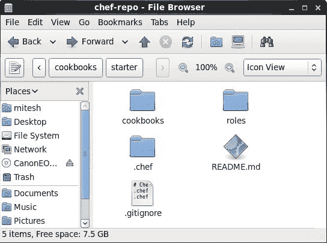

1.  验证 `chef-repo` 目录下是否有 `cookbooks` 文件夹：

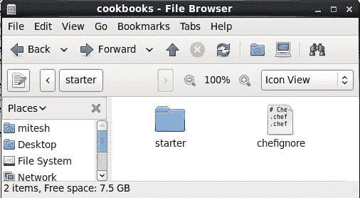

1.  在 `.chef` 文件夹中，用编辑器打开 `knife.rb` 文件，该文件包含各种配置。如果需要，修改 cookbooks 目录的路径：

```
        current_dir = File.dirname(__FILE__)
        log_level                :info
        log_locationSTDOUT
        node_name"discovertechno51"
        client_key"#{current_dir}/discovertechno51.pem"
        validation_client_name"dtechno-validator"
        validation_key"#{current_dir}/dtechno-validator.pem"
        chef_server_url"https://api.chef.io/organizations/dtechno"
        cookbook_path            ["#{current_dir}/../cookbooks"]

```

完成后，我们已经配置好了 Chef 工作站。下一步是使用它来合并节点。

# 使用 Chef 工作站合并 Chef 节点

在本节中，我们将使用 Chef 工作站在节点（物理/虚拟机）上设置运行时环境。

登录到 Chef 工作站：

1.  打开终端并通过执行 `ifconfig` 命令来验证 IP 地址：

```
 [root@devops1 chef-repo]#ifconfig
 eth3      Link encap:EthernetHWaddr00:0C:29:D9:30:7F
 inetaddr:192.168.1.35Bcast:192.168.1.255Mask:255.255.255.0
 inet6addr: fe80::20c:29ff:fed9:307f/64 Scope:Link
 UP BROADCAST RUNNING MULTICAST  MTU:1500Metric:1
 RX packets:841351errors:0dropped:0overruns:0frame:0
 TX packets:610551errors:0dropped:0overruns:0carrier:0
 collisions:0txqueuelen:1000
 RX bytes:520196141 (496.0 MiB)
                  TX bytes:278125183 (265.2 MiB)
 lo        Link encap:Local Loopback 
 inetaddr:127.0.0.1Mask:255.0.0.0
 inet6addr: ::1/128 Scope:Host
 UP LOOPBACK RUNNING  MTU:65536Metric:1
 RX packets:1680errors:0dropped:0overruns:0frame:0
 TX packets:1680errors:0dropped:0overruns:0carrier:0
 collisions:0txqueuelen:0
 RX bytes:521152 (508.9 KiB)  TX bytes:521152 (508.9 KiB)

```

1.  使用 `knife --version` 验证在 Chef 工作站上安装的 knife 版本：

```
 [root@devops1 chef]#knife --version
 Chef: 12.9.41

```

1.  `knife node list` 命令用于获取由 Chef 服务器（在我们的情况下是托管 Chef）提供的节点列表。由于我们还没有合并任何节点，列表将为空：

```
 [root@devops1 chef-repo]#knife node list

```

1.  使用 VMware Workstation 或 VirtualBox 创建虚拟机。安装 CentOS。一旦虚拟机准备就绪，找到其 IP 地址并记录下来。

1.  在 Chef 工作站上，打开终端，并使用`ssh`命令尝试连接到我们刚刚创建的节点或虚拟机：

```
 [root@devops1 chef-repo]#sshroot@192.168.1.37
 The authenticity of the host 192.168.1.37 can't be established:
 RSA key fingerprint is 
        4b:56:28:62:53:59:e8:e0:5e:5f:54:08:c1:0c:1e:6c.
 Are you sure you want to continue connecting (yes/no)? yes
 Warning: Permanently added '192.168.1.37' (RSA)
        to the list of known hosts.
 root@192.168.1.37's password:
 Last login: Thu May 28 10:26:06 2015 from 192.168.1.15

```

1.  现在我们已经通过 Chef 工作站在节点上建立了 SSH 会话。如果你验证 IP 地址，你会知道你正在通过远程（SSH）访问不同的机器：

```
 [root@localhost ~]#ifconfig
 eth1      Link encap:EthernetHWaddr00:0C:29:44:9B:4B
 inetaddr:192.168.1.37Bcast:192.168.1.255Mask:255.255.255.0
 inet6addr: fe80::20c:29ff:fe44:9b4b/64 Scope:Link
 UP BROADCAST RUNNING MULTICAST  MTU:1500Metric:1
 RX packets:11252errors:0dropped:0overruns:0frame:0
 TX packets:6628errors:0dropped:0overruns:0carrier:0
 collisions:0txqueuelen:1000
 RX bytes:14158681 (13.5 MiB)  TX bytes:466365 (455.4 KiB)
 lo        Link encap:Local Loopback 
 inetaddr:127.0.0.1Mask:255.0.0.0
 inet6addr: ::1/128 Scope:Host
 UP LOOPBACK RUNNING  MTU:65536Metric:1
 RX packets:59513errors:0dropped:0overruns:0frame:0
 TX packets:59513errors:0dropped:0overruns:0carrier:0
 collisions:0txqueuelen:0
 RX bytes:224567119 (214.1 MiB)
                  TX bytes:224567119 (214.1 MiB)
 [root@localhost ~]#

```

1.  使用 knife 收敛节点。提供 IP 地址/DNS 名称、用户、密码和节点名称。

1.  验证输出：

```
 [root@devops1 chef-repo]# knife bootstrap 
        192.168.1.37 -x root -P cloud@123 -
        N tomcatserver
 Doing old-style registration with the validation    
        key at /home/mitesh/chef-               
        repo/.chef/dtechno-validator.pem...
 Delete your validation key in order to use your 
        user credentials instead
 Connecting to 192.168.1.37
 192.168.1.37 -----> Installing Chef Omnibus (-v 12)
 192.168.1.37 downloading
        https://omnitruck-direct.chef.io/chef/install.sh
 192.168.1.37   to file /tmp/install.sh.26574/install.sh
 192.168.1.37 trying wget...
 192.168.1.37 el 6 x86_64
 192.168.1.37 Getting information for chef stable 12 for el...
 192.168.1.37 downloading https://omnitruck-
        direct.chef.io/stable/chef/metadata?v=12&p=el&pv=6&m=x86_64
 192.168.1.37   to file /tmp/install.sh.26586/metadata.txt
 192.168.1.37 trying wget...
 192.168.1.37 sha1859bc9be9a40b8b13fb88744079ceef1832831b0
 192.168.1.37   
        sha256c43f48e5a2de56e4eda473a3e
        e0a80aa1aaa6c8621d9084e033d8b9cf3efc328 
 192.168.1.37 urlhttps://packages.chef.io/stable/el/6/chef-12.9.41-
        1.el6.x86_64.rpm
 192.168.1.37 version12.9.41
 192.168.1.37 downloaded metadata file looks valid...
 192.168.1.37 downloading 
        https://packages.chef.io/stable/el/6/chef-12.9.41-
        1.el6.x86_64.rpm
 192.168.1.37   to file /tmp/install.sh.26586/chef-
        12.9.41-1.el6.x86_64.rpm
 192.168.1.37 trying wget...
 192.168.1.37 Comparing checksum with sha256sum...
 192.168.1.37 Installing chef 12
 192.168.1.37 installing with rpm...
 192.168.1.37 warning: /tmp/install.sh.26586/chef-
        12.9.41-1.el6.x86_64.rpm:      
        Header V4DSA/SHA1 Signature, key ID 83ef826a: NOKEY
 192.168.1.37 Preparing...                ########################################### [100%]
 192.168.1.37    1:chef                  
              ########################################### [100%]
 192.168.1.37 Thank you for installing Chef!
 192.168.1.37 Starting the first Chef Client run...
 192.168.1.37 Starting Chef Client, version 12.9.41
 192.168.1.37 Creating a new client identity for 
        tomcatserver using the validator key.
 192.168.1.37 resolving cookbooks for run list: []
 192.168.1.37 Synchronizing Cookbooks:
 192.168.1.37 Installing Cookbook Gems:
 192.168.1.37 Compiling Cookbooks...
 192.168.1.37 [2016-05-12T23:47:49-07:00] WARN: 
        Node tomcatserver has an empty 
        run list.
 192.168.1.37 Converging 0 resources
 192.168.1.37
 192.168.1.37 Running handlers:
 192.168.1.37 Running handlers complete
 192.168.1.37 Chef Client finished, 0/0 resources 
        updated in 37 seconds

```

1.  节点收敛成功：

    1.  在日志中验证第一次 Chef 客户端运行。

    1.  验证已安装的 Chef 客户端版本。

    1.  在日志中验证空运行列表消息。

    1.  验证 0 资源消息的收敛。

1.  我们可以通过访问托管的 Chef 帐户并验证“节点名称”和“IP 地址”是否在“节点”部分中可用，来检查前面的过程是否成功。

1.  在仪表板中，转到“详细信息”标签以获取有关节点的更多信息；验证与节点相关的属性以及权限：

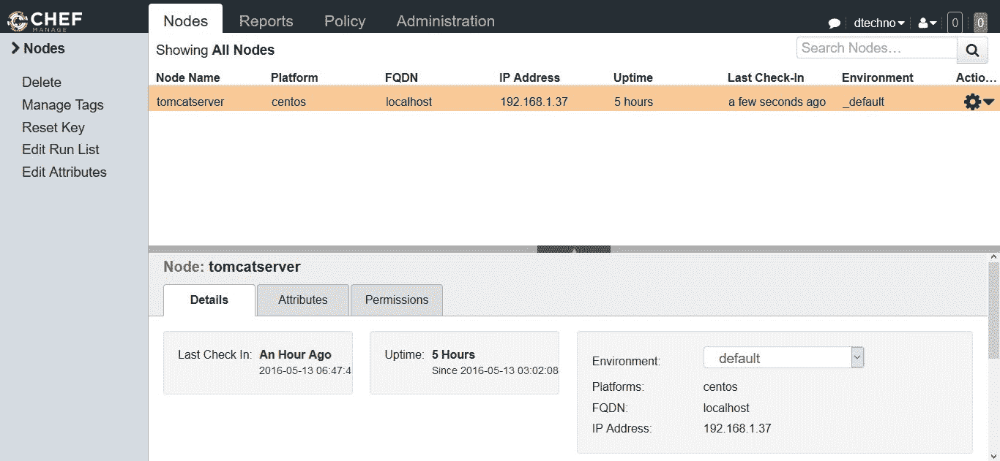

1.  在托管的 Chef 仪表板的底部部分，验证节点的 CPU 属性和其他详细信息。

1.  报告部分提供了关于运行摘要、运行持续时间和运行计数的详细信息：

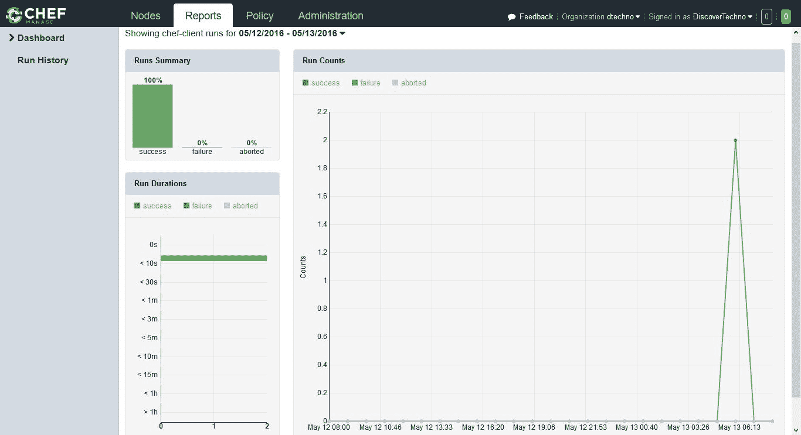

在下一部分，我们将尝试使用 Chef 安装 Tomcat。

# 使用食谱安装软件包

到目前为止，我们已经完成了以下任务：

+   创建托管的 Chef 帐户

+   配置 Chef 工作站

+   使用 Chef 工作站收敛节点

现在我们将使用社区食谱安装应用程序包。

为了自动设置运行时环境，最好使用 Chef 社区的食谱：

1.  访问[`github.com/chef-cookbooks`](https://github.com/chef-cookbooks)，并查找设置运行时环境所需的所有社区食谱。

1.  我们使用的是一个示例 Spring 应用程序，即 PetClinic。我们需要安装 Java 和 Tomcat 来运行像这样的 Java EE 应用程序。

1.  从[`supermarket.chef.io/cookbooks/tomcat`](https://supermarket.chef.io/cookbooks/tomcat)下载 Tomcat 食谱，并导航到该页面的依赖项部分。如果依赖项没有上传到 Chef 服务器，我们就无法上传 Tomcat 食谱并使用它。

1.  从[`supermarket.chef.io/cookbooks/openssl`](https://supermarket.chef.io/cookbooks/openssl)和[`supermarket.chef.io/cookbooks/chef-sugar`](https://supermarket.chef.io/cookbooks/chef-sugar)下载 OpenSSL 和 Chef sugar。

1.  要安装 Java，下载[`supermarket.chef.io/cookbooks/java`](https://supermarket.chef.io/cookbooks/java)上的食谱及其依赖项，还需要从[`supermarket.chef.io/cookbooks/apt`](https://supermarket.chef.io/cookbooks/apt)下载。将所有压缩文件解压到食谱的目录中：

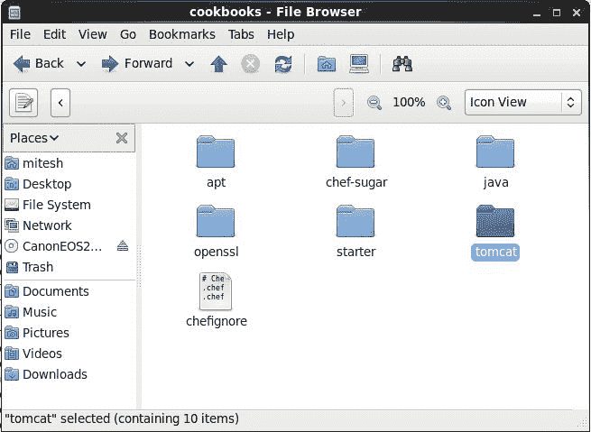

1.  转到终端中的食谱目录并执行`ls`命令，验证我们之前下载的社区食谱的子目录：

```
 [root@devops1 cookbooks]# ls
 apt  chefignore  chef-sugar  java  openssl  starter  tomcat
 [root@devops1 cookbooks]# cd ..

```

1.  让我们上传其中一个食谱并验证它是否已上传到托管 Chef 上。使用`knife cookbook upload apt`命令上传 apt 食谱，如下所示：

```
 [root@devops1 chef-repo]# knife cookbook upload apt
 Uploading apt          [3.0.0]
 Uploaded 1 cookbook.

```

1.  进入托管 Chef 仪表板并点击“策略”。进入托管 Chef 实例中的“食谱”部分，查看 apt 食谱是否已上传：

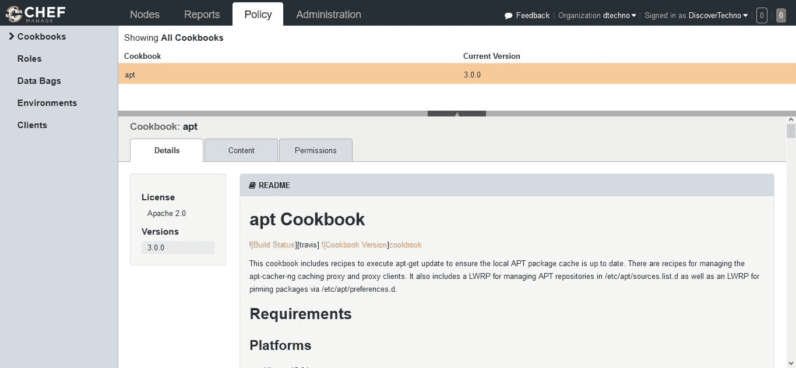

1.  我们需要上传所有依赖项的食谱，以便 Tomcat 食谱能够上传，否则它会给我们报错。按顺序上传所有其他食谱：

```
 [root@devops1 chef-repo]# knife cookbook upload chef-sugar
 Uploading chef-sugar     [3.3.0]
 Uploaded 1 cookbook.
 [root@devops1 chef-repo]# knife cookbook upload java
 Uploading java           [1.39.0]
 Uploaded 1 cookbook.
 [root@devops1 chef-repo]# knife cookbook upload openssl
 Uploading openssl        [4.4.0]
 Uploaded 1 cookbook.
 [root@devops1 chef-repo]# knife cookbook upload tomcat
 Uploading tomcat         [0.17.0]
 Uploaded 1 cookbook.

```

1.  进入托管 Chef 仪表板并验证所有食谱：

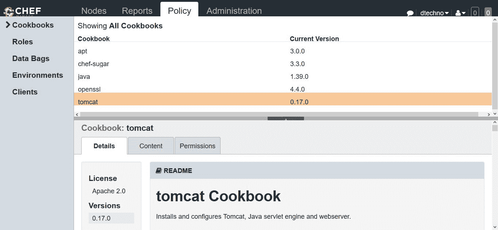

一旦我们将所有食谱上传到托管 Chef，让我们创建一个角色。

# 创建角色

在这个阶段，所有必需的食谱已上传到托管 Chef。现在，让我们在托管 Chef 上创建一个角色。

在创建角色之前，让我们了解一下它的含义。

角色是为特定功能创建的。它为各种模式和工作流过程提供了一条路径。

例如，Web 服务器角色可以包含 Tomcat 服务器食谱和任何自定义属性：

1.  进入托管 Chef 仪表板中的“策略”并点击侧边菜单中的“角色”。点击“创建角色”以创建一个角色。

1.  在创建角色窗口中，提供一个名称和`描述`。

1.  点击“下一步”。

请参考以下截图：

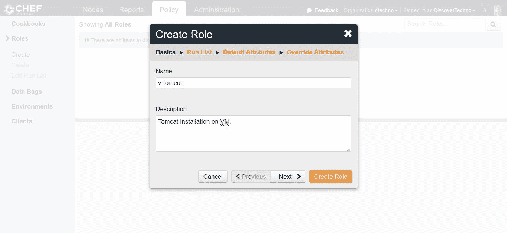

1.  运行列表以特定的方式和顺序保存角色/食谱。它可以被认为是节点的规范。

1.  从“可用食谱”列表中选择 Tomcat。

1.  将 Tomcat 食谱拖到当前运行列表中。

1.  点击“创建角色”。

请参考以下截图：

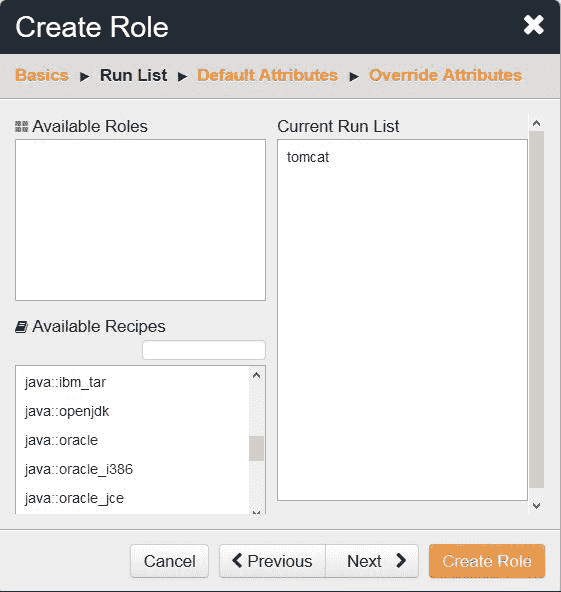

1.  在托管 Chef 仪表板的“策略”选项卡中检查新添加的角色：

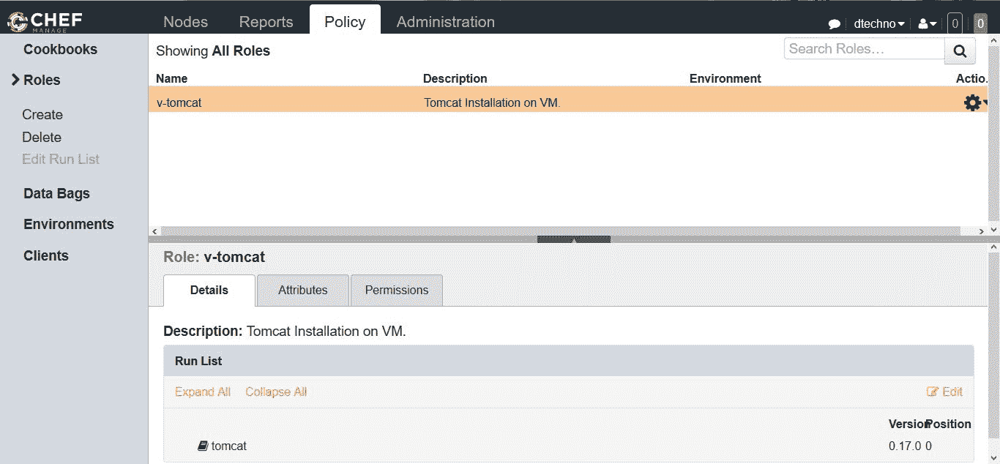

1.  现在，让我们在终端中合并节点时指定一个角色。使用`knife node run_list add tomcatserver "role[v-tomcat]"`将角色添加到节点：

```
 [root@devops1 chef-repo]# knife node run_list add 
        tomcatserver "role[v-tomcat]"
 tomcatserver:
 run_list: role[v-tomcat]
 [root@devops1 chef-repo]#

```

1.  `v-tomcat`角色现在与`tomcatserver`节点相关联。

1.  进入节点并执行`chef-client`；它将执行步骤，使节点状态与分配的角色保持一致：

```
 [root@localhost Desktop]# chef-client
 Starting Chef Client, version 12.9.41
 resolving cookbooks for run list: ["tomcat"]
 Synchronizing Cookbooks:
 - tomcat (0.17.0)
 - chef-sugar (3.3.0)
 - java (1.39.0) 
 - apt (3.0.0)
 - openssl (4.4.0)
 Installing Cookbook Gems:
 Compiling Cookbooks...
 .
 .
 .
 Chef Client finished, 11/15 resources updated in 09 minutes 59 
        seconds
 You have new mail in /var/spool/mail/root

```

1.  进入节点并检查 Tomcat 是否可用：

```
 [root@localhost Desktop]# service tomcat6 status
 tomcat6 (pid 39782) is running...                          [  OK  ]
 You have new mail in /var/spool/mail/root

```

1.  进入托管 Chef 账户中的“报告”选项卡，获取节点合并的最新详情：

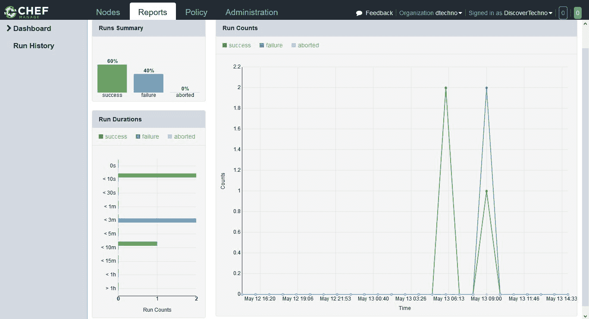

在这个阶段，我们已经准备好了一个托管的 Chef 账户、配置好的工作站和已合并的节点。

在接下来的部分中，我们将为一些流行的云平台安装 knife 插件。

# 为 Amazon Web Services 和 Microsoft Azure 安装 knife 插件

我们的目标是安装应用程序包，以为我们的基于 Java 的 Petclinic 应用程序提供运行时环境。在传统环境中，我们需要提出物理服务器的获取请求，然后基础设施团队帮助我们在其上安装不同的软件，提供应用程序的运行时环境。通过 Chef，我们可以使用社区食谱安装这些包，从而轻松实现自动化。

在本节中，我们将使用云资源。Amazon EC2 和 Microsoft Azure 是两个非常受欢迎的公共云资源提供商。我们将在云环境中创建虚拟机，然后使用 Chef 配置管理工具安装不同的应用程序包：

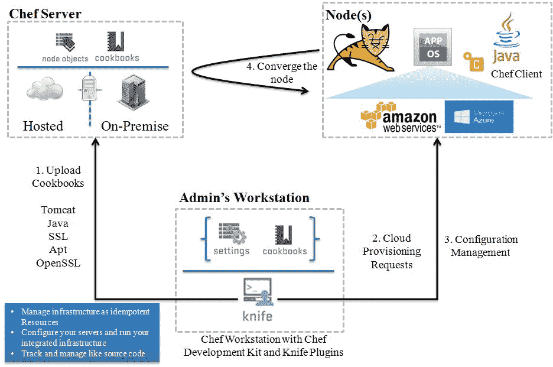

1.  首先，我们将使用 Chef 工作站和 knife 插件在 Amazon EC2 和 Microsoft Azure 中配置虚拟机。

1.  进入 Chef 工作站。

1.  执行`knife`命令在 Amazon EC2 和 Microsoft Azure 中创建实例（Chef 节点）。

以下是该过程的工作流程：

1.  在 Chef 工作站上执行命令，以在云环境中创建新实例。

1.  在 Amazon EC2 和 Microsoft Azure 中创建了一个新实例，并且它已经启动并运行（Chef 节点可用）。

1.  Chef 节点与 Chef 服务器进行通信。

1.  Chef 服务器指示 Chef 节点执行任务列表并下载 Chef 客户端。

1.  Chef 服务器和 Chef 节点之间会进行安全握手；Chef 服务器生成安全证书，用于验证新节点即将发出的查询。

1.  Chef 节点执行任务并向 Chef 服务器报告其合规性。

使用 Chef 配置管理工具与不同公共云服务提供商的主要好处如下：

+   更快的市场推出时间

+   集中控制

+   标准策略

+   部署应用程序的一致环境

+   更少或没有手动操作和由于手动限制产生的错误

+   快速应用开发

+   轻松回滚

+   高可用性和灾难恢复，确保在当今时代的商业连续性

+   可供所有人访问的社区食谱

**Chef 开发工具包**（**ChefDK**）提供了由 Chef 社区构建的开发工具，简化了 knife 插件的安装。

访问[`downloads.chef.io/chef-dk/`](https://downloads.chef.io/chef-dk/)并根据我们使用的操作系统下载 ChefDK。

在我们的案例中，选择 Red Hat Enterprise Linux 并选择 ChefDK 版本。点击 Red Hat Enterprise Linux 6 并下载，因为它适用于 64 位（`x86_64`）版本的 Red Hat Enterprise Linux 和 CentOS 6：

```
[root@localhost Desktop]# sudo rpm -ivh chefdk-0.13.21-1.el6.x86_64.rpm
Preparing...                ###########################################    [100%]   1:chefdk                 ###########################################    [100%]
Thank you for installing Chef Development Kit!

```

执行`chef gem install knife-ec2`命令来创建、启动和管理 Amazon EC2 实例。更多详情请访问[`github.com/chef/knife-ec2`](https://github.com/chef/knife-ec2)：

```
[root@localhost Desktop]# chef gem install knife-ec2
Fetching: knife-ec2-<version>.gem (100%)
.
.
Successfully installed knife-ec2-<version>
1 gem installed

```

执行`knife ec2 --help`命令查看可用的 Amazon EC2 命令：

```
[root@localhost Desktop]# knife ec2 --help

** EC2 COMMANDS **
knife ec2 amis ubuntu DISTRO [TYPE] (options)
knife ec2 flavor list (options)
knife ec2 server create (options)
knife ec2 server delete SERVER [SERVER] (options)
knife ec2 server list (options)

```

在`knife.rb`文件中配置 Amazon EC2 凭证以供`knife`插件使用。

使用`knife[:aws_access_key_id]`和`knife[:aws_secret_access_key]`，如示例所示：

```
knife[:aws_access_key_id] = "Your AWS Access Key ID"
knife[:aws_secret_access_key] = "Your AWS Secret Access Key"

```

执行`chef gem install knife-azure`命令来创建、启动和管理 Microsoft Azure 虚拟机。更多详情请访问[`github.com/chef/knife-ec2`](https://github.com/chef/knife-ec2)：

```
[root@localhost Desktop]# chef gem install knife-azure -v 1.5.2
Fetching: knife-azure-1.5.2.gem (100%)

Successfully installed knife-azure-1.5.2
1 gem installed

```

使用`knife azure --help`验证可用的 Azure 命令：

```
[root@localhost Desktop]# knife azure --help

** AZURE COMMANDS **
knife azure ag create (options)
knife azure ag list (options)
knife azure image list (options)
knife azure internal lb create (options)
knife azure internal lb list (options)
knife azure server create (options)
knife azure server delete SERVER [SERVER] (options)
knife azure server list (options)
knife azure server show SERVER [SERVER]
knife azure vnet create (options)
knife azure vnet list (options)

```

# 在 Amazon EC2 中创建和配置虚拟机

使用`knife node list`命令获取节点列表，以便了解通过 Chef 已配置了多少个节点：

```
root@devops1 Desktop]# knife node list
tomcatserver

```

使用`knife ec2 server create`命令并带上以下参数来创建新的虚拟机：

| **参数** | **值** | **描述** |
| --- | --- | --- |
| `-I` | `ami-1ecae776` | 这是 Amazon 镜像 ID |
| `-f` | `t2.micro` | 这是虚拟机的类型 |
| `-N` | DevOpsVMonAWS | 这是 Chef 节点的名称 |
| `--aws-access-key-id` | 您的访问密钥 ID | 这是 AWS 账户的访问密钥 ID |
| `--aws-secret-access-key` | 您的秘密访问密钥 | 这是 AWS 账户的秘密访问密钥 |
| `-S` | Book | 这是 SSH 密钥 |
| `--identity-file` | `book.pem` | 这是 PEM 文件 |
| `--ssh-user` | `ec2-user` | 这是 AWS 实例的用户 |
| `-r` | `role[v-tomcat]` | 这是 Chef 角色 |

让我们使用 `knife` 插件创建一个 EC2 实例：

```
[root@devops1 Desktop]# knife ec2 server create -I ami-1ecae776 -f t2.micro -N DevOpsVMonAWS --aws-access-key-id '< Your Access Key ID >' --aws-secret-access-key '< Your Secret Access Key >' -S book --identity-file book.pem --ssh-user ec2-user -r role[v-tomcat] 

Instance ID: i-640d2de3
Flavor: t2.micro
Image: ami-1ecae776
Region: us-east-1
Availability Zone: us-east-1a
Security Groups: default
Tags: Name: DevOpsVMonAWS
SSH Key: book

Waiting for EC2 to create the instance......
Public DNS Name: ********************.compute-1.amazonaws.com
Public IP Address: **.**.***.***
Private DNS Name: ip-***-**-1-27.ec2.internal
Private IP Address: ***.**.*.27

```

此时，AWS EC2 实例已经创建，并处于 `等待 sshd 访问变为可用` 状态：

```

Waiting for sshd access to become available....................done 

Creating new client for DevOpsVMonAWS
Creating new node for DevOpsVMonAWS
Connecting to ec2-**-**-***-***.compute-1.amazonaws.com

ec2-**-**-***-***.compute-1.amazonaws.com -----> Installing Chef Omnibus (-v 12)
.
.
ec2-**-**-***-***.compute-1.amazonaws.com version12.9.41
ec2-**-**-***-***.compute-1.amazonaws.com downloaded metadata file looks valid...
ec2-**-**-***-***.compute-1.amazonaws.com downloading https://packages.chef.io/stable/el/6/chef-12.9.41-1.el6.x86_64.rpm
ec2-**-**-***-***.compute-1.amazonaws.com    1:chef-12.9.41-1.el6               ################################# [100%]

ec2-**-**-***-***.compute-1.amazonaws.com Thank you for installing Chef! 

```

现在，Chef 客户端已经安装在 AWS 实例上，准备进行第一次 `Chef Client run`，版本为 `12.9.41`：

```
ec2-**-**-***-***.compute-1.amazonaws.com Starting the first Chef Client run...
ec2-**-**-***-***.compute-1.amazonaws.com Starting Chef Client, version 12.9.41

```

它现在准备好根据角色解析 cookbook 并安装运行时环境：

```
ec2-**-**-***-***.compute-1.amazonaws.com resolving cookbooks for run list: ["tomcat"] 
ec2-**-**-***-***.compute-1.amazonaws.com Synchronizing Cookbooks:
ec2-**-**-***-***.compute-1.amazonaws.com   - tomcat (0.17.0)
ec2-**-**-***-***.compute-1.amazonaws.com   - java (1.39.0)
ec2-**-**-***-***.compute-1.amazonaws.com   - apt (3.0.0)
ec2-**-**-***-***.compute-1.amazonaws.com   - openssl (4.4.0)
ec2-**-**-***-***.compute-1.amazonaws.com   - chef-sugar (3.3.0)

ec2-**-**-***-***.compute-1.amazonaws.com Installing Cookbook Gems:
ec2-**-**-***-***.compute-1.amazonaws.com Compiling Cookbooks...

ec2-**-**-***-***.compute-1.amazonaws.com Converging 3 resources
ec2-**-**-***-***.compute-1.amazonaws.com Recipe: tomcat::default
ec2-**-**-***-***.compute-1.amazonaws.com   * yum_package[tomcat6] action install
ec2-**-**-***-***.compute-1.amazonaws.com     - install version 6.0.45-1.4.amzn1 of package tomcat6
ec2-**-**-***-***.compute-1.amazonaws.com   * yum_package[tomcat6-admin-webapps] action install
ec2-**-**-***-***.compute-1.amazonaws.com     - install version 6.0.45-1.4.amzn1 of package tomcat6-admin-webapps
ec2-**-**-***-***.compute-1.amazonaws.com   * tomcat_instance[base] action configure (up to date)

```

现在运行环境已准备好，可以在 AWS 实例中启动 Tomcat 服务；请验证日志：

```
ec2-**-**-***-***.compute-1.amazonaws.com 
ec2-**-**-***-***.compute-1.amazonaws.com   * service[tomcat6] action start
.
.
ec2-**-**-***-***.compute-1.amazonaws.com Chef Client finished, 13/15 resources updated in 01 minutes 13 seconds

```

以下是新创建的 AWS 实例的详细信息：

```
Instance ID: i-********
Flavor: t2.micro
Image: ami-1ecae776
Region: us-****-1
Availability Zone: us-****-1a
Security Groups: default
Security Group Ids: default
Tags: Name: DevOpsVMonAWS
SSH Key: book
Root Device Type: ebs
Root Volume ID: vol-1e0e83b5
Root Device Name: /dev/xvda
Root Device Delete on Terminate: true
Public DNS Name: ec2-**-**-***-***.compute-1.amazonaws.com
Public IP Address: 52.90.219.205
Private DNS Name: ip-172-31-1-27.ec2.internal
Private IP Address: 172.31.1.27
Environment: _default
Run List: role[v-tomcat]
You have new mail in /var/spool/mail/root
[root@devops1 Desktop]#

```

访问 [`aws.amazon.com/`](https://aws.amazon.com/) 并登录。

转到 Amazon EC2 部分，在左侧边栏点击“实例”，或在资源页面的“正在运行的实例”部分查看 AWS 实例的详细信息。

验证在 Chef 客户端运行中获得的名称、标签、公共 DNS 以及其他详细信息，和 Amazon 仪表盘上的信息是否一致：

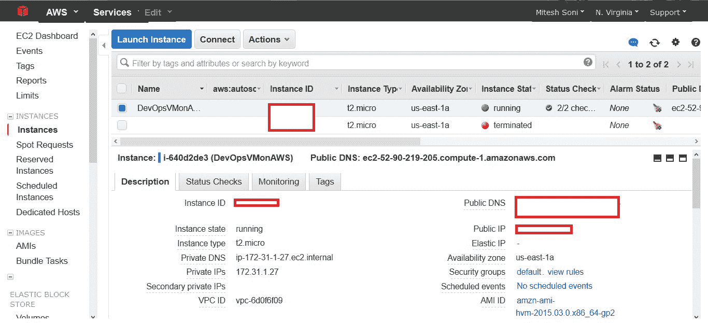

现在，让我们进入托管的 Chef 仪表盘，点击“节点”来验证在 Amazon EC2 中新创建/合并的节点：

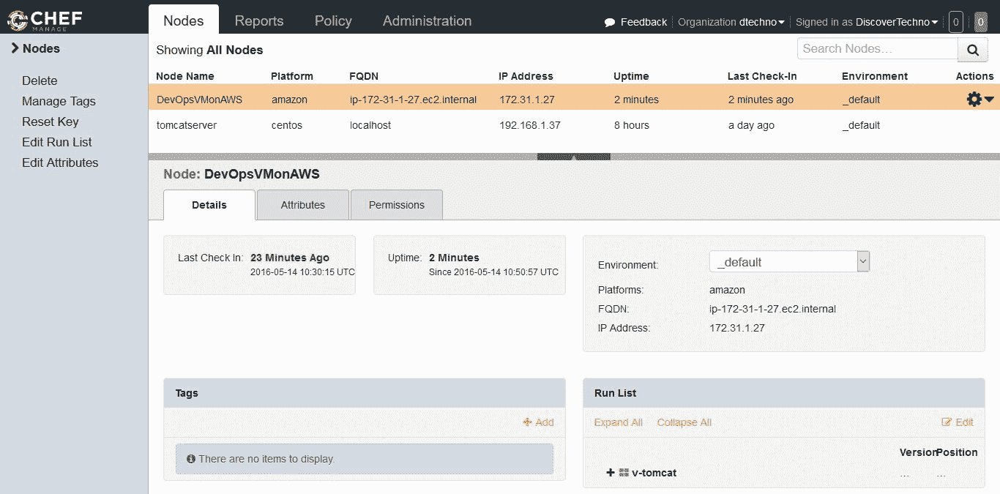

验证实例详细信息和运行列表：

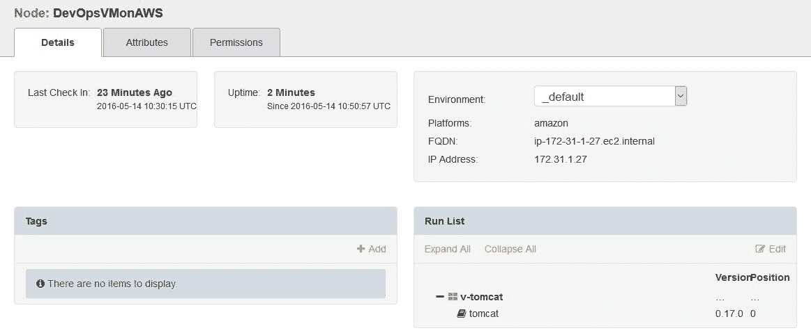

在 Amazon EC2 中创建了一个实例并安装了 Tomcat，且其服务也已启动，我们可以验证它是否真的在运行。

让我们尝试通过实例的公共域名访问安装在 AWS 实例上的 Tomcat 服务器：

1.  如果出现连接超时错误，那么原因可能是 AWS 安全组的限制。请进入 AWS 实例中的安全组：

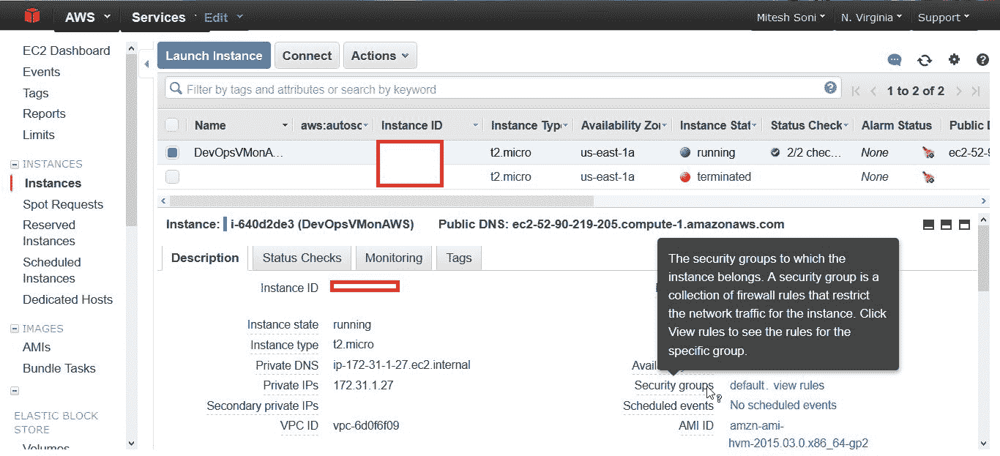

1.  在 AWS 门户中，转到安全组部分，选择默认安全组，验证入站规则。我们可以看到只有 SSH 规则可用；我们需要允许端口 `8080` 以便访问：

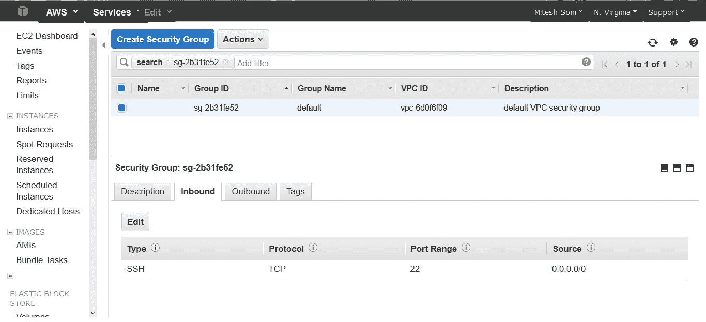

1.  让我们创建一个新的自定义规则，开放 8080 端口：


1.  现在，尝试访问公共域名 URL，我们将在 AWS 实例上看到 Tomcat 页面。

在接下来的部分中，我们将创建并配置一个 Microsoft Azure 的虚拟机。

# 在 Microsoft Azure 中创建和配置虚拟机

要创建和配置 Chef 与 Microsoft Azure 的集成，我们需要提供 Microsoft Azure 账户和凭证。要获取 Microsoft Azure 凭证，请下载 `publishsettings` 文件并执行以下步骤：

1.  使用登录名和密码登录 Microsoft Azure 门户，并从 [`manage.windowsazure.com/publishsettings/index?client=xplat`](https://manage.windowsazure.com/publishsettings/index?client=xplat) 下载 `publishsettings` 文件。

1.  将其复制到 Chef 工作站，并通过在 `knife.rb` 文件中创建条目来引用该本地文件：

```
        knife[:azure_publish_settings_file] = "~/<name>.publishsettings"

```

1.  以下是创建 Microsoft Azure 公共云中虚拟机的参数：

| **参数** | **值** | **描述** |
| --- | --- | --- |
| `--azure-dns-name` | `distechnodemo` | 这是 DNS 名称 |
| `--azure-vm-name` | `dtserver02` | 这是虚拟机的名称 |
| `--azure-vm-size` | `Small` | 这是虚拟机的大小 |
| `-N` | `DevOpsVMonAzure2` | 这是 Chef 节点的名称 |
| `--azure-storage-account` | `classicstorage9883` | 这是 Azure 的存储账户 |
| `--bootstrap-protocol` | `cloud-api` | 这是启动协议 |
| `--azure-source-image` | `5112500ae3b842c8b9c604889f8753c3__OpenLogic-CentOS-67-20160310` | 这是 Azure 源镜像的名称 |
| `--azure-service-location` | `Central US` | 这是虚拟机托管的 Azure 地理位置 |
| `--ssh-user` | `dtechno` | 这是 SSH 用户 |
| `--ssh-password` | `<YOUR PASSWORD>` | 这是 SSH 密码 |
| `-r` | `role[v-tomcat]` | 这是角色 |
| `--ssh-port` | `22` | 这是 SSH 端口 |

我们已经成功安装了 `knife azure` 插件。现在，我们可以通过执行以下命令来创建 Microsoft Azure Cloud 中的虚拟机：`knife azure server create`：

```
[root@devops1 Desktop]# knife azure server create --azure-dns-name 'distechnodemo' --azure-vm-name 'dtserver02' --azure-vm-size 'Small' -N DevOpsVMonAzure2 --azure-storage-account 'classicstorage9883' --bootstrap-protocol 'cloud-api' --azure-source-image '5112500ae3b842c8b9c604889f8753c3__OpenLogic-CentOS-67-20160310' --azure-service-location 'Central US' --ssh-user 'dtechno' --ssh-password 'cloud@321' -r role[v-tomcat] --ssh-port 22 
.
.
.
Creating new node for DevOpsVMonAzure2
.........
Waiting for virtual machine to reach status 'provisioning'..............vm state 'provisioning' reached after 2.47 minutes.
..

DNS Name: distechnodemo.cloudapp.net
VM Name: dtserver02
Size: Small
Azure Source Image: 5112500ae3b842c8b9c604889f8753c3__OpenLogic-CentOS-67-20160310
Azure Service Location: Central US
Private Ip Address: 100.73.210.70
Environment: _default

Runlist: ["role[v-tomcat]"]

```

现在，我们将从 Microsoft Azure 公共云的资源配置开始：

```
Waiting for Resource Extension to reach status 'wagent provisioning'.....Resource extension state 'wagent provisioning' reached after 0.17 minutes.

Waiting for Resource Extension to reach status 'installing'....................Resource extension state 'installing' reached after 2.21 minutes.
Waiting for Resource Extension to reach status 'provisioning'.....Resource extension state 'provisioning' reached after 0.19 minutes.
..
DNS Name: distechnodemo.cloudapp.net
VM Name: dtserver02
Size: Small
Azure Source Image: 5112500ae3b842c8b9c604889f8753c3__OpenLogic-CentOS-67-20160310
Azure Service Location: Central US
Private Ip Address: 100.73.210.70
Environment: _default
Runlist: ["role[v-tomcat]"]
[root@devops1 Desktop]#

```

1.  在浏览器中打开托管的 Chef 账户，并点击 Nodes 标签。

1.  验证我们在 Microsoft Azure 公共云上创建的新节点是否已在托管的 Chef 服务器上注册。

1.  我们可以看到 `DevOpsVMonAzure2` 节点名称：

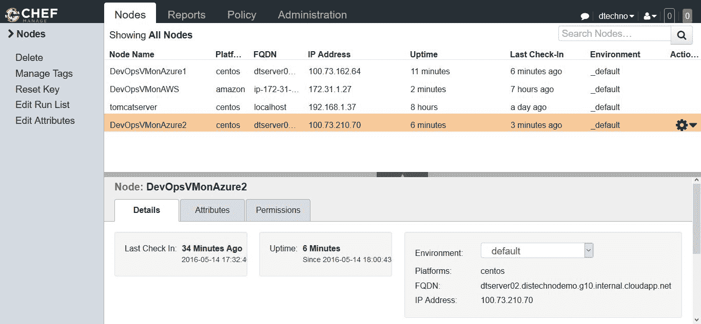

1.  转到 Microsoft Azure 门户并点击虚拟机（VIRTUAL MACHINES）部分，验证使用 Chef 配置管理工具创建的新虚拟机：

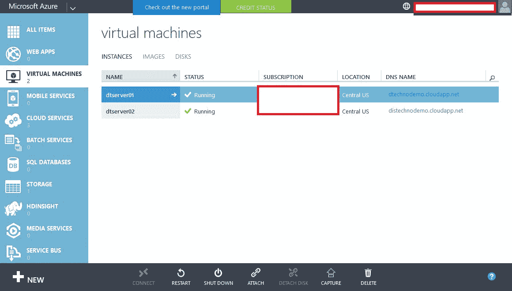

1.  点击 Microsoft Azure 仪表板中的虚拟机（VIRTUAL MACHINES），并验证虚拟机的详细信息：

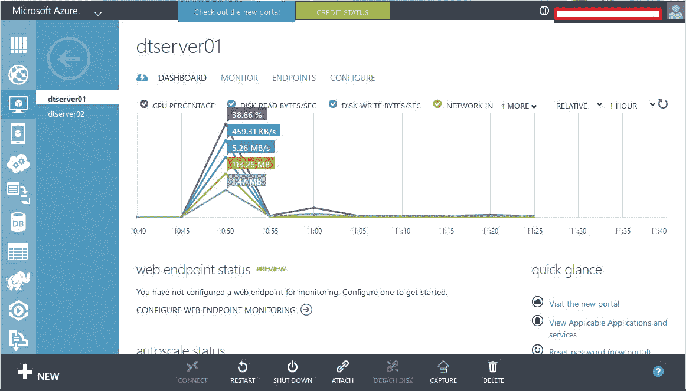

1.  滚动到虚拟机页面底部，验证扩展部分。

1.  检查是否显示启用了 chef-service：

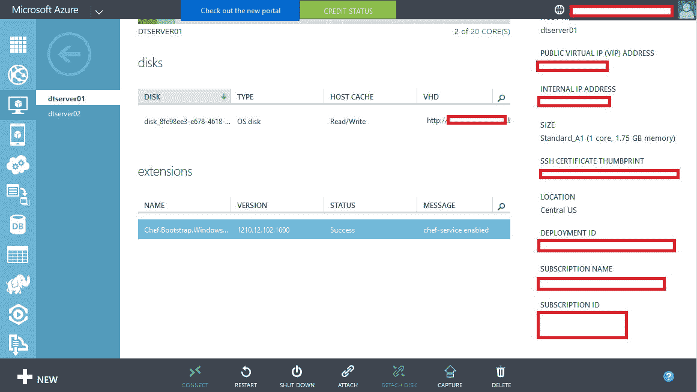

我们现在已经使用安装的运行时环境和角色，通过 `knife` 插件在 Amazon EC2 和 Microsoft Azure 中创建了虚拟机。

# 总结

在本章中，我们安装并配置了 Chef 工作站，合并了节点，创建了角色，并安装了基于 Java 的 Web 应用程序的运行时环境。我们还使用了 `knife` 插件在 Microsoft Azure 和 Amazon EC2 上创建虚拟机，并使用角色安装运行时环境。

在下一章，我们将看到如何使用脚本或插件以自动化的方式将基于 Java 的 Web 应用程序部署到 Web 服务器中。

我们将把我们的 WAR 文件部署到本地或远程的 Tomcat。远程 Tomcat 将部署在 Amazon EC2、Microsoft Azure 虚拟机、AWS Elastic Beanstalk 或 Microsoft Azure Web Apps 上。
