# 持续交付

技术并不重要。重要的是你要相信人们，他们本质上是善良和聪明的，如果你给他们工具，他们会用这些工具做出奇妙的事情。                                                                                                                              - 史蒂夫·乔布斯

我们已经了解了不同的 DevOps 实践，如持续集成、容器化和配置管理。接下来，我们将了解如何将包文件部署到 Web 容器或 Web 服务器。我们将使用 Apache Tomcat 作为 Web 服务器，在云虚拟机中部署我们的 Java 应用程序。

本章的主要目标是让你了解不同的应用包部署到 Web 服务器的方式。这些方式可以根据团队可用的访问权限来选择，一旦我们实现了向 Web 服务器的自动化交付，我们就可以在整体构建流程中使用这个操作。

因此，我们可以创建一个构建管道，这种协调将帮助我们实现持续交付和持续部署。

本章将涵盖以下主题：

+   使用 Jenkins 插件在 Docker 容器中实现持续交付

+   使用脚本在 AWS EC2 和 Microsoft Azure 虚拟机中实现持续交付

+   使用 Jenkins 插件在 AWS Elastic Beanstalk 中实现持续交付

+   使用 FTP 在 Microsoft Azure 应用服务中实现持续交付

+   使用 VSTS 在 Microsoft Azure 应用服务中实现持续交付

# 使用 Jenkins 插件在 Docker 容器中实现持续交付

让我们了解如何使用 Jenkins 插件在 Tomcat 中部署 Web 应用程序。

我们可以按照以下几个步骤操作：

+   运行 Apache Tomcat

+   使用正确的 IP 地址和端口号组合访问 Tomcat 首页：

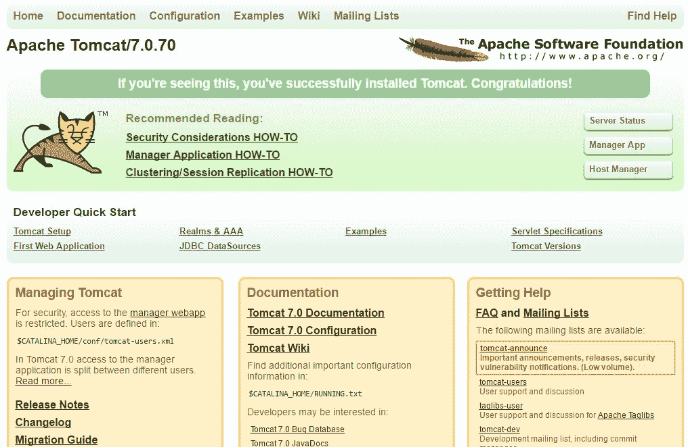

+   进入 `conf` 目录，然后在 Tomcat 安装目录中打开 `tomcat-users.xml` 文件，取消注释角色和用户行，或者重新编写它们。为了测试目的，将 rolename 设置为 manager-script。我们需要 manager-script 来通过 `Deploy to Container` 插件进行部署。

+   对于 Jenkins 部署插件，将 rolename 更改为 manager-script，如下所示：

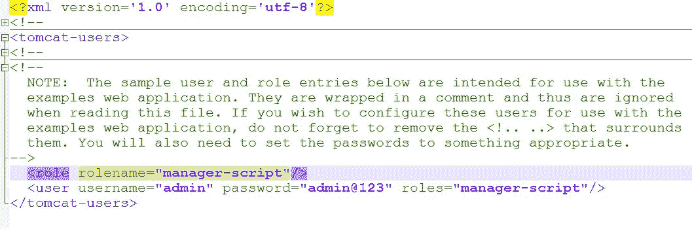

+   点击 Tomcat 首页上的管理应用程序链接，并输入你在 `tomcat-users.xml` 中设置的用户名和密码。现在我们可以访问管理应用程序。对于本地 Tomcat，我们可以使用 localhost 访问 Tomcat 页面，或者也可以使用 IP 地址。对于远程 Web 服务器，我们可以利用 IP 地址或域名来访问 Tomcat。

+   重启 Tomcat 并访问 `https://<IP 地址>:8080/manager/text/list`。你应该看到以下输出：

```
        OK - Listed applications for virtual host localhost 
        /:running:0:ROOT 
        /petclinic:running:1:petclinic 
        /examples:running:0:examples 
        /host-manager:running:0:host-manager 
        /manager:running:0:manager 
        /docs:running:0:docs 

```

+   进入 Jenkins 作业构建页面并点击配置（Configure）。选择适当的 JDK 配置用于 Jenkins 代理：

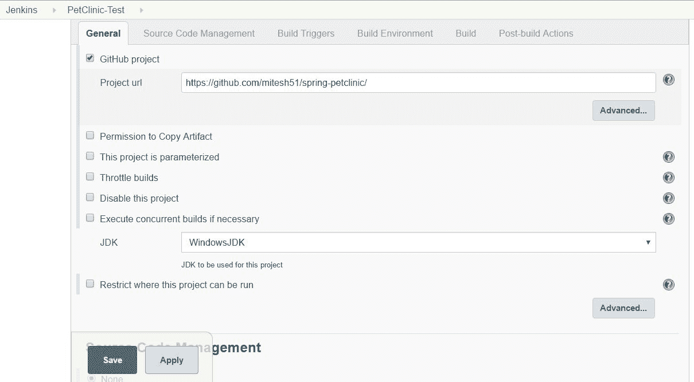

+   在构建后操作中，选择将 war/ear 部署到容器中。提供 Jenkins 工作区中 WAR 文件的位置、Tomcat 管理凭证以及带端口的 Tomcat URL：

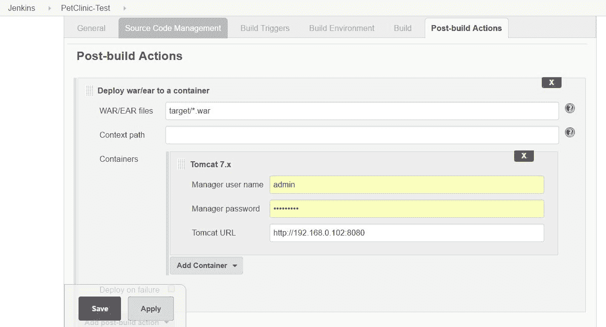

+   点击应用并保存。在 Jenkins 构建页面点击立即构建。验证控制台输出显示新的部署：

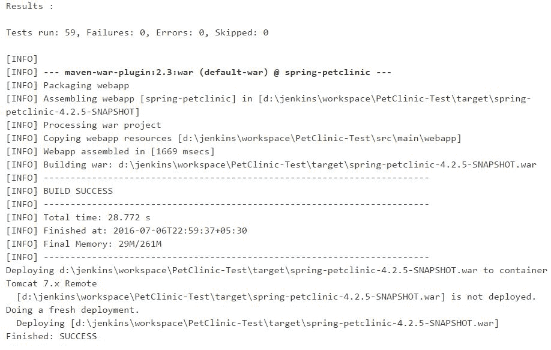

+   一旦构建成功，从浏览器访问 URL，并注意到上下文。它与应用程序的名称类似：

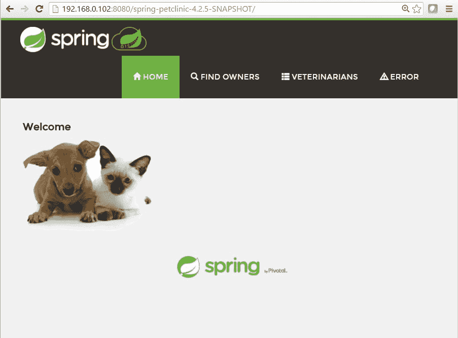

我们已经了解了 Docker 中可用的基本操作，因为我们在第三章中讲解了*容器*。我们已经创建了一个自定义的 Tomcat 镜像，并且配置了`tomcat-users.xml`。

一旦 Docker 启动并运行，我们就准备好创建一个 Docker 容器了。请注意以下图像中默认 Docker 机器的 IP 地址：

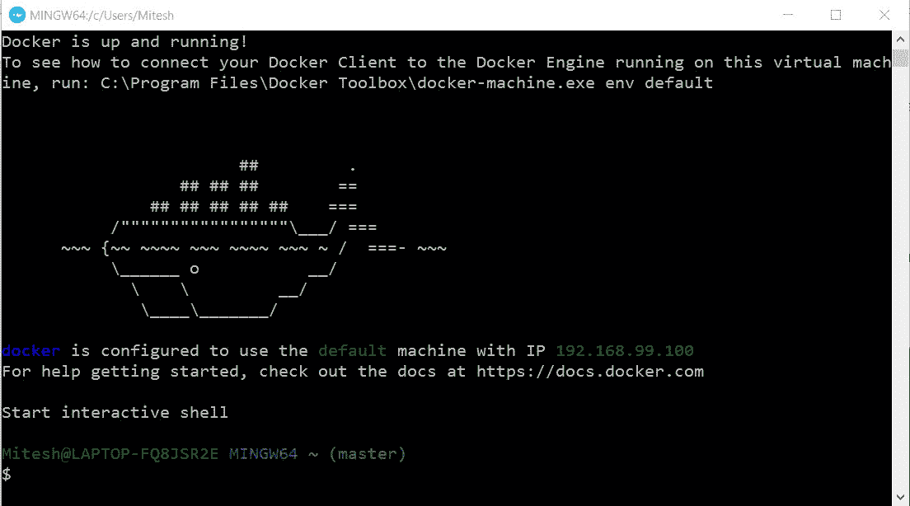

+   要更改容器的名称，使用：

```
        docker run -it -p 9999:8080 --name bootcamp_tomcat     devops_tomcat_sc  

```

+   使用以下方式验证名称：

```
        dockerps -a  

```

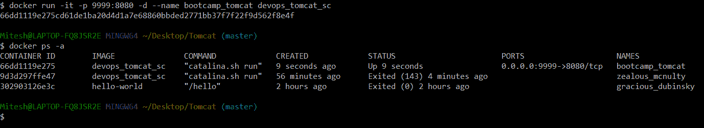

+   使用虚拟机 IP 地址，并使用 9999 作为端口号访问容器中运行的 Tomcat：

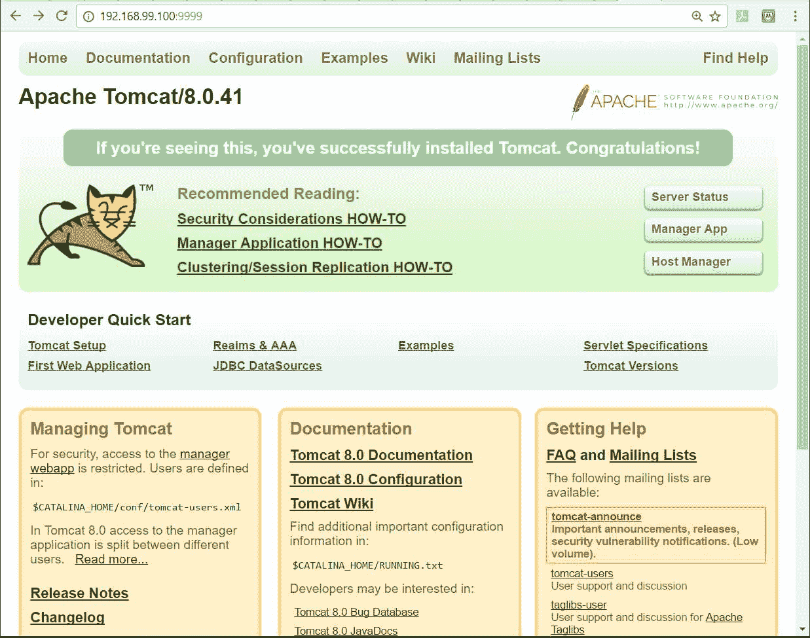

+   使用以下 URL 验证`manager-script`角色的管理访问：


+   让我们尝试使用 Tomcat 中的`Deploy to Container`插件部署应用。如果某个构建任务生成了 WAR 文件，则使用**复制工件**插件从该构建任务复制 WAR 文件：

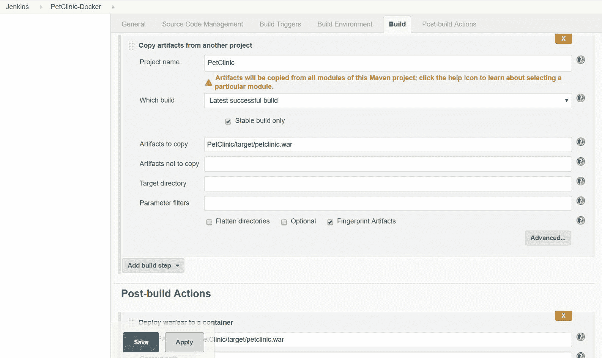

+   在构建后操作中，选择将 war/ear 部署到容器中。提供在`tomcat-users.xml`中设置的用户名和密码。然后我们将提供 Tomcat URL，如下所示。填写详细信息后，点击应用/保存：

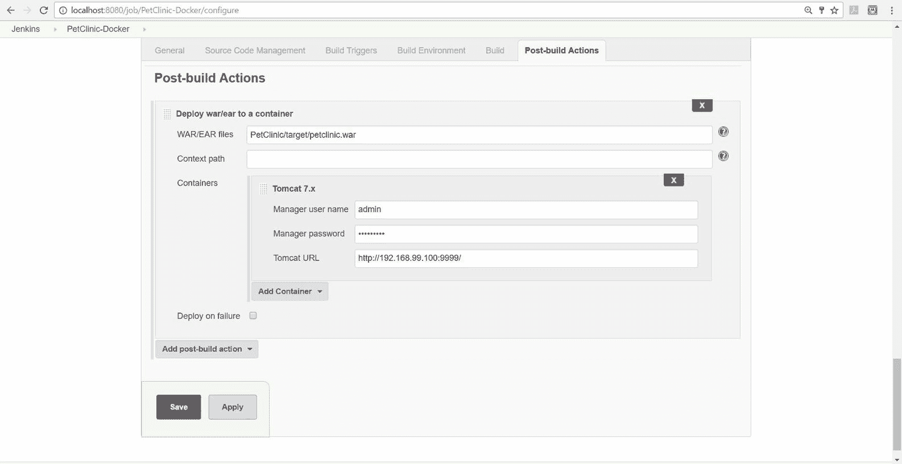

+   点击立即构建。

+   进入控制台输出并验证部署过程：

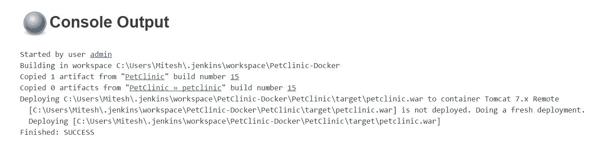

+   使用 Tomcat URL 和应用上下文验证应用程序 URL。

太棒了！！我们已经成功创建了一个镜像和一个容器，并在 Tomcat 容器中部署了应用程序。

# 使用脚本在 AWS EC2 和 Microsoft Azure 虚拟机中进行持续交付

我们已经在 AWS 和 Microsoft Azure 的虚拟机中创建了虚拟机。在 AWS 和 Microsoft Azure 虚拟机上部署应用程序时，我们需要一个 WAR 包文件。一旦它通过 Jenkins 构建任务创建，就需要执行以下步骤：

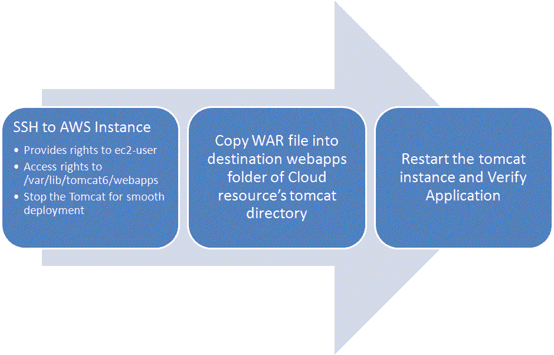

让我们配置构建任务，在 AWS 实例中通过执行如下命令来部署 WAR 文件：

+   给`ec2-user`在 Tomcat 的`webapps`目录中赋予权限，以便我们可以复制 WAR 文件：

```
        ssh  -i /home/mitesh/book.pem -o StrictHostKeyChecking=no -t -t
        ec2-user@ec2-52-90-116-36.compute-1.amazonaws.com "sudousermod -a
        -G tomcat ec2-user;
        sudochmod -R g+w /var/lib/tomcat6/webapps; sudo service tomcat6
        stop;"  

```

+   将 WAR 文件复制到远程目录：

```
        scp  -i /home/mitesh/book.pem /home/mitesh/target/*.war ec2-
        user@ec2-52-90-116-36.compute-
        1.amazonaws.com:/var/lib/tomcat6/webapps  

```

+   启动/重启 Tomcat 服务：

```
        ssh  -i /home/mitesh/book.pem -o StrictHostKeyChecking=no -t -t
        ec2-user@ec2-52-90-116-36.compute-1.amazonaws.com "sudo service
        tomcat6 start"

```

使用`Copy Artifact`插件从另一个构建任务复制**WAR**文件，然后在执行 Shell 构建操作中执行前述命令：

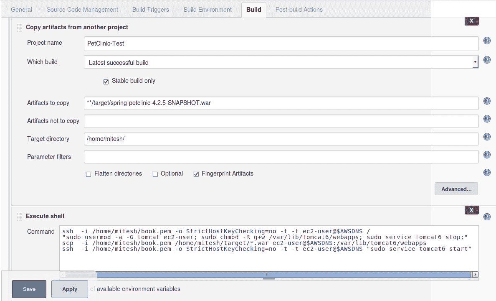

点击保存，然后执行构建任务。对于 Microsoft Azure VM 的应用程序部署，利用 Jenkins 插件（Deploy to Container）或用于 AWS 的脚本，按需修改作为自我练习。

# 使用 Jenkins 插件在 AWS Elastic Beanstalk 中实现持续交付

AWS Elastic Beanstalk 是 Amazon 提供的 **平台即服务**（**PaaS**）产品。我们将使用它在 AWS 平台上部署 PetClinic 应用程序。好处是我们不需要管理基础设施或平台，因为它是一个 PaaS 产品。我们可以配置扩展和其他细节。以下是在 AWS Elastic Beanstalk 上部署应用程序的步骤：

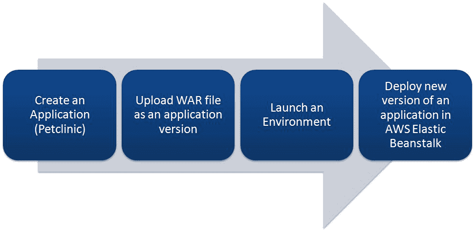

让我们创建一个示例应用程序，以了解 Elastic Beanstalk 是如何工作的，然后使用 `Jenkins` 插件来部署应用程序。

+   进入 AWS 管理控制台，验证我们是否有默认的 **虚拟私有云**（**VPC**）。如果你不小心删除了默认的 VPC 和子网，请向 AWS 客服请求重新创建：

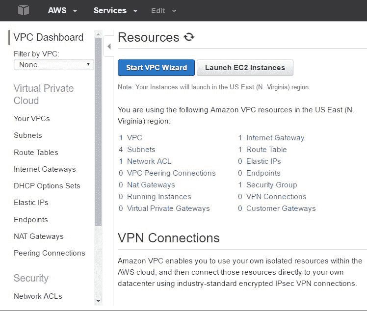

+   点击 AWS 管理控制台中的服务，并选择 AWS Elastic Beanstalk。创建一个名为 petclinic 的新应用程序。选择 Tomcat 作为平台，并选择示例应用程序单选按钮：

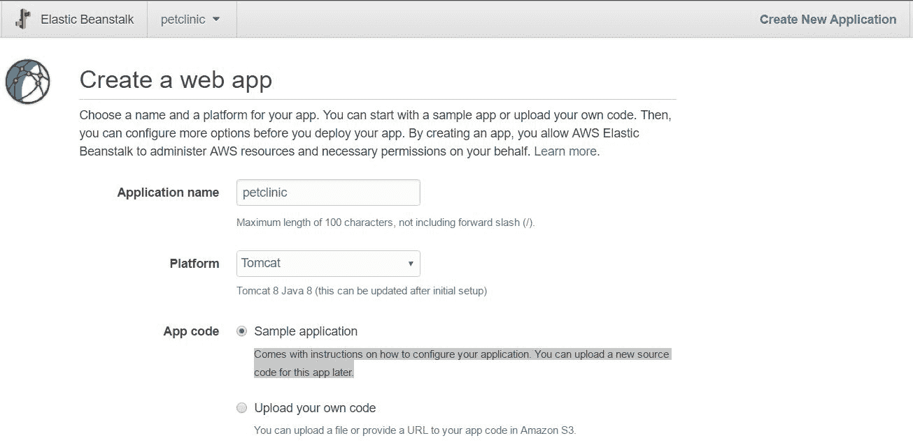

+   验证创建示例应用程序的事件顺序：

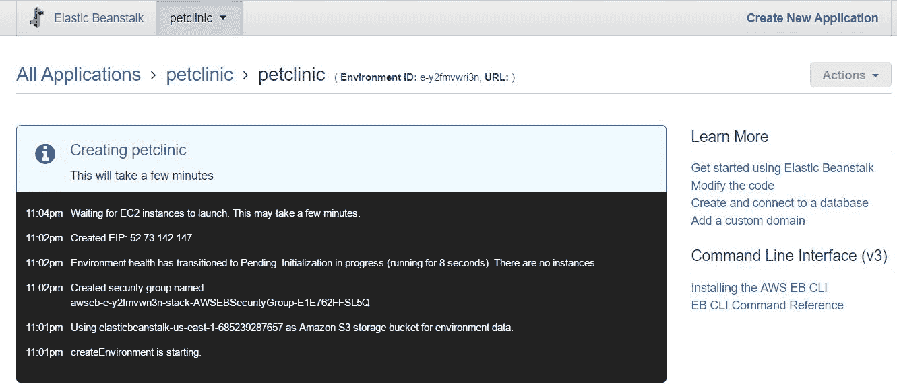

+   这将需要一段时间，一旦环境创建完成，它将以绿色突出显示，如图所示：

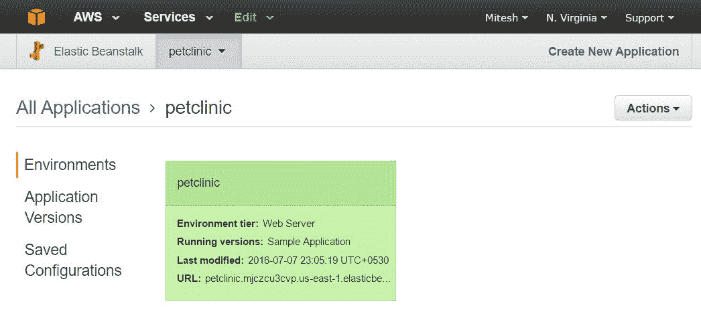

+   点击 petclinic 环境并验证仪表板中的健康状态和运行版本：

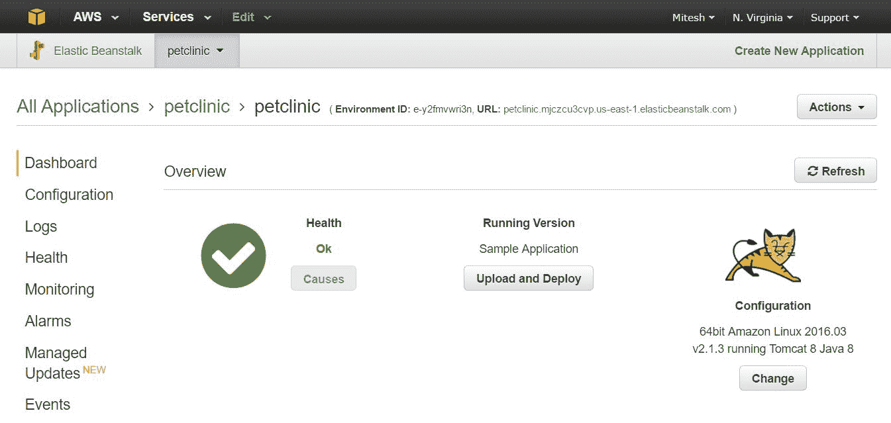

+   验证环境 ID 和 URL。点击 URL 并验证默认页面：

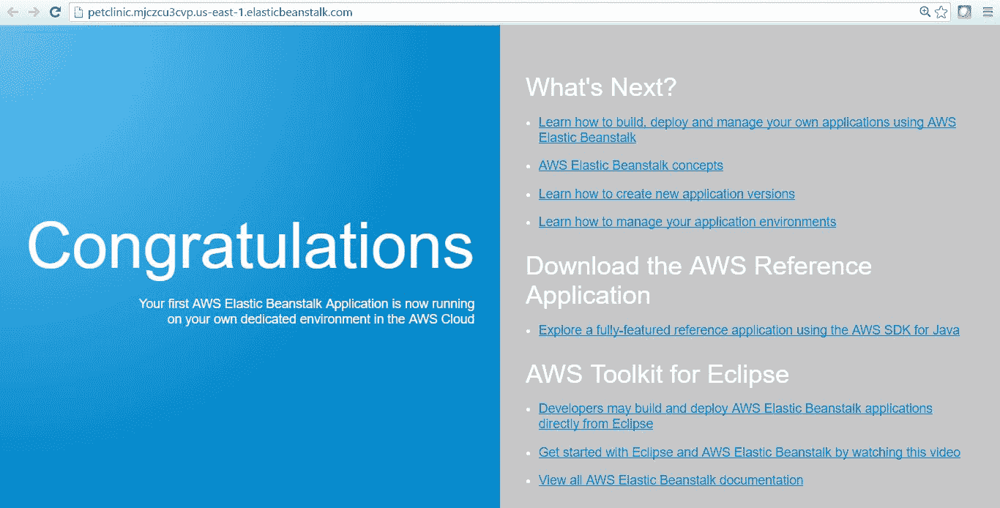

+   安装 AWS Elastic Beanstalk `Publisher` 插件。

如需更多详细信息，请访问 [`wiki.jenkins-ci.org/display/JENKINS/AWS+Beanstalk+Publisher+Plugin`](https://wiki.jenkins-ci.org/display/JENKINS/AWS+Beanstalk+Publisher+Plugin)。

+   打开 Jenkins 仪表板，进入构建任务。点击构建后操作并选择部署到 AWS Elastic Beanstalk：

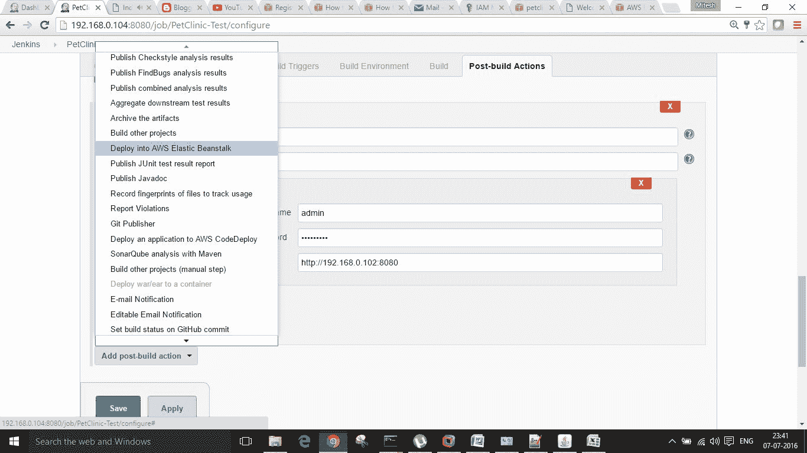

+   在构建后操作中会出现一个新的 Elastic Beanstalk 部分。

+   点击 Jenkins 仪表板并选择凭证；添加你的 AWS 凭证。

+   进入你的 Jenkins 构建并选择在全局配置中设置的 AWS 凭证。

+   从列表中选择 AWS 区域并点击获取可用应用程序。由于我们已经创建了示例应用程序，它会像这样显示出来。

+   在 EnvironmentLookup 中，在获取环境名称框中提供环境 ID 并点击获取可用环境：

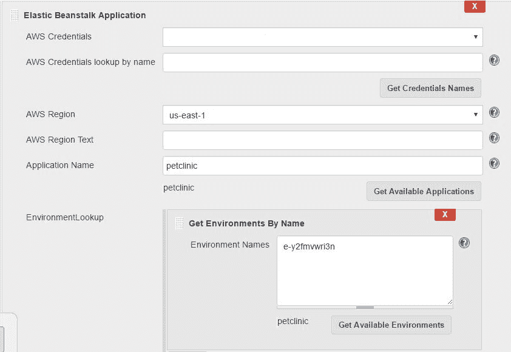

+   保存配置并点击立即构建。

现在让我们验证 AWS 管理控制台，检查 **WAR** 文件是否已被复制到 Amazon S3：

+   进入 S3 服务并检查可用的存储桶：

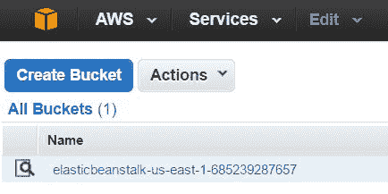

+   由于 WAR 文件较大，上传到 Amazon S3 会需要一些时间。一旦上传完成，它将在 Amazon S3 存储桶中可用。

+   验证 Jenkins 中构建任务的执行状态。预期输出的某些部分包括：

    +   测试用例执行和 WAR 文件创建成功

    +   构建成功

+   现在检查 AWS 管理控制台：

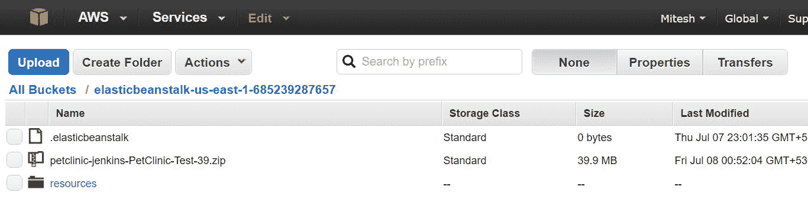

+   转到服务，点击 AWS Elastic Beanstalk，验证环境。之前的版本是“示例应用”，现在版本已更新，按照 Jenkins 构建任务配置中的**版本标签格式**进行更新：

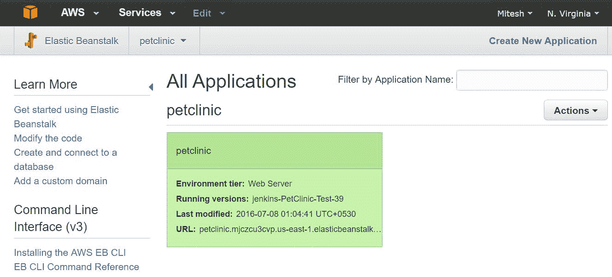

+   转到仪表板，再次验证健康状况和正在运行的版本。

+   一旦一切验证完毕，点击环境的 URL，我们的 PetClinic 应用就上线了：

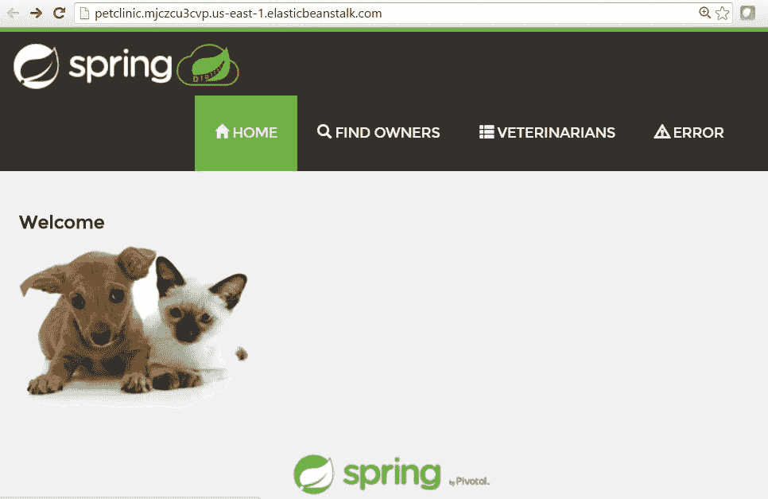

+   一旦应用部署成功，终止环境：

我们已经成功将应用部署到 Elastic Beanstalk 上。

# 使用 FTP 在 Microsoft Azure 应用服务中实现持续交付

Microsoft Azure 应用服务是 PaaS。在本节中，我们将看看 Azure Web 应用以及如何部署我们的 PetClinic 应用。

让我们在 Jenkins 中安装 `Publish Over FTP` 插件。我们将使用 Azure Web 应用的 FTP 详细信息来发布 PetClinic WAR 文件：

+   转到 Microsoft Azure 门户 [`portal.azure.com`](https://portal.azure.com)，点击应用服务，然后点击“添加”。提供应用名称、订阅、资源组和应用服务计划/位置。点击“创建”：

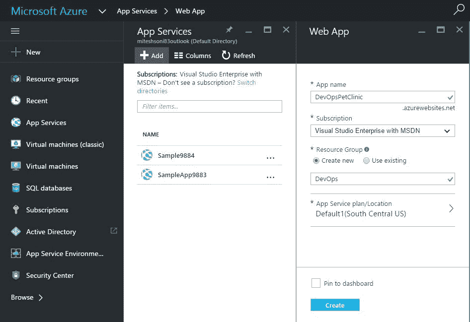

+   一旦 Azure Web 应用创建完成，查看是否能在 Azure 门户中显示。

+   点击 DevOpsPetClinic，查看与 URL、状态、位置等相关的详细信息：

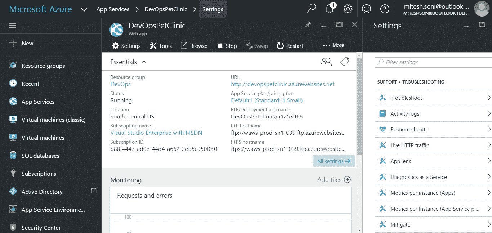

+   点击“所有设置”，进入“常规”部分，点击“应用设置”以配置 Azure Web 应用用于 Java Web 应用托管。选择 Java 版本、Java 次版本、Web 容器和平台，然后点击“Always On”：

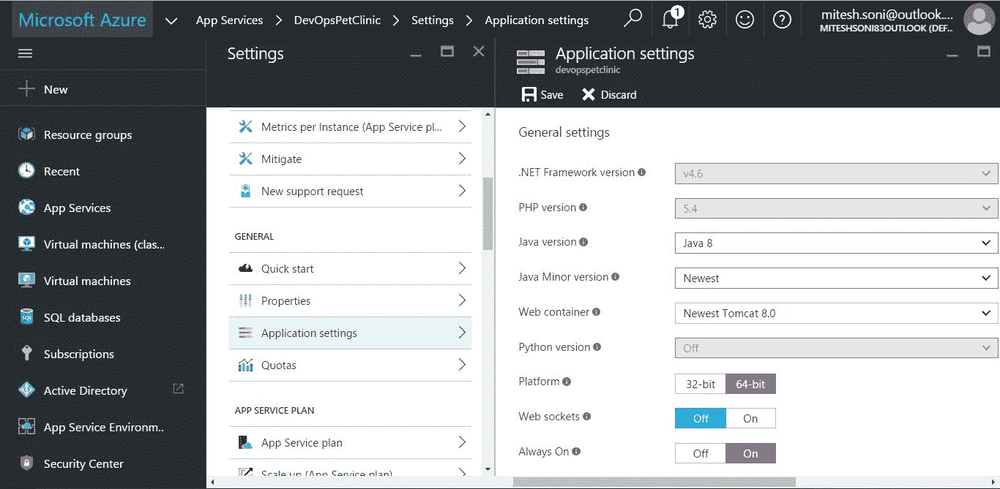

+   从浏览器访问 Azure Web 应用的 URL，并验证它是否已经准备好托管我们的示例 Spring 应用——PetClinic：

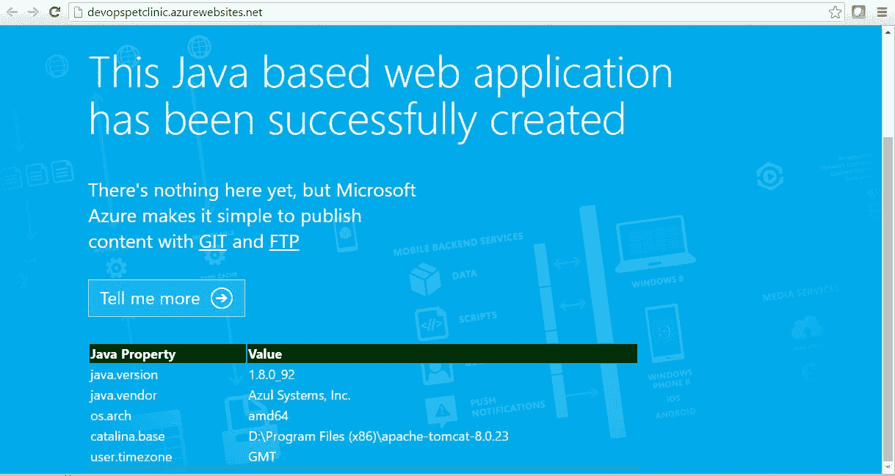

+   让我们转到 Jenkins 仪表板，点击“新建项目”，选择自由风格项目。

+   点击“所有设置”，然后转到 PUBLISHING 部分中的部署凭证。提供用户名和密码，并保存更改：

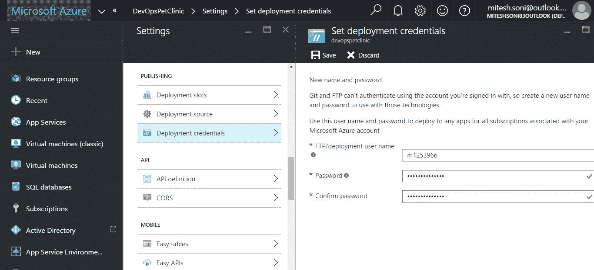

+   在 Jenkins 中，转到“管理 Jenkins”，点击“配置” | 配置 FTP 设置。提供 Azure 门户中可用的主机名、用户名和密码。

+   转到 `devopspetclinic.scm.azurewebsites.net` 并下载 Kudu 控制台。导航到不同选项，找到 `site directory` 和 `webapps` 目录。

+   点击“测试配置”，一旦看到成功消息，就可以准备部署 PetClinic 应用了：

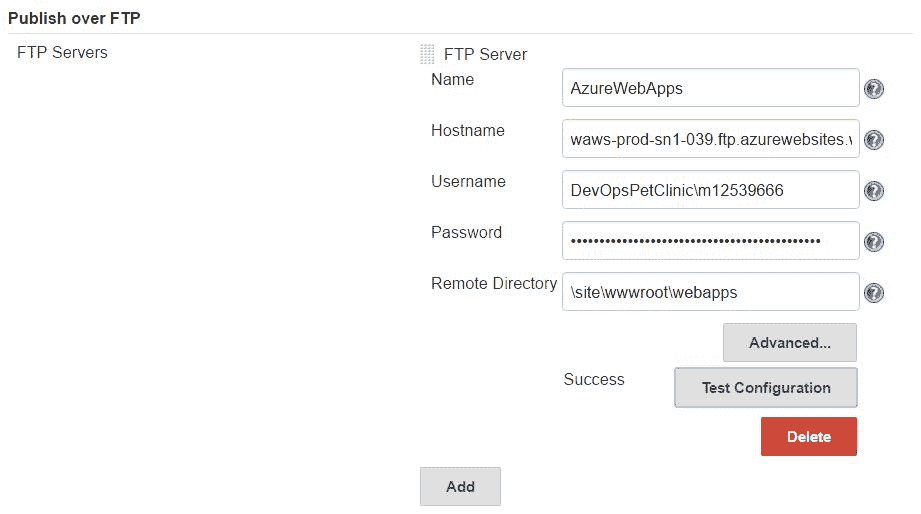

+   在我们创建的构建任务中，转到“构建”部分，配置从另一个项目复制构建产物。我们将 WAR 文件复制到虚拟机上的特定位置：

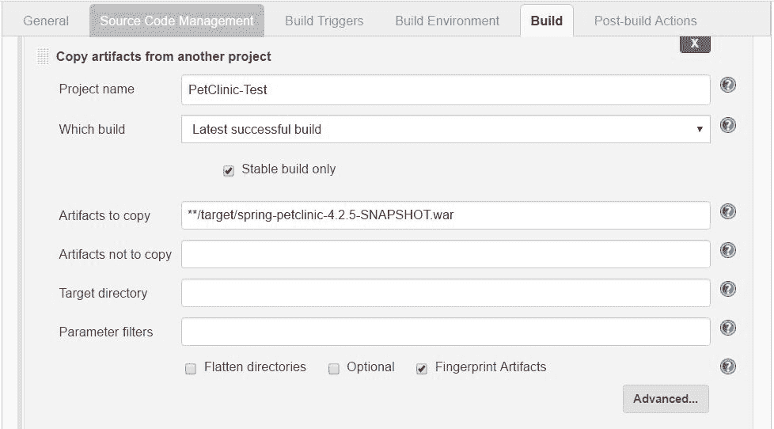

+   在构建后操作中，点击通过 FTP 发送构建工件。选择在 Jenkins 中配置的 FTP 服务器名称。相应地配置源文件和删除前缀，以便部署 Azure Web App：

+   勾选控制台中的详细输出：

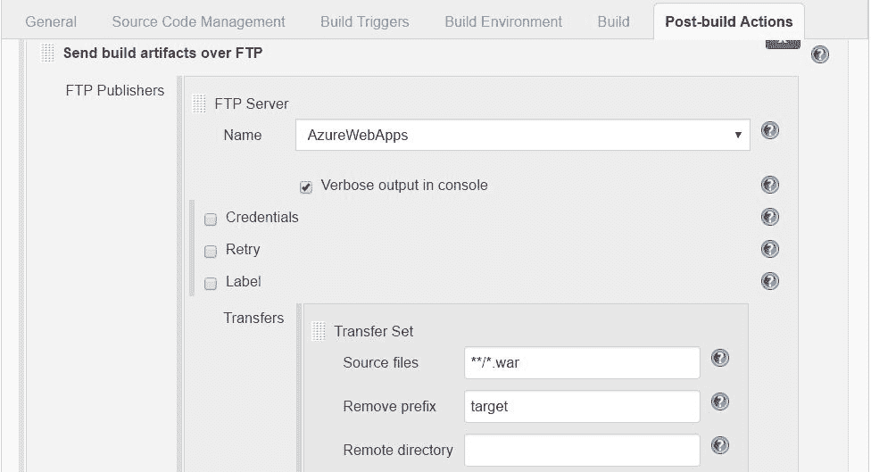

+   点击立即构建，看看幕后发生了什么：

+   进入 Kudu 控制台，点击 DebugConsole，并进入 Powershell。进入 site | wwwroot | webapps。检查 WAR 文件是否已被复制：

+   在浏览器中访问 Azure Web App URL，查看应用程序的上下文：

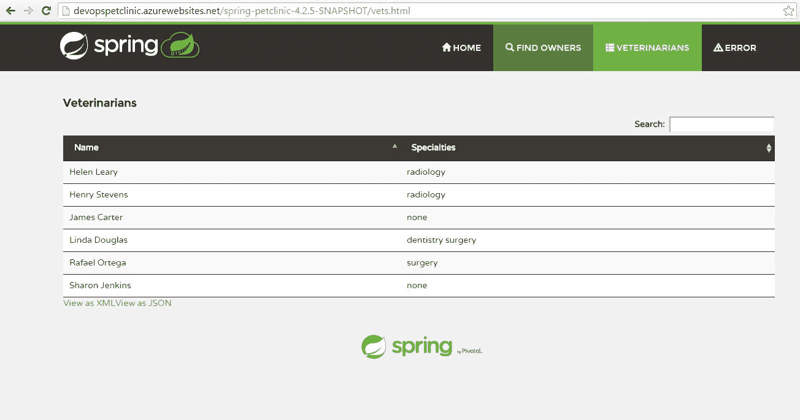

现在我们已经在 Azure Web Apps 上部署了一个应用程序。

需要注意的是，FTP 用户名必须包含域名。在我们的例子中，它可以是 `Sample9888\m1253966`。如果不包含 Web 应用名称，用户名将无法使用。

这些不同的 AWS IaaS、AWS PaaS、Microsoft Azure PaaS 和 Docker 容器部署方式都可以在最终的端到端自动化中使用。

# 在 Microsoft Azure App Services 中使用 VSTS 进行持续交付

Visual Studio Team Services 提供了一种配置持续集成和持续交付的方法。我们将首先进入我们的 VSTS 账户。在这里，我们需要完成以下任务：

+   配置 Microsoft Azure 订阅，以便我们可以从 VSTS 连接到 Azure Web Apps。

+   创建一个发布定义，实现 Azure Web Apps 中应用程序的部署任务。

在最近的项目和团队中，点击 PetClinic：

它将打开在 VSTS 中创建的项目的主页：

在顶部菜单栏中，点击 Build & Release，打开一个菜单。从中点击 Releases 菜单项：

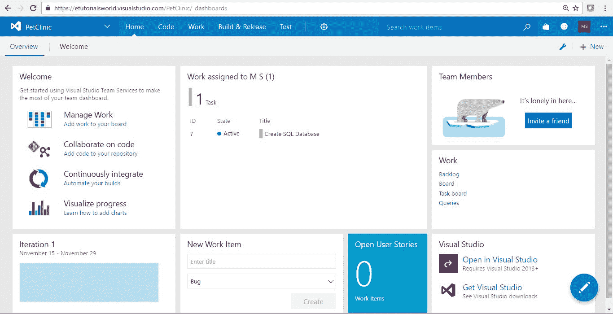

点击页面上的 Releases 链接。

由于这是新账户，因此尚未创建任何发布定义，因此此部分为空。我们可以创建一个新的发布定义，以便自动化将应用程序部署到 Azure App Services 或 App Service Environment。

就像我们为持续集成构建了定义一样，我们也有针对持续发布、持续交付或持续部署的发布定义。发布定义包含不同的任务，这些任务可以用于将应用程序部署到目标环境中。每个发布定义包含一个或多个环境，每个环境包含一个或多个任务来部署应用程序。

接下来，让我们创建一个新的发布定义。每个发布定义可以包含一个或多个环境，每个环境可以包含一个或多个任务来部署应用程序。

点击新的定义：

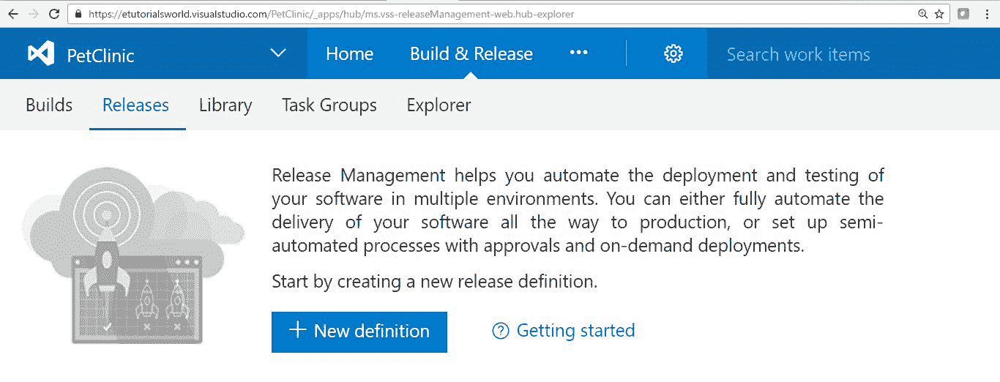

一旦我们点击新的发布定义，它将打开一个对话框，展示可以用于部署自动化的部署模板。

我们将把 WAR 文件部署到 Azure App Service / Azure Web Apps，因此选择 Azure App Service 部署。

点击 Next：

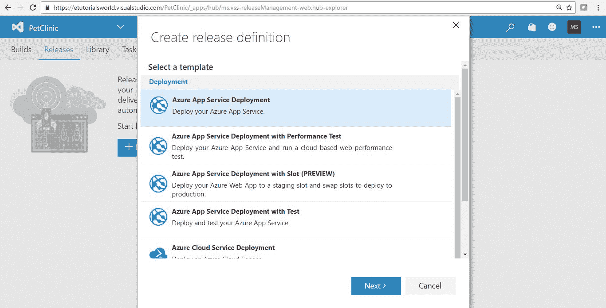

在解释此部署自动化之前，让我们回顾一下前面章节中的几个内容。

我们创建了一个构建定义 PetClinic-Maven，它会编译源代码，执行单元测试并创建一个 WAR 文件。WAR 文件就是我们的工件。这个工件是构建定义执行的结果。

现在，在发布定义中，我们需要选择工件的来源，那就是来自构建。

选择 PetClinic 项目。

在源（构建定义）中，所有与 PetClinic 项目相关的构建定义将可用。我们将选择 PetClinic-Maven。

简而言之，我们想要在这里实现持续集成和持续交付。这意味着，当开发者在仓库中提交任何新的代码或修复时，它将自动触发构建定义。构建定义将编译源代码，执行单元测试（如果有的话），进行静态代码分析（如果配置了 Sonar），并生成一个 WAR/package 文件。这就是工件。一旦构建定义成功完成，它将触发发布定义，将工件或**WAR**文件部署到托管在 ASE 或非 ASE 环境中的 Azure Web 应用程序。

点击“持续部署（每当构建完成时创建发布并部署）”复选框。

点击“创建”：

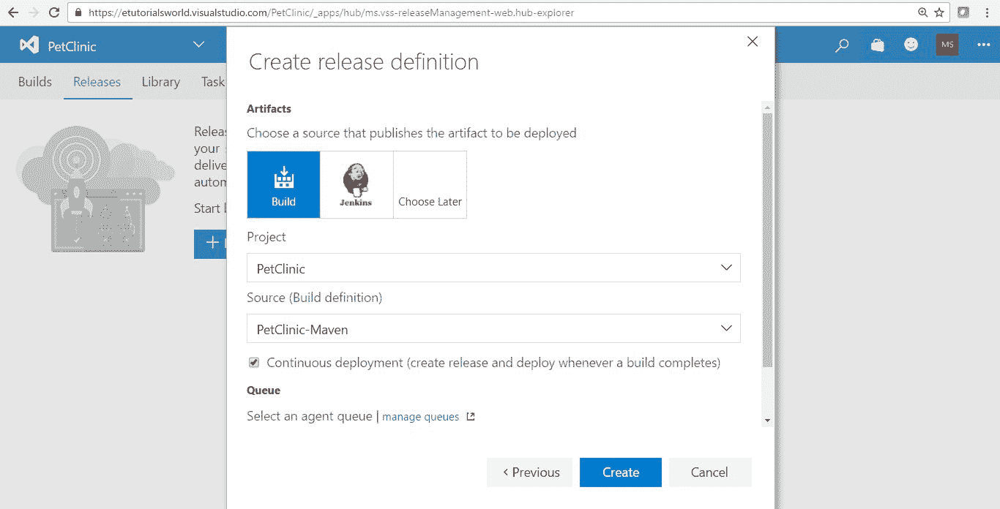

这将打开发布定义的编辑模式。我们选择了“部署 Azure 应用服务”。第一个需要做的事情是将 Azure 订阅与 VSTS 配置。

点击任务，看到有两个字段，分别是 AzureRM 订阅和应用服务名称。我们需要在这里配置 Azure 订阅，应用服务名称将自动出现在列表中。

点击“管理”链接，位于 AzureRM 订阅字段旁边：

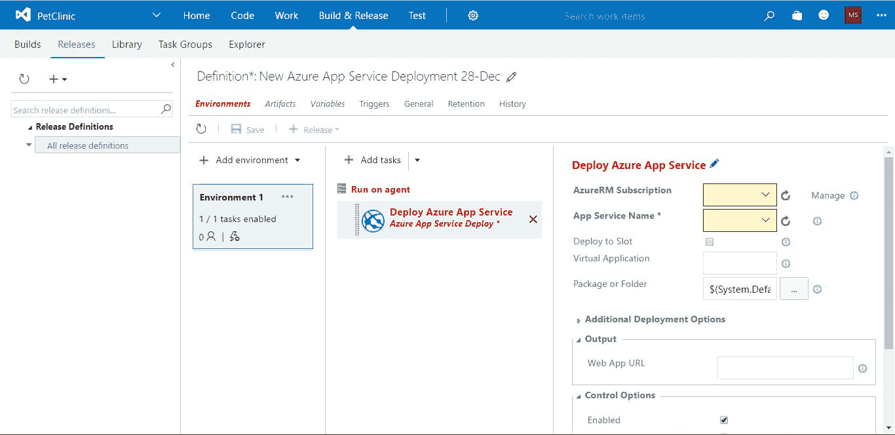

它将在 VSTS 门户中打开一个服务页面。目前没有配置任何服务，所以列表是空的：

点击“新建服务端点”。

它将打开一个菜单；从菜单中选择“Azure 资源管理器”菜单项来配置 Azure 订阅：

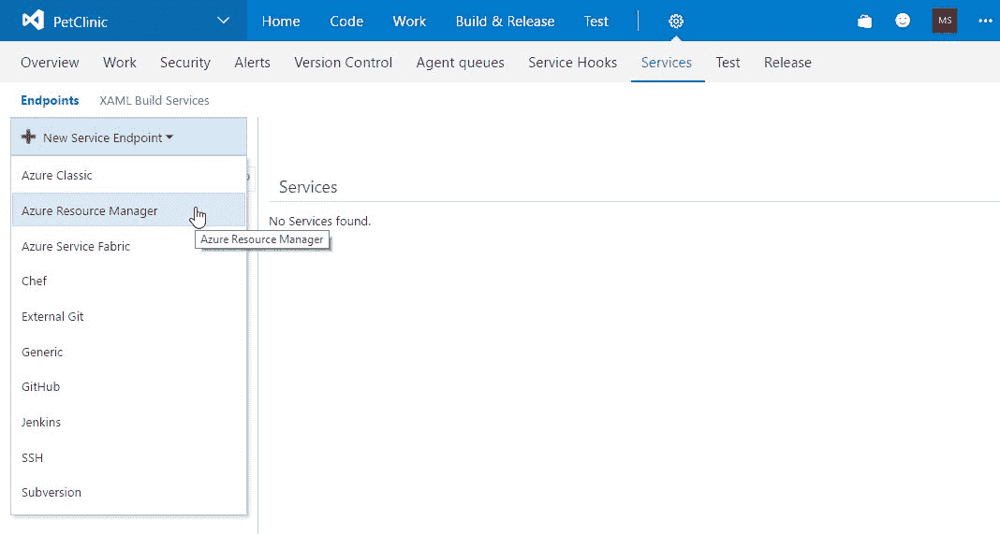

因为我们已经登录到 VSTS 和我们的 Azure 账户，所以它会在列表中显示订阅名称。在连接名称中，输入我们将在发布定义任务中用于连接到 Azure 账户的名称。

点击“确定”。

在此处添加 Azure 订阅的目的是为了获取该订阅中可用资源的列表，以便 VSTS 能够将其配置用于部署。在我们的示例中，我们需要一份托管在 ASE 或非 ASE 中的 Azure Web 应用列表，以便我们可以将 PetClinic 应用程序部署到 Azure Web 应用程序。

一旦我们关闭添加 Azure RM 端点的框，我们可以看到服务中列出了端点。因此，我们已经成功配置了 Azure RM 订阅：

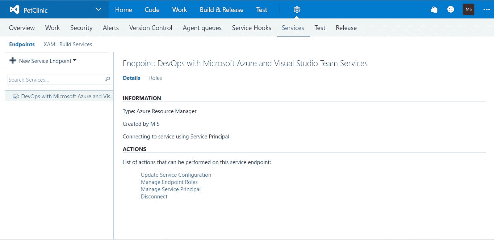

点击“角色”链接以验证 Azure 订阅的可用角色：

现在，转到发布定义，点击 AzureRM 订阅的列表框，现在我们新添加的端点会出现在列表中。

选择端点：

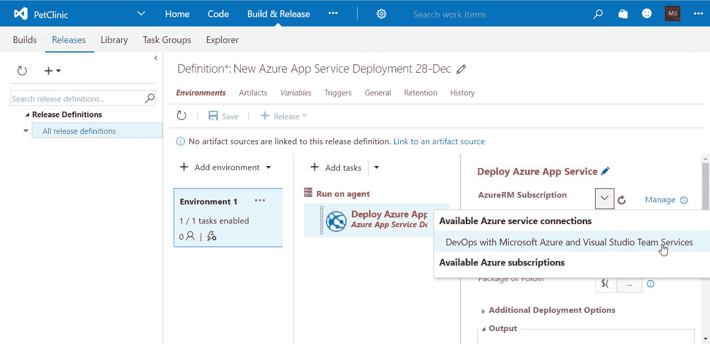

到目前为止，我们已经在 VSTS 中配置了 Azure 订阅端点，因此可以在发布定义中使用它，将工件部署到托管在 ASE 和非 ASE 环境中的 Azure 应用服务中。我们已经配置了 AzureRM 订阅。一旦完成，我们可以选择应用服务名称。点击下拉箭头，已配置的 AzureRM 订阅中的 Azure Web 应用将显示在列表中：

转到“选择文件或文件夹”并点击三个点（...）；转到 PetClinic-Maven，并选择在构建定义成功执行后创建的 **WAR** 文件。

我们的发布定义将拾取这个 WAR 文件并将其部署到 Azure Web 应用中。

点击“确定”。

现在，我们已准备好执行发布定义，但在此之前，我们需要保存发布定义：

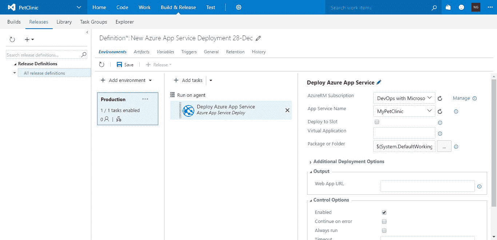

点击保存按钮，它会打开一个新的对话框。提供一个评论并点击“确定”以在 VSTS 中保存发布定义：

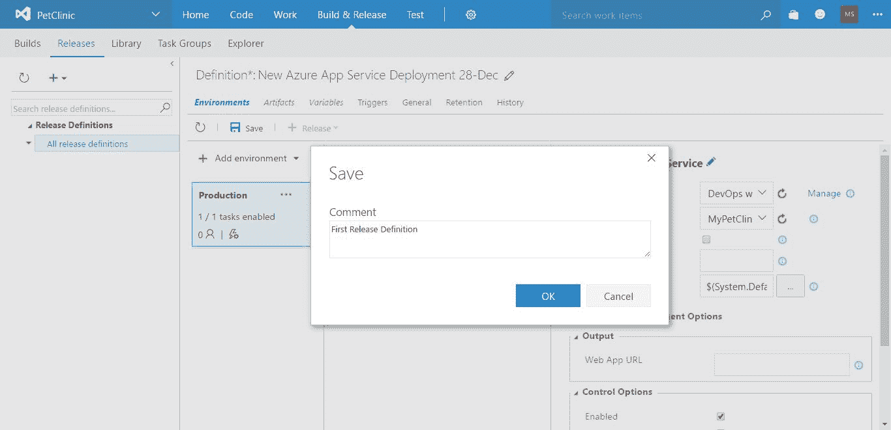

验证你是否已经保存了发布定义。

“触发器”部分允许我们安排何时创建新的发布。我们可以在新版本的工件可用时设置，或者换句话说，当构建定义执行成功完成时：

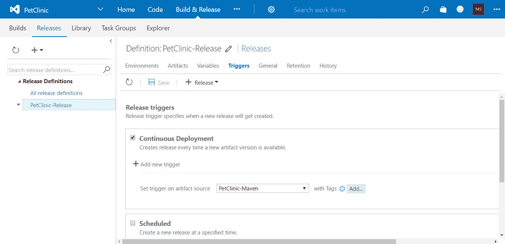

为了检查端到端自动化，我们将开始构建定义执行。所以，一旦成功，它将触发一个发布定义。保存发布定义并点击“Queue new build...”。

为 PetClinic-Maven 构建定义排队构建，如果它成功完成，将触发发布定义。点击“确定”：

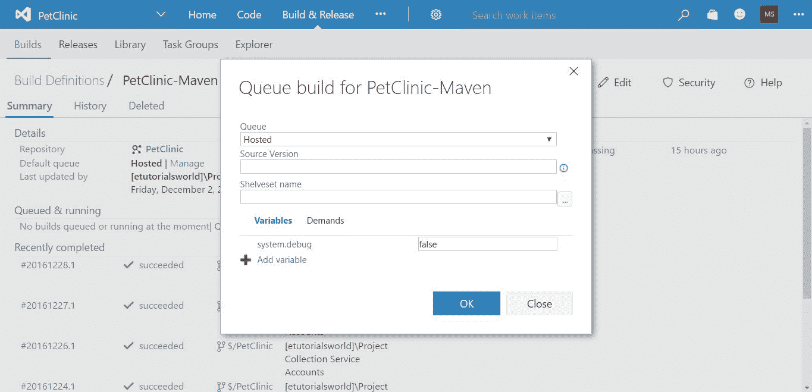

一旦构建定义成功完成，PetClinic-Release 发布定义将被触发。它的任务是将 `.war` 工件部署到 Azure 应用服务中。

部署失败！让我们找出此次部署失败的原因。

发布定义执行失败。让我们尝试排查问题：

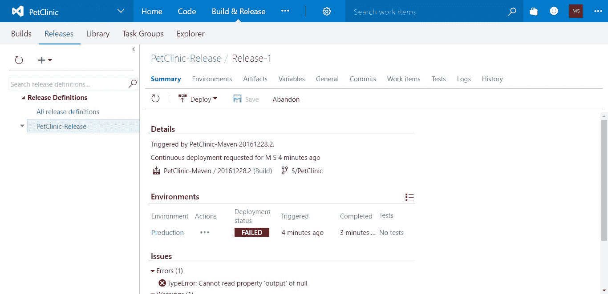

首先验证历史记录：我们可以看到发布定义已被触发，但部署失败了：

让我们从日志中找出失败的可能原因。

转到日志部分，验证发布定义执行步骤。它清楚地表明，最终的部署操作失败了：

点击失败的步骤，即“部署 Azure 应用服务”：

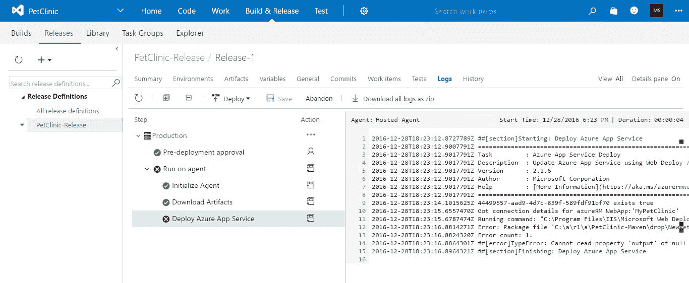

仔细检查日志后，我们可以看到提到 `.war` 文件没有 `.zip` 文件扩展名。

请记住，我们选择的是 `petclinic.war` 而不是 `petclinic.zip`，所以它正在用这个任务部署 `.war` 文件；我们需要的是 `.zip` 文件，而不是 WAR 文件。

如何解决这个问题？

如果我们可以将 WAR 文件转换为 `.zip` 文件，那么它应该自动完成：

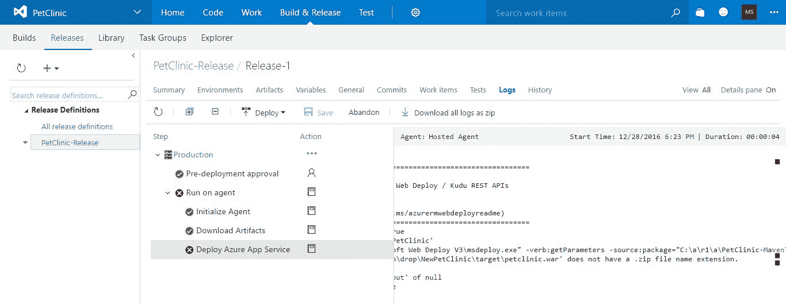

最好的方法是使用任何可以将 `.war` 转换为 `.zip` 文件的任务。那么我们就这样做。

1.  点击“添加任务”，然后点击“Marketplace”链接：

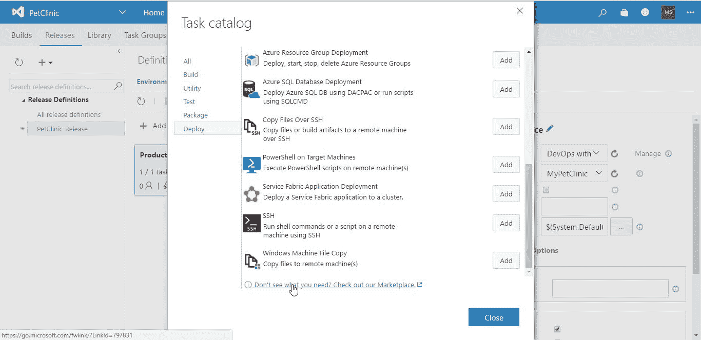

它将打开一个新的 Marketplace 窗口。

1.  查找 Trackyon：

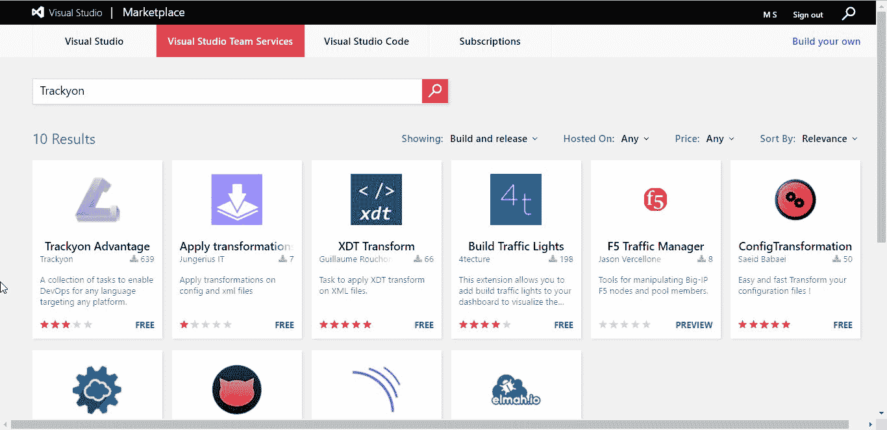

在部署之前，我们将使用 Trackyon 将 WAR 文件转换为 ZIP 文件。完成后，Azure Web 应用程序上的部署应该会正常工作。

1.  点击安装：

1.  选择我们希望安装 Trackyon 的 VSTS 账户。

1.  点击继续：

1.  点击继续到账户。

1.  点击关闭：

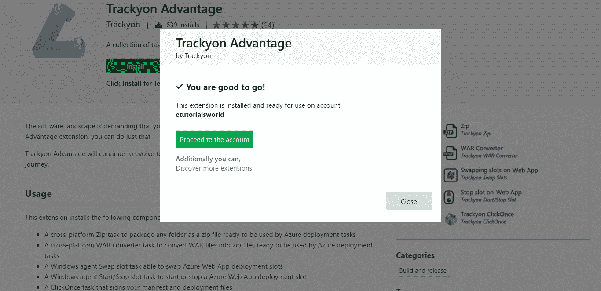

安装完成后，我们的下一任务是将该任务添加到发布定义中，以便在部署到 Azure Web 应用程序之前，将 WAR 文件转换为 ZIP 文件。

1.  选择 Trackyon WAR 转换任务。

1.  点击关闭：

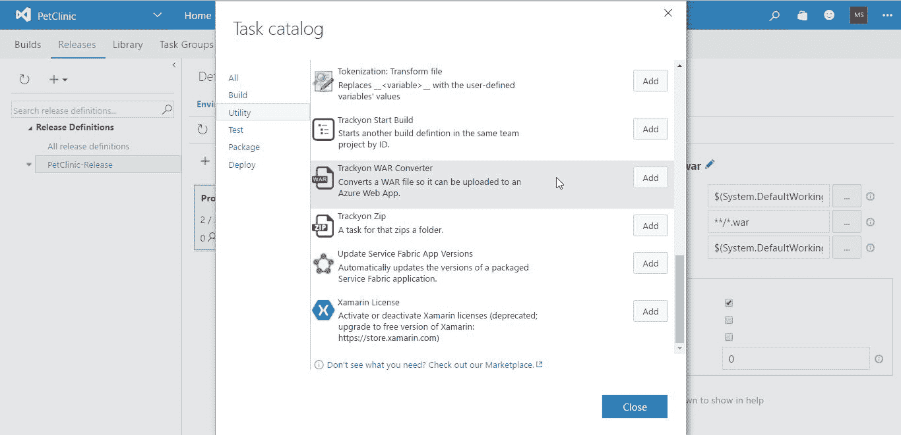

1.  选择 WAR 文件所在的文件夹：

1.  选择 ZIP 文件应创建的文件夹：

1.  现在，我们的发布定义有两个任务要执行：

+   将 `.war` 转换为 `.zip` 文件。

+   将 `.zip` 文件部署到 Azure Web 应用程序：

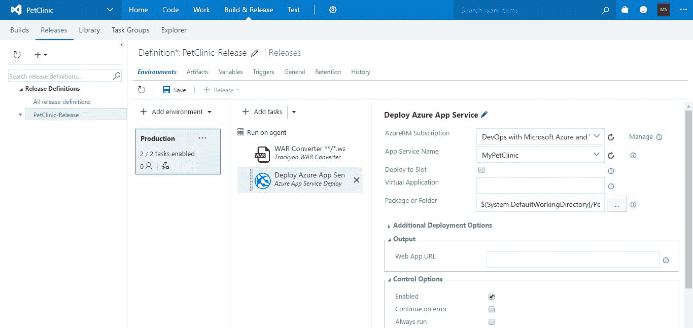

1.  进入 PetClinic-Maven 构建定义并点击“队列新构建...”

1.  当托管代理可用时，构建将开始。

等待构建执行成功完成。

由于我们已经为持续交付配置了发布定义，成功的构建定义执行将触发发布定义，完成端到端的自动化。

注意构建编号 Build 20161230.2：

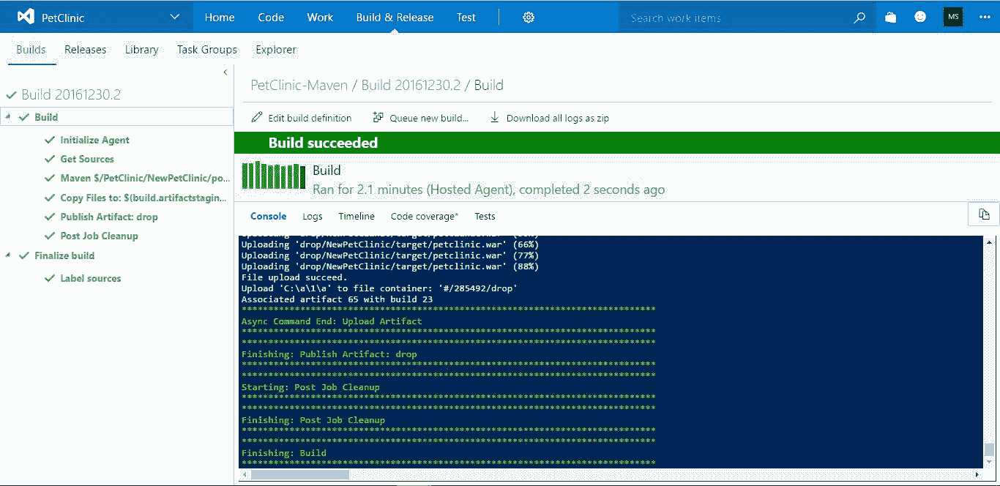

如果构建成功完成，这个构建将触发发布定义。

# 总结

在本章中，我们介绍了不同的方式，将应用程序包部署到本地 Tomcat 服务器（使用 Jenkins 插件），Docker 容器，AWS Elastic Beanstalk，使用 FTP 部署到 Microsoft Azure 应用服务，以及使用 Visual Studio Team Services 部署到 Microsoft Azure 应用服务。

如果我们观察之前的自动化，它是部署应用程序的一种方式，可以使用不同的方法，如脚本、插件和 VSTS，在本地或云服务器上部署应用程序。

构建定义侧重于持续集成，而发布定义侧重于持续交付。因此，到目前为止，我们已经使用开源和商业工具覆盖了 CI 和 CD。

在下一章中，我们将介绍自动化测试（功能测试和负载测试），以便将其视为持续测试的一部分。

我们将在本地和云环境中分别使用 Selenium 进行功能测试，使用 Apache JMeter 进行负载测试。
