# 自动化测试（功能测试和负载测试）

“大多数人高估了自己一年内能做到的事，低估了十年内能做到的事。”

- 比尔·盖茨

在本章中，我们将学习在将应用程序部署到非生产环境后可以执行的各种类型的测试。持续测试对于验证应用程序的功能、性能等非常重要。自动化测试不仅能加快验证过程，还能标准化测试的执行方式。我们的重点将是简单的功能测试，看看我们如何执行它，以及使用开源和商业工具或服务进行负载测试。

我们将创建一个使用 Selenium 的功能测试示例，并在 Eclipse IDE 中执行该测试以验证其结果。我们还将把基于 Selenium 的 Maven 项目与 Jenkins 集成，这样我们就可以在 Jenkins 中执行该功能测试，并将其作为我们端到端自动化目标的一部分。

对于负载测试，我们将使用 Apache JMeter GUI 创建一个负载测试示例，然后使用保存的 `.jmx` 文件在 Jenkins 中执行负载测试。

本章将涵盖以下主题：

+   使用 Eclipse 进行基于 Selenium 的 Web 应用功能测试

+   Selenium 与 Jenkins 集成

+   使用基于 URL 的测试进行负载测试，**Visual Studio Team System** (**VSTS**)

+   使用 Apache JMeter 进行负载测试

# 使用 Selenium 进行功能测试

在本章中，我们将使用 Selenium 和 Eclipse 执行一个功能测试用例。让我们一步步地创建一个示例功能测试用例，然后使用 Jenkins 执行它。

PetClinic 项目是一个基于 Maven 的 Spring 应用，我们将使用 Eclipse 和 Maven 创建一个测试用例。因此，我们将使用 Eclipse 中的 m2eclipse 插件。

我们已安装 Eclipse Java EE IDE for Web Developers，版本：Mars.2 Release (4.5.2)，构建 ID：20160218-0600：

1.  进入 Eclipse 市场，安装 Maven Integration for Eclipse 插件。

1.  在 Eclipse 中使用向导创建一个 Maven 项目：

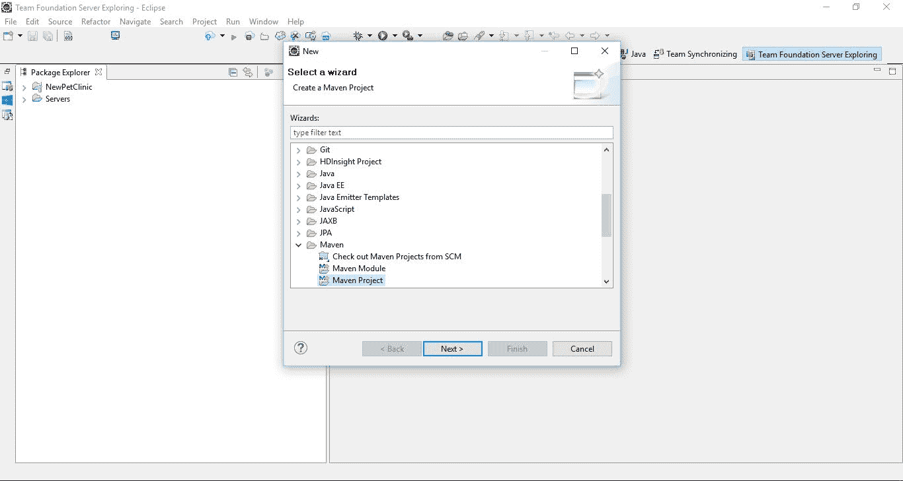

1.  选择“创建一个简单项目”（跳过原型选择），然后点击“下一步”：

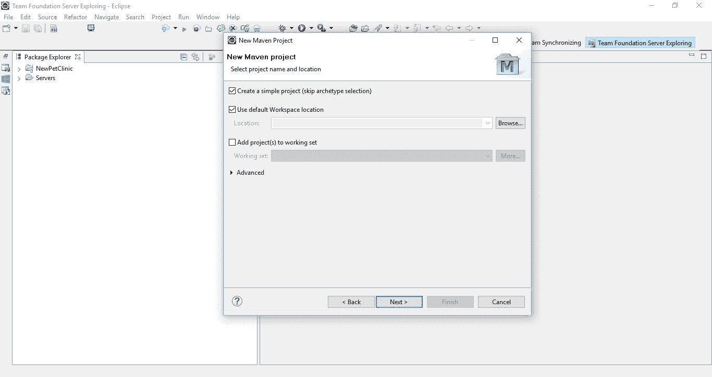

1.  跟随向导创建一个项目。创建项目可能需要一些时间。在此过程中，提供 Artifact、版本、打包类型、名称和描述。点击完成。

1.  等待 Maven 项目创建并配置完成。确保 Maven 已正确安装和配置。如果 Maven 位于代理后面，请将代理详细信息配置到 `conf.xml` 文件中，该文件位于 `Maven` 目录下。

1.  在 `Pom.xml` 文件中，我们需要在 `<project>` 节点内添加 Maven、Selenium、TestNG 和 JUnit 依赖项。以下是修改后的 `Pom.xml`：

```
<project   
  xsi:schemaLocation="http://maven.apache.org/POM/4.0.0 http://maven.apache.org/xsd/maven-4.0.0.xsd"> 
  <modelVersion>4.0.0</modelVersion> 
  <groupId>com.tiny</groupId> 
  <artifactId>test</artifactId> 
  <version>0.0.1-SNAPSHOT</version> 
  <name>test</name> 
  <build> 
    <plugins> 
      <plugin> 
        <groupId>org.apache.maven.plugins</groupId> 
        <artifactId>maven-compiler-plugin</artifactId> 
        <version>3.6.1</version> 
        <configuration> 
          <source>1.8</source> 
          <target>1.8</target> 
        </configuration> 
      </plugin> 
      <plugin> 
        <groupId>org.apache.maven.plugins</groupId> 
        <artifactId>maven-surefire-plugin</artifactId> 
        <version>2.19.1</version> 
        <configuration> 
          <suiteXmlFiles> 
            <suiteXmlFile>testng.xml</suiteXmlFile> 
          </suiteXmlFiles> 
        </configuration> 
      </plugin> 
    </plugins> 
  </build> 
  <dependencies> 
    <dependency> 
      <groupId>junit</groupId> 
      <artifactId>junit</artifactId> 
      <version>3.8.1</version> 
      <scope>test</scope> 
    </dependency> 
    <dependency> 
      <groupId>org.seleniumhq.selenium</groupId> 
      <artifactId>selenium-java</artifactId> 
      <version>3.0.1</version> 
    </dependency> 
    <dependency> 
      <groupId>org.testng</groupId> 
      <artifactId>testng</artifactId> 
      <version>6.8</version> 
      <scope>test</scope> 
    </dependency> 
  </dependencies> 
</project> 

```

1.  添加完这些更改后，保存 `pom.xml` 文件，并从“项目”菜单重新构建项目。它将下载新的依赖项：

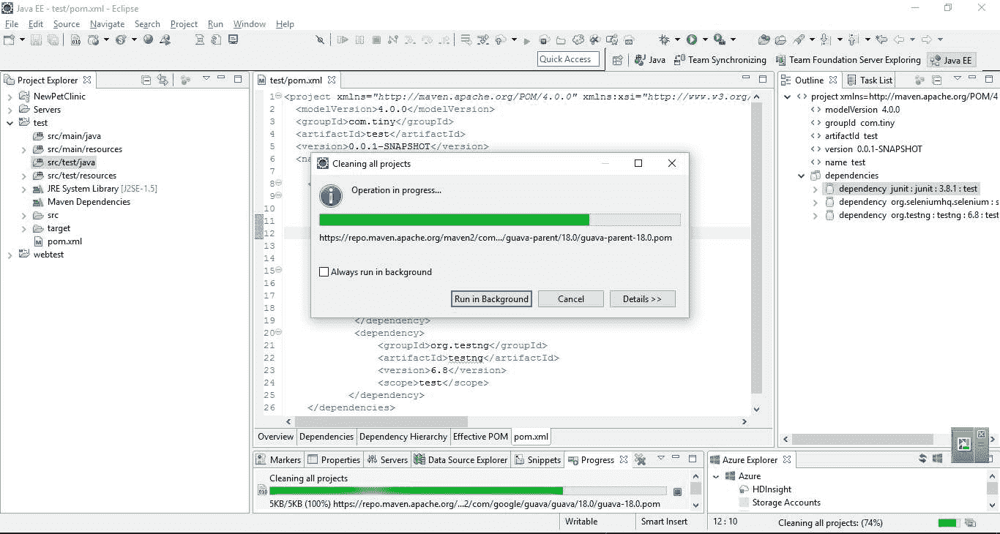

1.  点击对话框中的“详细信息”按钮以验证正在进行的操作。

1.  接下来的任务是编写`TestNG`类。安装 TestNG 插件。点击帮助并选择安装新软件。添加仓库：

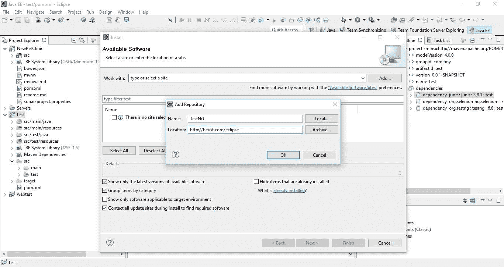

1.  选择我们需要安装的项目：

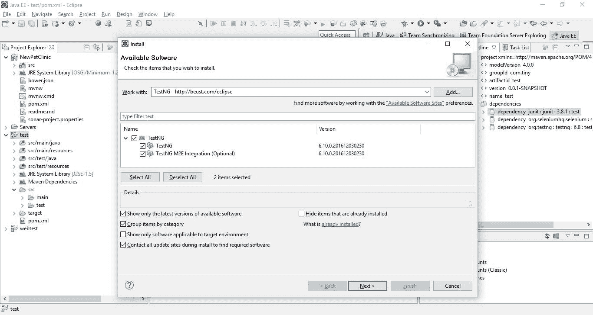

1.  审核所有需要安装的项目并点击下一步。

1.  接受许可协议并点击完成。

1.  在 Eclipse 中验证安装进度。

1.  现在让我们创建一个`TestNG`类：

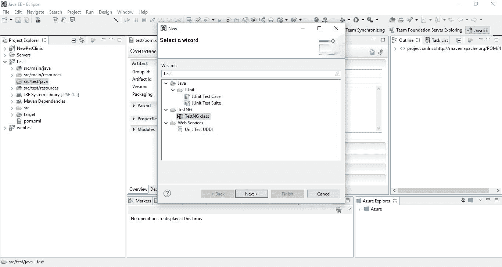

1.  提供一个类名：

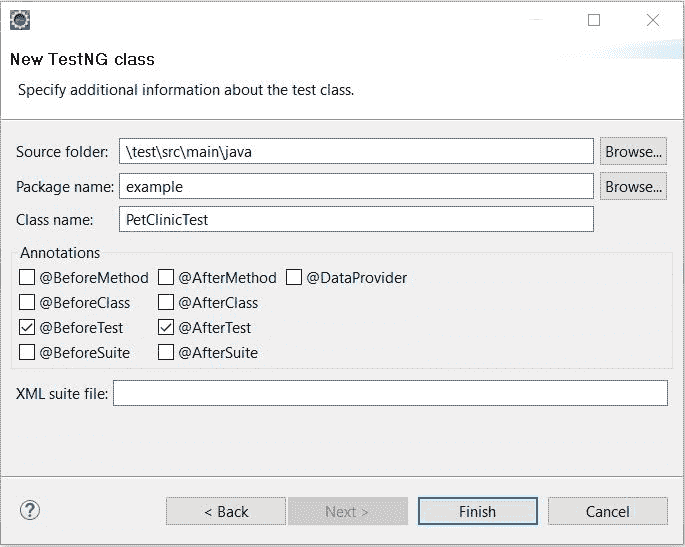

1.  给一个包名并点击完成。

1.  新创建的类将如下截图所示：

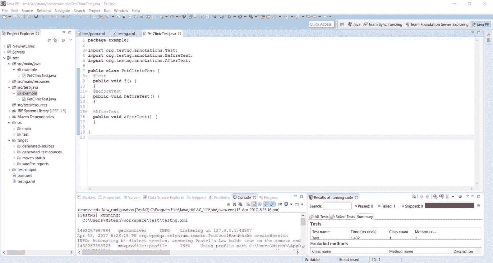

1.  右键点击`test`文件并点击 TestNG，转换为 TestNG。

1.  它将创建一个包含测试套件详细信息的`testing.xml`文件：

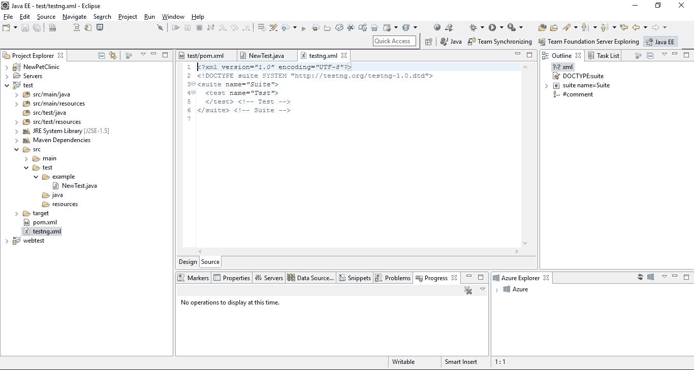

1.  右键点击项目并点击 Run Configurations。

1.  右键点击 TestNG，然后点击 New：

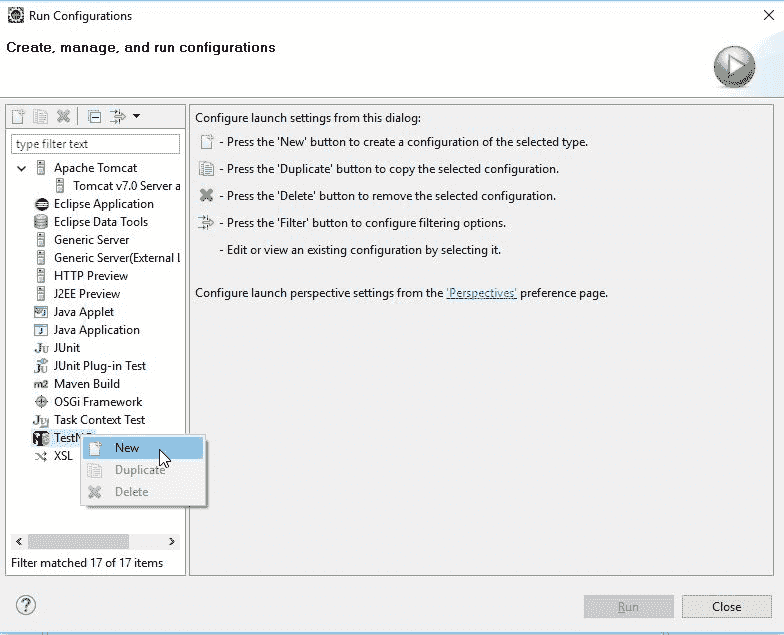

1.  提供项目名称并在套件中选择`testing.xml`。

1.  点击确定并应用。

1.  点击运行：

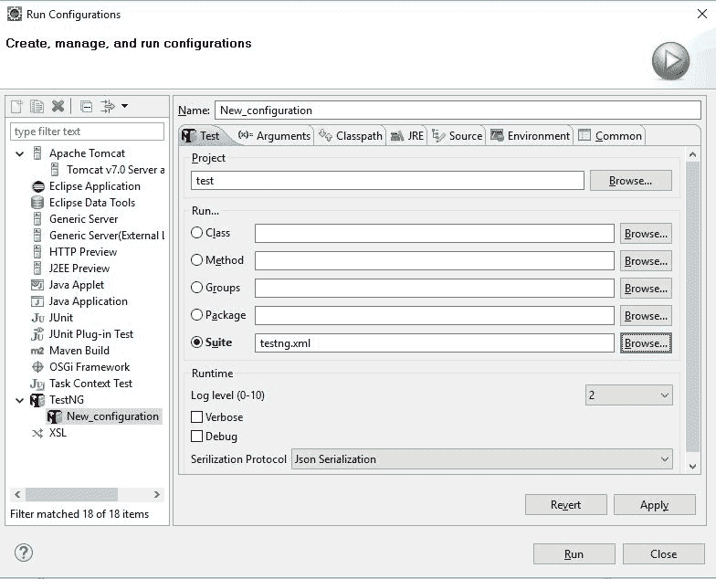

1.  如果 Windows 防火墙阻止了该操作，请点击允许访问。

1.  `testing.xml`中没有可用于执行的配置，因此即使 Maven 执行成功，也不会执行任何套件：

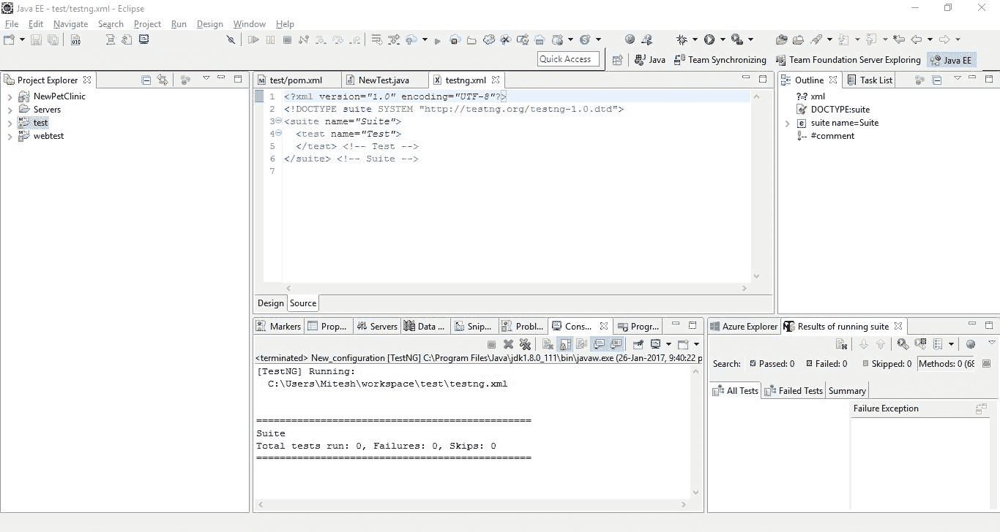

1.  在`test`文件夹下生成`TestNG`类。

1.  选择`location`，`suite name`和`class name`：

```
<?xml version="1.0" encoding="UTF-8"?> 
<!DOCTYPE suite SYSTEM "http://testng.org/testng-1.0.dtd"> 
<suite name="Suite"> 
<test name="Test"> 
<classes> 
<class name="example.PetClinicTest"/> 
</classes> 
</test><!-- Test --> 
</suite><!-- Suite --> 

```

1.  访问[`github.com/mozilla/geckodriver/releases`](https://github.com/mozilla/geckodriver/releases)并下载一个版本。

1.  根据我们系统的配置，从下载的 ZIP 文件中提取文件。在我们的例子中，我们下载了`geckodriver-v0.13.0-win64`。

1.  点击它并验证驱动程序的详细信息。

让我们写一些代码。它将检查网页标题是否包含特定的字符串。以下代码的结果或输出取决于页面的标题。如果标题包含给定的字符串，则测试用例通过；否则测试用例失败：

```
package example;     

importjava.io.File; 
importorg.openqa.selenium.WebDriver;     
importorg.openqa.selenium.firefox.FirefoxDriver;   
importorg.testng.Assert;     
importorg.testng.annotations.Test;   
importorg.testng.annotations.BeforeTest;   
importorg.testng.annotations.AfterTest;     
public class PetClinicTest {     
  private WebDriver driver;     
    @Test         
    public void testPetClinic() {   
      driver.get("http://localhost:8090/petclinic/");   
      String title = driver.getTitle();     
      Assert.assertTrue(title.contains("a Spring Frameworkk"));  
    }   
    @BeforeTest 
    public void beforeTest() {   
      File file = new File("F:\\##DevOpsBootCamp\\geckodriver-v0.13.0-win64\\geckodriver.exe"); 
      System.setProperty("webdriver.gecko.driver", file.getAbsolutePath());       
      driver = new FirefoxDriver();   
    }     
    @AfterTest 
    public void afterTest() { 
      driver.quit();       
    }     
}   

```

IDE 中会显示相同的文件，如下所示。

让我们再次从 Eclipse 运行 Maven 测试。

以下是测试用例成功执行时的输出：

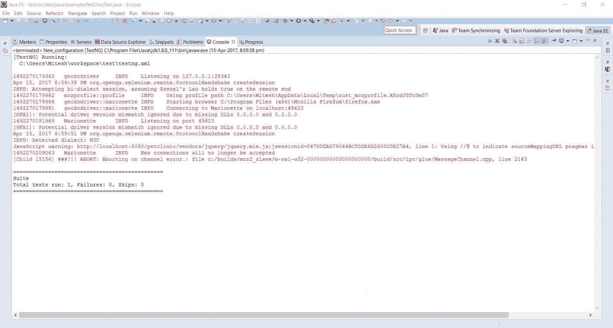

1.  在 Eclipse 的运行套件结果中的 All Tests 标签验证。我们可以在这里看到成功的执行：

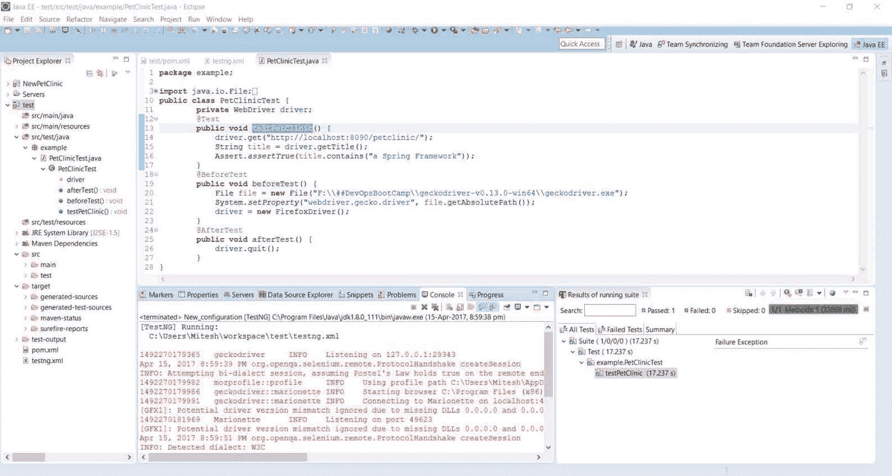

1.  在 Eclipse 的运行套件结果中验证 Failed Tests 标签。

1.  在 Eclipse 的运行套件结果中的 Summary 标签验证成功的场景。

1.  在代码中，修改用于标题比较的文本，以便测试用例失败。

1.  在控制台验证输出：

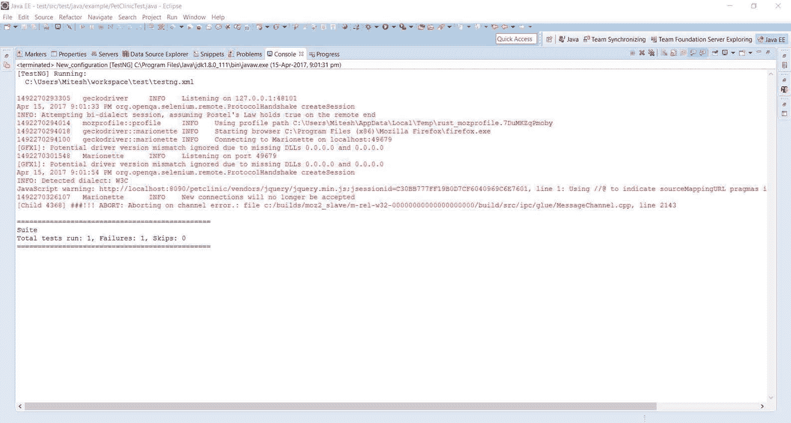

1.  在 Eclipse 的运行套件结果中的 All Tests 标签验证，并注意失败图标：

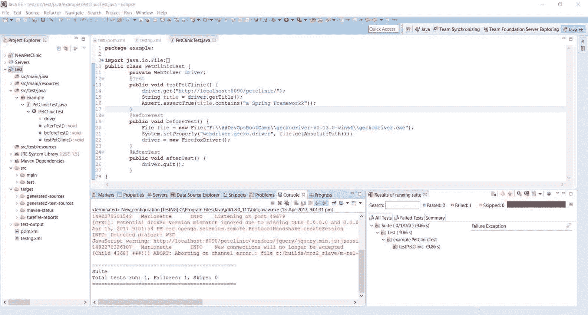

1.  在 Eclipse 的运行套件结果中的 Failed Tests 标签验证。

1.  点击 testPetClinic 并验证 Failure Exception。

1.  在 Eclipse 的运行套件结果中的 Summary 标签验证。

因此，我们基于 Selenium 创建了一个示例测试用例来验证 PetClinic 首页的标题。

# Jenkins 中的功能测试执行

现在让我们尝试从 Jenkins 执行相同操作：

1.  在 Repository 中检查测试项目。 在 Jenkins 中创建一个 `PetClinic-FuncTest` 自由风格作业。

1.  在构建部分，提供根 POM 位置和要执行的目标与选项：

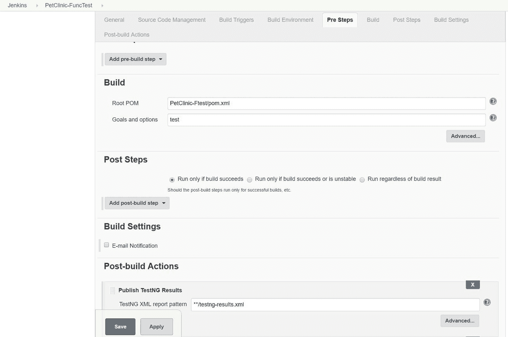

1.  保存构建作业并点击立即构建。

1.  验证构建作业在控制台输出中的执行。

1.  这将打开一个 Mozilla Firefox 窗口并打开代码中给定的 URL。 这需要我们的 PetClinic 应用程序已经部署在 web 服务器上并且运行没有问题：

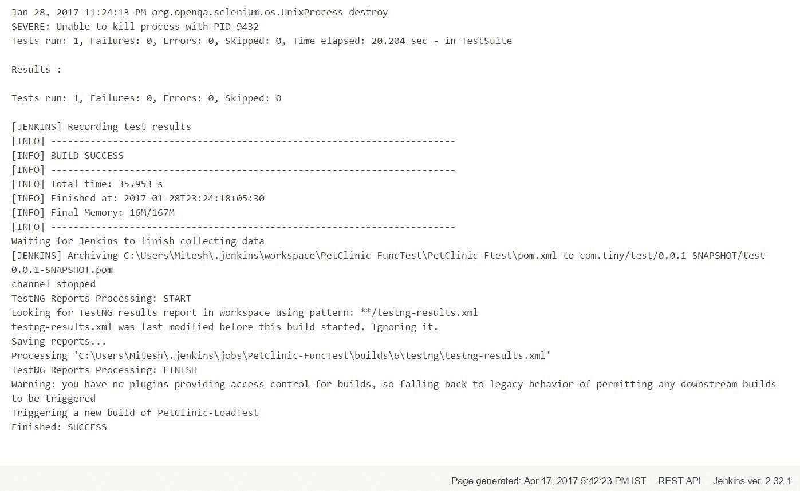

1.  现在在代码中进行更改，使标题验证失败，并执行构建作业。

1.  在 Jenkins 的控制台输出中标记了一个失败：

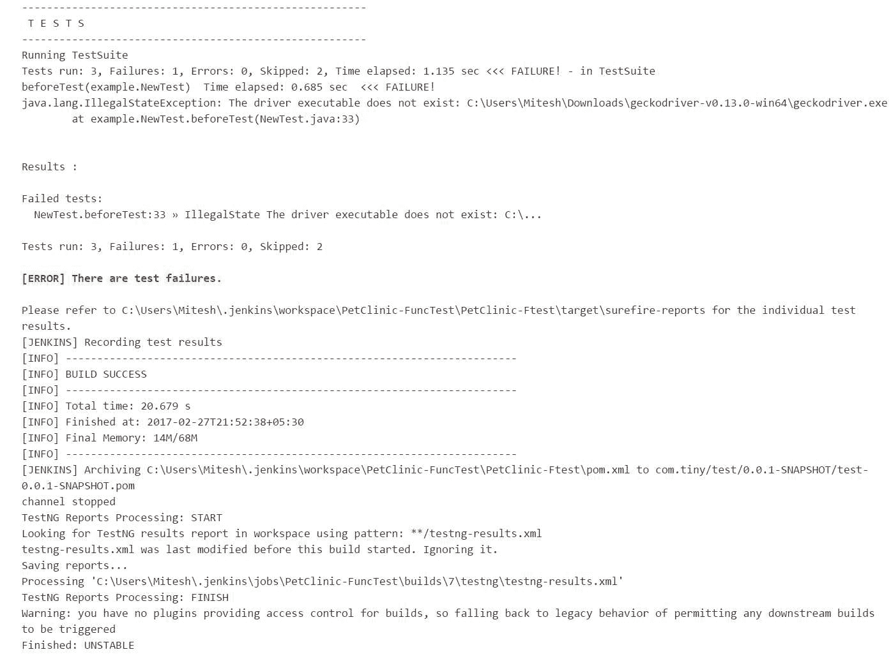

1.  转到项目仪表盘并验证 TestNG 结果的图表：

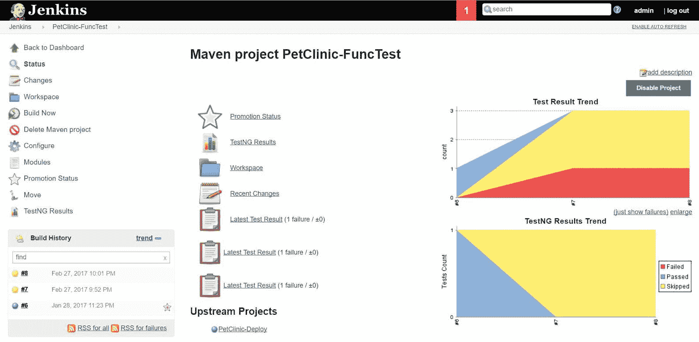

我们已经了解了如何在 Jenkins 中执行基于 Selenium 的测试用例。

在下一部分中，我们将展示如何使用 Jenkins 执行负载测试。

# 使用 Jenkins 执行负载测试

步骤如下：

1.  打开 Apache JMeter 控制台。 创建一个测试计划。

1.  右键点击测试计划并点击添加；选择线程（用户）。

1.  选择线程组。

1.  提供线程组名称。

1.  在线程组属性中，提供线程数、启动时间和循环次数。

1.  右键点击线程组。 点击添加。 点击采样器。 点击 HTTP 请求。

1.  在 HTTP 请求中，提供服务器名称或 IP 地址。 在我们的例子中，它将是 localhost 或某个 IP 地址。

1.  提供您的 Web 服务器运行的端口号。

1.  选择 GET 方法并提供负载测试的路径：

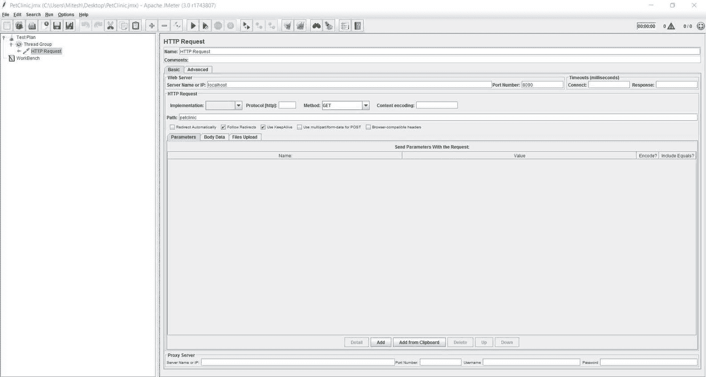

1.  保存 `.jmx` 文件。

1.  现在让我们创建一个 Jenkins 作业。

1.  在 Jenkins 中创建一个自由风格作业：

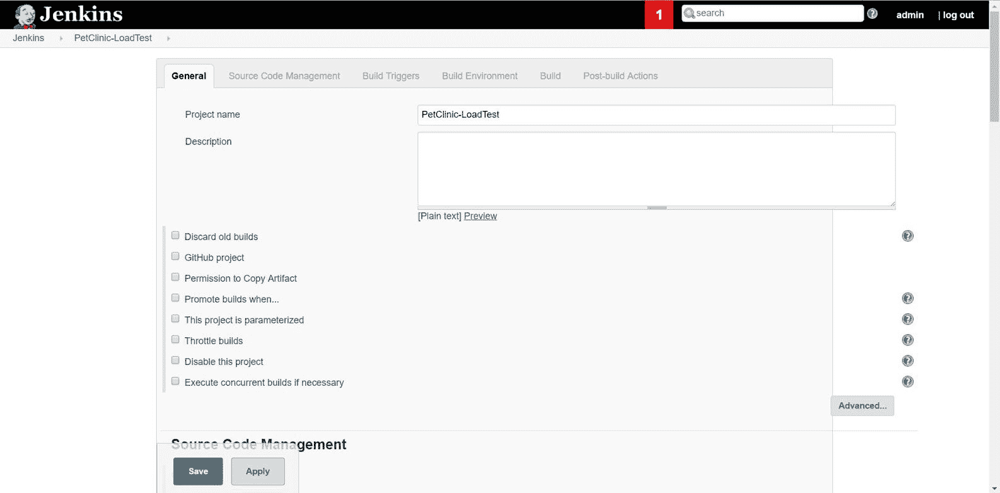

1.  添加构建步骤，执行 Windows 批处理命令。

    1.  添加以下命令。 根据安装目录和 `.jmx` 文件的位置，替换 `jmeter.bat` 的位置：

```
    C:\apache-jmeter-3.0\bin\jmeter.bat -Jjmeter.save.saveservice.output_format=xml -n -t C:\Users\Mitesh\Desktop\PetClinic.jmx -l Test.jtl  

```

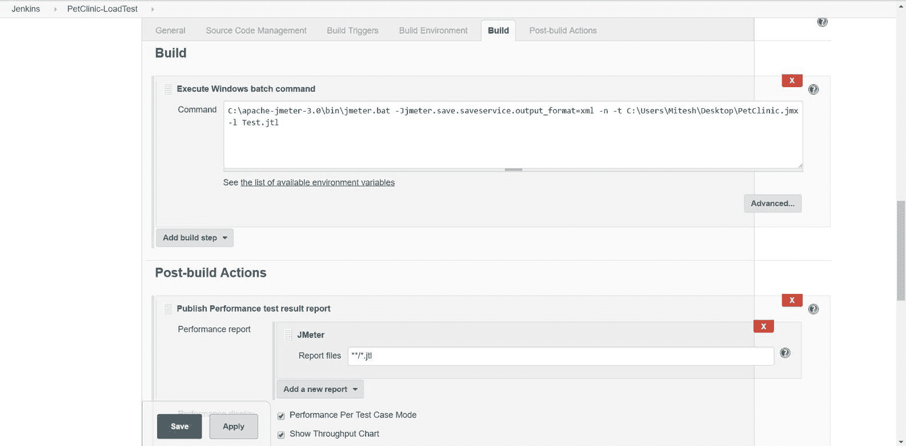

1.  添加构建后操作。 发布性能测试结果报告，添加 **/*.jtl 文件。

1.  点击立即构建：

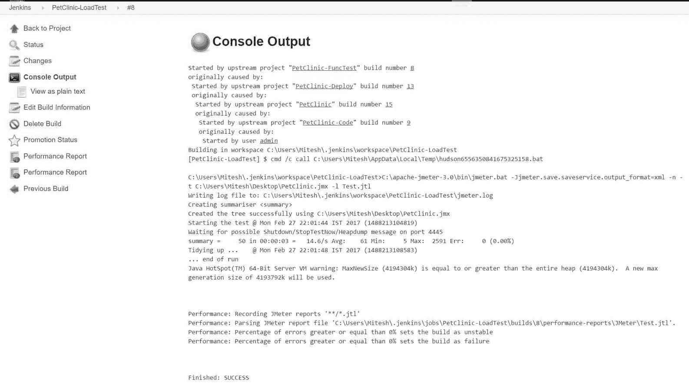

1.  验证项目仪表盘中的性能趋势。

1.  点击性能趋势：

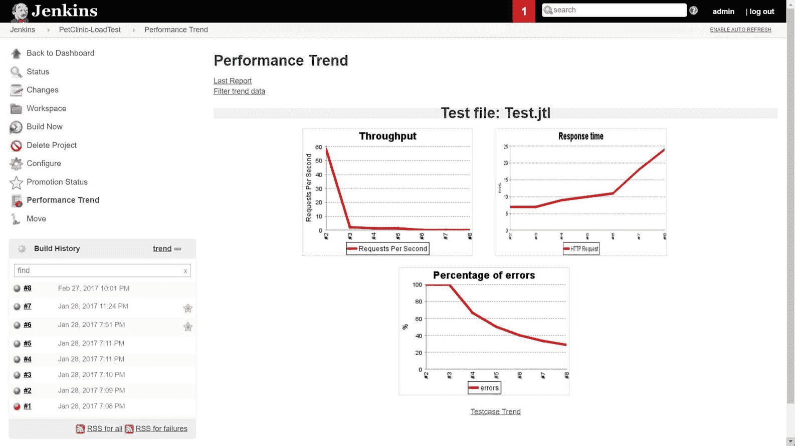

1.  验证性能分解。

在下一部分中，我们将看到如何使用 VSTS 中的选项对部署在 Microsoft Azure App Services 中的 Web 应用程序进行负载测试。

# 使用基于 URL 的测试和 Apache JMeter 在 Microsoft Azure 上进行负载测试

一旦我们成功将应用程序部署到 Azure App Services，我们就可以对 Azure App Service 或 Azure Web Apps 进行负载测试。 让我们看看如何使用 Visual Studio Team Services 执行测试。

# 基于 URL 的测试

1.  在顶部菜单栏中，点击负载测试。 让我们在 VSTS 中创建我们的第一个测试并执行它。

1.  点击新建并选择基于 URL 的测试：

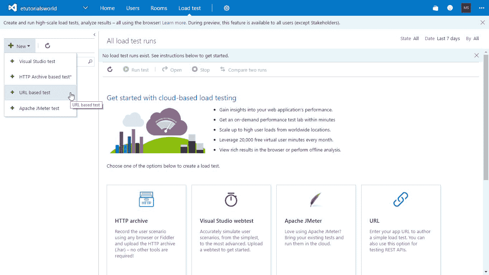

1.  验证 HTTP 方法和 URL：

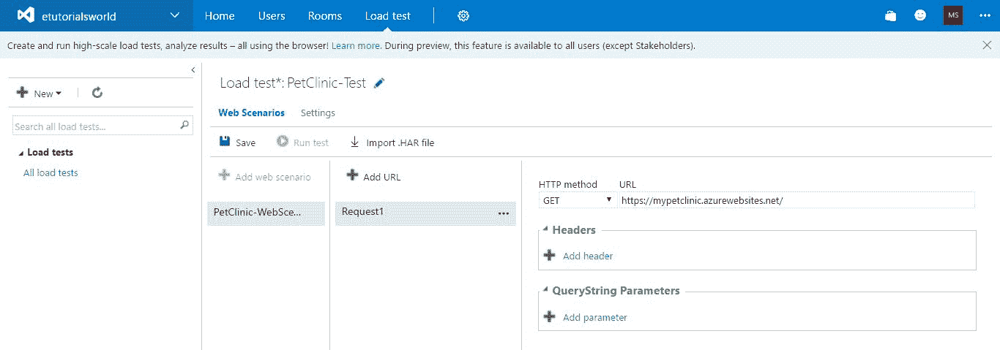

1.  点击“设置”；根据需要在不同参数中提供输入：

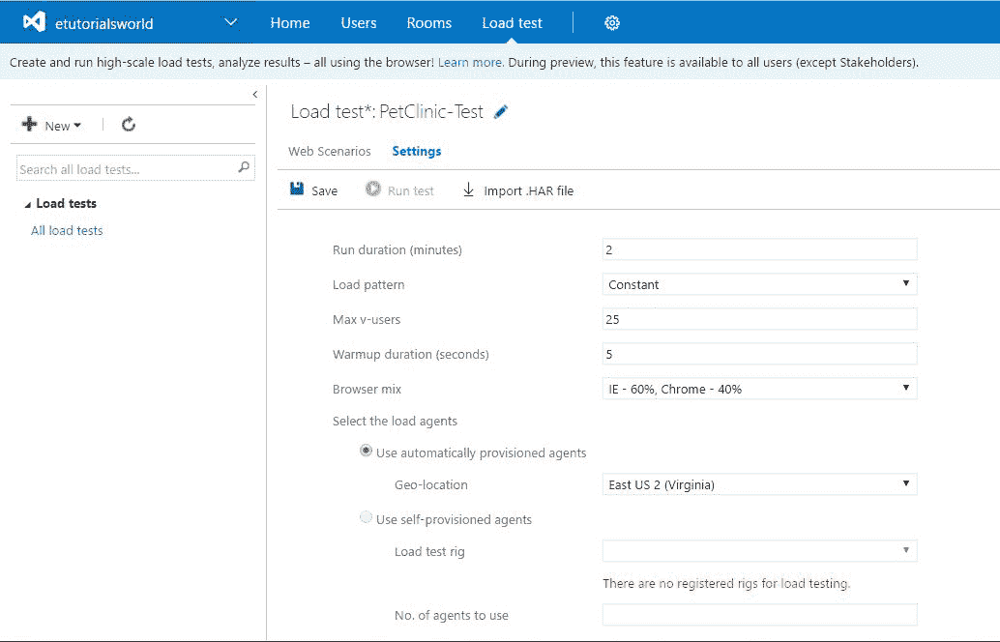

1.  点击“保存”并点击“运行测试”。

1.  负载测试正在进行中：

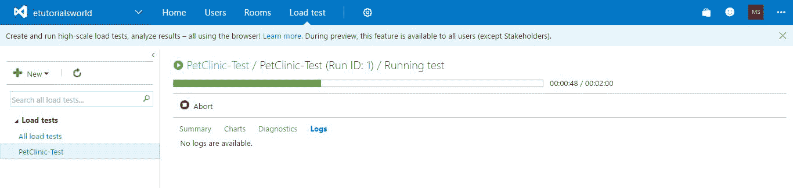

1.  在 VSTS 门户中查看完整的测试数据，数据一旦可用。

1.  在 VSTS 中验证基于 URL 的测试执行的最终总结：

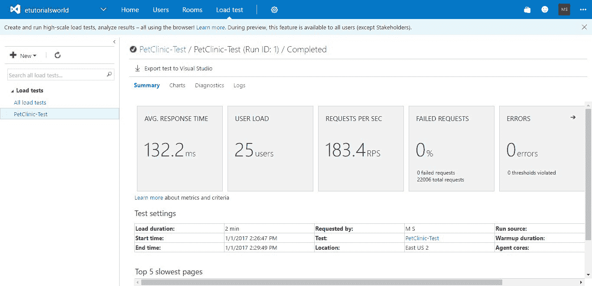

1.  测试执行后，我们还会在 VSTS 中获得性能和吞吐量图表：

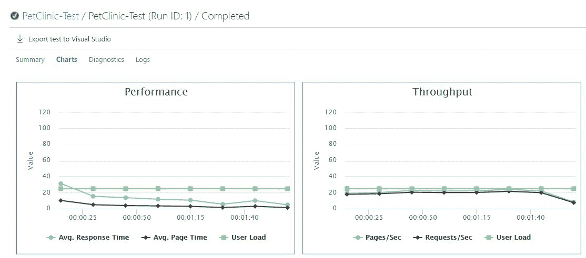

1.  同时验证测试和与错误相关的细节。

我们已经了解了如何在 Azure Web 应用上执行基于 URL 的测试。在下一部分，我们将讲解如何使用 Apache JMeter 进行负载测试。

# Apache JMeter

我们常常需要验证一个应用程序能够承受多少负载，以便基于此检查许多功能或瓶颈，提升性能，使其能够高效地处理尽可能多的请求。在这一部分，我们将介绍如何执行 Apache JMeter 测试。我们将在 Azure App Services 上部署的 PetClinic 应用上进行负载测试。

欲了解更多有关此主题的详细信息，请访问 [`jmeter.apache.org/usermanual/`](http://jmeter.apache.org/usermanual/)。

要开始执行，请按以下步骤操作：

1.  从 [`jmeter.apache.org/`](http://jmeter.apache.org/) 下载 Apache JMeter。

1.  在 Apache JMeter 中启动并创建一个线程组。这里，我们需要设置线程数（用户数）、逐步加载时间（以秒为单位）和循环次数：

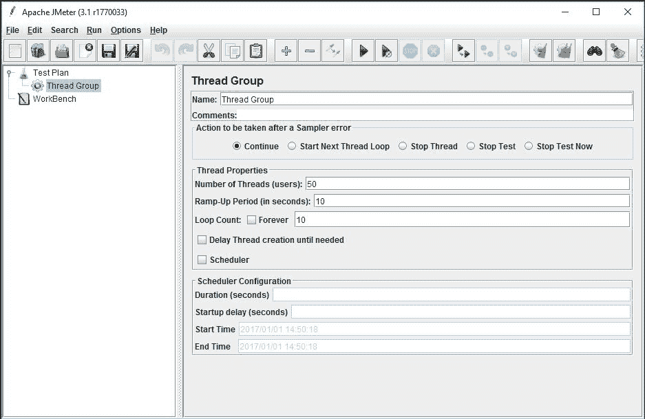

1.  右键点击线程组并点击“添加”。

1.  选择采样器并点击“HTTP 请求”：

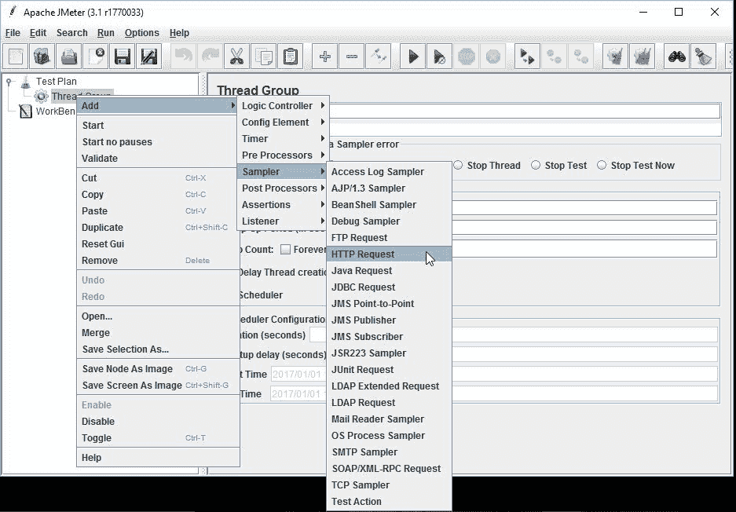

1.  在服务器名称中提供 Azure Web 应用的 URL，并选择 HTTPS 协议：

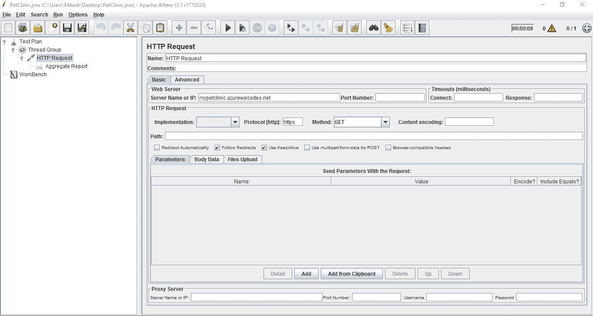

1.  执行测试并在 Apache JMeter 中验证结果：

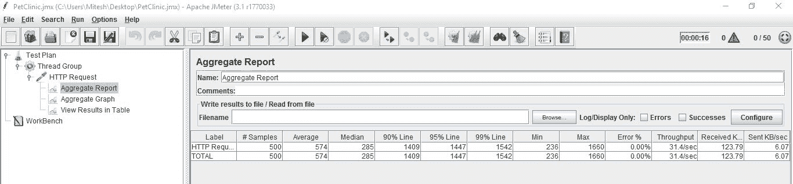

1.  在 HTTP 请求中添加汇总图表：

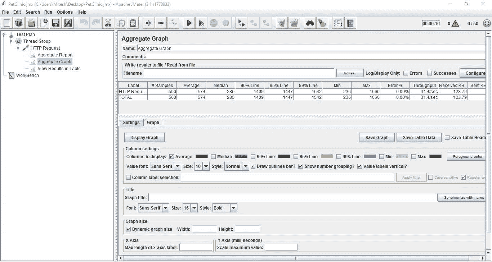

1.  在负载测试执行后，验证图表。

1.  欲了解更多详情，请点击“表格中查看结果”：

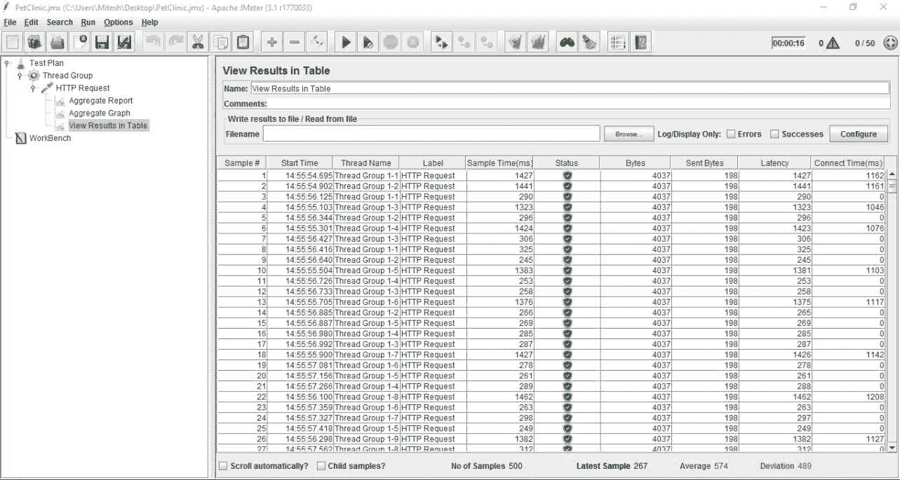

我们也可以在 VSTS 中执行 Apache JMeter 测试。

执行进度如下：

1.  点击“新建”，选择 Apache JMeter 测试：

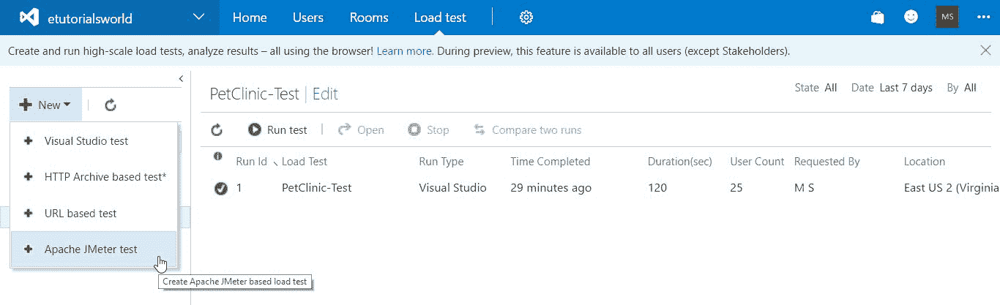

1.  我们将使用之前用于对 Azure Web 应用进行负载测试的相同 JMX 文件。

1.  选择负载持续时间和负载位置。点击“运行测试”：

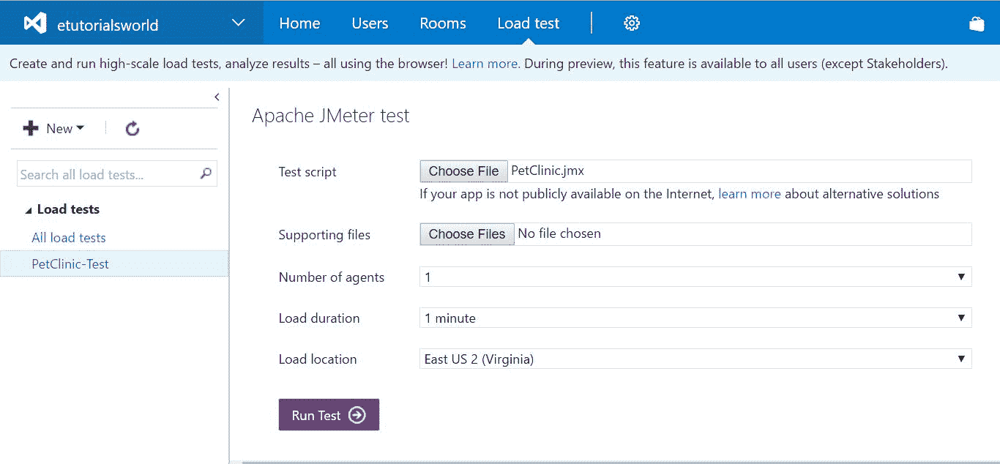

# 总结

“测试是一项技能。虽然这对某些人来说可能是个惊讶，但这确实是一个简单的事实。”

- Fewster 和 Graham

验证应用程序质量是非常重要的。测试是应用程序生命周期管理中的一部分，我们不能忽视它。它是高质量产品的基石之一。

因此，养成测试的习惯至关重要。不同类型的测试关注质量的不同维度，从而使应用程序更加稳健。

持续测试在持续集成和持续交付中扮演着重要角色。如果该部分是自动化的，自动化模式下的持续测试有助于更快地实现稳健性，并与更短的市场周期保持同步。

在本章中，我们介绍了与 Jenkins 集成的功能和负载测试。

在下一章中，我们将看到如何将我们至今执行的所有操作按顺序编排。这将让我们感受到端到端自动化的真实感。更多的是在 Jenkins 中创建流水线，并配置构建和发布定义的触发器，从而实现应用程序生命周期管理步骤的自动化。
