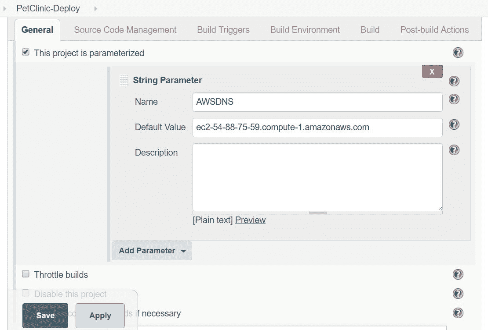
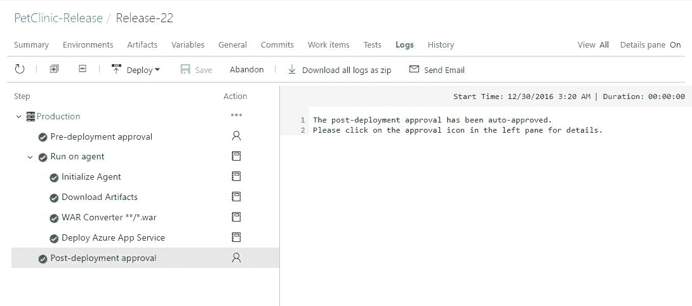
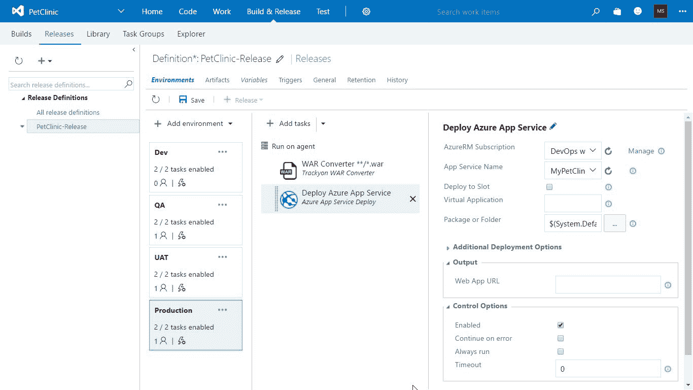

# 协调 - 端到端自动化

"遵循持续交付路径的关键是不断质疑自己对可能性假设的看法。"

- Jeff Sussna

本章中，我们将讨论使用开源和商业替代方案提供的协调功能，自动化应用程序生命周期管理的不同方法。

我们将使用 Jenkins 插件和 Visual Studio Team Services 任务来协调和自动化应用程序生命周期管理期间执行的所有活动。

本章我们将涵盖以下主题：

+   使用 Jenkins 进行应用程序生命周期管理的端到端自动化协调

+   使用 Jenkins、Chef 和 AWS EC2 的端到端自动化

+   使用 Jenkins 和 AWS Elastic Beanstalk 的端到端自动化

+   使用 Jenkins 和 Microsoft Azure 应用服务的端到端自动化

+   使用 VSTS 进行应用程序生命周期管理的端到端自动化协调

# 使用 Jenkins 进行应用程序生命周期管理的端到端自动化

在 第二章，*持续集成* 中，我们创建了一个构建作业，该作业执行以下任务：

1.  对 PetClinic Web 应用程序的静态代码分析：


1.  静态代码分析成功执行后，Jenkins 仪表板会显示指向特定项目的 SonaQube 仪表板的 URL。

1.  验证 Jenkins 仪表板以及所有分析细节：


1.  源文件编译和单元测试执行：


1.  单元测试结果将显示在 Jenkins 项目仪表板本身。

1.  包文件的创建：


一旦我们的包文件准备好，我们可以将其部署到 AWSEC2 实例、Microsoft Azure 虚拟机、AWS Elastic Beanstalk、Microsoft Azure 应用服务、容器或任何可以从安装了 Jenkins 系统的物理机器访问的机器上。

# 使用 Jenkins、Chef 和 AWS EC2 的端到端自动化

在本节中，我们将使用 Jenkins 中可用的 Build Pipeline 插件来协调不同的任务。

在 第四章，*云计算与配置管理* 中，我们安装了 Chef 工作站，配置了托管 Chef 账户，并为 AWS 和 Microsoft Azure 安装了刀具插件。

我们使用以下命令在 AWS EC2 中创建了一个实例：

```
[root@devops1 Desktop]# knife ec2 server create -I ami-1ecae776 -f t2.micro -N DevOpsVMonAWS --aws-access-key-id '< Your Access Key ID >' --aws-secret-access-key '< Your Secret Access Key >' -S book --identity-file book.pem --ssh-user ec2-user -r role[v-tomcat]  

```

我们使用以下命令在 Microsoft Azure 中创建了一个虚拟机：

```
[root@devops1 Desktop]# knife azure server create --azure-dns-name 'distechnodemo' --azure-vm-name 'dtserver02' --azure-vm-size 'Small' -N DevOpsVMonAzure2 --azure-storage-account 'classicstorage9883' --bootstrap-protocol 'cloud-api' --azure-source-image '5112500ae3b842c8b9c604889f8753c3__OpenLogic-CentOS-67-20160310' --azure-service-location 'Central US' --ssh-user 'dtechno' --ssh-password 'cloud@321' -r role[v-tomcat] --ssh-port 22  

```

我们验证了 AWS EC2 实例和 Microsoft Azure 虚拟机在托管 Chef 中的注册。

我们从命令提示符执行了这两个命令。在 Jenkins 中，我们可以为 Windows、Linux 或 Mac 执行命令。我们也可以通过创建自由风格的作业，在 Jenkins 构建作业中执行相同的命令。

# 使用密钥配置 SSH 身份验证

安装在虚拟机上的 Chef 工作站可以从安装了 Jenkins 的系统中访问。我们可以使用虚拟盒子或 VMware 工作站在笔记本上创建虚拟机；然后可以安装 CentOS 6 或 7，并按照我们在第四章中所做的配置 Chef 工作站，*云计算与配置管理*。

在开始配置端到端自动化和使用构建管道插件以及上下游任务进行编排之前，我们将使用密钥配置 SSH 认证。

配置 SSH 认证的主要目的是允许 Jenkins 虚拟机连接到 Chef 工作站虚拟机。这样我们就可以从 Jenkins 机器执行命令到 Chef 工作站。通过这种方式，我们可以使用 Chef 工作站在 AWS 或 Azure 云中创建实例，并在其上安装运行时环境来部署 PetClinic 应用程序：


如果我们尝试从 Jenkins 访问 Chef 工作站，它将不起作用，因为我们仍然需要配置无密码配置，因为在 Jenkins 作业执行中，我们不能在流程中间等待输入密码。让我们配置无密码访问 Jenkins，以便访问 Chef 工作站：

1.  打开安装了 Jenkins 的虚拟机中的终端。使用`ssh-keygen`创建一个新密钥：


1.  在本地文件系统上验证密钥。

1.  使用`ssh-copy-id`将密钥复制到配置了 Chef 工作站的远程主机：


1.  现在通过执行`execute` Shell 命令，尝试通过 Jenkins 构建作业访问 Chef 工作站虚拟机。

1.  如果失败，则尝试从 Jenkins 虚拟机通过终端访问 Chef 工作站。如果看到“代理被拒绝使用密钥签名”的错误信息，则执行`ssh-add`命令来解决问题。

1.  一旦在终端中连接成功，执行`ifconfig`命令来查找 IP 地址，这样我们就能找出在哪台虚拟机上执行该命令：


1.  此时，我们的 SSH 连接已成功使用我们创建和配置的密钥，而不是密码。

1.  现在我们可以从 Jenkins 的虚拟机访问 Chef 工作站，因此我们可以从 Jenkins 执行 knife 命令到 Chef 工作站。我们的下一个目标是尝试使用 Jenkins 构建作业和 Chef 工作站在 AWS 中创建实例。

1.  在 Jenkins 构建作业中，添加一个构建步骤，选择执行 Shell，并添加此处显示的命令。我们已经讨论过`knife ec2`命令：

```
 ssh -t -t root@192.168.1.36 "ifconfig; rvm use 
        2.1.0; knife ec2 server create -I ami-1ecae776 -f 
        t2.micro -N DevOpsVMonAWS1 --aws-access-key-id 
        '<YOUR ACCESS KEY ID>' --aws-secret-access-key 
        '<YOUR SECRET ACCESS KEY>' -S book --identity-file 
        book.pem --ssh-user ec2-user -r role[v-tomcat]"  

```


1.  使用你自己的 Access Key ID 和 Secret Access Key 替换。点击保存。点击“立即构建”链接以执行构建作业。

1.  转到控制台输出查看进度：


1.  检查日志；AWS 实例创建已启动。

1.  在 AWS 管理控制台中验证：


1.  在执行进一步操作之前，请检查 AWS 安全组是否已为 SSH 访问设置条目：


1.  一旦 SSH 访问可用，它将开始安装 Chef 客户端。

1.  在我们的案例中，它将开始下载 Chef 客户端，并将其安装到我们使用 Chef 工作站创建的 AWS 实例上：

1.  在控制台中验证 Chef 安装过程。一旦 Chef 客户端安装在 AWS 实例上，它将启动第一次 Chef 客户端执行。

1.  观察运行列表并同步 cookbook。它将汇聚并开始安装软件包。

1.  验证软件包的安装情况。

1.  它还将显示 `conf.xml`，可以根据配置验证与端口相关的详细信息。

1.  一旦软件包安装完成，将开始服务管理。

1.  现在，Chef 客户端执行已完成，并将显示我们创建的 AWS 实例的相关信息：


1.  检查 AWS 管理控制台，确认构建状态是否成功。

1.  验证已注册节点的托管 Chef：


在此阶段，我们已经准备好了一个 AWS 实例，该实例已安装 Tomcat 和 Java，因此我们可以轻松部署我们的应用程序。现在，我们已经准备好所有资源来配置构建流水线：

1.  转到 PetClinic-Code 任务，并从“添加构建后操作”中选择“构建其他项目”。

1.  在“要构建的项目”中输入 PetClinic：


1.  在此，PetClinic-Code 成为 PetClinic 的上游项目，而 PetClinic 成为 PetClinic-Code 的下游项目。构建流水线插件需要建立关系，使用上游和下游项目进行可视化。

1.  转到 PetClinic-Code 任务，并从“添加构建后操作”中选择“构建其他项目”。

1.  在“PetClinic-CloudProvisioning”项目中输入，进行构建：


1.  如果此构建任务执行成功，则表示已部署的虚拟机已准备好，并安装了运行时环境。

1.  转到 PetClinic-CloudProvisioning 任务，并从“添加构建后操作”中选择“构建其他项目”。

1.  在“要构建的项目”中输入 PetClinic-Deploy：


1.  一旦验证了工件复制操作，配置构建任务以便我们可以将其作为手动操作进行部署。我们将创建一个作业，使用新创建实例的域名或 IP 地址作为字符串参数：



1.  配置构建任务，在 AWS 实例上执行部署 WAR 文件的操作，执行以下命令：

```
 ssh -i /home/mitesh/book.pem -o 
        StrictHostKeyChecking=no -t -t ec2-user@$AWSDNS 
        "sudousermod -a -G tomcat ec2-user; sudochmod -R 
        g+w /var/lib/tomcat6/webapps; sudo service tomcat6 
        stop;"

 scp -i /home/mitesh/book.pem 
        /home/mitesh/target/*.war ec2-
        user@$AWSDNS:/var/lib/tomcat6/webapps

 ssh -i /home/mitesh/book.pem -o 
        StrictHostKeyChecking=no -t -t ec2-user@$AWSDNS 
        "sudo service tomcat6 start"

```

1.  在 Jenkins 构建任务中的“执行 shell 命令”部分执行以下命令：


1.  一旦此构建任务执行成功，意味着应用程序部署成功，我们可以进行功能测试。

1.  使用 Promotion 插件配置 PetClinic-FuncTest 构建的提升：


1.  执行 PetClinic-FuncTest 后，我们的流水线结束：


1.  保存 PetClinic-FuncTest，并验证上游项目。

1.  从“管理 Jenkins | 管理插件”安装 Build Pipeline 插件。

1.  在 Jenkins 仪表板上，点击+号。

1.  提供视图名称：


1.  在 Upstream / downstream 配置中选择初始任务：


1.  点击 Run 执行。确保在 Jenkins 中配置的 Tomcat 和 Sonar 正在运行。

1.  我们已经将 PetClinic-Deploy 配置为 Build 其他项目中的下游项目（手动步骤）。我们也定义了参数：


图：用于端到端应用生命周期管理自动化的构建流水线

1.  验证参数符号：


图：具有参数化任务的构建流水线

1.  一旦 PetClinic-CloudProvisioning 项目成功完成，记下域名并将其作为默认参数提供给 PetClinic-Deploy 项目。

1.  点击 Trigger：


图：具有手动触发的构建流水线

1.  验证端到端构建流水线执行。

因此，使用 Build Pipeline 插件我们可以协调不同活动的自动化。

# 使用 Jenkins 和 AWS Elastic Beanstalk 进行端到端自动化

要在 Amazon Elastic Beanstalk（PaaS）中部署 PetClinic Spring 应用程序，我们需要以下流程：


我们在本章中创建了 PetClinic-Code、PetClinic 和 PetClinic-Deploy-ElasticBeanstalk 构建任务。

将 PetClinic 配置为 PetClinic-Code 的下游任务；并将 PetClinic-Deploy-ElasticBeanstalk 配置为 PetClinic 构建任务的下游任务。

# 使用 Jenkins 和 Microsoft Azure 应用服务进行端到端自动化

要在 Microsoft Azure Web 应用（PaaS）中部署 PetClinic Spring 应用程序，我们需要以下流程：


我们在本章中创建了 PetClinic-Code、PetClinic 和 PetClinic-Deploy-Azure 构建任务。将 PetClinic 配置为 PetClinic-Code 的下游任务；并将 PetClinic-Deploy-Azure 配置为 PetClinic 构建任务的下游任务。

在 Microsoft Azure 的情况下，也有替代方案：我们可以使用 Visual Studio Team 服务器和 TFS 在线进行持续集成、持续交付和持续部署。

# 使用 VSTS 进行端到端的应用生命周期管理自动化协调

在第五章，*持续交付*中，我们看到如何使用 VSTS 部署我们的 Web 应用：

1.  转到 Releases 并检查最新的发布定义。

1.  查看 Build & Release 列以验证构建编号。

1.  双击 Release-22 以获取 VSTS 中发布定义执行的更多详细信息：


现在让我们验证在 VSTS 中发布定义执行的详细信息：

1.  在 Details 中，验证触发发布定义执行的构建编号。它还提供了请求持续部署的用户的详细信息。

1.  环境部分提供了有关环境发布定义执行了哪些部署的详细信息。它还显示了部署状态：发布定义何时被触发，何时完成，以及是否执行了测试。在我们的例子中，发布定义中没有测试用例：


1.  要获取有关发布定义执行的更多详细信息，请单击日志。它将显示在发布定义执行过程中执行的一系列步骤。

1.  如果设置了审批机制，它将首先要求审批；一旦获得审批，它将在代理上运行。它将首先初始化代理；然后，一旦代理可用于发布定义执行，它将从源文件夹下载构件或 WAR 文件。

1.  我们已经知道无法直接部署 WAR 文件，因此，根据我们的配置，它将把 WAR 文件转换为 ZIP 文件。一旦我们拥有了 ZIP 格式的包文件，我们的部署 Azure 应用服务任务将把应用程序包部署到 Azure Web 应用中。

1.  单击每个单独的步骤，以获取该步骤执行的详细日志。

1.  让我们看看 WAR 转换器 **/*.war 步骤的作用。

1.  类似地，部署 Azure 应用服务步骤执行将提供有关如何执行部署过程的详细信息：


1.  由于没有配置后部署审批，它会自动批准，因此构建执行成功：



我们已经知道 Azure Web 应用程序的 URL，或者我们可以从 Azure 门户中获取它。访问该 URL 并检查应用程序是否已正确部署。

到目前为止，我们已经使用持续集成和持续部署配置了端到端的应用程序生命周期管理自动化。

我们使用部署槽来处理不同的环境。所以，我们应该在发布定义中创建多个环境并进行部署。

所以，下一个问题是如何创建一个环境，以便我们可以在 Azure Web 应用中的特定部署槽中使用它进行包部署？

在发布定义中，单击 +添加环境，然后选择创建新环境。如果我们想在新环境中使用现有环境的相同任务，可以选择克隆所选环境：


在新环境中，我们保持自动的前部署审批：

1.  选择触发器，以便每当部署到生产环境成功时，自动进行部署。我们可以在所有环境配置完成后重新排列或重命名它。

1.  选择用于发布定义执行的托管代理。

1.  单击创建。

1.  双击环境名称来更改环境名称。

1.  根据环境，可以配置其余的部署详细信息：


1.  将现有环境名称更改为 Dev，然后单击（...）。这将打开一个菜单，选择克隆所选环境选项。

1.  如果是新环境，假设我们想在部署过程开始前保留审批，怎么办？

1.  在预部署批准中，选择特定用户。VSTS 帐户中的所有用户都可以获得审批权限。我们可以从该列表中提供任何名称。

1.  选择触发器，以便每次向环境 Dev 部署成功后自动部署。配置完所有环境后，我们可以重新排列或重命名它。

1.  为发布定义执行选择已托管代理。

1.  点击创建。通过双击环境名称，将环境名称更改为 `QA`。根据环境，其他部署细节可以配置：


1.  以类似的方式配置 UAT 环境。

1.  要手动分配审批到任何环境，选择“环境”，点击（...），然后选择“分配审批人...”。

1.  在预部署批准中，我们可以指定可以批准执行发布定义的用户。

1.  点击确定。

1.  我们只需配置最近创建的不同环境中部署 WAR 文件的位置：


让我们从 Dev 环境开始：

1.  点击 Dev 环境。

1.  转到发布定义中的 Deploy Azure App Service 任务。

1.  AzureRM 订阅和应用服务名称已经配置，就像我们之前做的那样。

1.  要将 WAR 文件部署到特定插槽，在此案例中为 dev，请勾选部署到插槽复选框。

1.  它会要求选择资源组：选择可用的 Azure Web 应用所在的资源组。

1.  在插槽列表中，将列出为 Azure Web 应用创建的所有插槽。选择 dev 插槽。

1.  保持其余细节不变并保存发布定义：


现在，让我们配置 QA 环境：

1.  点击 QA 环境。

1.  转到发布定义中的 Deploy Azure App Service 任务。

1.  AzureRM 订阅和应用服务名称也已经配置，就像我们之前做的那样。

1.  要将 WAR 文件部署到特定插槽，在此案例中为 qa，请勾选部署到插槽复选框。

1.  它会要求选择资源组：选择可用的 Azure Web 应用所在的资源组。

1.  在插槽列表中，将列出为 Azure Web 应用创建的所有插槽。选择 qa 插槽。

1.  保持其余细节不变并保存发布定义：


配置 UAT 环境，请按照以下步骤操作：

1.  点击 UAT 环境。

1.  转到发布定义中的 Deploy Azure App Service 任务。

1.  Azure RM 订阅和应用服务名称已经配置，就像我们之前做的那样。

1.  要将 WAR 文件部署到特定插槽，在此案例中为 `dev`，请勾选部署到插槽复选框。

1.  它会要求选择资源组：选择 Azure Web 应用所在的资源组。

1.  在插槽列表中，将列出为 Azure Web 应用创建的所有插槽。选择 uat/stage 插槽。

1.  保持其他细节不变，保存发布定义：


1.  要在生产插槽或主要 Azure Web 应用中部署应用程序，我们无需选择任何插槽。只需提供 Azure Web 应用名称，系统将自动将其部署到 Azure 中的主 Web 应用：



1.  保存发布定义：

1.  点击发布链接：


我们在发布定义执行中已设置了批准流程，因此，除非批准者批准，否则发布定义的执行将不会进行。

查看发布定义执行的摘要部分中的警告。它显示`dev`环境的预部署批准正在等待中。

由于我已将自己的 ID 配置为批准者，因此可以使用批准或拒绝构建的链接：


1.  让我们点击批准或拒绝链接。

1.  它会打开一个小对话框。我们需要在其中提供评论，然后点击批准或拒绝。我们还可以在此机制中分配多个批准者，并且可以设置是否希望所有批准者或任何一个批准者进行批准。

1.  在这种情况下，我们将点击批准：


1.  在日志中，我们现在可以看到已经给予了预部署批准，接下来的流程即将执行，用于在开发插槽中的应用部署：


1.  来自构建定义的工件将被下载，然后可以将其转换为 ZIP 文件，接着我们可以部署到开发插槽：


1.  一旦成功部署到开发环境，执行过程将等待批准，然后才会开始部署到 QA 插槽。

1.  我们需要提供批准，以便开始执行应用程序部署步骤：


1.  在发布记录中，我们可以看到有四个不同的环境，因为在我们的发布定义中创建了这些环境。

1.  我们可以看到当前发布定义执行的状态：


1.  对 QA 插槽的部署给予批准，它也将把 WAR 文件部署到 QA 插槽中。

我们需要记住，除了某些参数之外，应用程序部署到不同 Azure Web 应用程序部署插槽中的过程是相同的，且不会改变。

我们需要记住，每个插槽都是一个实时的 Web 应用程序，因此，如果我们想查看应用程序部署的位置以及幕后发生了什么，可以进入每个插槽的`Kudu`编辑器，验证是否已在每个 Azure Web 应用程序的插槽中执行了部署操作。

同样地，也需要部署到 UAT 或 Stage 插槽以及生产插槽：


现在，作为你自己的练习，提交一些应用程序代码的更改，并观察构建定义是如何执行的；它是如何在构建任务成功执行后触发发布定义的；以及如何将应用程序部署到不同的插槽。完成后，访问 Azure Web 应用程序的某个部署插槽的特定 URL，检查应用程序在不同环境中的部署是否成功。

# 总结

在这一章中，我们已经看到了如何自动化应用生命周期管理中不同任务的执行。

我们已经使用 Jenkins 在 AWS 和 Microsoft Azure 云服务提供商上部署了一个应用程序，并使用 Chef 配置管理工具来安装运行时环境。

我们还使用 Jenkins 在 AWS Elastic Beanstalk 上部署了一个应用程序，并使用 Visual Studio Team Services 进行端到端自动化，以便在 Azure App Services 上部署该应用程序，Azure App Services 是微软提供的 PaaS 服务。

在下一章，我们将学习更多关于配置安全性和监控相关的内容。我们将进一步探讨 Jenkins、VSTS 和 Microsoft Azure 中基于角色的资源访问控制。
