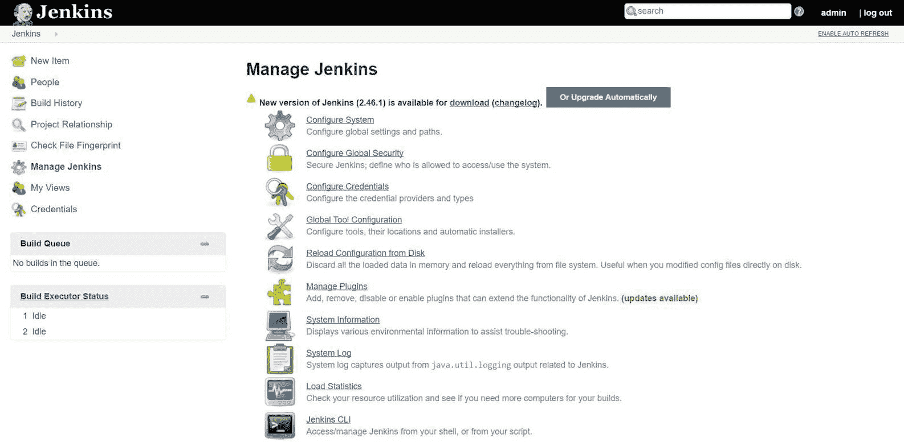
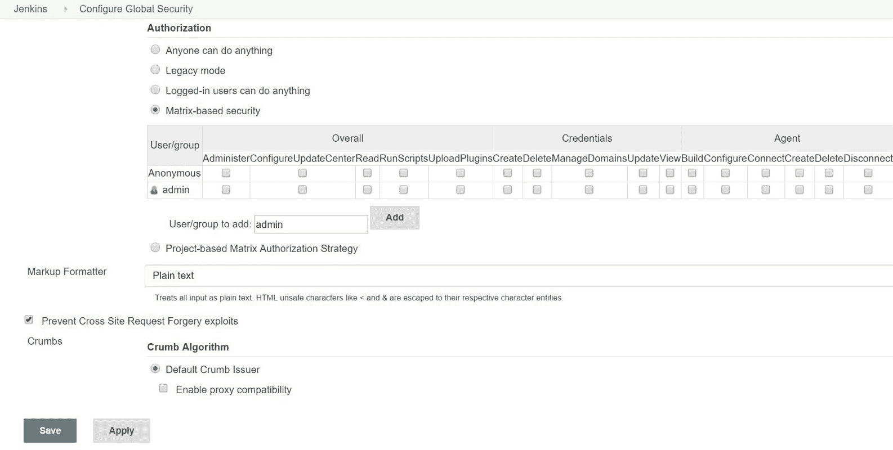

# 安全性与监控

“展示强有力的成功和明显的好处是让其他人同意尝试你方法的关键。”

- Frederic Rivain

安全性是应用生命周期管理中最重要的部分之一，因此，在 DevOps 的背景下，这项服务提高了价值。

在本章中，我们将讨论用户管理、监控以及部分故障排除内容。

我们将看到如何在 Jenkins 和 VSTS 中创建和管理用户。对于开源和商业工具，功能方面差异不大，但在易用性和支持可用程度上可能有所不同。

本章将涉及以下主题：

+   Jenkins 中的用户管理

+   **Visual Studio 团队服务**（**VSTS**）中的用户管理

+   监控 Jenkins 和 Microsoft Azure

+   Azure Web 应用程序故障排除和监控

# Jenkins 和 VSTS 中的安全性

安全性是 Jenkins 和 VSTS 的主要关注点。然而，安全性不仅仅局限于这一方面。安全性更是一个整体视角，涉及应用程序和基础设施的安全。考虑到我们在云环境中操作，基础设施安全变得尤为重要。

在本章中，我们将讨论 Jenkins 和 VSTS 中的用户管理。

# Jenkins 中的用户管理

安全性涉及**认证**和**授权**，它们是 AAA 三元组的一部分：

要进行安全配置，请转到“管理 Jenkins”并点击“配置全局安全性”：

要启用 Jenkins 中的安全性，请点击“启用安全性”。默认情况下，Jenkins 启用了安全性：

我们需要将 JNLP 代理的 TCP 端口更改为随机端口，以便可以配置代理。

对于认证中的访问控制，在安全领域部分选择 Jenkins 自己的用户数据库。

勾选“允许用户注册”，这样新用户就可以创建账户：

在授权部分，选择基于矩阵的安全性，以根据需要为所有可用用户提供权限：

我们还可以选择基于项目的矩阵授权策略。在这种情况下，我们需要进入单个构建任务或项目，并进入其配置：

勾选启用基于项目的安全性并为各个用户提供权限：

经常发生的情况是，我们因为没有为管理员用户单独提供权限而错误地锁定了 Jenkins，并保存了安全配置。

在这种情况下，要恢复 Jenkins 访问，请进入任何安装了 Jenkins 的操作系统中的 JENKINS_HOME 目录。

打开`Config.xml`，将`useSecurity`的值更改为`false`并重启 Jenkins：

在下一节中，我们将看到 VSTS 中的用户管理。

# VSTS 中的用户管理

对于配置和用户管理，按照以下步骤操作：

1.  打开新创建的项目 PetClinic 并点击设置图标。在项目配置页面，团队信息可用。点击 PetClinic 团队：

1.  默认情况下，管理员帐户已作为团队成员。点击+添加...来添加一个新的团队成员进行协作：

1.  使用登录地址或组别别名，点击保存更改：

1.  在仪表板中验证 PetClinic 团队成员：

1.  进入团队项目的主页并验证“团队成员”部分：

我们已成功将团队成员添加到项目的主团队。这就是如何创建项目并管理团队。

# 监控 Jenkins 和 Microsoft Azure

Azure 应用服务/Azure Web 应用自带诊断与解决问题功能，用于了解资源健康状况和解决一些常见问题。

# 监控 Jenkins

在 Jenkins 中，我们可以通过使用监控插件监控主机和不同的代理：

1.  进入管理 Jenkins|管理插件并安装监控插件：

1.  安装成功后，进入管理 Jenkins 并选择 Jenkins 主机的监控。

1.  点击同一部分中的 Jenkins 节点以查看 Jenkins 代理的监控：

1.  在浏览器中验证 JavaMelody 监控在特定时间戳的统计数据：

1.  点击“其他图表”以获取更多有关 Jenkins 各个方面的信息，例如缓冲区内存、线程数、交换空间等：

1.  向下滚动并获取线程的详细信息：

1.  点击调试日志以获取更多详细信息：

1.  在底部区域，我们可以找到调试日志：

1.  我们还可以使用构建监控视图插件监控不同的构建作业。

1.  进入管理 Jenkins|管理插件并安装“构建监控视图”插件：

1.  安装成功后，进入 Jenkins 仪表板并点击+号。

1.  提供视图名称。

1.  选择构建监控视图并点击确定：

1.  选择要监控的作业数量。

1.  点击确定：

1.  从一个窗口中，我们可以监控在构建监控视图中配置的所有构建作业的状态：

本书中，我们也在 Microsoft Azure Web Apps 上部署了应用程序，接下来的章节将展示如何监控 Azure Web Apps 并进行故障排除。

# Azure Web Apps 故障排除与监控

让我们深入了解“诊断与解决问题”以获取更多细节：

1.  进入 Azure 应用服务并选择我们之前创建的 Azure Web 应用。点击“诊断与解决问题”。

1.  另一个面板将被打开，面板上将有资源健康指示器和常见问题解决方案。

1.  我们可以看到，根据状态和绿色指示器，MyPetClinic Azure Web 应用程序可用且正常运行。

在我遇到的 Azure Web Apps 问题中，因各种原因，我多次遇到 HTTP 5xx 错误。识别问题的根本原因并加以修复也很重要。不过，这里提供了一些快速的解决方案/建议：

1.  在资源健康中，点击更多详细信息以获取 MyPetClinic Azure Web 应用程序的现有状态：

1.  点击查看历史记录以查找 Azure Web 应用程序的详细信息，了解其何时可用或不可用：

# Azure 应用服务 - HTTP 实时流量

在常见问题解决方案中，我们可以评估实时流量，以了解现有资源是否能管理当前的负载。

如果实时流量正常，那么可能没有问题，我们应该进一步排查问题：

我们可以根据 Azure 应用服务中可用的一个或多个主机名获取 HTTP 实时流量。

# Azure 应用服务 - CPU 和内存消耗

我们还可以获取有关 CPU 和内存百分比的详细信息，以了解 Azure Web 应用程序的性能，并确定是否需要进行扩展操作：

我们已经知道有一个主要的 Azure Web 应用程序，其他部署槽也可以使用。我们还可以获取 Azure Web Apps 或服务计划中的站点的详细信息：

这里，我们查看的是 Azure Web Apps 的 MyPetClinic（dev）部署槽的详细信息：

我们可以选择一个或多个部署槽，或选择全部槽，以查看 **应用服务计划**（**ASP**）中的 CPU 和内存使用情况：

类似地，我们可以验证特定 ASP 中托管的主要 Azure Web 应用程序和部署槽的 HTTP 统计信息：

我们还可以验证特定 ASP 中托管的主要 Azure Web 应用程序和部署槽的网络统计信息：

如果我们将光标放置在图表的特定位置，那么我们将获得该特定点的所有详细信息，包括主应用和其他部署槽：

到目前为止，我们已经查看了诊断和解决问题的部分。在下一部分中，我们将查看与活动日志相关的详细信息。

# Azure 应用服务 - 活动日志

活动日志显示了基于订阅、资源组、资源、资源类型、操作、时间范围、事件类别、事件严重性和事件发起者在 Azure Web 应用程序中执行的操作：

我们可以看到不同的操作，例如更新、写入和删除操作。

# Azure 应用程序洞察用于应用监控

在 Azure 资源管理门户中，转到 Azure 应用服务，选择 Azure Web 应用程序，进入监控部分；点击应用洞察。

Application Insights 帮助我们识别并诊断 Azure Web 应用程序中的问题。当我们创建 Azure Web 应用程序时，我们可以选择创建与 Azure Web 应用程序关联的 Application Insights；如果我们没有这样做，也可以为我们的 Azure Web 应用程序创建新的 Application Insights 资源：

一旦创建了 Application Insights 资源，我们也可以从 Azure Web 应用程序中访问它。让我们尝试从不同区域检查 Azure Web 应用程序的可用性。

在 INVESTIGATE 标签中，点击可用性。此时没有 Web 测试或数据可用：

让我们添加一个 Web 测试。点击 +Add Web Test。提供测试名称、测试类型中的 URLping 测试，以及测试可用性的 URL：

在测试频率中，选择 5 分钟，在测试位置中，选择我们希望测试 Azure Web 应用程序可用性的任意五个位置：

设置 HTTP 响应：200 为成功标准，并设置警报。在完成所有这些配置后，点击创建：

在一段时间后，它将开始从我们在 Web 测试中配置的时区开始对 Azure Web 应用程序进行 ping 测试。我们可以看到 TOTAL SUCCESSFUL TESTS（总成功测试）、TOTAL FAILED TESTS（总失败测试）、AVERAGE RESPONSE TIME（平均响应时间）以及其他细节：

在 Application Insights 门户中，我们还可以看到 Web 测试的历史记录。

# Azure Web 应用程序监控

我们已经在 Kudu 编辑器中看到了不同类型的日志文件。现在让我们在 Azure 门户中查看它们。

# 诊断日志

要启用或禁用诊断日志，我们需要在 Azure 门户中进入 Azure 应用服务，点击 MyPetClinic Azure Web 应用程序，在 MONITORING 部分点击诊断日志：

我们可以根据需求和环境启用或禁用不同种类的日志：

完成更改后，点击保存按钮。

# 总结

安全性和监控是过于庞大的概念，无法在一个章节中全面涵盖，因为它们涉及的方面非常广泛。

本章我们涵盖了 Jenkins 和 VSTS 中的用户管理和监控的一些方面。我们还讨论了如何诊断问题并在 Microsoft Azure 应用服务或 Azure Web 应用中进行故障排除。

这是本书旅程的结束；然而，教育是没有尽头的。

Jiddu Krishnamurti 的名言是：

“教育没有终点。不是你读一本书，通过考试，就结束了教育。整个人生，从你出生到你去世，都是一个学习的过程。”

本书是从 AvaxHome 下载的！

访问我的博客，获取更多新书：

[`avxhm.se/blogs/AlenMiler`](https://tr.im/avaxhome)
